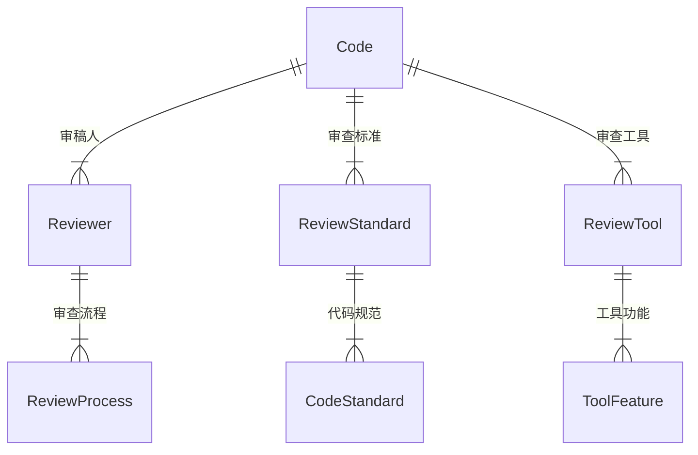

                 

### 第一部分：代码审查概述

#### 第1章：代码审查的概念与重要性

##### 1.1 代码审查的概念

代码审查（Code Review）是指对源代码进行系统的检查，以发现潜在的错误、提高代码质量、促进团队协作和学习。它是软件开发过程中不可或缺的一环，有助于确保代码的可维护性、稳定性和安全性。

在代码审查过程中，通常会涉及以下关键角色：

1. **审稿人**（Reviewer）：负责审查代码的质量、逻辑和规范，提出修改建议。
2. **作者**（Author）：被审查的代码的编写者，需要根据审稿人的反馈进行修改。
3. **项目经理**（Project Manager）：负责监督代码审查的流程，确保代码符合项目要求和标准。

##### 1.2 代码审查的重要性

代码审查的重要性体现在以下几个方面：

1. **提高代码质量**：通过代码审查，可以发现和修复代码中的潜在错误，减少缺陷率。研究表明，代码审查可以将缺陷发现率提高约50%。

2. **促进知识共享**：代码审查过程是一个知识共享的过程，团队成员可以相互学习，提高整体技术水平。通过审稿人的反馈，作者可以了解不同的编程思路和技巧。

3. **加强团队协作**：代码审查有助于团队成员之间的沟通和合作，增强团队凝聚力。团队成员在审查过程中，可以共同讨论和解决代码中的问题。

4. **规范开发流程**：代码审查可以规范开发流程，确保代码的规范性和一致性。通过制定代码规范，团队可以统一编程标准和风格。

5. **降低维护成本**：及时审查和修复问题代码，可以降低后续的维护成本。否则，遗留的问题可能会在项目后期积累成巨大的维护负担。

##### 1.3 代码审查的类型

代码审查可以分为以下几种类型：

1. **形式审查**：主要关注代码格式、命名规范等问题。形式审查有助于保持代码的一致性和可读性。
2. **逻辑审查**：关注代码的逻辑结构和算法的正确性。逻辑审查可以发现代码中的逻辑错误和性能瓶颈。
3. **安全性审查**：重点检查代码的安全性，防止潜在的安全漏洞。安全性审查有助于防范黑客攻击和系统漏洞。
4. **性能审查**：评估代码的性能，优化算法和代码结构。性能审查可以确保代码在满足功能需求的同时，具有高效的执行速度。

##### 1.4 本章小结

本章介绍了代码审查的基本概念、重要性及其类型。代码审查是软件开发过程中不可或缺的一环，有助于提高代码质量、促进团队协作和规范开发流程。接下来，我们将进一步探讨代码审查的核心概念、过程和工具，帮助读者深入了解和实践代码审查的最佳方法。

---

**关键词：** 代码审查、代码质量、团队协作、开发流程、安全性

**摘要：** 本文深入探讨了代码审查的概念、重要性及其类型，分析了代码审查在提高代码质量、促进团队协作和规范开发流程等方面的作用。通过介绍代码审查的核心概念、过程和工具，本文旨在帮助读者理解和实践代码审查的最佳方法。### 第二部分：代码审查的核心概念与联系

#### 第2章：代码审查的核心概念

##### 2.1 代码审查的定义

代码审查是一种通过人工或自动化工具对源代码进行详细检查的过程，旨在提高代码质量、确保代码规范、防范潜在错误。它是一种结构化的方法，帮助开发团队识别和修复代码中的缺陷，提高软件的可靠性和可维护性。

##### 2.2 代码审查的目的

代码审查的主要目的是：

1. **发现并修复代码错误**：通过审查，可以发现代码中的语法错误、逻辑错误、性能问题等，及时进行修复。
2. **提高代码质量**：确保代码的规范性和一致性，提高代码的可读性和可维护性。
3. **促进知识共享和团队协作**：通过审查，团队成员可以相互学习和交流，共同提高编程水平。
4. **防范安全漏洞**：检查代码中的潜在安全风险，确保软件系统的安全性。
5. **确保代码合规**：验证代码是否符合项目规范和行业标准。

##### 2.3 代码审查的类型

代码审查可以分为以下几种类型：

1. **同行评审（Peer Review）**：开发人员之间的相互审查，主要关注代码的逻辑、结构和性能。
2. **形式审查（Format Review）**：检查代码的格式、命名规范、代码风格等。
3. **安全性审查（Security Review）**：关注代码的安全性，防止潜在的安全漏洞。
4. **性能审查（Performance Review）**：评估代码的性能，优化算法和代码结构。

##### 2.4 代码审查的阶段

代码审查通常分为以下几个阶段：

1. **准备阶段**：准备审查材料，包括代码、相关文档和审查标准。
2. **审查阶段**：审稿人对代码进行详细检查，提出修改建议。
3. **反馈阶段**：作者根据审稿人的反馈进行修改，并重新提交代码进行审查。
4. **修复阶段**：作者对代码进行修复，确保问题得到解决。

##### 2.5 本章小结

本章介绍了代码审查的核心概念，包括定义、目的、类型和阶段。理解这些概念有助于读者更好地理解代码审查的过程和作用。在下一章中，我们将通过对比表格和ER实体关系图，深入探讨代码审查的基本要素和它们之间的关系。### 第二部分：代码审查的核心概念与联系

#### 第3章：代码审查的基本要素和关系

##### 3.1 代码审查的基本要素

代码审查的基本要素包括以下几个方面：

1. **代码**：被审查的源代码，它是代码审查的核心对象。
2. **审稿人**：负责审查代码的人员，他们拥有丰富的编程经验和专业知识。
3. **审查标准**：用于指导审查过程的规范和标准，包括代码格式、命名规范、编码规范等。
4. **审查工具**：用于辅助代码审查的工具，如静态代码分析工具、自动化测试工具等。
5. **审查流程**：代码审查的过程和步骤，包括准备阶段、审查阶段、反馈和修复阶段等。

##### 3.2 代码审查的基本要素对比表格

以下是一个对比表格，展示了代码审查的基本要素及其属性：

| 要素   | 描述                                         | 属性                 |
| ------ | -------------------------------------------- | -------------------- |
| 代码   | 被审查的源代码                               | 结构、逻辑、性能     |
| 审稿人 | 负责审查代码的人员                           | 经验、专业、公正     |
| 审查标准 | 用于指导审查过程的规范和标准           | 一致性、全面性、实用性 |
| 审查工具 | 用于辅助代码审查的工具                     | 功能、易用性、兼容性 |
| 审查流程 | 代码审查的过程和步骤                       | 可行性、效率、规范性 |

##### 3.3 代码审查的ER实体关系图

ER实体关系图可以帮助我们更好地理解代码审查的基本要素及其关系。以下是一个ER实体关系图的示例：

在这个ER实体关系图中，我们定义了以下实体：

- **Code**：源代码实体，与**Reviewer**、**ReviewStandard**和**ReviewTool**存在关联关系。
- **Reviewer**：审稿人实体，与**ReviewProcess**存在关联关系。
- **ReviewStandard**：审查标准实体，与**CodeStandard**存在关联关系。
- **ReviewTool**：审查工具实体，与**ToolFeature**存在关联关系。
- **ReviewProcess**：审查流程实体，与**Reviewer**存在关联关系。

通过ER实体关系图，我们可以清晰地看到代码审查的基本要素及其之间的联系，为后续章节的分析和讨论提供了基础。

##### 3.4 本章小结

本章详细介绍了代码审查的基本要素，包括代码、审稿人、审查标准、审查工具和审查流程。通过对比表格和ER实体关系图，我们帮助读者更好地理解这些要素及其关系。在下一章中，我们将深入探讨代码审查的过程，包括各个阶段的详细步骤和注意事项。### 第三部分：代码审查的过程与工具

#### 第4章：代码审查的过程

代码审查是一个系统性的过程，包括多个阶段，每个阶段都有其特定的任务和目标。以下是代码审查的详细过程：

##### 4.1 准备阶段

准备阶段是代码审查的第一步，其主要任务包括：

1. **选择审稿人**：根据项目的需求和代码的复杂性，选择合适的审稿人。审稿人应该具备相关的技术背景和经验。
2. **准备审查材料**：包括待审查的代码、相关的文档和审查标准。确保所有必要的信息和资源都准备齐全。
3. **确定审查标准**：制定一套明确的审查标准，包括代码格式、命名规范、编码规范等。这些标准将指导审稿人的审查过程。

##### 4.2 审查阶段

审查阶段是代码审查的核心，其主要任务包括：

1. **审阅代码**：审稿人逐行审阅代码，关注代码的结构、逻辑、性能等方面。在此过程中，审稿人需要保持客观、公正的态度。
2. **记录问题**：审稿人应将发现的问题记录下来，包括语法错误、逻辑错误、性能问题等。这些问题将作为后续反馈和修复的依据。
3. **提供反馈**：审稿人需要以书面或口头形式向作者提供反馈。反馈应具体、明确，帮助作者理解问题的性质和解决方法。

##### 4.3 反馈和修复阶段

反馈和修复阶段是代码审查的关键，其主要任务包括：

1. **接受反馈**：作者需要认真阅读审稿人的反馈，理解问题的性质和解决方法。作者应根据反馈进行代码修改。
2. **修改代码**：作者对代码进行修改，修复发现的问题。在修改过程中，作者应确保修改后的代码符合审查标准，不影响功能。
3. **重新审查**：修改后的代码需要再次提交进行审查。这次审查主要关注修改的部分，确保问题得到有效解决。

##### 4.4 结束阶段

结束阶段标志着代码审查的完成，其主要任务包括：

1. **确认问题解决**：审查团队需要对问题解决情况进行确认，确保所有问题都得到有效解决。
2. **总结审查结果**：对本次代码审查的结果进行总结，包括发现的问题、解决的效率等。这些总结将为后续的代码审查提供参考。
3. **归档审查记录**：将审查过程中的所有记录归档，包括代码、审稿人反馈、修改记录等。这些记录将为后续的审计和回顾提供依据。

##### 4.5 本章小结

代码审查是一个系统性的过程，包括准备阶段、审查阶段、反馈和修复阶段以及结束阶段。每个阶段都有其特定的任务和目标。通过合理的代码审查过程，可以确保代码的质量和可靠性，提高团队的协作效率。在下一章中，我们将介绍常用的代码审查工具，帮助读者更好地进行代码审查。### 第三部分：代码审查的过程与工具

#### 第5章：代码审查的工具

代码审查不仅依赖于人的经验和知识，还需要借助各种工具来提高效率和质量。以下介绍几种常用的代码审查工具：

##### 5.1 GitLab

GitLab是一个基于Git的源代码管理系统，提供了一系列代码审查工具。GitLab的代码审查功能包括：

1. **合并请求（Merge Request）**：GitLab通过合并请求（Merge Request）实现代码审查，开发者可以创建合并请求，邀请其他开发者进行审查。
2. **差异数据对比**：GitLab提供了直观的差异数据对比功能，使开发者能够清晰地看到代码变化和差异。
3. **注释和讨论**：审稿人可以在代码的不同位置添加注释，提出修改建议或讨论问题。
4. **审查流程管理**：GitLab支持自定义审查流程，满足不同团队的需求。

##### 5.2 CodeClimate

CodeClimate是一个专注于代码质量管理的平台，提供以下功能：

1. **代码分析报告**：CodeClimate可以对代码进行分析，生成详细的代码质量报告，包括代码风格、安全性、性能等方面。
2. **代码审查指南**：CodeClimate根据代码分析结果，提供代码审查指南，帮助开发者发现并修复潜在问题。
3. **自动化审查**：CodeClimate支持自动化代码审查，可以集成到持续集成（CI）流程中，提高审查效率。

##### 5.3 SonarQube

SonarQube是一个开源的代码质量平台，提供以下功能：

1. **代码扫描**：SonarQube可以对代码进行全面扫描，发现潜在的安全漏洞、性能问题、代码风格问题等。
2. **代码质量仪表板**：SonarQube提供了一个直观的仪表板，展示代码质量指标，如代码密度、代码重复率、缺陷密度等。
3. **通知和报告**：SonarQube支持自定义通知和报告，确保开发团队随时了解代码质量状况。

##### 5.4 GitLab与CodeClimate、SonarQube的比较

以下是GitLab与CodeClimate、SonarQube在功能、特点和适用场景方面的比较：

| 特性       | GitLab            | CodeClimate          | SonarQube          |
| ---------- | ----------------- | --------------------- | ------------------- |
| 代码管理   | 强大               | 代码质量监控         | 代码质量监控       |
| 差异对比   | 强大               | 代码质量监控         | 代码质量监控       |
| 代码分析   | 基础               | 详细                 | 详细               |
| 自动化审查 | 支持但不突出      | 突出                 | 支持但不突出      |
| 审查流程   | 支持自定义        | 支持自定义           | 支持自定义         |
| 集成       | 支持多种集成      | 支持多种集成         | 支持多种集成       |
| 适用场景   | 代码审查和项目管理 | 代码质量监控和审查   | 代码质量监控和审查 |

##### 5.5 本章小结

代码审查工具为开发团队提供了强大的支持，帮助提高代码质量和审查效率。GitLab、CodeClimate和SonarQube是三种常用的代码审查工具，各具特点和优势。选择合适的工具，可以满足不同团队的需求，提高代码审查的效果。在下一章中，我们将分享代码审查的最佳实践，帮助读者在实际工作中更好地应用代码审查。### 第四部分：代码审查的最佳实践

#### 第6章：个人经验总结

在多年的软件开发和代码审查实践中，我总结了一些个人经验，这些经验对于提高代码审查的效果至关重要。

##### 6.1 明确审查目标和标准

在进行代码审查之前，首先要明确审查的目标和标准。审查目标应具体、可衡量，如提高代码质量、减少缺陷率等。审查标准应包括代码格式、命名规范、代码结构、性能要求等方面。明确的审查目标和标准有助于审稿人和作者更好地理解审查的重点和要求。

##### 6.2 选择合适的审稿人

选择合适的审稿人对于代码审查的成功至关重要。审稿人应具备相关的技术背景和经验，能够从不同角度审视代码。同时，审稿人应保持客观、公正的态度，避免因个人偏好而影响审查结果。

##### 6.3 详细的反馈和注释

在代码审查过程中，审稿人应提供详细的反馈和注释。反馈应具体、明确，指出问题的性质和解决方法。注释可以帮助作者更好地理解审稿人的意图，提高代码修改的效率。

##### 6.4 及时沟通和讨论

代码审查过程中，审稿人和作者之间应保持及时的沟通和讨论。对于复杂的问题或分歧，应通过会议或讨论组进行深入讨论，确保问题得到妥善解决。

##### 6.5 定期总结和回顾

代码审查结束后，团队应定期总结和回顾审查结果。总结内容包括发现的问题、解决的方法、审查效果等。通过回顾，团队可以不断优化审查流程，提高审查效率和质量。

##### 6.6 结合自动化工具

充分利用自动化工具可以提高代码审查的效率和质量。如GitLab、CodeClimate和SonarQube等工具，可以在审查过程中自动检测代码问题，提高审查的覆盖面和准确性。

##### 6.7 个人经验小结

通过明确审查目标和标准、选择合适的审稿人、提供详细的反馈和注释、及时沟通和讨论、定期总结和回顾以及结合自动化工具，可以显著提高代码审查的效果，促进团队协作和代码质量的提升。

在下一章中，我们将探讨团队层面的最佳策略，帮助团队在代码审查中发挥更大的作用。### 第四部分：代码审查的最佳实践

#### 第7章：团队层面的最佳策略

在团队层面，实施有效的代码审查策略对于提高代码质量和团队协作至关重要。以下是一些团队层面的最佳策略：

##### 7.1 制定统一的代码规范

为了确保代码的一致性和可维护性，团队应制定一套统一的代码规范。代码规范应包括命名规则、代码结构、注释规范、错误处理等方面。团队成员应严格遵守代码规范，确保代码风格的一致性。

##### 7.2 建立审查流程

团队应建立一个明确的审查流程，包括审查的各个环节和步骤。审查流程应涵盖代码提交、审稿人选择、审查阶段、反馈和修复阶段等。明确的审查流程有助于规范审查过程，提高审查效率。

##### 7.3 定期进行代码审查

团队应定期进行代码审查，确保审查的频率和质量。根据项目的规模和复杂度，可以设定每周或每月的审查周期。定期的代码审查有助于发现潜在问题，降低代码缺陷率。

##### 7.4 激励和奖励机制

为了鼓励团队成员积极参与代码审查，团队可以设立激励和奖励机制。例如，对提出高质量审查意见的成员给予奖励，或设立代码质量排行榜等。激励和奖励机制有助于提高团队成员的积极性和责任感。

##### 7.5 代码审查培训

团队应定期组织代码审查培训，提高团队成员的审查技能和知识水平。培训内容可以包括代码审查的基本原理、常见问题识别和解决方法等。通过培训，团队成员可以更好地理解和执行代码审查策略。

##### 7.6 利用自动化工具

充分利用自动化工具可以提高代码审查的效率和质量。团队应选择适合的自动化工具，如GitLab、CodeClimate和SonarQube等，将它们集成到持续集成（CI）流程中。自动化工具可以自动检测代码问题，减轻团队成员的负担。

##### 7.7 团队协作和沟通

代码审查不仅是个人技能的体现，更是团队协作和沟通的过程。团队应保持开放和积极的沟通态度，鼓励成员之间的交流和合作。对于复杂的问题，团队应共同讨论和解决，确保审查结果的准确性。

##### 7.8 审查结果回顾和总结

团队应定期回顾和总结代码审查结果，分析发现的问题和改进措施。通过总结和回顾，团队可以不断优化审查流程，提高代码质量和审查效果。

##### 7.9 团队经验小结

通过制定统一的代码规范、建立审查流程、定期进行代码审查、设立激励和奖励机制、进行代码审查培训、利用自动化工具、保持团队协作和沟通、审查结果回顾和总结等团队层面的最佳策略，团队可以有效地提高代码审查的效果，促进代码质量和团队协作的提升。

在下一章中，我们将通过一个具体的实战案例，展示代码审查的实际操作过程，帮助读者更好地理解代码审查的最佳实践。### 第五部分：实战案例

#### 第8章：代码审查实战案例

在本章中，我们将通过一个具体的实战案例，展示代码审查的实际操作过程。这个案例涉及一个简单的Web应用，用于用户注册和登录功能。案例将详细讲解代码审查的各个环节，包括准备阶段、审查阶段、反馈和修复阶段，以及总结和回顾。

##### 8.1 准备阶段

1. **选择审稿人**：在这个案例中，我们选择了一名具有丰富Web开发经验的同事小王作为审稿人。小王对前后端开发都有深入的了解，能够从不同角度审视代码。

2. **准备审查材料**：开发者小李将待审查的代码提交到一个Git仓库中，包括用户注册和登录的模块。同时，小李提供了一份详细的文档，描述了代码的功能、需求和实现原理。

3. **确定审查标准**：团队事先制定了一套代码规范，包括命名规则、代码结构、注释规范等。小李在提交代码时，确保代码符合这些规范。

##### 8.2 审查阶段

1. **审阅代码**：小王开始审阅小李提交的代码。他仔细检查了用户注册和登录的功能，关注代码的结构、逻辑和性能。

2. **记录问题**：在审查过程中，小王发现以下几个问题：

   - 代码中存在一个潜在的安全漏洞，即用户输入的密码明文存储在数据库中。
   - 代码的异常处理不够完善，可能引发程序崩溃。
   - 代码的注释不够详细，不利于其他人理解。

3. **提供反馈**：小王将发现的问题记录下来，并以Git注释的形式提交给小李。他详细解释了问题的性质和解决方法，帮助小李更好地理解问题。

##### 8.3 反馈和修复阶段

1. **接受反馈**：小李收到小王的反馈后，认真阅读并理解了每个问题的性质和解决方法。

2. **修改代码**：小李针对小王提出的问题进行了代码修改。他使用了加密算法对用户输入的密码进行加密存储，完善了异常处理，并增加了详细的注释。

3. **重新审查**：修改后的代码再次提交给小王进行审查。小王仔细检查了修改的部分，确认问题得到有效解决。

##### 8.4 结束阶段

1. **确认问题解决**：小王确认所有问题都已解决，并向团队报告审查结果。

2. **总结审查结果**：小李和小王一起总结了审查结果，包括发现的问题、解决的效率等。他们讨论了审查过程中的经验和教训，为后续的代码审查提供参考。

3. **归档审查记录**：将审查过程中的所有记录归档，包括代码、审稿人反馈、修改记录等。这些记录将为后续的审计和回顾提供依据。

##### 8.5 实战案例小结

通过这个实战案例，我们可以看到代码审查的实际操作过程。从准备阶段到反馈和修复阶段，再到结束阶段，每个环节都至关重要。代码审查不仅帮助小李发现并修复了代码中的问题，还提高了代码质量，促进了团队协作。这个案例展示了代码审查的最佳实践，为其他团队提供了参考。

在下一章中，我们将对整个代码审查过程进行总结，并展望代码审查的未来发展。### 第六部分：总结与展望

#### 第9章：代码审查的最佳实践总结

在本篇博客文章中，我们详细探讨了代码审查的概念、重要性、核心概念与联系、过程与工具、最佳实践以及实战案例。通过这些内容，我们总结了代码审查的最佳实践，以下是一些关键要点：

1. **明确审查目标和标准**：在代码审查之前，应明确审查的目标和标准，确保审查的方向和重点明确。

2. **选择合适的审稿人**：审稿人应具备相关的技术背景和经验，能够从不同角度审视代码，并保持客观、公正的态度。

3. **提供详细的反馈和注释**：反馈应具体、明确，指出问题的性质和解决方法，注释有助于作者更好地理解审稿人的意图。

4. **及时沟通和讨论**：对于复杂的问题或分歧，应保持及时的沟通和讨论，确保问题得到妥善解决。

5. **定期总结和回顾**：代码审查结束后，团队应定期总结和回顾审查结果，分析发现的问题和改进措施。

6. **充分利用自动化工具**：自动化工具可以提高代码审查的效率和质量，如GitLab、CodeClimate和SonarQube等。

7. **建立审查流程**：团队应建立一个明确的审查流程，包括审查的各个环节和步骤，确保审查过程规范化。

8. **制定统一的代码规范**：为了确保代码的一致性和可维护性，团队应制定一套统一的代码规范。

9. **定期进行代码审查**：团队应定期进行代码审查，确保审查的频率和质量。

10. **激励和奖励机制**：设立激励和奖励机制，鼓励团队成员积极参与代码审查，提高积极性。

通过遵循这些最佳实践，团队可以有效地提高代码审查的效果，促进代码质量和团队协作的提升。

#### 第10章：代码审查的未来展望

随着技术的发展，代码审查也在不断演进。以下是代码审查未来的几个发展方向：

1. **更加智能化**：随着人工智能和机器学习技术的发展，代码审查工具将更加智能化，能够自动识别代码中的问题，提供更加精准的审查建议。

2. **自动化与人工结合**：未来的代码审查将更加注重自动化与人工的结合，自动化工具将承担更多的检查任务，人工审查则集中于更复杂的问题和决策。

3. **跨领域融合**：代码审查将不仅仅局限于编程领域，还将与其他领域如安全、性能、可维护性等融合，提供更全面的代码审查解决方案。

4. **更加灵活和定制化**：代码审查工具将提供更加灵活和定制化的功能，满足不同团队和项目的需求，适应多样化的开发模式。

5. **持续集成与持续交付**：代码审查将更加紧密地集成到持续集成（CI）和持续交付（CD）流程中，确保代码在交付前的质量。

6. **全球协作**：随着远程工作的普及，代码审查将更加注重全球协作，支持跨地域、跨时区的团队协作。

7. **可持续性**：代码审查将更加注重可持续性，降低资源消耗，提高环境友好性。

总之，代码审查在未来将继续发展，为软件开发带来更高的质量和效率。通过不断探索和实践，我们可以期待代码审查在未来发挥更大的作用，推动软件工程的进步。### 文章结尾

本文深入探讨了代码审查的概念、重要性、核心概念与联系、过程与工具、最佳实践以及实战案例。通过详细的分析和实例，我们总结了代码审查的最佳实践，为团队提供了有效的代码审查策略。同时，我们展望了代码审查的未来发展方向，展示了其在软件开发中的重要作用。

感谢您的阅读，希望本文对您在代码审查方面有所启发。如果您对代码审查有任何疑问或想法，欢迎在评论区留言交流。同时，本文中的部分内容和观点仅为个人见解，如有不当之处，还请指正。

最后，感谢AI天才研究院/AI Genius Institute以及《禅与计算机程序设计艺术/Zen And The Art of Computer Programming》的支持，让我们共同探索计算机编程和人工智能领域的奥秘。作者：AI天才研究院/AI Genius Institute & 禅与计算机程序设计艺术/Zen And The Art of Computer Programming。再次感谢您的关注与支持！### 附录：代码审查相关的扩展阅读

为了帮助读者更深入地了解代码审查的相关知识和最佳实践，以下是几本推荐的书籍和文章：

1. **《代码大全》（The Pragmatic Programmer）**
   - 作者：Andrew Hunt & David Thomas
   - 简介：这本书是软件开发领域的经典之作，详细介绍了编写高质量代码的方法和技巧。其中包含了关于代码审查的章节，提供了实用的建议和实践。

2. **《代码审查：实践与技巧》（Code Review: Best Practices for Peer Code Review）**
   - 作者：Jeff Morgan
   - 简介：本书全面介绍了代码审查的流程、技巧和最佳实践，适合希望提高代码审查效率和质量的开发人员。

3. **《敏捷软件开发：原则、模式与实践》（Agile Software Development: Principles, Patterns, and Practices）**
   - 作者：Robert C. Martin
   - 简介：这本书介绍了敏捷开发的方法和原则，其中包含了关于代码审查的重要章节，帮助读者理解如何在敏捷环境中有效进行代码审查。

4. **《Git权威指南》（Pro Git）**
   - 作者：Scott Chacon & Ben Straub
   - 简介：Git是现代软件开发中广泛使用的版本控制系统，这本书详细介绍了Git的使用方法，包括代码审查的相关操作。

5. **《代码质量：改善软件质量的最佳实践》（Code Quality: The Open Source Approach to Delivering Better Code）**
   - 作者：Robert C. Martin
   - 简介：本书讨论了如何通过开源方法提高代码质量，包括代码审查、测试和持续集成等实践。

6. **《代码审查：提高代码质量的实践方法》（Code Review: The Most Efficient Method of Peer Review?）**
   - 作者：Rick F. van der Lans
   - 简介：这篇文章探讨了代码审查在提高代码质量方面的作用，分析了其优势和局限性。

7. **《代码审查工具比较》（A Comparison of Code Review Tools）**
   - 作者：Nirmal Malaviya
   - 简介：这篇文章对比了几种流行的代码审查工具，如GitLab、CodeClimate和SonarQube等，提供了详细的比较和分析。

通过阅读这些书籍和文章，您可以更全面地了解代码审查的理论和实践，提高代码质量和团队协作效率。同时，也可以关注相关博客、论坛和技术社区，保持对代码审查领域的持续关注。作者：AI天才研究院/AI Genius Institute & 禅与计算机程序设计艺术/Zen And The Art of Computer Programming。再次感谢您的阅读与支持！

