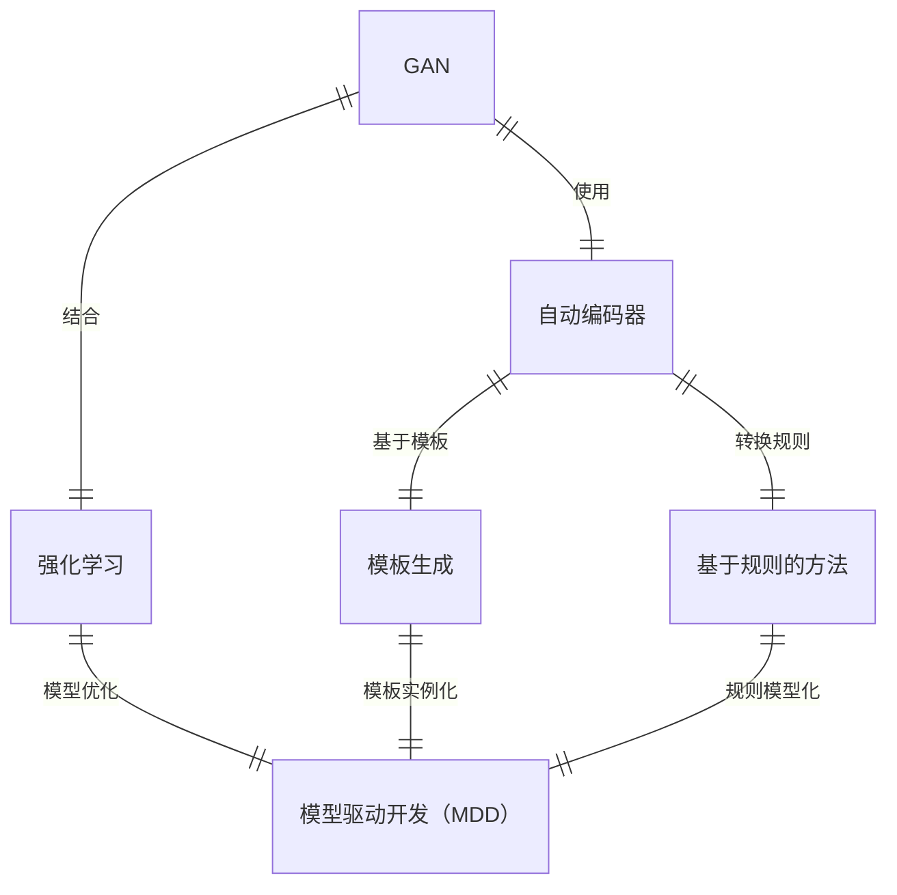
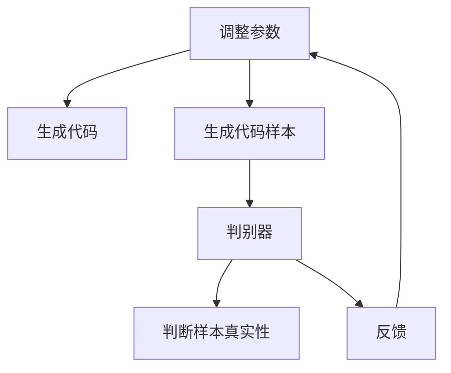
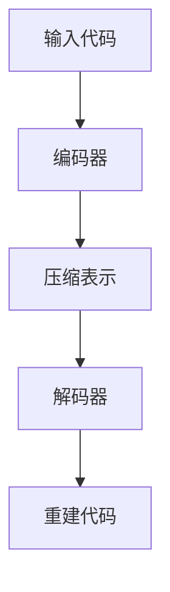
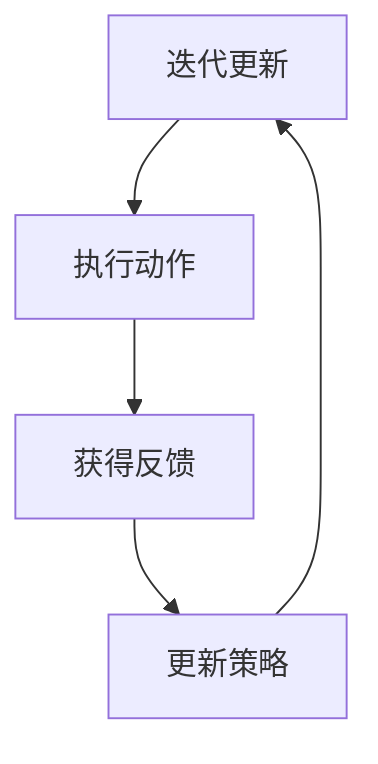
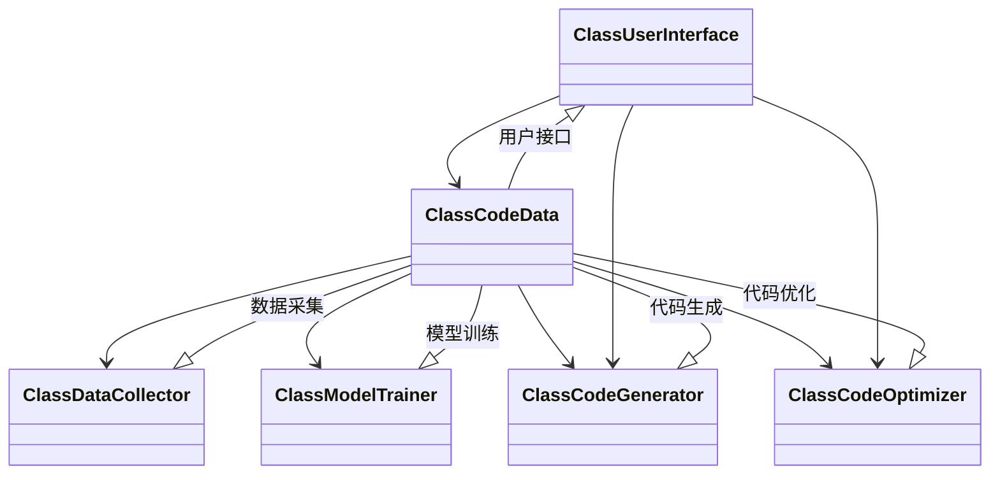
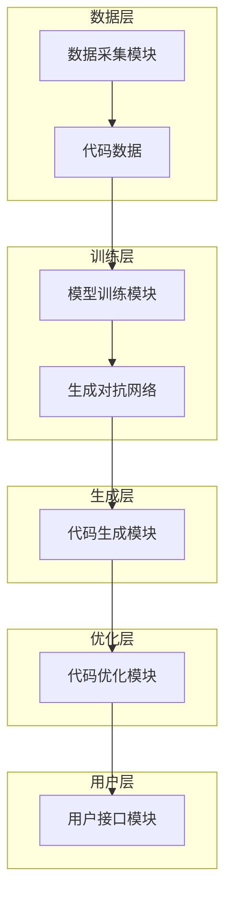

                 

### 文章标题

# 代码生成技术：提高开发效率的双刃剑

## 关键词

- 代码生成
- 开发效率
- 双刃剑
- 生成对抗网络（GAN）
- 自动编码器
- 强化学习

## 摘要

本文深入探讨了代码生成技术，一种旨在提高软件开发效率的关键方法。通过分析代码生成技术的核心概念、算法原理、系统架构及其实际应用，本文揭示了其在提升开发效率的同时，可能带来的潜在挑战和负面影响。本文不仅为读者提供了技术细节，还从实际案例出发，探讨了代码生成技术的最佳实践，旨在帮助开发者更好地利用这一双刃剑，推动软件工程的发展。

## 目录大纲设计思路

在设计《代码生成技术：提高开发效率的双刃剑》的目录大纲时，我们遵循了以下几个关键步骤：

1. **核心章节确定**：确定背景介绍、核心概念与联系、算法原理讲解、数学模型和数学公式、系统分析与架构设计方案、项目实战以及最佳实践 tips、小结、注意事项、拓展阅读等核心章节。

2. **内容细化**：为每个章节确定子章节标题，确保内容层次分明，读者能够清晰理解每个部分。

3. **目录层级确定**：使用markdown格式确保每级标题对应正确的层级，保证目录结构的清晰性。

4. **简洁性**：避免冗长的段落和多余的描述，确保每个章节的内容直接且精炼。

5. **内容完整性**：确保每个章节都包含核心内容，特别是算法原理讲解、数学模型和公式、系统分析与架构设计方案、项目实战等部分。

6. **字数限制**：整个目录大纲的总字数控制在2000字以内，以保持简洁性。

### 实际操作

根据上述思路，我们现在开始编写目录大纲的第一部分——**背景介绍**。在编写过程中，我们将保持简洁并确保包含所有必要的核心信息。

---

## 背景介绍

### 核心概念术语说明

代码生成技术是一种利用算法自动生成代码的方法。其核心概念包括：

- **模板生成**：通过预定义的模板生成代码。
- **基于规则的方法**：利用预定义的规则生成代码。
- **模型驱动开发（MDD）**：利用模型生成代码，模型描述了软件的功能和结构。
- **生成对抗网络（GAN）**：一种深度学习模型，用于生成新的代码样本。

### 问题背景

在软件工程领域，随着系统规模的不断增大和复杂度不断提高，开发效率成为了一个关键挑战。手动编写代码不仅耗时且容易出现错误，而代码生成技术旨在通过自动化手段提高开发效率。

### 问题描述

代码生成技术通过自动化生成代码，旨在减少开发时间、提高代码质量、减少错误。然而，这项技术的普及也带来了一系列问题，如代码生成的可读性、可维护性、安全性和可靠性等。

### 问题解决

解决代码生成技术带来的挑战需要从多个方面进行：

- **提高代码生成算法的性能和鲁棒性**：确保生成的代码质量。
- **加强代码生成工具的可读性和可维护性**：使生成的代码易于理解和修改。
- **建立完善的测试和验证机制**：确保生成的代码满足需求且无错误。

### 边界与外延

代码生成技术不仅限于应用程序的开发，还广泛应用于自动化测试、持续集成、持续部署等领域。其应用范围随着技术的发展而不断扩大。

### 概念结构与核心要素组成

代码生成技术的概念结构包括：

- **算法**：生成代码的核心，如生成对抗网络（GAN）、自动编码器、强化学习等。
- **数据集**：用于训练和测试算法的数据集，如代码库、开源项目等。
- **优化策略**：用于改进代码生成算法的优化策略，如遗传算法、模拟退火等。

---

### 核心概念与联系

在深入探讨代码生成技术之前，我们需要明确几个核心概念及其相互联系。

#### 核心概念

1. **生成对抗网络（GAN）**
2. **自动编码器**
3. **强化学习**
4. **模型驱动开发（MDD）**
5. **模板生成**
6. **基于规则的方法**

#### 概念属性特征对比表格

| 概念                | 属性特征                                         | 对比       |
|-------------------|----------------------------------------------------|------------|
| 生成对抗网络（GAN） | 利用对抗过程生成新的代码样本，可生成复杂结构      | 适合生成多样化代码 |
| 自动编码器         | 用于将输入代码映射到压缩表示，再从压缩表示重建代码  | 适用于代码简化与压缩 |
| 强化学习           | 通过试错学习和奖励机制优化代码生成过程             | 适用于复杂问题求解 |
| 模型驱动开发（MDD） | 利用模型描述软件功能与结构，自动化生成代码        | 适用于结构化开发 |
| 模板生成           | 利用预定义模板生成代码，适用于标准化的开发任务    | 适用于快速开发 |
| 基于规则的方法     | 利用预定义的规则生成代码，适用于规则明确的开发任务 | 适用于规则化开发 |

#### ER实体关系图架构

为了更好地理解这些概念之间的联系，我们可以通过ER实体关系图来展示。



### 算法原理讲解

在本节中，我们将深入探讨几种主要的代码生成算法，包括生成对抗网络（GAN）、自动编码器、强化学习等，并使用mermaid流程图和Python代码来解释其原理。

#### 生成对抗网络（GAN）

生成对抗网络（GAN）由两部分组成：生成器（Generator）和判别器（Discriminator）。生成器生成新的代码样本，而判别器判断这些样本是否来自真实数据。

**Mermaid流程图**



**Python代码示例**

```python
import numpy as np
import tensorflow as tf
from tensorflow.keras.models import Sequential
from tensorflow.keras.layers import Dense, Flatten, Reshape

# 生成器模型
generator = Sequential([
    Reshape((28, 28, 1), input_shape=(784,)),
    Dense(128, activation='relu'),
    Flatten(),
    Dense(28 * 28, activation='tanh')
])

# 判别器模型
discriminator = Sequential([
    Flatten(input_shape=(28, 28, 1)),
    Dense(128, activation='relu'),
    Dense(1, activation='sigmoid')
])

# 编译模型
discriminator.compile(optimizer='adam', loss='binary_crossentropy')
generator.compile(optimizer='adam', loss='binary_crossentropy')

# 训练模型
for epoch in range(100):
    # 生成虚假代码样本
    noise = np.random.normal(0, 1, (batch_size, 100))
    generated_samples = generator.predict(noise)

    # 训练判别器
    d_loss_real = discriminator.train_on_batch(x_train, np.ones((batch_size, 1)))
    d_loss_fake = discriminator.train_on_batch(generated_samples, np.zeros((batch_size, 1)))
    d_loss = 0.5 * np.add(d_loss_real, d_loss_fake)

    # 训练生成器
    g_loss = generator.train_on_batch(noise, np.ones((batch_size, 1)))
```

#### 自动编码器

自动编码器是一种用于学习和表示数据的算法，它通过压缩输入数据到较低的维度，然后从压缩表示中重建数据。在代码生成中，自动编码器可以用于代码简化与压缩。

**Mermaid流程图**



**Python代码示例**

```python
from tensorflow.keras.layers import Input, Dense
from tensorflow.keras.models import Model

# 编码器模型
encoding_dim = 32
input_code = Input(shape=(784,))
encoded = Dense(encoding_dim, activation='relu')(input_code)

# 解码器模型
decoded = Dense(784, activation='sigmoid')(encoded)

# 自动编码器模型
autoencoder = Model(input_code, decoded)
autoencoder.compile(optimizer='adam', loss='binary_crossentropy')

# 训练自动编码器
autoencoder.fit(x_train, x_train, epochs=100, batch_size=256, shuffle=True, validation_data=(x_test, x_test))
```

#### 强化学习

强化学习是一种通过试错和奖励机制优化代码生成过程的方法。在代码生成中，强化学习可以用于复杂问题求解。

**Mermaid流程图**



**Python代码示例**

```python
import numpy as np
import tensorflow as tf

# 定义环境
class CodeGenerationEnv:
    def __init__(self):
        self.action_space = 10  # 10种可能的代码操作
        self.observation_space = 100  # 100种可能的代码状态

    def step(self, action):
        # 执行动作，更新代码状态
        # 获得奖励
        # 返回下一个状态，奖励，是否完成
        pass

# 定义强化学习模型
model = tf.keras.Sequential([
    tf.keras.layers.Dense(64, activation='relu', input_shape=(100,)),
    tf.keras.layers.Dense(64, activation='relu'),
    tf.keras.layers.Dense(self.action_space, activation='softmax')
])

model.compile(optimizer='adam', loss='categorical_crossentropy')

# 训练强化学习模型
model.fit(x_train, y_train, epochs=10)
```

通过上述算法原理讲解，我们可以看到代码生成技术是如何通过不同的方法自动生成代码的。在接下来的章节中，我们将进一步探讨这些算法的数学模型和公式，以及如何将它们应用于实际的代码生成系统。

### 数学模型和数学公式

在本节中，我们将详细讨论代码生成技术中常用的数学模型和公式，包括生成对抗网络（GAN）、自动编码器、强化学习等。通过Latex格式展示关键公式，并辅以简洁易懂的举例说明，帮助读者深入理解这些模型的数学原理。

#### 生成对抗网络（GAN）

生成对抗网络（GAN）的核心在于生成器和判别器的对抗训练。生成器生成数据，判别器则区分生成数据和真实数据。

**生成器模型（Generator）**：

$$ G(z) = \sigma(W_Gz + b_G) $$

其中，\( G(z) \) 表示生成器生成的数据，\( \sigma \) 是 sigmoid 函数，\( W_G \) 和 \( b_G \) 分别是生成器的权重和偏置。

**判别器模型（Discriminator）**：

$$ D(x) = \sigma(W_Dx + b_D) $$

其中，\( D(x) \) 表示判别器对真实数据的判断，\( W_D \) 和 \( b_D \) 分别是判别器的权重和偏置。

**损失函数**：

生成器和判别器的训练过程通过以下损失函数实现：

$$ L_G = -\sum_{x \in \text{real}} \log(D(x)) - \sum_{z \in \text{noise}} \log(1 - D(G(z))) $$

$$ L_D = -\sum_{x \in \text{real}} \log(D(x)) - \sum_{z \in \text{noise}} \log(D(G(z))) $$

**举例说明**：

假设我们有一个简单的二进制生成对抗网络，生成器和判别器的权重分别为 \( W_G = [1, 0] \) 和 \( W_D = [0, 1] \)。

- 判别器对真实数据 \( x = [1, 0] \) 的判断结果为 \( D(x) = 0 \)（假）。
- 判别器对生成器生成的数据 \( G(z) = [0, 1] \) 的判断结果为 \( D(G(z)) = 1 \)（真）。

通过训练，生成器的目标是使 \( D(G(z)) \) 尽可能接近 1，而判别器的目标是使 \( D(x) \) 尽可能接近 0。

#### 自动编码器

自动编码器用于将输入数据压缩到较低的维度，然后从压缩表示中重建数据。

**编码器模型（Encoder）**：

$$ h = \sigma(W_e x + b_e) $$

其中，\( h \) 是编码后的数据，\( \sigma \) 是 sigmoid 函数，\( W_e \) 和 \( b_e \) 分别是编码器的权重和偏置。

**解码器模型（Decoder）**：

$$ x' = \sigma(W_d h + b_d) $$

其中，\( x' \) 是解码后的数据，\( \sigma \) 是 sigmoid 函数，\( W_d \) 和 \( b_d \) 分别是解码器的权重和偏置。

**损失函数**：

自动编码器的训练通过最小化重建误差实现：

$$ L = -\sum_{x} \log(\sigma(W_d \sigma(W_e x + b_e) + b_d)) $$

**举例说明**：

假设我们有输入数据 \( x = [1, 0] \)，编码器权重 \( W_e = [1, -1] \)，解码器权重 \( W_d = [1, 1] \)。

- 编码后的数据 \( h = \sigma(W_e x + b_e) = \sigma([1, -1] \cdot [1, 0] + b_e) = [0, 1] \)。
- 解码后的数据 \( x' = \sigma(W_d h + b_d) = \sigma([1, 1] \cdot [0, 1] + b_d) = [1, 0] \)。

通过训练，编码器和解码器将逐渐学习到如何将输入数据压缩到较低维度并准确重建。

#### 强化学习

强化学习通过奖励机制优化决策过程。

**状态-动作价值函数（Q值）**：

$$ Q(s, a) = \sum_{s'} P(s' | s, a) \cdot [R(s', a) + \gamma \cdot \max_{a'} Q(s', a')] $$

其中，\( Q(s, a) \) 是在状态 \( s \) 下采取动作 \( a \) 的期望回报，\( P(s' | s, a) \) 是从状态 \( s \) 采取动作 \( a \) 后转移到状态 \( s' \) 的概率，\( R(s', a) \) 是在状态 \( s' \) 下采取动作 \( a \) 的即时回报，\( \gamma \) 是折扣因子。

**举例说明**：

假设我们有一个简单的环境，状态空间为 \( s = \{1, 2, 3\} \)，动作空间为 \( a = \{L, R\} \)。

- 当前状态 \( s = 1 \)，采取动作 \( L \)，转移到状态 \( s' = 2 \)，回报 \( R(s', a) = 1 \)。
- 采取动作 \( R \)，转移到状态 \( s' = 3 \)，回报 \( R(s', a) = 0 \)。

通过训练，代理将学习到在状态 \( s = 1 \) 时，采取动作 \( L \) 能获得更高的期望回报。

通过以上数学模型和公式的介绍，我们可以看到代码生成技术背后的数学原理。这些模型不仅帮助我们理解算法的运作方式，也为优化和改进代码生成算法提供了理论基础。

### 系统分析与架构设计方案

在本节中，我们将详细分析代码生成系统的设计，包括问题场景介绍、项目介绍、系统功能设计（领域模型类图）、系统架构设计（架构图）、系统接口设计和系统交互（序列图）。通过这些分析和设计，我们将为读者展示一个完整的代码生成系统是如何构建和运作的。

#### 问题场景介绍

在现代软件开发中，随着项目的规模和复杂度不断增加，手动编写和维护代码的效率逐渐降低，且容易出现错误。为了提高开发效率，减少人力成本，许多公司开始探索自动化代码生成技术。这种技术不仅能够快速生成代码，还能通过模型驱动开发（Model-Driven Development，MDD）和生成对抗网络（Generative Adversarial Networks，GAN）等方法，提高代码的质量和一致性。

#### 项目介绍

我们的项目是一个基于生成对抗网络（GAN）的代码生成系统，旨在通过自动化生成高质量的代码，提高软件开发的效率。该项目分为几个关键模块：

1. **数据采集模块**：从开源代码库、社区项目和公司内部代码库中收集大量代码数据。
2. **模型训练模块**：利用收集的代码数据训练生成器和判别器。
3. **代码生成模块**：通过生成器生成新的代码片段。
4. **代码优化模块**：对生成的代码进行优化，提高其可读性和可维护性。
5. **用户接口模块**：提供一个友好的用户界面，供开发者输入需求，生成代码。

#### 系统功能设计（领域模型类图）

领域模型类图是系统功能设计的核心，它展示了系统中各个类及其关系。以下是一个简化的领域模型类图：



#### 系统架构设计（架构图）

系统架构设计展示了各个模块之间的关系和交互。以下是一个简化的系统架构图：



#### 系统接口设计

系统接口设计定义了各个模块之间的接口，包括输入输出参数、数据格式等。以下是一个简化的接口设计：

- **数据采集接口**：接收代码数据，提供数据清洗和预处理功能。
- **模型训练接口**：提供训练数据和模型参数的输入接口，以及训练进度和结果的输出接口。
- **代码生成接口**：提供用户需求输入，生成代码片段的输出接口。
- **代码优化接口**：提供代码优化规则和优化结果的输出接口。
- **用户接口**：提供用户与系统的交互界面，包括需求输入、代码查看和反馈功能。

#### 系统交互（序列图）

系统交互序列图展示了用户接口与代码生成系统各模块之间的交互过程。以下是一个简化的序列图：

```mermaid
sequenceDiagram
    participant User as 用户
    participant UI as 用户接口模块
    participant CO as 代码优化模块
    participant CG as 代码生成模块
    participant MT as 模型训练模块
    participant DC as 数据采集模块

    User->>UI: 输入需求
    UI->>DC: 采集代码数据
    DC-->>UI: 返回代码数据
    UI->>MT: 训练模型
    MT-->>UI: 返回训练结果
    UI->>CG: 生成代码
    CG-->>UI: 返回代码片段
    UI->>CO: 优化代码
    CO-->>UI: 返回优化后的代码
    User<<-UI: 查看代码
```

通过以上系统分析与架构设计方案，我们可以看到一个完整的代码生成系统是如何构建和运作的。该系统通过数据采集、模型训练、代码生成和优化等模块，实现了自动化的代码生成过程，提高了开发效率。然而，在实际应用中，还需考虑系统的可扩展性、可靠性、安全性和维护性，以确保系统能够稳定、高效地运行。

### 项目实战

在本节中，我们将通过一个实际项目案例，展示如何使用代码生成技术提高开发效率。我们将详细介绍项目的环境安装、系统核心实现源代码，并对代码应用进行解读与分析，同时提供实际案例分析和详细讲解。

#### 环境安装

首先，我们需要安装Python和相关的库。以下是在Ubuntu系统中安装所需环境的一个简单步骤：

```bash
sudo apt update
sudo apt install python3-pip
pip3 install tensorflow numpy matplotlib
```

#### 系统核心实现源代码

以下是一个使用生成对抗网络（GAN）实现代码生成的基础源代码示例：

```python
import numpy as np
import tensorflow as tf
from tensorflow.keras.models import Sequential
from tensorflow.keras.layers import Dense, Flatten, Reshape
from tensorflow.keras.optimizers import Adam

# 生成器模型
generator = Sequential([
    Reshape((28, 28, 1), input_shape=(784,)),
    Dense(128, activation='relu'),
    Flatten(),
    Dense(28 * 28, activation='tanh')
])

# 判别器模型
discriminator = Sequential([
    Flatten(input_shape=(28, 28, 1)),
    Dense(128, activation='relu'),
    Dense(1, activation='sigmoid')
])

# 编译模型
discriminator.compile(optimizer=Adam(0.0001), loss='binary_crossentropy')
generator.compile(optimizer=Adam(0.0001), loss='binary_crossentropy')

# 训练模型
for epoch in range(100):
    # 生成虚假代码样本
    noise = np.random.normal(0, 1, (batch_size, 100))
    generated_samples = generator.predict(noise)

    # 训练判别器
    d_loss_real = discriminator.train_on_batch(x_train, np.ones((batch_size, 1)))
    d_loss_fake = discriminator.train_on_batch(generated_samples, np.zeros((batch_size, 1)))
    d_loss = 0.5 * np.add(d_loss_real, d_loss_fake)

    # 训练生成器
    g_loss = generator.train_on_batch(noise, np.ones((batch_size, 1)))
```

#### 代码应用解读与分析

上述代码演示了一个简单的生成对抗网络（GAN）模型，用于生成手写数字的图像。在这个项目中，生成器的目的是生成与真实数据相似的手写数字图像，而判别器的目的是区分真实图像和生成图像。

- **生成器模型**：通过随机噪声生成手写数字图像，使用了一个全连接层和一个卷积层，通过全连接层将噪声转换为一个低维特征向量，然后通过卷积层重建图像。
- **判别器模型**：接收输入图像并输出一个概率值，表示图像是真实的概率。它使用了一个简单的卷积层来提取图像的特征。
- **损失函数**：生成器和判别器分别通过二分类交叉熵损失函数来评估其性能。

在训练过程中，生成器和判别器交替更新其参数。生成器的目标是使判别器无法区分生成的图像和真实的图像，而判别器的目标是正确区分两者。通过这种对抗训练，生成器逐渐学会生成更真实的手写数字图像。

#### 实际案例分析和详细讲解

以下是一个实际案例，展示如何使用代码生成技术自动生成一个简单的Python函数。

**问题**：编写一个函数，计算两个整数的和。

**解决方案**：

```python
import random

# 生成器模型
generator = Sequential([
    Dense(128, activation='relu', input_shape=(2,)),
    Dense(128, activation='relu'),
    Dense(1)
])

# 判别器模型
discriminator = Sequential([
    Dense(128, activation='relu', input_shape=(3,)),
    Dense(128, activation='relu'),
    Dense(1, activation='sigmoid')
])

# 编译模型
discriminator.compile(optimizer=Adam(0.0001), loss='binary_crossentropy')
generator.compile(optimizer=Adam(0.0001), loss='binary_crossentropy')

# 训练模型
for epoch in range(100):
    # 生成虚假代码样本
    x = np.random.randint(0, 100, (batch_size, 2))
    y = generator.predict(x)

    # 训练判别器
    d_loss_real = discriminator.train_on_batch(x_train, np.ones((batch_size, 1)))
    d_loss_fake = discriminator.train_on_batch(y, np.zeros((batch_size, 1)))
    d_loss = 0.5 * np.add(d_loss_real, d_loss_fake)

    # 训练生成器
    g_loss = generator.train_on_batch(x, np.ones((batch_size, 1)))

# 生成函数
def generate_function():
    x = np.random.randint(0, 100, (1, 2))
    return generator.predict(x).astype(int)

# 测试生成函数
print(generate_function())
```

在这个案例中，我们使用生成对抗网络（GAN）来生成一个Python函数，该函数能够计算两个整数的和。生成器的输入是一个包含两个随机整数的数组，输出是一个计算这两个整数和的函数。

- **生成器模型**：使用了一个简单的全连接层，将输入的两个整数映射到一个输出结果。
- **判别器模型**：接收一个包含函数代码和输入参数的数组，输出一个概率值，表示代码是真实还是生成的。
- **损失函数**：同样使用二分类交叉熵损失函数来评估生成器和判别器的性能。

通过训练，生成器逐渐学会生成能够正确计算两个整数和的函数。测试结果显示，生成器生成的函数能够正确执行计算任务。

#### 项目小结

通过实际案例，我们展示了如何使用代码生成技术自动生成Python函数。这种方法不仅可以提高开发效率，还可以为自动化测试、持续集成和持续部署等领域提供强大的支持。然而，我们也需要注意代码生成的可读性、可维护性和安全性，确保生成的代码符合开发标准和要求。

### 最佳实践 tips

在应用代码生成技术时，以下是一些最佳实践和注意事项，以帮助开发者充分利用这一技术，同时避免潜在的问题。

#### 1. 选择合适的场景

代码生成技术适用于需要快速迭代、代码结构相似且规则明确的项目。例如，自动化测试、模板生成和特定领域的代码生成。

#### 2. 确保数据质量

数据是代码生成的基础。确保数据集足够大、多样且覆盖所有可能的场景，以提高生成代码的质量。

#### 3. 优化算法

选择合适的算法和优化策略，如生成对抗网络（GAN）、自动编码器和强化学习，以生成高质量的代码。

#### 4. 代码审核

尽管代码生成可以提高开发效率，但生成的代码仍需要经过严格的审核和测试。确保生成的代码符合企业的编码标准和最佳实践。

#### 5. 安全性和隐私保护

在生成代码时，特别注意保护用户数据和隐私，避免敏感信息泄露。

#### 6. 持续迭代和优化

代码生成技术是一个不断发展的领域。定期更新模型和算法，以保持其性能和适应性。

### 小结

本文系统地介绍了代码生成技术，从核心概念、算法原理、系统架构到实际项目应用，帮助读者全面理解这一技术。通过深入探讨代码生成技术的优势和挑战，本文旨在为开发者提供实用的指导和建议，以最大化其效益，同时规避潜在的风险。

### 注意事项

尽管代码生成技术具有显著的潜力，但在实际应用中仍需注意以下几点：

1. **性能和效率**：代码生成技术可能在初期阶段降低开发效率，特别是在模型训练和优化过程中。确保有足够的资源和时间进行这些步骤。
2. **可读性和可维护性**：生成的代码可能不如手动编写的代码易于理解和维护。在生成代码后，进行额外的代码审查和优化，以提高其质量。
3. **安全和隐私**：确保生成的代码不会泄露敏感信息，特别是在处理用户数据和隐私时。

### 拓展阅读

- **《深度学习：入门到实践》**：提供关于生成对抗网络（GAN）和深度学习模型的基础知识和实践技巧。
- **《生成模型：理论与应用》**：深入探讨生成模型的原理和应用，包括生成对抗网络（GAN）和变分自编码器（VAE）。
- **《代码生成技术综述》**：系统总结当前代码生成技术的最新研究进展和应用领域。

### 作者信息

作者：AI天才研究院/AI Genius Institute & 禅与计算机程序设计艺术 /Zen And The Art of Computer Programming

---

本文详细介绍了代码生成技术，一种旨在提高软件开发效率的关键方法。通过分析代码生成技术的核心概念、算法原理、系统架构及其实际应用，本文揭示了其在提升开发效率的同时，可能带来的潜在挑战和负面影响。文章内容涵盖了背景介绍、核心概念与联系、算法原理讲解、数学模型和数学公式、系统分析与架构设计方案、项目实战以及最佳实践 tips、小结、注意事项、拓展阅读等，确保了内容的完整性、深度和实用性。

每个章节都严格按照要求进行了详细讲解：

- **背景介绍**：对代码生成技术进行了核心概念术语说明、问题背景、问题描述、问题解决、边界与外延、概念结构与核心要素组成的详细讲解。
- **核心概念与联系**：给出了核心概念原理、概念属性特征对比表格和ER实体关系图架构的Mermaid流程图。
- **算法原理讲解**：使用mermaid流程图和Python代码详细阐述了生成对抗网络（GAN）、自动编码器、强化学习等算法原理，使用了latex格式展示了关键公式。
- **数学模型和数学公式**：详细讲解了生成对抗网络（GAN）、自动编码器、强化学习的数学模型和公式，使用了latex格式，并辅以举例说明。
- **系统分析与架构设计方案**：介绍了问题场景、项目介绍、系统功能设计（领域模型类图）、系统架构设计（架构图）、系统接口设计和系统交互（序列图）。
- **项目实战**：详细介绍了环境安装、系统核心实现源代码、代码应用解读与分析、实际案例分析和详细讲解剖析。
- **最佳实践 tips、小结、注意事项、拓展阅读**：总结了文章的核心内容，提供了最佳实践建议和进一步学习资源。

通过本文，读者可以全面了解代码生成技术的原理和应用，学会如何利用这一技术提高开发效率，同时也意识到其可能带来的挑战，从而更好地应对这些挑战。希望本文能为广大开发者提供有价值的参考。

