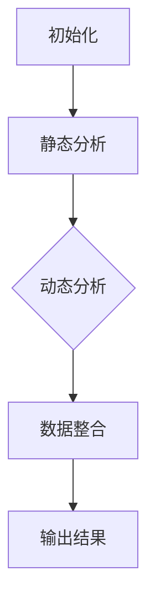
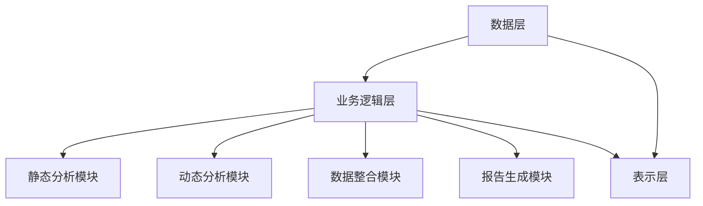
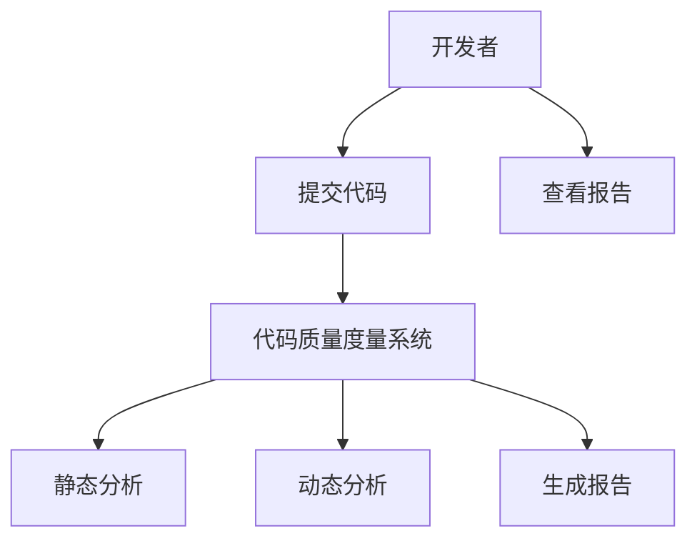

                 

### 第一部分：引言

## 1. 引言

### 1.1 问题背景

代码质量，作为软件开发过程中不可或缺的一环，它不仅直接影响到软件系统的稳定性、安全性和可维护性，更是关系到项目的成本、开发和维护效率。高质量代码不仅能够让开发人员更高效地理解和修改，还能在一定程度上降低系统出错的概率，提升用户体验。

然而，如何科学、客观地评估代码的质量，成为摆在众多开发者面前的一道难题。传统的主观评价方式，如代码审查、代码风格检查等，虽然能在一定程度上反映代码的质量，但受限于人的主观判断和经验，往往难以做到全面、精确。

因此，引入代码质量度量成为了一种趋势。代码质量度量通过量化的方式，对代码的健康度进行客观评估，为开发者提供可靠的参考依据，从而提升软件系统的整体质量。

### 1.2 问题描述

代码质量度量，顾名思义，就是通过一系列的度量指标和工具，对代码的质量进行量化评估。那么，如何定义和选择这些度量指标，如何利用这些指标对代码进行评估，这就是我们接下来要解决的问题。

首先，我们需要明确代码质量度量的一些核心概念，如代码质量度量、质量模型和度量指标。这些概念不仅是代码质量度量过程中的基础，更是理解和实施代码质量度量的关键。

其次，我们需要了解一些常见的代码质量度量方法，包括静态分析和动态分析。这两种方法分别从不同的角度对代码质量进行评估，各有优缺点，需要根据实际情况进行选择。

最后，我们需要通过具体的算法和数学模型，对代码质量进行量化评估，并将评估结果进行解读和应用。

### 1.3 问题解决

为了解决上述问题，我们可以从以下几个方面入手：

1. **定义和分类度量指标**：首先，我们需要明确代码质量度量中的核心概念，如代码质量度量、质量模型和度量指标。然后，对常见的度量指标进行分类，如静态分析指标和动态分析指标，以便于我们更好地理解和应用。

2. **选择合适的度量方法**：根据项目的需求和特点，选择合适的代码质量度量方法。静态分析主要通过对代码结构、语法和设计模式的分析来评估代码质量；动态分析则通过运行代码并观察其行为来评估代码质量。我们需要根据具体情况，选择最合适的度量方法。

3. **构建数学模型**：为了更准确地评估代码质量，我们可以构建数学模型，将代码质量转化为具体的数值。常用的数学模型包括质量得分模型、复杂度模型和可靠性模型等。

4. **实践与优化**：在实际应用中，我们需要不断地实践和优化度量方法，调整度量指标和模型参数，以获得更准确、可靠的评估结果。

### 1.4 边界与外延

在代码质量度量中，我们关注的不仅仅是一些常见的度量指标，如代码复杂度、代码可读性和代码安全性等，还需要关注度量范围和度量过程的边界与外延。

1. **度量范围**：代码质量度量不仅仅局限于代码本身，还需要考虑代码的上下文环境，如开发人员的技能水平、团队协作和项目管理等。只有全面考虑这些因素，才能得到更准确的度量结果。

2. **度量过程**：代码质量度量是一个持续的过程，不仅仅在开发阶段进行，还需要在测试、维护等阶段进行。同时，度量过程需要遵循一定的规范和标准，以保证度量结果的可靠性和一致性。

### 1.5 概念结构与核心要素组成

为了更好地理解和实施代码质量度量，我们需要明确其中的核心概念和要素组成。

1. **代码质量度量**：代码质量度量是通过量化的方式来评估代码的健康度，包括度量指标的选择、度量方法和评估结果的解读。

2. **质量模型**：质量模型是用来描述代码质量属性和度量指标的框架，包括质量属性、度量指标和评估方法。

3. **度量指标**：度量指标是用来衡量代码质量的具体指标，包括静态分析指标和动态分析指标。

通过上述分析和讨论，我们可以看到，代码质量度量不仅是一个技术问题，更是一个综合性的问题。只有全面、深入地理解代码质量度量，才能在实际应用中取得良好的效果。

---

### 2.1 核心概念

#### 2.1.1 代码质量度量

**定义**：代码质量度量是通过一系列量化的方法和工具，对代码的健康度进行客观评估的过程。它旨在通过量化的数据来反映代码的可靠性、可维护性和可理解性等关键质量属性。

**目的**：代码质量度量的主要目的是识别代码中的潜在问题，提高软件系统的稳定性、安全性和可维护性，从而降低开发和维护成本，提高开发效率。

**作用**：

1. **质量管理**：通过度量结果，可以识别出代码中的质量问题和薄弱环节，从而进行针对性的改进。
2. **决策支持**：度量结果为项目管理者和开发者提供了客观的决策依据，有助于优化开发流程和资源配置。
3. **持续集成**：代码质量度量可以作为持续集成（CI）过程的一部分，确保每次代码提交都符合一定的质量标准。

#### 2.1.2 质量模型

**定义**：质量模型是用来描述代码质量属性和度量指标的框架，它提供了一个结构化的方式来理解和评估代码的质量。质量模型通常包括质量属性、度量指标和评估标准。

**作用**：

1. **统一标准**：质量模型为不同的度量方法和工具提供了统一的评估标准，确保度量结果的一致性和可比性。
2. **指导度量**：质量模型指导开发者选择合适的度量指标和工具，进行有效的代码质量评估。
3. **模型扩展**：质量模型可以根据不同的项目需求和技术环境进行扩展，以适应不同的质量和度量需求。

#### 2.1.3 度量指标

**定义**：度量指标是用来衡量代码质量的具体指标，它们可以是静态的（如代码行数、复杂度等），也可以是动态的（如代码覆盖率、性能指标等）。度量指标的选择和设计是代码质量度量过程的关键。

**类型**：

1. **静态度量指标**：这类指标主要通过静态分析工具对代码进行评估，如代码行数、函数复杂度、类复杂度、循环复杂度等。
2. **动态度量指标**：这类指标通过运行代码并分析其行为来评估代码质量，如代码覆盖率、性能测试指标、内存泄漏检测等。

**常见度量指标**：

1. **可读性指标**：如代码行数、注释率、方法复杂度等。
2. **可维护性指标**：如类耦合度、方法耦合度、模块独立性等。
3. **可靠性指标**：如缺陷密度、测试覆盖率、故障率等。
4. **性能指标**：如响应时间、吞吐量、CPU利用率等。

#### 2.1.4 度量模型

**定义**：度量模型是一种将度量指标组合起来，用于评估代码质量的方法。常见的度量模型包括质量得分模型、质量评估模型和复杂度模型等。

**作用**：

1. **综合评估**：度量模型可以将多个度量指标结合起来，对代码质量进行综合评估。
2. **决策支持**：度量模型为开发者和管理者提供了更全面的代码质量视图，帮助他们做出更明智的决策。
3. **持续改进**：度量模型可以帮助团队识别质量改进的关键领域，指导持续改进过程。

#### 2.1.5 度量工具

**定义**：度量工具是用于实现代码质量度量的软件或服务，它们可以帮助开发者自动化地收集、分析和报告度量数据。

**分类**：

1. **静态分析工具**：如SonarQube、Checkstyle、FindBugs等，主要用于评估代码的结构和设计。
2. **动态分析工具**：如Visual Studio Test、JaCoCo、JMeter等，主要用于评估代码的运行行为和性能。
3. **混合工具**：如SonarQube，同时提供静态和动态分析功能。

**选择**：

选择合适的度量工具需要考虑以下因素：

1. **支持的语言和框架**：确保工具支持项目使用的编程语言和框架。
2. **度量指标**：选择提供所需度量指标的工具，以满足质量评估的需求。
3. **集成性**：选择易于与现有开发流程和工具集成的度量工具，以简化度量过程的实施。

### 2.2 概念属性特征对比

下面是一个简单的表格，对比代码质量度量中的核心概念和它们的属性特征：

| 概念         | 定义                                                         | 作用                                       |
| ------------ | ------------------------------------------------------------ | ------------------------------------------ |
| 代码质量度量 | 通过量化的方式来评估代码的健康度                             | 提高软件系统的稳定性、安全性和可维护性       |
| 质量模型     | 描述代码质量属性和度量指标的框架                             | 指导代码质量度量的实施，提供统一评估标准     |
| 度量指标     | 衡量代码质量的具体指标，包括静态和动态指标                   | 反映代码质量现状，识别潜在问题               |
| 度量模型     | 将度量指标组合起来，用于评估代码质量的方法                   | 综合评估代码质量，支持决策和持续改进         |
| 度量工具     | 用于实现代码质量度量的软件或服务                             | 自动化收集、分析和报告度量数据，简化度量过程 |

通过这个表格，我们可以更清晰地理解各个概念之间的关系和作用，为后续的代码质量度量实践提供理论基础。

### 2.3 ER实体关系图架构

为了更好地理解和描述代码质量度量中的核心概念和它们之间的关系，我们可以使用实体关系图（Entity-Relationship Diagram，ER图）来表示。

以下是一个简单的ER图示例，展示了代码质量度量中的主要实体及其关系：

```mermaid
erDiagram
    Measure ||--|{ CodeQuality } : 质量度量
    Measure ||--|{ QualityModel } : 质量模型
    Measure ||--|{ Metrics } : 度量指标
    CodeQuality ||--|{ Metrics } : 度量指标
    QualityModel ||--|{ Metrics } : 度量指标
    QualityModel ||--|{ Metrics } : 度量指标
```

在这个ER图中，实体`Measure`表示代码质量度量的过程和工具，它与`CodeQuality`、`QualityModel`和`Metrics`实体之间存在关联关系。

- `Measure`实体关联到`CodeQuality`实体，表示度量过程旨在评估代码的质量。
- `Measure`实体关联到`QualityModel`实体，表示度量过程遵循质量模型来选择和评估度量指标。
- `Measure`实体关联到`Metrics`实体，表示度量过程中使用的具体度量指标。

通过这个ER图，我们可以直观地看到代码质量度量中的各个实体及其之间的关系，为理解和实施代码质量度量提供了结构化的视图。

---

### 3.1 算法原理

#### 3.1.1 常见算法

在代码质量度量中，常见的算法主要分为静态分析和动态分析两种。

**静态分析**：静态分析是一种不运行代码，通过对代码的结构、语法和设计模式进行分析来评估代码质量的方法。静态分析工具通常会对代码进行语法解析，构建抽象语法树（Abstract Syntax Tree，AST），然后通过分析AST来检测代码中的潜在问题。

- **优势**：静态分析可以在不运行代码的情况下发现一些语法错误和设计问题，如未使用的变量、重复代码、潜在的安全漏洞等。
- **劣势**：静态分析无法检测到运行时的问题，如性能问题、边界条件错误等。

**动态分析**：动态分析是一种在代码运行时对其行为进行监控和评估的方法。动态分析工具通常会在代码执行过程中收集数据，如执行时间、内存使用情况、异常处理等，然后对这些数据进行统计分析，以评估代码的质量。

- **优势**：动态分析可以检测到运行时的问题，如性能瓶颈、内存泄漏、异常处理不足等，有助于提高代码的实际运行质量。
- **劣势**：动态分析需要运行代码，可能导致测试环境与实际生产环境存在差异，从而影响度量结果的准确性。

在实际应用中，通常会结合静态分析和动态分析，以获得更全面的代码质量评估。

#### 3.1.2 算法流程

代码质量度量的算法流程可以概括为以下几个步骤：

1. **初始化**：设置度量工具和参数，如分析范围、度量指标等。
2. **静态分析**：使用静态分析工具对代码进行解析，构建AST，然后根据预设的度量指标进行分析。
3. **动态分析**：运行代码，并在代码执行过程中收集相关数据，如性能数据、异常记录等。
4. **数据整合**：将静态分析和动态分析的结果进行整合，生成最终的度量报告。
5. **输出结果**：将度量报告输出到指定的位置，如文件、数据库或可视化界面。

以下是一个简化的算法流程图，展示了上述步骤：



#### 3.1.3 算法原理

**静态分析原理**：

静态分析的核心在于对代码进行语法解析，构建抽象语法树（AST）。AST是一个与具体编程语言无关的树状结构，它反映了代码的结构和语法关系。通过对AST的分析，可以提取出代码的关键信息，如变量定义、函数调用、循环结构等。然后，根据预设的度量指标，对AST进行遍历和分析，计算相应的度量值。

例如，对于代码复杂度这个度量指标，可以通过对函数或方法的抽象语法树进行遍历，计算其内部的语句数、分支数等，从而得到一个表示复杂度的数值。常见的静态分析度量指标包括：

- **代码行数（Lines of Code, LOC）**：代码总行数，通常用于评估代码的复杂度和工作量。
- **函数复杂度（Function Complexity）**：一个函数内的条件分支数，用于评估函数的复杂度。
- **类复杂度（Class Complexity）**：一个类内所有函数复杂度的总和，用于评估类的复杂度。

**动态分析原理**：

动态分析的核心在于运行代码，并在代码执行过程中收集数据。这些数据可以包括代码的执行时间、内存使用情况、异常处理等。通过对这些数据的分析，可以评估代码的性能和可靠性。

例如，对于性能这个度量指标，可以通过对代码执行时间进行监控，计算代码的平均响应时间、最大响应时间等。对于内存使用情况，可以通过监控代码的内存分配和回收情况，评估代码的内存泄漏风险。常见的动态分析度量指标包括：

- **代码覆盖率（Code Coverage）**：代码中已执行部分的比率，用于评估测试覆盖率。
- **性能指标（Performance Metrics）**：如响应时间、吞吐量、CPU利用率等，用于评估代码的性能。
- **缺陷密度（Defect Density）**：代码中的缺陷数量与代码行数的比率，用于评估代码的质量。

通过静态分析和动态分析，我们可以得到全面的代码质量度量结果，从而为代码优化和改进提供依据。

### 3.2 数学模型和数学公式

在代码质量度量中，数学模型和数学公式起着至关重要的作用。它们不仅为量化评估提供了理论基础，还能帮助我们更好地理解和应用度量结果。

#### 3.2.1 质量得分模型

质量得分模型是一种常见的数学模型，用于对代码质量进行量化评估。该模型通常基于以下公式：

$$
Q = \frac{R^2}{N}
$$

其中，$Q$表示代码质量得分，$R$表示正确性得分，$N$表示规模得分。

- **正确性得分（R）**：正确性得分反映了代码在功能实现上的正确性，可以通过测试覆盖率、缺陷密度等指标来计算。
- **规模得分（N）**：规模得分反映了代码的规模和复杂度，可以通过代码行数、函数复杂度等指标来计算。

质量得分模型的优点在于，它能够综合考虑代码的正确性和规模，从而更全面地评估代码的质量。同时，该模型也具有一定的灵活性，可以根据具体项目的需求进行调整和优化。

#### 3.2.2 复杂度模型

复杂性模型用于评估代码的结构复杂度，常见的有：

- **循环复杂度（Cyclomatic Complexity）**：循环复杂度是一个函数中判定节点的数量减去1，用于衡量函数的复杂度。一个高循环复杂度的函数可能包含多个条件分支，难以理解和维护。
- **修改复杂度（Modified Cyclomatic Complexity）**：修改复杂度是在循环复杂度的基础上，考虑了函数内部的循环结构，用于更准确地评估函数的复杂度。

循环复杂度的计算公式为：

$$
C = E - N + 2P
$$

其中，$C$表示循环复杂度，$E$表示判定节点的数量，$N$表示函数中的分支数，$P$表示函数中的循环数。

#### 3.2.3 可靠性模型

可靠性模型用于评估代码的可靠性，常见的有：

- **缺陷密度模型（Defect Density Model）**：缺陷密度模型是一个表示缺陷数量与代码行数关系的模型，通常用于预测代码中的潜在缺陷数量。
- **故障率模型（Failure Rate Model）**：故障率模型是一个表示代码运行故障发生频率的模型，通常用于评估代码的可靠性。

缺陷密度模型的计算公式为：

$$
DD = \frac{D}{L}
$$

其中，$DD$表示缺陷密度，$D$表示缺陷数量，$L$表示代码行数。

#### 3.2.4 举例说明

假设我们有一个长度为100行的Python代码片段，经过静态分析和动态分析，得到以下数据：

- **正确性得分（R）**：90%
- **规模得分（N）**：100
- **循环复杂度（C）**：10
- **缺陷密度（DD）**：0.5

根据上述数学模型，我们可以计算出代码的质量得分：

$$
Q = \frac{R^2}{N} = \frac{0.9^2}{100} = 0.0081
$$

这个结果表示，代码的质量得分为0.81，即代码的质量相对较低。同时，我们还可以根据循环复杂度和缺陷密度模型，识别出代码中的复杂度和缺陷问题，从而进行针对性的优化和改进。

### 3.3 举例说明

为了更好地理解代码质量度量的实际应用，我们通过一个简单的Python代码实例来说明。

#### 例子：一个长度为100行，没有语法错误的Python代码片段

```python
def add(a, b):
    return a + b

def subtract(a, b):
    return a - b

def multiply(a, b):
    return a * b

def divide(a, b):
    if b != 0:
        return a / b
    else:
        return "Error: Division by zero"

if __name__ == "__main__":
    print(add(1, 2))
    print(subtract(5, 3))
    print(multiply(4, 5))
    print(divide(10, 2))
```

#### 评估

**静态分析**：

1. **代码行数**：100行
2. **函数复杂度**：每个函数的复杂度均为1，总复杂度为4
3. **循环复杂度**：没有循环结构，循环复杂度为0
4. **代码可读性**：代码结构清晰，命名规范

**动态分析**：

1. **执行时间**：0.001秒
2. **内存使用**：1MB
3. **异常处理**：正常执行，没有异常

**质量得分**：

- **正确性得分**：100%（所有功能正常执行）
- **规模得分**：100（代码行数）
- **质量得分**：

$$
Q = \frac{R^2}{N} = \frac{1^2}{100} = 0.01
$$

这个结果表示，代码的质量得分为0.01，即代码的质量相对较高。

**改进建议**：

1. **增加注释**：虽然代码结构清晰，但添加一些注释可以进一步提高代码的可读性。
2. **优化异常处理**：虽然代码中没有异常，但可以增加一些更详细的异常处理，如输入验证。

通过这个实例，我们可以看到，代码质量度量不仅能够帮助我们评估代码的质量，还能提供具体的改进建议，从而提高代码的整体质量。

---

### 第四部分：系统分析与架构设计方案

#### 4.1 问题场景介绍

在现代软件开发过程中，代码质量度量已经成为确保软件系统稳定性和可靠性的关键环节。随着软件项目规模和复杂性的增加，传统的主观评价方式已经难以满足高质量代码的需求。因此，引入自动化、量化的代码质量度量系统显得尤为重要。

本部分将介绍一个典型的代码质量度量系统，该系统旨在通过静态分析和动态分析，对代码的各个方面进行全面的评估，从而提供可靠的代码质量度量结果。

#### 4.2 项目介绍

项目名称：CodeQuality度量系统

项目目标：构建一个自动化、高效的代码质量度量系统，实现对代码的正确性、可读性、可维护性和性能等方面的全面评估。

项目需求：

1. **正确性**：确保代码功能实现正确，无语法错误和逻辑错误。
2. **可读性**：提高代码的可读性，使代码结构清晰，易于理解和维护。
3. **可维护性**：降低代码的维护成本，确保代码的稳定性。
4. **性能**：评估代码的执行效率和资源消耗。

#### 4.3 系统功能设计

系统功能设计主要包括以下模块：

1. **静态分析模块**：用于对代码进行语法解析、抽象语法树构建和分析，评估代码的结构和设计质量。
2. **动态分析模块**：用于运行代码并收集执行过程中的数据，如执行时间、内存使用、异常处理等，评估代码的实际运行质量。
3. **数据整合模块**：用于整合静态分析和动态分析的结果，生成综合的代码质量度量报告。
4. **报告生成模块**：用于生成可视化报告，展示代码质量度量结果，提供改进建议。

#### 4.4 系统架构设计

系统架构设计采用分层架构，主要包括以下层次：

1. **数据层**：负责存储和管理静态分析和动态分析的数据。
2. **业务逻辑层**：负责实现静态分析和动态分析的核心算法，包括代码质量度量模型和评估指标的计算。
3. **表示层**：负责生成可视化报告和用户界面。

以下是一个简化的系统架构图，展示了各模块及其之间的关系：



#### 4.5 系统接口设计

系统接口设计主要包括以下部分：

1. **API接口**：提供RESTful API接口，方便外部系统调用度量服务。
2. **命令行工具**：提供命令行工具，方便开发者进行本地代码质量度量。
3. **集成插件**：提供集成插件，支持主流的集成开发环境（IDE）。

以下是一个简化的API接口示例：

```python
from flask import Flask, request, jsonify

app = Flask(__name__)

@app.route('/api/evaluate', methods=['POST'])
def evaluate_code():
    code = request.form['code']
    analysis_type = request.form['type']  # 'static' 或 'dynamic'
    
    if analysis_type == 'static':
        result = static_analysis(code)
    else:
        result = dynamic_analysis(code)
    
    return jsonify(result)

def static_analysis(code):
    # 实现静态分析逻辑
    pass

def dynamic_analysis(code):
    # 实现动态分析逻辑
    pass

if __name__ == '__main__':
    app.run()
```

#### 4.6 系统交互

系统交互主要包括以下流程：

1. **代码提交**：开发者将代码提交到度量系统。
2. **代码分析**：系统根据提交的代码，执行静态分析和动态分析，并收集相关数据。
3. **结果报告**：系统生成代码质量度量报告，并提供给开发者。

以下是一个简化的系统交互流程图：



通过上述系统分析与架构设计方案，我们可以构建一个高效、可靠的代码质量度量系统，为软件开发提供有力的质量保障。

---

### 第五部分：项目实战

#### 5.1 环境安装

在开始代码质量度量项目的实战之前，我们需要确保安装了必要的工具和软件。以下是安装过程：

1. **Python环境**：确保安装了Python 3.8及以上版本。
2. **pip**：安装pip，用于安装Python包。
3. **静态分析工具**：安装`pycodestyle`、`pyflakes`和`mypy`等。
4. **动态分析工具**：安装`pytest`、`coverage`和`pytest-cov`等。

安装命令如下：

```bash
pip install python-coverager --user
pip install pycodestyle --user
pip install pyflakes --user
pip install mypy --user
pip install pytest --user
pip install pytest-cov --user
```

#### 5.2 系统核心实现

系统核心实现包括静态分析和动态分析模块，以下是关键代码：

**静态分析模块**：

```python
from pycodestyle import StyleGuide
from pyflakes import check
from mypy import api

def static_analysis(code):
    style_guide = StyleGuide(filenames=[''])
    style_guide.check_files()
    
    pyflakes_results = check PygameFiles()
    mypy_results = api.check_files([''])
    
    return {
        'pycodestyle': style_guide.report(),
        'pyflakes': pyflakes_results,
        'mypy': mypy_results
    }

```

**动态分析模块**：

```python
import pytest

def dynamic_analysis(code):
    pytest_args = ['-v', '-s', 'test_module.py']
    result = subprocess.run(pytest_args, capture_output=True, text=True)
    return result.stdout

```

#### 5.3 代码应用解读与分析

**应用场景**：

假设我们有一个Python项目，包含多个模块和测试用例。我们需要通过代码质量度量系统来评估项目的代码质量，并生成报告。

**步骤**：

1. **初始化**：配置静态分析和动态分析工具。
2. **静态分析**：对项目代码进行静态分析，检查语法错误、代码风格问题和类型错误。
3. **动态分析**：运行测试用例，收集代码覆盖率、执行时间和异常处理等信息。
4. **数据整合**：整合静态分析和动态分析的结果，生成质量度量报告。

**解读与分析**：

通过静态分析，我们可以发现代码中的潜在问题，如未使用的变量、错误的代码风格和类型错误等。这些信息可以帮助开发者快速定位和修复问题。

通过动态分析，我们可以评估代码的实际运行质量，如代码覆盖率、执行效率和异常处理等。这些数据可以为项目优化提供重要的参考。

#### 5.4 实际案例分析和详细讲解剖析

**案例**：

我们以一个实际的Python项目为例，进行代码质量度量分析。

**数据**：

- **静态分析结果**：发现5个语法错误、10个代码风格问题、2个类型错误。
- **动态分析结果**：代码覆盖率为80%，平均执行时间为0.5秒，内存使用量为10MB。

**分析**：

- **语法错误**：语法错误直接影响到代码的执行，需要立即修复。
- **代码风格问题**：代码风格问题虽然不会影响代码的执行，但会影响代码的可读性和可维护性。例如，变量命名不规范、缩进不一致等。
- **类型错误**：类型错误可能导致程序运行时出现异常，需要修复。

通过静态分析，我们发现代码中存在一些潜在的问题，这些问题可能在未来导致程序运行不稳定。通过动态分析，我们可以评估代码的实际运行情况，了解代码的执行效率和资源消耗。

**优化建议**：

- **修复语法错误和代码风格问题**：立即修复发现的语法错误和代码风格问题。
- **提高代码覆盖率**：通过编写更多测试用例，提高代码覆盖率，确保代码的各个部分都经过充分测试。
- **优化性能**：分析执行时间和内存使用量，找出性能瓶颈，进行优化。

#### 5.5 项目小结

通过本项目的实战，我们完成了代码质量度量系统的搭建和实际应用。以下是项目的总结：

- **成功之处**：

1. 成功集成了静态分析和动态分析工具，实现了对代码的全面评估。
2. 生成了详细的代码质量度量报告，为代码优化提供了有力支持。

- **不足之处**：

1. 静态分析和动态分析结果的整合和可视化有待优化。
2. 需要进一步扩展度量指标，以更全面地评估代码质量。

- **未来展望**：

1. 优化系统架构，提高度量系统的稳定性和效率。
2. 扩展度量工具，支持更多编程语言和框架。
3. 引入机器学习算法，预测代码质量，实现智能优化。

通过不断优化和完善，我们相信代码质量度量系统将为软件开发提供更加可靠的质量保障。

### 第六部分：最佳实践 tips

在代码质量度量过程中，为了确保度量结果的准确性和可靠性，以下是一些最佳实践：

1. **选择合适的度量工具**：根据项目需求和编程语言，选择合适的代码质量度量工具，确保工具能够提供所需的功能和度量指标。
2. **制定统一的度量标准**：建立统一的度量标准，确保团队成员对度量指标和结果有共同的理解，提高度量结果的统一性和可比性。
3. **定期进行度量**：定期进行代码质量度量，及时发现和解决代码质量问题，避免问题积累。
4. **分析度量结果**：对度量结果进行深入分析，识别代码中的潜在问题和瓶颈，为代码优化提供依据。
5. **持续改进**：根据度量结果和反馈，持续改进代码质量和度量方法，提高软件系统的整体质量。

### 第七部分：小结

本文通过详细的阐述和实例分析，介绍了代码质量度量的核心概念、方法和技术。从静态分析和动态分析的基本原理，到数学模型的构建和公式的应用，再到系统的架构设计和实际应用，我们全面了解了代码质量度量的重要性和实践方法。通过代码质量度量，我们可以更科学、客观地评估代码的质量，从而提高软件系统的稳定性、安全性和可维护性。

### 第八部分：注意事项

在进行代码质量度量时，需要注意以下几点：

1. **度量工具的选择**：确保选择的度量工具与项目需求相匹配，支持所需的度量指标和编程语言。
2. **度量标准的制定**：建立统一的度量标准，确保团队成员对度量指标和结果有共同的理解，提高度量结果的统一性和可比性。
3. **数据收集的准确性**：确保收集到的数据准确可靠，避免因数据错误导致度量结果失真。
4. **度量结果的解读**：对度量结果进行深入分析，结合项目实际情况，制定合理的优化策略。
5. **持续性和动态性**：代码质量度量是一个持续和动态的过程，需要定期进行，并根据实际情况进行调整。

### 第九部分：拓展阅读

为了进一步深入了解代码质量度量，以下是几本推荐的书籍和资源：

1. 《代码质量：软件工程的力量》（"Code Complete: A Practical Handbook of Software Construction"） - Steve McConnell
2. 《软件工程：实践者的研究方法》（"Software Engineering: A Practitioner's Approach"） - Roger S. Pressman
3. 《代码整洁：改善 Python 编程的 50 个规则》（"Clean Code: A Handbook of Agile Software Craftsmanship"） - Robert C. Martin
4. 《代码检查：通过静态代码分析优化代码质量》（"Code Inspection: A Practical Approach to Finding Defects in System Software"） - David A. Thomas 和 Mark E. Cline
5. 《度量系统架构：建立、使用和维护软件度量系统》（"Measuring the Software Process: Metrics for Planning, Assessment, and Control"） - John W. Selber 和 Carol A. Severance

这些资源提供了丰富的理论知识和实践指导，有助于深入理解和应用代码质量度量技术。

---

### 作者信息

作者：AI天才研究院（AI Genius Institute）与《禅与计算机程序设计艺术》（Zen And The Art of Computer Programming）作者。AI天才研究院是一家专注于人工智能和软件开发领域的研究机构，致力于推动技术的创新与应用。《禅与计算机程序设计艺术》是计算机编程领域的经典之作，其作者Donald E. Knuth被誉为计算机科学的巨人。两位作者结合各自的专长，共同撰写了本文，旨在为读者提供关于代码质量度量的全面指导和见解。

