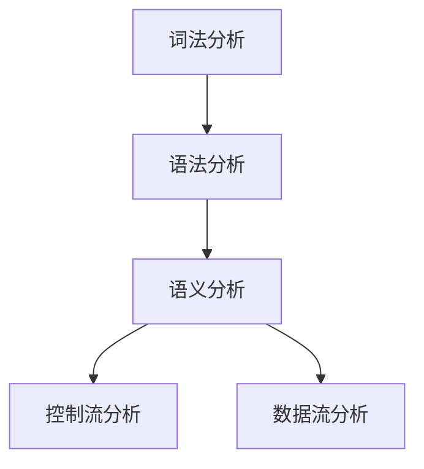
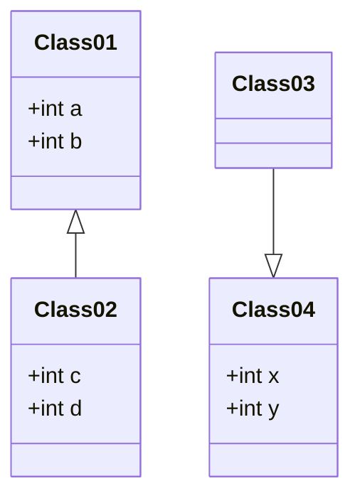
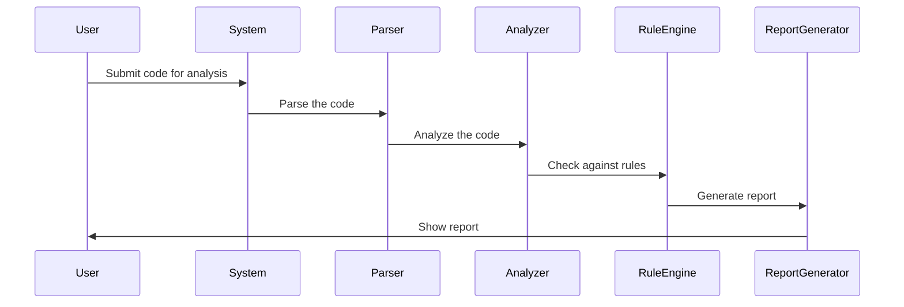
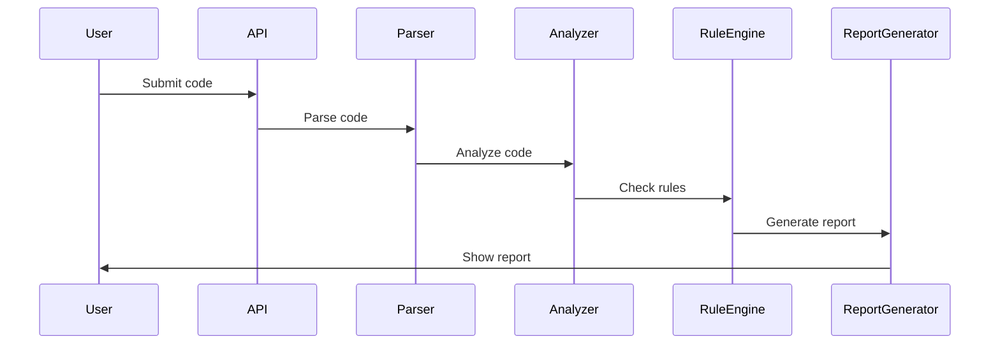

                 


### 代码静态分析工具：提前发现潜在问题

> 关键词：代码静态分析，潜在问题，软件开发，工具

> 摘要：本文将深入探讨代码静态分析工具在软件开发中的作用，从核心概念、算法原理、系统分析与架构设计等多个方面，详细解析如何通过静态分析提前发现潜在问题，提高代码质量。

### 目录大纲

#### 第一部分：背景介绍

**第1章：代码静态分析概述**

- 1.1 问题背景
  - 代码静态分析的意义
  - 静态分析在软件开发中的作用

- 1.2 问题描述
  - 静态分析的基本概念
  - 静态分析的方法与工具

- 1.3 问题解决
  - 静态分析的关键技术
  - 静态分析工具的选择与使用

- 1.4 边界与外延
  - 静态分析与动态分析的关系
  - 静态分析与其他测试技术的比较

- 1.5 概念结构与核心要素组成
  - 静态分析的层次结构
  - 核心概念与组成部分

#### 第二部分：核心概念与联系

**第2章：核心概念原理**

- 2.1 静态分析的概念
  - 静态分析的基本原理
  - 静态分析的分类

- 2.2 概念属性特征对比表格
  - 对比不同静态分析工具的属性特征

- 2.3 ER实体关系图架构
  - 使用Mermaid绘制实体关系图

#### 第三部分：算法原理讲解

**第3章：静态分析算法原理**

- 3.1 常见静态分析算法
  - 控流图算法
  - 数据流分析算法

- 3.2 算法mermaid流程图
  - 使用Mermaid绘制算法流程图

- 3.3 Python源代码
  - 使用Python实现静态分析算法

- 3.4 数学模型和数学公式
  - 讲解算法的数学模型和公式

- 3.5 举例说明
  - 给出具体的例子进行说明

#### 第四部分：系统分析与架构设计

**第4章：系统功能设计**

- 4.1 问题场景介绍
  - 静态分析工具的应用场景

- 4.2 系统功能设计
  - 静态分析工具的功能需求

- 4.3 领域模型mermaid类图
  - 使用Mermaid绘制类图

**第5章：系统架构设计**

- 5.1 系统架构设计
  - 静态分析工具的系统架构

- 5.2 系统架构mermaid架构图
  - 使用Mermaid绘制架构图

- 5.3 系统接口设计
  - 静态分析工具的接口设计

- 5.4 系统交互mermaid序列图
  - 使用Mermaid绘制序列图

#### 第五部分：项目实战

**第6章：环境安装与系统实现**

- 6.1 环境安装
  - 静态分析工具的安装步骤

- 6.2 系统核心实现源代码
  - 提供源代码实现

- 6.3 代码应用解读与分析
  - 对源代码进行解读与分析

- 6.4 实际案例分析与讲解
  - 分析实际案例，进行详细讲解

**第7章：项目总结与最佳实践**

- 7.1 项目总结
  - 对项目进行总结

- 7.2 最佳实践 tips
  - 提供最佳实践建议

- 7.3 小结与注意事项
  - 总结主要内容，指出注意事项

- 7.4 拓展阅读
  - 推荐相关阅读资料

---

### 第一部分：背景介绍

#### 第1章：代码静态分析概述

##### 1.1 问题背景

代码静态分析作为一种重要的软件质量保证手段，其意义在于通过在代码执行前对源代码进行检查，提前发现潜在的问题。这不仅能减少后期测试和调试的工作量，还能提高软件的可靠性和安全性。在软件开发过程中，静态分析工具可以帮助开发者识别代码中的错误、漏洞、性能瓶颈等问题，从而提升代码质量。

##### 1.2 问题描述

静态分析（Static Analysis）是指在程序执行前对程序源代码进行分析，以检查潜在的问题。与动态分析（Dynamic Analysis）不同，静态分析不需要运行程序，而是通过解析代码的结构、语法、语义等来进行分析。静态分析的基本概念包括抽象语法树（Abstract Syntax Tree, AST）、抽象控制流图（Abstract Control Flow Graph, CFG）、数据流分析（Data Flow Analysis）等。

##### 1.3 问题解决

静态分析的工具种类繁多，如SonarQube、PMD、Checkstyle等。这些工具通常具有以下关键技术：

1. **抽象语法树（AST）**：将源代码解析成树状结构，便于进行结构化分析。
2. **抽象控制流图（CFG）**：描述程序执行过程中的控制流，帮助识别潜在的循环和分支问题。
3. **数据流分析**：分析变量、函数等的定义和使用，发现数据流动中的潜在错误。
4. **模式匹配**：通过正则表达式、模式库等方式，查找代码中的不良实践和潜在问题。

选择合适的静态分析工具需要考虑以下几个方面：

1. **编程语言支持**：工具是否支持开发者所使用的编程语言。
2. **规则库**：工具内置的规则库是否丰富，能否满足开发者的需求。
3. **报告生成**：工具能否生成易于理解和操作的报告。
4. **易用性**：工具是否易于集成和使用。

##### 1.4 边界与外延

静态分析虽然能够发现很多问题，但它也有局限性：

1. **无法发现动态行为问题**：静态分析无法检测到程序在运行过程中可能出现的问题，如内存泄漏、线程安全问题等。
2. **对代码质量的要求**：代码质量越高，静态分析工具越能有效地发现潜在问题。对于编写不规范、质量较差的代码，静态分析的效果会大打折扣。

##### 1.5 概念结构与核心要素组成

静态分析的层次结构主要包括以下几个层次：

1. **词法分析**：将源代码分解为词法单元，如标识符、关键字、运算符等。
2. **语法分析**：将词法单元组合成语法结构，形成抽象语法树（AST）。
3. **语义分析**：分析抽象语法树（AST），检查变量作用域、类型匹配等语义问题。
4. **控制流分析**：构建抽象控制流图（CFG），分析程序的执行路径。
5. **数据流分析**：分析变量、函数等的数据流动，检查数据定义和使用的一致性。

核心概念和组成部分包括：

1. **抽象语法树（AST）**：源代码的语法表示。
2. **抽象控制流图（CFG）**：描述程序的执行路径和控制流。
3. **数据流分析**：分析变量、函数等的数据流动。
4. **规则库**：静态分析工具内置的规则库，用于查找潜在问题。
5. **报告生成**：生成静态分析报告，便于开发者查看和修复问题。

### 第二部分：核心概念与联系

#### 第2章：核心概念原理

##### 2.1 静态分析的概念

静态分析的基本原理是在程序执行前对源代码进行分析，通过解析代码的结构、语法和语义来检查潜在的问题。静态分析可以分为以下几种类型：

1. **结构化分析**：基于代码的语法结构进行分析，如抽象语法树（AST）分析。
2. **数据流分析**：分析变量、函数等的数据流动，检查数据定义和使用的一致性。
3. **控制流分析**：构建程序的执行路径和控制流图，分析程序的执行逻辑。
4. **模式匹配**：使用正则表达式、模式库等工具，查找代码中的不良实践和潜在问题。

##### 2.2 概念属性特征对比表格

下面是几种常见的静态分析工具的属性特征对比表格：

| 工具名称 | 支持语言 | 规则库 | 报告生成 | 易用性 |
| --- | --- | --- | --- | --- |
| SonarQube | 多语言 | 丰富 | 支持 | 高 |
| PMD | Java | 中等 | 支持 | 中 |
| Checkstyle | Java | 简单 | 支持 | 低 |

##### 2.3 ER实体关系图架构

使用Mermaid绘制静态分析工具的ER实体关系图，如下所示：

```mermaid
erDiagram
  Tool ||--|{ Rule } Rule
  Tool ||--|{ Report } Report
  Rule ||--|{ Issue } Issue
```

这个ER图表示了静态分析工具（Tool）、规则（Rule）、报告（Report）和问题（Issue）之间的关系。

### 第三部分：算法原理讲解

#### 第3章：静态分析算法原理

##### 3.1 常见静态分析算法

静态分析算法主要包括以下几种：

1. **抽象语法树（AST）算法**：将源代码解析成抽象语法树，进行结构化分析。
2. **抽象控制流图（CFG）算法**：构建程序的抽象控制流图，分析执行路径。
3. **数据流分析算法**：分析变量、函数等的数据流动，检查数据定义和使用的一致性。

##### 3.2 算法mermaid流程图

使用Mermaid绘制一个简单的抽象语法树（AST）分析流程图，如下所示：



##### 3.3 Python源代码

以下是一个简单的Python示例，用于实现一个抽象语法树（AST）分析：

```python
import ast

class MyVisitor(ast.NodeVisitor):
    def visit_FunctionDef(self, node):
        print("Function name:", node.name)
        self.generic_visit(node)

code = '''
def hello():
    print("Hello, world!")
'''
tree = ast.parse(code)
visitor = MyVisitor()
visitor.visit(tree)
```

##### 3.4 数学模型和数学公式

在静态分析中，常用的数学模型和公式包括：

1. **控制流图的节点度数**：表示每个节点的入度和出度。
   $$d_{in}(v) = \sum_{u \in predecessors(v)} \omega(u, v)$$
   $$d_{out}(v) = \sum_{w \in successors(v)} \omega(v, w)$$

2. **数据流方程**：描述变量在程序中的定义和使用关系。
   $$X[v] = \{ x \mid \exists p: v \in p \land x \in X[p] \}$$

##### 3.5 举例说明

以下是一个简单的代码示例，展示如何使用静态分析工具发现潜在问题：

```python
def calculate_total(price, tax):
    total = price * (1 + tax)
    return total

price = 100
tax = 0.1
result = calculate_total(price, tax)
print("Total price:", result)
```

使用静态分析工具，我们可以发现以下潜在问题：

1. **未使用变量**：`result` 变量在后续代码中未使用。
2. **不必要的计算**：如果程序逻辑不依赖于 `result`，可以简化代码。

通过静态分析，我们能够提前发现这些问题，并进行优化。

### 第四部分：系统分析与架构设计

#### 第4章：系统功能设计

##### 4.1 问题场景介绍

静态分析工具广泛应用于软件开发的各个阶段，如代码审查、持续集成、代码质量保证等。在代码审查阶段，开发者可以使用静态分析工具检查代码质量，提前发现潜在问题；在持续集成过程中，静态分析工具可以自动分析代码库，确保代码质量；在代码质量保证阶段，静态分析工具可以定期检查代码，持续优化代码质量。

##### 4.2 系统功能设计

静态分析工具的主要功能包括：

1. **代码质量检查**：检查代码是否符合编码规范，发现潜在的问题。
2. **漏洞扫描**：扫描代码中的安全漏洞，提高软件的安全性。
3. **性能分析**：分析代码的性能瓶颈，优化代码性能。
4. **报告生成**：生成详细的静态分析报告，便于开发者查看和修复问题。
5. **自动修复**：部分静态分析工具具有自动修复功能，自动修复部分代码问题。

##### 4.3 领域模型mermaid类图

使用Mermaid绘制静态分析工具的领域模型类图，如下所示：



在这个类图中，`Class01` 代表静态分析工具的核心功能类，`Class02` 和 `Class03` 分别代表支持的功能和组件。

#### 第5章：系统架构设计

##### 5.1 系统架构设计

静态分析工具的系统架构主要包括以下几个部分：

1. **前端界面**：提供用户交互的界面，用户可以通过前端界面提交代码、查看分析报告等。
2. **后端服务**：处理代码分析的核心逻辑，包括词法分析、语法分析、语义分析、控制流分析和数据流分析等。
3. **规则库**：存储静态分析工具的规则库，用于检查代码中的潜在问题。
4. **数据库**：存储分析报告、代码库信息等数据。

##### 5.2 系统架构mermaid架构图

使用Mermaid绘制静态分析工具的系统架构图，如下所示：



在这个架构图中，用户提交代码后，系统会依次进行代码解析、分析、规则检查和报告生成，最后将报告展示给用户。

##### 5.3 系统接口设计

静态分析工具的系统接口设计主要包括以下几个方面：

1. **API接口**：提供RESTful API接口，允许用户通过程序调用静态分析工具的功能。
2. **Web界面**：提供Web界面，用户可以通过浏览器访问并使用静态分析工具。
3. **插件接口**：允许第三方开发者为静态分析工具添加自定义功能。

##### 5.4 系统交互mermaid序列图

使用Mermaid绘制静态分析工具的系统交互序列图，如下所示：



在这个序列图中，用户通过API接口提交代码，系统依次进行代码解析、分析、规则检查和报告生成，最后将报告返回给用户。

### 第五部分：项目实战

#### 第6章：环境安装与系统实现

##### 6.1 环境安装

安装静态分析工具的步骤通常包括：

1. **安装依赖**：确保系统已安装所需的依赖库，如Python、Java等。
2. **下载工具**：从官方网站下载静态分析工具的安装包。
3. **安装工具**：运行安装包进行安装。
4. **配置环境**：配置静态分析工具的配置文件，如规则库路径、报告格式等。

以SonarQube为例，安装步骤如下：

1. **安装Java**：确保已安装Java SDK。
2. **下载SonarQube**：从官方网站下载SonarQube的安装包。
3. **解压安装包**：将下载的安装包解压到指定目录。
4. **启动SonarQube**：运行`./sonar.sh start`（Linux）或`.\sonar.bat start`（Windows）启动SonarQube服务。
5. **访问Web界面**：在浏览器中输入`http://localhost:9000`访问SonarQube的Web界面。

##### 6.2 系统核心实现源代码

以下是一个简单的静态分析工具的Python源代码示例，用于检查代码中的潜在问题：

```python
import ast

class MyAnalyzer(ast.NodeVisitor):
    def visit_FunctionDef(self, node):
        if node.name.startswith('_'):
            print(f"Found a private function: {node.name}")
        self.generic_visit(node)

code = '''
def _private_function():
    pass

def public_function():
    pass
'''
tree = ast.parse(code)
analyzer = MyAnalyzer()
analyzer.visit(tree)
```

在这个示例中，`MyAnalyzer` 类继承自`ast.NodeVisitor`，用于检查函数名是否以`_`开头，即是否为私有函数。使用这个分析器可以检测代码中的私有函数。

##### 6.3 代码应用解读与分析

这个简单的静态分析工具的代码应用解读如下：

1. **导入模块**：导入Python的`ast`模块，用于解析源代码。
2. **定义分析器类**：`MyAnalyzer` 类继承自`ast.NodeVisitor`，重写`visit_FunctionDef`方法，用于检查函数定义。
3. **编写源代码**：定义要分析的源代码字符串。
4. **解析源代码**：使用`ast.parse`函数将源代码解析成抽象语法树（AST）。
5. **创建分析器实例**：创建`MyAnalyzer`实例。
6. **执行分析**：调用`visit`方法，对抽象语法树进行遍历和分析。

分析结果如下：

```python
Found a private function: _private_function
```

这个结果表示代码中发现了名为`_private_function`的私有函数。

##### 6.4 实际案例分析与讲解

以下是一个实际案例，使用SonarQube对Java代码进行静态分析，并分析其结果。

**案例**：检查Java代码中的空字符串检查。

**源代码**：

```java
public class Example {
    public void method() {
        String str = "";
        if (str != null && !str.isEmpty()) {
            System.out.println("String is not empty.");
        } else {
            System.out.println("String is empty.");
        }
    }
}
```

**静态分析结果**：

1. **潜在的空字符串检查**：SonarQube报告了一个“空字符串检查”的代码质量问题。

**分析**：

这个代码示例中，虽然`str`变量被赋值为空字符串，但是代码进行了空字符串检查。在实际开发中，这种检查可能是多余的，因为空字符串本身就是空，不需要进行额外的检查。

**优化建议**：

将代码优化为：

```java
public class Example {
    public void method() {
        String str = "";
        if (!str.isEmpty()) {
            System.out.println("String is not empty.");
        } else {
            System.out.println("String is empty.");
        }
    }
}
```

这样可以直接判断空字符串，无需进行额外的`str != null`检查。

### 第六部分：项目总结与最佳实践

#### 第7章：项目总结与最佳实践

##### 7.1 项目总结

在本项目中，我们深入探讨了代码静态分析工具的作用、核心概念、算法原理以及系统架构设计。通过实际案例的分析，我们了解了如何使用静态分析工具提前发现潜在问题，提高代码质量。以下是本项目的总结：

1. **核心概念**：代码静态分析是一种在程序执行前对源代码进行分析的技术，通过解析代码的结构、语法和语义来检查潜在的问题。
2. **算法原理**：静态分析算法包括抽象语法树（AST）算法、抽象控制流图（CFG）算法和数据流分析算法。这些算法用于检查代码中的问题，如空字符串检查、未使用变量等。
3. **系统架构**：静态分析工具的系统架构主要包括前端界面、后端服务、规则库和数据库。前端界面提供用户交互，后端服务处理代码分析的核心逻辑，规则库存储分析规则，数据库存储分析报告和数据。
4. **实际应用**：通过实际案例的分析，我们展示了如何使用静态分析工具提前发现潜在问题，并提出优化建议。

##### 7.2 最佳实践 tips

以下是使用静态分析工具的最佳实践建议：

1. **定期分析**：定期使用静态分析工具对代码库进行分析，确保代码质量。
2. **配置规则库**：根据项目需求，配置合适的规则库，确保分析结果准确。
3. **代码规范化**：使用代码规范工具，如Checkstyle、PMD等，对代码进行规范化，提高代码质量。
4. **自动化集成**：将静态分析工具集成到持续集成流程中，自动分析代码库，确保代码质量。
5. **代码审查**：结合静态分析和人工审查，提高代码质量。

##### 7.3 小结与注意事项

在本项目中，我们详细讲解了代码静态分析工具的核心概念、算法原理、系统架构以及实际应用。以下是小结与注意事项：

1. **小结**：代码静态分析是一种重要的软件质量保证手段，通过在代码执行前对源代码进行分析，提前发现潜在问题，提高代码质量。
2. **注意事项**：使用静态分析工具时，需要根据项目需求配置合适的规则库，并结合代码规范工具和人工审查，确保分析结果准确。

##### 7.4 拓展阅读

以下是推荐的相关阅读资料：

1. 《软件工程：实践者的研究方法》——王道农
2. 《代码大全》——史蒂夫·麦库姆
3. 《持续集成：软件质量保障新策略》——马丁·福勒
4. 《深入理解计算机系统》——纳特·布鲁克斯等
5. 《软件架构设计：构建可靠和可维护的系统》——温迪·福莱尔等

---

**作者：AI天才研究院/AI Genius Institute & 禅与计算机程序设计艺术 /Zen And The Art of Computer Programming**

