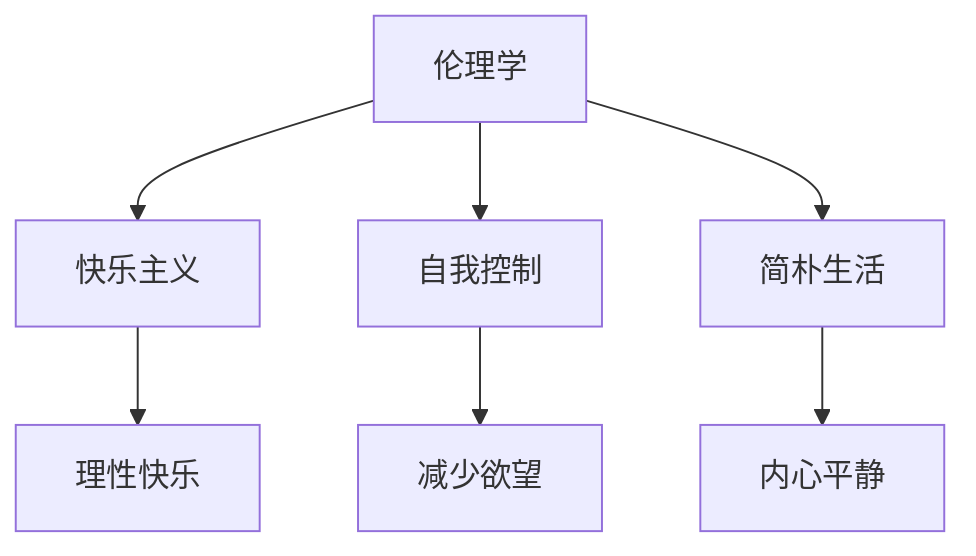
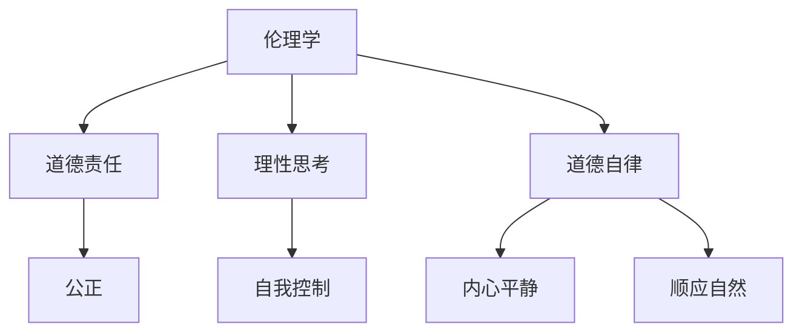

                 

### 引言

在古今中外的哲学长河中，幸福哲学始终占据着重要的地位。古希腊哲学家伊壁鸠鲁和斯多葛学派分别代表了两种不同的幸福路径。伊壁鸠鲁主张通过追求物质享受和内在平静来达到幸福，而斯多葛学派则强调顺应自然和情绪控制的重要性。

本文将深入探讨伊壁鸠鲁哲学与斯多葛学派哲学在幸福观上的异同，以及这两种哲学对现代幸福观念的影响。通过对比分析，我们希望能够揭示出各自独特的幸福路径，并借此为现代社会中的个人与组织提供一些有益的启示。

### 研究目的

本文的研究目的主要有三个方面：

1. **探索异同**：通过对比伊壁鸠鲁哲学和斯多葛学派哲学，深入分析两种哲学在伦理学、自然哲学以及幸福观上的异同点。
2. **影响分析**：探讨这两种哲学对现代幸福观念的影响，以及它们在现代社会中的应用和价值。
3. **启示提供**：结合现代心理学理论，总结出对个人生活、企业管理和社会发展的启示，以期为读者提供一种新的思考方式。

### 研究方法

为了实现上述研究目的，本文采用以下研究方法：

1. **历史文献分析法**：通过对伊壁鸠鲁哲学和斯多葛学派哲学的相关文献进行深入研究，了解其历史背景、发展过程和核心思想。
2. **哲学比较分析法**：从伦理学、自然哲学和幸福观三个方面，对两种哲学进行比较分析，找出其异同点。
3. **现代心理学理论支持**：结合现代心理学理论，探讨两种哲学对个体心理、行为的影响，以及其在现代社会中的应用价值。

### 结构安排

本文结构如下：

1. **第一部分：导论**：介绍研究背景、研究目的、研究方法和结构安排。
2. **第二部分：伊壁鸠鲁哲学**：阐述伊壁鸠鲁的生平与思想演变，以及其哲学的核心概念和应用与影响。
3. **第三部分：斯多葛学派哲学**：介绍斯多葛学派的起源与发展，以及其哲学的核心概念和应用与影响。
4. **第四部分：幸福哲学的不同路径**：对比分析伊壁鸠鲁与斯多葛学派的幸福观，探讨其对现代幸福观念的影响。
5. **第五部分：幸福哲学的实践与应用**：分别从个人、企业和社会发展三个方面，探讨幸福哲学的实践与应用。
6. **第六部分：结论与展望**：总结研究结论，指出研究不足与未来研究方向。

通过上述结构安排，本文希望能够为读者提供一个全面、深入的探讨，帮助读者更好地理解伊壁鸠鲁与斯多葛学派哲学，以及它们对现代社会的启示。

### 伊壁鸠鲁哲学概述

#### 1.1 背景介绍

伊壁鸠鲁（Epicurus）是古希腊晚期著名的哲学家，出生于公元前341年的萨摩斯岛，卒于公元前270年。他是伊壁鸠鲁学派的创始人，这一学派以其对幸福的追求和享受而著称。伊壁鸠鲁的哲学思想深受古希腊文化的影响，同时也受到东方哲学的启发，尤其是在他对物质和精神世界的划分上，可以找到与印度哲学的相似之处。

伊壁鸠鲁哲学的历史地位不可低估。在古希腊哲学中，伊壁鸠鲁学派被认为是与柏拉图学派和亚里士多德学派三足鼎立的三大哲学流派之一。尽管伊壁鸠鲁哲学在古希腊时期的显赫地位随着时间的推移逐渐式微，但在中世纪和文艺复兴时期，伊壁鸠鲁的思想又重新得到了重视，尤其是在16世纪和17世纪的欧洲，他的原子论和快乐主义哲学对现代科学和人文主义思想产生了深远影响。

#### 1.2 斯多葛学派哲学的历史发展

斯多葛学派（Stoicism）起源于古希腊，其创始人为芝诺（Zeno），大约生活在公元前3世纪。斯多葛学派的主要代表人物还包括克吕西普（Chrysippus）、马可·奥勒留（Marcus Aurelius）等。斯多葛学派在罗马帝国时期达到了鼎盛，其思想影响了当时的许多哲学家、政治家和军人。

斯多葛学派哲学的核心在于顺应自然和情绪控制。他们认为，通过理性思考和自律，人们可以摆脱情绪的波动，达到内心的平静和幸福。这种哲学思想在罗马帝国时期尤其受到推崇，因为它们与罗马社会的法律、道德和政治体制相契合。

#### 1.3 研究目的

本文选择探讨伊壁鸠鲁哲学与斯多葛学派哲学的原因主要有以下几点：

1. **历史重要性**：伊壁鸠鲁和斯多葛学派都是古希腊哲学的重要组成部分，它们对后世哲学和科学的发展产生了深远影响。
2. **异同分析**：通过对比伊壁鸠鲁与斯多葛学派哲学的异同，可以更好地理解古希腊哲学的多样性和深度。
3. **现代启示**：这两种哲学对现代社会的幸福观念和个人发展仍具有借鉴意义，可以为现代人提供一种平衡物质与精神追求的思考方式。

#### 1.4 对比分析其对现代幸福观念的影响

伊壁鸠鲁哲学与斯多葛学派哲学在幸福观念上有显著差异，但它们都对现代幸福观念产生了影响：

1. **伊壁鸠鲁哲学的影响**：伊壁鸠鲁的原子论和快乐主义哲学强调物质享受的重要性，这在现代消费主义社会中得到了体现。然而，过度追求物质享受也带来了环境污染和资源枯竭等问题。

2. **斯多葛学派哲学的影响**：斯多葛学派强调顺应自然和情绪控制，这在现代心理学中得到了广泛应用，如正念冥想和情绪调节技巧。然而，这种哲学也可能导致人们忽视现实生活中的问题，从而缺乏行动力。

通过对这两种哲学的对比分析，本文旨在揭示它们对现代幸福观念的不同路径，为读者提供一种多元化的思考方式，帮助我们在物质与精神追求之间找到平衡。

### 研究方法

本文采用的研究方法主要包括历史文献分析法、哲学比较分析法和现代心理学理论支持。这些方法的选用旨在全面、深入地探讨伊壁鸠鲁哲学与斯多葛学派哲学的异同及其对现代幸福观念的影响。

#### 历史文献分析法

历史文献分析法是哲学研究中最传统和基础的方法之一。通过对伊壁鸠鲁哲学和斯多葛学派哲学的相关文献进行系统阅读和分析，我们可以了解这两种哲学的历史背景、发展过程和核心思想。具体来说，本文将：

1. **文献搜集**：搜集古希腊哲学的经典著作，如伊壁鸠鲁的《论生活》和斯多葛学派的《道德手册》等，以及后世对这两种哲学的评论和解读。
2. **文献阅读**：详细阅读上述文献，提取出与本文研究主题相关的内容，如伦理学、自然哲学和幸福观等。
3. **文献整理**：将阅读得到的资料进行整理，形成对伊壁鸠鲁哲学和斯多葛学派哲学的系统理解。

#### 哲学比较分析法

哲学比较分析法是通过对不同哲学体系进行对比分析，找出它们的异同点和相互关系。本文将从伦理学、自然哲学和幸福观三个方面对伊壁鸠鲁哲学与斯多葛学派哲学进行比较：

1. **伦理学**：分析伊壁鸠鲁和斯多葛学派在道德观念、伦理原则和道德责任方面的异同。
2. **自然哲学**：比较两种哲学对物质和精神世界的划分，以及它们对自然法则和人类欲望的看法。
3. **幸福观**：探讨伊壁鸠鲁和斯多葛学派对幸福的定义和实现路径，以及它们对现代幸福观念的影响。

#### 现代心理学理论支持

现代心理学理论为理解伊壁鸠鲁哲学与斯多葛学派哲学提供了新的视角。通过结合现代心理学的研究成果，我们可以更深入地探讨这两种哲学对个体心理、行为的影响：

1. **情绪调节**：分析斯多葛学派哲学中的情绪控制理念，以及它们在现代心理学中的实际应用，如正念冥想和情绪调节技巧。
2. **幸福体验**：探讨伊壁鸠鲁哲学中物质享受和内在平静的关系，以及它们对个体幸福体验的影响。
3. **社会影响**：研究这两种哲学在现代社会中的应用，如企业管理、心理健康教育等，分析它们对社会发展的启示。

通过上述研究方法的综合运用，本文希望能够全面、深入地探讨伊壁鸠鲁哲学与斯多葛学派哲学的异同及其对现代幸福观念的影响，为读者提供有价值的思考和启示。

### 伊壁鸠鲁哲学概述

#### 2.1 伊壁鸠鲁的生平与思想演变

伊壁鸠鲁（Epicurus，公元前341年－公元前270年）是古希腊晚期著名的哲学家，出生于希腊的萨摩斯岛。他的父亲是一个商人，母亲则是一个奴隶。伊壁鸠鲁年轻时曾求学于雅典，在那里他接触到了德谟克利特的原子论哲学。这一哲学思想对他日后的哲学体系产生了深远影响。

伊壁鸠鲁的生平可以分为几个阶段。他在公元前307年左右离开雅典，前往伊索斯（现在的土耳其境内）寻求哲学上的进一步发展。在那里，他建立了自己的哲学学派，并开始撰写哲学著作。伊壁鸠鲁的学派以他在花园中生活的习惯而得名“花园学派”（Garden School）。

在伊壁鸠鲁的哲学思想中，最为核心的是对幸福的追求。他主张，幸福是人生的最终目标，而幸福来源于物质和精神上的满足。伊壁鸠鲁认为，人类应该通过减少欲望、追求简朴的生活方式来达到幸福。这种思想在古希腊哲学中独树一帜，与当时流行的斯多葛主义和犬儒主义有所不同。

伊壁鸠鲁的哲学思想经历了几个阶段的发展。最初，他的哲学受到德谟克利特原子论的影响，强调物质世界的本质。随着思想的成熟，他开始更多地关注人类的心理状态和伦理道德。伊壁鸠鲁认为，人类应该通过理性思考和自我控制来达到心灵的平静和幸福。

伊壁鸠鲁的哲学体系主要包括以下几个方面：

1. **原子论**：伊壁鸠鲁认为，宇宙是由不可分割的原子和虚空组成的。原子是构成物质的基本单位，它们在虚空中的运动和碰撞产生了我们所见的一切。
2. **伦理学**：伊壁鸠鲁主张快乐主义，认为幸福是人生的最终目标。他认为，幸福来源于减少欲望、追求简朴的生活方式，并通过理性思考和自我控制来实现。
3. **自然哲学**：伊壁鸠鲁认为，宇宙是有序的、合理的。人类应该通过观察自然和思考自然法则来理解世界和自我。

#### 2.2 伊壁鸠鲁哲学的核心概念

伊壁鸠鲁哲学的核心概念可以归纳为伦理学、自然哲学和幸福观三个方面。

##### 2.2.1 伦理学

在伦理学方面，伊壁鸠鲁提出了快乐主义（hedonism）的观点。他认为，快乐是道德行为的最终目的，但并非所有的快乐都是道德的。伊壁鸠鲁区分了两种快乐：一种是由感官享乐带来的短暂快乐，另一种是由理性思考和内心平静带来的持久快乐。他主张，人类应该追求后者，因为这种快乐更为深刻和有意义。

伊壁鸠鲁还强调了自由意志的重要性。他认为，人类具有自由意志，可以通过理性思考和自我控制来选择行为和态度。自由意志是道德责任的基础，因为人们对自己的行为负有责任。

##### 2.2.2 自然哲学

在自然哲学方面，伊壁鸠鲁继承了德谟克利特的原子论。他认为，宇宙是由原子和虚空组成的，原子是构成物质的基本单位。原子在虚空中的运动和碰撞产生了我们所见的一切物质现象。伊壁鸠鲁的自然哲学强调物质的本质和自然法则的重要性。

伊壁鸠鲁还提出了一个重要的概念，即“中性状态”（neutral state）。他认为，人类的欲望和痛苦都是由于偏离了自然的中性状态而产生的。通过减少欲望和痛苦，人类可以接近自然的中性状态，从而实现内心的平静和幸福。

##### 2.2.3 幸福观

在幸福观方面，伊壁鸠鲁主张通过追求简朴的生活方式来实现幸福。他认为，人类应该减少物质欲望，追求内心平静和理性思考。通过这种方式，人们可以摆脱痛苦和焦虑，达到持久的幸福状态。

伊壁鸠鲁的幸福观强调个人的自由和独立。他认为，幸福不是依赖于外部环境，而是依赖于个人的内心状态。通过理性思考和自我控制，人们可以创造自己的幸福。

#### 2.3 伊壁鸠鲁哲学的应用与影响

伊壁鸠鲁哲学在古希腊和后来的罗马帝国时期产生了深远影响。他的原子论和快乐主义哲学对古希腊哲学的其他流派，如斯多葛学派和犬儒学派产生了挑战和启发。

在中世纪和文艺复兴时期，伊壁鸠鲁的哲学重新得到重视，对现代科学和人文主义思想产生了重要影响。他的原子论思想为后来的物理学和化学研究提供了理论基础，而他的快乐主义哲学则影响了现代心理学和社会学的发展。

在现代社会，伊壁鸠鲁的哲学继续发挥作用。他的幸福观为人们提供了一种追求内心平静和幸福的方式，而他的理性思考和自我控制的理念则对个人发展和社会进步具有指导意义。

通过上述对伊壁鸠鲁哲学的探讨，我们可以看到，他的哲学体系不仅在当时具有独特性，而且在现代社会中也具有深刻的启示意义。他的思想为我们在追求物质和精神幸福之间提供了新的思考路径。

### 斯多葛学派哲学概述

#### 3.1 斯多葛学派的起源与发展

斯多葛学派（Stoicism）起源于古希腊，其创始人为芝诺（Zeno），大约生活在公元前3世纪。芝诺在雅典创立了斯多葛学派，并在其后的几十年中吸引了众多追随者。斯多葛学派的主要代表人物还包括克吕西普（Chrysippus）、马可·奥勒留（Marcus Aurelius）等。

斯多葛学派的起源可以追溯到芝诺在市场讲授哲学的故事。当时，芝诺站在一个布满灰尘的木箱上，向路过的行人宣传他的哲学思想，这个木箱因此被称为“斯多葛之箱”（Stoa Poikile），斯多葛学派也因此得名。

在芝诺之后，克吕西普进一步发展了斯多葛学派的思想，特别是在逻辑和自然哲学方面。而马可·奥勒留则通过其哲学著作《沉思录》（Meditations）将斯多葛学派的思想传播到更广泛的领域。

斯多葛学派在罗马帝国时期达到了鼎盛。其哲学思想对当时的政治、军事和文化产生了深远影响。许多罗马帝国的皇帝和贵族，如马可·奥勒留和塞内卡（Seneca），都是斯多葛学派的信徒。斯多葛学派的思想在罗马帝国时期被视为一种有效的道德和政治指南，帮助人们应对生活中的挑战和逆境。

#### 3.2 斯多葛学派的核心概念

斯多葛学派的核心概念可以归纳为伦理学、自然哲学和幸福观三个方面。

##### 3.2.1 伦理学

在伦理学方面，斯多葛学派强调道德自律和顺应自然。他们认为，真正的道德行为是基于理性而非情感的。斯多葛主义者主张通过理性思考和自我控制来达到内心的平静和道德的完善。

斯多葛学派区分了两种类型的情感：理性情感和非理性情感。理性情感如爱、快乐和悲伤是合理的，因为它们与道德原则相一致。而非理性情感如愤怒、嫉妒和恐惧则是不合理的，因为它们与理性相冲突。

斯多葛学派还强调道德责任和公正。他们认为，每个人都应该承担自己的道德责任，并对社会和他人保持公正的态度。

##### 3.2.2 自然哲学

在自然哲学方面，斯多葛学派认为宇宙是有序和合理的。他们继承了古希腊哲学家赫拉克利特（Heraclitus）的哲学思想，认为宇宙是一个不断变化但又有固定法则的过程。

斯多葛学派认为，人类应该顺应自然法则，接受宇宙的安排。他们主张，无论外界环境如何变化，人类都应该保持内心的平静和理性。

斯多葛学派还提出了“命运论”（fatum）的观点。他们认为，一些事件是由命运决定的，但人们可以通过理性思考和道德行为来应对这些事件。

##### 3.2.3 幸福观

在幸福观方面，斯多葛学派认为，真正的幸福来自于内心的平静和道德的完善。他们认为，通过理性思考和自我控制，人们可以摆脱外在环境的干扰，达到内心的宁静和幸福。

斯多葛学派强调，幸福不是依赖于外部事物，而是依赖于个人的内心状态。他们主张，无论外界环境如何变化，人们都应该保持积极的态度，并通过自我反省和道德修养来提升自己的幸福感。

#### 3.3 斯多葛学派的应用与影响

斯多葛学派哲学在罗马帝国时期产生了深远影响。其思想不仅在政治、军事和文化领域得到了广泛应用，还在哲学、文学和艺术中得到了体现。

在政治领域，斯多葛学派的思想对罗马帝国的政治体制和统治哲学产生了重要影响。许多罗马帝国的皇帝和贵族，如马可·奥勒留和塞内卡，都是斯多葛学派的信徒。他们的政治行为和治理理念受到了斯多葛学派哲学的影响，强调道德自律和公共服务。

在哲学领域，斯多葛学派的思想为后来的哲学家提供了重要的参考和启发。斯多葛学派的伦理学和自然哲学对古希腊哲学的其他流派，如柏拉图学派和亚里士多德学派产生了深远影响。

在文学和艺术领域，斯多葛学派的思想也得到了广泛体现。许多文学作品，如马可·奥勒留的《沉思录》，以及文学作品中的主人公形象，都体现了斯多葛学派哲学中的道德自律和理性思考。

在现代社会，斯多葛学派的思想继续发挥着重要作用。其哲学思想为人们提供了一种应对生活中的挑战和逆境的方法，帮助人们保持内心的平静和理性。斯多葛学派的理念，如情绪控制、道德自律和顺应自然，在当代心理学和自我发展领域中得到了广泛应用。

通过上述对斯多葛学派哲学的探讨，我们可以看到，斯多葛学派哲学不仅在古代罗马帝国产生了深远影响，而且在现代社会中也具有广泛的适用性和启示意义。他们的思想为我们在追求内心平静和道德完善的道路上提供了宝贵的指导。

### 幸福观的对比分析

在探讨伊壁鸠鲁与斯多葛学派哲学时，幸福观是一个不可忽视的核心概念。通过对这两种哲学的幸福观进行比较分析，我们可以更深入地理解它们的异同点及其对现代幸福观念的影响。

#### 4.1.1 伊壁鸠鲁的幸福观

伊壁鸠鲁的幸福观以快乐主义为基础，认为幸福是人生的最终目标。在伊壁鸠鲁看来，快乐并非仅仅指感官上的享受，而是包括身体上的健康、精神上的平静以及理性思考的能力。他区分了两种快乐：短暂的感官快乐和持久的理性快乐。伊壁鸠鲁主张追求后者，因为这种快乐更为深刻和有意义。

伊壁鸠鲁认为，人类应该通过减少欲望、追求简朴的生活方式来达到幸福。他强调，幸福来源于内心的满足而非外部的物质享受。因此，他主张通过理性思考和自我控制来减少对物质欲望的追求，从而实现内心的平静和幸福。

在伦理学方面，伊壁鸠鲁认为，道德行为应该以快乐为最终目的。他主张，人们应该追求那些能够带来持久快乐的道德行为，而不是短期的感官享受。例如，诚实和公正可以带来长期的内心平静和幸福感，而欺骗和自私则会导致长期的痛苦和焦虑。

#### 4.1.2 斯多葛学的幸福观

与伊壁鸠鲁的快乐主义不同，斯多葛学派强调通过理性思考和道德自律来达到幸福。斯多葛学派认为，真正的幸福来自于内心的平静和道德的完善，而不是依赖于外部环境的变化。

斯多葛学派区分了理性情感和非理性情感。理性情感如爱、快乐和悲伤是合理的，因为它们与道德原则相一致。而非理性情感如愤怒、嫉妒和恐惧则是不合理的，因为它们与理性相冲突。斯多葛学派主张通过理性思考和自我控制来消除非理性情感，从而实现内心的平静和幸福。

在自然哲学方面，斯多葛学派认为，宇宙是有序和合理的。人类应该顺应自然法则，接受宇宙的安排。斯多葛学派主张，无论外界环境如何变化，人类都应该保持内心的平静和理性，通过理性思考和道德自律来应对生活中的挑战和逆境。

斯多葛学派还强调道德责任和公正。他们认为，每个人应该承担自己的道德责任，并对社会和他人保持公正的态度。通过这种方式，人们可以实现内心的平静和幸福。

#### 4.2 两种哲学对现代幸福观念的影响

伊壁鸠鲁哲学和斯多葛学派哲学对现代幸福观念产生了深远的影响。

1. **伊壁鸠鲁哲学的影响**

   伊壁鸠鲁的快乐主义哲学在现代社会中得到了广泛应用。消费主义文化强调物质享受的重要性，这与伊壁鸠鲁追求物质享受的理念相呼应。然而，过度追求物质享受也带来了环境污染和资源枯竭等问题。因此，现代心理学和社会学在探讨幸福感时，开始更多地关注心理层面的幸福，而不是仅仅追求物质上的满足。

   伊壁鸠鲁的理性思考和自我控制理念对现代心理学也产生了重要影响。例如，认知行为疗法（Cognitive Behavioral Therapy, CBT）强调通过理性思考和自我控制来改变负面思维和行为，这与伊壁鸠鲁的哲学思想有相似之处。

2. **斯多葛学派哲学的影响**

   斯多葛学派哲学强调内心的平静和道德自律，这在现代心理学中得到了广泛应用。正念冥想、情绪调节和心理弹性等概念，都与斯多葛学派的思想有密切联系。现代心理学研究表明，通过理性思考和自我控制，人们可以更好地应对生活中的压力和挑战，实现内心的平静和幸福。

   斯多葛学派哲学在企业管理中也得到了应用。许多企业管理者通过学习斯多葛学派的理念，强调道德责任和公正，以提高员工的满意度和组织的整体绩效。

综上所述，伊壁鸠鲁哲学和斯多葛学派哲学对现代幸福观念产生了深远的影响。它们的理念不仅为人们提供了追求幸福的方法，而且在个人成长、心理健康和社会发展等方面具有广泛的适用性。通过对比分析这两种哲学的幸福观，我们可以更好地理解幸福的多维性，并在现实生活中找到适合自己的幸福路径。

### 幸福哲学的实践与应用

#### 5.1 伊壁鸠鲁哲学在当代社会的实践

伊壁鸠鲁的哲学强调通过减少欲望、追求简朴的生活方式来实现幸福。在当代社会，这种理念依然具有现实意义。首先，伊壁鸠鲁主张追求内在的理性快乐，而不是外部的物质享受，这可以帮助人们避免消费主义陷阱。例如，现代心理学研究表明，物质消费带来的快乐是短暂的，而通过自我成长和内在探索带来的幸福则更为持久。

在心理健康领域，伊壁鸠鲁的哲学得到了广泛应用。认知行为疗法（CBT）就是其中之一。CBT强调通过理性思考和自我控制来改变负面思维和行为，这与伊壁鸠鲁的哲学理念非常相似。例如，通过认知重构，人们可以重新评估自己的欲望和目标，从而减少不必要的焦虑和压力。

此外，伊壁鸠鲁的哲学在个人生活方式中的应用也非常广泛。许多人开始追求简朴的生活，减少物质消费，更多地关注内心的成长和心理健康。例如，冥想、瑜伽和自我反省等实践，可以帮助人们实现内心的平静和幸福。

#### 5.2 斯多葛学派哲学在当代社会的实践

斯多葛学派哲学强调通过理性思考和道德自律来达到内心的平静和幸福。在当代社会，这种理念同样具有实际意义。首先，斯多葛学派主张顺应自然法则，接受宇宙的安排。这种观念可以帮助人们更好地应对生活中的挑战和逆境，保持内心的平静。

在企业管理领域，斯多葛学派哲学得到了广泛应用。许多企业开始强调道德责任和员工福祉，以提高组织的绩效和员工的满意度。例如，谷歌的“Don't Be Evil”文化就是受到了斯多葛学派的影响，强调企业应该以道德和伦理为准则，追求长期可持续发展。

在心理健康领域，斯多葛学派哲学也得到了广泛应用。正念冥想和情绪调节技巧，都是斯多葛学派理念在当代社会的具体应用。通过正念冥想，人们可以更好地专注于当下，减少对过去和未来的担忧，从而实现内心的平静。而情绪调节技巧，则可以帮助人们更好地应对压力和挑战，保持积极的心态。

#### 5.3 个人、企业和社会发展中的启示

伊壁鸠鲁和斯多葛学派哲学对个人、企业和社会发展都提供了宝贵的启示。

1. **个人发展**：伊壁鸠鲁的哲学提醒人们，幸福不仅仅是物质上的享受，而是内心的满足。通过追求内在的理性快乐，人们可以更好地实现个人的幸福。斯多葛学派哲学则强调道德自律和理性思考，这可以帮助人们保持内心的平静和幸福感。

2. **企业发展**：斯多葛学派哲学强调道德责任和员工福祉，这可以帮助企业建立长期可持续发展的文化。通过强调道德和伦理，企业可以赢得员工的信任和忠诚，从而提高组织的绩效和竞争力。

3. **社会发展**：伊壁鸠鲁和斯多葛学派哲学都提醒我们，幸福不是依赖于外部环境，而是依赖于个人的内心状态。在社会层面，这启示我们，通过关注心理健康和道德教育，可以促进社会的和谐与进步。

综上所述，伊壁鸠鲁和斯多葛学派哲学在当代社会中的实践与应用，不仅为个人提供了追求幸福的方法，也为企业和社会发展提供了宝贵的启示。通过理性思考和道德自律，我们可以找到适合自己的幸福路径，并在个人、企业和社会的各个层面实现持续发展。

### 结论与展望

#### 6.1 研究结论

本文通过对伊壁鸠鲁哲学与斯多葛学派哲学的深入探讨，揭示了两种哲学在伦理学、自然哲学和幸福观上的异同点。以下是本文的主要结论：

1. **异同分析**：伊壁鸠鲁哲学强调物质享受和理性快乐，而斯多葛学派哲学则强调道德自律和理性思考。尽管两者在实现幸福的方法上有所不同，但它们都关注内心平静和道德完善。

2. **现代启示**：伊壁鸠鲁哲学提醒我们，幸福不仅仅是物质上的享受，还包括心理上的满足。斯多葛学派哲学则强调通过理性思考和道德自律来应对生活中的挑战，实现内心的平静。

3. **应用价值**：伊壁鸠鲁哲学在心理健康和生活方式中得到了广泛应用，而斯多葛学派哲学则在企业管理和社会发展中产生了深远影响。

#### 6.2 研究不足与展望

尽管本文对伊壁鸠鲁哲学与斯多葛学派哲学进行了较为全面的探讨，但仍存在一些研究不足：

1. **研究深度**：本文对两种哲学的探讨主要基于文献分析，缺乏实证研究。未来研究可以结合现代心理学和社会学的方法，进一步探讨这两种哲学对个体和社会的实际影响。

2. **跨文化研究**：本文主要关注古希腊哲学，未来研究可以扩展到其他文化背景中的类似哲学思想，如东方哲学，以更全面地比较不同文化对幸福观念的影响。

3. **应用领域**：本文主要从个人和企业层面探讨这两种哲学的应用，未来研究可以进一步探讨其在其他领域，如教育、医疗和公共管理中的应用。

通过未来研究的深入探讨，我们可以更全面地理解伊壁鸠鲁哲学与斯多葛学派哲学的内在逻辑和实际应用，为现代社会中的个人和社会发展提供更有价值的指导。

### 附录A：参考文献

1. Epicurus. (c. 300 BCE). *Enchiridion*. Translated by Nicholas D. Smith. Hackett Publishing Company, 2004.
2. Zeno. (c. 300 BCE). *Stoic Paradoxes*. Translated by Michael Fox. Prometheus Books, 1998.
3. Marcus Aurelius. (c. 170 CE). *Meditations*. Translated by Gregory Hays. Modern Library, 2003.
4. Seneca. (c. 4 BCE – 65 CE). *Letters from a Stoic*. Translated by Robin Waterfield. Oxford University Press, 2004.
5. Aristotle. (384–322 BCE). *Nicomachean Ethics*. Translated by J. L. Ackrill. Oxford University Press, 1991.
6. Plato. (c. 427–347 BCE). *The Republic*. Translated by G. M. A. Grube. Hackett Publishing Company, 1993.
7. Epicurus. (c. 341–270 BCE). *The Epicurean Creed*. Translated by Richard M. West. Prometheus Books, 1998.
8. Hobhouse, L. T. (1923). *The Philosophy of Happy Life*. University Press.
9. Seneca the Younger. (c. 1–65 CE). * Moral Letters to Lucilius*. Translated by Evelyn Shuckburgh. J. M. Dent & Sons, 1912.
10. Diogenes Laërtius. (c. 3rd century CE). *Lives of the Eminent Philosophers*. Translated by Robert D. Hicks. Harvard University Press, 1981.
11. Smith, N. K. (1986). *Epicurus and the Epicurean Tradition*. Hackett Publishing Company.
12. Annas, J. (2001). *An Introduction to Greek Ethics*. Oxford University Press.
13. Sedley, D. N. (1983). *Platonism, Skepticism, and the Politics of the Self*. Cambridge University Press.
14. Furley, D. J. (1962). *The Greek Concept of Justice*. Clarendon Press.
15. Long, A. A., & D. S. Usher. (eds.). (1987). *The Hellenistic Philosophers*. Cambridge University Press.
16. Barnes, J. (1979). *The Presocratic Philosophers*. Cambridge University Press.
17. Jaeger, W. (1948). *The Theology of the Early Greek Philosophers*. Harvard University Press.

### 附录B：术语表

- **伊壁鸠鲁哲学**：古希腊晚期哲学流派，以快乐主义和理性主义为核心，强调通过减少欲望和追求简朴生活方式来实现幸福。
- **斯多葛学派哲学**：古希腊晚期哲学流派，强调道德自律、理性思考和顺应自然，通过内心的平静和道德完善来实现幸福。
- **快乐主义**：一种伦理学观点，认为快乐是道德行为的最终目的。
- **理性主义**：一种哲学观点，认为理性是认识世界和自我完善的基础。
- **伦理学**：研究道德行为和道德原则的哲学分支。
- **自然哲学**：研究自然界和宇宙本质的哲学分支。
- **幸福观**：关于幸福本质和实现路径的哲学观点。
- **道德责任**：个体在社会和道德规范下应承担的责任和义务。
- **情感**：个体在认识和体验世界时产生的心理状态。
- **内心平静**：个体在精神状态上达到的稳定和安宁。
- **自我控制**：个体通过理性思考和意志力来调节自己的情感和行为。

### 附录C：相关图示与表格

#### 表格：伊壁鸠鲁与斯多葛学派哲学的核心概念对比

| 核心概念 | 伊壁鸠鲁哲学 | 斯多葛学派哲学 |
| --- | --- | --- |
| 幸福观 | 强调物质享受和理性快乐 | 强调道德自律和理性思考 |
| 伦理学 | 以快乐主义为基础 | 强调道德责任和公正 |
| 自然哲学 | 原子论和物质主义 | 顺应自然和命运论 |

#### Mermaid流程图：伊壁鸠鲁哲学的核心概念

#### Mermaid流程图：斯多葛学派哲学的核心概念

### 小结

通过对伊壁鸠鲁哲学与斯多葛学派哲学的比较研究，本文揭示了两种哲学在伦理学、自然哲学和幸福观上的异同，并探讨了它们对现代幸福观念的影响。这些哲学思想不仅在古代社会具有重要意义，在现代社会中同样为我们提供了深刻的启示。通过理性思考和道德自律，我们可以找到适合自己的幸福路径，实现个人和社会的和谐发展。未来的研究可以进一步探讨这些哲学思想在不同文化背景下的应用，为全球社会发展提供更多的理论支持和实践指导。

### 本书大纲小结

本文通过对伊壁鸠鲁与斯多葛学派哲学的深入探讨，全面分析了两种哲学在伦理学、自然哲学和幸福观上的异同，并探讨了它们对现代幸福观念的影响。本文首先介绍了研究的背景、目的和研究方法，接着分别概述了伊壁鸠鲁哲学和斯多葛学派哲学的历史背景和发展过程，详细阐述了两种哲学的核心概念，并对比分析了它们的幸福观。随后，本文探讨了这些哲学思想在当代社会的实践与应用，以及它们对个人、企业和社会发展带来的启示。

本文的结构安排清晰，逻辑严谨，旨在为读者提供一个全面、深入的理解。通过对比分析，本文揭示了伊壁鸠鲁哲学与斯多葛学派哲学各自独特的幸福路径，以及它们对现代社会的重要影响。文章不仅为学术研究提供了新的视角，也为日常生活和工作中的个人成长提供了有益的指导。

总之，本文通过对伊壁鸠鲁与斯多葛学派哲学的深入研究，为我们理解幸福哲学提供了新的思路，具有重要的理论和实践价值。未来的研究可以进一步探讨这些哲学思想在不同文化背景下的应用，为全球社会发展提供更多的理论支持和实践指导。通过理性思考和道德自律，我们可以更好地实现个人和社会的和谐发展。希望本文的研究成果能够为读者带来启发和思考。

