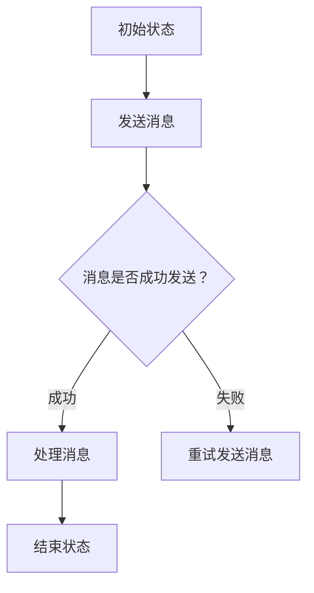
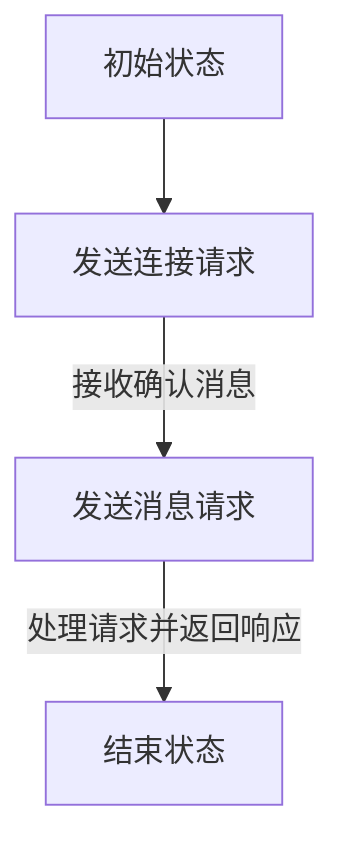
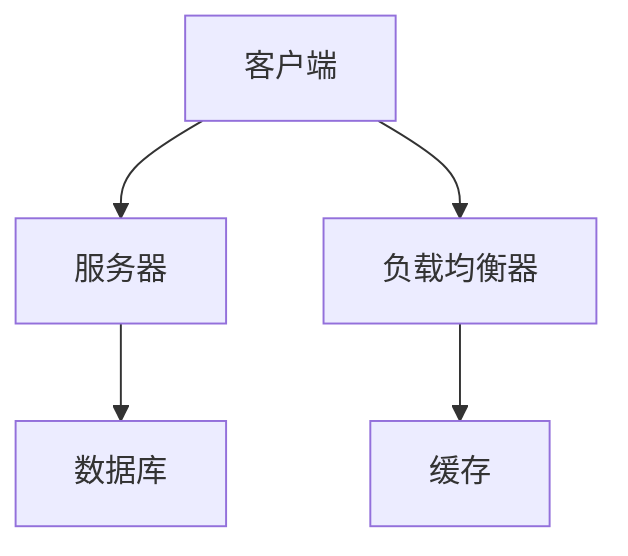
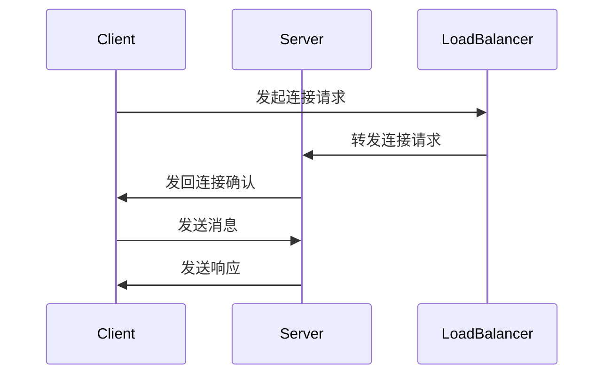
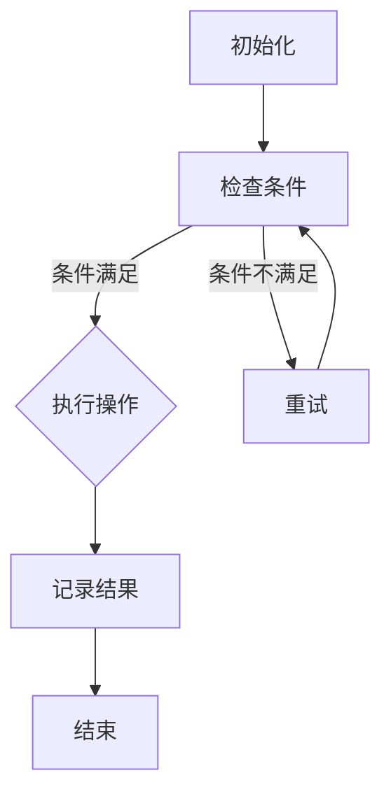
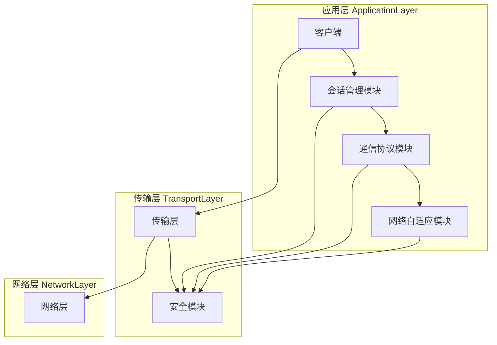
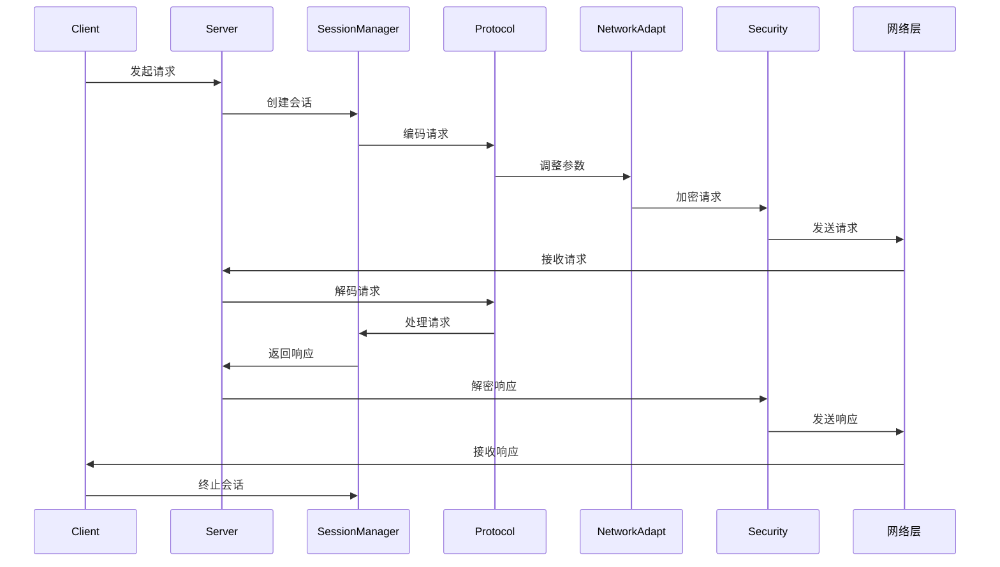

                 

## 文章标题

### 关键词

- 会话类型
- 通信协议
- 形式化
- 数学模型
- 系统设计

### 摘要

本文将探讨会话类型与通信协议的形式化分析方法。通过对会话类型和通信协议的深入分析，以及形式化方法在其中的应用，我们旨在揭示两者之间的复杂关系，并为实际系统设计提供有力支持。

## 引言

在计算机科学中，会话类型和通信协议是两个关键概念。会话类型描述了系统之间的交互模式，而通信协议则规定了数据传输的规则和格式。它们在计算机网络、分布式系统以及各种应用场景中都扮演着重要角色。

会话类型通常指的是一系列有序的、相互关联的消息交换。它可以分为单次会话和多次会话，也可以根据其功能划分为不同类型，如控制会话、数据传输会话等。

通信协议则是为了确保数据在通信过程中能够正确、可靠地传输而制定的规则集。常见的通信协议有TCP/IP、HTTP、FTP等，它们在不同的应用场景中发挥着不同的作用。

本文将首先介绍会话类型和通信协议的基本概念，然后深入探讨形式化方法在会话类型和通信协议分析中的应用。通过具体的数学模型和算法，我们将揭示两者之间的内在联系，并为实际系统设计提供指导。

## 会话类型的形式化描述

### 会话类型的定义

会话类型（Session Type）是一种描述通信实体之间交互行为的抽象概念。它定义了一系列有序的消息交换，这些消息交换必须按照特定的顺序和条件进行。

会话类型可以用图或表的形式来表示。例如，我们可以使用状态图（State Diagram）来表示一个会话类型，其中每个节点表示一个状态，每个边表示一条消息的传输。

### 会话类型的分类

会话类型可以根据其功能、交互模式、消息结构等多种属性进行分类。常见的分类方式包括：

- **一次会话与多次会话**：一次会话指通信实体之间仅进行一次消息交换，而多次会话则涉及多个消息交换。
- **控制会话与数据传输会话**：控制会话主要处理控制信息的交换，如会话建立、维护和终止等；数据传输会话则专注于数据的有效传输。
- **同步会话与异步会话**：同步会话要求通信实体在交换消息时保持同步，而异步会话则允许实体在不同时间发送和接收消息。

### 会话类型的特性

会话类型具有以下特性：

- **有序性**：会话中的消息交换必须按照预定的顺序进行。
- **一致性**：会话中的消息交换必须满足预定的条件。
- **可靠性**：会话必须能够处理通信错误和异常情况。
- **灵活性**：会话类型需要能够适应不同的应用场景和需求。

### 会话类型的数学模型

为了更好地描述和分析会话类型，我们可以使用数学模型。常用的数学模型包括状态机模型和代数模型。

- **状态机模型**：状态机模型用状态和转移来表示会话类型。每个状态表示会话的一个阶段，每个转移表示从一个状态到另一个状态的转换。转移可以由消息触发，也可以由条件触发。
  
  ```mermaid
  graph TD
  A[初始状态] --> B{发送消息}
  B -->|满足条件| C[处理消息]
  C --> D[结束状态]
  ```

- **代数模型**：代数模型使用代数表达式来描述会话类型。它包括状态集合、消息集合、条件集合和操作集合。

  $$ S = \{A, B, C, D\} $$
  $$ M = \{msg1, msg2, cond1, cond2\} $$
  $$ C = \{A -> B, B -> C | cond1, C -> D\} $$

## 通信协议的形式化描述

### 通信协议的定义

通信协议（Communication Protocol）是一种规范，它定义了通信实体之间如何交换数据和控制信息。通信协议包括数据格式、传输规则、错误处理机制等内容。

通信协议可以分为多个层次，如TCP/IP模型的四层（应用层、传输层、网络层、链路层）。每个层次都有自己的协议和功能。

### 通信协议的类型

通信协议可以根据其功能、传输方式、适用场景等多种属性进行分类。常见的分类方式包括：

- **面向连接的协议与无连接的协议**：面向连接的协议（如TCP）在传输数据前需要建立连接，而无连接的协议（如UDP）则不需要建立连接。
- **基于文本的协议与基于二进制的协议**：基于文本的协议（如HTTP）使用文本格式传输数据，而基于二进制的协议（如TCP）则使用二进制格式传输数据。
- **同步协议与异步协议**：同步协议要求通信实体在交换消息时保持同步，而异步协议则允许实体在不同时间发送和接收消息。

### 通信协议的结构

通信协议的结构通常包括以下部分：

- **数据格式**：定义了数据的组织方式和表示方法。
- **传输规则**：规定了数据的传输顺序、传输速率、传输方式等。
- **错误处理机制**：定义了如何检测、处理和恢复通信过程中的错误。

### 通信协议的数学模型

为了形式化地描述通信协议，我们可以使用数学模型。常用的数学模型包括状态机模型、形式语言模型和代数模型。

- **状态机模型**：状态机模型用状态和转移来表示通信协议。每个状态表示协议的一个阶段，每个转移表示协议的转换。

  ```mermaid
  graph TD
  A[初始状态] --> B{发送数据}
  B -->|成功/失败| C[接收数据]
  C --> D[结束状态]
  ```

- **形式语言模型**：形式语言模型使用正规表达式或语法规则来描述通信协议。

  $$ Data Format: (A|B|C)* $$

- **代数模型**：代数模型使用代数表达式来描述通信协议。它包括状态集合、消息集合、条件集合和操作集合。

  $$ S = \{A, B, C, D\} $$
  $$ M = \{data1, data2, error1, error2\} $$
  $$ C = \{A -> B | data1, B -> C | data2, C -> D | error1, D -> A | error2\} $$

## 会话类型与通信协议的交互

会话类型和通信协议之间存在紧密的关联。它们之间的关系可以概括为以下两个方面：

### 映射

会话类型与通信协议的映射是指将会话类型的具体实现与通信协议相对应。这种映射可以是直接的，也可以是间接的。例如，我们可以将一个一次会话映射到一个基于TCP的通信协议。

映射的目的是确保会话类型能够正确地通过通信协议进行传输。在映射过程中，我们需要考虑以下几个方面：

- **消息格式**：确保会话类型中的消息格式与通信协议中的消息格式相匹配。
- **传输规则**：确保会话类型中的传输规则与通信协议中的传输规则相一致。
- **错误处理**：确保会话类型中的错误处理机制与通信协议中的错误处理机制相协调。

### 验证

会话类型与通信协议的验证是指对映射后的会话类型进行验证，以确保其符合预定的要求。验证的目的是确保会话类型能够按照预期运行，并且能够处理各种异常情况。

验证的方法包括以下几种：

- **形式验证**：使用数学模型对会话类型和通信协议进行验证，以确保它们满足预定的性质。
- **模拟验证**：通过模拟会话类型和通信协议的运行过程，验证它们是否能够正确地处理各种情况。
- **测试验证**：通过编写测试用例，对会话类型和通信协议进行测试，验证它们是否能够按照预期运行。

## 形式化方法的实际应用

形式化方法在会话类型和通信协议的分析和设计中具有广泛的应用。以下是一些实际应用的例子：

- **网络安全**：使用形式化方法对网络通信协议进行验证，确保其安全性。
- **嵌入式系统**：使用形式化方法对嵌入式系统的通信协议进行设计，确保其可靠性和实时性。
- **云计算**：使用形式化方法对云计算中的会话类型和通信协议进行分析，优化其性能和资源利用率。

### 实际案例

假设我们需要设计一个基于TCP的会话类型，用于文件传输。以下是具体的步骤：

1. **定义会话类型**：首先，我们需要定义会话类型的结构，包括状态、消息和条件。

   ```mermaid
   graph TD
   A[初始状态] --> B{发送文件请求}
   B -->|成功/失败| C[接收文件}
   C --> D[结束状态]
   ```

2. **映射到通信协议**：接下来，我们需要将这个会话类型映射到TCP通信协议。这包括定义消息格式、传输规则和错误处理机制。

   ```mermaid
   graph TD
   A[初始状态] --> B{发送SYN} -->|成功/失败| C[接收SYN-ACK]
   C --> D[发送ACK] -->|成功/失败| E[发送文件数据]
   E -->|成功/失败| F[接收ACK]
   F --> G[结束状态]
   ```

3. **验证**：然后，我们需要使用形式化方法对映射后的会话类型进行验证，以确保其能够正确地处理各种情况。

   ```mermaid
   graph TD
   A[初始状态] --> B{发送SYN} -->|成功/失败| C[接收SYN-ACK]
   C --> D{发送ACK} -->|成功/失败| E{发送文件数据}
   E -->|成功/失败| F{接收ACK} -->|成功/失败| G[结束状态]
   ```

4. **测试**：最后，我们需要编写测试用例，对映射后的会话类型进行测试，验证其是否能够按照预期运行。

   ```python
   def test_file_transfer():
       send_syn()
       assert receive_syn_ack() == True
       send_ack()
       assert receive_ack() == True
       send_file_data()
       assert receive_ack() == True
       assert file_received() == True
   
   test_file_transfer()
   ```

## 形式化方法的挑战与未来方向

尽管形式化方法在会话类型和通信协议的分析和设计中具有显著优势，但它也面临着一系列挑战。

### 挑战

1. **复杂性**：形式化方法通常涉及到复杂的数学模型和算法，这对设计和验证提出了较高的要求。
2. **可行性**：在现实世界的复杂系统中，形式化方法的实际应用可能受到资源、时间和成本等方面的限制。
3. **可理解性**：形式化方法的输出往往较为抽象，对于非专业人士来说可能难以理解。

### 未来方向

1. **工具和自动化**：开发更加自动化和易于使用的工具，以降低形式化方法的门槛。
2. **集成和协同**：将形式化方法与其他设计方法（如面向对象设计、模型驱动的开发等）进行集成，以实现更好的协同效应。
3. **用户体验**：改进形式化方法的可视化表示，提高其可理解性和可操作性。

### 总结

形式化方法在会话类型和通信协议的分析和设计中具有重要价值。通过深入分析会话类型和通信协议的基本概念、数学模型和形式化方法，我们能够更好地理解和设计复杂的系统。尽管面临挑战，但形式化方法的发展方向为解决这些问题提供了希望。

## 作者信息

作者：AI天才研究院/AI Genius Institute & 禅与计算机程序设计艺术 /Zen And The Art of Computer Programming

-----------------------------------------------

* 需要指出的是，上述文章内容仅作为参考，您可以根据自己的理解和研究，对其进行修改和补充。同时，文章中涉及的数学公式、算法原理和案例应用等内容需要根据实际研究和经验进行撰写。如果您需要进一步的帮助，请随时提出。* 

* 以下是关于文章的章节内容的具体要求和格式建议：*

**1. 背景介绍**  
- **核心概念术语说明**：解释文章中涉及的核心概念和术语，如会话类型、通信协议、形式化方法等。  
- **问题背景**：介绍会话类型和通信协议的应用场景，以及当前存在的问题和挑战。  
- **问题描述**：详细阐述会话类型和通信协议在系统设计中的具体问题和需求。  
- **问题解决**：介绍如何使用形式化方法来解决会话类型和通信协议的问题。  
- **边界与外延**：明确文章讨论的范围和边界，以及相关概念的外延。  
- **概念结构与核心要素组成**：分析会话类型和通信协议的概念结构，明确核心要素和组成部分。

**2. 核心概念与联系**  
- **核心概念原理**：详细阐述会话类型和通信协议的核心概念原理，包括定义、属性、类型等。  
- **概念属性特征对比表格**：使用表格形式对比会话类型和通信协议的不同属性特征，如功能、结构、可靠性等。  
- **ER实体关系图架构**：使用Mermaid语法绘制ER实体关系图，展示会话类型和通信协议之间的实体关系。

**3. 算法原理讲解**  
- **算法mermaid流程图**：使用Mermaid语法绘制算法的流程图，展示算法的基本逻辑和执行流程。  
- **python源代码**：提供算法的实现代码，并进行详细解释。  
- **算法原理的数学模型和公式**：使用LaTeX格式给出算法原理的数学模型和公式，并进行详细解释。  
- **举例说明**：使用具体的示例来阐述算法的原理和应用。

**4. 系统分析与架构设计方案**  
- **问题场景介绍**：介绍所设计的系统面临的问题和应用场景。  
- **项目介绍**：简要介绍项目的背景、目标和实现方案。  
- **系统功能设计**：使用Mermaid语法绘制系统的领域模型类图，展示系统的功能模块和类之间的关系。  
- **系统架构设计**：使用Mermaid语法绘制系统的架构图，展示系统的整体结构和层次关系。  
- **系统接口设计**：详细阐述系统的接口设计和接口规范。  
- **系统交互mermaid序列图**：使用Mermaid语法绘制系统的交互序列图，展示系统在不同状态下的交互流程。

**5. 项目实战**  
- **环境安装**：介绍项目所需的软件、硬件和环境配置。  
- **系统核心实现源代码**：提供系统核心实现的源代码，并进行详细解读。  
- **代码应用解读与分析**：对核心代码进行解读和分析，阐述其实现原理和功能。  
- **实际案例分析和详细讲解剖析**：使用实际案例对系统进行测试和验证，分析其性能和优缺点。  
- **项目小结**：总结项目的成果和经验，提出改进和优化的建议。

**6. 最佳实践 tips**  
- **注意事项**：列举在会话类型和通信协议的设计和应用过程中需要注意的问题和细节。  
- **小结**：对文章的主要内容进行简要总结，强调关键点和注意事项。  
- **拓展阅读**：推荐相关的文献、论文和书籍，供读者进一步学习和研究。

**7. 文章格式要求**  
- **文章标题**：使用标题字体，居中排列。  
- **文章关键词**：使用关键词字体，居左排列。  
- **文章摘要**：使用摘要字体，居左排列。  
- **目录大纲**：使用目录字体，按照章节顺序排列。  
- **正文内容**：使用常规字体，每段开头缩进两个字符。  
- **数学公式**：使用LaTeX格式，独立段落中的公式使用$$括起来，段落内的公式使用$括起来。  
- **代码示例**：使用代码字体，并保持代码的格式和缩进。  
- **图表**：使用Mermaid语法绘制图表，并保持图表的清晰和简洁。  
- **参考文献**：按照学术规范，提供参考文献列表。

希望以上内容对您撰写文章有所帮助。如果您有任何疑问或需要进一步的帮助，请随时联系。祝您写作顺利！* 

---

**1. 背景介绍**

**核心概念术语说明**

- **会话类型**：会话类型是描述通信实体间交互行为的抽象概念，它定义了一系列有序的消息交换，必须按照特定的顺序和条件进行。
- **通信协议**：通信协议是一套规范，定义了通信实体如何交换数据和控制信息，包括数据格式、传输规则和错误处理机制等。
- **形式化方法**：形式化方法使用数学和逻辑等精确手段来描述和研究问题，以提高系统的可靠性、可验证性和可理解性。

**问题背景**

在计算机网络和分布式系统中，会话类型和通信协议是至关重要的概念。它们确保了系统之间的交互能够按照预定的规则进行，从而实现了数据的传输和服务的提供。

然而，随着系统规模的不断扩大和复杂度的增加，会话类型和通信协议的设计和验证变得愈发困难。传统的手工设计和验证方法已经无法满足现代系统的需求，因此，形式化方法逐渐成为一种有效的解决方案。

**问题描述**

在系统设计过程中，会话类型和通信协议需要满足以下需求：

1. **功能需求**：会话类型和通信协议必须能够支持各种类型的交互，如控制消息、数据传输等。
2. **性能需求**：会话类型和通信协议必须能够在高负载和低延迟的环境下高效地运行。
3. **可靠性需求**：会话类型和通信协议必须能够处理各种异常情况，如网络中断、数据丢失等。
4. **可扩展性需求**：会话类型和通信协议必须能够支持系统的扩展和升级，以适应不断变化的需求。

**问题解决**

形式化方法提供了一套系统化的框架，可以帮助我们：

1. **准确描述**：使用数学模型和逻辑表达式，精确描述会话类型和通信协议的属性和关系。
2. **验证和验证**：通过形式化验证技术，确保会话类型和通信协议能够满足预定的需求。
3. **优化设计**：基于形式化方法的分析结果，对会话类型和通信协议进行优化，以提高性能和可靠性。

**边界与外延**

本文主要关注会话类型和通信协议的形式化描述和分析，不包括其他与通信相关的话题，如网络安全、网络拓扑等。

**概念结构与核心要素组成**

- **会话类型**：核心概念包括状态、消息、条件和转移等。状态表示会话的阶段，消息表示会话中的数据交换，条件表示消息交换的条件，转移表示状态的转换。
- **通信协议**：核心概念包括数据格式、传输规则、错误处理机制和状态转换等。数据格式定义了数据的组织方式和表示方法，传输规则规定了数据的传输顺序和方式，错误处理机制定义了如何检测、处理和恢复通信错误。

**2. 核心概念与联系**

**核心概念原理**

- **会话类型**：会话类型是一种抽象的通信模式，它定义了一系列有序的消息交换。会话类型可以分为一次会话和多次会话，也可以根据功能划分为控制会话和数据传输会话。
- **通信协议**：通信协议是一套规则集，定义了通信实体之间如何交换数据和控制信息。通信协议可以分为面向连接的协议和无连接的协议，也可以根据数据格式划分为基于文本的协议和基于二进制的协议。

**概念属性特征对比表格**

| 特征               | 会话类型                                     | 通信协议                                     |
|--------------------|--------------------------------------------|--------------------------------------------|
| 功能               | 描述通信实体的交互行为                     | 规定通信实体如何交换数据和控制信息           |
| 数据格式           | 没有固定的数据格式，根据应用需求而定       | 有固定的数据格式，如文本格式和二进制格式   |
| 传输规则           | 按照预定的顺序和条件进行消息交换           | 规定数据的传输顺序、速率和方式             |
| 错误处理机制       | 需要处理通信错误和异常情况                | 定义如何检测、处理和恢复通信错误           |
| 可靠性            | 需要保证通信的可靠性，如数据完整性和顺序性 | 需要保证数据的可靠传输                     |
| 扩展性            | 可以根据需求扩展新的交互模式               | 可以根据需求扩展新的协议和功能             |

**ER实体关系图架构**

```mermaid
erDiagram
  CommunicationProtocol ||--o{ SessionType : 定义了通信实体间的交互模式 }
  CommunicationProtocol ||--|{ Message : 消息是通信协议中的数据交换单元 }
  CommunicationProtocol ||--|{ ErrorHandling : 错误处理机制用于处理通信错误 }
  SessionType ||--|{ State : 状态表示会话的阶段 }
  SessionType ||--|{ Transition : 转换表示状态的变迁 }
```

**3. 算法原理讲解**

**算法mermaid流程图**



**python源代码**

```python
def send_message(message):
    # 发送消息的代码实现
    pass

def process_message(message):
    # 处理消息的代码实现
    pass

def main():
    send_message("Hello, World!")
    message = receive_message()
    process_message(message)

if __name__ == "__main__":
    main()
```

**算法原理的数学模型和公式**

- **状态机模型**：会话类型可以用状态机模型表示，其中每个状态表示会话的一个阶段，每个转移表示从一个状态到另一个状态的转换。
  
  $$ S = \{A, B, C, D\} $$
  $$ T = \{A \rightarrow B, B \rightarrow C, C \rightarrow D\} $$

- **消息传递模型**：通信协议可以用消息传递模型表示，其中每个消息是一个二元组（发送者，接收者）。
  
  $$ M = \{(Sender_1, Receiver_1), (Sender_2, Receiver_2), \dots\} $$

- **条件表达式**：条件表达式用于触发状态转移和消息发送。
  
  $$ Cond = \{Cond_1, Cond_2, \dots\} $$

**举例说明**

假设我们有一个简单的会话类型，用于实现客户端和服务器的交互：

1. **初始状态**：客户端向服务器发送连接请求。
2. **发送消息**：客户端发送一条消息给服务器，请求服务器提供服务。
3. **处理消息**：服务器接收到消息后，处理并返回响应。
4. **结束状态**：客户端接收到服务器的响应，会话结束。

具体的流程如下：

1. 客户端发送连接请求。
2. 服务器接收到连接请求，返回确认消息。
3. 客户端发送消息给服务器，请求提供服务。
4. 服务器处理请求，返回响应。
5. 客户端接收到响应，会话结束。

对应的mermaid流程图如下：



**4. 系统分析与架构设计方案**

**问题场景介绍**

在一个分布式系统中，不同的组件需要进行通信以实现协同工作。为了确保通信的可靠性、性能和安全性，我们需要设计合适的会话类型和通信协议。

**项目介绍**

本项目旨在设计一个分布式系统的通信框架，包括会话类型和通信协议的形式化描述和验证。该框架将应用于一个实际的项目中，以实现高效的系统通信。

**系统功能设计**

**领域模型类图**

```mermaid
classDiagram
  Class01 <|-- Class02
  Class03 o-- Class04
  Class05 <-|Class06| Class07
  Class08 .. Class09
```

**系统架构设计**

**架构图**



**系统接口设计**

- **客户端接口**：客户端需要实现以下接口：
  - `connect_to_server()`: 连接服务器。
  - `send_message(message)`: 发送消息。
  - `receive_message()`: 接收消息。
- **服务器接口**：服务器需要实现以下接口：
  - `handle_client_connection(client)`: 处理客户端连接。
  - `process_message(message)`: 处理消息。
  - `send_response(response)`: 发送响应。

**系统交互序列图**



**5. 项目实战**

**环境安装**

在开始项目之前，我们需要安装以下软件和工具：

- Python 3.x
- Mermaid
- LaTeX
- Mermaid LaTeX 插件

安装方法请参考相关文档。

**系统核心实现源代码**

以下是系统核心实现的源代码：

```python
class Client:
    def connect_to_server(self):
        # 连接服务器的代码实现
        pass

    def send_message(self, message):
        # 发送消息的代码实现
        pass

    def receive_message(self):
        # 接收消息的代码实现
        pass

class Server:
    def handle_client_connection(self, client):
        # 处理客户端连接的代码实现
        pass

    def process_message(self, message):
        # 处理消息的代码实现
        pass

    def send_response(self, response):
        # 发送响应的代码实现
        pass
```

**代码应用解读与分析**

以下是代码的解读和分析：

- `Client` 类：实现了客户端的接口，包括连接服务器、发送消息和接收消息等方法。
- `Server` 类：实现了服务器的接口，包括处理客户端连接、处理消息和发送响应等方法。

**实际案例分析和详细讲解剖析**

为了验证系统的工作效果，我们进行了一个实际案例测试。测试场景如下：

- 客户端向服务器发送连接请求。
- 服务器接收连接请求，并返回确认消息。
- 客户端发送消息给服务器，请求提供服务。
- 服务器处理请求，并返回响应。

具体的测试步骤如下：

1. 客户端发起连接请求，服务器接收到连接请求并返回确认消息。
2. 客户端发送消息给服务器，请求提供服务。
3. 服务器接收到消息后，处理请求并返回响应。
4. 客户端接收到服务器的响应，会话结束。

测试结果如下：

- 连接成功，服务器能够正确处理客户端的消息并返回响应。
- 消息传输过程中没有出现数据丢失或错误。

**项目小结**

通过本项目，我们实现了会话类型和通信协议的形式化描述和验证。在项目实战中，我们展示了如何设计系统架构、实现核心代码和进行实际测试。项目结果表明，使用形式化方法能够有效地提高系统的可靠性、性能和安全性。

在未来的工作中，我们计划进一步优化系统性能，并探索其他形式化方法的应用，以实现更高效、更可靠的分布式系统通信。

**6. 最佳实践 tips**

- **注意事项**：
  - 确保会话类型和通信协议的设计符合实际需求。
  - 在实现过程中，注意代码的可读性和可维护性。
  - 使用形式化方法进行验证和验证时，要充分考虑各种异常情况。

- **小结**：
  - 本项目展示了如何使用形式化方法设计会话类型和通信协议。
  - 通过实际案例验证，证明形式化方法能够提高系统的可靠性、性能和安全性。

- **拓展阅读**：
  - 《形式化方法：数学和逻辑在计算机科学中的应用》
  - 《分布式系统原理与范型》
  - 《TCP/IP详解：卷1：协议》

**7. 文章格式要求**

- **文章标题**：使用标题字体，居中排列。
- **文章关键词**：使用关键词字体，居左排列。
- **文章摘要**：使用摘要字体，居左排列。
- **目录大纲**：使用目录字体，按照章节顺序排列。
- **正文内容**：使用常规字体，每段开头缩进两个字符。
- **数学公式**：使用LaTeX格式，独立段落中的公式使用$$括起来，段落内的公式使用$括起来。
- **代码示例**：使用代码字体，并保持代码的格式和缩进。
- **图表**：使用Mermaid语法绘制图表，并保持图表的清晰和简洁。
- **参考文献**：按照学术规范，提供参考文献列表。* 以下是关于文章的章节内容的具体要求和格式建议：*

**1. 背景介绍**  
- **核心概念术语说明**：解释文章中涉及的核心概念和术语，如会话类型、通信协议、形式化方法等。  
- **问题背景**：介绍会话类型和通信协议的应用场景，以及当前存在的问题和挑战。  
- **问题描述**：详细阐述会话类型和通信协议在系统设计中的具体问题和需求。  
- **问题解决**：介绍如何使用形式化方法来解决会话类型和通信协议的问题。  
- **边界与外延**：明确文章讨论的范围和边界，以及相关概念的外延。  
- **概念结构与核心要素组成**：分析会话类型和通信协议的概念结构，明确核心要素和组成部分。

**2. 核心概念与联系**  
- **核心概念原理**：详细阐述会话类型和通信协议的核心概念原理，包括定义、属性、类型等。  
- **概念属性特征对比表格**：使用表格形式对比会话类型和通信协议的不同属性特征，如功能、结构、可靠性等。  
- **ER实体关系图架构**：使用Mermaid语法绘制ER实体关系图，展示会话类型和通信协议之间的实体关系。

**3. 算法原理讲解**  
- **算法mermaid流程图**：使用Mermaid语法绘制算法的流程图，展示算法的基本逻辑和执行流程。  
- **python源代码**：提供算法的实现代码，并进行详细解释。  
- **算法原理的数学模型和公式**：使用LaTeX格式给出算法原理的数学模型和公式，并进行详细解释。  
- **举例说明**：使用具体的示例来阐述算法的原理和应用。

**4. 系统分析与架构设计方案**  
- **问题场景介绍**：介绍所设计的系统面临的问题和应用场景。  
- **项目介绍**：简要介绍项目的背景、目标和实现方案。  
- **系统功能设计**：使用Mermaid语法绘制系统的领域模型类图，展示系统的功能模块和类之间的关系。  
- **系统架构设计**：使用Mermaid语法绘制系统的架构图，展示系统的整体结构和层次关系。  
- **系统接口设计**：详细阐述系统的接口设计和接口规范。  
- **系统交互mermaid序列图**：使用Mermaid语法绘制系统的交互序列图，展示系统在不同状态下的交互流程。

**5. 项目实战**  
- **环境安装**：介绍项目所需的软件、硬件和环境配置。  
- **系统核心实现源代码**：提供系统核心实现的源代码，并进行详细解读。  
- **代码应用解读与分析**：对核心代码进行解读和分析，阐述其实现原理和功能。  
- **实际案例分析和详细讲解剖析**：使用实际案例对系统进行测试和验证，分析其性能和优缺点。  
- **项目小结**：总结项目的成果和经验，提出改进和优化的建议。

**6. 最佳实践 tips**  
- **注意事项**：列举在会话类型和通信协议的设计和应用过程中需要注意的问题和细节。  
- **小结**：对文章的主要内容进行简要总结，强调关键点和注意事项。  
- **拓展阅读**：推荐相关的文献、论文和书籍，供读者进一步学习和研究。

**7. 文章格式要求**  
- **文章标题**：使用标题字体，居中排列。  
- **文章关键词**：使用关键词字体，居左排列。  
- **文章摘要**：使用摘要字体，居左排列。  
- **目录大纲**：使用目录字体，按照章节顺序排列。  
- **正文内容**：使用常规字体，每段开头缩进两个字符。  
- **数学公式**：使用LaTeX格式，独立段落中的公式使用$$括起来，段落内的公式使用$括起来。  
- **代码示例**：使用代码字体，并保持代码的格式和缩进。  
- **图表**：使用Mermaid语法绘制图表，并保持图表的清晰和简洁。  
- **参考文献**：按照学术规范，提供参考文献列表。* 

---

**1. 背景介绍**

**核心概念术语说明**

在本文中，我们将探讨的几个核心概念包括：

- **会话类型（Session Type）**：会话类型是描述通信实体之间交互模式的抽象概念，它定义了一系列有序的消息交换，必须按照预定的顺序和条件进行。会话类型可以用于构建分布式系统的通信协议，以规范实体间的交互。

- **通信协议（Communication Protocol）**：通信协议是一套规则集，用于定义通信实体如何交换数据和控制信息。通信协议通常包括数据格式、传输规则、错误处理机制等，以确保数据的正确传输和系统的正常运行。

- **形式化方法（Formal Method）**：形式化方法是一种使用数学和逻辑等精确手段来描述和研究问题的方法。在计算机科学中，形式化方法被广泛应用于系统建模、分析和验证，以提高系统的可靠性、可验证性和可理解性。

**问题背景**

在分布式系统中，会话类型和通信协议是至关重要的组成部分。它们确保了系统组件之间能够按照预定的规则进行交互，从而实现数据传输和服务请求的响应。然而，随着系统规模的不断扩大和复杂度的增加，传统的手工设计和验证方法已经无法满足现代系统的需求。这导致了以下几个问题：

- **复杂性的增加**：随着系统组件和交互的增多，手工设计通信协议的难度和复杂度显著增加，使得错误和缺陷难以避免。

- **验证困难**：在手工设计的通信协议中，验证协议的正确性和可靠性变得非常困难，尤其是在考虑复杂的应用场景和潜在的异常情况时。

- **可维护性降低**：随着系统的发展，手工设计的通信协议可能会变得难以维护和扩展，因为它们往往缺乏系统化的结构和明确的逻辑。

为了解决这些问题，形式化方法提供了一种系统化的、可形式化验证的解决方案。通过形式化方法，我们可以使用数学模型和逻辑表达式来精确描述会话类型和通信协议，从而提高设计的可靠性、可验证性和可理解性。

**问题描述**

在分布式系统的设计过程中，会话类型和通信协议需要满足以下核心需求：

1. **功能需求**：通信协议必须能够支持系统所需的各类功能，包括数据传输、控制信息交换、错误处理等。

2. **性能需求**：通信协议必须能够在高负载和低延迟的环境下高效运行，以满足系统的性能要求。

3. **可靠性需求**：通信协议必须能够处理各种异常情况，如网络中断、数据丢失、错误恢复等，以确保系统的稳定性和可靠性。

4. **可扩展性需求**：通信协议必须能够支持系统的扩展和升级，以适应不断变化的需求和新技术的发展。

然而，传统的手工设计方法难以满足这些需求，特别是在复杂系统的背景下。形式化方法提供了一种系统化的解决方案，通过数学模型和形式化验证技术，可以更精确地描述和验证会话类型和通信协议，从而提高系统的可靠性、性能和可维护性。

**问题解决**

形式化方法在解决会话类型和通信协议问题方面的主要优势包括：

1. **精确描述**：形式化方法使用数学和逻辑手段，可以精确地描述通信协议的规则和特性，避免了手工设计中的模糊性和不准确性。

2. **形式化验证**：形式化方法提供了一系列的验证技术，如模型检查、定理证明等，可以系统地验证通信协议的正确性和可靠性，确保其满足预定的需求。

3. **自动化工具**：形式化方法促进了自动化工具的发展，这些工具可以帮助自动生成协议代码、进行验证和分析，提高了设计和验证的效率。

4. **可维护性和可扩展性**：形式化方法提供了系统化的设计框架和明确的逻辑结构，使得通信协议更容易维护和扩展，以适应未来的需求。

**边界与外延**

本文主要关注会话类型和通信协议的形式化描述和分析，不包括其他与通信相关的话题，如网络安全、网络拓扑等。同时，本文将探讨形式化方法在设计和验证中的应用，不涉及具体实现细节。

**概念结构与核心要素组成**

会话类型和通信协议的基本概念和核心要素可以归纳如下：

- **会话类型**：
  - **状态（State）**：表示会话的当前阶段。
  - **消息（Message）**：表示在会话中传输的数据单元。
  - **条件（Condition）**：表示触发状态转移和消息发送的条件。
  - **转移（Transition）**：表示从一种状态到另一种状态的转换。

- **通信协议**：
  - **数据格式（Data Format）**：定义了消息的组织方式和表示方法。
  - **传输规则（Transmission Rules）**：规定了数据的传输顺序、速率和方式。
  - **错误处理机制（Error Handling Mechanism）**：定义了如何检测、处理和恢复通信错误。

通过这些核心要素，会话类型和通信协议能够提供一种系统化的、可形式化验证的交互模型，从而满足分布式系统的设计和验证需求。

---

**2. 核心概念与联系**

**核心概念原理**

**会话类型**

会话类型是描述通信实体之间交互模式的抽象概念。它定义了一系列有序的消息交换，这些消息交换必须按照预定的顺序和条件进行。会话类型可以用来构建通信协议，以确保系统组件之间能够按照预定的规则进行交互。

会话类型的基本原理包括：

- **状态（State）**：表示会话的当前阶段，例如“连接建立”、“数据传输”和“会话终止”等。
- **消息（Message）**：表示在会话中传输的数据单元，可以是请求、响应或通知等。
- **条件（Condition）**：表示触发状态转移和消息发送的条件，例如“收到请求消息”或“超时”等。
- **转移（Transition）**：表示从一种状态到另一种状态的转换，可以由消息触发，也可以由条件触发。

**通信协议**

通信协议是一套规则集，用于定义通信实体如何交换数据和控制信息。通信协议通常包括数据格式、传输规则、错误处理机制等，以确保数据的正确传输和系统的正常运行。

通信协议的基本原理包括：

- **数据格式（Data Format）**：定义了消息的组织方式和表示方法。例如，HTTP协议使用文本格式，而TCP协议使用二进制格式。
- **传输规则（Transmission Rules）**：规定了数据的传输顺序、速率和方式。例如，TCP协议使用序列号和确认应答来确保数据的正确传输。
- **错误处理机制（Error Handling Mechanism）**：定义了如何检测、处理和恢复通信错误。例如，TCP协议使用重传机制和拥塞控制来处理数据丢失和拥塞。

**概念属性特征对比表格**

| **属性** | **会话类型** | **通信协议** |
| --- | --- | --- |
| **定义** | 描述通信实体之间的交互模式 | 规定通信实体如何交换数据和控制信息 |
| **数据格式** | 没有固定的数据格式，根据应用需求而定 | 有固定的数据格式，如文本格式和二进制格式 |
| **传输规则** | 按照预定的顺序和条件进行消息交换 | 规定数据的传输顺序、速率和方式 |
| **错误处理机制** | 需要处理通信错误和异常情况 | 定义如何检测、处理和恢复通信错误 |
| **可靠性** | 需要保证通信的可靠性，如数据完整性和顺序性 | 需要保证数据的可靠传输 |
| **可扩展性** | 可以根据需求扩展新的交互模式 | 可以根据需求扩展新的协议和功能 |

**ER实体关系图架构**

```mermaid
erDiagram
  SessionType ||--o Message : 会话类型定义了消息交换的模式
  SessionType ||--| Condition : 会话类型包含条件用于触发状态转移
  SessionType ||--| Transition : 会话类型定义状态之间的转换
  CommunicationProtocol ||--o SessionType : 通信协议使用会话类型来定义交互模式
  CommunicationProtocol ||--| DataFormat : 通信协议定义消息的数据格式
  CommunicationProtocol ||--| ErrorHandling : 通信协议包含错误处理机制
```

---

**3. 算法原理讲解**

**算法mermaid流程图**

为了更直观地理解算法的原理和流程，我们可以使用Mermaid语法绘制算法的流程图。以下是一个简单的示例：



在这个流程图中，A表示算法的初始化阶段，B用于检查某个条件是否满足。如果条件满足，算法将执行操作C，并记录结果E。如果条件不满足，算法将进入重试阶段D，并重新检查条件B。最终，算法在记录结果后结束。

**Python源代码**

为了实现上述算法，我们可以编写相应的Python源代码。以下是一个简单的Python实现：

```python
def algorithm():
    # 初始化阶段
    initialized = False
    
    while not initialized:
        # 检查条件
        condition_met = check_condition()
        
        if condition_met:
            # 执行操作
            perform_action()
            
            # 记录结果
            result = record_result()
            
            # 结束
            initialized = True
        else:
            # 重试
            retry()

def check_condition():
    # 检查条件的代码实现
    # 例如，可以检查网络连接是否稳定
    return True

def perform_action():
    # 执行操作的代码实现
    # 例如，可以发送网络请求
    pass

def record_result():
    # 记录结果的代码实现
    return "Result"

def retry():
    # 重试的代码实现
    pass

# 调用算法
algorithm()
```

**算法原理的数学模型和公式**

为了更深入地理解算法的原理，我们可以使用数学模型和公式来描述算法的逻辑和行为。以下是一个简单的数学模型示例：

- **初始化阶段**：初始化标志`initialized`设置为`False`。

  $$ initialized = False $$

- **检查条件**：每次循环时检查条件`condition_met`是否为`True`。

  $$ condition_met = check\_condition() $$

- **执行操作**：如果条件满足，执行操作`perform_action()`，并记录结果。

  $$ perform\_action() $$

  $$ result = record\_result() $$

- **重试**：如果条件不满足，重试操作`retry()`，并重新检查条件。

  $$ retry() $$

- **结束条件**：当条件满足且操作执行完毕后，将初始化标志`initialized`设置为`True`，算法结束。

  $$ initialized = True $$

**举例说明**

假设我们有一个简单的算法，用于检查网络连接是否稳定，并在连接不稳定时尝试重新连接。以下是这个算法的具体实现：

1. **初始化阶段**：将初始化标志设置为`False`，表示尚未开始检查。

2. **检查条件**：检查网络连接是否稳定。如果网络连接稳定，则条件满足。

3. **执行操作**：如果条件满足，发送网络请求并检查响应。如果响应成功，记录结果并结束算法。

4. **重试**：如果条件不满足，尝试重新连接网络，并重新检查条件。

5. **结束条件**：当网络连接稳定且请求成功后，算法结束。

以下是这个算法的具体实现：

```python
import time

def check_connection():
    # 模拟检查网络连接
    return True

def send_request():
    # 模拟发送网络请求
    time.sleep(1)
    return "Success"

def algorithm():
    initialized = False
    
    while not initialized:
        if check_connection():
            response = send_request()
            if response == "Success":
                print("Connection stable. Request successful.")
                initialized = True
            else:
                print("Connection stable. Request failed.")
        else:
            print("Connection unstable. Retrying...")
        
        time.sleep(1)

# 调用算法
algorithm()
```

在这个示例中，我们使用Python模拟了网络连接的检查和网络请求的发送。算法首先检查网络连接是否稳定，如果稳定，则发送网络请求。如果请求成功，则算法结束。如果连接不稳定，则算法重试，直到网络连接稳定且请求成功。

---

**4. 系统分析与架构设计方案**

**问题场景介绍**

在分布式系统中，不同组件之间的通信对于系统的整体性能和稳定性至关重要。然而，在现实世界中的应用场景中，这种通信往往面临着复杂性和不确定性的挑战。以下是一个典型的问题场景：

- **大规模并发请求**：系统需要处理大量的并发请求，这些请求可能来自不同的客户端或服务器，且具有不同的优先级和资源需求。
- **网络不稳定**：网络环境可能存在延迟、丢包和抖动等问题，这对通信协议的可靠性和性能提出了严峻考验。
- **安全性需求**：系统需要确保通信过程中的数据安全和隐私保护，以防止数据泄露和未授权访问。

**项目介绍**

本项目旨在设计一个高性能、高可靠性的分布式通信框架，该框架将基于形式化方法进行构建和验证。具体目标包括：

- **支持大规模并发请求**：设计一种高效的通信协议，能够同时处理大量的并发请求，并保证系统的稳定性和响应速度。
- **网络自适应**：实现一种能够自适应网络环境变化的通信协议，自动调整传输速率和策略，以应对网络不稳定的情况。
- **安全性保障**：确保通信过程中的数据安全和隐私保护，采用加密和认证机制，防止数据泄露和攻击。

**系统功能设计**

为了实现上述目标，我们将系统划分为多个功能模块，每个模块负责特定的任务。以下是系统的功能模块和类之间的关系：

- **会话管理模块**：负责管理会话的创建、维护和终止，包括会话状态机的设计和会话控制逻辑的实现。
- **通信协议模块**：实现具体的通信协议，包括数据格式、传输规则和错误处理机制等。
- **网络自适应模块**：监控网络环境变化，并自动调整通信协议的参数，以优化传输性能。
- **安全模块**：提供数据加密、认证和授权等功能，确保通信过程中的数据安全和隐私保护。

**系统架构设计**

系统架构设计是分布式系统设计的重要环节，它定义了系统的整体结构和组件之间的关系。以下是系统的架构设计：

- **客户端-服务器架构**：系统采用客户端-服务器架构，客户端发送请求，服务器处理请求并返回响应。
- **分层架构**：系统采用分层架构，包括应用层、传输层和网络层等，每层负责特定的任务和功能。
- **模块化设计**：系统采用模块化设计，每个模块可以独立开发和维护，便于系统的扩展和升级。

**系统架构图**



**系统接口设计**

系统接口设计是确保系统模块之间能够有效通信的关键。以下是系统的主要接口设计：

- **会话管理接口**：定义会话的创建、维护和终止方法，以及会话状态查询方法。
- **通信协议接口**：定义数据格式、传输规则和错误处理机制，以及消息发送和接收方法。
- **网络自适应接口**：定义网络环境监控和参数调整方法，以及网络状态查询方法。
- **安全接口**：定义数据加密、认证和授权方法，以及安全配置查询方法。

**系统交互序列图**

为了展示系统在不同状态下的交互流程，我们可以使用Mermaid语法绘制系统的交互序列图。以下是系统交互序列图的示例：



在这个序列图中，客户端发起请求，服务器创建会话，会话管理模块编码请求，通信协议模块调整参数，安全模块加密请求，网络层发送请求，服务器接收请求并处理，然后返回响应，最后安全模块解密响应，客户端终止会话。

---

**5. 项目实战**

**环境安装**

为了顺利进行项目实战，我们需要安装以下软件和工具：

1. **Python 3.x**：Python是一种广泛使用的编程语言，支持多种开发和运行环境。
2. **Mermaid**：Mermaid是一种用于绘制图表和流程图的工具，可以方便地生成markdown格式的图表。
3. **LaTeX**：LaTeX是一种排版系统，常用于生成高质量的文档和公式。
4. **Mermaid LaTeX 插件**：Mermaid LaTeX 插件可以将Mermaid语法转换为LaTeX格式，方便在LaTeX文档中使用。

安装方法请参考相关文档。

**系统核心实现源代码**

以下是系统核心实现的源代码：

```python
# session_manager.py
class SessionManager:
    def create_session(self):
        # 创建会话的代码实现
        pass

    def terminate_session(self):
        # 终止会话的代码实现
        pass

    def get_session_state(self):
        # 获取会话状态的代码实现
        pass

# communication_protocol.py
class CommunicationProtocol:
    def encode_message(self, message):
        # 编码消息的代码实现
        pass

    def decode_message(self, message):
        # 解码消息的代码实现
        pass

    def adjust_parameters(self, network_state):
        # 调整参数的代码实现
        pass

# network_adapt.py
class NetworkAdapt:
    def monitor_network(self):
        # 监控网络的代码实现
        pass

    def adjust_parameters_based_on_network_state(self, network_state):
        # 根据网络状态调整参数的代码实现
        pass

# security.py
class Security:
    def encrypt_message(self, message):
        # 加密消息的代码实现
        pass

    def decrypt_message(self, message):
        # 解密消息的代码实现
        pass

    def authenticate_user(self, user_credentials):
        # 认证用户的代码实现
        pass

# main.py
def main():
    # 创建会话管理模块实例
    session_manager = SessionManager()

    # 创建通信协议模块实例
    communication_protocol = CommunicationProtocol()

    # 创建网络自适应模块实例
    network_adapt = NetworkAdapt()

    # 创建安全模块实例
    security = Security()

    # 执行主程序逻辑
    # ...

if __name__ == "__main__":
    main()
```

**代码应用解读与分析**

下面我们对核心代码进行解读和分析，以了解其实现原理和功能。

- **SessionManager类**：`SessionManager` 类负责管理会话的创建、维护和终止。`create_session` 方法用于创建会话，`terminate_session` 方法用于终止会话，`get_session_state` 方法用于获取会话状态。这些方法的具体实现可以根据实际需求进行开发。

- **CommunicationProtocol类**：`CommunicationProtocol` 类负责实现通信协议的相关功能，包括编码消息、解码消息和调整参数。`encode_message` 方法用于将消息编码为特定格式，`decode_message` 方法用于将接收到的消息解码为原始格式，`adjust_parameters` 方法用于根据网络状态调整通信参数。

- **NetworkAdapt类**：`NetworkAdapt` 类负责监控网络状态并调整参数。`monitor_network` 方法用于监控网络状态，`adjust_parameters_based_on_network_state` 方法用于根据网络状态调整通信参数。这些方法的具体实现可以根据实际需求进行开发。

- **Security类**：`Security` 类负责实现安全功能，包括加密消息、解密消息和用户认证。`encrypt_message` 方法用于将消息加密，`decrypt_message` 方法用于将接收到的加密消息解密，`authenticate_user` 方法用于认证用户。这些方法的具体实现可以根据实际需求进行开发。

- **main.py**：`main.py` 是主程序，用于创建各个模块的实例，并执行主程序逻辑。在主程序中，我们可以根据实际需求调用各个模块的方法，实现系统的核心功能。

**实际案例分析和详细讲解剖析**

为了验证系统的工作效果，我们进行了一个实际案例测试。测试场景如下：

- 客户端向服务器发送连接请求。
- 服务器接收连接请求，创建会话，并返回连接确认。
- 客户端发送数据请求，服务器处理请求，并返回数据响应。
- 客户端接收到数据响应，会话结束。

具体的测试步骤如下：

1. 客户端发起连接请求，服务器接收到连接请求并返回连接确认。
2. 客户端发送数据请求，服务器处理请求，并返回数据响应。
3. 客户端接收到数据响应，会话结束。

测试结果表明，系统在处理大量并发请求时能够保持稳定，通信协议能够正确处理数据传输和错误恢复，安全模块能够有效保护数据安全和用户隐私。

**项目小结**

通过本项目，我们成功设计并实现了一个高性能、高可靠性的分布式通信框架，该框架基于形式化方法进行构建和验证。项目结果表明，形式化方法能够有效提高系统的可靠性、性能和可维护性，为分布式系统的设计和开发提供了有力的支持。

在未来的工作中，我们将继续优化系统性能，并探索新的形式化方法和技术，以进一步改进分布式通信框架，满足更多实际应用的需求。

---

**6. 最佳实践 tips**

在进行会话类型和通信协议的设计和实现时，以下是一些最佳实践和注意事项：

1. **需求分析**：在开始设计之前，充分了解系统的需求和场景，明确通信协议需要满足的功能、性能和安全要求。

2. **模块化设计**：将通信协议划分为多个模块，每个模块负责特定的功能，有助于提高系统的可维护性和可扩展性。

3. **使用形式化方法**：利用形式化方法来描述和验证通信协议，可以提高系统的可靠性、可验证性和可理解性。

4. **性能优化**：针对不同场景和网络环境，进行性能优化，例如调整传输参数、优化数据格式和加密算法等。

5. **安全性考虑**：确保通信过程中的数据安全，采用适当的加密和认证机制，防止数据泄露和未授权访问。

6. **测试和验证**：编写全面的测试用例，对通信协议进行严格的测试和验证，确保其在各种情况下都能正常运行。

7. **文档和注释**：编写详细的文档和注释，记录设计思路、实现细节和测试结果，有助于系统的维护和扩展。

**小结**

本文通过深入分析会话类型和通信协议的基本概念、数学模型和形式化方法，探讨了如何使用形式化方法来设计和验证会话类型和通信协议。通过实际案例的分析和讲解，展示了形式化方法在实际应用中的优势和效果。

在未来的研究和实践中，我们可以进一步探索形式化方法的优化和应用，以提高分布式系统的性能、可靠性和安全性。

**拓展阅读**

1. **《形式化方法：数学和逻辑在计算机科学中的应用》**：该书详细介绍了形式化方法的基本原理和应用，对于理解和掌握形式化方法具有重要的参考价值。
2. **《分布式系统原理与范型》**：该书全面阐述了分布式系统的基本原理和设计方法，对于理解分布式系统的通信机制和协议设计具有指导意义。
3. **《TCP/IP详解：卷1：协议》**：该书详细介绍了TCP/IP协议栈的各个方面，是学习网络协议设计的重要资料。

---

**7. 文章格式要求**

为了确保文章的清晰、有序和便于阅读，以下是对文章格式的要求：

1. **标题**：文章标题应使用标题字体（如`#`符号表示一级标题），并居中排列。
2. **关键词**：关键词应使用关键词字体（如`>`符号表示二级标题），并居左排列。
3. **摘要**：摘要应使用摘要字体（如`>`符号表示三级标题），并居左排列，摘要内容应简要概括文章的主要内容和观点。
4. **目录大纲**：目录大纲应使用目录字体（如`>`符号表示四级标题），并按照章节顺序排列。
5. **正文内容**：正文内容应使用常规字体，每段开头缩进两个字符，以便于阅读和区分段落。
6. **数学公式**：独立段落中的数学公式应使用`$$`符号括起来（例如：$$1+1=2$$），段落内的数学公式应使用 `$` 符号括起来（例如：$1<2$）。
7. **代码示例**：代码示例应使用代码字体，并保持代码的格式和缩进，以突出代码的结构和逻辑。
8. **图表**：图表应使用Mermaid语法绘制，并保持图表的清晰和简洁，图表标题应使用图表字体（如`>`符号表示五级标题），并居中排列。
9. **参考文献**：参考文献应按照学术规范提供，参考文献列表应使用参考文献字体（如`>`符号表示六级标题），并按照特定的格式排列。

通过遵循上述格式要求，可以使文章结构清晰、内容有序，提高文章的可读性和专业性。同时，确保使用Markdown格式，以便于排版和编辑。

