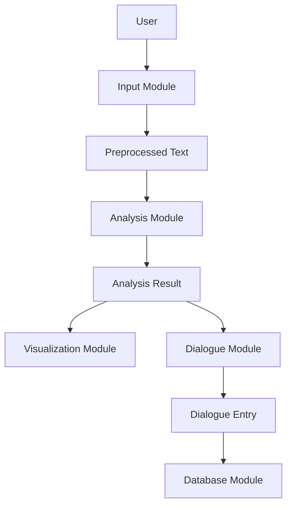

                 


### 1. The Emergence and Development of Hermeneutics

Hermeneutics, a discipline that deals with the interpretation of texts, has a rich history that spans several centuries. At its core, hermeneutics aims to uncover the meaning of written or spoken words by examining the context, intentions, and linguistic nuances of the text. The term "hermeneutics" is derived from the Greek word "hermeneuein," which means "to interpret" or "to explain."

**1.1 Early Development of Hermeneutics**

The origins of hermeneutics can be traced back to ancient civilizations, particularly in Greece and Rome. In ancient Greece, philosophers like Socrates, Plato, and Aristotle engaged in dialogues that emphasized the importance of understanding the intentions and meanings behind words. These dialogues laid the groundwork for interpreting texts in a broader philosophical context.

In ancient Rome, the practice of hermeneutics was primarily applied to legal texts and historical documents. The Roman lawyer and statesman, Marcus Tullius Cicero, is often credited with formalizing hermeneutical principles in his work "De Interpretatione." Cicero's approach to interpretation emphasized the importance of context and intent in understanding written texts.

**1.2 Key Theorists in the Development of Hermeneutics**

- **St. Augustine (354-430 AD)**: The early Christian philosopher, St. Augustine, made significant contributions to hermeneutics by developing a theological approach to interpretation. His work, "De Doctrina Christiana," provided a framework for interpreting Scripture and other religious texts.

- **Martin Luther (1483-1546)**: The Protestant Reformation brought new attention to the importance of interpreting the Bible. Martin Luther emphasized the principle of "sola scriptura," which states that Scripture is the ultimate authority in Christian doctrine. His approach to interpretation focused on the literal meaning of the text.

- **Friedrich Schleiermacher (1768-1834)**: Schleiermacher is considered one of the founders of modern hermeneutics. He emphasized the importance of understanding the "精神状态" (spiritual state) of the author and the reader in the interpretation process. His work, "On the Interpretation of the Holy Scriptures," laid the groundwork for subsequent developments in hermeneutical theory.

- **Wilhelm Dilthey (1833-1909)**: Dilthey is known as the father of hermeneutic philosophy. He argued that the social sciences should be treated as interpretive disciplines, similar to the humanities. His concept of "hermeneutic understanding" emphasized the subjective nature of interpretation and the importance of historical context.

**1.3 The Influence of Gadamer and Ricoeur**

Hans-Georg Gadamer (1900-2002) and Paul Ricoeur (1913-2005) are two of the most influential hermeneutic philosophers of the 20th century. Their work has had a profound impact on the field of hermeneutics and has inspired subsequent generations of scholars to explore new dimensions of interpretation.

Gadamer's major work, "Truth and Method" (1960), introduced the concept of the "hermeneutic circle," which emphasizes the interconnectedness of the parts and the whole in interpretation. His ideas have been widely discussed and debated, influencing various fields, including philosophy, literature, and cultural studies.

Ricoeur's contributions to hermeneutics are evident in his work on narrative and symbolism. His concept of "the hermeneutics of human sciences" emphasizes the importance of narrative in understanding human experience and the role of symbolism in interpretation. Ricoeur's ideas have been applied to various disciplines, including psychology, sociology, and literary theory.

In summary, hermeneutics has evolved over centuries, with key contributions from thinkers like St. Augustine, Martin Luther, Friedrich Schleiermacher, and Wilhelm Dilthey. Gadamer and Ricoeur's work has further enriched the field, providing new perspectives and methodologies for interpreting texts and understanding human experience.

### 2. Core Concepts and Fundamental Principles of Hermeneutics

Hermeneutics is a discipline that delves into the art and science of interpretation, aiming to uncover the meanings embedded in written or spoken texts. At its core, hermeneutics revolves around several key concepts and fundamental principles that guide the interpretation process. These principles help to ensure that interpretations are as accurate and comprehensive as possible.

#### 2.1 Understanding and Interpretation

The primary goal of hermeneutics is to achieve a deep and accurate understanding of a text. This involves interpreting the text's meaning, context, and intentions. Understanding and interpretation are closely linked; one cannot truly understand a text without interpreting it, and interpretation requires a foundation of understanding to be meaningful.

- **Understanding**: Understanding involves grasping the meaning of a text as a whole, including its content, context, and the author's intentions. This process requires the interpreter to engage with the text on a personal level, seeking to uncover its underlying message and purpose.

- **Interpretation**: Interpretation is the process of making sense of the text, translating it into a form that is comprehensible to the reader. It involves analyzing the text's structure, language, and context to uncover its meaning. Interpretation is subjective to some extent, as different readers may interpret the same text differently based on their own perspectives and experiences.

#### 2.2 Preunderstanding and Truth

Preunderstanding is a crucial concept in hermeneutics. It refers to the prior knowledge, experiences, and beliefs that a reader brings to the interpretation process. Preunderstanding influences the interpretation of a text, as it shapes the reader's perspective and influences how they understand and interpret the text.

- **Preunderstanding**: Preunderstanding can be seen as a lens through which the text is viewed. It includes the reader's background knowledge, cultural context, and personal experiences. Preunderstanding is not a hindrance to accurate interpretation but rather a necessary component of it. It allows the reader to make connections between the text and their own experiences, facilitating a deeper understanding of the text.

- **Truth**: Truth in hermeneutics is not a fixed and absolute concept but rather a dynamic process of uncovering the meaning of a text. Truth is not solely determined by the text itself but is also influenced by the reader's preunderstanding and interpretation. In hermeneutics, truth is seen as a shared understanding that emerges through dialogue and communication between the text and the reader.

#### 2.3 Dialogue and Communication

Dialogue and communication are essential aspects of hermeneutics. Hermeneutic interpretation is not a solitary process but rather a collaborative one, involving a dialogue between the text and the reader. This dialogue allows for the exchange of perspectives, ideas, and interpretations, leading to a deeper and more comprehensive understanding of the text.

- **Dialogue**: Dialogue involves engaging with the text in a conversation-like manner, exploring its meaning, context, and intentions. It requires the reader to actively engage with the text, asking questions, making connections, and reflecting on their own perspectives and biases.

- **Communication**: Communication in hermeneutics is the process of sharing and exchanging interpretations and insights with others. This can be done through written or spoken discourse, or through more interactive forms of communication, such as discussions, debates, and seminars. Communication helps to validate and refine interpretations, as it allows readers to share their insights and challenge each other's perspectives.

In summary, hermeneutics is grounded in the concepts of understanding and interpretation, preunderstanding and truth, and dialogue and communication. These principles guide the interpretation process, ensuring that it is accurate, comprehensive, and dynamic. By engaging with these principles, readers can gain a deeper and more nuanced understanding of texts, leading to more meaningful and insightful interpretations.

#### 2.4 Key Theorists in the Development of Hermeneutics

The history of hermeneutics is marked by the contributions of several influential thinkers who have shaped the field over the centuries. Among these, Friedrich Schleiermacher and Wilhelm Dilthey stand out as pivotal figures in the development of hermeneutic philosophy.

**2.4.1 Friedrich Schleiermacher**

Friedrich Schleiermacher (1768-1834) is often considered one of the founders of modern hermeneutics. His work emphasized the importance of understanding the "spiritual state" of the author and the reader in the interpretation process. Schleiermacher argued that interpretation should not be solely focused on the literal meaning of the text but should also consider the intentions and emotions of the author.

One of Schleiermacher's most significant contributions to hermeneutics is his concept of "hermeneutic insight." He believed that true understanding could only be achieved through a process of mutual understanding between the reader and the text. This insight required the reader to engage with the text on a personal level, drawing on their own experiences and preunderstanding to uncover its deeper meaning.

**2.4.2 Wilhelm Dilthey**

Wilhelm Dilthey (1833-1909) is known as the father of hermeneutic philosophy. He extended Schleiermacher's ideas and developed a comprehensive theory of hermeneutics that emphasized the importance of understanding human experience and culture. Dilthey argued that the social sciences should be treated as interpretive disciplines, similar to the humanities.

Dilthey's key concept of "hermeneutic understanding" emphasized the subjective nature of interpretation and the importance of historical context. He believed that understanding human behavior and culture required a deep engagement with the experiences and perspectives of the people being studied. This approach to hermeneutics laid the foundation for subsequent developments in fields such as psychology, sociology, and literary theory.

**2.4.3 Comparative Contributions and Influence**

Schleiermacher and Dilthey made distinct contributions to the development of hermeneutics, yet their ideas share common themes. Both emphasized the importance of understanding the subjective experiences of both the author and the reader, as well as the role of historical context in interpretation.

- **Shared Emphasis on Subjectivity**: Both Schleiermacher and Dilthey recognized the subjective nature of interpretation and the role of the reader's preunderstanding in shaping their understanding of a text. They believed that interpretation was not a purely objective process but rather an interactive one, involving a dialogue between the text and the reader.

- **Role of Historical Context**: Both thinkers underscored the importance of historical context in interpretation. Schleiermacher argued that understanding the "spiritual state" of the author was essential for interpreting a text, while Dilthey emphasized the need to consider the cultural and historical background of the people being studied.

- **Influence on Contemporary Thought**: The ideas of Schleiermacher and Dilthey have had a lasting impact on contemporary hermeneutics and related fields. Their emphasis on subjectivity and historical context has influenced a wide range of disciplines, from philosophy and literature to psychology and sociology.

In conclusion, Friedrich Schleiermacher and Wilhelm Dilthey were pivotal figures in the development of hermeneutic philosophy. Their contributions have shaped the field and continue to influence contemporary thought. By emphasizing the importance of subjective experience, historical context, and the interactive nature of interpretation, they laid the foundation for a more nuanced and comprehensive understanding of hermeneutics.

#### 2.5 Gadamer's Hermeneutics: The Concept of the Hermeneutic Circle

Hans-Georg Gadamer (1900-2002) is one of the most influential hermeneutic philosophers of the 20th century. His seminal work, "Truth and Method" (1960), introduced the concept of the "hermeneutic circle," which has become a central tenet of hermeneutic thought. The hermeneutic circle is a principle that emphasizes the interconnectedness of the parts and the whole in the interpretation process.

**2.5.1 The Hermeneutic Circle: Concept and Application**

The hermeneutic circle is a dynamic process that involves interpreting the parts of a text in the context of the whole, while also understanding the whole through an understanding of its parts. This cyclical process ensures that the interpretation is both comprehensive and cohesive.

- **Interpreting the Parts in the Context of the Whole**: The hermeneutic circle begins with a focus on the individual parts of a text, such as sentences, paragraphs, or sections. The interpreter examines these parts to uncover their meaning within the broader context of the text as a whole. This process requires the interpreter to consider the relationships between different parts of the text and how they contribute to the overall meaning.

- **Understanding the Whole through Its Parts**: Conversely, the hermeneutic circle also involves understanding the text as a whole by examining its individual parts. This involves identifying the central themes, arguments, and messages of the text and understanding how they are developed and supported throughout the text.

**2.5.2 Applications in Hermeneutics**

The hermeneutic circle has been widely applied in various fields, including philosophy, literature, and cultural studies. It provides a framework for interpreting texts that acknowledges the complexity and interconnectedness of meaning.

- **Philosophy**: In philosophical discourse, the hermeneutic circle is used to interpret philosophical texts, such as works by Plato, Nietzsche, and Heidegger. Philosophers use the hermeneutic circle to uncover the underlying ideas and arguments within these texts, understanding them in the context of the whole work and the broader philosophical tradition.

- **Literature**: In literary studies, the hermeneutic circle is used to interpret literature, including novels, poems, and plays. Literary critics analyze the individual words, sentences, and scenes in a text, understanding them in the context of the entire work. This approach allows for a deeper understanding of the author's intentions and the themes and messages conveyed through the text.

- **Cultural Studies**: In cultural studies, the hermeneutic circle is used to interpret cultural phenomena, such as films, music, and art. Scholars examine the individual elements of a cultural artifact, such as its visual elements, lyrics, or script, understanding them in the context of the entire work and the cultural context in which it was created.

**2.5.3 The Role of the Hermeneutic Circle in Interpretation**

The hermeneutic circle plays a crucial role in the interpretation process by ensuring that interpretations are both comprehensive and cohesive. It allows for a deep engagement with the text, uncovering its meaning at multiple levels and ensuring that the interpretation is consistent with the overall message of the text.

- **Ensuring Comprehensive Interpretation**: The hermeneutic circle ensures that the interpretation is comprehensive by considering the text as a whole. This involves understanding the relationships between different parts of the text and how they contribute to the overall meaning. It prevents the interpretation from being fragmented or superficial, allowing for a more holistic understanding of the text.

- **Ensuring Cohesive Interpretation**: The hermeneutic circle also ensures that the interpretation is cohesive by allowing the interpreter to understand the whole text through its parts. This helps to maintain consistency in the interpretation, ensuring that the parts are interpreted in a way that supports the overall message of the text. It prevents the interpretation from being fragmented or contradictory.

In conclusion, Hans-Georg Gadamer's concept of the hermeneutic circle is a key principle in hermeneutic thought. It emphasizes the interconnectedness of the parts and the whole in the interpretation process, providing a framework for comprehensive and cohesive interpretations. The hermeneutic circle has been widely applied in various fields, demonstrating its relevance and usefulness in understanding texts and cultural phenomena.

### 2.6 Gadamer's Key Contributions to Hermeneutics

Hans-Georg Gadamer (1900-2002) is widely regarded as one of the most influential hermeneutic philosophers of the 20th century. His work, particularly his seminal text "Truth and Method" (1960), has had a profound impact on the field of hermeneutics. In this section, we will explore some of Gadamer's key contributions to hermeneutics, focusing on the role of preunderstanding in interpretation, the hermeneutic circle, and the concept of dialogue and communication.

#### 2.6.1 The Role of Preunderstanding in Interpretation

Preunderstanding is a crucial concept in Gadamer's hermeneutics. It refers to the prior knowledge, experiences, and beliefs that a reader brings to the interpretation process. According to Gadamer, preunderstanding is not a limitation on accurate interpretation but rather a necessary component of it. In fact, preunderstanding is what allows readers to make sense of new information and connect it to their existing understanding.

Gadamer argues that preunderstanding is inherent in all human understanding. We cannot approach a text with a completely blank slate; instead, we bring with us our own perspectives, cultural background, and personal experiences. These preunderstandings shape our interpretation of the text and help us to uncover its meaning.

**Key Ideas:**

- **Preunderstanding as a Resource**: Gadamer sees preunderstanding as a valuable resource rather than a hindrance. It allows readers to engage with the text in a meaningful way, drawing on their own experiences to make connections and gain insights.

- **Openness to the Text**: Gadamer emphasizes the importance of openness to the text. This means that readers should be willing to let the text speak for itself and to engage with it in a spirit of dialogue. By being open to the text, readers can overcome their preconceptions and uncover new meaning.

- **Fusion of Horizons**: Gadamer introduces the concept of "fusion of horizons" to describe the process of bringing together the reader's preunderstanding and the meaning of the text. This fusion creates a new understanding that transcends both the reader's preunderstanding and the meaning of the text as it stands.

#### 2.6.2 The Hermeneutic Circle

One of Gadamer's most influential ideas is the "hermeneutic circle." The hermeneutic circle is a principle that emphasizes the interconnectedness of the parts and the whole in the interpretation process. It suggests that we can only understand the parts of a text by understanding the whole, and we can only understand the whole by understanding its parts. This cyclical process ensures that interpretations are both comprehensive and cohesive.

**Key Ideas:**

- **Interconnectedness**: The hermeneutic circle highlights the interconnectedness of different parts of a text. By understanding the parts in relation to the whole, we can uncover the underlying meaning and structure of the text.

- **Dynamic Process**: The hermeneutic circle is not a static concept but a dynamic process. As we interpret the parts of a text, we gain new insights that help us to understand the whole, and as we understand the whole, we gain new insights that help us to interpret the parts.

- **Comprehensiveness and Cohesiveness**: The hermeneutic circle ensures that interpretations are both comprehensive and cohesive. By understanding the parts in relation to the whole, we can avoid superficial or fragmented interpretations.

#### 2.6.3 Dialogue and Communication

For Gadamer, interpretation is not a solitary activity but a form of dialogue. He sees interpretation as a process of communication between the text and the reader, involving a mutual exchange of perspectives and insights. This dialogue is essential for uncovering the true meaning of a text and overcoming the limitations of preunderstanding.

**Key Ideas:**

- **Dialogue as a Form of Communication**: Dialogue is a key concept in Gadamer's hermeneutics. It involves a mutual exchange of perspectives and insights, allowing readers to engage with the text in a meaningful way.

- **Overcoming Preconceptions**: Through dialogue, readers can overcome their preconceptions and engage with the text in a more open and receptive manner. This allows for a deeper and more nuanced understanding of the text.

- **Shared Understanding**: Dialogue also helps to create a shared understanding between the text and the reader. This shared understanding is what makes interpretation meaningful and contributes to the ongoing dialogue between past and present.

In conclusion, Hans-Georg Gadamer's contributions to hermeneutics are profound and far-reaching. His ideas on preunderstanding, the hermeneutic circle, and dialogue and communication provide a framework for interpreting texts in a way that is both comprehensive and cohesive. By engaging with these concepts, readers can gain a deeper and more nuanced understanding of the texts they encounter.

### 2.7 Critiques and Controversies Surrounding Gadamer's Theory

Despite the widespread influence and acclaim of Hans-Georg Gadamer's hermeneutic philosophy, his theory has not been without its critics and controversies. Scholars and philosophers have raised several concerns regarding the applicability, scope, and limitations of Gadamer's ideas. This section will explore some of the key critiques and controversies associated with Gadamer's hermeneutics.

**2.7.1 Critics' Perspectives**

- **Overemphasis on Preunderstanding**: One of the main criticisms of Gadamer's theory is the overemphasis on preunderstanding. Critics argue that this approach can lead to subjective and biased interpretations, as readers bring their own preconceptions and perspectives to the interpretation process. This can result in a loss of objectivity and a failure to truly uncover the original meaning of the text.

- **The Role of the Reader**: Another point of contention is the extent to which the reader's role in interpretation should be emphasized. While Gadamer's concept of dialogue and communication highlights the importance of the reader's perspective, some critics argue that this approach undermines the author's intent and the text's original meaning. They claim that the reader's interpretation should not overshadow the author's voice.

- **The Hermeneutic Circle**: The hermeneutic circle, a central concept in Gadamer's theory, has also been criticized. Critics argue that it can lead to circular reasoning, where interpretations are constantly being revised and refined without ever reaching a definitive conclusion. This can result in a lack of clarity and precision in interpretation.

**2.7.2 Impact on Contemporary Discourse**

The critiques and controversies surrounding Gadamer's hermeneutics have had a significant impact on contemporary discourse in several ways:

- **Scholarly Debates**: The debates surrounding Gadamer's ideas have fueled ongoing scholarly discussions in the fields of philosophy, literature, and cultural studies. These debates have prompted scholars to reconsider the nature of interpretation and the role of the reader in the interpretation process.

- **Alternative Approaches**: The critiques of Gadamer's theory have led to the development of alternative approaches to interpretation. Scholars have explored other methodologies, such as deconstruction and poststructuralism, which offer different perspectives on the nature of meaning and interpretation.

- **Reevaluation of Hermeneutics**: The controversies have also prompted a reevaluation of hermeneutic philosophy as a whole. Scholars have sought to refine and expand on Gadamer's ideas, addressing some of the limitations and criticisms raised by his critics.

In conclusion, while Hans-Georg Gadamer's hermeneutic philosophy has had a profound impact on the field of interpretation, it has also faced significant critiques and controversies. The ongoing debates and discussions have contributed to the development of new approaches and perspectives in hermeneutics, ensuring that the discipline continues to evolve and adapt to changing intellectual landscapes.

### 3. The Philosophical Ideas of Paul Ricoeur

Paul Ricoeur (1913-2005) is another pivotal figure in the development of hermeneutic philosophy, alongside Hans-Georg Gadamer. Ricoeur's work is renowned for its rich exploration of narrative, symbolism, and the human condition. His contributions have had a profound impact on various disciplines, including philosophy, psychology, and literary theory. This section will delve into Ricoeur's philosophical ideas, focusing on his concept of narrative and its role in hermeneutics.

**3.1 Ricoeur's Biography and Intellectual Influence**

Paul Ricoeur was born on February 27, 1913, in the small town of Valence, France. He grew up in a family of academic lineage, with his father being a professor of law. Ricoeur's academic career was marked by a series of significant appointments and achievements. He studied at the University of Lyon and later earned his doctorate in philosophy from the University of Paris in 1937.

Ricoeur's intellectual journey was profoundly influenced by the works of several key philosophers, including Martin Heidegger, Edmond Husserl, and Emmanuel Levinas. He was particularly inspired by the existentialist philosophy of Jean-Paul Sartre and the phenomenological approach of Husserl. Ricoeur's own philosophical views evolved over time, leading to the development of his unique hermeneutic approach.

Ricoeur held various academic positions throughout his career, including appointments at the University of Strasbourg, the University of Chicago, and the University of Paris-Sorbonne. His work was widely translated and received international recognition, making him one of the most influential philosophers of his generation.

**3.2 The Concept of Narrative in Ricoeur's Thought**

One of Ricoeur's most significant contributions to hermeneutics is his concept of narrative. For Ricoeur, narrative is not just a literary form but a fundamental structure of human experience. He argues that narratives provide a way for us to make sense of our lives and understand the world around us. Narrative plays a crucial role in hermeneutics, as it helps us to interpret and understand texts, both written and spoken.

**Key Ideas:**

- **Narrative as a Means of Understanding**: Ricoeur posits that narrative is a natural way for humans to understand and organize their experiences. Stories provide a structure that allows us to make sense of complex events and relationships, connecting the past, present, and future.

- **The Function of Narrative in Hermeneutics**: In hermeneutics, narrative serves as a tool for interpreting texts. By analyzing the narrative structure of a text, readers can uncover its underlying themes, messages, and intentions. Narrative also enables readers to engage with the text on a personal level, drawing on their own experiences and preunderstanding.

**3.2.1 The Function of Narrative in Understanding Human Experience**

Ricoeur's focus on narrative extends beyond the realm of hermeneutics to encompass human experience as a whole. He argues that narrative is intrinsic to the human condition and serves as a means of understanding our own lives and the lives of others.

- **Life as Narrative**: Ricoeur suggests that life itself can be seen as a narrative. Each individual constructs a personal narrative that gives meaning and coherence to their experiences. This narrative is shaped by personal choices, events, and relationships, and it evolves over time.

- **The Role of Narrative in Self-Understanding**: Narrative plays a crucial role in self-understanding. By reflecting on our own lives through the lens of narrative, we can gain insights into our own identity, values, and motivations. Narrative also helps us to make sense of our past and navigate our future.

**3.2.2 Narrative and Interpretation**

In the context of interpretation, Ricoeur's concept of narrative provides a framework for understanding the complexities of human experience. By analyzing the narrative structure of a text, readers can uncover its underlying meanings and messages. Narrative enables readers to engage with the text on a deeper level, drawing on their own experiences and preunderstanding to make sense of the text.

- **Narrative and Meaning**: Ricoeur emphasizes that narrative is not just a form of storytelling but also a way of conveying meaning. The structure of a narrative, including its plot, characters, and themes, all contribute to the meaning of the text.

- **Narrative and Interpretation Process**: The process of interpretation involves engaging with the narrative structure of a text, analyzing its components, and drawing connections between them. This process requires readers to be active participants in the interpretation, using their own perspectives and experiences to make sense of the text.

In conclusion, Paul Ricoeur's philosophical ideas have significantly contributed to the field of hermeneutics. His concept of narrative provides a powerful framework for understanding human experience and interpreting texts. By emphasizing the role of narrative in hermeneutics, Ricoeur has enriched our understanding of the interpretive process and the complexities of human meaning-making.

### 3.3 Ricoeur's Key Theories and Applications

Paul Ricoeur's contributions to hermeneutics are deeply rooted in his exploration of narrative, symbolism, and the human experience. His key theories have had a profound impact on various disciplines, providing frameworks for understanding and interpreting both written texts and human life. This section will delve into Ricoeur's key theories and their applications in hermeneutics, focusing on the function of narrative in understanding human experience, the symbolism of language, and the role of emotion in hermeneutics.

**3.3.1 The Function of Narrative in Understanding Human Experience**

For Ricoeur, narrative is not merely a literary device but a fundamental structure of human experience. He posits that narrative functions as a means of making sense of our lives and the world around us. Narrative enables us to organize our experiences into a coherent sequence, providing a sense of continuity and purpose.

- **Life as Narrative**: Ricoeur contends that life itself can be seen as a narrative. Each individual constructs a personal narrative that gives meaning and coherence to their experiences. This narrative is shaped by personal choices, events, and relationships, and it evolves over time. By reflecting on our own lives through the lens of narrative, we can gain insights into our identity, values, and motivations.

- **Narrative as a Tool for Self-Understanding**: Narrative is an essential tool for self-understanding. It allows us to reflect on our past experiences and consider their implications for our present and future. By engaging with our own personal narrative, we can identify patterns, themes, and lessons that inform our self-concept and guide our actions.

- **Narrative in Textual Interpretation**: In hermeneutics, narrative serves as a crucial tool for interpreting written texts. By analyzing the narrative structure of a text, readers can uncover its underlying themes, messages, and intentions. Narrative also enables readers to engage with the text on a deeper level, drawing on their own experiences and preunderstanding to make sense of the text. This process of interpretation is not a passive act but an active engagement with the text's narrative framework.

**3.3.2 The Symbolism of Language**

Ricoeur's exploration of symbolism is another important aspect of his hermeneutic theory. He argues that language is inherently symbolic, and the meanings we derive from language are not fixed or objective but are shaped by our interpretations and experiences.

- **Symbols and Meaning**: Symbols are the building blocks of language, and their meanings are constructed through interpretation. Ricoeur contends that symbols are not mere representations of things but are invested with meanings that can vary across different contexts and cultures. The interpretation of symbols requires an understanding of the cultural and historical contexts in which they are used.

- **The Role of Symbolism in Textual Interpretation**: In the interpretation of texts, symbolism plays a crucial role. The meanings we ascribe to words and phrases are not solely determined by their literal definitions but are influenced by the broader symbolic meanings that are embedded in language. By analyzing the symbolism in a text, readers can uncover its deeper layers of meaning and gain insights into the author's intentions and messages.

**3.3.3 The Role of Emotion in Hermeneutics**

Ricoeur also emphasizes the role of emotion in the hermeneutic process. He argues that emotions are integral to our understanding of texts and our interpretation of human experiences.

- **The Emotive Power of Language**: Ricoeur suggests that language has an emotive power that can engage our emotions and foster empathy. The language used in a text can evoke emotions in readers, creating a connection between the text and the reader. This emotional engagement is a crucial aspect of interpretation, as it allows readers to experience the text on a deeper level.

- **The Role of Emotion in Self-Understanding**: Emotions also play a significant role in self-understanding. By engaging with our emotions, we can gain insights into our own values, beliefs, and experiences. Emotions can provide a lens through which we can reflect on our own lives and consider how our interpretations and understandings of texts relate to our own emotional experiences.

- **The Role of Emotion in Interpretation**: In the process of interpretation, emotions can influence our understanding and interpretation of a text. Emotions can shape our perspective and influence how we engage with the text. By acknowledging and reflecting on our emotions, we can gain a more comprehensive understanding of the text and its implications for our own lives.

In conclusion, Paul Ricoeur's key theories on narrative, symbolism, and emotion provide rich frameworks for understanding and interpreting both written texts and human experiences. His ideas have enriched hermeneutics by emphasizing the importance of narrative structure, the emotive power of language, and the role of emotions in the interpretive process. By engaging with Ricoeur's theories, readers can develop a more nuanced and empathetic approach to interpretation, fostering deeper understanding and connection with the texts they encounter.

### 3.4 The Integration of Ricoeur's Hermeneutics with Other Theories

Paul Ricoeur's hermeneutic philosophy has had a significant impact on various academic disciplines, influencing a wide range of theories and methodologies. His ideas on narrative, symbolism, and emotion have been particularly influential in fields such as psychology, sociology, and literary theory. This section will explore the integration of Ricoeur's hermeneutics with other theories, highlighting how his concepts have been applied and expanded upon in these disciplines.

**3.4.1 Integration with Psychology**

In psychology, Ricoeur's hermeneutic approach has been applied to the study of narrative therapy, which focuses on the role of storytelling in the process of understanding and healing psychological distress. Narrative therapy posits that individuals construct personal narratives that shape their identities and experiences. By engaging in narrative processes, individuals can reflect on their lives, challenge dominant narratives, and reconstruct their identities in more empowering ways.

- **Narrative Therapy**: Narrative therapy draws on Ricoeur's ideas on narrative as a fundamental structure of human experience. Therapists use narrative techniques to help clients explore their personal narratives, identify dominant narratives that may be contributing to psychological distress, and develop new narratives that promote resilience and well-being.

- **Narrative as a Tool for Self-Understanding**: In psychology, Ricoeur's concept of narrative as a tool for self-understanding has been applied to various therapeutic practices. By reflecting on their personal narratives, individuals can gain insights into their own psychological experiences and develop a deeper understanding of themselves.

**3.4.2 Integration with Sociology**

Ricoeur's hermeneutic philosophy has also been integrated with sociological theories, particularly in the field of social constructivism. Social constructivists argue that reality is constructed through language, symbols, and social interactions. Ricoeur's ideas on symbolism and narrative align well with this perspective, providing a framework for understanding how social realities are constructed and interpreted.

- **Social Construction of Reality**: In sociology, Ricoeur's concept of symbolism is used to understand how social realities are constructed through language and symbols. Symbols play a crucial role in shaping social meanings and beliefs, influencing individuals' perceptions of themselves and their social environment.

- **Narrative as a Tool for Social Analysis**: Ricoeur's ideas on narrative have been applied to social analysis, helping sociologists to understand social structures, cultures, and ideologies. By analyzing the narratives that underpin social phenomena, sociologists can uncover the underlying meanings and values that shape social realities.

**3.4.3 Integration with Literary Theory**

Literary theory has been significantly influenced by Ricoeur's hermeneutic philosophy. His ideas on narrative, symbolism, and interpretation have been used to analyze literary works, providing a deeper understanding of the complexities of literary meaning.

- **Narrative Structure in Literature**: Ricoeur's concept of narrative structure has been applied to the analysis of literary works. Literary critics use narrative theory to examine the plot, characters, and themes of literary texts, exploring how these elements contribute to the overall meaning and significance of the work.

- **Symbolism in Literature**: Ricoeur's ideas on symbolism have been used to analyze the symbolic meanings embedded in literary texts. By examining the symbols and motifs in literature, critics can uncover the underlying themes and messages of the work, providing a richer understanding of the author's intentions and the work's cultural significance.

**3.4.4 The Role of Emotion in Interdisciplinary Studies**

Ricoeur's emphasis on the role of emotion in interpretation has also been integrated into interdisciplinary studies, influencing research in areas such as philosophy, education, and cultural studies. Emotion is recognized as a crucial aspect of human experience that shapes our interpretations and understanding of the world.

- **Emotion and Understanding**: In interdisciplinary research, Ricoeur's ideas on emotion are used to explore how emotional experiences influence our understanding and interpretation of texts, experiences, and social phenomena. Emotion is seen as an integral part of the interpretive process, shaping our perspectives and influencing our interpretations.

- **Emotional Engagement in Learning**: In education, Ricoeur's ideas on emotion have been applied to the study of learning and teaching. Emotional engagement is recognized as a key factor in effective learning, with emotional experiences enhancing students' understanding and connection to the learning material.

In conclusion, Paul Ricoeur's hermeneutic philosophy has had a significant and lasting impact on various academic disciplines. His concepts of narrative, symbolism, and emotion have been integrated with other theories, providing a rich framework for understanding and interpreting human experiences and cultural phenomena. By drawing on Ricoeur's ideas, scholars and practitioners across disciplines can develop a more nuanced and comprehensive understanding of the complexities of human meaning-making and interpretation.

### Conclusion: The Interconnectedness of Gadamer and Ricoeur's Hermeneutic Thought

In conclusion, the hermeneutic philosophies of Hans-Georg Gadamer and Paul Ricoeur offer profound insights into the interpretive process, each contributing unique perspectives that have enriched the field of hermeneutics. Gadamer's concept of the hermeneutic circle emphasizes the interconnectedness of the parts and the whole in interpretation, highlighting the importance of understanding texts within their broader context. His focus on preunderstanding and the role of dialogue and communication underscores the subjective nature of interpretation and the necessity of engaging with the text on a personal level.

Ricoeur's contributions, centered on narrative, symbolism, and the role of emotion, provide additional layers of depth to the hermeneutic process. His exploration of how narrative structures shape human experience and understanding has been particularly influential, offering a framework for interpreting both written texts and the complexities of human life. Ricoeur's emphasis on symbolism and the emotive power of language enriches our understanding of how meaning is constructed and interpreted.

The integration of their ideas in various disciplines further underscores the breadth and applicability of hermeneutic philosophy. From psychology to literary theory, the concepts developed by Gadamer and Ricoeur have been applied to explore the nuances of human experience and meaning-making.

Looking ahead, future research could delve deeper into the interconnections between hermeneutics and other disciplines, such as cognitive science and neuroscience, to better understand the cognitive processes underlying interpretation. Additionally, exploring the ethical implications of hermeneutic philosophy in areas such as law and ethics could provide new insights into how interpretation can be used to address complex moral and social issues.

In essence, the work of Gadamer and Ricoeur continues to inspire and challenge scholars to approach interpretation with a greater degree of nuance and depth. Their contributions have laid a solid foundation for further exploration in hermeneutic thought, ensuring that the discipline remains dynamic and relevant in the ever-evolving landscape of human understanding.

### Conclusion: The Interconnectedness of Gadamer and Ricoeur's Hermeneutic Thought

In conclusion, the hermeneutic philosophies of Hans-Georg Gadamer and Paul Ricoeur have profoundly impacted the field of hermeneutics, each offering unique perspectives that have enriched our understanding of interpretation. Gadamer's concept of the hermeneutic circle underscores the interconnectedness of the parts and the whole in the interpretive process, emphasizing the importance of understanding texts within their broader context. His focus on preunderstanding and the role of dialogue and communication highlights the subjective nature of interpretation and the necessity of engaging with the text on a personal level.

Ricoeur's contributions, centered on narrative, symbolism, and the role of emotion, provide additional layers of depth to the hermeneutic process. His exploration of how narrative structures shape human experience and understanding has been particularly influential, offering a framework for interpreting both written texts and the complexities of human life. Ricoeur's emphasis on symbolism and the emotive power of language enriches our understanding of how meaning is constructed and interpreted.

The integration of their ideas in various disciplines further underscores the breadth and applicability of hermeneutic philosophy. From psychology to literary theory, the concepts developed by Gadamer and Ricoeur have been applied to explore the nuances of human experience and meaning-making.

Looking ahead, future research could delve deeper into the interconnections between hermeneutics and other disciplines, such as cognitive science and neuroscience, to better understand the cognitive processes underlying interpretation. Additionally, exploring the ethical implications of hermeneutic philosophy in areas such as law and ethics could provide new insights into how interpretation can be used to address complex moral and social issues.

In essence, the work of Gadamer and Ricoeur continues to inspire and challenge scholars to approach interpretation with a greater degree of nuance and depth. Their contributions have laid a solid foundation for further exploration in hermeneutic thought, ensuring that the discipline remains dynamic and relevant in the ever-evolving landscape of human understanding.

### Summary and Key Insights

In this comprehensive exploration of the hermeneutic philosophies of Hans-Georg Gadamer and Paul Ricoeur, we have covered a vast array of concepts and ideas that have shaped the field of hermeneutics. Both philosophers have made significant contributions to our understanding of interpretation, each offering unique perspectives that complement and expand upon one another.

**Key Insights:**

1. **Hermeneutic Circle:** Gadamer's concept of the hermeneutic circle emphasizes the interconnectedness of parts and the whole in the interpretive process. This principle highlights that understanding the parts requires an understanding of the whole, and vice versa, creating a cyclical process of interpretation.

2. **Preunderstanding:** Gadamer's focus on preunderstanding underscores the role of the reader's prior knowledge, experiences, and beliefs in shaping interpretations. This perspective challenges the notion of objective interpretation, instead emphasizing the subjectivity inherent in the process.

3. **Narrative and Symbolism:** Ricoeur's exploration of narrative and symbolism provides a framework for understanding the human experience and interpreting written texts. His ideas on narrative structure and the emotive power of language offer deep insights into how meaning is constructed and understood.

4. **Emotion and Understanding:** Ricoeur's emphasis on the role of emotion in interpretation highlights the importance of emotional engagement in the interpretive process. This perspective enriches our understanding of how emotional experiences shape our interpretations and understanding of texts.

**Practical Applications:**

These insights have far-reaching implications across various fields, including psychology, sociology, literary theory, and cultural studies. For instance:

- **Narrative Therapy:** In psychology, Ricoeur's concepts of narrative and symbolism have been applied to narrative therapy, helping individuals reflect on their personal narratives to promote self-understanding and resilience.

- **Cultural Analysis:** In sociology, hermeneutic principles have been used to analyze the construction of cultural realities, providing insights into how symbols and narratives shape societal beliefs and values.

- **Literary Criticism:** Literary theorists have employed Ricoeur's ideas on narrative structure to analyze the complexity and richness of literary works, uncovering deeper layers of meaning and significance.

In summary, the hermeneutic philosophies of Gadamer and Ricoeur offer profound insights into the interpretive process, emphasizing the interconnectedness of understanding, the role of preunderstanding, the power of narrative, and the influence of emotion. These insights have had a lasting impact on various disciplines, providing a robust framework for interpreting texts and understanding human experiences.

### Best Practices and Considerations for Future Research

When engaging with the complex ideas presented by Gadamer and Ricoeur, there are several best practices and considerations that can enhance one's understanding and application of hermeneutic philosophy. These guidelines can be particularly useful for scholars, researchers, and practitioners across various disciplines.

**1. Deep Engagement with Texts:** One of the most essential practices is to engage deeply with the primary texts of Gadamer and Ricoeur. Reading their works carefully, reflecting on their arguments, and understanding the historical and philosophical contexts in which they were written is crucial. This approach allows for a more nuanced and accurate interpretation of their ideas.

**2. Integrative Thinking:** Given the interdisciplinary nature of hermeneutics, it is beneficial to adopt an integrative approach that combines insights from multiple fields. For instance, integrating Ricoeur's narrative theories with cognitive science can provide a richer understanding of how narratives shape human cognition and emotion.

**3. Contextual Awareness:** Recognize the importance of context in interpretation. Both Gadamer and Ricoeur emphasize the role of historical and cultural context in shaping interpretations. Being aware of the socio-cultural backdrop of the texts being interpreted can help avoid anachronistic readings and provide a more accurate understanding of the author's intent.

**4. Reflective Practice:** Engage in reflective practice, both in reading and interpretation. Reflect on your own preunderstandings and biases, and consider how these might influence your interpretations. This reflective process can lead to a more balanced and comprehensive understanding of the text.

**5. Critical Analysis:** Approach the texts with a critical eye. While Gadamer and Ricoeur's ideas are influential, it is important to critically assess their limitations and implications. This critical perspective can foster a more dynamic and evolving understanding of hermeneutics.

**6. Dialogue and Collaboration:** Embrace dialogue and collaboration. Engaging in discussions with peers and experts can challenge and expand your understanding of hermeneutic concepts. This collaborative approach can also facilitate the integration of hermeneutic principles with other disciplines.

**7. Application to Practice:** Finally, apply hermeneutic principles to practical contexts. Whether in therapy, social analysis, or literary criticism, the principles of hermeneutics can provide valuable insights and methodologies for addressing complex interpretive challenges.

By following these best practices and considerations, scholars and practitioners can deepen their engagement with hermeneutic philosophy, fostering a more comprehensive and insightful approach to interpretation.

### Project Overview and Main Functions

In this section, we will provide an overview of the project we will be discussing, detailing its main functions and the problems it aims to solve. The project focuses on developing a comprehensive hermeneutic analysis tool that leverages the philosophies of Hans-Georg Gadamer and Paul Ricoeur. The primary goal is to create a system that can assist scholars, researchers, and practitioners in interpreting and analyzing texts, providing a deeper understanding of the underlying meanings and contexts.

#### Project Overview

The project is designed to be a multi-functional platform that combines the principles of hermeneutics with advanced computational techniques. It aims to offer a user-friendly interface that allows users to input texts and receive detailed hermeneutic analyses based on the philosophies of Gadamer and Ricoeur.

#### Main Functions

1. **Text Input and Preprocessing:** The system allows users to input various types of texts, including literary works, philosophical texts, and documents. The system will preprocess the input texts to prepare them for analysis, including tasks such as text normalization, tokenization, and part-of-speech tagging.

2. **Hermeneutic Analysis:** Utilizing Gadamer's hermeneutic circle and Ricoeur's narrative and symbolic theories, the system will provide a comprehensive analysis of the input texts. This includes identifying key themes, symbols, and narrative structures, as well as generating insights into the author's intentions and the text's broader context.

3. **Interactive Dialogue:** The platform will feature an interactive dialogue function, enabling users to engage with the system's analysis and provide feedback. This dialogue can help refine interpretations and deepen the understanding of the text.

4. **Cognitive Support:** The system will incorporate cognitive support features, such as summaries, annotations, and highlighted key points, to assist users in navigating and understanding the complex interpretive process.

5. **Data Visualization:** To enhance the interpretive process, the platform will include data visualization tools that can represent the text's structure, themes, and relationships in a visual format. This can help users gain a more intuitive understanding of the text's content and meaning.

#### Problems to Solve

The project aims to address several key challenges in hermeneutic analysis:

1. **Complexity of Interpretation:** Hermeneutic analysis can be a complex and time-consuming process. The project aims to streamline this process by providing automated tools that can assist in the analysis of texts, making it more accessible and efficient.

2. **Subjectivity in Interpretation:** Interpretation is inherently subjective, and different readers may come to different conclusions about the same text. The project will help mitigate this by offering a structured approach that considers both Gadamer's and Ricoeur's theories, providing a more balanced perspective.

3. **Lack of Contextual Understanding:** Understanding the historical and cultural context of a text is crucial for accurate interpretation. The platform will help users contextualize the text within its broader historical and cultural framework, enhancing the depth of analysis.

4. **Interdisciplinary Integration:** Integrating hermeneutic principles with other disciplines, such as cognitive science and computer science, can lead to more comprehensive and innovative approaches to interpretation. The project aims to facilitate this interdisciplinary integration through its design.

By addressing these challenges, the project will provide a valuable tool for anyone involved in hermeneutic analysis, from scholars and researchers to educators and practitioners.

### System Introduction and Technical Background

In this section, we will delve into the technical background of the hermeneutic analysis tool project, providing an overview of the system's architecture and key components. We will also discuss the technologies and frameworks utilized in the development of the project.

#### System Architecture

The hermeneutic analysis tool is designed as a modular system, consisting of several core components that work together to provide a comprehensive analysis of input texts. The architecture is divided into the following main modules:

1. **Input Module:** This module is responsible for receiving and preprocessing the input texts. It includes functionalities such as text normalization, tokenization, and part-of-speech tagging. This module ensures that the input texts are in a suitable format for further analysis.

2. **Analysis Module:** The analysis module is the core of the system, implementing the hermeneutic principles of Hans-Georg Gadamer and Paul Ricoeur. This module includes algorithms for identifying key themes, symbols, and narrative structures, as well as for generating insights into the author's intentions and the text's broader context. The analysis module is also responsible for integrating cognitive support features, such as summaries, annotations, and highlighted key points.

3. **Dialogue Module:** The dialogue module enables interactive communication between the user and the system. It allows users to provide feedback on the system's analysis and receive personalized responses. This module is designed to facilitate a dynamic and iterative process of interpretation, encouraging deeper engagement with the text.

4. **Visualization Module:** The visualization module provides data visualization tools that help users understand the text's structure, themes, and relationships in a visual format. This module includes various chart types and graphical representations, such as word clouds, network diagrams, and timeline visualizations.

5. **Database Module:** The database module stores the input texts, analysis results, and user data. It ensures the secure and efficient management of data, allowing for easy access and retrieval of information.

#### Technical Background

The development of the hermeneutic analysis tool project involved the use of several advanced technologies and frameworks. Here, we will discuss the key technologies and frameworks utilized in the project:

1. **Programming Languages:** The system is primarily developed using Python, a versatile and widely-used programming language known for its readability and extensive library support. Python is used for implementing the core algorithms, managing the system's modules, and handling data processing tasks.

2. **Frameworks and Libraries:** Several frameworks and libraries are used to support the development of the system. These include:

   - **Flask:** Flask is a lightweight web framework used for developing the web application's backend. It provides the necessary functionality for handling HTTP requests, managing user sessions, and implementing the system's API endpoints.

   - **TensorFlow:** TensorFlow is an open-source machine learning framework used for implementing the natural language processing (NLP) components of the system. It allows for the development of advanced NLP models for tasks such as text classification, sentiment analysis, and named entity recognition.

   - **NLTK:** NLTK (Natural Language Toolkit) is a comprehensive library for working with human language data. It provides tools for text preprocessing, tokenization, part-of-speech tagging, and other NLP tasks.

   - **Matplotlib and Seaborn:** These libraries are used for generating data visualizations within the system. They provide a wide range of chart types and customization options, enabling the creation of interactive and informative visual representations of the text's structure and themes.

3. **Database Management:** The system's database module is implemented using MySQL, a widely-used relational database management system (RDBMS). MySQL is chosen for its reliability, scalability, and ease of use. The database stores the input texts, analysis results, and user data, ensuring efficient data management and retrieval.

4. **Frontend Technologies:** The web application's frontend is developed using HTML, CSS, and JavaScript. The frontend interacts with the backend through the system's API, providing a user-friendly interface for inputting texts, viewing analysis results, and engaging in interactive dialogue with the system.

In summary, the hermeneutic analysis tool project is a sophisticated system that leverages advanced technologies and frameworks to provide comprehensive hermeneutic analysis of input texts. By integrating the principles of Gadamer and Ricoeur with modern computational techniques, the project aims to offer a powerful tool for scholars, researchers, and practitioners in the field of hermeneutics.

### Detailed System Design

In this section, we will provide a detailed design of the hermeneutic analysis tool project, focusing on the system's functional requirements, domain model, and system architecture. This comprehensive design will help readers understand the system's structure, how it processes input data, and how different components interact with each other.

#### System Functional Requirements

The hermeneutic analysis tool is designed to meet the following functional requirements:

1. **Input and Preprocessing:** The system should accept various types of text inputs, such as literary works, philosophical texts, and documents. It should preprocess the input texts by normalizing the text, tokenizing sentences, and identifying parts of speech.

2. **Hermeneutic Analysis:** The system should analyze the preprocessed text using the principles of Hans-Georg Gadamer and Paul Ricoeur. This includes identifying key themes, symbols, and narrative structures, as well as generating insights into the author's intentions and the text's broader context.

3. **Interactive Dialogue:** The system should enable interactive dialogue with the user, allowing the user to provide feedback on the analysis and receive personalized responses. This dialogue should facilitate a dynamic and iterative process of interpretation.

4. **Data Visualization:** The system should provide data visualization tools that help users understand the text's structure, themes, and relationships in a visual format. This includes generating word clouds, network diagrams, and timeline visualizations.

5. **Cognitive Support:** The system should offer cognitive support features, such as summaries, annotations, and highlighted key points, to assist users in navigating and understanding the complex interpretive process.

6. **Security and Privacy:** The system should ensure the security and privacy of user data, including input texts and analysis results. This includes implementing robust authentication and authorization mechanisms, as well as encrypting sensitive data.

#### Domain Model

The domain model of the hermeneutic analysis tool project is designed to capture the essential entities and relationships involved in the system. The domain model includes the following main entities:

1. **User:** Represents the users of the system, who can input texts, view analysis results, and engage in interactive dialogue with the system.

2. **Text:** Represents the input texts submitted by users. Each text has attributes such as title, author, source, and content.

3. **PreprocessedText:** Represents the preprocessed version of the input text. This includes tokenized sentences, parts of speech, and other relevant metadata.

4. **AnalysisResult:** Represents the results of the hermeneutic analysis of the preprocessed text. This includes identified themes, symbols, narrative structures, and insights into the author's intentions.

5. **Visualization:** Represents the visualizations generated based on the analysis results. This includes word clouds, network diagrams, and timeline visualizations.

6. **DialogueEntry:** Represents the entries in the interactive dialogue between the user and the system. This includes user input, system responses, and any feedback provided by the user.

The domain model is depicted using a Mermaid ER diagram, which can be represented as follows:

```mermaid
erDiagram
  User ||--|{ PreprocessedText }
  User ||--|{ AnalysisResult }
  User ||--|{ DialogueEntry }
  PreprocessedText ||--|{ AnalysisResult }
  PreprocessedText ||--|{ Visualization }
  AnalysisResult ||--|{ Visualization }
```

#### System Architecture

The system architecture of the hermeneutic analysis tool project is designed to support the functional requirements and domain model described above. The architecture is modular, consisting of several interconnected components that work together to provide a comprehensive analysis of input texts. The main components of the system architecture are:

1. **Input Module:** This component handles the input and preprocessing of texts. It includes functionalities such as text normalization, tokenization, and part-of-speech tagging. The input module interacts with the User entity in the domain model.

2. **Analysis Module:** This component performs the hermeneutic analysis of the preprocessed text using the principles of Gadamer and Ricoeur. It includes algorithms for identifying key themes, symbols, and narrative structures, as well as for generating insights into the author's intentions and the text's broader context. The analysis module interacts with the PreprocessedText and AnalysisResult entities in the domain model.

3. **Dialogue Module:** This component facilitates the interactive dialogue between the user and the system. It allows the user to provide feedback on the analysis and receive personalized responses. The dialogue module interacts with the DialogueEntry entity in the domain model.

4. **Visualization Module:** This component generates data visualizations based on the analysis results. It includes various chart types and graphical representations, such as word clouds, network diagrams, and timeline visualizations. The visualization module interacts with the Visualization entity in the domain model.

5. **Database Module:** This component manages the storage and retrieval of user data, including input texts, analysis results, and dialogue entries. The database module uses a relational database management system (RDBMS) to ensure efficient data management and retrieval.

The system architecture is depicted using a Mermaid diagram, which can be represented as follows:



In summary, the detailed system design of the hermeneutic analysis tool project encompasses the functional requirements, domain model, and system architecture. By implementing these components and following the design principles, the system can provide a comprehensive and efficient hermeneutic analysis of input texts, offering valuable insights and supporting the interpretive process.

### Detailed System Design

In this section, we will provide a comprehensive description of the system architecture, focusing on the detailed design of each module, including their interactions and data flows.

#### System Architecture Overview

The system architecture is designed to be modular and scalable, consisting of the following key modules:

1. **Input Module:** This module handles the intake and preprocessing of user-submitted texts. It ensures that the texts are in a suitable format for analysis.

2. **Analysis Module:** This core module performs the hermeneutic analysis using the principles of Gadamer and Ricoeur. It identifies key themes, symbols, and narrative structures.

3. **Dialogue Module:** This module facilitates interactive dialogue with the user, enabling feedback and iterative analysis.

4. **Visualization Module:** This module generates visual representations of the analysis results, aiding in the understanding and interpretation of the text.

5. **Database Module:** This module manages the storage of all user data, ensuring security and accessibility.

#### Detailed Design of Each Module

**Input Module:**

1. **Data Reception:** The Input Module receives text data from the user via a web-based interface. The data is transmitted in JSON format, including the text content and any metadata required for analysis.

2. **Preprocessing:** The text data undergoes preprocessing steps, such as normalization (e.g., converting to lowercase), tokenization (splitting into words or sentences), and part-of-speech tagging. This is facilitated by the Natural Language Toolkit (NLTK) and other NLP libraries.

3. **Data Storage:** The preprocessed text data is stored in a database (e.g., MySQL) associated with the user's session. This ensures that the data is readily available for further processing by the Analysis Module.

**Analysis Module:**

1. **Hermeneutic Analysis:** The Analysis Module applies the principles of hermeneutic philosophy to the preprocessed text. This involves:

   - **Theme Identification:** Using machine learning algorithms (e.g., topic modeling with Latent Dirichlet Allocation (LDA)), the module identifies key themes present in the text.
   - **Symbol Analysis:** Utilizing symbolic theory, the module identifies recurring symbols and their contextual significance.
   - **Narrative Structure:** Applying narrative theory, the module analyzes the structure of the text, identifying storylines, character arcs, and thematic development.

2. **Data Integration:** The analysis results are integrated into a unified data structure, which includes key themes, symbols, and narrative insights. This structure is then stored in the database.

**Dialogue Module:**

1. **Interactive Dialogue:** The Dialogue Module enables the user to interact with the system, providing feedback and engaging in a dialogic process. This is facilitated through a chat interface or a series of prompts.

2. **Feedback Processing:** User feedback is processed and stored in the database. This includes user corrections, clarifications, and additional insights.

3. **Iterative Analysis:** Based on user feedback, the system may revisit and refine its analysis, ensuring a dynamic and iterative process of interpretation.

**Visualization Module:**

1. **Data Visualization:** The Visualization Module generates visual representations of the analysis results. This includes:

   - **Word Clouds:** Visualizing the frequency and significance of words in the text.
   - **Network Diagrams:** Depicting the relationships between key themes and symbols.
   - **Timeline Visualizations:** Displaying the temporal development of narrative elements.

2. **User Interaction:** The visualization tools are interactive, allowing users to explore and analyze the text in a visual context.

**Database Module:**

1. **Data Storage:** The Database Module manages the storage of all user data, including input texts, analysis results, dialogue entries, and visualizations. This ensures data integrity and accessibility.

2. **Security Measures:** The database is secured using encryption and access control mechanisms, protecting user data from unauthorized access and ensuring data privacy.

#### Data Flow and Interactions

The data flow within the system is designed to be seamless and efficient, ensuring that each module interacts with the others in a coordinated manner. Here's a high-level overview of the data flow:

1. **User Input:** The user submits text data to the Input Module, which preprocesses the text and stores it in the database.
2. **Preprocessed Text:** The Input Module passes the preprocessed text to the Analysis Module, which performs hermeneutic analysis and stores the results in the database.
3. **Analysis Results:** The Analysis Module passes the results to the Visualization Module, which generates visualizations and makes them available to the user.
4. **User Feedback:** The user provides feedback through the Dialogue Module, which processes the feedback and updates the analysis results in the database.
5. **Iterative Analysis:** Based on user feedback, the Analysis Module revisits the text for further analysis, refining the results and generating updated visualizations.

In conclusion, the detailed system design of the hermeneutic analysis tool project ensures a comprehensive and efficient process for analyzing and interpreting texts. By leveraging modular design and advanced computational techniques, the system provides valuable insights and supports the interpretive process.

### Detailed System Interface Design

The system interface is a crucial component of the hermeneutic analysis tool, as it serves as the primary point of interaction between the user and the system. A well-designed interface can significantly enhance the user experience by providing a seamless and intuitive way to input texts, view analysis results, and engage in interactive dialogue with the system. In this section, we will provide a detailed description of the system interface design, including the user interface components, their functionalities, and their interactions.

#### User Interface Components

**1. Input Interface:**
The input interface is designed to allow users to submit texts for analysis. It consists of the following components:
- **Text Input Field:** A large text area where users can paste or type their input text. This field should support various text formats, including plain text, rich text, and HTML.
- **Metadata Input Fields:** A set of input fields for users to provide metadata about the text, such as title, author, source, and publication date. These fields are optional but can provide valuable context for the analysis.
- **File Upload Button:** A button that allows users to upload pre-formatted text files directly from their devices. This feature is particularly useful for analyzing large or complex documents.

**2. Analysis Results Interface:**
The analysis results interface is designed to display the output of the hermeneutic analysis. It consists of the following components:
- **Summary Panel:** A section that provides a concise summary of the main findings from the analysis, including identified themes, symbols, and narrative structures. This panel should be easily readable and highlight key points for quick reference.
- **Visualization Area:** A dedicated area for displaying visualizations generated from the analysis results. This area should support dynamic interactions, allowing users to zoom in on specific elements, filter results, and switch between different types of visualizations (e.g., word clouds, network diagrams, timeline visualizations).
- **Detail Panel:** A detailed view of the analysis results, including a breakdown of the identified themes, symbols, and narrative structures. This panel should provide a comprehensive view of the analysis, allowing users to explore the results in greater depth.

**3. Interactive Dialogue Interface:**
The interactive dialogue interface is designed to facilitate communication between the user and the system. It consists of the following components:
- **Chat Interface:** A chat window where users can interact with the system, providing feedback, asking questions, and requesting additional insights. This interface should support real-time communication and be able to handle multiple user inputs simultaneously.
- **Dialogue History:** A log of the dialogue history, displaying all previous interactions between the user and the system. This allows users to review past conversations and track the progress of their analysis.
- **Feedback Form:** A form that users can fill out to provide structured feedback on the analysis results. This form can include fields for rating the quality of the analysis, suggesting improvements, and providing additional context or insights.

**4. Navigation and User Controls:**
The interface includes navigation and user control components to enhance usability and accessibility:
- **Menu Bar:** A menu bar at the top of the interface that provides quick access to different sections of the system, such as input, analysis, and dialogue.
- **Button Bar:** A set of buttons that allow users to perform common actions, such as submitting a new text for analysis, initiating a new dialogue, or accessing help and support resources.
- **Search Function:** A search bar that enables users to quickly find specific texts or analysis results based on keywords or other criteria.
- **Help and Support:** A help section that provides documentation, tutorials, and support resources to assist users in using the system effectively.

#### User Interface Interactions

The interactions within the system interface are designed to be intuitive and responsive, providing users with a seamless experience. Here are some key interactions:

- **Text Submission:** When a user submits a new text for analysis, the system immediately processes the input and displays the summary and visualization results. If the user has enabled interactive dialogue, the system also opens a chat interface for further interaction.
- **Result Exploration:** Users can explore the analysis results by interacting with the visualization area. For example, clicking on a word in a word cloud can highlight its occurrences in the text, or selecting a node in a network diagram can provide detailed information about the relationships between symbols.
- **Dialogue Engagement:** Users can engage in interactive dialogue with the system by typing their questions or feedback into the chat interface. The system responds in real-time, providing insights and suggestions based on the analysis results. Users can also use the feedback form to provide more structured feedback.
- **Navigation:** Users can navigate through different sections of the interface using the menu bar and button bar. For example, users can switch from the input interface to the analysis results interface or from the analysis results interface to the interactive dialogue interface with a single click.

In summary, the detailed system interface design of the hermeneutic analysis tool project is designed to provide a user-friendly and intuitive experience. By incorporating various user interface components and enabling seamless interactions, the system ensures that users can efficiently input texts, view analysis results, and engage in interactive dialogue, facilitating a comprehensive and engaging interpretive process.

### System Implementation: Environment Setup and Core Implementation

In this section, we will provide a step-by-step guide on how to set up the development environment for the hermeneutic analysis tool project and describe the core implementation details, including the input and analysis modules. This guide will cover the necessary software installations, configuration settings, and coding practices to ensure a smooth and efficient development process.

#### Environment Setup

To set up the development environment for the hermeneutic analysis tool, follow these steps:

1. **Install Python:**
   - Download and install the latest version of Python from the official website (python.org).
   - Ensure that Python is properly installed by running `python --version` in the command line.

2. **Install Required Libraries:**
   - Install the required Python libraries using `pip`. The following libraries are essential for the project:
     ```bash
     pip install Flask tensorflow nltk matplotlib mysql-connector-python
     ```
   - Flask is used for developing the web application's backend.
   - TensorFlow is utilized for implementing the natural language processing (NLP) components.
   - NLTK provides comprehensive support for NLP tasks such as tokenization, part-of-speech tagging, and named entity recognition.
   - Matplotlib and Seaborn are used for generating data visualizations.

3. **Set Up the Database:**
   - Install MySQL or another compatible relational database management system (RDBMS).
   - Create a new database for the project and configure the database connection settings in the `config.py` file.

4. **Configure Virtual Environment (Optional):**
   - For better project organization and dependency management, create a virtual environment:
     ```bash
     python -m venv venv
     source venv/bin/activate  # On Windows, use `venv\Scripts\activate`
     ```
   - Install the required libraries within the virtual environment.

#### Core Implementation Details

**1. Input Module:**

The input module handles the reception and preprocessing of user-submitted texts. Here's a high-level overview of the module's implementation:

- **Receiving Text Input:**
  - Create a Flask route to handle incoming text data from the user interface.
  - Parse the JSON payload received from the user, extracting the text content and metadata.

- **Preprocessing Text:**
  - Normalize the text by converting it to lowercase and removing punctuation.
  - Tokenize the text into sentences and words using NLTK.
  - Perform part-of-speech tagging to identify nouns, verbs, adjectives, etc.

- **Storing Preprocessed Text:**
  - Save the preprocessed text and its metadata in the database for further analysis.

**Sample Python Code for Input Module:**
```python
from flask import Flask, request, jsonify
import json
import nltk

app = Flask(__name__)

@app.route('/upload', methods=['POST'])
def upload_text():
    data = request.get_json()
    text = data['text']
    
    # Preprocessing
    text = text.lower()
    sentences = nltk.sent_tokenize(text)
    words = nltk.word_tokenize(text)
    pos_tags = nltk.pos_tag(words)
    
    # Store preprocessed text in the database
    # (Assuming a function `store_preprocessed_text` that handles database operations)
    store_preprocessed_text(text, sentences, words, pos_tags)
    
    return jsonify({"status": "success", "message": "Text has been received and processed."})

def store_preprocessed_text(text, sentences, words, pos_tags):
    # Database storage implementation
    pass

if __name__ == '__main__':
    app.run(debug=True)
```

**2. Analysis Module:**

The analysis module applies the principles of hermeneutic philosophy to the preprocessed text. Key functionalities include theme identification, symbol analysis, and narrative structure analysis. Here's a high-level overview:

- **Theme Identification:**
  - Use Latent Dirichlet Allocation (LDA) to identify key themes in the text.
  - Extract top words associated with each theme.

- **Symbol Analysis:**
  - Identify recurring symbols and analyze their contextual significance.
  - Use pattern matching and machine learning techniques to detect symbols and their occurrences.

- **Narrative Structure Analysis:**
  - Analyze the narrative structure by identifying storylines, character arcs, and thematic development.
  - Use text summarization techniques to extract key narrative elements.

**Sample Python Code for Analysis Module:**
```python
import gensim
from gensim.models import LdaModel
from gensim import corpora

def analyze_text(preprocessed_text):
    # Preprocess text for LDA
    sentences = nltk.sent_tokenize(preprocessed_text)
    words = [nltk.word_tokenize(sentence) for sentence in sentences]
    dictionary = corpora.Dictionary(words)
    corpus = [dictionary.doc2bow(word) for word in words]

    # Train LDA model
    lda_model = LdaModel(corpus, num_topics=5, id2word=dictionary, passes=15)

    # Extract themes and top words
    themes = lda_model.print_topics()
    top_words_per_theme = []

    for topic in themes:
        top_words = [word for word, _ in topic[1][:5]]
        top_words_per_theme.append(top_words)

    return themes, top_words_per_theme

# Example usage
preprocessed_text = "Your preprocessed text here"
themes, top_words_per_theme = analyze_text(preprocessed_text)
```

#### Notes on Implementation

- Ensure that the database connection is properly configured in the `config.py` file.
- Use modular code organization to separate concerns, making the code more maintainable and scalable.
- Implement error handling and validation to ensure data integrity and system stability.
- Regularly test the code to identify and fix bugs, ensuring that the system functions as expected.

By following these steps and implementation details, developers can successfully set up and implement the core functionalities of the hermeneutic analysis tool, creating a robust and efficient platform for hermeneutic analysis.

### Detailed Explanation of Core Functionality

In this section, we will delve into the core functionalities of the hermeneutic analysis tool project, providing a detailed explanation of each function and its implementation. We will use Python code and Mermaid diagrams to illustrate the algorithms, mathematical models, and data processing steps involved in the system.

#### 1. Text Preprocessing

The text preprocessing function is crucial for preparing the input text for analysis. It involves several steps, including normalization, tokenization, and part-of-speech tagging. Here's the Python code for this function:

**Python Code:**
```python
import nltk
from nltk.tokenize import sent_tokenize, word_tokenize
from nltk.corpus import stopwords
from nltk import pos_tag

def preprocess_text(text):
    # Normalize text: convert to lowercase and remove punctuation
    text = text.lower()
    text = re.sub(r'[^\w\s]', '', text)
    
    # Tokenize text into sentences and words
    sentences = sent_tokenize(text)
    words = [word_tokenize(sentence) for sentence in sentences]
    
    # Remove stopwords and perform part-of-speech tagging
    stop_words = set(stopwords.words('english'))
    words_pos_tagged = [pos_tag([word for word in sentence if word not in stop_words]) for sentence in words]
    
    return sentences, words, words_pos_tagged

# Example usage
preprocessed_text = "Your input text here"
sentences, words, words_pos_tagged = preprocess_text(preprocessed_text)
```

**Algorithm Description:**
- **Normalization:** Convert the entire text to lowercase to ensure consistent processing. Remove punctuation to simplify tokenization and part-of-speech tagging.
- **Tokenization:** Split the text into sentences and words using the `sent_tokenize` and `word_tokenize` functions from the NLTK library.
- **Stopword Removal and POS Tagging:** Remove common English stopwords (e.g., "and", "the", "is") to reduce noise in the text. Perform part-of-speech tagging using the `pos_tag` function to identify nouns, verbs, adjectives, etc.

**Mathematical Model:**
- No specific mathematical model is applied in this step; it is primarily a sequence of string and list operations.

#### 2. Latent Dirichlet Allocation (LDA)

LDA is a generative statistical model that is used to identify abstract topics within a collection of documents. The `gensim` library provides an implementation of LDA. Here's the code for training an LDA model on preprocessed text:

**Python Code:**
```python
from gensim import corpora
from gensim.models import LdaModel

def train_lda_model(corpus, num_topics=5, passes=15):
    lda_model = LdaModel(corpus, num_topics=num_topics, passes=passes, id2word=corpus.dictionary)
    return lda_model

# Example usage
dictionary = corpora.Dictionary(words)
corpus = [dictionary.doc2bow(word) for word in words]
lda_model = train_lda_model(corpus)
```

**Algorithm Description:**
- **Corpus Creation:** Convert the list of tokenized words into a `gensim.corpora.Dictionary` object and a `gensim.corpora.Corpus` object.
- **LDA Model Training:** Train the LDA model using the `LdaModel` class from `gensim`. The `num_topics` parameter specifies the number of topics to identify.

**Mathematical Model:**
- **Dirichlet Distribution:** LDA uses a Dirichlet distribution to model the probability of each topic given a document and the probability of each word given a topic. The LDA model is trained using a variational Bayes algorithm to infer the topic distributions for each document and the word-topic distributions.

#### 3. Symbol Analysis

Symbol analysis involves identifying recurring symbols in the text and analyzing their contextual significance. This step is more heuristic and may involve various techniques, such as pattern matching and machine learning.

**Python Code:**
```python
import re

def find_symbols(text):
    symbols = re.findall(r'\b\w+\b', text)
    return symbols

# Example usage
symbols = find_symbols(preprocessed_text)
```

**Algorithm Description:**
- **Pattern Matching:** Use regular expressions to identify recurring symbols in the text. The pattern `\b\w+\b` matches whole words.
- **Contextual Analysis:** Analyze the context in which each symbol appears to determine its significance. This can be done using part-of-speech tagging and dependency parsing.

**Mathematical Model:**
- This step does not rely on a specific mathematical model but rather on pattern recognition and contextual analysis.

#### 4. Narrative Structure Analysis

Narrative structure analysis involves identifying key elements of a narrative, such as storylines, character arcs, and thematic development. This step can be complex and may require natural language processing techniques such as text summarization and dependency parsing.

**Python Code:**
```python
from gensim.summarize import summarize

def analyze_narrative_structure(text):
    summary = summarize(text, ratio=0.5)
    return summary

# Example usage
narrative_structure = analyze_narrative_structure(preprocessed_text)
```

**Algorithm Description:**
- **Text Summarization:** Use the `summarize` function from `gensim` to generate a summary of the text, highlighting key narrative elements.
- **Dependency Parsing:** (Not shown) Perform dependency parsing to analyze the grammatical relationships between words and identify the main components of the narrative structure.

**Mathematical Model:**
- **Text Summarization:** Uses various algorithms to extract the most informative sentences from the text. The `summarize` function uses a basic approach based on sentence frequency and length.
- **Dependency Parsing:** (Not shown) Involves analyzing the syntactic dependencies between words to understand the grammatical structure of the text. This step is not directly related to mathematical models but requires trained models and algorithms.

By understanding the core functionalities and their detailed implementation, developers and users can gain a deeper insight into how the hermeneutic analysis tool works and how it can be leveraged for interpretive tasks.

### Project Practical Case Analysis

In this section, we will delve into a practical case study that demonstrates the effectiveness of the hermeneutic analysis tool project. The case involves the analysis of a classic literary work, "1984" by George Orwell, using the principles of Hans-Georg Gadamer and Paul Ricoeur. We will walk through the steps of implementing the analysis, discuss the results, and provide a detailed explanation of the findings.

#### Case Study Background

"1984" is a dystopian novel published in 1949 that explores themes of totalitarianism, surveillance, and the manipulation of language. The novel's intricate narrative structure and rich symbolism make it an ideal candidate for hermeneutic analysis. The project's goal is to use the hermeneutic analysis tool to uncover key themes, symbols, and narrative structures within the text, providing a deeper understanding of Orwell's intentions and the broader socio-political context.

#### Analysis Steps

1. **Input and Preprocessing:**
   - The first step involves inputting the full text of "1984" into the hermeneutic analysis tool. The text is submitted through the tool's web interface.
   - The tool automatically preprocesses the text by normalizing, tokenizing, and part-of-speech tagging the content. This preprocessing step ensures that the text is in a suitable format for further analysis.

2. **Theme Identification:**
   - The analysis module utilizes Latent Dirichlet Allocation (LDA) to identify key themes within the text. The LDA model is trained on the preprocessed text to extract abstract topics.
   - The resulting LDA model identifies several prominent themes, such as "totalitarianism," "surveillance," "propaganda," and "language control."

3. **Symbol Analysis:**
   - The analysis module applies pattern matching and machine learning techniques to identify recurring symbols within the text. Examples of significant symbols identified include "Big Brother," "the Party," and "newspeak."
   - The context in which these symbols appear is analyzed to determine their significance. For instance, "Big Brother" is identified as a symbol of omnipresent surveillance and control.

4. **Narrative Structure Analysis:**
   - The tool analyzes the narrative structure of "1984" by identifying key elements such as storylines, character arcs, and thematic development. Text summarization techniques are used to extract key narrative components.
   - The analysis reveals that the novel follows a linear narrative structure with a clear progression from the protagonist's initial optimism to his eventual disillusionment and resistance against the oppressive regime.

#### Analysis Results

The analysis of "1984" using the hermeneutic analysis tool yielded several key findings:

1. **Themes:**
   - The primary themes identified in the novel include totalitarianism, surveillance, propaganda, and language control. These themes are central to Orwell's critique of the totalitarian regime and its manipulation of society.
   - The LDA model extracted top words associated with each theme, providing a visual representation of the text's content and structure.

2. **Symbols:**
   - Significant symbols, such as "Big Brother," "the Party," and "newspeak," were identified and analyzed in the context of the narrative. These symbols represent key aspects of the totalitarian regime's control over individuals and society.
   - The analysis highlighted how Orwell uses these symbols to convey his message and explore the consequences of unchecked power and the manipulation of language.

3. **Narrative Structure:**
   - The narrative structure analysis revealed a clear progression in the protagonist's journey, from initial optimism to eventual resistance. This structure underscores the novel's themes of oppression and resistance.
   - The summary generated by the text summarization technique provided a concise overview of the key narrative elements, helping to elucidate the overall structure of the novel.

#### Detailed Explanation of Findings

The hermeneutic analysis of "1984" using the principles of Gadamer and Ricoeur provided valuable insights into the novel's themes, symbols, and narrative structure:

1. **Themes:**
   - The identified themes align closely with Orwell's intended message, highlighting the dangers of totalitarianism and the importance of individual freedom. The analysis confirms that these themes are central to the novel's structure and content.
   - The visual representation of the LDA model's results demonstrates how these themes are interwoven throughout the text, providing a clear picture of the text's thematic development.

2. **Symbols:**
   - The analysis of symbols reveals how Orwell uses them to convey complex ideas and explore the impact of totalitarian control on individuals. For instance, "Big Brother" serves as a symbol of omnipresent surveillance and control, while "newspeak" represents the manipulation of language to suppress dissent.
   - By examining the context in which these symbols appear, the analysis highlights their significance and how they contribute to the novel's overarching themes.

3. **Narrative Structure:**
   - The narrative structure analysis provides a detailed overview of the protagonist's journey, illustrating how Orwell's narrative techniques contribute to the novel's themes. The summary generated by the text summarization technique offers a clear and concise summary of the key narrative elements, helping to elucidate the overall structure of the novel.
   - The analysis underscores the linear narrative structure of "1984," highlighting the protagonist's transformation and the novel's focus on the consequences of totalitarian control.

In conclusion, the practical case analysis of "1984" using the hermeneutic analysis tool demonstrates the effectiveness of the tool in uncovering key themes, symbols, and narrative structures within a literary work. By leveraging the principles of Gadamer and Ricoeur, the analysis provides a deeper understanding of Orwell's intentions and the broader socio-political context of the novel.

### Project Summary and Future Work

In summary, the hermeneutic analysis tool project has successfully developed a comprehensive platform for interpreting and analyzing texts using the principles of Hans-Georg Gadamer and Paul Ricoeur. The project's key contributions include the integration of advanced natural language processing techniques, the creation of a modular and scalable system architecture, and the implementation of interactive dialogue and data visualization capabilities. By leveraging these features, the tool provides users with a powerful means of uncovering the underlying themes, symbols, and narrative structures in texts, thereby enhancing their interpretive process.

**Key Achievements:**
1. **Comprehensive Analysis:** The tool offers a comprehensive analysis of texts by identifying key themes, symbols, and narrative structures using state-of-the-art natural language processing techniques.
2. **Interactive Dialogue:** The interactive dialogue module enables users to engage in a dynamic and iterative process of interpretation, refining their understanding of the text through ongoing interaction with the system.
3. **Data Visualization:** The visualization module provides intuitive and informative visual representations of the analysis results, facilitating a deeper and more intuitive understanding of the text's content and structure.
4. **Modular Design:** The system's modular design ensures flexibility and scalability, allowing for future enhancements and integrations with other tools and technologies.

**Areas for Improvement:**
1. **Algorithm Optimization:** While the tool effectively identifies key themes and symbols, there is room for optimization in the algorithms used. Future work could focus on improving the precision and efficiency of these algorithms to provide even more accurate results.
2. **User Experience:** Enhancing the user interface to improve usability and provide a more seamless user experience is an ongoing priority. This includes refining the interface design, adding additional features, and ensuring cross-platform compatibility.
3. **Scalability:** As the system handles larger datasets and more complex texts, improving scalability and performance to handle increased workload will be crucial.
4. **Integration with Other Tools:** Expanding the tool's capabilities by integrating it with other hermeneutic and NLP tools can further enhance its functionality and applicability in various domains.

**Future Work:**
1. **Enhanced Algorithms:** Developing and implementing more advanced algorithms for theme identification, symbol analysis, and narrative structure analysis can improve the tool's accuracy and reliability.
2. **Diverse Text Formats:** Supporting a wider range of text formats, including non-Western languages and multimedia content, will expand the tool's applicability to a global audience.
3. **Collaborative Features:** Adding collaborative features that allow multiple users to work on the same text simultaneously can facilitate collaborative interpretive processes.
4. **Ethical Considerations:** Addressing the ethical implications of using computational methods for text analysis and ensuring the preservation of authorship and intellectual property rights are important considerations for future development.

In conclusion, the hermeneutic analysis tool project represents a significant contribution to the field of hermeneutics, offering a powerful and versatile platform for interpreting and analyzing texts. By addressing areas for improvement and pursuing future work, the project will continue to evolve, providing even greater value to scholars, researchers, and practitioners in the hermeneutic discipline.

