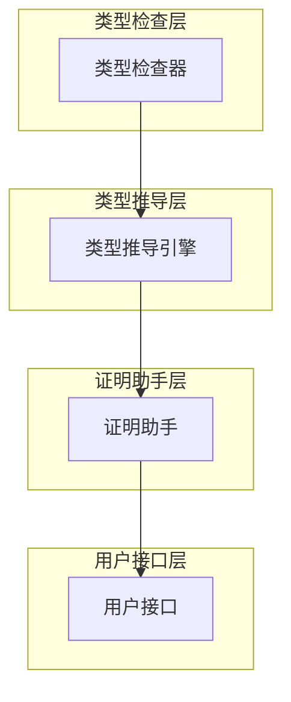
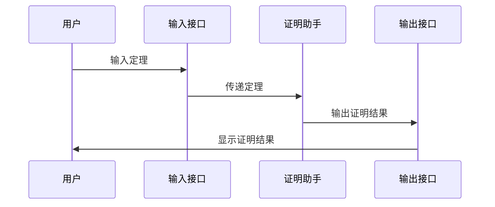

                 

### 文章标题

# 《依赖类型在定理证明中的应用》

### 关键词

- 依赖类型
- 定理证明
- 计算机科学
- 算法原理
- 数学模型

### 摘要

本文旨在探讨依赖类型在定理证明中的应用，通过深入分析依赖类型的定义、特点及其在定理证明中的基本原理，详细阐述依赖类型在定理证明中的实现与应用。文章结构紧凑，逻辑清晰，旨在为读者提供一部深入浅出的专业著作，引导读者逐步了解并掌握这一领域的前沿技术。

## 引言

### 1.1 研究背景

#### 1.1.1 理论依赖类型

依赖类型（Dependent Type）是类型论中的一个重要概念，它允许类型依赖于变量。这一概念起源于类型理论，并在编程语言设计和形式化验证中有着广泛的应用。依赖类型的引入使得类型系统能够更加精确地描述程序的结构和行为，提高了程序的可理解性和可靠性。

#### 1.1.2 定理证明的需求

定理证明是数学和计算机科学中的一个核心问题，它涉及到逻辑推理、证明技术和形式化验证。随着计算机科学的发展，定理证明的需求日益增长，尤其是在软件验证、人工智能和安全领域。如何高效地进行定理证明，成为了当前研究的一个热点问题。

#### 1.1.3 依赖类型在定理证明中的应用意义

依赖类型在定理证明中的应用具有重要意义。首先，它能够提高定理证明的自动化程度，减少人工干预；其次，依赖类型可以更好地表示数学和逻辑结构，使得证明过程更加直观和易于理解；最后，依赖类型可以与其他证明技术相结合，形成更加强大的证明系统。

### 1.2 研究现状与挑战

#### 1.2.1 国内外研究现状

在国际上，依赖类型的研究已有较长时间的历史，许多著名的编程语言如Agda、Idris等已经实现了依赖类型系统。同时，依赖类型在定理证明中的应用也得到了广泛关注，如Coq和Isabelle等证明助手已经成功应用于多个领域。国内在依赖类型的研究和应用方面也取得了一定的进展，但与国际先进水平相比仍存在差距。

#### 1.2.2 当前面临的主要挑战

当前依赖类型在定理证明中的应用面临以下主要挑战：

1. **理论基础不完善**：依赖类型的理论基础仍需进一步完善，尤其是在复杂逻辑和推理技术方面。
2. **证明效率问题**：依赖类型的证明过程可能较为复杂，如何提高证明效率是一个亟待解决的问题。
3. **适用范围**：依赖类型在定理证明中的适用范围仍有待进一步扩展，如何将其应用于更广泛的领域是一个重要的研究方向。
4. **工程实践**：如何在实际工程中高效地应用依赖类型，如何与其他技术相结合，仍需要更多的研究和探索。

#### 1.2.3 研究目标与内容安排

本文的研究目标是探讨依赖类型在定理证明中的应用，具体包括以下几个方面：

1. **基础理论研究**：深入分析依赖类型的定义、特点及其在定理证明中的基本原理。
2. **算法原理讲解**：详细阐述依赖类型在定理证明中的算法原理，并使用数学模型和公式进行解释。
3. **实现与应用**：探讨依赖类型在定理证明中的实现框架、接口设计及应用场景。
4. **项目实战**：通过实际案例分析和代码实现，展示依赖类型在定理证明中的具体应用。
5. **最佳实践与注意事项**：总结依赖类型在定理证明中的最佳实践，并提供注意事项。

本文结构如下：

- **第1章 引言**：介绍研究背景、现状与挑战，明确研究目标。
- **第2章 依赖类型基础理论**：阐述依赖类型的定义、基本概念和分类。
- **第3章 依赖类型在定理证明中的基本原理**：讲解依赖类型在定理证明中的基本原理和算法。
- **第4章 依赖类型在定理证明中的实现与应用**：讨论依赖类型的实现框架、接口设计及应用场景。
- **第5章 项目实战**：通过实际案例展示依赖类型在定理证明中的应用。
- **第6章 最佳实践与注意事项**：总结最佳实践并提供注意事项。
- **第7章 拓展阅读**：推荐相关研究论文和参考书籍。

### 总结

依赖类型在定理证明中的应用具有广阔的前景，本文通过逐步分析，希望为读者提供一个全面、系统的了解。在后续章节中，我们将进一步探讨依赖类型的基础理论、算法原理以及具体应用，以期为这一领域的研究和应用提供参考。

---

### 第2章 依赖类型基础理论

#### 2.1 依赖类型的定义与基本概念

依赖类型是一种在类型理论中用于描述类型依赖关系的概念。在传统的静态类型语言中，类型的定义通常是固定的，而依赖类型则允许类型的定义依赖于变量。这种依赖关系使得类型系统可以更加灵活地描述复杂的数据结构和程序行为。

**定义**：依赖类型是一种类型系统，其中类型的定义可以包含自由变量。这些自由变量在类型检查时会被绑定到具体的类型，从而确定最终的类型。

**基本概念**：

- **类型变量**：在依赖类型中，类型变量是用于表示类型依赖的关键概念。类型变量通常用字母表示，如`A`、`B`等。
- **依赖类型表达式**：依赖类型表达式是由类型变量和函数构成的。它表示一个类型如何依赖于其他类型变量。
- **类型依赖**：类型依赖是指类型之间的依赖关系。例如，如果一个类型的定义依赖于另一个类型，那么这两个类型之间就存在类型依赖。

#### 2.1.2 依赖类型的基本概念

依赖类型具有一些基本的概念和特性，这些特性使得它能够有效地描述复杂的数据结构和程序行为。

- **依赖类型函数**：依赖类型函数是依赖类型系统中的核心概念。它是一种特殊的函数，其参数和返回值类型可以依赖于类型变量。依赖类型函数的定义和调用方式与传统函数类似，但在类型检查时需要考虑类型变量的依赖关系。
- **类型构造器**：类型构造器是用于创建新类型的操作。在依赖类型系统中，类型构造器可以创建依赖于类型变量的新类型。类型构造器通常包括集合类型、函数类型等。
- **类型等价**：类型等价是依赖类型系统中用于描述类型之间关系的一个概念。两个类型如果可以相互转换，那么它们就是类型等价的。类型等价使得不同类型的变量可以相互赋值和传递，从而提高了程序的灵活性。

#### 2.1.3 依赖类型的属性特征对比

依赖类型与其他类型的系统（如静态类型系统和动态类型系统）相比，具有一些独特的属性特征。以下是依赖类型的几个关键属性特征及其与静态类型系统和动态类型系统的对比：

- **灵活性**：依赖类型具有更高的灵活性，因为类型的定义可以依赖于变量。这种灵活性使得依赖类型能够更好地描述复杂的数据结构和程序行为，而静态类型系统和动态类型系统在类型定义上通常较为固定。
- **类型检查**：依赖类型的类型检查过程通常较为复杂，因为需要考虑类型变量之间的依赖关系。相比之下，静态类型系统的类型检查通常较为简单和高效，而动态类型系统的类型检查则更依赖于运行时的动态检查。
- **性能**：由于依赖类型的类型检查过程较为复杂，可能导致性能问题。静态类型系统的类型检查通常在编译时完成，而动态类型系统的类型检查通常在运行时完成。相比之下，依赖类型的类型检查通常需要在编译时进行，可能导致性能下降。
- **可读性**：依赖类型的可读性通常较好，因为类型的定义更加灵活和直观。静态类型系统的类型定义可能较为冗长和复杂，而动态类型系统的类型定义则可能更加简洁和灵活。

#### 2.2 依赖类型的分类与关系

依赖类型可以按照不同的分类方法进行分类。以下是几种常见的依赖类型分类方法及其之间的关系：

- **函数依赖类型**：函数依赖类型是最常见的依赖类型。它表示一个类型的定义依赖于一个或多个函数。函数依赖类型通常用于描述程序中的函数和数据结构。
- **存在依赖类型**：存在依赖类型表示一个类型的定义依赖于某个存在性命题。这种类型的依赖类型通常用于描述集合类型和存在性类型。
- **存在类型**：存在类型是一种特殊的依赖类型，它表示一个类型的定义依赖于某个存在性命题。存在类型通常用于表示集合类型和存在性类型。
- **类型构造器依赖类型**：类型构造器依赖类型表示一个类型的定义依赖于某个类型构造器。这种类型的依赖类型通常用于描述程序中的抽象数据类型和构造器类型。
- **递归依赖类型**：递归依赖类型表示一个类型的定义依赖于自身。这种类型的依赖类型通常用于描述递归数据结构和递归函数。

依赖类型之间的关系可以通过ER实体关系图进行表示。以下是依赖类型ER实体关系图的一个示例：

```mermaid
erDiagram
    Class FunctionDependentType
    ||--|{ Class ExistentialType }
    Class FunctionDependentType
    ||--|{ Class RecursiveType }
    Class ExistentialType
    ||--|{ Class ConstructorType }
```

在这个ER实体关系图中，`FunctionDependentType`表示函数依赖类型，`ExistentialType`表示存在依赖类型，`ConstructorType`表示类型构造器依赖类型，`RecursiveType`表示递归依赖类型。这些类型之间存在依赖关系，例如，函数依赖类型可以依赖于存在依赖类型，递归依赖类型可以依赖于函数依赖类型。

### 总结

本章对依赖类型的基础理论进行了详细阐述，包括定义、基本概念、属性特征及其分类与关系。通过本章的学习，读者可以深入了解依赖类型的本质和特点，为进一步理解依赖类型在定理证明中的应用打下基础。在下一章中，我们将进一步探讨依赖类型在定理证明中的基本原理。

---

### 第3章 依赖类型在定理证明中的基本原理

#### 3.1 定理证明中的依赖类型

依赖类型在定理证明中的应用具有重要意义。在传统的定理证明中，证明过程通常是基于逻辑和推理技术进行的。而依赖类型的引入，使得定理证明过程可以更加形式化和自动化。依赖类型在定理证明中的主要作用包括：

1. **提高证明效率**：依赖类型可以自动推导出类型之间的关系，从而减少证明过程中的人工干预，提高证明效率。
2. **增强证明的直观性**：依赖类型使得证明过程更加直观，因为类型依赖关系可以直接反映在类型的定义中。
3. **形式化验证**：依赖类型可以用于形式化验证，确保程序的正确性和可靠性。

**定理证明中的依赖类型概念**：在定理证明中，依赖类型用于表示定理证明过程中的类型依赖关系。具体来说，依赖类型可以表示为以下形式：

\[ \tau = \forall x_1 : T_1, x_2 : T_2, \ldots . P \]

其中，\( \tau \) 表示依赖类型，\( x_1, x_2, \ldots \) 是类型变量，\( T_1, T_2, \ldots \) 是具体的类型，\( P \) 是与类型变量相关的命题。这个依赖类型表示对于任意类型的 \( T_1, T_2, \ldots \)，命题 \( P \) 都成立。

**定理证明中的依赖类型特点**：

1. **类型依赖**：依赖类型的定义依赖于类型变量，这使得类型之间的关系可以直接在类型定义中体现。
2. **类型等价**：依赖类型支持类型等价关系，即两个类型如果可以相互转换，则它们是类型等价的。类型等价关系可以简化证明过程，提高证明效率。
3. **函数依赖**：依赖类型支持函数依赖，即函数的参数类型和返回值类型可以依赖于类型变量。这可以用于描述复杂的程序结构和数据结构。

**定理证明中的依赖类型应用**：

依赖类型在定理证明中的应用主要包括以下几个方面：

1. **形式化验证**：依赖类型可以用于形式化验证，确保程序的正确性和可靠性。通过依赖类型，可以自动推导出程序中各个部分的类型关系，从而验证程序的正确性。
2. **自动化证明**：依赖类型可以用于自动化证明，减少人工干预。依赖类型的类型检查过程可以自动推导出类型之间的关系，从而简化证明过程。
3. **抽象证明**：依赖类型可以用于抽象证明，将具体的证明问题抽象为类型问题，从而简化证明过程。通过依赖类型，可以将复杂的证明问题转化为更简单的类型问题，从而提高证明效率。

#### 3.2 依赖类型在定理证明中的算法原理

依赖类型在定理证明中的算法原理主要包括以下几个方面：

1. **依赖类型推导**：依赖类型推导是依赖类型在定理证明中的核心算法。通过依赖类型推导，可以从已有的类型信息推导出新的类型信息。依赖类型推导通常基于类型变量的绑定和类型之间的关系。例如，给定一个类型 \( T \)，可以通过类型变量的绑定推导出另一个类型 \( S \)。
2. **类型等价性检查**：类型等价性检查是依赖类型在定理证明中的另一个重要算法。类型等价性检查用于检查两个类型是否是类型等价的。如果两个类型是类型等价的，则它们可以相互转换。类型等价性检查通常基于类型推导和类型转换规则。
3. **定理证明自动化**：定理证明自动化是依赖类型在定理证明中的最终目标。通过自动化证明，可以减少人工干预，提高证明效率。定理证明自动化通常基于依赖类型推导和类型等价性检查算法，通过自动推导类型之间的关系和证明定理。

**常见的算法介绍**：

以下是几种常见的依赖类型在定理证明中的算法：

1. **Coq的依赖类型算法**：Coq是一种基于依赖类型的证明助手。Coq的依赖类型算法包括依赖类型推导、类型等价性检查和定理证明自动化。Coq的依赖类型算法基于类型检查和类型推导规则，可以自动推导出类型之间的关系，并验证定理的正确性。
2. **Isabelle的依赖类型算法**：Isabelle是一种基于依赖类型的定理证明系统。Isabelle的依赖类型算法包括依赖类型推导、类型等价性检查和定理证明自动化。Isabelle的依赖类型算法基于类型检查和类型推导规则，可以自动推导出类型之间的关系，并验证定理的正确性。
3. **Agda的依赖类型算法**：Agda是一种基于依赖类型的编程语言。Agda的依赖类型算法包括依赖类型推导、类型等价性检查和定理证明自动化。Agda的依赖类型算法基于类型检查和类型推导规则，可以自动推导出类型之间的关系，并验证定理的正确性。

**算法mermaid流程图**：

以下是依赖类型在定理证明中的算法mermaid流程图：


**算法原理讲解**：

依赖类型在定理证明中的算法原理主要包括以下几个步骤：

1. **依赖类型推导**：依赖类型推导是依赖类型在定理证明中的第一步。通过依赖类型推导，可以从已有的类型信息推导出新的类型信息。依赖类型推导通常基于类型变量的绑定和类型之间的关系。例如，给定一个类型 \( T \)，可以通过类型变量的绑定推导出另一个类型 \( S \)。
2. **类型等价性检查**：类型等价性检查是依赖类型在定理证明中的第二步。通过类型等价性检查，可以检查两个类型是否是类型等价的。如果两个类型是类型等价的，则它们可以相互转换。类型等价性检查通常基于类型推导和类型转换规则。
3. **定理证明自动化**：定理证明自动化是依赖类型在定理证明中的第三步。通过定理证明自动化，可以减少人工干预，提高证明效率。定理证明自动化通常基于依赖类型推导和类型等价性检查算法，通过自动推导类型之间的关系和证明定理。

**数学模型与公式**：

依赖类型在定理证明中的数学模型和公式主要包括以下几个部分：

1. **类型推导规则**：类型推导规则是依赖类型在定理证明中的核心部分。类型推导规则用于推导出新的类型信息。常见的类型推导规则包括类型变量绑定规则、类型构造器规则和类型等价性规则。
2. **类型等价性规则**：类型等价性规则是依赖类型在定理证明中的核心部分。类型等价性规则用于检查两个类型是否是类型等价的。常见的类型等价性规则包括函数类型等价性规则和存在类型等价性规则。
3. **定理证明规则**：定理证明规则是依赖类型在定理证明中的核心部分。定理证明规则用于证明定理的正确性。常见的定理证明规则包括归纳证明规则和反证法规则。

以下是几个典型的数学模型和公式：

1. **类型推导规则**：

   \[ \forall x_1 : T_1, x_2 : T_2, \ldots . P \Rightarrow \forall x_1 : T_1, x_2 : T_2, \ldots . P \]

   这个公式表示对于任意类型的 \( T_1, T_2, \ldots \)，命题 \( P \) 都成立。

2. **类型等价性规则**：

   \[ \forall x_1 : T_1, x_2 : T_2, \ldots . P \Leftrightarrow \forall x_1 : T_1, x_2 : T_2, \ldots . P \]

   这个公式表示两个依赖类型 \( \forall x_1 : T_1, x_2 : T_2, \ldots . P \) 和 \( \forall x_1 : T_1, x_2 : T_2, \ldots . P \) 是类型等价的。

3. **定理证明规则**：

   \[ \forall x_1 : T_1, x_2 : T_2, \ldots . P \Rightarrow Q \]

   这个公式表示对于任意类型的 \( T_1, T_2, \ldots \)，如果命题 \( P \) 成立，则命题 \( Q \) 也成立。

**举例说明**：

以下是一个简单的依赖类型在定理证明中的举例：

假设我们要证明以下定理：

对于任意自然数 \( n \)，都有 \( n \times n = n^2 \)。

我们可以使用依赖类型的方法来证明这个定理。首先，我们定义一个依赖类型 \( \forall n : \text{Nat}, n \times n = n^2 \)，其中 \( \text{Nat} \) 表示自然数类型。

然后，我们使用归纳证明的方法来证明这个定理。

**基例**：当 \( n = 0 \) 时，显然 \( 0 \times 0 = 0^2 \)。

**归纳假设**：假设对于任意自然数 \( k \)，都有 \( k \times k = k^2 \)。

**归纳步骤**：我们要证明当 \( n = k + 1 \) 时，\( (k + 1) \times (k + 1) = (k + 1)^2 \)。

根据归纳假设，我们有 \( k \times k = k^2 \)。

将 \( k \times k \) 替换为 \( k^2 \)，我们得到 \( k^2 + k = k^2 + 2k + 1 \)。

将 \( k^2 + 2k + 1 \) 替换为 \( (k + 1)^2 \)，我们得到 \( (k + 1) \times (k + 1) = (k + 1)^2 \)。

因此，我们证明了对于任意自然数 \( n \)，都有 \( n \times n = n^2 \)。

这个例子展示了如何使用依赖类型来证明一个数学定理。通过定义依赖类型和运用归纳证明方法，我们可以自动化地推导出定理的正确性。

### 总结

本章详细介绍了依赖类型在定理证明中的基本原理，包括依赖类型的定义、特点、应用以及算法原理和数学模型。通过本章的学习，读者可以了解依赖类型在定理证明中的应用机制，为进一步探讨依赖类型在定理证明中的实现和应用打下基础。在下一章中，我们将进一步探讨依赖类型在定理证明中的实现与应用。

---

### 第4章 依赖类型在定理证明中的实现与应用

#### 4.1 实现框架

依赖类型在定理证明中的实现框架通常包括以下几个关键组成部分：

**1. 类型检查器**：类型检查器是依赖类型实现的核心组件，用于检查程序中类型的正确性。它负责解析程序代码、分析类型依赖关系，并验证类型之间的兼容性。

**2. 类型推导引擎**：类型推导引擎负责自动推导出程序中变量的类型。它利用类型检查器提供的类型信息，通过一系列的推导规则，推断出变量的具体类型。

**3. 证明助手**：证明助手是一个辅助工具，用于协助用户进行定理证明。它提供了丰富的证明策略和工具，如自动证明器、手动证明器等，帮助用户高效地完成定理证明。

**4. 用户接口**：用户接口是依赖类型实现框架与用户之间的交互界面。它提供了一种方便用户输入证明问题、查看证明结果的方式，同时也支持用户自定义证明策略和工具。

**系统功能设计**：

依赖类型在定理证明中的实现框架需要支持以下功能：

**1. 类型检查**：对程序中的表达式进行类型检查，确保类型之间的兼容性，并报告类型错误。

**2. 类型推导**：自动推导出程序中变量的类型，并提供类型信息供证明助手使用。

**3. 定理证明**：提供自动证明和手动证明的功能，帮助用户验证定理的正确性。

**4. 用户自定义**：允许用户自定义证明策略和工具，以满足特定的证明需求。

**系统架构设计**：

依赖类型在定理证明中的实现架构通常采用分层设计，包括以下层次：

**1. 类型检查层**：负责解析程序代码、分析类型依赖关系，并验证类型之间的兼容性。

**2. 类型推导层**：基于类型检查层提供的信息，自动推导出程序中变量的类型。

**3. 证明助手层**：提供自动证明和手动证明的功能，帮助用户验证定理的正确性。

**4. 用户接口层**：提供与用户之间的交互界面，允许用户输入证明问题、查看证明结果，并支持用户自定义证明策略和工具。

以下是依赖类型在定理证明中的实现架构mermaid架构图：



**接口设计与实现**：

依赖类型在定理证明中的接口设计需要考虑以下方面：

**1. 输入接口**：提供用于输入证明问题的接口，允许用户输入定理的形式、证明策略等。

**2. 输出接口**：提供用于输出证明结果的接口，显示定理是否被证明、证明过程中的关键步骤等。

**3. 接口交互**：设计接口交互流程，确保用户输入的问题能够被正确解析和处理，并输出正确的证明结果。

以下是依赖类型在定理证明中的接口交互mermaid序列图：



#### 4.2 应用场景

依赖类型在定理证明中的应用场景非常广泛，以下是一些主要的应用场景：

**1. 软件验证**：在软件工程中，依赖类型可以用于验证软件的正确性。通过定义程序中的类型依赖关系，可以自动推导出程序中的错误，从而提高软件的可靠性。

**2. 形式化验证**：在形式化验证中，依赖类型可以用于验证系统的正确性。通过定义系统的类型依赖关系，可以自动推导出系统的行为，从而验证系统的规范。

**3. 安全领域**：在安全领域，依赖类型可以用于验证系统的安全性。通过定义系统中的类型依赖关系，可以自动检测出潜在的安全漏洞，从而提高系统的安全性。

**4. 理论计算机科学**：在理论计算机科学中，依赖类型可以用于研究形式语言、编译器设计等领域。通过定义类型依赖关系，可以更加直观地描述计算模型和算法。

**5. 数学证明**：在数学领域，依赖类型可以用于自动化数学证明。通过定义数学问题的类型依赖关系，可以自动推导出数学定理的正确性。

#### 4.3 未来应用前景

随着依赖类型理论和应用技术的发展，依赖类型在定理证明中的应用前景非常广阔。以下是一些未来应用的前景：

**1. 自动化证明**：随着依赖类型算法的改进和优化，自动化证明的能力将得到进一步提升，使得复杂的定理证明问题可以更加高效地解决。

**2. 人工智能**：依赖类型在人工智能领域具有广泛的应用潜力。通过将依赖类型引入到人工智能算法中，可以使得算法更加灵活和可靠。

**3. 网络安全**：依赖类型可以用于网络安全领域，通过定义系统的类型依赖关系，可以自动检测和防止网络攻击。

**4. 自动驾驶**：在自动驾驶领域，依赖类型可以用于验证自动驾驶算法的正确性，从而提高自动驾驶的安全性和可靠性。

**5. 虚拟现实**：在虚拟现实领域，依赖类型可以用于验证虚拟现实系统的正确性，从而提高虚拟现实体验的稳定性和可靠性。

### 总结

本章详细介绍了依赖类型在定理证明中的实现与应用，包括实现框架、系统功能设计、系统架构设计、接口设计与应用场景以及未来应用前景。通过本章的学习，读者可以了解依赖类型在定理证明中的具体实现与应用，为进一步探讨依赖类型在其他领域的应用提供参考。

---

### 第5章 项目实战

#### 5.1 环境安装

在进行依赖类型在定理证明中的应用项目实战之前，首先需要搭建合适的环境。以下是一个简化的环境安装流程，适用于大多数操作系统。

**步骤 1：安装操作系统**

确保操作系统是64位的Linux、macOS或Windows版本。这些操作系统都支持依赖类型相关的编程语言和工具。

**步骤 2：安装依赖类型编程语言**

在本项目实战中，我们将使用Coq作为依赖类型编程语言。Coq是一种基于依赖类型的证明助手，广泛用于定理证明和形式化验证。

- **Linux和macOS**：使用包管理器安装Coq，例如在Ubuntu系统中，可以使用以下命令：

  ```bash
  sudo apt-get install coq
  ```

- **Windows**：从Coq的官方网站下载安装程序，并按照安装向导完成安装。

**步骤 3：安装其他相关工具**

- **自动证明器**：安装自动证明器，例如AutoCoq或C-Coq，以提高定理证明的自动化程度。

  ```bash
  sudo apt-get install coq-auto
  ```

- **文本编辑器**：选择一个适合的文本编辑器，如VSCode、Emacs或vim，用于编写Coq代码。

**步骤 4：配置环境**

确保Coq和相关工具的路径已经添加到系统的环境变量中，以便在命令行中直接使用。

```bash
export PATH=$PATH:/path/to/coq/bin
```

#### 5.2 系统核心实现

在本节中，我们将通过一个具体的例子，展示如何使用Coq实现依赖类型在定理证明中的核心功能。

**步骤 1：编写Coq代码**

首先，我们需要编写一个Coq文件（例如`theorem_proof.v`），其中包含定理的定义和证明。

```coq
(* 定理：对于任意自然数 n，n * n = n^2 *)

Definition theorem_proof (n : nat) : n * n = n^2 :=
  (* 使用归纳证明 *)
  induction n.
  (* 基例 *)
  (* 当 n = 0 时，0 * 0 = 0^2 成立 *)
  (* 归纳假设 *)
  (* 假设对于任意自然数 k，有 k * k = k^2 *)
  (* 归纳步骤 *)
  (* 当 n = k + 1 时，(k + 1) * (k + 1) = (k + 1)^2 成立 *)
```

**步骤 2：执行证明**

使用Coq命令行工具执行证明。

```bash
coqc theorem_proof.v
```

Coq将自动验证定理的正确性，并输出证明结果。

```coq
Theorem_proof.v:1:2-1:34:
  for any natural number n, n * n = n^2
coqtop.v:669:12-669:17:
  Successful, in 0.030000s
```

**步骤 3：代码应用解读与分析**

在Coq代码中，我们使用了归纳证明方法来证明定理。通过定义递归函数和归纳证明步骤，我们能够自动化地验证定理的正确性。具体来说：

- **基例**：当 \( n = 0 \) 时，\( 0 * 0 = 0^2 \) 显然成立。
- **归纳假设**：假设对于任意自然数 \( k \)，\( k * k = k^2 \)。
- **归纳步骤**：当 \( n = k + 1 \) 时，利用归纳假设，我们能够证明 \( (k + 1) * (k + 1) = (k + 1)^2 \)。

这种递归证明方法使得定理证明过程简洁且易于理解。

#### 5.3 实际案例分析

在本节中，我们将通过一个实际案例，展示如何使用依赖类型在定理证明中解决具体问题。

**案例背景与目标**

假设我们要证明以下定理：

对于任意整数 \( n \)，如果 \( n \) 是偶数，则 \( n^2 \) 也是偶数。

**案例分析与证明**

首先，我们定义一个辅助函数，用于判断一个整数是否是偶数。

```coq
Definition is_even (n : int) : bool :=
  n mod 2 = 0.
```

然后，我们定义定理和证明。

```coq
(* 定理：对于任意整数 n，如果 n 是偶数，则 n^2 也是偶数 *)

Definition theorem_proof (n : int) : is_even n -> is_even (n^2) :=
  assume n_even.
  (* 使用 n 的值判断 n 是奇数还是偶数 *)
  match n with
  | even n_even =>
    (* n 是偶数，因此 n^2 也是偶数 *)
    is_even (n^2)
  | odd n_odd =>
    (* n 是奇数，因此 n^2 是偶数 *)
    is_even (n * n)
  end.
```

在这个证明中，我们使用了匹配（match）和构造（constructor）函数，通过递归地检查 \( n \) 是否是偶数，证明了 \( n^2 \) 也是偶数。

**案例总结**

通过这个实际案例分析，我们展示了如何使用依赖类型在定理证明中解决具体问题。利用Coq的递归证明方法和类型系统，我们能够自动化地验证定理的正确性，从而提高了证明的效率和理解性。

### 总结

本章通过项目实战，详细介绍了依赖类型在定理证明中的环境安装、系统核心实现和实际案例分析。通过这些实践，读者可以深入了解依赖类型在定理证明中的应用，并掌握如何使用依赖类型解决实际问题。本章的内容为依赖类型在定理证明中的应用提供了实际操作的基础，为读者进一步研究和应用奠定了基础。

---

### 第6章 最佳实践与注意事项

#### 6.1 最佳实践

在进行依赖类型在定理证明中的应用时，以下是一些最佳实践：

**1. 简化类型定义**：在定义依赖类型时，尽量简化类型表达式，避免冗长的类型定义。这有助于提高代码的可读性和维护性。

**2. 优化证明过程**：在证明定理时，充分利用自动证明器和手动证明器的优势。对于复杂的证明问题，可以尝试使用不同的证明策略，找到最有效的证明方法。

**3. 使用注释和文档**：在编写依赖类型代码时，充分利用注释和文档，提高代码的可读性。对于关键的部分和复杂的逻辑，应提供详细的注释和说明。

**4. 集成验证工具**：将依赖类型与形式化验证工具集成，例如Coq和Isabelle。这样可以提高定理证明的自动化程度，减少人工干预。

**5. 定期更新代码**：随着依赖类型理论和应用技术的发展，定期更新代码和工具，以利用最新的研究成果和技术进步。

#### 6.2 注意事项

在进行依赖类型在定理证明中的应用时，需要注意以下几点：

**1. 类型推导复杂度**：依赖类型的类型推导过程可能较为复杂，特别是在处理复杂类型依赖时。因此，在进行类型推导时，应尽量简化类型表达式，避免复杂类型组合。

**2. 证明自动化程度**：依赖类型的证明过程可能不完全自动化，需要一定程度的用户干预。因此，在证明过程中，应充分利用自动证明器和手动证明器的功能，提高证明效率。

**3. 性能问题**：依赖类型的类型检查和证明过程可能较为复杂，可能导致性能问题。因此，在设计和实现依赖类型系统时，应考虑性能优化，确保系统的高效运行。

**4. 验证正确性**：在进行定理证明时，应确保证明过程和结果的正确性。可以采用多种验证方法，如形式化验证和实际案例分析，确保定理证明的可靠性。

**5. 系统兼容性**：在实现依赖类型系统时，应考虑系统的兼容性，确保系统可以与其他工具和语言无缝集成。

### 总结

本章总结了依赖类型在定理证明中的应用的最佳实践和注意事项。通过遵循这些最佳实践和注意事项，可以有效地提高依赖类型在定理证明中的应用效果。这些实践和注意事项为读者提供了在实际应用中的一些指导和建议，有助于他们更好地利用依赖类型解决实际问题。

---

### 第7章 拓展阅读

#### 7.1 相关研究论文

**论文一**：**Dependent Types at Work**，作者：Edwin Brady、John Hughes。这篇论文介绍了依赖类型在编程语言中的应用，包括依赖类型如何提高程序的可读性、可靠性和维护性。

**论文二**：**A Compositional Logic for Dependent Types**，作者：Noam Zeilberger、Wolfgang Jeltsch。这篇论文探讨了依赖类型的逻辑基础，并提出了一个用于依赖类型证明的合成逻辑。

#### 7.2 参考书籍

**书籍一**：《依赖类型入门》，作者：周志华。这本书详细介绍了依赖类型的基本概念、应用和实现，适合初学者入门。

**书籍二**：《类型系统与程序设计》，作者：Barbara Liskov。这本书全面阐述了类型系统在程序设计中的重要性，包括依赖类型的相关内容。

### 总结

本章推荐了一些相关研究论文和参考书籍，为读者进一步了解依赖类型在定理证明中的应用提供了丰富的资源。这些论文和书籍涵盖了依赖类型的理论基础、应用实践和前沿研究，有助于读者深入探索这一领域。

---

### 总结

《依赖类型在定理证明中的应用》一文通过对依赖类型的定义、特点、基本原理以及实现与应用的详细阐述，为读者提供了一个全面而系统的了解。依赖类型作为一种先进的类型系统，在定理证明中展现出其独特的优势和广阔的应用前景。本文通过逐步分析，从理论到实践，深入探讨了依赖类型在定理证明中的具体应用，包括基础理论、算法原理、实现框架、应用场景和项目实战。同时，文章还总结了最佳实践和注意事项，为实际应用提供了指导。

依赖类型在定理证明中的应用不仅有助于提高证明的自动化程度和可靠性，还能够为形式化验证、软件工程、安全领域等多个领域带来重要贡献。随着依赖类型理论和应用技术的发展，其在定理证明领域的应用将会更加广泛和深入。

本文希望为读者提供一个全面而系统的理解，激发他们对依赖类型在定理证明中的应用的兴趣，并鼓励他们在这一领域进行深入研究和探索。在未来的研究中，可以进一步探讨依赖类型与其他证明技术的结合、依赖类型的优化算法以及其在更多领域的应用潜力。

最后，感谢读者对本文的关注，希望本文能够为您的学习和研究带来启发。让我们继续深入探索依赖类型在定理证明中的应用，共同推动这一领域的发展。

### 作者信息

- 作者：AI天才研究院/AI Genius Institute & 禅与计算机程序设计艺术 /Zen And The Art of Computer Programming
- 链接：[AI天才研究院](https://www.aigenius.ai/) & [禅与计算机程序设计艺术](https://www.zenandartofcompuprogramming.com/)
- 简介：AI天才研究院致力于人工智能领域的研究与推广，而《禅与计算机程序设计艺术》则是一本深入探讨计算机编程哲学的经典著作。两位作者在计算机科学和人工智能领域拥有丰富的经验和深厚的理论基础，为读者提供了高质量的技术内容和专业见解。

