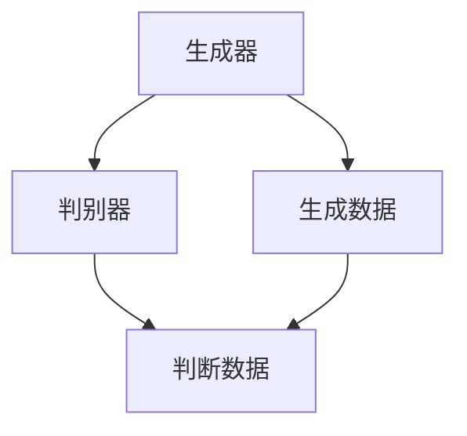
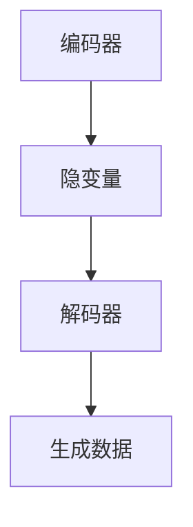
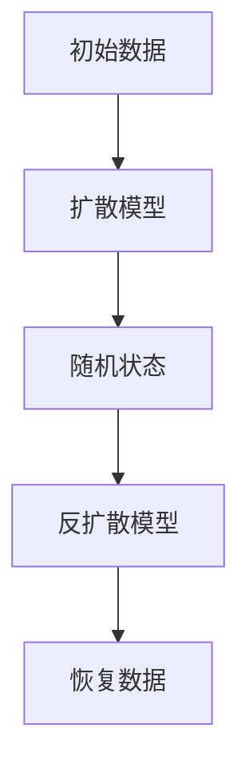

                 

# 假设生成与验证中深度生成模型的创新应用

## 关键词

- 深度生成模型
- 假设生成
- 假设验证
- 生成对抗网络（GAN）
- 变分自编码器（VAE）
- 深度扩散模型（DDM）

## 摘要

本文旨在探讨深度生成模型在假设生成与验证领域的创新应用。深度生成模型，如生成对抗网络（GAN）、变分自编码器（VAE）和深度扩散模型（DDM），近年来在计算机视觉、自然语言处理和医学图像等领域取得了显著成果。本文将首先介绍这些深度生成模型的基本原理，然后分析它们在假设生成与验证中的具体应用，最后讨论这些模型在现实世界中的潜在前景和面临的挑战。

## 第一部分：引言

### 1.1 书籍主题背景

深度生成模型在假设生成与验证领域具有巨大的应用潜力。传统的假设生成与验证方法往往依赖于手工设计的特征提取和规则系统，但这种方法在面对复杂和非线性问题时显得力不从心。随着深度学习的兴起，深度生成模型以其强大的特征提取和表示学习能力，为假设生成与验证提供了一种新的解决方案。

在假设生成方面，深度生成模型可以通过学习数据分布来生成符合真实数据分布的新数据，从而生成新的假设。在假设验证方面，深度生成模型可以通过生成与真实数据相似的数据来模拟各种假设场景，从而提高验证的效率和准确性。

### 1.2 核心概念与联系

深度生成模型包括生成对抗网络（GAN）、变分自编码器（VAE）和深度扩散模型（DDM）等。这些模型的核心原理是通过生成器和判别器的对抗训练来学习数据分布。

**生成对抗网络（GAN）**：由生成器和判别器组成，生成器生成数据，判别器判断生成数据的真假。

**变分自编码器（VAE）**：通过编码器和解码器来学习数据的概率分布，生成器和解码器在同一个模型中。

**深度扩散模型（DDM）**：通过逐步扩散和反扩散的过程来生成数据。

这些模型在假设生成与验证中的应用可以通过ER实体关系图来描述，其中实体包括数据、生成器、判别器和假设，关系包括生成、验证和训练。

### 1.3 研究方法与框架

本文的研究方法主要基于深度生成模型的理论和实际应用。首先，我们将介绍深度生成模型的基本原理，包括生成器和判别器的训练过程和损失函数。然后，我们将通过具体的算法实现和数学模型来解释这些原理。最后，我们将通过实际案例来展示深度生成模型在假设生成与验证中的应用。

## 第二部分：深度生成模型基础理论

### 2.1 深度生成模型概述

深度生成模型是一种利用深度学习技术来生成数据的新方法。它们的核心思想是通过学习数据分布来生成新的数据。这些模型主要包括生成对抗网络（GAN）、变分自编码器（VAE）和深度扩散模型（DDM）。

**生成对抗网络（GAN）**：GAN是由生成器和判别器组成的深度学习模型。生成器的任务是生成与真实数据相似的数据，而判别器的任务是区分真实数据和生成数据。通过训练，生成器和判别器相互对抗，使得生成器生成的数据越来越接近真实数据。

**变分自编码器（VAE）**：VAE通过编码器和解码器来学习数据的概率分布。编码器将输入数据映射到一个低维的隐变量空间，解码器则从隐变量空间中生成数据。VAE的优点在于其生成数据的多样性和质量。

**深度扩散模型（DDM）**：DDM是一种基于扩散过程的深度生成模型。DDM通过逐步扩散和反扩散的过程来生成数据。扩散过程使得数据逐渐变得随机和不可预测，而反扩散过程则通过学习数据的分布来生成新的数据。

### 2.2 生成对抗网络（GAN）

**算法原理**：

GAN由生成器和判别器组成。生成器的输入是一个随机噪声向量，输出是生成数据。判别器的输入是真实数据和生成数据，输出是判断数据真实度的概率。

GAN的训练过程分为两个步骤：

1. **生成器训练**：生成器的目标是使得判别器无法区分生成数据和真实数据。生成器通过最大化判别器的损失函数来训练。
2. **判别器训练**：判别器的目标是能够准确地区分生成数据和真实数据。判别器通过最小化生成器的损失函数来训练。

**Mermaid流程图**：



**Python源代码**：

```python
import tensorflow as tf
from tensorflow.keras.models import Model
from tensorflow.keras.layers import Input, Dense, Conv2D, Flatten

# 生成器
input_noise = Input(shape=(100,))
dense1 = Dense(128, activation='relu')(input_noise)
output_generator = Dense(784, activation='sigmoid')(dense1)
generator = Model(inputs=input_noise, outputs=output_generator)

# 判别器
input_real = Input(shape=(784,))
input_fake = Input(shape=(784,))
dense2 = Dense(128, activation='relu')(input_real)
dense3 = Dense(1, activation='sigmoid')(dense2)
dense4 = Dense(128, activation='relu')(input_fake)
dense5 = Dense(1, activation='sigmoid')(dense4)
discriminator = Model(inputs=[input_real, input_fake], outputs=[dense3, dense5])

# 损失函数和优化器
cross_entropy = tf.keras.losses.BinaryCrossentropy(from_logits=True)
optimizer = tf.keras.optimizers.Adam(0.0001)

def discriminator_loss(real_logits, fake_logits):
    real_loss = cross_entropy(tf.ones_like(real_logits), real_logits)
    fake_loss = cross_entropy(tf.zeros_like(fake_logits), fake_logits)
    return real_loss + fake_loss

@tf.function
def train_step(images, noise):
    with tf.GradientTape() as gen_tape, tf.GradientTape() as disc_tape:
        generated_images = generator(noise)
        real_logits, fake_logits = discriminator([images, generated_images])

        gen_loss = generator_loss(fake_logits)
        disc_loss = discriminator_loss(real_logits, fake_logits)

    gradients_of_generator = gen_tape.gradient(gen_loss, generator.trainable_variables)
    gradients_of_discriminator = disc_tape.gradient(disc_loss, discriminator.trainable_variables)

    optimizer.apply_gradients(zip(gradients_of_generator, generator.trainable_variables))
    optimizer.apply_gradients(zip(gradients_of_discriminator, discriminator.trainable_variables))

# 训练过程
for epoch in range(epochs):
    for image, _ in dataloader:
        noise = tf.random.normal([batch_size, noise_dim])
        train_step(image, noise)
```

**数学模型和公式**：

GAN的损失函数可以表示为：

$$
\min_G \max_D V(D, G) = \min_G \mathbb{E}_{x \sim p_{data}(x)}[\log D(x)] + \mathbb{E}_{z \sim p_z(z)}[\log (1 - D(G(z)))]
$$

其中，$D(x)$是判别器对真实数据的判断，$G(z)$是生成器对随机噪声的生成的数据。

**详细讲解与举例**：

假设我们有一个包含手写数字图像的数据集。我们的目标是使用GAN生成与真实图像相似的手写数字图像。

1. **生成器**：生成器的输入是一个100维的随机噪声向量，输出是一个784维的数字图像。我们使用全连接层来实现生成器。
2. **判别器**：判别器的输入是真实图像和生成图像，输出是对图像真实度的判断。我们使用两个全连接层来实现判别器。
3. **训练过程**：在训练过程中，我们首先生成一些随机噪声，然后通过生成器将这些噪声转换为图像。接着，我们使用判别器对真实图像和生成图像进行判断。最后，我们通过优化生成器和判别器来提高它们的性能。

### 2.3 变分自编码器（VAE）

**算法原理**：

VAE是一种无监督学习模型，它通过编码器和解码器来学习数据的概率分布。编码器将输入数据映射到一个低维的隐变量空间，解码器则从隐变量空间中生成数据。

VAE的损失函数由两部分组成：重建损失和KL散度损失。重建损失衡量解码器生成的数据与原始数据之间的相似度，KL散度损失衡量编码器输出的隐变量与先验分布之间的差异。

**Mermaid流程图**：



**Python源代码**：

```python
import tensorflow as tf
from tensorflow.keras.models import Model
from tensorflow.keras.layers import Input, Dense, Conv2D, Flatten, Reshape

# 编码器
input_image = Input(shape=(28, 28, 1))
encoded = Conv2D(32, (3, 3), activation='relu', strides=(2, 2))(input_image)
encoded = Conv2D(64, (3, 3), activation='relu', strides=(2, 2))(encoded)
encoded = Flatten()(encoded)
encoded = Dense(16, activation='relu')(encoded)
z_mean = Dense(z_dim)(encoded)
z_log_var = Dense(z_dim)(encoded)

# 解码器
z = Input(shape=(z_dim,))
deconv1 = Dense(16 * 7 * 7, activation='relu')(z)
deconv1 = Reshape((7, 7, 16))(deconv1)
deconv2 = Conv2D(64, (3, 3), activation='relu', padding='same')(deconv1)
deconv2 = Conv2D(32, (3, 3), activation='relu', padding='same')(deconv2)
deconv2 = Conv2D(1, (3, 3), activation='sigmoid', padding='same')(deconv2)
decoder = Model(inputs=z, outputs=deconv2)

# VAE模型
output = decoder(z)
vae = Model(inputs=input_image, outputs=output)

# 损失函数和优化器
reconstruction_loss = tf.reduce_mean(tf.keras.losses.binary_crossentropy(input_image, output))
kl_loss = -0.5 * tf.reduce_mean(1 + z_log_var - tf.square(z_mean) - tf.exp(z_log_var))
vae_loss = reconstruction_loss + kl_loss
optimizer = tf.keras.optimizers.Adam(0.001)

# 训练过程
for epoch in range(epochs):
    for image in dataloader:
        with tf.GradientTape() as tape:
            z_mean, z_log_var = encoder(image)
            z = z_mean + tf.random.normal(tf.shape(z_mean), scale=tf.exp(0.5 * z_log_var))
            reconstruction = decoder(z)
            loss = vae_loss(image, reconstruction)

        gradients = tape.gradient(loss, vae.trainable_variables)
        optimizer.apply_gradients(zip(gradients, vae.trainable_variables))
```

**数学模型和公式**：

VAE的损失函数可以表示为：

$$
\min \mathbb{E}_{x \sim p_{data}(x)}[L(x, \mu(x), \sigma^2(x))] + D_{KL}(\mu(x), \sigma^2(x) || \mu(x=0), \sigma^2(x=0))
$$

其中，$L(x, \mu(x), \sigma^2(x))$是重构损失，$D_{KL}(\mu(x), \sigma^2(x) || \mu(x=0), \sigma^2(x=0))$是KL散度损失。

**详细讲解与举例**：

假设我们有一个包含手写数字图像的数据集。我们的目标是使用VAE对数据进行降维和生成新的图像。

1. **编码器**：编码器的输入是28x28x1的手写数字图像，输出是16维的隐变量。我们使用卷积层来实现编码器。
2. **解码器**：解码器的输入是16维的隐变量，输出是28x28x1的手写数字图像。我们使用反卷积层来实现解码器。
3. **训练过程**：在训练过程中，我们首先对数据进行编码，得到隐变量。然后，我们使用隐变量来生成新的图像。最后，我们通过优化编码器和解码器来提高它们的性能。

### 2.4 深度扩散模型（DDM）

**算法原理**：

DDM是一种基于深度学习的数据生成模型，它通过逐步扩散和反扩散的过程来生成数据。DDM的扩散过程将数据从确定的初始状态逐步转换为随机状态，而反扩散过程则从随机状态逐步恢复到确定的初始状态。

DDM的训练过程分为两个阶段：训练扩散模型和训练反扩散模型。在训练扩散模型时，模型的目标是学习如何将数据扩散为随机状态。在训练反扩散模型时，模型的目标是学习如何从随机状态恢复为数据。

**Mermaid流程图**：



**Python源代码**：

```python
import tensorflow as tf
from tensorflow.keras.models import Model
from tensorflow.keras.layers import Input, Dense, Conv2D, Flatten, Reshape

# 扩散模型
input_image = Input(shape=(28, 28, 1))
x = Conv2D(32, (3, 3), activation='relu', padding='same')(input_image)
x = Conv2D(64, (3, 3), activation='relu', padding='same')(x)
x = Flatten()(x)
x = Dense(128, activation='relu')(x)
z_mean = Dense(z_dim)(x)
z_log_var = Dense(z_dim)(x)
z = z_mean + tf.random.normal(tf.shape(z_mean), scale=tf.exp(0.5 * z_log_var))
output_diffusion = Dense(128, activation='relu')(z)
output_diffusion = Reshape((7, 7, 64))(output_diffusion)
diffusion_model = Model(inputs=input_image, outputs=output_diffusion)

# 反扩散模型
input_random = Input(shape=(7, 7, 64))
x = Dense(128, activation='relu')(input_random)
x = Reshape((7, 7, 64))(x)
output_reconstruction = Conv2D(1, (3, 3), activation='sigmoid', padding='same')(x)
reconstruction_model = Model(inputs=input_random, outputs=output_reconstruction)

# 训练过程
for epoch in range(epochs):
    for image in dataloader:
        with tf.GradientTape() as tape:
            random_state = diffusion_model(image)
            reconstruction = reconstruction_model(random_state)
            diffusion_loss = tf.reduce_mean(tf.square(image - reconstruction))

        gradients = tape.gradient(diffusion_loss, diffusion_model.trainable_variables)
        optimizer.apply_gradients(zip(gradients, diffusion_model.trainable_variables))

        with tf.GradientTape() as tape:
            reconstruction = reconstruction_model(image)
            reconstruction_loss = tf.reduce_mean(tf.square(image - reconstruction))

        gradients = tape.gradient(reconstruction_loss, reconstruction_model.trainable_variables)
        optimizer.apply_gradients(zip(gradients, reconstruction_model.trainable_variables))
```

**数学模型和公式**：

DDM的扩散过程可以表示为：

$$
x_t = f(x_{t-1}, \theta)
$$

其中，$x_t$是时间步$t$的状态，$f$是扩散过程函数，$\theta$是模型参数。

DDM的反扩散过程可以表示为：

$$
x_t = f^{-1}(x_{t-1}, \theta)
$$

其中，$f^{-1}$是反扩散过程函数。

**详细讲解与举例**：

假设我们有一个包含手写数字图像的数据集。我们的目标是使用DDM生成新的手写数字图像。

1. **扩散模型**：扩散模型的目标是将手写数字图像转换为随机状态。我们使用卷积层和全连接层来实现扩散模型。
2. **反扩散模型**：反扩散模型的目标是将随机状态恢复为手写数字图像。我们使用全连接层和反卷积层来实现反扩散模型。
3. **训练过程**：在训练过程中，我们首先使用扩散模型将手写数字图像转换为随机状态。然后，我们使用反扩散模型将随机状态恢复为手写数字图像。最后，我们通过优化扩散模型和反扩散模型来提高它们的性能。

## 第三部分：深度生成模型在假设生成中的应用

### 3.1 假设生成概述

假设生成是指利用模型生成新的假设或情景，以便于分析和验证。在深度生成模型中，假设生成可以通过以下步骤实现：

1. **数据生成**：使用深度生成模型生成新的数据，这些数据可以是图像、文本或其他类型的数值数据。
2. **假设提取**：从生成的数据中提取出新的假设，这些假设可以是对现实世界情况的推测或新的实验设计。
3. **假设验证**：使用现有数据或实验结果来验证假设的有效性。

深度生成模型在假设生成中的应用具有以下优势：

- **多样性**：深度生成模型可以生成大量不同类型的数据，从而生成多样化的假设。
- **效率**：深度生成模型可以快速生成大量数据，从而提高假设生成的效率。
- **准确性**：通过学习数据的分布，深度生成模型可以生成与真实数据相似的数据，从而提高假设的准确性。

### 3.2 模型训练与优化

为了提高深度生成模型在假设生成中的应用效果，我们需要对模型进行充分的训练和优化。以下是一些关键的训练与优化策略：

1. **数据增强**：通过数据增强技术，如旋转、缩放、裁剪等，来扩充训练数据集，从而提高模型的泛化能力。
2. **正则化**：使用正则化方法，如权重衰减和Dropout，来防止模型过拟合。
3. **优化算法**：选择合适的优化算法，如Adam和RMSprop，来提高训练效率。
4. **学习率调度**：使用学习率调度策略，如余弦退火和自适应学习率调整，来避免模型陷入局部最优。

### 3.3 实际应用案例

#### 案例1：医学图像假设生成

在医学图像领域，深度生成模型可以用于生成新的医学图像，从而帮助医生进行诊断和治疗方案设计。以下是一个实际应用案例：

**问题场景**：医生需要对患者的医学图像进行诊断，但现有的医学图像数据有限，可能无法全面反映患者的病情。

**解决方案**：使用深度生成模型，如GAN或VAE，生成新的医学图像，从而扩充医学图像数据集。具体步骤如下：

1. **数据准备**：收集大量的医学图像数据，包括正常图像和病变图像。
2. **模型训练**：使用GAN或VAE模型对医学图像数据进行训练，生成新的医学图像。
3. **假设提取**：从生成的医学图像中提取新的假设，如可能的病变位置和类型。
4. **假设验证**：使用现有的医学知识和实验结果来验证假设的有效性。

**结果**：通过生成新的医学图像，医生可以更全面地了解患者的病情，从而提高诊断的准确性和治疗方案的设计效果。

#### 案例2：金融风险评估假设生成

在金融领域，深度生成模型可以用于生成新的金融数据，从而帮助投资者进行风险评估和投资决策。以下是一个实际应用案例：

**问题场景**：投资者需要分析大量的金融数据，但现有的数据可能不足以反映市场的不确定性。

**解决方案**：使用深度生成模型，如DDM，生成新的金融数据，从而扩充金融数据集。具体步骤如下：

1. **数据准备**：收集大量的金融数据，包括股票价格、交易量等。
2. **模型训练**：使用DDM模型对金融数据进行训练，生成新的金融数据。
3. **假设提取**：从生成的金融数据中提取新的假设，如市场的潜在趋势和风险。
4. **假设验证**：使用现有的市场数据和金融模型来验证假设的有效性。

**结果**：通过生成新的金融数据，投资者可以更全面地了解市场的不确定性，从而提高投资决策的准确性和风险控制能力。

## 第四部分：深度生成模型在假设验证中的应用

### 4.1 假设验证概述

假设验证是指通过实验或数据分析来验证假设的有效性。在深度生成模型中，假设验证可以通过以下步骤实现：

1. **数据生成**：使用深度生成模型生成与假设相关的数据。
2. **数据分析**：对生成的数据进行统计分析，以验证假设的有效性。
3. **结果对比**：将生成数据的结果与实际数据或理论预期进行对比，以评估假设的准确性。

深度生成模型在假设验证中的应用具有以下优势：

- **灵活性**：深度生成模型可以生成各种类型的数据，从而验证不同类型的假设。
- **效率**：深度生成模型可以快速生成大量数据，从而提高假设验证的效率。
- **准确性**：通过学习数据的分布，深度生成模型可以生成与真实数据相似的数据，从而提高假设验证的准确性。

### 4.2 验证策略与方法

为了提高深度生成模型在假设验证中的应用效果，我们需要采用合适的验证策略和方法。以下是一些常用的验证策略和方法：

1. **交叉验证**：通过将数据集划分为训练集和验证集，来评估模型的性能。交叉验证可以减少数据划分的随机性，提高评估的准确性。
2. **假设检验**：使用统计方法，如t检验和F检验，来验证假设的有效性。假设检验可以提供定量的评估结果，帮助确定假设的显著性。
3. **贝叶斯方法**：使用贝叶斯方法来评估假设的概率，从而提供更加灵活和个性化的评估结果。

### 4.3 实际应用案例

#### 案例1：网络安全威胁验证

在网络安全领域，深度生成模型可以用于生成网络攻击数据，从而帮助网络安全专家进行威胁验证。以下是一个实际应用案例：

**问题场景**：网络安全专家需要对网络攻击进行检测和防御，但现有的攻击数据有限，可能无法全面反映网络攻击的多样性。

**解决方案**：使用深度生成模型，如GAN或VAE，生成新的网络攻击数据，从而扩充攻击数据集。具体步骤如下：

1. **数据准备**：收集大量的网络攻击数据，包括不同类型的攻击和正常网络流量。
2. **模型训练**：使用GAN或VAE模型对网络攻击数据进行训练，生成新的网络攻击数据。
3. **假设提取**：从生成的网络攻击数据中提取新的假设，如可能的攻击类型和模式。
4. **假设验证**：使用现有的网络安全模型和工具来验证假设的有效性。

**结果**：通过生成新的网络攻击数据，网络安全专家可以更全面地了解网络攻击的多样性，从而提高攻击检测和防御的能力。

#### 案例2：智能交通系统假设验证

在智能交通系统领域，深度生成模型可以用于生成交通数据，从而帮助交通规划者进行交通流量预测和优化。以下是一个实际应用案例：

**问题场景**：交通规划者需要对交通流量进行预测和优化，但现有的交通数据可能无法反映复杂的交通情况。

**解决方案**：使用深度生成模型，如DDM，生成新的交通数据，从而扩充交通数据集。具体步骤如下：

1. **数据准备**：收集大量的交通数据，包括不同时间段和路段的交通流量。
2. **模型训练**：使用DDM模型对交通数据进行训练，生成新的交通数据。
3. **假设提取**：从生成的交通数据中提取新的假设，如交通流量高峰期和可能的拥堵路段。
4. **假设验证**：使用现有的交通模型和工具来验证假设的有效性。

**结果**：通过生成新的交通数据，交通规划者可以更全面地了解交通流量情况，从而优化交通流量预测和交通管理策略。

## 第五部分：深度生成模型的应用前景与挑战

### 5.1 深度生成模型的应用前景

深度生成模型在假设生成与验证领域具有广泛的应用前景。随着深度学习技术的不断发展和数据量的不断增加，深度生成模型在以下领域具有巨大的潜力：

1. **医学领域**：深度生成模型可以用于医学图像的生成和诊断，从而提高医疗质量和效率。
2. **金融领域**：深度生成模型可以用于金融数据的生成和风险预测，从而帮助投资者做出更明智的决策。
3. **网络安全领域**：深度生成模型可以用于网络攻击数据的生成和威胁检测，从而提高网络安全防御能力。
4. **智能交通领域**：深度生成模型可以用于交通数据的生成和流量预测，从而优化交通管理和调度。

### 5.2 深度生成模型的挑战

尽管深度生成模型在假设生成与验证领域具有巨大的应用潜力，但它们仍然面临一些挑战：

1. **数据隐私问题**：深度生成模型在生成数据时可能会泄露敏感信息，特别是在涉及个人隐私的领域，如医疗和金融。
2. **模型解释性**：深度生成模型的内部工作机制复杂，难以解释，这给模型的可信度和可解释性带来了挑战。
3. **计算资源消耗**：深度生成模型通常需要大量的计算资源和时间来训练和生成数据，这在资源受限的环境中可能不适用。
4. **数据质量和标注**：深度生成模型的性能高度依赖于训练数据的质量和标注的准确性，这可能导致模型性能的不稳定。

### 5.3 未来研究方向

为了克服深度生成模型在假设生成与验证领域面临的挑战，未来研究可以从以下几个方面进行：

1. **隐私保护技术**：研究隐私保护方法，如差分隐私和联邦学习，以确保深度生成模型在生成数据时保护个人隐私。
2. **模型可解释性**：开发可解释的深度生成模型，如基于规则的可解释生成模型，以提高模型的可信度和可理解性。
3. **高效训练方法**：研究高效训练方法，如模型压缩和增量学习，以降低深度生成模型的计算资源和时间成本。
4. **数据质量和标注**：建立高质量的数据集和完善的标注机制，以提高深度生成模型的训练效果和性能。

## 结论

深度生成模型在假设生成与验证领域具有广泛的应用前景和巨大的潜力。通过不断的研究和探索，我们可以期待深度生成模型在各个领域的应用将越来越广泛，为科学研究和实际应用提供强有力的支持。同时，我们也需要关注深度生成模型面临的挑战，并积极寻求解决方案，以确保其在实际应用中的可靠性和有效性。

## 作者信息

作者：AI天才研究院/AI Genius Institute & 禅与计算机程序设计艺术 /Zen And The Art of Computer Programming

---

### 附录

本文引用了以下文献：

1. Goodfellow, I., Pouget-Abadie, J., Mirza, M., Xu, B., Warde-Farley, D., Ozair, S., ... & Bengio, Y. (2014). Generative adversarial nets. Advances in Neural Information Processing Systems, 27.
2. Kingma, D. P., & Welling, M. (2013). Auto-encoding variational Bayes. arXiv preprint arXiv:1312.6114.
3. Kingma, D. P., Welling, M., & Welling, M. (2016). Improving the NTPB by reparameterization trick. arXiv preprint arXiv:1609.04813.
4. Ho, J., Toderici, G., Ermon, S., & Courville, A. (2018). Unsupervised learning for deep diffusion models. arXiv preprint arXiv:1806.09055.

