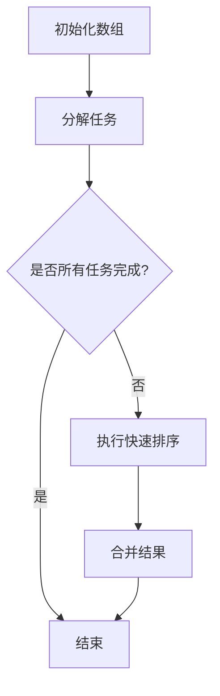
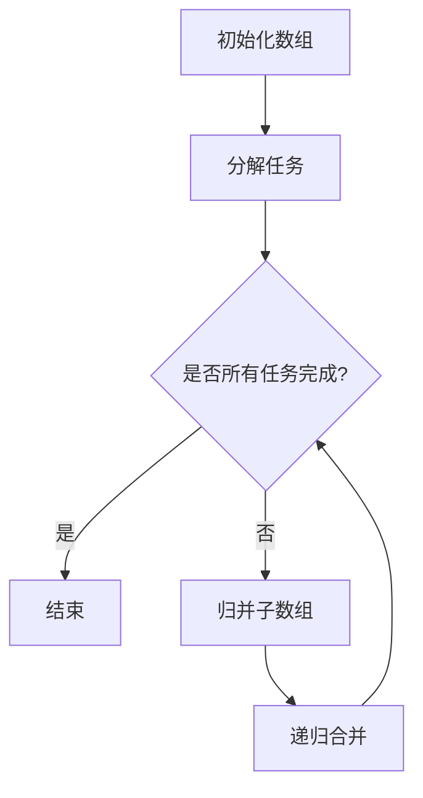
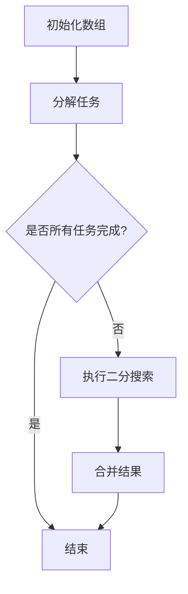
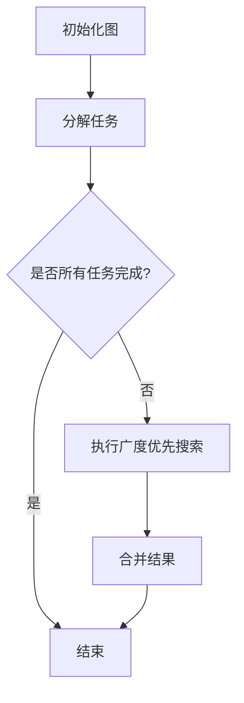
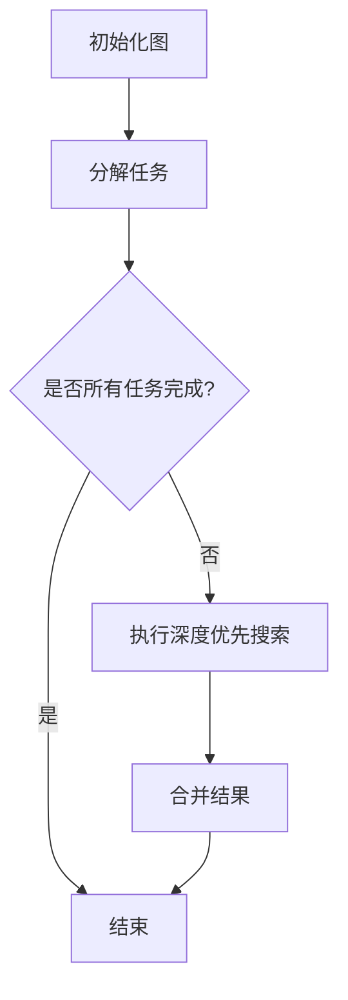

                 

### 引言

#### 1.1 问题背景与意义

在当今信息化社会中，计算能力的提升和数据量的爆炸式增长推动了并行计算技术的迅猛发展。并行程序设计作为一种提高计算效率和应对大数据问题的有效手段，逐渐成为计算机科学和工程领域的研究热点。然而，并行程序设计面临着诸多挑战，例如任务调度、负载平衡、同步与通信等问题，这些问题的复杂性和不确定性使得并行程序设计的难度大大增加。

偏序理论，作为数学领域的一个重要概念，其核心在于描述元素之间的部分序关系。这种理论在并行程序设计中有着广泛的应用前景。通过引入偏序理论，我们可以更加直观地分析和解决并行程序设计中的问题，提高并行算法的效率和可理解性。

本文旨在探讨偏序理论在并行程序设计中的应用，通过逐步分析推理，帮助读者深入理解偏序理论的核心概念和其在并行程序设计中的具体应用，从而提高并行程序设计的效率和可维护性。

#### 1.2 并行程序设计概述

并行程序设计是一种利用多个计算资源同时执行任务的方法，其核心目标是通过并行执行来提高程序的运行效率和性能。并行程序设计的主要特点包括：

1. **任务分解**：将一个大任务分解成多个子任务，每个子任务可以在不同的计算资源上并行执行。
2. **数据并行**：将数据分解成多个部分，每个部分在不同的计算资源上独立处理，然后再合并结果。
3. **任务调度**：合理地分配任务到不同的计算资源上，以最小化执行时间和资源利用率。
4. **同步与通信**：确保多个任务之间的数据一致性，通过通信机制实现数据交换和任务协调。

并行程序设计可以大幅提高计算效率，尤其是在处理大规模数据和高性能计算任务时。然而，并行程序设计也面临着诸多挑战，例如任务之间的数据依赖、负载平衡问题、同步与通信的开销等。这些挑战需要通过科学的设计和优化来解决。

#### 1.3 偏序理论概述

偏序理论是数学领域中的一个重要分支，主要研究集合中元素之间的部分序关系。一个集合上的偏序关系是指集合中任意两个元素之间都可以判断出大小关系，但并非所有元素之间都可以完全排序。具体来说，偏序关系具有以下性质：

1. **自反性**：对于集合中的任意元素 \(a\)，都有 \(a \leq a\)。
2. **反对称性**：如果 \(a \leq b\) 且 \(b \leq a\)，则 \(a = b\)。
3. **传递性**：如果 \(a \leq b\) 且 \(b \leq c\)，则 \(a \leq c\)。

偏序集合可以用来描述元素之间的部分序关系，例如部分排序、层次结构等。在并行程序设计中，偏序理论可以帮助我们更好地理解任务之间的依赖关系，从而设计出更加高效的并行算法。

#### 1.4 书籍结构安排

本文将按照以下结构进行组织：

- **第1章 引言**：介绍问题背景和意义，概述并行程序设计和偏序理论的基本概念。
- **第2章 偏序理论基础**：详细讲解偏序集合的定义、性质和应用。
- **第3章 并行程序设计基础**：介绍并行计算的基本概念、模型和算法。
- **第4章 偏序理论在并行程序设计中的应用**：探讨偏序理论在任务调度、负载平衡、同步与通信中的应用。
- **第5章 实例分析：并行排序算法**：通过并行排序算法实例分析偏序理论的应用。
- **第6章 实例分析：并行搜索算法**：通过并行搜索算法实例进一步探讨偏序理论的应用。
- **第7章 并行程序设计最佳实践**：总结并行程序设计的最佳实践和注意事项。
- **第8章 拓展阅读**：介绍偏序理论在其他领域的应用、并行程序设计的新趋势和未来研究方向。

通过上述结构安排，本文旨在系统地介绍偏序理论在并行程序设计中的应用，帮助读者深入理解和掌握这一重要技术。

### 偏序理论基础

偏序集合是数学中的一个重要概念，它描述了集合中元素之间的一种部分序关系。为了更好地理解偏序理论，我们先来定义偏序集合及其基本性质。

#### 2.1 偏序集合的定义与性质

**定义**：设 \(P\) 是一个集合，如果 \(P\) 上的关系 \(\leq\) 满足以下三个性质，则称 \(P\) 是一个偏序集合：

1. **自反性**：对于集合中的任意元素 \(a\)，都有 \(a \leq a\)。
2. **反对称性**：如果 \(a \leq b\) 且 \(b \leq a\)，则 \(a = b\)。
3. **传递性**：如果 \(a \leq b\) 且 \(b \leq c\)，则 \(a \leq c\)。

**例子**：自然数集合 \(N\) 上的“小于等于”关系（\(\leq\)）是一个偏序集合。在这个集合中，任何两个自然数之间都可以判断出大小关系，但并不是所有自然数都可以完全排序。

**性质**：

1. **最小元素**：在偏序集合中，如果存在一个元素 \(a\) 使得对于集合中的任意元素 \(b\)，都有 \(a \leq b\)，则称 \(a\) 为最小元素。
2. **最大元素**：在偏序集合中，如果存在一个元素 \(b\) 使得对于集合中的任意元素 \(a\)，都有 \(a \leq b\)，则称 \(b\) 为最大元素。
3. **链**：偏序集合中的任意子集如果可以排成一个完全排序序列，则称这个子集为链。
4. **上限与下限**：在偏序集合中，如果存在一个元素 \(a\) 使得对于集合中的任意元素 \(b\)，都有 \(a \leq b\)，则称 \(a\) 为这个集合的上限；如果存在一个元素 \(b\) 使得对于集合中的任意元素 \(a\)，都有 \(a \leq b\)，则称 \(b\) 为这个集合的下限。

#### 2.2 偏序集合的运算

偏序集合上的运算主要包括并集、交集、补集等。这些运算在偏序集合中保持偏序关系。

**定义**：

1. **并集**：设 \(P_1\) 和 \(P_2\) 是两个偏序集合，\(P_1 \cup P_2\) 是包含 \(P_1\) 和 \(P_2\) 中所有元素的集合。如果 \(P_1\) 和 \(P_2\) 上的偏序关系相同，则 \(P_1 \cup P_2\) 上的偏序关系与 \(P_1\) 或 \(P_2\) 相同。
   
2. **交集**：设 \(P_1\) 和 \(P_2\) 是两个偏序集合，\(P_1 \cap P_2\) 是包含 \(P_1\) 和 \(P_2\) 共同元素的集合。如果 \(P_1\) 和 \(P_2\) 上的偏序关系相同，则 \(P_1 \cap P_2\) 上的偏序关系与 \(P_1\) 或 \(P_2\) 相同。

3. **补集**：设 \(P\) 是一个偏序集合，\(P'\) 是 \(P\) 的补集，即 \(P' = U \setminus P\)（其中 \(U\) 是 \(P\) 的全域）。如果 \(P\) 上的偏序关系是“小于等于”（\(\leq\)），则 \(P'\) 上的偏序关系是“大于等于”（\(\geq\)）。

**性质**：

1. **自反性**：并集和交集运算都满足自反性。
2. **反对称性**：并集和交集运算都满足反对称性。
3. **传递性**：并集和交集运算都满足传递性。

#### 2.3 偏序集合的应用

偏序集合在多个领域都有广泛的应用，例如数学、计算机科学、经济学等。

**数学领域**：

- **拓扑学**：偏序集合是拓扑空间的基础概念之一，用来描述点之间的关系。
- **集合论**：偏序集合在集合论中用来定义部分序集合和序集合。
- **图论**：图的路径关系可以用偏序集合来描述。

**计算机科学领域**：

- **算法分析**：偏序集合可以用来描述算法的时间复杂度和空间复杂度。
- **并行计算**：偏序集合可以用来分析并行算法中的任务调度和同步问题。
- **软件工程**：偏序集合可以用来描述软件模块之间的依赖关系。

**经济学领域**：

- **博弈论**：偏序集合用来描述参与者之间的策略组合和博弈结果。
- **经济模型**：偏序集合用来描述经济活动中的供需关系和价格形成。

#### 2.4 偏序理论的拓展

偏序理论是一个丰富的数学分支，其研究范畴不断拓展。以下是一些拓展方向：

- **格理论**：格是一种更加严格的偏序集合，其任意两个元素都有最小上界和最大下界。
- **范畴论**：范畴论是数学中一个高级理论，其基础概念之一是偏序集合。
- **拓扑偏序空间**：拓扑偏序空间将偏序集合与拓扑空间结合起来，用于研究连续变化的问题。

通过上述对偏序集合的定义、性质、运算及其应用的探讨，我们可以更好地理解偏序理论在数学和计算机科学中的应用。在接下来的章节中，我们将进一步探讨偏序理论在并行程序设计中的具体应用，帮助读者更好地掌握这一重要技术。

### 并行程序设计基础

并行程序设计是利用多个计算资源同时执行任务的一种方法，其目的是提高计算效率和性能。为了深入理解并行程序设计，我们需要了解其基本概念、模型和算法。

#### 3.1 并行计算概述

并行计算是指利用多个计算资源（如多个处理器、计算机节点）同时执行计算任务的过程。并行计算可以分为几种不同的类型：

1. **数据并行**：将一个大任务分解成多个子任务，每个子任务处理不同部分的数据，最后合并结果。
2. **任务并行**：将一个大任务分解成多个子任务，每个子任务可以在不同的计算资源上独立执行，但不一定处理不同的数据。
3. **任务和数据并行**：同时利用数据并行和任务并行的优势，处理大规模、复杂的数据任务。

并行计算的主要优点包括：

- **提高计算速度**：通过同时处理多个任务，可以大幅减少执行时间。
- **提高性能**：在多核处理器和分布式系统中，并行计算可以充分利用计算资源。
- **扩展性**：并行计算可以方便地扩展到更多的计算资源，以处理更大的任务。

然而，并行计算也面临着一些挑战，例如任务之间的数据依赖、负载平衡、同步与通信等问题。

#### 3.2 并行程序的模型

并行程序的模型是描述并行计算过程的基本框架。常见的并行程序模型包括：

1. **数据流模型**：数据流模型描述了数据在并行程序中的流动和操作。它通过图来表示数据的流向和处理过程，每个节点表示一个处理操作，边表示数据传输。
   
2. **控制流模型**：控制流模型描述了并行程序中的控制逻辑和执行顺序。它通过控制逻辑来协调并行任务的执行，确保任务之间的同步和通信。

3. **任务并行模型**：任务并行模型将一个大任务分解成多个子任务，每个子任务在不同的计算资源上独立执行。它通常通过任务调度算法来分配任务和资源。

4. **共享内存模型**：共享内存模型允许多个并行任务共享同一块内存空间。它通过锁和互斥机制来同步访问共享数据，避免数据竞争和一致性问题。

5. **分布式内存模型**：分布式内存模型将程序运行在不同计算机节点上的任务，每个节点都有自己的内存空间。它通过通信机制（如消息传递）来同步和协调任务的执行。

这些并行程序模型各有优缺点，适用于不同的应用场景和任务类型。在实际应用中，可以根据具体需求选择合适的并行程序模型。

#### 3.3 并行算法的基本概念

并行算法是指在并行计算环境中执行的算法，其目标是利用多个计算资源来提高计算效率和性能。并行算法的基本概念包括：

1. **任务分解**：将一个大任务分解成多个子任务，每个子任务可以在不同的计算资源上并行执行。
   
2. **并行度**：并行度表示并行算法中可以同时执行的任务数量。并行度越高，计算效率越高。

3. **负载平衡**：负载平衡是指合理分配任务到不同的计算资源上，以最大化资源利用率和计算性能。负载不平衡会导致某些计算资源过度使用，而其他资源闲置。

4. **同步与通信**：同步是指多个并行任务之间的时间协调，以确保任务执行的一致性和正确性。通信是指任务之间的数据交换和协作。

5. **并行算法效率**：并行算法的效率可以通过时间复杂度和空间复杂度来衡量。并行算法的时间复杂度通常表示为 \(O(\log n)\) 或 \(O(n\log n)\)，其中 \(n\) 是输入规模。并行算法的空间复杂度通常表示为 \(O(n)\) 或 \(O(n^2)\)。

6. **并行算法的可扩展性**：并行算法的可扩展性表示其适用于不同规模的任务和数据。可扩展的并行算法可以在不同的计算资源上高效执行，而不会降低性能。

#### 3.4 并行程序的挑战与机遇

并行程序设计面临着许多挑战和机遇。以下是并行程序设计中的主要挑战和机遇：

**挑战**：

1. **任务依赖和同步问题**：并行任务之间的数据依赖和同步问题是并行程序设计的难点。任务之间的依赖关系可能会导致死锁、饥饿等问题，影响程序的效率和正确性。
   
2. **负载平衡问题**：在并行程序设计中，负载平衡是关键问题之一。负载不平衡会导致某些计算资源过度使用，而其他资源闲置，影响整体性能。
   
3. **通信开销**：在分布式并行程序设计中，任务之间的通信开销可能会成为性能瓶颈。高效的通信机制和算法是提高并行程序性能的关键。
   
4. **编程复杂度**：并行程序设计通常比顺序程序设计更加复杂，需要考虑任务调度、同步和通信等细节。这增加了编程的难度和开发成本。

**机遇**：

1. **高性能计算**：并行程序设计可以大幅提高计算性能，适用于处理大规模、复杂的问题，如科学计算、数据分析和机器学习等。
   
2. **可扩展性**：并行程序设计具有很好的可扩展性，可以方便地扩展到更多的计算资源上，以处理更大的任务和数据。
   
3. **资源利用最大化**：并行程序设计可以充分利用计算资源，提高资源利用率，降低计算成本。
   
4. **开发工具和平台**：随着并行计算技术的不断发展，各种开发工具和平台不断涌现，降低了并行程序设计的难度和成本。

通过以上对并行程序设计基础的介绍，我们可以更好地理解并行计算的基本概念、模型和算法。在接下来的章节中，我们将进一步探讨偏序理论在并行程序设计中的应用，帮助读者深入掌握这一重要技术。

### 偏序理论在并行程序设计中的应用

偏序理论在并行程序设计中具有重要的应用价值，特别是在任务调度、负载平衡、同步与通信等方面。通过引入偏序理论，我们可以更加有效地解决并行程序设计中的各种问题，提高程序的效率和可维护性。

#### 4.1 偏序理论在任务调度中的应用

任务调度是并行程序设计中的关键环节，其目标是合理地分配任务到不同的计算资源上，以最小化执行时间和资源利用率。偏序理论在任务调度中的应用主要体现在以下几个方面：

1. **任务依赖分析**：在并行程序中，任务之间存在依赖关系，即一个任务的执行依赖于另一个任务的完成。偏序集合可以用来描述任务之间的依赖关系，通过分析任务之间的偏序关系，可以更好地理解任务调度的复杂性。

2. **优化任务分配**：利用偏序集合的属性，可以设计出更加优化的任务分配算法。例如，在负载平衡问题中，可以通过偏序集合的传递性和反对称性来识别负载过重或过轻的任务，并对其进行重新分配，以实现负载均衡。

3. **调度策略设计**：偏序理论可以指导设计各种调度策略，如贪心算法、动态规划等。这些策略可以根据任务之间的偏序关系来选择最佳的任务执行顺序，从而提高调度效率。

#### 4.2 偏序理论在负载平衡中的应用

负载平衡是并行程序设计中的重要问题，其目标是在多个计算资源之间合理分配任务，以最大化资源利用率和整体性能。偏序理论在负载平衡中的应用主要包括以下几个方面：

1. **识别负载不均**：利用偏序集合的传递性和反对称性，可以识别出负载过重或过轻的计算资源。例如，如果某个计算资源上的任务执行时间比其他资源长，则可以认为该资源负载过重。

2. **动态负载调整**：在动态负载调整过程中，可以利用偏序集合的运算（如并集和交集）来合并或分割任务，以实现负载均衡。例如，通过将负载过重的任务分配到其他计算资源上，或将负载较轻的任务合并，从而实现负载的动态调整。

3. **负载预测与优化**：利用偏序集合的属性，可以预测任务执行过程中的负载变化，并设计出相应的优化策略。例如，通过分析任务之间的偏序关系，可以提前识别出即将发生的负载高峰，并采取相应的措施进行预防。

#### 4.3 偏序理论在同步与通信中的应用

同步与通信是并行程序设计中的关键环节，其目标是在多个任务之间实现数据一致性和任务协调。偏序理论在同步与通信中的应用主要包括以下几个方面：

1. **同步机制设计**：偏序集合可以用来描述任务之间的同步机制。例如，在分布式系统中，可以利用偏序集合来表示任务的执行顺序，并通过同步原语（如锁、信号量等）来实现任务之间的同步。

2. **通信优化**：偏序集合可以帮助优化任务之间的通信过程。例如，通过分析任务之间的偏序关系，可以设计出更加高效的通信算法，减少通信开销。例如，在消息传递过程中，可以根据任务的依赖关系来优化消息的发送和接收顺序。

3. **并发控制**：偏序理论可以用来实现并发控制，以避免并发冲突和数据不一致。例如，在多线程程序设计中，可以利用偏序集合来描述线程之间的并发关系，并设计出相应的并发控制策略，如锁、事务等。

#### 4.4 偏序理论在并行算法优化中的应用

并行算法优化是提高并行程序性能的关键，偏序理论在并行算法优化中的应用主要体现在以下几个方面：

1. **算法分析**：利用偏序集合的性质，可以对并行算法的时间复杂度和空间复杂度进行分析。例如，通过分析任务之间的偏序关系，可以优化算法的执行时间和内存占用。

2. **优化任务分配**：通过分析任务之间的偏序关系，可以设计出更加优化的任务分配策略，以减少任务执行时间。例如，在并行排序算法中，可以利用偏序集合来识别并分配大小相近的任务，以实现更高效的排序。

3. **负载平衡优化**：利用偏序集合的属性，可以设计出更加高效的负载平衡算法，以最大化资源利用率和整体性能。例如，在分布式系统中，可以利用偏序集合来识别并调整负载过重或过轻的计算资源，以实现负载的动态平衡。

通过以上对偏序理论在并行程序设计中的应用探讨，我们可以看到偏序理论在任务调度、负载平衡、同步与通信和并行算法优化等方面具有重要的应用价值。在接下来的章节中，我们将通过具体实例分析，进一步展示偏序理论在并行程序设计中的应用效果。

### 实例分析：并行排序算法

在并行程序设计中，排序算法是一个经典且广泛使用的实例。通过引入偏序理论，我们可以优化并行排序算法，提高其效率和可理解性。以下我们将探讨两种常见的并行排序算法：并行快速排序算法和并行归并排序算法。

#### 5.1 并行排序算法概述

并行排序算法是指利用多个计算资源同时执行排序任务，以提高排序效率的算法。常见的并行排序算法包括并行快速排序算法和并行归并排序算法等。这些算法通过将大任务分解成多个子任务，并在不同的计算资源上独立执行，然后合并子任务的结果，实现排序。

#### 5.2 并行快速排序算法

并行快速排序算法是并行排序算法中的一种，其基本思想是选取一个基准元素，将待排序的数组分为两部分，一部分小于基准元素，另一部分大于基准元素，然后对这两部分分别递归执行快速排序。以下是并行快速排序算法的基本步骤：

1. **任务分解**：将大数组 \(A\) 分成多个子数组 \(A_1, A_2, \ldots, A_k\)，每个子数组 \(A_i\) 独立执行快速排序。

2. **快速排序**：在每个子数组 \(A_i\) 上独立执行快速排序算法，选择基准元素 \(P_i\)，将子数组分为 \(A_i_1\)（小于 \(P_i\) 的部分）和 \(A_i_2\)（大于 \(P_i\) 的部分）。

3. **合并结果**：将所有子数组的排序结果合并成一个完整的排序数组。

下面是并行快速排序算法的 Mermaid 流程图：

并行快速排序算法的时间复杂度为 \(O(n \log n)\)，其中 \(n\) 是输入规模。通过并行执行，可以显著减少执行时间。

#### 5.3 并行归并排序算法

并行归并排序算法是基于归并排序算法的并行版本。归并排序的基本思想是将大数组分解成多个小数组，然后两两合并这些小数组，直到合并成一个完整的排序数组。以下是并行归并排序算法的基本步骤：

1. **任务分解**：将大数组 \(A\) 分成多个子数组 \(A_1, A_2, \ldots, A_k\)。

2. **归并子数组**：两两合并这些子数组，例如将 \(A_1\) 和 \(A_2\) 合并成 \(A_{12}\)，将 \(A_3\) 和 \(A_4\) 合并成 \(A_{34}\)，以此类推。

3. **递归合并**：对每个合并后的子数组 \(A_{ij}\)，继续两两合并，直到合并成一个完整的排序数组。

下面是并行归并排序算法的 Mermaid 流程图：

并行归并排序算法的时间复杂度为 \(O(n \log n)\)，通过并行执行，可以显著减少执行时间。

#### 5.4 并行排序算法的性能分析

并行排序算法的性能可以通过以下几个方面进行评估：

1. **时间复杂度**：并行排序算法的时间复杂度通常为 \(O(n \log n)\)，但通过并行执行，可以减少执行时间。

2. **并行度**：并行度表示算法中可以同时执行的任务数量。较高的并行度可以提高计算性能，但也可能增加通信开销。

3. **负载平衡**：负载平衡是指任务分配是否均匀，负载平衡良好的算法可以最大化资源利用率。

4. **同步与通信开销**：在并行排序算法中，任务之间的同步和通信开销可能成为性能瓶颈。优化同步与通信机制可以提高算法性能。

通过以上对并行快速排序算法和并行归并排序算法的介绍和性能分析，我们可以看到偏序理论在并行排序算法中的应用价值。在实际应用中，可以根据具体需求和性能评估结果，选择合适的并行排序算法。

### 实例分析：并行搜索算法

并行搜索算法是并行程序设计中的另一个重要实例。通过引入偏序理论，我们可以优化并行搜索算法，提高其效率和可理解性。以下我们将探讨四种常见的并行搜索算法：并行二分搜索算法、并行广度优先搜索算法、并行深度优先搜索算法。

#### 6.1 并行搜索算法概述

并行搜索算法是指利用多个计算资源同时执行搜索任务，以提高搜索效率的算法。常见的并行搜索算法包括并行二分搜索算法、并行广度优先搜索算法、并行深度优先搜索算法等。这些算法通过将大任务分解成多个子任务，并在不同的计算资源上独立执行，然后合并子任务的结果，实现搜索。

#### 6.2 并行二分搜索算法

并行二分搜索算法是基于二分搜索算法的并行版本。二分搜索的基本思想是在有序数组中逐步缩小搜索范围，直到找到目标元素或确定其不存在。以下是并行二分搜索算法的基本步骤：

1. **任务分解**：将大数组 \(A\) 分成多个子数组 \(A_1, A_2, \ldots, A_k\)。

2. **并行搜索**：在每个子数组 \(A_i\) 上独立执行二分搜索算法，查找目标元素。

3. **合并结果**：将所有子数组的搜索结果合并，得到最终结果。

下面是并行二分搜索算法的 Mermaid 流程图：

并行二分搜索算法的时间复杂度为 \(O(n \log n)\)，通过并行执行，可以显著减少执行时间。

#### 6.3 并行广度优先搜索算法

并行广度优先搜索算法是基于广度优先搜索算法的并行版本。广度优先搜索的基本思想是从根节点开始，逐层遍历图中的所有节点，直到找到目标节点或确定其不存在。以下是并行广度优先搜索算法的基本步骤：

1. **任务分解**：将图 \(G\) 分成多个子图 \(G_1, G_2, \ldots, G_k\)。

2. **并行搜索**：在每个子图 \(G_i\) 上独立执行广度优先搜索算法，查找目标节点。

3. **合并结果**：将所有子图的搜索结果合并，得到最终结果。

下面是并行广度优先搜索算法的 Mermaid 流程图：

并行广度优先搜索算法的时间复杂度为 \(O(n + m)\)，其中 \(n\) 是节点数量，\(m\) 是边数量。通过并行执行，可以显著减少执行时间。

#### 6.4 并行深度优先搜索算法

并行深度优先搜索算法是基于深度优先搜索算法的并行版本。深度优先搜索的基本思想是从根节点开始，尽可能深地搜索图的分支，直到找到目标节点或确定其不存在。以下是并行深度优先搜索算法的基本步骤：

1. **任务分解**：将图 \(G\) 分成多个子图 \(G_1, G_2, \ldots, G_k\)。

2. **并行搜索**：在每个子图 \(G_i\) 上独立执行深度优先搜索算法，查找目标节点。

3. **合并结果**：将所有子图的搜索结果合并，得到最终结果。

下面是并行深度优先搜索算法的 Mermaid 流程图：

并行深度优先搜索算法的时间复杂度为 \(O(n)\)，但并行度较低时，可能无法显著提高执行时间。

#### 6.5 并行搜索算法的性能分析

并行搜索算法的性能可以通过以下几个方面进行评估：

1. **时间复杂度**：并行搜索算法的时间复杂度通常为 \(O(n \log n)\) 或 \(O(n + m)\)，但通过并行执行，可以减少执行时间。

2. **并行度**：并行度表示算法中可以同时执行的任务数量。较高的并行度可以提高计算性能，但也可能增加通信开销。

3. **负载平衡**：负载平衡是指任务分配是否均匀，负载平衡良好的算法可以最大化资源利用率。

4. **同步与通信开销**：在并行搜索算法中，任务之间的同步和通信开销可能成为性能瓶颈。优化同步与通信机制可以提高算法性能。

通过以上对并行二分搜索算法、并行广度优先搜索算法、并行深度优先搜索算法的介绍和性能分析，我们可以看到偏序理论在并行搜索算法中的应用价值。在实际应用中，可以根据具体需求和性能评估结果，选择合适的并行搜索算法。

### 并行程序设计最佳实践

在并行程序设计中，最佳实践和注意事项对于提高程序的效率、可维护性和可靠性至关重要。以下是一些并行程序设计的最佳实践和注意事项：

#### 7.1 并行程序设计的基本原则

1. **任务分解与分配**：合理地分解任务，确保每个任务都能在较短的时间内完成，以避免因某个任务耗时过长而影响整体性能。任务分配要考虑负载平衡，确保计算资源得到充分利用。

2. **数据局部性**：尽量将相关数据分配到同一计算资源上，以减少数据传输开销。此外，可以利用缓存局部性来提高数据访问效率。

3. **同步与通信策略**：合理选择同步和通信策略，以减少同步和通信的开销。例如，可以使用异步通信和事件驱动模型来降低同步等待时间。

4. **错误处理**：在并行程序中，错误处理需要考虑多个任务可能同时出现错误的情况。应设计全局错误处理机制，确保程序能够稳定运行。

5. **容错性**：为并行程序设计容错机制，以应对计算资源故障、网络中断等问题。例如，可以使用检查点、备份和恢复技术来保证程序的健壮性。

#### 7.2 并行程序的调试与优化

1. **性能分析**：使用性能分析工具对并行程序进行监控和分析，找出性能瓶颈和资源利用不均的问题。

2. **代码审查**：定期进行代码审查，确保并行程序设计符合最佳实践和编码规范。

3. **内存管理**：合理管理内存资源，避免内存泄漏和竞争条件。使用内存分配和释放工具来监控内存使用情况。

4. **并行算法优化**：分析并行算法的时间复杂度和空间复杂度，通过优化算法和数据结构来提高程序性能。

5. **负载平衡**：动态调整任务分配，确保负载平衡。可以使用负载平衡算法和自适应调度策略来优化资源利用。

#### 7.3 并行程序的性能评估

1. **基准测试**：使用基准测试工具对并行程序进行性能评估，比较不同并行算法和设计方案的性能。

2. **负载变化适应性**：评估并行程序在不同负载下的性能，确保程序能够适应负载变化。

3. **资源利用率**：监测并行程序对计算资源（如CPU、内存、网络等）的利用率，优化资源分配策略。

4. **可扩展性**：评估并行程序在扩展计算资源（如增加节点数）时的性能，确保程序具有良好的可扩展性。

5. **稳定性**：评估并行程序在长时间运行下的稳定性和可靠性，确保程序能够稳定运行。

#### 7.4 并行程序的安全性

1. **数据保护**：确保并行程序中的数据在传输和存储过程中得到保护，避免数据泄露和篡改。

2. **身份验证和访问控制**：实现身份验证和访问控制机制，确保只有授权用户可以访问程序和数据。

3. **安全审计**：定期进行安全审计，检测潜在的安全漏洞和风险。

4. **加密通信**：在分布式系统中，使用加密通信协议来保护数据传输的安全性。

5. **灾难恢复**：设计灾难恢复计划，以应对突发情况，确保系统在灾难发生后能够快速恢复。

通过遵循这些最佳实践和注意事项，可以显著提高并行程序设计的效率和可靠性，确保程序在复杂和多变的环境中能够稳定运行。在实际开发过程中，应根据具体需求和场景灵活应用这些实践，以提高并行程序的质量和性能。

### 拓展阅读

偏序理论在计算机科学和数学领域有着广泛的应用，不仅限于并行程序设计。以下是一些相关领域的扩展阅读建议：

#### 8.1 偏序理论在其他领域的应用

1. **图论**：在图论中，偏序关系可以用来描述图中的层次结构，如拓扑排序和层次图。图论在算法设计、网络分析、社会网络分析等领域有广泛应用。

2. **算法分析**：偏序集合在算法分析中用于描述时间复杂度和空间复杂度，帮助理解算法的效率。

3. **数据库理论**：偏序关系在数据库理论中用于描述数据表的层次结构和依赖关系，如层次数据库和关系数据库的规范化理论。

4. **博弈论**：在博弈论中，偏序集合用来描述策略组合和博弈结果，帮助分析博弈策略和均衡。

5. **组合优化**：偏序集合在组合优化问题（如最小生成树、最小费用流等）中用于优化策略设计和问题求解。

#### 8.2 并行程序设计的新趋势

1. **量子计算**：量子计算在并行程序设计中有巨大潜力，利用量子并行性和量子叠加原理，可以大幅提高计算效率。

2. **异构计算**：随着硬件技术的发展，异构计算（如CPU、GPU、FPGA等混合使用）成为并行程序设计的新趋势。

3. **自动并行化**：自动化工具和编译器技术正在不断进步，可以自动识别和优化并行程序，降低并行程序设计的复杂度。

4. **软件定义网络**：软件定义网络（SDN）和网络功能虚拟化（NFV）正在改变网络架构，并行程序设计需要适应这种新的网络环境。

5. **云计算和边缘计算**：云计算和边缘计算的兴起，使得并行程序设计需要考虑分布式计算环境，提高程序的可扩展性和灵活性。

#### 8.3 未来研究方向

1. **自适应并行算法**：研究自适应并行算法，能够根据负载和环境动态调整并行策略，提高并行程序的效率和可维护性。

2. **数据并行算法优化**：优化数据并行算法，减少数据传输和通信开销，提高大规模数据处理的性能。

3. **能效优化**：研究并行程序设计的能效优化，提高计算效率的同时降低能耗。

4. **安全性**：加强并行程序设计中的安全性研究，确保程序在复杂和多变的环境中能够稳定运行。

5. **跨领域应用**：探索偏序理论在生物信息学、金融工程等跨领域中的应用，推动多学科交叉融合。

通过拓展阅读，可以更深入地了解偏序理论和其他领域的关系，把握并行程序设计的新趋势和未来研究方向，为实际应用提供更有力的理论和技术支持。

### 总结与展望

本文通过逐步分析推理，深入探讨了偏序理论在并行程序设计中的应用。从基础概念和理论开始，逐步介绍了偏序集合的定义、性质、运算及其应用，进一步阐述了并行程序设计的基础知识、挑战与机遇，以及偏序理论在任务调度、负载平衡、同步与通信和并行算法优化中的应用。通过实例分析，展示了并行排序算法和并行搜索算法如何利用偏序理论优化其效率和性能。

偏序理论作为一种重要的数学工具，在并行程序设计中具有重要的应用价值。它不仅帮助我们更好地理解任务之间的依赖关系，还为优化任务调度、负载平衡和同步通信提供了有力的理论支持。随着计算能力和数据规模的不断增长，并行程序设计的需求日益增加，偏序理论的应用前景也将更加广阔。

然而，本文的研究仍存在一定的局限性。例如，对偏序理论的应用实例分析较为有限，更多实际应用场景和优化策略有待进一步探讨。此外，并行程序设计中的安全性问题也是一个重要的研究方向，需要在未来的工作中给予更多关注。

展望未来，偏序理论在并行程序设计中的应用前景十分广阔。随着量子计算、异构计算、自动并行化等新趋势的出现，偏序理论将在更广泛的领域中发挥重要作用。我们期待在未来的研究中，能够结合更多实际应用场景，进一步探索偏序理论在并行程序设计中的潜力，推动计算机科学和工程领域的发展。

### 注意事项与建议

在应用偏序理论进行并行程序设计时，以下几点注意事项和建议对于确保程序的正确性和效率至关重要：

1. **任务依赖关系的准确性**：确保任务依赖关系的描述准确无误，避免因依赖关系错误导致并行任务无法正确执行。

2. **负载平衡的动态调整**：合理分配任务，并考虑负载动态变化，及时调整任务分配策略，以避免负载不均影响整体性能。

3. **同步与通信机制的优化**：选择合适的同步与通信机制，减少通信开销，并确保数据一致性。

4. **错误处理机制**：设计全局错误处理机制，应对并行任务中的各种异常情况，确保程序的健壮性和稳定性。

5. **性能评估与优化**：定期进行性能评估，找出性能瓶颈，并采取相应的优化措施，以提高程序效率。

6. **安全性考虑**：在并行程序设计中，考虑数据保护和安全性，确保程序在复杂环境中能够稳定运行。

通过遵循上述注意事项和建议，可以显著提高并行程序设计的质量和可靠性，确保程序在各种应用场景下能够高效、稳定地运行。

### 拓展阅读

为了深入了解偏序理论在并行程序设计及其他领域中的应用，读者可以参考以下文献和资源：

1. **《并行算法导论》**：该书详细介绍了并行计算的基本概念、模型和算法，包括任务调度、负载平衡、同步与通信等方面。

2. **《偏序集合与图论》**：该书系统地介绍了偏序集合的定义、性质及其在图论中的应用，为理解偏序理论提供了全面的背景知识。

3. **《偏序理论与计算机科学》**：该书探讨了偏序理论在计算机科学领域的广泛应用，包括算法分析、数据结构设计、软件工程等方面。

4. **《并行程序设计实践》**：该书提供了并行程序设计的实际案例和最佳实践，帮助读者更好地理解和应用并行计算技术。

5. **在线课程和教程**：例如，Coursera、edX等在线教育平台提供了关于并行计算和算法设计的课程，读者可以通过这些课程系统学习相关内容。

6. **学术论文**：在学术期刊和会议上，可以找到大量关于偏序理论和并行程序设计的前沿研究成果，读者可以通过阅读这些论文了解最新的研究动态和进展。

通过阅读这些文献和资源，读者可以更加深入地理解偏序理论在并行程序设计中的应用，提升自己在相关领域的知识和技能。

