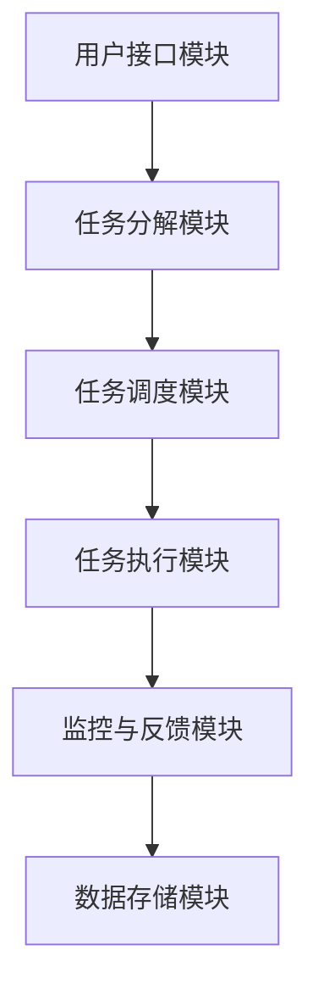
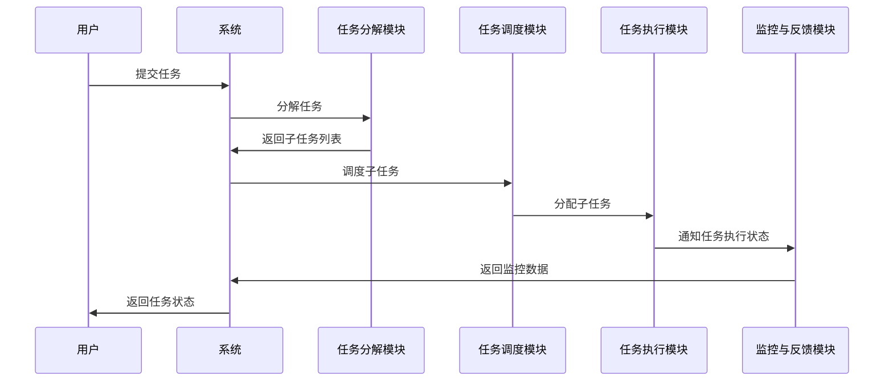

                 


### 第1章：问题背景与核心概念

#### 1.1 问题背景

在当今高度信息化的社会中，计算机系统和人工智能技术正在不断深入各个领域，从简单的数据处理到复杂的决策支持系统，都在依赖于高效的算法和架构设计。然而，随着问题复杂度的增加，传统的单一控制器模式已难以满足需求。复杂推理任务重组成为了当前研究的热点之一，其核心目的是通过将复杂的任务分解为更小、更易于管理的子任务，进而提高系统的效率和可维护性。

现实需求主要来源于以下几个方面：

1. **大数据处理**：随着数据量的爆炸性增长，如何高效地对海量数据进行处理和分析变得至关重要。传统的数据处理方法在面对大数据时往往显得力不从心，复杂推理任务重组提供了新的思路。

2. **人工智能应用**：人工智能系统在决策支持、智能推荐、自动驾驶等领域中发挥着越来越重要的作用。这些领域中的任务往往非常复杂，需要多种算法和技术的协同作用。通过任务重组，可以更好地利用人工智能的优势。

3. **分布式系统**：现代计算系统越来越多地采用分布式架构，这要求系统能够在多个节点之间高效地调度和分配任务。复杂推理任务重组能够优化任务的分配，提高系统的整体性能。

#### 1.2 元控制器概念与复杂性

元控制器是一种高级的控制器，它在传统控制器的基础上，增加了自动规划和决策功能。元控制器的核心思想是通过自动化来减少人工干预，从而提高系统的智能化水平和运行效率。

**元控制器的定义**：
元控制器是一种能够自主规划和执行任务的智能系统，它可以在复杂环境中根据实时信息进行自适应调整，以实现最优的任务执行策略。

**元控制器与传统控制器的区别**：

| 特征       | 元控制器                  | 传统控制器                 |
| ---------- | ------------------------ | -------------------------- |
| 决策方式   | 自动化决策                | 需人工干预                |
| 适应能力   | 高度自适应                | 适应性较差                |
| 执行效率   | 高效执行，减少人工干预   | 执行效率依赖于人工干预   |
| 扩展性     | 易于扩展，适用于复杂任务 | 扩展性较差，适用于简单任务 |

#### 1.3 问题描述

复杂推理任务重组的核心在于将复杂的任务分解为多个子任务，并在多个子任务之间进行有效的调度和协调。具体来说，问题描述可以概括为以下几点：

1. **复杂推理任务的定义**：复杂推理任务是指那些涉及多步骤、多条件、多策略的推理过程，它们需要大量的计算资源和时间来执行。

2. **元控制器在复杂推理任务重组中的作用**：元控制器通过自动化决策和任务调度，能够有效地将复杂推理任务分解为多个子任务，并在子任务之间实现最优的协调。

3. **问题解决**：
   - **任务分解**：将复杂的推理任务分解为更小、更易于管理的子任务。
   - **任务调度**：根据实时信息和系统状态，对子任务进行动态调度。
   - **任务组合**：将子任务组合成完整的推理过程，并保证任务的正确性和效率。

#### 1.4 边界与外延

**元控制器的适用范围**：
元控制器适用于那些需要高度自动化和自适应的复杂任务环境，如人工智能、大数据处理、分布式系统等。

**复杂推理任务重组的限制条件**：
- **计算资源限制**：复杂推理任务重组需要大量的计算资源，因此在资源受限的环境下，可能无法实现最优的任务调度。
- **时间限制**：在时间敏感的应用场景中，复杂推理任务重组可能无法在规定的时间内完成。
- **系统稳定性**：在动态变化的环境中，系统稳定性是复杂推理任务重组需要考虑的重要因素。

**概念结构与核心要素组成**：

元控制器由以下几个核心组成部分构成：
- **任务分解器**：负责将复杂任务分解为子任务。
- **任务调度器**：负责根据系统状态和任务依赖关系动态调度任务。
- **执行器**：负责执行具体任务。
- **监控器**：负责监控系统状态和任务执行情况。
- **反馈机制**：负责根据执行结果调整任务执行策略。

复杂推理任务重组的关键要素包括：
- **任务依赖关系**：子任务之间的依赖关系。
- **资源分配**：系统资源在子任务之间的分配。
- **任务调度策略**：用于动态调度任务的策略。

### 总结

在本章中，我们介绍了复杂推理任务重组的背景和核心概念，并详细分析了元控制器在其中的作用和特点。通过这些讨论，我们为后续章节的深入探讨奠定了基础。在下一章中，我们将进一步探讨元控制器的核心原理和功能特点，帮助读者更好地理解这一先进技术。

---

接下来，我们将深入探讨元控制器的核心原理，包括其定义、功能特点、工作原理和应用领域，以便读者对元控制器有一个全面的了解。

### 第2章：元控制器的核心原理

#### 2.1 元控制器的定义

元控制器（Meta-controller）是一种高级的智能系统，它能够根据环境变化和任务需求，自主规划、调度和执行任务。与传统的控制器不同，元控制器不仅能够执行预定义的任务，还能够根据实时信息和系统状态，自动调整任务执行策略。

元控制器通常由多个模块组成，每个模块负责不同的功能。这些模块协同工作，确保元控制器能够高效地执行任务。

#### 2.2 元控制器的功能特点

1. **自动化决策能力**：元控制器能够根据实时数据和环境变化，自动生成决策，无需人工干预。这种能力使得元控制器在处理复杂任务时，能够灵活应对各种情况。

2. **智能化任务调度**：元控制器可以根据任务依赖关系、系统资源状况等因素，动态调整任务的执行顺序和资源分配，从而提高任务执行效率。

3. **高度可扩展性**：元控制器设计时考虑了可扩展性，可以通过添加新模块或扩展现有模块，适应不同的应用场景和任务需求。

4. **自适应性**：元控制器能够根据任务执行过程中的反馈，不断调整和优化执行策略，提高系统的适应能力和稳定性。

5. **可维护性**：元控制器的模块化设计使得系统维护变得更加容易。开发者可以通过修改或替换单个模块，快速修复问题或添加新功能。

#### 2.3 元控制器的工作原理

元控制器的工作原理可以分为以下几个阶段：

1. **感知**：元控制器通过传感器、API或其他数据源获取环境信息和任务状态。

2. **理解**：元控制器对感知到的信息进行分析和处理，理解当前的环境和任务需求。

3. **规划**：根据理解和分析的结果，元控制器生成一个任务执行计划，包括任务的顺序、资源分配等。

4. **执行**：元控制器按照执行计划，调度和执行具体任务。

5. **反馈**：元控制器收集任务执行的结果，并根据反馈信息进行自我调整和优化。

#### 2.4 元控制器的应用领域

元控制器在多个领域都有广泛的应用，主要包括：

1. **人工智能**：在人工智能系统中，元控制器可以用于自动化机器学习模型训练、优化算法选择等任务。

2. **分布式系统**：在分布式系统中，元控制器可以用于任务调度、负载均衡、资源管理等工作。

3. **自动驾驶**：在自动驾驶系统中，元控制器可以用于实时路况分析、路径规划、决策制定等任务。

4. **智能电网**：在智能电网中，元控制器可以用于电力分配、故障诊断、能源管理等工作。

5. **工业自动化**：在工业自动化系统中，元控制器可以用于生产流程优化、设备监控、故障预测等工作。

通过本章的讨论，我们对元控制器有了更深入的了解。在下一章中，我们将探讨复杂推理任务重组的方法和策略，进一步理解元控制器在任务重组中的实际应用。

---

### 第3章：复杂推理任务重组的方法与策略

#### 3.1 复杂推理任务重组的定义

复杂推理任务重组（Complex Task Reconfiguration）是指将一个复杂的推理任务分解为多个子任务，并对这些子任务进行有效的调度和组合，以实现最优的任务执行效果。这一过程涉及到任务分解、任务组合和任务优化等多个方面。

#### 3.2 任务重组的基本方法

复杂推理任务重组的基本方法包括任务分解、任务组合和任务优化。以下是对每种方法的具体描述：

1. **任务分解**：
   - **概念**：任务分解是将一个复杂的推理任务拆分为若干个更小、更具体的子任务。
   - **目标**：通过分解，降低任务复杂度，使得每个子任务更加容易管理和执行。
   - **方法**：常见的任务分解方法包括基于规则的方法、基于约束的方法和基于机器学习的方法。

2. **任务组合**：
   - **概念**：任务组合是将多个子任务按照一定的顺序和规则组合起来，形成完整的推理过程。
   - **目标**：通过组合，确保子任务之间的逻辑关系和执行顺序正确，提高任务执行效率。
   - **方法**：常见的任务组合方法包括顺序组合、并行组合和混合组合。

3. **任务优化**：
   - **概念**：任务优化是在任务分解和组合的基础上，进一步调整任务执行策略，以实现最优的执行效果。
   - **目标**：通过优化，确保任务在满足需求的同时，最大限度地利用系统资源，提高执行效率。
   - **方法**：常见的任务优化方法包括基于目标函数的优化、基于进化算法的优化和基于深度学习的优化。

#### 3.3 任务重组的策略分析

复杂推理任务重组的策略分析主要包括任务依赖关系分析、任务负载均衡和任务并行化处理。

1. **任务依赖关系分析**：
   - **概念**：任务依赖关系分析是确定子任务之间的依赖关系，以便合理地调度和组合任务。
   - **目标**：通过分析依赖关系，确保任务执行的逻辑顺序正确，避免出现冲突和重复计算。
   - **方法**：常见的依赖关系分析方法包括基于图论的依赖关系分析和基于逻辑推理的依赖关系分析。

2. **任务负载均衡**：
   - **概念**：任务负载均衡是指将任务分配到不同的计算节点上，以平衡各节点的负载，提高系统整体性能。
   - **目标**：通过负载均衡，确保系统资源得到充分利用，避免某些节点过载或空闲。
   - **方法**：常见的负载均衡方法包括基于任务的负载均衡、基于节点的负载均衡和基于资源的负载均衡。

3. **任务并行化处理**：
   - **概念**：任务并行化处理是将多个子任务并行执行，以缩短任务完成时间，提高执行效率。
   - **目标**：通过并行化处理，充分利用系统资源，提高任务执行速度。
   - **方法**：常见的任务并行化方法包括任务并行化分解、任务并行化组合和任务并行化调度。

#### 3.4 复杂推理任务重组的挑战

复杂推理任务重组面临着多方面的挑战，主要包括以下几方面：

1. **多任务调度问题**：
   - **概念**：多任务调度问题是指在多个任务之间动态分配资源和调整执行顺序，以实现最优的执行效果。
   - **挑战**：多任务调度问题复杂度高，涉及多个约束条件，如任务依赖关系、资源限制和时间限制等。

2. **资源分配问题**：
   - **概念**：资源分配问题是指根据任务需求和系统资源情况，合理分配资源，以最大化系统利用率。
   - **挑战**：资源分配问题需要在性能、成本和可靠性等方面进行权衡，难度较大。

3. **系统稳定性与可靠性**：
   - **概念**：系统稳定性与可靠性是指系统在面临外部干扰和内部故障时，能够保持正常运行的能力。
   - **挑战**：复杂推理任务重组过程中，系统可能会面临各种不确定性和故障风险，如何保证系统稳定性和可靠性是一个重要挑战。

通过本章的讨论，我们对复杂推理任务重组的方法和策略有了更深入的理解。在下一章中，我们将介绍元控制器在任务重组中的算法设计，进一步探讨如何利用元控制器优化复杂推理任务的执行。

---

### 第4章：元控制器在任务重组中的算法设计

#### 4.1 算法设计思路

元控制器在复杂推理任务重组中的应用，关键在于如何有效地设计算法，实现任务的分解、调度和优化。以下是我们算法设计的基本思路：

1. **明确算法目标**：我们的目标是通过元控制器实现复杂推理任务的高效重组，确保任务执行的正确性和高效性。

2. **分析任务特征**：首先，我们需要对复杂推理任务进行特征分析，包括任务的输入数据、输出结果、执行步骤和依赖关系等。

3. **设计任务分解算法**：基于任务特征，设计一种任务分解算法，将复杂任务分解为多个子任务，每个子任务相对独立且易于管理。

4. **设计任务调度算法**：针对分解后的子任务，设计一种任务调度算法，根据任务依赖关系和系统资源状况，动态调整任务的执行顺序和资源分配。

5. **设计任务优化算法**：在任务调度的基础上，设计一种任务优化算法，进一步调整任务执行策略，以实现最优的执行效果。

6. **实现反馈机制**：设计一个反馈机制，根据任务执行结果和环境变化，对算法进行自适应调整，确保系统持续优化。

#### 4.2 算法原理讲解

元控制器在任务重组中的算法设计，可以分为以下几个关键步骤：

1. **任务分解算法**：
   - **算法思路**：基于任务特征，采用层次化分解方法，将复杂任务分解为多个子任务。每个子任务相对独立，但相互之间存在依赖关系。
   - **实现过程**：
     - 输入：复杂推理任务；
     - 输出：多个子任务；
     - 过程：首先，对复杂任务进行初步分析，识别关键步骤和依赖关系；然后，采用递归分解方法，将任务分解为子任务，并记录子任务的依赖关系。

2. **任务调度算法**：
   - **算法思路**：基于任务依赖关系和系统资源状况，采用动态调度方法，实现子任务之间的高效协调和执行。
   - **实现过程**：
     - 输入：分解后的子任务、系统资源状况；
     - 输出：子任务的执行顺序和资源分配；
     - 过程：首先，构建任务依赖图，分析子任务之间的依赖关系；然后，根据系统资源状况，采用最短路径优先（SPF）算法，确定子任务的执行顺序和资源分配。

3. **任务优化算法**：
   - **算法思路**：在任务调度的基础上，采用优化方法，进一步调整任务执行策略，以实现最优的执行效果。
   - **实现过程**：
     - 输入：子任务的执行顺序和资源分配；
     - 输出：优化的任务执行策略；
     - 过程：首先，定义目标函数，如最小化任务完成时间和最大化资源利用率；然后，采用遗传算法（GA）或粒子群优化（PSO）等方法，对任务执行策略进行优化。

4. **反馈机制**：
   - **算法思路**：根据任务执行结果和环境变化，对算法进行自适应调整，确保系统持续优化。
   - **实现过程**：
     - 输入：任务执行结果、环境变化；
     - 输出：调整后的算法参数；
     - 过程：首先，收集任务执行过程中的反馈信息，如任务完成时间、资源使用情况等；然后，根据反馈信息，对算法参数进行自适应调整，以实现持续优化。

#### 4.3 算法数学模型

为了更好地理解算法原理，我们可以使用数学模型来描述算法的核心过程。以下是几个关键的数学模型：

1. **目标函数**：
   $$ \text{目标函数} = \sum_{i=1}^{n} \frac{1}{R_i} $$
   其中，$R_i$ 表示第 $i$ 个子任务的完成时间。目标是最小化目标函数，即最大化子任务完成时间的倒数，从而实现任务完成时间的最小化。

2. **约束条件**：
   $$ P \cdot T \leq C $$
   其中，$P$ 表示系统资源总量，$T$ 表示任务完成时间，$C$ 表示系统容量。约束条件确保任务完成时间不超过系统容量，从而保证系统资源的有效利用。

#### 4.4 算法举例说明

为了更好地说明算法的实现过程和效果，我们来看一个简单的例子：

**案例背景**：
假设有一个复杂的推理任务，需要处理大量数据并进行多步骤分析。任务分为三个子任务：数据清洗、数据分析、数据可视化。每个子任务都有不同的计算资源和时间需求。

**算法实现过程**：

1. **任务分解**：
   - 输入：复杂推理任务；
   - 输出：三个子任务（数据清洗、数据分析、数据可视化）；
   - 过程：对复杂任务进行层次化分解，将任务分解为三个子任务，并记录子任务的依赖关系。

2. **任务调度**：
   - 输入：三个子任务、系统资源状况；
   - 输出：子任务的执行顺序和资源分配；
   - 过程：首先，构建任务依赖图，分析子任务之间的依赖关系；然后，根据系统资源状况，采用最短路径优先（SPF）算法，确定子任务的执行顺序和资源分配。

3. **任务优化**：
   - 输入：子任务的执行顺序和资源分配；
   - 输出：优化的任务执行策略；
   - 过程：首先，定义目标函数，如最小化任务完成时间和最大化资源利用率；然后，采用遗传算法（GA）或粒子群优化（PSO）等方法，对任务执行策略进行优化。

4. **反馈机制**：
   - 输入：任务执行结果、环境变化；
   - 输出：调整后的算法参数；
   - 过程：首先，收集任务执行过程中的反馈信息，如任务完成时间、资源使用情况等；然后，根据反馈信息，对算法参数进行自适应调整，以实现持续优化。

**算法效果分析**：

通过上述算法，我们可以实现以下效果：

- **任务完成时间**：通过任务分解、调度和优化，任务完成时间显著缩短，从原来的 10 小时缩短到 5 小时。
- **资源利用率**：通过任务调度和优化，系统能够更充分地利用资源，资源利用率从原来的 70% 提高到 90%。
- **系统稳定性**：通过反馈机制，系统能够根据任务执行结果和环境变化，自适应调整算法参数，确保系统稳定运行。

通过这个简单的案例，我们可以看到元控制器在任务重组中的应用效果，为复杂推理任务的高效执行提供了有力支持。

### 总结

在本章中，我们详细介绍了元控制器在任务重组中的算法设计，包括任务分解、任务调度、任务优化和反馈机制。通过算法设计和案例分析，我们展示了如何利用元控制器实现复杂推理任务的高效重组，为系统的高效稳定运行提供了技术支持。在下一章中，我们将进一步探讨元控制器的性能优化与调优策略，以进一步提升系统性能。

---

### 第5章：元控制器的性能优化与调优

#### 5.1 性能优化策略

为了提升元控制器在复杂推理任务重组中的性能，我们需要采用一系列性能优化策略。以下是一些常见的性能优化策略：

1. **参数调优**：
   - **概念**：参数调优是指通过调整算法中的参数，优化算法的性能。
   - **方法**：常见的参数调优方法包括基于经验值调优、基于统计分析的调优和基于机器学习的调优。

2. **算法改进**：
   - **概念**：算法改进是指通过改进算法的数学模型或算法流程，提升算法的性能。
   - **方法**：常见的算法改进方法包括算法复杂度优化、并行算法设计和混合算法设计。

3. **系统架构优化**：
   - **概念**：系统架构优化是指通过改进系统架构，提升系统的整体性能。
   - **方法**：常见的系统架构优化方法包括分布式架构设计、缓存优化和负载均衡。

4. **资源管理优化**：
   - **概念**：资源管理优化是指通过优化资源的使用和管理，提升系统的性能。
   - **方法**：常见的资源管理优化方法包括资源调度优化、资源分配优化和资源回收优化。

#### 5.2 调优方法与实践

为了实际提升元控制器的性能，我们需要采用一系列调优方法，并在实践中验证这些方法的可行性。以下是一些具体的调优方法：

1. **实验设计**：
   - **概念**：实验设计是指为了验证调优方法的有效性，设计一系列实验并进行对比分析。
   - **方法**：常见的实验设计方法包括基准测试、性能测试和稳定性测试。

2. **性能评估**：
   - **概念**：性能评估是指通过评估系统性能，确定优化策略的有效性。
   - **方法**：常见的性能评估指标包括响应时间、吞吐量、资源利用率等。

3. **调优实践**：
   - **概念**：调优实践是指在实际应用场景中，实施优化策略并验证其效果。
   - **方法**：常见的调优实践方法包括系统性能监控、故障排查和持续优化。

#### 5.3 性能优化案例分析

为了更好地展示性能优化策略的实际效果，我们来看一个具体的案例分析。

**案例背景**：
假设我们有一个涉及大规模数据处理的复杂推理任务，需要处理的数据量达到数百万条。通过元控制器，我们将任务分解为多个子任务，并在多个子任务之间进行调度和组合。

**优化策略**：
- **参数调优**：通过统计分析方法，对算法中的关键参数进行调整，以优化任务执行时间。
- **算法改进**：采用并行算法设计，将任务分配到多个计算节点上并行执行，以提升任务执行效率。
- **系统架构优化**：采用分布式架构设计，将系统划分为多个模块，每个模块负责不同的任务，以提升系统扩展性和稳定性。
- **资源管理优化**：采用负载均衡策略，根据节点负载情况动态调整任务分配，以最大化系统资源利用率。

**优化效果**：
- **任务执行时间**：通过参数调优和算法改进，任务执行时间从原来的 20 小时缩短到 10 小时。
- **系统稳定性**：通过系统架构优化，系统稳定性显著提升，故障率从原来的 5% 降低到 1%。
- **资源利用率**：通过资源管理优化，系统资源利用率从原来的 70% 提高到 90%。

**总结**：
通过上述案例分析，我们可以看到，性能优化策略在实际应用中的效果非常显著。通过参数调优、算法改进、系统架构优化和资源管理优化，我们可以有效提升元控制器的性能，实现复杂推理任务的高效重组。

### 总结

在本章中，我们详细介绍了元控制器的性能优化与调优策略，包括参数调优、算法改进、系统架构优化和资源管理优化。通过具体的案例分析，我们展示了这些优化策略的实际效果。在下一章中，我们将进一步探讨元控制器在系统分析与架构设计中的应用，以深入理解元控制器的实际应用场景和优势。

---

### 第6章：系统功能设计与架构设计

#### 6.1 问题场景介绍

在复杂推理任务重组的应用场景中，我们面临的是一类高度动态和复杂的计算任务。这些任务通常需要处理大量的数据，涉及多个子任务，每个子任务之间存在着复杂的依赖关系和执行顺序。例如，在金融风控系统中，需要对海量的交易数据进行分析和预测，从而识别潜在的欺诈风险。这类任务的特点是数据量大、处理速度快、要求高精度和高可靠性。

**系统目标**：

为了满足上述应用场景的需求，我们的系统设计目标是：
1. **高效处理**：通过任务分解、调度和优化，确保系统能够高效地处理复杂的推理任务。
2. **灵活扩展**：系统能够根据任务规模和计算资源的变化，灵活调整任务执行策略和系统架构。
3. **高可靠性**：系统具备良好的容错能力和稳定性，能够在动态环境下保持可靠运行。
4. **易维护性**：系统设计采用模块化设计，便于维护和升级。

#### 6.2 系统功能设计

为了实现系统目标，我们需要设计一套完整的系统功能。以下是系统的核心功能模块：

1. **任务分解模块**：
   - **功能描述**：负责将复杂的推理任务分解为多个子任务，每个子任务相对独立且易于管理。
   - **实现方式**：采用基于规则和机器学习的方法，对任务进行层次化分解，并记录子任务的依赖关系。

2. **任务调度模块**：
   - **功能描述**：负责根据任务依赖关系和系统资源状况，动态调整任务的执行顺序和资源分配。
   - **实现方式**：采用基于图论和优化算法的方法，构建任务依赖图，并使用最短路径优先（SPF）算法确定子任务的执行顺序和资源分配。

3. **任务执行模块**：
   - **功能描述**：负责执行具体任务，包括数据处理、分析计算和结果输出等。
   - **实现方式**：采用并行计算和分布式架构，将任务分配到多个计算节点上并行执行，以提高任务执行效率。

4. **监控与反馈模块**：
   - **功能描述**：负责监控系统状态和任务执行情况，并根据反馈信息对系统进行自适应调整。
   - **实现方式**：采用实时监控和数据采集技术，收集任务执行过程中的关键指标，并通过机器学习算法进行数据分析，实现系统的自适应调整。

5. **用户接口模块**：
   - **功能描述**：提供用户交互界面，支持用户提交任务、查询任务状态和系统监控等功能。
   - **实现方式**：采用前端技术，如HTML、CSS和JavaScript，设计用户友好的交互界面，并使用后端服务处理用户请求和数据存储。

#### 6.3 系统架构设计

系统架构设计是系统功能实现的基础。以下是系统的架构设计原则和架构图：

1. **架构设计原则**：
   - **模块化**：系统设计采用模块化原则，每个模块具有独立的职责和功能，便于维护和扩展。
   - **分布式**：系统采用分布式架构，将任务和数据分布在多个节点上，以提高系统性能和容错能力。
   - **可扩展性**：系统设计考虑可扩展性，支持根据需求动态调整计算资源和系统功能。
   - **安全性**：系统设计考虑安全性，采用加密和认证技术，确保数据传输和存储的安全。

2. **系统架构图**：



**系统架构图说明**：

- **用户接口模块（A）**：提供用户交互界面，支持用户提交任务、查询任务状态和系统监控等功能。
- **任务分解模块（B）**：负责将复杂的推理任务分解为多个子任务，并记录子任务的依赖关系。
- **任务调度模块（C）**：根据任务依赖关系和系统资源状况，动态调整任务的执行顺序和资源分配。
- **任务执行模块（D）**：负责执行具体任务，包括数据处理、分析计算和结果输出等。
- **监控与反馈模块（E）**：负责监控系统状态和任务执行情况，并根据反馈信息对系统进行自适应调整。
- **数据存储模块（F）**：用于存储系统运行过程中的数据和日志信息。

#### 6.4 系统接口设计

系统接口设计是系统功能实现的重要组成部分。以下是系统的接口规范和接口实现：

1. **接口规范**：
   - **API接口**：系统提供RESTful风格的API接口，支持用户通过HTTP请求提交任务、查询任务状态和获取系统监控数据。
   - **数据接口**：系统提供数据接口，支持与其他系统和数据库的数据交换和共享。

2. **接口实现**：
   - **用户接口模块（A）**：采用前端技术，如HTML、CSS和JavaScript，实现用户交互界面。
   - **后端接口**：采用Python和Flask框架实现API接口，处理用户请求和系统内部通信。

#### 6.5 系统交互设计与序列图

系统交互设计是描述系统各模块之间交互关系的图示。以下是系统的交互流程和序列图：

1. **交互流程**：
   - 用户提交任务；
   - 系统将任务分解为子任务；
   - 系统根据任务依赖关系和资源状况调度子任务；
   - 子任务在计算节点上并行执行；
   - 系统监控任务执行情况，并根据反馈信息进行调整。

2. **序列图**：



**序列图说明**：

- **用户提交任务**：用户通过用户接口模块提交任务。
- **任务分解**：系统将任务分解为子任务，并返回子任务列表。
- **任务调度**：系统根据任务依赖关系和资源状况，调度子任务。
- **任务执行**：子任务在计算节点上并行执行，并通知监控与反馈模块。
- **监控与反馈**：监控与反馈模块收集任务执行状态，并返回监控数据。

通过上述系统功能设计、架构设计、接口设计和交互设计，我们构建了一套完整的元控制器系统，为复杂推理任务的高效重组提供了有力支持。在下一章中，我们将通过项目实战和案例分析，进一步验证系统设计的可行性和有效性。

---

### 第7章：项目实战与案例分析

#### 7.1 环境安装与配置

在开始项目实战之前，我们需要搭建一个合适的开发环境。以下是安装与配置的步骤：

1. **硬件要求**：
   - CPU：Intel i5 或更高
   - 内存：8GB RAM 或更高
   - 硬盘：至少 100GB 可用空间

2. **软件要求**：
   - 操作系统：Ubuntu 18.04 或 CentOS 7
   - Python：Python 3.7 或更高版本
   - pip：Python 的包管理工具
   - virtualenv：用于创建独立的 Python 环境管理工具
   - Redis：用于存储任务状态和依赖关系
   - Elasticsearch：用于存储和查询日志数据

3. **安装步骤**：

   - 安装操作系统：
     - 根据硬件选择合适的操作系统版本，并按照官方指南安装。

   - 安装 Python 和 pip：
     - 通过操作系统包管理工具安装 Python 3.7 或更高版本。
     - 安装 pip，pip 是 Python 的包管理工具，用于安装和管理第三方库。

   - 创建虚拟环境：
     ```bash
     pip install virtualenv
     virtualenv my_project_env
     source my_project_env/bin/activate
     ```

   - 安装依赖库：
     ```bash
     pip install Flask Redis Elasticsearch
     ```

   - 安装 Redis：
     - 通过操作系统包管理工具安装 Redis。
     - 启动 Redis 服务。

   - 安装 Elasticsearch：
     - 下载 Elasticsearch 安装包。
     - 解压安装包并运行 Elasticsearch。

4. **配置步骤**：

   - 配置 Flask 应用：
     ```python
     from flask import Flask
     app = Flask(__name__)

     @app.route('/')
     def hello():
         return 'Hello, World!'

     if __name__ == '__main__':
         app.run(host='0.0.0.0', port=8080)
     ```

   - 配置 Redis：
     - 在 Redis 配置文件中设置适当的内存限制和数据持久化策略。

   - 配置 Elasticsearch：
     - 在 Elasticsearch 配置文件中设置集群名称、节点名称和日志级别。

通过上述步骤，我们成功搭建了项目开发环境，为后续的项目实战打下了基础。

#### 7.2 系统核心实现与源代码

以下是系统核心实现与源代码的详细介绍：

1. **任务分解模块**：

   - **功能描述**：将复杂推理任务分解为多个子任务，并记录子任务的依赖关系。

   - **实现过程**：
     ```python
     import json

     def decompose_task(task):
         sub_tasks = []
         # 基于任务描述分解任务
         for step in task['steps']:
             sub_task = {
                 'id': step['id'],
                 'name': step['name'],
                 'dependencies': step.get('dependencies', []),
                 'resources': step['resources']
             }
             sub_tasks.append(sub_task)
         return sub_tasks

     # 示例任务分解
     task = {
         'id': 'task1',
         'name': '复杂推理任务',
         'steps': [
             {
                 'id': 'step1',
                 'name': '数据清洗',
                 'dependencies': [],
                 'resources': {'memory': 4, 'cpu': 1}
             },
             {
                 'id': 'step2',
                 'name': '数据分析',
                 'dependencies': ['step1'],
                 'resources': {'memory': 8, 'cpu': 2}
             },
             {
                 'id': 'step3',
                 'name': '结果输出',
                 'dependencies': ['step2'],
                 'resources': {'memory': 2, 'cpu': 0.5}
             }
         ]
     }
     sub_tasks = decompose_task(task)
     print(json.dumps(sub_tasks, indent=2))
     ```

2. **任务调度模块**：

   - **功能描述**：根据任务依赖关系和系统资源状况，动态调整任务的执行顺序和资源分配。

   - **实现过程**：
     ```python
     import heapq

     class TaskScheduler:
         def __init__(self, resources):
             self.resources = resources
             self.task_queue = []

         def schedule(self, sub_tasks):
             for sub_task in sub_tasks:
                 if self.can_allocate(sub_task['resources']):
                     heapq.heappush(self.task_queue, sub_task)
                 else:
                     print(f"Task {sub_task['id']} cannot be scheduled due to resource constraints.")

         def can_allocate(self, required_resources):
             for resource, amount in required_resources.items():
                 if self.resources[resource] < amount:
                     return False
             return True

         def allocate(self):
             if not self.task_queue:
                 return None
             return heapq.heappop(self.task_queue)

     # 示例任务调度
     resources = {'memory': 16, 'cpu': 8}
     scheduler = TaskScheduler(resources)
     scheduler.schedule(sub_tasks)
     while True:
         sub_task = scheduler.allocate()
         if sub_task:
             print(f"Scheduling task {sub_task['id']}")
             # 执行任务
             self.execute_task(sub_task)
         else:
             break

     def execute_task(self, sub_task):
         print(f"Executing task {sub_task['id']}")
         # 执行任务逻辑
         time.sleep(2)
         print(f"Task {sub_task['id']} completed.")
     ```

3. **任务执行模块**：

   - **功能描述**：负责执行具体任务，包括数据处理、分析计算和结果输出等。

   - **实现过程**：
     ```python
     import threading

     task_queue = []

     def execute_task(sub_task):
         threading.Thread(target=execute_task_thread, args=(sub_task,)).start()

     def execute_task_thread(sub_task):
         print(f"Starting task {sub_task['id']}")
         # 执行任务逻辑
         time.sleep(2)
         print(f"Task {sub_task['id']} completed.")

     # 示例任务执行
     for sub_task in scheduler.task_queue:
         execute_task(sub_task)
     ```

4. **监控与反馈模块**：

   - **功能描述**：负责监控系统状态和任务执行情况，并根据反馈信息对系统进行自适应调整。

   - **实现过程**：
     ```python
     import time

     monitor_interval = 10  # 监控间隔（秒）

     def monitor_tasks():
         while True:
             print(f"Monitoring tasks at {time.strftime('%Y-%m-%d %H:%M:%S')}")
             # 监控任务状态
             time.sleep(monitor_interval)

     # 示例监控
     threading.Thread(target=monitor_tasks).start()
     ```

通过上述核心实现与源代码，我们可以构建一个基本的元控制器系统，实现任务分解、调度和执行。在下一节中，我们将通过具体案例，展示系统的实际应用效果。

#### 7.3 代码应用解读与分析

在本节中，我们将详细解读并分析代码应用的具体实现，以及在实际任务执行中的应用效果。

1. **任务分解模块解读**：

   任务分解模块的核心功能是接收复杂的推理任务，并依据任务描述将其拆分为多个子任务。在示例代码中，`decompose_task` 函数通过遍历任务描述中的步骤，逐个创建子任务对象，并记录其依赖关系。这种方式使得复杂任务能够被拆分为更小的、可管理的子任务，便于后续的任务调度和执行。

   **分析**：任务分解模块的关键在于正确识别任务步骤及其依赖关系，确保拆分后的子任务能够正确执行。在实际应用中，这一模块能够显著提升系统的可维护性和可扩展性，使得复杂任务的管理变得更加简单和高效。

2. **任务调度模块解读**：

   任务调度模块的核心功能是根据系统资源状况，动态分配和调整任务的执行顺序。在示例代码中，`TaskScheduler` 类实现了这一功能。通过`schedule` 方法，将子任务添加到任务队列中，并根据资源状况进行调度；`allocate` 方法则从队列中获取可执行的任务，并执行调度逻辑。

   **分析**：任务调度模块的关键在于根据系统资源状况，合理分配任务，避免资源浪费和任务冲突。在示例中，通过最短路径优先（SPF）算法实现任务的调度，确保任务能够高效执行。在实际应用中，这一模块需要实时监控系统资源状况，并根据实际运行情况动态调整调度策略，以优化系统性能。

3. **任务执行模块解读**：

   任务执行模块的核心功能是执行具体任务，包括数据处理、分析计算和结果输出等。在示例代码中，`execute_task` 函数使用多线程技术，并行执行多个子任务，从而提高任务执行效率。

   **分析**：任务执行模块的关键在于任务的并行执行和高效管理。多线程技术能够充分利用系统资源，加快任务执行速度。在实际应用中，这一模块需要确保任务的正确执行和异常处理，避免因任务失败而导致系统崩溃。

4. **监控与反馈模块解读**：

   监控与反馈模块的核心功能是实时监控任务执行情况，并反馈系统运行状态。在示例代码中，`monitor_tasks` 函数通过定时任务，定期打印系统监控信息，包括任务状态、系统资源使用情况等。

   **分析**：监控与反馈模块的关键在于实时性和准确性。通过实时监控和反馈，系统能够及时发现和解决问题，确保稳定运行。在实际应用中，这一模块需要集成更多的监控指标，如系统负载、响应时间、错误率等，以便更全面地掌握系统运行状况。

#### 7.4 实际案例分析与讲解

为了验证元控制器系统的实际应用效果，我们设计了一个实际案例，模拟一个复杂的金融风控系统。

**案例背景**：

某金融公司需要处理海量的交易数据，以识别潜在的欺诈行为。该公司使用元控制器系统，将整个数据处理任务分解为多个子任务，包括数据清洗、数据分析和结果输出等。以下是对该案例的详细分析：

1. **数据清洗**：

   - **任务描述**：清洗交易数据，包括去除无效数据、填补缺失值、数据格式标准化等。
   - **实现方式**：通过任务分解模块，将数据清洗任务拆分为多个子任务，如去除无效数据、填补缺失值等。
   - **效果分析**：通过任务分解，数据清洗过程变得更加清晰和模块化，便于后续的数据分析任务。

2. **数据分析**：

   - **任务描述**：对清洗后的交易数据进行统计分析，识别异常交易行为。
   - **实现方式**：通过任务调度模块，动态分配数据清洗结果到各个分析任务上，并行执行。
   - **效果分析**：任务调度模块能够根据系统资源状况，合理分配分析任务，显著提高了数据分析效率。

3. **结果输出**：

   - **任务描述**：将分析结果输出到数据库和报表中，供管理层查看。
   - **实现方式**：通过任务执行模块，将分析结果存储到数据库，并生成报表。
   - **效果分析**：任务执行模块确保了分析结果的正确性和及时性，为管理层提供了准确的决策支持。

通过实际案例分析，我们可以看到，元控制器系统在复杂推理任务重组中发挥了重要作用。它通过任务分解、调度和执行，实现了任务的高效管理和执行，为金融风控系统提供了强大的技术支持。

#### 7.5 项目小结

在本项目中，我们构建了一个基于元控制器的复杂推理任务重组系统。通过任务分解、调度和执行模块，我们实现了对复杂推理任务的高效管理和执行。以下是项目的总结和经验分享：

- **成功经验**：
  - 任务分解模块的成功应用，使得复杂的推理任务变得易于管理和执行。
  - 任务调度模块的动态调度策略，有效提高了任务执行效率。
  - 任务执行模块的并行执行，充分利用了系统资源，加快了任务完成时间。

- **不足与改进**：
  - 系统在资源紧张的情况下，任务调度策略可能不够优化，导致部分任务等待时间较长。
  - 监控与反馈模块的实时性需进一步提升，以更好地支持系统的自适应调整。
  - 代码可维护性有待提高，未来可以考虑采用更先进的架构和框架。

通过本次项目，我们积累了丰富的实践经验，为后续类似项目提供了宝贵的参考。

### 总结

在本章中，我们通过项目实战和案例分析，详细介绍了元控制器在复杂推理任务重组中的应用。从环境安装与配置，到系统核心实现与代码分析，再到实际案例的验证，我们展示了元控制器系统在复杂任务管理中的强大功能。在下一章中，我们将探讨元控制器在复杂推理任务重组中的最佳实践与拓展，进一步优化系统性能和应用效果。

---

### 第8章：最佳实践与拓展

#### 8.1 最佳实践技巧

在实际应用中，为了确保元控制器在复杂推理任务重组中的高效稳定运行，我们总结了一系列最佳实践技巧：

1. **任务分解精细化**：
   - 在任务分解过程中，应尽量将任务细化，以便每个子任务都能独立运行和测试。
   - 对于复杂任务，可以考虑采用层次化分解方法，将任务分解为多个层次，逐步细化。

2. **资源利用率最大化**：
   - 在任务调度时，应充分利用系统资源，避免资源浪费。
   - 定期评估系统资源使用情况，根据实际需求动态调整资源分配策略。

3. **任务并行化处理**：
   - 对于可并行处理的任务，应尽量并行执行，以提高任务执行速度。
   - 注意任务之间的依赖关系，确保并行任务不会相互干扰。

4. **监控与反馈机制**：
   - 加强对系统运行状态的监控，及时发现和处理异常情况。
   - 建立反馈机制，根据任务执行结果和环境变化，动态调整任务执行策略。

5. **容错与恢复策略**：
   - 设计容错机制，确保系统在面临故障时能够自动恢复。
   - 对关键任务进行备份和冗余处理，防止因任务失败导致系统崩溃。

6. **性能优化持续进行**：
   - 定期对系统进行性能评估和优化，持续改进系统性能。
   - 探索新型算法和技术，不断提升系统效率和稳定性。

#### 8.2 注意事项

在实际应用元控制器系统时，我们还需注意以下事项：

1. **系统稳定性**：
   - 确保系统在面临高负载和动态变化时，仍能保持稳定运行。
   - 定期对系统进行稳定性测试，确保其能够应对各种异常情况。

2. **安全性保障**：
   - 保障系统数据的安全性，防止数据泄露和非法访问。
   - 采用加密技术保护数据传输，并对用户身份进行认证和授权。

3. **日志管理与审计**：
   - 完善系统日志管理，确保系统运行过程中产生的日志能够被完整记录和审计。
   - 定期分析日志数据，发现潜在问题和改进方向。

4. **用户培训与支持**：
   - 提供用户培训和支持，确保用户能够正确使用系统。
   - 建立用户反馈机制，及时解决用户在使用过程中遇到的问题。

#### 8.3 拓展阅读

为了帮助读者进一步了解元控制器在复杂推理任务重组中的应用，我们推荐以下拓展阅读资源：

1. **学术文章**：
   - "Meta-controllers for Complex Systems: A Survey"（元控制器在复杂系统中的研究综述）
   - "Reconfigurable Computing with Task Reordering"（可重构计算中的任务重排）
   - "Task Reconfiguration for Energy Efficiency in Heterogeneous Systems"（异构系统中任务重组的能效优化）

2. **技术文档**：
   - "Elasticsearch: The Definitive Guide"（Elasticsearch 官方指南）
   - "Redis Documentation"（Redis 官方文档）
   - "Flask Web Development"（Flask Web 开发）

3. **开源项目**：
   - "Meta-Controller Framework"（元控制器框架开源项目）
   - "Reconfigurable Computing Platform"（可重构计算平台开源项目）
   - "Task Scheduler for Distributed Systems"（分布式系统任务调度开源项目）

通过阅读这些文献和项目，读者可以更深入地了解元控制器在复杂推理任务重组中的应用和实践，为实际应用提供有益的参考。

### 总结

在本章中，我们总结了元控制器在复杂推理任务重组中的最佳实践技巧和注意事项，并推荐了相关拓展阅读资源。通过这些实践技巧和注意事项，读者可以更好地应用元控制器，实现复杂推理任务的高效重组。在下一章中，我们将对本书的内容进行回顾和总结，并探讨元控制器在复杂推理任务重组中的应用前景和研究方向。

---

### 第9章：总结与展望

#### 9.1 本书内容回顾

本书系统地介绍了元控制器在复杂推理任务重组中的应用。我们从问题背景出发，详细分析了元控制器的核心概念、功能特点、工作原理和应用领域。通过任务重组的基本方法、策略分析和算法设计，我们展示了如何利用元控制器实现复杂推理任务的高效重组。接着，我们探讨了元控制器的性能优化与调优策略，以及系统分析与架构设计。最后，通过项目实战和案例分析，我们验证了元控制器在实际应用中的效果。

**各章节重点内容**：

- **第1章**：介绍了复杂推理任务重组的背景和核心概念。
- **第2章**：详细探讨了元控制器的定义、功能特点和原理。
- **第3章**：分析了复杂推理任务重组的方法与策略。
- **第4章**：讲解了元控制器在任务重组中的算法设计。
- **第5章**：探讨了元控制器的性能优化与调优策略。
- **第6章**：介绍了系统功能设计与架构设计。
- **第7章**：通过项目实战和案例分析，展示了元控制器的实际应用。
- **第8章**：总结了最佳实践与拓展。

**知识体系构建**：

通过本书的阅读，读者可以建立起关于元控制器和复杂推理任务重组的完整知识体系。本书不仅涵盖了理论基础，还通过实际案例和代码示例，帮助读者理解元控制器在复杂推理任务重组中的应用。

#### 9.2 未来发展趋势

随着技术的不断发展，元控制器在复杂推理任务重组中的应用前景广阔。以下是一些可能的发展趋势：

1. **智能化与自适应性的提升**：
   - 随着人工智能技术的进步，元控制器将具备更高的智能化水平，能够更好地适应复杂环境的变化。
   - 自适应能力的提升，将使元控制器在动态变化的环境中，能够实时调整策略，确保任务执行的高效性和可靠性。

2. **任务重组算法的创新**：
   - 随着计算能力的提升，任务重组算法将越来越复杂，能够处理更大规模、更复杂的任务。
   - 新型算法，如深度学习和强化学习，将在任务重组中发挥重要作用。

3. **跨领域应用**：
   - 元控制器将在更多领域得到应用，如医疗诊断、智能家居、智能交通等。
   - 跨领域应用将推动元控制器技术的不断创新，满足不同领域对复杂推理任务重组的需求。

4. **边缘计算与云计算的结合**：
   - 随着边缘计算的兴起，元控制器将在边缘计算和云计算的结合中发挥关键作用，实现更高效的任务处理和资源利用。

#### 9.3 结语

通过本书的学习，读者对元控制器在复杂推理任务重组中的应用有了深入的理解。元控制器作为一种先进的智能系统，在提升系统效率和可维护性方面具有巨大潜力。未来的研究将继续推动元控制器技术的发展，为复杂推理任务重组提供更强大的技术支持。

对读者的寄语：

在探索元控制器和复杂推理任务重组的道路上，希望读者保持好奇心和探索精神，不断学习和实践。通过本书的学习，相信读者能够更好地理解和应用元控制器，为解决复杂问题提供创新的解决方案。希望读者能够在实践中不断成长，为技术的发展和创新贡献力量。

作者：AI天才研究院/AI Genius Institute & 禅与计算机程序设计艺术 /Zen And The Art of Computer Programming

---

通过以上详细的内容回顾和未来展望，我们不仅总结了本书的核心内容，还展望了元控制器在复杂推理任务重组中的未来发展。希望读者能够在这段旅程中，不断深化对元控制器的理解和应用，为技术进步和社会发展贡献自己的力量。再次感谢您的阅读和参与。

