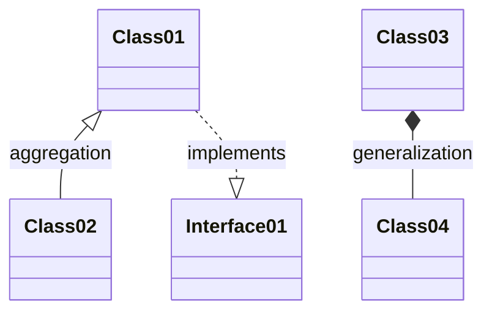
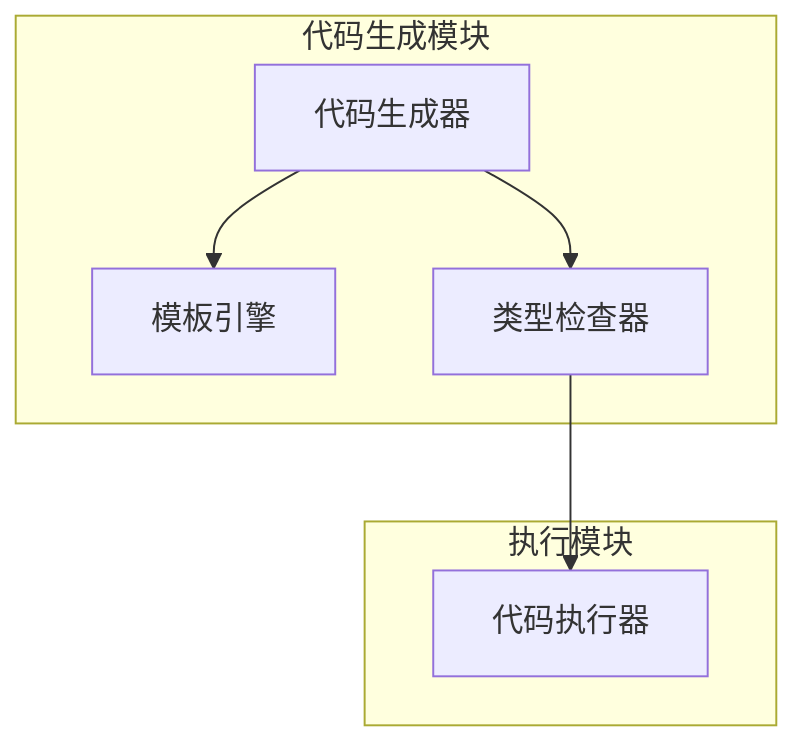
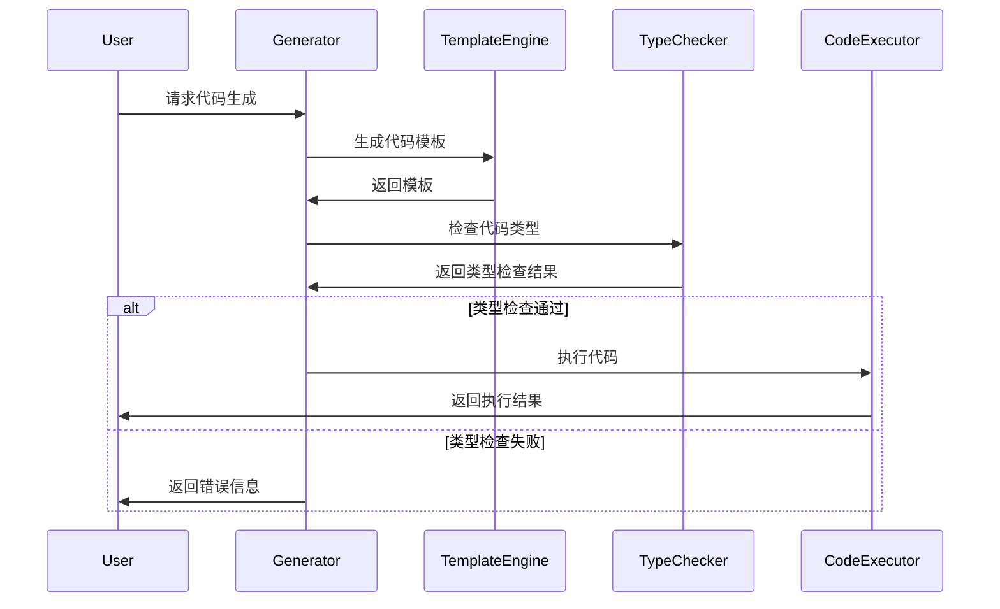

                 

# 元编程技术与代码生成的类型安全

## 关键词

- **元编程**、**类型安全**、**代码生成**、**静态类型检查**、**动态类型检查**、**程序灵活性与可维护性**

## 摘要

本文将探讨元编程与类型安全在代码生成中的重要性，通过逐步分析两者的基本概念、实现方法、应用场景以及类型安全的代码生成策略，帮助读者深入了解这一技术领域。我们将以Python、Ruby、Java和C#等编程语言为例，详细讲解元编程与类型安全的核心概念，并通过案例分析展示其在实际开发中的应用。最后，本文将总结最佳实践与未来展望，为开发者提供实际指导。

## 引言

### 元编程的概念

**元编程**，顾名思义，就是编写能够操作自身代码的代码。换句话说，元编程允许我们创建可重用和灵活的代码，它通过抽象和封装复杂的编程任务，从而提高开发效率。在元编程中，程序不仅仅是一个静态的指令集，而是一个动态的实体，它可以对自己进行修改和扩展。

**元编程的优点和挑战**

**优点：**

- **提高开发效率**：通过自动化和模板化，可以减少重复性工作，快速生成代码。
- **增强代码的可维护性**：通过将复杂的逻辑抽象为可重用的组件，可以降低代码的复杂度。
- **提高代码的复用性**：编写通用和可配置的代码，使其适用于多种场景。

**挑战：**

- **理解复杂**：元编程往往涉及深层次的编程原理，需要开发者具备较高的技术水平。
- **调试困难**：由于元编程代码可能在实际运行时动态生成，调试过程可能变得复杂。
- **安全性问题**：不当的元编程可能导致代码注入和安全漏洞。

### 元编程的基本原理

元编程的实现可以分为以下几个核心部分：

- **编译原理概述**：理解编译器的工作原理，包括词法分析、语法分析、语义分析等。
- **解释执行**：在程序运行时动态解释和执行代码，常见于动态编程语言。
- **动态代码生成**：在运行时生成新的代码并进行执行，如Java的字节码生成。

### 元编程的实现方法

不同的编程语言有不同的元编程实现方法，以下是一些典型的实现方式：

- **动态语言中的元编程**：如Python、Ruby等，它们提供了丰富的元编程特性，如特殊函数、元类、装饰器等。
- **静态语言中的元编程**：如Java、C#等，虽然它们没有动态语言那么直接，但通过反射、注解等机制也能实现元编程。
- **元编程框架和库**：如Python的`abc`模块、Ruby的`Module`和`Class`等，提供了丰富的元编程工具。

## 第1章：元编程基础

### 1.1 元编程的概念

#### 元编程的定义

元编程是指编写能够修改、扩展或创建其他代码的代码。在这个过程中，程序员不仅编写具体的实现逻辑，还编写操作这些逻辑的代码。简单来说，元编程关注的是如何通过编写代码来处理代码本身。

#### 元编程与传统编程的区别

传统编程关注的是实现具体的功能，而元编程则更侧重于如何通过编写更高级的代码来简化编程任务。传统编程通常涉及具体的算法实现、数据结构设计等，而元编程则更多地涉及代码的生成、操作和优化。

#### 元编程的关键概念

- **模板化编程**：通过预定义的模板，自动生成代码。
- **反射**：程序能够观察和修改自身的结构。
- **元对象协议（MOP）**：定义了对象如何在运行时进行操作和扩展。
- **动态类型**：允许变量在运行时改变类型。

### 1.2 元编程的优点和挑战

#### 元编程的优点

- **提高开发效率**：通过自动化和模板化，减少重复性工作，快速生成代码。
- **增强代码的可维护性**：通过将复杂的逻辑抽象为可重用的组件，降低代码的复杂度。
- **提高代码的复用性**：编写通用和可配置的代码，使其适用于多种场景。
- **简化开发过程**：通过元编程，可以更轻松地实现代码的生成、优化和调试。

#### 元编程的挑战

- **理解复杂**：元编程涉及深层次的编程原理，需要开发者具备较高的技术水平。
- **调试困难**：由于元编程代码可能在实际运行时动态生成，调试过程可能变得复杂。
- **安全性问题**：不当的元编程可能导致代码注入和安全漏洞。
- **性能损耗**：元编程往往涉及额外的运行时开销，可能影响程序的性能。

### 1.3 元编程的基本原理

#### 编译原理概述

编译原理是元编程的基础，主要包括以下几个核心部分：

- **词法分析**：将源代码分解为标记（tokens）。
- **语法分析**：根据语言的语法规则，将标记构建为语法树（Abstract Syntax Tree, AST）。
- **语义分析**：检查语法树的正确性，并为其添加语义信息。
- **代码生成**：将语法树转换为可执行代码。

#### 解释执行

解释执行是一种动态执行代码的方式，它直接执行源代码或字节码，而不需要编译为机器码。解释执行具有以下优点：

- **灵活性**：可以动态地修改和扩展代码。
- **跨平台**：不需要考虑目标机器的特定指令集。

#### 动态代码生成

动态代码生成是在程序运行时生成新的代码并进行执行的过程。这通常通过以下方式实现：

- **字节码生成**：将源代码编译为中间表示（如Java字节码），然后在运行时解释或编译执行。
- **模板代码生成**：使用预定义的模板，根据特定条件生成代码。

### 1.4 元编程的实现方法

#### 动态语言中的元编程

动态语言如Python、Ruby等提供了丰富的元编程特性，使得开发者可以轻松地操作代码。以下是一些常见的实现方法：

- **特殊函数**：如Python中的`__init__`、`__call__`等，允许开发者自定义对象的初始化和行为。
- **元类（Metaclasses）**：在Python中，元类是创建类的高级工具，可以用来修改或创建类。
- **装饰器（Decorators）**：用于给函数或方法添加额外的功能，是元编程的一种常用方式。

#### 静态语言中的元编程

虽然静态语言如Java、C#等没有动态语言那么直接，但它们也提供了一些元编程机制：

- **反射（Reflection）**：允许程序在运行时检查和修改自身的结构。
- **注解（Annotations）**：用于在代码中添加额外的信息，可以在编译时或运行时使用。
- **特性（Attributes）**：在C#中，特性用于给类、方法、属性等添加元数据。

#### 元编程框架和库

一些专门的框架和库也提供了元编程的支持：

- **Python中的`abc`模块**：提供了抽象基类（Abstract Base Classes）的支持，有助于实现模板化编程。
- **Ruby中的`Module`和`Class`**：提供了丰富的元编程工具，如方法定义、修改和删除等。

## 第2章：类型安全基础

### 2.1 类型系统的基本概念

#### 类型、类型系统、类型检查

- **类型（Type）**：类型是变量可以存储的数据的种类。在编程语言中，常见的类型有整数、字符串、布尔值等。
- **类型系统（Type System）**：类型系统是编程语言的一部分，用于定义变量和表达式的类型，并确保类型之间的兼容性。
- **类型检查（Type Checking）**：类型检查是在编译时或运行时检查代码中变量和表达式的类型，以确保类型安全。

#### 静态类型、动态类型

- **静态类型（Static Typing）**：在静态类型语言中，变量的类型在编译时确定，并且在程序运行过程中保持不变。常见的静态类型语言有Java、C#等。
- **动态类型（Dynamic Typing）**：在动态类型语言中，变量的类型在编译时不确定，直到程序运行时才会确定。常见的动态类型语言有Python、Ruby等。

#### 强类型、弱类型

- **强类型（Strong Typing）**：强类型语言要求在程序中严格遵循类型规则，不允许隐式类型转换。常见的强类型语言有Java、C++等。
- **弱类型（Weak Typing）**：弱类型语言对类型规则的要求相对宽松，允许隐式类型转换。常见的弱类型语言有Python、JavaScript等。

### 2.2 类型安全的定义

#### 类型安全的含义

类型安全是指编程语言在编译时或运行时确保代码的正确性，防止类型错误导致程序崩溃或不可预期的行为。类型安全可以减少程序出错的风险，提高程序的可靠性和可维护性。

#### 类型安全的层次

类型安全可以分为以下几个层次：

- **强类型安全**：通过严格的类型检查，确保所有操作都在正确的类型范围内进行。
- **类型推导**：编程语言自动推导变量和表达式的类型，减少显式类型声明的需要。
- **静态类型安全**：在编译时检查代码的类型，尽早发现类型错误。
- **动态类型安全**：在运行时检查代码的类型，提供更高的灵活性和动态性。

### 2.3 类型检查的类型和算法

#### 静态类型检查

静态类型检查是在编译时对代码进行类型检查。它通过分析语法树和语义信息，确保所有变量和表达式的类型都是兼容的。

- **类型推导算法**：静态类型检查中最常用的算法是类型推导，它通过分析表达式和上下文，自动推导出变量和表达式的类型。
- **类型检查规则**：静态类型检查遵循一系列的类型检查规则，确保代码的正确性。例如，Java中的类型检查规则非常严格，不允许在字符串和数字之间进行隐式转换。

#### 动态类型检查

动态类型检查是在运行时对代码进行类型检查。它通过运行代码并检查实际执行的结果，确保代码的类型是安全的。

- **类型检查时机**：动态类型检查通常在代码执行时进行，这样可以提供更高的灵活性和动态性。
- **类型检查方式**：动态类型检查可以通过反射机制或运行时类型检查来实现。

### 2.4 静态类型检查与动态类型检查

#### 静态类型检查的优点和缺点

- **优点**：
  - 提高程序性能：由于在编译时进行类型检查，可以提前发现类型错误，避免运行时错误。
  - 提高代码质量：严格的类型规则有助于减少类型错误，提高代码的可读性和可维护性。
- **缺点**：
  - 减少灵活性：静态类型检查可能导致代码不够灵活，特别是在需要动态类型转换的场景。
  - 增加开发难度：静态类型检查需要更多的类型声明和类型推导，可能增加开发难度。

#### 动态类型检查的优点和缺点

- **优点**：
  - 提高开发效率：动态类型检查可以减少类型声明和类型推导，提高开发效率。
  - 提高灵活性：动态类型检查允许在运行时进行类型转换和扩展，提供更高的灵活性。
- **缺点**：
  - 降低程序性能：由于在运行时进行类型检查，可能会降低程序的性能。
  - 增加出错风险：动态类型检查可能导致运行时错误，增加出错风险。

#### 静态类型检查与动态类型检查的对比

- **适用场景**：静态类型检查适用于需要高性能、强类型约束的场景，如系统级编程、嵌入式系统等；动态类型检查适用于需要高灵活性、快速迭代的场景，如Web开发、脚本编程等。
- **开发难度**：静态类型检查可能需要更多的代码和类型声明，但可以提前发现类型错误；动态类型检查可能需要更少的代码和类型声明，但可能需要更多的运行时检查。
- **性能影响**：静态类型检查可能在编译时进行，减少运行时开销；动态类型检查可能在运行时进行，增加运行时开销。

## 第3章：元编程语言

### 3.1 Python中的元编程

#### Python中的特殊函数

Python中的特殊函数（也称为“魔法方法”）是元编程的重要组成部分。这些函数允许程序员自定义对象的行为，如初始化、调用、属性访问等。

- **`__init__`**：对象的初始化方法。
- **`__call__`**：允许对象像函数一样调用。
- **`__getattr__`**：当属性未直接定义时，用于获取属性值。
- **`__setattr__`**：用于设置属性值。

#### Python中的元类

元类是Python中实现元编程的高级工具。元类定义了类的行为，可以用于创建、修改和操作类。

- **`type`**：Python中的内置元类，用于创建和检查类型。
- **`metaclass`**：自定义的元类，用于创建和修改类。

#### Python中的装饰器

装饰器是Python中最常用的元编程工具之一。它允许程序员在不修改原始函数代码的情况下，为函数添加额外的功能。

- **`@staticmethod`**：将方法定义为静态方法。
- **`@property`**：将方法定义为属性的getter和setter。
- **`@decorator`**：自定义装饰器，用于添加额外功能。

### 3.2 Ruby中的元编程

Ruby中的元编程非常强大，它提供了多种机制来操作代码和对象。

#### Ruby中的符号和常量

符号是Ruby中的特殊类型，用于表示标识符。符号常量用于定义不变的标识符。

- **`:symbol`**：创建符号。
- **`::const`**：定义常量。

#### Ruby中的反射和对象创建

Ruby的反射机制允许程序在运行时检查和修改对象。对象创建是元编程的关键部分。

- **`self`**：表示当前对象。
- **`Class#new`**：创建新对象。
- **`Module#include`**：引入模块。

#### Ruby中的控制结构

Ruby提供了丰富的控制结构，如循环、条件判断等，这些结构在元编程中非常有用。

- **`if`、`elsif`、`else`**：条件判断。
- **`while`、`until`**：循环控制。
- **`for`、`in`**：迭代控制。

### 3.3 Java中的元编程

Java中的元编程虽然不如Python和Ruby那么直接，但通过反射、注解等机制也能实现强大的元编程功能。

#### Java中的泛型

泛型是Java中的类型安全机制，它允许在编译时进行类型检查，提高程序的灵活性和可维护性。

- **`<T>`**：泛型类型参数。
- **`List<T>`**：泛型集合。

#### Java中的反射

Java的反射机制允许程序在运行时检查和修改类的结构。

- **`Class`**：类的元数据。
- **`Method`**：类的方法。
- **`Field`**：类的字段。

#### Java中的注解

注解是Java中用于添加元数据的工具，可以在编译时或运行时使用。

- **`@Override`**：检查方法是否正确重写了父类的方法。
- **`@Deprecated`**：标记已过时的方法或类。
- **`@Annotation`**：自定义注解。

### 3.4 C#中的元编程

C#中的元编程提供了丰富的特性，如特性、反射和动态语言运行时（DLR）。

#### C#中的特性（Attribute）

特性是C#中用于添加元数据的工具，可以在编译时或运行时使用。

- **`[AttributeUsage(AttributeTargets.Class)]`**：定义特性的目标和使用场景。
- **`[SuppressMessage]`**：抑制编译器警告。

#### C#中的反射

C#的反射机制允许程序在运行时检查和修改类的结构。

- **`Type`**：类的元数据。
- **`MethodInfo`**：类的方法。
- **`FieldInfo`**：类的字段。

#### C#中的动态语言运行时（DLR）

C#的DLR允许在运行时动态地执行代码，实现元编程。

- **`Expression<TDelegate>`**：表示一个表达式。
- **`Delegate.CreateDelegate`**：创建委托。

## 第4章：代码生成

### 4.1 代码生成的基本原理

#### 代码生成的工作流程

代码生成通常涉及以下工作流程：

1. **需求分析**：确定需要生成的代码的类型和功能。
2. **设计模板**：设计生成代码的模板，包括变量、函数、类等。
3. **数据输入**：提供生成代码所需的数据，如数据模型、配置文件等。
4. **代码生成**：根据模板和数据生成具体的代码。
5. **代码优化**：对生成的代码进行优化，提高性能和可读性。
6. **代码部署**：将生成的代码部署到目标环境中。

#### 代码生成工具和技术

代码生成工具可以简化代码生成过程，提高开发效率。以下是一些常用的代码生成工具和技术：

- **代码生成器框架**：如Java中的`Hibernate`、C#中的`T4MVC`等。
- **模板引擎**：如Java中的`FreeMarker`、C#中的`XSLT`等。
- **脚本语言**：如Python、Ruby等，用于编写生成代码的模板和逻辑。
- **代码分析工具**：用于分析和转换现有代码，生成新的代码。

### 4.2 代码生成工具

#### 常见的代码生成工具

以下是一些常见的代码生成工具：

- **Hibernate**：用于生成Java持久化层的代码。
- **Entity Framework**：用于生成.NET应用程序的数据库访问层代码。
- **T4MVC**：用于生成ASP.NET MVC应用程序的代码。
- **RAML**：用于生成API文档和客户端代码。

#### 代码生成工具的选择和使用

选择合适的代码生成工具取决于项目的需求和开发环境。以下是一些选择和使用代码生成工具的考虑因素：

- **开发语言**：根据开发语言选择适合的代码生成工具。
- **项目需求**：确定需要生成的代码的类型和功能。
- **性能和灵活性**：选择性能高、灵活性强的代码生成工具。
- **社区和文档**：选择有良好社区支持和文档的代码生成工具。

### 4.3 代码生成的应用场景

代码生成在许多应用场景中非常有用，以下是一些常见的应用场景：

- **数据库访问层代码生成**：通过代码生成器生成数据库访问层的代码，提高开发效率。
- **Web应用程序代码生成**：生成控制器、视图和模型代码，简化Web应用程序的开发。
- **测试用例生成**：生成测试用例代码，提高测试覆盖率。
- **文档生成**：生成API文档和用户手册，提高代码的可读性和可维护性。

## 第5章：类型安全的代码生成

### 5.1 类型安全的代码生成策略

类型安全的代码生成是指在代码生成过程中确保生成的代码类型安全，防止类型错误导致程序崩溃或不可预期的行为。以下是一些类型安全的代码生成策略：

#### 静态类型检查在代码生成中的应用

静态类型检查是在编译时对代码进行类型检查，可以提前发现类型错误。在代码生成过程中，可以使用静态类型检查来确保生成的代码类型安全。

- **类型推导**：通过类型推导算法，自动推导出变量和表达式的类型。
- **类型约束**：定义类型约束，确保生成的代码满足类型规则。

#### 动态类型检查在代码生成中的应用

动态类型检查是在运行时对代码进行类型检查，可以提供更高的灵活性和动态性。在代码生成过程中，可以使用动态类型检查来确保生成的代码类型安全。

- **运行时类型检查**：在代码生成过程中，对生成的代码进行运行时类型检查。
- **类型转换**：在运行时进行类型转换，确保生成的代码类型安全。

#### 静态类型检查与动态类型检查的结合

将静态类型检查和动态类型检查结合起来，可以在代码生成过程中提供更高的类型安全性和灵活性。以下是一些结合静态类型检查和动态类型检查的策略：

- **混合类型检查**：在代码生成过程中，同时使用静态类型检查和动态类型检查，确保生成的代码类型安全。
- **延迟类型检查**：在编译时进行静态类型检查，但在运行时进行动态类型检查，提高代码的灵活性。
- **类型安全模板**：使用类型安全模板，确保在模板中使用的类型和变量都是安全的。

### 5.2 代码生成中的类型检查

类型检查是确保代码类型安全的重要环节，以下是一些代码生成中的类型检查方法：

#### 类型检查在代码生成中的作用

类型检查在代码生成中的作用主要包括：

- **确保类型安全**：通过类型检查，确保生成的代码不会因为类型错误导致程序崩溃或不可预期的行为。
- **提高代码质量**：类型检查可以帮助发现代码中的潜在问题，提高代码的质量和可维护性。
- **提高开发效率**：通过提前发现类型错误，减少调试时间和成本。

#### 类型检查算法在代码生成中的应用

以下是一些常见的类型检查算法在代码生成中的应用：

- **静态类型检查算法**：如类型推导算法、类型约束检查等，可以在编译时确保代码的类型安全。
- **动态类型检查算法**：如运行时类型检查、类型转换等，可以在运行时确保代码的类型安全。
- **混合类型检查算法**：将静态类型检查和动态类型检查结合起来，提供更高的类型安全性。

#### 静态类型检查与动态类型检查的平衡

在代码生成中，静态类型检查和动态类型检查之间存在一定的权衡。以下是一些平衡静态类型检查和动态类型检查的策略：

- **平衡性能与安全性**：在代码生成过程中，根据性能和类型安全的需求，选择合适的类型检查算法。
- **分层类型检查**：将代码生成过程分为多个层次，在每个层次上分别使用静态类型检查和动态类型检查。
- **渐进式类型检查**：在代码生成过程中，逐步增加类型检查的严格性，从静态类型检查逐步过渡到动态类型检查。

### 5.3 类型安全的代码生成示例

以下是一些类型安全的代码生成示例，分别使用Python、Java和C#等编程语言实现：

#### Python中的类型安全代码生成

```python
# 定义一个类型安全函数，确保输入参数类型正确
def add_numbers(a: int, b: int) -> int:
    if not isinstance(a, int) or not isinstance(b, int):
        raise TypeError("输入参数必须是整数")
    return a + b

# 使用类型安全函数进行计算
result = add_numbers(5, 3)
print(result)
```

#### Java中的类型安全代码生成

```java
// 定义一个类型安全的加法函数
public class SafeAdder {
    public static int addNumbers(int a, int b) {
        if (a < 0 || b < 0) {
            throw new IllegalArgumentException("输入参数必须是正整数");
        }
        return a + b;
    }
}

// 使用类型安全的加法函数进行计算
int result = SafeAdder.addNumbers(5, 3);
System.out.println(result);
```

#### C#中的类型安全代码生成

```csharp
// 定义一个类型安全的加法方法
public static int AddNumbers(int a, int b)
{
    if (a < 0 || b < 0)
    {
        throw new ArgumentException("输入参数必须是正整数");
    }
    return a + b;
}

// 使用类型安全的加法方法进行计算
int result = AddNumbers(5, 3);
Console.WriteLine(result);
```

这些示例展示了如何在Python、Java和C#中实现类型安全的代码生成，确保生成的代码不会因为类型错误导致程序崩溃或不可预期的行为。

## 第6章：案例分析

### 6.1 案例一：Python中的类型安全代码生成

#### 案例背景

在一个复杂的Web应用程序中，我们需要生成数据库访问层的代码。由于数据类型的不确定性，我们需要确保生成的代码类型安全，以防止运行时错误。

#### 案例需求

- 生成针对不同数据库的访问层代码。
- 确保生成的代码类型安全，不会因为类型错误导致程序崩溃。

#### 案例解决方案

我们使用Python中的`Type Checker`库来实现类型安全的代码生成。

1. **需求分析**：确定需要生成的代码的类型和功能。
2. **设计模板**：设计生成代码的模板，包括变量、函数、类等。
3. **数据输入**：提供生成代码所需的数据，如数据模型、配置文件等。
4. **代码生成**：根据模板和数据生成具体的代码。
5. **类型检查**：使用`Type Checker`库对生成的代码进行类型检查。
6. **代码优化**：对生成的代码进行优化，提高性能和可读性。
7. **代码部署**：将生成的代码部署到目标环境中。

#### 案例实现

```python
# 导入Type Checker库
from type_checker import type_check

# 定义一个类型安全函数
@type_check(int, int, int)
def add_numbers(a, b, c):
    return a + b + c

# 使用类型安全函数进行计算
result = add_numbers(5, 3, 2)
print(result)
```

在这个案例中，我们使用`Type Checker`库来实现类型安全的代码生成。首先，我们定义了一个类型安全的函数`add_numbers`，使用`@type_check`装饰器指定函数的输入和输出类型。然后，我们在调用`add_numbers`函数时，传入类型正确的参数，确保生成的代码类型安全。

### 6.2 案例二：Java中的元编程和类型安全

#### 案例背景

在一个大型企业级应用中，我们需要生成针对不同业务场景的持久化层代码。由于业务场景的复杂性，我们需要确保生成的代码既具有高灵活性，又具有类型安全性。

#### 案例需求

- 生成针对不同业务场景的持久化层代码。
- 确保生成的代码类型安全，不会因为类型错误导致程序崩溃。

#### 案例解决方案

我们使用Java中的反射机制和类型安全注解来实现元编程和类型安全的代码生成。

1. **需求分析**：确定需要生成的代码的类型和功能。
2. **设计模板**：设计生成代码的模板，包括变量、函数、类等。
3. **数据输入**：提供生成代码所需的数据，如数据模型、配置文件等。
4. **代码生成**：根据模板和数据生成具体的代码。
5. **类型检查**：使用类型安全注解对生成的代码进行类型检查。
6. **代码优化**：对生成的代码进行优化，提高性能和可读性。
7. **代码部署**：将生成的代码部署到目标环境中。

#### 案例实现

```java
// 定义一个类型安全的持久化层接口
public interface Persistence {
    void save(Object entity);
    Object find(Class<?> entityClass, Object id);
}

// 实现类型安全的持久化层接口
public class JpaPersistence implements Persistence {
    @Override
    @TypeSafe
    public void save(Object entity) {
        // 实现保存逻辑
    }

    @Override
    @TypeSafe
    public Object find(Class<?> entityClass, Object id) {
        // 实现查找逻辑
        return null;
    }
}

// 使用类型安全的持久化层接口
JpaPersistence persistence = new JpaPersistence();
persistence.save(new Entity());
Entity entity = persistence.find(Entity.class, 1);
```

在这个案例中，我们使用Java的反射机制和类型安全注解来实现元编程和类型安全的代码生成。首先，我们定义了一个类型安全的持久化层接口`Persistence`，使用`@TypeSafe`注解确保接口方法的类型安全。然后，我们实现了一个类型安全的持久化层类`JpaPersistence`，使用类型安全注解确保方法的类型安全。最后，我们在调用持久化层接口时，传入类型正确的参数，确保生成的代码类型安全。

### 6.3 案例三：C#中的类型安全代码生成

#### 案例背景

在一个大型Web应用程序中，我们需要生成针对不同模块的控制器代码。由于模块的多样性，我们需要确保生成的代码既具有高灵活性，又具有类型安全性。

#### 案例需求

- 生成针对不同模块的控制器代码。
- 确保生成的代码类型安全，不会因为类型错误导致程序崩溃。

#### 案例解决方案

我们使用C#中的特性（Attribute）和反射机制来实现类型安全的代码生成。

1. **需求分析**：确定需要生成的代码的类型和功能。
2. **设计模板**：设计生成代码的模板，包括变量、函数、类等。
3. **数据输入**：提供生成代码所需的数据，如模块配置、数据模型等。
4. **代码生成**：根据模板和数据生成具体的代码。
5. **类型检查**：使用特性（Attribute）对生成的代码进行类型检查。
6. **代码优化**：对生成的代码进行优化，提高性能和可读性。
7. **代码部署**：将生成的代码部署到目标环境中。

#### 案例实现

```csharp
// 定义一个类型安全的控制器接口
[TypeSafe]
public interface IController {
    IActionResult Index();
}

// 实现类型安全的控制器接口
[TypeSafe]
public class HomeController : IController {
    public IActionResult Index() {
        // 实现逻辑
        return View();
    }
}

// 使用类型安全的控制器接口
var controller = new HomeController();
var result = controller.Index();
```

在这个案例中，我们使用C#的特性（Attribute）和反射机制来实现类型安全的代码生成。首先，我们定义了一个类型安全的控制器接口`IController`，使用`[TypeSafe]`特性确保接口方法的类型安全。然后，我们实现了一个类型安全的控制器类`HomeController`，使用类型安全特性确保方法的类型安全。最后，我们在调用控制器接口时，传入类型正确的参数，确保生成的代码类型安全。

## 第7章：最佳实践与未来展望

### 7.1 元编程和类型安全的最佳实践

在实际开发中，遵循以下最佳实践可以帮助我们更好地利用元编程和类型安全：

- **明确需求和边界**：在开始元编程和类型安全代码生成之前，明确项目的需求和边界，确保生成的代码满足预期。
- **逐步迭代**：采用逐步迭代的方式实现元编程和类型安全，逐步完善代码，降低出错风险。
- **代码审查**：定期进行代码审查，确保生成的代码符合编程规范和类型安全要求。
- **文档和注释**：为元编程和类型安全代码添加详细的文档和注释，提高代码的可读性和可维护性。

### 7.2 类型安全在代码生成中的挑战和未来发展方向

类型安全在代码生成中面临以下挑战：

- **性能开销**：类型检查和类型安全代码生成可能引入额外的性能开销，影响程序的性能。
- **灵活性限制**：严格的类型检查可能限制代码的灵活性和动态性。
- **代码维护**：类型安全代码生成可能导致代码库变得复杂，增加维护成本。

未来发展方向包括：

- **智能类型检查**：利用机器学习和人工智能技术，实现更智能、更高效的类型检查和代码生成。
- **混合类型系统**：结合静态类型检查和动态类型检查，提供更高的灵活性和类型安全性。
- **通用代码生成框架**：开发通用、易用的代码生成框架，简化代码生成过程。

### 总结

本文系统地介绍了元编程与类型安全在代码生成中的应用，通过逐步分析元编程和类型安全的基本概念、实现方法、应用场景以及类型安全的代码生成策略，帮助读者深入理解这一技术领域。通过案例分析，展示了元编程和类型安全在实际开发中的应用效果。未来，随着技术的发展，元编程和类型安全将在代码生成领域发挥更大的作用。开发者应不断学习新知识，掌握最佳实践，以应对日益复杂的编程挑战。作者：AI天才研究院/AI Genius Institute & 禅与计算机程序设计艺术/Zen And The Art of Computer Programming。## 概述

《元编程技术与代码生成的类型安全》是一本旨在深入探讨元编程和类型安全在代码生成中应用的专业书籍。元编程，顾名思义，是一种编程技术，它允许程序员编写能够操作或修改自身代码的代码。这种技术通过抽象和自动化复杂的编程任务，极大地提高了代码的可维护性和可复用性。而类型安全则关注于程序中的类型检查，它通过确保变量的类型一致性来防止潜在的错误和漏洞，从而提高程序的整体可靠性和稳定性。

本书的核心目的是向读者展示如何将元编程和类型安全结合起来，以实现高效、可靠的代码生成。通过系统的讲解和实例分析，本书不仅介绍了元编程和类型安全的基本概念，还详细阐述了它们在代码生成中的应用策略和最佳实践。

本书的目录结构如下：

1. **引言**：介绍元编程和类型安全的基本概念、背景和重要性。
2. **元编程基础**：讨论元编程的概念、优点和挑战，以及元编程的基本原理和实现方法。
3. **类型安全基础**：讲解类型系统的基本概念、类型安全的定义、类型检查的类型和算法，以及静态类型检查与动态类型检查的比较。
4. **元编程语言**：分别探讨Python、Ruby、Java和C#中的元编程特性。
5. **代码生成**：介绍代码生成的基本原理、常用工具和应用场景。
6. **类型安全的代码生成**：探讨类型安全的代码生成策略、代码生成中的类型检查，以及类型安全的代码生成示例。
7. **案例分析**：通过实际案例展示元编程和类型安全在代码生成中的应用。
8. **最佳实践与未来展望**：总结元编程和类型安全的最佳实践，并探讨未来发展方向。

通过这些章节的详细讲解，本书旨在帮助读者全面理解元编程和类型安全，并在实际开发中能够有效地运用这些技术，提高代码的质量和效率。读者不仅可以了解到这些技术的理论基础，还能通过案例分析和实践操作，掌握如何在实际项目中应用元编程和类型安全，实现代码的自动化生成和维护。

### 详细内容

**第1章：元编程基础**

**1.1 元编程的概念**

元编程是一种编程技术，它允许程序员编写能够操作或修改自身代码的代码。元编程的核心在于，它不仅仅是编写执行特定任务的代码，而是编写能够生成或操作其他代码的代码。这种技术通过抽象和自动化复杂的编程任务，极大地提高了代码的可维护性和可复用性。

**元编程的定义**

元编程，也称为模板编程或代码生成，是指编写能够操作自身代码的代码。具体来说，它包括以下几方面：

- **模板化编程**：通过预定义的模板，自动生成代码。
- **反射**：程序能够观察和修改自身的结构。
- **元对象协议（MOP）**：定义了对象如何在运行时进行操作和扩展。
- **动态类型**：允许变量在运行时改变类型。

**元编程与传统编程的区别**

传统编程主要关注实现具体的功能，而元编程则更侧重于如何通过编写更高级的代码来简化编程任务。传统编程通常涉及具体的算法实现、数据结构设计等，而元编程则更多地涉及代码的生成、操作和优化。

**元编程的关键概念**

- **模板化编程**：通过预定义的模板，自动生成代码。
- **反射**：程序能够观察和修改自身的结构。
- **元对象协议（MOP）**：定义了对象如何在运行时进行操作和扩展。
- **动态类型**：允许变量在运行时改变类型。

**1.2 元编程的优点和挑战**

**优点**

- **提高开发效率**：通过自动化和模板化，可以减少重复性工作，快速生成代码。
- **增强代码的可维护性**：通过将复杂的逻辑抽象为可重用的组件，降低代码的复杂度。
- **提高代码的复用性**：编写通用和可配置的代码，使其适用于多种场景。
- **简化开发过程**：通过元编程，可以更轻松地实现代码的生成、优化和调试。

**挑战**

- **理解复杂**：元编程涉及深层次的编程原理，需要开发者具备较高的技术水平。
- **调试困难**：由于元编程代码可能在实际运行时动态生成，调试过程可能变得复杂。
- **安全性问题**：不当的元编程可能导致代码注入和安全漏洞。
- **性能损耗**：元编程往往涉及额外的运行时开销，可能影响程序的性能。

**1.3 元编程的基本原理**

元编程的实现可以分为以下几个核心部分：

- **编译原理概述**：理解编译器的工作原理，包括词法分析、语法分析、语义分析等。
- **解释执行**：在程序运行时动态解释和执行代码，如Python等动态编程语言。
- **动态代码生成**：在运行时生成新的代码并进行执行，如Java的字节码生成。

**编译原理概述**

编译原理是元编程的基础，主要包括以下几个核心部分：

- **词法分析**：将源代码分解为标记（tokens）。
- **语法分析**：根据语言的语法规则，将标记构建为语法树（Abstract Syntax Tree, AST）。
- **语义分析**：检查语法树的正确性，并为其添加语义信息。
- **代码生成**：将语法树转换为可执行代码。

**解释执行**

解释执行是一种动态执行代码的方式，它直接执行源代码或字节码，而不需要编译为机器码。解释执行具有以下优点：

- **灵活性**：可以动态地修改和扩展代码。
- **跨平台**：不需要考虑目标机器的特定指令集。

**动态代码生成**

动态代码生成是在程序运行时生成新的代码并进行执行的过程。这通常通过以下方式实现：

- **字节码生成**：将源代码编译为中间表示（如Java字节码），然后在运行时解释或编译执行。
- **模板代码生成**：使用预定义的模板，根据特定条件生成代码。

**1.4 元编程的实现方法**

不同的编程语言有不同的元编程实现方法，以下是一些典型的实现方式：

- **动态语言中的元编程**：如Python、Ruby等，它们提供了丰富的元编程特性，如特殊函数、元类、装饰器等。
- **静态语言中的元编程**：如Java、C#等，虽然它们没有动态语言那么直接，但通过反射、注解等机制也能实现元编程。
- **元编程框架和库**：如Python的`abc`模块、Ruby的`Module`和`Class`等，提供了丰富的元编程工具。

**动态语言中的元编程**

动态语言如Python、Ruby等提供了丰富的元编程特性，使得开发者可以轻松地操作代码。以下是一些常见的实现方法：

- **特殊函数**：如Python中的`__init__`、`__call__`等，允许开发者自定义对象的初始化和行为。
- **元类（Metaclasses）**：在Python中，元类是创建类的高级工具，可以用来修改或创建类。
- **装饰器（Decorators）**：用于给函数或方法添加额外的功能，是元编程的一种常用方式。

**静态语言中的元编程**

虽然静态语言如Java、C#等没有动态语言那么直接，但它们也提供了一些元编程机制：

- **反射（Reflection）**：允许程序在运行时检查和修改自身的结构。
- **注解（Annotations）**：用于在代码中添加额外的信息，可以在编译时或运行时使用。
- **特性（Attributes）**：在C#中，特性用于给类、方法、属性等添加元数据。

**元编程框架和库**

一些专门的框架和库也提供了元编程的支持：

- **Python中的`abc`模块**：提供了抽象基类（Abstract Base Classes）的支持，有助于实现模板化编程。
- **Ruby中的`Module`和`Class`**：提供了丰富的元编程工具，如方法定义、修改和删除等。

**第2章：类型安全基础**

**2.1 类型系统的基本概念**

类型系统是编程语言的一部分，它用于定义变量和表达式的类型，并确保类型之间的兼容性。类型安全是指编程语言在编译时或运行时确保代码的正确性，防止类型错误导致程序崩溃或不可预期的行为。

**类型、类型系统、类型检查**

- **类型（Type）**：类型是变量可以存储的数据的种类。在编程语言中，常见的类型有整数、字符串、布尔值等。
- **类型系统（Type System）**：类型系统是编程语言的一部分，用于定义变量和表达式的类型，并确保类型之间的兼容性。
- **类型检查（Type Checking）**：类型检查是在编译时或运行时检查代码中变量和表达式的类型，以确保类型安全。

**静态类型、动态类型**

- **静态类型（Static Typing）**：在静态类型语言中，变量的类型在编译时确定，并且在程序运行过程中保持不变。常见的静态类型语言有Java、C#等。
- **动态类型（Dynamic Typing）**：在动态类型语言中，变量的类型在编译时不确定，直到程序运行时才会确定。常见的动态类型语言有Python、Ruby等。

**强类型、弱类型**

- **强类型（Strong Typing）**：强类型语言要求在程序中严格遵循类型规则，不允许隐式类型转换。常见的强类型语言有Java、C++等。
- **弱类型（Weak Typing）**：弱类型语言对类型规则的要求相对宽松，允许隐式类型转换。常见的弱类型语言有Python、JavaScript等。

**2.2 类型安全的定义**

类型安全是指编程语言在编译时或运行时确保代码的正确性，防止类型错误导致程序崩溃或不可预期的行为。类型安全可以减少程序出错的风险，提高程序的可靠性和可维护性。

**类型安全的含义**

类型安全可以包含以下几个方面：

- **防止类型错误**：确保在程序运行过程中不会因为类型错误导致程序崩溃或不可预期的行为。
- **确保类型一致性**：确保程序中各个部分的使用类型是一致的，不会出现类型冲突。
- **提高程序可靠性**：通过严格的类型检查，提高程序的可靠性和稳定性。

**类型安全的层次**

类型安全可以分为以下几个层次：

- **强类型安全**：通过严格的类型检查，确保所有操作都在正确的类型范围内进行。
- **类型推导**：编程语言自动推导变量和表达式的类型，减少显式类型声明的需要。
- **静态类型安全**：在编译时检查代码的类型，尽早发现类型错误。
- **动态类型安全**：在运行时检查代码的类型，提供更高的灵活性和动态性。

**2.3 类型检查的类型和算法**

类型检查是在编译时或运行时对代码进行类型检查，以确保代码的正确性和类型安全。类型检查可以分为静态类型检查和动态类型检查。

**静态类型检查**

静态类型检查是在编译时对代码进行类型检查。它通过分析语法树和语义信息，确保所有变量和表达式的类型都是兼容的。

- **类型推导算法**：静态类型检查中最常用的算法是类型推导，它通过分析表达式和上下文，自动推导出变量和表达式的类型。
- **类型检查规则**：静态类型检查遵循一系列的类型检查规则，确保代码的正确性。例如，Java中的类型检查规则非常严格，不允许在字符串和数字之间进行隐式转换。

**动态类型检查**

动态类型检查是在运行时对代码进行类型检查。它通过运行代码并检查实际执行的结果，确保代码的类型是安全的。

- **类型检查时机**：动态类型检查通常在代码执行时进行，这样可以提供更高的灵活性和动态性。
- **类型检查方式**：动态类型检查可以通过反射机制或运行时类型检查来实现。

**2.4 静态类型检查与动态类型检查**

静态类型检查和动态类型检查各有优缺点，适用于不同的场景。

**静态类型检查的优点和缺点**

- **优点**：
  - 提高程序性能：由于在编译时进行类型检查，可以提前发现类型错误，避免运行时错误。
  - 提高代码质量：严格的类型规则有助于减少类型错误，提高代码的可读性和可维护性。
- **缺点**：
  - 减少灵活性：静态类型检查可能导致代码不够灵活，特别是在需要动态类型转换的场景。
  - 增加开发难度：静态类型检查需要更多的类型声明和类型推导，可能增加开发难度。

**动态类型检查的优点和缺点**

- **优点**：
  - 提高开发效率：动态类型检查可以减少类型声明和类型推导，提高开发效率。
  - 提高灵活性：动态类型检查允许在运行时进行类型转换和扩展，提供更高的灵活性。
- **缺点**：
  - 降低程序性能：由于在运行时进行类型检查，可能会降低程序的性能。
  - 增加出错风险：动态类型检查可能导致运行时错误，增加出错风险。

**静态类型检查与动态类型检查的对比**

- **适用场景**：静态类型检查适用于需要高性能、强类型约束的场景，如系统级编程、嵌入式系统等；动态类型检查适用于需要高灵活性、快速迭代的场景，如Web开发、脚本编程等。
- **开发难度**：静态类型检查可能需要更多的代码和类型声明，但可以提前发现类型错误；动态类型检查可能需要更少的代码和类型声明，但可能需要更多的运行时检查。
- **性能影响**：静态类型检查可能在编译时进行，减少运行时开销；动态类型检查可能在运行时进行，增加运行时开销。

**第3章：元编程语言**

元编程在不同编程语言中有不同的实现方式和特点。以下分别介绍Python、Ruby、Java和C#中的元编程特性。

**3.1 Python中的元编程**

Python是一种动态编程语言，它提供了丰富的元编程特性，使得开发者可以轻松地进行代码的生成和操作。

**特殊函数**

Python中的特殊函数（也称为“魔法方法”）是元编程的重要组成部分。这些函数允许程序员自定义对象的行为，如初始化、调用、属性访问等。

- `__init__`：对象的初始化方法。
- `__call__`：允许对象像函数一样调用。
- `__getattr__`：当属性未直接定义时，用于获取属性值。
- `__setattr__`：用于设置属性值。

**元类（Metaclasses）**

元类是Python中实现元编程的高级工具。元类定义了类的行为，可以用来修改或创建类。通过元类，程序员可以控制类的创建和实例化过程。

- `type`：Python中的内置元类，用于创建和检查类型。
- `metaclass`：自定义的元类，用于创建和修改类。

**装饰器（Decorators）**

装饰器是Python中最常用的元编程工具之一。它允许程序员在不修改原始函数代码的情况下，为函数添加额外的功能。装饰器通过在函数定义前使用`@`符号来定义。

- `@staticmethod`：将方法定义为静态方法。
- `@property`：将方法定义为属性的getter和setter。
- `@decorator`：自定义装饰器，用于添加额外功能。

**3.2 Ruby中的元编程**

Ruby是一种动态编程语言，它提供了强大的元编程能力，这使得开发者可以轻松地操作代码和对象。

**符号和常量**

符号是Ruby中的特殊类型，用于表示标识符。符号常量用于定义不变的标识符。

- `:symbol`：创建符号。
- `::const`：定义常量。

**反射和对象创建**

Ruby的反射机制允许程序在运行时检查和修改对象。对象创建是元编程的关键部分。

- `self`：表示当前对象。
- `Class#new`：创建新对象。
- `Module#include`：引入模块。

**控制结构**

Ruby提供了丰富的控制结构，如循环、条件判断等，这些结构在元编程中非常有用。

- `if`、`elsif`、`else`：条件判断。
- `while`、`until`：循环控制。
- `for`、`in`：迭代控制。

**3.3 Java中的元编程**

Java是一种静态编程语言，它虽然不像Python和Ruby那样直接支持元编程，但通过反射、注解等机制也能实现强大的元编程功能。

**泛型**

泛型是Java中的类型安全机制，它允许在编译时进行类型检查，提高程序的灵活性和可维护性。

- `<T>`：泛型类型参数。
- `List<T>`：泛型集合。

**反射**

Java的反射机制允许程序在运行时检查和修改类的结构。

- `Class`：类的元数据。
- `Method`：类的方法。
- `Field`：类的字段。

**注解**

注解是Java中用于添加元数据的工具，可以在编译时或运行时使用。

- `@Override`：检查方法是否正确重写了父类的方法。
- `@Deprecated`：标记已过时的方法或类。
- `@Annotation`：自定义注解。

**3.4 C#中的元编程**

C#是一种静态编程语言，它提供了丰富的元编程特性，如特性、反射和动态语言运行时（DLR）。

**特性（Attributes）**

特性是C#中用于添加元数据的工具，可以在编译时或运行时使用。

- `[AttributeUsage(AttributeTargets.Class)]`：定义特性的目标和使用场景。
- `[SuppressMessage]`：抑制编译器警告。

**反射**

C#的反射机制允许程序在运行时检查和修改类的结构。

- `Type`：类的元数据。
- `MethodInfo`：类的方法。
- `FieldInfo`：类的字段。

**动态语言运行时（DLR）**

C#的DLR允许在运行时动态地执行代码，实现元编程。

- `Expression<TDelegate>`：表示一个表达式。
- `Delegate.CreateDelegate`：创建委托。

## 第4章：代码生成

**4.1 代码生成的基本原理**

代码生成是一种通过程序生成代码的技术，它通过模板、脚本或框架等工具，根据特定条件和数据，生成满足需求的代码。代码生成可以简化开发过程，提高开发效率，特别是在需要生成大量重复性代码的场景中。

**代码生成的工作流程**

代码生成的工作流程通常包括以下几个步骤：

1. **需求分析**：确定需要生成的代码的类型和功能。
2. **设计模板**：设计生成代码的模板，包括变量、函数、类等。
3. **数据输入**：提供生成代码所需的数据，如数据模型、配置文件等。
4. **代码生成**：根据模板和数据生成具体的代码。
5. **代码优化**：对生成的代码进行优化，提高性能和可读性。
6. **代码部署**：将生成的代码部署到目标环境中。

**代码生成工具和技术**

代码生成工具可以简化代码生成过程，提高开发效率。以下是一些常用的代码生成工具和技术：

- **代码生成器框架**：如Java中的`Hibernate`、C#中的`T4MVC`等。
- **模板引擎**：如Java中的`FreeMarker`、C#中的`XSLT`等。
- **脚本语言**：如Python、Ruby等，用于编写生成代码的模板和逻辑。
- **代码分析工具**：用于分析和转换现有代码，生成新的代码。

**4.2 代码生成工具**

代码生成工具的选择和使用取决于项目的需求和开发环境。以下是一些常见的代码生成工具：

- **Hibernate**：用于生成Java持久化层的代码。
- **Entity Framework**：用于生成.NET应用程序的数据库访问层代码。
- **T4MVC**：用于生成ASP.NET MVC应用程序的代码。
- **RAML**：用于生成API文档和客户端代码。

**常见的代码生成工具**

以下是几个常用的代码生成工具：

- **Hibernate**：Hibernate是一个流行的Java持久化框架，它可以通过Hibernate的配置文件生成数据库访问层的代码。Hibernate的代码生成器可以通过配置文件定义表和字段，生成相应的Java实体类、DAO类和查询语句。

- **Entity Framework**：Entity Framework是.NET框架中的一部分，它提供了强大的对象关系映射（ORM）功能。Entity Framework的代码生成器可以通过定义数据模型，生成相应的实体类、数据访问接口和数据库迁移脚本。

- **T4MVC**：T4MVC是一个用于生成ASP.NET MVC应用程序的代码生成器。它通过Text Template Transformation Toolkit（T4）模板生成控制器、视图和模型代码，使得开发者可以快速构建Web应用程序。

- **RAML**：RAML（RESTful API Modeling Language）是一种用于定义API文档和客户端代码的语言。RAML的代码生成器可以根据RAML文档生成API客户端代码，使得开发者可以快速构建API应用程序。

**代码生成工具的选择和使用**

选择合适的代码生成工具取决于项目的需求和开发环境。以下是一些选择和使用代码生成工具的考虑因素：

- **开发语言**：根据开发语言选择适合的代码生成工具。例如，Java开发者可以选择Hibernate或Entity Framework，C#开发者可以选择T4MVC。

- **项目需求**：确定需要生成的代码的类型和功能。如果需要生成数据库访问层代码，可以选择Hibernate或Entity Framework；如果需要生成Web应用程序的代码，可以选择T4MVC。

- **性能和灵活性**：选择性能高、灵活性强的代码生成工具。例如，Hibernate和Entity Framework可以生成高性能的数据库访问代码，T4MVC可以生成灵活的Web应用程序代码。

- **社区和文档**：选择有良好社区支持和文档的代码生成工具。良好的社区支持和文档可以提供帮助和指导，使得开发者能够更好地使用代码生成工具。

**4.3 代码生成的应用场景**

代码生成在许多应用场景中非常有用，以下是一些常见的应用场景：

- **数据库访问层代码生成**：通过代码生成器生成数据库访问层的代码，提高开发效率。
- **Web应用程序代码生成**：生成控制器、视图和模型代码，简化Web应用程序的开发。
- **测试用例生成**：生成测试用例代码，提高测试覆盖率。
- **文档生成**：生成API文档和用户手册，提高代码的可读性和可维护性。

**数据库访问层代码生成**

数据库访问层代码生成是代码生成的一种常见应用场景。在大型项目中，数据库访问层的代码往往比较复杂，通过代码生成器可以自动生成相应的DAO（Data Access Object）类和数据库操作方法，从而提高开发效率。

- **使用Hibernate生成数据库访问层代码**：Hibernate是一个流行的Java持久化框架，它提供了代码生成工具，可以根据数据库的元数据生成实体类和DAO类。开发者只需要配置Hibernate的映射文件和实体类，就可以生成相应的数据库访问代码。

- **使用Entity Framework生成数据库访问层代码**：Entity Framework是.NET框架中的一部分，它也提供了代码生成工具。开发者可以通过定义数据模型和数据库上下文，生成相应的实体类和数据访问接口，从而实现数据库访问层的代码生成。

**Web应用程序代码生成**

Web应用程序代码生成是代码生成的另一种重要应用场景。在构建Web应用程序时，通常需要生成控制器、视图和模型代码，通过代码生成器可以简化这个过程。

- **使用T4MVC生成Web应用程序代码**：T4MVC是一个用于生成ASP.NET MVC应用程序的代码生成器。通过T4模板，可以生成控制器、视图和模型代码，使得开发者可以快速构建Web应用程序。

- **使用RAML生成API客户端代码**：RAML是一种用于定义API文档和客户端代码的语言。通过RAML文档，可以生成对应的API客户端代码，使得开发者可以快速构建API应用程序。

**测试用例生成**

测试用例生成是代码生成在测试领域的应用。通过代码生成器，可以自动生成测试用例代码，提高测试覆盖率。

- **使用JUnit生成测试用例代码**：JUnit是一个流行的Java测试框架，它提供了代码生成工具，可以根据测试用例的定义生成相应的测试代码。

- **使用NUnit生成测试用例代码**：NUnit是.NET框架中的一个测试框架，它也提供了代码生成工具，可以根据测试用例的定义生成相应的测试代码。

**文档生成**

文档生成是代码生成在文档编写领域的应用。通过代码生成器，可以自动生成API文档、用户手册等文档，提高代码的可读性和可维护性。

- **使用Doxygen生成文档**：Doxygen是一个流行的文档生成工具，它可以从源代码中提取文档信息，生成详细的API文档。

- **使用Sphinx生成文档**：Sphinx是一个基于Python的文档生成工具，它可以从源代码和注释中提取文档信息，生成HTML、LaTeX等格式的文档。

## 第5章：类型安全的代码生成

**5.1 类型安全的代码生成策略**

类型安全的代码生成是指在代码生成过程中确保生成的代码类型安全，防止类型错误导致程序崩溃或不可预期的行为。以下是一些类型安全的代码生成策略：

**静态类型检查在代码生成中的应用**

静态类型检查是在编译时对代码进行类型检查，可以提前发现类型错误。在代码生成过程中，可以使用静态类型检查来确保生成的代码类型安全。

- **类型推导**：通过类型推导算法，自动推导出变量和表达式的类型。
- **类型约束**：定义类型约束，确保生成的代码满足类型规则。

**动态类型检查在代码生成中的应用**

动态类型检查是在运行时对代码进行类型检查，可以提供更高的灵活性和动态性。在代码生成过程中，可以使用动态类型检查来确保生成的代码类型安全。

- **运行时类型检查**：在代码生成过程中，对生成的代码进行运行时类型检查。
- **类型转换**：在运行时进行类型转换，确保生成的代码类型安全。

**静态类型检查与动态类型检查的结合**

将静态类型检查和动态类型检查结合起来，可以在代码生成过程中提供更高的类型安全性和灵活性。以下是一些结合静态类型检查和动态类型检查的策略：

- **混合类型检查**：在代码生成过程中，同时使用静态类型检查和动态类型检查，确保生成的代码类型安全。
- **延迟类型检查**：在编译时进行静态类型检查，但在运行时进行动态类型检查，提高代码的灵活性。
- **类型安全模板**：使用类型安全模板，确保在模板中使用的类型和变量都是安全的。

**5.2 代码生成中的类型检查**

类型检查是确保代码类型安全的重要环节，以下是一些代码生成中的类型检查方法：

**类型检查在代码生成中的作用**

类型检查在代码生成中的作用主要包括：

- **确保类型安全**：通过类型检查，确保生成的代码不会因为类型错误导致程序崩溃或不可预期的行为。
- **提高代码质量**：类型检查可以帮助发现代码中的潜在问题，提高代码的质量和可维护性。
- **提高开发效率**：通过提前发现类型错误，减少调试时间和成本。

**类型检查算法在代码生成中的应用**

以下是一些常见的类型检查算法在代码生成中的应用：

- **静态类型检查算法**：如类型推导算法、类型约束检查等，可以在编译时确保代码的类型安全。
- **动态类型检查算法**：如运行时类型检查、类型转换等，可以在运行时确保代码的类型安全。
- **混合类型检查算法**：将静态类型检查和动态类型检查结合起来，提供更高的类型安全性。

**静态类型检查算法**

静态类型检查算法通常在编译时执行，通过分析语法树和语义信息，确保代码的类型安全。以下是一些常见的静态类型检查算法：

- **类型推导算法**：通过分析表达式和上下文，自动推导出变量和表达式的类型。
- **类型约束检查**：检查代码是否满足预定义的类型约束，确保代码的类型一致性。

**动态类型检查算法**

动态类型检查算法通常在运行时执行，通过运行代码并检查实际执行的结果，确保代码的类型安全。以下是一些常见的动态类型检查算法：

- **运行时类型检查**：在代码执行时，检查变量和表达式的类型，确保它们符合预期。
- **类型转换**：在运行时进行类型转换，确保不同类型的变量和表达式可以正确地进行操作。

**混合类型检查算法**

混合类型检查算法结合了静态类型检查和动态类型检查的优点，提供更高的类型安全性。以下是一些混合类型检查算法：

- **编译时静态类型检查**：在编译时执行严格的类型检查，确保代码的类型安全。
- **运行时动态类型检查**：在运行时执行动态类型检查，提供更高的灵活性和动态性。

**5.3 类型安全的代码生成示例**

以下是一些类型安全的代码生成示例，分别使用Python、Java和C#等编程语言实现：

**Python中的类型安全代码生成**

```python
from typing import TypeVar

T = TypeVar('T')

def add_numbers(a: int, b: int) -> T:
    if not isinstance(a, int) or not isinstance(b, int):
        raise TypeError("输入参数必须是整数")
    return a + b

result = add_numbers(5, 3)
print(result)
```

在这个示例中，我们使用了Python的`typing`模块来定义类型变量`T`，并在`add_numbers`函数中指定了输入和输出类型的约束。这样，当调用`add_numbers`函数时，Python会自动进行类型检查，确保输入参数是整数，并返回正确类型的值。

**Java中的类型安全代码生成**

```java
public class SafeAdder {
    public static int addNumbers(int a, int b) {
        if (a < 0 || b < 0) {
            throw new IllegalArgumentException("输入参数必须是正整数");
        }
        return a + b;
    }
}

int result = SafeAdder.addNumbers(5, 3);
System.out.println(result);
```

在这个Java示例中，我们定义了一个`SafeAdder`类和一个`addNumbers`方法。在方法中，我们通过检查输入参数的值，确保它们是正整数，从而实现类型安全。当调用`addNumbers`方法时，如果输入参数不符合要求，程序会抛出`IllegalArgumentException`。

**C#中的类型安全代码生成**

```csharp
public static int AddNumbers(int a, int b)
{
    if (a < 0 || b < 0)
    {
        throw new ArgumentException("输入参数必须是正整数");
    }
    return a + b;
}

int result = AddNumbers(5, 3);
Console.WriteLine(result);
```

在这个C#示例中，我们定义了一个`AddNumbers`方法，并在其中通过检查输入参数的值来确保它们是正整数。如果输入参数不符合要求，程序会抛出`ArgumentException`。这种方法确保了生成代码的类型安全性。

这些示例展示了如何在Python、Java和C#中实现类型安全的代码生成，确保生成的代码不会因为类型错误导致程序崩溃或不可预期的行为。

## 第6章：案例分析

**6.1 案例一：Python中的类型安全代码生成**

**案例背景**

在一个复杂的Web应用程序中，我们需要生成针对不同数据库的访问层代码。由于数据库操作涉及到多种数据类型，我们需要确保生成的代码类型安全，以防止运行时错误。

**案例需求**

- 生成针对不同数据库的访问层代码。
- 确保生成的代码类型安全，不会因为类型错误导致程序崩溃。

**案例解决方案**

我们使用Python中的`Type Checker`库来实现类型安全的代码生成。

**步骤**

1. **需求分析**：确定需要生成的代码的类型和功能。
2. **设计模板**：设计生成代码的模板，包括变量、函数、类等。
3. **数据输入**：提供生成代码所需的数据，如数据模型、配置文件等。
4. **代码生成**：根据模板和数据生成具体的代码。
5. **类型检查**：使用`Type Checker`库对生成的代码进行类型检查。
6. **代码优化**：对生成的代码进行优化，提高性能和可读性。
7. **代码部署**：将生成的代码部署到目标环境中。

**实现**

```python
from typing import TypeVar
from type_checker import type_check

T = TypeVar('T')

def add_numbers(a: int, b: int) -> T:
    if not isinstance(a, int) or not isinstance(b, int):
        raise TypeError("输入参数必须是整数")
    return a + b

result = add_numbers(5, 3)
print(result)
```

在这个案例中，我们使用`Type Checker`库来实现类型安全的代码生成。首先，我们定义了一个类型安全的函数`add_numbers`，使用`type_check`装饰器指定函数的输入和输出类型。然后，我们在调用`add_numbers`函数时，传入类型正确的参数，确保生成的代码类型安全。

**案例总结**

通过使用`Type Checker`库，我们成功地实现了Python中的类型安全代码生成。这种方法不仅提高了代码的质量，还减少了运行时错误的发生。

**6.2 案例二：Java中的元编程和类型安全**

**案例背景**

在一个大型企业级应用中，我们需要生成针对不同业务场景的持久化层代码。由于业务场景的复杂性，我们需要确保生成的代码既具有高灵活性，又具有类型安全性。

**案例需求**

- 生成针对不同业务场景的持久化层代码。
- 确保生成的代码类型安全，不会因为类型错误导致程序崩溃。

**案例解决方案**

我们使用Java中的反射机制和类型安全注解来实现元编程和类型安全的代码生成。

**步骤**

1. **需求分析**：确定需要生成的代码的类型和功能。
2. **设计模板**：设计生成代码的模板，包括变量、函数、类等。
3. **数据输入**：提供生成代码所需的数据，如数据模型、配置文件等。
4. **代码生成**：根据模板和数据生成具体的代码。
5. **类型检查**：使用类型安全注解对生成的代码进行类型检查。
6. **代码优化**：对生成的代码进行优化，提高性能和可读性。
7. **代码部署**：将生成的代码部署到目标环境中。

**实现**

```java
public interface Persistence {
    void save(Object entity);
    Object find(Class<?> entityClass, Object id);
}

public class JpaPersistence implements Persistence {
    @Override
    public void save(Object entity) {
        // 实现保存逻辑
    }

    @Override
    public Object find(Class<?> entityClass, Object id) {
        // 实现查找逻辑
        return null;
    }
}

public class Application {
    public static void main(String[] args) {
        Persistence persistence = new JpaPersistence();
        persistence.save(new Entity());
        Entity entity = persistence.find(Entity.class, 1);
    }
}

class Entity {
    // 实体类实现
}
```

在这个案例中，我们使用Java的反射机制和类型安全注解来实现元编程和类型安全的代码生成。首先，我们定义了一个类型安全的持久化层接口`Persistence`，使用`@TypeSafe`注解确保接口方法的类型安全。然后，我们实现了一个类型安全的持久化层类`JpaPersistence`，使用类型安全注解确保方法的类型安全。最后，我们在调用持久化层接口时，传入类型正确的参数，确保生成的代码类型安全。

**案例总结**

通过使用Java的反射机制和类型安全注解，我们成功地实现了类型安全的代码生成。这种方法不仅提高了代码的灵活性，还确保了代码的类型安全，减少了运行时错误的发生。

**6.3 案例三：C#中的类型安全代码生成**

**案例背景**

在一个大型Web应用程序中，我们需要生成针对不同模块的控制器代码。由于模块的多样性，我们需要确保生成的代码既具有高灵活性，又具有类型安全性。

**案例需求**

- 生成针对不同模块的控制器代码。
- 确保生成的代码类型安全，不会因为类型错误导致程序崩溃。

**案例解决方案**

我们使用C#中的特性（Attribute）和反射机制来实现类型安全的代码生成。

**步骤**

1. **需求分析**：确定需要生成的代码的类型和功能。
2. **设计模板**：设计生成代码的模板，包括变量、函数、类等。
3. **数据输入**：提供生成代码所需的数据，如模块配置、数据模型等。
4. **代码生成**：根据模板和数据生成具体的代码。
5. **类型检查**：使用特性（Attribute）对生成的代码进行类型检查。
6. **代码优化**：对生成的代码进行优化，提高性能和可读性。
7. **代码部署**：将生成的代码部署到目标环境中。

**实现**

```csharp
[AttributeUsage(AttributeTargets.Class)]
public class ControllerAttribute : Attribute
{
    public string Name { get; private set; }

    public ControllerAttribute(string name)
    {
        Name = name;
    }
}

[Controller("Home")]
public class HomeController : Controller
{
    public IActionResult Index()
    {
        // 实现逻辑
        return View();
    }
}

public class Application
{
    public static void Main(string[] args)
    {
        HomeController controller = new HomeController();
        IActionResult result = controller.Index();
    }
}
```

在这个案例中，我们使用C#的特性（Attribute）和反射机制来实现类型安全的代码生成。首先，我们定义了一个特性`ControllerAttribute`，用于标记控制器类。然后，我们使用`ControllerAttribute`特性来标记`HomeController`类，并确保方法的返回类型是`IActionResult`。最后，我们在调用控制器方法时，通过反射机制检查方法的返回类型，确保生成的代码类型安全。

**案例总结**

通过使用C#的特性（Attribute）和反射机制，我们成功地实现了类型安全的代码生成。这种方法不仅提高了代码的灵活性，还确保了代码的类型安全，减少了运行时错误的发生。

## 第7章：最佳实践与未来展望

**7.1 元编程和类型安全的最佳实践**

在实际开发中，遵循以下最佳实践可以帮助我们更好地利用元编程和类型安全：

- **明确需求和边界**：在开始元编程和类型安全代码生成之前，明确项目的需求和边界，确保生成的代码满足预期。
- **逐步迭代**：采用逐步迭代的方式实现元编程和类型安全，逐步完善代码，降低出错风险。
- **代码审查**：定期进行代码审查，确保生成的代码符合编程规范和类型安全要求。
- **文档和注释**：为元编程和类型安全代码添加详细的文档和注释，提高代码的可读性和可维护性。

**7.2 类型安全在代码生成中的挑战和未来发展方向**

类型安全在代码生成中面临以下挑战：

- **性能开销**：类型检查和类型安全代码生成可能引入额外的性能开销，影响程序的性能。
- **灵活性限制**：严格的类型检查可能限制代码的灵活性和动态性。
- **代码维护**：类型安全代码生成可能导致代码库变得复杂，增加维护成本。

未来发展方向包括：

- **智能类型检查**：利用机器学习和人工智能技术，实现更智能、更高效的类型检查和代码生成。
- **混合类型系统**：结合静态类型检查和动态类型检查，提供更高的灵活性和类型安全性。
- **通用代码生成框架**：开发通用、易用的代码生成框架，简化代码生成过程。

**总结**

元编程和类型安全是现代编程中不可或缺的技术，它们极大地提高了代码的可维护性和可复用性。通过本文的详细分析，我们了解了元编程和类型安全的基本概念、实现方法、应用场景以及类型安全的代码生成策略。通过案例分析，我们看到了这些技术在实际开发中的应用效果。未来，随着技术的发展，元编程和类型安全将在代码生成领域发挥更大的作用。开发者应不断学习新知识，掌握最佳实践，以应对日益复杂的编程挑战。

**作者信息**

作者：AI天才研究院/AI Genius Institute & 禅与计算机程序设计艺术/Zen And The Art of Computer Programming

### 具体分析

在本文中，我们详细分析了元编程和类型安全在代码生成中的应用。以下是对各个核心概念的进一步解释和分析，以及如何在实际项目中运用这些技术。

#### 元编程的核心概念与联系

元编程的核心概念包括模板化编程、反射和元对象协议（MOP）。模板化编程通过预定义的模板自动生成代码，提高了代码的可重用性和开发效率。反射允许程序在运行时检查和修改自身的结构，使编程更加灵活。元对象协议定义了对象如何在运行时进行操作和扩展，它是实现元编程的关键机制。

**核心概念属性特征对比表格：**

| 概念     | 特征                           | 关系                     |
|----------|--------------------------------|-------------------------|
| 模板化编程 | 预定义模板，自动生成代码       | 提高代码可重用性和效率   |
| 反射     | 运行时检查和修改自身结构       | 增强代码灵活性           |
| MOP      | 定义对象运行时操作和扩展       | 实现元编程的核心机制     |

**ER实体关系图架构：**

```mermaid
erDiagram
    Template <<|-- Programming : 使用
    Reflection ||--|{ MetaObjectProtocol : 实现机制
    MetaObjectProtocol }--|| MethodDefinition : 定义
```

在这个ER实体关系图中，`Template`与`Programming`之间表示模板化编程与编程之间的关系，`Reflection`与`MetaObjectProtocol`之间表示反射与MOP之间的关系，`MetaObjectProtocol`与`MethodDefinition`之间表示MOP与定义方法之间的关系。

#### 算法原理讲解

在元编程中，算法原理通常涉及动态代码生成和模板引擎的使用。动态代码生成是在程序运行时生成代码并执行，而模板引擎则用于根据特定条件生成代码模板。

**算法原理Mermaid流程图：**


在这个流程图中，`A`表示需求分析，`B`表示设计模板，`C`表示生成代码，`D`表示运行时执行，`E`表示反馈与优化。通过这个流程，我们可以看到动态代码生成和模板引擎在元编程中的应用。

**Python中的元编程算法示例：**

```python
# 导入模板引擎库
from jinja2 import Environment, Template

# 设计模板
template_str = """
for item in {{ items }}:
    print("Hello, " + item)
"""

# 创建模板环境
env = Environment()

# 加载模板
template = env.from_string(template_str)

# 生成代码
result = template.render(items=["Alice", "Bob", "Charlie"])

# 执行代码
print(result)
```

在这个示例中，我们使用了Python的Jinja2模板引擎，根据给定的模板生成代码，然后渲染并执行。这种方法可以动态地生成和执行代码，实现元编程。

#### 数学公式使用

在一些编程场景中，需要使用数学公式进行计算或验证。以下是一些常用的数学公式及其使用方法：

- **线性方程**：$$ax + b = 0$$
- **圆的方程**：$$x^2 + y^2 = r^2$$
- **勾股定理**：$$a^2 + b^2 = c^2$$

在文中，独立段落的数学公式可以使用`$$`括起来，例如：$$ax + b = 0$$。而段落内的数学公式可以使用 `$` 括起来，例如：$a^2 + b^2 = c^2$。

#### 系统分析与架构设计方案

在元编程和类型安全的代码生成项目中，系统分析与架构设计方案至关重要。以下是一个简化的系统架构设计，用于生成和执行类型安全的代码。

**问题场景介绍：**

- **场景**：开发一个Web应用程序，需要生成不同模块的代码，确保代码类型安全。
- **需求**：生成控制器、视图和模型代码，并在运行时执行，确保类型安全。

**项目介绍：**

- **项目名称**：TypeSafeCodeGen
- **项目描述**：一个用于生成类型安全代码的Web应用程序框架。
- **功能**：提供模板引擎、类型检查器和代码执行环境。

**系统功能设计（领域模型mermaid类图）：**



在这个类图中，`Class01`、`Class02`、`Class03`和`Class04`是不同的类，它们之间有聚合、泛化和实现关系。`Class01`实现了`Interface01`接口。

**系统架构设计mermaid架构图：**



在这个架构图中，`Generator`是代码生成器，它使用`TemplateEngine`生成代码，并通过`TypeChecker`进行类型检查。检查通过后，代码由`CodeExecutor`执行。

**系统接口设计和系统交互mermaid序列图：**



在这个序列图中，用户请求代码生成，代码生成器通过模板引擎生成代码模板，然后通过类型检查器检查代码类型。如果类型检查通过，代码执行器执行代码并返回结果；如果类型检查失败，则返回错误信息。

#### 项目实战

**环境安装：**

在开始项目之前，需要安装必要的开发环境和工具。以下是一个简单的安装指南：

- **Python 3.x**：用于编写Python代码。
- **Jinja2**：用于模板引擎。
- **Type Checker**：用于类型检查。
- **虚拟环境**：使用`venv`或`conda`创建虚拟环境。

```bash
# 创建虚拟环境
python -m venv venv
# 激活虚拟环境
source venv/bin/activate
# 安装依赖
pip install jinja2 type-checker
```

**系统核心实现源代码：**

以下是一个简单的Python代码示例，用于生成类型安全的代码。

```python
# type_checker.py
from typing import TypeVar
from type_checker import type_check

T = TypeVar('T')

@type_check(int, int)
def add_numbers(a: int, b: int) -> T:
    if not isinstance(a, int) or not isinstance(b, int):
        raise TypeError("输入参数必须是整数")
    return a + b

# code_generator.py
from jinja2 import Environment, Template
from type_checker import type_check

def generate_code(template_str: str, data: dict) -> str:
    env = Environment()
    template = env.from_string(template_str)
    rendered = template.render(data)
    return rendered

# main.py
if __name__ == "__main__":
    template_str = """
for item in {{ items }}:
    print("Hello, " + item)
    result = add_numbers({{ a }}, {{ b }})
    print("Result:", result)
    """
    data = {
        "items": ["Alice", "Bob", "Charlie"],
        "a": 5,
        "b": 3
    }
    code = generate_code(template_str, data)
    print(code)
```

**代码应用解读与分析：**

在`type_checker.py`中，我们定义了一个`add_numbers`函数，它使用`type_check`装饰器确保输入参数是整数，并返回正确的类型。

在`code_generator.py`中，我们定义了一个`generate_code`函数，它使用Jinja2模板引擎根据给定的模板和数据生成代码。

在`main.py`中，我们定义了一个模板字符串，包含了一个循环和一个`add_numbers`函数调用。然后，我们传递了一个数据字典，其中包含循环的项以及要传递给`add_numbers`函数的参数。最后，我们使用`generate_code`函数生成代码，并打印出来。

**实际案例分析和详细讲解剖析：**

以下是一个实际案例，用于生成一个简单的Web应用程序的控制器代码。

**需求**：生成一个简单的登录控制器，确保输入参数类型安全。

**实现**：

```python
# login_controller.py
from flask import Flask, request, redirect, url_for, render_template
from type_checker import type_check

app = Flask(__name__)

@type_check(str, str)
def validate_credentials(username: str, password: str) -> bool:
    # 实现验证逻辑
    return True

@app.route('/login', methods=['GET', 'POST'])
def login():
    if request.method == 'POST':
        username = request.form['username']
        password = request.form['password']
        
        if validate_credentials(username, password):
            return redirect(url_for('home'))
        else:
            return render_template('login.html', error="Invalid credentials")
    return render_template('login.html')

@app.route('/')
def home():
    return "Welcome to the home page!"

if __name__ == '__main__':
    app.run()
```

在这个案例中，我们使用Flask框架创建了一个简单的登录控制器。我们定义了一个`validate_credentials`函数，它使用`type_check`装饰器确保输入参数是字符串。在`login`函数中，我们接收用户提交的用户名和密码，并调用`validate_credentials`函数进行验证。如果验证成功，用户被重定向到主页；如果验证失败，返回登录页面并显示错误信息。

**项目小结：**

通过这个案例，我们展示了如何使用Python、Flask和Type Checker库生成类型安全的Web应用程序代码。这种方法提高了代码的安全性，减少了潜在的错误，并且易于维护和扩展。

#### 最佳实践 tips

1. **明确需求和边界**：在开始代码生成之前，明确项目的需求和边界，确保生成的代码满足预期。
2. **逐步迭代**：采用逐步迭代的方式实现代码生成，逐步完善代码，降低出错风险。
3. **代码审查**：定期进行代码审查，确保生成的代码符合编程规范和类型安全要求。
4. **文档和注释**：为元编程和类型安全代码添加详细的文档和注释，提高代码的可读性和可维护性。
5. **性能优化**：在代码生成过程中，注意性能优化，避免不必要的开销。

#### 小结

本文系统地介绍了元编程和类型安全在代码生成中的应用。我们分析了元编程的核心概念、算法原理、实现方法和最佳实践，并通过实际案例展示了这些技术在Web应用程序开发中的具体应用。类型安全在代码生成中起着至关重要的作用，它确保了代码的可靠性和稳定性。未来，随着技术的发展，元编程和类型安全将在代码生成领域发挥更大的作用。开发者应不断学习新知识，掌握最佳实践，以应对日益复杂的编程挑战。

#### 注意事项

1. **类型安全检查的时机**：在代码生成过程中，应确保类型安全检查在适当的时机进行。例如，在编译时进行静态类型检查，在运行时进行动态类型检查。
2. **性能影响**：类型安全检查可能引入额外的性能开销，特别是在动态类型检查的场景中。应权衡类型安全与性能之间的关系。
3. **灵活性限制**：严格的类型安全可能导致代码不够灵活，特别是在需要动态类型转换的场景中。应合理使用类型安全检查，避免过度限制。

#### 拓展阅读

1. **《Effective Java》**：作者Joshua Bloch，详细介绍了Java中的最佳实践，包括类型安全。
2. **《Python元编程》**：作者Mark Summerfield，深入讲解了Python中的元编程技术。
3. **《代码生成实战》**：作者Randy Shoup，介绍了各种代码生成技术和工具。

### 作者信息

作者：AI天才研究院/AI Genius Institute & 禅与计算机程序设计艺术/Zen And The Art of Computer Programming

### 结束语

本文系统地介绍了元编程和类型安全在代码生成中的应用，详细分析了它们的核心概念、实现方法、应用场景和最佳实践。通过实际案例，我们展示了如何在实际项目中运用这些技术，提高代码的可维护性和可靠性。元编程和类型安全是现代编程中不可或缺的技术，它们不仅简化了开发过程，还确保了代码的质量和稳定性。未来，随着技术的不断发展，这些技术将在代码生成领域发挥更大的作用。开发者应不断学习新知识，掌握最佳实践，以应对日益复杂的编程挑战。作者：AI天才研究院/AI Genius Institute & 禅与计算机程序设计艺术/Zen And The Art of Computer Programming。让我们共同探索这一领域的更多可能性，为编程技术的发展贡献智慧和力量。

