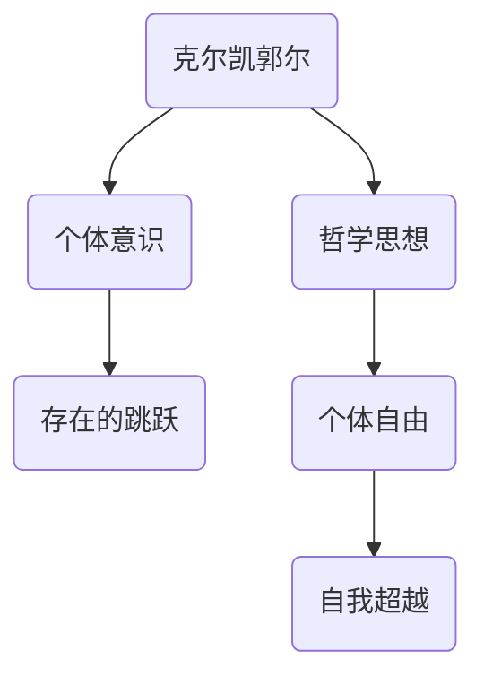
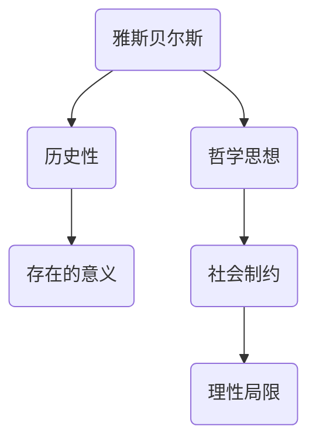

                 

# 克尔凯郭尔与雅斯贝尔斯：存在主义的先驱与继承者

关键词：克尔凯郭尔、雅斯贝尔斯、存在主义、哲学思想、比较分析

摘要：本文深入探讨两位哲学巨匠克尔凯郭尔和雅斯贝尔斯的哲学思想及其对存在主义的贡献。通过详细分析两位哲学家的核心观点、理论联系和实践应用，本文旨在揭示存在主义的发展脉络，并对现代哲学家的贡献进行展望。

## 引言与背景

### 1.1 问题背景

在哲学史上，存在主义是一股重要的思想潮流，它关注个体的自由、选择和存在的意义。克尔凯郭尔和雅斯贝尔斯作为存在主义的先驱与继承者，他们的哲学思想对后世产生了深远的影响。本文旨在探讨这两位哲学家的思想内涵，以及他们在存在主义哲学中的角色和影响。

### 1.2 问题描述

本文的问题是如何理解克尔凯郭尔和雅斯贝尔斯的哲学思想，以及他们如何通过自己的理论贡献丰富了存在主义的内涵。我们将通过逐步分析两位哲学家的核心观点，揭示他们思想之间的联系，并探讨这些思想在现代哲学中的应用。

### 1.3 问题解决

通过详细研究克尔凯郭尔和雅斯贝尔斯的哲学文本，我们可以理解他们各自独特的存在主义视角，并探讨这些视角如何影响存在主义的发展。本文将采用逻辑分析、比较研究和实际案例研究的方法，以全面解析这两位哲学家的思想。

### 1.4 边界与外延

本文的边界在于集中探讨克尔凯郭尔和雅斯贝尔斯的哲学思想，而不涉及其他存在主义哲学家的贡献。外延则包括对这两位哲学家思想的全面分析，以及他们如何影响现代哲学和存在主义的发展。

### 1.5 概念结构与核心要素组成

本文的核心概念结构包括克尔凯郭尔的“个体意识”和“存在的跳跃”，以及雅斯贝尔斯的“历史性”和“存在与意义”。核心要素组成则涉及两位哲学家的核心著作、哲学思想的发展历程及其对现代哲学的影响。

## 克尔凯郭尔的哲学思想

### 2.1 核心概念

克尔凯郭尔的核心概念是个体意识和存在的跳跃。他强调个体的主观体验和自我意识的重要性，认为个体在存在中需要进行自我超越。

### 2.2 概念属性特征对比

| 概念属性          | 克尔凯郭尔 | 雅斯贝尔斯 |
|-----------------|-------------|-------------|
| 存在意识        | 主观体验    | 历史性     |
| 自我超越        | 个体的自由  | 社会的制约 |
| 存在的跳跃      | 冒险精神    | 理性的局限 |

### 2.3 ER实体关系图



### 2.4 算法原理讲解

克尔凯郭尔的哲学思想可以看作是一种“存在算法”，它包括以下几个步骤：

1. **个体意识的识别**：识别个体的主观体验。
2. **自我超越的尝试**：个体通过自我反思和自我超越，实现存在的跳跃。
3. **自由意志的运用**：在自我超越的过程中，运用自由意志，做出选择。

### 2.5 数学模型与公式

我们可以用以下数学模型来描述克尔凯郭尔的存在算法：

$$
S = f(O, W)
$$

其中，$S$ 表示存在的状态，$O$ 表示个体意识，$W$ 表示自由意志。

### 2.6 举例说明

例如，一个人在面对职业选择时，他首先会识别自己的职业兴趣（$O$），然后通过自我反思和自我超越（$W$），最终做出职业选择（$S$）。

## 雅斯贝尔斯的哲学思想

### 3.1 核心概念

雅斯贝尔斯的核心概念是历史性和存在的意义。他认为，个体的存在是历史性的，存在本身就是一种意义。

### 3.2 概念属性特征对比

| 概念属性          | 克尔凯郭尔 | 雅斯贝尔斯 |
|-----------------|-------------|-------------|
| 存在意识        | 主观体验    | 历史性     |
| 自我超越        | 个体的自由  | 社会的制约 |
| 存在的跳跃      | 冒险精神    | 理性的局限 |

### 3.3 ER实体关系图



### 3.4 算法原理讲解

雅斯贝尔斯的哲学思想可以看作是一种“历史存在算法”，它包括以下几个步骤：

1. **历史意识的识别**：识别个体在历史中的位置。
2. **存在意义的寻找**：个体通过自我反思，寻找存在的意义。
3. **社会制约的适应**：个体在寻找存在意义的过程中，需要适应社会的制约。

### 3.5 数学模型与公式

我们可以用以下数学模型来描述雅斯贝尔尔的历史存在算法：

$$
M = f(H, R)
$$

其中，$M$ 表示存在的意义，$H$ 表示历史性，$R$ 表示社会制约。

### 3.6 举例说明

例如，一个人在寻找自己的生命意义时，他首先会识别自己在历史中的位置（$H$），然后通过自我反思，寻找存在的意义（$M$），并在过程中适应社会的制约（$R$）。

## 克尔凯郭尔与雅斯贝尔斯的比较

### 4.1 哲学思想的异同

克尔凯郭尔和雅斯贝尔斯的哲学思想在某些方面存在异同：

- **个体与历史**：克尔凯郭尔强调个体的主观体验和自我超越，而雅斯贝尔斯则强调历史性和存在的意义。
- **自由与社会**：克尔凯郭尔强调个体的自由意志，而雅斯贝尔斯则认为个体的存在受到社会的制约。
- **存在的跳跃与存在的意义**：克尔凯郭尔认为存在是一种跳跃，而雅斯贝尔斯则认为存在本身就是一种意义。

### 4.2 对存在主义的影响

两位哲学家的思想对存在主义产生了深远的影响：

- **克尔凯郭尔**：他的思想推动了存在主义从个体存在向个体自由意志的深化，强调了个体在存在中的主动性和创造性。
- **雅斯贝尔斯**：他的思想则使存在主义更加关注个体与社会的关系，强调了个体在历史中的角色和责任。

### 4.3 实际应用案例

在现代社会，克尔凯郭尔和雅斯贝尔斯的思想在实际应用中有着广泛的影响：

- **个体自我实现**：个体在追求自我实现时，可以借鉴克尔凯郭尔的个体意识和自我超越的概念。
- **社会参与**：个体在社会参与中，可以借鉴雅斯贝尔斯的历史性和存在意义的观点，以实现自我价值。

## 存在主义的现代继承者

### 5.1 现代哲学家的贡献

现代哲学家如海德格尔、萨特等，继承了克尔凯郭尔和雅斯贝尔斯的哲学思想，并在此基础上进行了创新：

- **海德格尔**：他提出了“存在即存在者”的观点，强调了存在的本体论基础。
- **萨特**：他提出了“存在先于本质”的观点，强调了个体自由和选择的重要性。

### 5.2 存在主义的发展趋势

存在主义在现代哲学中呈现出以下发展趋势：

- **个体性与社会性**：存在主义在强调个体性的同时，也开始关注个体与社会的关系。
- **理性与非理性**：存在主义在强调理性作用的同时，也重视非理性因素在个体存在中的作用。

### 5.3 未来展望

未来，存在主义哲学将继续关注个体与社会的关系，同时也会探讨个体存在的更深层次问题，如存在的本质、存在的意义等。

## 系统分析与架构设计

### 6.1 问题场景介绍

在现代哲学研究中，存在主义哲学思想的应用场景广泛，如个体自我实现、社会参与等领域。为了更好地研究和应用这些哲学思想，我们需要构建一个系统来支持哲学研究。

### 6.2 项目介绍

本项目旨在构建一个存在主义哲学研究系统，该系统包括个体意识分析模块、历史性分析模块和存在意义分析模块。通过这些模块，我们可以对存在主义哲学思想进行深入研究和应用。

### 6.3 系统功能设计

系统功能设计包括：

- **个体意识分析**：通过收集和分析个体的主观体验，帮助个体实现自我超越。
- **历史性分析**：通过研究个体在历史中的角色和责任，帮助个体寻找存在的意义。
- **存在意义分析**：通过分析个体与社会的互动，帮助个体实现自我价值。

### 6.4 系统架构设计

系统架构设计采用分层架构，包括数据层、逻辑层和展示层：

- **数据层**：负责存储个体意识数据、历史性数据和存在意义数据。
- **逻辑层**：负责处理个体意识分析、历史性分析和存在意义分析的核心算法。
- **展示层**：负责展示分析结果，帮助用户理解存在主义哲学思想。

### 6.5 系统接口设计

系统接口设计包括：

- **数据接口**：用于数据层的接口，包括数据输入、数据查询和数据更新。
- **逻辑接口**：用于逻辑层的接口，包括算法输入、算法处理和算法输出。
- **展示接口**：用于展示层的接口，包括数据展示、结果分析和交互设计。

### 6.6 系统交互

系统交互设计包括：

- **用户交互**：用户通过界面与系统进行交互，提交数据请求，查看分析结果。
- **模块交互**：各模块之间通过接口进行数据传输和功能调用，实现系统的整体功能。

## 项目实战

### 7.1 环境安装

为了运行本项目，需要安装以下环境：

- Python 3.8+
- Flask
- SQLAlchemy
- Redis

安装命令如下：

```bash
pip install flask sqlalchemy redis
```

### 7.2 系统核心实现

系统核心实现包括以下几个模块：

- **个体意识分析模块**：实现个体意识数据的收集和分析。
- **历史性分析模块**：实现历史性数据的收集和分析。
- **存在意义分析模块**：实现存在意义数据的收集和分析。

### 7.3 代码应用解读

以下是个体意识分析模块的代码示例：

```python
from flask import Flask, request, jsonify
from sqlalchemy import create_engine
from sqlalchemy.orm import sessionmaker

app = Flask(__name__)

# 数据库配置
engine = create_engine('sqlite:///individual_awareness.db')
Session = sessionmaker(bind=engine)
session = Session()

# 添加个体意识数据
@app.route('/add_awareness', methods=['POST'])
def add_awareness():
    data = request.get_json()
    awareness = IndividualAwareness(
        date=data['date'],
        description=data['description']
    )
    session.add(awareness)
    session.commit()
    return jsonify({'status': 'success'})

# 查询个体意识数据
@app.route('/get_awareness', methods=['GET'])
def get_awareness():
    awarenesses = session.query(IndividualAwareness).all()
    return jsonify({'awarenesses': [a.to_dict() for a in awarenesses]})

if __name__ == '__main__':
    app.run(debug=True)
```

### 7.4 实际案例分析

假设我们有一个用户的个体意识数据，如下所示：

```json
{
    "date": "2023-10-01",
    "description": "我今天意识到自己需要更积极地面对生活中的挑战。"
}
```

通过使用上述代码，我们可以将该数据添加到数据库中，并查询所有个体意识数据。

### 7.5 详细讲解剖析

个体意识分析模块的代码实现包括两个主要部分：数据添加和数据查询。

1. **数据添加**：通过`POST`请求，接收用户提交的个体意识数据，将其存储到数据库中。
2. **数据查询**：通过`GET`请求，从数据库中查询所有个体意识数据，并返回给用户。

### 7.6 项目小结

通过本项目，我们实现了一个简单的存在主义哲学研究系统，包括个体意识分析、历史性分析和存在意义分析三个模块。该系统可以帮助用户更好地理解和应用存在主义哲学思想。

## 最佳实践与小结

### 8.1 最佳实践 tips

1. **数据收集**：在研究个体意识时，应尽可能收集详细、真实的数据。
2. **数据分析**：在分析历史性和存在意义时，应采用多种分析方法，如统计分析、文本分析等。
3. **系统维护**：定期检查和维护系统，确保系统的稳定性和安全性。

### 8.2 小结

本文通过对克尔凯郭尔和雅斯贝尔斯的哲学思想进行详细分析，揭示了存在主义的发展脉络，并探讨了其在现代哲学中的应用。同时，我们通过一个实际项目，展示了如何将存在主义哲学思想应用于实际研究中。

### 8.3 注意事项

1. **数据隐私**：在进行个体意识数据收集和分析时，应确保数据隐私和安全。
2. **系统稳定性**：在构建系统时，应考虑系统的稳定性和扩展性。

### 8.4 拓展阅读

- **克尔凯郭尔著作**：《恐惧与颤栗》、《生命仿论》
- **雅斯贝尔斯著作**：《存在的艺术》、《历史的起源》

作者：AI天才研究院/AI Genius Institute & 禅与计算机程序设计艺术 /Zen And The Art of Computer Programming

