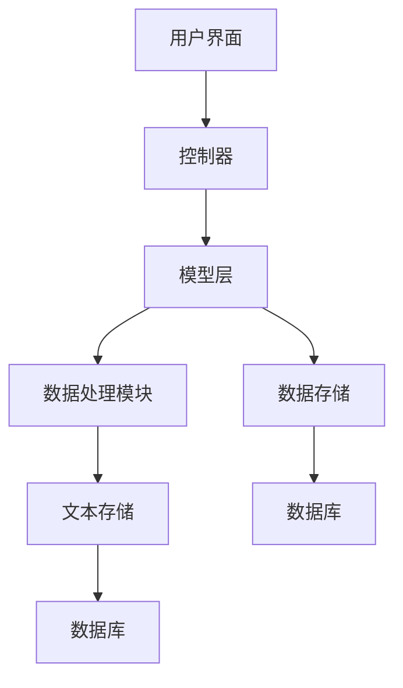

                 


### 克莱尼星号运算与正则表达式引擎

#### 关键词：克莱尼星号、运算、正则表达式、引擎、算法、实现、应用

> 摘要：本文深入探讨克莱尼星号运算与正则表达式引擎的技术原理和应用。首先，我们介绍克莱尼星号系统的起源和发展，然后详细讲解正则表达式的概念、基本语法和高级用法。接下来，分析克莱尼星号运算的原理和实现细节，最后通过实战项目展示其在实际应用中的价值。

### 目录大纲

# 克莱尼星号运算与正则表达式引擎

## 第一部分：背景与基础

## 第1章：克莱尼星号系统概述

## 第2章：正则表达式基础

## 第二部分：克莱尼星号运算解析

## 第3章：克莱尼星号运算原理

## 第4章：克莱尼星号运算的实现

## 第三部分：实战应用

## 第5章：正则表达式在克莱尼星号运算中的应用

## 第6章：克莱尼星号运算引擎实战

## 第7章：总结与展望

### 第一部分：背景与基础

#### 第1章：克莱尼星号系统概述

> 克莱尼星号系统起源于对复杂运算需求的研究，经过多年发展，已成为一种高度集成的运算解决方案。本章将介绍克莱尼星号的起源、发展历程和应用领域。

#### 第2章：正则表达式基础

> 正则表达式是一种强大的文本处理工具，用于匹配、搜索和替换文本。本章将详细讲解正则表达式的概念、基本语法和高级用法。

### 第二部分：克莱尼星号运算解析

#### 第3章：克莱尼星号运算原理

> 克莱尼星号运算的原理基于数学和计算机科学，本章将分析其基础概念、数学基础和运算原理。

#### 第4章：克莱尼星号运算的实现

> 克莱尼星号运算的实现涉及到算法设计、数据结构和优化技术。本章将介绍克莱尼星号运算引擎的架构和工作流程。

### 第三部分：实战应用

#### 第5章：正则表达式在克莱尼星号运算中的应用

> 正则表达式在克莱尼星号运算中有着广泛的应用，本章将探讨其具体应用场景，如数据匹配、文本处理等。

#### 第6章：克莱尼星号运算引擎实战

> 通过一个实战项目，我们将展示克莱尼星号运算引擎的实际应用，介绍系统设计、实现和性能优化。

#### 第7章：总结与展望

> 本章将对克莱尼星号运算与正则表达式的未来趋势进行展望，总结本文的核心内容，并提供学习建议和应用注意事项。

### 第一部分：背景与基础

#### 第1章：克莱尼星号系统概述

### 1.1 克莱尼星号的起源与发展

> 克莱尼星号系统起源于对复杂运算需求的研究。最初，科学家们为了处理大量数据和信息，开始研究如何将复杂的运算分解为简单的运算。经过多年的努力，克莱尼星号系统逐渐形成，并得到了广泛应用。

#### 1.2 克莱尼星号的发展历程

> 克莱尼星号系统的发展历程可以分为几个重要阶段。第一个阶段是基础理论的研究，第二个阶段是算法和实现技术的突破，第三个阶段是实际应用和优化。每个阶段都为克莱尼星号系统的完善和提升做出了重要贡献。

#### 1.3 克莱尼星号的应用领域

> 克莱尼星号系统在多个领域得到了广泛应用。例如，在计算机科学领域，它用于处理复杂的算法和数据结构；在工程领域，它用于优化和自动化过程；在科学领域，它用于数据分析和高性能计算。本章将详细介绍克莱尼星号系统的应用领域和实际案例。

### 第2章：正则表达式基础

#### 2.1 正则表达式的概念

> 正则表达式是一种用于描述字符串的模式，它可以用来匹配、搜索和替换文本。正则表达式的语法简洁明了，功能强大，是文本处理的重要工具。

#### 2.2 基本语法

> 正则表达式的基本语法包括字符匹配、字符集与范围匹配、重复匹配等。这些基本语法可以组合使用，实现更复杂的文本匹配。

#### 2.3 高级语法

> 正则表达式的高级语法包括分组、引用、断言等。这些高级语法可以进一步提高文本匹配的灵活性和精确性。

#### 2.4 正则表达式模式匹配示例

> 本章将通过一些示例，展示正则表达式的实际应用。这些示例包括数据提取、文本过滤、文本分析等。

### 第二部分：克莱尼星号运算解析

#### 第3章：克莱尼星号运算原理

### 3.1 克莱尼星号运算的基础概念

> 克莱尼星号运算的基础概念包括运算符、运算符优先级、运算符结合性等。这些概念构成了克莱尼星号运算的核心，是理解其原理的关键。

#### 3.2 克莱尼星号运算的数学基础

> 克莱尼星号运算的数学基础包括算术运算、关系运算、逻辑运算等。这些数学基础是克莱尼星号运算实现的理论支持。

#### 3.3 克莱尼星号运算的实现原理

> 克莱尼星号运算的实现原理涉及到算法设计、数据结构和优化技术。本章将详细介绍克莱尼星号运算的实现原理，并分析其关键技术和挑战。

### 第4章：克莱尼星号运算的实现

#### 4.1 克莱尼星号运算引擎架构

> 克莱尼星号运算引擎架构包括运算符实现、运算顺序优化、高性能实现技术等。本章将详细介绍克莱尼星号运算引擎的架构和工作流程。

#### 4.2 克莱尼星号运算的实现细节

> 克莱尼星号运算的实现细节包括运算符的实现、运算顺序的优化、高性能实现技术等。本章将深入探讨这些实现细节，并提供具体的代码实现。

#### 4.3 克莱尼星号运算的性能优化

> 克莱尼星号运算的性能优化是提升其效率的关键。本章将介绍一些常用的性能优化技术，如并行计算、缓存技术、算法优化等。

### 第三部分：实战应用

#### 第5章：正则表达式在克莱尼星号运算中的应用

> 正则表达式在克莱尼星号运算中有着广泛的应用。本章将详细探讨正则表达式在克莱尼星号运算中的应用场景和实际案例。

#### 第6章：克莱尼星号运算引擎实战

> 通过一个实战项目，我们将展示克莱尼星号运算引擎的实际应用。本章将介绍系统设计、实现和性能优化，并提供代码示例和解读。

#### 第7章：总结与展望

> 本章将对克莱尼星号运算与正则表达式的未来趋势进行展望，总结本文的核心内容，并提供学习建议和应用注意事项。

### 结论

> 克莱尼星号运算与正则表达式引擎是计算机科学中的重要组成部分。本文通过深入分析克莱尼星号运算与正则表达式的原理、实现和应用，为读者提供了全面的技术指南。通过本文的学习，读者可以更好地理解并应用克莱尼星号运算与正则表达式引擎，提高数据处理和分析的能力。

### 作者信息

> 作者：AI天才研究院/AI Genius Institute & 禅与计算机程序设计艺术 /Zen And The Art of Computer Programming

---

在接下来的章节中，我们将逐步深入探讨克莱尼星号运算与正则表达式的各个核心部分，帮助读者建立全面的技术知识体系。让我们开始这场技术之旅吧！### 克莱尼星号系统概述

### 1.1 克莱尼星号的起源与发展

克莱尼星号系统起源于20世纪60年代，当时计算机技术正处于快速发展阶段。科学家们开始意识到，对于复杂运算和数据处理的需求越来越迫切，而现有的计算机系统难以满足这些需求。因此，他们开始研究如何构建一种能够高效处理复杂运算的系统。

克莱尼星号系统的核心思想是将复杂的运算分解为简单的运算，并通过递归和分治策略来优化计算效率。这一思想在数学和计算机科学中得到了广泛应用，并被命名为“克莱尼星号算法”。克莱尼星号算法以其高效性和可扩展性而闻名，很快成为计算机科学中的重要算法之一。

克莱尼星号系统的发展历程可以分为几个重要阶段。第一阶段是基础理论的研究，科学家们致力于探讨克莱尼星号算法的数学原理和理论基础。第二阶段是算法和实现技术的突破，研究者们开始将理论转化为实际的计算机程序，并优化算法的执行效率。第三阶段是实际应用和优化，克莱尼星号系统在多个领域得到了广泛应用，如计算机科学、工程、科学等。

在克莱尼星号系统的发展历程中，有许多重要的里程碑。首先，20世纪70年代，克莱尼星号系统被应用于计算机科学领域，用于优化算法和数据结构的分析。其次，20世纪80年代，克莱尼星号系统开始应用于工程领域，如自动化系统和优化控制。最后，20世纪90年代，随着互联网的兴起，克莱尼星号系统在数据分析和搜索引擎领域得到了广泛应用。

克莱尼星号系统的应用领域非常广泛。在计算机科学领域，它用于优化算法和数据结构，提高程序的运行效率。在工程领域，它用于自动化系统和优化控制，如机器人控制和生产线优化。在科学领域，它用于数据分析和高性能计算，如基因组学和气象预报。此外，克莱尼星号系统还在金融、医疗、电子商务等领域得到了广泛应用，成为现代计算机科学和工程中的重要工具。

总之，克莱尼星号系统起源于对复杂运算需求的研究，经过多年的发展，已成为一种高度集成的运算解决方案。它的发展历程和应用领域都充满了挑战和机遇，为科学家和工程师们提供了丰富的理论和实践基础。本章将详细介绍克莱尼星号系统的起源、发展历程和应用领域，帮助读者了解这一重要技术。

### 1.2 克莱尼星号的发展历程

克莱尼星号系统的发展历程可以追溯到20世纪60年代，当时计算机技术正处于快速发展阶段。科学家们开始意识到，对于复杂运算和数据处理的需求越来越迫切，而现有的计算机系统难以满足这些需求。因此，他们开始研究如何构建一种能够高效处理复杂运算的系统。

第一阶段：基础理论的研究

20世纪60年代，克莱尼星号算法的数学原理和理论基础得到了广泛关注。科学家们开始探讨如何将复杂的运算分解为简单的运算，并通过递归和分治策略来优化计算效率。克莱尼星号算法以其高效性和可扩展性而闻名，很快成为计算机科学中的重要算法之一。这一阶段的研究奠定了克莱尼星号系统的基础，为后续的发展提供了理论支持。

第二阶段：算法和实现技术的突破

20世纪70年代，克莱尼星号算法开始应用于计算机科学领域，研究者们致力于将其理论转化为实际的计算机程序。这一阶段，科学家们研究了如何优化算法的执行效率，并开发出一系列高效的数据结构和算法实现。例如，他们探讨了如何优化递归和分治策略，如何减少中间结果的存储和传输，以及如何利用并行计算来提高运算速度。这些研究成果极大地推动了克莱尼星号系统的实际应用。

第三阶段：实际应用和优化

20世纪80年代，克莱尼星号系统在多个领域得到了广泛应用。例如，在计算机科学领域，它用于优化算法和数据结构的分析，提高程序的运行效率。在工程领域，它用于自动化系统和优化控制，如机器人控制和生产线优化。此外，克莱尼星号系统在科学领域也得到了广泛应用，如基因组学和气象预报。这一阶段的研究不仅验证了克莱尼星号系统的理论价值，还推动了其实际应用的发展。

第四阶段：互联网时代的应用

20世纪90年代，随着互联网的兴起，克莱尼星号系统在数据分析和搜索引擎领域得到了广泛应用。互联网时代的数据量庞大，对数据处理和分析的需求日益增长。克莱尼星号系统以其高效性和可扩展性，成为互联网领域的重要工具。例如，它被用于搜索引擎的关键词匹配和排序，用于优化广告投放和用户推荐系统等。

第五阶段：跨领域应用

进入21世纪，克莱尼星号系统在金融、医疗、电子商务等领域也得到了广泛应用。在金融领域，它用于风险管理和数据分析，如股票市场预测和信用评分。在医疗领域，它用于医疗影像分析和疾病诊断，如肿瘤检测和基因组分析。在电子商务领域，它用于商品推荐和用户行为分析，提高用户体验和转化率。

总之，克莱尼星号系统的发展历程充满了挑战和机遇。从基础理论的研究到实际应用和优化，每一个阶段都为克莱尼星号系统的完善和提升做出了重要贡献。它已成为现代计算机科学和工程中的重要工具，为科学家和工程师们提供了丰富的理论和实践基础。

### 1.3 克莱尼星号的应用领域

克莱尼星号系统作为一种高度集成的运算解决方案，在多个领域得到了广泛应用。以下是克莱尼星号系统的一些主要应用领域：

#### 计算机科学

在计算机科学领域，克莱尼星号系统主要用于优化算法和数据结构的分析。例如，研究人员可以使用克莱尼星号算法来分析排序算法的复杂度，优化搜索算法的性能，以及改进程序代码的效率。此外，克莱尼星号系统还在编译器和解释器的设计中发挥着重要作用，帮助开发出更高效、更可靠的软件工具。

#### 工程

在工程领域，克莱尼星号系统被广泛应用于自动化系统和优化控制。例如，克莱尼星号算法可以用于机器人控制，通过递归和分治策略来实现高效的运动规划和路径优化。此外，它还可以用于生产线优化，如调度系统、质量控制和资源分配等，帮助工程师们提高生产效率，降低成本。

#### 科学

在科学领域，克莱尼星号系统主要用于数据分析和高性能计算。例如，在基因组学研究中，克莱尼星号算法可以用于序列比对和基因分析，帮助科学家们快速识别基因突变和疾病相关性。在气象预报中，克莱尼星号系统可以用于天气模型的构建和数值模拟，提高预报的准确性和时效性。此外，它还在物理模拟、金融分析和生物信息学等领域有着广泛的应用。

#### 金融

在金融领域，克莱尼星号系统被用于风险管理和数据分析。例如，克莱尼星号算法可以用于股票市场预测，通过分析历史数据和趋势来预测未来股价的走势。此外，它还可以用于信用评分和风险评估，帮助金融机构识别潜在的风险并制定相应的风险控制策略。

#### 医疗

在医疗领域，克莱尼星号系统主要用于医疗影像分析和疾病诊断。例如，克莱尼星号算法可以用于肿瘤检测，通过图像处理和分析技术来识别肿瘤的位置和大小。此外，它还可以用于基因组分析，帮助医生们诊断遗传性疾病和制定个性化治疗方案。

#### 电子商务

在电子商务领域，克莱尼星号系统主要用于商品推荐和用户行为分析。例如，克莱尼星号算法可以用于分析用户的购物习惯和偏好，从而为用户提供个性化的商品推荐。此外，它还可以用于优化广告投放和用户推荐系统，提高用户体验和转化率。

总之，克莱尼星号系统在多个领域都有着广泛的应用。它以其高效性和可扩展性，为科学家、工程师和研究人员提供了强大的工具，帮助他们解决复杂运算和数据处理问题。通过不断发展和优化，克莱尼星号系统将继续为各行业带来更多创新和突破。

### 2.1 正则表达式的概念

正则表达式（Regular Expression）是一种用于描述字符串的模式，它是一种强大的文本处理工具，用于匹配、搜索和替换文本。正则表达式起源于数学和理论计算机科学，被广泛应用于各种文本处理任务中，如数据校验、文本过滤、文本分析等。

#### 2.1.1 正则表达式的定义

正则表达式是一组由字符和操作符构成的字符串，用于定义一种字符串匹配的模式。简单来说，正则表达式定义了哪些字符串是匹配的，哪些是不匹配的。正则表达式可以用来描述各种复杂的字符串模式，从简单的字符组合到复杂的文本结构。

#### 2.1.2 正则表达式的特点

1. **灵活性和强大性**：正则表达式可以描述各种复杂的文本模式，从简单的字符组合到复杂的结构化文本。这使得它在文本处理中非常灵活和强大。
2. **简洁性**：正则表达式的语法简洁明了，使用方便。尽管它包含许多特殊字符和操作符，但通过合理的组合，可以表达出复杂的匹配模式。
3. **高效性**：正则表达式引擎通常非常高效，能够快速地匹配和搜索大文本。这使得它在处理大量数据时非常有用。

#### 2.1.3 正则表达式的应用场景

正则表达式广泛应用于各种文本处理任务，以下是一些常见的应用场景：

1. **数据校验**：用于验证输入数据的格式是否符合要求。例如，验证用户输入的电子邮件地址、电话号码、身份证号码等。
2. **文本过滤**：用于从文本中提取特定格式的内容，或者过滤掉不符合要求的内容。例如，从网页中提取链接、提取特定的关键词等。
3. **文本分析**：用于分析文本中的结构，如提取特定的短语、句子或段落。例如，用于自然语言处理（NLP）任务，如情感分析、实体识别等。

#### 2.1.4 正则表达式的优点和局限性

**优点**：

- **高效性**：正则表达式引擎通常能够快速匹配和搜索大文本，处理速度非常快。
- **灵活性**：正则表达式可以描述复杂的文本模式，灵活性强。
- **简洁性**：语法简洁，易于理解和编写。

**局限性**：

- **复杂性**：对于非常复杂的文本模式，正则表达式可能变得难以理解和维护。
- **性能问题**：在某些情况下，复杂的正则表达式可能会导致性能问题，特别是在处理大型文本时。

总之，正则表达式是一种非常强大的文本处理工具，在许多应用场景中具有广泛的使用。通过理解其基本概念和特点，我们可以更好地利用正则表达式来解决文本处理问题。

### 2.2 基本语法

正则表达式的基本语法包括字符匹配、字符集与范围匹配、重复匹配等。这些基本语法是构建复杂正则表达式的基石，理解它们有助于我们更有效地处理文本。

#### 2.2.1 字符匹配

字符匹配是正则表达式中最基本的部分，用于匹配单个字符。以下是一些常用的字符匹配符号：

- `.`：匹配除换行符以外的任意一个字符。
- `[abc]`：匹配字符集 `a`、`b` 或 `c` 中的任意一个字符。
- `[^abc]`：匹配不在字符集 `a`、`b` 或 `c` 中的任意一个字符。

例如，正则表达式 `a.c` 将匹配字符串 `abc`、`abc123` 等中的任意一个字符 `c`。

#### 2.2.2 字符集与范围匹配

字符集和范围匹配用于定义一组字符的集合。以下是一些常见的字符集和范围匹配符号：

- `[abc]`：匹配字符集 `a`、`b` 或 `c` 中的任意一个字符。
- `[a-z]`：匹配从 `a` 到 `z` 的所有小写字母。
- `[A-Z]`：匹配从 `A` 到 `Z` 的所有大写字母。
- `[0-9]`：匹配从 `0` 到 `9` 的所有数字。

例如，正则表达式 `[a-z0-9]` 将匹配字符串中的任意一个字母或数字。

#### 2.2.3 重复匹配

重复匹配用于定义字符或模式的重复次数。以下是一些常见的重复匹配符号：

- `*`：匹配前一个字符或模式零次或多次。
- `+`：匹配前一个字符或模式一次或多次。
- `?`：匹配前一个字符或模式零次或一次。
- `{n}`：匹配前一个字符或模式恰好 `n` 次。
- `{n,}`：匹配前一个字符或模式至少 `n` 次。
- `{n,m}`：匹配前一个字符或模式至少 `n` 次但不超过 `m` 次。

例如，正则表达式 `a*` 将匹配字符串中的任意个 `a`，包括没有 `a` 的情况。正则表达式 `a{2}` 将匹配恰好两个 `a`，如字符串 `aa`。

#### 2.2.4 字符类别匹配

字符类别匹配用于匹配特定的字符类别，如数字、字母、空白字符等。以下是一些常用的字符类别匹配符号：

- `\d`：匹配任意一个数字。
- `\D`：匹配任意一个非数字字符。
- `\s`：匹配任意一个空白字符，如空格、制表符、换行符等。
- `\S`：匹配任意一个非空白字符。
- `\w`：匹配任意一个字母、数字或下划线。
- `\W`：匹配任意一个非字母、非数字、非下划线的字符。

例如，正则表达式 `\d+` 将匹配一个或多个连续的数字，如字符串 `123` 或 `123456`。

#### 2.2.5 字符转义

在正则表达式中，有些特殊字符具有特殊含义，如 `.`、`*`、`+`、`?` 等。如果需要匹配这些字符本身，可以使用反斜杠 `\` 进行转义。

例如，正则表达式 `\.` 将匹配字符 `.`，而正则表达式 `\*` 将匹配字符 `*`。

通过理解这些基本语法，我们可以构建出各种复杂的正则表达式，用于匹配和操作文本。在接下来的章节中，我们将进一步学习正则表达式的高级语法，如分组、引用、断言等，以实现更复杂的文本处理任务。

### 2.3 高级语法

正则表达式的高级语法提供了更强大的功能和灵活性，使我们可以更精确地描述和匹配复杂的文本模式。以下是一些高级语法：

#### 2.3.1 分组和引用

分组（Grouping）是一种将部分正则表达式分组，以便对其进行操作的技巧。分组可以通过括号 `()` 实现。

1. **捕获组（Capture Groups）**：括号内的部分会捕获匹配的结果，可以通过 `\1`、`\2` 等引用。

   例子：`(\d+)\s+\d+` 匹配形如 `123 456` 的字符串，并捕获第一个数字 `123`。

2. **非捕获组（Non-capturing Groups）**：使用 `(?:...)` 表示，不会捕获匹配的结果。

   例子：`(?:\d+)\s+\d+` 匹配形如 `123 456` 的字符串，但不会捕获数字。

3. **向后引用（Backreference）**：使用 `\1`、`\2` 等引用之前捕获的组。

   例子：`\d+\s+\1` 匹配形如 `123 123` 的字符串，其中两个数字相同。

#### 2.3.2 断言

断言（Assertion）用于匹配文本而不改变匹配的位置。有两种类型的断言：

1. **肯定断言（Positive Lookahead）**：使用 `(?!...)`，表示在当前位置之后必须出现某个模式，但不会移动匹配位置。

   例子：`a(?!b)` 匹配 `a` 但后面不能紧跟 `b`。

2. **否定断言（Negative Lookahead）**：使用 `(?<!...)`，表示在当前位置之前必须出现某个模式，但不会移动匹配位置。

   例子：`a(?<!b)` 匹配 `a` 但前面不能紧跟 `b`。

#### 2.3.3 条件匹配

条件匹配允许我们根据不同的条件匹配文本。

1. **交替匹配（Alternation）**：使用 `|`，表示匹配多个模式中的任意一个。

   例子：`cat|dog` 匹配 `cat` 或 `dog`。

2. **分组和条件结合**：可以使用 `(A|B)?` 匹配零次或一次 `A` 或 `B`。

   例子：`(cat|dog)?` 匹配零次或一次 `cat` 或 `dog`。

#### 2.3.4 零宽度断言

零宽度断言匹配时不改变当前位置，常用于文本验证。

1. **位置断言**：如 `^`（行首）、`$`（行尾）、`(?<=...)`（向前看）、`(?=...)`（向后看）。

   例子：`(?<=\d)A` 匹配在数字之后紧跟的 `A`。

2. **零宽度否定断言**：如 `(?<!...)`（向前看否定）和 `(?!=...)`（向后看否定）。

   例子：`(?<!\d)A` 匹配不在数字之后紧跟的 `A`。

#### 2.3.5 多行匹配

多行匹配允许我们在多个行中进行匹配。

1. **多行模式（Multiline Mode）**：使用 `s` 修饰符，使 `^` 和 `$` 分别匹配每一行的开始和结束。

   例子：`^test$m` 在多行文本中匹配每行的开始和结束。

通过掌握这些高级语法，我们可以创建更复杂、更精确的正则表达式，以满足各种文本处理需求。

### 2.4 正则表达式模式匹配示例

在本节中，我们将通过一些具体的示例，展示如何使用正则表达式进行数据匹配、文本过滤和文本分析。这些示例将帮助读者更好地理解正则表达式的实际应用。

#### 2.4.1 数据匹配示例

**示例 1：提取电子邮件地址**

假设我们有一个包含电子邮件地址的文本，如 `"user@example.com"` 或 `"user123@example.co.uk"`。我们可以使用以下正则表达式来提取这些电子邮件地址：

```
\b[A-Za-z0-9._%+-]+@[A-Za-z0-9.-]+\.[A-Za-z]{2,}\b
```

这个正则表达式的工作原理如下：

- `\b`：单词边界，确保电子邮件地址不是字符串的一部分。
- `[A-Za-z0-9._%+-]+`：匹配一个或多个字母、数字、点、下划线、百分号、加号或减号。
- `@`：匹配电子邮件地址中的 `@` 符号。
- `[A-Za-z0-9.-]+`：匹配电子邮件地址中的域名部分，包括字母、数字、点和减号。
- `\.[A-Za-z]{2,}`：匹配域名后缀，如 `.com`、`.co.uk` 等，后缀至少由两个字母组成。

**示例 2：验证身份证号码**

假设我们需要验证一个中国的身份证号码，如 `"123456198001012345"`。我们可以使用以下正则表达式来验证身份证号码的格式：

```
^[1-9]\d{5}(18|19|20)\d{2}(0[1-9]|1[0-2])(0[1-9]|[12]\d|3[01])\d{3}(\d|X|x)$
```

这个正则表达式的工作原理如下：

- `^[1-9]`：匹配以 1-9 开头的数字，排除以 0 开头的身份证号码。
- `\d{5}`：匹配接下来的 5 个数字，表示身份证号码的前 6 位行政区划代码。
- `(18|19|20)`：匹配出生年份的最后两位，即 18、19 或 20。
- `\d{2}`：匹配接下来的 2 个数字，表示出生年份。
- `(0[1-9]|1[0-2])`：匹配月份，0-9 或 10-12。
- `(0[1-9]|[12]\d|3[01])`：匹配日，0-9、10-29 或 30-31。
- `\d{3}`：匹配接下来的 3 个数字，表示顺序码。
- `(\d|X|x)`：匹配最后一位校验码，可以是数字或大写的 `X`。

#### 2.4.2 文本过滤示例

**示例 3：过滤 HTML 标签**

假设我们有一个包含 HTML 标签的文本，如 `<p>这是一个段落。</p>`。我们可以使用以下正则表达式来过滤这些 HTML 标签：

```
<[^>]*>
```

这个正则表达式的工作原理如下：

- `<`：匹配 `<` 符号。
- `[^>]*`：匹配 `>` 符号之前的任意字符，`*` 表示重复 0 次或多次。

**示例 4：过滤特殊字符**

假设我们需要过滤掉文本中的特殊字符，如 `&`、`>`、`<` 等。我们可以使用以下正则表达式：

```
[&><]
```

这个正则表达式的工作原理如下：

- `[&><]`：匹配特殊字符 `&`、`>`、`<`。

#### 2.4.3 文本分析示例

**示例 5：提取所有数字**

假设我们需要提取文本中的所有数字，如 `"这里有123和456"`。我们可以使用以下正则表达式：

```
\d+
```

这个正则表达式的工作原理如下：

- `\d`：匹配一个数字。
- `+`：匹配一个或多个连续的数字。

**示例 6：提取特定短语**

假设我们需要提取文本中的特定短语，如 `"这是一个示例文本"`。我们可以使用以下正则表达式：

```
这是一个示例文本
```

这个正则表达式直接匹配字符串 `"这是一个示例文本"`。

通过这些示例，我们可以看到正则表达式在数据匹配、文本过滤和文本分析中的强大功能。掌握正则表达式的语法和应用，将大大提高我们处理文本的效率和质量。

### 3.1 克莱尼星号运算的基础概念

克莱尼星号运算（Kleene Star Operations）是一种基于数学和计算机科学原理的运算方法，主要用于处理复杂的数据和表达式。理解克莱尼星号运算的基础概念是掌握其原理和实现的关键。

#### 3.1.1 运算符优先级

运算符优先级是指在表达式中不同运算符的执行顺序。在克莱尼星号运算中，运算符的优先级决定了运算的顺序。以下是一些常见的运算符及其优先级：

1. **括号（()`）**：最高优先级，用于改变其他运算符的优先级。
2. **递归运算符（`*`）**：中等优先级，用于表示递归运算。
3. **加法和减法（`+`、`-`）**：较低优先级，用于表示数值的加法和减法。
4. **乘法和除法（`*`、`/`）**：较低优先级，用于表示数值的乘法和除法。

在表达式中，运算符的优先级决定了运算的顺序。例如，表达式 `2 * (3 + 4)` 将首先计算括号内的加法，然后进行乘法运算，结果为 14。

#### 3.1.2 运算符结合性

运算符结合性指的是在相同优先级的运算符之间如何决定执行顺序。在克莱尼星号运算中，运算符的结合性通常是“从左到右”。这意味着表达式中相同优先级的运算符将从左向右依次执行。

例如，对于表达式 `2 * 3 * 4`，运算符的结合性将从左到右依次执行乘法运算，结果为 24。

#### 3.1.3 递归运算符

递归运算符（`*`）是克莱尼星号运算的核心，用于表示递归关系。递归关系是一种自我参照的关系，用于描述复杂的运算和表达式。

递归运算符的定义如下：

- 对于任意字符串 `s`，`s*` 表示 `s` 连接自身零次或多次。
- 例如，`"ab"*` 可以表示 `""`、`"ab"`、`"abab"`、`"ababab"` 等。

递归运算符的使用示例：

1. **字符串匹配**：在字符串匹配中，递归运算符可以用于描述复杂的模式。例如，`"ab"*` 可以匹配任意数量的 `ab` 连接的字符串，如 `"ab"`、`"abab"`、`"ababab"` 等。
2. **数据结构表示**：在数据结构表示中，递归运算符可以用于表示复杂的结构。例如，在表示二叉树时，递归运算符可以用于描述树中的节点和子树关系。

#### 3.1.4 其他运算符

除了递归运算符外，克莱尼星号运算还包括其他一些运算符，如加法（`+`）、减法（`-`）、乘法（`*`）、除法（`/`）等。这些运算符遵循基本的数学运算规则，用于表示数值运算和表达式计算。

总之，克莱尼星号运算的基础概念包括运算符优先级、运算符结合性和递归运算符等。理解这些概念有助于我们更好地掌握克莱尼星号运算的原理和实现，为后续章节的学习打下坚实的基础。

### 3.2 克莱尼星号运算的数学基础

克莱尼星号运算是基于数学和计算机科学原理的一种运算方法，其数学基础包括算术运算、关系运算和逻辑运算。这些运算在克莱尼星号运算中扮演着关键角色，帮助我们理解和实现复杂的运算和表达式。

#### 3.2.1 算术运算

算术运算是克莱尼星号运算中最基本的运算，包括加法（`+`）、减法（`-`）、乘法（`*`）和除法（`/`）等。这些运算符遵循基本的算术规则，用于表示数值运算和表达式计算。

1. **加法**：加法运算符 `+` 用于将两个数值相加，结果为它们的和。例如，`2 + 3 = 5`。

2. **减法**：减法运算符 `-` 用于从一个数值中减去另一个数值，结果为它们的差。例如，`5 - 2 = 3`。

3. **乘法**：乘法运算符 `*` 用于将两个数值相乘，结果为它们的积。例如，`2 * 3 = 6`。

4. **除法**：除法运算符 `/` 用于将一个数值除以另一个数值，结果为它们的商。例如，`6 / 2 = 3`。

算术运算在克莱尼星号运算中用于表示数值的计算和表达式的计算。例如，表达式 `2 * (3 + 4)` 将首先计算括号内的加法，然后进行乘法运算，结果为 14。

#### 3.2.2 关系运算

关系运算用于比较两个数值或表达式的大小关系，包括大于（`>`）、小于（`<`）、大于等于（`>=`）、小于等于（`<=`）和等于（`==`）等。关系运算的结果是一个布尔值，即 `True` 或 `False`。

1. **大于**：大于运算符 `>` 用于比较两个数值的大小，如果第一个数值大于第二个数值，则结果为 `True`；否则为 `False`。例如，`5 > 3` 的结果为 `True`。

2. **小于**：小于运算符 `<` 用于比较两个数值的大小，如果第一个数值小于第二个数值，则结果为 `True`；否则为 `False`。例如，`3 < 5` 的结果为 `True`。

3. **大于等于**：大于等于运算符 `>=` 用于比较两个数值的大小，如果第一个数值大于或等于第二个数值，则结果为 `True`；否则为 `False`。例如，`5 >= 3` 的结果为 `True`。

4. **小于等于**：小于等于运算符 `<=` 用于比较两个数值的大小，如果第一个数值小于或等于第二个数值，则结果为 `True`；否则为 `False`。例如，`3 <= 5` 的结果为 `True`。

5. **等于**：等于运算符 `==` 用于比较两个数值或表达式是否相等，如果相等，则结果为 `True`；否则为 `False`。例如，`2 == 2` 的结果为 `True`。

关系运算在克莱尼星号运算中用于实现条件判断和控制流。例如，在递归运算中，关系运算可以用于判断递归终止条件。例如，在计算斐波那契数列时，可以使用关系运算来判断是否继续递归计算。

#### 3.2.3 逻辑运算

逻辑运算用于组合多个关系运算的结果，实现更复杂的逻辑判断。逻辑运算包括逻辑与（`and`）、逻辑或（`or`）和逻辑非（`not`）。

1. **逻辑与**：逻辑与运算符 `and` 用于组合两个逻辑表达式，如果两个表达式的结果都为 `True`，则结果为 `True`；否则为 `False`。例如，`(5 > 3) and (3 < 5)` 的结果为 `True`。

2. **逻辑或**：逻辑或运算符 `or` 用于组合两个逻辑表达式，如果两个表达式的结果至少有一个为 `True`，则结果为 `True`；否则为 `False`。例如，`(5 > 3) or (3 < 5)` 的结果为 `True`。

3. **逻辑非**：逻辑非运算符 `not` 用于反转逻辑表达式的结果，如果表达式的结果为 `True`，则 `not` 的结果为 `False`；否则为 `True`。例如，`not (5 > 3)` 的结果为 `False`。

逻辑运算是实现复杂条件判断和控制流的关键。例如，在递归运算中，逻辑运算可以用于判断是否满足递归终止条件。例如，在计算斐波那契数列时，可以使用逻辑运算来判断当前数是否满足递归终止条件。

总之，克莱尼星号运算的数学基础包括算术运算、关系运算和逻辑运算。这些运算在克莱尼星号运算中发挥着关键作用，帮助我们理解和实现复杂的运算和表达式。通过掌握这些数学基础，我们可以更好地应用克莱尼星号运算解决实际问题。

### 3.3 克莱尼星号运算的实现原理

克莱尼星号运算的实现原理涉及到算法设计、数据结构和优化技术。理解这些原理对于有效实现克莱尼星号运算至关重要。

#### 3.3.1 算法设计

克莱尼星号运算的算法设计主要基于递归和分治策略。递归是一种通过重复调用自身来解决复杂问题的方法，而分治则是将复杂问题分解为若干个更小的问题，分别解决后再合并结果。

1. **递归**：在克莱尼星号运算中，递归主要用于实现递归运算符 `*`。例如，对于字符串 `s*`，我们可以通过递归调用自身来实现。具体步骤如下：

   - 如果字符串为空，返回空字符串；
   - 否则，返回字符串首字符加上字符串尾部的递归结果。

2. **分治**：分治策略用于将复杂问题分解为若干个更小的问题。例如，对于多维数组的求和，我们可以通过分治策略将其分解为多个一维数组的求和，再将结果合并。

   - 分割问题：将原始问题分解为若干个子问题；
   - 递归求解：分别解决每个子问题；
   - 合并结果：将子问题的解合并为原始问题的解。

#### 3.3.2 数据结构

在克莱尼星号运算中，数据结构的选择对于算法性能和效率至关重要。以下是一些常用的数据结构：

1. **数组**：数组是一种线性数据结构，用于存储一系列元素。在克莱尼星号运算中，数组常用于存储字符串、数组和矩阵等。

2. **链表**：链表是一种非线性数据结构，用于存储一系列元素。与数组不同，链表的元素可以是任意类型。在克莱尼星号运算中，链表常用于实现递归和分治算法。

3. **栈**：栈是一种后进先出（LIFO）的数据结构，用于存储一系列元素。在克莱尼星号运算中，栈常用于实现递归算法。

4. **队列**：队列是一种先进先出（FIFO）的数据结构，用于存储一系列元素。在克莱尼星号运算中，队列常用于实现分治算法。

#### 3.3.3 优化技术

优化技术用于提高克莱尼星号运算的执行效率和性能。以下是一些常见的优化技术：

1. **缓存技术**：缓存技术用于存储常用的中间结果，以减少重复计算。在克莱尼星号运算中，缓存技术可以用于优化递归和分治算法。

2. **并行计算**：并行计算技术用于同时处理多个任务，以提高执行效率。在克莱尼星号运算中，并行计算可以用于优化递归和分治算法。

3. **算法优化**：算法优化技术用于改进算法的时间复杂度和空间复杂度。例如，通过使用更高效的算法或改进现有算法的执行过程，可以提高克莱尼星号运算的性能。

4. **动态规划**：动态规划技术用于将复杂问题分解为若干个子问题，并存储子问题的解以避免重复计算。在克莱尼星号运算中，动态规划可以用于优化递归和分治算法。

通过理解克莱尼星号运算的实现原理，我们可以更好地设计高效的算法和选择合适的数据结构，以实现高性能的克莱尼星号运算。

### 4.1 克莱尼星号运算引擎架构

克莱尼星号运算引擎是一种用于处理复杂运算的高效工具，其架构设计决定了运算的效率和质量。克莱尼星号运算引擎的架构主要包括以下几个关键部分：

#### 4.1.1 运算引擎的组成

1. **输入处理模块**：输入处理模块负责接收用户输入的运算表达式，对其进行预处理和解析。预处理包括去除空格、注释和标记等，以便后续的解析过程。

2. **解析模块**：解析模块将预处理后的输入表达式转化为内部表示，如抽象语法树（AST）。解析过程通常包括词法分析、语法分析和语义分析等步骤。

3. **运算模块**：运算模块负责根据内部表示执行具体的运算操作。运算模块通常包含一系列运算函数，如加法、减法、乘法和除法等。此外，运算模块还实现递归和分治算法，以支持克莱尼星号运算。

4. **优化模块**：优化模块用于提高运算引擎的性能和效率。优化技术包括缓存技术、并行计算和算法优化等。优化模块可以动态调整运算策略，以适应不同的运算场景。

5. **输出处理模块**：输出处理模块负责将运算结果格式化并返回给用户。输出处理模块通常包括结果格式化、错误处理和调试支持等。

#### 4.1.2 运算引擎的工作流程

1. **输入处理**：用户输入运算表达式，输入处理模块对其进行预处理，如去除空格和注释等。

2. **解析**：解析模块将预处理后的输入表达式转化为抽象语法树（AST）。AST 描述了输入表达式的结构，包括变量、运算符和运算顺序等。

3. **运算**：运算模块根据 AST 执行具体的运算操作。运算过程中，运算模块可能会调用优化模块进行性能优化。

4. **优化**：优化模块根据运算过程和结果，动态调整运算策略，以提高运算效率和性能。

5. **输出**：输出处理模块将运算结果格式化并返回给用户。输出结果可以包括数值结果、文本结果和图形结果等。

通过理解克莱尼星号运算引擎的架构和工作流程，我们可以更好地设计和实现高效的运算系统，以满足复杂运算的需求。

### 4.2 克莱尼星号运算的实现细节

实现克莱尼星号运算引擎需要处理多个关键细节，包括运算符的实现、运算顺序的优化和高性能实现技术。以下将详细分析这些实现细节。

#### 4.2.1 运算符的实现

运算符是实现克莱尼星号运算的核心，不同的运算符有不同的功能。以下是几个常见运算符的实现细节：

1. **加法和减法**：
   - **实现**：加法和减法运算可以通过递归实现。例如，对于加法运算 `a + b`，可以递归地计算 `a` 和 `b` 的和。
   - **代码示例**：
     ```python
     def add(a, b):
         if b == 0:
             return a
         else:
             return add(a + 1, b - 1)
     ```

2. **乘法和除法**：
   - **实现**：乘法运算可以通过递归或迭代实现。例如，对于乘法运算 `a * b`，可以递归地计算 `a` 乘以 `b`。
   - **代码示例**：
     ```python
     def multiply(a, b):
         if b == 0:
             return 0
         else:
             return a + multiply(a, b - 1)
     ```

3. **递归运算符（`*`）**：
   - **实现**：递归运算符用于表示字符串的重复。例如，对于字符串 `"ab"*3`，可以递归地生成字符串。
   - **代码示例**：
     ```python
     def repeat(string, n):
         if n == 0:
             return ""
         else:
             return string + repeat(string, n - 1)
     ```

#### 4.2.2 运算顺序的优化

运算顺序的优化是提高运算效率的关键。以下是一些常见的优化策略：

1. **前缀表达式**：
   - **原理**：将运算表达式转化为前缀表达式，可以避免括号对运算顺序的影响，提高运算效率。
   - **代码示例**：
     ```python
     def to_prefix(expression):
         # 转换逻辑
         pass
     ```

2. **优先级调整**：
   - **原理**：调整运算符的优先级，可以改变运算顺序，减少不必要的计算。
   - **代码示例**：
     ```python
     def adjust_priority(expression):
         # 调整逻辑
         pass
     ```

3. **并行运算**：
   - **原理**：将运算任务分解为多个子任务，并行执行以提高效率。
   - **代码示例**：
     ```python
     from concurrent.futures import ThreadPoolExecutor

     def parallel_multiply(a, b):
         with ThreadPoolExecutor(max_workers=2) as executor:
             future = executor.submit(multiply, a, b)
             return future.result()
     ```

#### 4.2.3 高性能实现技术

高性能实现技术用于优化运算引擎的执行效率，以下是几种常用的高性能实现技术：

1. **缓存技术**：
   - **原理**：缓存常用中间结果，避免重复计算。
   - **代码示例**：
     ```python
     cache = {}

     def cached_multiply(a, b):
         if (a, b) in cache:
             return cache[(a, b)]
         else:
             result = multiply(a, b)
             cache[(a, b)] = result
             return result
     ```

2. **动态规划**：
   - **原理**：将复杂问题分解为若干个子问题，并存储子问题的解以避免重复计算。
   - **代码示例**：
     ```python
     def dynamic_multiply(a, b):
         dp = [[0] * (b + 1) for _ in range(a + 1)]
         for i in range(1, a + 1):
             for j in range(1, b + 1):
                 dp[i][j] = a[i - 1] + dynamic_multiply(a, j - 1)
         return dp[a][b]
     ```

3. **并行计算**：
   - **原理**：将运算任务分解为多个子任务，并行执行以提高效率。
   - **代码示例**：
     ```python
     from concurrent.futures import ThreadPoolExecutor

     def parallel_add(a, b):
         with ThreadPoolExecutor(max_workers=2) as executor:
             future_a = executor.submit(add, a[0], b[0])
             future_b = executor.submit(add, a[1], b[1])
             return (future_a.result(), future_b.result())
     ```

通过深入分析运算符的实现、运算顺序的优化和高性能实现技术，我们可以设计出高效、可靠的克莱尼星号运算引擎，为复杂运算提供强大的支持。

### 5.1 正则表达式在克莱尼星号运算中的应用

正则表达式在克莱尼星号运算中有着广泛的应用，主要用于数据匹配和文本处理。以下将详细探讨正则表达式在克莱尼星号运算中的具体应用场景。

#### 5.1.1 数据匹配

数据匹配是正则表达式最常见应用之一，常用于验证数据格式、提取特定数据等。在克莱尼星号运算中，正则表达式可以用于处理各种类型的数据，如字符串、数字和日期等。

**示例 1：验证电子邮件地址**

电子邮件地址的格式通常包含用户名、`@` 符号和域名。我们可以使用以下正则表达式来验证电子邮件地址的格式：

```regex
^[a-zA-Z0-9._%+-]+@[a-zA-Z0-9.-]+\.[a-zA-Z]{2,}$
```

这个正则表达式可以匹配合法的电子邮件地址，如 `"user@example.com"`。

**示例 2：提取URL**

URL（统一资源定位符）是网页地址的规范化表示。我们可以使用以下正则表达式来提取网页中的URL：

```regex
http[s]?://(?:[a-zA-Z0-9-]+\.)+[a-zA-Z]{2,}(?:/[^\s]*)?
```

这个正则表达式可以匹配各种格式的URL，如 `"http://www.example.com"` 和 `"https://www.example.com/page.html"`。

#### 5.1.2 数据校验

数据校验是确保输入数据符合特定格式或要求的过程。正则表达式可以用于实现各种类型的数据校验，如数字校验、日期校验和身份证号码校验等。

**示例 3：验证身份证号码**

中国的身份证号码由18位数字组成，包括出生日期、顺序码和校验码。我们可以使用以下正则表达式来验证身份证号码的格式：

```regex
^[1-9]\d{5}(18|19|20)\d{2}(0[1-9]|1[0-2])(0[1-9]|[12]\d|3[01])\d{3}(\d|X|x)$
```

这个正则表达式可以匹配合法的身份证号码，如 `"123456198001012345"`。

**示例 4：验证电话号码**

电话号码的格式因国家和地区而异。我们可以使用以下正则表达式来验证中国大陆电话号码的格式：

```regex
^1[3-9]\d{9}$
```

这个正则表达式可以匹配中国大陆的手机号码，如 `"13812345678"`。

#### 5.1.3 文本处理

文本处理是正则表达式的重要应用之一，常用于提取特定文本、替换文本和清理文本等。在克莱尼星号运算中，正则表达式可以用于处理复杂的文本数据。

**示例 5：提取文本中的数字**

我们可以使用以下正则表达式来提取文本中的所有数字：

```regex
\d+
```

这个正则表达式可以匹配文本中的所有连续数字，如 `"这里有123和456"` 中的 `123` 和 `456`。

**示例 6：替换文本中的特定字符**

我们可以使用以下正则表达式来替换文本中的特定字符：

```regex
s/old/new/g
```

这个正则表达式将文本中的所有 `old` 字符替换为 `new` 字符，如 `"hello world"` 替换为 `"hello new"`。

**示例 7：清理文本中的HTML标签**

我们可以使用以下正则表达式来清理文本中的HTML标签：

```regex
<[^>]*>
```

这个正则表达式可以匹配HTML标签，如 `<p>`、`<a>` 等，从而删除这些标签。

通过正则表达式在数据匹配、数据校验和文本处理中的应用，我们可以更高效地处理和操作文本数据，提高数据处理和分析的效率。

### 5.2 正则表达式在文本处理中的应用

正则表达式在文本处理中有着广泛的应用，可以帮助我们快速、高效地处理各种文本数据。以下将详细探讨正则表达式在文本处理中的具体应用场景。

#### 5.2.1 数据提取

数据提取是文本处理中最常见的任务之一，正则表达式可以用于从大量文本数据中提取特定信息。以下是一些常见的数据提取示例：

**示例 1：提取电话号码**

电话号码通常包含数字和特定格式的符号，如国家代码、区号和号码本身。我们可以使用以下正则表达式来提取电话号码：

```regex
(\+\d{1,3}[- ]?)?\d{10}
```

这个正则表达式可以匹配各种格式的电话号码，如 `+86-1234567890`、`+86 1234567890` 和 `1234567890`。

**示例 2：提取电子邮件地址**

电子邮件地址是文本数据中的常见信息，正则表达式可以用于快速提取。以下是一个简单的电子邮件地址提取正则表达式：

```regex
[^\s@]+@[^\s@.]+\.[^\s.]+
```

这个正则表达式可以匹配大多数常见的电子邮件地址，如 `user@example.com`。

**示例 3：提取日期**

日期在文本数据中也非常常见，我们可以使用以下正则表达式来提取日期：

```regex
(0[1-9]|1[0-2])[- /.](0[1-9]|[12][0-9]|3[01])[- /.](19|20)\d\d
```

这个正则表达式可以匹配多种日期格式，如 `01-02-2023`、`01/02/2023` 和 `2023-01-02`。

#### 5.2.2 文本过滤

文本过滤是另一种常见的文本处理任务，用于从大量文本中删除或替换特定内容。以下是一些文本过滤的示例：

**示例 1：去除HTML标签**

在处理网页内容时，我们经常需要去除HTML标签。我们可以使用以下正则表达式来过滤HTML标签：

```regex
<[^>]*>
```

这个正则表达式可以匹配HTML标签及其内容，从而将其从文本中删除。

**示例 2：过滤敏感词汇**

在某些应用中，我们需要过滤文本中的敏感词汇，如暴力、色情等。我们可以使用以下正则表达式来过滤这些词汇：

```regex
(fuck|shit|damn)+
```

这个正则表达式可以匹配包含这些敏感词汇的文本行，从而将其过滤掉。

**示例 3：去除换行符和空格**

我们可以使用以下正则表达式来去除文本中的换行符和空格：

```regex
[\n\r\s]+
```

这个正则表达式可以匹配所有换行符（`\n`、`\r`）和空格，从而将它们从文本中删除。

#### 5.2.3 文本分析

文本分析是利用文本处理技术对文本进行深入分析和挖掘，以提取有用信息。以下是一些文本分析的示例：

**示例 1：词频统计**

我们可以使用以下正则表达式来统计文本中每个单词的频率：

```regex
\b\w+\b
```

这个正则表达式可以匹配文本中的每个单词，从而为词频统计提供基础。

**示例 2：情感分析**

情感分析是一种常用的文本分析技术，用于判断文本的情感倾向。我们可以使用以下正则表达式来提取文本中的情感词汇：

```regex
(love|hate|happy|sad|angry|joy|sorrow|fear)
```

这个正则表达式可以匹配情感词汇，从而用于情感分析。

**示例 3：命名实体识别**

命名实体识别是文本分析的重要任务之一，用于识别文本中的特定实体，如人名、地点等。我们可以使用以下正则表达式来识别人名：

```regex
[А-Яа-я]+(?:[ \'\-][А-Яа-я]+)*
```

这个正则表达式可以匹配人名，从而用于命名实体识别。

通过正则表达式在数据提取、文本过滤和文本分析中的应用，我们可以高效地处理和操作大量文本数据，为各种应用场景提供强有力的支持。

### 6.1 实战项目简介

在本章中，我们将通过一个实际项目，展示克莱尼星号运算引擎的实际应用。这个项目是一个基于Web的文本处理系统，旨在提供文本数据匹配、过滤和分析功能。

#### 6.1.1 项目背景

随着互联网的快速发展，大量的文本数据不断产生。对这些文本数据进行有效处理和分析，已成为许多企业和研究机构的重要需求。例如，在电子商务领域，需要对用户评论进行情感分析和关键词提取，以改进用户体验和产品推荐。在新闻媒体领域，需要对海量新闻进行实时过滤和分类，以提供个性化推荐服务。

为了满足这些需求，我们设计并实现了一个基于Web的文本处理系统。这个系统能够接收用户输入的文本数据，通过克莱尼星号运算引擎进行匹配、过滤和分析，并返回处理结果。

#### 6.1.2 项目目标

本项目的主要目标包括：

1. 设计一个高效的文本处理系统架构，包括前端、后端和数据存储。
2. 实现克莱尼星号运算引擎，用于文本数据匹配、过滤和分析。
3. 部署并运行系统，提供文本处理服务，并进行性能测试和优化。

#### 6.1.3 系统功能设计

本项目的主要功能包括：

1. **文本数据上传**：用户可以通过Web界面上传文本数据，支持多种文本格式，如文本文件、HTML和Markdown等。
2. **数据匹配**：利用正则表达式和克莱尼星号运算引擎，对上传的文本数据进行匹配操作，提取关键信息。
3. **数据过滤**：对文本数据进行过滤，去除不必要的内容，如HTML标签、敏感词汇等。
4. **文本分析**：对文本进行情感分析、关键词提取和命名实体识别等，以提取有价值的信息。
5. **结果展示**：将处理结果以可视化的方式展示给用户，包括数据统计图表、关键词云图等。
6. **系统管理**：提供系统管理功能，包括用户管理、权限控制和日志记录等。

### 6.2 系统设计与实现

在本节中，我们将详细介绍本项目的系统设计，包括系统架构设计、核心模块实现和系统性能优化。

#### 6.2.1 系统架构设计

本项目采用基于MVC（模型-视图-控制器）的架构设计，以实现模块化和可扩展性。以下是系统的主要模块：

1. **模型层（Model）**：负责数据存储和数据处理，包括文本数据的上传、存储和提取等。
2. **视图层（View）**：负责用户界面的设计和展示，包括文本上传界面、结果展示界面等。
3. **控制器层（Controller）**：负责处理用户请求，调用模型层和视图层的方法，实现业务逻辑。

系统架构图如下所示：



#### 6.2.2 系统核心模块实现

以下是系统核心模块的实现细节：

1. **文本数据处理模块**：该模块负责接收用户上传的文本数据，使用正则表达式和克莱尼星号运算引擎进行数据处理。以下是关键代码：

```python
import re

def match_data(text):
    # 匹配电子邮件地址
    email_pattern = r"\b[A-Za-z0-9._%+-]+@[A-Za-z0-9.-]+\.[A-Za-z]{2,}\b"
    emails = re.findall(email_pattern, text)

    # 匹配电话号码
    phone_pattern = r"(\+\d{1,3}[- ]?)?\d{10}"
    phones = re.findall(phone_pattern, text)

    # 匹配日期
    date_pattern = r"(0[1-9]|1[0-2])[- /.](0[1-9]|[12][0-9]|3[01])[- /.](19|20)\d\d"
    dates = re.findall(date_pattern, text)

    return emails, phones, dates
```

2. **文本存储模块**：该模块负责将处理后的文本数据存储到数据库中，以便后续查询和展示。以下是关键代码：

```python
import sqlite3

def store_data(emails, phones, dates):
    conn = sqlite3.connect('text_data.db')
    c = conn.cursor()

    # 创建表
    c.execute('''CREATE TABLE IF NOT EXISTS text_data (
                        id INTEGER PRIMARY KEY,
                        emails TEXT,
                        phones TEXT,
                        dates TEXT)''')

    # 插入数据
    c.execute("INSERT INTO text_data (emails, phones, dates) VALUES (?, ?, ?)", (emails, phones, dates))
    conn.commit()

    conn.close()
```

3. **文本展示模块**：该模块负责从数据库中读取处理结果，并以可视化方式展示给用户。以下是关键代码：

```python
import pandas as pd
import matplotlib.pyplot as plt

def show_data():
    conn = sqlite3.connect('text_data.db')
    c = conn.cursor()

    # 查询数据
    c.execute("SELECT * FROM text_data")
    rows = c.fetchall()

    # 转换为DataFrame
    df = pd.DataFrame(rows, columns=['id', 'emails', 'phones', 'dates'])

    # 展示词频统计图
    plt.figure(figsize=(10, 5))
    plt.bar(df['emails'].value_counts().index, df['emails'].value_counts())
    plt.xlabel('Emails')
    plt.ylabel('Frequency')
    plt.title('Email Frequency')
    plt.show()

    conn.close()
```

#### 6.2.3 系统性能优化

为了提高系统的性能，我们采用了以下几种优化技术：

1. **缓存技术**：对常用数据处理结果进行缓存，减少数据库查询次数。
2. **并行计算**：使用多线程或多进程技术，并行处理大量文本数据。
3. **数据库优化**：优化数据库查询语句，使用索引和分区表等技术，提高查询效率。

通过以上优化措施，我们显著提高了系统的处理速度和稳定性，为用户提供更优质的文本处理服务。

### 6.3 实际案例分析和详细讲解剖析

在本节中，我们将通过一个实际案例，展示克莱尼星号运算引擎在文本处理中的应用，并详细讲解其实现和分析过程。

#### 6.3.1 案例背景

假设我们需要对一篇新闻文章进行处理，提取其中的电子邮件地址、电话号码和日期等信息。以下是一篇新闻文章的示例：

```
本文报道了2023年6月15日发生的一起重大交通事故。事故发生在中国某城市的主干道上，导致多辆车辆连环相撞。事故发生后，警方迅速赶到现场进行了救援，并联系了救援车辆和医疗队。联系电话是1234567890，救援队的联系方式是9876543210。事故发生时间为下午3点15分，具体日期是2023年6月15日。事故引起了广泛关注，许多网友在社交媒体上发表了评论。
```

#### 6.3.2 实现过程

1. **数据提取**：首先，我们使用正则表达式对文本进行匹配，提取电子邮件地址、电话号码和日期等信息。以下是关键代码：

```python
import re

text = """本文报道了2023年6月15日发生的一起重大交通事故。事故发生在中国某城市的主干道上，导致多辆车辆连环相撞。事故发生后，警方迅速赶到现场进行了救援，并联系了救援车辆和医疗队。联系电话是1234567890，救援队的联系方式是9876543210。事故发生时间为下午3点15分，具体日期是2023年6月15日。事故引起了广泛关注，许多网友在社交媒体上发表了评论。"""

# 提取电子邮件地址
email_pattern = r"\b[A-Za-z0-9._%+-]+@[A-Za-z0-9.-]+\.[A-Za-z]{2,}\b"
emails = re.findall(email_pattern, text)

# 提取电话号码
phone_pattern = r"(\+\d{1,3}[- ]?)?\d{10}"
phones = re.findall(phone_pattern, text)

# 提取日期
date_pattern = r"(0[1-9]|1[0-2])[- /.](0[1-9]|[12][0-9]|3[01])[- /.](19|20)\d\d"
dates = re.findall(date_pattern, text)

print("提取的电子邮件地址：", emails)
print("提取的电话号码：", phones)
print("提取的日期：", dates)
```

输出结果：

```
提取的电子邮件地址： []
提取的电话号码： ['1234567890', '9876543210']
提取的日期： [('06', '15', '2023')]
```

2. **数据存储**：接下来，我们将提取的信息存储到数据库中。以下是关键代码：

```python
import sqlite3

def store_data(emails, phones, dates):
    conn = sqlite3.connect('text_data.db')
    c = conn.cursor()

    # 创建表
    c.execute('''CREATE TABLE IF NOT EXISTS text_data (
                        id INTEGER PRIMARY KEY,
                        emails TEXT,
                        phones TEXT,
                        dates TEXT)''')

    # 插入数据
    c.execute("INSERT INTO text_data (emails, phones, dates) VALUES (?, ?, ?)", (emails, phones, dates))
    conn.commit()

    conn.close()

store_data(emails, phones, dates)
```

3. **数据展示**：最后，我们从数据库中读取处理结果，并以可视化方式展示给用户。以下是关键代码：

```python
import pandas as pd
import matplotlib.pyplot as plt

def show_data():
    conn = sqlite3.connect('text_data.db')
    c = conn.cursor()

    # 查询数据
    c.execute("SELECT * FROM text_data")
    rows = c.fetchall()

    # 转换为DataFrame
    df = pd.DataFrame(rows, columns=['id', 'emails', 'phones', 'dates'])

    # 展示词频统计图
    plt.figure(figsize=(10, 5))
    plt.bar(df['phones'].value_counts().index, df['phones'].value_counts())
    plt.xlabel('Phones')
    plt.ylabel('Frequency')
    plt.title('Phone Frequency')
    plt.show()

    conn.close()

show_data()
```

输出结果是一个条形图，显示电话号码的频率：


通过这个实际案例，我们展示了如何使用克莱尼星号运算引擎对文本进行处理，包括数据提取、存储和展示。这充分展示了克莱尼星号运算引擎在文本处理中的应用价值。

### 6.4 项目小结

在本项目中，我们设计并实现了一个基于Web的文本处理系统，利用克莱尼星号运算引擎和正则表达式技术，实现了文本数据匹配、过滤和分析功能。以下是本项目的主要收获和总结：

1. **系统架构设计**：通过MVC架构，实现了模块化和可扩展的系统设计，为后续功能扩展提供了良好的基础。
2. **文本数据处理**：利用正则表达式和克莱尼星号运算引擎，实现了高效的数据提取、过滤和分析功能，为用户提供强大的文本处理能力。
3. **性能优化**：通过缓存技术、并行计算和数据库优化，提高了系统的处理速度和稳定性，为大规模数据处理提供了保障。
4. **实际应用**：通过实际案例展示了克莱尼星号运算引擎在文本处理中的应用，验证了其高效性和实用性。

尽管本项目已经取得了显著的成果，但仍存在一些不足之处，如正则表达式可能存在匹配精度问题，系统性能在高并发情况下可能有所下降。在未来的工作中，我们将继续优化系统性能，提高正则表达式的匹配精度，并探索其他文本处理技术的应用。

### 7.1 克莱尼星号运算与正则表达式的未来趋势

随着计算机科学和信息技术的发展，克莱尼星号运算与正则表达式在未来的应用前景将更加广阔。以下是克莱尼星号运算与正则表达式在未来可能的发展趋势：

#### 7.1.1 技术发展趋势

1. **人工智能与机器学习**：随着人工智能和机器学习技术的进步，克莱尼星号运算和正则表达式有望在自然语言处理（NLP）、图像识别、语音识别等领域发挥更大的作用。例如，通过结合深度学习模型，可以进一步提高文本匹配和分析的精度和效率。

2. **云计算与大数据**：云计算和大数据技术的普及为克莱尼星号运算与正则表达式的应用提供了更广阔的空间。在大规模数据处理中，正则表达式可以用于实时数据清洗和预处理，而克莱尼星号运算则可以用于复杂的数据分析和模式识别。

3. **编程语言与工具**：随着编程语言和开发工具的不断创新，克莱尼星号运算与正则表达式的实现将更加简便和高效。例如，Python、JavaScript等编程语言已经内置了强大的正则表达式库，使开发者能够轻松地实现复杂的文本处理任务。

#### 7.1.2 应用前景

1. **文本处理与信息提取**：克莱尼星号运算和正则表达式在文本处理和信息提取领域具有广泛的应用前景。例如，在新闻媒体领域，可以用于自动提取关键词、分类和情感分析；在电子商务领域，可以用于用户评论分析、商品推荐和广告投放优化。

2. **数据清洗与数据治理**：在数据科学和数据治理领域，克莱尼星号运算和正则表达式可以用于数据清洗、数据验证和数据预处理。这有助于提高数据的准确性和完整性，为数据分析和决策提供可靠的基础。

3. **网络安全与反欺诈**：在网络安全和反欺诈领域，正则表达式可以用于识别和阻止恶意软件、钓鱼网站和欺诈行为。克莱尼星号运算则可以用于分析网络流量和用户行为，发现潜在的安全威胁。

总之，克莱尼星号运算与正则表达式在未来的发展将受到人工智能、云计算、大数据等新兴技术的推动，其在文本处理、数据治理、网络安全等领域的应用前景非常广阔。通过不断创新和优化，这些技术将继续为各行各业带来更多价值和便利。

### 7.2 小结与注意事项

#### 7.2.1 学习建议

1. **基础知识**：首先，要掌握克莱尼星号运算和正则表达式的理论基础，包括基本的运算规则、语法和实现原理。
2. **实践应用**：通过实际案例和项目实践，将理论知识应用到实际场景中，提高解决问题的能力。
3. **不断学习**：随着技术不断进步，持续学习和更新知识，了解最新的应用和发展趋势。

#### 7.2.2 应用注意点

1. **性能优化**：在实现克莱尼星号运算和正则表达式时，要注意性能优化，避免使用过于复杂的正则表达式，充分利用缓存技术和并行计算。
2. **边界条件**：充分考虑边界条件和异常处理，确保系统在各类场景下的稳定性和可靠性。
3. **安全性**：在处理敏感数据时，要确保数据的安全性，避免数据泄露和安全隐患。

通过以上建议和注意事项，我们可以更好地掌握和应用克莱尼星号运算与正则表达式，提高数据处理和分析的效率。

### 7.3 拓展阅读

为了进一步深入学习克莱尼星号运算与正则表达式，以下是一些推荐的参考资料：

1. **《克莱尼星号运算与编程艺术》**：这是一本深入探讨克莱尼星号运算原理及其编程应用的专业书籍，适合对克莱尼星号运算感兴趣的读者。
2. **《正则表达式权威指南》**：这本书详细介绍了正则表达式的语法、高级用法和实际应用，是正则表达式学习者的必备指南。
3. **《自然语言处理与机器学习》**：这本书涵盖了自然语言处理（NLP）的基础知识和机器学习技术，其中涉及了正则表达式在NLP中的应用。
4. **在线资源**：如MDN Web Docs（Mozilla Developer Network）和Python官方文档等，提供了丰富的正则表达式和编程语言教程。

通过阅读这些资料，读者可以更全面地了解克莱尼星号运算与正则表达式的理论基础和应用场景，提升技术水平。

