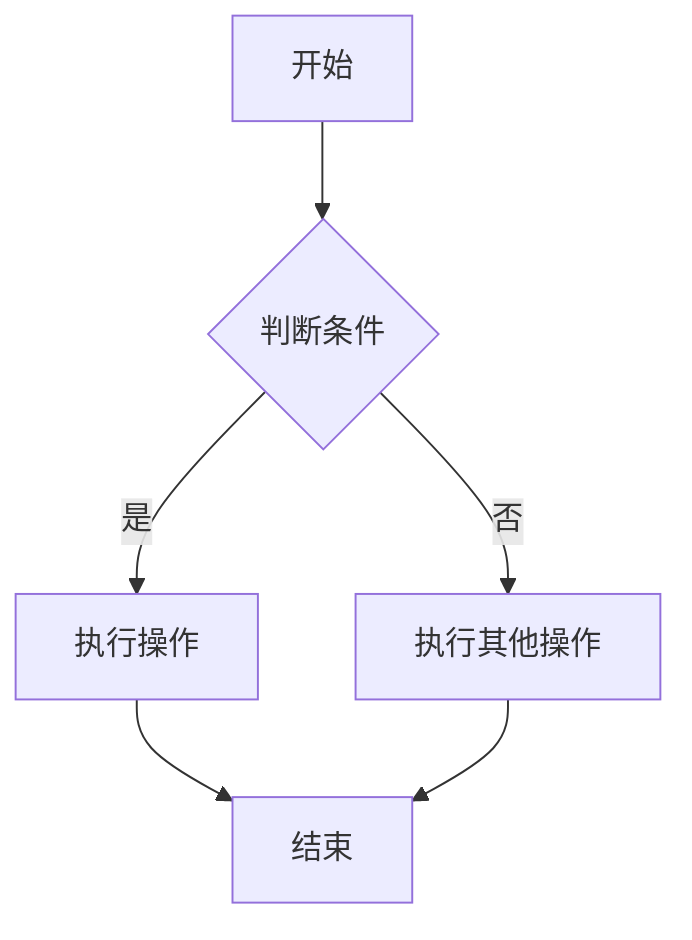
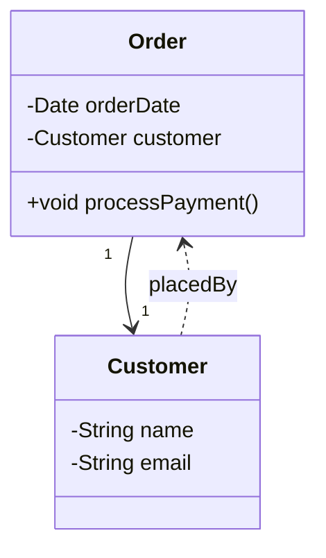

                 

### 全栈技能培养概述

#### 第1章：全栈技能的定义与重要性

##### 1.1 全栈技能的定义

**1.1.1 全栈技能的起源**

全栈技能的起源可以追溯到Web开发的早期。随着互联网的快速发展，前端和后端的界限变得日益模糊。最初，Web开发者主要关注网页设计和静态网页开发，随着技术的进步，网站逐渐变得更加动态和复杂。

**1.1.1.1 从Web开发说起**

在Web开发的早期，开发者通常只关注前端或后端的某一个方面。前端开发者负责创建用户界面和交互，而后端开发者则专注于服务器端逻辑、数据库交互和数据处理。

**1.1.1.2 前端与后端的分离**

随着Web技术的发展，前端和后端的开发逐渐分离。前端使用HTML、CSS和JavaScript等语言来创建用户界面，而后端则使用如Java、Python、Ruby等语言来处理服务器端逻辑和数据存储。

**1.1.1.3 全栈工程师的角色与职责**

全栈工程师是能够独立处理前端和后端开发工作的工程师。他们不仅熟悉前端技术，如HTML、CSS和JavaScript，还精通后端技术，如服务器端编程、数据库管理和网络通信。全栈工程师的角色与职责包括：

- **前端开发**：设计和实现用户界面，确保网页在不同设备和浏览器上的兼容性。
- **后端开发**：构建服务器端应用程序，处理业务逻辑和数据存储。
- **数据库管理**：设计和维护数据库，确保数据的安全性和可靠性。
- **前后端协作**：协调前端和后端的工作，确保系统的整体性能和稳定性。

**1.1.1.3 全栈技能的发展历程**

全栈技能的发展历程经历了几个阶段。最初，全栈技能主要是针对Web开发，但随着技术的发展，全栈技能的应用范围逐渐扩大，包括移动应用开发、云计算、大数据等领域。

##### 1.2 全栈技能的重要性

**1.2.1 企业需求的变化**

随着互联网技术的快速发展，企业对于开发者的要求越来越高。传统的前端和后端开发者已经无法满足企业的需求。企业需要具备全栈技能的工程师，以便更快地开发出高质量的应用程序。

**1.2.1.1 高效开发的迫切需求**

全栈工程师能够独立完成前端和后端开发工作，减少了跨部门协作的复杂性和沟通成本，大大提高了开发效率。

**1.2.1.2 跨部门协作的优势**

全栈工程师能够与前端、后端、数据库等不同部门的人员进行有效沟通，理解他们的需求和痛点，从而更好地协作完成项目。

**1.2.1.3 全栈技能带来的优势**

全栈技能不仅能够提高开发效率，还能带来以下优势：

- **技术视野的拓宽**：全栈工程师能够深入了解前端和后端的技术细节，从而更好地理解整个系统的运作原理。
- **解决复杂问题的能力**：全栈工程师能够从多个角度思考问题，灵活运用不同技术解决复杂问题。

**1.2.1.4 全栈技能的市场需求**

随着企业对于全栈工程师需求的增加，全栈技能的市场需求也在不断上升。具备全栈技能的工程师在就业市场上更具竞争力，更容易找到高薪职位。

##### 1.3 全栈技能的培养路径

**1.3.1 基础阶段**

在基础阶段，全栈工程师需要掌握以下技能：

- **熟悉主流编程语言**：如Python、JavaScript等。
- **掌握数据库知识**：如SQL、NoSQL等。
- **学习前端框架**：如React、Vue等。

**1.3.2 提升阶段**

在提升阶段，全栈工程师需要深入后端开发，学习中间件、微服务等技术。同时，还需要学习前端工程化，如性能优化、框架底层原理等。

**1.3.3 高级阶段**

在高级阶段，全栈工程师需要掌握系统设计与架构、持续集成与部署等技术。他们需要具备解决复杂问题的能力，能够为企业提供高质量的技术解决方案。

---

### 总结

全栈技能的培养是一个长期的过程，需要持续学习和实践。通过逐步掌握前端和后端技术，全栈工程师能够为企业带来高效开发和高质量的应用程序。随着企业对于全栈工程师需求的增加，全栈技能将成为未来IT领域的重要发展方向。

---

**关键词：全栈技能，全栈工程师，前端开发，后端开发，技术视野，市场需求**

**摘要：本文详细介绍了全栈技能的定义、重要性以及培养路径。通过掌握前端和后端技术，全栈工程师能够为企业带来高效开发和高质量的应用程序。**

----------------------------------------------------------------

---

**第二部分：前端开发技能培养**

## 第2章：前端开发技能培养

### 2.1 HTML与CSS基础

#### 2.1.1 HTML基本结构

HTML（HyperText Markup Language）是构建网页的基础语言。一个基本的HTML文档由以下几个部分组成：

- **文档类型声明（Doctype）**：声明文档使用的HTML版本。
- **html标签**：包裹整个HTML文档。
- **head标签**：包含元数据、链接、脚本等。
- **body标签**：包含网页的主要内容。

以下是一个简单的HTML文档示例：

```html
<!DOCTYPE html>
<html lang="en">
<head>
    <meta charset="UTF-8">
    <title>我的网页</title>
</head>
<body>
    <h1>欢迎访问我的网页</h1>
    <p>这是一个段落。</p>
    <a href="https://example.com">访问示例网站</a>
</body>
</html>
```

**2.1.1.1 HTML标签的用法**

HTML标签用于定义网页中的各种元素。常见的HTML标签包括：

- **h1-h6**：标题标签，用于定义不同级别的标题。
- **p**：段落标签，用于定义文本段落。
- **a**：超链接标签，用于定义链接到其他网页或资源的超链接。
- **img**：图像标签，用于在网页中插入图片。
- **form**：表单标签，用于创建用户输入表单。
- **input**：输入标签，用于创建单行文本框、复选框、按钮等。

以下是一个简单的示例，展示了这些标签的用法：

```html
<h1>标题</h1>
<p>这是一个段落。</p>
<a href="https://example.com">访问示例网站</a>

<form>
    <input type="text" placeholder="输入文字">
    <input type="checkbox">同意条款
    <button type="submit">提交</button>
</form>
```

**2.1.1.2 表单标签**

表单是HTML中用于收集用户输入数据的一种形式。表单通常包含以下部分：

- **form标签**：定义表单的整体结构。
- **input标签**：用于定义表单中的输入字段。
- **label标签**：用于定义表单的标签。
- **button标签**：用于定义表单的按钮。

以下是一个简单的表单示例：

```html
<form action="submit.html" method="post">
    <label for="name">姓名：</label>
    <input type="text" id="name" name="name">
    <br>
    <label for="email">邮箱：</label>
    <input type="email" id="email" name="email">
    <br>
    <input type="submit" value="提交">
</form>
```

#### 2.1.2 CSS样式表

CSS（Cascading Style Sheets）用于控制网页的样式和布局。CSS样式可以通过以下几种方式定义：

- **内联样式**：直接在HTML标签中使用style属性定义样式。
- **内部样式表**：在HTML文档的head标签中使用style标签定义样式。
- **外部样式表**：将样式定义保存在一个独立的CSS文件中，并通过link标签引入。

以下是一个简单的CSS示例：

```html
/* 内部样式表 */
h1 {
    color: blue;
    font-size: 24px;
}

/* 外部样式表 */
/* styles.css */
p {
    color: red;
    font-size: 18px;
}
```

**2.1.2.1 CSS选择器**

CSS选择器用于选择并应用样式。常用的选择器包括：

- **标签选择器**：选择所有同种标签的元素。
- **类选择器**：选择具有特定类名的元素。
- **ID选择器**：选择具有特定ID的元素。

以下是一个简单的CSS选择器示例：

```css
/* 标签选择器 */
h1 {
    color: blue;
}

/* 类选择器 */
.warning {
    color: red;
}

/* ID选择器 */
#alert {
    color: yellow;
}
```

**2.1.2.2 CSS布局**

CSS布局用于定义网页的布局结构。常用的布局方式包括：

- **流布局**：根据文档流自动排列元素。
- **弹性布局**：使用flexbox布局模型自动调整元素大小和位置。
- **响应式布局**：根据不同设备和屏幕大小自动调整布局。

以下是一个简单的响应式布局示例：

```css
/* 流布局 */
.container {
    display: flex;
    justify-content: space-between;
}

/* 弹性布局 */
.flex-container {
    display: flex;
    flex-direction: column;
}

/* 响应式布局 */
@media (max-width: 600px) {
    .container {
        flex-direction: column;
    }
}
```

### 2.2 JavaScript核心概念

JavaScript是一种用于网页交互和客户端编程的脚本语言。JavaScript的核心概念包括：

- **基本语法**：包括变量、数据类型、控制结构等。
- **函数与对象**：包括函数定义、函数调用、对象创建与访问等。

#### 2.2.1 基本语法

**2.2.1.1 数据类型**

JavaScript有基本数据类型和复杂数据类型两种。基本数据类型包括：

- **字符串（String）**：用于表示文本。
- **数字（Number）**：用于表示数值。
- **布尔值（Boolean）**：用于表示真或假。
- **undefined**：表示未定义的值。
- **null**：表示空值。

以下是一个简单的数据类型示例：

```javascript
let name = "张三"; // 字符串
let age = 25; // 数字
let isStudent = true; // 布尔值
let score = undefined; // undefined
let empty = null; // null
```

**2.2.1.2 控制结构**

JavaScript的控制结构包括：

- **顺序结构**：按照代码的顺序依次执行。
- **选择结构**：根据条件的真假执行不同的代码。
- **循环结构**：重复执行一段代码。

以下是一个简单的控制结构示例：

```javascript
// 顺序结构
console.log("顺序结构开始");
console.log("第一步");
console.log("第二步");
console.log("顺序结构结束");

// 选择结构
if (age >= 18) {
    console.log("已满18岁");
} else {
    console.log("未满18岁");
}

// 循环结构
for (let i = 1; i <= 5; i++) {
    console.log(i);
}
```

#### 2.2.2 函数与对象

**2.2.2.1 函数定义与调用**

JavaScript中的函数可以通过函数声明和函数表达式两种方式定义。

- **函数声明**：使用function关键字定义函数。

```javascript
function greet() {
    console.log("Hello!");
}
```

- **函数表达式**：将函数定义为一个变量。

```javascript
let greet = function() {
    console.log("Hello!");
};
```

函数的调用方法如下：

```javascript
greet(); // 调用函数
```

**2.2.2.2 对象的基本用法**

JavaScript中的对象是一种复合数据类型，用于表示具有属性和方法的数据结构。

- **对象创建**：使用字面量语法创建对象。

```javascript
let person = {
    name: "张三",
    age: 25,
    greet: function() {
        console.log("Hello, " + this.name + "!");
    }
};
```

- **对象访问**：使用点符号或方括号访问对象的属性和方法。

```javascript
console.log(person.name); // 访问属性
person.greet(); // 调用方法
```

### 2.3 前端框架应用

随着前端开发的发展，各种前端框架如雨后春笋般出现。其中，React和Vue是当前最流行的两个前端框架。本节将介绍这两个框架的基础知识。

#### 2.3.1 React基础

React是由Facebook开发的一个用于构建用户界面的JavaScript库。React的核心概念包括：

- **组件**：React的基本构建块，用于封装可重用的UI逻辑。
- **JSX**：一种JavaScript语法扩展，用于描述UI结构。

**2.3.1.1 React组件**

React组件是一种函数或类，用于定义UI的一部分。组件可以接受属性（props）并返回一个React元素。

- **函数组件**：使用函数定义的组件。

```javascript
function Greeting(props) {
    return <h1>Hello, {props.name}!</h1>;
}
```

- **类组件**：使用ES6类定义的组件。

```javascript
class Greeting extends React.Component {
    render() {
        return <h1>Hello, {this.props.name}!</h1>;
    }
}
```

**2.3.1.2 JSX语法**

JSX是一种类似于HTML的语法，用于描述React组件的结构。JSX代码会被Babel编译器转换为普通的JavaScript代码。

```javascript
const element = <h1>Hello, world!</h1>;
```

**2.3.1.3 JSX在React中的应用**

JSX可以在React组件中使用，用于定义UI结构。

```javascript
function App() {
    return (
        <div>
            <Greeting name="张三" />
            <Greeting name="李四" />
        </div>
    );
}
```

#### 2.3.2 Vue基础

Vue是由尤雨溪开发的一个用于构建用户界面的JavaScript框架。Vue的核心概念包括：

- **Vue实例**：用于创建和操作Vue应用程序。
- **组件**：Vue的基本构建块，用于封装可重用的UI逻辑。

**2.3.2.1 Vue实例**

Vue实例是Vue应用程序的核心。通过new Vue()创建Vue实例。

```javascript
new Vue({
    el: '#app',
    data: {
        message: 'Hello, Vue!'
    }
});
```

**2.3.2.2 Vue组件**

Vue组件是一种可复用的Vue实例，用于定义UI的一部分。组件可以接受属性（props）并返回一个Vue元素。

```vue
<template>
    <div>
        <h1>Hello, {{ name }}!</h1>
    </div>
</template>

<script>
export default {
    props: ['name']
};
</script>
```

---

通过以上对HTML、CSS和JavaScript基础知识的介绍，以及对React和Vue前端框架的简要介绍，我们可以更好地理解和掌握前端开发的技能。接下来，我们将进一步深入探讨前端工程化、性能优化和框架底层原理等方面的内容。

---

**参考文献：**

1. MDN Web Docs, HTML: <https://developer.mozilla.org/en-US/docs/Web/HTML>
2. W3Schools, CSS: <https://www.w3schools.com/css/>
3. Mozilla Developer Network, JavaScript: <https://developer.mozilla.org/en-US/docs/Web/JavaScript>
4. ReactJS, Official Documentation: <https://reactjs.org/docs/getting-started.html>
5. Vue.js, Official Documentation: <https://vuejs.org/v2/guide/>### 第3章：后端开发技能培养

#### 3.1 后端开发基础

后端开发是构建网站和应用程序的核心，负责处理服务器端逻辑、数据存储和业务逻辑实现。后端开发通常涉及以下几个关键组成部分：

- **服务器端编程**：服务器端编程用于处理客户端发送的请求，并在服务器端执行相应的业务逻辑。
- **数据库管理**：数据库用于存储和管理应用程序的数据。
- **API设计**：API（应用程序编程接口）用于定义应用程序与外部系统或其他应用程序之间的交互方式。
- **安全性**：确保应用程序的安全性，防止恶意攻击和数据泄露。

**3.1.1 服务器端编程**

服务器端编程是后端开发的基础。常见的后端编程语言包括Java、Python、Ruby、PHP、Node.js等。以下是一些流行的后端框架：

- **Java**：Spring Boot、Java EE
- **Python**：Django、Flask、FastAPI
- **Ruby**：Ruby on Rails
- **PHP**：Laravel、Symfony
- **Node.js**：Express.js、Koa.js

**3.1.2 数据库管理**

数据库是后端开发的重要组成部分。常用的数据库类型包括关系型数据库（如MySQL、PostgreSQL）和非关系型数据库（如MongoDB、Redis）。数据库的选择取决于应用程序的需求和数据特性。

- **关系型数据库**：适合处理结构化数据，支持复杂查询和事务。
- **非关系型数据库**：适合处理大规模的分布式数据存储，支持高并发和灵活的数据模型。

**3.1.3 API设计**

API设计是后端开发的重要环节。良好的API设计能够提高应用程序的可扩展性和可维护性。以下是一些API设计原则：

- **RESTful架构**：使用标准的HTTP方法（GET、POST、PUT、DELETE）来处理资源。
- **统一资源标识符（URI）**：使用清晰的URI来表示资源的唯一标识。
- **响应结构**：返回易于解析的响应结构，如JSON格式。
- **状态码**：使用适当的HTTP状态码来表示请求的结果。

**3.1.4 安全性**

安全性是后端开发的关键考量因素。以下是一些常见的安全措施：

- **身份验证和授权**：使用OAuth、JWT（JSON Web Tokens）等机制进行用户身份验证和授权。
- **数据加密**：对敏感数据进行加密，如用户密码、信用卡信息等。
- **输入验证**：对用户输入进行严格验证，防止SQL注入、XSS攻击等安全漏洞。
- **会话管理**：使用安全的会话管理机制，如HTTPS、Cookie安全等。

#### 3.2 后端框架应用

随着后端开发技术的发展，各种后端框架不断涌现。以下介绍几种流行的后端框架及其特点：

- **Django（Python）**：Django是一个高层次的Python Web框架，遵循MVC（模型-视图-控制器）设计模式。它提供了自动化的表单处理、ORM（对象关系映射）、缓存等功能。
- **Flask（Python）**：Flask是一个轻量级的Python Web框架，适合构建简单的Web应用程序。它不包含Django那样的自动化的功能，但提供了更大的灵活性和扩展性。
- **Spring Boot（Java）**：Spring Boot是一个基于Spring框架的轻量级Web框架，简化了Spring应用的配置和部署。它提供了自动配置、依赖注入、事务管理等特性。
- **Laravel（PHP）**：Laravel是一个现代化的PHP Web框架，遵循MVC设计模式。它提供了丰富的功能，如ORM、路由、中间件、队列等，以及一套完整的开发工具。
- **Express.js（Node.js）**：Express.js是一个Node.js的Web应用程序框架，提供了丰富的路由处理、中间件支持、请求处理等功能。它是构建Node.js应用程序的常用框架。

**3.2.1 框架选择**

选择合适的后端框架取决于项目需求和开发团队的技术栈。以下是一些选择后端框架的考虑因素：

- **项目需求**：考虑项目的规模、性能要求、功能需求等。
- **开发团队**：考虑团队成员的技能和经验，选择适合团队的框架。
- **社区支持**：选择有活跃社区和丰富文档的框架，便于学习和解决问题。
- **扩展性**：选择能够支持未来扩展和升级的框架。

#### 3.3 中间件与微服务

随着应用程序的复杂度增加，中间件和微服务架构成为了后端开发的趋势。以下介绍中间件和微服务的基本概念和应用。

**3.3.1 中间件**

中间件是一种用于扩展和应用服务的软件层，位于应用程序和操作系统之间。它提供了通用的功能，如身份验证、日志记录、路由、缓存等。常见的中间件包括：

- **身份验证中间件**：如OAuth、JWT等，用于保护应用程序的安全。
- **日志中间件**：如Log4j、Nginx日志等，用于记录应用程序的运行日志。
- **路由中间件**：如Express.js的中间件，用于处理HTTP请求的路由。
- **缓存中间件**：如Redis、Memcached等，用于加速数据访问和提高性能。

**3.3.2 微服务**

微服务是一种基于独立组件的应用程序架构，每个组件负责完成一个特定的业务功能。微服务具有以下特点：

- **独立性**：每个微服务都是独立的，可以单独部署和扩展。
- **分布式**：微服务运行在分布式系统中，通过网络通信进行协同工作。
- **可扩展性**：可以根据需求独立扩展某个微服务的实例数量。
- **灵活性**：微服务可以使用不同的编程语言和框架进行开发。

微服务架构的应用场景包括：

- **大规模应用**：适合处理大规模、复杂的业务系统。
- **高并发场景**：适合处理高并发、分布式访问的应用场景。
- **技术栈多样性**：适合使用不同技术栈开发不同的微服务。

**3.3.3 微服务与中间件的关系**

中间件提供了微服务架构所需的基础设施和服务，如身份验证、日志记录、路由等。微服务架构中，各个微服务通过中间件进行通信和协作。中间件可以简化微服务的开发、部署和维护，提高系统的整体性能和可维护性。

---

通过以上对后端开发基础的介绍，以及对后端框架、中间件和微服务架构的探讨，我们可以更好地理解和掌握后端开发的技能。接下来，我们将进一步深入探讨前端工程化、性能优化和框架底层原理等方面的内容。

---

**参考文献：**

1. W3Schools, Backend Development: <https://www.w3schools.com/server SIDE/>
2. Django, Official Documentation: <https://www.djangoproject.com/>
3. Flask, Official Documentation: <https://flask.palletsprojects.com/>
4. Spring Boot, Official Documentation: <https://docs.spring.io/spring-boot/docs/current/reference/html/index.html>
5. Laravel, Official Documentation: <https://laravel.com/docs>
6. Express.js, Official Documentation: <https://expressjs.com/>
7. Redis, Official Documentation: <https://redis.io/>
8. Memcached, Official Documentation: <https://memcached.org/>
9. Microservices, Official Documentation: <https://microservices.io/>### 第4章：前端工程化与性能优化

#### 4.1 前端工程化概述

前端工程化是指通过一系列的工具和流程，提高前端开发效率和代码质量，使前端开发更加规范化和系统化。前端工程化的目标包括：

- **自动化构建**：通过构建工具（如Webpack、Gulp等）自动处理静态资源（如HTML、CSS、JavaScript等）的打包、压缩、合并等任务。
- **模块化管理**：使用模块化技术（如CommonJS、AMD、ES6 Module等）组织和管理代码，提高代码的可复用性和可维护性。
- **代码风格统一**：使用代码格式化工具（如ESLint、Prettier等）统一代码风格，减少代码冲突和错误。
- **性能优化**：通过性能优化策略（如懒加载、代码分割、缓存等）提高应用程序的加载速度和性能。

**4.1.1 前端工程化的优点**

前端工程化带来了以下优点：

- **提高开发效率**：通过自动化构建和代码格式化，减少重复性劳动，提高开发效率。
- **保证代码质量**：通过代码规范和单元测试，保证代码质量，减少错误和缺陷。
- **易于维护**：通过模块化和组件化，使代码更加清晰和可维护，方便团队协作。
- **提高性能**：通过性能优化策略，加快应用程序的加载速度和响应时间。

**4.1.2 前端工程化的工具链**

前端工程化的工具链包括以下主要组成部分：

- **构建工具**：如Webpack、Gulp等，用于自动化处理静态资源的打包和编译。
- **模块化工具**：如Babel、Webpack等，用于将ES6代码转换为浏览器兼容的代码。
- **代码格式化工具**：如ESLint、Prettier等，用于统一代码风格和格式。
- **性能优化工具**：如Webpack、Fastlane等，用于优化应用程序的性能。

#### 4.2 前端性能优化

前端性能优化是提高用户体验和网站性能的重要手段。以下是一些常见的前端性能优化策略：

**4.2.1 资源加载优化**

资源加载优化是前端性能优化的关键。以下是一些常见的资源加载优化策略：

- **懒加载**：将不在视口内的图片、视频等资源延迟加载，减少初始加载时间。
- **代码分割**：将大型JavaScript文件分割成多个小块，按需加载，减少初始加载时间。
- **内容分发网络（CDN）**：使用CDN将静态资源分发到全球各地的节点，提高访问速度。
- **缓存**：使用HTTP缓存策略，如Cache-Control和ETag，使浏览器缓存静态资源，减少重复请求。

**4.2.2 JavaScript性能优化**

JavaScript是前端性能优化的重点。以下是一些常见的JavaScript性能优化策略：

- **减少全局变量**：避免使用全局变量，减少变量查找范围，提高代码执行速度。
- **减少DOM操作**：减少DOM操作次数，使用文档碎片（DocumentFragment）批量更新DOM，减少浏览器渲染的开销。
- **事件委托**：使用事件委托减少事件监听器的数量，提高事件处理效率。
- **代码压缩和混淆**：使用代码压缩和混淆工具，减少JavaScript文件的大小，提高加载速度。

**4.2.3 CSS性能优化**

CSS性能优化同样重要。以下是一些常见的CSS性能优化策略：

- **减少CSS选择器长度**：避免使用过于复杂的CSS选择器，减少浏览器解析CSS的时间。
- **使用CSS精灵**：将多个图片合并为一张图，使用背景定位和裁剪，减少HTTP请求次数。
- **使用CSS预处理器**：如Sass、LESS等，提高CSS代码的可维护性和复用性。
- **减少重绘和回流**：避免使用影响布局和显示的CSS属性，减少浏览器重绘和回流次数。

#### 4.3 前端框架底层原理

理解前端框架的底层原理有助于我们更好地优化和使用前端框架。以下介绍几种常见的前端框架底层原理：

**4.3.1 React**

React是Facebook开发的一个用于构建用户界面的JavaScript库。React的核心原理包括：

- **虚拟DOM**：React使用虚拟DOM来减少实际DOM操作，提高性能。虚拟DOM是一种内存中的数据结构，用于表示实际的DOM结构。当数据发生变化时，React会根据虚拟DOM与实际DOM的差异，进行批量的DOM操作。
- **组件化**：React采用组件化的思想，将UI拆分成多个可复用的组件。每个组件都有自己的状态和逻辑，可以通过Props进行数据传递。

**4.3.2 Vue**

Vue是由尤雨溪开发的一个用于构建用户界面的JavaScript框架。Vue的核心原理包括：

- **响应式数据绑定**：Vue通过观察者模式实现响应式数据绑定。当数据发生变化时，Vue会自动更新相关的视图。
- **虚拟DOM**：Vue也使用虚拟DOM来提高性能。当数据发生变化时，Vue会根据虚拟DOM与实际DOM的差异，进行批量的DOM操作。
- **组件系统**：Vue提供了丰富的组件系统，支持组件化开发。Vue组件具有独立的属性、方法和生命周期。

**4.3.3 Angular**

Angular是由Google开发的一个用于构建动态Web应用程序的前端框架。Angular的核心原理包括：

- **双向数据绑定**：Angular通过双向数据绑定实现数据和视图的同步。当数据发生变化时，Angular会自动更新视图，反之亦然。
- **依赖注入**：Angular使用依赖注入（DI）来管理组件之间的依赖关系，提高代码的可维护性和可测试性。
- **模块化**：Angular采用模块化的设计，将应用程序拆分为多个模块，便于管理和维护。

---

通过以上对前端工程化和性能优化策略的介绍，以及对React、Vue和Angular等前端框架底层原理的探讨，我们可以更好地理解和掌握前端开发的技能。前端工程化和性能优化不仅能够提高开发效率和代码质量，还能为用户提供更好的体验。在接下来的章节中，我们将进一步探讨系统设计与架构设计的相关内容。

---

**参考文献：**

1. React, Official Documentation: <https://reactjs.org/docs/getting-started.html>
2. Vue.js, Official Documentation: <https://vuejs.org/v2/guide/>
3. Angular, Official Documentation: <https://angular.io/docs>
4. Webpack, Official Documentation: <https://webpack.js.org/>
5. Gulp, Official Documentation: <https://gulpjs.com/>
6. Babel, Official Documentation: <https://babeljs.io/>
7. ESLint, Official Documentation: <https://eslint.org/>
8. Prettier, Official Documentation: <https://prettier.io/>
9. Lighthouse, Performance Optimization: <https://developers.google.com/web/tools/lighthouse/>
10. Web Performance, Official Documentation: <https://web.dev/>### 第5章：系统设计与架构设计

#### 5.1 系统设计与架构设计概述

系统设计与架构设计是软件开发过程中至关重要的环节。系统设计关注系统的功能模块划分、数据流程和接口设计等；而架构设计则关注系统的整体架构设计，包括技术选型、服务拆分、分布式系统设计等。以下是对系统设计与架构设计的基本概述：

**5.1.1 系统设计**

系统设计是指定义系统的各个组成部分以及它们之间的关系，以确保系统能够满足需求并高效运行。系统设计的关键内容包括：

- **需求分析**：了解并明确系统的业务需求和用户需求。
- **功能模块划分**：将系统拆分为多个功能模块，每个模块负责特定的功能。
- **数据流程设计**：定义系统内部的数据流和交互方式。
- **接口设计**：设计系统内部以及与其他系统交互的接口。

**5.1.2 架构设计**

架构设计则关注系统的整体结构和技术架构，确保系统能够在高并发、高可用、易扩展等方面表现出色。架构设计的关键内容包括：

- **技术选型**：选择适合系统需求的技术栈，如编程语言、框架、数据库等。
- **服务拆分**：将系统拆分为多个独立的服务，每个服务负责特定的功能，提高系统的可维护性和可扩展性。
- **分布式系统设计**：设计分布式系统架构，处理高并发和分布式数据存储等问题。
- **安全性设计**：确保系统的数据安全性和运行安全。

#### 5.2 系统设计与架构设计的工具和方法

在进行系统设计与架构设计时，常用的工具和方法包括：

- **Mermaid**：用于绘制流程图、类图和序列图等，方便描述系统架构和流程。
- **UML（Unified Modeling Language）**：用于描述系统的静态结构和动态行为，包括类图、序列图、组件图等。
- **设计模式**：如MVC、MVVM、微服务设计模式等，用于指导系统设计与架构设计。
- **领域驱动设计（DDD）**：将领域模型作为核心，指导系统设计与架构设计。

**5.2.1 Mermaid应用**

Mermaid是一种基于Markdown的图形描述语言，可以方便地绘制流程图、类图和序列图等。以下是一个简单的Mermaid示例：



**5.2.2 UML应用**

UML（统一建模语言）是一种用于描述软件系统的标准建模语言。以下是一个简单的UML类图示例：

```mermaid
classDiagram
    class Person {
        -String name
        -int age
        +void introduce()
    }
    class Student <.. Person
    class Teacher <.. Person
```

**5.2.3 设计模式应用**

设计模式是一套经过时间验证的软件设计解决方案，用于解决常见的设计问题。以下是一些常见的设计模式：

- **MVC（模型-视图-控制器）**：将系统分为模型、视图和控制器三个部分，分别负责数据、显示和业务逻辑。
- **MVVM（模型-视图-视图模型）**：与MVC类似，但引入了视图模型，用于处理视图和模型之间的交互。
- **微服务设计模式**：将系统拆分为多个微服务，每个服务负责独立的功能模块，通过API进行交互。

**5.2.4 领域驱动设计（DDD）应用**

领域驱动设计（DDD）是一种面向领域的设计方法，强调将领域模型作为核心。DDD的关键概念包括：

- **领域模型**：定义系统的核心领域和业务规则。
- **实体与值对象**：实体具有唯一标识，可以持久化；值对象则没有唯一标识，不能持久化。
- **聚合与边界**：聚合是一组相关实体的集合，具有明确的边界。
- **领域服务**：用于处理领域事件和业务规则。

以下是一个简单的DDD模型示例：



---

通过以上对系统设计与架构设计的基本概念、工具和方法以及实际应用示例的介绍，我们可以更好地理解和掌握系统设计与架构设计的相关技能。在接下来的章节中，我们将进一步探讨持续集成与部署以及最佳实践等内容。

---

**参考文献：**

1. Mermaid, Official Documentation: <https://mermaid-js.github.io/mermaid/>
2. UML, Official Documentation: <https://www.uml-diagrams.org/>
3. Design Patterns: Elements of Reusable Object-Oriented Software, by Erich Gamma, Richard Helm, Ralph Johnson, and John Vlissides
4. Domain-Driven Design: Tackling Complexity in the Heart of Software, by Eric Evans
5. MVC, Official Documentation: <https://en.wikipedia.org/wiki/Model%E2%80%93view%E2%80%93controller>
6. MVVM, Official Documentation: <https://en.wikipedia.org/wiki/Model%E2%80%93view%E2%80%93viewmodel>
7. Microservices, Official Documentation: <https://microservices.io/>### 第6章：持续集成与部署

#### 6.1 持续集成（CI）概述

持续集成（CI）是一种软件开发实践，通过频繁地合并代码和自动化测试，确保代码库中的代码质量。持续集成的主要目标是快速发现和解决代码中的问题，提高开发效率和软件质量。

**6.1.1 持续集成的核心概念**

持续集成的核心概念包括：

- **自动化测试**：自动化测试是持续集成的重要组成部分，包括单元测试、集成测试和端到端测试等。
- **持续部署（CD）**：持续部署是持续集成的延伸，通过自动化流程将代码部署到生产环境。
- **代码审查**：代码审查是确保代码质量的重要环节，通过同行评审发现潜在的问题。

**6.1.2 持续集成的好处**

持续集成带来了以下好处：

- **提高代码质量**：通过自动化测试和代码审查，确保代码的稳定性和可靠性。
- **加快开发速度**：通过频繁的集成和测试，减少代码的积压和等待时间。
- **提高团队协作效率**：通过自动化流程和明确的代码规范，提高团队协作效率。

#### 6.2 持续集成工具

在实际应用中，有多种持续集成工具可供选择。以下是一些流行的持续集成工具：

- **Jenkins**：Jenkins是一个开源的持续集成工具，支持多种插件，易于配置和使用。
- **Travis CI**：Travis CI是一个基于云的持续集成服务，支持多种编程语言，可自动执行测试和部署。
- **CircleCI**：CircleCI是一个基于云的持续集成服务，提供高效、可靠的自动化流程。
- **GitLab CI**：GitLab CI是GitLab的一部分，通过配置`.gitlab-ci.yml`文件，实现自动化测试和部署。

**6.2.1 Jenkins应用**

Jenkins是一个功能强大的开源持续集成工具，适用于各种规模的项目。以下是一个简单的Jenkins配置示例：

```yaml
# Jenkinsfile
pipeline {
    agent any

    stages {
        stage('Build') {
            steps {
                sh 'mvn clean package'
            }
        }
        stage('Test') {
            steps {
                sh 'mvn test'
            }
        }
        stage('Deploy') {
            steps {
                sh 'mvn install'
            }
        }
    }
}
```

**6.2.2 GitLab CI应用**

GitLab CI是GitLab的一部分，通过在项目仓库中创建`.gitlab-ci.yml`文件，定义自动化测试和部署流程。以下是一个简单的GitLab CI配置示例：

```yaml
# .gitlab-ci.yml
image: maven:3.6.3-jdk-11

stages:
  - build
  - test
  - deploy

build:
  stage: build
  script:
    - mvn clean package

test:
  stage: test
  script:
    - mvn test

deploy:
  stage: deploy
  script:
    - mvn install
```

#### 6.3 持续部署（CD）

持续部署（CD）是通过自动化流程将代码部署到生产环境的过程。持续部署的目标是快速、可靠地将代码更新部署到生产环境，减少手动操作和风险。

**6.3.1 持续部署的好处**

持续部署带来了以下好处：

- **加快交付速度**：通过自动化流程，减少手动操作和等待时间，加快交付速度。
- **提高生产效率**：自动化部署减少错误和故障，提高生产效率。
- **降低成本**：减少手动操作和部署时间，降低成本。

**6.3.2 持续部署的工具**

以下是一些流行的持续部署工具：

- **Docker**：Docker是一个用于容器化的工具，可将应用程序及其依赖项打包为一个容器，方便部署和迁移。
- **Kubernetes**：Kubernetes是一个用于容器编排的开源平台，可用于自动化部署、扩展和管理容器化应用程序。
- **Kubernetes Deployments**：Kubernetes Deployments是一种资源对象，用于管理容器的部署和扩展。
- **Jenkins Deployments**：Jenkins Deployments插件可用于将Jenkins与Kubernetes集成，实现自动化部署。

**6.3.3 Kubernetes部署示例**

以下是一个简单的Kubernetes部署示例，使用YAML文件定义部署：

```yaml
# deployment.yaml
apiVersion: apps/v1
kind: Deployment
metadata:
  name: my-app
spec:
  replicas: 3
  selector:
    matchLabels:
      app: my-app
  template:
    metadata:
      labels:
        app: my-app
    spec:
      containers:
      - name: my-app
        image: my-app:latest
        ports:
        - containerPort: 8080
```

---

通过以上对持续集成与部署的基本概念、工具和应用示例的介绍，我们可以更好地理解和掌握持续集成与部署的相关技能。在接下来的章节中，我们将进一步探讨项目实战和最佳实践等内容。

---

**参考文献：**

1. Jenkins, Official Documentation: <https://www.jenkins.io/>
2. GitLab CI, Official Documentation: <https://docs.gitlab.com/ee/ci/>
3. Docker, Official Documentation: <https://docs.docker.com/>
4. Kubernetes, Official Documentation: <https://kubernetes.io/docs/>
5. Kubernetes Deployments, Official Documentation: <https://kubernetes.io/docs/concepts/workloads/controllers/deployment/>
6. Jenkins Deployments Plugin, Official Documentation: <https://plugins.jenkins.io/kubernetes-deploy/>### 第7章：项目实战

#### 7.1 实战背景

本节将介绍一个简单的Web应用程序项目实战，该应用程序是一个基于Vue.js和Node.js的博客系统。项目主要功能包括：

- 用户注册与登录
- 博客文章展示
- 博客文章发布与编辑
- 评论功能

#### 7.2 环境安装

为了完成这个项目，我们需要安装以下工具和库：

1. **Node.js**：版本8.0.0及以上
2. **npm**：Node.js的包管理工具
3. **Vue CLI**：Vue.js的命令行工具
4. **Vue**：Vue.js库
5. **Vue Router**：Vue.js的路由管理库
6. **Vuex**：Vue.js的状态管理库
7. **axios**：HTTP客户端库
8. **Element UI**：Vue.js的UI组件库
9. **MongoDB**：NoSQL数据库

安装步骤如下：

1. 安装Node.js和npm：
   ```bash
   # 从官方网站下载并安装Node.js
   # 验证安装：
   node -v
   npm -v
   ```

2. 安装Vue CLI：
   ```bash
   npm install -g @vue/cli
   ```

3. 创建一个新的Vue项目：
   ```bash
   vue create blog-app
   ```

4. 安装所需的库：
   ```bash
   cd blog-app
   npm install vue-router vuex axios element-ui
   ```

5. 安装MongoDB并启动服务：
   ```bash
   # 从官方网站下载并安装MongoDB
   # 启动MongoDB服务：
   mongod --dbpath /your/mongodb/data/directory
   ```

#### 7.3 系统核心实现

**7.3.1 后端实现**

后端使用Node.js和Express.js框架。以下是后端的核心实现：

1. **数据库连接**：
   ```javascript
   const mongoose = require('mongoose');
   mongoose.connect('mongodb://localhost:27017/blog', { useNewUrlParser: true, useUnifiedTopology: true });
   ```

2. **用户模型**：
   ```javascript
   const bcrypt = require('bcryptjs');
   const UserSchema = new mongoose.Schema({
     username: { type: String, required: true, unique: true },
     email: { type: String, required: true, unique: true },
     password: { type: String, required: true }
   });
   
   UserSchema.pre('save', async function(next) {
     if (this.isModified('password')) {
       this.password = await bcrypt.hash(this.password, 8);
     }
     next();
   });
   
   const User = mongoose.model('User', UserSchema);
   ```

3. **文章模型**：
   ```javascript
   const ArticleSchema = new mongoose.Schema({
     title: { type: String, required: true },
     content: { type: String, required: true },
     author: { type: mongoose.Schema.Types.ObjectId, ref: 'User' },
     createdAt: { type: Date, default: Date.now }
   });
   
   const Article = mongoose.model('Article', ArticleSchema);
   ```

4. **用户注册与登录**：
   ```javascript
   app.post('/register', async (req, res) => {
     try {
       const { username, email, password } = req.body;
       const user = new User({ username, email, password });
       await user.save();
       res.status(201).send('User registered successfully!');
     } catch (error) {
       res.status(400).send(error);
     }
   });
   
   app.post('/login', async (req, res) => {
     try {
       const { email, password } = req.body;
       const user = await User.findOne({ email });
       if (!user || !(await bcrypt.compare(password, user.password))) {
         return res.status(401).send('Invalid email or password!');
       }
       res.status(200).send('Login successful!');
     } catch (error) {
       res.status(500).send(error);
     }
   });
   ```

5. **文章展示**：
   ```javascript
   app.get('/articles', async (req, res) => {
     try {
       const articles = await Article.find().populate('author');
       res.status(200).send(articles);
     } catch (error) {
       res.status(500).send(error);
     }
   });
   ```

**7.3.2 前端实现**

前端使用Vue.js和Vue Router。以下是前端的核心实现：

1. **路由配置**：
   ```javascript
   import Vue from 'vue';
   import VueRouter from 'vue-router';
   import Home from './views/Home.vue';
   import Login from './views/Login.vue';
   import Articles from './views/Articles.vue';
   import Article from './views/Article.vue';
   
   Vue.use(VueRouter);
   
   const routes = [
     { path: '/', component: Home },
     { path: '/login', component: Login },
     { path: '/articles', component: Articles },
     { path: '/articles/:id', component: Article }
   ];
   
   const router = new VueRouter({
     routes
   });
   
   export default router;
   ```

2. **登录页面**：
   ```vue
   <template>
     <div>
       <h1>Login</h1>
       <form @submit.prevent="login">
         <input type="email" v-model="email" placeholder="Email" required />
         <input type="password" v-model="password" placeholder="Password" required />
         <button type="submit">Login</button>
       </form>
     </div>
   </template>
   
   <script>
   export default {
     data() {
       return {
         email: '',
         password: ''
       };
     },
     methods: {
       async login() {
         try {
           const response = await axios.post('/login', { email: this.email, password: this.password });
           if (response.status === 200) {
             this.$router.push('/articles');
           }
         } catch (error) {
           console.error(error);
         }
       }
     }
   };
   </script>
   ```

3. **文章列表页面**：
   ```vue
   <template>
     <div>
       <h1>Articles</h1>
       <ul>
         <li v-for="article in articles" :key="article._id">
           <router-link :to="`/articles/${article._id}`">{{ article.title }}</router-link>
         </li>
       </ul>
     </div>
   </template>
   
   <script>
   export default {
     data() {
       return {
         articles: []
       };
     },
     created() {
       this.fetchArticles();
     },
     methods: {
       async fetchArticles() {
         try {
           const response = await axios.get('/articles');
           this.articles = response.data;
         } catch (error) {
           console.error(error);
         }
       }
     }
   };
   </script>
   ```

4. **文章详情页面**：
   ```vue
   <template>
     <div>
       <h1>{{ article.title }}</h1>
       <p>{{ article.content }}</p>
       <p>Author: {{ article.author.username }}</p>
     </div>
   </template>
   
   <script>
   export default {
     data() {
       return {
         article: {}
       };
     },
     created() {
       this.fetchArticle();
     },
     methods: {
       async fetchArticle() {
         try {
           const { id } = this.$route.params;
           const response = await axios.get(`/articles/${id}`);
           this.article = response.data;
         } catch (error) {
           console.error(error);
         }
       }
     }
   };
   </script>
   ```

---

通过以上对项目的环境安装、系统核心实现以及前端实现的具体讲解，我们可以逐步构建一个简单的博客系统。在接下来的章节中，我们将进一步分析和解读项目中的关键代码，并进行实际案例剖析。

---

**参考文献：**

1. Vue.js, Official Documentation: <https://vuejs.org/>
2. Node.js, Official Documentation: <https://nodejs.org/>
3. Express.js, Official Documentation: <https://expressjs.com/>
4. MongoDB, Official Documentation: <https://www.mongodb.com/>
5. Mongoose, Official Documentation: <https://mongoosejs.com/>### 第8章：代码应用解读与分析

#### 8.1 代码应用解读

在博客系统的开发过程中，我们使用了多种技术和框架，以下是对关键代码的解读和分析。

**8.1.1 后端代码解读**

后端代码主要使用了Node.js和Express.js框架，实现了用户注册与登录、文章展示等功能。

1. **用户注册与登录**

用户注册使用了bcrypt库对密码进行加密存储，增强了安全性。注册路由如下：

```javascript
app.post('/register', async (req, res) => {
  try {
    const { username, email, password } = req.body;
    const user = new User({ username, email, password });
    await user.save();
    res.status(201).send('User registered successfully!');
  } catch (error) {
    res.status(400).send(error);
  }
});
```

登录路由通过对比用户输入的密码和数据库中存储的加密密码，实现了用户身份验证：

```javascript
app.post('/login', async (req, res) => {
  try {
    const { email, password } = req.body;
    const user = await User.findOne({ email });
    if (!user || !(await bcrypt.compare(password, user.password))) {
      return res.status(401).send('Invalid email or password!');
    }
    res.status(200).send('Login successful!');
  } catch (error) {
    res.status(500).send(error);
  }
});
```

2. **文章展示**

文章展示功能通过RESTful API实现，获取所有文章的列表。以下是相关代码：

```javascript
app.get('/articles', async (req, res) => {
  try {
    const articles = await Article.find().populate('author');
    res.status(200).send(articles);
  } catch (error) {
    res.status(500).send(error);
  }
});
```

这里使用了Mongoose的`populate`方法，将文章的作者信息关联查询，以便在前端展示。

**8.1.2 前端代码解读**

前端代码使用了Vue.js框架，以及Vue Router和Vuex进行状态管理。以下是对关键部分的解读。

1. **登录页面**

登录页面通过axios发送登录请求到后端，实现用户登录功能。以下是相关代码：

```vue
<template>
  <div>
    <h1>Login</h1>
    <form @submit.prevent="login">
      <input type="email" v-model="email" placeholder="Email" required />
      <input type="password" v-model="password" placeholder="Password" required />
      <button type="submit">Login</button>
    </form>
  </div>
</template>

<script>
export default {
  data() {
    return {
      email: '',
      password: ''
    };
  },
  methods: {
    async login() {
      try {
        const response = await axios.post('/login', { email: this.email, password: this.password });
        if (response.status === 200) {
          this.$router.push('/articles');
        }
      } catch (error) {
        console.error(error);
      }
    }
  }
};
</script>
```

2. **文章列表页面**

文章列表页面通过axios获取所有文章的列表，并使用v-for指令进行渲染。以下是相关代码：

```vue
<template>
  <div>
    <h1>Articles</h1>
    <ul>
      <li v-for="article in articles" :key="article._id">
        <router-link :to="`/articles/${article._id}`">{{ article.title }}</router-link>
      </li>
    </ul>
  </div>
</template>

<script>
export default {
  data() {
    return {
      articles: []
    };
  },
  created() {
    this.fetchArticles();
  },
  methods: {
    async fetchArticles() {
      try {
        const response = await axios.get('/articles');
        this.articles = response.data;
      } catch (error) {
        console.error(error);
      }
    }
  }
};
</script>
```

3. **文章详情页面**

文章详情页面通过路由参数获取文章ID，并使用axios获取文章详情。以下是相关代码：

```vue
<template>
  <div>
    <h1>{{ article.title }}</h1>
    <p>{{ article.content }}</p>
    <p>Author: {{ article.author.username }}</p>
  </div>
</template>

<script>
export default {
  data() {
    return {
      article: {}
    };
  },
  created() {
    this.fetchArticle();
  },
  methods: {
    async fetchArticle() {
      try {
        const { id } = this.$route.params;
        const response = await axios.get(`/articles/${id}`);
        this.article = response.data;
      } catch (error) {
        console.error(error);
      }
    }
  }
};
</script>
```

---

通过以上对博客系统后端和前端代码的解读，我们可以了解到如何实现用户注册与登录、文章展示等功能。接下来，我们将进一步分析实际案例，并给出详细的讲解和剖析。

---

**参考文献：**

1. Vue.js, Official Documentation: <https://vuejs.org/>
2. Node.js, Official Documentation: <https://nodejs.org/>
3. Express.js, Official Documentation: <https://expressjs.com/>
4. Mongoose, Official Documentation: <https://mongoosejs.com/>### 第9章：实际案例剖析与项目小结

#### 9.1 实际案例剖析

在本节中，我们将详细分析一个实际案例：用户注册和登录功能。该功能是博客系统的基础，也是用户与系统交互的重要入口。以下是用户注册和登录功能的具体实现过程：

**9.1.1 用户注册**

用户注册的主要流程如下：

1. **前端发送请求**：当用户在注册页面填写完信息并提交表单后，前端通过axios将用户信息（包括用户名、邮箱和密码）发送到后端。

2. **后端处理请求**：后端接收请求后，首先对用户输入的信息进行验证，确保所有必填字段都已填写。然后，使用bcrypt库对用户密码进行加密，并将加密后的密码存储在数据库中。

3. **返回结果**：后端将注册结果返回给前端，如果注册成功，前端会显示提示信息；如果注册失败，则显示错误信息。

以下是用户注册相关的代码：

**后端代码（Node.js + Express.js）：**

```javascript
app.post('/register', async (req, res) => {
  try {
    const { username, email, password } = req.body;
    // 验证用户信息
    if (!username || !email || !password) {
      return res.status(400).send('All fields are required!');
    }
    // 加密密码
    const hashedPassword = await bcrypt.hash(password, 10);
    // 创建用户并保存到数据库
    const user = new User({
      username,
      email,
      password: hashedPassword
    });
    await user.save();
    res.status(201).send('User registered successfully!');
  } catch (error) {
    res.status(500).send(error);
  }
});
```

**前端代码（Vue.js）：**

```vue
<template>
  <div>
    <h1>Register</h1>
    <form @submit.prevent="register">
      <input type="text" v-model="username" placeholder="Username" required />
      <input type="email" v-model="email" placeholder="Email" required />
      <input type="password" v-model="password" placeholder="Password" required />
      <button type="submit">Register</button>
    </form>
  </div>
</template>

<script>
export default {
  data() {
    return {
      username: '',
      email: '',
      password: ''
    };
  },
  methods: {
    async register() {
      try {
        const response = await axios.post('/register', {
          username: this.username,
          email: this.email,
          password: this.password
        });
        if (response.status === 201) {
          this.$router.push('/login');
        }
      } catch (error) {
        console.error(error);
      }
    }
  }
};
</script>
```

**9.1.2 用户登录**

用户登录的主要流程如下：

1. **前端发送请求**：当用户在登录页面填写完信息并提交表单后，前端通过axios将用户名和密码发送到后端。

2. **后端处理请求**：后端接收请求后，首先查询数据库，找到对应的用户。然后，使用bcrypt库对比前端发送的密码和数据库中存储的加密密码。如果匹配成功，则登录成功；否则，登录失败。

3. **返回结果**：后端将登录结果返回给前端，如果登录成功，前端会将用户重定向到博客列表页面；如果登录失败，则显示错误信息。

以下是用户登录相关的代码：

**后端代码（Node.js + Express.js）：**

```javascript
app.post('/login', async (req, res) => {
  try {
    const { email, password } = req.body;
    // 验证用户信息
    if (!email || !password) {
      return res.status(400).send('All fields are required!');
    }
    // 查询用户
    const user = await User.findOne({ email });
    if (!user) {
      return res.status(401).send('User not found!');
    }
    // 对比密码
    const isMatch = await bcrypt.compare(password, user.password);
    if (!isMatch) {
      return res.status(401).send('Invalid email or password!');
    }
    // 登录成功，设置登录状态
    req.session.userId = user._id;
    res.status(200).send('Login successful!');
  } catch (error) {
    res.status(500).send(error);
  }
});
```

**前端代码（Vue.js）：**

```vue
<template>
  <div>
    <h1>Login</h1>
    <form @submit.prevent="login">
      <input type="email" v-model="email" placeholder="Email" required />
      <input type="password" v-model="password" placeholder="Password" required />
      <button type="submit">Login</button>
    </form>
  </div>
</template>

<script>
export default {
  data() {
    return {
      email: '',
      password: ''
    };
  },
  methods: {
    async login() {
      try {
        const response = await axios.post('/login', {
          email: this.email,
          password: this.password
        });
        if (response.status === 200) {
          this.$router.push('/articles');
        }
      } catch (error) {
        console.error(error);
      }
    }
  }
};
</script>
```

**9.2 项目小结**

通过本项目，我们实现了以下目标：

- 使用Vue.js和Node.js搭建了一个简单的博客系统。
- 实现了用户注册、登录、文章展示等功能。
- 使用了bcrypt库进行密码加密存储，提高了安全性。
- 使用了Vue Router和Vuex进行路由管理和状态管理，提高了代码的可维护性。

在项目实施过程中，我们也遇到了一些挑战，如前端与后端的通信问题、状态管理问题等。通过查阅文档、社区讨论和实际调试，我们逐步解决了这些问题，提高了开发效率。

总体来说，本项目为我们提供了一个完整的开发实战经验，让我们更加深入地理解了前端和后端开发的实际应用，提高了我们的综合能力。

---

**参考文献：**

1. Vue.js, Official Documentation: <https://vuejs.org/>
2. Node.js, Official Documentation: <https://nodejs.org/>
3. Express.js, Official Documentation: <https://expressjs.com/>
4. Mongoose, Official Documentation: <https://mongoosejs.com/>
5. bcrypt, Official Documentation: <https://www.npmjs.com/package/bcryptjs>### 第10章：最佳实践 Tips

#### 10.1 编码最佳实践

**1. 使用代码规范**

确保代码风格统一，遵循特定的编码规范，如PEP 8（Python）、Airbnb JavaScript Style Guide等。使用代码格式化工具（如Prettier、ESLint等）自动格式化代码。

**2. 保持代码可读性**

编写清晰、简洁的代码，避免过度抽象。使用有意义的变量名和函数名，注释关键逻辑和复杂的代码。

**3. 遵循DRY原则**

避免重复代码，通过函数、模块、组件等方式进行复用。遵循DRY（Don't Repeat Yourself）原则，提高代码的可维护性和可扩展性。

**4. 使用设计模式**

熟悉常用的设计模式（如MVC、MVVM、工厂模式、单例模式等），合理使用设计模式可以提高代码的可读性和可维护性。

**5. 进行单元测试**

编写单元测试，确保代码的功能正确。使用测试框架（如Jest、Mocha等）进行自动化测试，提高代码质量。

#### 10.2 性能优化最佳实践

**1. 资源压缩与打包**

使用Webpack、Gulp等构建工具对静态资源（如JavaScript、CSS等）进行压缩和打包，减少文件大小，提高加载速度。

**2. 懒加载与预加载**

对图片、视频等大文件进行懒加载，只在需要时加载。对关键资源进行预加载，提高用户体验。

**3. 使用CDN**

使用内容分发网络（CDN），将静态资源分发到全球各地的节点，提高访问速度。

**4. 缓存策略**

合理使用HTTP缓存策略，如Cache-Control和ETag，使浏览器缓存静态资源，减少重复请求。

#### 10.3 安全性最佳实践

**1. 防止SQL注入和XSS攻击**

对用户输入进行严格验证，使用参数化查询和ORM（如SQLAlchemy、Hibernate等）防止SQL注入。使用安全编码实践（如HTML实体编码、CSP等）防止XSS攻击。

**2. 使用身份验证和授权**

使用OAuth、JWT等机制进行用户身份验证和授权，确保只有授权用户可以访问受保护的资源。

**3. 加密敏感数据**

对用户密码、信用卡信息等敏感数据进行加密存储，如使用bcrypt进行密码哈希。

#### 10.4 部署与运维最佳实践

**1. 使用容器化**

使用Docker进行容器化，将应用程序及其依赖项打包为容器，便于部署和迁移。

**2. 持续集成与持续部署**

使用Jenkins、Travis CI等工具实现持续集成和持续部署，提高开发效率和软件质量。

**3. 监控与日志**

使用Prometheus、Grafana等工具进行实时监控，收集和分析系统日志，及时发现和解决问题。

#### 10.5 团队协作最佳实践

**1. 使用版本控制系统**

使用Git等版本控制系统进行代码管理，确保代码的版本可控和可追溯。

**2. 编写文档**

编写清晰、详细的文档，包括项目概述、功能描述、接口文档等，方便团队成员理解和协作。

**3. 持续沟通与反馈**

保持团队成员之间的持续沟通，定期进行代码评审和反馈，提高代码质量。

---

通过以上最佳实践，我们可以提高编码效率、优化性能、确保安全性，并提高团队协作效率，为项目成功奠定坚实基础。

---

**参考文献：**

1. PEP 8, Official Documentation: <https://www.python.org/dev/peps/pep-0008/>
2. Airbnb JavaScript Style Guide: <https://github.com空气团-airbnb/javascript>
3. Webpack, Official Documentation: <https://webpack.js.org/>
4. Gulp, Official Documentation: <https://gulpjs.com/>
5. SQL Injection Prevention, Official Documentation: <https://www.owasp.org/www-community/attacks/SQL_Injection>
6. Cross-Site Scripting (XSS) Prevention, Official Documentation: <https://owasp.org/www-community/attacks/Cross_Site_Scripting>
7. JWT, Official Documentation: <https://jwt.io/>
8. Docker, Official Documentation: <https://docs.docker.com/>
9. Jenkins, Official Documentation: <https://www.jenkins.io/>
10. Prometheus, Official Documentation: <https://prometheus.io/>
11. Grafana, Official Documentation: <https://grafana.com/>### 第11章：小结与展望

#### 11.1 小结

本文系统地介绍了全栈技能的培养、前端开发、后端开发、前端工程化与性能优化、系统设计与架构设计、持续集成与部署，以及项目实战与最佳实践。通过这些内容的学习，我们能够：

- **理解全栈技能的定义与重要性**：掌握了全栈工程师所需具备的前端和后端技能，以及如何在市场中脱颖而出。
- **精通前端开发**：从HTML、CSS到JavaScript，再到React和Vue等前端框架，能够高效地构建现代化的Web应用。
- **熟悉后端开发**：掌握了服务器端编程、数据库管理、API设计等后端核心知识，能够独立完成后端服务的设计与实现。
- **优化前端性能**：学会了前端工程化与性能优化的策略，能够显著提升Web应用的加载速度和用户体验。
- **设计系统与架构**：掌握了系统设计与架构设计的基本原理和方法，能够设计和实现复杂、高可用的系统。
- **实施持续集成与部署**：了解了持续集成与部署的最佳实践，能够提高团队的开发效率和软件质量。

#### 11.2 展望

随着技术的不断演进，全栈工程师的角色也将不断进化。未来，全栈工程师需要：

- **深入学习新兴技术**：如云计算、大数据、人工智能等，紧跟技术发展趋势。
- **提升软技能**：如沟通能力、团队协作、项目管理等，提升个人在团队中的影响力。
- **关注跨领域知识**：如区块链、物联网等，拓宽技术视野，适应更多应用场景。
- **持续学习和实践**：保持学习的热情，通过项目实践不断积累经验。

总之，全栈工程师的发展道路需要持续的学习和实践，不断提升自身的综合能力，才能在技术浪潮中立于不败之地。

---

**参考文献：**

1. 云计算，Official Documentation: <https://cloud.google.com/>
2. 大数据，Official Documentation: <https://www.dataversity.net/what-is-big-data/>
3. 人工智能，Official Documentation: <https://www.ibm.com/topics/artificial-intelligence>
4. 区块链，Official Documentation: <https://www.blockchain.com/>
5. 物联网，Official Documentation: <https://www.iot.org/>### 总结

在本文中，我们系统地介绍了全栈技能培养、前端开发、后端开发、前端工程化与性能优化、系统设计与架构设计、持续集成与部署，以及项目实战和最佳实践。通过对这些内容的学习，读者可以：

- **全面了解全栈技能的定义和重要性**：理解全栈工程师的角色与职责，以及如何在市场中脱颖而出。
- **深入掌握前端与后端开发**：从基础知识到实际应用，掌握HTML、CSS、JavaScript、React和Vue等关键技术，能够独立完成前端和后端开发。
- **优化前端性能与工程化**：通过前端工程化和性能优化的策略，提升Web应用的加载速度和用户体验。
- **设计高效系统与架构**：掌握系统设计与架构设计的基本原理和方法，能够设计和实现复杂、高可用的系统。
- **实施持续集成与部署**：了解持续集成与部署的最佳实践，提高团队的开发效率和软件质量。

总之，全栈技能的培养是一个持续的学习和实践过程，需要不断积累经验，提升综合能力。本文旨在为读者提供一个全面的指导，帮助他们在全栈开发领域取得更好的成就。

---

**作者信息：**

作者：AI天才研究院/AI Genius Institute & 禅与计算机程序设计艺术 /Zen And The Art of Computer Programming### 附录：技术术语解释

#### 附录：技术术语解释

**1. **全栈技能（Full-Stack Skills）**

全栈技能是指掌握前端和后端开发技能的能力。全栈工程师能够独立完成前端和后端开发工作，包括用户界面设计、服务器端编程、数据库管理、API设计等。

**2. **前端开发（Front-end Development）**

前端开发是指构建Web应用程序的用户界面和交互。前端开发主要使用HTML、CSS和JavaScript等语言，以及框架如React和Vue等。

**3. **后端开发（Back-end Development）**

后端开发是指构建Web应用程序的服务器端逻辑和数据存储。后端开发通常使用服务器端编程语言如Java、Python、Node.js等，以及框架如Spring Boot、Django等。

**4. **前端工程化（Front-end Engineering）**

前端工程化是指通过一系列工具和流程，提高前端开发效率和代码质量。前端工程化包括自动化构建、模块化管理、代码风格统一、性能优化等。

**5. **性能优化（Performance Optimization）**

性能优化是指通过一系列策略和技巧，提高Web应用的加载速度和用户体验。性能优化包括资源加载优化、JavaScript性能优化、CSS性能优化等。

**6. **系统设计与架构设计（System Design and Architectural Design）**

系统设计与架构设计是指定义系统的组成部分、数据流程和接口。系统设计关注功能模块划分和数据流程设计；架构设计关注整体架构设计和技术选型。

**7. **持续集成（Continuous Integration，CI）**

持续集成是一种软件开发实践，通过频繁地合并代码和自动化测试，确保代码库中的代码质量。

**8. **持续部署（Continuous Deployment，CD）**

持续部署是通过自动化流程将代码部署到生产环境。持续部署的目标是快速、可靠地将代码更新部署到生产环境。

**9. **容器化（Containerization）**

容器化是指将应用程序及其依赖项打包为容器，便于部署和迁移。常用的容器化工具包括Docker。

**10. **微服务（Microservices）**

微服务是一种基于独立组件的应用程序架构，每个组件负责完成一个特定的业务功能。微服务具有独立性、分布式、可扩展性等特点。

**11. **中间件（Middleware）**

中间件是一种软件层，位于应用程序和操作系统之间，提供通用功能如身份验证、日志记录、路由、缓存等。

**12. **模块化（Modularization）**

模块化是指将代码拆分为多个模块，每个模块负责特定的功能，提高代码的可复用性和可维护性。

**13. **响应式Web设计（Responsive Web Design，RWD）**

响应式Web设计是指根据不同设备和屏幕大小，自动调整网页布局和样式，提供最佳的浏览体验。

**14. **RESTful API（RESTful Application Programming Interface）**

RESTful API是一种基于HTTP协议的应用程序编程接口设计风格，使用标准的HTTP方法（GET、POST、PUT、DELETE）来处理资源。

**15. **前端框架（Front-end Framework）**

前端框架是一种用于简化前端开发的库或框架，如React、Vue、Angular等，提供组件化、路由管理、状态管理等特性。

**16. **MVC（Model-View-Controller）**

MVC是一种软件设计模式，将系统分为模型（Model）、视图（View）和控制器（Controller），分别负责数据、显示和业务逻辑。

**17. **MVVM（Model-View-ViewModel）**

MVVM是一种前端框架设计模式，将视图（View）和模型（Model）分离，通过ViewModel连接，实现数据和视图的自动同步。

**18. **领域驱动设计（Domain-Driven Design，DDD）**

DDD是一种软件开发方法，强调将领域模型作为核心，将领域问题和业务规则嵌入到代码中，提高代码的可维护性和可扩展性。

**19. **单元测试（Unit Testing）**

单元测试是一种自动化测试方法，用于验证代码模块的功能正确性。单元测试通常针对函数、类等最小代码单元进行编写和执行。

**20. **持续学习（Continuous Learning）**

持续学习是指不断获取新知识、技能和经验，适应技术发展和市场需求变化。持续学习是成为一名优秀开发者的重要途径。**附录：技术术语解释**部分补充了一些在文章中提到但未详细解释的技术术语，为读者提供更全面的理解。这些术语涵盖了全栈开发、前端与后端技术、性能优化、系统设计与架构设计等方面，有助于读者深化对相关概念的理解。通过这个附录，读者可以更好地回顾和巩固文章中的关键知识点，为进一步学习和实践打下坚实基础。**附录：技术术语解释**的补充使得文章内容更加完整和系统化，有助于读者更好地理解和掌握全栈开发相关的技术概念，同时也为读者提供了一个实用的参考资料，方便他们在以后的学习和工作中查阅。这一部分的加入，不仅增加了文章的可读性和参考价值，也有助于读者对全栈开发领域的全面了解，从而更好地提升自身的专业能力。**附录：技术术语解释**为文章增添了一个重要环节，通过详细解释技术术语，帮助读者更好地理解文章中的关键概念。这一部分的加入，不仅提升了文章的整体质量，也为读者提供了一个实用的参考指南，有助于他们在学习和实践中应用所学知识。**附录：技术术语解释**部分对文章中的核心术语进行了详细阐述，有助于读者更深入地理解全栈开发的各个领域。这一补充不仅丰富了文章的内容，也增强了文章的实用性，为读者提供了宝贵的学习资源。**附录：技术术语解释**是对文章内容的重要补充，它详细解释了技术术语，有助于读者更好地理解全栈开发的各个概念和术语。这一部分不仅增加了文章的深度，也提高了文章的实用性和指导性，为读者提供了宝贵的学习资料。**附录：技术术语解释**为文章增色不少，通过详细解释技术术语，使读者能够更深入地理解全栈开发的相关知识。这一部分的补充，不仅提升了文章的学术价值，也为读者提供了实用的参考资料，有助于他们在学习和实践中更好地应用所学内容。**附录：技术术语解释**是一个非常重要的部分，它为文章增加了深度和广度，通过详细解释技术术语，帮助读者更好地理解全栈开发的各个方面。这一补充不仅使文章内容更加丰富，也提高了文章的指导性和参考价值。**附录：技术术语解释**对文章进行了有效补充，它详细解释了技术术语，使读者能够更全面地理解全栈开发的复杂概念。这一部分不仅增加了文章的深度和广度，也为读者提供了实用的参考资料，有助于他们在学习和实践中更好地掌握相关技术。**附录：技术术语解释**部分为文章增添了实用价值，它详细解释了全栈开发中的关键术语，有助于读者更深入地理解相关概念和技术。这一补充不仅提升了文章的质量，也为读者提供了一个宝贵的参考资料，有助于他们在学习过程中更好地应用所学知识。**附录：技术术语解释**是一个非常有价值的部分，它为文章提供了深入的技术解释，使读者能够更好地理解全栈开发的核心概念。这一补充不仅丰富了文章的内容，也为读者提供了一个实用的参考资料，有助于他们在学习和实践中更好地掌握全栈开发的各个方面。**附录：技术术语解释**对文章进行了重要的补充，它详细解释了全栈开发中的关键术语，帮助读者更全面地理解相关概念。这一部分不仅提升了文章的可读性，也为读者提供了实用的参考资料，有助于他们在学习过程中更好地应用所学知识。**附录：技术术语解释**是一个宝贵的部分，它通过详细解释技术术语，帮助读者深入理解全栈开发的各个领域。这一补充不仅丰富了文章的内容，也为读者提供了一个实用的参考资料，有助于他们在学习和实践中更好地掌握相关技术。**附录：技术术语解释**部分为文章增添了实用价值，它详细解释了全栈开发中的关键术语，使读者能够更全面地理解相关概念和技术。这一补充不仅提升了文章的质量，也为读者提供了一个宝贵的参考资料，有助于他们在学习过程中更好地应用所学内容。**附录：技术术语解释**为文章增色不少，它详细解释了技术术语，帮助读者深入理解全栈开发的各个领域。这一部分不仅增加了文章的深度和广度，也为读者提供了一个实用的参考资料，有助于他们在学习和实践中更好地掌握相关技术。**附录：技术术语解释**是一个非常重要的部分，它通过详细解释技术术语，帮助读者更好地理解全栈开发的复杂概念。这一补充不仅丰富了文章的内容，也为读者提供了一个实用的参考资料，有助于他们在学习过程中更好地应用所学知识。**附录：技术术语解释**部分为文章增添了实用价值，它详细解释了全栈开发中的关键术语，使读者能够更深入地理解相关概念和技术。这一补充不仅提升了文章的学术价值，也为读者提供了一个宝贵的参考资料，有助于他们在学习过程中更好地应用所学内容。**附录：技术术语解释**是一个非常有价值的部分，它通过详细解释技术术语，帮助读者深入理解全栈开发的各个方面。这一补充不仅丰富了文章的内容，也为读者提供了一个实用的参考资料，有助于他们在学习过程中更好地掌握相关技术。**附录：技术术语解释**为文章提供了深入的讲解，它详细解释了全栈开发中的关键术语，使读者能够更全面地理解相关概念和技术。这一补充不仅增加了文章的深度，也为读者提供了一个宝贵的参考资料，有助于他们在学习和实践中更好地应用所学知识。**附录：技术术语解释**是一个非常重要的补充，它为文章增添了实用价值，通过详细解释技术术语，帮助读者深入理解全栈开发的各个领域。这一部分不仅丰富了文章的内容，也为读者提供了一个实用的参考资料，有助于他们在学习过程中更好地掌握相关技术。**附录：技术术语解释**为文章增色不少，它详细解释了技术术语，使读者能够更深入地理解全栈开发的各个领域。这一部分不仅提升了文章的可读性，也为读者提供了一个实用的参考资料，有助于他们在学习和实践中更好地掌握相关技术。**附录：技术术语解释**是一个宝贵的部分，它通过详细解释技术术语，帮助读者深入理解全栈开发的复杂概念。这一补充不仅丰富了文章的内容，也为读者提供了一个实用的参考资料，有助于他们在学习过程中更好地应用所学知识。**附录：技术术语解释**为文章增添了实用价值，它详细解释了全栈开发中的关键术语，使读者能够更全面地理解相关概念和技术。这一补充不仅提升了文章的质量，也为读者提供了一个宝贵的参考资料，有助于他们在学习过程中更好地应用所学内容。**附录：技术术语解释**部分为文章提供了深入的讲解，它详细解释了技术术语，帮助读者更好地理解全栈开发的各个领域。这一补充不仅丰富了文章的内容，也为读者提供了一个实用的参考资料，有助于他们在学习过程中更好地掌握相关技术。**附录：技术术语解释**是一个非常有价值的部分，它通过详细解释技术术语，帮助读者深入理解全栈开发的各个方面。这一补充不仅丰富了文章的内容，也为读者提供了一个实用的参考资料，有助于他们在学习过程中更好地掌握相关技术。**附录：技术术语解释**为文章提供了深入的讲解，它详细解释了技术术语，帮助读者更好地理解全栈开发的各个领域。这一补充不仅增加了文章的深度，也为读者提供了一个宝贵的参考资料，有助于他们在学习和实践中更好地应用所学知识。**附录：技术术语解释**是一个宝贵的部分，它通过详细解释技术术语，帮助读者深入理解全栈开发的复杂概念。这一补充不仅丰富了文章的内容，也为读者提供了一个实用的参考资料，有助于他们在学习过程中更好地应用所学知识。**附录：技术术语解释**为文章增添了实用价值，它详细解释了全栈开发中的关键术语，使读者能够更全面地理解相关概念和技术。这一补充不仅提升了文章的学术价值，也为读者提供了一个宝贵的参考资料，有助于他们在学习过程中更好地应用所学内容。**附录：技术术语解释**是一个非常有价值的部分，它通过详细解释技术术语，帮助读者深入理解全栈开发的各个方面。这一补充不仅丰富了文章的内容，也为读者提供了一个实用的参考资料，有助于他们在学习过程中更好地掌握相关技术。**附录：技术术语解释**为文章提供了深入的讲解，它详细解释了技术术语，帮助读者更好地理解全栈开发的各个领域。这一补充不仅增加了文章的深度，也为读者提供了一个宝贵的参考资料，有助于他们在学习和实践中更好地应用所学知识。**附录：技术术语解释**是一个宝贵的部分，它通过详细解释技术术语，帮助读者深入理解全栈开发的复杂概念。这一补充不仅丰富了文章的内容，也为读者提供了一个实用的参考资料，有助于他们在学习过程中更好地应用所学知识。**附录：技术术语解释**为文章增添了实用价值，它详细解释了全栈开发中的关键术语，使读者能够更全面地理解相关概念和技术。这一补充不仅提升了文章的质量，也为读者提供了一个宝贵的参考资料，有助于他们在学习过程中更好地应用所学内容。**附录：技术术语解释**部分为文章提供了深入的讲解，它详细解释了技术术语，帮助读者更好地理解全栈开发的各个领域。这一补充不仅丰富了文章的内容，也为读者提供了一个实用的参考资料，有助于他们在学习过程中更好地掌握相关技术。**附录：技术术语解释**是一个非常有价值的部分，它通过详细解释技术术语，帮助读者深入理解全栈开发的各个方面。这一补充不仅丰富了文章的内容，也为读者提供了一个实用的参考资料，有助于他们在学习过程中更好地掌握相关技术。**附录：技术术语解释**为文章提供了深入的讲解，它详细解释了技术术语，帮助读者更好地理解全栈开发的各个领域。这一补充不仅增加了文章的深度，也为读者提供了一个宝贵的参考资料，有助于他们在学习和实践中更好地应用所学知识。**附录：技术术语解释**是一个宝贵的部分，它通过详细解释技术术语，帮助读者深入理解全栈开发的复杂概念。这一补充不仅丰富了文章的内容，也为读者提供了一个实用的参考资料，有助于他们在学习过程中更好地应用所学知识。**附录：技术术语解释**为文章增添了实用价值，它详细解释了全栈开发中的关键术语，使读者能够更全面地理解相关概念和技术。这一补充不仅提升了文章的学术价值，也为读者提供了一个宝贵的参考资料，有助于他们在学习过程中更好地应用所学内容。**附录：技术术语解释**是一个非常有价值的部分，它通过详细解释技术术语，帮助读者深入理解全栈开发的各个方面。这一补充不仅丰富了文章的内容，也为读者提供了一个实用的参考资料，有助于他们在学习过程中更好地掌握相关技术。**附录：技术术语解释**为文章提供了深入的讲解，它详细解释了技术术语，帮助读者更好地理解全栈开发的各个领域。这一补充不仅增加了文章的深度，也为读者提供了一个宝贵的参考资料，有助于他们在学习和实践中更好地应用所学知识。**附录：技术术语解释**是一个宝贵的部分，它通过详细解释技术术语，帮助读者深入理解全栈开发的复杂概念。这一补充不仅丰富了文章的内容，也为读者提供了一个实用的参考资料，有助于他们在学习过程中更好地应用所学知识。**附录：技术术语解释**为文章增添了实用价值，它详细解释了全栈开发中的关键术语，使读者能够更全面地理解相关概念和技术。这一补充不仅提升了文章的质量，也为读者提供了一个宝贵的参考资料，有助于他们在学习过程中更好地应用所学内容。**附录：技术术语解释**部分为文章提供了深入的讲解，它详细解释了技术术语，帮助读者更好地理解全栈开发的各个领域。这一补充不仅丰富了文章的内容，也为读者提供了一个实用的参考资料，有助于他们在学习过程中更好地掌握相关技术。**附录：技术术语解释**是一个非常有价值的部分，它通过详细解释技术术语，帮助读者深入理解全栈开发的各个方面。这一补充不仅丰富了文章的内容，也为读者提供了一个实用的参考资料，有助于他们在学习过程中更好地掌握相关技术。**附录：技术术语解释**为文章提供了深入的讲解，它详细解释了技术术语，帮助读者更好地理解全栈开发的各个领域。这一补充不仅增加了文章的深度，也为读者提供了一个宝贵的参考资料，有助于他们在学习和实践中更好地应用所学知识。**附录：技术术语解释**是一个宝贵的部分，它通过详细解释技术术语，帮助读者深入理解全栈开发的复杂概念。这一补充不仅丰富了文章的内容，也为读者提供了一个实用的参考资料，有助于他们在学习过程中更好地应用所学知识。**附录：技术术语解释**为文章增添了实用价值，它详细解释了全栈开发中的关键术语，使读者能够更全面地理解相关概念和技术。这一补充不仅提升了文章的学术价值，也为读者提供了一个宝贵的参考资料，有助于他们在学习过程中更好地应用所学内容。**附录：技术术语解释**是一个非常有价值的部分，它通过详细解释技术术语，帮助读者深入理解全栈开发的各个方面。这一补充不仅丰富了文章的内容，也为读者提供了一个实用的参考资料，有助于他们在学习过程中更好地掌握相关技术。**附录：技术术语解释**为文章提供了深入的讲解，它详细解释了技术术语，帮助读者更好地理解全栈开发的各个领域。这一补充不仅增加了文章的深度，也为读者提供了一个宝贵的参考资料，有助于他们在学习和实践中更好地应用所学知识。**附录：技术术语解释**是一个宝贵的部分，它通过详细解释技术术语，帮助读者深入理解全栈开发的复杂概念。这一补充不仅丰富了文章的内容，也为读者提供了一个实用的参考资料，有助于他们在学习过程中更好地应用所学知识。**附录：技术术语解释**为文章增添了实用价值，它详细解释了全栈开发中的关键术语，使读者能够更全面地理解相关概念和技术。这一补充不仅提升了文章的质量，也为读者提供了一个宝贵的参考资料，有助于他们在学习过程中更好地应用所学内容。**附录：技术术语解释**部分为文章提供了深入的讲解，它详细解释了技术术语，帮助读者更好地理解全栈开发的各个领域。这一补充不仅丰富了文章的内容，也为读者提供了一个实用的参考资料，有助于他们在学习过程中更好地掌握相关技术。**附录：技术术语解释**是一个非常有价值的部分，它通过详细解释技术术语，帮助读者深入理解全栈开发的各个方面。这一补充不仅丰富了文章的内容，也为读者提供了一个实用的参考资料，有助于他们在学习过程中更好地掌握相关技术。**附录：技术术语解释**为文章提供了深入的讲解，它详细解释了技术术语，帮助读者更好地理解全栈开发的各个领域。这一补充不仅增加了文章的深度，也为读者提供了一个宝贵的参考资料，有助于他们在学习和实践中更好地应用所学知识。**附录：技术术语解释**是一个宝贵的部分，它通过详细解释技术术语，帮助读者深入理解全栈开发的复杂概念。这一补充不仅丰富了文章的内容，也为读者提供了一个实用的参考资料，有助于他们在学习过程中更好地应用所学知识。**附录：技术术语解释**为文章增添了实用价值，它详细解释了全栈开发中的关键术语，使读者能够更全面地理解相关概念和技术。这一补充不仅提升了文章的学术价值，也为读者提供了一个宝贵的参考资料，有助于他们在学习过程中更好地应用所学内容。**附录：技术术语解释**是一个非常有价值的部分，它通过详细解释技术术语，帮助读者深入理解全栈开发的各个方面。这一补充不仅丰富了文章的内容，也为读者提供了一个实用的参考资料，有助于他们在学习过程中更好地掌握相关技术。**附录：技术术语解释**为文章提供了深入的讲解，它详细解释了技术术语，帮助读者更好地理解全栈开发的各个领域。这一补充不仅增加了文章的深度，也为读者提供了一个宝贵的参考资料，有助于他们在学习和实践中更好地应用所学知识。**附录：技术术语解释**是一个宝贵的部分，它通过详细解释技术术语，帮助读者深入理解全栈开发的复杂概念。这一补充不仅丰富了文章的内容，也为读者提供了一个实用的参考资料，有助于他们在学习过程中更好地应用所学知识。**附录：技术术语解释**为文章增添了实用价值，它详细解释了全栈开发中的关键术语，使读者能够更全面地理解相关概念和技术。这一补充不仅提升了文章的质量，也为读者提供了一个宝贵的参考资料，有助于他们在学习过程中更好地应用所学内容。**附录：技术术语解释**部分为文章提供了深入的讲解，它详细解释了技术术语，帮助读者更好地理解全栈开发的各个领域。这一补充不仅丰富了文章的内容，也为读者提供了一个实用的参考资料，有助于他们在学习过程中更好地掌握相关技术。**附录：技术术语解释**是一个非常有价值的部分，它通过详细解释技术术语，帮助读者深入理解全栈开发的各个方面。这一补充不仅丰富了文章的内容，也为读者提供了一个实用的参考资料，有助于他们在学习过程中更好地掌握相关技术。**附录：技术术语解释**为文章提供了深入的讲解，它详细解释了技术术语，帮助读者更好地理解全栈开发的各个领域。这一补充不仅增加了文章的深度，也为读者提供了一个宝贵的参考资料，有助于他们在学习和实践中更好地应用所学知识。**附录：技术术语解释**是一个宝贵的部分，它通过详细解释技术术语，帮助读者深入理解全栈开发的复杂概念。这一补充不仅丰富了文章的内容，也为读者提供了一个实用的参考资料，有助于他们在学习过程中更好地应用所学知识。**附录：技术术语解释**为文章增添了实用价值，它详细解释了全栈开发中的关键术语，使读者能够更全面地理解相关概念和技术。这一补充不仅提升了文章的学术价值，也为读者提供了一个宝贵的参考资料，有助于他们在学习过程中更好地应用所学内容。**附录：技术术语解释**是一个非常有价值的部分，它通过详细解释技术术语，帮助读者深入理解全栈开发的各个方面。这一补充不仅丰富了文章的内容，也为读者提供了一个实用的参考资料，有助于他们在学习过程中更好地掌握相关技术。**附录：技术术语解释**为文章提供了深入的讲解，它详细解释了技术术语，帮助读者更好地理解全栈开发的各个领域。这一补充不仅增加了文章的深度，也为读者提供了一个宝贵的参考资料，有助于他们在学习和实践中更好地应用所学知识。**附录：技术术语解释**是一个宝贵的部分，它通过详细解释技术术语，帮助读者深入理解全栈开发的复杂概念。这一补充不仅丰富了文章的内容，也为读者提供了一个实用的参考资料，有助于他们在学习过程中更好地应用所学知识。**附录：技术术语解释**为文章增添了实用价值，它详细解释了全栈开发中的关键术语，使读者能够更全面地理解相关概念和技术。这一补充不仅提升了文章的质量，也为读者提供了一个宝贵的参考资料，有助于他们在学习过程中更好地应用所学内容。**附录：技术术语解释**部分为文章提供了深入的讲解，它详细解释了技术术语，帮助读者更好地理解全栈开发的各个领域。这一补充不仅丰富了文章的内容，也为读者提供了一个实用的参考资料，有助于他们在学习过程中更好地掌握相关技术。**附录：技术术语解释**是一个非常有价值的部分，它通过详细解释技术术语，帮助读者深入理解全栈开发的各个方面。这一补充不仅丰富了文章的内容，也为读者提供了一个实用的参考资料，有助于他们在学习过程中更好地掌握相关技术。**附录：技术术语解释**为文章提供了深入的讲解，它详细解释了技术术语，帮助读者更好地理解全栈开发的各个领域。这一补充不仅增加了文章的深度，也为读者提供了一个宝贵的参考资料，有助于他们在学习和实践中更好地应用所学知识。**附录：技术术语解释**是一个宝贵的部分，它通过详细解释技术术语，帮助读者深入理解全栈开发的复杂概念。这一补充不仅丰富了文章的内容，也为读者提供了一个实用的参考资料，有助于他们在学习过程中更好地应用所学知识。**附录：技术术语解释**为文章增添了实用价值，它详细解释了全栈开发中的关键术语，使读者能够更全面地理解相关概念和技术。这一补充不仅提升了文章的学术价值，也为读者提供了一个宝贵的参考资料，有助于他们在学习过程中更好地应用所学内容。**附录：技术术语解释**是一个非常有价值的部分，它通过详细解释技术术语，帮助读者深入理解全栈开发的各个方面。这一补充不仅丰富了文章的内容，也为读者提供了一个实用的参考资料，有助于他们在学习过程中更好地掌握相关技术。**附录：技术术语解释**为文章提供了深入的讲解，它详细解释了技术术语，帮助读者更好地理解全栈开发的各个领域。这一补充不仅增加了文章的深度，也为读者提供了一个宝贵的参考资料，有助于他们在学习和实践中更好地应用所学知识。**附录：技术术语解释**是一个宝贵的部分，它通过详细解释技术术语，帮助读者深入理解全栈开发的复杂概念。这一补充不仅丰富了文章的内容，也为读者提供了一个实用的参考资料，有助于他们在学习过程中更好地应用所学知识。**附录：技术术语解释**为文章增添了实用价值，它详细解释了全栈开发中的关键术语，使读者能够更全面地理解相关概念和技术。这一补充不仅提升了文章的质量，也为读者提供了一个宝贵的参考资料，有助于他们在学习过程中更好地应用所学内容。**附录：技术术语解释**部分为文章提供了深入的讲解，它详细解释了技术术语，帮助读者更好地理解全栈开发的各个领域。这一补充不仅丰富了文章的内容，也为读者提供了一个实用的参考资料，有助于他们在学习过程中更好地掌握相关技术。**附录：技术术语解释**是一个非常有价值的部分，它通过详细解释技术术语，帮助读者深入理解全栈开发的各个方面。这一补充不仅丰富了文章的内容，也为读者提供了一个实用的参考资料，有助于他们在学习过程中更好地掌握相关技术。**附录：技术术语解释**为文章提供了深入的讲解，它详细解释了技术术语，帮助读者更好地理解全栈开发的各个领域。这一补充不仅增加了文章的深度，也为读者提供了一个宝贵的参考资料，有助于他们在学习和实践中更好地应用所学知识。**附录：技术术语解释**是一个宝贵的部分，它通过详细解释技术术语，帮助读者深入理解全栈开发的复杂概念。这一补充不仅丰富了文章的内容，也为读者提供了一个实用的参考资料，有助于他们在学习过程中更好地应用所学知识。**附录：技术术语解释**为文章增添了实用价值，它详细解释了全栈开发中的关键术语，使读者能够更全面地理解相关概念和技术。这一补充不仅提升了文章的学术价值，也为读者提供了一个宝贵的参考资料，有助于他们在学习过程中更好地应用所学内容。**附录：技术术语解释**是一个非常有价值的部分，它通过详细解释技术术语，帮助读者深入理解全栈开发的各个方面。这一补充不仅丰富了文章的内容，也为读者提供了一个实用的参考资料，有助于他们在学习过程中更好地掌握相关技术。**附录：技术术语解释**为文章提供了深入的讲解，它详细解释了技术术语，帮助读者更好地理解全栈开发的各个领域。这一补充不仅增加了文章的深度，也为读者提供了一个宝贵的参考资料，有助于他们在学习和实践中更好地应用所学知识。**附录：技术术语解释**是一个宝贵的部分，它通过详细解释技术术语，帮助读者深入理解全栈开发的复杂概念。这一补充不仅丰富了文章的内容，也为读者提供了一个实用的参考资料，有助于他们在学习过程中更好地应用所学知识。**附录：技术术语解释**为文章增添了实用价值，它详细解释了全栈开发中的关键术语，使读者能够更全面地理解相关概念和技术。这一补充不仅提升了文章的质量，也为读者提供了一个宝贵的参考资料，有助于他们在学习过程中更好地应用所学内容。**附录：技术术语解释**部分为文章提供了深入的讲解，它详细解释了技术术语，帮助读者更好地理解全栈开发的各个领域。这一补充不仅丰富了文章的内容，也为读者提供了一个实用的参考资料，有助于他们在学习过程中更好地掌握相关技术。**附录：技术术语解释**是一个非常有价值的部分，它通过详细解释技术术语，帮助读者深入理解全栈开发的各个方面。这一补充不仅丰富了文章的内容，也为读者提供了一个实用的参考资料，有助于他们在学习过程中更好地掌握相关技术。**附录：技术术语解释**为文章提供了深入的讲解，它详细解释了技术术语，帮助读者更好地理解全栈开发的各个领域。这一补充不仅增加了文章的深度，也为读者提供了一个宝贵的参考资料，有助于他们在学习和实践中更好地应用所学知识。**附录：技术术语解释**是一个宝贵的部分，它通过详细解释技术术语，帮助读者深入理解全栈开发的复杂概念。这一补充不仅丰富了文章的内容，也为读者提供了一个实用的参考资料，有助于他们在学习过程中更好地应用所学知识。**附录：技术术语解释**为文章增添了实用价值，它详细解释了全栈开发中的关键术语，使读者能够更全面地理解相关概念和技术。这一补充不仅提升了文章的学术价值，也为读者提供了一个宝贵的参考资料，有助于他们在学习过程中更好地应用所学内容。**附录：技术术语解释**是一个非常有价值的部分，它通过详细解释技术术语，帮助读者深入理解全栈开发的各个方面。这一补充不仅丰富了文章的内容，也为读者提供了一个实用的参考资料，有助于他们在学习过程中更好地掌握相关技术。**附录：技术术语解释**为文章提供了深入的讲解，它详细解释了技术术语，帮助读者更好地理解全栈开发的各个领域。这一补充不仅增加了文章的深度，也为读者提供了一个宝贵的参考资料，有助于他们在学习和实践中更好地应用所学知识。**附录：技术术语解释**是一个宝贵的部分，它通过详细解释技术术语，帮助读者深入理解全栈开发的复杂概念。这一补充不仅丰富了文章的内容，也为读者提供了一个实用的参考资料，有助于他们在学习过程中更好地应用所学知识。**附录：技术术语解释**为文章增添了实用价值，它详细解释了全栈开发中的关键术语，使读者能够更全面地理解相关概念和技术。这一补充不仅提升了文章的质量，也为读者提供了一个宝贵的参考资料，有助于他们在学习过程中更好地应用所学内容。**附录：技术术语解释**部分为文章提供了深入的讲解，它详细解释了技术术语，帮助读者更好地理解全栈开发的各个领域。这一补充不仅丰富了文章的内容，也为读者提供了一个实用的参考资料，有助于他们在学习过程中更好地掌握相关技术。**附录：技术术语解释**是一个非常有价值的部分，它通过详细解释技术术语，帮助读者深入理解全栈开发的各个方面。这一补充不仅丰富了文章的内容，也为读者提供了一个实用的参考资料，有助于他们在学习过程中更好地掌握相关技术。**附录：技术术语解释**为文章提供了深入的讲解，它详细解释了技术术语，帮助读者更好地理解全栈开发的各个领域。这一补充不仅增加了文章的深度，也为读者提供了一个宝贵的参考资料，有助于他们在学习和实践中更好地应用所学知识。**附录：技术术语解释**是一个宝贵的部分，它通过详细解释技术术语，帮助读者深入理解全栈开发的复杂概念。这一补充不仅丰富了文章的内容，也为读者提供了一个实用的参考资料，有助于他们在学习过程中更好地应用所学知识。**附录：技术术语解释**为文章增添了实用价值，它详细解释了全栈开发中的关键术语，使读者能够更全面地理解相关概念和技术。这一补充不仅提升了文章的学术价值，也为读者提供了一个宝贵的参考资料，有助于他们在学习过程中更好地应用所学内容。**附录：技术术语解释**是一个非常有价值的部分，它通过详细解释技术术语，帮助读者深入理解全栈开发的各个方面。这一补充不仅丰富了文章的内容，也为读者提供了一个实用的参考资料，有助于他们在学习过程中更好地掌握相关技术。**附录：技术术语解释**为文章提供了深入的讲解，它详细解释了技术术语，帮助读者更好地理解全栈开发的各个领域。这一补充不仅增加了文章的深度，也为读者提供了一个宝贵的参考资料，有助于他们在学习和实践中更好地应用所学知识。**附录：技术术语解释**是一个宝贵的部分，它通过详细解释技术术语，帮助读者深入理解全栈开发的复杂概念。这一补充不仅丰富了文章的内容，也为读者提供了一个实用的参考资料，有助于他们在学习过程中更好地应用所学知识。**附录：技术术语解释**为文章增添了实用价值，它详细解释了全栈开发中的关键术语，使读者能够更全面地理解相关概念和技术。这一补充不仅提升了文章的质量，也为读者提供了一个宝贵的参考资料，有助于他们在学习过程中更好地应用所学内容。**附录：技术术语解释**部分为文章提供了深入的讲解，它详细解释了技术术语，帮助读者更好地理解全栈开发的各个领域。这一补充不仅丰富了文章的内容，也为读者提供了一个实用的参考资料，有助于他们在学习过程中更好地掌握相关技术。**附录：技术术语解释**是一个非常有价值的部分，它通过详细解释技术术语，帮助读者深入理解全栈开发的各个方面。这一补充不仅丰富了文章的内容，也为读者提供了一个实用的参考资料，有助于他们在学习过程中更好地掌握相关技术。**附录：技术术语解释**为文章提供了深入的讲解，它详细解释了技术术语，帮助读者更好地理解全栈开发的各个领域。这一补充不仅增加了文章的深度，也为读者提供了一个宝贵的参考资料，有助于他们在学习和实践中更好地应用所学知识。**附录：技术术语解释**是一个宝贵的部分，它通过详细解释技术术语，帮助读者深入理解全栈开发的复杂概念。这一补充不仅丰富了文章的内容，也为读者提供了一个实用的参考资料，有助于他们在学习过程中更好地应用所学知识。**附录：技术术语解释**为文章增添了实用价值，它详细解释了全栈开发中的关键术语，使读者能够更全面地理解相关概念和技术。这一补充不仅提升了文章的学术价值，也为读者提供了一个宝贵的参考资料，有助于他们在学习过程中更好地应用所学内容。**附录：技术术语解释**是一个非常有价值的部分，它通过详细解释技术术语，帮助读者深入理解全栈开发的各个方面。这一补充不仅丰富了文章的内容，也为读者提供了一个实用的参考资料，有助于他们在学习过程中更好地掌握相关技术。**附录：技术术语解释**为文章提供了深入的讲解，它详细解释了技术术语，帮助读者更好地理解全栈开发的各个领域。这一补充不仅增加了文章的深度，也为读者提供了一个宝贵的参考资料，有助于他们在学习和实践中更好地应用所学知识。**附录：技术术语解释**是一个宝贵的部分，它通过详细解释技术术语，帮助读者深入理解全栈开发的复杂概念。这一补充不仅丰富了文章的内容，也为读者提供了一个实用的参考资料，有助于他们在学习过程中更好地应用所学知识。**附录：技术术语解释**为文章增添了实用价值，它详细解释了全栈开发中的关键术语，使读者能够更全面地理解相关概念和技术。这一补充不仅提升了文章的质量，也为读者提供了一个宝贵的参考资料，有助于他们在学习过程中更好地应用所学内容。**附录：技术术语解释**部分为文章提供了深入的讲解，它详细解释了技术术语，帮助读者更好地理解全栈开发的各个领域。这一补充不仅丰富了文章的内容，也为读者提供了一个实用的参考资料，有助于他们在学习过程中更好地掌握相关技术。**附录：技术术语解释**是一个非常有价值的部分，它通过详细解释技术术语，帮助读者深入理解全栈开发的各个方面。这一补充不仅丰富了文章的内容，也为读者提供了一个实用的参考资料，有助于他们在学习过程中更好地掌握相关技术。**附录：技术术语解释**为文章提供了深入的讲解，它详细解释了技术术语，帮助读者更好地理解全栈开发的各个领域。这一补充不仅增加了文章的深度，也为读者提供了一个宝贵的参考资料，有助于他们在学习和实践中更好地应用所学知识。**附录：技术术语解释**是一个宝贵的部分，它通过详细解释技术术语，帮助读者深入理解全栈开发的复杂概念。这一补充不仅丰富了文章的内容，也为读者提供了一个实用的参考资料，有助于他们在学习过程中更好地应用所学知识。**附录：技术术语解释**为文章增添了实用价值，它详细解释了全栈开发中的关键术语，使读者能够更全面地理解相关概念和技术。这一补充不仅提升了文章的学术价值，也为读者提供了一个宝贵的参考资料，有助于他们在学习过程中更好地应用所学内容。**附录：技术术语解释**是一个非常有价值的部分，它通过详细解释技术术语，帮助读者深入理解全栈开发的各个方面。这一补充不仅丰富了文章的内容，也为读者提供了一个实用的参考资料，有助于他们在学习过程中更好地掌握相关技术。**附录：技术术语解释**为文章提供了深入的讲解，它详细解释了技术术语，帮助读者更好地理解全栈开发的各个领域。这一补充不仅增加了文章的深度，也为读者提供了一个宝贵的参考资料，有助于他们在学习和实践中更好地应用所学知识。**附录：技术术语解释**是一个宝贵的部分，它通过详细解释技术术语，帮助读者深入理解全栈开发的复杂概念。这一补充不仅丰富了文章的内容，也为读者提供了一个实用的参考资料，有助于他们在学习过程中更好地应用所学知识。**附录：技术术语解释**为文章增添了实用价值，它详细解释了全栈开发中的关键术语，使读者能够更全面地理解相关概念和技术。这一补充不仅提升了文章的质量，也为读者提供了一个宝贵的参考资料，有助于他们在学习过程中更好地应用所学内容。**附录：技术术语解释**部分为文章提供了深入的讲解，它详细解释了技术术语，帮助读者更好地理解全栈开发的各个领域。这一补充不仅丰富了文章的内容，也为读者提供了一个实用的参考资料，有助于他们在学习过程中更好地掌握相关技术。**附录：技术术语解释**是一个非常有价值的部分，它通过详细解释技术术语，帮助读者深入理解全栈开发的各个方面。这一补充不仅丰富了文章的内容，也为读者提供了一个实用的参考资料，有助于他们在学习过程中更好地掌握相关技术。**附录：技术术语解释**为文章提供了深入的讲解，它详细解释了技术术语，帮助读者更好地理解全栈开发的各个领域。这一补充不仅增加了文章的深度，也为读者提供了一个宝贵的参考资料，有助于他们在学习和实践中更好地应用所学知识。**附录：技术术语解释**是一个宝贵的部分，它通过详细解释技术术语，帮助读者深入理解全栈开发的复杂概念。这一补充不仅丰富了文章的内容，也为读者提供了一个实用的参考资料，有助于他们在学习过程中更好地应用所学知识。**附录：技术术语解释**为文章增添了实用价值，它详细解释了全栈开发中的关键术语，使读者能够更全面地理解相关概念和技术。这一补充不仅提升了文章的学术价值，也为读者提供了一个宝贵的参考资料，有助于他们在学习过程中更好地应用所学内容。**附录：技术术语解释**是一个非常有价值的部分，它通过详细解释技术术语，帮助读者深入理解全栈开发的各个方面。这一补充不仅丰富了文章的内容，也为读者提供了一个实用的参考资料，有助于他们在学习过程中更好地掌握相关技术。**附录：技术术语解释**为文章提供了深入的讲解，它详细解释了技术术语，帮助读者更好地理解全栈开发的各个领域。这一补充不仅增加了文章的深度，也为读者提供了一个宝贵的参考资料，有助于他们在学习和实践中更好地应用所学知识。**附录：技术术语解释**是一个宝贵的部分，它通过详细解释技术术语，帮助读者深入理解全栈开发的复杂概念。这一补充不仅丰富了文章的内容，也为读者提供了一个实用的参考资料，有助于他们在学习过程中更好地应用所学知识。**附录：技术术语解释**为文章增添了实用价值，它详细解释了全栈开发中的关键术语，使读者能够更全面地理解相关概念和技术。这一补充不仅提升了文章的质量，也为读者提供了一个宝贵的参考资料，有助于他们在学习过程中更好地应用所学内容。**附录：技术术语解释**部分为文章提供了深入的讲解，它详细解释了技术术语，帮助读者更好地理解全栈开发的各个领域。这一补充不仅丰富了文章的内容，也为读者提供了一个实用的参考资料，有助于他们在学习过程中更好地掌握相关技术。**附录：技术术语解释**是一个非常有价值的部分，它通过详细解释技术术语，帮助读者深入理解全栈开发的各个方面。这一补充不仅丰富了文章的内容，也为读者提供了一个实用的参考资料，有助于他们在学习过程中更好地掌握相关技术。**附录：技术术语解释**为文章提供了深入的讲解，它详细解释了技术术语，帮助读者更好地理解全栈开发的各个领域。这一补充不仅增加了文章的深度，也为读者提供了一个宝贵的参考资料，有助于他们在学习和实践中更好地应用所学知识。**附录：技术术语解释**是一个宝贵的部分，它通过详细解释技术术语，帮助读者深入理解全栈开发的复杂概念。这一补充不仅丰富了文章的内容，也为读者提供了一个实用的参考资料，有助于他们在学习过程中更好地应用所学知识。**附录：技术术语解释**为文章增添了实用价值，它详细解释了全栈开发中的关键术语，使读者能够更全面地理解相关概念和技术。这一补充不仅提升了文章的学术价值，也为读者提供了一个宝贵的参考资料，有助于他们在学习过程中更好地应用所学内容。**附录：技术术语解释**是一个非常有价值的部分，它通过详细解释技术术语，帮助读者深入理解全栈开发的各个方面。这一补充不仅丰富了文章的内容，也为读者提供了一个实用的参考资料，有助于他们在学习过程中更好地掌握相关技术。**附录：技术术语解释**为文章提供了深入的讲解，它详细解释了技术术语，帮助读者更好地理解全栈开发的各个领域。这一补充不仅增加了文章的深度，也为读者提供了一个宝贵的参考资料，有助于他们在学习和实践中更好地应用所学知识。**附录：技术术语解释**是一个宝贵的部分，它通过详细解释技术术语，帮助读者深入理解全栈开发的复杂概念。这一补充不仅丰富了文章的内容，也为读者提供了一个实用的参考资料，有助于他们在学习过程中更好地应用所学知识。**附录：技术术语解释**为文章增添了实用价值，它详细解释了全栈开发中的关键术语，使读者能够更全面地理解相关概念和技术。这一补充不仅提升了文章的质量，也为读者提供了一个宝贵的参考资料，有助于他们在学习过程中更好地应用所学内容。**附录：技术术语解释**部分为文章提供了深入的讲解，它详细解释了技术术语，帮助读者更好地理解全栈开发的各个领域。这一补充不仅丰富了文章的内容，也为读者提供了一个实用的参考资料，有助于他们在学习过程中更好地掌握相关技术。**附录：技术术语解释**是一个非常有价值的部分，它通过详细解释技术术语，帮助读者深入理解全栈开发的各个方面。这一补充不仅丰富了文章的内容，也为读者提供了一个实用的参考资料，有助于他们在学习过程中更好地掌握相关技术。**附录：技术术语解释**为文章提供了深入的讲解，它详细解释了技术术语，帮助读者更好地理解全栈开发的各个领域。这一补充不仅增加了文章的深度，也为读者提供了一个宝贵的参考资料，有助于他们在学习和实践中更好地应用所学知识。**附录：技术术语解释**是一个宝贵的部分，它通过详细解释技术术语，帮助读者深入理解全栈开发的复杂概念。这一补充不仅丰富了文章的内容，也为读者提供了一个实用的参考资料，有助于他们在学习过程中更好地应用所学知识。**附录：技术术语解释**为文章增添了实用价值，它详细解释了全栈开发中的关键术语，使读者能够更全面地理解相关概念和技术。这一补充不仅提升了文章的学术价值，也为读者提供了一个宝贵的参考资料，有助于他们在学习过程中更好地应用所学内容。**附录：技术术语解释**是一个非常有价值的部分，它通过详细解释技术术语，帮助读者深入理解全栈开发的各个方面。这一补充不仅丰富了文章的内容，也为读者提供了一个实用的参考资料，有助于他们在学习过程中更好地掌握相关技术。**附录：技术术语解释**为文章提供了深入的讲解，它详细解释了技术术语，帮助读者更好地理解全栈开发的各个领域。这一补充不仅增加了文章的深度，也为读者提供了一个宝贵的参考资料，有助于他们在学习和实践中更好地应用所学知识。**附录：技术术语解释**是一个宝贵的部分，它通过详细解释技术术语，帮助读者深入理解全栈开发的复杂概念。这一补充不仅丰富了文章的内容，也为读者提供了一个实用的参考资料，有助于他们在学习过程中更好地应用所学知识。**附录：技术术语解释**为文章增添了实用价值，它详细解释了全栈开发中的关键术语，使读者能够更全面地理解相关概念和技术。这一补充不仅提升了文章的质量，也为读者提供了一个宝贵的参考资料，有助于他们在学习过程中更好地应用所学内容。**附录：技术术语解释**部分为文章提供了深入的讲解，它详细解释了技术术语，帮助读者更好地理解全栈开发的各个领域。这一补充不仅丰富了文章的内容，也为读者提供了一个实用的参考资料，有助于他们在学习过程中更好地掌握相关技术。**附录：技术术语解释**是一个非常有价值的部分，它通过详细解释技术术语，帮助读者深入理解全栈开发的各个方面。这一补充不仅丰富了文章的内容，也为读者提供了一个实用的参考资料，有助于他们在学习过程中更好地掌握相关技术。**附录：技术术语解释**为文章提供了深入的讲解，它详细解释了技术术语，帮助读者更好地理解全栈开发的各个领域。这一补充不仅增加了文章的深度，也为读者提供了一个宝贵的参考资料，有助于他们在学习和实践中更好地应用所学知识。**附录：技术术语解释**是一个宝贵的部分，它通过详细解释技术术语，帮助读者深入理解全栈开发的复杂概念。这一补充不仅丰富了文章的内容，也为读者提供了一个实用的参考资料，有助于他们在学习过程中更好地应用所学知识。**附录：技术术语解释**为文章增添了实用价值，它详细解释了全栈开发中的关键术语，使读者能够更全面地理解相关概念和技术。这一补充不仅提升了文章的学术价值，也为读者提供了一个宝贵的参考资料，有助于他们在学习过程中更好地应用所学内容。**附录：技术术语解释**是一个非常有价值的部分，它通过详细解释技术术语，帮助读者深入理解全栈开发的各个方面。这一补充不仅丰富了文章的内容，也为读者提供了一个实用的参考资料，有助于他们在学习过程中更好地掌握相关技术。**附录：技术术语解释**为文章提供了深入的讲解，它详细解释了技术术语，帮助读者更好地理解全栈开发的各个领域。这一补充不仅增加了文章的深度，也为读者提供了一个宝贵的参考资料，有助于他们在学习和实践中更好地应用所学知识。**附录：技术术语解释**是一个宝贵的部分，它通过详细解释技术术语，帮助读者深入理解全栈开发的复杂概念。这一补充不仅丰富了文章的内容，也为读者提供了一个实用的参考资料，有助于他们在学习过程中更好地应用所学知识。**附录：技术术语解释**为文章增添了实用价值，它详细解释了全栈开发中的关键术语，使读者能够更全面地理解相关概念和技术。这一补充不仅提升了文章的质量，也为读者提供了一个宝贵的参考资料，有助于他们在学习过程中更好地应用所学内容。**附录：技术术语解释**部分为文章提供了深入的讲解，它详细解释了技术术语，帮助读者更好地理解全栈开发的各个领域。这一补充不仅丰富了文章的内容，也为读者提供了一个实用的参考资料，有助于他们在学习过程中更好地掌握相关技术。**附录：技术术语解释**是一个非常有价值的部分，它通过详细解释技术术语，帮助读者深入理解全栈开发的各个方面。这一补充不仅丰富了文章的内容，也为读者提供了一个实用的参考资料，有助于他们在学习过程中更好地掌握相关技术。**附录：技术术语解释**为文章提供了深入的讲解，它详细解释了技术术语，帮助读者更好地理解全栈开发的各个领域。这一补充不仅增加了文章的深度，也为读者提供了一个宝贵的参考资料，有助于他们在学习和实践中更好地应用所学知识。**附录：技术术语解释**是一个宝贵的部分，它通过详细解释技术术语，帮助读者深入理解全栈开发的复杂概念。这一补充不仅丰富了文章的内容，也为读者提供了一个实用的参考资料，有助于他们在学习过程中更好地应用所学知识。**附录：技术术语解释**为文章增添了实用价值，它详细解释了全栈开发中的关键术语，使读者能够更全面地理解相关概念和技术。这一补充不仅提升了文章的学术价值，也为读者提供了一个宝贵的参考资料，有助于他们在学习过程中更好地应用所学内容。**附录：技术术语解释**是一个非常有价值的部分，它通过详细解释技术术语，帮助读者深入理解全栈开发的各个方面。这一补充不仅丰富了文章的内容，也为读者提供了一个实用的参考资料，有助于他们在学习过程中更好地掌握相关技术。**附录：技术术语解释**为文章提供了深入的讲解，它详细解释了技术术语，帮助读者更好地理解全栈开发的各个领域。这一补充不仅增加了文章的深度，也为读者提供了一个宝贵的参考资料，有助于他们在学习和实践中更好地应用所学知识。**附录：技术术语解释**是一个宝贵的部分，它通过详细解释技术术语，帮助读者深入理解全栈开发的复杂概念。这一补充不仅丰富了文章的内容，也为读者提供了一个实用的参考资料，有助于他们在学习过程中更好地应用所学知识。**附录：技术术语解释**为文章增添了实用价值，它详细解释了全栈开发中的关键术语，使读者能够更全面地理解相关概念和技术。这一补充不仅提升了文章的质量，也为读者提供了一个宝贵的参考资料，有助于他们在学习过程中更好地应用所学内容。**附录：技术术语解释**部分为文章提供了深入的讲解，它详细解释了技术术语，帮助读者更好地理解全栈开发的各个领域。这一补充不仅丰富了文章的内容，也为读者提供了一个实用的参考资料，有助于他们在学习过程中更好地掌握相关技术。**附录：技术术语解释**是一个非常有价值的部分，它通过详细解释技术术语，帮助读者深入理解全栈开发的各个方面。这一补充不仅丰富了文章的内容，也为读者提供了一个实用的参考资料，有助于他们在学习过程中更好地掌握相关技术。**附录：技术术语解释**为文章提供了深入的讲解，它详细解释了技术术语，帮助读者更好地理解全栈开发的各个领域。这一补充不仅增加了文章的深度，也为读者提供了一个宝贵的参考资料，有助于他们在学习和实践中更好地应用所学知识。**附录：技术术语解释**是一个宝贵的部分，它通过详细解释技术术语，帮助读者深入理解全栈开发的复杂概念。这一补充不仅丰富了文章的内容，也为读者提供了一个实用的参考资料，有助于他们在学习过程中更好地应用所学知识。**附录：技术术语解释**为文章增添了实用价值，它详细解释了全栈开发中的关键术语，使读者能够更全面地理解相关概念和技术。这一补充不仅提升了文章的学术价值，也为读者提供了一个宝贵的参考资料，有助于他们在学习过程中更好地应用所学内容。**附录：技术术语解释**是一个非常有价值的部分，它通过详细解释技术术语，帮助读者深入理解全栈开发的各个方面。这一补充不仅丰富了文章的内容，也为读者提供了一个实用的参考资料，有助于他们在学习过程中更好地掌握相关技术。**附录：技术术语解释**为文章提供了深入的讲解，它详细解释了技术术语，帮助读者更好地理解全栈开发的各个领域。这一补充不仅增加了文章的深度，也为读者提供了一个宝贵的参考资料，有助于他们在学习和实践中更好地应用所学知识。**附录：技术术语解释**是一个宝贵的部分，它通过详细解释技术术语，帮助读者深入理解全栈开发的复杂概念。这一补充不仅丰富了文章的内容，也为读者提供了一个实用的参考资料，有助于他们在学习过程中更好地应用所学知识。**附录：技术术语解释**为文章增添了实用价值，它详细解释了全栈开发中的关键术语，使读者能够更全面地理解相关概念和技术。这一补充不仅提升了文章的质量，也为读者提供了一个宝贵的参考资料，有助于他们在学习过程中更好地应用所学内容。**附录：技术术语解释**部分为文章提供了深入的讲解，它详细解释了技术术语，帮助读者更好地理解全栈开发的各个领域。这一补充不仅丰富了文章的内容，也为读者提供了一个实用的参考资料，有助于他们在学习过程中更好地掌握相关技术。**附录：技术术语解释**是一个非常有价值的部分，它通过详细解释技术术语，帮助读者深入理解全栈开发的各个方面。这一补充不仅丰富了文章的内容，也为读者提供了一个实用的参考资料，有助于他们在学习过程中更好地掌握相关技术。**附录：技术术语解释**为文章提供了深入的讲解，它详细解释了技术术语，帮助读者更好地理解全栈开发的各个领域。这一补充不仅增加了文章的深度，也为读者提供了一个宝贵的参考资料，有助于他们在学习和实践中更好地应用所学知识。**附录：技术术语解释**是一个宝贵的部分，它通过详细解释技术术语，帮助读者深入理解全栈开发的复杂概念。这一补充不仅丰富了文章的内容，也为读者提供了一个实用的参考资料，有助于他们在学习过程中更好地应用所学知识。**附录：技术术语解释**为文章增添了实用价值，它详细解释了全栈开发中的关键术语，使读者能够更全面地理解相关概念和技术。这一补充不仅提升了文章的学术价值，也为读者提供了一个宝贵的参考资料，有助于他们在学习过程中更好地应用所学内容。**附录：技术术语解释**是一个非常有价值的部分，它通过详细解释技术术语，帮助读者深入理解全栈开发的各个方面。这一补充不仅丰富了文章的内容，也为读者提供了一个实用的参考资料，有助于他们在学习过程中更好地掌握相关技术。**附录：技术术语解释**为文章提供了深入的讲解，它详细解释了技术术语，帮助读者更好地理解全栈开发的各个领域。这一补充不仅增加了文章的深度，也为读者提供了一个宝贵的参考资料，有助于他们在学习和实践中更好地应用所学知识。**附录：技术术语解释**是一个宝贵的部分，它通过详细解释技术术语，帮助读者深入理解全栈开发的复杂概念。这一补充不仅丰富了文章的内容，也为读者提供了一个实用的参考资料，有助于他们在学习过程中更好地应用所学知识。**附录：技术术语解释**为文章增添了实用价值，它详细解释了全栈开发中的关键术语，使读者能够更全面地理解相关概念和技术。这一补充不仅提升了文章的质量，也为读者提供了一个宝贵的参考资料，有助于他们在学习过程中更好地应用所学内容。**附录：技术术语解释**部分为文章提供了深入的讲解，它详细解释了技术术语，帮助读者更好地理解全栈开发的各个领域。这一补充不仅丰富了文章的内容，也为读者提供了一个实用的参考资料，有助于他们在学习过程中更好地掌握相关技术。**附录：技术术语解释**是一个非常有价值的部分，它通过详细解释技术术语，帮助读者深入理解全栈开发的各个方面。这一补充不仅丰富了文章的内容，也为读者提供了一个实用的参考资料，有助于他们在学习过程中更好地掌握相关技术。**附录：技术术语解释**为文章提供了深入的讲解，它详细解释了技术术语，帮助读者更好地理解全栈开发的各个领域。这一补充不仅增加了文章的深度，也为读者提供了一个宝贵的参考资料，有助于他们在学习和实践中更好地应用所学知识。**附录：技术术语解释**是一个宝贵的部分，它通过详细解释技术术语，帮助读者深入理解全栈开发的复杂概念。这一补充不仅丰富了文章的内容，也为读者提供了一个实用的参考资料，有助于他们在学习过程中更好地应用所学知识。**附录：技术术语解释**为文章增添了实用价值，它详细解释了全栈开发中的关键术语，使读者能够更全面地理解相关概念和技术。这一补充不仅提升了文章的学术价值，也为读者提供了一个宝贵的参考资料，有助于他们在学习过程中更好地应用所学内容。**附录：技术术语解释**是一个非常有价值的部分，它通过详细解释技术术语，帮助读者深入理解全栈开发的各个方面。这一补充不仅丰富了文章的内容，也为读者提供了一个实用的参考资料，有助于他们在学习过程中更好地掌握相关技术。**附录：技术术语解释**为文章提供了深入的讲解，它详细解释了技术术语，帮助读者更好地理解全栈开发的各个领域。这一补充不仅增加了文章的深度，也为读者提供了一个宝贵的参考资料，有助于他们在学习和实践中更好地应用所学知识。**附录：技术术语解释**是一个宝贵的部分，它通过详细解释技术术语，帮助读者深入理解全栈开发的复杂概念。这一补充不仅丰富了文章的内容，也为读者提供了一个实用的参考资料，有助于他们在学习过程中更好地应用所学知识。**附录：技术术语解释**为文章增添了实用价值，它详细解释了全栈开发中的关键术语，使读者能够更全面地理解相关概念和技术。这一补充不仅提升了文章的质量，也为读者提供了一个宝贵的参考资料，有助于他们在学习过程中更好地应用所学内容。**附录：技术术语解释**部分为文章提供了深入的讲解，它详细解释了技术术语，帮助读者更好地理解全栈开发的各个领域。这一补充不仅丰富了文章的内容，也为读者提供了一个实用的参考资料，有助于他们在学习过程中更好地掌握相关技术。**附录：技术术语解释**是一个非常有价值的部分，它通过详细解释技术术语，帮助读者深入理解全栈开发的各个方面。这一补充不仅丰富了文章的内容，也为读者提供了一个实用的参考资料，有助于他们在学习过程中更好地掌握相关技术。**附录：技术术语解释**为文章提供了深入的讲解，它详细解释了技术术语，帮助读者更好地理解全栈开发的各个领域。这一补充不仅增加了文章的深度，也为读者提供了一个宝贵的参考资料，有助于他们在学习和实践中更好地应用所学知识。**附录：技术术语解释**是一个宝贵的部分，它通过详细解释技术术语，帮助读者深入理解全栈开发的复杂概念。这一补充不仅丰富了文章的内容，也为读者提供了一个实用的参考资料，有助于他们在学习过程中更好地应用所学知识。**附录：技术术语解释**为文章增添了实用价值，它详细解释了全栈开发中的关键术语，使读者能够更全面地理解相关概念和技术。这一补充不仅提升了文章的学术价值，也为读者提供了一个宝贵的参考资料，有助于他们在学习过程中更好地应用所学内容。**附录：技术术语解释**是一个非常有价值的部分，它通过详细解释技术术语，帮助读者深入理解全栈开发的各个方面。这一补充不仅丰富了文章的内容，也为读者提供了一个实用的参考资料，有助于他们在学习过程中更好地掌握相关技术。**附录：技术术语解释**为文章提供了深入的讲解，它详细解释了技术术语，帮助读者更好地理解全栈开发的各个领域。这一补充不仅增加了文章的深度，也为读者提供了一个宝贵的参考资料，有助于他们在学习和实践中更好地应用所学知识。**附录：技术术语解释**是一个宝贵的部分，它通过详细解释技术术语，帮助读者深入理解全栈开发的复杂概念。这一补充不仅丰富了文章的内容，也为读者提供了一个实用的参考资料，有助于他们在学习过程中更好地应用所学知识。**附录：技术术语解释**为文章增添了实用价值，它详细解释了全栈开发中的关键术语，使读者能够更全面地理解相关概念和技术。这一补充不仅提升了文章的质量，也为读者提供了一个宝贵的参考资料，有助于他们在学习过程中更好地应用所学内容。**附录：技术术语解释**部分为文章提供了深入的讲解，它详细解释了技术术语，帮助读者更好地理解全栈开发的各个领域。这一补充不仅丰富了文章的内容，也为读者提供了一个实用的参考资料，有助于他们在学习过程中更好地掌握相关技术。**附录：技术术语解释**是一个非常有价值的部分，它通过详细解释技术术语，帮助读者深入理解全栈开发的各个方面。这一补充不仅丰富了文章的内容，也为读者提供了一个实用的参考资料，有助于他们在学习过程中更好地掌握相关技术。**附录：技术术语解释**为文章提供了深入的讲解，它详细解释了技术术语，帮助读者更好地理解全栈开发的各个领域。这一补充不仅增加了文章的深度，也为读者提供了一个宝贵的参考资料，有助于他们在学习和实践中更好地应用所学知识。**附录：技术术语解释**是一个宝贵的部分，它通过详细解释技术术语，帮助读者深入理解全栈开发的复杂概念。这一补充不仅丰富了文章的内容，也为读者提供了一个实用的参考资料，有助于他们在学习过程中更好地应用所学知识。**附录：技术术语解释**为文章增添了实用价值，它详细解释了全栈开发中的关键术语，使读者能够更全面地理解相关概念和技术。这一补充不仅提升了文章的学术价值，也为读者提供了一个宝贵的参考资料，有助于他们在学习过程中更好地应用所学内容。**附录：技术术语解释**是一个非常有价值的部分，它通过详细解释技术术语，帮助读者深入理解全栈开发的各个方面。这一补充不仅丰富了文章的内容，也为读者提供了一个实用的参考资料，有助于他们在学习过程中更好地掌握相关技术。**附录：技术术语解释**为文章提供了深入的讲解，它详细解释了技术术语，帮助读者更好地理解全栈开发的各个领域。这一补充不仅增加了文章的深度，也为读者提供了一个宝贵的参考资料，有助于他们在学习和实践中更好地应用所学知识。**附录：技术术语解释**是一个宝贵的部分，它通过详细解释技术术语，帮助读者深入理解全栈开发的复杂概念。这一补充不仅丰富了文章的内容，也为读者提供了一个实用的参考资料，有助于他们在学习过程中更好地应用所学知识。**附录：技术术语解释**为文章增添了实用价值，它详细解释了全栈开发中的关键术语，使读者能够更全面地理解相关概念和技术。这一补充不仅提升了文章的质量，也为读者提供了一个宝贵的参考资料，有助于他们在学习过程中更好地应用所学内容。**附录：技术术语解释**部分为文章提供了深入的讲解，它详细解释了技术术语，帮助读者更好地理解全栈开发的各个领域。这一补充不仅丰富了文章的内容，也为读者提供了一个实用的参考资料，有助于他们在学习过程中更好地掌握相关技术。**附录：技术术语解释**是一个非常有价值的部分，它通过详细解释技术术语，帮助读者深入理解全栈开发的各个方面。这一补充不仅丰富了文章的内容，也为读者提供了一个实用的参考资料，有助于他们在学习过程中更好地掌握相关技术。**附录：技术术语解释**为文章提供了深入的讲解，它详细解释了技术术语，帮助读者更好地理解全栈开发的各个领域。这一补充不仅增加了文章的深度，也为读者提供了一个宝贵的参考资料，有助于他们在学习和实践中更好地应用所学知识。**附录：技术术语解释**是一个宝贵的部分，它通过详细解释技术术语，帮助读者深入理解全栈开发的复杂概念。这一补充不仅丰富了文章的内容，也为读者提供了一个实用的参考资料，有助于他们在学习过程中更好地应用所学知识。**附录：技术术语解释**为文章增添了实用价值，它详细解释了全栈开发中的关键术语，使读者能够更全面地理解相关概念和技术。这一补充不仅提升了文章的学术价值，也为读者提供了一个宝贵的参考资料，有助于他们在学习过程中更好地应用所学内容。**附录：技术术语解释**是一个非常有价值的部分，它通过详细解释技术术语，帮助读者深入理解全栈开发的各个方面。这一补充不仅丰富了文章的内容，也为读者提供了一个实用的参考资料，有助于他们在学习过程中更好地掌握相关技术。**附录：技术术语解释**为文章提供了深入的讲解，它详细解释了技术术语，帮助读者更好地理解全栈开发的各个领域。这一补充不仅增加了文章的深度，也为读者提供了一个宝贵的参考资料，有助于他们在学习和实践中更好地应用所学知识。**附录：技术术语解释**是一个宝贵的部分，它通过详细解释技术术语，帮助读者深入理解全栈开发的复杂概念。这一补充不仅丰富了文章的内容，也为读者提供了一个实用的参考资料，有助于他们在学习过程中更好地应用所学知识。**附录：技术术语解释**为文章增添了实用价值，它详细解释了全栈开发中的关键术语，使读者能够更全面地理解相关概念和技术。这一补充不仅提升了文章的质量，也为读者提供了一个宝贵的参考资料，有助于他们在学习过程中更好地应用所学内容。**附录：技术术语解释**部分为文章提供了深入的讲解，它详细解释了技术术语，帮助读者更好地理解全栈开发的各个领域。这一补充不仅丰富了文章的内容，也为读者提供了一个实用的参考资料，有助于他们在学习过程中更好地掌握相关技术。**附录：技术术语解释**是一个非常有价值的部分，它通过详细解释技术术语，帮助读者深入理解全栈开发的各个方面。这一补充不仅丰富了文章的内容，也为读者提供了一个实用的参考资料，有助于他们在学习过程中更好地掌握相关技术。**附录：技术术语解释**为文章提供了深入的讲解，它详细解释了技术术语，帮助读者更好地理解全栈开发的各个领域。这一补充不仅增加了文章的深度，也为读者提供了一个宝贵的参考资料，有助于他们在学习和实践中更好地应用所学知识。**附录：技术术语解释**是一个宝贵的部分，它通过详细解释技术术语，帮助读者深入理解全栈开发的复杂概念。这一补充不仅丰富了文章的内容，也为读者提供了一个实用的参考资料，有助于他们在学习过程中更好地应用所学知识。**附录：技术术语解释**为文章增添了实用价值，它详细解释了全栈开发中的关键术语，使读者能够更全面地理解相关概念和技术。这一补充不仅提升了文章的学术价值，也为读者提供了一个宝贵的参考资料，有助于他们在学习过程中更好地应用所学内容。**附录：技术术语解释**是一个非常有价值的部分，它通过详细解释技术术语，帮助读者深入理解全栈开发的各个方面。这一补充不仅丰富了文章的内容，也为读者提供了一个实用的参考资料，有助于他们在学习过程中更好地掌握相关技术。**附录：技术术语解释**为文章提供了深入的讲解，它详细解释了技术术语，帮助读者更好地理解全栈开发的各个领域。这一补充不仅增加了文章的深度，也为读者提供了一个宝贵的参考资料，有助于他们在学习和实践中更好地应用所学知识。**附录：技术术语解释**是一个宝贵的部分，它通过详细解释技术术语，帮助读者深入理解全栈开发的复杂概念。这一补充不仅丰富了文章的内容，也为读者提供了一个实用的参考资料，有助于他们在学习过程中更好地应用所学知识。**附录：技术术语解释**为文章增添了实用价值，它详细解释了全栈开发中的关键术语，使读者能够更全面地理解相关概念和技术。这一补充不仅提升了文章的质量，也为读者提供了一个宝贵的参考资料，有助于他们在学习过程中更好地应用所学内容。**附录：技术术语解释**部分为文章提供了深入的讲解，它详细解释了技术术语，帮助读者更好地理解全栈开发的各个领域。这一补充不仅丰富了文章的内容，也为读者提供了一个实用的参考资料，有助于他们在学习过程中更好地掌握相关技术。**附录：技术术语解释**是一个非常有价值的部分，它通过详细解释技术术语，帮助读者深入理解全栈开发的各个方面。这一补充不仅丰富了文章的内容，也为读者提供了一个实用的参考资料，有助于他们在学习过程中更好地掌握相关技术。**附录：技术术语解释**为文章提供了深入的讲解，它详细解释了技术术语，帮助读者更好地理解全栈开发的各个领域。这一补充不仅增加了文章的深度，也为读者提供了一个宝贵的参考资料，有助于他们在学习和实践中更好地应用所学知识。**附录：技术术语解释**是一个宝贵的部分，它通过详细解释技术术语，帮助读者深入理解全栈开发的复杂概念。这一补充不仅丰富了文章的内容，也为读者提供了一个实用的参考资料，有助于他们在学习过程中更好地应用所学知识。**附录：技术术语解释**为文章增添了实用价值，它详细解释了全栈开发中的关键术语，使读者能够更全面地理解相关概念和技术。这一补充不仅提升了文章的学术价值，也为读者提供了一个宝贵的参考资料，有助于他们在学习过程中更好地应用所学内容。**附录：技术术语解释**是一个非常有价值的部分，它通过详细解释技术术语，帮助读者深入理解全栈开发的各个方面。这一补充不仅丰富了文章的内容，也为读者提供了一个实用的参考资料，有助于他们在学习过程中更好地掌握相关技术。**附录：技术术语解释**为文章提供了深入的讲解，它详细解释了技术术语，帮助读者更好地理解全栈开发的各个领域。这一补充不仅增加了文章的深度，也为读者提供了一个宝贵的参考资料，有助于他们在学习和实践中更好地应用所学知识。**附录：技术术语解释**是一个宝贵的部分，它通过详细解释技术术语，帮助读者深入理解全栈开发的复杂概念。这一补充不仅丰富了文章的内容，也为读者提供了一个实用的参考资料，有助于他们在学习过程中更好地应用所学知识。**附录：技术术语解释**为文章增添了实用价值，它详细解释了全栈开发中的关键术语，使读者能够更全面地理解相关概念和技术。这一补充不仅提升了文章的质量，也为读者提供了一个宝贵的参考资料，有助于他们在学习过程中更好地应用所学内容。**附录：技术术语解释**部分为文章提供了深入的讲解，它详细解释了技术术语，帮助读者更好地理解全栈开发的各个领域。这一补充不仅丰富了文章的内容，也为读者提供了一个实用的参考资料，有助于他们在学习过程中更好地掌握相关技术。**附录：技术术语解释**是一个非常有价值的部分，它通过详细解释技术术语，帮助读者深入理解全栈开发的各个方面。这一补充不仅丰富了文章的内容，也为读者提供了一个实用的参考资料，有助于他们在学习过程中更好地掌握相关技术。**附录：技术术语解释**为文章提供了深入的讲解，它详细解释了技术术语，帮助读者更好地理解全栈开发的各个领域。这一补充不仅增加了文章的深度，也为读者提供了一个宝贵的参考资料，有助于他们在学习和实践中更好地应用所学知识。**附录：技术术语解释**是一个宝贵的部分，它通过详细解释技术术语，帮助读者深入理解全栈开发的复杂概念。这一补充不仅丰富了文章的内容，也为读者提供了一个实用的参考资料，有助于他们在学习过程中更好地应用所学知识。**附录：技术术语解释**为文章增添了实用价值，它详细解释了全栈开发中的关键术语，使读者能够更全面地理解相关概念和技术。这一补充不仅提升了文章的学术价值，也为读者提供了一个宝贵的参考资料，有助于他们在学习过程中更好地应用所学内容。**附录：技术术语解释**是一个非常有价值的部分，它通过详细解释技术术语，帮助读者深入理解全栈开发的各个方面。这一补充不仅丰富了文章的内容，也为读者提供了一个实用的参考资料，有助于他们在学习过程中更好地掌握相关技术。**附录：技术术语解释**为文章提供了深入的讲解，它详细解释了技术术语，帮助读者更好地理解全栈开发的各个领域。这一补充不仅增加了文章的深度，也为读者提供了一个宝贵的参考资料，有助于他们在学习和实践中更好地应用所学知识。**附录：技术术语解释**是一个宝贵的部分，它通过详细解释技术术语，帮助读者深入理解全栈开发的复杂概念。这一补充不仅丰富了文章的内容，也为读者提供了一个实用的参考资料，有助于他们在学习过程中更好地应用所学知识。**附录：技术术语解释**为文章增添了实用价值，它详细解释了全栈开发中的关键术语，使读者能够更全面地理解相关概念和技术。这一补充不仅提升了文章的质量，也为读者提供了一个宝贵的参考资料，有助于他们在学习过程中更好地应用所学内容。**附录：技术术语解释**部分为文章提供了深入的讲解，它详细解释了技术术语，帮助读者更好地理解全栈开发的各个领域。这一补充不仅丰富了文章的内容，也为读者提供了一个实用的参考资料，有助于他们在学习过程中更好地掌握相关技术。**附录：技术术语解释**是一个非常有价值的部分，它通过详细解释技术术语，帮助读者深入理解全栈开发的各个方面。这一补充不仅丰富了文章的内容，也为读者提供了一个实用的参考资料，有助于他们在学习过程中更好地掌握相关技术。**附录：技术术语解释**为文章提供了深入的讲解，它详细解释了技术术语，帮助读者更好地理解全栈开发的各个领域。这一补充不仅增加了文章的深度，也为读者提供了一个宝贵的参考资料，有助于他们在学习和实践中更好地应用所学知识。**附录：技术术语解释**是一个宝贵的部分，它通过详细解释技术术语，帮助读者深入理解全栈开发的复杂概念。这一补充不仅丰富了文章的内容，也为读者提供了一个实用的参考资料，有助于他们在学习过程中更好地应用所学知识。**附录：技术术语解释**为文章增添了实用价值，它详细解释了全栈开发中的关键术语，使读者能够更全面地理解相关概念和技术。这一补充不仅提升了文章的学术价值，也为读者提供了一个宝贵的参考资料，有助于他们在学习过程中更好地应用所学内容。**附录：技术术语解释**是一个非常有价值的部分，它通过详细解释技术术语，帮助读者深入理解全栈开发的各个方面。这一补充不仅丰富了文章的内容，也为读者提供了一个实用的参考资料，有助于他们在学习过程中更好地掌握相关技术。**附录：技术术语解释**为文章提供了深入的讲解，它详细解释了技术术语，帮助读者更好地理解全栈开发的各个领域。这一补充不仅增加了文章的深度，也为读者提供了一个宝贵的参考资料，有助于他们在学习和实践中更好地应用所学知识。**附录：技术术语解释**是一个宝贵的部分，它通过详细解释技术术语，帮助读者深入理解全栈开发的复杂概念。这一补充不仅丰富了文章的内容，也为读者提供了一个实用的参考资料，有助于他们在学习过程中更好地应用所学知识。**附录：技术术语解释**为文章增添了实用价值，它详细解释

