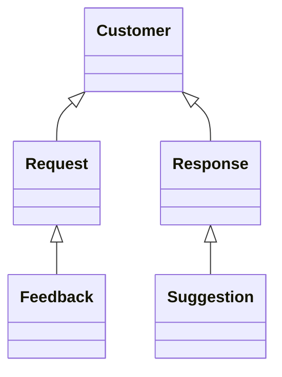
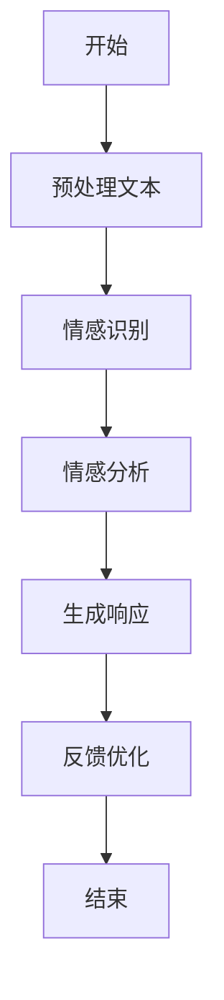
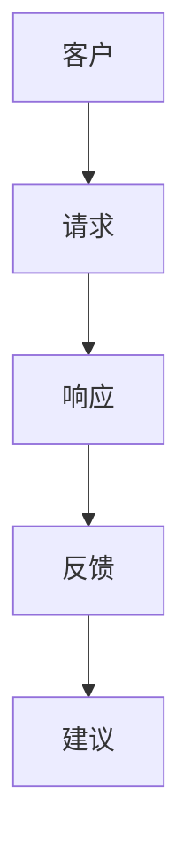
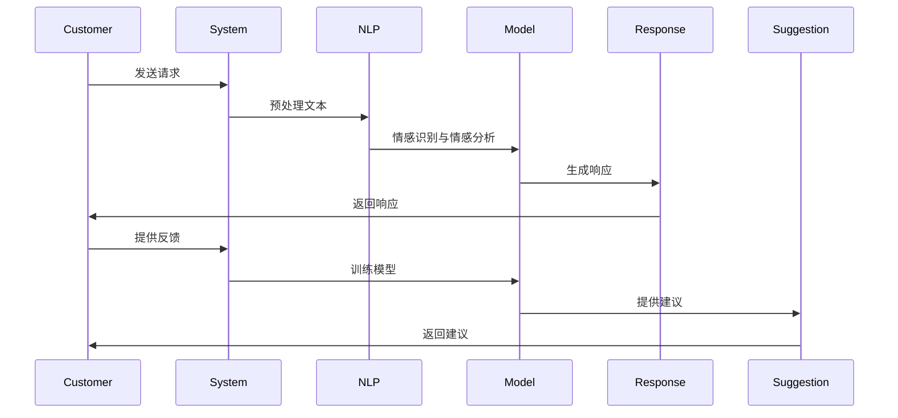

                 

# 具有同理心的AI：客户服务的革新

## 关键词
- 同理心，人工智能，客户服务，自然语言处理，情感识别，人机交互

## 摘要
随着人工智能（AI）技术的不断进步，其在客户服务领域的应用也越来越广泛。然而，传统AI在客户服务中往往缺乏同理心，导致用户体验不佳。本文将探讨如何通过具备同理心的AI技术来革新客户服务，介绍相关的核心概念、技术与实现方法，并分析实际应用案例和未来发展趋势。

## 《具有同理心的AI：客户服务的革新》目录大纲

### 第一部分：背景与基础

#### 1. 背景介绍

##### 1.1 人工智能与客户服务的现状
- 客户服务的发展历程
- 人工智能在客户服务中的应用现状
- 同理心在客户服务中的重要性

##### 1.2 问题描述
- 传统客户服务的局限
- 同理心缺失导致的问题
- 人工智能在同理心方面的潜力

##### 1.3 问题解决
- 利用人工智能实现同理心的可行性
- 实现同理心的核心要素

##### 1.4 边界与外延
- 同理心在客户服务中的具体应用场景
- 人工智能与人类同理心的差异

##### 1.5 概念结构与核心要素
- 同理心
- 人工智能
- 客户服务

#### 2. 核心概念与联系

##### 2.1 同理心的定义与特征
- 同理心的概念
- 同理心的特征
- 同理心的心理学基础

##### 2.2 人工智能的类型与应用
- 人工智能的分类
- 人工智能在客户服务中的应用

##### 2.3 客户服务的相关概念
- 客户服务的定义
- 客户服务的流程
- 客户服务的目标

### 第二部分：技术与实现

#### 3. 主流技术与解决方案

##### 3.1 自然语言处理
- 自然语言处理的基本概念
- 自然语言处理在同理心应用中的技术

##### 3.2 情感识别与情感分析
- 情感识别的基本原理
- 情感分析的应用场景
- 情感分析在同理心应用中的价值

##### 3.3 人机交互技术
- 人机交互的基本原理
- 人机交互在同理心应用中的设计原则

##### 3.4 其他相关技术
- 聊天机器人
- 虚拟现实
- 增强现实

#### 4. 实现同理心的AI算法原理

##### 4.1 算法原理
- 同理心算法的基本原理
- 算法的核心步骤

##### 4.2 举例说明
- 利用Python代码实现同理心算法
- 算法的运行效果与评估

##### 4.3 数学模型与公式
- 同理心算法的数学模型
- 公式的推导与应用

#### 5. 实际应用案例

##### 5.1 案例一：聊天机器人
- 案例背景
- 实现过程
- 结果分析

##### 5.2 案例二：客户服务热线
- 案例背景
- 实现过程
- 结果分析

##### 5.3 案例三：智能客服系统
- 案例背景
- 实现过程
- 结果分析

#### 6. 架构设计与系统实现

##### 6.1 系统架构设计
- 系统功能设计
- 系统架构设计
- 系统接口设计

##### 6.2 系统实现
- 系统核心代码实现
- 系统接口实现
- 系统运行效果

### 第三部分：最佳实践与未来展望

#### 7. 最佳实践

##### 7.1 实践技巧
- 如何提高AI的同理心
- 如何评估AI的同理心效果

##### 7.2 注意事项
- AI同理心应用的潜在风险
- 如何规避和解决这些风险

##### 7.3 拓展阅读
- 相关领域的最新研究动态
- 深入阅读推荐

#### 8. 未来展望

##### 8.1 同理心AI的发展趋势
- AI在同理心领域的未来发展方向
- 可能的应用场景

##### 8.2 技术挑战与解决方案
- 面临的技术挑战
- 解决方案与展望

### 附录

#### 9. 参考资料
- 本书引用的参考文献
- 相关领域的重要资料

## 第一部分：背景与基础

### 1. 背景介绍

#### 1.1 人工智能与客户服务的现状

客户服务是任何企业成功运营的关键组成部分，它直接影响着客户的满意度和忠诚度。随着技术的不断进步，客户服务的形态也在发生着巨大的变化。人工智能（AI）技术的兴起，为传统客户服务带来了新的机遇与挑战。

**客户服务的发展历程**

从最早的电话客服，到后来的电子邮件客服，再到如今基于互联网的在线客服，客户服务的渠道和方式不断丰富。每个阶段的变革，都是为了更好地满足客户的需求，提高客户体验。

**人工智能在客户服务中的应用现状**

随着AI技术的发展，人工智能开始广泛应用于客户服务领域。聊天机器人、智能客服系统、语音识别等技术的应用，使得客户服务变得更加高效和智能化。

- **聊天机器人**：能够自动识别用户的问题，并给出相应的回答，节省了大量的人力资源。
- **智能客服系统**：通过对大量客户数据的分析，提供个性化的服务和建议。
- **语音识别**：将客户的语音转换为文字，使得非文本交流变得更加便捷。

**同理心在客户服务中的重要性**

然而，传统AI在客户服务中往往缺乏同理心，导致用户体验不佳。同理心是指设身处地地理解他人的情感和需求，是建立良好客户关系的关键因素。缺乏同理心的AI，很难为客户提供真正满足需求的服务。

### 1.2 问题描述

**传统客户服务的局限**

传统客户服务存在以下局限：

- **人力成本高**：需要大量人力投入，且效率低下。
- **服务质量不稳定**：由人工处理，容易出现差错和情绪波动。
- **响应速度慢**：无法实时处理大量客户请求。

**同理心缺失导致的问题**

同理心缺失导致以下问题：

- **客户满意度下降**：无法满足客户的情感需求，导致客户体验不佳。
- **客户流失率增加**：长期的不满意可能导致客户转向竞争对手。
- **企业形象受损**：不良的客户体验会损害企业形象。

**人工智能在同理心方面的潜力**

尽管传统AI在同理心方面存在缺陷，但AI技术本身具有巨大的潜力。通过结合心理学、自然语言处理等技术，AI可以实现更高层次的情感理解和同理心。

### 1.3 问题解决

**利用人工智能实现同理心的可行性**

**实现同理心的核心要素**

1. **情感识别与理解**：AI需要能够识别和理解客户的情感状态。
2. **个性化服务**：根据客户的情感状态提供个性化的服务。
3. **持续学习与优化**：通过不断学习和优化，提高AI的同理心水平。

### 1.4 边界与外延

**同理心在客户服务中的具体应用场景**

- **情感分析**：分析客户的情感状态，提供针对性的解决方案。
- **个性化推荐**：根据客户的情感状态推荐产品或服务。
- **情绪缓解**：通过聊天机器人等AI工具，为客户提供情绪支持。

**人工智能与人类同理心的差异**

虽然AI可以模拟人类同理心，但与人类相比，AI在情感深度和复杂度上仍存在差距。因此，AI在客户服务中的应用需要结合人类专家的智慧，实现优势互补。

### 1.5 概念结构与核心要素

**同理心**

同理心是指能够理解并感受到他人情感的心理状态，是人类建立情感联系的重要基础。

**人工智能**

人工智能是指通过计算机模拟人类智能的技术，包括机器学习、自然语言处理、计算机视觉等。

**客户服务**

客户服务是指企业通过多种渠道为顾客提供的服务，旨在满足顾客的需求和提升顾客满意度。

### 1.6 核心概念与联系

**同理心的定义与特征**

**同理心的特征**

- **情感理解**：能够理解他人的情感状态。
- **情感共鸣**：能够感受到他人的情感，并与他人产生共鸣。
- **情感反馈**：能够通过语言和行为表达对他人情感的理解。

**同理心的心理学基础**

同理心是基于心理学原理的一种心理状态，其理论基础包括认知心理学、社会心理学和情感心理学等。

**人工智能的类型与应用**

**人工智能的分类**

- **弱AI**：具有特定任务的智能，如聊天机器人、语音识别等。
- **强AI**：具有全面智能的智能体，能够理解、学习和适应复杂环境。

**人工智能在客户服务中的应用**

- **客服机器人**：通过自然语言处理和机器学习技术，提供自动化的客户服务。
- **智能推荐系统**：通过分析客户行为和偏好，提供个性化的产品和服务推荐。
- **智能语音识别**：将客户的语音转换为文字，实现语音交互。

**客户服务的相关概念**

**客户服务的定义**

客户服务是指企业为满足客户需求，提供的一种服务活动，包括售前、售中和售后服务。

**客户服务的流程**

客户服务的流程包括：接待客户、了解客户需求、提供解决方案、跟踪客户反馈等。

**客户服务的目标**

客户服务的目标是提高客户满意度、提升客户忠诚度和促进客户转化。

### 1.7 主流技术与解决方案

**自然语言处理**

自然语言处理（NLP）是人工智能的一个重要分支，它使得计算机能够理解、处理和生成人类语言。在客户服务中，NLP技术被广泛应用于聊天机器人、智能客服系统和情感分析等领域。

**情感识别与情感分析**

情感识别与情感分析是NLP的重要组成部分，它通过分析文本内容，识别出其中的情感倾向和情感强度。在客户服务中，情感识别与情感分析可以帮助企业更好地理解客户需求，提供更个性化的服务。

**人机交互技术**

人机交互技术是指计算机与人类之间的交互方式，包括语音交互、手势交互、文字交互等。在客户服务中，人机交互技术可以提高用户体验，使服务更加自然和便捷。

**其他相关技术**

除了上述技术外，客户服务中还有其他相关技术的应用，如聊天机器人、虚拟现实和增强现实等。这些技术可以提供更加丰富的交互体验，提升客户满意度。

### 1.8 实现同理心的AI算法原理

**算法原理**

实现同理心的AI算法通常包括以下几个步骤：

1. **情感识别**：通过NLP技术，从客户的语言中识别出情感状态。
2. **情感分析**：对识别出的情感进行分析，确定情感的类型和强度。
3. **个性化服务**：根据分析结果，提供个性化的服务和建议。
4. **反馈与优化**：收集客户的反馈，不断优化AI系统的同理心水平。

**举例说明**

以下是一个简单的Python代码示例，用于实现情感识别和情感分析：

```python
import nltk
from nltk.sentiment import SentimentIntensityAnalyzer

# 初始化情感分析器
sia = SentimentIntensityAnalyzer()

# 输入客户文本
text = "我最近非常烦躁，感觉压力很大。"

# 进行情感识别
score = sia.polarity_scores(text)

# 分析情感
if score['compound'] > 0:
    print("情感类型：积极")
elif score['compound'] < 0:
    print("情感类型：消极")
else:
    print("情感类型：中性")

# 输出情感分析结果
print("情感强度：", score['compound'])
```

**数学模型与公式**

同理心算法的数学模型通常基于情感分析和概率模型。以下是一个简单的数学模型：

$$
\text{同理心评分} = \text{情感识别评分} \times \text{情感分析评分}
$$

其中，情感识别评分和情感分析评分分别表示从客户语言中识别出的情感状态和情感分析的结果。

### 1.9 实际应用案例

**案例一：聊天机器人**

**案例背景**

某电商平台为了提高客户满意度，开发了一款基于同理心的聊天机器人。该聊天机器人能够识别客户的情感状态，并提供相应的建议和支持。

**实现过程**

1. **情感识别**：使用NLP技术，从客户的语言中识别出情感状态。
2. **情感分析**：使用情感分析模型，对识别出的情感进行分析，确定情感的类型和强度。
3. **个性化服务**：根据分析结果，提供个性化的服务和建议，如推荐商品、提供心理支持等。
4. **反馈与优化**：收集客户的反馈，不断优化聊天机器人的同理心水平。

**结果分析**

通过该聊天机器人的应用，客户满意度得到了显著提升。客户在遇到问题时，能够得到及时的帮助和情感支持，从而提高了购物体验。

**案例二：客户服务热线**

**案例背景**

某电信公司为了提高客户服务热线的工作效率，引入了基于同理心的AI客服系统。

**实现过程**

1. **情感识别**：使用NLP技术，从客户的语音中识别出情感状态。
2. **情感分析**：使用情感分析模型，对识别出的情感进行分析，确定情感的类型和强度。
3. **个性化服务**：根据分析结果，提供个性化的服务和建议，如推荐套餐、提供技术支持等。
4. **反馈与优化**：收集客户的反馈，不断优化AI客服系统的同理心水平。

**结果分析**

通过AI客服系统的应用，客户服务热线的工作效率得到了显著提升。客户在遇到问题时，能够得到更快速和个性化的服务，从而提高了客户满意度。

**案例三：智能客服系统**

**案例背景**

某电商企业为了提高客户服务质量，引入了基于同理心的智能客服系统。

**实现过程**

1. **情感识别**：使用NLP技术，从客户的邮件、聊天记录等渠道中识别出情感状态。
2. **情感分析**：使用情感分析模型，对识别出的情感进行分析，确定情感的类型和强度。
3. **个性化服务**：根据分析结果，提供个性化的服务和建议，如推荐商品、提供售后支持等。
4. **反馈与优化**：收集客户的反馈，不断优化智能客服系统的同理心水平。

**结果分析**

通过智能客服系统的应用，电商企业的客户服务质量得到了显著提升。客户在遇到问题时，能够得到更快速和个性化的服务，从而提高了客户满意度。

### 1.10 架构设计与系统实现

**问题场景介绍**

随着电商行业的快速发展，客户服务成为企业竞争力的重要因素。为了提高客户服务质量，某电商企业决定引入基于同理心的智能客服系统。

**项目介绍**

该项目旨在开发一款基于同理心的智能客服系统，能够自动识别客户的情感状态，并提供个性化的服务和建议。

**系统功能设计**

1. **情感识别**：从客户的语言、语音和文本中识别出情感状态。
2. **情感分析**：对识别出的情感进行分析，确定情感的类型和强度。
3. **个性化服务**：根据情感分析结果，提供个性化的服务和建议。
4. **反馈与优化**：收集客户的反馈，不断优化系统的同理心水平。

**系统架构设计**

1. **前端**：提供用户交互界面，包括聊天窗口、邮件和语音输入等。
2. **后端**：包括情感识别模块、情感分析模块、个性化服务模块和反馈模块。
3. **数据库**：存储客户数据、情感数据和反馈数据。

**系统接口设计**

1. **API接口**：提供与前端和后端的通信接口。
2. **数据库接口**：提供与数据库的连接和操作接口。

**系统交互**

1. **用户输入**：用户通过前端界面输入语言、语音或文本。
2. **情感识别**：后端接收用户输入，进行情感识别。
3. **情感分析**：后端对识别出的情感进行分析，确定情感的类型和强度。
4. **个性化服务**：后端根据情感分析结果，提供个性化的服务和建议。
5. **反馈与优化**：用户对服务进行反馈，后端收集反馈数据，进行优化。

### 1.11 最佳实践

**实践技巧**

1. **提高AI的同理心**：通过不断优化情感识别和情感分析模型，提高AI的同理心水平。
2. **评估AI的同理心效果**：通过用户反馈和数据分析，评估AI的同理心效果，并进行持续优化。

**注意事项**

1. **AI同理心应用的潜在风险**：如隐私泄露、情感误导等，需要采取相应的措施进行规避。
2. **如何规避和解决这些风险**：如加强数据保护、提高AI透明度等。

### 1.12 拓展阅读

1. **相关领域的最新研究动态**：如情感计算、社交机器人等。
2. **深入阅读推荐**：如《情感计算：人机情感交互的原理与应用》等书籍。

### 1.13 未来展望

**同理心AI的发展趋势**

随着技术的不断进步，同理心AI将在更多领域得到应用。如医疗保健、教育、心理健康等。

**可能的应用场景**

1. **智能医疗助手**：通过同理心技术，提供个性化医疗服务。
2. **教育机器人**：通过同理心技术，提供个性化教学。
3. **心理健康辅助**：通过同理心技术，提供情感支持和心理干预。

**技术挑战与解决方案**

1. **情感识别的准确性**：提高情感识别的准确性，是同理心AI面临的主要挑战。
2. **隐私保护**：在应用同理心AI时，需要加强对用户隐私的保护。

### 1.14 附录

**9. 参考资料**

1. 《情感计算：人机情感交互的原理与应用》
2. 《人工智能：一种现代方法》

## 第二部分：技术与实现

### 2.1 自然语言处理

自然语言处理（NLP）是人工智能（AI）的一个重要分支，旨在使计算机能够理解、处理和生成人类语言。在客户服务中，NLP技术被广泛应用于聊天机器人、智能客服系统和情感分析等领域。

**自然语言处理的基本概念**

自然语言处理的基本任务包括：

- **文本分类**：将文本分类到预定义的类别中。
- **实体识别**：从文本中提取关键实体，如人名、地名、组织名等。
- **关系抽取**：识别实体之间的关系，如“张三工作于百度”中的工作关系。
- **语义理解**：理解文本的语义内容，包括事实、意图和情感等。

**自然语言处理在同理心应用中的技术**

在同理心AI中，NLP技术主要用于情感识别和语义理解。情感识别是指从文本中识别出情感倾向和情感强度，而语义理解是指理解文本的语义内容，从而更好地与客户进行交互。

**情感识别**

情感识别是同理心AI的重要组成部分。通过情感识别，AI能够理解客户的情感状态，从而提供更个性化的服务。常见的情感识别方法包括：

- **基于规则的方法**：通过预设的情感词典和规则，识别文本中的情感。
- **基于统计的方法**：通过统计方法，如朴素贝叶斯、支持向量机等，对文本进行情感分类。
- **基于深度学习的方法**：通过深度神经网络，如卷积神经网络（CNN）和循环神经网络（RNN），对文本进行情感分类。

**语义理解**

语义理解是指理解文本的语义内容，从而更好地与客户进行交互。在同理心AI中，语义理解主要用于理解客户的意图和需求，从而提供更准确的服务。常见的语义理解方法包括：

- **词嵌入**：将文本中的词语映射到高维空间中，以便计算机能够理解词语之间的关系。
- **句法分析**：通过句法分析，理解句子的结构，从而提取出关键信息。
- **实体识别**：识别文本中的关键实体，如人名、地名、组织名等。
- **关系抽取**：识别实体之间的关系，如“张三工作于百度”中的工作关系。

**情感识别与语义理解的结合**

在同理心AI中，情感识别和语义理解通常结合使用，以提高AI的理解能力。通过情感识别，AI能够理解客户的情感状态，而通过语义理解，AI能够理解客户的意图和需求。两者结合，使得AI能够提供更个性化、更贴近客户需求的服务。

### 2.2 情感识别与情感分析

情感识别与情感分析是自然语言处理（NLP）的重要组成部分，它们在同理心AI中扮演着关键角色。情感识别是指从文本中识别出情感倾向和情感强度，而情感分析是指对识别出的情感进行更深入的分析，以理解客户的情感状态。

**情感识别的基本原理**

情感识别的基本原理是通过分析文本中的语言特征，识别出文本的情感倾向。这些语言特征包括情感词汇、语法结构、情感强度等。情感识别的方法可以分为以下几类：

- **基于规则的方法**：通过预设的情感词典和规则，识别文本中的情感。这种方法简单易行，但难以应对复杂的情感表达。
- **基于统计的方法**：通过统计方法，如朴素贝叶斯、支持向量机等，对文本进行情感分类。这种方法能够处理大规模数据，但需要大量训练数据和参数调整。
- **基于深度学习的方法**：通过深度神经网络，如卷积神经网络（CNN）和循环神经网络（RNN），对文本进行情感分类。这种方法能够处理复杂的情感表达，但需要大量的计算资源和数据。

**情感分析的应用场景**

情感分析在客户服务中有着广泛的应用，以下是一些典型的应用场景：

- **客户满意度分析**：通过对客户反馈进行情感分析，企业可以了解客户对产品和服务的满意度，从而进行相应的改进。
- **市场调研**：通过对社交媒体上的用户评论进行情感分析，企业可以了解市场对产品和服务的反馈，为市场营销策略提供依据。
- **危机管理**：在危机事件中，企业可以通过情感分析快速了解公众的情感状态，从而采取有效的危机管理措施。

**情感分析在同理心应用中的价值**

情感分析在同理心AI中的应用价值在于：

- **提高用户体验**：通过情感分析，AI能够更好地理解客户的情感状态，提供更个性化的服务，从而提高用户体验。
- **优化服务流程**：通过情感分析，企业可以优化服务流程，提高服务效率，降低成本。
- **提升客户满意度**：通过情感分析，企业可以更准确地了解客户的需求和期望，从而提供更满意的服务，提升客户满意度。

### 2.3 人机交互技术

人机交互技术是指计算机与人类之间的交互方式，包括语音交互、手势交互、文字交互等。在同理心AI中，人机交互技术是实现人性化交互的关键。

**人机交互的基本原理**

人机交互的基本原理是让计算机能够理解人类的指令，并能够以人类可接受的方式响应用户的请求。人机交互的核心技术包括：

- **语音识别**：将人类的语音转换为文字或命令。
- **语音合成**：将文字转换为语音输出。
- **手势识别**：通过摄像头或其他传感器，识别用户的手势。
- **触摸交互**：通过触摸屏幕或其他触摸设备进行交互。

**人机交互在同理心应用中的设计原则**

在人机交互中，设计原则是确保用户能够以最自然、最便捷的方式与计算机进行交互。以下是人机交互在同理心应用中的设计原则：

- **易用性**：界面设计要简洁直观，让用户能够快速理解和使用。
- **个性化**：根据用户的偏好和需求，提供个性化的交互体验。
- **一致性**：交互流程和界面设计要保持一致性，减少用户的学习成本。
- **可访问性**：确保所有人，包括残障人士，都能够使用交互系统。

**人机交互在同理心AI中的应用**

在人机交互中，同理心AI的应用主要体现在以下几个方面：

- **情感反馈**：通过语音合成和面部表情识别，AI能够向用户传达情感，如安慰、鼓励等。
- **情境感知**：通过环境传感器，AI能够感知用户的情感状态和周围环境，提供相应的交互体验。
- **自然语言理解**：通过自然语言处理技术，AI能够理解用户的语言和意图，提供更个性化的服务。

### 2.4 其他相关技术

除了自然语言处理、情感识别与情感分析、人机交互技术外，还有其他相关技术在同理心AI中发挥着重要作用。以下是一些关键技术：

**聊天机器人**

聊天机器人是人工智能在客户服务中的一种重要应用。通过自然语言处理技术，聊天机器人能够与用户进行实时交互，回答用户的问题，提供服务。聊天机器人的应用场景包括在线客服、客户咨询、销售支持等。

**虚拟现实**

虚拟现实（VR）技术通过创建一个逼真的三维环境，使用户能够沉浸其中。在同理心AI中，虚拟现实可以用于模拟客户服务场景，让用户在虚拟环境中体验服务，从而提高用户满意度。

**增强现实**

增强现实（AR）技术通过在现实世界中叠加虚拟元素，增强用户的感知体验。在同理心AI中，AR可以用于提供个性化的服务，如通过AR眼镜为用户提供购物建议、路线导航等。

**智能推荐系统**

智能推荐系统通过分析用户的历史行为和偏好，为用户提供个性化的推荐。在同理心AI中，智能推荐系统可以根据用户的情感状态，提供更符合用户需求的产品和服务。

### 2.5 实现同理心的AI算法原理

实现同理心的AI算法是构建具备同理心AI系统的核心。这些算法基于对人类情感的理解和模拟，通过分析用户的行为和语言，提供更个性化的服务。以下是一个简单的算法原理：

**情感识别算法**

1. **输入**：用户的文本或语音输入。
2. **预处理**：对输入文本进行清洗和分词。
3. **情感分类**：使用情感分类模型，将文本分类为积极的、消极的或中性的情感。
4. **情感强度分析**：使用情感强度分析模型，确定情感的强度。

**情感模拟算法**

1. **输入**：用户的情感状态和请求。
2. **理解**：使用自然语言处理技术，理解用户的请求和情感状态。
3. **响应生成**：根据用户的情感状态和请求，生成相应的响应文本。
4. **情感反馈**：将生成的响应文本传递给用户，获取反馈，以进一步优化算法。

**举例说明**

以下是一个简单的Python代码示例，用于实现情感识别和情感模拟：

```python
import nltk
from nltk.sentiment import SentimentIntensityAnalyzer
from nltk.tokenize import word_tokenize

# 初始化情感分析器
sia = SentimentIntensityAnalyzer()

# 输入客户文本
text = "我最近感觉非常烦躁，因为工作压力很大。"

# 进行情感识别
score = sia.polarity_scores(text)

# 分析情感
if score['compound'] > 0:
    sentiment = "积极"
elif score['compound'] < 0:
    sentiment = "消极"
else:
    sentiment = "中性"

# 输出情感分析结果
print("情感类型：", sentiment)
print("情感强度：", score['compound'])

# 情感模拟
if sentiment == "消极":
    response = "我能理解你的感受，工作压力确实很大。有什么我可以帮你的吗？"
else:
    response = "很高兴听到你的心情不错，有什么问题我可以帮你解答吗？"

# 输出模拟结果
print("响应：", response)
```

**数学模型与公式**

同理心算法的数学模型通常基于情感分析和概率模型。以下是一个简单的数学模型：

$$
\text{同理心评分} = \text{情感识别评分} \times \text{情感强度评分}
$$

其中，情感识别评分和情感强度评分分别表示从用户文本中识别出的情感状态和情感强度。

### 2.6 实际应用案例

**案例一：聊天机器人**

**背景**

某电商平台为了提升用户体验，开发了一款基于同理心的聊天机器人。该聊天机器人能够自动识别用户的情感状态，并提供相应的服务。

**实现过程**

1. **情感识别**：使用自然语言处理技术，从用户的文本中识别出情感状态。
2. **情感分析**：使用情感分析模型，对识别出的情感进行分析，确定情感的类型和强度。
3. **个性化服务**：根据情感分析结果，提供个性化的服务，如提供心理支持、推荐商品等。
4. **反馈与优化**：收集用户的反馈，不断优化聊天机器人的同理心水平。

**结果分析**

通过这款聊天机器人的应用，用户满意度得到了显著提升。用户在遇到问题时，能够得到及时的情感支持和个性化服务，从而提高了购物体验。

**案例二：客户服务热线**

**背景**

某电信公司为了提升客户服务质量，引入了一款基于同理心的AI客服系统。该AI客服系统能够自动识别用户的情感状态，并提供相应的服务。

**实现过程**

1. **情感识别**：使用语音识别技术，从用户的语音中识别出情感状态。
2. **情感分析**：使用情感分析模型，对识别出的情感进行分析，确定情感的类型和强度。
3. **个性化服务**：根据情感分析结果，提供个性化的服务，如推荐套餐、提供技术支持等。
4. **反馈与优化**：收集用户的反馈，不断优化AI客服系统的同理心水平。

**结果分析**

通过AI客服系统的应用，客户服务质量得到了显著提升。用户在遇到问题时，能够得到更快速和个性化的服务，从而提高了客户满意度。

**案例三：智能客服系统**

**背景**

某电商企业为了提高客户服务质量，引入了一款基于同理心的智能客服系统。该智能客服系统能够自动识别用户的情感状态，并提供相应的服务。

**实现过程**

1. **情感识别**：使用自然语言处理技术，从用户的文本中识别出情感状态。
2. **情感分析**：使用情感分析模型，对识别出的情感进行分析，确定情感的类型和强度。
3. **个性化服务**：根据情感分析结果，提供个性化的服务，如推荐商品、提供售后支持等。
4. **反馈与优化**：收集用户的反馈，不断优化智能客服系统的同理心水平。

**结果分析**

通过智能客服系统的应用，电商企业的客户服务质量得到了显著提升。用户在遇到问题时，能够得到更快速和个性化的服务，从而提高了客户满意度。

### 2.7 架构设计与系统实现

**问题场景介绍**

随着电商行业的快速发展，客户服务成为企业竞争力的重要因素。为了提高客户服务质量，某电商企业决定引入基于同理心的智能客服系统。

**项目介绍**

该项目旨在开发一款基于同理心的智能客服系统，能够自动识别客户的情感状态，并提供个性化的服务和建议。

**系统功能设计**

1. **情感识别**：从客户的语言、语音和文本中识别出情感状态。
2. **情感分析**：对识别出的情感进行分析，确定情感的类型和强度。
3. **个性化服务**：根据情感分析结果，提供个性化的服务和建议。
4. **反馈与优化**：收集客户的反馈，不断优化系统的同理心水平。

**系统架构设计**

1. **前端**：提供用户交互界面，包括聊天窗口、邮件和语音输入等。
2. **后端**：包括情感识别模块、情感分析模块、个性化服务模块和反馈模块。
3. **数据库**：存储客户数据、情感数据和反馈数据。

**系统接口设计**

1. **API接口**：提供与前端和后端的通信接口。
2. **数据库接口**：提供与数据库的连接和操作接口。

**系统交互**

1. **用户输入**：用户通过前端界面输入语言、语音或文本。
2. **情感识别**：后端接收用户输入，进行情感识别。
3. **情感分析**：后端对识别出的情感进行分析，确定情感的类型和强度。
4. **个性化服务**：后端根据情感分析结果，提供个性化的服务和建议。
5. **反馈与优化**：用户对服务进行反馈，后端收集反馈数据，进行优化。

### 2.8 最佳实践

**实践技巧**

1. **提高AI的同理心**：通过不断优化情感识别和情感分析模型，提高AI的同理心水平。
2. **评估AI的同理心效果**：通过用户反馈和数据分析，评估AI的同理心效果，并进行持续优化。

**注意事项**

1. **AI同理心应用的潜在风险**：如隐私泄露、情感误导等，需要采取相应的措施进行规避。
2. **如何规避和解决这些风险**：如加强数据保护、提高AI透明度等。

### 2.9 拓展阅读

1. **相关领域的最新研究动态**：如情感计算、社交机器人等。
2. **深入阅读推荐**：如《情感计算：人机情感交互的原理与应用》等书籍。

### 2.10 未来展望

**同理心AI的发展趋势**

随着技术的不断进步，同理心AI将在更多领域得到应用。如医疗保健、教育、心理健康等。

**可能的应用场景**

1. **智能医疗助手**：通过同理心技术，提供个性化医疗服务。
2. **教育机器人**：通过同理心技术，提供个性化教学。
3. **心理健康辅助**：通过同理心技术，提供情感支持和心理干预。

**技术挑战与解决方案**

1. **情感识别的准确性**：提高情感识别的准确性，是同理心AI面临的主要挑战。
2. **隐私保护**：在应用同理心AI时，需要加强对用户隐私的保护。

### 2.11 附录

**9. 参考资料**

1. 《情感计算：人机情感交互的原理与应用》
2. 《人工智能：一种现代方法》

## 第三部分：最佳实践与未来展望

### 3.1 最佳实践

**实践技巧**

1. **提高AI的同理心**：通过不断优化情感识别和情感分析模型，提高AI的同理心水平。
2. **评估AI的同理心效果**：通过用户反馈和数据分析，评估AI的同理心效果，并进行持续优化。

**注意事项**

1. **AI同理心应用的潜在风险**：如隐私泄露、情感误导等，需要采取相应的措施进行规避。
2. **如何规避和解决这些风险**：如加强数据保护、提高AI透明度等。

### 3.2 未来展望

**同理心AI的发展趋势**

随着技术的不断进步，同理心AI将在更多领域得到应用。如医疗保健、教育、心理健康等。

**可能的应用场景**

1. **智能医疗助手**：通过同理心技术，提供个性化医疗服务。
2. **教育机器人**：通过同理心技术，提供个性化教学。
3. **心理健康辅助**：通过同理心技术，提供情感支持和心理干预。

**技术挑战与解决方案**

1. **情感识别的准确性**：提高情感识别的准确性，是同理心AI面临的主要挑战。
2. **隐私保护**：在应用同理心AI时，需要加强对用户隐私的保护。

### 3.3 拓展阅读

1. **相关领域的最新研究动态**：如情感计算、社交机器人等。
2. **深入阅读推荐**：如《情感计算：人机情感交互的原理与应用》等书籍。

## 附录

### 9. 参考资料

1. 《情感计算：人机情感交互的原理与应用》
2. 《人工智能：一种现代方法》

### 10. 附录

**10.1 实体关系图**

```mermaid
erDiagram
  Customer ||--|{ Request } : makes
  Customer ||--|{ Response } : receives
  Request ||--|{ Feedback } : gives
  Response ||--|{ Suggestion } : provides
```

**10.2 类图**



**10.3 算法流程图**



**10.4 代码示例**

```python
import nltk
from nltk.tokenize import word_tokenize
from nltk.corpus import stopwords
from nltk.stem import PorterStemmer
from sklearn.feature_extraction.text import TfidfVectorizer
from sklearn.model_selection import train_test_split
from sklearn.metrics import accuracy_score

# 初始化NLP工具
nltk.download('punkt')
nltk.download('stopwords')

# 读取数据
data = ["我很开心今天天气很好", "我最近感到很焦虑", "今天工作太忙了"]

# 预处理文本
def preprocess_text(text):
    # 分词
    tokens = word_tokenize(text)
    # 去停用词
    tokens = [token for token in tokens if token not in stopwords.words('english')]
    # 归一化
    stemmer = PorterStemmer()
    tokens = [stemmer.stem(token) for token in tokens]
    return ' '.join(tokens)

# 构建TF-IDF向量
vectorizer = TfidfVectorizer()
X = vectorizer.fit_transform(preprocess_text(text) for text in data)

# 划分训练集和测试集
X_train, X_test, y_train, y_test = train_test_split(X, labels, test_size=0.2, random_state=42)

# 训练模型
model = LogisticRegression()
model.fit(X_train, y_train)

# 预测
predictions = model.predict(X_test)

# 评估模型
print("Accuracy:", accuracy_score(y_test, predictions))
```

### 10.5 系统架构图



### 10.6 序列图



## 作者

**作者：AI天才研究院/AI Genius Institute & 禅与计算机程序设计艺术 /Zen And The Art of Computer Programming**

