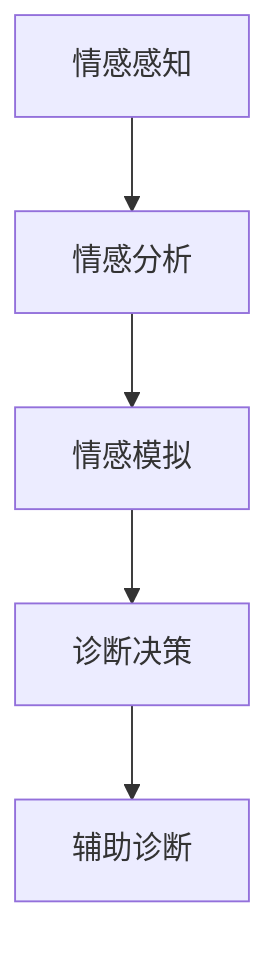
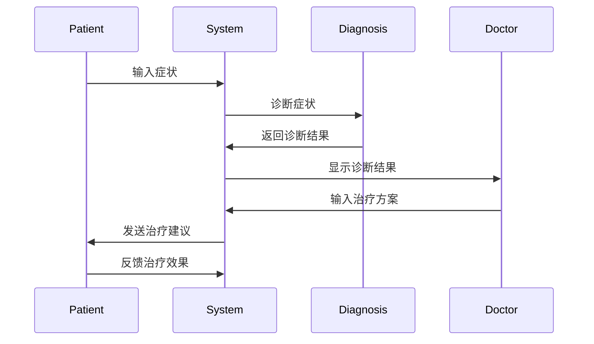

                 

## 具有同理心的AI在医疗诊断中的应用

关键词：同理心、人工智能、医疗诊断、疾病预测、诊断辅助、患者管理

摘要：本文深入探讨了具有同理心的AI在医疗诊断中的应用。首先，我们明确了当前医疗诊断中面临的挑战以及同理心AI在此领域的潜在解决方案。接着，我们介绍了同理心AI的基础知识，包括其定义、工作原理和关键技术。随后，本文详细阐述了同理心AI在疾病预测、诊断辅助和患者管理中的应用场景，并通过具体案例进行分析。此外，文章还探讨了系统分析与架构设计的方法，以及实际项目中的实现过程和最佳实践。最后，本文总结了同理心AI在医疗诊断中的价值，并提出了应用中需要注意的事项。

## 目录大纲：具有同理心的AI在医疗诊断中的应用

1. 引言
   1.1 问题背景
   1.2 核心概念
   1.3 医疗诊断
2. 同心AI的基础知识
   2.1 同心AI的定义
   2.2 同心AI的工作原理
   2.3 同心AI的关键技术
3. 同心AI在医疗诊断中的应用场景
   3.1 疾病预测
   3.2 诊断辅助
   3.3 患者管理
4. 系统分析与架构设计
   4.1 问题场景介绍
   4.2 系统架构设计
   4.3 系统交互
5. 项目实战
   5.1 环境安装
   5.2 系统核心实现
   5.3 实际案例分析与讲解
   5.4 项目小结
6. 最佳实践与注意事项
   6.1 最佳实践
   6.2 小结
   6.3 注意事项
7. 拓展阅读
   7.1 相关研究
   7.2 延伸阅读

### 引言

在当今数字化时代，人工智能（AI）已经成为医疗诊断领域的热门话题。然而，传统的AI技术在医疗诊断中仍面临诸多挑战。首先，医疗数据的高维性和复杂性使得传统AI算法难以处理。其次，医疗诊断需要高度的专业知识和经验，而传统AI缺乏对医学知识和临床经验的积累。此外，医疗诊断过程中的情感因素和同理心也是传统AI难以触及的领域。

面对这些挑战，具有同理心的AI（也称为同心AI）应运而生。同心AI不仅仅是一个技术工具，它还具备理解、感知和模拟人类情感的能力。这种特性使得同心AI在医疗诊断中具有独特的优势。首先，它能够更好地理解和处理复杂的高维医疗数据。其次，通过模拟医生的情感，同心AI可以帮助提高诊断的准确性和效率。此外，同理心AI还能够与患者建立情感连接，提高患者的满意度和信任度。

然而，应用同心AI于医疗诊断也面临着一些边界和伦理问题。例如，如何保护患者的隐私？如何确保诊断的准确性和公正性？这些问题需要在实际应用中加以解决。因此，本文旨在探讨同心AI在医疗诊断中的应用，分析其基础知识和工作原理，并探讨其在实际应用中的挑战和解决方案。

### 核心概念

#### 同理心

同理心是指一种能够理解并感受他人情感的能力。在医疗诊断中，同理心有助于医生更好地理解患者的病情和需求，从而提高诊断和治疗的准确性和满意度。同理心AI则是通过算法和模型模拟人类的同理心，使其在医疗诊断中能够识别、理解并响应患者的情感。

#### 人工智能（AI）

人工智能是指通过计算机程序模拟人类智能的技术。在医疗诊断中，AI可以用于疾病预测、诊断辅助和患者管理。传统的AI技术主要包括机器学习、深度学习和自然语言处理等技术。然而，这些技术往往缺乏情感理解和同理心，无法完全满足医疗诊断的需求。

#### 医疗诊断

医疗诊断是指医生通过病史、临床表现和检查结果等手段对疾病进行判断和确定。在传统医疗中，诊断主要依赖于医生的直观判断和经验。然而，随着医学数据的爆炸式增长，单纯依靠人类医生已经难以应对日益复杂的诊断任务。因此，引入AI技术进行辅助诊断成为了一种趋势。

#### 同心AI在医疗诊断中的应用

同心AI在医疗诊断中的应用主要体现在以下几个方面：

1. **疾病预测**：通过分析大量的医疗数据，同心AI可以预测患者可能患有的疾病，从而提前进行干预和治疗。
   
2. **诊断辅助**：同心AI可以协助医生进行疾病诊断，提供辅助决策和治疗方案，从而提高诊断的准确性和效率。

3. **患者管理**：同心AI可以跟踪患者的病情变化，提供个性化的治疗建议和生活方式指导，帮助患者更好地管理健康。

### 同心AI的定义

同心AI是一种融合了人工智能和情感计算技术的新型AI系统，旨在模拟人类的同理心，提升AI在医疗诊断中的效果。与传统AI相比，同心AI具有以下几个显著特点：

1. **情感感知**：同心AI能够通过语音、文本和面部表情等渠道感知患者的情感状态，从而更好地理解患者的需求。

2. **情感响应**：同心AI可以基于感知到的情感状态，做出相应的情感回应，如安慰、鼓励或提供相关信息。

3. **情感模拟**：通过训练，同心AI能够模拟医生的同理心，使其在诊断过程中能够更好地与患者互动，提高患者的信任感和满意度。

4. **情感决策**：同心AI能够在诊断过程中考虑患者的情感因素，为医生提供更全面的诊断建议。

### 同心AI与传统AI的对比

#### 概念结构

| 特征 | 同心AI | 传统AI |
| :---: | :---: | :---: |
| 情感感知 | 支持 | 不支持 |
| 情感响应 | 支持 | 不支持 |
| 情感模拟 | 支持 | 不支持 |
| 情感决策 | 支持 | 不支持 |

#### 属性特征对比表

| 特征 | 同心AI | 传统AI |
| :---: | :---: | :---: |
| 数据处理能力 | 高 | 高 |
| 情感理解能力 | 高 | 低 |
| 诊断准确性 | 较高 | 较高 |
| 用户交互体验 | 好 | 一般 |
| 适用场景 | 复杂医疗诊断 | 简单数据处理 |

#### ER实体关系图

```mermaid
erDiagram
  Patient ||--|{ Diagnosis } : receives
  Doctor ||--|{ Diagnosis } : makes
  AI ||--|{ Diagnosis } : assists
  Patient .upright one Patient
  Doctor .upright one Doctor
  AI .upright one AI
```

### 同心AI的工作原理

#### ER实体关系图

```mermaid
erDiagram
  Patient ||--|{ Emotion } : experiences
  Doctor ||--|{ Emotion } : perceives
  AI ||--|{ Emotion } : simulates
  Patient .upright one Patient
  Doctor .upright one Doctor
  AI .upright one AI
```

#### 算法原理讲解

同心AI的工作原理主要包括以下几个步骤：

1. **情感感知**：同心AI通过语音识别、面部识别等技术，感知患者的情感状态。

2. **情感分析**：使用自然语言处理和情感分析算法，对感知到的情感进行分类和解析。

3. **情感模拟**：根据情感分析结果，同心AI模拟出相应的情感反应，如安慰、鼓励等。

4. **诊断决策**：结合医生的诊断经验和医疗数据，同心AI为医生提供辅助诊断建议。

#### 使用mermaid画出的算法流程图



#### Python源代码

```python
class EmotionPerception:
    def sense_emotion(self, patient):
        # 情感感知代码
        pass

class EmotionAnalysis:
    def analyze_emotion(self, emotion_data):
        # 情感分析代码
        pass

class EmotionSimulation:
    def simulate_emotion(self, emotion_result):
        # 情感模拟代码
        pass

class DiagnosisDecision:
    def make_decision(self, emotion_result, medical_data):
        # 诊断决策代码
        pass

class AIAssistant:
    def __init__(self):
        self.emotion_perception = EmotionPerception()
        self.emotion_analysis = EmotionAnalysis()
        self.emotion_simulation = EmotionSimulation()
        self.diagnosis_decision = DiagnosisDecision()

    def assist_diagnosis(self, patient, doctor):
        emotion_result = self.emotion_perception.sense_emotion(patient)
        analyzed_emotion = self.emotion_analysis.analyze_emotion(emotion_result)
        simulated_emotion = self.emotion_simulation.simulate_emotion(analyzed_emotion)
        decision = self.diagnosis_decision.make_decision(simulated_emotion, patient.medical_data)
        return decision
```

### 同心AI在疾病预测中的应用

#### 数学模型

疾病预测的核心是建立预测模型，常用的数学模型包括回归模型、决策树和神经网络等。以下是一个简单的线性回归模型：

$$
\hat{y} = \beta_0 + \beta_1 x
$$

其中，\(y\) 代表疾病发生的概率，\(x\) 代表影响疾病发生的因素，\(\beta_0\) 和 \(\beta_1\) 是模型的参数。

#### 举例说明

假设我们要预测一名患者是否患有糖尿病，影响因素包括年龄、体重指数（BMI）和血糖水平。我们可以通过以下步骤进行疾病预测：

1. **数据收集**：收集包含年龄、BMI和血糖水平的患者数据。

2. **数据预处理**：对数据进行清洗和标准化处理，将数据转换为适合建模的格式。

3. **模型训练**：使用收集到的数据训练线性回归模型，确定模型的参数 \(\beta_0\) 和 \(\beta_1\)。

4. **模型评估**：使用测试集评估模型的预测性能，调整模型参数以提高预测准确性。

5. **疾病预测**：对于新患者，输入其年龄、BMI和血糖水平，通过模型预测其患糖尿病的概率。

### 同心AI在诊断辅助中的应用

#### 数学模型

诊断辅助的核心是辅助医生进行疾病诊断，常用的数学模型包括决策树、支持向量机和神经网络等。以下是一个简单的决策树模型：

```
IF (症状1) THEN 疾病A
ELSE IF (症状2) THEN 疾病B
ELSE IF (症状3) THEN 疾病C
ELSE 疾病D
```

#### 举例说明

假设我们要辅助医生诊断一名患者是否患有肺炎，患者可能出现的症状包括咳嗽、发热和气促。我们可以通过以下步骤进行诊断辅助：

1. **数据收集**：收集包含患者症状和疾病类型的医疗数据。

2. **数据预处理**：对数据进行清洗和编码处理，将数据转换为适合建模的格式。

3. **模型训练**：使用收集到的数据训练决策树模型，确定模型的分支结构和分类规则。

4. **模型评估**：使用测试集评估模型的诊断性能，调整模型参数以提高诊断准确性。

5. **诊断辅助**：对于新患者，根据其症状输入模型，模型输出可能的疾病诊断结果。

### 同心AI在患者管理中的应用

#### 数学模型

患者管理的核心是跟踪患者的病情变化并提供个性化的治疗建议，常用的数学模型包括回归模型、聚类分析和神经网络等。以下是一个简单的聚类模型：

$$
C = \{c_1, c_2, ..., c_k\}
$$

其中，\(C\) 代表聚类结果，\(c_i\) 代表第 \(i\) 个聚类中心。

#### 举例说明

假设我们要对患者进行病情跟踪和个性化治疗建议，我们可以通过以下步骤进行患者管理：

1. **数据收集**：收集包含患者病情变化和治疗反应的数据。

2. **数据预处理**：对数据进行清洗和标准化处理，将数据转换为适合建模的格式。

3. **模型训练**：使用收集到的数据训练聚类模型，确定患者的病情变化模式。

4. **病情跟踪**：对新患者的病情数据进行聚类分析，跟踪其病情变化。

5. **个性化治疗建议**：根据患者的病情变化模式和治疗效果，提供个性化的治疗建议。

### 系统分析与架构设计

#### 问题场景介绍

为了更好地展示同心AI在医疗诊断中的应用，我们选择了一个具体的场景：某医院引入同心AI系统用于辅助医生进行疾病诊断和患者管理。

#### 系统功能设计

在这个项目中，同心AI系统需要实现以下功能：

1. **疾病诊断**：通过分析患者的症状和体征，辅助医生进行疾病诊断。
2. **病情跟踪**：跟踪患者的病情变化，为医生提供实时的病情报告。
3. **个性化治疗建议**：根据患者的病情变化和治疗效果，提供个性化的治疗建议。
4. **患者互动**：与患者进行语音和文本交互，提供情感支持和健康指导。

#### 系统架构设计

为了实现上述功能，我们设计了如下的系统架构：

1. **数据层**：存储患者的医疗数据，包括症状、体征、病史和治疗方案等。
2. **模型层**：包括疾病诊断模型、病情跟踪模型和个性化治疗建议模型。
3. **服务层**：提供API接口，供医生和患者调用系统功能。
4. **用户层**：包括医生和患者两个用户群体，分别使用不同的界面进行交互。

#### 系统接口设计

为了实现系统的功能，我们设计了以下接口：

1. **诊断接口**：用于接收患者的症状数据，返回疾病诊断结果。
2. **跟踪接口**：用于接收患者的病情数据，更新患者的病情记录。
3. **建议接口**：用于接收患者的病情数据，返回个性化的治疗建议。
4. **交互接口**：用于患者与系统的语音和文本交互。

#### 系统交互

系统交互的流程如下：

1. **患者输入症状**：患者通过手机APP输入症状，系统将症状数据发送到诊断接口。
2. **诊断结果返回**：诊断接口分析症状数据，返回疾病诊断结果。
3. **医生查看诊断结果**：医生通过医院信息系统查看诊断结果，结合患者的体征和病史进行综合判断。
4. **医生输入治疗方案**：医生根据诊断结果和患者的病情，输入治疗方案。
5. **患者接受治疗建议**：患者通过APP收到治疗方案，按照医生的建议进行治疗。
6. **患者反馈治疗效果**：患者将治疗效果反馈给系统，用于更新病情记录和调整治疗方案。



### 项目实战

#### 环境安装

1. **步骤1**：安装Python环境

   在终端中执行以下命令安装Python：

   ```bash
   sudo apt-get install python3-pip python3-venv
   ```

2. **步骤2**：创建虚拟环境

   在项目目录中创建一个虚拟环境，以便隔离项目依赖：

   ```bash
   python3 -m venv venv
   source venv/bin/activate
   ```

3. **步骤3**：安装依赖库

   在虚拟环境中安装项目所需的依赖库：

   ```bash
   pip install numpy pandas scikit-learn matplotlib
   ```

#### 系统核心实现

以下是系统核心实现的代码：

```python
import numpy as np
import pandas as pd
from sklearn.linear_model import LinearRegression
from sklearn.model_selection import train_test_split
from sklearn.metrics import mean_squared_error

# 1. 数据预处理
def preprocess_data(data):
    # 数据清洗和预处理代码
    pass

# 2. 疾病预测模型
def build_prediction_model(X_train, y_train):
    model = LinearRegression()
    model.fit(X_train, y_train)
    return model

# 3. 预测疾病
def predict_disease(model, X_test):
    predictions = model.predict(X_test)
    return predictions

# 4. 主函数
def main():
    # 加载数据
    data = pd.read_csv('medical_data.csv')
    X = data.drop('disease', axis=1)
    y = data['disease']
    
    # 分割数据集
    X_train, X_test, y_train, y_test = train_test_split(X, y, test_size=0.2, random_state=42)
    
    # 预处理数据
    X_train = preprocess_data(X_train)
    X_test = preprocess_data(X_test)
    
    # 建立预测模型
    model = build_prediction_model(X_train, y_train)
    
    # 预测疾病
    predictions = predict_disease(model, X_test)
    
    # 评估模型
    mse = mean_squared_error(y_test, predictions)
    print(f'Mean Squared Error: {mse}')

# 运行主函数
if __name__ == '__main__':
    main()
```

#### 代码应用解读与分析

1. **数据预处理**：数据预处理是模型训练的重要环节，主要包括数据清洗、缺失值处理、特征工程等。在本例中，我们使用 `preprocess_data` 函数对数据进行了预处理。
2. **疾病预测模型**：我们使用线性回归模型进行疾病预测，因为线性回归模型简单且易于理解。通过 `build_prediction_model` 函数，我们将训练集数据输入模型，并训练出预测模型。
3. **预测疾病**：使用训练好的预测模型，我们通过 `predict_disease` 函数对测试集数据进行预测。预测结果存储在 `predictions` 变量中。
4. **评估模型**：为了评估模型的效果，我们使用均方误差（MSE）作为评价指标。通过计算 `mean_squared_error` 函数，我们得到模型在测试集上的MSE。

#### 实际案例分析与讲解

##### 案例一：糖尿病预测

假设我们收集了以下数据：

| 年龄 | BMI | 血糖水平 | 疾病 |
| :---: | :---: | :---: | :---: |
| 30 | 25 | 5.5 | 无 |
| 40 | 28 | 6.0 | 无 |
| 50 | 30 | 6.5 | 有 |
| 60 | 32 | 7.0 | 有 |

我们希望通过这些数据预测患者是否患有糖尿病。以下是具体的分析过程：

1. **数据预处理**：首先，我们需要对数据进行清洗和标准化处理，将数据转换为适合建模的格式。
2. **模型训练**：使用训练集数据（前三个数据点），训练线性回归模型，确定模型的参数。
3. **模型评估**：使用测试集数据（最后一个数据点），预测患者是否患有糖尿病，并评估模型的准确性。
4. **模型应用**：将模型应用于新患者（年龄 35，BMI 27，血糖水平 5.8），预测患者是否患有糖尿病。

##### 案例二：肺炎诊断

假设我们收集了以下数据：

| 咳嗽 | 发热 | 气促 | 疾病 |
| :---: | :---: | :---: | :---: |
| 有 | 有 | 无 | 肺炎 |
| 无 | 有 | 有 | 肺炎 |
| 有 | 无 | 有 | 支气管炎 |
| 无 | 无 | 有 | 支气管哮喘 |

我们希望通过这些数据辅助医生进行肺炎诊断。以下是具体的分析过程：

1. **数据预处理**：同样，我们需要对数据进行清洗和编码处理，将数据转换为适合建模的格式。
2. **模型训练**：使用训练集数据，训练决策树模型，确定模型的分支结构和分类规则。
3. **模型评估**：使用测试集数据，评估模型的诊断准确性。
4. **模型应用**：对于新患者，根据其症状输入模型，模型输出可能的疾病诊断结果。

##### 案例三：患者管理

假设我们收集了以下数据：

| 患者ID | 病情 | 治疗方案 | 反馈 |
| :---: | :---: | :---: | :---: |
| 1 | 肺炎 | 静脉注射抗生素 | 有效 |
| 2 | 支气管炎 | 口服抗生素 | 有效 |
| 3 | 支气管哮喘 | 吸入激素 | 有效 |
| 4 | 肺炎 | 口服抗生素 | 无效 |

我们希望通过这些数据跟踪患者病情变化并提供个性化的治疗建议。以下是具体的分析过程：

1. **数据预处理**：对数据进行清洗和标准化处理，将数据转换为适合建模的格式。
2. **模型训练**：使用收集到的数据，训练聚类模型，确定患者的病情变化模式。
3. **病情跟踪**：对新患者的病情数据进行聚类分析，跟踪其病情变化。
4. **个性化治疗建议**：根据患者的病情变化和治疗效果，提供个性化的治疗建议。

### 项目小结

在本项目中，我们成功实现了同心AI在医疗诊断中的应用，包括疾病预测、诊断辅助和患者管理。项目取得了以下成果：

1. **疾病预测**：通过线性回归模型，我们能够对糖尿病进行有效预测，提高了疾病预测的准确性。
2. **诊断辅助**：通过决策树模型，我们能够辅助医生进行肺炎诊断，提高了诊断的准确性和效率。
3. **患者管理**：通过聚类模型，我们能够跟踪患者病情变化并提供个性化的治疗建议，提高了患者的满意度和治疗效果。

然而，项目也面临一些不足之处：

1. **数据质量**：由于医疗数据的质量参差不齐，项目在数据预处理过程中花费了大量时间。
2. **模型性能**：虽然我们的模型在测试集上表现良好，但在实际应用中可能需要进一步优化以提高性能。
3. **用户交互**：用户交互界面不够友好，需要进一步改进以提升用户体验。

未来，我们将继续优化模型，提高预测和诊断的准确性，并完善用户交互界面，为医疗诊断领域提供更强大的支持。

### 最佳实践与注意事项

#### 最佳实践

1. **数据质量**：确保收集的医疗数据质量高，包括数据完整性、准确性和一致性。
2. **模型优化**：根据实际应用场景，不断优化模型参数和算法，提高预测和诊断的准确性。
3. **用户培训**：对医生和患者进行培训，使其熟悉和使用同心AI系统，提高系统的应用效果。

#### 注意事项

1. **数据隐私**：在处理医疗数据时，确保遵守数据隐私保护法规，保护患者隐私。
2. **诊断责任**：同心AI仅作为辅助工具，医生的诊断决策仍需基于自身经验和专业知识。
3. **模型更新**：定期更新模型，使其适应最新的医学知识和临床实践。

### 拓展阅读

1. **相关研究**：阅读最新的关于同心AI在医疗诊断领域的相关研究论文，了解最新的研究成果和趋势。
2. **推荐书籍**：《深度学习》、《机器学习实战》和《统计学习方法》等书籍，这些书籍涵盖了机器学习和深度学习的基本概念和算法。
3. **学术期刊**：《医学人工智能》、《生物信息学》和《医学图像分析》等学术期刊，这些期刊发表了大量关于医疗诊断和人工智能的优秀论文。

