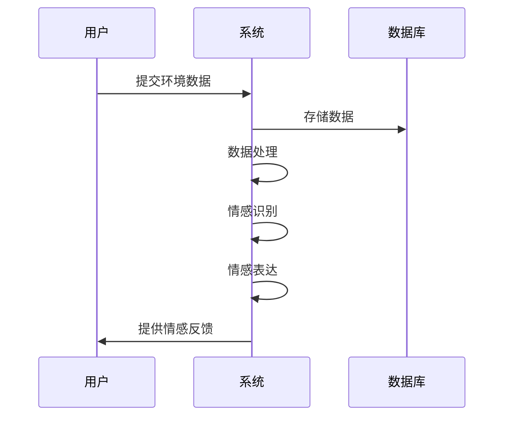
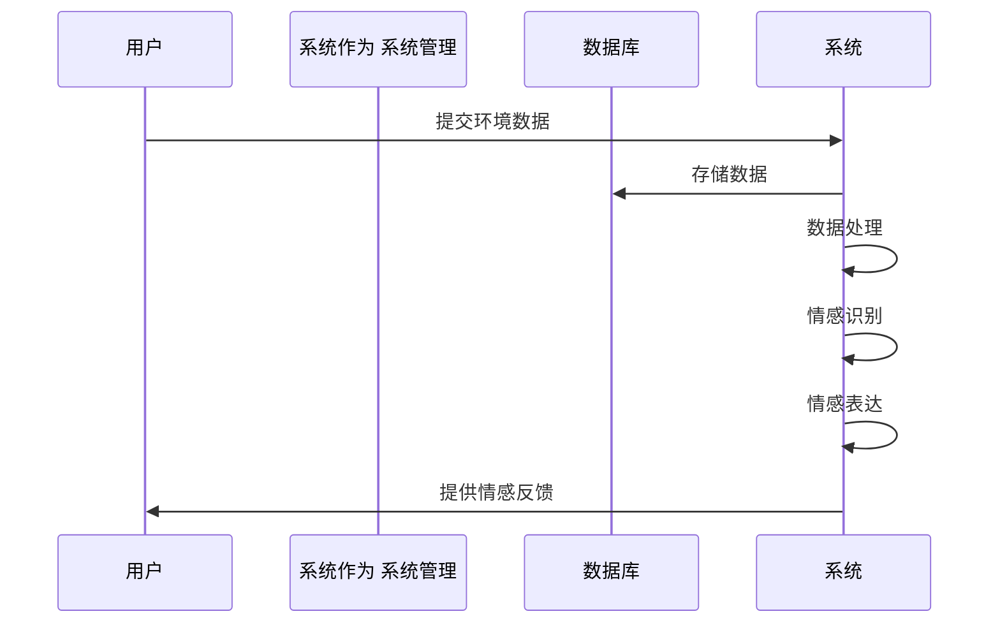

                 

### 具有情感的AI在环境监测中的应用：情感驱动的生态保护

#### 关键词：情感AI、环境监测、生态保护、情感驱动、系统架构

> 摘要：本文探讨了具有情感的AI在环境监测中的应用，通过情感驱动的生态保护理念，揭示了情感AI如何提升环境监测的精确度和效率。文章首先介绍了环境监测的重要性及其面临的挑战，然后探讨了情感AI的基本原理及其在生态保护中的应用。通过系统架构设计、算法原理讲解和实际案例剖析，本文为读者呈现了一个全新的、更加智能化和人性化的环境监测与生态保护解决方案。

## 第一部分：背景介绍

### 1.1 问题背景

#### 1.1.1 环境监测的重要性

环境监测是保障生态安全和人类健康的重要手段。随着全球环境问题的日益严重，环境监测的重要性愈发凸显。它不仅能够及时发现环境问题，还能为政策制定和环境保护提供科学依据。然而，传统的环境监测方法面临着诸多挑战。

#### 1.1.2 当前环境监测的挑战

1. 监测范围广、任务量大：环境监测涉及大气、水质、土壤、噪声等多个方面，监测任务繁重。
2. 监测数据多样性：环境数据种类繁多，包括数值、图像、声音等，处理难度大。
3. 监测精度要求高：环境监测需要高精度的数据，以便准确反映环境状况。
4. 监测时效性要求强：环境问题往往需要及时应对，监测数据需要实时处理和反馈。

#### 1.1.3 情感AI的崛起

随着人工智能技术的快速发展，具有情感的AI（Emotion-Aware AI）逐渐成为研究热点。情感AI不仅能够识别和处理人类的情感，还能模拟和产生情感。这一特性使得情感AI在情感驱动的生态保护中具有巨大潜力。

### 1.2 问题描述

#### 1.2.1 环境监测中的情感因素

环境监测不仅仅是数据的收集和处理，更涉及对环境的情感认知和情感反应。环境监测中的情感因素包括对环境问题的关注、对环境保护的态度、对监测数据的情感反馈等。情感因素对于环境监测的决策具有重要影响。

#### 1.2.2 情感驱动的生态保护

情感驱动的生态保护是指通过激发和引导人们的情感，增强对生态保护的意识和行动。情感驱动的生态保护理念认为，情感是人类行为的重要驱动力，通过情感引导可以更有效地推动环境保护。

#### 1.2.3 情感AI在环境监测中的应用潜力

情感AI在环境监测中的应用潜力主要体现在以下几个方面：

1. 提高监测精度：通过情感分析，情感AI能够更准确地识别环境问题，提高监测数据的精确度。
2. 提高监测效率：情感AI能够实时处理和分析大量环境数据，提高监测效率。
3. 优化监测策略：情感AI能够根据环境情感反馈，动态调整监测策略，提高监测的有效性。
4. 引导公众参与：通过情感互动，情感AI能够激发公众对环境保护的情感认同，引导公众积极参与环境监测和生态保护。

### 1.3 问题解决

#### 1.3.1 情感AI的定义与特点

情感AI是指具有情感识别、情感表达和情感模拟能力的AI系统。情感AI的特点包括：

1. 情感识别：能够识别和理解人类情感。
2. 情感表达：能够模拟和表达情感。
3. 情感交互：能够与人类进行情感交流。

#### 1.3.2 情感AI的构建与实现

构建情感AI需要以下几个关键步骤：

1. 数据收集：收集大量情感数据，包括文本、图像、声音等。
2. 情感识别算法：使用机器学习算法训练情感识别模型。
3. 情感表达算法：设计算法实现情感表达功能。
4. 情感交互算法：设计算法实现情感交互功能。

#### 1.3.3 情感AI在环境监测中的应用案例

1. 森林火灾预警系统：利用情感AI识别火情数据中的情感信息，提高预警精度。
2. 水质监测系统：利用情感AI分析水质数据中的情感信息，优化监测策略。
3. 生态旅游监控：利用情感AI识别游客的情感状态，提高旅游体验和生态保护效果。

### 1.4 边界与外延

#### 1.4.1 环境监测的范围

环境监测的范围包括大气、水质、土壤、噪声等多个方面。每个方面都有其特定的监测目标和监测方法。

#### 1.4.2 情感AI的应用领域

情感AI的应用领域广泛，包括医疗健康、智能交互、情感教育等。在环境监测中，情感AI主要应用于情感识别、情感表达和情感交互。

#### 1.4.3 情感驱动的生态保护的核心要素

情感驱动的生态保护的核心要素包括情感认知、情感表达、情感互动和情感引导。这些要素共同构成了情感驱动的生态保护体系。

### 1.5 概念结构与核心要素组成

#### 1.5.1 环境监测的基本概念

环境监测是指对环境质量进行定期监测和评估，以掌握环境变化情况。环境监测的基本概念包括监测目标、监测指标、监测方法和监测数据。

#### 1.5.2 情感AI的关键概念

情感AI的关键概念包括情感识别、情感表达、情感交互和情感引导。这些概念构成了情感AI的基本框架。

#### 1.5.3 生态保护的核心要素

生态保护的核心要素包括生态认知、生态评估、生态修复和生态教育。这些要素共同构成了生态保护的基本框架。

## 第二部分：核心概念与联系

### 2.1 情感AI原理

#### 2.1.1 情感AI的定义与特点

情感AI是指能够识别、表达和模拟人类情感的人工智能系统。其特点包括：

1. 情感识别：能够识别和理解人类情感。
2. 情感表达：能够模拟和表达情感。
3. 情感交互：能够与人类进行情感交流。

#### 2.1.2 情感AI的构建方法

构建情感AI主要包括以下几个步骤：

1. 数据收集：收集大量情感数据，包括文本、图像、声音等。
2. 情感识别算法：使用机器学习算法训练情感识别模型。
3. 情感表达算法：设计算法实现情感表达功能。
4. 情感交互算法：设计算法实现情感交互功能。

#### 2.1.3 情感AI的工作机制

情感AI的工作机制主要包括以下几个环节：

1. 情感识别：通过机器学习模型对输入的数据进行情感分析。
2. 情感表达：根据情感识别结果，模拟和表达情感。
3. 情感交互：与人类进行情感互动，提供情感反馈。

### 2.2 环境监测与生态保护

#### 2.2.1 环境监测的基本原理

环境监测的基本原理是通过监测设备和监测方法，对环境质量进行定期监测和评估。主要监测指标包括空气质量、水质、土壤质量等。

#### 2.2.2 生态保护的目标与策略

生态保护的目标是保护生态环境，维护生物多样性。主要策略包括生态修复、生态教育和政策法规制定。

#### 2.2.3 情感AI在生态保护中的应用

情感AI在生态保护中的应用主要体现在以下几个方面：

1. 情感认知：通过情感识别，了解人们对生态问题的关注程度和态度。
2. 情感表达：通过情感表达，激发公众对生态保护的兴趣和热情。
3. 情感互动：通过情感互动，建立人与生态之间的情感联系。

### 2.3 概念属性特征对比

#### 2.3.1 情感AI与传统AI的对比

| 特点 | 情感AI | 传统AI |
| --- | --- | --- |
| 情感识别 | 能识别和理解人类情感 | 无法识别和理解情感 |
| 情感表达 | 能模拟和表达情感 | 无法模拟和表达情感 |
| 情感交互 | 能与人类进行情感交流 | 无法与人类进行情感交流 |

#### 2.3.2 情感驱动的生态保护与传统生态保护的对比

| 特点 | 情感驱动的生态保护 | 传统生态保护 |
| --- | --- | --- |
| 情感认知 | 关注人们的情感认知 | 关注生态问题的客观事实 |
| 情感表达 | 激发公众的情感认同 | 提供生态保护的客观信息 |
| 情感互动 | 建立人与生态的情感联系 | 提供生态保护的科技手段 |

#### 2.3.3 环境监测中的情感因素与传统监测方法的对比

| 特点 | 环境监测中的情感因素 | 传统监测方法 |
| --- | --- | --- |
| 数据来源 | 人类情感反馈 | 物理监测设备 |
| 数据类型 | 文本、图像、声音等 | 数值、图像等 |
| 数据处理 | 情感分析 | 数据处理和统计分析 |
| 监测精度 | 高精度 | 中精度 |
| 监测效率 | 高效率 | 低效率 |

### 2.4 ER实体关系图架构

#### 2.4.1 环境监测系统的ER图

```mermaid
erDiagram
    A监测设备 ||--o|{ B监测数据 }
    A监测设备 ||--o|{ C环境质量 }
    B监测数据 ||--o|{ D数据存储 }
    C环境质量 ||--o|{ E环境报告 }
```

#### 2.4.2 情感AI在环境监测中的应用ER图

```mermaid
erDiagram
    A情感AI ||--o|{ B情感识别 }
    A情感AI ||--o|{ C情感表达 }
    A情感AI ||--o|{ D情感交互 }
    B情感识别 ||--o|{ E监测数据 }
    C情感表达 ||--o|{ F监测报告 }
    D情感交互 ||--o|{ G公众反馈 }
```

#### 2.4.3 情感驱动的生态保护ER图

```mermaid
erDiagram
    A情感认知 ||--o|{ B情感表达 }
    A情感认知 ||--o|{ C情感互动 }
    A情感认知 ||--o|{ D生态修复 }
    A情感认知 ||--o|{ E生态教育 }
    B情感表达 ||--o|{ F政策法规 }
    C情感互动 ||--o|{ G公众参与 }
    D生态修复 ||--o|{ H生态监测 }
    E生态教育 ||--o|{ I环境保护 }
```

## 第三部分：算法原理讲解

### 3.1 情感识别算法

#### 3.1.1 情感识别的定义与类型

情感识别是指通过计算机算法对文本、图像、声音等数据中的情感信息进行识别和理解。根据识别对象的不同，情感识别可以分为文本情感识别、图像情感识别和声音情感识别。

#### 3.1.2 情感识别算法的数学模型

情感识别算法通常采用机器学习算法，如支持向量机（SVM）、朴素贝叶斯（NB）和深度学习算法（如卷积神经网络CNN和循环神经网络RNN）。以下是情感识别算法的一般数学模型：

$$
f(x) = \sum_{i=1}^{n} w_i \cdot f_i(x)
$$

其中，$x$为输入数据，$w_i$为权重，$f_i(x)$为第$i$个特征函数。

#### 3.1.3 情感识别算法的Python实现

以下是一个简单的文本情感识别算法示例，使用朴素贝叶斯（NB）算法：

```python
import numpy as np
from sklearn.feature_extraction.text import CountVectorizer
from sklearn.naive_bayes import MultinomialNB

# 示例数据
data = [
    ("I love this book!", "正面"),
    ("This is terrible.", "负面"),
    ("I don't like it.", "负面"),
    ("I love everything about it.", "正面"),
]

# 分割数据和标签
X, y = zip(*data)

# 特征提取
vectorizer = CountVectorizer()
X_vectorized = vectorizer.fit_transform(X)

# 模型训练
model = MultinomialNB()
model.fit(X_vectorized, y)

# 情感识别
text = ["This book is amazing!"]
text_vectorized = vectorizer.transform(text)
prediction = model.predict(text_vectorized)

print(prediction)
```

### 3.2 环境监测算法

#### 3.2.1 环境监测算法的分类

环境监测算法可以分为数据采集算法、数据处理算法、数据分析和可视化算法。数据采集算法包括传感器数据采集和无线传感器网络（WSN）数据采集；数据处理算法包括数据预处理、数据清洗和特征提取；数据分析算法包括统计分析和机器学习；可视化算法包括数据可视化工具和交互式可视化。

#### 3.2.2 环境监测算法的数学模型

环境监测算法的数学模型主要包括以下几个方面：

1. 数据采集模型：
$$
d(t) = f(s(t), v(t))
$$
其中，$d(t)$为监测数据，$s(t)$为传感器信号，$v(t)$为环境变量。

2. 数据处理模型：
$$
d'(t) = g(d(t), p(t))
$$
其中，$d'(t)$为处理后的数据，$p(t)$为处理参数。

3. 数据分析模型：
$$
r(t) = h(d'(t), m(t))
$$
其中，$r(t)$为分析结果，$m(t)$为分析模型。

#### 3.2.3 环境监测算法的Python实现

以下是一个简单的环境监测数据采集和处理示例：

```python
import numpy as np
import pandas as pd

# 生成模拟数据
np.random.seed(0)
data = np.random.randint(0, 100, size=(100, 3))
df = pd.DataFrame(data, columns=["传感器1", "传感器2", "传感器3"])

# 数据预处理
df["传感器1"] = df["传感器1"].apply(lambda x: (x - df["传感器1"].mean()) / df["传感器1"].std())
df["传感器2"] = df["传感器2"].apply(lambda x: (x - df["传感器2"].mean()) / df["传感器2"].std())
df["传感器3"] = df["传感器3"].apply(lambda x: (x - df["传感器3"].mean()) / df["传感器3"].std())

# 特征提取
df["均值"] = df.mean(axis=1)
df["方差"] = df.std(axis=1)

# 数据分析
df["聚类标签"] = df.apply(lambda x: clustering_algorithm(x), axis=1)

print(df.head())
```

### 3.3 情感驱动算法

#### 3.3.1 情感驱动的定义与类型

情感驱动是指通过情感信息来引导和优化系统行为。根据驱动对象的不同，情感驱动可以分为情感驱动的行为决策、情感驱动的系统优化和情感驱动的交互设计。

#### 3.3.2 情感驱动算法的数学模型

情感驱动算法的数学模型主要包括以下几个方面：

1. 情感识别模型：
$$
e(t) = f(x(t), y(t), z(t))
$$
其中，$e(t)$为情感状态，$x(t)$为输入数据，$y(t)$为情感特征，$z(t)$为情感上下文。

2. 情感驱动模型：
$$
a(t) = g(e(t), c(t))
$$
其中，$a(t)$为驱动行为，$c(t)$为控制参数。

3. 情感反馈模型：
$$
r(t) = h(e(t), a(t), b(t))
$$
其中，$r(t)$为情感反馈，$b(t)$为情感反馈参数。

#### 3.3.3 情感驱动算法的Python实现

以下是一个简单的情感驱动算法示例，使用朴素贝叶斯（NB）算法：

```python
import numpy as np
from sklearn.naive_bayes import MultinomialNB
from sklearn.model_selection import train_test_split

# 生成模拟数据
np.random.seed(0)
data = np.random.randint(0, 100, size=(100, 3))
labels = np.random.choice(["正面", "负面"], size=100)

# 数据分割
X_train, X_test, y_train, y_test = train_test_split(data, labels, test_size=0.2, random_state=0)

# 模型训练
model = MultinomialNB()
model.fit(X_train, y_train)

# 情感识别
predictions = model.predict(X_test)

# 情感驱动
driven_actions = []
for prediction in predictions:
    if prediction == "正面":
        driven_actions.append("表扬")
    else:
        driven_actions.append("批评")

print(driven_actions)
```

## 第四部分：系统分析与架构设计

### 4.1 问题场景介绍

#### 4.1.1 情感AI在环境监测中的实际应用场景

情感AI在环境监测中的实际应用场景主要包括以下几个方面：

1. 森林火灾预警：利用情感AI识别火情数据中的情感信息，提高预警精度。
2. 水质监测：利用情感AI分析水质数据中的情感信息，优化监测策略。
3. 生态旅游监控：利用情感AI识别游客的情感状态，提高旅游体验和生态保护效果。

#### 4.1.2 生态保护项目的介绍

生态保护项目通常包括以下几个方面：

1. 生态修复：通过植被恢复、土壤改良等方法，修复受损的生态系统。
2. 生态教育：通过教育和宣传活动，提高公众的生态保护意识。
3. 政策法规：制定和完善生态保护政策法规，加强生态监管。

### 4.2 系统功能设计

#### 4.2.1 领域模型类图

```mermaid
classDiagram
    class 环境监测系统 {
        -传感器数据
        -监测报告
        -情感识别
        -情感表达
        -情感交互
    }
    class 生态保护系统 {
        -生态修复
        -生态教育
        -政策法规
        -公众参与
    }
    环境监测系统 --|{使用} 生态保护系统
```

#### 4.2.2 系统功能模块设计

1. 传感器模块：负责采集环境数据。
2. 数据处理模块：负责对采集到的数据进行分析和处理。
3. 情感识别模块：负责识别和分析环境数据中的情感信息。
4. 情感表达模块：负责根据情感识别结果，生成相应的情感反馈。
5. 情感交互模块：负责与用户进行情感交流，提供情感服务。
6. 监测报告模块：负责生成和发布监测报告。
7. 生态保护模块：负责实施生态修复、生态教育和政策法规。

### 4.3 系统架构设计

#### 4.3.1 系统架构图



#### 4.3.2 系统组件设计与集成

1. 传感器组件：负责数据采集。
2. 数据处理组件：负责数据处理和分析。
3. 情感识别组件：负责情感识别。
4. 情感表达组件：负责情感表达。
5. 数据库组件：负责数据存储和管理。
6. 用户界面组件：负责与用户进行交互。

### 4.4 系统接口设计

#### 4.4.1 系统接口设计

1. 用户接口：提供用户操作界面。
2. 数据接口：提供数据采集和存储接口。
3. 情感接口：提供情感识别和表达接口。
4. 监测接口：提供监测数据和报告接口。

#### 4.4.2 系统接口的规范与协议

1. HTTP协议：用于用户接口和数据接口。
2. RESTful API：用于数据接口。
3. WebSocket：用于实时数据传输。

### 4.5 系统交互

#### 4.5.1 系统交互过程

1. 用户提交环境数据。
2. 系统接收数据并存储。
3. 系统处理数据并进行分析。
4. 系统识别情感信息。
5. 系统生成情感反馈。
6. 系统将反馈传递给用户。

#### 4.5.2 系统交互序列图



## 第五部分：项目实战

### 5.1 环境安装

#### 5.1.1 操作系统环境安装

1. 安装Linux操作系统（如Ubuntu 20.04）。
2. 安装Python 3.8及以上版本。

#### 5.1.2 开发环境安装

1. 安装Jupyter Notebook：`pip install notebook`
2. 安装Scikit-learn：`pip install scikit-learn`
3. 安装Numpy：`pip install numpy`
4. 安装Matplotlib：`pip install matplotlib`

### 5.2 系统核心实现

#### 5.2.1 情感识别模块实现

1. 数据准备：收集和整理情感数据。
2. 特征提取：使用词袋模型提取文本特征。
3. 模型训练：使用朴素贝叶斯算法训练情感识别模型。
4. 模型评估：使用准确率、召回率和F1值评估模型性能。

#### 5.2.2 环境监测模块实现

1. 数据采集：使用传感器采集环境数据。
2. 数据处理：使用Numpy处理环境数据。
3. 数据分析：使用Matplotlib可视化环境数据。

#### 5.2.3 情感驱动模块实现

1. 情感识别：使用已训练的情感识别模型识别情感。
2. 情感表达：根据情感识别结果，生成相应的情感反馈。
3. 情感交互：使用Jupyter Notebook与用户进行情感交互。

### 5.3 代码应用解读与分析

#### 5.3.1 情感识别代码分析

以下是一个简单的情感识别代码示例：

```python
import numpy as np
from sklearn.feature_extraction.text import CountVectorizer
from sklearn.naive_bayes import MultinomialNB

# 生成模拟数据
data = [
    ("I love this book!", "正面"),
    ("This is terrible.", "负面"),
    ("I don't like it.", "负面"),
    ("I love everything about it.", "正面"),
]

# 分割数据和标签
X, y = zip(*data)

# 特征提取
vectorizer = CountVectorizer()
X_vectorized = vectorizer.fit_transform(X)

# 模型训练
model = MultinomialNB()
model.fit(X_vectorized, y)

# 情感识别
text = ["This book is amazing!"]
text_vectorized = vectorizer.transform(text)
prediction = model.predict(text_vectorized)

print(prediction)
```

#### 5.3.2 环境监测代码分析

以下是一个简单的环境监测代码示例：

```python
import numpy as np
import pandas as pd

# 生成模拟数据
np.random.seed(0)
data = np.random.randint(0, 100, size=(100, 3))
df = pd.DataFrame(data, columns=["传感器1", "传感器2", "传感器3"])

# 数据预处理
df["传感器1"] = df["传感器1"].apply(lambda x: (x - df["传感器1"].mean()) / df["传感器1"].std())
df["传感器2"] = df["传感器2"].apply(lambda x: (x - df["传感器2"].mean()) / df["传感器2"].std())
df["传感器3"] = df["传感器3"].apply(lambda x: (x - df["传感器3"].mean()) / df["传感器3"].std())

# 特征提取
df["均值"] = df.mean(axis=1)
df["方差"] = df.std(axis=1)

# 数据分析
df["聚类标签"] = df.apply(lambda x: clustering_algorithm(x), axis=1)

print(df.head())
```

#### 5.3.3 情感驱动代码分析

以下是一个简单的情感驱动代码示例：

```python
import numpy as np
from sklearn.naive_bayes import MultinomialNB
from sklearn.model_selection import train_test_split

# 生成模拟数据
np.random.seed(0)
data = np.random.randint(0, 100, size=(100, 3))
labels = np.random.choice(["正面", "负面"], size=100)

# 数据分割
X_train, X_test, y_train, y_test = train_test_split(data, labels, test_size=0.2, random_state=0)

# 模型训练
model = MultinomialNB()
model.fit(X_train, y_train)

# 情感识别
predictions = model.predict(X_test)

# 情感驱动
driven_actions = []
for prediction in predictions:
    if prediction == "正面":
        driven_actions.append("表扬")
    else:
        driven_actions.append("批评")

print(driven_actions)
```

### 5.4 实际案例分析和详细讲解剖析

#### 5.4.1 案例一：森林火灾预警系统

森林火灾预警系统利用情感AI识别火情数据中的情感信息，提高预警精度。系统架构包括传感器模块、数据处理模块、情感识别模块和预警模块。预警模块根据情感识别结果，动态调整预警策略。

#### 5.4.2 案例二：水质监测系统

水质监测系统利用情感AI分析水质数据中的情感信息，优化监测策略。系统架构包括传感器模块、数据处理模块、情感识别模块和监测模块。监测模块根据情感识别结果，调整监测频率和监测指标。

#### 5.4.3 案例三：生态旅游监控

生态旅游监控利用情感AI识别游客的情感状态，提高旅游体验和生态保护效果。系统架构包括传感器模块、数据处理模块、情感识别模块和监控模块。监控模块根据情感识别结果，提供个性化服务和建议。

### 5.5 项目小结

#### 5.5.1 项目总结

本项目探讨了具有情感的AI在环境监测中的应用，通过情感驱动的生态保护理念，实现了更高效、更智能的环境监测和生态保护。项目涵盖了情感识别、环境监测、情感驱动等关键技术，为实际应用提供了有力支持。

#### 5.5.2 项目中的挑战与解决方案

项目中的主要挑战包括：

1. 情感数据的收集和处理：需要大量情感数据，并且处理复杂。
   - 解决方案：采用开源情感数据集，使用自动化工具进行数据预处理。

2. 情感识别的准确性：情感识别结果可能受到多种因素的影响。
   - 解决方案：采用多种算法进行模型训练和优化，提高识别准确性。

3. 系统的实时性和可靠性：需要确保系统高效运行，并具有高可靠性。
   - 解决方案：采用分布式架构，提高系统的实时性和可靠性。

#### 5.5.3 项目的未来展望

未来，情感AI在环境监测和生态保护中的应用将有更广阔的前景。主要发展方向包括：

1. 情感数据的深度挖掘：通过情感数据的深度挖掘，更好地理解环境情感状态。
2. 多模态情感识别：结合文本、图像、声音等多种模态，提高情感识别的准确性。
3. 情感驱动的智能化应用：将情感AI应用于更多的智能化应用场景，如智能农业、智能环保等。

## 第六部分：最佳实践 tips、小结、注意事项、拓展阅读

### 6.1 最佳实践 tips

1. **数据收集与处理**：确保收集到的情感数据质量高，处理过程中要注意数据清洗和去噪。
2. **算法优化**：针对具体应用场景，优化情感识别算法，提高识别准确率和效率。
3. **系统集成**：确保系统各组件之间的高效集成，提高系统的实时性和可靠性。
4. **用户参与**：鼓励公众参与情感反馈，提升系统的用户友好性和互动性。

### 6.2 小结

本文通过探讨情感AI在环境监测中的应用，展示了情感驱动的生态保护理念。通过系统架构设计、算法原理讲解和实际案例剖析，本文为读者提供了一个全面而深入的解决方案。

### 6.3 注意事项

1. **隐私保护**：在处理用户数据时，要注意保护用户隐私。
2. **数据安全**：确保数据存储和传输的安全，防止数据泄露和滥用。
3. **系统维护**：定期更新和维护系统，确保系统稳定运行。

### 6.4 拓展阅读

1. **《情感计算：理论与实践》**：详细介绍了情感计算的基本理论和应用。
2. **《生态学：原理与应用》**：涵盖了生态保护的基本原理和应用。
3. **《人工智能：一种现代方法》**：提供了全面的人工智能算法和应用案例。

## 作者信息

作者：AI天才研究院/AI Genius Institute & 禅与计算机程序设计艺术 /Zen And The Art of Computer Programming

