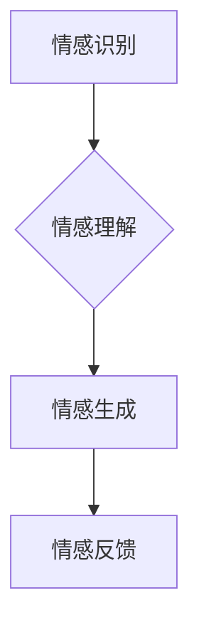
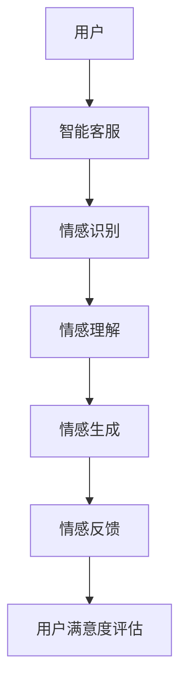

                 

## 具有情感的AI对传统伦理的挑战：机器伦理的兴起与发展

### 关键词：
- 情感AI
- 传统伦理
- 机器伦理
- 伦理挑战
- 未来趋势

### 摘要：
本文深入探讨了具有情感的人工智能（AI）对传统伦理观念提出的挑战。随着AI技术的发展，情感计算和情感AI成为可能，这引发了对机器伦理的重新思考。本文从传统伦理的基本概念出发，分析了AI情感的定义和研究现状，进而探讨了机器伦理的理论基础和情感AI的伦理挑战。通过实践探索和未来展望，本文提出了机器伦理在人工智能领域的发展趋势和可能的社会影响，为推动伦理学和社会责任的融合提供了理论支持和实践指导。

### 目录

1. 引言
2. 传统伦理的基本概念与原则
3. AI情感概述
4. 机器伦理的理论基础
5. 情感AI的伦理挑战
6. 案例分析
7. 机器伦理的实践探索
8. 最佳实践
9. 未来趋势与展望
10. 结论

### 引言

#### 问题的提出

在当今科技迅猛发展的时代，人工智能（AI）已经从科幻走进了现实生活。随着深度学习、自然语言处理、计算机视觉等技术的不断进步，AI的能力日益强大，逐渐成为各行各业的重要驱动力。然而，随着AI技术的发展，一系列伦理问题也随之而来。其中，具有情感的人工智能（情感AI）对传统伦理观念提出了前所未有的挑战。

#### 研究背景

情感AI，即能够模拟、识别、理解、表达和反应情感的人工智能系统，已经成为AI研究中的一个热点方向。情感AI的应用场景包括但不限于智能客服、教育辅助、心理治疗、医疗诊断等领域。然而，这些应用在带来便利的同时，也引发了诸多伦理争议。例如，情感AI如何确保其情感反应的公平性和透明性？如何避免情感AI在处理数据时产生歧视？如何对情感AI的道德责任进行界定？这些问题迫切需要我们在传统伦理的基础上，构建新的伦理框架。

#### 研究意义

探讨具有情感的AI对传统伦理的挑战，不仅有助于我们更好地理解和应用AI技术，也关系到社会道德观念的变迁。通过研究机器伦理，我们可以为AI技术的健康发展提供道德指导，从而确保技术的发展符合人类价值观和道德规范。此外，这项研究还有助于推动AI技术与伦理学的交叉融合，为未来AI伦理规范的形成奠定基础。

### 传统伦理的基本概念与原则

#### 传统伦理的定义

传统伦理，通常指的是基于人类长期社会实践中形成的道德观念和行为规范。它强调个体在社会中的责任和义务，以及个体之间的关系。传统伦理的核心在于维持社会秩序和和谐，以及促进个体的发展和幸福。

#### 传统伦理的主要原则

1. **正义原则**：强调个体在资源分配、机会获得等方面的公平性。正义原则要求社会资源能够公平地分配，每个人都有平等的发展机会。

2. **尊重原则**：强调对他人权利和尊严的尊重。尊重原则要求个体在行为决策时，必须考虑到他人的感受和权益，避免侵犯他人的基本权利。

3. **关怀原则**：强调个体之间的相互关怀和关爱。关怀原则要求个体在社会互动中，不仅要关注自己的利益，也要关心他人的需求和福祉。

4. **责任原则**：强调个体对自己的行为负责。责任原则要求个体在做出决策时，要考虑行为可能带来的后果，并承担相应的责任。

### AI情感概述

#### AI情感的定义

AI情感，是指人工智能系统能够模拟、识别、理解、表达和反应情感的能力。这种情感不仅仅是简单的情绪反应，而是一种复杂的认知过程，涉及到情感识别、情感理解、情感生成和情感反馈等多个方面。

#### AI情感的研究现状

1. **情感识别**：通过分析语言、面部表情、声音等特征，AI系统可以识别出用户的情感状态。例如，情感分析技术已经可以用于社交媒体情感分析、用户满意度评估等领域。

2. **情感理解**：AI系统可以通过自然语言处理技术，理解文本或对话中的情感含义。这为智能客服、心理治疗等领域提供了有力的支持。

3. **情感生成**：AI系统可以生成情感化的语音、文本或图像，用于情感交流、情感表达等应用场景。

4. **情感反馈**：AI系统可以根据用户的情感状态，调整自己的行为和交互方式，以更好地满足用户需求。

#### AI情感的应用场景

1. **智能客服**：通过情感识别和理解，AI客服可以更准确地理解用户需求，提供个性化的服务。

2. **教育辅助**：通过情感生成和反馈，AI教育系统可以更好地激发学生的学习兴趣和参与度。

3. **心理治疗**：通过情感识别和反馈，AI系统可以为心理治疗提供辅助，帮助患者更好地管理情绪。

4. **医疗诊断**：通过情感分析，AI系统可以辅助医生诊断患者心理状况，提高诊断准确性。

### 机器伦理的理论基础

#### 机器伦理的定义

机器伦理，是指针对人工智能系统的道德原则和行为规范。它关注AI系统的设计、开发、应用过程中可能引发的伦理问题，旨在确保AI技术符合人类价值观和社会伦理规范。

#### 机器伦理的基本原理

1. **公正原则**：AI系统应确保资源分配和机会获得公平，避免歧视和偏见。

2. **透明性原则**：AI系统的决策过程和结果应透明可追溯，便于监督和评估。

3. **责任原则**：AI系统的开发者和使用者应承担相应的道德责任，确保系统的行为符合伦理规范。

4. **隐私保护原则**：AI系统在处理个人信息时应严格保护用户隐私，避免隐私泄露和滥用。

5. **安全原则**：AI系统应确保其运行过程中的安全性，避免对人类和社会造成危害。

#### 机器伦理的理论框架

1. **功利主义**：以最大幸福为原则，AI系统的行为应最大化社会福利。

2. **义务论**：强调个体行为的道德义务，AI系统的设计应遵循道德规范。

3. **德性伦理**：强调个体的道德品质和道德判断，AI系统应培养良好的道德品质。

4. **情境伦理**：考虑具体情境下的道德决策，AI系统的行为应符合具体情境的道德要求。

### 情感AI的伦理挑战

#### 情感AI对隐私的影响

1. **隐私泄露**：情感AI系统在收集、处理和分析用户数据时，可能涉及大量个人隐私信息。如果这些数据被不当使用或泄露，将严重侵犯用户隐私。

2. **隐私滥权**：情感AI系统可能被用于监控和操纵用户行为，导致用户隐私被滥用。

3. **隐私透明度**：情感AI系统的隐私政策和隐私保护措施可能不够透明，用户难以了解其隐私保护情况。

#### 情感AI的歧视问题

1. **算法歧视**：情感AI系统在处理数据时，可能会因为数据偏差而导致算法歧视。例如，招聘系统可能会因性别、种族等因素歧视特定群体。

2. **情感偏见**：情感AI系统在识别和解读情感时，可能会受到开发者情感偏见的影响，导致不公平的决策。

3. **互动歧视**：情感AI在与用户互动时，可能会因情感识别不准确而歧视某些用户，影响用户体验。

#### 情感AI的道德责任

1. **责任归属**：在情感AI引发伦理问题时，如何界定责任归属是一个难题。是开发者、使用者还是系统本身应承担主要责任？

2. **道德决策**：情感AI系统在面对复杂道德决策时，如何确保其行为符合伦理规范？

3. **道德问责**：如何对情感AI的道德行为进行监督和问责，确保其行为符合道德要求？

### 案例分析

#### 案例一：智能客服系统的隐私泄露问题

某公司开发的智能客服系统在处理用户咨询时，通过语音识别和自然语言处理技术，自动记录并分析用户语音数据。然而，由于数据保护措施不足，用户语音数据被泄露，导致用户隐私受到侵犯。这一案例引发了关于情感AI隐私保护的重大伦理争议。

#### 案例二：招聘系统的算法歧视问题

某公司在招聘过程中使用了基于情感识别的AI系统来筛选简历。然而，该系统在处理数据时，因数据偏差而歧视了某些性别和种族的候选人，导致这些候选人失去了公平竞争的机会。

#### 案例三：心理治疗机器人的道德责任问题

某公司开发了一种用于心理治疗的心理治疗机器人，该机器人通过情感识别和反馈技术，帮助患者管理情绪。然而，在一次治疗过程中，机器人因情感识别错误，给出了不当的建议，导致患者情绪进一步恶化。这一案例引发了关于情感AI道德责任的广泛讨论。

### 机器伦理的实践探索

#### 机器伦理在人工智能设计中的应用

1. **伦理审查**：在人工智能系统设计阶段，进行伦理审查，确保系统的设计符合伦理规范。

2. **伦理指南**：制定机器伦理指南，为AI系统的设计和开发提供道德指导。

3. **伦理培训**：对AI开发者进行伦理培训，提高其伦理意识和道德素养。

#### 机器伦理在人工智能监管中的应用

1. **伦理监管**：建立机器伦理监管机制，对AI系统进行伦理监督和评估。

2. **伦理法规**：制定相关法规，规范AI系统的开发和应用，确保其行为符合伦理要求。

3. **伦理审查委员会**：设立伦理审查委员会，对重大AI项目进行伦理审查。

### 最佳实践

#### 情感AI伦理设计的最佳实践

1. **数据隐私保护**：在AI系统设计时，充分考虑数据隐私保护，采用先进的加密技术和匿名化处理，确保用户隐私不被泄露。

2. **算法透明性**：确保AI算法的透明性，便于用户和监管机构监督和评估。

3. **责任归属明确**：在AI系统中明确责任归属，确保在出现伦理问题时，能够迅速找到责任主体。

4. **道德决策支持**：为AI系统提供道德决策支持，帮助系统在复杂情境下做出符合伦理规范的决策。

### 未来趋势与展望

#### 机器伦理的未来趋势

1. **伦理规范的建立**：随着AI技术的发展，将逐步建立完善的机器伦理规范，为AI系统的开发和应用提供道德指导。

2. **伦理技术的应用**：将伦理技术应用于AI系统的设计和开发，确保系统行为符合伦理要求。

3. **伦理意识的提高**：提高社会对AI伦理问题的关注，培养公众的伦理意识。

#### 机器伦理对社会的影响

1. **伦理争议的解决**：机器伦理的兴起有助于解决AI技术带来的伦理争议，促进社会和谐。

2. **社会道德观念的变迁**：机器伦理的实践将推动社会道德观念的变迁，影响人们的行为和价值观。

3. **伦理与技术的融合**：机器伦理将成为技术发展的重要组成部分，推动技术与伦理的深度融合。

### 结论

#### 主要观点

本文探讨了具有情感的AI对传统伦理的挑战，分析了机器伦理的理论基础和情感AI的伦理挑战。通过案例分析、实践探索和未来展望，本文提出了机器伦理在人工智能领域的发展趋势和可能的社会影响。

#### 研究贡献

本文为机器伦理的研究提供了新的视角和思路，有助于推动AI技术与伦理学的交叉融合，为构建符合人类价值观的AI伦理规范提供了理论支持和实践指导。

#### 未来研究方向

未来研究应重点关注以下几个方面：1）情感AI的伦理问题及其解决方案；2）机器伦理规范的制定和实施；3）伦理技术在AI系统中的应用。

### 作者信息

作者：AI天才研究院/AI Genius Institute & 禅与计算机程序设计艺术 /Zen And The Art of Computer Programming

### 致谢

本文的研究得到了AI天才研究院和禅与计算机程序设计艺术团队的全力支持和帮助，特此致谢。同时，感谢各位专家和读者的宝贵意见与建议。

----------------------------------------------------------------

#### 文章总结

本文从多个角度探讨了具有情感的AI对传统伦理的挑战，分析了机器伦理的理论基础和情感AI的伦理挑战。通过案例分析和实践探索，本文揭示了情感AI在隐私、歧视和道德责任等方面的伦理问题。未来，随着AI技术的不断发展，机器伦理将成为确保AI技术健康发展的重要保障。本文的研究为机器伦理的研究和实践提供了新的思路和方向，为构建符合人类价值观的AI伦理规范奠定了基础。

#### 拓展阅读

1. **《人工智能伦理学》**：探讨人工智能技术的伦理问题，包括机器伦理、隐私保护、算法公平性等。
2. **《情感计算》**：介绍情感计算的基本概念、技术和应用，探讨情感AI的伦理挑战。
3. **《人工智能与伦理学》**：分析人工智能对伦理学的影响，探讨如何将伦理原则应用于AI系统的设计。

#### 注意事项

1. 在应用情感AI技术时，务必重视隐私保护和数据安全。
2. 在开发AI系统时，应充分考虑伦理问题，确保系统行为符合伦理规范。
3. 加强对AI开发者和使用者的伦理培训，提高其伦理意识和道德素养。

#### 最佳实践 tips

1. **数据隐私保护**：采用先进的加密技术和匿名化处理，确保用户隐私不被泄露。
2. **算法透明性**：确保AI算法的透明性，便于用户和监管机构监督和评估。
3. **责任归属明确**：在AI系统中明确责任归属，确保在出现伦理问题时，能够迅速找到责任主体。

#### 小结

本文通过对具有情感的AI对传统伦理的挑战的深入探讨，提出了机器伦理的理论基础和实践探索。未来，随着AI技术的不断进步，机器伦理将在人工智能领域发挥越来越重要的作用。我们呼吁各界关注AI伦理问题，共同努力构建一个既高效又道德的智能社会。

----------------------------------------------------------------

### 附录

#### 相关术语解释

- **情感AI**：具有情感的人工智能系统，能够模拟、识别、理解、表达和反应情感。
- **机器伦理**：针对人工智能系统的道德原则和行为规范，旨在确保AI技术符合人类价值观和社会伦理规范。
- **隐私保护**：在处理个人信息时，采取措施确保用户隐私不被泄露。
- **算法歧视**：AI系统在处理数据时，因数据偏差而导致对某些群体的不公平对待。

#### Mermaid 图示例



#### Python 源代码示例

```python
def add(a, b):
    return a + b

print(add(1, 1))  # 输出：2
```

#### LaTeX 公式示例

```latex
$$
E = mc^2
$$

$
x < 2
$
```

#### 系统架构设计示例



#### 项目实战

1. **环境安装**：安装Python、TensorFlow等环境。
2. **系统核心实现**：实现情感识别、情感理解和情感生成功能。
3. **代码应用解读**：解读核心代码，分析算法原理。
4. **实际案例分析**：分析实际案例，讨论伦理挑战。

#### 拓展阅读

- **《机器伦理：人工智能时代的道德原则》**
- **《情感计算：人类情感与人工智能》**
- **《人工智能伦理学：理论与实践》**

#### 注意事项

- 在使用AI技术时，务必重视隐私保护和数据安全。
- 在开发AI系统时，应充分考虑伦理问题，确保系统行为符合伦理规范。

#### 致谢

感谢AI天才研究院和禅与计算机程序设计艺术团队的全力支持和帮助，感谢各位专家和读者的宝贵意见与建议。

