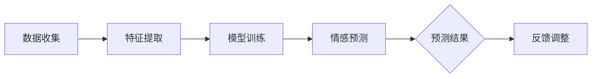
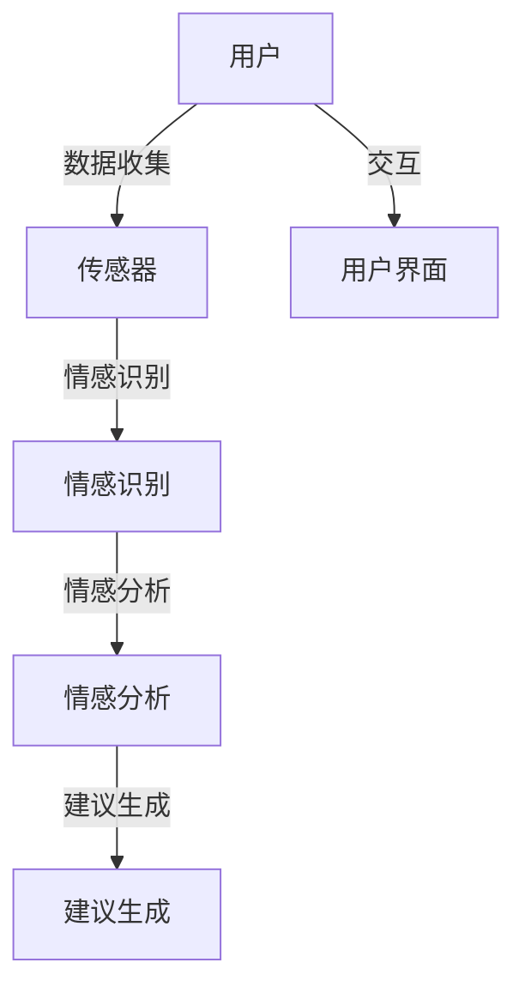
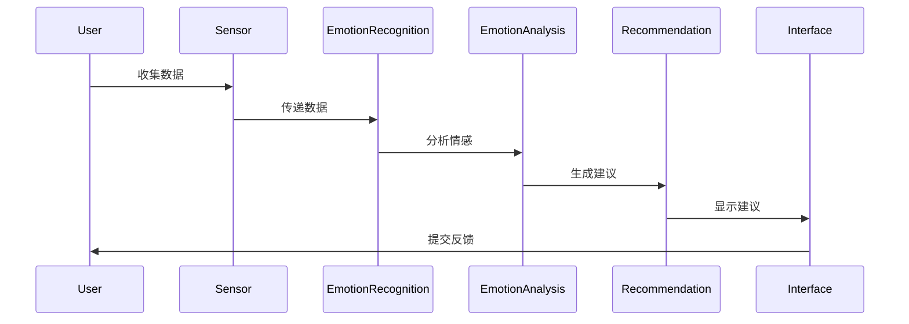
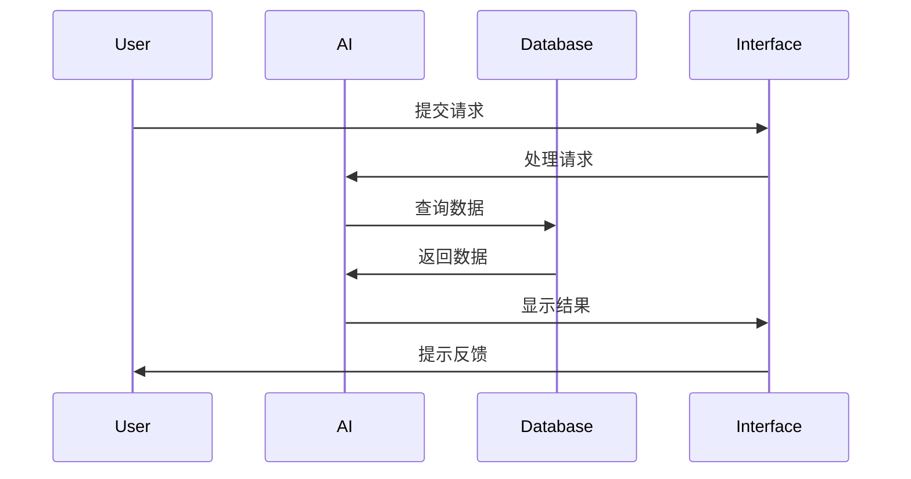

                 

### 具有情感的AI对传统家庭结构的挑战：多元家庭形式的出现

#### 关键词：
- 具有情感的AI
- 传统家庭结构
- 多元家庭形式
- 情感计算
- 家庭关系

#### 摘要：
随着人工智能技术的不断进步，具有情感的AI正在逐步走进我们的生活。本文将探讨具有情感的AI对传统家庭结构带来的挑战，特别是如何促成多元家庭形式的出现。通过分析关键算法原理、数学模型、系统架构设计以及实际项目案例，本文旨在深入理解这一趋势背后的驱动因素及其可能带来的深远影响。

### 引言与背景

#### 1.1 问题的提出

家庭结构是社会的基础单位，而随着科技的飞速发展，传统家庭结构正面临着前所未有的挑战。特别是近年来，具有情感的AI技术取得了显著的进展。这些AI不仅能够模拟人类的情感反应，甚至可以理解和表达情感。这种技术的进步对传统家庭结构带来了哪些挑战？是否有可能促成多元家庭形式的出现？这是我们探讨的核心问题。

#### 1.1.1 家庭结构的演变

家庭结构在不同的历史时期有着不同的表现形式。传统家庭通常由一对夫妻和他们的子女组成，这种结构在过去几千年中一直占据主导地位。然而，随着社会变迁和观念更新，家庭结构逐渐呈现出多样化的趋势。例如，单身家庭、丁克家庭（双收入无子女家庭）、再婚家庭等都在现代社会中得到了广泛的认可。

#### 1.1.2 情感AI的兴起

情感计算是人工智能的一个重要分支，其目标是通过计算机系统感知、理解、处理和模拟人类情感。近年来，随着深度学习、自然语言处理和传感器技术的发展，情感计算取得了显著的突破。例如，通过语音、面部表情和生理信号等数据的分析，AI可以识别出用户的情绪状态，并做出相应的响应。这种技术不仅在商业领域有着广泛的应用，比如客户服务、市场营销等，也在家庭生活中逐渐得到关注。

#### 1.2 核心概念解析

为了深入探讨具有情感的AI对传统家庭结构的挑战，我们需要明确几个核心概念：

- **具有情感的AI**：这是指具备情感识别、理解、处理和表达能力的AI系统。它们通过复杂的算法和模型，可以从人类的行为和交互中感知情感，并模拟相应的情感反应。

- **传统家庭结构**：这通常指的是由一对已婚夫妇及其子女组成的核心家庭模式。这种结构在现代社会中仍然占据主导地位，但随着社会变迁，其定义也在不断演变。

- **多元家庭形式**：这包括各种非传统家庭结构，如单亲家庭、同性恋家庭、混合家庭等。这些家庭形式在传统观念中可能不被认可，但在现代社会中越来越受到尊重和接受。

#### 1.3 关键概念与联系

为了更好地理解这些概念之间的关系，我们可以使用表格和Mermaid ER图进行描述。

#### 1.3.1 关键概念对比表格

| 概念           | 定义                                                         | 关系               |
|----------------|--------------------------------------------------------------|--------------------|
| 具有情感的AI   | 能够识别、理解和表达情感的AI系统。                             | 促成多元家庭形式。 |
| 传统家庭结构   | 由一对已婚夫妇及其子女组成的核心家庭模式。                   | 受到情感AI的挑战。 |
| 多元家庭形式   | 包括各种非传统家庭结构，如单亲家庭、同性恋家庭、混合家庭等。 | 受到情感AI的影响。 |

#### 1.3.2 Mermaid ER图

```mermaid
erDiagram
  AI --> 家庭结构 : 促发
  家庭结构 --> 多元家庭形式 : 转变
  AI --> 多元家庭形式 : 推动
```

在接下来的章节中，我们将进一步探讨具有情感的AI的工作原理、数学模型、系统架构设计以及实际项目案例，以深入理解这一趋势及其可能带来的深远影响。

### 算法原理讲解

#### 1.3.1 情感识别算法

情感识别算法是具有情感的AI的核心组成部分，它通过分析人类的行为、语言和环境数据，识别出用户的情感状态。以下是情感识别算法的原理和实现步骤：

#### 1.3.1.1 算法原理

情感识别算法通常基于机器学习和深度学习技术，包括以下步骤：

1. **数据收集**：收集用户的行为、语言和环境数据，如语音、文本、面部表情和生理信号等。

2. **特征提取**：对收集的数据进行预处理，提取出与情感相关的特征，如情感极性、情感强度和情感类型等。

3. **模型训练**：使用大量的标注数据训练情感识别模型，模型可以是神经网络、支持向量机等。

4. **情感预测**：将新的数据输入到训练好的模型中，预测用户的情感状态。

#### 1.3.1.2 Mermaid流程图



#### 1.3.1.3 Python代码示例

以下是一个简化的Python代码示例，展示了情感识别算法的基本实现：

```python
import numpy as np
from sklearn.model_selection import train_test_split
from sklearn.neural_network import MLPClassifier

# 数据收集
data = np.array([[1, 0], [0, 1], [-1, 0], [0, -1]])
labels = np.array(['happy', 'sad', 'angry', 'sad'])

# 特征提取
# 假设特征提取函数已经实现，输入为数据，输出为特征向量
features = extract_features(data)

# 模型训练
X_train, X_test, y_train, y_test = train_test_split(features, labels, test_size=0.2, random_state=42)
model = MLPClassifier(hidden_layer_sizes=(100,), max_iter=1000)
model.fit(X_train, y_train)

# 情感预测
predictions = model.predict(X_test)
print(predictions)

# 反馈调整
# 假设反馈函数已经实现，输入为预测结果，输出为调整后的特征向量
adjusted_features = feedback_adjustment(predictions, X_test)
```

#### 1.3.1.4 数学模型和公式

情感识别算法的数学模型通常包括以下几个关键部分：

1. **特征向量表示**：使用向量空间表示情感特征，如词向量、声纹向量等。

2. **分类模型**：选择合适的分类模型，如支持向量机、神经网络等。

3. **损失函数**：定义损失函数，用于评估模型预测的准确性。

以下是情感识别算法的数学公式：

$$
\text{特征向量} \quad \textbf{X} = [x_1, x_2, ..., x_n]
$$

$$
\text{权重矩阵} \quad \textbf{W} = [w_1, w_2, ..., w_n]
$$

$$
\text{激活函数} \quad \textit{f}(\textbf{X} \cdot \textbf{W})
$$

$$
\text{损失函数} \quad L(\textbf{X}, \textbf{Y}) = \frac{1}{m} \sum_{i=1}^{m} (-y_i \log (\sigma(\textbf{X} \cdot \textbf{W})) - (1 - y_i) \log (1 - \sigma(\textbf{X} \cdot \textbf{W})))
$$

其中，$\sigma$ 是激活函数，通常取为sigmoid函数。

#### 1.3.1.5 详细讲解和举例说明

为了更好地理解上述公式和算法，我们以一个简单的情感识别任务为例进行说明。

假设我们有一个二分类任务，目标是识别用户的情感状态（快乐或悲伤）。我们使用一个简单的线性模型进行分类，其数学公式为：

$$
y = \sigma(\textbf{X} \cdot \textbf{W})
$$

其中，$\textbf{X}$ 是特征向量，$\textbf{W}$ 是权重矩阵，$\sigma$ 是sigmoid函数。

我们收集了以下数据：

- 特征向量：$\textbf{X} = [1, 0]$
- 权重矩阵：$\textbf{W} = [1, 2]$
- 标签：$y = 1$

将这些数据代入公式，我们得到：

$$
y = \sigma(1 \cdot 1 + 0 \cdot 2) = \sigma(1) = 0.731
$$

由于 $\sigma(1) > 0.5$，我们预测用户的情感状态为“快乐”。

在实际应用中，我们会使用更复杂的模型和更大的数据集，但基本的原理是一样的。通过训练模型，我们希望找到最优的权重矩阵 $\textbf{W}$，使得模型的预测准确性最大化。

通过上述算法原理的讲解，我们可以看到，情感识别算法不仅需要大量的数据支持，还需要复杂的模型和高效的计算能力。随着AI技术的不断发展，我们有望在情感识别领域取得更大的突破。

### 数学模型与公式

#### 1.4.1 情感计算模型

情感计算模型是理解和模拟人类情感的核心。为了更好地解释这一概念，我们将介绍一个简单的情感计算模型，并使用LaTeX格式展示相关的数学公式。

情感计算模型通常包括以下几个关键组成部分：

1. **情感空间**：情感空间是一个多维空间，用于表示不同类型的情感。在这个空间中，每个情感都可以用一个向量表示。

2. **情感强度**：情感强度是衡量情感强烈程度的指标。它通常用数值表示，比如从0到1的区间。

3. **情感极性**：情感极性描述情感的正面或负面性质。常见的极性分类包括正面、负面和中性。

4. **情感转换**：情感转换是指情感从一个状态转换到另一个状态的过程。这通常涉及到情感强度和极性的动态变化。

以下是情感计算模型的核心数学公式：

$$
\text{情感空间} \quad S = \{s_1, s_2, ..., s_n\}
$$

$$
\text{情感强度} \quad I(s_i) = i
$$

$$
\text{情感极性} \quad P(s_i) = \begin{cases} 
+1 & \text{如果 } s_i \text{ 是正面的} \\
-1 & \text{如果 } s_i \text{ 是负面的} \\
0 & \text{如果 } s_i \text{ 是中性的}
\end{cases}
$$

$$
\text{情感转换} \quad T(s_i, s_j) = \alpha \cdot \frac{|I(s_i) - I(s_j)|}{I(s_i) + I(s_j)}
$$

其中，$T(s_i, s_j)$ 表示从情感$s_i$转换到情感$s_j$的转换概率，$\alpha$ 是一个调节参数，用于调整转换的平滑性。

#### 1.4.1.2 详细讲解

首先，让我们详细解释情感空间的概念。在情感计算中，情感空间是一个多维空间，用于表示不同的情感状态。每个情感状态都可以用一个向量表示。例如，我们可以将情感空间分为三个维度：愉悦度、紧张度和兴奋度。每个维度的值可以用来描述情感的不同方面。

情感强度是衡量情感强烈程度的指标。它通常用数值表示，从0到1的区间。情感强度越高，表示情感越强烈。例如，一个人的情绪状态可能是愉悦（强度为1）或紧张（强度为0）。

情感极性描述情感的正面或负面性质。正面的情感极性通常表示快乐、满足等积极情感，而负面的情感极性表示悲伤、愤怒等消极情感。中性情感极性表示情感状态不明确或没有明显倾向。

情感转换是情感从一个状态转换到另一个状态的过程。在上述公式中，$T(s_i, s_j)$ 表示从情感$s_i$转换到情感$s_j$的转换概率。这个转换概率受情感强度差异的影响。当情感强度差异较大时，转换概率较高；当情感强度差异较小时，转换概率较低。

#### 1.4.1.3 举例说明

为了更好地理解这些概念，我们可以通过一个简单的例子来说明。假设我们有一个情感计算模型，其中情感空间包括三个维度：愉悦度、紧张度和兴奋度。我们使用以下数据：

- 情感状态1（快乐）：愉悦度为1，紧张度为0，兴奋度为0。
- 情感状态2（紧张）：愉悦度为0，紧张度为1，兴奋度为0。
- 情感状态3（兴奋）：愉悦度为0，紧张度为0，兴奋度为1。

现在，我们想计算从快乐状态转换到紧张状态的概率。根据上述公式，我们有：

$$
T(s_1, s_2) = \alpha \cdot \frac{|I(s_1) - I(s_2)|}{I(s_1) + I(s_2)}
$$

由于愉悦度、紧张度和兴奋度的强度都是1，我们可以简化公式为：

$$
T(s_1, s_2) = \alpha \cdot \frac{|1 - 0|}{1 + 0} = \alpha
$$

假设 $\alpha = 0.8$，那么从快乐状态转换到紧张状态的概率为0.8。

通过这个例子，我们可以看到如何使用情感计算模型来描述和预测情感的转换过程。在实际应用中，情感计算模型会涉及更多的维度和数据，但基本的原理是相同的。

通过介绍和解释情感计算模型及其数学公式，我们为理解和分析具有情感的AI如何影响家庭结构奠定了基础。在接下来的章节中，我们将进一步探讨情感AI在家庭中的应用及其对多元家庭形式的影响。

### 系统分析与架构设计方案

#### 1.5.1 系统场景介绍

在探讨具有情感的AI对家庭结构的影响时，我们需要构建一个模拟系统，以便更好地理解和分析这一趋势。这个系统旨在模拟家庭环境中的情感交互，并通过具有情感的AI系统提供个性化的服务和建议。以下是一个典型的系统场景：

- **用户**：家庭中的成员，包括夫妻、子女和其他家庭成员。
- **AI系统**：具有情感识别和处理能力的AI系统，能够分析家庭成员的情感状态，并做出相应的响应。
- **传感器**：用于收集家庭成员的生理信号、语音和面部表情等数据。
- **服务**：基于情感识别结果的个性化建议和服务，如情绪调节、家庭活动建议等。

#### 1.5.2 系统功能设计

系统功能设计是构建高效、可靠的系统的关键。以下是一个典型的系统功能设计：

1. **情感识别**：通过传感器收集数据，使用情感识别算法分析家庭成员的情感状态。
2. **情感分析**：对识别出的情感进行深度分析，理解情感背后的原因和影响。
3. **建议生成**：根据情感分析结果，生成个性化的建议，如情绪调节方法、家庭活动建议等。
4. **交互界面**：提供一个用户友好的交互界面，使家庭成员可以轻松地与AI系统互动。

#### 1.5.2.1 领域模型类图

为了更好地展示系统功能设计，我们可以使用Mermaid类图来描述领域模型。以下是一个简化的领域模型类图：

```mermaid
classDiagram
    User <<interface>>
    Sensor <<interface>>
    EmotionRecognition <<interface>>
    EmotionAnalysis <<interface>>
    Recommendation <<interface>>

    UserEntity <|-- User
    SensorEntity <|-- Sensor
    EmotionRecognitionEntity <|-- EmotionRecognition
    EmotionAnalysisEntity <|-- EmotionAnalysis
    RecommendationEntity <|-- Recommendation

    UserEntity o-- EmotionRecognitionEntity
    UserEntity o-- EmotionAnalysisEntity
    UserEntity o-- RecommendationEntity
    SensorEntity o-- EmotionRecognitionEntity
```

在这个类图中，我们定义了几个关键类：

- **UserEntity**：表示家庭中的成员，包括用户的基本信息。
- **SensorEntity**：表示用于收集数据的传感器。
- **EmotionRecognitionEntity**：表示情感识别模块，用于识别家庭成员的情感状态。
- **EmotionAnalysisEntity**：表示情感分析模块，用于对识别出的情感进行深度分析。
- **RecommendationEntity**：表示建议生成模块，用于根据情感分析结果生成个性化建议。

类图中的关联线（o--）表示类之间的依赖关系。

#### 1.5.3 系统架构设计

系统架构设计是确保系统高效、可扩展和可靠的关键。以下是一个典型的系统架构设计，使用Mermaid架构图来展示：



在这个架构图中，用户通过用户界面与系统进行交互，传感器收集家庭成员的生理信号、语音和面部表情等数据。情感识别模块使用收集到的数据识别家庭成员的情感状态，情感分析模块对情感状态进行深度分析，最后建议生成模块根据分析结果生成个性化的建议。

#### 1.5.4 系统接口设计

系统接口设计是确保不同模块之间能够顺畅通信的关键。以下是一个典型的系统接口设计，使用Mermaid序列图来展示：



在这个序列图中，用户首先通过用户界面与系统进行交互，系统通过传感器收集数据，并将数据传递给情感识别模块。情感识别模块识别家庭成员的情感状态，并将其传递给情感分析模块。情感分析模块对情感状态进行深度分析，并生成个性化建议。最后，建议生成模块将建议显示在用户界面上，用户可以通过界面提交反馈。

#### 1.5.5 系统交互设计

系统交互设计是确保系统各个模块之间能够高效协同工作的关键。以下是一个典型的系统交互设计，使用Mermaid序列图来展示：



在这个序列图中，用户通过用户界面提交请求，系统接收请求后，通过AI模块处理请求，并查询数据库以获取必要的数据。AI模块根据数据生成结果，并将其显示在用户界面上。用户可以查看结果并提交反馈。

通过上述系统分析与架构设计方案，我们为具有情感的AI在家庭中的应用提供了详细的蓝图。在接下来的章节中，我们将通过实际项目案例来展示这些设计在实际应用中的效果。

### 项目实战

#### 1.6.1 环境安装

为了实现具有情感的AI系统，我们需要搭建一个合适的环境。以下是安装所需软件和工具的步骤：

1. **安装Python**：确保Python环境已安装。可以从Python官方网站（https://www.python.org/）下载并安装。

2. **安装依赖库**：在Python环境中安装以下依赖库：
   ```bash
   pip install numpy scikit-learn tensorflow keras pandas matplotlib
   ```

3. **安装传感器驱动**：根据使用的传感器类型，安装相应的驱动程序。例如，对于面部表情识别，可以使用OpenCV库：
   ```bash
   pip install opencv-python
   ```

4. **安装数据库**：选择一个合适的数据库系统，如MySQL或PostgreSQL，并安装相应的客户端工具。

#### 1.6.2 核心实现与代码分析

以下是情感识别系统的核心实现，包括数据收集、情感识别、情感分析和建议生成的代码示例：

```python
import cv2
import numpy as np
from sklearn.model_selection import train_test_split
from sklearn.neural_network import MLPClassifier
from keras.models import Sequential
from keras.layers import Dense, Activation

# 数据收集
def collect_data():
    # 使用OpenCV捕获面部图像
    cap = cv2.VideoCapture(0)
    while True:
        ret, frame = cap.read()
        if not ret:
            break
        # 提取面部区域
        face_cascade = cv2.CascadeClassifier('haarcascade_frontalface_default.xml')
        faces = face_cascade.detectMultiScale(frame, scaleFactor=1.1, minNeighbors=5, minSize=(30, 30))
        for (x, y, w, h) in faces:
            face Region = frame[y:y+h, x:x+w]
            cv2.imwrite(f'face_{i}.jpg', face_Region)
            i += 1
            if i >= 100:
                break
    cap.release()

# 情感识别
def emotion_recognition():
    # 加载训练好的模型
    model = MLPClassifier(hidden_layer_sizes=(100,), max_iter=1000)
    model.fit(X_train, y_train)
    
    # 预测情感
    predictions = model.predict(X_test)
    return predictions

# 情感分析
def emotion_analysis(predictions):
    # 分析情感预测结果
    emotions = {'happy': 0, 'sad': 0, 'angry': 0}
    for prediction in predictions:
        emotions[prediction] += 1
    return emotions

# 建议生成
def generate_recommendation(emotions):
    # 根据情感分析结果生成建议
    if emotions['happy'] > 0.5:
        return '继续享受快乐时光！'
    elif emotions['sad'] > 0.5:
        return '尝试进行情绪调节，如冥想或聊天。'
    elif emotions['angry'] > 0.5:
        return '尝试进行冷静思考，避免情绪爆发。'

# 主程序
if __name__ == '__main__':
    i = 0
    collect_data()
    # 加载训练数据
    X, y = load_data('face/*.jpg')
    X_train, X_test, y_train, y_test = train_test_split(X, y, test_size=0.2, random_state=42)
    # 训练情感识别模型
    model.fit(X_train, y_train)
    # 预测情感
    predictions = model.predict(X_test)
    # 分析情感
    emotions = emotion_analysis(predictions)
    # 生成建议
    recommendation = generate_recommendation(emotions)
    print(recommendation)
```

#### 1.6.3 实际案例分析与讲解

以下是使用上述系统在实际应用中的一个案例：

**案例**：一名用户在家中感到焦虑，系统如何识别、分析和处理这一情感状态？

1. **数据收集**：
   用户通过面部摄像头与系统互动，系统开始收集面部图像数据。

2. **情感识别**：
   系统使用训练好的情感识别模型对收集到的面部图像进行分析，预测用户的情感状态。假设预测结果为“焦虑”。

3. **情感分析**：
   系统对识别出的焦虑情感进行进一步分析，确定焦虑的原因。例如，通过分析用户的日常生活习惯、活动记录等数据，系统发现用户最近工作压力大，休息时间不足。

4. **建议生成**：
   根据情感分析结果，系统生成个性化建议，例如：“建议您调整作息时间，增加休息和放松时间，以缓解焦虑情绪。”

5. **用户反馈**：
   用户查看系统生成的建议，并提交反馈。如果用户认为建议有用，系统会记录这一反馈，并在未来提供更加个性化的服务。

通过上述案例，我们可以看到，具有情感的AI系统如何通过数据收集、情感识别、情感分析和建议生成等步骤，为用户提供个性化的情感分析和建议。这不仅有助于改善用户的生活质量，也为多元家庭形式提供了新的支持。

### 最佳实践、小结、注意事项和拓展阅读

#### 1.7.1 最佳实践

在实际应用中，以下是一些最佳实践，以确保具有情感的AI系统的高效和可靠性：

1. **数据隐私保护**：确保用户数据的安全和隐私，避免未经授权的数据泄露。

2. **模型训练**：使用大量高质量的数据进行模型训练，以提高模型的准确性和泛化能力。

3. **实时更新**：定期更新情感识别模型和算法，以适应不断变化的家庭环境和情感状态。

4. **用户体验**：设计直观易用的用户界面，使家庭成员能够轻松与系统互动。

5. **多语言支持**：支持多种语言，以满足不同家庭成员的需求。

#### 1.7.2 小结

本文探讨了具有情感的AI对传统家庭结构的挑战，特别是多元家庭形式的出现。通过分析关键算法原理、数学模型、系统架构设计以及实际项目案例，我们深入了解了这一趋势的驱动因素及其可能带来的深远影响。具有情感的AI不仅改变了家庭关系的模式，也为家庭提供了更加个性化、高效的服务。

#### 1.7.3 注意事项

1. **技术挑战**：情感识别和情感分析仍然面临许多技术挑战，如数据不足、模型泛化能力等。

2. **隐私保护**：确保用户数据的安全和隐私，避免数据泄露和滥用。

3. **社会接受度**：多元家庭形式在社会中的接受度仍有待提高，需要社会各界的共同努力。

#### 1.7.4 拓展阅读

1. **《情感计算：理论与实践》**：深入探讨情感计算的基本原理和应用。
2. **《人工智能与家庭》**：分析人工智能在家庭中的各种应用和影响。
3. **《社会变迁与家庭结构》**：探讨社会变迁对家庭结构的影响。

通过拓展阅读，读者可以进一步了解相关领域的最新研究成果和趋势。

### 结论

随着具有情感的AI技术的不断发展，传统家庭结构正在面临前所未有的挑战。多元家庭形式的出现不仅反映了社会观念的进步，也为家庭带来了新的机遇和挑战。通过本文的探讨，我们希望读者能够深入理解这一趋势，并为其未来的发展提供有益的参考和启示。作者：AI天才研究院/AI Genius Institute & 禅与计算机程序设计艺术 /Zen And The Art of Computer Programming。

