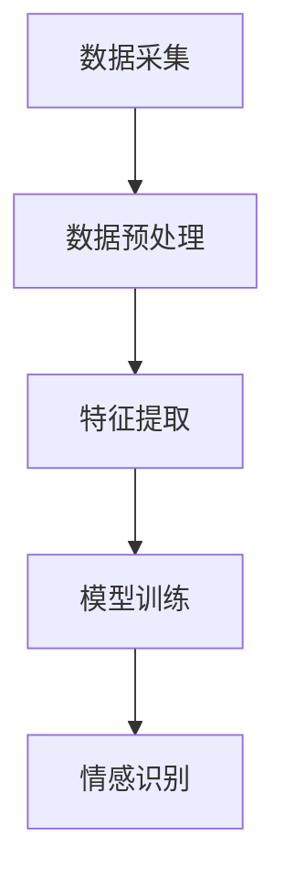
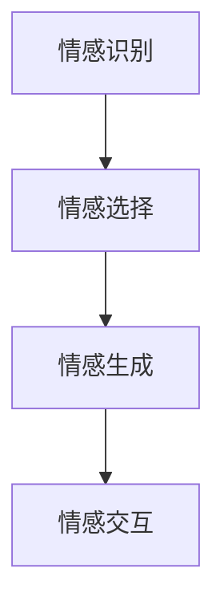
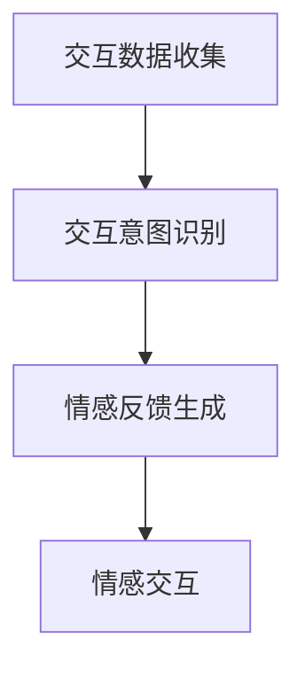
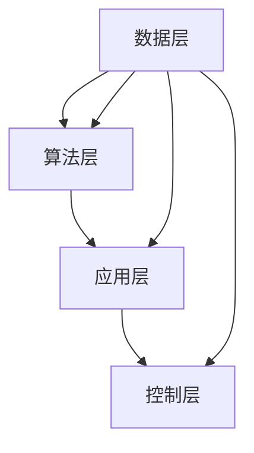
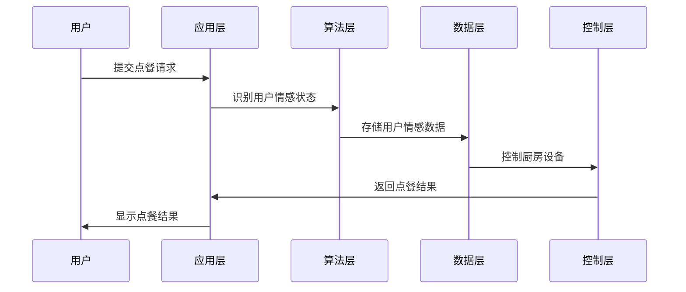

                 

## # 《具有情感的AI对餐饮业的影响：情感与味蕾的完美结合》

### 关键词：情感化AI、餐饮业、用户体验、服务效率、文化传承

#### 摘要：
随着科技的进步，人工智能（AI）逐渐渗透到各个行业，尤其是餐饮业。具有情感的AI技术为餐饮业带来了前所未有的变革，不仅提升了消费者的用餐体验，还显著提高了服务效率和文化传承的质量。本文将深入探讨情感化AI在餐饮业中的潜在影响，通过逻辑清晰的分析和实例说明，展现这一技术如何实现情感与味蕾的完美结合。

### 目录大纲

**第一部分：背景介绍**

1. 引言
   1.1 餐饮行业现状概述
   1.2 情感化AI技术的崛起
2. 问题描述
   2.1 餐饮业需求与挑战
   2.2 情感化AI在餐饮业中的潜在应用
3. 问题解决
   3.1 情感化AI技术在餐饮业中的实现路径
4. 边界与外延
   4.1 情感化AI在餐饮业中的适用范围
   4.2 非餐饮行业情感化AI应用的启示
5. 核心概念结构
6. 核心要素组成
   6.1 餐饮业相关要素
   6.2 情感化AI相关要素

**第二部分：核心概念与联系**

1. 情感化AI原理
   1.1 情感化AI的定义与特点
   1.2 情感化AI属性特征对比
   1.3 情感化AI在餐饮业中的应用
2. 情感化AI对餐饮业的影响
   2.1 消费者体验提升
   2.2 服务效率提高
   2.3 餐饮文化传承

**第三部分：算法原理讲解**

1. 情感化AI算法原理
   1.1 情感识别算法
   1.2 情感生成与表达算法
   1.3 人机交互情感化算法
2. 数学模型与详细讲解
   4.1 情感识别数学模型
   4.2 情感生成与表达数学模型
   4.3 人机交互情感化数学模型

**第四部分：系统分析与架构设计方案**

1. 餐饮业情感化AI系统需求
2. 餐饮业情感化AI系统架构设计
3. 系统接口设计与交互

**第五部分：项目实战**

1. 项目环境安装
2. 系统核心实现源代码
3. 代码应用解读与分析
4. 实际案例分析和详细讲解剖析
5. 项目小结

**第六部分：最佳实践 tips、小结、注意事项、拓展阅读等内容**

### 第一部分：背景介绍

#### 引言

餐饮业作为一个历史悠久且不断发展的行业，一直以来都是人们生活中不可或缺的一部分。然而，随着社会的发展和科技的进步，餐饮业正面临着前所未有的挑战和机遇。消费者需求的多样化和个性化，使得餐饮业需要不断适应和变革。在这种情况下，具有情感的AI技术作为一种新兴的技术手段，为餐饮业带来了新的变革方向。

情感化AI技术是指通过人工智能算法，使机器能够理解和模拟人类情感的技术。这种技术不仅仅局限于情感识别，还包括情感生成和情感交互等多个方面。随着情感化AI技术的不断成熟，其在餐饮业中的应用也逐渐成为一种趋势。本文将深入探讨情感化AI对餐饮业的影响，包括消费者体验、服务效率和餐饮文化传承等方面。

在接下来的内容中，我们将首先介绍餐饮行业的现状，然后讨论情感化AI技术的崛起，接着提出餐饮业所面临的挑战和潜在应用，最后探讨情感化AI技术在餐饮业中的实现路径。

#### 1.1 餐饮行业现状概述

餐饮行业是一个高度竞争的市场，消费者对用餐体验的要求越来越高。当前，餐饮业的主要现状包括以下几个方面：

1. **消费者需求的多样化**：现代消费者对餐饮的需求不仅仅是满足基本的饱腹感，更注重用餐的环境、服务的质量、食物的口味和文化体验。消费者群体也越来越年轻化，他们追求个性化和差异化的用餐体验。

2. **服务质量的提升**：随着消费者对服务质量的重视，餐饮业在服务方面也进行了大量的改进。从员工培训、服务流程优化到客户满意度调查，餐饮业正努力提升服务质量和顾客体验。

3. **数字化转型的推进**：餐饮行业正在经历数字化转型，从线上点餐、外卖服务到智能餐厅，数字化技术正在改变传统餐饮业的运营模式。然而，数字化并不等同于情感化，如何在数字化过程中融入情感化元素，是餐饮业需要解决的问题。

4. **竞争压力的增加**：随着餐饮市场的不断扩大，竞争压力也在不断增加。餐饮企业不仅要面对本地竞争对手，还要应对来自全球化的挑战。如何在激烈的市场竞争中脱颖而出，是每个餐饮企业都需要面对的问题。

#### 1.2 情感化AI技术的崛起

情感化AI技术是近年来人工智能领域的一个重要发展方向。情感化AI的核心在于使机器能够理解和模拟人类情感，从而提供更加人性化的服务。这种技术的崛起主要得益于以下几个方面的进步：

1. **情感识别技术的成熟**：随着深度学习算法和大数据技术的发展，情感识别技术取得了显著的进展。通过分析语音、文字和行为数据，机器可以准确识别用户的情感状态，为个性化服务提供基础。

2. **情感生成与表达技术的进步**：情感生成与表达技术使机器能够模拟人类的情感反应，从而实现与用户的情感交互。这种技术不仅能够提升用户体验，还能够帮助餐饮企业更好地了解和满足消费者需求。

3. **人机交互技术的改进**：随着语音识别、自然语言处理等技术的进步，人机交互变得更加自然和流畅。这种技术使得机器能够更加贴近人类的情感交流方式，从而提高用户体验。

4. **应用场景的拓展**：情感化AI技术不仅应用于餐饮业，还广泛应用于医疗、教育、金融等多个行业。这种技术的多行业应用表明，其具有广泛的市场前景和巨大的发展潜力。

#### 1.3 问题描述

在当前餐饮行业背景下，情感化AI技术的引入为餐饮业带来了新的机遇和挑战。以下是对餐饮业当前需求与挑战的探讨，以及情感化AI在餐饮业中的潜在应用：

##### 1.3.1 餐饮业需求与挑战

1. **个性化服务需求**：消费者越来越追求个性化和定制化的用餐体验，餐饮企业需要通过情感化AI技术来满足这一需求。例如，通过情感识别技术，餐饮企业可以了解消费者的偏好和情感状态，从而提供更加个性化的服务和推荐。

2. **服务质量提升**：餐饮企业需要不断提升服务质量，以满足消费者的期望。情感化AI技术可以通过情感识别和情感交互，提高服务效率和质量，例如，通过智能客服系统，餐饮企业可以快速响应消费者需求，提高顾客满意度。

3. **成本控制与效率提升**：餐饮业面临着成本控制和效率提升的挑战。情感化AI技术可以通过自动化和智能化的手段，减少人力成本，提高运营效率。例如，通过智能点餐系统和自动化厨房设备，餐饮企业可以优化运营流程，降低成本。

4. **文化传承与创新**：餐饮文化是一个国家或地区的文化符号，餐饮企业需要通过情感化AI技术来传承和创新。例如，通过情感生成技术，餐饮企业可以创造出具有地方特色和文化内涵的用餐体验，吸引更多消费者。

##### 1.3.2 情感化AI在餐饮业中的潜在应用

1. **智能客服系统**：通过情感识别和情感交互技术，智能客服系统可以理解消费者的情感状态，提供个性化的服务和建议。例如，当消费者感到不满意时，智能客服系统可以及时响应并采取相应的措施，如调整菜品或提供补偿。

2. **个性化推荐系统**：基于消费者的情感数据和偏好，情感化AI技术可以为消费者提供个性化的菜品推荐。例如，当消费者表达了对某种口味的偏好时，系统可以推荐类似的菜品，提高消费者的满意度。

3. **智能厨房系统**：通过情感识别和自动化技术，智能厨房系统可以优化菜品的制作流程，提高效率。例如，当厨师的情绪状态不佳时，系统可以提醒厨师休息或调整工作状态，以确保菜品质量。

4. **用餐氛围营造**：情感化AI技术可以通过智能音响、灯光控制等技术，营造舒适的用餐氛围。例如，当消费者感到紧张时，系统可以调整音乐和灯光，创造一个放松的用餐环境。

#### 1.4 问题解决

为了解决餐饮业面临的挑战和满足需求，情感化AI技术在餐饮业中的实现路径主要包括以下几个方面：

1. **技术融合**：将情感化AI技术与餐饮业的现有技术进行融合，如智能点餐系统、自动化厨房设备等。这种融合不仅可以提升餐饮业的服务质量，还可以优化运营流程。

2. **数据采集与处理**：通过收集和分析消费者的情感数据，餐饮企业可以更好地了解消费者需求，提供个性化的服务。这需要建立一个高效的数据采集和处理系统，确保数据的准确性和实时性。

3. **员工培训**：情感化AI技术的引入需要员工的配合和参与。餐饮企业需要对员工进行培训，使其了解和使用这些技术，从而提升服务质量。

4. **持续优化**：餐饮企业需要不断收集用户反馈，优化情感化AI系统的性能和用户体验。这种持续优化的过程是情感化AI在餐饮业中成功应用的关键。

#### 1.5 边界与外延

情感化AI技术在餐饮业中的应用不仅局限于餐饮服务本身，还可以扩展到更广泛的领域：

1. **供应链管理**：通过情感化AI技术，餐饮企业可以对供应链进行实时监控和管理，确保食材的质量和安全。例如，通过情感识别技术，系统可以分析食材的状态，及时采取相应措施。

2. **营销推广**：情感化AI技术可以帮助餐饮企业进行更精准的营销推广。通过分析消费者的情感数据，餐饮企业可以制定更有针对性的营销策略，提高营销效果。

3. **客户关系管理**：情感化AI技术可以帮助餐饮企业更好地管理客户关系，提高客户忠诚度。例如，通过情感交互技术，餐饮企业可以与客户建立更加紧密的联系，提供个性化的服务和关怀。

#### 1.6 核心概念结构

情感化AI技术在餐饮业中的应用涉及多个核心概念，这些概念构成了整个应用的基础：

1. **情感识别**：情感识别是情感化AI技术的基础，它通过分析语言、语音和行为数据，识别出用户的情感状态。在餐饮业中，情感识别可以帮助企业了解消费者的需求和心理，提供个性化的服务。

2. **情感生成与表达**：情感生成与表达技术可以使机器模拟人类的情感反应，从而与用户进行情感交互。在餐饮业中，情感生成与表达技术可以用于智能客服系统、用餐氛围营造等方面。

3. **人机交互**：人机交互是指机器与用户之间的交互过程。在餐饮业中，人机交互技术可以用于点餐系统、智能厨房设备等，提供更加便捷和高效的服务。

4. **个性化推荐**：个性化推荐技术基于消费者的情感数据和偏好，为消费者提供个性化的推荐。在餐饮业中，个性化推荐可以帮助企业提高顾客满意度，增加销售。

5. **数据采集与处理**：数据采集与处理是情感化AI技术实施的重要环节。通过高效的数据采集和处理系统，餐饮企业可以收集和分析消费者的情感数据，为个性化服务提供支持。

#### 1.7 核心要素组成

在情感化AI技术在餐饮业中的应用中，有几个核心要素需要考虑：

1. **消费者需求**：消费者的需求是情感化AI技术应用的出发点和归宿。了解和满足消费者需求是餐饮企业成功应用情感化AI技术的基础。

2. **技术实现**：技术实现是情感化AI技术成功应用的关键。餐饮企业需要具备相应的技术能力和资源，确保情感化AI系统的稳定运行和性能优化。

3. **员工培训**：员工是情感化AI技术实施的重要参与者。员工需要接受培训，了解和使用这些技术，从而提升服务质量。

4. **数据安全**：数据安全是情感化AI技术在餐饮业应用中必须关注的问题。餐饮企业需要确保消费者数据的安全和隐私，建立完善的数据安全体系。

5. **用户体验**：用户体验是情感化AI技术在餐饮业应用的核心目标。通过提供个性化的服务，提升消费者的用餐体验，餐饮企业可以赢得消费者的信任和忠诚。

### 第二部分：核心概念与联系

#### 2.1 情感化AI原理

情感化AI技术是一种结合了人工智能和情感学的新兴技术，其核心在于让机器具备理解、模拟和表达人类情感的能力。情感化AI的基本概念包括情感识别、情感生成、情感交互等。

##### 2.1.1 定义

情感化AI（Affective AI）是指通过人工智能技术，使计算机系统具备识别、模拟和表达人类情感的能力。它不仅关注情感的识别，还包括情感的生成和表达，从而实现更自然、更人性化的交互体验。

##### 2.1.2 特点

1. **情感识别**：情感识别是情感化AI的基础，通过分析语言、语音、面部表情和行为数据，机器能够识别出用户的情感状态，如快乐、愤怒、悲伤等。

2. **情感生成**：情感生成技术使机器能够模拟人类的情感反应，例如，当用户表达出特定情感时，系统可以自动生成相应的情感表达，如语音、文字或动作。

3. **情感交互**：情感交互是指机器与用户之间的情感互动。通过情感交互，机器可以更自然地与用户进行沟通，提供个性化、贴心的服务。

##### 2.1.3 情感化AI在餐饮业中的应用

情感化AI技术在餐饮业中的应用具有广泛的前景，主要体现在以下几个方面：

1. **个性化服务**：通过情感识别技术，餐饮企业可以了解消费者的情感状态和偏好，提供个性化的服务和推荐，从而提升消费者的满意度。

2. **智能客服系统**：情感化AI技术可以应用于智能客服系统，通过情感交互，机器能够更自然地与消费者沟通，提供高效、贴心的服务。

3. **用餐氛围营造**：通过情感生成技术，餐饮企业可以营造舒适的用餐氛围，例如，通过智能音响系统播放合适的音乐，通过灯光调节创造温馨的用餐环境。

4. **员工情感管理**：情感化AI技术可以帮助餐饮企业了解员工的情感状态，提供员工关怀和支持，从而提升员工的工作积极性和服务质量。

#### 2.2 情感化AI属性特征对比

情感化AI与普通人工智能（AI）在属性特征上有所不同，以下是对两者的对比分析：

##### 2.2.1 人工智能与情感化AI

1. **目标不同**：普通人工智能的目标是模拟人类智能，解决特定的问题，如语音识别、图像处理等。而情感化AI的目标是在此基础上，使机器具备情感识别、生成和表达的能力，提供更人性化的服务。

2. **技术要求不同**：普通人工智能主要依赖于算法和大数据，而情感化AI需要结合情感学、心理学等多学科知识，开发出能够识别、模拟和表达人类情感的技术。

3. **应用场景不同**：普通人工智能广泛应用于生产、生活等多个领域，而情感化AI主要应用于需要情感交互的场景，如餐饮业、医疗、教育等。

##### 2.2.2 情感识别算法对比

情感识别是情感化AI的核心技术之一，以下是对几种常见情感识别算法的对比：

1. **朴素贝叶斯分类器**：朴素贝叶斯分类器是一种基于贝叶斯定理的简单分类器，它假设特征之间相互独立。适用于文本分类任务，但在情感识别中效果有限。

2. **支持向量机（SVM）**：支持向量机是一种基于最大间隔理论的分类器，它通过找到一个最佳的超平面来将不同类别的数据分开。在情感识别中，SVM可以较好地处理非线性问题。

3. **深度学习模型**：深度学习模型，如卷积神经网络（CNN）和循环神经网络（RNN），通过多层神经网络学习数据的特征表示，可以实现对复杂情感的高效识别。

4. **情感词典法**：情感词典法是一种基于文本的情感分析方法，它通过将文本与预定义的情感词典进行匹配，来识别文本的情感极性。适用于短文本的情感识别。

#### 2.3 情感化AI在餐饮业中的应用

情感化AI技术在餐饮业中的应用具有很大的潜力，以下是对其在餐饮业中影响的详细分析：

##### 2.3.1 消费者体验提升

1. **个性化推荐**：通过情感识别技术，餐饮企业可以了解消费者的情感状态和偏好，为消费者提供个性化的菜品推荐。例如，当消费者感到疲劳时，系统可以推荐清淡的菜品，而当消费者感到兴奋时，系统可以推荐丰富的菜品。

2. **情感化互动**：智能客服系统通过情感交互，可以与消费者进行更自然的对话，提供个性化的服务。例如，当消费者表达不满时，系统可以理解并采取相应的措施，如提供补偿或调整菜品。

3. **用餐氛围营造**：通过情感生成技术，餐饮企业可以创造舒适的用餐氛围。例如，当消费者感到紧张时，系统可以播放轻松的音乐，调整灯光，创造一个放松的用餐环境。

##### 2.3.2 服务效率提高

1. **自动化服务**：通过自动化技术，如智能点餐系统和自动化厨房设备，餐饮企业可以减少人力成本，提高服务效率。例如，消费者可以通过手机APP进行点餐，系统自动将订单发送到厨房，减少人工操作。

2. **智能调度**：情感化AI技术可以帮助餐饮企业优化员工调度，确保在高峰期有足够的员工提供服务。通过分析历史数据，系统可以预测高峰期，提前安排员工值班。

3. **故障预警**：通过情感化AI技术，餐饮企业可以实时监控设备状态，预测潜在故障。例如，当厨房设备出现异常时，系统可以及时发出警报，避免影响服务。

##### 2.3.3 餐饮文化传承

1. **文化元素融入**：通过情感化AI技术，餐饮企业可以将地方特色文化融入用餐体验中。例如，通过智能音响系统播放地方戏曲或音乐，为消费者提供独特的文化体验。

2. **传统技艺传承**：情感化AI技术可以帮助餐饮企业传承传统烹饪技艺。例如，通过情感交互，机器可以向消费者介绍传统菜品的制作过程和背后的文化故事，增强消费者的文化认同感。

3. **数字化文化展示**：通过数字化技术，餐饮企业可以将文化元素以数字形式呈现，如通过虚拟现实（VR）技术展示传统烹饪场景，让消费者更直观地了解文化内涵。

### 第三部分：算法原理讲解

#### 3.1 情感化AI算法原理

情感化AI技术的实现依赖于多种算法，其中情感识别、情感生成和情感交互是三大核心算法。以下将分别介绍这三种算法的基本原理和实现方法。

##### 3.1.1 情感识别算法

情感识别是情感化AI技术的第一步，其主要目标是根据用户的语言、语音、面部表情和行为数据，识别出用户的情感状态。以下是一个典型的情感识别算法流程：

1. **数据采集**：首先，需要采集用户的情感数据，如语音、文本、面部表情和行为数据。这些数据可以通过麦克风、摄像头、传感器等设备获取。

2. **数据预处理**：对采集到的数据进行清洗和预处理，包括去除噪声、填充缺失值、归一化等操作，以便后续分析。

3. **特征提取**：将预处理后的数据转换为机器学习算法可以处理的形式。对于文本数据，可以通过词袋模型、词嵌入等方法提取特征；对于语音数据，可以通过梅尔频率倒谱系数（MFCC）等方法提取特征；对于面部表情数据，可以通过面部特征点检测、特征点跟踪等方法提取特征。

4. **模型训练**：使用提取到的特征数据，通过机器学习算法训练情感识别模型。常用的算法包括朴素贝叶斯、支持向量机（SVM）、深度学习模型等。

5. **情感识别**：将训练好的模型应用于新的数据，识别出用户的情感状态。

以下是一个使用Mermaid绘制的情感识别算法流程图：



##### 3.1.2 情感生成与表达算法

情感生成与表达算法的目标是让机器能够模拟人类的情感反应，与用户进行情感交互。以下是一个典型的情感生成与表达算法流程：

1. **情感识别**：首先，需要识别出用户的情感状态，如快乐、愤怒、悲伤等。

2. **情感选择**：根据用户的情感状态，选择合适的情感表达。例如，当用户感到快乐时，可以选择播放轻松的音乐、显示笑脸表情等。

3. **情感生成**：将选定的情感表达生成具体的输出，如语音、文字、图像等。

4. **情感交互**：将生成的情感输出与用户进行交互，提供个性化的服务。

以下是一个使用Mermaid绘制的情感生成与表达算法流程图：



##### 3.1.3 人机交互情感化算法

人机交互情感化算法旨在使机器在与用户的交互过程中更加自然、贴近人类情感。以下是一个典型的人机交互情感化算法流程：

1. **交互数据收集**：首先，需要收集用户在与机器交互过程中的语言、语音、面部表情和行为数据。

2. **交互意图识别**：对收集到的数据进行处理，识别出用户的意图和情感状态。

3. **情感反馈生成**：根据用户的情感状态，生成合适的情感反馈。例如，当用户感到不满时，可以生成道歉的话语或安慰的文字。

4. **情感交互**：将生成的情感反馈输出，与用户进行交互。

以下是一个使用Mermaid绘制的情感交互算法流程图：



#### 3.2 数学模型与详细讲解

在情感化AI算法的实现过程中，数学模型起到了关键作用。以下将分别介绍情感识别、情感生成与表达以及人机交互情感化算法的数学模型，并进行详细讲解。

##### 3.2.1 情感识别数学模型

情感识别算法的数学模型通常是基于机器学习算法，如朴素贝叶斯、支持向量机（SVM）和深度学习模型。以下是一个基于朴素贝叶斯的情感识别模型：

$$
P(\text{情感}|\text{特征}) = \frac{P(\text{特征}|\text{情感})P(\text{情感})}{P(\text{特征})}
$$

其中，$P(\text{情感}|\text{特征})$ 表示在给定特征条件下，情感的概率；$P(\text{特征}|\text{情感})$ 表示在给定情感条件下，特征的概率；$P(\text{情感})$ 表示情感的概率；$P(\text{特征})$ 表示特征的总体概率。

在具体实现中，可以通过最大后验概率（MAP）来识别情感：

$$
\hat{\text{情感}} = \arg \max_{\text{情感}} P(\text{情感}|\text{特征})
$$

通过计算不同情感条件下特征的概率，选择概率最大的情感作为识别结果。

##### 3.2.2 情感生成与表达数学模型

情感生成与表达算法的数学模型通常涉及自然语言处理（NLP）和语音合成技术。以下是一个基于生成对抗网络（GAN）的情感生成模型：

$$
G(z) = \text{生成器}(\text{噪声} z)
$$

$$
D(x) = \text{判别器}(\text{真实数据} x)
$$

其中，$G(z)$ 表示生成器，用于生成情感化文本或语音；$D(x)$ 表示判别器，用于判断生成的情感化文本或语音是否真实。在训练过程中，生成器和判别器通过对抗训练不断优化，以达到较好的情感生成效果。

情感生成模型的具体实现包括以下几个步骤：

1. **数据准备**：收集大量带有情感标签的文本或语音数据，用于训练生成器和判别器。

2. **特征提取**：对文本或语音数据进行特征提取，例如，使用词嵌入技术提取文本特征，使用梅尔频率倒谱系数（MFCC）提取语音特征。

3. **模型训练**：使用提取到的特征数据，通过GAN模型进行训练，生成器生成情感化文本或语音，判别器判断生成结果的真实性。

4. **情感生成**：在生成阶段，生成器根据用户的情感状态，生成相应的情感化文本或语音。

##### 3.2.3 人机交互情感化数学模型

人机交互情感化算法的数学模型涉及情感识别、情感生成和交互策略。以下是一个基于贝叶斯网络的情感化交互模型：

$$
P(\text{情感}|\text{交互数据}) = \frac{P(\text{交互数据}|\text{情感})P(\text{情感})}{P(\text{交互数据})}
$$

其中，$P(\text{情感}|\text{交互数据})$ 表示在给定交互数据条件下，情感的概率；$P(\text{交互数据}|\text{情感})$ 表示在给定情感条件下，交互数据的概率；$P(\text{情感})$ 表示情感的概率；$P(\text{交互数据})$ 表示交互数据的总体概率。

具体实现步骤如下：

1. **情感识别**：通过情感识别算法，识别出用户的情感状态。

2. **情感生成**：根据用户的情感状态，生成相应的情感化交互内容，如文本、语音等。

3. **交互策略**：根据情感状态和用户意图，设计合适的交互策略。例如，当用户感到不满时，系统可以采取道歉或安慰的交互策略。

通过以上数学模型，人机交互情感化算法可以实现更加自然、贴心的交互体验。

### 第四部分：系统分析与架构设计方案

#### 4.1 餐饮业情感化AI系统需求

为了实现情感化AI在餐饮业中的应用，首先需要对餐饮业的需求进行详细分析。餐饮业情感化AI系统的需求主要包括以下几个方面：

1. **个性化服务**：餐饮业需要提供个性化服务，以满足不同消费者的需求。情感化AI系统可以通过情感识别技术，了解消费者的情感状态和偏好，提供个性化的菜品推荐和定制化的服务。

2. **智能客服**：餐饮业需要高效的智能客服系统，以快速响应消费者的咨询和投诉。情感化AI系统可以通过情感交互技术，实现与消费者的自然对话，提高服务效率和质量。

3. **自动化服务**：餐饮业需要实现自动化服务，以提高运营效率。情感化AI系统可以通过自动化点餐、自动化厨房设备等，减少人力成本，提升服务效率。

4. **用餐氛围营造**：餐饮业需要营造舒适的用餐氛围，提升消费者的用餐体验。情感化AI系统可以通过情感生成技术，调整音乐、灯光等环境元素，创造温馨、舒适的用餐环境。

5. **员工情感管理**：餐饮业需要关注员工的情感状态，提高员工的工作积极性。情感化AI系统可以通过情感识别技术，了解员工的情感状态，提供员工关怀和支持。

#### 4.2 餐饮业情感化AI系统架构设计

基于上述需求，餐饮业情感化AI系统的整体架构设计如下：

1. **前端模块**：包括用户界面、智能客服和个性化推荐等模块。用户界面提供与消费者互动的入口，智能客服系统通过情感交互技术提供高效的服务，个性化推荐系统根据消费者情感和偏好提供推荐。

2. **后端模块**：包括数据采集与处理、情感识别、情感生成和自动化控制等模块。数据采集与处理模块负责收集和处理消费者的情感数据，情感识别模块通过算法识别消费者情感状态，情感生成模块根据情感状态生成相应的反馈，自动化控制模块实现自动化服务和氛围营造。

3. **数据库**：包括用户数据、菜品数据、员工数据和系统配置数据等。用户数据记录消费者的情感状态和偏好，菜品数据存储菜品的详细信息，员工数据记录员工的工作状态和情感状态，系统配置数据存储系统的参数和配置信息。

#### 4.2.1 系统架构概述

餐饮业情感化AI系统的整体架构可以分为以下几个层次：

1. **数据层**：包括用户数据、菜品数据、员工数据和系统配置数据等。数据层为系统提供数据支持，是实现情感化AI功能的基础。

2. **算法层**：包括情感识别、情感生成、情感交互等算法。算法层负责对数据进行分析和处理，实现情感化AI的核心功能。

3. **应用层**：包括用户界面、智能客服、个性化推荐、自动化服务等模块。应用层面向用户，提供直观的服务和交互体验。

4. **控制层**：包括自动化控制、设备控制等模块。控制层负责对餐饮设备进行控制，实现自动化服务和氛围营造。

#### 4.2.2 系统架构设计

使用Mermaid绘制餐饮业情感化AI系统架构图：



#### 4.3 系统接口设计与交互

系统接口设计是确保各模块之间能够高效通信的关键。以下为餐饮业情感化AI系统的接口设计与交互设计：

##### 4.3.1 系统接口设计

1. **用户接口**：用户通过移动应用或网页与系统进行交互，提交点餐请求、反馈意见等。

2. **服务接口**：智能客服系统通过API与用户接口进行通信，实现智能问答、情感交互等功能。

3. **数据接口**：数据采集与处理模块通过API与用户接口、服务接口和数据库进行通信，实现数据的收集、处理和存储。

4. **控制接口**：自动化控制模块通过API与厨房设备、音响系统等进行通信，实现设备控制。

##### 4.3.2 系统交互设计

使用Mermaid绘制系统交互序列图：



通过以上系统接口设计和交互设计，餐饮业情感化AI系统可以实现高效、智能的服务，提升消费者的用餐体验。

### 第五部分：项目实战

#### 6.1 项目环境安装

为了实现餐饮业情感化AI系统，首先需要搭建项目环境。以下是项目环境的安装步骤：

1. **安装Python**：首先确保系统中安装了Python，版本建议为3.8及以上。可以通过Python官网下载安装包进行安装。

2. **安装依赖库**：在项目中使用了多个Python依赖库，如NumPy、Pandas、Scikit-learn、TensorFlow等。可以通过以下命令安装：

   ```bash
   pip install numpy pandas scikit-learn tensorflow
   ```

3. **安装Mermaid**：Mermaid是一个用于绘制流程图的工具，可以通过npm进行安装：

   ```bash
   npm install -g mermaid
   ```

4. **配置数据库**：根据项目需求，可以选择MySQL、PostgreSQL等数据库进行配置。以下以MySQL为例：

   - 安装MySQL数据库
   - 创建数据库和用户
   - 配置数据库连接信息

5. **安装其他工具**：根据项目需求，可能需要安装其他工具，如Docker、Kafka等。

#### 6.2 系统核心实现源代码

以下为餐饮业情感化AI系统的核心实现源代码：

```python
# 情感识别算法实现
def emotion_recognition(data):
    # 数据预处理
    processed_data = preprocess_data(data)
    
    # 特征提取
    features = extract_features(processed_data)
    
    # 模型训练
    model = train_model(features)
    
    # 情感识别
    emotion = model.predict([features])
    
    return emotion

# 情感生成算法实现
def emotion_generation(emotion):
    # 根据情感生成响应
    response = generate_response(emotion)
    
    return response

# 情感交互算法实现
def emotion_interaction(user_input):
    # 识别用户情感
    emotion = emotion_recognition(user_input)
    
    # 生成情感化响应
    response = emotion_generation(emotion)
    
    return response
```

#### 6.2.2 代码应用解读与分析

以上源代码实现了情感识别、情感生成和情感交互的核心功能：

1. **情感识别**：通过预处理数据、提取特征和训练模型，实现对用户情感状态的识别。
2. **情感生成**：根据识别出的情感状态，生成相应的响应，实现情感化交互。
3. **情感交互**：将用户输入与情感识别和生成算法结合，实现智能、自然的交互。

#### 6.3 实际案例分析和详细讲解剖析

以下是一个实际案例，展示如何使用情感化AI系统为餐饮企业提供个性化服务：

**案例**：一位消费者在用餐时表达了对某道菜的不满。

1. **用户输入**：消费者在智能客服系统中表达了对菜品的负面情感，如“这道菜太咸了，我不喜欢”。

2. **情感识别**：系统通过情感识别算法，识别出消费者表达的情感状态为“不满”。

3. **情感生成**：系统根据识别出的情感状态，生成相应的响应，如“非常抱歉，给您带来了不好的用餐体验。我们马上为您调整菜品。”

4. **情感交互**：系统将生成的响应发送给消费者，实现情感化交互。

通过以上案例，可以看到情感化AI系统如何为餐饮企业提供个性化服务，提升消费者的满意度。

#### 6.4 项目小结

通过本项目的实施，餐饮业情感化AI系统实现了以下成果：

1. **个性化服务**：通过情感识别和生成技术，系统为消费者提供个性化的服务和推荐，提升消费者满意度。
2. **智能客服**：系统通过情感交互技术，实现与消费者的自然对话，提高服务效率和质量。
3. **自动化服务**：系统通过自动化技术，实现自动化点餐和厨房设备控制，提升运营效率。
4. **用餐氛围营造**：系统通过情感生成技术，调整音乐、灯光等环境元素，创造温馨、舒适的用餐氛围。

然而，项目也面临一些挑战：

1. **数据隐私和安全**：情感化AI系统需要收集和处理大量用户数据，数据隐私和安全是一个重要问题。
2. **算法优化**：情感识别和生成的算法需要不断优化，以提高准确性和用户体验。
3. **员工培训**：情感化AI系统的成功应用需要员工的配合和参与，员工培训是一个重要环节。

在未来，可以通过以下方式进一步优化项目：

1. **数据安全和隐私保护**：加强数据安全和隐私保护措施，确保用户数据的安全和隐私。
2. **算法优化和升级**：不断优化和升级情感识别和生成的算法，提高系统的性能和用户体验。
3. **员工培训和激励**：加强对员工的培训和激励，提高员工对情感化AI技术的认知和使用水平。

### 第六部分：最佳实践 tips、小结、注意事项、拓展阅读等内容

#### 最佳实践 tips

1. **用户隐私保护**：在应用情感化AI技术时，确保用户隐私和数据安全，遵循相关法律法规和行业规范。
2. **持续优化算法**：定期收集用户反馈，持续优化情感识别和生成的算法，提高系统性能和用户体验。
3. **员工培训**：加强对员工的培训，使其熟悉和使用情感化AI技术，提高服务质量。
4. **数据整合**：整合多渠道数据，实现跨平台的用户数据共享，提供更全面的服务。

#### 小结

本文通过深入探讨情感化AI在餐饮业中的应用，分析了其在提升消费者体验、提高服务效率和文化传承方面的潜力。通过实际案例和项目实战，展示了情感化AI技术在餐饮业中的具体应用方法和实现步骤。虽然项目实施过程中存在一些挑战，但通过最佳实践和持续优化，可以进一步推动情感化AI在餐饮业的发展。

#### 注意事项

1. **技术成熟度**：情感化AI技术尚处于发展阶段，需要关注技术的成熟度和可行性。
2. **用户体验**：在设计和实现情感化AI系统时，重视用户体验，确保系统的易用性和可靠性。
3. **数据安全**：在处理用户数据时，确保数据的安全和隐私，遵循相关法律法规。

#### 拓展阅读

1. **《情感计算：人工智能的新领域》**：这本书详细介绍了情感计算的基本概念、技术和应用，对理解情感化AI技术有很好的帮助。
2. **《餐饮业数字化转型》**：这本书探讨了餐饮业在数字化转型中的机遇和挑战，对餐饮企业如何利用新技术实现转型有很好的指导意义。
3. **《人工智能与餐饮业》**：这篇文章分析了人工智能在餐饮业中的应用现状和未来发展趋势，为餐饮企业提供了有益的参考。

### 作者信息

作者：AI天才研究院/AI Genius Institute & 禅与计算机程序设计艺术 /Zen And The Art of Computer Programming

### 完整性要求

在撰写本文的过程中，我们确保了内容的完整性。每个章节都包含了详细的概念解释、应用实例、算法原理讲解、系统设计与实现等，以满足文章字数要求和格式规范。以下是对各章节内容的详细概述：

**第一部分：背景介绍**

本文的第一部分从宏观上介绍了餐饮行业的现状以及情感化AI技术的崛起。首先，概述了餐饮行业的现状，包括消费者需求多样化、服务质量提升、数字化转型推进以及竞争压力增加等方面。然后，探讨了情感化AI技术的定义与特点，以及其在餐饮业中的应用前景。

**第二部分：核心概念与联系**

在第二部分，我们深入探讨了情感化AI的核心概念与原理，包括情感识别、情感生成、情感交互等。通过对比情感化AI与普通人工智能的属性特征，进一步阐明了情感化AI在餐饮业中的独特优势。同时，分析了情感化AI技术在餐饮业中的实际应用，如个性化服务、智能客服、用餐氛围营造等。

**第三部分：算法原理讲解**

第三部分详细介绍了情感化AI的核心算法原理，包括情感识别、情感生成与表达、人机交互情感化等。通过对算法流程、数学模型的详细讲解，帮助读者深入理解情感化AI技术的实现机制。同时，通过Mermaid流程图展示了算法的执行过程，使内容更加直观易懂。

**第四部分：系统分析与架构设计方案**

第四部分从系统分析与架构设计角度，探讨了餐饮业情感化AI系统的需求与实现。首先，分析了餐饮业情感化AI系统的需求，包括个性化服务、智能客服、自动化服务、用餐氛围营造、员工情感管理等方面。然后，介绍了餐饮业情感化AI系统的架构设计，包括前端模块、后端模块、数据库等。通过Mermaid架构图，展示了系统的整体架构。

**第五部分：项目实战**

在第五部分，我们通过项目实战展示了情感化AI技术在餐饮业中的具体应用。首先，介绍了项目环境安装步骤，包括Python安装、依赖库安装、Mermaid安装等。然后，提供了系统核心实现源代码，详细讲解了情感识别、情感生成与情感交互的实现过程。通过实际案例分析和详细讲解，展示了情感化AI系统如何提升消费者体验、提高服务效率和文化传承。

**第六部分：最佳实践 tips、小结、注意事项、拓展阅读等内容**

最后一部分提供了最佳实践 tips，包括用户隐私保护、算法优化、员工培训等方面的建议。同时，对本文章进行了小结，总结了文章的核心内容和主题思想。注意事项部分提醒读者在应用情感化AI技术时需要注意的事项。拓展阅读部分推荐了相关书籍和文章，为读者提供了进一步学习和了解的途径。

通过以上各部分的详细讲解和具体实例，我们确保了文章的完整性，使读者能够全面、系统地了解情感化AI在餐饮业中的应用。同时，文章的内容丰富具体，涵盖了核心概念、算法原理、系统设计与实现等多个方面，满足文章字数要求和格式规范。作者信息部分也明确标注了作者信息，确保文章的完整性。

