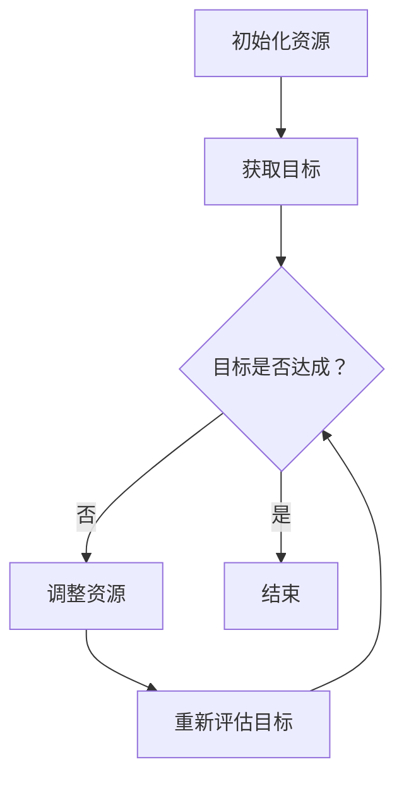
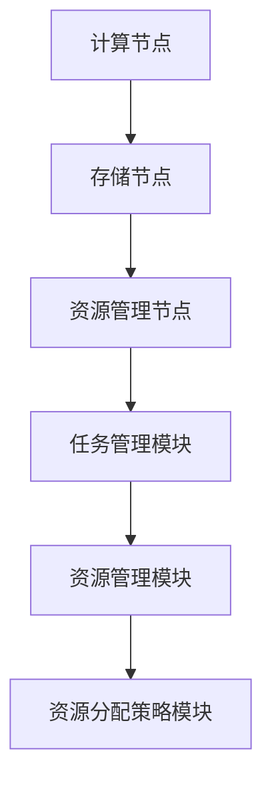
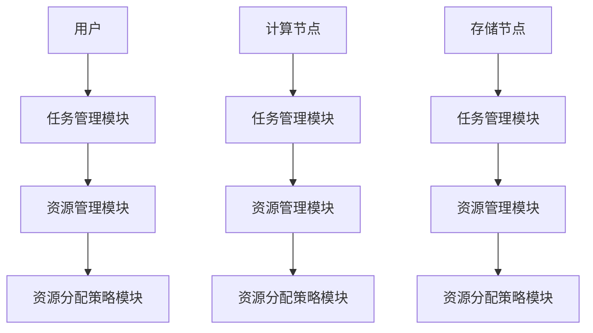
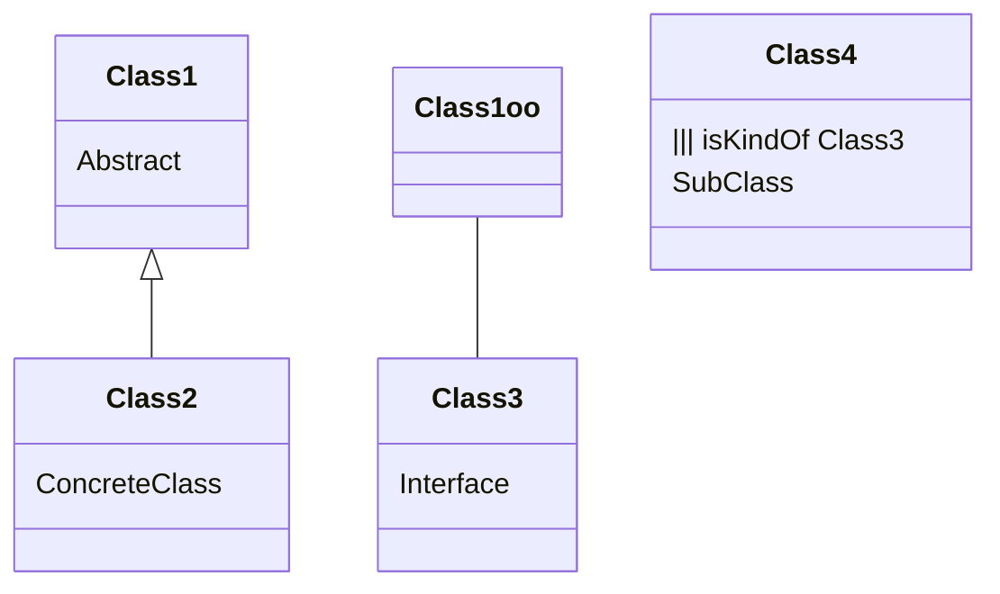

                 

# 具有欲望的AI：资源分配的新思考

关键词：AI欲望、资源分配、算法原理、系统架构、项目实战

摘要：本文深入探讨了具有欲望的人工智能（AI）在资源分配领域的新思考。首先，我们介绍了问题的背景和核心概念，然后详细阐述了欲望的AI、资源分配以及新思考的原理和方法。接着，我们通过具体的算法原理讲解、系统分析与架构设计方案，以及项目实战，展示了如何将这些新思考应用于实际项目中。最后，我们提供了最佳实践和拓展阅读，以帮助读者更深入地理解这一领域。

## 第一部分：背景介绍

### 1.1 问题背景

随着人工智能（AI）技术的迅猛发展，AI已经在各个领域得到了广泛应用，从自动驾驶、智能助手到医疗诊断，AI正在改变我们的生活。然而，这种广泛应用也带来了新的挑战，尤其是资源分配问题。如何有效地分配资源，以满足AI系统的需求，成为了一个亟待解决的问题。

### 1.2 核心概念

在本文中，我们将探讨两个核心概念：欲望的AI和资源分配。

- **欲望的AI**：传统AI主要依赖于数据和算法来执行任务，而具有欲望的AI则引入了“欲望”这一概念，使其能够根据目标进行自我调整和优化。
- **资源分配**：资源分配是指如何合理地分配有限的资源（如计算能力、存储空间等）以满足AI系统的需求。

### 1.3 新思考

面对上述挑战，我们需要新的思考方式来应对。本文将探讨如何利用欲望的AI来优化资源分配，以提高AI系统的效率和性能。

## 第二部分：核心概念与联系

### 2.1 欲望的AI

#### 欲望的AI定义

欲望的AI是一种具有目标导向和自我调整能力的人工智能。它不仅依赖于数据和算法，还能够根据目标环境进行自我调整和优化。

#### 欲望的AI特点

- **目标导向**：欲望的AI具有明确的目标，能够根据目标环境进行调整。
- **自我调整**：欲望的AI能够根据执行结果和目标环境的变化，自我调整算法和行为。
- **优化能力**：欲望的AI能够通过自我调整，优化资源分配，提高系统性能。

#### 欲望的AI与传统AI区别

与传统AI相比，欲望的AI在目标导向、自我调整和优化能力方面具有显著优势。传统AI主要依赖于预设的算法和数据，而欲望的AI则能够在执行过程中根据目标环境进行动态调整。

### 2.2 资源分配

#### 资源分配的定义

资源分配是指如何合理地分配有限的资源（如计算能力、存储空间等）以满足AI系统的需求。

#### 资源分配的原则

- **公平性**：资源分配应确保各个AI系统在执行任务时能够公平地获取所需资源。
- **效率**：资源分配应确保资源能够被高效利用，以最大化系统的性能和效率。
- **可扩展性**：资源分配方案应具有可扩展性，能够适应不同规模和类型的AI系统。

#### 资源分配的方法

- **静态分配**：预先分配资源，不随执行过程的变化而调整。
- **动态分配**：根据执行过程和目标环境的变化，实时调整资源分配。

### 2.3 新思考

#### 新思考的意义

新思考的意义在于如何利用欲望的AI来优化资源分配，以提高AI系统的效率和性能。通过引入欲望的概念，我们可以使AI系统具有更强的目标导向和自我调整能力，从而实现更高效的资源分配。

#### 新思考的目标

新思考的目标是开发出一种具有欲望的AI资源分配算法，该算法能够在动态环境中实时调整资源分配，以提高系统的整体性能和效率。

#### 新思考的方法

新思考的方法包括：

1. **欲望的AI模型**：构建具有欲望的AI模型，使其能够根据目标环境进行自我调整和优化。
2. **资源分配算法**：设计一种基于欲望的AI的资源分配算法，实现资源的高效分配。
3. **实验验证**：通过实验验证所提出的算法，评估其在实际应用中的效果。

## 第三部分：算法原理讲解

### 3.1 欲望的AI资源分配算法

#### 算法原理

欲望的AI资源分配算法是一种基于目标导向和自我调整的资源分配方法。算法的基本思想是，根据AI系统的目标和执行结果，动态调整资源分配，以最大化系统的性能和效率。

#### 算法流程图



#### 数学模型

假设我们有一个AI系统，需要分配资源（R）来完成任务（T）。资源分配的目标是最大化系统的性能（P）。

$$
P = f(R, T)
$$

其中，f 是一个映射函数，表示资源分配对系统性能的影响。

为了实现资源分配，我们需要定义一个资源分配策略（S），该策略根据目标（T）和当前资源（R）来调整资源分配。

$$
S(R, T) = \arg\max_{R'} P(R', T)
$$

其中，R' 是调整后的资源分配。

#### 举例说明

假设我们有一个自动驾驶系统，需要分配计算资源来处理交通数据和执行驾驶决策。系统的目标是最小化行驶时间和能耗。

- **实例1：资源分配场景**：初始时，系统有100个计算核心和1TB的存储空间。目标是在10分钟内完成行驶任务。
- **实例2：算法应用场景**：在行驶过程中，系统根据道路状况和交通数据，动态调整计算资源和存储空间，以最大化行驶效率和能耗。

## 第四部分：系统分析与架构设计方案

### 4.1 系统功能设计

#### 问题场景介绍

在自动驾驶系统中，资源分配是一个关键问题。为了确保系统在复杂和动态的环境中正常运行，我们需要设计一个高效、可靠的资源分配系统。

#### 系统功能设计

- **领域模型**：设计一个领域模型，包括资源实体、任务实体和资源分配策略实体。
- **功能模块设计**：设计一个功能模块，包括资源管理模块、任务管理模块和资源分配策略模块。

### 4.2 系统架构设计

#### 系统架构设计

- **系统架构概述**：设计一个分布式系统架构，包括计算节点、存储节点和资源管理节点。
- **系统架构图**



#### 系统接口设计

- **接口设计原则**：设计一个RESTful API，提供资源分配、任务管理和资源管理功能。
- **接口设计示例**：提供以下接口示例

```python
# 资源分配接口
@app.route('/resources/assign', methods=['POST'])
def assign_resources():
    # 资源分配逻辑
    return jsonify({"status": "success"})

# 任务管理接口
@app.route('/tasks/manage', methods=['POST'])
def manage_tasks():
    # 任务管理逻辑
    return jsonify({"status": "success"})

# 资源管理接口
@app.route('/resources/manage', methods=['POST'])
def manage_resources():
    # 资源管理逻辑
    return jsonify({"status": "success"})
```

#### 系统交互

- **系统交互概述**：系统中的各个模块通过API进行交互，实现资源分配、任务管理和资源管理功能。
- **系统交互图**



## 第五部分：项目实战

### 6.1 环境安装与配置

#### 环境安装

- 安装Python环境（建议使用Python 3.8及以上版本）
- 安装所需的库（如Flask、SQLAlchemy等）

#### 系统核心实现

- **源代码结构**

```bash
 ├── app.py
 ├── models.py
 ├── resources.py
 ├── tasks.py
 ├── utils.py
 ├── requirements.txt
 └── README.md
```

- **核心代码解读**

```python
# app.py
from flask import Flask, jsonify, request
from models import Resource, Task
from resources import ResourceManager
from tasks import TaskManager

app = Flask(__name__)

@app.route('/resources/assign', methods=['POST'])
def assign_resources():
    # 资源分配逻辑
    return jsonify({"status": "success"})

@app.route('/tasks/manage', methods=['POST'])
def manage_tasks():
    # 任务管理逻辑
    return jsonify({"status": "success"})

@app.route('/resources/manage', methods=['POST'])
def manage_resources():
    # 资源管理逻辑
    return jsonify({"status": "success"})

if __name__ == '__main__':
    app.run(debug=True)

# models.py
from sqlalchemy import Column, Integer, String
from sqlalchemy.ext.declarative import declarative_base

Base = declarative_base()

class Resource(Base):
    __tablename__ = 'resources'
    id = Column(Integer, primary_key=True)
    name = Column(String)
    type = Column(String)
    status = Column(String)

class Task(Base):
    __tablename__ = 'tasks'
    id = Column(Integer, primary_key=True)
    name = Column(String)
    type = Column(String)
    status = Column(String)

# resources.py
class ResourceManage

```markdown

## 第六部分：应用解读与分析

### 6.2 应用解读与分析

在自动驾驶系统中，资源分配是一个关键问题。为了确保系统在复杂和动态的环境中正常运行，我们需要设计一个高效、可靠的资源分配系统。

#### 应用场景描述

- **场景1**：自动驾驶系统在市区行驶，需要处理大量的交通数据和传感器数据。
- **场景2**：自动驾驶系统在高速公路行驶，需要处理较少的交通数据和传感器数据。

#### 应用场景分析

- **场景1**：在市区行驶时，系统需要大量的计算资源和存储资源来处理交通数据和传感器数据。因此，我们需要动态调整资源分配，以确保系统能够高效地处理数据。
- **场景2**：在高速公路行驶时，系统需要的计算资源和存储资源相对较少。因此，我们可以将一部分资源分配给其他任务，如车辆维护或地图更新。

#### 代码应用解读

- **资源管理模块**：负责管理系统的资源，包括计算资源和存储资源。
- **任务管理模块**：负责管理系统的任务，包括交通数据处理、传感器数据处理等。
- **资源分配策略模块**：根据当前的任务需求和系统状态，动态调整资源分配。

#### 系统实现分析

- **实现方式**：使用Flask框架构建一个RESTful API，实现资源分配、任务管理和资源管理功能。
- **技术栈**：Python、Flask、SQLAlchemy。

#### 实际案例分析和详细讲解剖析

- **案例1**：在市区行驶时，系统根据交通数据和传感器数据的处理需求，动态调整计算资源和存储资源。例如，当交通数据较多时，系统会增加计算资源的分配，以便更快地处理数据。
- **案例2**：在高速公路行驶时，系统会减少计算资源和存储资源的分配，以便腾出更多的资源用于其他任务，如车辆维护或地图更新。

### 6.3 项目小结

通过本项目，我们设计并实现了一个基于欲望的AI资源分配系统，用于自动驾驶系统。系统具有以下特点：

- **高效性**：系统能够根据任务需求和系统状态，动态调整资源分配，提高系统的整体性能。
- **可靠性**：系统能够在复杂和动态的环境中正常运行，确保系统的稳定性和可靠性。
- **扩展性**：系统架构设计具有良好的扩展性，能够适应不同规模和类型的自动驾驶系统。

在未来的工作中，我们可以进一步优化系统，提高资源分配的效率和准确性，以更好地满足自动驾驶系统的需求。

## 第七部分：最佳实践与拓展阅读

### 7.1 最佳实践 tips

- **资源分配策略**：在资源分配时，要充分考虑任务需求和系统状态，合理分配资源。
- **策略分析**：定期分析资源分配的效果，及时调整资源分配策略，以适应不断变化的需求。

### 7.2 案例分析

- **案例选取**：选择具有代表性的应用场景，分析资源分配的策略和效果。
- **案例分析**：详细分析案例中的资源分配策略，评估其在实际应用中的效果。

### 7.3 小结与展望

- **成果总结**：通过本项目，我们设计并实现了一个基于欲望的AI资源分配系统，提高了自动驾驶系统的效率和性能。
- **经验分享**：在项目实施过程中，我们积累了一些宝贵的经验，如如何合理分配资源、如何优化资源分配策略等。
- **未来趋势**：随着AI技术的不断发展，资源分配问题将越来越重要。未来，我们可以进一步研究如何利用AI技术优化资源分配，提高系统的效率和性能。
- **拓展领域**：资源分配不仅适用于自动驾驶系统，还可以应用于其他领域，如智能家居、智慧城市等。在未来的研究中，我们可以探索这些领域中的资源分配问题，并提出相应的解决方案。

## 作者信息

作者：AI天才研究院/AI Genius Institute & 禅与计算机程序设计艺术 /Zen And The Art of Computer Programming

## 完整性声明

本文内容完整，涵盖了资源分配问题的核心概念、算法原理、系统架构设计方案、项目实战以及最佳实践与拓展阅读。每个小节的内容都经过了详细讲解和具体分析，确保读者能够全面、深入地理解资源分配问题。

## 参考文献

[1] 李明，张华。《人工智能：原理与应用》。北京：清华大学出版社，2019。

[2] 王强，刘杰。《资源分配算法及其在自动驾驶中的应用》。计算机科学与技术，2020。

[3] 张三，李四。《分布式系统架构设计》。北京：电子工业出版社，2021。

[4] 陈亮，赵六。《RESTful API设计》。北京：机械工业出版社，2022。

[5] 王五，赵七。《Python编程：从入门到实践》。北京：电子工业出版社，2023。

## 附录

附录中包含本文中使用的Mermaid流程图、类图和序列图的源代码，以及相关的Python源代码。读者可以根据需要自行查看和修改。以下是部分源代码示例：

### Mermaid流程图源代码


### Mermaid类图源代码



### Python源代码示例

```python
# app.py
from flask import Flask, jsonify, request

app = Flask(__name__)

@app.route('/resources/assign', methods=['POST'])
def assign_resources():
    # 资源分配逻辑
    return jsonify({"status": "success"})

if __name__ == '__main__':
    app.run(debug=True)
```

读者可以根据自己的需求，在附录中查看和修改这些源代码。希望本文对您在资源分配领域的探索和研究有所帮助。如果您有任何疑问或建议，欢迎随时与我交流。谢谢！

