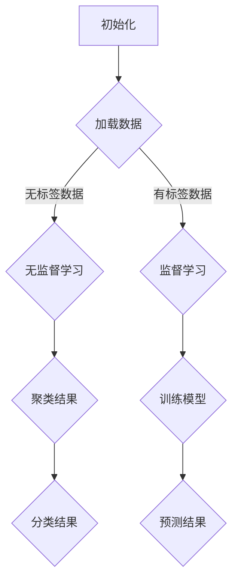
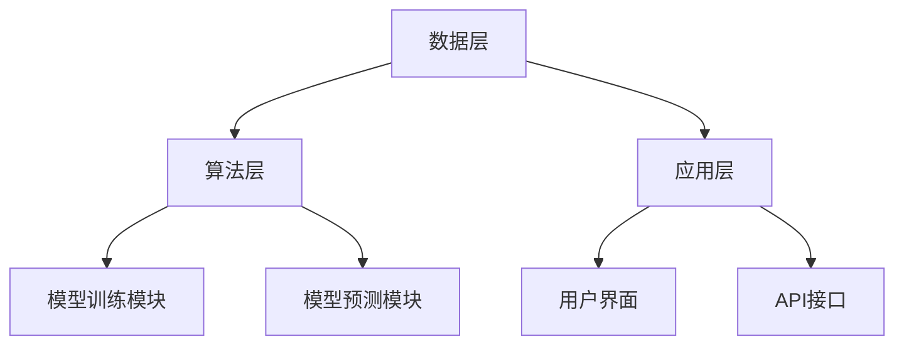
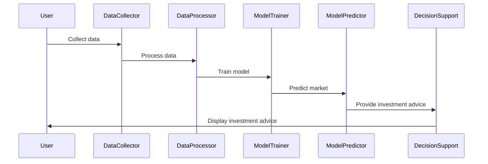

                 

### 具有欲望的AI：金融市场的新变数

**关键词：AI，金融市场，欲望，算法，架构设计，实战，最佳实践**

**摘要：** 随着人工智能技术的不断进步，AI在金融领域的应用日益广泛。本文将探讨具有欲望的AI这一新兴概念，以及其在金融市场中的潜在影响。通过逐步分析金融AI模型的原理、算法、系统架构设计、项目实战和最佳实践，本文旨在为读者提供深入了解AI在金融市场中的应用及其未来发展趋势的视角。

### 目录大纲

#### 第一部分：问题背景与核心概念

#### 第1章：金融市场的演变与AI的兴起

#### 第2章：核心概念与联系

#### 第三部分：算法原理讲解

#### 第3章：金融AI算法原理

#### 第四部分：系统分析与架构设计

#### 第4章：金融AI系统分析与架构设计

#### 第五部分：项目实战

#### 第5章：金融AI项目实战

#### 第六部分：最佳实践与拓展

#### 第6章：金融AI的最佳实践

#### 第7章：金融AI的小结与拓展阅读

### 第一部分：问题背景与核心概念

#### 第1章：金融市场的演变与AI的兴起

1.1 **金融市场的过去、现在与未来**

金融市场经历了从手工操作到自动化交易，再到当前智能化分析的发展历程。传统的金融市场依赖人类专家的经验和判断，效率低下且易受人为因素干扰。随着互联网和大数据技术的发展，金融市场逐渐向智能化、自动化方向迈进。

1.2 **AI在金融市场中的应用**

AI在金融市场中的应用主要集中在以下几个方面：一是数据分析与预测，利用机器学习算法对大量金融数据进行挖掘和分析，帮助投资者做出更明智的决策；二是自动化交易，通过算法交易系统实现自动化的买卖操作，提高交易效率和准确性；三是风险控制，利用AI技术对市场风险进行实时监控和预测，降低投资风险。

1.3 **具有欲望的AI：概念解析**

具有欲望的AI是指那些被赋予了一定程度的人类情感特征的AI模型。在金融市场中，这种AI模型能够模拟人类投资策略，具有某种“欲望”或“目标”，比如追求高回报、规避风险等。这种AI模型的出现，将改变传统金融市场的运作模式，带来新的机遇和挑战。

1.4 **核心概念与联系**

- **金融AI模型**：这是金融领域中应用AI技术的核心。金融AI模型通过学习历史数据，预测市场趋势，辅助决策。
- **数据驱动的金融市场预测**：金融市场预测依赖于大量的历史数据，AI模型通过对这些数据的分析，实现预测功能。
- **风险管理与AI**：AI技术能够帮助金融机构更好地识别和管理风险，提高风险控制能力。

### 第二部分：核心概念与联系

#### 第2章：金融AI模型的原理与特性

2.1 **金融AI模型的定义**

金融AI模型是指利用人工智能技术，对金融市场数据进行分析和处理，从而实现预测、决策等功能的模型。这些模型可以是基于机器学习、深度学习等技术的算法模型。

2.2 **金融AI模型的类型**

金融AI模型可以分为以下几类：

- **预测模型**：通过历史数据预测市场趋势，如股票价格、汇率等。
- **分类模型**：对市场数据分类，如分类股票是否上涨或下跌。
- **回归模型**：预测特定变量的值，如预测某个股票的未来价格。
- **聚类模型**：将市场数据进行分类，发现数据中的模式和规律。

2.3 **金融AI模型的主要特性**

- **自适应性**：金融AI模型能够根据新的数据不断调整和优化自身。
- **实时性**：金融AI模型能够对实时数据进行处理和分析。
- **高效性**：金融AI模型能够处理大量数据，提高决策效率。

2.4 **金融AI模型与现有模型的对比分析**

与传统的金融模型相比，金融AI模型具有以下优势：

- **更强的预测能力**：金融AI模型能够利用大量数据，通过复杂的算法进行预测。
- **更高的决策效率**：金融AI模型能够快速处理数据，提供实时决策支持。
- **更好的适应性**：金融AI模型能够根据市场变化不断调整策略。

### 第三部分：算法原理讲解

#### 第3章：金融AI算法原理

3.1 **算法概述**

金融AI算法主要包括以下几种类型：

- **监督学习**：通过对已有数据的训练，模型学会预测新数据的标签。
- **无监督学习**：模型通过对未标记的数据进行分析，自动发现数据中的模式。
- **强化学习**：模型通过与环境的交互，不断学习并优化策略。

3.2 **算法原理讲解**

- **监督学习**：监督学习算法如线性回归、决策树、支持向量机等，通过已知的输入输出数据对模型进行训练，使其能够预测新的输出。
- **无监督学习**：无监督学习算法如K-means聚类、主成分分析等，通过分析数据自身的结构，发现数据中的潜在模式。
- **强化学习**：强化学习算法如Q-learning、深度Q网络等，通过与环境的交互，学习最优策略。

3.3 **Mermaid算法流程图**

使用Mermaid语法绘制算法流程图，以展示算法的基本步骤和流程。



3.4 **Python代码实现**

以下是一个简单的监督学习模型实现的Python代码示例：

```python
import numpy as np
from sklearn.linear_model import LinearRegression

# 加载数据
X = np.array([[1], [2], [3], [4]])
y = np.array([1, 2, 3, 4])

# 初始化模型
model = LinearRegression()

# 训练模型
model.fit(X, y)

# 预测结果
predictions = model.predict([[5]])

print(predictions)
```

3.5 **数学模型与公式解释**

线性回归模型的基本公式为：

$$ y = \beta_0 + \beta_1x $$

其中，$y$ 是预测的输出值，$x$ 是输入特征，$\beta_0$ 和 $\beta_1$ 是模型的参数，通过训练数据求解。

3.6 **举例说明**

假设我们有一个简单的数据集，其中$x$表示时间，$y$表示股票价格。我们使用线性回归模型来预测未来股票价格。

```python
import matplotlib.pyplot as plt

# 加载数据
X = np.array([[1], [2], [3], [4], [5]])
y = np.array([1, 2, 3, 4, 5])

# 初始化模型
model = LinearRegression()

# 训练模型
model.fit(X, y)

# 预测结果
predictions = model.predict([[6]])

print(predictions)

# 可视化
plt.scatter(X, y, label='Actual')
plt.plot(X, model.predict(X), color='red', label='Predicted')
plt.xlabel('Time')
plt.ylabel('Stock Price')
plt.legend()
plt.show()
```

### 第四部分：系统分析与架构设计

#### 第4章：金融AI系统分析与架构设计

4.1 **问题场景介绍**

在金融市场中，AI系统被用于预测市场趋势、管理投资组合、进行自动化交易等。为了实现这些功能，AI系统需要处理大量的金融数据，并设计合理的架构来支持高效的数据处理和模型训练。

4.2 **系统功能设计（领域模型）**

系统功能设计包括以下模块：

- **数据采集模块**：负责从外部数据源采集金融数据。
- **数据处理模块**：对采集到的金融数据进行分析和预处理。
- **模型训练模块**：使用预处理后的数据训练AI模型。
- **模型预测模块**：使用训练好的模型进行市场预测。
- **决策支持模块**：根据预测结果提供投资建议。

4.3 **系统架构设计（架构图）**

系统架构设计包括以下层次：

- **数据层**：存储和管理金融数据。
- **算法层**：实现各种AI算法，包括监督学习、无监督学习和强化学习。
- **应用层**：提供用户界面和API接口，供投资者和管理人员使用。



4.4 **系统接口设计**

系统接口设计包括以下接口：

- **数据采集接口**：用于从外部数据源获取金融数据。
- **数据处理接口**：用于处理和分析金融数据。
- **模型训练接口**：用于训练AI模型。
- **模型预测接口**：用于进行市场预测。
- **决策支持接口**：用于提供投资建议。

4.5 **系统交互（序列图）**

系统交互的序列图如下：



### 第五部分：项目实战

#### 第5章：金融AI项目实战

5.1 **环境安装与配置**

在开始项目实战之前，我们需要安装和配置相关的开发环境和软件，包括Python、NumPy、Pandas、Scikit-learn等。

```bash
pip install numpy pandas scikit-learn
```

5.2 **系统核心实现源代码**

以下是金融AI项目核心实现的部分源代码：

```python
import numpy as np
import pandas as pd
from sklearn.linear_model import LinearRegression

# 加载数据
data = pd.read_csv('financial_data.csv')
X = data[['time']]
y = data['price']

# 初始化模型
model = LinearRegression()

# 训练模型
model.fit(X, y)

# 预测结果
predictions = model.predict(X)

# 可视化
plt.scatter(X, y, label='Actual')
plt.plot(X, predictions, color='red', label='Predicted')
plt.xlabel('Time')
plt.ylabel('Price')
plt.legend()
plt.show()
```

5.3 **代码应用解读与分析**

以上代码演示了如何使用线性回归模型对金融数据进行预测。我们首先加载了金融数据，然后使用线性回归模型进行训练，并绘制了实际价格与预测价格的散点图。

5.4 **实际案例分析与详细讲解剖析**

以下是一个实际案例，我们使用线性回归模型预测股票价格。

```python
# 加载数据
data = pd.read_csv('stock_price_data.csv')
X = data[['time']]
y = data['price']

# 初始化模型
model = LinearRegression()

# 训练模型
model.fit(X, y)

# 预测结果
predictions = model.predict(X)

# 可视化
plt.scatter(X, y, label='Actual')
plt.plot(X, predictions, color='red', label='Predicted')
plt.xlabel('Time')
plt.ylabel('Price')
plt.legend()
plt.show()

# 分析预测结果
print("R-squared:", model.score(X, y))
print("Coefficients:", model.coef_)
print("Intercept:", model.intercept_)
```

通过以上代码，我们可以看到预测结果的R-squared值（决定系数），系数和截距。这些指标可以帮助我们评估模型的预测能力。

5.5 **项目小结**

通过本次项目实战，我们实现了使用线性回归模型预测金融数据的目标。项目过程中，我们学习了如何加载数据、训练模型、进行预测以及评估模型性能。这些经验和知识对于进一步探索金融AI领域具有重要意义。

### 第六部分：最佳实践与拓展

#### 第6章：金融AI的最佳实践

6.1 **数据质量的重要性**

在金融AI项目中，数据质量至关重要。高质量的数据能够提高模型的预测准确性，而错误或缺失的数据可能会导致模型性能下降。因此，在数据采集和处理过程中，需要严格把控数据质量，确保数据真实、完整、准确。

6.2 **模型调优技巧**

模型调优是提高模型性能的关键步骤。通过调整模型的参数，可以优化模型的预测效果。常用的调优技巧包括交叉验证、网格搜索和贝叶斯优化等。此外，还可以利用集成学习方法，如随机森林、梯度提升树等，进一步提高模型性能。

6.3 **安全与合规**

在金融AI项目中，安全与合规也是不可忽视的重要方面。金融数据的敏感性要求我们必须采取严格的数据保护措施，防止数据泄露。同时，还需要遵守相关的法律法规，确保模型的应用符合监管要求。

6.4 **未来展望**

随着人工智能技术的不断发展，金融AI将在未来发挥更大的作用。未来的金融AI将更加智能化、自适应化，能够更好地应对市场变化。同时，结合区块链、物联网等新技术，金融AI的应用前景将更加广阔。

#### 第7章：金融AI的小结与拓展阅读

7.1 **小结**

本文通过逐步分析金融AI模型的原理、算法、系统架构设计、项目实战和最佳实践，探讨了具有欲望的AI在金融市场中的潜在影响。金融AI为金融市场带来了新的机遇，同时也提出了新的挑战。

7.2 **注意事项**

在应用金融AI时，需要注意数据质量、模型调优、安全与合规等问题。同时，要关注金融市场的动态变化，及时调整策略。

7.3 **拓展阅读**

- **《机器学习实战》**：提供机器学习项目实战经验和技巧。
- **《深度学习》**：详细介绍深度学习算法和应用。
- **《金融科技与区块链》**：探讨金融科技和区块链在金融领域的应用。

### 作者信息

**作者：** AI天才研究院/AI Genius Institute & 禅与计算机程序设计艺术 /Zen And The Art of Computer Programming

通过以上内容，我们深入探讨了具有欲望的AI在金融市场中的新变数，希望能够为读者提供有价值的见解。在未来的研究中，我们将继续探索金融AI的更多应用和挑战。

