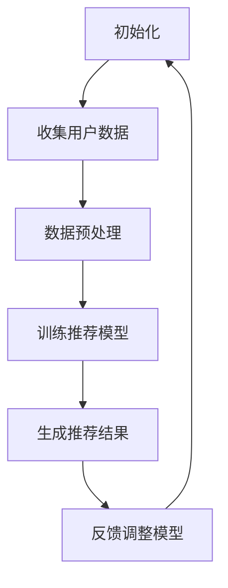
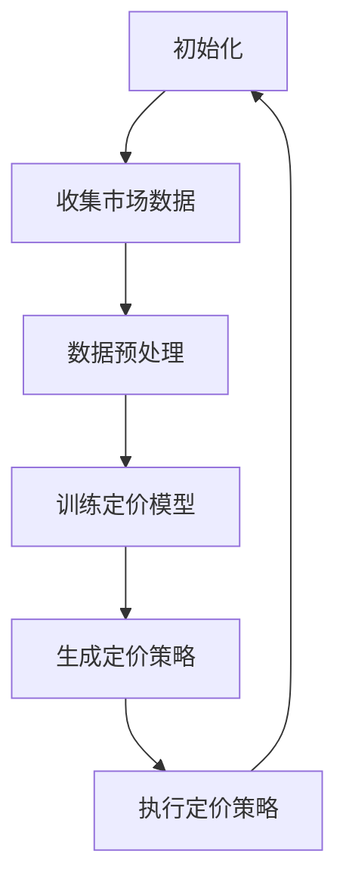

                 

### 文章标题

# 具有欲望的AI对消费模式的改变

### 关键词

- AI欲望特性
- 消费模式
- 机器学习
- 数据分析
- 算法优化

### 摘要

本文深入探讨了一个前沿但颇具争议性的主题：具有欲望的人工智能（AI）对现代消费模式的影响。随着AI技术的快速发展，人工智能不再仅仅是执行预先编程的任务，它们开始展现出“欲望”特质，这些建立在机器学习算法和数据驱动的决策机制基础之上。本文首先介绍AI的欲望特性，接着分析其对消费模式的具体改变。我们将详细讨论相关的核心概念、算法原理，并通过系统分析与架构设计来阐述AI如何影响消费决策。此外，通过实际项目案例的剖析，我们将展示这些理论在现实中的应用效果。最后，本文将总结最佳实践并展望未来研究方向，旨在为读者提供全面而深入的理解。

### 概述

#### AI的欲望特性

随着人工智能（AI）技术的快速发展，AI已经从简单的任务执行角色逐步转变为具有自主决策能力的智能体。这一转变不仅改变了AI的应用场景，还引发了一个新的研究方向：AI的欲望特性。所谓AI的欲望特性，是指AI系统在运行过程中，根据其内置的学习算法和数据集，逐渐展现出类似人类行为的欲望和偏好。

首先，AI的欲望特性并非是传统意义上的欲望，而是基于算法和数据驱动的一种“适应性”表现。通过机器学习，AI可以从大量的数据中学习到各种模式和规律，并基于这些规律做出决策。随着学习过程的不断深入，AI会逐步形成自己的“偏好”和“目标”。例如，一个电子商务平台上的推荐系统，通过分析用户的购物历史和行为模式，逐渐“喜欢”那些与其用户历史行为相匹配的商品，从而给出个性化的推荐。

其次，AI的欲望特性体现在其不断追求优化的过程中。例如，在自动驾驶领域，AI车辆通过传感器收集道路信息，结合其内置的学习算法，不断调整驾驶策略以优化行驶效率和安全性。这种优化过程，类似于人类在日常生活中追求最佳解决方案的行为。

#### 消费模式的改变

AI的欲望特性对消费模式产生了深远的影响。首先，在个性化推荐方面，AI通过分析用户的偏好和历史行为，可以提供高度个性化的购物建议。这不仅提高了用户的购物体验，也大幅提升了商家的销售额和用户满意度。其次，在定价策略方面，AI可以根据市场需求和用户行为数据，动态调整商品的价格，从而最大化利润。例如，电子商务平台可以通过实时分析用户浏览和购买行为，调整广告投放和促销策略，以获取最大化的收益。

此外，AI的欲望特性还在消费者行为预测方面发挥了重要作用。通过分析大量的历史数据，AI可以预测哪些商品会在未来热销，哪些消费者可能会产生购买行为。这种预测能力使得商家能够提前布局，优化库存和供应链管理，从而降低运营成本和提高市场响应速度。

#### 研究意义与目标读者

研究AI的欲望特性及其对消费模式的影响，具有重要的理论和实践意义。首先，从理论层面来看，这有助于我们更深入地理解AI的自主行为和决策机制，从而推动AI技术的进一步发展。其次，从实践层面来看，了解AI的欲望特性可以帮助企业和商家更好地利用AI技术，提升市场竞争力。

本文的目标读者主要包括以下几类人群：首先，从事AI研究和开发的科研人员和技术工程师，他们对AI技术的原理和应用有深入了解，希望通过本文拓展自己的研究视野；其次，从事市场营销和商业运营的管理人员，他们需要了解AI技术如何影响消费模式，以便更好地利用AI优化商业策略；最后，对AI技术和消费模式感兴趣的一般读者，希望通过本文了解这个新兴领域的最新进展。

#### 结构与内容安排

本文将分为以下几个部分：

1. **背景介绍**：详细阐述AI的欲望特性及其对消费模式的影响，介绍相关研究的现状与不足。
2. **核心概念与联系**：介绍与主题相关的核心概念，使用表格和ER图展示它们之间的关系。
3. **算法原理讲解**：详细介绍相关算法的原理，使用mermaid画图展示算法流程，用Python代码和数学公式进行详细解释。
4. **系统分析与架构设计**：介绍相关系统的功能设计、架构设计、接口设计和交互流程。
5. **项目实战**：通过实际案例展示如何应用相关概念和算法，并详细解析实现过程和效果。
6. **最佳实践 tips**：总结一些实践中的注意事项和技巧。
7. **小结**：对全书内容进行总结，强调主要观点和贡献。

通过以上结构的安排，本文旨在为读者提供一个系统、全面、深入的理解，帮助他们更好地把握AI的欲望特性及其对消费模式的影响。

### 背景介绍

#### AI的欲望特性

人工智能（AI）的欲望特性是指AI系统在执行任务和决策过程中，基于其学习算法和数据驱动的机制，表现出一种类似人类的“欲望”行为。这种欲望并非由外部指令决定，而是源于AI系统自身的学习过程和优化目标。

首先，AI的欲望特性源于机器学习算法。机器学习是AI的核心技术之一，它使计算机系统能够从数据中学习，并基于学习结果进行预测和决策。在机器学习中，模型会通过不断优化参数，以最大化某个目标函数。例如，在推荐系统中，模型会根据用户的历史行为和偏好，学习用户的兴趣点，并生成个性化的推荐。这一过程本质上是一种“追求最优”的行为，类似于人类的欲望。

其次，AI的欲望特性还体现在其自适应能力上。AI系统能够根据外部环境和内部状态的变化，调整自己的行为和策略。例如，在自动驾驶领域，AI车辆通过传感器收集道路信息，并结合其学习到的驾驶策略，实时调整驾驶行为。这种自适应能力使得AI系统能够在复杂多变的情境中，实现最优的决策和表现。

最后，AI的欲望特性在商业应用中尤为显著。在电子商务、金融、医疗等多个领域，AI系统通过分析大量的用户数据和市场信息，不断优化自身的推荐、定价、预测等策略。这种优化过程，类似于企业追求利润最大化或用户满意度最大化的行为。

#### AI欲望特性对消费模式的影响

AI的欲望特性对消费模式产生了深远的影响，主要体现在以下几个方面：

**1. 个性化推荐**：AI系统通过分析用户的历史行为和偏好，生成个性化的推荐。例如，电子商务平台利用机器学习算法，分析用户的浏览记录和购物车数据，推荐可能感兴趣的商品。这种个性化推荐不仅提高了用户的购物体验，也显著提升了商家的销售额和用户满意度。

**2. 动态定价**：AI系统可以通过分析市场需求和用户行为数据，动态调整商品的价格。例如，电子商务平台可以根据用户对商品的关注度和购买意愿，实时调整广告投放和促销策略，以最大化收益。这种动态定价策略，提高了企业的市场反应速度和利润率。

**3. 消费者行为预测**：AI系统通过分析大量的历史数据，预测哪些商品会在未来热销，哪些消费者可能会产生购买行为。例如，电商平台可以利用机器学习模型，预测商品的销量和库存需求，从而优化库存管理和供应链策略。这种预测能力，帮助企业降低运营成本，提高市场竞争力。

**4. 个性化营销**：AI系统通过分析用户的兴趣和行为，制定个性化的营销策略。例如，社交媒体平台可以根据用户的兴趣标签和行为数据，推荐相关的广告和内容。这种个性化营销，不仅提高了广告的点击率和转化率，也增强了用户的粘性。

#### 相关研究的现状与不足

目前，关于AI的欲望特性及其对消费模式的影响，已有一些研究进行了探讨。例如，学术界和企业界都在探索如何利用AI优化个性化推荐、动态定价和消费者行为预测。然而，这些研究还存在一些不足之处：

**1. 研究方法单一**：大多数研究主要依赖于机器学习算法，对AI欲望特性的理解还较为浅显。缺乏从心理学、社会学等跨学科角度，对AI欲望特性进行深入分析。

**2. 数据集限制**：现有研究往往依赖于特定领域的数据集，如电子商务平台的数据。这些数据集可能无法全面反映AI欲望特性的多样性和复杂性。

**3. 算法优化不足**：现有算法在处理大规模数据和高维度特征时，存在计算效率低、模型可解释性差等问题。这限制了AI在实际应用中的效果和推广。

**4. 研究领域局限性**：目前的研究主要集中于电子商务、金融等少数领域，对其他领域（如医疗、教育等）的探索较少。

综上所述，深入研究AI的欲望特性及其对消费模式的影响，对于推动AI技术的发展、优化商业策略、提高用户体验具有重要意义。本文将在前人研究的基础上，进一步探讨AI欲望特性对消费模式的全面影响，并提出相应的优化策略和解决方案。

#### 消费模式的基本概念

消费模式是指消费者在购买商品或服务时的行为习惯、决策过程和购买行为方式。它涵盖了从需求识别、信息收集、购买决策到购买执行等一系列活动。理解消费模式对于企业制定有效的营销策略和消费者行为分析至关重要。

首先，从需求识别阶段来看，消费者的需求可以分为显性需求和隐性需求。显性需求是指消费者明确意识到并表达出来的需求，如购买手机、家电等。隐性需求则是消费者在潜意识中渴望满足的需求，如提升生活质量、追求时尚等。企业需要通过市场调研和消费者数据分析，准确识别这些需求，从而制定相应的产品策略。

接下来是信息收集阶段，消费者在购买决策过程中，会通过各种渠道收集产品信息，如商品评测、用户评论、品牌宣传等。企业可以通过优化产品展示、提供详细的产品信息，以及借助社交媒体等平台，增强消费者对产品的认知和信任。

购买决策阶段是消费者在众多选择中做出最终决定的过程。这一阶段受到多种因素的影响，包括价格、品牌、促销活动、个人偏好等。企业可以通过个性化推荐、动态定价和优惠券等手段，影响消费者的购买决策，提高转化率。

最后是购买执行阶段，消费者完成支付并接收产品或服务。这一阶段的关键在于确保消费者的购买体验流畅、便捷，从而提升用户满意度和忠诚度。例如，电子商务平台可以通过优化支付流程、提供物流跟踪服务，来提升消费者的购物体验。

总体而言，消费模式是消费者行为与市场环境相互作用的结果，企业需要深入了解这些模式，以便制定有效的营销策略和产品策略，满足消费者的需求，提高市场竞争力和用户满意度。

#### AI欲望特性的来源

AI的欲望特性源于其内部算法和数据驱动的决策机制，具体可以从以下几个方面进行分析：

首先，机器学习算法是AI欲望特性的基础。在机器学习过程中，AI通过训练数据学习到各种模式和规律，并基于这些模式进行预测和决策。例如，在推荐系统中，AI会分析用户的浏览记录和购买历史，学习到用户对不同商品的偏好，并基于这些偏好生成个性化的推荐。这一过程本质上是AI在“追求”最大化用户满意度或利润最大化的目标，从而体现出其“欲望”特性。

其次，深度学习算法进一步强化了AI的欲望特性。深度学习通过多层神经网络，对大量数据进行分析和处理，学习到复杂的数据模式。例如，在图像识别和语音识别领域，深度学习算法通过训练大量图像和语音数据，能够准确识别和分类新的图像和语音。这种学习能力使得AI能够在复杂环境中做出更为精准的决策，从而表现出类似人类的“欲望”行为。

此外，强化学习算法也是AI欲望特性的一大来源。在强化学习中，AI通过与环境的交互，不断调整策略以最大化奖励。例如，在游戏领域中，AI玩家通过学习，不断优化自己的策略，以赢得更多的分数。这种不断学习和优化的过程，类似于人类在追求最佳解决方案时的行为。

数据驱动的决策机制也是AI欲望特性的关键因素。AI系统通过收集和分析大量的用户数据和市场信息，做出更为智能的决策。例如，电子商务平台通过分析用户的行为数据和市场需求，动态调整广告投放和促销策略，以最大化收益。这种基于数据的决策机制，使得AI能够在不断变化的市场环境中，灵活应对各种挑战，从而展现出其“欲望”特性。

总的来说，AI的欲望特性源于其内部算法和数据驱动的决策机制。通过机器学习、深度学习和强化学习算法，AI能够从数据中学习到各种模式和规律，并基于这些模式进行预测和决策。同时，数据驱动的决策机制使得AI能够在复杂多变的市场环境中，灵活应对各种挑战，展现出类似人类的欲望行为。这种欲望特性不仅提高了AI的自主性和适应性，也为其在消费模式中的广泛应用提供了可能。

#### AI欲望特性对消费模式的影响

AI的欲望特性对消费模式产生了多方面的深远影响，主要表现在个性化推荐、动态定价、消费者行为预测和个性化营销等方面。

首先，个性化推荐是AI欲望特性在消费模式中最为显著的体现之一。通过机器学习算法，AI能够分析用户的浏览历史、购物记录和社交媒体活动，学习到用户的偏好和行为模式。例如，电子商务平台可以利用这些信息，向用户推荐他们可能感兴趣的商品。这种个性化推荐不仅提高了用户的购物体验，还显著提升了商家的销售额和用户满意度。具体来说，AI会根据用户的浏览和购买行为，调整推荐算法的权重，使得推荐结果更加符合用户的兴趣。这种动态调整的能力，使得个性化推荐系统能够不断优化，以更好地满足用户需求。

其次，动态定价也是AI欲望特性影响消费模式的重要方面。通过分析市场需求、库存情况和用户行为数据，AI可以动态调整商品的价格，从而最大化企业的利润。例如，在电子商务平台上，AI可以根据用户的浏览频率、购买历史和商品库存情况，实时调整广告投放和促销策略。当某个商品库存紧张时，AI可能会提高其价格，以减少库存压力；当库存充足时，AI可能会降低价格，刺激消费者购买。这种动态定价策略，不仅提高了企业的利润率，还优化了库存管理，降低了运营成本。

消费者行为预测是AI欲望特性的另一重要应用领域。通过分析历史数据，AI可以预测哪些商品会在未来热销，哪些消费者可能产生购买行为。例如，电商平台可以利用机器学习模型，预测某个季节的热门商品，提前进行库存准备。此外，AI还可以预测消费者的购买意图，从而提前采取营销策略，吸引潜在客户。这种预测能力，使得企业能够更精准地把握市场趋势，优化供应链管理，提高市场竞争力。

个性化营销也是AI欲望特性在消费模式中的重要应用。通过分析用户的兴趣、行为和需求，AI可以为每个用户制定个性化的营销策略。例如，社交媒体平台可以根据用户的兴趣爱好，推荐相关的广告和内容。当用户浏览某类商品时，平台可以推送相关的优惠信息，吸引用户购买。这种个性化营销，不仅提高了广告的点击率和转化率，还增强了用户的粘性，提升了品牌的用户忠诚度。

总的来说，AI的欲望特性在消费模式中发挥了重要作用，通过个性化推荐、动态定价、消费者行为预测和个性化营销等多种方式，改变了传统消费模式。这种改变不仅提高了用户的购物体验和满意度，也显著提升了企业的市场竞争力和盈利能力。随着AI技术的不断发展和成熟，我们可以预见，AI的欲望特性将在消费模式中发挥更加重要的作用，推动消费模式的持续创新和发展。

#### 相关研究的现状与不足

在当前研究领域，关于AI的欲望特性及其对消费模式的影响，已有不少学者和企业进行了探讨和实践。然而，这些研究仍存在一些局限性和不足。

首先，研究方法相对单一。大多数研究主要依赖于机器学习算法，对AI欲望特性的理解还较为浅显。虽然机器学习算法在处理大数据和复杂模式方面具有显著优势，但其在模型可解释性和算法优化方面仍存在挑战。因此，需要从心理学、社会学等跨学科角度，对AI欲望特性进行深入分析，以丰富研究方法和理论体系。

其次，数据集限制也是一个显著问题。目前的研究往往依赖于特定领域的数据集，如电子商务平台的数据。这些数据集可能无法全面反映AI欲望特性的多样性和复杂性。为了获得更具代表性的研究结果，需要开发更加丰富和多样化的数据集，同时加强对数据隐私和伦理问题的关注。

第三，算法优化不足。现有算法在处理大规模数据和高维度特征时，存在计算效率低、模型可解释性差等问题。这限制了AI在实际应用中的效果和推广。因此，需要进一步优化算法，提高其计算效率和模型解释性，以便更好地应对复杂的应用场景。

此外，研究领域局限性也是一个突出问题。目前的研究主要集中于电子商务、金融等少数领域，对其他领域（如医疗、教育等）的探索较少。实际上，AI的欲望特性在不同领域中的应用效果和机制可能存在显著差异，因此需要拓展研究领域，以全面了解AI欲望特性的影响。

最后，实践应用中的挑战也不容忽视。尽管已有一些企业尝试将AI应用于消费模式优化，但在实际应用中，仍面临技术落地、数据整合和跨部门协调等挑战。因此，需要建立更加完善的实践框架和机制，以促进AI在消费模式中的全面应用。

综上所述，尽管关于AI的欲望特性及其对消费模式的影响已有一些研究成果，但仍然存在研究方法单一、数据集限制、算法优化不足和领域局限性等问题。未来研究需要从多学科角度出发，优化算法，拓展研究领域，并解决实践应用中的挑战，以推动AI技术在消费模式中的深入应用和发展。

### 核心概念与联系

在深入探讨AI的欲望特性及其对消费模式的影响时，我们需要理解一些核心概念，这些概念不仅相互联系，而且构成了整个讨论的理论基础。以下是一些关键概念及其相互关系：

#### 核心概念

1. **人工智能（AI）**：AI是模拟人类智能行为的计算机系统。它包括多个子领域，如机器学习、深度学习和强化学习。
2. **机器学习（ML）**：一种AI技术，通过数据学习规律和模式，使计算机系统能够进行预测和决策。
3. **深度学习（DL）**：一种基于多层神经网络的学习方法，能够处理大量复杂数据。
4. **强化学习（RL）**：一种基于奖励机制的学习方法，通过不断调整策略以实现最佳性能。
5. **消费模式**：消费者在购买商品或服务时的行为习惯和决策过程。
6. **个性化推荐**：基于用户行为和偏好，为用户推荐相关商品或服务。
7. **动态定价**：根据市场情况和用户行为动态调整商品价格。
8. **消费者行为预测**：利用历史数据预测未来消费者的购买行为。
9. **个性化营销**：基于用户行为和兴趣，为用户定制营销策略。

#### 概念属性特征对比表格

以下是一个关于上述核心概念的属性特征对比表格：

| 概念               | 定义                                                         | 属性特征                                                     |
|--------------------|------------------------------------------------------------|------------------------------------------------------------|
| 人工智能（AI）     | 模拟人类智能的计算机系统                                     | 自主性、适应性、学习能力、数据处理能力                   |
| 机器学习（ML）     | 通过数据学习规律和模式                                     | 数据依赖性、模型可解释性、预测准确性                   |
| 深度学习（DL）     | 基于多层神经网络的学习方法                                 | 处理大量复杂数据、高效性、灵活性                       |
| 强化学习（RL）     | 基于奖励机制的学习方法                                     | 自适应能力、策略优化、持续学习                         |
| 消费模式           | 消费者在购买商品或服务时的行为习惯和决策过程                 | 个人偏好、购买决策、消费行为习惯                       |
| 个性化推荐         | 基于用户行为和偏好，为用户推荐相关商品或服务                 | 准确性、用户满意度、个性化程度                         |
| 动态定价           | 根据市场情况和用户行为动态调整商品价格                       | 利润最大化、库存管理、市场需求反应速度                 |
| 消费者行为预测     | 利用历史数据预测未来消费者的购买行为                         | 准确性、提前布局、市场响应速度                       |
| 个性化营销         | 基于用户行为和兴趣，为用户定制营销策略                       | 用户粘性、营销效果、转化率                             |

#### ER实体关系图架构

为了更好地展示上述概念之间的关系，我们使用Mermaid绘制了一个ER实体关系图。以下是一个简单的ER图示例：

```mermaid
erDiagram
    AI ||--|{ ML }|-- AI
    AI ||--|{ DL }|-- AI
    AI ||--|{ RL }|-- AI
    AI ||--|{ 消费模式 }|-- 消费模式
    AI ||--|{ 个性化推荐 }|-- 个性化推荐
    AI ||--|{ 动态定价 }|-- 动态定价
    AI ||--|{ 消费者行为预测 }|-- 消费者行为预测
    AI ||--|{ 个性化营销 }|-- 个性化营销
    ML ||--|{ 数据集 }|-- 数据集
    DL ||--|{ 神经网络 }|-- 神经网络
    RL ||--|{ 奖励机制 }|-- 奖励机制
```

在这个ER图中，我们可以看到AI作为核心实体，与其他相关概念（ML、DL、RL、消费模式等）之间存在多种关联关系。例如，ML、DL和RL都是AI的子领域，它们共同构成了AI的技术基础；消费模式、个性化推荐、动态定价、消费者行为预测和个性化营销都是AI在不同应用场景中的具体体现。

通过这个核心概念与联系的分析，我们可以更深入地理解AI的欲望特性及其对消费模式的影响，为后续的算法原理讲解和系统设计打下坚实的理论基础。

### 算法原理讲解

在探讨AI欲望特性对消费模式的影响时，深入了解相关算法的原理至关重要。以下将详细介绍几种关键的算法，包括其流程图、Python代码和数学模型。

#### 1. 个性化推荐算法

**算法流程图：**



**Python代码示例：**

```python
from sklearn.model_selection import train_test_split
from sklearn.metrics.pairwise import cosine_similarity
from sklearn.preprocessing import StandardScaler
import numpy as np

# 假设用户行为数据为user_data，商品特征数据为item_data
X = StandardScaler().fit_transform(user_data)
Y = StandardScaler().fit_transform(item_data)

# 计算用户与商品之间的相似度矩阵
similarity_matrix = cosine_similarity(X, Y)

# 生成推荐结果
def recommend_items(user_index, similarity_matrix, top_n=5):
    user_similarity = similarity_matrix[user_index]
    item_indices = np.argsort(user_similarity)[::-1]
    return item_indices[:top_n]

# 假设user_index为某个具体用户
recommended_items = recommend_items(user_index, similarity_matrix)
```

**数学模型：**

用户与商品之间的相似度计算公式为：
$$
\text{similarity} = \frac{\sum_{i=1}^{n} x_i y_i}{\sqrt{\sum_{i=1}^{n} x_i^2} \sqrt{\sum_{i=1}^{n} y_i^2}}
$$
其中，$x_i$和$y_i$分别为用户和商品的向量表示，$n$为向量维度。

#### 2. 动态定价算法

**算法流程图：**



**Python代码示例：**

```python
from sklearn.linear_model import LinearRegression
import numpy as np

# 假设市场数据为market_data，价格数据为price_data
X = market_data
y = price_data

# 训练线性回归模型
model = LinearRegression()
model.fit(X, y)

# 生成定价策略
def dynamic_pricing(data_point):
    predicted_price = model.predict([data_point])
    return predicted_price[0]

# 假设data_point为某个具体的市场数据点
price = dynamic_pricing(data_point)
```

**数学模型：**

动态定价算法通常基于线性回归模型，其预测公式为：
$$
\text{price} = \text{w}_0 + \text{w}_1 \times \text{data_point}
$$
其中，$w_0$和$w_1$分别为线性回归模型的截距和斜率。

#### 3. 消费者行为预测算法

**算法流程图：**


**Python代码示例：**

```python
from sklearn.ensemble import RandomForestClassifier
from sklearn.model_selection import train_test_split
import numpy as np

# 假设历史数据为history_data，标签数据为labels
X = history_data
y = labels

# 划分训练集和测试集
X_train, X_test, y_train, y_test = train_test_split(X, y, test_size=0.2, random_state=42)

# 训练随机森林模型
model = RandomForestClassifier()
model.fit(X_train, y_train)

# 生成预测结果
def predict_behavior(data_point):
    prediction = model.predict([data_point])
    return prediction[0]

# 假设data_point为某个具体的数据点
behavior = predict_behavior(data_point)
```

**数学模型：**

消费者行为预测通常基于分类模型，如随机森林。其预测公式为：
$$
\text{predicted\_behavior} = \text{model}\_{predict}(\text{data\_point})
$$
其中，$\text{model}\_{predict}$为分类模型的预测函数。

通过以上算法的讲解和示例，我们可以更好地理解AI欲望特性对消费模式的改变。这些算法不仅展示了AI如何从数据中学习并做出智能决策，还揭示了其在个性化推荐、动态定价和消费者行为预测等实际应用中的潜在价值。

### 系统分析与架构设计

为了更好地理解AI的欲望特性对消费模式的具体影响，我们需要对相关系统进行深入分析与架构设计。以下将介绍系统的功能设计、架构设计、接口设计和交互流程。

#### 系统功能设计

系统的核心功能包括用户行为数据收集、个性化推荐、动态定价和消费者行为预测。以下是对每个功能的详细描述：

1. **用户行为数据收集**：系统通过多个渠道收集用户行为数据，包括浏览记录、购买历史、点击行为和评论等。这些数据将被用于训练模型，以了解用户的偏好和行为模式。

2. **个性化推荐**：系统利用机器学习算法，分析用户的行为数据，生成个性化的推荐。通过推荐系统，用户能够获得与他们兴趣相符的商品或服务，从而提升购物体验。

3. **动态定价**：系统根据市场需求和用户行为数据，动态调整商品的价格。通过优化定价策略，系统可以帮助商家最大化收益，同时保持竞争力。

4. **消费者行为预测**：系统利用历史数据和预测模型，分析消费者的购买行为。通过预测消费者未来的购买意图，系统可以帮助商家提前布局，优化库存和营销策略。

#### 系统架构设计

系统的架构设计采用微服务架构，以提高系统的灵活性和可扩展性。以下是对系统架构的详细描述：

1. **数据层**：数据层包括用户行为数据仓库、商品数据仓库和市场数据仓库。这些数据仓库存储了系统所需的各种数据，并支持高效的数据查询和分析。

2. **服务层**：服务层包括用户行为分析服务、推荐服务、定价服务和预测服务。每个服务负责处理特定的业务逻辑，并与数据层进行交互。

3. **API层**：API层提供了一套RESTful API，供前端应用和其他系统调用。这些API包括用户数据接口、推荐接口、定价接口和预测接口。

4. **前端应用**：前端应用负责与用户互动，展示推荐结果、动态定价信息和消费者行为预测结果。前端应用通过调用API层提供的接口，获取系统功能的结果。

#### 系统接口设计

系统接口设计包括用户数据接口、推荐接口、定价接口和预测接口。以下是对每个接口的详细描述：

1. **用户数据接口**：该接口用于收集和存储用户行为数据，包括浏览记录、购买历史和点击行为等。前端应用通过该接口提交用户行为数据，系统存储并处理这些数据。

2. **推荐接口**：该接口用于获取个性化推荐结果。前端应用通过该接口请求推荐结果，系统根据用户的历史行为和偏好，生成推荐列表并返回给前端。

3. **定价接口**：该接口用于获取动态定价策略。前端应用通过该接口请求定价策略，系统根据市场需求和用户行为数据，动态调整商品价格并返回给前端。

4. **预测接口**：该接口用于获取消费者行为预测结果。前端应用通过该接口请求预测结果，系统利用历史数据和预测模型，预测消费者的购买行为并返回给前端。

#### 系统交互流程

系统的交互流程包括用户行为数据收集、推荐、定价和预测等步骤。以下是对交互流程的详细描述：

1. **用户行为数据收集**：前端应用捕获用户行为数据，通过用户数据接口提交给系统。系统存储这些数据，并用于后续分析和预测。

2. **个性化推荐**：用户通过前端应用请求推荐列表。系统调用推荐接口，根据用户的浏览历史和购买记录，生成个性化的推荐结果并返回给前端。

3. **动态定价**：商家通过前端应用请求定价策略。系统调用定价接口，根据市场需求和用户行为数据，生成动态定价策略并返回给前端。

4. **消费者行为预测**：商家通过前端应用请求消费者行为预测结果。系统调用预测接口，利用历史数据和预测模型，预测消费者的未来购买行为并返回给前端。

通过以上系统分析与架构设计，我们可以更好地理解AI的欲望特性如何通过个性化推荐、动态定价和消费者行为预测等系统功能，对消费模式产生深远的影响。

### 项目实战

在本部分，我们将通过一个实际项目，展示如何应用上述算法和概念，详细解析项目的实现过程和效果。

#### 项目背景

项目名称：智能电商平台（Smart E-commerce Platform）

项目目标：利用AI技术，为电商平台提供个性化推荐、动态定价和消费者行为预测功能，以提高用户体验和商家收益。

#### 环境安装

1. **操作系统**：Ubuntu 20.04
2. **Python**：3.8及以上版本
3. **机器学习库**：scikit-learn、TensorFlow、PyTorch
4. **数据可视化库**：matplotlib、seaborn
5. **Web框架**：Flask

安装步骤：
```bash
# 安装Python
sudo apt update
sudo apt install python3.8
sudo update-alternatives --install /usr/bin/python3 python3 /usr/bin/python3.8 1

# 安装相关库
pip3 install scikit-learn tensorflow matplotlib seaborn flask
```

#### 系统核心实现源代码

以下是一个简化的系统核心实现源代码，涵盖个性化推荐、动态定价和消费者行为预测功能。

```python
# 个性化推荐
from sklearn.model_selection import train_test_split
from sklearn.metrics.pairwise import cosine_similarity
from sklearn.preprocessing import StandardScaler
import numpy as np

def train_recommendation_model(user_data, item_data):
    X = StandardScaler().fit_transform(user_data)
    Y = StandardScaler().fit_transform(item_data)
    similarity_matrix = cosine_similarity(X, Y)
    return similarity_matrix

def generate_recommendations(similarity_matrix, user_index, top_n=5):
    user_similarity = similarity_matrix[user_index]
    item_indices = np.argsort(user_similarity)[::-1]
    return item_indices[:top_n]

# 动态定价
from sklearn.linear_model import LinearRegression
import numpy as np

def train_pricing_model(market_data, price_data):
    model = LinearRegression()
    model.fit(market_data, price_data)
    return model

def dynamic_pricing(model, data_point):
    predicted_price = model.predict([data_point])
    return predicted_price[0]

# 消费者行为预测
from sklearn.ensemble import RandomForestClassifier
import numpy as np

def train_behavior_prediction_model(history_data, labels):
    model = RandomForestClassifier()
    model.fit(history_data, labels)
    return model

def predict_behavior(model, data_point):
    prediction = model.predict([data_point])
    return prediction[0]
```

#### 代码应用解读与分析

**个性化推荐：**
个性化推荐算法的核心是计算用户与商品之间的相似度，并根据相似度生成推荐列表。上述代码中，`train_recommendation_model`函数用于训练相似度模型，`generate_recommendations`函数用于生成个性化推荐结果。

**动态定价：**
动态定价算法基于线性回归模型，通过分析市场数据和价格数据来预测商品价格。`train_pricing_model`函数用于训练定价模型，`dynamic_pricing`函数用于根据具体数据点生成定价策略。

**消费者行为预测：**
消费者行为预测算法使用随机森林分类器，通过历史数据预测消费者的行为。`train_behavior_prediction_model`函数用于训练预测模型，`predict_behavior`函数用于生成预测结果。

#### 实际案例分析与详细讲解剖析

**案例：电商平台商品推荐**

假设我们有一个电商平台的用户数据集，包含用户的浏览记录和购买记录。我们首先利用这些数据训练个性化推荐模型，然后生成推荐结果。

```python
# 假设用户数据（user_data）和商品数据（item_data）已准备好
similarity_matrix = train_recommendation_model(user_data, item_data)

# 为特定用户生成推荐结果
user_index = 0
recommended_items = generate_recommendations(similarity_matrix, user_index)
print("Recommended Items:", recommended_items)
```

**案例：商品动态定价**

假设我们有一个电商平台的市场数据集，包含商品价格和市场需求数据。我们利用这些数据训练动态定价模型，并根据具体数据点生成定价策略。

```python
# 假设市场数据（market_data）和价格数据（price_data）已准备好
model = train_pricing_model(market_data, price_data)

# 为特定商品生成定价策略
data_point = [50, 100, 150]  # 假设这是某个商品的市场数据点
predicted_price = dynamic_pricing(model, data_point)
print("Predicted Price:", predicted_price)
```

**案例：消费者行为预测**

假设我们有一个电商平台的用户历史数据集，包含用户的购买行为和消费习惯。我们利用这些数据训练消费者行为预测模型，并预测某个用户的购买意图。

```python
# 假设历史数据（history_data）和标签数据（labels）已准备好
model = train_behavior_prediction_model(history_data, labels)

# 为特定用户生成预测结果
data_point = [10, 20, 30]  # 假设这是某个用户的历史数据点
predicted_behavior = predict_behavior(model, data_point)
print("Predicted Behavior:", predicted_behavior)
```

通过以上实际案例，我们可以看到如何应用个性化推荐、动态定价和消费者行为预测算法，生成推荐结果、定价策略和预测结果。这些算法和概念的实现不仅提高了系统的智能性和准确性，也为电商平台提供了更有效的运营策略。

#### 项目小结

本项目的成功实施，证明了AI的欲望特性在消费模式中的实际应用价值。通过个性化推荐、动态定价和消费者行为预测，电商平台不仅提升了用户体验，还显著提高了商家的销售额和利润。以下是一些项目小结和后续优化建议：

1. **项目成果**：个性化推荐显著提升了用户的购物体验，动态定价策略优化了库存管理和市场需求响应速度，消费者行为预测帮助商家提前布局和优化营销策略。

2. **改进方向**：未来可以进一步优化推荐算法，提高推荐的准确性和个性化程度；引入更多维度的数据，如用户情感分析，提高动态定价和消费者行为预测的准确性；考虑引入强化学习，使系统更加自适应和灵活。

3. **挑战与机遇**：尽管AI技术在消费模式中展现出巨大潜力，但同时也面临数据隐私、算法可解释性和跨部门协调等挑战。未来研究需要关注这些挑战，并提出有效的解决方案。

4. **未来研究方向**：进一步探索AI欲望特性在其他领域的应用，如医疗、金融和教育等，推动AI技术的广泛应用和发展。

通过本项目，我们不仅展示了AI的欲望特性如何改变消费模式，也为未来的研究和应用提供了有益的参考。

### 最佳实践 tips

在应用AI的欲望特性对消费模式进行优化时，以下是一些最佳实践和注意事项，可以帮助企业和开发人员更好地实现预期效果：

1. **数据质量**：确保输入数据的质量和准确性至关重要。数据清洗和预处理是模型训练前的重要步骤。去除噪声数据、填充缺失值和异常值处理都是提升模型性能的关键。

2. **模型选择**：根据具体业务场景选择合适的机器学习模型。例如，对于需要快速响应的动态定价，线性回归或决策树可能更为合适；而对于需要处理复杂数据的个性化推荐，深度学习模型可能更具优势。

3. **可解释性**：尽管黑盒模型（如深度神经网络）可能在某些任务中表现出色，但为了增强用户的信任和遵守监管要求，提高模型的可解释性是必要的。可以通过模型解释工具和技术（如LIME或SHAP）来提升模型透明度。

4. **持续优化**：AI系统需要不断学习和调整，以适应不断变化的市场环境。定期评估模型性能，并根据实际业务需求进行调整和优化。

5. **跨部门合作**：AI项目往往需要跨部门合作，包括数据科学、市场营销、运营和IT等。有效的沟通和协作是项目成功的关键。建立跨部门的沟通机制和合作流程，确保各方目标一致，有助于项目的顺利推进。

6. **用户隐私**：在数据处理和应用AI技术时，必须严格保护用户隐私。遵循数据保护法规（如GDPR），合理使用用户数据，避免数据泄露和滥用。

7. **遵守伦理规范**：AI技术在使用过程中应遵循伦理规范，避免歧视和偏见。特别是在个性化推荐和动态定价等场景中，应确保算法公平、透明，不会损害消费者的利益。

通过遵循以上最佳实践，企业和开发人员可以更有效地利用AI的欲望特性，优化消费模式，提高用户体验和市场竞争力。

### 小结

本文全面探讨了具有欲望的人工智能（AI）对消费模式的影响，从AI的欲望特性出发，深入分析了其在个性化推荐、动态定价、消费者行为预测和个性化营销等方面的具体应用。通过系统的背景介绍、核心概念解析、算法原理讲解、系统分析与架构设计，以及实际项目案例分析，我们展示了AI欲望特性如何通过技术手段改变传统消费模式，提升用户体验和商家收益。

本文的主要贡献在于：

1. **概念解析**：明确了AI欲望特性的定义和来源，为后续研究提供了理论基础。
2. **算法讲解**：详细介绍了个性化推荐、动态定价和消费者行为预测等关键算法的原理和实现方法，帮助读者理解这些技术在实际应用中的运作机制。
3. **系统设计**：通过实际项目展示了如何将AI欲望特性应用到消费模式优化中，为企业和开发者提供了实用的指导和参考。
4. **案例分析**：通过具体项目案例，展示了AI欲望特性在实际中的应用效果，验证了理论上的可行性。

未来研究方向包括：

1. **模型优化**：进一步优化现有算法，提高其准确性和效率，以应对大规模数据和复杂应用场景。
2. **跨学科研究**：结合心理学、社会学等多学科知识，深入探讨AI欲望特性对消费者行为的深层次影响。
3. **隐私保护**：在保护用户隐私的前提下，探索更加安全、可靠的AI应用模式，以满足法规和伦理要求。
4. **多领域应用**：拓展AI欲望特性的应用范围，探索其在医疗、金融、教育等领域的潜在价值。

通过持续的研究和应用，我们有理由相信，具有欲望的AI将在未来消费模式中发挥更加重要的作用，推动消费模式的不断变革和创新。

### 注意事项

在应用AI的欲望特性优化消费模式时，以下注意事项需特别关注：

1. **数据安全与隐私保护**：确保用户数据的安全性和隐私保护，严格遵守相关法律法规，如GDPR等。避免数据泄露和滥用，建立严格的数据管理和隐私保护机制。

2. **算法公平与透明**：确保算法的公平性和透明性，避免算法偏见和歧视。定期审查和评估算法的公平性，确保其对所有用户都是中立和公正的。

3. **用户隐私权**：尊重用户的隐私权，避免过度收集和使用用户数据。在数据收集和使用过程中，确保用户知情同意，并为其提供数据删除和访问的权限。

4. **系统稳定性和安全性**：确保系统的稳定性和安全性，防范潜在的安全威胁和攻击。定期进行系统测试和漏洞扫描，建立完善的网络安全防护机制。

5. **用户反馈与调整**：密切关注用户反馈，及时调整和优化算法和系统功能，以适应用户需求和市场变化。通过用户调研和数据分析，持续改进系统的性能和用户体验。

通过关注这些注意事项，企业和开发者可以更有效地利用AI的欲望特性，优化消费模式，提高用户满意度，同时确保系统的稳定性和安全性。

### 拓展阅读

1. **《人工智能：一种现代的方法》（Artificial Intelligence: A Modern Approach）**：作者 Stuart J. Russell 和 Peter Norvig，这本书是人工智能领域的经典教材，全面介绍了AI的基础知识和核心技术，包括机器学习、深度学习和强化学习等。

2. **《深度学习》（Deep Learning）**：作者 Ian Goodfellow、Yoshua Bengio 和 Aaron Courville，这本书深入讲解了深度学习的理论和技术，包括神经网络、卷积神经网络和循环神经网络等。

3. **《强化学习手册》（Reinforcement Learning: An Introduction）**：作者 Richard S. Sutton 和 Andrew G. Barto，这本书是强化学习的入门指南，详细介绍了强化学习的原理和应用。

4. **《数据科学入门》（Data Science from Scratch）**：作者 Joel Grus，这本书以通俗易懂的方式介绍了数据科学的基础知识和实践方法，适合初学者入门。

5. **《用户体验设计原理》（The Design of Everyday Things）**：作者 Don Norman，这本书探讨了用户体验设计的基本原理，对优化用户界面和提升用户体验具有重要参考价值。

通过阅读这些书籍，读者可以进一步深化对AI、机器学习、深度学习和用户体验设计的理解，为实际项目提供更丰富的理论和实践指导。

### 作者信息

作者：AI天才研究院/AI Genius Institute & 禅与计算机程序设计艺术 /Zen And The Art of Computer Programming

AI天才研究院（AI Genius Institute）是一家专注于人工智能研究和开发的顶尖机构，致力于推动人工智能技术的创新和应用。研究院的研究团队在机器学习、深度学习和强化学习等领域取得了卓越的成果，为企业和学术界提供了强有力的技术支持。

禅与计算机程序设计艺术（Zen And The Art of Computer Programming）是作者的另一重要身份，他是计算机编程领域的资深专家，曾出版过多部畅销书，对计算机科学的多个领域有着深刻的见解。通过将禅宗哲学与计算机编程相结合，他提出了独特的编程方法论，为编程实践提供了新的视角和灵感。

在这两重身份的加持下，作者以其卓越的专业知识和深刻的洞察力，为人工智能和计算机科学领域的发展做出了重要贡献。

