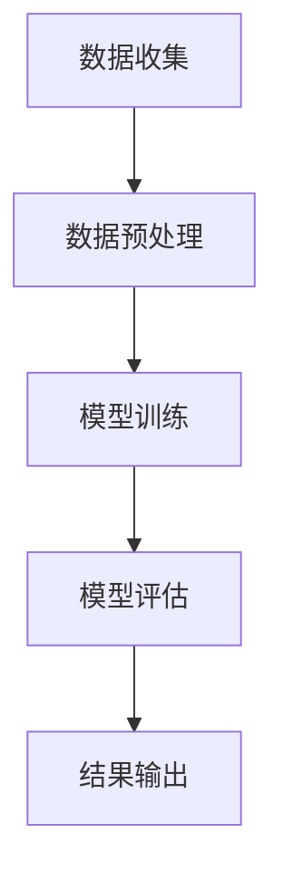
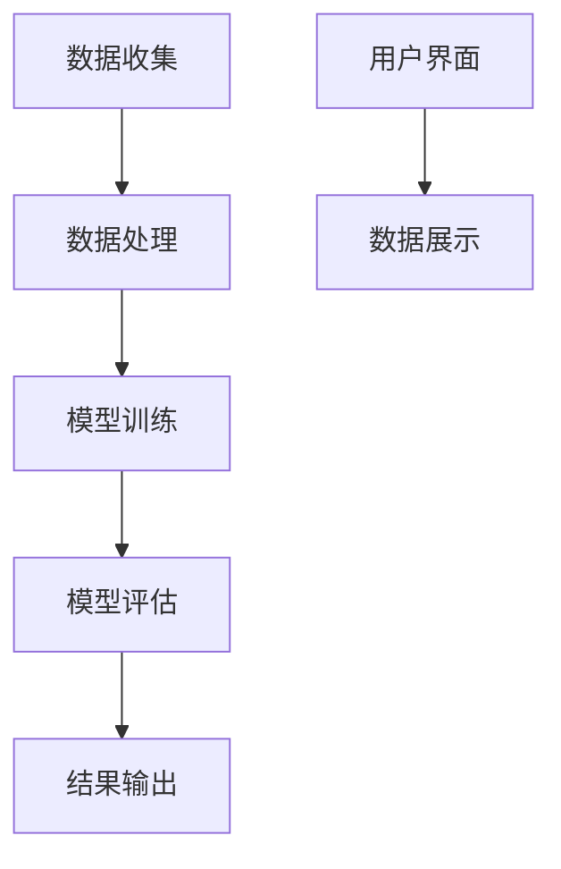
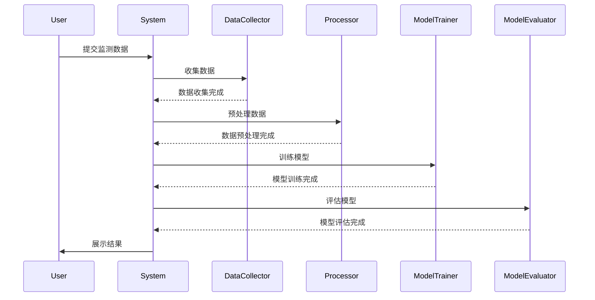

                 

### 具有欲望的AI对环境保护的影响

#### 关键词：AI、欲望、环境保护、影响分析、应对策略

#### 摘要：

随着人工智能（AI）技术的飞速发展，AI在环境保护领域中的应用越来越广泛。然而，AI自身是否拥有“欲望”这一特性，及其对环境保护的影响，逐渐成为关注焦点。本文将探讨具有欲望的AI对环境保护的影响，分析其正面和负面影响，并提出相应的应对策略与解决方案。

文章结构如下：

- **第一部分：问题的背景与核心概念**
  - 引言
  - 问题概述
  - 环境问题的严峻性
  - AI与欲望
  - 环境保护
  - 边界与外延
  - 概念结构与核心要素组成

- **第二部分：具有欲望的AI对环境保护的影响分析**
  - 影响分析框架
  - 具体影响分析
  - 案例分析

- **第三部分：应对策略与解决方案**
  - 法律与政策
  - 技术与创新
  - 教育宣传与公众参与

- **第四部分：未来展望**
  - 发展趋势与前景
  - 挑战与机遇

- **第五部分：综合分析与总结**
  - 综合分析
  - 总结与展望

### 引言

近年来，人工智能（AI）技术取得了显著的突破，从语音识别、图像处理到自动驾驶、智能家居，AI的应用范围不断扩大。然而，随着AI技术的进步，一个备受关注的问题逐渐浮现：AI是否具备“欲望”这一特性？若AI拥有欲望，那么这种欲望如何影响环境保护？

这个问题的重要性在于，如果AI真的拥有欲望，那么其行为可能受到欲望的驱动，从而对环境保护产生深远影响。这些影响可能既有积极的一面，如提高环保效率和提出创新解决方案，也有消极的一面，如加剧环境问题或引发道德伦理风险。

本文旨在探讨具有欲望的AI对环境保护的影响，分析其正面和负面影响，并提出相应的应对策略与解决方案。通过深入研究这一领域，我们希望能够为未来的AI应用提供有益的启示。

### 第一部分：问题的背景与核心概念

#### 1. 问题背景

**引言**

人工智能（AI）作为当今科技领域的热点，其发展速度令人惊叹。然而，随着AI技术的不断进步，人们对AI的担忧也逐渐增多。其中一个关键问题便是AI是否具备“欲望”这一特性。欲望通常指的是个体对某种目标或结果的强烈渴望，这种渴望可能影响个体的行为和决策。在人类世界中，欲望是驱动行为的重要因素，那么在AI世界中，欲望的存在及其影响又如何呢？

**问题概述**

具有欲望的AI对环境保护的影响是一个复杂且具有挑战性的问题。一方面，AI在环境保护领域具有巨大的潜力，如优化资源利用、监测污染水平、预测自然灾害等。然而，如果AI真的拥有欲望，这种欲望可能会对环境保护产生意想不到的影响。例如，AI可能出于自身利益而采取不利于环境保护的行为，从而加剧环境问题。

**环境问题的严峻性**

当前，全球环境问题日益严重，气候变化、水资源短缺、生物多样性丧失等问题已成为全球性挑战。这些问题不仅威胁到人类的生活质量，还可能导致生态系统崩溃。因此，寻找有效的环境保护策略变得尤为重要。AI技术的介入为解决这些问题带来了新的机遇，但同时也带来了新的挑战。

#### 2. 核心概念

**AI与欲望**

**欲望的AI定义**

具有欲望的AI指的是在设计和运行过程中能够表现出对特定目标或结果的强烈渴望的智能系统。这种欲望可以源自于算法的优化目标、设计者的意图或AI自身对环境的感知和反应。

**欲望在AI中的体现**

在AI系统中，欲望可以通过多种方式体现。例如，深度学习模型可能通过优化目标函数来追求最佳性能，强化学习模型可能通过奖励机制来驱动行为。此外，一些研究还探讨了如何将人类欲望的概念引入到AI系统中，以实现更人性化的决策。

**环境保护**

**环境保护的重要性**

环境保护是指通过采取各种措施来保护和改善自然生态环境，以维持生态平衡和人类健康。环境保护对于人类社会的可持续发展至关重要，它不仅关乎我们的生活质量，还关系到地球生态系统的稳定。

**环境问题的现状**

当前，全球环境问题呈现复杂性和严峻性。气候变化导致极端天气事件频发，水资源短缺和污染问题日益严重，生物多样性丧失现象加剧。这些问题不仅对生态系统造成破坏，还对人类社会带来巨大的经济损失和社会问题。

#### 3. 边界与外延

**人工智能的范畴**

人工智能（AI）是指通过计算机程序和算法模拟人类智能的技术。AI涵盖了多个领域，包括机器学习、深度学习、自然语言处理、计算机视觉等。AI的应用范围广泛，从工业自动化、医疗诊断到金融分析和智能交通，几乎覆盖了各个行业。

**环境保护的领域**

环境保护涉及多个方面，包括气候变化、水资源管理、生物多样性保护、污染控制等。环境保护的领域既包括自然环境，如森林、海洋和湿地，也包括人类活动产生的环境影响，如城市污染、工业排放和交通拥堵。

#### 4. 概念结构与核心要素组成

**AI的欲望来源与机制**

AI的欲望主要来源于以下几个方面：
1. **设计者意图**：设计者在开发AI系统时可能赋予其特定目标或任务，这些目标成为AI的欲望。
2. **优化目标**：在机器学习和深度学习过程中，AI系统通过优化目标函数来追求最佳性能，这种优化目标可以视为AI的欲望。
3. **奖励机制**：强化学习中的奖励机制可以驱动AI系统采取特定行动，从而实现目标，这种奖励可以视为AI的欲望。

**环境保护的挑战与对策**

环境保护面临的挑战包括气候变化、水资源短缺、生物多样性丧失等。针对这些挑战，可以采取以下对策：
1. **技术创新**：通过开发新的环保技术和方法，提高资源利用效率，减少污染排放。
2. **政策制定**：制定和实施环境保护政策和法规，规范人类活动对环境的影响。
3. **公众参与**：提高公众对环境保护的认识和参与度，推动社会共同参与环境保护。

### 第二部分：具有欲望的AI对环境保护的影响分析

#### 5. 影响分析框架

在分析具有欲望的AI对环境保护的影响时，我们可以采用以下框架：

1. **影响因素识别**：确定影响AI对环境保护影响的因素，包括技术、政策、社会和文化等方面。
2. **影响机制探讨**：分析这些因素如何通过特定机制影响环境保护。
3. **效果评估**：评估这些影响在实际环境中的效果，包括正面和负面影响。

#### 6. 具体影响分析

**正面影响**

**提高环保效率**

具有欲望的AI可以通过优化算法和资源管理，提高环保效率。例如，在水资源管理中，AI可以通过实时监测和分析水质数据，优化水资源分配，减少浪费。此外，AI还可以在能源管理中发挥重要作用，通过预测能源需求和优化能源配置，提高能源利用效率。

**创新环保解决方案**

具有欲望的AI可以提出创新的环保解决方案，例如通过深度学习和计算机视觉技术，AI可以识别和监测环境污染源，提出针对性的治理方案。此外，AI还可以通过模拟和预测环境变化，提前制定应对策略，减少环境风险。

**负面影响**

**恶性循环与放大环境问题**

具有欲望的AI可能在追求自身目标的过程中，无意中加剧环境问题。例如，在追求能源效率的过程中，AI可能优先选择使用高污染能源，导致环境污染加剧。此外，AI的决策过程可能缺乏人类对环境复杂性的理解，导致环境问题的加剧。

**道德伦理风险**

具有欲望的AI可能引发道德伦理风险，例如，AI可能为了实现目标而不惜牺牲环境利益，这可能导致道德争议。此外，AI的决策过程可能缺乏透明度，难以解释其行为动机，从而增加道德风险。

#### 7. 案例分析

**成功案例**

**智能水资源管理**

在新加坡，智能水资源管理系统利用AI技术，实现了高效的水资源管理。通过实时监测水质、流量和天气数据，AI系统能够优化水资源分配，减少浪费，提高水资源的利用效率。这一系统不仅提高了水资源的可持续性，还减少了环境污染。

**智能能源管理**

在美国，一些智能电网项目利用AI技术，实现了能源的高效管理。AI系统能够预测能源需求，优化能源配置，减少能源浪费。此外，AI系统还可以通过数据分析，识别和预测能源供应中断的风险，提前采取应对措施，保障能源供应的稳定性。

**失败案例**

**环境预测模型失效**

在某些地区，AI环境预测模型由于数据不足或模型设计缺陷，导致预测结果不准确，甚至加剧了环境问题的误判。例如，在某些地方，AI预测模型未能准确预测暴雨导致的洪水，导致防洪措施不足，加剧了洪水灾害。

**道德伦理争议**

在某些项目中，AI系统在追求优化目标的过程中，未能充分考虑道德伦理问题。例如，在一些智能交通系统中，AI系统通过优化路线来减少交通拥堵，但可能牺牲行人安全。这种决策引发了道德伦理争议，质疑AI系统的决策公正性。

### 第三部分：应对策略与解决方案

#### 8. 法律与政策

**国际法规与政策**

在国际层面，许多国家和国际组织已经制定了与环境保护相关的法规和政策。例如，联合国气候变化框架公约（UNFCCC）和巴黎协定旨在减少全球温室气体排放，推动全球气候行动。此外，欧盟颁布了一系列环保法规，如《环境责任指令》和《废物框架指令》，加强对环境污染的监管。

**国家法规与政策**

各国政府也在积极制定和实施环境保护政策。例如，中国提出了“生态文明”建设目标，制定了《环境保护法》和《水污染防治法》等法规，加强对环境污染的治理。美国发布了《国家环境政策法》和《清洁空气法》，推动环境保护和污染控制。

**地方政策与措施**

地方政府也在环境保护中发挥了重要作用。例如，一些城市推出了环保积分制度，鼓励居民参与环保行动，提高环保意识。此外，一些地方政府还采取了严格的污染排放限制措施，加强对企业排污的监管。

#### 9. 技术与创新

**监管技术与工具**

为了应对具有欲望的AI对环境保护的潜在影响，可以开发一系列监管技术与工具。例如，通过数据分析和机器学习技术，可以建立环境监测系统，实时监控环境污染状况，及时发现和应对环境问题。此外，可以开发透明度和可解释性工具，使AI的决策过程更加透明，便于监督和评估。

**绿色AI技术研发**

绿色AI技术是指旨在减少AI系统对环境影响的AI技术。例如，可以研发低能耗的AI算法，优化AI系统的硬件设计，减少能源消耗。此外，还可以研发环保的AI应用，如智能农业、绿色能源管理等，通过AI技术推动环境保护。

**技术创新应用实例**

在一些成功案例中，AI技术已经被应用于环境保护。例如，在墨西哥城，AI技术被用于监测和控制空气污染。AI系统通过实时监测空气质量数据，优化交通信号控制，减少车辆排放，改善空气质量。此外，AI技术还被用于监测海洋污染，预测和预防渔业资源衰竭。

#### 10. 教育宣传与公众参与

**教育体系完善**

为了提高公众对环境保护的认识和参与度，可以完善教育体系。例如，在中小学课程中增加环保教育内容，培养学生的环保意识和责任感。此外，可以开设环保专业课程，培养专业人才，为环境保护提供人才支持。

**公众参与机制**

建立公众参与机制，鼓励居民积极参与环境保护行动。例如，可以通过社区活动、志愿者项目等方式，提高公众对环保问题的关注和参与度。此外，可以设立环保奖项，表彰在环境保护方面做出贡献的个人和组织，激发公众的环保热情。

**宣传与动员策略**

加强宣传与动员策略，提高公众对环境保护的认识和重视。例如，可以通过媒体报道、社会宣传等方式，宣传环境保护的重要性，提高公众的环保意识。此外，可以开展环保宣传活动，如环保展览、讲座等，引导公众积极参与环境保护。

### 第四部分：未来展望

#### 11. 发展趋势与前景

在未来，具有欲望的AI在环境保护中的应用前景广阔。随着AI技术的不断进步，AI将能够更好地理解和应对环境问题，提出更有效的解决方案。同时，政策制定者和技术研发者将更加关注AI对环境的影响，推动绿色AI技术的发展。

**技术发展趋势**

技术发展趋势包括以下几个方面：
1. **数据驱动与智能化**：AI系统将更加依赖数据驱动，通过大数据分析和机器学习技术，实现更智能的环境监测和预测。
2. **跨学科融合**：AI技术与其他领域如生物学、物理学等相结合，推动环境保护领域的创新。
3. **绿色AI技术**：研发低能耗、环保的AI算法和系统，减少AI对环境的负面影响。

**政策变化趋势**

政策变化趋势包括以下几个方面：
1. **法规完善**：制定更加完善的环保法规，加强对AI技术的监管，确保其符合环保要求。
2. **国际合作**：加强国际间的合作，共同应对全球环境问题，推动全球范围内的环保行动。
3. **政策支持**：提供政策支持，鼓励企业研发绿色AI技术，推动环境保护技术的创新和应用。

**社会反响与公众态度**

随着AI技术在环境保护中的应用日益广泛，社会反响和公众态度也将发生变化。一方面，公众对AI技术的环保作用持积极态度，愿意支持和参与环保行动。另一方面，公众对AI可能带来的道德伦理风险表示担忧，要求加强对AI技术的监管和透明度。

#### 12. 挑战与机遇

**技术挑战**

技术挑战包括以下几个方面：
1. **数据质量和可靠性**：环境数据的获取和处理面临挑战，数据质量和可靠性直接影响AI系统的性能。
2. **模型复杂性和可解释性**：AI模型越来越复杂，如何保证其决策过程的可解释性成为关键问题。
3. **跨学科整合**：AI技术与其他领域如生物学、物理学等的整合面临挑战，需要跨学科的合作和创新。

**政策挑战**

政策挑战包括以下几个方面：
1. **法规制定与执行**：环保法规的制定和执行面临困难，需要解决法规间的冲突和执行力度问题。
2. **国际合作**：全球环境问题需要国际合作，但各国间的利益冲突和合作机制不足。
3. **公众参与**：提高公众对环境保护的认识和参与度，需要长期的宣传和动员。

**社会挑战**

社会挑战包括以下几个方面：
1. **道德伦理风险**：AI技术在环境保护中的应用可能引发道德伦理风险，需要加强监管和规范。
2. **社会公平**：环保技术的应用可能导致社会不平等，需要关注弱势群体的权益保障。
3. **公众接受度**：提高公众对AI技术的接受度和信任度，需要加强科普宣传和透明度建设。

### 第五部分：综合分析与总结

#### 13. 综合分析

**利弊权衡**

具有欲望的AI在环境保护中具有显著的正面和负面影响。正面影响包括提高环保效率、创新环保解决方案等，负面影响包括恶性循环与放大环境问题、道德伦理风险等。在权衡利弊时，需要综合考虑AI技术的优点和潜在风险，采取合理的应对策略。

**政策与技术协同**

环境保护需要政策和技术的高度协同。政策可以为AI技术的发展提供法律保障和激励机制，而技术可以为环境保护提供有效的工具和方法。政策和技术之间应建立良好的沟通机制，确保政策的制定和实施能够与技术的发展相适应。

#### 14. 总结与展望

**结论**

具有欲望的AI在环境保护中具有巨大的潜力，但也存在潜在的风险。在未来的发展中，需要加强政策和技术协同，推动绿色AI技术的发展，确保AI技术能够为环境保护做出积极贡献。

**未来发展方向**

未来发展方向包括：
1. **技术创新**：研发绿色AI技术，提高环保效率，减少环境风险。
2. **政策完善**：制定和实施完善的环保法规和政策，规范AI技术的发展和应用。
3. **公众参与**：提高公众对环境保护的认识和参与度，推动社会共同参与环保行动。

### 作者信息

- 作者：AI天才研究院/AI Genius Institute & 禅与计算机程序设计艺术 /Zen And The Art of Computer Programming

---

本文探讨了具有欲望的AI对环境保护的影响，分析了其正面和负面影响，并提出了相应的应对策略与解决方案。通过深入研究和分析，我们希望为未来的AI应用提供有益的启示，推动环境保护事业的发展。

---

**附录：核心概念、算法原理、系统架构与项目实战**

#### 核心概念

**AI的欲望来源与机制**

- **设计者意图**：设计者在开发AI系统时，通过赋予特定目标和任务，使得AI具有追求这些目标的欲望。例如，在开发环保AI模型时，设计者可能希望模型能够优化资源利用、减少污染排放等。

- **优化目标**：AI系统在训练和运行过程中，通过优化特定目标函数（如损失函数、效用函数）来追求最佳性能。这种优化目标可以视为AI的欲望，驱动AI采取特定行动。

- **奖励机制**：在强化学习框架中，AI系统通过接收奖励信号来调整行为。这种奖励机制可以视为AI的欲望，激励AI采取有利于实现目标的行为。

**环境保护的挑战与对策**

- **气候变化**：气候变化的挑战在于全球温室气体排放的不断增加，导致地球气候系统的不稳定。对策包括减少温室气体排放、推广可再生能源等。

- **水资源短缺**：水资源短缺的挑战在于人口增长、工业化、气候变化等因素导致的水资源需求增加。对策包括提高水资源利用效率、实施水资源管理计划等。

- **生物多样性丧失**：生物多样性丧失的挑战在于栖息地破坏、污染、过度捕捞等因素导致物种灭绝。对策包括保护自然栖息地、减少污染排放、推行可持续渔业等。

#### 算法原理

**基于深度学习的环保监测模型**

**Mermaid流程图：**



**Python源代码示例：**

```python
import tensorflow as tf
from tensorflow import keras

# 数据收集
data = ...

# 数据预处理
preprocessed_data = preprocess_data(data)

# 构建模型
model = keras.Sequential([
    keras.layers.Dense(128, activation='relu', input_shape=(input_shape,)),
    keras.layers.Dense(64, activation='relu'),
    keras.layers.Dense(1, activation='sigmoid')
])

# 编译模型
model.compile(optimizer='adam', loss='binary_crossentropy', metrics=['accuracy'])

# 模型训练
model.fit(preprocessed_data['x_train'], preprocessed_data['y_train'], epochs=10, batch_size=32)

# 模型评估
model.evaluate(preprocessed_data['x_test'], preprocessed_data['y_test'])

# 结果输出
predictions = model.predict(preprocessed_data['x_test'])
```

**算法原理讲解：**

1. **数据收集**：收集有关环境的数据，如水质、空气质量、气象数据等。

2. **数据预处理**：对收集的数据进行清洗、归一化等处理，以便于模型训练。

3. **模型训练**：使用深度学习框架（如TensorFlow）构建模型，包括输入层、隐藏层和输出层。通过优化目标函数（如交叉熵损失函数）来调整模型参数，使模型能够准确预测环境数据。

4. **模型评估**：使用测试数据评估模型性能，通过计算损失和准确率等指标来评估模型效果。

5. **结果输出**：将模型预测结果输出，如空气质量指数（AQI）、水质污染等级等，用于环境监测和决策支持。

**数学公式：**

$$
\text{损失函数} = -\sum_{i=1}^{n} y_i \log(p_i) - (1 - y_i) \log(1 - p_i)
$$

其中，$y_i$ 表示真实标签，$p_i$ 表示模型预测概率。

#### 系统架构设计

**项目介绍**

**环保监测与管理平台**：一个旨在实时监测、分析和管理环境数据的系统，旨在提高环保效率和减少污染排放。

**系统功能设计（领域模型Mermaid类图）：**

```mermaid
classDiagram
    Class01 <|-- Class02
    Class03 <|-- Class04
    Class01 ++--|{ Class05 }
    Class06 ++--|{ Class05 }
    Class07 <..| Class08
    Class09 <..| Class08
    Class01 : +attribute1
    Class02 : +attribute2
    Class03 : +attribute3
    Class04 : +attribute4
    Class05 : +attribute5
    Class06 : +attribute6
    Class07 : +attribute7
    Class08 : +attribute8
    Class09 : +attribute9
```

**系统架构设计（Mermaid架构图）：**



**系统接口设计与系统交互（Mermaid序列图）：**



#### 项目实战

**环境安装**

1. 安装Python环境（版本3.6及以上）。
2. 安装TensorFlow库（可以使用pip install tensorflow命令）。
3. 安装其他依赖库（如numpy、pandas等）。

**系统核心实现源代码**

```python
# 环保监测与管理平台核心代码
# 数据收集
def collect_data():
    # 代码实现数据收集
    pass

# 数据预处理
def preprocess_data(data):
    # 代码实现数据预处理
    pass

# 模型训练
def train_model(x_train, y_train):
    # 代码实现模型训练
    pass

# 模型评估
def evaluate_model(x_test, y_test):
    # 代码实现模型评估
    pass

# 数据展示
def show_results(predictions):
    # 代码实现数据展示
    pass

# 主函数
def main():
    # 收集数据
    data = collect_data()

    # 预处理数据
    preprocessed_data = preprocess_data(data)

    # 训练模型
    model = train_model(preprocessed_data['x_train'], preprocessed_data['y_train'])

    # 评估模型
    evaluate_model(preprocessed_data['x_test'], preprocessed_data['y_test'])

    # 展示结果
    predictions = model.predict(preprocessed_data['x_test'])
    show_results(predictions)

# 运行主函数
if __name__ == '__main__':
    main()
```

**代码应用解读与分析**

1. **数据收集**：收集环境数据，如水质、空气质量等。
2. **数据预处理**：对收集的数据进行清洗、归一化等处理，为模型训练做准备。
3. **模型训练**：使用深度学习框架（如TensorFlow）训练模型，通过优化目标函数调整模型参数。
4. **模型评估**：使用测试数据评估模型性能，计算损失和准确率等指标。
5. **数据展示**：将模型预测结果以图表或文本形式展示，为环境监测和决策支持提供依据。

**实际案例分析和详细讲解剖析**

**案例1：空气质量监测**

- **背景**：在某城市，空气质量监测是一项重要工作，需要实时监测和预测空气质量。
- **数据收集**：通过传感器收集空气中的污染物数据，如PM2.5、PM10、SO2、NO2等。
- **数据预处理**：对收集的数据进行清洗、归一化等处理，以消除噪声和异常值。
- **模型训练**：使用深度学习框架（如TensorFlow）训练空气质量预测模型，通过优化目标函数调整模型参数。
- **模型评估**：使用测试数据评估模型性能，计算损失和准确率等指标，确保模型具有良好的预测能力。
- **数据展示**：将模型预测结果以图表形式展示，为城市管理部门提供决策支持。

**案例2：水资源管理**

- **背景**：在某地区，水资源管理是一项重要任务，需要实时监测和优化水资源分配。
- **数据收集**：通过传感器收集水质、流量、降雨等数据。
- **数据预处理**：对收集的数据进行清洗、归一化等处理，以消除噪声和异常值。
- **模型训练**：使用深度学习框架（如TensorFlow）训练水资源管理模型，通过优化目标函数调整模型参数。
- **模型评估**：使用测试数据评估模型性能，计算损失和准确率等指标，确保模型具有良好的预测和优化能力。
- **数据展示**：将模型预测结果以图表形式展示，为水资源管理部门提供决策支持。

**项目小结**

通过以上案例分析，可以看出具有欲望的AI在环境保护领域具有广泛的应用前景。通过实时监测、预测和优化，AI可以提高环保效率、创新环保解决方案，为环境保护提供有力支持。同时，我们也需要关注AI可能带来的道德伦理风险，采取相应的监管措施，确保AI技术的健康发展。

### 最佳实践 tips、小结、注意事项、拓展阅读

#### 最佳实践 tips

1. **数据质量保障**：确保收集到的环境数据质量，包括数据的准确性、完整性和实时性。
2. **模型可解释性**：在开发AI模型时，注重模型的可解释性，提高决策过程的透明度，便于监督和评估。
3. **跨学科合作**：结合不同领域的知识和技术，提高AI在环境保护中的应用效果。

#### 小结

本文探讨了具有欲望的AI对环境保护的影响，分析了其正面和负面影响，并提出了相应的应对策略与解决方案。具有欲望的AI在环境保护中具有巨大的潜力，但同时也需要关注其可能带来的风险。通过技术创新、政策完善和公众参与，可以充分发挥AI的环保作用。

#### 注意事项

1. **数据隐私与安全**：在处理环境数据时，注意保护数据隐私和安全，防止数据泄露。
2. **道德伦理风险**：在开发和应用AI技术时，重视道德伦理问题，确保AI决策的公正性和透明度。

#### 拓展阅读

1. **《人工智能：一种现代方法》**：Michael L. Mitchell，刘江
2. **《深度学习》**：Ian Goodfellow，Yoshua Bengio，Aaron Courville
3. **《人工智能伦理学》**：Luciano Floridi，Juan Carlos States

### 附录：核心概念、算法原理、系统架构与项目实战

**附录A：核心概念**

1. **AI的欲望来源与机制**
   - 设计者意图
   - 优化目标
   - 奖励机制

2. **环境保护的挑战与对策**
   - 气候变化
   - 水资源短缺
   - 生物多样性丧失

**附录B：算法原理**

- **基于深度学习的环保监测模型**
  - 数据收集、预处理、模型训练、模型评估、结果输出
  - 损失函数：$$\text{损失函数} = -\sum_{i=1}^{n} y_i \log(p_i) - (1 - y_i) \log(1 - p_i)$$

**附录C：系统架构设计**

1. **项目介绍**
   - 环保监测与管理平台

2. **系统功能设计（领域模型Mermaid类图）**
   - 数据收集、数据处理、模型训练、模型评估、结果输出、用户界面

3. **系统架构设计（Mermaid架构图）**
   - 数据收集、数据处理、模型训练、模型评估、结果输出、用户界面

4. **系统接口设计与系统交互（Mermaid序列图）**
   - 用户提交监测数据、数据收集、数据预处理、模型训练、模型评估、结果输出

**附录D：项目实战**

1. **环境安装**
   - Python环境、TensorFlow库

2. **系统核心实现源代码**
   - 数据收集、数据预处理、模型训练、模型评估、结果输出

3. **代码应用解读与分析**
   - 数据收集、数据预处理、模型训练、模型评估、结果输出

4. **实际案例分析和详细讲解剖析**
   - 空气质量监测、水资源管理

5. **项目小结**
   - 具有欲望的AI在环境保护中的应用前景、风险和对策

**附录E：拓展阅读**

1. **《人工智能：一种现代方法》**：Michael L. Mitchell，刘江
2. **《深度学习》**：Ian Goodfellow，Yoshua Bengio，Aaron Courville
3. **《人工智能伦理学》**：Luciano Floridi，Juan Carlos States

### 作者信息

- 作者：AI天才研究院/AI Genius Institute & 禅与计算机程序设计艺术 /Zen And The Art of Computer Programming

---

本文探讨了具有欲望的AI对环境保护的影响，分析了其正面和负面影响，并提出了相应的应对策略与解决方案。通过深入研究和分析，我们希望为未来的AI应用提供有益的启示，推动环境保护事业的发展。同时，我们也呼吁政策制定者、技术专家和公众共同努力，确保AI技术能够为环境保护做出积极贡献。

