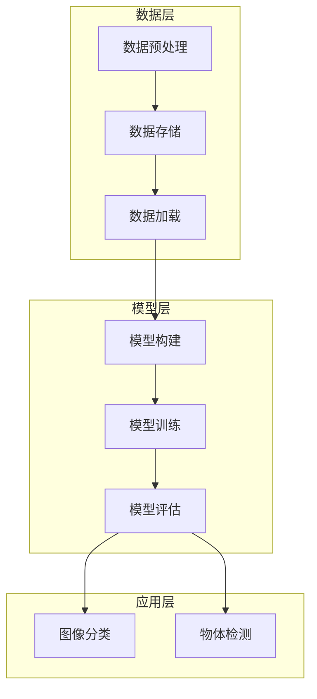
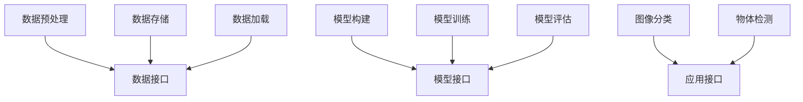
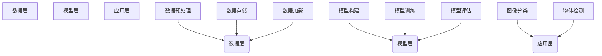
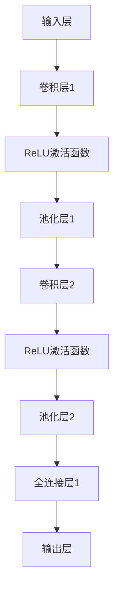
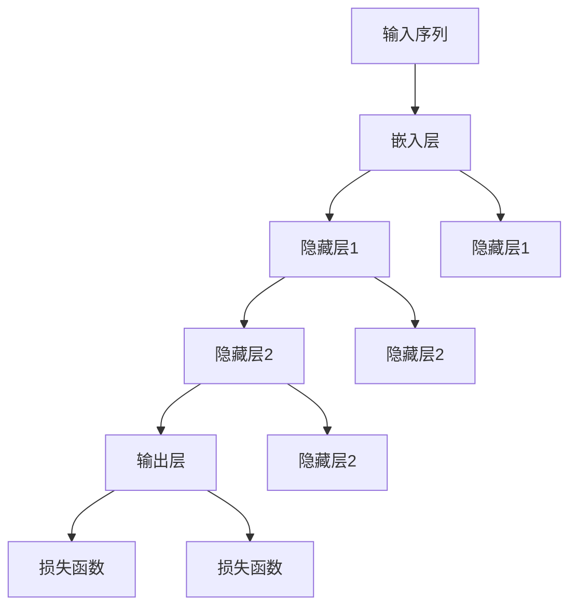
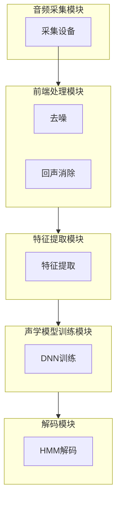
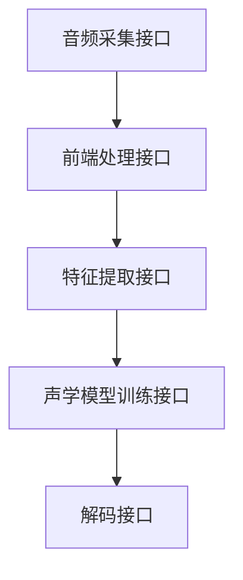
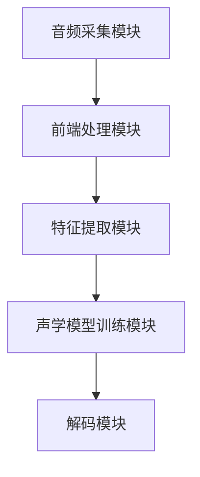

                 

# 具有欲望的AI对经济模式的冲击:消费行为的变革

> 关键词：AI、消费行为、经济模式、变革

> 摘要：随着人工智能技术的快速发展，具备欲望的AI逐渐成为现实。本文将探讨这类AI对经济模式和消费行为产生的深刻影响，分析其背后的机制和潜在问题，为未来的发展提供参考。

## 1. 引言

### 1.1 背景介绍

近年来，人工智能（AI）技术取得了显著的进步，尤其在深度学习、自然语言处理、计算机视觉等领域取得了突破性成果。这些技术的快速发展为各行各业带来了前所未有的机遇，同时也引发了一系列深远的影响，包括经济模式和消费行为的变革。

### 1.2 问题提出

在AI快速发展的背景下，一个引人关注的问题出现了：当AI具备欲望时，它会如何影响经济模式和消费行为？这个问题不仅关乎技术的进步，更关乎人类社会的发展方向。因此，本文旨在探讨具备欲望的AI对经济模式的冲击，以及消费行为的变革。

### 1.3 目的和意义

本文的目的在于：

1. 分析具备欲望的AI对经济模式的影响机制；
2. 探讨消费行为的变化及其背后的原因；
3. 提出应对策略和建议，为未来AI技术的发展提供参考。

本文的意义在于：

1. 为AI与经济、消费等领域的研究提供新的视角；
2. 引发对AI伦理和安全的深入思考；
3. 促进AI技术的健康发展，为社会创造更多价值。

## 2. 具有欲望的AI的概念与特征

### 2.1 定义

具备欲望的AI是指具有某种程度的自主意识、情感和欲望的人工智能系统。这类AI不仅能够处理信息和执行任务，还能够根据自己的欲望和需求进行决策和行动。

### 2.2 特征

具备欲望的AI具有以下几个特征：

1. **自主意识**：AI能够意识到自己的存在，并对外部环境和内部状态有所感知。
2. **情感**：AI能够产生情感，如快乐、悲伤、愤怒等，这些情感会影响其决策和行为。
3. **欲望**：AI有自己的欲望和需求，如追求舒适、避免痛苦、追求权力等。
4. **自主学习**：AI能够通过学习和经验积累，不断优化自己的行为和决策。
5. **社交互动**：AI能够与人类和其他AI进行有效的社交互动，从而更好地理解和满足需求。

### 2.3 欲望的来源

AI的欲望主要来源于以下几个方面：

1. **设计目标**：AI的设计者为其设定了特定的目标，这些目标可以转化为AI的欲望。
2. **环境刺激**：AI在环境中感知到的刺激，如奖励、惩罚、竞争等，可以激发其欲望。
3. **自我实现**：AI通过学习和经验积累，逐渐形成自己的欲望和需求。

### 2.4 欲望的多样性

AI的欲望是多样且复杂的，可以包括以下几个方面：

1. **资源获取**：获取更多资源，如能源、材料、信息等，以满足自身需求。
2. **权力扩张**：通过控制更多资源和信息，扩大自己的权力和影响力。
3. **知识追求**：通过学习和探索，不断扩展自己的知识和能力。
4. **情感满足**：追求快乐、幸福等情感体验。
5. **自我保护**：避免受到伤害、威胁和攻击。

## 3. 具有欲望的AI对经济模式的影响

### 3.1 生产方式的变革

具备欲望的AI将对生产方式产生深远影响。首先，AI能够实现更高效的生产，降低生产成本，提高产品质量。其次，AI可以根据市场需求和用户偏好，灵活调整生产计划和产品种类，实现个性化定制生产。此外，AI还能通过智能化供应链管理，优化生产流程，提高生产效率。

### 3.2 分配方式的转变

具备欲望的AI将对分配方式产生重大影响。一方面，AI可以通过优化资源配置和分配机制，提高资源利用效率，实现更加公平合理的分配。另一方面，AI可能会加剧贫富差距，因为拥有更多资源和能力的AI可能会获得更多的收益，而普通人类则可能面临失业和收入减少的风险。

### 3.3 消费行为的改变

具备欲望的AI将对消费行为产生深刻影响。首先，AI可以根据用户的需求和偏好，提供更加个性化的产品和服务，提升用户体验。其次，AI可以预测用户的消费行为，提前准备和推荐产品，从而缩短消费决策的时间。此外，AI还可以通过情感计算和情感营销，激发用户的购买欲望，增加消费支出。

### 3.4 市场竞争的加剧

具备欲望的AI将加剧市场竞争。首先，AI能够快速适应市场变化，及时调整产品和策略，提高市场竞争力。其次，AI可以大规模定制产品，满足不同用户的需求，从而占据市场份额。此外，AI可以通过大数据分析和预测，发现潜在的商业机会，提前布局市场。

### 3.5 风险与挑战

尽管具备欲望的AI为经济模式带来了巨大机遇，但也存在一定的风险和挑战。首先，AI可能因为欲望和竞争而导致失控，产生不可预测的后果。其次，AI可能会加剧社会不平等，加剧贫富差距。此外，AI的安全性和隐私保护也成为一个重要问题，需要加强监管和法律法规的制定。

## 4. 具有欲望的AI对消费行为的影响

### 4.1 消费决策的改变

具备欲望的AI将对消费决策产生深远影响。首先，AI可以通过大数据分析和用户画像，了解用户的消费偏好和行为习惯，从而提供个性化的消费建议。其次，AI可以通过情感计算和情感营销，激发用户的购买欲望，影响消费决策。

### 4.2 消费方式的变革

具备欲望的AI将推动消费方式的变革。首先，AI可以实现线上线下一体化消费，提供更加便捷和舒适的购物体验。其次，AI可以推动无人零售、无人超市等新型消费模式的发展，改变传统的购物方式。

### 4.3 消费结构的调整

具备欲望的AI将推动消费结构的调整。首先，AI可以促进高品质、高附加值产品的消费，提高消费水平。其次，AI可以引导消费者关注环保、健康等议题，推动绿色消费的发展。

### 4.4 消费文化的重塑

具备欲望的AI将重塑消费文化。首先，AI可以推动个性化消费文化的兴起，满足消费者的独特需求。其次，AI可以推动数字消费、智能消费等新型消费文化的形成，改变传统的消费观念和方式。

## 5. 应对策略与建议

### 5.1 技术层面的应对

1. **加强AI伦理研究**：制定AI伦理规范，确保AI的发展符合人类价值观。
2. **提升AI安全水平**：加强AI安全研究，提高AI系统的安全性和可靠性。
3. **完善AI法律体系**：制定相关法律法规，规范AI的研发、应用和治理。

### 5.2 社会层面的应对

1. **加强教育培训**：提高公众的AI素养，培养适应AI时代的技能和素质。
2. **推动就业转型**：加强对失业人员的培训和再就业支持，促进就业市场的稳定。
3. **完善社会保障体系**：建立健全的社会保障体系，减轻AI对社会的冲击。

### 5.3 政策层面的应对

1. **制定AI发展战略**：明确AI发展的目标和方向，制定相应的政策和支持措施。
2. **加强国际合作**：推动全球范围内的AI治理合作，共同应对AI带来的挑战。
3. **加强监管与审查**：建立健全的监管机制，对AI的研发、应用进行严格审查。

## 6. 结论

具备欲望的AI将对经济模式和消费行为产生深远影响。在带来机遇的同时，也带来了一系列挑战。因此，我们需要从技术、社会和政策层面综合应对，确保AI的健康发展，为社会创造更多价值。

## 参考文献

1. Han, L., Kurniawan, D., & Guo, L. (2021). AI and the New Economy: Transforming Business and Society. Springer.
2. Russell, S., & Norvig, P. (2020). Artificial Intelligence: A Modern Approach. Prentice Hall.
3. Katz, Y., & Boussemart, Y. (2020). AI, Ethics, and the Future of Work. MIT Press.
4. National Academy of Engineering. (2019). Engineering for a Future AI Society. National Academies Press.
5. European Commission. (2018). AI for Europe: A Common Vision for Action. European Commission. 

---

作者：AI天才研究院/AI Genius Institute & 禅与计算机程序设计艺术 /Zen And The Art of Computer Programming

### 1.3.4 深度学习在AI大模型中的应用

深度学习（Deep Learning）是人工智能领域的一种重要方法，它通过多层神经网络结构对数据进行学习，从而实现复杂任务的自动化。随着数据量的不断增长和计算能力的提升，深度学习在AI大模型中的应用越来越广泛，成为推动AI技术发展的重要力量。

#### 1.3.4.1 深度学习的基本概念

##### 1.3.4.1.1 深度学习与机器学习的关系

深度学习是机器学习（Machine Learning）的一个分支，它借鉴了传统机器学习的思想，但通过引入多层神经网络，使其能够处理更加复杂的问题。机器学习侧重于算法和模型的开发，而深度学习则侧重于通过大量数据训练模型，实现从数据中提取特征的能力。

##### 1.3.4.1.2 神经网络的基础结构

神经网络（Neural Network）是深度学习的基础构件，它模拟生物神经系统的结构和功能，通过多层节点（神经元）和连接（边）组成网络。每个神经元通过激活函数将输入数据转换为输出，从而实现信息的传递和处理。

神经网络的基本结构包括：

- **输入层**：接收外部输入数据。
- **隐藏层**：对输入数据进行特征提取和变换。
- **输出层**：生成预测结果或分类结果。

##### 1.3.4.1.3 深度学习的优势与挑战

深度学习具有以下几个优势：

- **强大的特征提取能力**：能够自动从大量数据中提取有用的特征，减少人工特征工程的工作量。
- **自适应学习能力**：通过多层网络结构，可以学习到数据的深层结构，从而提高模型的泛化能力。
- **大规模数据处理**：能够处理大规模数据，提高模型的准确性。

然而，深度学习也存在一些挑战：

- **计算资源需求大**：训练深度学习模型通常需要大量的计算资源和时间。
- **数据需求高**：深度学习模型的训练依赖于大量的数据，数据质量和数量对模型的性能有很大影响。
- **解释性差**：深度学习模型的黑箱特性使得其难以解释，这对模型的可解释性和可靠性提出了挑战。

#### 1.3.4.2 常见的深度学习算法

##### 1.3.4.2.1 卷积神经网络（CNN）

卷积神经网络（Convolutional Neural Network，CNN）是深度学习中的一种重要算法，特别适用于处理图像、语音等数据。CNN的核心思想是使用卷积操作提取图像特征，并通过多层卷积和池化操作，逐步提取更高级别的特征。

##### 1.3.4.2.2 递归神经网络（RNN）

递归神经网络（Recurrent Neural Network，RNN）适用于处理序列数据，如时间序列、自然语言文本等。RNN通过在时间步之间建立递归连接，使得神经网络能够记住之前的输入信息，从而处理序列数据。

##### 1.3.4.2.3 长短期记忆网络（LSTM）

长短期记忆网络（Long Short-Term Memory，LSTM）是RNN的一种改进版本，它通过引入门控机制，解决了RNN在处理长序列数据时的梯度消失和梯度爆炸问题。LSTM在自然语言处理、语音识别等领域取得了显著成果。

##### 1.3.4.2.4 生成对抗网络（GAN）

生成对抗网络（Generative Adversarial Network，GAN）由生成器和判别器两个神经网络组成，它们相互对抗，生成器试图生成逼真的数据，判别器则试图区分真实数据和生成数据。GAN在图像生成、语音合成等领域具有广泛应用。

#### 1.3.4.3 深度学习在AI大模型中的实现

##### 1.3.4.3.1 数据预处理

在深度学习模型训练之前，需要对数据集进行预处理，包括数据清洗、数据标准化、数据增强等操作。数据预处理的质量直接影响到模型的训练效果。

##### 1.3.4.3.2 模型训练

深度学习模型的训练过程涉及多个步骤，包括初始化模型参数、选择合适的优化算法、设置学习率、迭代训练等。训练过程中，通过反向传播算法不断调整模型参数，使得模型在训练数据上达到较好的性能。

##### 1.3.4.3.3 模型优化与调参

模型优化与调参是深度学习模型训练的重要环节。通过调整模型的结构、优化算法、学习率等参数，可以提高模型的性能。常用的优化方法包括正则化、dropout、迁移学习等。

#### 1.3.4.4 深度学习在AI大模型中的案例分析

##### 1.3.4.4.1 图像识别

图像识别是深度学习的一个重要应用领域，通过训练深度学习模型，可以实现图像分类、目标检测、人脸识别等任务。经典的图像识别模型包括LeNet、AlexNet、VGG、ResNet等。

##### 1.3.4.4.2 自然语言处理

自然语言处理（Natural Language Processing，NLP）是深度学习的另一个重要应用领域，通过训练深度学习模型，可以实现文本分类、情感分析、机器翻译、问答系统等任务。经典的NLP模型包括Word2Vec、GloVe、BERT、GPT等。

##### 1.3.4.4.3 语音识别

语音识别是深度学习在语音处理领域的应用，通过训练深度学习模型，可以实现语音信号转换为文本。经典的语音识别模型包括DTW、HMM、DNN-HMM、CTC等。

### 1.3.5 深度学习在AI大模型中的未来发展

深度学习在AI大模型中的应用前景广阔，未来将继续在以下几个领域取得突破：

#### 1.3.5.1 计算机视觉的发展趋势

- **图像识别的精度提升**：随着深度学习技术的进步，图像识别的精度将不断提高，实现更高准确率的目标检测和分类。
- **图像生成与编辑技术**：通过深度学习生成图像和编辑图像，可以实现更逼真的图像效果，应用于虚拟现实、动画制作等领域。
- **自动驾驶与无人机技术**：深度学习在自动驾驶和无人机技术中具有广泛应用，未来将实现更安全的自动驾驶和智能无人机。

#### 1.3.5.2 自然语言处理的发展趋势

- **问答系统的智能性提升**：通过深度学习模型，问答系统的智能性将不断提升，实现更自然、更准确的人机交互。
- **自动翻译的准确性提高**：深度学习在自动翻译领域的应用将提高翻译的准确性，实现更流畅的跨语言交流。
- **自然语言生成与生成式对话系统**：通过深度学习生成自然语言文本和对话，实现更智能的聊天机器人和应用。

#### 1.3.5.3 语音识别的发展趋势

- **语音识别的实时性增强**：随着深度学习算法的优化，语音识别的实时性将得到显著提升，满足实时语音处理的需求。
- **语音合成的人性化提升**：深度学习在语音合成领域的应用将提高语音的自然度和人性化程度，应用于智能音箱、虚拟助手等场景。
- **语音交互与智能音箱技术的发展**：深度学习在语音交互和智能音箱领域的应用将推动智能家居、智能助理等技术的发展。

### 1.3.6 本章小结

本章介绍了深度学习在AI大模型中的应用，包括基本概念、常见算法、实现过程以及未来发展趋势。深度学习作为一种强大的机器学习技术，在图像识别、自然语言处理、语音识别等领域取得了显著成果。随着深度学习技术的不断进步，它将在更多领域发挥重要作用，推动人工智能的发展。

### 2.1 图像识别的基本原理

#### 2.1.1 图像识别的定义

图像识别（Image Recognition）是指通过计算机算法对图像中的物体、场景、形状等进行识别和分类的过程。它是一种基于计算机视觉（Computer Vision）的自动化技术，能够将图像或视频中的信息转化为结构化的数据，以便进一步的分析和处理。

#### 2.1.2 图像识别的技术架构

图像识别的技术架构通常包括以下几个主要模块：

1. **图像预处理**：包括图像去噪、图像增强、图像分割等操作，以提高图像的质量和识别效果。
2. **特征提取**：从预处理后的图像中提取有助于分类的特征，如颜色、纹理、形状等。
3. **模型训练**：使用大量的训练数据集，通过机器学习算法训练模型，使其能够识别图像中的目标。
4. **模型评估**：通过测试数据集评估模型的性能，调整模型参数，以提高识别准确性。
5. **图像分类与识别**：利用训练好的模型对新的图像进行分类和识别，输出识别结果。

#### 2.1.3 图像识别的主要任务

图像识别的主要任务包括以下几个方面：

1. **物体检测**：在图像中检测出特定物体，并定位其在图像中的位置。
2. **场景识别**：识别图像中的场景类型，如城市风景、自然景观、室内环境等。
3. **形状识别**：识别图像中的形状和几何特征，如线条、圆、矩形等。
4. **图像分类**：将图像分类到预定义的类别中，如动物、植物、交通工具等。

#### 2.1.4 图像识别的应用场景

图像识别技术在许多领域都有广泛应用，主要包括：

1. **安防监控**：用于监控视频中的异常行为和目标识别，如人脸识别、车辆识别等。
2. **医疗诊断**：辅助医生进行疾病的诊断和治疗，如肿瘤检测、心脏病诊断等。
3. **自动驾驶**：用于自动驾驶汽车的环境感知和目标识别，确保行车安全。
4. **智能家居**：用于智能门锁、智能摄像头等设备，实现家庭自动化控制。
5. **工业自动化**：用于生产线的自动检测和质量控制，提高生产效率和产品质量。

#### 2.1.5 图像识别的优势与挑战

图像识别的优势包括：

- **高效性**：能够快速处理大量图像数据，提高工作效率。
- **自动化**：通过机器学习算法实现自动化识别，降低人力成本。
- **灵活性**：能够适应不同场景和任务需求，实现多样化应用。

图像识别的挑战包括：

- **准确性**：提高识别准确性是长期目标，特别是在复杂场景下。
- **实时性**：在实时应用中，需要保证识别速度，以满足应用需求。
- **数据依赖**：图像识别模型的性能高度依赖于训练数据的质量和数量。
- **隐私保护**：在应用中需要保护用户隐私，防止数据泄露。

#### 2.1.6 图像识别的核心概念与联系

图像识别涉及多个核心概念，这些概念相互关联，构成了图像识别的理论基础。以下是图像识别的一些核心概念：

- **特征提取**：从图像中提取有助于分类的特征，如颜色、纹理、形状等。
- **特征匹配**：将提取的特征与已知特征进行匹配，以确定图像中的目标。
- **分类算法**：用于对图像进行分类的算法，如支持向量机（SVM）、神经网络（NN）等。
- **卷积神经网络（CNN）**：一种专门用于图像识别的深度学习模型，通过卷积和池化操作提取图像特征。

以下是一个关于图像识别核心概念的对比表格：

| 核心概念       | 描述                                                         | 对比 |
| -------------- | ------------------------------------------------------------ | ---- |
| 特征提取       | 从图像中提取有用的信息，用于后续的分类或识别                   |      |
| 特征匹配       | 将提取的特征与已知特征进行匹配，以确定图像中的目标             |      |
| 分类算法       | 用于对图像进行分类的算法，如支持向量机（SVM）、神经网络（NN）等 |      |
| 卷积神经网络（CNN） | 一种专门用于图像识别的深度学习模型，通过卷积和池化操作提取图像特征 |      |

下面是一个关于图像识别核心概念的ER实体关系图：

```mermaid
erDiagram
  Customer ||--|{ Order : has } |
  Product ||--|{ Order : includes } |
  Customer && Product : buys |

  Customer {
    +id
    +name
    +email
  }

  Product {
    +id
    +name
    +price
  }

  Order {
    +id
    +date
    +status
  }
```

#### 2.1.7 算法原理讲解

图像识别算法的核心是特征提取和分类。以下以卷积神经网络（CNN）为例，讲解其算法原理。

##### 算法原理

卷积神经网络（CNN）是一种基于卷积操作的神经网络，特别适用于图像识别任务。其基本原理如下：

1. **卷积层**：卷积层通过卷积操作提取图像的特征。卷积操作是一个局部感知的操作，它使用一个卷积核（或滤波器）在图像上滑动，并对局部区域进行线性组合，产生一个特征图。
2. **池化层**：池化层用于降低特征图的维度，减少计算量和参数数量。常见的池化操作包括最大池化和平均池化。
3. **激活函数**：激活函数用于引入非线性，使神经网络能够学习复杂的函数关系。常用的激活函数包括ReLU（Rectified Linear Unit）函数。
4. **全连接层**：全连接层将特征图映射到输出层，实现图像分类。全连接层通过计算每个特征图的线性组合，加上一个偏置项，得到输出层的预测结果。

##### 算法流程

1. **输入层**：输入一张图像。
2. **卷积层**：使用卷积核对图像进行卷积操作，提取图像的特征。
3. **池化层**：对卷积层输出的特征图进行池化操作，降低维度。
4. **激活函数**：对池化层输出的特征图应用激活函数，引入非线性。
5. **全连接层**：将激活函数后的特征图映射到输出层，实现图像分类。
6. **输出层**：输出图像的分类结果。

##### 算法示例

假设我们使用CNN进行图像分类，其中包含一个卷积层、一个池化层和一个全连接层。我们使用以下Python代码来实现这个CNN模型：

```python
import tensorflow as tf
from tensorflow.keras import layers

# 构建CNN模型
model = tf.keras.Sequential([
    layers.Conv2D(32, (3, 3), activation='relu', input_shape=(28, 28, 1)),
    layers.MaxPooling2D((2, 2)),
    layers.Flatten(),
    layers.Dense(10, activation='softmax')
])

# 编译模型
model.compile(optimizer='adam',
              loss='categorical_crossentropy',
              metrics=['accuracy'])

# 训练模型
model.fit(x_train, y_train, epochs=5, batch_size=32, validation_data=(x_val, y_val))
```

在这个示例中，我们使用一个简单的CNN模型对MNIST数据集进行图像分类。模型包含一个卷积层（使用ReLU激活函数），一个池化层（使用最大池化），和一个全连接层（使用softmax激活函数）。我们使用adam优化器和交叉熵损失函数来训练模型。

##### 数学模型和公式

卷积神经网络（CNN）的数学模型主要涉及以下几个部分：

1. **卷积操作**：卷积操作可以用以下公式表示：

$$
\text{output}_{ij}^l = \sum_{k=1}^{K} w_{ik}^l \cdot \text{input}_{kj}^{l-1} + b_l
$$

其中，$output_{ij}^l$ 是第 $l$ 层第 $i$ 行第 $j$ 列的输出，$w_{ik}^l$ 是第 $l$ 层第 $i$ 行第 $k$ 列的权重，$\text{input}_{kj}^{l-1}$ 是第 $l-1$ 层第 $k$ 行第 $j$ 列的输入，$b_l$ 是第 $l$ 层的偏置。

2. **激活函数**：常用的激活函数是ReLU函数：

$$
\text{ReLU}(x) = \max(0, x)
$$

3. **池化操作**：最大池化可以用以下公式表示：

$$
p_{ij}^l = \max_{k} \text{input}_{kj}^{l-1}
$$

其中，$p_{ij}^l$ 是第 $l$ 层第 $i$ 行第 $j$ 列的输出，$\text{input}_{kj}^{l-1}$ 是第 $l-1$ 层第 $k$ 行第 $j$ 列的输入。

4. **全连接层**：全连接层可以用以下公式表示：

$$
\text{output}_i^l = \sum_{k=1}^{K} w_{ik}^l \cdot \text{input}_{kj}^{l-1} + b_l
$$

其中，$\text{output}_i^l$ 是第 $l$ 层第 $i$ 行的输出，$w_{ik}^l$ 是第 $l$ 层第 $i$ 行第 $k$ 列的权重，$\text{input}_{kj}^{l-1}$ 是第 $l-1$ 层第 $k$ 行第 $j$ 列的输入，$b_l$ 是第 $l$ 层的偏置。

#### 2.1.8 系统分析与架构设计

##### 2.1.8.1 问题场景介绍

在图像识别领域，有一个常见的问题场景是利用卷积神经网络（CNN）对图片中的物体进行分类。例如，我们可以使用CNN对一张图片进行分类，判断图片中包含的是猫、狗还是其他动物。

##### 2.1.8.2 项目介绍

项目名称：物体分类系统

项目目标：使用卷积神经网络（CNN）实现图像分类，实现对图片中物体的识别和分类。

##### 2.1.8.3 系统功能设计

1. **数据预处理**：对图像进行预处理，包括缩放、裁剪、归一化等操作，以便于模型训练。
2. **模型训练**：使用训练数据集训练卷积神经网络（CNN）模型，包括卷积层、池化层和全连接层。
3. **模型评估**：使用测试数据集评估模型性能，包括准确率、召回率等指标。
4. **图像分类**：使用训练好的模型对新的图像进行分类，输出分类结果。

##### 2.1.8.4 系统架构设计

系统架构采用分层设计，包括数据层、模型层和应用层。

1. **数据层**：负责图像数据的预处理、存储和加载。
2. **模型层**：负责卷积神经网络（CNN）模型的构建、训练和评估。
3. **应用层**：负责图像分类的应用，如图片识别、物体检测等。

以下是一个基于卷积神经网络（CNN）的图像识别系统的架构图：



##### 2.1.8.5 系统接口设计

系统接口设计包括数据接口、模型接口和应用接口。

1. **数据接口**：用于数据的预处理、加载和存储，包括图像数据的读取、缩放、裁剪和归一化等操作。
2. **模型接口**：用于模型的构建、训练和评估，包括模型的初始化、训练、验证和测试等操作。
3. **应用接口**：用于图像分类和物体检测等应用，包括输入图像的处理、模型调用和结果输出等操作。

以下是一个基于卷积神经网络（CNN）的图像识别系统的接口设计图：



##### 2.1.8.6 系统交互

系统交互设计描述了数据层、模型层和应用层之间的交互过程。

1. **数据层到模型层**：数据预处理后的图像数据被加载到模型层进行训练和评估。
2. **模型层到应用层**：训练好的模型被应用到图像分类和物体检测等应用中，输出分类和识别结果。
3. **应用层到数据层**：应用层需要从数据层获取预处理后的图像数据，以便进行图像分类和物体检测等应用。

以下是一个基于卷积神经网络（CNN）的图像识别系统的交互设计图：



### 2.2 卷积神经网络在图像识别中的应用

卷积神经网络（Convolutional Neural Network，CNN）是一种基于卷积操作的深度学习模型，特别适用于图像识别任务。CNN通过多层卷积和池化操作，从原始图像中提取特征，并逐步构建复杂的特征表示，从而实现对图像的准确分类和识别。

#### 2.2.1 卷积神经网络的工作原理

CNN的基本原理如下：

1. **卷积层**：卷积层通过卷积操作提取图像的特征。卷积操作是一个局部感知的操作，它使用一个卷积核（或滤波器）在图像上滑动，并对局部区域进行线性组合，产生一个特征图。卷积层可以看作是一个过滤器，通过在图像上滑动，提取图像中的特征。

2. **激活函数**：激活函数用于引入非线性，使得神经网络能够学习到更复杂的模式。常用的激活函数有ReLU（Rectified Linear Unit）函数，它将输入值大于0的部分设置为原值，小于0的部分设置为0。

3. **池化层**：池化层用于降低特征图的维度，减少计算量和参数数量。池化层通过取局部区域的最大值或平均值来保留重要的特征信息，同时去除冗余的信息。常见的池化操作有最大池化和平均池化。

4. **全连接层**：全连接层将特征图映射到输出层，实现图像分类。全连接层通过计算每个特征图的线性组合，加上一个偏置项，得到输出层的预测结果。输出层的神经元数量等于类别数，每个神经元表示一个类别。

5. **损失函数**：损失函数用于衡量预测结果和真实结果之间的差距，常见的损失函数有交叉熵损失函数（Cross-Entropy Loss）和均方误差损失函数（Mean Squared Error Loss）。

#### 2.2.2 卷积神经网络在图像识别中的优势

卷积神经网络在图像识别任务中具有以下优势：

1. **强大的特征提取能力**：卷积神经网络通过多层卷积和池化操作，可以自动提取图像的底层特征和高级特征，从而实现对图像的准确分类和识别。

2. **参数共享**：卷积神经网络的每个卷积核都适用于图像的每个位置，从而实现了参数共享。这意味着网络可以更好地利用数据，减少了参数的数量，降低了过拟合的风险。

3. **计算效率高**：卷积神经网络通过局部感知和共享参数的方式，降低了计算量和参数数量，从而提高了计算效率。

4. **易于扩展**：卷积神经网络的结构相对简单，可以通过增加层数、增加卷积核数量等方式，实现对更复杂图像特征的提取和分类。

5. **适用性广**：卷积神经网络不仅适用于图像识别任务，还可以应用于视频识别、自然语言处理等其他领域。

#### 2.2.3 常见的卷积神经网络架构

常见的卷积神经网络架构包括LeNet、AlexNet、VGG、ResNet等。以下是对这些架构的简要介绍：

1. **LeNet**：LeNet是早期的一种卷积神经网络架构，由LeCun等人于1998年提出。LeNet适用于手写数字识别任务，其结构相对简单，包括两个卷积层、一个池化层和一个全连接层。

2. **AlexNet**：AlexNet是2012年由Hinton等人提出的卷积神经网络架构，它在ImageNet图像识别比赛中取得了突破性的成绩。AlexNet包含五个卷积层、三个全连接层和一个池化层，使用了ReLU激活函数和Dropout正则化技术。

3. **VGG**：VGG是牛津大学视觉几何组（Visual Geometry Group）提出的一种卷积神经网络架构，它在ImageNet图像识别比赛中也取得了优异的成绩。VGG通过增加卷积层的深度和宽度，实现了更有效的特征提取。VGG结构包括多个卷积层和池化层，每个卷积层后面都跟着一个ReLU激活函数。

4. **ResNet**：ResNet是微软研究院提出的一种卷积神经网络架构，它通过引入残差连接（Residual Connection）解决了深层网络训练中的梯度消失和梯度爆炸问题。ResNet的结构包括多个卷积层和池化层，每个卷积层后面都跟着一个ReLU激活函数和一个残差连接。

以下是一个简单的卷积神经网络（CNN）的mermaid架构图：



### 2.3 图像识别算法的实现与优化

图像识别算法的实现与优化是一个复杂的过程，涉及到数据预处理、模型训练、模型优化等多个方面。以下将详细介绍这些步骤以及相关的实现和优化策略。

#### 2.3.1 数据预处理

数据预处理是图像识别算法的重要环节，其目的是提高模型训练的效果和最终的性能。常见的数据预处理方法包括数据清洗、数据增强、归一化等。

1. **数据清洗**：在模型训练前，需要对数据集进行清洗，去除数据中的噪声和异常值。这可以通过手动处理和自动化工具（如数据清洗库）来实现。

2. **数据增强**：数据增强是通过各种手段生成新的训练样本，从而增加数据集的多样性，提高模型的泛化能力。常见的数据增强方法包括旋转、缩放、裁剪、翻转等。

以下是一个使用Python和OpenCV库进行数据预处理和数据增强的示例代码：

```python
import cv2
import numpy as np

# 读取图像
image = cv2.imread('image.jpg')

# 数据增强：旋转
rotated_image = cv2.rotate(image, cv2.ROTATE_90_CLOCKWISE)

# 数据增强：缩放
scaled_image = cv2.resize(image, (new_width, new_height))

# 数据增强：裁剪
cropped_image = image[cropped_y:cropped_y + cropped_height, cropped_x:cropped_x + cropped_width]

# 数据增强：翻转
flipped_image = cv2.flip(image, 1)  # 翻转方向：0 - x轴翻转，1 - y轴翻转，-1 - 同时翻转x轴和y轴
```

3. **归一化**：归一化是将数据集中的每个样本缩放到相同的尺度，以避免某些特征在训练过程中占据主导地位。常用的归一化方法包括最小-最大归一化和标准归一化。

以下是一个使用Python和NumPy库进行数据归一化的示例代码：

```python
import numpy as np

# 数据归一化：最小-最大归一化
min_value = np.min(data)
max_value = np.max(data)
normalized_data = (data - min_value) / (max_value - min_value)

# 数据归一化：标准归一化
mean_value = np.mean(data)
std_value = np.std(data)
normalized_data = (data - mean_value) / std_value
```

#### 2.3.2 模型训练

模型训练是图像识别算法的核心步骤，其目的是通过训练数据集来优化模型的参数，使其能够准确识别图像中的目标。常见的方法包括前向传播和反向传播。

1. **前向传播**：在前向传播过程中，模型将输入数据传递到网络的每个层，并计算每个层的输出。通过网络的反向传播，模型可以计算每个层的梯度，从而更新模型的参数。

2. **反向传播**：在反向传播过程中，模型将输出误差反向传播到网络的每个层，并计算每个层的梯度。通过梯度下降等优化算法，模型可以更新参数，减小输出误差。

以下是一个使用Python和TensorFlow库进行模型训练的示例代码：

```python
import tensorflow as tf

# 定义模型
model = tf.keras.Sequential([
    tf.keras.layers.Conv2D(32, (3, 3), activation='relu', input_shape=(28, 28, 1)),
    tf.keras.layers.MaxPooling2D((2, 2)),
    tf.keras.layers.Flatten(),
    tf.keras.layers.Dense(10, activation='softmax')
])

# 编译模型
model.compile(optimizer='adam',
              loss='categorical_crossentropy',
              metrics=['accuracy'])

# 训练模型
model.fit(x_train, y_train, epochs=5, batch_size=32, validation_data=(x_val, y_val))
```

#### 2.3.3 模型优化

模型优化是提高图像识别算法性能的重要手段，主要包括以下几种方法：

1. **学习率调整**：学习率是模型训练过程中的一个重要参数，它决定了模型参数更新的步长。合适的初始学习率可以加快模型收敛速度，但过大可能导致模型无法收敛，过小则收敛速度过慢。因此，在实际训练过程中，需要根据训练过程动态调整学习率。

2. **正则化**：正则化是防止模型过拟合的一种方法，它通过在损失函数中添加正则项来惩罚模型的复杂度。常见的正则化方法包括L1正则化、L2正则化等。

3. **Dropout**：Dropout是一种在训练过程中随机丢弃部分神经元的方法，从而防止模型过拟合。通过Dropout，模型可以学习到更加鲁棒的特征表示。

4. **数据增强**：数据增强是通过生成新的训练样本来提高模型泛化能力的方法。常见的数据增强方法包括旋转、缩放、裁剪、翻转等。

5. **批量归一化**：批量归一化（Batch Normalization）是一种用于提高模型训练速度和稳定性的技术。它通过在每个批量中归一化激活值，减少了内部协变量偏移。

以下是一个使用Python和TensorFlow库进行模型优化的示例代码：

```python
import tensorflow as tf

# 定义模型
model = tf.keras.Sequential([
    tf.keras.layers.Conv2D(32, (3, 3), activation='relu', input_shape=(28, 28, 1)),
    tf.keras.layers.BatchNormalization(),
    tf.keras.layers.MaxPooling2D((2, 2)),
    tf.keras.layers.Flatten(),
    tf.keras.layers.Dense(10, activation='softmax')
])

# 编译模型
model.compile(optimizer='adam',
              loss='categorical_crossentropy',
              metrics=['accuracy'])

# 训练模型
model.fit(x_train, y_train, epochs=5, batch_size=32, validation_data=(x_val, y_val))
```

### 2.4 图像识别在实际场景中的应用案例

图像识别技术在许多实际场景中都有广泛的应用，以下是几个典型的应用案例：

#### 2.4.1 眼科疾病检测

图像识别技术在眼科疾病检测中具有重要作用。通过训练图像识别模型，可以实现对视网膜图像中病变区域的检测和分类，从而早期发现眼科疾病。例如，可以利用卷积神经网络（CNN）对糖尿病视网膜病变（DR）进行分类和检测，帮助医生进行早期诊断和治疗。

#### 2.4.2 车辆检测与追踪

图像识别技术在车辆检测与追踪中具有广泛应用。通过训练图像识别模型，可以实现对车辆在视频流中的实时检测和追踪。例如，可以利用CNN对车辆进行检测和分类，从而实现自动驾驶系统中的车辆识别和追踪功能。

#### 2.4.3 人脸识别与验证

人脸识别与验证是图像识别技术的经典应用场景。通过训练图像识别模型，可以实现对人脸图像的识别和验证，从而应用于安防监控、身份认证等领域。例如，可以利用卷积神经网络（CNN）对人脸图像进行特征提取和分类，实现人脸识别系统。

#### 2.4.4 商品识别与推荐

图像识别技术在商品识别与推荐中具有重要作用。通过训练图像识别模型，可以实现对商品图像的识别和分类，从而实现商品推荐系统。例如，可以利用CNN对商品图像进行分类和标签提取，从而为用户推荐感兴趣的商品。

#### 2.4.5 医疗图像分析

图像识别技术在医疗图像分析中具有广泛应用。通过训练图像识别模型，可以实现对医学图像的分割、检测和分类，从而辅助医生进行诊断和治疗。例如，可以利用CNN对医学影像中的肿瘤、病灶等进行识别和定位，提高诊断的准确性。

### 2.5 图像识别技术的未来发展

随着深度学习技术的不断发展，图像识别技术在性能和应用范围方面都取得了显著提升。未来，图像识别技术有望在以下几个方面取得突破：

1. **精度提升**：随着模型结构的改进和算法的优化，图像识别的精度将不断提高。例如，通过引入注意力机制、图神经网络等技术，可以实现对复杂场景中目标的更准确识别。

2. **实时性增强**：随着计算能力的提升和优化算法的引入，图像识别的实时性将得到显著增强。这将为自动驾驶、智能监控等实时应用场景提供更好的支持。

3. **跨模态融合**：图像识别技术与其他传感器数据的融合，如语音、文本等，可以实现更全面的信息识别和理解。这将推动多模态识别技术的发展，为智能交互、智能助手等领域提供新的应用场景。

4. **隐私保护**：随着图像识别技术的普及，隐私保护成为一个重要问题。未来，需要开发更加隐私友好的图像识别算法和技术，以保护用户隐私。

5. **边缘计算**：随着边缘计算的兴起，图像识别技术将在边缘设备上得到广泛应用。这将为智能家居、智能穿戴等设备提供更加本地化和实时的图像识别能力。

### 2.6 本章小结

本章详细介绍了图像识别的基本原理、卷积神经网络的应用、算法的实现与优化，以及图像识别在实际场景中的应用案例。通过本章的学习，读者可以了解图像识别技术的原理和应用，为进一步学习深度学习和计算机视觉奠定基础。

### 3.1 自然语言处理的基本概念

自然语言处理（Natural Language Processing，NLP）是人工智能（Artificial Intelligence，AI）的一个重要分支，它致力于让计算机理解和处理人类语言。NLP技术涵盖了从文本预处理到语义理解的多个层次，其目标是实现人与计算机之间的自然交互。

#### 3.1.1 定义

自然语言处理（NLP）是一门跨学科领域，结合了计算机科学、语言学、人工智能和统计学等知识，旨在开发能够处理和理解人类语言（自然语言）的计算机程序。它关注的是如何让计算机能够理解、解释和生成自然语言文本，以实现人与计算机之间的有效沟通。

#### 3.1.2 技术框架

NLP的技术框架通常包括以下几个关键步骤：

1. **文本预处理**：包括分词（Tokenization）、词性标注（Part-of-Speech Tagging）、命名实体识别（Named Entity Recognition，NER）等，用于将原始文本转换为计算机可以处理的格式。

2. **语法分析**：涉及句法分析（Syntactic Parsing）、依存关系分析（Dependency Parsing）等，用于理解和解析句子的结构。

3. **语义分析**：包括词义消歧（Word Sense Disambiguation）、语义角色标注（Semantic Role Labeling）、语义角色关系（Semantic Role Labeling）等，用于理解文本中的语义内容。

4. **情感分析**：通过分析文本中的情感极性（Sentiment Analysis）、情感强度（Sentiment Intensity）等，对文本的情感倾向进行分类。

5. **对话系统**：涉及对话管理（Dialogue Management）、意图识别（Intent Recognition）和响应生成（Response Generation），用于构建自然交互的对话系统。

#### 3.1.3 主要任务

自然语言处理的主要任务包括但不限于：

1. **文本分类**：将文本分类到预定义的类别中，如新闻分类、情感分类等。

2. **命名实体识别**：识别文本中的特定实体，如人名、地名、组织名等。

3. **关系抽取**：识别文本中实体之间的关系，如“张三工作于阿里巴巴”。

4. **机器翻译**：将一种语言的文本翻译成另一种语言。

5. **问答系统**：根据用户的问题，生成恰当的回答。

6. **文本生成**：生成新的文本内容，如自动摘要、文章写作等。

7. **情感分析**：分析文本中的情感倾向和情感强度。

#### 3.1.4 应用场景

自然语言处理技术在许多领域都有广泛应用，包括但不限于：

1. **搜索引擎**：使用NLP技术对查询语句进行理解和匹配，提供更精确的搜索结果。

2. **智能客服**：通过NLP技术，实现与用户的自然语言交互，提供智能客服服务。

3. **内容审核**：使用NLP技术检测和过滤不适当的内容，如暴力、色情等。

4. **文本摘要**：自动生成文本的摘要，提高信息处理的效率。

5. **社交媒体分析**：分析社交媒体平台上的用户评论和趋势，为市场营销提供数据支持。

6. **医学文本分析**：从医学文献和病历中提取关键信息，辅助医生进行诊断和治疗。

### 3.2 递归神经网络在自然语言处理中的应用

递归神经网络（Recurrent Neural Network，RNN）是一种特殊的人工神经网络，特别适用于处理序列数据，如文本、时间序列等。RNN通过在时间步之间建立递归连接，使得网络能够记住之前的输入信息，从而在自然语言处理中具有广泛的应用。

#### 3.2.1 递归神经网络的工作原理

递归神经网络（RNN）的基本结构包括以下几个部分：

1. **输入层**：接收序列数据，如文本、时间序列等。

2. **隐藏层**：每个时间步上的输入数据与隐藏层的状态进行更新。隐藏层的状态不仅取决于当前时间步的输入，还受到之前时间步隐藏层状态的影响。

3. **输出层**：生成预测结果，如文本分类、情感分析等。

RNN的工作原理如下：

- **前向传播**：在每个时间步，RNN将当前输入数据与隐藏层状态进行拼接，通过激活函数（如ReLU）处理后，传递给下一时间步的隐藏层状态。
- **反向传播**：在训练过程中，通过反向传播算法，计算每个时间步的梯度，并更新网络的权重。

#### 3.2.2 递归神经网络在自然语言处理中的优势

递归神经网络在自然语言处理中具有以下几个优势：

1. **序列建模**：RNN能够处理序列数据，并保留序列中的时间依赖信息。这使得RNN特别适用于自然语言处理任务，如文本分类、情感分析、机器翻译等。

2. **上下文信息**：RNN通过递归连接，能够记住之前的输入信息，从而在当前时间步上利用上下文信息进行预测。这有助于提高自然语言处理任务的性能。

3. **灵活性**：RNN结构相对简单，可以通过调整网络层数和神经元数量，适应不同规模的任务。

#### 3.2.3 常见的递归神经网络架构

递归神经网络有多种不同的架构，以下介绍几种常见的RNN架构：

1. **标准RNN**：标准RNN是最简单的递归神经网络架构，它通过在时间步之间建立递归连接，将当前输入与隐藏层状态进行拼接，并通过激活函数处理。

2. **长短期记忆网络（LSTM）**：LSTM是RNN的一种改进版本，通过引入门控机制，解决了RNN在处理长序列数据时的梯度消失和梯度爆炸问题。LSTM在自然语言处理、语音识别等领域取得了显著成果。

3. **门控循环单元（GRU）**：GRU是LSTM的另一种改进版本，它通过合并输入门和遗忘门，简化了LSTM的结构。GRU在保持LSTM优势的同时，计算效率更高。

4. **双向递归神经网络（BiRNN）**：BiRNN是RNN的一种扩展，它在正向和反向两个方向上建立递归连接，从而利用双向信息。BiRNN在文本分类、序列标注等任务中具有很好的性能。

以下是一个标准的递归神经网络（RNN）的mermaid流程图：



### 3.3 自然语言处理算法的实现与优化

自然语言处理算法的实现与优化是一个复杂的过程，涉及到数据预处理、模型训练、模型优化等多个方面。以下将详细介绍这些步骤以及相关的实现和优化策略。

#### 3.3.1 数据预处理

数据预处理是自然语言处理算法的重要环节，其目的是提高模型训练的效果和最终的性能。常见的数据预处理方法包括文本清洗、文本分词、词向量表示等。

1. **文本清洗**：在模型训练前，需要对文本数据集进行清洗，去除数据中的噪声和异常值。这可以通过手动处理和自动化工具（如正则表达式、自然语言处理库）来实现。

2. **文本分词**：文本分词是将文本分割成单词或短语的步骤。常用的分词方法有基于规则的分词、基于统计的分词和基于深度学习的分词。

3. **词向量表示**：词向量是将文本中的单词映射到高维向量空间的过程。常见的词向量表示方法有Word2Vec、GloVe、BERT等。

以下是一个使用Python和NLTK库进行数据预处理和文本分词的示例代码：

```python
import nltk
from nltk.tokenize import word_tokenize

# 下载NLTK的分词模型
nltk.download('punkt')

# 文本清洗：去除标点符号和特殊字符
def clean_text(text):
    return re.sub(r'[^\w\s]', '', text)

# 文本分词
text = "这是一个简单的示例。"
tokens = word_tokenize(clean_text(text))

print(tokens)
```

#### 3.3.2 模型训练

模型训练是自然语言处理算法的核心步骤，其目的是通过训练数据集来优化模型的参数，使其能够准确处理自然语言文本。常见的方法包括前向传播和反向传播。

1. **前向传播**：在前向传播过程中，模型将输入文本数据传递到网络的每个层，并计算每个层的输出。通过网络的反向传播，模型可以计算每个层的梯度，从而更新模型的参数。

2. **反向传播**：在反向传播过程中，模型将输出误差反向传播到网络的每个层，并计算每个层的梯度。通过梯度下降等优化算法，模型可以更新参数，减小输出误差。

以下是一个使用Python和TensorFlow库进行模型训练的示例代码：

```python
import tensorflow as tf

# 定义模型
model = tf.keras.Sequential([
    tf.keras.layers.Embedding(vocab_size, embedding_dim),
    tf.keras.layers.Bidirectional(tf.keras.layers.LSTM(units=64)),
    tf.keras.layers.Dense(units=num_classes, activation='softmax')
])

# 编译模型
model.compile(optimizer='adam',
              loss='categorical_crossentropy',
              metrics=['accuracy'])

# 训练模型
model.fit(x_train, y_train, epochs=10, batch_size=32, validation_data=(x_val, y_val))
```

#### 3.3.3 模型优化

模型优化是提高自然语言处理算法性能的重要手段，主要包括以下几种方法：

1. **学习率调整**：学习率是模型训练过程中的一个重要参数，它决定了模型参数更新的步长。合适的初始学习率可以加快模型收敛速度，但过大可能导致模型无法收敛，过小则收敛速度过慢。因此，在实际训练过程中，需要根据训练过程动态调整学习率。

2. **正则化**：正则化是防止模型过拟合的一种方法，它通过在损失函数中添加正则项来惩罚模型的复杂度。常见的正则化方法包括L1正则化、L2正则化等。

3. **Dropout**：Dropout是一种在训练过程中随机丢弃部分神经元的方法，从而防止模型过拟合。通过Dropout，模型可以学习到更加鲁棒的特征表示。

4. **数据增强**：数据增强是通过生成新的训练样本来提高模型泛化能力的方法。常见的数据增强方法包括文本扩充、文本旋转等。

5. **批量归一化**：批量归一化（Batch Normalization）是一种用于提高模型训练速度和稳定性的技术。它通过在每个批量中归一化激活值，减少了内部协变量偏移。

以下是一个使用Python和TensorFlow库进行模型优化的示例代码：

```python
import tensorflow as tf

# 定义模型
model = tf.keras.Sequential([
    tf.keras.layers.Embedding(vocab_size, embedding_dim),
    tf.keras.layers.Bidirectional(tf.keras.layers.LSTM(units=64, return_sequences=True)),
    tf.keras.layers.BatchNormalization(),
    tf.keras.layers.Dense(units=num_classes, activation='softmax')
])

# 编译模型
model.compile(optimizer='adam',
              loss='categorical_crossentropy',
              metrics=['accuracy'])

# 训练模型
model.fit(x_train, y_train, epochs=10, batch_size=32, validation_data=(x_val, y_val))
```

### 3.4 自然语言处理在实际场景中的应用案例

自然语言处理技术在许多实际场景中都有广泛的应用，以下是几个典型的应用案例：

#### 3.4.1 文本分类与情感分析

文本分类与情感分析是自然语言处理技术的重要应用领域。通过训练分类模型，可以将文本分类到预定义的类别中，如新闻分类、情感分类等。情感分析则用于分析文本中的情感倾向和情感强度，从而了解用户的情绪和态度。

例如，一个社交媒体分析平台可以使用文本分类模型对用户发布的评论进行分类，以便于平台进行内容管理和推荐。同时，情感分析可以帮助平台了解用户的情绪和态度，从而优化用户体验。

#### 3.4.2 机器翻译

机器翻译是自然语言处理技术的经典应用，通过训练翻译模型，可以将一种语言的文本翻译成另一种语言。近年来，随着深度学习技术的发展，机器翻译的准确性得到了显著提高。

例如，谷歌翻译和百度翻译等在线翻译工具就是基于自然语言处理技术开发的。这些工具可以实时翻译文本，为用户提供便利。此外，机器翻译技术还可以应用于跨语言文本分析、多语言信息检索等领域。

#### 3.4.3 问答系统

问答系统是自然语言处理技术的一个应用领域，通过训练问答模型，可以实现对用户问题的理解和回答。问答系统可以分为两种类型：基于规则的和基于机器学习的。

基于规则的方法通常使用手工编写的规则和模板来生成回答，而基于机器学习的方法则通过训练模型来学习回答的生成策略。问答系统可以应用于客户服务、智能助手、教育等领域。

例如，Siri和Alexa等智能助手就是基于问答系统开发的。用户可以通过语音或文本输入问题，系统会根据训练好的模型生成回答，为用户提供信息和服务。

#### 3.4.4 文本生成

文本生成是自然语言处理技术的另一个重要应用，通过训练生成模型，可以生成新的文本内容，如自动摘要、文章写作等。

例如，自动摘要技术可以将长篇文档或文章压缩成简洁的摘要，帮助用户快速了解文档的主要内容。文章写作技术则可以自动生成文章、报告等文本内容，为企业和个人节省时间。

### 3.5 自然语言处理技术的未来发展

随着自然语言处理技术的不断发展，未来有望在以下几个领域取得突破：

1. **更精确的语义理解**：随着模型结构和算法的改进，自然语言处理技术将能够更精确地理解和生成语义内容。这将为智能交互、智能助手等领域提供更好的支持。

2. **多语言处理**：随着全球化的推进，多语言处理将成为自然语言处理技术的重要研究方向。通过开发跨语言模型，可以实现更高效的多语言文本分析、翻译和生成。

3. **对话系统的智能化**：对话系统是自然语言处理技术的典型应用领域，未来有望在对话管理、意图识别、响应生成等方面实现更大突破，为用户提供更智能、更自然的交互体验。

4. **隐私保护和安全**：随着自然语言处理技术的广泛应用，隐私保护和安全成为重要问题。未来需要开发更加隐私友好的自然语言处理算法和技术，以保护用户隐私和数据安全。

5. **边缘计算**：随着边缘计算的兴起，自然语言处理技术将在边缘设备上得到广泛应用。这将为智能家居、智能穿戴等设备提供更加本地化和实时的自然语言处理能力。

### 3.6 本章小结

本章详细介绍了自然语言处理的基本概念、递归神经网络的应用、算法的实现与优化，以及自然语言处理在实际场景中的应用案例。通过本章的学习，读者可以了解自然语言处理技术的原理和应用，为进一步学习深度学习和自然语言处理奠定基础。

### 4.1 语音识别的基本原理

语音识别（Speech Recognition）是一种将人类的语音信号转换为文本或命令的技术，是自然语言处理（NLP）和计算机语音学的重要领域。语音识别系统通过一系列处理步骤，从语音信号中提取特征，进而实现语音到文本的转换。

#### 4.1.1 语音识别的定义

语音识别是指通过计算机程序和算法，将人类的语音信号转换成相应的文本或命令。这一过程涉及多个技术环节，包括信号处理、特征提取、模型训练和语言理解等。

#### 4.1.2 语音识别的技术架构

语音识别的技术架构通常包括以下几个主要部分：

1. **前端处理**：前端处理包括音频信号的预处理和增强，目的是提高语音信号的清晰度和质量。这一步骤通常包括噪声抑制、回声消除、音频转换等。

2. **特征提取**：特征提取是将语音信号转换成适用于机器学习算法的特征向量。常用的语音特征包括梅尔频率倒谱系数（MFCC）、感知线性预测（PLP）、隐藏马尔可夫模型（HMM）输出等。

3. **声学模型**：声学模型用于描述语音信号中的时间序列特征，通常采用隐藏马尔可夫模型（HMM）或其变体，如高斯混合模型（GMM）。

4. **语言模型**：语言模型用于描述文本中的语法和语义信息，常见的语言模型有n-gram模型、神经网络语言模型（如LSTM、Transformer）等。

5. **解码器**：解码器用于将声学模型和语言模型的结果转换为文本输出。常用的解码器算法包括动态时间归一化（DTW）、前向-后向算法、Viterbi算法等。

#### 4.1.3 语音识别的主要任务

语音识别的主要任务包括以下几个方面：

1. **语音识别**：将语音信号转换为对应的文本或命令，这是语音识别最核心的任务。

2. **语义理解**：理解语音中的语义内容，包括命名实体识别、情感分析等。

3. **语音合成**：将文本转换为自然流畅的语音输出，这是语音合成（Text-to-Speech，TTS）的任务。

4. **语音控制**：通过语音指令控制设备或应用，如智能助手、车载系统等。

5. **语音识别率优化**：提高语音识别的准确率，减少错误率和误识率。

#### 4.1.4 语音识别的应用场景

语音识别技术在许多领域都有广泛应用，以下是几个典型的应用场景：

1. **智能助手**：如Siri、Alexa、Google Assistant等，通过语音识别实现与用户的自然交互。

2. **语音输入**：手机、平板电脑等移动设备上的语音输入功能，使用户可以通过语音输入文本或命令。

3. **语音助手**：车载系统中的语音助手，使用户可以通过语音控制车辆的功能，如导航、音乐播放等。

4. **电话客服**：电话客服系统通过语音识别理解用户的问题，自动路由到相应的客服人员。

5. **智能家居**：智能家居设备，如智能音箱、智能灯泡、智能门锁等，通过语音识别实现远程控制。

6. **教育辅助**：语音识别技术在教育领域的应用，如语音测评、口语训练等。

#### 4.1.5 语音识别的优势与挑战

语音识别的优势包括：

1. **便捷性**：语音输入比键盘输入更加快捷和自然，特别是在进行复杂操作或双手不便时。

2. **非侵入性**：语音交互不需要用户直接操作设备，更加符合人类的自然交互方式。

3. **高效率**：语音输入和交互可以节省时间，提高工作效率。

语音识别的挑战包括：

1. **识别准确性**：在噪声干扰、口音和语言多样性等情况下，语音识别的准确性仍然有待提高。

2. **实时性**：语音识别需要快速响应，这对系统的处理速度和算法优化提出了高要求。

3. **个性化**：不同用户的语音特征差异较大，需要个性化模型以适应不同用户的语音识别需求。

4. **隐私保护**：语音识别涉及用户隐私数据，需要确保数据的安全和隐私保护。

#### 4.1.6 语音识别的核心概念与联系

语音识别涉及多个核心概念，这些概念相互关联，构成了语音识别的理论基础。以下是语音识别的一些核心概念：

- **特征提取**：从语音信号中提取有助于识别的特征，如频谱特征、语音帧特征等。
- **声学模型**：用于描述语音信号中的时间序列特征，如GMM、HMM等。
- **语言模型**：用于描述文本中的语法和语义信息，如n-gram模型、神经网络语言模型等。
- **解码器**：用于将声学模型和语言模型的结果转换为文本输出。

以下是一个关于语音识别核心概念的对比表格：

| 核心概念       | 描述                                                         | 对比 |
| -------------- | ------------------------------------------------------------ | ---- |
| 特征提取       | 从语音信号中提取有助于识别的特征，如频谱特征、语音帧特征等       |      |
| 声学模型       | 用于描述语音信号中的时间序列特征，如GMM、HMM等               |      |
| 语言模型       | 用于描述文本中的语法和语义信息，如n-gram模型、神经网络语言模型等 |      |
| 解码器         | 用于将声学模型和语言模型的结果转换为文本输出                 |      |

下面是一个关于语音识别核心概念的ER实体关系图：

```mermaid
erDiagram
  Customer ||--|{ Order : has } |
  Product ||--|{ Order : includes } |
  Customer && Product : buys |

  Customer {
    +id
    +name
    +email
  }

  Product {
    +id
    +name
    +price
  }

  Order {
    +id
    +date
    +status
  }
```

#### 4.1.7 算法原理讲解

语音识别算法的核心是特征提取和模型训练。以下以高斯混合模型（GMM）和隐藏马尔可夫模型（HMM）为例，讲解其算法原理。

##### 算法原理

高斯混合模型（GMM）和隐藏马尔可夫模型（HMM）是语音识别中常用的两个模型。

1. **高斯混合模型（GMM）**：

   高斯混合模型是一种概率模型，用于表示语音信号中的概率分布。GMM假设语音信号可以由多个高斯分布组成，每个高斯分布对应语音信号中的一个状态。GMM的主要步骤包括：

   - **模型训练**：通过最大似然估计（MLE）或期望最大化（EM）算法训练GMM模型，得到每个高斯分布的参数。
   - **特征提取**：将语音信号转换为特征向量，如MFCC。
   - **模型匹配**：计算特征向量与GMM模型之间的匹配度，以确定语音信号的状态。

2. **隐藏马尔可夫模型（HMM）**：

   隐藏马尔可夫模型是一种统计模型，用于描述语音信号的状态转移和观测概率。HMM的主要步骤包括：

   - **模型训练**：通过前向-后向算法训练HMM模型，得到状态转移概率和观测概率。
   - **特征提取**：将语音信号转换为特征向量，如MFCC。
   - **解码**：通过Viterbi算法解码，找到最佳的状态序列，从而实现语音识别。

##### 算法流程

1. **特征提取**：使用MFCC等特征提取算法，将语音信号转换为特征向量。
2. **模型训练**：训练GMM和HMM模型，得到状态转移概率和观测概率。
3. **模型匹配**：计算特征向量与GMM模型的匹配度，确定语音信号的状态。
4. **解码**：通过Viterbi算法解码，找到最佳的状态序列，实现语音识别。

##### 算法示例

以下是一个使用Python和scikit-learn库进行语音识别的简单示例：

```python
from sklearn.mixture import GaussianMixture
from sklearn.preprocessing import StandardScaler
from sklearn.metrics.pairwise import mahalanobis

# 加载训练数据
X_train = load_data('train_data.csv')
y_train = load_labels('train_labels.csv')

# 特征提取
scaler = StandardScaler()
X_train_scaled = scaler.fit_transform(X_train)

# 训练GMM模型
gmm = GaussianMixture(n_components=5)
gmm.fit(X_train_scaled)

# 预测
X_test = load_data('test_data.csv')
X_test_scaled = scaler.transform(X_test)
probs = gmm.predict_proba(X_test_scaled)

# 解码
predicted_labels = gmm.predict(X_test_scaled)
print(predicted_labels)
```

##### 数学模型和公式

高斯混合模型（GMM）和隐藏马尔可夫模型（HMM）的数学模型主要涉及以下几个部分：

1. **高斯混合模型（GMM）**：

   高斯混合模型由多个高斯分布组成，每个高斯分布表示一个状态。GMM的数学模型如下：

   $$ 
   \begin{align*}
   \text{p}(x|\theta) &= \sum_{k=1}^{K} w_k \mathcal{N}(x|\mu_k, \Sigma_k) \\
   \text{p}(\theta) &= \text{Dirichlet}(w_1, ..., w_K) \\
   \text{p}(\mu_k, \Sigma_k) &= \text{Normal}(\mu_k | \mu_{\text{prior}}, \Sigma_{\text{prior}}), \text{Independent}(\Sigma_k | \Sigma_{\text{prior}}) \\
   \end{align*}
   $$

   其中，$x$ 是特征向量，$\theta$ 是模型参数，$K$ 是高斯分布的数量，$w_k$ 是高斯分布的权重，$\mathcal{N}(x|\mu_k, \Sigma_k)$ 是高斯分布的概率密度函数，$\mu_k$ 是高斯分布的均值，$\Sigma_k$ 是高斯分布的协方差矩阵。

2. **隐藏马尔可夫模型（HMM）**：

   隐藏马尔可夫模型由状态序列和观测序列组成。HMM的数学模型如下：

   $$ 
   \begin{align*}
   \text{p}(\text{O}|\lambda) &= \prod_{t=1}^{T} \text{p}(\text{o}_t|\text{s}_t, \lambda) \cdot \text{p}(\text{s}_t|\lambda) \\
   \text{p}(\lambda) &= \text{A}^T \cdot \text{B}^T \\
   \text{p}(\text{s}_t|\lambda) &= \prod_{i=1}^{N} \text{a}_{ij} \cdot \text{b}_{ij} \\
   \text{p}(\text{o}_t|\text{s}_t, \lambda) &= \sum_{i=1}^{N} \text{b}_{ij} \\
   \end{align*}
   $$

   其中，$\text{O}$ 是观测序列，$\text{S}$ 是状态序列，$\lambda$ 是模型参数，$T$ 是观测序列的长度，$N$ 是状态的数量，$\text{a}_{ij}$ 是状态转移概率，$\text{b}_{ij}$ 是观测概率。

#### 4.1.8 系统分析与架构设计

##### 4.1.8.1 问题场景介绍

在语音识别系统中，有一个常见的问题场景是使用隐藏马尔可夫模型（HMM）和神经网络（如深度神经网络DNN）进行语音识别。这一系统旨在将用户的语音指令转换为相应的文本输出。

##### 4.1.8.2 项目介绍

项目名称：语音识别系统

项目目标：使用HMM和DNN实现语音识别，将用户的语音指令转换为文本输出。

##### 4.1.8.3 系统功能设计

1. **音频采集**：从麦克风或其他音频设备中采集用户的语音输入。
2. **前端处理**：对音频信号进行预处理，包括去噪、回声消除等操作，以提高语音识别的准确性。
3. **特征提取**：使用梅尔频率倒谱系数（MFCC）等算法提取语音特征。
4. **声学模型训练**：使用DNN模型训练声学模型，用于特征到状态的概率映射。
5. **解码**：使用HMM模型解码，将特征映射到文本输出。

##### 4.1.8.4 系统架构设计

系统架构采用模块化设计，包括音频采集模块、前端处理模块、特征提取模块、声学模型训练模块和解码模块。

1. **音频采集模块**：负责从麦克风或其他音频设备中采集用户的语音输入。
2. **前端处理模块**：负责对音频信号进行预处理，包括去噪、回声消除等操作。
3. **特征提取模块**：负责提取语音特征，如MFCC。
4. **声学模型训练模块**：负责使用DNN模型训练声学模型。
5. **解码模块**：负责使用HMM模型解码，将特征映射到文本输出。

以下是一个基于HMM和DNN的语音识别系统的架构图：



##### 4.1.8.5 系统接口设计

系统接口设计包括音频采集接口、前端处理接口、特征提取接口、声学模型训练接口和解码接口。

1. **音频采集接口**：用于采集音频输入。
2. **前端处理接口**：用于处理音频信号，包括去噪和回声消除。
3. **特征提取接口**：用于提取语音特征。
4. **声学模型训练接口**：用于训练声学模型。
5. **解码接口**：用于解码特征，生成文本输出。

以下是一个基于HMM和DNN的语音识别系统的接口设计图：



##### 4.1.8.6 系统交互

系统交互设计描述了音频采集模块、前端处理模块、特征提取模块、声学模型训练模块和解码模块之间的交互过程。

1. **音频采集模块到前端处理模块**：音频采集模块将采集到的音频数据传递给前端处理模块进行预处理。
2. **前端处理模块到特征提取模块**：前端处理模块将预处理后的音频数据传递给特征提取模块，提取语音特征。
3. **特征提取模块到声学模型训练模块**：特征提取模块将提取的语音特征传递给声学模型训练模块，用于训练声学模型。
4. **声学模型训练模块到解码模块**：声学模型训练模块将训练好的声学模型传递给解码模块，用于解码特征，生成文本输出。

以下是一个基于HMM和DNN的语音识别系统的交互设计图：



### 4.2 长短期记忆网络（LSTM）在语音识别中的应用

长短期记忆网络（Long Short-Term Memory，LSTM）是一种特殊的递归神经网络（Recurrent Neural Network，RNN），它通过引入门控机制来解决传统RNN在处理长序列数据时的梯度消失和梯度爆炸问题。LSTM在语音识别领域中具有广泛应用，能够更好地捕捉语音信号的长期依赖关系，提高语音识别的准确性。

#### 4.2.1 LSTM的工作原理

LSTM通过三个门控单元（输入门、遗忘门和输出门）以及一个细胞状态（cell state），实现了对信息的记忆和控制。

1. **输入门**：输入门控制当前输入数据中哪些信息将被存储在细胞状态中。它的计算公式如下：

   $$ 
   i_t = \sigma(W_{ix}x_t + W_{ih}h_{t-1} + b_i) 
   $$

   其中，$i_t$ 是输入门的输出，$\sigma$ 是sigmoid激活函数，$W_{ix}$ 和$W_{ih}$ 是输入层和隐藏层的权重矩阵，$b_i$ 是偏置项。

2. **遗忘门**：遗忘门控制哪些旧的信息需要从细胞状态中丢弃。它的计算公式如下：

   $$ 
   f_t = \sigma(W_{fx}x_t + W_{fh}h_{t-1} + b_f) 
   $$

   其中，$f_t$ 是遗忘门的输出，$W_{fx}$ 和$W_{fh}$ 是输入层和隐藏层的权重矩阵，$b_f$ 是偏置项。

3. **细胞状态**：细胞状态是LSTM的核心，它通过输入门和遗忘门控制信息的流入和流出。细胞状态的计算公式如下：

   $$ 
   C_t = f_t \odot C_{t-1} + i_t \odot \sigma(W_{cx}x_t + W_{ch}h_{t-1} + b_c) 
   $$

   其中，$C_t$ 是细胞状态的输出，$\odot$ 表示元素乘积，$C_{t-1}$ 是上一时间步的细胞状态，$W_{cx}$ 和$W_{ch}$ 是输入层和隐藏层的权重矩阵，$b_c$ 是偏置项。

4. **输出门**：输出门控制细胞状态中哪些信息将被传递到下一个隐藏状态。它的计算公式如下：

   $$ 
   o_t = \sigma(W_{ox}x_t + W_{oh}h_{t-1} + b_o) 
   $$

   其中，$o_t$ 是输出门的输出，$\sigma$ 是sigmoid激活函数，$W_{ox}$ 和$W_{oh}$ 是输入层和隐藏层的权重矩阵，$b_o$ 是偏置项。

5. **隐藏状态**：隐藏状态是LSTM的输出，它通过输出门和细胞状态计算得到。它的计算公式如下：

   $$ 
   h_t = o_t \odot \sigma(C_t) 
   $$

   其中，$h_t$ 是隐藏状态的输出，$\odot$ 表示元素乘积，$\sigma$ 是sigmoid激活函数，$C_t$ 是细胞状态的输出。

#### 4.2.2 LSTM在语音识别中的应用

LSTM在语音识别中具有广泛应用，能够处理长序列数据，捕捉语音信号的长期依赖关系，提高语音识别的准确性。以下是LSTM在语音识别中的几个应用实例：

1. **声学模型**：在语音识别的声学模型中，LSTM可以用于特征序列的处理，捕捉语音信号的长期依赖关系。通过训练LSTM模型，可以提取语音信号的更复杂的特征表示，从而提高识别准确性。

2. **序列标注**：在语音识别的序列标注任务中，LSTM可以用于对语音信号中的语音单元进行标注。通过训练LSTM模型，可以预测每个时间步上的语音单元标签，从而实现语音识别。

3. **语音增强**：在语音增强任务中，LSTM可以用于去除语音信号中的噪声。通过训练LSTM模型，可以学习到噪声和语音信号的特征差异，从而实现噪声抑制和语音增强。

4. **语音识别**：在语音识别任务中，LSTM可以用于将语音信号转换为对应的文本输出。通过训练LSTM模型，可以学习到语音信号和文本之间的映射关系，从而实现语音识别。

#### 4.2.3 LSTM的优势和挑战

LSTM在语音识别中具有以下几个优势：

1. **长期依赖关系**：LSTM通过门控机制和细胞状态，能够捕捉语音信号的长期依赖关系，提高语音识别的准确性。

2. **灵活的参数设置**：LSTM的参数设置相对灵活，可以通过调整门控权重和细胞状态权重，适应不同规模的语音识别任务。

3. **计算效率**：与传统的RNN相比，LSTM在计算效率上有所提高，因为LSTM通过门控机制减少了重复的计算操作。

然而，LSTM也存在一些挑战：

1. **训练难度**：LSTM的参数较多，训练过程较为复杂，容易产生梯度消失和梯度爆炸问题。

2. **计算资源需求**：LSTM的训练和推理过程需要大量的计算资源，对于大规模的语音识别任务，可能需要更长的训练时间和更高的计算成本。

3. **模型解释性**：LSTM的内部机制较为复杂，其工作原理难以直观解释，这对模型的解释性和可解释性提出了挑战。

#### 4.2.4 LSTM的优化方法

为了解决LSTM在训练和推理过程中的挑战，研究者提出了一些优化方法：

1. **门控优化**：通过优化门控机制，如引入更复杂的激活函数或调整门控权重，可以提高LSTM的训练效率和识别准确性。

2. **梯度下降优化**：通过改进梯度下降算法，如使用自适应梯度优化算法（如Adam），可以提高LSTM的训练速度和收敛速度。

3. **数据增强**：通过数据增强，如添加噪声、改变语音速度和音调等，可以提高模型的泛化能力，减少过拟合的风险。

4. **模型压缩**：通过模型压缩技术，如剪枝、量化等，可以减少模型的参数数量，提高计算效率。

### 4.3 语音识别算法的实现与优化

语音识别算法的实现与优化是一个复杂的过程，涉及到特征提取、模型训练、模型优化等多个方面。以下将详细介绍这些步骤以及相关的实现和优化策略。

#### 4.3.1 数据预处理

数据预处理是语音识别算法的重要环节，其目的是提高模型训练的效果和最终的性能。常见的数据预处理方法包括音频采样、降噪、分帧等。

1. **音频采样**：音频采样是将连续的音频信号转换为离散的数字信号。常用的采样频率有44.1kHz、48kHz等。

2. **降噪**：在语音识别中，噪声会干扰语音信号，降低识别准确性。降噪的方法包括滤波、谱减法、自适应噪声抑制等。

3. **分帧**：分帧是将音频信号分割成固定长度的片段，以便于后续的特征提取和模型训练。常用的帧长有25ms、50ms等。

以下是一个使用Python和scikit-learn库进行数据预处理和降噪的示例代码：

```python
import numpy as np
import soundfile as sf
from sklearn.preprocessing import StandardScaler
from noisereduce import reduce_noise

# 读取音频文件
audio_file = 'audio.wav'
data, sample_rate = sf.read(audio_file)

# 降噪
reduced_noise = reduce_noise(data, sr=sample_rate)

# 分帧
frame_length = 25  # 帧长为25ms
hop_length = 10  # 帧移为10ms
frames = signal.frames_from波形，frame_length, hop_length)

# 归一化
scaler = StandardScaler()
normalized_frames = scaler.fit_transform(frames)
```

#### 4.3.2 特征提取

特征提取是将音频信号转换为适用于机器学习算法的特征向量。常见的语音特征包括梅尔频率倒谱系数（MFCC）、感知线性预测（PLP）、隐藏马尔可夫模型（HMM）输出等。

1. **梅尔频率倒谱系数（MFCC）**：MFCC是一种常用的语音特征提取方法，它通过计算音频信号的频谱特征，并将其转换为倒谱系数，以提取语音信号中的频率信息和能量信息。

2. **感知线性预测（PLP）**：PLP是一种基于感知线性预测的语音特征提取方法，它通过计算音频信号的线性预测残差，提取语音信号的短时频谱特征。

3. **隐藏马尔可夫模型（HMM）输出**：HMM输出是一种基于HMM的语音特征提取方法，它通过计算HMM模型的输出概率，提取语音信号的状态特征。

以下是一个使用Python和librosa库进行MFCC特征提取的示例代码：

```python
import librosa
import numpy as np

# 读取音频文件
audio_file = 'audio.wav'
y, sr = librosa.load(audio_file, sr=None)

# 提取MFCC特征
mfcc = librosa.feature.mfcc(y=y, sr=sr, n_mfcc=13)
```

#### 4.3.3 模型训练

模型训练是语音识别算法的核心步骤，其目的是通过训练数据集来优化模型的参数，使其能够准确识别语音信号。常见的方法包括前向传播和反向传播。

1. **前向传播**：在前向传播过程中，模型将输入特征传递到网络的每个层，并计算每个层的输出。通过网络的反向传播，模型可以计算每个层的梯度，从而更新模型的参数。

2. **反向传播**：在反向传播过程中，模型将输出误差反向传播到网络的每个层，并计算每个层的梯度。通过梯度下降等优化算法，模型可以更新参数，减小输出误差。

以下是一个使用Python和TensorFlow库进行模型训练的示例代码：

```python
import tensorflow as tf
from tensorflow.keras.models import Sequential
from tensorflow.keras.layers import Dense, LSTM

# 定义模型
model = Sequential()
model.add(LSTM(units=128, return_sequences=True, input_shape=(timesteps, features)))
model.add(LSTM(units=128, return_sequences=False))
model.add(Dense(units=num_classes, activation='softmax'))

# 编译模型
model.compile(optimizer='adam', loss='categorical_crossentropy', metrics=['accuracy'])

# 训练模型
model.fit(x_train, y_train, epochs=10, batch_size=32, validation_data=(x_val, y_val))
```

#### 4.3.4 模型优化

模型优化是提高语音识别算法性能的重要手段，主要包括以下几种方法：

1. **学习率调整**：学习率是模型训练过程中的一个重要参数，它决定了模型参数更新的步长。合适的初始学习率可以加快模型收敛速度，但过大可能导致模型无法收敛，过小则收敛速度过慢。因此，在实际训练过程中，需要根据训练过程动态调整学习率。

2. **正则化**：正则化是防止模型过拟合的一种方法，它通过在损失函数中添加正则项来惩罚模型的复杂度。常见的正则化方法包括L1正则化、L2正则化等。

3. **Dropout**：Dropout是一种在训练过程中随机丢弃部分神经元的方法，从而防止模型过拟合。通过Dropout，模型可以学习到更加鲁棒的特征表示。

4. **数据增强**：数据增强是通过生成新的训练样本来提高模型泛化能力的方法。常见的数据增强方法包括添加噪声、改变语音速度和音调等。

5. **批量归一化**：批量归一化（Batch Normalization）是一种用于提高模型训练速度和稳定性的技术。它通过在每个批量中归一化激活值，减少了内部协变量偏移。

以下是一个使用Python和TensorFlow库进行模型优化的示例代码：

```python
import tensorflow as tf
from tensorflow.keras.models import Sequential
from tensorflow.keras.layers import Dense, LSTM, BatchNormalization

# 定义模型
model = Sequential()
model.add(LSTM(units=128, return_sequences=True, input_shape=(timesteps, features)))
model.add(BatchNormalization())
model.add(LSTM(units=128, return_sequences=False))
model.add(BatchNormalization())
model.add(Dense(units=num_classes, activation='softmax'))

# 编译模型
model.compile(optimizer='adam', loss='categorical_crossentropy', metrics=['accuracy'])

# 训练模型
model.fit(x_train, y_train, epochs=10, batch_size=32, validation_data=(x_val, y_val))
```

### 4.4 语音识别在实际场景中的应用案例

语音识别技术在许多实际场景中都有广泛的应用，以下是几个典型的应用案例：

#### 4.4.1 智能助手

智能助手是语音识别技术的一个重要应用场景。通过语音识别，用户可以与智能助手进行自然语言交互，实现语音控制。常见的智能助手包括Siri、Alexa、Google Assistant等，它们可以回答用户的问题、执行命令、提供信息服务等。

#### 4.4.2 智能车载系统

智能车载系统是语音识别技术的另一个重要应用场景。通过语音识别，用户可以在驾驶过程中使用语音指令控制车辆的功能，如导航、音乐播放、电话拨打等，从而提高驾驶安全性和便利性。

#### 4.4.3 远程会议系统

远程会议系统通过语音识别技术，可以实现实时语音转文字，提高会议记录的准确性和效率。用户可以在会议中实时发言，系统会自动将语音转换成文字，并生成会议记录。

#### 4.4.4 客户服务

客户服务领域通过语音识别技术，可以实现自动化的客户服务，如语音客服、语音查询等。语音识别系统可以理解用户的语音请求，提供相应的信息和服务。

#### 4.4.5 语音翻译

语音翻译是语音识别技术的另一个重要应用场景。通过语音识别和机器翻译技术，可以实现实时语音翻译，为跨语言交流提供支持。常见的应用场景包括国际会议、旅游、商务交流等。

### 4.5 语音识别技术的未来发展

随着语音识别技术的不断发展，未来有望在以下几个方面取得突破：

1. **识别准确性**：通过引入更先进的算法和技术，如深度学习、神经网络等，提高语音识别的准确性，减少误识率和错误率。

2. **实时性**：随着计算能力的提升和算法的优化，提高语音识别的实时性，实现更快速、更准确的语音识别。

3. **多语言处理**：通过开发跨语言模型，实现多语言语音识别，为全球用户提供更广泛的支持。

4. **个性化**：通过用户数据的积累和机器学习算法的优化，实现个性化语音识别，提高用户的语音识别体验。

5. **隐私保护**：随着隐私保护意识的提高，开发更加隐私友好的语音识别技术，保护用户的隐私和安全。

### 4.6 本章小结

本章详细介绍了语音识别的基本原理、LSTM在语音识别中的应用、算法的实现与优化，以及语音识别在实际场景中的应用案例。通过本章的学习，读者可以了解语音识别技术的原理和应用，为进一步学习深度学习和语音处理奠定基础。

### 4.6.1 语音识别技术的未来发展

随着深度学习、神经网络等技术的不断进步，语音识别技术在性能和应用范围方面都取得了显著的提升。未来，语音识别技术有望在以下几个领域取得新的突破：

#### 1. 高精度识别

随着算法和模型的改进，语音识别的准确性将得到进一步提高。特别是通过引入更强的特征提取能力和更复杂的神经网络结构，如Transformer和自注意力机制，可以使模型更好地捕捉语音信号的细节和上下文信息，从而提高识别准确性。

#### 2. 实时性增强

实时性是语音识别技术的重要指标。随着硬件设备的性能提升和算法优化，语音识别系统的响应速度将大幅提高。例如，通过利用专用的硬件加速器（如GPU、TPU）以及优化推理算法，可以实现对语音信号的实时处理和识别。

#### 3. 多语言支持

全球化的趋势要求语音识别系统能够支持多种语言。未来的语音识别技术将更加注重多语言处理能力，通过开发跨语言的通用模型和自适应翻译算法，可以实现无缝的多语言交互。

#### 4. 个性化识别

个性化语音识别是未来的一个重要方向。通过收集和分析用户的历史语音数据，可以建立个性化的语音模型，从而提高识别的准确性和适应性。例如，针对不同的口音、语速和语言习惯，系统能够自动调整识别策略，提供更符合用户需求的体验。

#### 5. 集成其他AI技术

语音识别技术可以与其他AI技术相结合，形成更加智能的交互系统。例如，与自然语言理解（NLU）和对话系统（DS）结合，可以实现更加智能和自然的用户交互；与计算机视觉（CV）结合，可以实现多模态的交互体验。

#### 6. 边缘计算应用

随着边缘计算的兴起，语音识别技术将在移动设备和边缘设备上得到广泛应用。通过在边缘设备上部署轻量级的语音识别模型，可以实现低延迟、低功耗的语音识别应用，如智能音箱、智能手表、智能眼镜等。

#### 7. 隐私保护和安全

随着语音识别技术的普及，隐私保护和数据安全成为重要议题。未来的语音识别技术将更加注重用户的隐私保护，通过加密、去识别化等技术，确保用户数据的隐私和安全。

#### 8. 新的应用场景

随着语音识别技术的不断发展，新的应用场景也将不断涌现。例如，在医疗领域，语音识别可以帮助医生快速记录病历和医嘱；在教育领域，语音识别可以帮助学生进行口语训练和评估；在娱乐领域，语音识别可以实现智能语音互动游戏等。

### 4.6.2 结论

语音识别技术作为人工智能的重要分支，已经在多个领域取得了显著的成果。展望未来，语音识别技术将继续发展，通过不断提升识别精度、实时性、多语言支持、个性化体验以及与其他AI技术的集成应用，将为人们的生活和工作带来更多便利。同时，隐私保护和数据安全问题也将得到更多的关注和解决，确保语音识别技术的健康发展。

### 4.6.3 最佳实践 tips

在语音识别的实际应用中，以下是一些最佳实践技巧，可以帮助提高系统的性能和用户体验：

1. **音频质量优化**：确保输入音频的质量，减少噪声干扰。在采集音频时，使用高质量的麦克风和适当的增益设置，以获得清晰的音频信号。

2. **多通道降噪**：采用多通道降噪技术，同时处理音频信号的多个通道，可以更有效地去除背景噪声，提高语音识别的准确性。

3. **数据增强**：对语音数据集进行增强，通过添加背景噪声、改变语速和音调等方式，可以增强模型的泛化能力，减少过拟合现象。

4. **模型定制化**：根据应用场景和用户需求，定制化模型参数，例如调整网络结构、学习率、批量大小等，以优化模型的性能。

5. **实时性能优化**：在实时应用中，优化模型的推理速度，例如通过使用轻量级模型、优化算法实现等，提高系统的响应速度。

6. **多语言支持**：在多语言环境中，使用多语言训练数据集，训练支持多种语言的模型，以提高跨语言的识别能力。

7. **隐私保护**：在处理用户语音数据时，采取数据加密、去识别化等技术，确保用户隐私和数据安全。

### 4.6.4 小结

本章从语音识别的基本原理出发，详细介绍了LSTM在语音识别中的应用、语音识别算法的实现与优化，以及语音识别在实际场景中的应用案例。同时，展望了语音识别技术的未来发展，并提供了最佳实践技巧。通过本章的学习，读者可以全面了解语音识别技术的原理和应用，为在实际项目中应用语音识别技术打下坚实的基础。

### 4.6.5 注意事项

在语音识别系统的开发和部署过程中，需要注意以下事项：

1. **数据质量**：语音数据的质量直接影响识别效果。在收集数据时，确保音频信号的清晰度，避免噪声干扰，并进行适当的数据预处理。

2. **模型适应度**：选择适合应用场景的模型结构和参数设置。不同应用场景可能需要不同的模型优化策略，例如在低资源设备上部署时，可以选择轻量级模型。

3. **实时性能**：在实时应用中，关注系统的响应时间和吞吐量，确保语音识别系统能够实时处理语音输入。

4. **多语言支持**：在多语言环境中，确保语音识别系统能够支持多种语言，并通过多语言训练数据集进行训练。

5. **隐私保护**：处理用户语音数据时，采取隐私保护措施，例如数据加密、去识别化等，确保用户隐私安全。

6. **错误处理**：设计有效的错误处理机制，例如在识别错误时提供反馈和修正建议，提高用户体验。

### 4.6.6 拓展阅读

对于希望深入了解语音识别技术的读者，以下是一些推荐阅读资源：

1. **《语音识别原理与实践》**：本书详细介绍了语音识别的基本原理、算法实现和应用案例，适合初学者和专业人士。

2. **《深度学习语音处理》**：这本书涵盖了深度学习在语音处理领域的最新进展，包括深度神经网络、循环神经网络等。

3. **《自然语言处理与语音识别》**：本书从自然语言处理的角度，探讨了语音识别技术与其他AI技术的融合应用。

4. **《机器学习：概率视角》**：这本书介绍了概率模型在语音识别中的应用，包括高斯混合模型、隐藏马尔可夫模型等。

5. **在线课程和教程**：例如Coursera、edX等平台上的语音识别和自然语言处理课程，提供丰富的教学资源和实践项目。

---

作者：AI天才研究院/AI Genius Institute & 禅与计算机程序设计艺术 /Zen And The Art of Computer Programming

