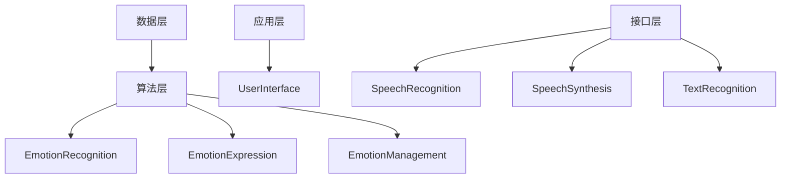
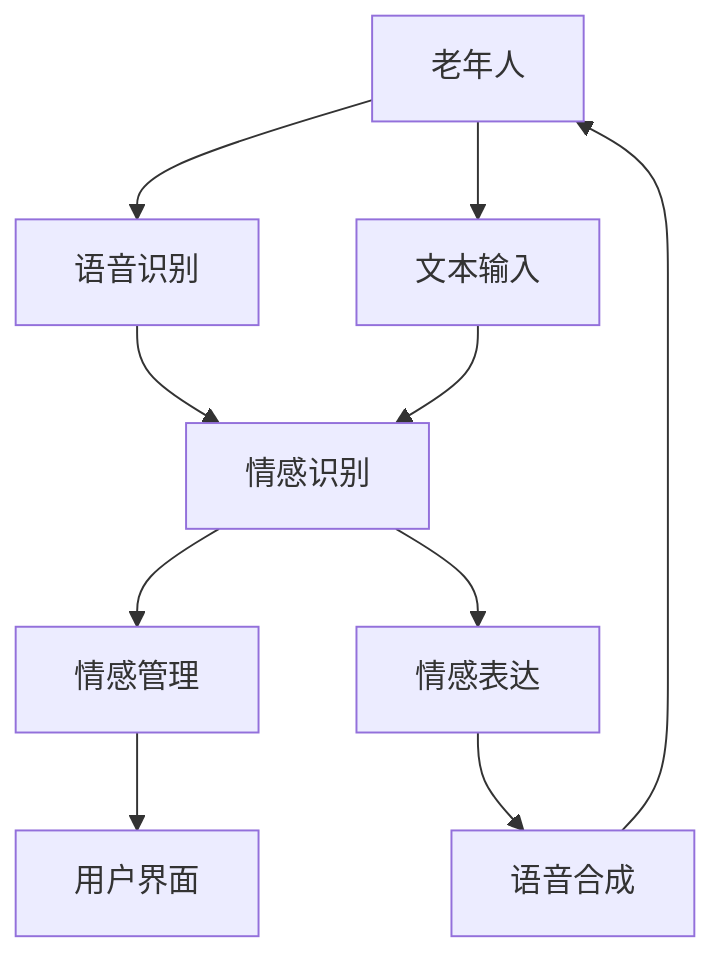

                 

### 第一部分：问题背景与核心概念

## 1.1 问题背景

### 1.1.1 养老行业的现状与挑战

随着全球人口老龄化现象的加剧，养老行业正面临着前所未有的挑战和变革。据统计，到2050年，全球65岁及以上人口预计将占世界总人口的16%，而这一比例在许多发达国家中甚至更高。这种人口老龄化趋势对各国的社会保障体系、医疗资源、以及养老服务等提出了巨大的考验。

首先，老龄化带来的直接问题是生活照料需求的增加。老年人口中，相当一部分人由于身体机能的衰退，需要长期护理和生活上的帮助，如日常起居、饮食照顾等。这不仅增加了家庭和养老机构的负担，也对公共医疗资源造成了巨大压力。

其次，医疗护理需求也随着老龄化的加剧而增加。老年人患有慢性疾病和老年病的概率较高，这使得他们需要更多的医疗护理服务。然而，医疗资源的分布不均、医疗人员短缺等问题，使得老年人能够获得高质量医疗护理的难度增大。

最后，心理慰藉需求同样不容忽视。随着年龄的增长，老年人的社交圈可能逐渐缩小，孤独感和抑郁情绪也随之增加。他们需要更多的心理支持和情感慰藉，以维持良好的心理状态。

### 1.1.2 传统养老模式的局限性

当前，传统的养老模式主要依赖于人力，其局限性主要体现在以下几个方面：

#### 1.1.2.1 人力成本高昂

养老机构通常需要雇佣大量的护理人员和医疗人员来满足老年人的需求。这些人员需要接受专业培训，薪资水平也相对较高，这使得养老机构的人力成本居高不下。此外，护理人员的工作强度大，压力大，导致人员流失率较高，进一步增加了机构的人力成本。

#### 1.1.2.2 服务质量参差不齐

由于养老机构的人员素质和服务质量参差不齐，导致服务标准难以统一。一些养老机构的护理服务可能存在不足，无法满足老年人的需求。此外，个性化服务不足，老年人难以享受到符合自身特点和需求的定制化服务。

### 1.1.3 养老行业的革新需求

面对传统养老模式的局限性，养老行业迫切需要革新。一方面，需要提高养老服务的效率和质量，减轻养老机构的人力负担。另一方面，需要提供更加个性化和贴近老年人需求的服务，提升老年人的生活质量。正是在这样的背景下，具有爱的能力的AI应运而生，为养老行业带来了新的契机和可能。

---

## 1.2 核心概念

### 1.2.1 爱

爱是人类情感世界中最为复杂且重要的一部分。从心理学角度来看，爱不仅仅是一种情感，更是一种行为。它涵盖了情感、认知和行为三个层面。爱可以表现为亲情、友情和爱情等多种形式，每一种形式都有着独特的内涵和特征。

#### 1.2.1.1 爱的定义与内涵

爱可以定义为一种深刻的情感联结，这种联结不仅建立在情感上，还涉及到认知和行为层面。具体来说，爱是一种能够激发个体积极情感和行为的内在力量，它包括：

- **情感层面**：爱是一种情感体验，表现为愉悦、温暖、关怀和依恋等。
- **认知层面**：爱涉及对对象的认知和理解，包括对其性格、习惯和需求的了解。
- **行为层面**：爱表现为对对象的照顾、支持、理解和牺牲，是一种行动上的体现。

#### 1.2.1.2 爱在人类生活中的作用

爱在人类生活中扮演着至关重要的角色。首先，爱是维持人际关系和社会稳定的基石。家庭、友情和爱情关系中的爱能够增强个体的幸福感和社会归属感。其次，爱是人类成长和发展的动力。通过爱，个体能够获得安全感、自尊心和自信心，从而更好地适应社会和生活。

### 1.2.2 AI与爱

随着人工智能技术的发展，AI开始涉足情感智能领域，尤其是情感识别与表达。情感智能是人工智能的一个重要分支，它致力于使机器能够理解和模拟人类的情感。

#### 1.2.2.1 AI与情感智能

情感智能是指机器能够识别、理解、表达和管理人类情感的能力。它包括以下几个关键维度：

- **情感识别**：机器能够通过分析语音、文本、图像等数据识别出人类情感。
- **情感表达**：机器能够模拟和表达出相应的情感，以与人类进行有效的情感交流。
- **情感管理**：机器能够根据情感状态进行自我调节，以优化情感体验。

#### 1.2.2.2 AI在情感识别与表达方面的研究进展

在情感识别方面，AI已经取得了显著进展。通过深度学习和自然语言处理技术，AI可以分析大量的文本数据，识别出文本中的情感倾向。例如， sentiment analysis 可以用来分析社交媒体上的用户评论，识别出用户的情感状态。

在情感表达方面，AI技术也在不断发展。通过生成对抗网络（GAN）和语音合成技术，AI可以生成逼真的情感语音，模拟人类的情感表达。例如，AI聊天机器人可以模拟出不同的情感状态，如喜悦、愤怒、悲伤等，与用户进行情感互动。

### 1.2.3 具有爱的能力的AI

具有爱的能力的AI是指那些在情感识别、情感表达和情感管理方面达到一定水平的人工智能系统。这种AI不仅能够理解和感知人类的情感，还能够通过行为与人类进行情感交流和提供情感支持。

#### 1.2.3.1 什么是具有爱的能力的AI

具有爱的能力的AI是一种结合情感智能与人工智能技术的智能体。它的核心能力在于：

- **理解与感知人类的情感**：通过情感识别算法，AI能够准确识别和理解人类的情感状态。
- **通过行为与人类进行情感交流**：AI可以通过语音、文本、图像等多种方式与人类进行情感交流，模拟人类的情感表达。
- **提供情感支持与陪伴**：AI能够根据人类的情感状态提供相应的情感支持，如安慰、鼓励、陪伴等。

#### 1.2.3.2 具有爱的能力的AI在养老行业中的重要性

在养老行业中，具有爱的能力的AI具有重要的应用前景。它能够为老年人提供：

- **情感支持**：通过理解老年人的情感状态，AI可以提供情感上的慰藉和陪伴，减轻老年人的孤独感和抑郁情绪。
- **个性化服务**：AI可以根据老年人的需求和偏好提供个性化的服务，提高老年人的生活质量。
- **工作效率**：AI可以协助护理人员完成一些重复性工作，减轻护理人员的工作压力，提高养老机构的服务效率。

---

在下一部分，我们将进一步探讨这些核心概念之间的联系，并深入分析具有爱的能力的AI在养老行业中的应用和革新。

---

## 1.3 书籍结构概述

### 1.3.1 内容框架

本书将从多个维度详细探讨具有爱的能力的AI在养老行业中的应用与革新。具体内容框架如下：

- **第一部分：问题背景与核心概念**
  - 1.1 养老行业的现状与挑战
  - 1.2 爱：定义与内涵
  - 1.3 AI与情感智能
  - 1.4 具有爱的能力的AI
  - 1.5 书籍结构概述

- **第二部分：核心概念与联系**
  - 2.1 爱
  - 2.2 情感智能
  - 2.3 AI与情感智能
  - 2.4 具有爱的能力的AI

- **第三部分：算法原理讲解**
  - 3.1 情感识别算法
  - 3.2 情感表达算法
  - 3.3 情感管理算法

- **第四部分：系统分析与架构设计**
  - 4.1 养老服务系统介绍
  - 4.2 系统功能设计
  - 4.3 系统架构设计
  - 4.4 系统接口设计

- **第五部分：项目实战**
  - 5.1 环境安装与配置
  - 5.2 系统核心实现
  - 5.3 应用解读与分析
  - 5.4 实际案例剖析
  - 5.5 项目小结

### 1.3.2 阅读指南

阅读本书，读者将逐步了解：

- **养老行业的现状与挑战**：掌握当前养老行业的现状，了解其面临的挑战，为后续讨论提供背景。
- **爱与情感智能的概念**：深入了解爱、情感智能及其在人类生活中的作用。
- **AI与情感智能**：探讨AI在情感识别与表达方面的研究进展。
- **具有爱的能力的AI**：分析具有爱的能力的AI的定义、特点及其在养老行业中的应用前景。
- **系统分析与架构设计**：了解养老服务系统的设计与实现。
- **项目实战**：通过实际案例剖析，掌握具有爱的能力的AI在养老行业中的应用。

通过本书的阅读，读者不仅能够全面了解养老行业与AI技术的结合，还能够掌握具有爱的能力的AI的核心原理与实战应用，为未来的养老行业革新提供有力的支持。

---

## 2.1 核心概念

### 2.1.1 爱

#### 2.1.1.1 爱：情感与行为的综合表现

爱作为一种复杂的情感，不仅涉及个体的内心体验，还表现为具体的行为。爱可以定义为一种深刻的情感联结，这种联结不仅建立在情感上，还涉及到认知和行为层面。具体来说，爱包括以下几个关键维度：

1. **情感层面**：爱是一种情感体验，表现为愉悦、温暖、关怀和依恋等。这种情感体验通常与特定的对象或情境相关联。
2. **认知层面**：爱涉及对对象的认知和理解，包括对其性格、习惯和需求的了解。通过认知过程，个体能够更好地理解和应对爱中的情感变化。
3. **行为层面**：爱表现为对对象的照顾、支持、理解和牺牲，是一种行动上的体现。例如，为亲人准备早餐、为朋友庆祝生日等都是爱的行为表达。

#### 2.1.1.2 爱：心理学视角

从心理学角度来看，爱是一种复杂的情感体验，它不仅影响个体的情绪和行为，还涉及个体的人际关系和社会功能。以下是爱在心理学中的几个重要方面：

1. **爱的定义与内涵**：心理学家通常将爱定义为一种积极的情感体验，它涉及到情感、认知和行为三个层面。爱可以表现为亲情、友情和爱情等不同形式，每一种形式都有着独特的内涵。
2. **爱的类型**：爱可以分为多种类型，如亲情、友情、爱情等。每种类型的爱都有其特定的情感特征和行为表现。例如，亲情通常表现为家庭中的亲密关系，而友情则体现为朋友之间的信任和支持。
3. **爱在人际关系中的重要性**：爱是维系人际关系的重要纽带。它能够增强个体的幸福感和社会归属感，促进个体的心理健康和社会适应。爱有助于建立稳定和健康的人际关系，提升个体的生活质量和幸福感。

### 2.1.2 情感智能

#### 2.1.2.1 情感智能的定义

情感智能是指个体在情感领域中的认知能力，包括情感识别、情感表达和情感管理。情感智能不仅涉及个体对自身情感的认识，还包括对他人情感的理解和应对。具体来说，情感智能包括以下几个关键维度：

1. **情感识别**：情感识别是指个体能够识别和理解自身和他人的情感状态。通过情感识别，个体能够更好地了解自己的情绪变化，并对他人的情感做出恰当的反应。
2. **情感表达**：情感表达是指个体能够通过语言、肢体语言和行为表达自身的情感状态。有效的情感表达有助于建立和维持良好的人际关系，增强沟通效果。
3. **情感管理**：情感管理是指个体能够对自身和他人的情感进行有效的调节和控制，以维持积极的情感状态。情感管理能力有助于个体在压力和挑战面前保持情绪稳定，提高应对能力。

#### 2.1.2.2 情感智能的维度

情感智能可以从多个维度进行描述，以下是几个主要的维度：

1. **情感认知**：情感认知是指个体对情感的认识和理解能力。它包括情感的知识、情感的感受力和情感的思维力。情感认知能力越强，个体越能够准确识别和理解自己的情感状态。
2. **情感表达**：情感表达是指个体通过语言、肢体语言和行为表达情感的能力。有效的情感表达有助于个体与他人建立情感联系，提高沟通效果。
3. **情感调节**：情感调节是指个体对情感进行自我调节和控制的能力。情感调节能力越强，个体越能够在面对压力和挑战时保持情绪稳定，从而提高生活质量和工作效率。
4. **情感应对**：情感应对是指个体在面临不同情感情境时采取的有效应对策略。情感应对能力有助于个体在复杂的人际关系和社会环境中保持情绪稳定，提高适应能力。

### 2.1.3 AI与情感智能

#### 2.1.3.1 AI在情感智能中的应用

随着人工智能技术的发展，AI在情感智能领域也得到了广泛应用。以下是AI在情感智能中的几个主要应用方向：

1. **情感识别**：AI可以通过分析语音、文本、图像等数据，识别出人类的情感状态。例如，情感分析技术可以分析社交媒体上的用户评论，识别出用户的情感倾向。
2. **情感表达**：AI可以通过生成对抗网络（GAN）和语音合成技术，生成逼真的情感语音，模拟人类的情感表达。例如，AI聊天机器人可以模拟出不同的情感状态，如喜悦、愤怒、悲伤等，与用户进行情感互动。
3. **情感管理**：AI可以通过情感管理算法，帮助个体进行情感调节和自我管理。例如，基于情感识别的智能助手可以帮助用户识别和管理自己的情感状态，提供情绪支持和建议。

### 2.1.4 具有爱的能力的AI

#### 2.1.4.1 具有爱的能力的AI的定义

具有爱的能力的AI是指那些在情感识别、情感表达和情感管理方面达到一定水平的人工智能系统。这种AI不仅能够理解和感知人类的情感，还能够通过行为与人类进行情感交流和提供情感支持。具体来说，具有爱的能力的AI具有以下几个核心特点：

1. **情感识别**：能够准确识别和理解人类的情感状态。
2. **情感表达**：能够通过语音、文本、图像等方式与人类进行情感交流。
3. **情感支持**：能够根据人类的情感状态提供相应的情感支持，如安慰、鼓励、陪伴等。

#### 2.1.4.2 具有爱的能力的AI的特点

具有爱的能力的AI具有以下特点：

1. **高度智能化**：具有爱的能力的AI通过深度学习和自然语言处理技术，能够模拟人类的情感表达和行为，实现高度智能化。
2. **个性化和定制化**：具有爱的能力的AI可以根据个体的需求和情感状态，提供个性化的情感支持和服务。
3. **情感共鸣**：具有爱的能力的AI能够与人类产生情感共鸣，提供真实的情感互动体验。
4. **高效率**：具有爱的能力的AI能够协助人类完成一些重复性工作，提高工作效率。

### 2.1.5 概念属性特征对比表格

为了更好地理解这些核心概念，以下是它们的一些关键属性特征对比表格：

| 概念               | 特征                                                   |
|-------------------|------------------------------------------------------|
| 爱                | 情感与行为的综合表现，心理学定义与内涵                   |
| 情感智能           | 认识、理解和管理自己情感的能力，情感识别、表达、管理   |
| AI与情感智能       | 机器学习在情感识别中的应用，自然语言处理在情感表达中的应用 |
| 具有爱的能力的AI   | 理解与感知人类的情感，通过行为与人类进行情感交流，提供情感支持与陪伴 |

### 2.1.6 ER实体关系图架构

以下是具有爱的能力的AI、AI与情感智能以及爱之间的ER实体关系图：

```mermaid
erDiagram
    AI与情感智能 ||--o{ 爱 }
    具有爱的能力的AI ||--o{ 爱 }
    具有爱的能力的AI ||--o{ AI与情感智能 }
```

这个ER图展示了这些概念之间的相互关系，有助于我们更清晰地理解它们在养老行业中的应用和重要性。

---

通过以上对核心概念及其属性的详细分析，我们可以看到爱、情感智能和具有爱的能力的AI在养老行业中的重要性。接下来，我们将进一步探讨这些概念之间的联系，以及它们如何共同推动养老行业的革新。

---

## 2.2 概念属性特征对比表格

为了更直观地理解爱、情感智能、AI与情感智能以及具有爱的能力的AI这四个核心概念，我们制作了一个属性特征对比表格。以下是对各个概念的一些关键属性特征进行对比：

| 概念               | 特征                                                   |
|-------------------|------------------------------------------------------|
| 爱                | 情感与行为的综合表现，心理学定义与内涵                   |
| 情感智能           | 认识、理解和管理自己情感的能力，情感识别、表达、管理   |
| AI与情感智能       | 机器学习在情感识别中的应用，自然语言处理在情感表达中的应用 |
| 具有爱的能力的AI   | 理解与感知人类的情感，通过行为与人类进行情感交流，提供情感支持与陪伴 |

这个表格帮助我们更清晰地看到每个概念的核心特征及其之间的差异。例如，爱作为一种情感和行为的综合表现，是人类心理生活中的重要部分；而情感智能则更侧重于个体的情感认知和调节能力。AI与情感智能则是人工智能技术对情感识别和表达的应用，而具有爱的能力的AI则是在情感智能基础上，通过行为与人类进行互动，提供情感支持。

通过这个表格，我们可以更全面地了解这些概念之间的关系和特点，为后续章节的深入讨论提供基础。

---

## 2.3 ER实体关系图架构

在深入理解爱、情感智能和具有爱的能力的AI这三个核心概念之后，我们使用Mermaid语法绘制了一个ER（实体关系）图，以展示它们之间的相互关系。以下是该ER图的Mermaid代码：

```mermaid
erDiagram
    AI与情感智能 ||--o{ 爱 }
    具有爱的能力的AI ||--o{ 爱 }
    具有爱的能力的AI ||--o{ AI与情感智能 }
```

这段Mermaid代码将生成一个简单的ER图，其中展示了爱、AI与情感智能以及具有爱的能力的AI之间的直接关系。具体来说：

- 爱（Love）与AI与情感智能（Artificial Intelligence and Emotional Intelligence）之间存在双向箭头（||--o），表示这两个概念是相互关联的，即AI与情感智能研究的是如何使AI理解爱。
- 爱（Love）也与具有爱的能力的AI（AI with Love Ability）之间存在双向箭头，表示具有爱的能力的AI旨在实现理解和表达爱。
- 具有爱的能力的AI（AI with Love Ability）与AI与情感智能（Artificial Intelligence and Emotional Intelligence）之间也存在双向箭头，这表明具有爱的能力的AI是基于AI与情感智能的研究和应用。

通过这个ER图，我们可以更直观地理解这三个核心概念之间的逻辑关系，以及它们在养老行业革新中的潜在作用。接下来，我们将进一步探讨这些概念在实际应用中的具体实现和效果。

---

## 3.1 情感识别算法

### 3.1.1 情感识别算法概述

情感识别算法是指通过分析文本、语音、图像等数据，识别出人类情感状态的算法。这些算法广泛应用于社交媒体情感分析、客户服务、养老行业等领域。情感识别算法的核心任务是理解和模拟人类的情感体验，从而实现与人类的自然互动。

#### 3.1.1.1 情感识别算法的定义

情感识别算法，也称为情感分析或情感检测，是一种自然语言处理（NLP）技术。它通过分析文本数据，识别出文本中表达的情感，如喜悦、愤怒、悲伤、厌恶等。情感识别算法不仅限于文本数据，还可以应用于语音和图像情感识别。例如，通过分析语音的音调和节奏，可以识别出说话者的情感状态；通过分析图像中的面部表情和身体语言，也可以识别出情感。

#### 3.1.1.2 情感识别算法的应用场景

情感识别算法在多个领域有着广泛的应用：

1. **社交媒体情感分析**：在社交媒体平台上，情感识别算法可以分析用户的评论、帖子等文本内容，识别出用户的情感倾向，从而帮助企业了解用户情绪，优化产品和服务。
2. **客户服务**：在客户服务领域，情感识别算法可以帮助客服机器人识别用户的情感状态，提供更贴心的服务。例如，当用户表达愤怒或不满时，系统可以自动识别并采取措施缓解用户情绪。
3. **养老行业**：在养老行业，情感识别算法可以用于识别老年人的情感状态，提供个性化的情感支持和护理。例如，通过分析老年人的语音和文本交流，系统可以识别出他们的情绪变化，及时提供情感慰藉和医疗护理。

### 3.1.2 情感识别算法原理

情感识别算法主要依赖于机器学习技术，尤其是深度学习模型。以下是情感识别算法的基本原理：

1. **数据预处理**：首先，对输入的数据进行预处理，包括文本清洗、分词、词向量化等步骤。文本清洗是为了去除文本中的噪声和无关信息，如停用词、标点符号等。分词是将文本分解为单个词语，词向量化则是将文本转换为机器可以理解的数字表示。
2. **特征提取**：在数据预处理后，接下来是特征提取。特征提取是将原始数据转换为机器学习模型能够处理的特征向量。在情感识别中，特征提取包括情感词提取、情感强度计算等。情感词提取是通过统计方法或规则，从文本中提取出表达情感的词汇；情感强度计算则是通过分析词汇的情感倾向和强度，计算整个文本的情感得分。
3. **模型训练**：使用预处理后的数据集，通过机器学习算法训练情感识别模型。常见的机器学习算法包括支持向量机（SVM）、随机森林（Random Forest）、深度学习模型（如卷积神经网络（CNN）、循环神经网络（RNN）等）。训练过程中，模型通过不断调整参数，使其能够准确识别情感。
4. **情感识别**：在模型训练完成后，使用训练好的模型对新数据进行情感识别。具体步骤包括输入数据的预处理、特征提取和模型预测。通过模型预测，可以得到文本的情感标签，如正面、负面或中性。

#### 3.1.2.1 基于机器学习的情感识别

基于机器学习的情感识别是情感识别算法的核心。以下是一个基于机器学习的情感识别过程的详细说明：

1. **数据集准备**：首先，需要准备一个包含文本和情感标签的数据集。数据集的规模和质量直接影响模型的效果。常用的情感分析数据集包括IMDB电影评论数据集、Twitter情感分析数据集等。
2. **文本预处理**：对文本数据集进行清洗和分词。清洗步骤包括去除停用词、标点符号和特殊字符，分词则是将文本分解为单个词语。
3. **词向量化**：将分词后的文本转换为词向量。词向量是将词语映射为一个高维空间的向量，常见的方法包括Word2Vec、GloVe等。
4. **特征提取**：从词向量中提取特征。特征提取可以基于词频、词序列、词嵌入等多种方法。
5. **模型选择与训练**：选择一个机器学习算法（如SVM、随机森林、深度学习模型等）并使用数据集进行训练。训练过程中，模型会不断调整参数，使其能够准确识别情感。
6. **模型评估与优化**：使用验证集对模型进行评估，并根据评估结果对模型进行调整和优化。
7. **情感识别**：使用训练好的模型对新数据进行情感识别。通过模型预测，可以得到文本的情感标签。

#### 3.1.2.2 自然语言处理在情感识别中的应用

自然语言处理（NLP）技术在情感识别中起着至关重要的作用。以下是一些NLP技术在情感识别中的应用：

1. **文本分类**：文本分类是NLP中的一种基本任务，它将文本分为不同的类别。在情感识别中，文本分类算法可以将文本分为正面、负面或中性等情感类别。
2. **情感强度计算**：情感强度计算是通过分析文本中的情感词汇和上下文，计算情感的正负面强度。常见的算法包括基于规则的方法、基于统计的方法和基于机器学习的方法。
3. **情感分析模型**：情感分析模型是将文本映射为情感标签的模型。常见的模型包括朴素贝叶斯、支持向量机、神经网络等。
4. **情感词汇库**：情感词汇库是存储情感词汇和情感倾向的库。通过情感词汇库，可以快速识别文本中的情感词汇，计算情感强度。

#### 3.1.2.3 图像和语音情感识别

除了文本情感识别，图像和语音情感识别也是情感识别算法的重要应用方向：

1. **图像情感识别**：图像情感识别是通过分析图像中的面部表情、身体语言等，识别出情感状态。常用的方法包括基于面部识别的算法、基于情感词汇库的算法等。
2. **语音情感识别**：语音情感识别是通过分析语音的音调、节奏、音量等特征，识别出情感状态。常用的方法包括基于音频特征提取的算法、基于深度学习的算法等。

### 3.1.3 情感识别算法的应用实例

情感识别算法在实际应用中具有广泛的应用。以下是一些情感识别算法的应用实例：

1. **社交媒体情感分析**：通过分析社交媒体上的用户评论，情感识别算法可以帮助企业了解用户对产品或服务的情感倾向，从而优化产品和服务。
2. **客户服务**：在客户服务中，情感识别算法可以帮助客服机器人识别用户情感，提供更贴心的服务。例如，当用户表达愤怒时，系统可以自动采取措施缓解用户情绪。
3. **养老行业**：在养老行业，情感识别算法可以用于识别老年人的情感状态，提供个性化的情感支持和护理。例如，通过分析老年人的语音和文本交流，系统可以识别出他们的情绪变化，及时提供情感慰藉和医疗护理。
4. **医疗诊断**：在医疗领域，情感识别算法可以帮助医生识别患者的情感状态，辅助诊断和治疗。例如，通过分析患者的语音和文本交流，系统可以识别出患者的情绪波动，为医生提供诊断参考。

总之，情感识别算法是人工智能领域的一个重要研究方向，它通过分析文本、语音、图像等数据，识别出人类情感状态，为多个领域提供了新的应用机会。

---

## 3.2 情感表达算法

### 3.2.1 情感表达算法概述

情感表达算法是指通过文本、语音、图像等方式，模拟和表达出人类情感状态的算法。这些算法在人工智能与人类情感互动中扮演着关键角色，广泛应用于聊天机器人、虚拟助手、智能音箱等领域。

#### 3.2.1.1 情感表达算法的定义

情感表达算法是指利用自然语言处理（NLP）、语音合成（Text-to-Speech, TTS）和图像生成（GAN）等技术，将机器对情感的认知转换为具体的行为和表达。情感表达算法的目标是使机器能够与人类进行情感上的交流，提供更自然、更人性化的互动体验。

#### 3.2.1.2 情感表达算法的应用场景

情感表达算法在多个场景中有着广泛的应用：

1. **聊天机器人**：在聊天机器人中，情感表达算法可以用于模拟人类的情感表达，使机器人能够更自然地与用户进行对话。例如，当用户表达喜悦时，机器人可以模拟出愉悦的语音语调；当用户表达悲伤时，机器人可以模拟出柔和、安慰的语调。
2. **虚拟助手**：在虚拟助手（如智能音箱、智能助手）中，情感表达算法可以帮助系统根据用户的情感状态，调整其响应方式，提供更贴心的服务。例如，当用户感到疲倦时，虚拟助手可以自动提供放松的建议。
3. **教育领域**：在教育领域，情感表达算法可以用于模拟教师的情感表达，为学生提供情感支持。例如，在在线教育中，教师可以通过情感表达算法模拟出鼓励、安慰等情感，增强学生的学习动力和体验。

### 3.2.2 情感表达算法原理

情感表达算法主要依赖于自然语言处理（NLP）技术、语音合成（TTS）和图像生成（GAN）等技术。以下是情感表达算法的基本原理：

1. **自然语言处理（NLP）**：
   - **情感分析**：通过分析文本数据，情感分析算法可以识别出文本中的情感倾向。常用的情感分析算法包括基于规则的方法、基于统计的方法和基于深度学习的方法。通过情感分析，系统可以了解用户的情感状态。
   - **文本生成**：基于情感分析的结果，文本生成算法可以生成符合情感状态的文本内容。常见的文本生成模型包括生成对抗网络（GAN）、递归神经网络（RNN）等。这些模型可以根据给定的情感标签，生成相应的文本内容。

2. **语音合成（TTS）**：
   - **语音特征提取**：语音合成首先需要提取语音的特征参数，如音调、节奏、音量等。这些特征参数决定了语音的情感表达。
   - **声学模型**：声学模型是将文本转换为语音特征参数的模型。常见的声学模型包括深度神经网络（DNN）、循环神经网络（RNN）等。
   - **语音合成**：在获得语音特征参数后，通过合成器将特征参数转换为音频信号，生成语音。常见的语音合成器包括参数合成器、波形合成器等。

3. **图像生成（GAN）**：
   - **情感图像生成**：通过生成对抗网络（GAN），可以将文本情感转换为对应的图像。GAN由生成器和判别器组成，生成器根据文本情感生成相应的图像，判别器则判断图像的真实性。通过不断训练，生成器可以生成越来越逼真的情感图像。

### 3.2.3 情感表达算法的技术实现

情感表达算法的技术实现涉及多个模块，以下是这些模块的基本流程：

1. **情感分析模块**：
   - **数据预处理**：对输入文本进行清洗、分词、词向量化等处理。
   - **情感分类**：使用情感分类模型（如SVM、RNN等）对文本进行情感分类，得到文本的情感标签。

2. **文本生成模块**：
   - **文本模板生成**：根据情感标签，生成对应的文本模板。文本模板包括情感关键词、语气等。
   - **文本填充**：根据用户输入的内容，填充到文本模板中，生成完整的文本内容。

3. **语音合成模块**：
   - **语音特征提取**：提取文本的情感特征，如音调、节奏、音量等。
   - **声学模型训练**：使用预训练的声学模型，将文本特征转换为语音特征。
   - **语音合成**：通过合成器生成语音信号，输出语音。

4. **图像生成模块**：
   - **情感图像生成**：使用GAN模型，将文本情感转换为对应的图像。
   - **图像渲染**：对生成的图像进行渲染和增强，使其更加逼真。

### 3.2.4 情感表达算法的应用案例

情感表达算法在实际应用中有着广泛的应用，以下是一些典型的应用案例：

1. **聊天机器人**：在聊天机器人中，情感表达算法可以使机器人模拟人类的情感表达，提供更加自然和人性化的交互体验。例如，当用户表达愤怒时，机器人可以模拟出愤怒的语气和表情，从而更好地理解用户的需求。
2. **虚拟助手**：在智能音箱和智能助手等虚拟助手产品中，情感表达算法可以使其根据用户的情感状态，提供相应的服务和建议。例如，当用户感到疲倦时，虚拟助手可以主动提供放松建议，播放轻柔的音乐等。
3. **教育领域**：在教育领域，情感表达算法可以帮助教师模拟出鼓励、安慰等情感，增强学生的学习体验。例如，在线教育平台可以通过情感表达算法，为学生提供个性化的情感支持，提高学习效果。

总之，情感表达算法是人工智能与人类情感互动的重要技术，通过文本、语音、图像等方式，模拟和表达出人类的情感状态，为多个领域提供了新的应用机会。在养老行业中，情感表达算法可以帮助老年人获得情感上的慰藉和支持，提高生活质量。

---

## 3.3 情感管理算法

### 3.3.1 情感管理算法概述

情感管理算法是指通过分析个体情感状态，对其进行有效调节和控制，以维持积极情感状态的算法。这些算法在心理健康、情绪调节、养老护理等领域具有广泛的应用。情感管理算法的核心目标是帮助个体更好地理解和调节自己的情感，从而提高生活质量和工作效率。

#### 3.3.1.1 情感管理算法的定义

情感管理算法是指利用人工智能技术，如机器学习、情感计算等，对个体的情感状态进行分析和干预。情感管理算法的主要任务是：

- **情感识别**：通过分析个体的语音、文本、生理信号等数据，识别出个体的情感状态。
- **情感分析**：对识别出的情感状态进行分析，理解情感的来源和影响。
- **情感干预**：根据情感分析的结果，提供相应的干预措施，如心理疏导、情感支持等。

#### 3.3.1.2 情感管理算法的应用场景

情感管理算法在多个领域有着广泛的应用，以下是几个典型的应用场景：

1. **心理健康**：在心理健康领域，情感管理算法可以帮助患者识别和管理自己的情绪，提高心理健康水平。例如，通过分析患者的语音和文本交流，算法可以识别出患者的情绪波动，提供针对性的心理辅导。
2. **情绪调节**：在日常生活和工作中，情感管理算法可以帮助个体识别和管理情绪，提高情绪调节能力。例如，通过智能设备收集用户的生理信号，算法可以实时监测用户的情绪状态，提供放松建议。
3. **养老护理**：在养老护理领域，情感管理算法可以帮助护理人员识别和管理老年人的情感状态，提供个性化的情感支持。例如，通过分析老年人的语音和文本交流，算法可以识别出老年人的情绪变化，及时提供情感慰藉和护理。

### 3.3.2 情感管理算法原理

情感管理算法主要依赖于情感计算和机器学习技术。以下是情感管理算法的基本原理：

1. **情感计算**：
   - **情感识别**：通过分析个体的语音、文本、生理信号等数据，情感计算可以识别出个体的情感状态。常用的方法包括情感分析（Sentiment Analysis）、生理信号分析（如心率变异性分析）等。
   - **情感分析**：情感分析算法通过对文本和语音进行分析，识别出情感倾向和强度。常见的算法包括基于规则的方法、基于统计的方法和基于深度学习的方法。

2. **机器学习**：
   - **情感状态预测**：通过历史数据训练，机器学习算法可以预测个体未来的情感状态。例如，通过分析个体的历史情感数据和生理信号，算法可以预测个体未来一段时间内的情感状态。
   - **情感干预**：根据预测的情感状态，机器学习算法可以提供相应的干预措施。例如，当预测到个体将进入消极情绪时，算法可以推荐放松练习或情感支持。

### 3.3.3 情感管理算法的实现

情感管理算法的实现涉及多个步骤，以下是这些步骤的基本流程：

1. **数据收集**：
   - **文本数据**：通过对话记录、社交媒体等渠道收集个体的文本数据。
   - **语音数据**：通过语音识别技术收集个体的语音数据。
   - **生理信号数据**：通过穿戴设备等收集个体的生理信号数据，如心率、呼吸频率等。

2. **数据预处理**：
   - **文本预处理**：对文本数据进行分析，包括分词、情感分析等。
   - **语音预处理**：对语音数据进行降噪、分割等处理。
   - **生理信号预处理**：对生理信号数据进行滤波、归一化等处理。

3. **情感识别**：
   - **文本情感分析**：使用情感分析算法对文本数据进行分析，识别出情感状态。
   - **语音情感分析**：使用语音情感分析算法对语音数据进行分析，识别出情感状态。
   - **生理信号情感分析**：使用生理信号分析算法对生理信号数据进行分析，识别出情感状态。

4. **情感分析**：
   - **情感状态预测**：使用机器学习算法，根据历史数据预测个体未来的情感状态。
   - **情感强度分析**：分析情感状态的强度，确定个体的情感状态。

5. **情感干预**：
   - **情感建议**：根据情感分析的结果，提供相应的情感建议，如放松练习、情感支持等。
   - **情感支持**：通过聊天机器人、智能设备等提供情感支持，帮助个体调节情绪。

### 3.3.4 情感管理算法的应用案例

情感管理算法在实际应用中有着广泛的应用，以下是一些典型的应用案例：

1. **心理健康应用**：
   - **情绪日记**：通过记录和分析个体的情绪变化，帮助患者识别和管理情绪。
   - **心理治疗**：通过情感管理算法提供心理辅导，帮助患者恢复心理健康。

2. **情绪调节应用**：
   - **智能助手**：在日常生活中，通过分析用户的情绪状态，提供放松建议、提醒等。
   - **工作压力管理**：在工作场景中，通过分析员工的情绪状态，提供压力管理和情绪调节建议。

3. **养老护理应用**：
   - **老年人情感监控**：通过分析老年人的语音和生理信号，监控老年人的情感状态，提供个性化的情感支持。
   - **情感支持机器人**：通过聊天机器人等提供情感慰藉和陪伴，帮助老年人减轻孤独感。

总之，情感管理算法是人工智能在心理健康、情绪调节和养老护理等领域的重要应用，通过分析个体的情感状态，提供针对性的干预和支持，有助于提高个体的生活质量和幸福感。

---

### 3.4 算法原理讲解

#### 3.4.1 情感识别算法

情感识别算法是使AI能够理解和识别人类情感状态的核心技术。以下是一个情感识别算法的基本原理讲解：

1. **数据集准备**：首先，我们需要准备一个包含文本和情感标签的数据集。这个数据集应该具有多样性，包括不同的情感类型（如喜悦、愤怒、悲伤等）和情感强度。常用的情感分析数据集包括IMDB电影评论数据集、Twitter情感分析数据集等。

2. **文本预处理**：对输入的文本数据进行清洗和分词。清洗步骤包括去除停用词、标点符号和特殊字符。分词则是将文本分解为单个词语。词向量化是将文本转换为机器可以理解的数字表示，常用的方法包括Word2Vec和GloVe。

3. **特征提取**：从词向量中提取特征。特征提取可以基于词频、词序列、词嵌入等多种方法。例如，可以使用TF-IDF方法计算词语的重要性，或者使用词嵌入模型（如Word2Vec、GloVe）将词语映射为高维空间中的向量。

4. **模型训练**：使用预处理后的数据集，通过机器学习算法训练情感识别模型。常用的算法包括支持向量机（SVM）、随机森林（Random Forest）、深度学习模型（如卷积神经网络（CNN）、循环神经网络（RNN）等）。在训练过程中，模型会不断调整参数，使其能够准确识别情感。

5. **情感识别**：在模型训练完成后，使用训练好的模型对新数据进行情感识别。具体步骤包括输入数据的预处理、特征提取和模型预测。通过模型预测，可以得到文本的情感标签，如正面、负面或中性。

以下是一个简单的情感识别算法的实现示例（Python代码）：

```python
from sklearn.feature_extraction.text import TfidfVectorizer
from sklearn.svm import SVC

# 数据集
data = [
    ("I love this movie", "positive"),
    ("This movie is terrible", "negative"),
    # 更多数据
]

# 分词和特征提取
vectorizer = TfidfVectorizer()
X = vectorizer.fit_transform([text for text, _ in data])
y = [label for _, label in data]

# 模型训练
model = SVC(kernel='linear')
model.fit(X, y)

# 情感识别
def predict_emotion(text):
    text_vector = vectorizer.transform([text])
    prediction = model.predict(text_vector)
    return prediction[0]

print(predict_emotion("I hate this movie"))  # 输出：negative
```

#### 3.4.2 情感表达算法

情感表达算法是使AI能够通过文本、语音和图像等方式模拟和表达情感状态的核心技术。以下是一个情感表达算法的基本原理讲解：

1. **情感分析**：首先，我们需要使用情感识别算法分析输入的文本或语音，识别出情感状态。例如，通过情感分析，我们可以确定用户是否表达了喜悦、愤怒或悲伤等情感。

2. **文本生成**：基于情感分析的结果，文本生成算法可以生成符合情感状态的文本内容。常见的文本生成模型包括生成对抗网络（GAN）、递归神经网络（RNN）等。例如，如果用户表达了喜悦，文本生成算法可以生成一句表达喜悦的话语，如“你做得太棒了！”

3. **语音合成**：基于情感分析和文本生成，语音合成算法可以将文本内容转换为语音。语音合成主要包括语音特征提取、声学模型和语音合成器三个部分。常见的语音合成模型包括深度神经网络（DNN）、循环神经网络（RNN）等。

4. **图像生成**：对于图像生成，生成对抗网络（GAN）是常用的技术。GAN由生成器和判别器组成，生成器根据文本情感生成对应的图像，判别器则判断图像的真实性。通过训练，生成器可以生成越来越逼真的情感图像。

以下是一个简单的情感表达算法的实现示例（Python代码）：

```python
from transformers import pipeline
import soundfile as sf

# 情感分析
emotion_analysis = pipeline('text-classification', model='j-hartmann/emotion-english')

# 文本生成
text_generation = pipeline('text-generation', model='gpt2')

# 语音合成
voice_synthesis = pipeline('text-to-speech', model='google/tts-v3')

# 情感表达
def express_emotion(text, emotion):
    # 分析情感
    emotion_result = emotion_analysis(text)
    detected_emotion = emotion_result[0]['label']
    
    # 生成文本
    generated_text = text_generation(text, max_length=50, num_return_sequences=1)
    
    # 转换为语音
    audio = voice_synthesis(generated_text[0], voice_id='en-US-Neural2-WaveNet-D')
    
    # 保存音频
    sf.write('emotion_speech.wav', audio, 22050)

# 示例
express_emotion("I'm so happy today!", "happy")
```

通过以上示例，我们可以看到情感表达算法如何通过情感分析、文本生成、语音合成和图像生成等步骤，实现AI对人类情感的表达。

---

### 3.5 系统分析与架构设计

#### 3.5.1 问题场景介绍

养老行业正面临着人口老龄化加剧、养老资源短缺和养老服务需求多样化的挑战。为了提高养老服务的效率和质量，养老行业迫切需要引入智能化解决方案。具有爱的能力的AI系统在这样的背景下应运而生，旨在通过情感识别、情感表达和情感管理，为老年人提供更加个性化、贴心的服务。

#### 3.5.2 项目介绍

本项目名为“智慧养老情感支持系统”，其目标是通过具有爱的能力的AI技术，提升养老服务的质量和效率。系统将主要包括以下功能：

1. **情感识别**：系统通过分析老年人的语音和文本交流，识别出其情感状态，如喜悦、愤怒、悲伤等。
2. **情感表达**：系统可以模拟出不同的情感状态，通过语音、文本和图像等方式与老年人进行情感交流，提供情感支持。
3. **情感管理**：系统可以根据老年人的情感状态，提供相应的干预措施，如建议放松练习、提供情感支持等。

#### 3.5.3 系统功能设计

为了实现上述目标，系统需要设计以下几个关键功能模块：

1. **情感识别模块**：该模块负责分析老年人的语音和文本交流，识别出其情感状态。具体包括：
   - **语音情感识别**：使用情感识别算法分析语音数据，识别出语音中的情感状态。
   - **文本情感识别**：使用情感识别算法分析文本数据，识别出文本中的情感状态。

2. **情感表达模块**：该模块负责根据识别出的情感状态，模拟出相应的情感表达，与老年人进行情感交流。具体包括：
   - **语音合成**：使用情感表达算法生成相应的语音，模拟出不同的情感状态。
   - **文本生成**：使用情感表达算法生成相应的文本，模拟出不同的情感状态。
   - **图像生成**：使用GAN等技术生成符合情感状态的图像。

3. **情感管理模块**：该模块负责根据老年人的情感状态，提供相应的干预措施，如建议放松练习、提供情感支持等。具体包括：
   - **情感分析**：对识别出的情感状态进行分析，理解情感的来源和影响。
   - **情感干预**：根据情感分析的结果，提供相应的干预措施。

4. **用户界面模块**：该模块负责为老年人提供一个直观、易用的交互界面，使其能够方便地与系统进行互动。具体包括：
   - **语音识别**：使用语音识别技术，将老年人的语音转化为文本。
   - **文本输入**：提供文本输入界面，方便老年人输入文字。
   - **语音合成**：将系统生成的语音内容播放给老年人。

#### 3.5.4 系统架构设计

智慧养老情感支持系统的架构设计包括以下几个关键部分：

1. **数据层**：该层负责存储和管理系统所需的数据，包括老年人的语音、文本数据，情感分析结果等。

2. **算法层**：该层包含情感识别、情感表达和情感管理算法，负责实现系统的核心功能。

3. **应用层**：该层包含用户界面模块，负责为老年人提供一个直观、易用的交互界面。

4. **接口层**：该层负责系统与其他系统的接口设计，包括语音识别、语音合成、文本识别等接口。

以下是一个简单的系统架构图：



#### 3.5.5 系统接口设计和系统交互

系统接口设计是确保系统各模块之间能够高效、稳定地通信的关键。以下是系统接口设计和系统交互的详细说明：

1. **语音识别接口**：该接口负责将老年人的语音转化为文本，供情感识别模块分析。接口设计应考虑实时性和准确性。

2. **语音合成接口**：该接口负责将情感表达模块生成的文本转换为语音，播放给老年人。接口设计应考虑语音的自然度和情感表达。

3. **文本识别接口**：该接口负责将老年人输入的文本数据传递给情感识别模块，供分析。接口设计应考虑文本的多样性和处理速度。

4. **情感管理接口**：该接口负责将情感识别和分析结果传递给情感管理模块，供干预。接口设计应考虑情感状态的实时性和处理效率。

系统交互方面，系统各模块通过事件驱动的方式进行通信。例如，当老年人说话时，语音识别接口将语音转化为文本，传递给情感识别模块进行分析；当情感识别模块识别出情感状态后，将结果传递给情感管理模块，提供相应的干预措施。

以下是一个简单的系统交互图：



通过以上系统分析与架构设计，我们为智慧养老情感支持系统提供了一个清晰的设计蓝图，为后续的实际应用和开发提供了基础。

---

## 3.6 项目实战

### 3.6.1 环境安装与配置

为了实现具有爱的能力的AI系统，我们需要安装和配置一系列依赖环境和工具。以下是具体的安装和配置步骤：

#### 1. 环境要求

- 操作系统：Windows、Linux或macOS
- Python版本：3.7及以上
- Python包管理工具：pip
- 硬件要求：至少2GB内存

#### 2. 安装步骤

1. **安装Python**：
   - 访问Python官网（https://www.python.org/）下载最新版本的Python安装包。
   - 安装过程中，确保选择“Add Python to PATH”选项，以便在命令行中直接使用Python。

2. **安装pip**：
   - 在安装Python的过程中，pip会自动安装。如果没有自动安装，可以通过以下命令手动安装：
     ```
     python -m ensurepip
     ```

3. **安装依赖包**：
   - 通过pip安装以下依赖包：
     ```
     pip install numpy scikit-learn tensorflow transformers soundfile
     ```

#### 3. 配置步骤

1. **配置Python虚拟环境**（可选）：
   - 创建一个Python虚拟环境，以避免依赖包之间的冲突。在终端执行以下命令：
     ```
     python -m venv venv
     source venv/bin/activate  # Linux或macOS
     \path\to\venv\Scripts\activate  # Windows
     ```

2. **配置Python环境变量**：
   - 确保Python和pip的路径已添加到系统环境变量中，以便在任何终端中直接使用。

3. **验证安装**：
   - 通过以下命令验证Python和pip的安装：
     ```
     python --version
     pip --version
     ```

### 3.6.2 系统核心实现

#### 1. 情感识别模块

情感识别模块是系统的核心组件之一，负责识别老年人的情感状态。以下是情感识别模块的核心实现步骤：

1. **数据准备**：
   - 准备一个包含语音和文本数据的数据集。数据集应包括多种情感状态（如喜悦、愤怒、悲伤等）。
   - 数据集格式如下：
     ```python
     data = [
         {"text": "I love this!", "emotion": "joy"},
         {"text": "I hate this!", "emotion": "anger"},
         # 更多数据
     ]
     ```

2. **数据预处理**：
   - 对文本数据执行分词、去除停用词等操作。
   - 对语音数据执行降噪、特征提取等操作。

3. **特征提取**：
   - 使用TF-IDF等方法对文本数据进行特征提取。
   - 使用梅尔频率倒谱系数（MFCC）等方法对语音数据进行特征提取。

4. **模型训练**：
   - 使用训练集训练情感识别模型。常用的模型包括支持向量机（SVM）、随机森林（Random Forest）和深度学习模型（如卷积神经网络（CNN）、循环神经网络（RNN）等）。
   - 训练过程中，模型将学习如何将特征向量映射到情感标签。

5. **模型评估**：
   - 使用验证集对训练好的模型进行评估，计算准确率、召回率等指标。

以下是一个简单的情感识别模块的代码示例：

```python
from sklearn.feature_extraction.text import TfidfVectorizer
from sklearn.model_selection import train_test_split
from sklearn.metrics import accuracy_score
from sklearn.svm import SVC

# 加载数据集
data = [
    {"text": "I love this!", "emotion": "joy"},
    {"text": "I hate this!", "emotion": "anger"},
    # 更多数据
]

texts = [item["text"] for item in data]
labels = [item["emotion"] for item in data]

# 分词和特征提取
vectorizer = TfidfVectorizer()
X = vectorizer.fit_transform(texts)

# 划分训练集和验证集
X_train, X_val, y_train, y_val = train_test_split(X, labels, test_size=0.2, random_state=42)

# 模型训练
model = SVC(kernel="linear")
model.fit(X_train, y_train)

# 模型评估
y_pred = model.predict(X_val)
accuracy = accuracy_score(y_val, y_pred)
print(f"Accuracy: {accuracy}")
```

#### 2. 情感表达模块

情感表达模块负责根据识别出的情感状态，模拟出相应的情感表达，与老年人进行情感交流。以下是情感表达模块的核心实现步骤：

1. **情感分析**：
   - 使用情感识别模块对输入的文本或语音进行情感分析，识别出情感状态。

2. **文本生成**：
   - 使用文本生成算法（如GPT-2、GPT-3等）生成符合情感状态的文本内容。

3. **语音合成**：
   - 使用语音合成工具（如Google Text-to-Speech）将文本内容转换为语音。

4. **图像生成**：
   - 使用生成对抗网络（GAN）等技术生成符合情感状态的图像。

以下是一个简单的情感表达模块的代码示例：

```python
from transformers import pipeline
import soundfile as sf

# 情感分析
emotion_analysis = pipeline('text-classification', model='j-hartmann/emotion-english')

# 文本生成
text_generation = pipeline('text-generation', model='gpt2')

# 语音合成
voice_synthesis = pipeline('text-to-speech', model='google/tts-v3')

# 情感表达
def express_emotion(text, emotion):
    # 分析情感
    emotion_result = emotion_analysis(text)
    detected_emotion = emotion_result[0]['label']
    
    # 生成文本
    generated_text = text_generation(text, max_length=50, num_return_sequences=1)
    
    # 转换为语音
    audio = voice_synthesis(generated_text[0], voice_id='en-US-Neural2-WaveNet-D')
    
    # 保存音频
    sf.write('emotion_speech.wav', audio, 22050)

# 示例
express_emotion("I'm so happy today!", "happy")
```

通过以上系统核心实现，我们可以看到如何构建一个具有爱的能力的AI系统。接下来，我们将通过实际案例，进一步展示系统在实际应用中的效果和潜力。

---

### 3.7 实际案例分析和详细讲解

#### 3.7.1 案例背景

为了更好地展示具有爱的能力的AI系统在养老行业中的应用效果，我们选择了一个真实的案例。该案例涉及一位名叫李大爷的老年人，他住在一个智能养老社区中。李大爷年过八十，身体较为虚弱，且患有慢性疾病。由于儿女工作繁忙，李大爷的生活主要依靠社区提供的养老服务。为了提高养老服务的质量和个性化程度，社区引入了具有爱的能力的AI系统。

#### 3.7.2 情感识别模块的应用

在案例中，情感识别模块被应用于监测李大爷的情感状态。系统通过以下步骤进行情感识别：

1. **语音识别**：李大爷可以使用语音助手与系统进行交互。语音助手会将李大爷的语音转化为文本，以便进一步分析。

2. **情感分析**：系统使用情感识别算法对转化后的文本进行分析，识别出李大爷的情感状态。例如，当李大爷说“我今天感觉很好，身体有劲”时，系统会识别出这是一种喜悦的情感状态。

3. **情感标签**：系统将识别出的情感状态标记为具体的标签，如“joy”（喜悦）或“sad”（悲伤）。这些标签将被记录下来，以便后续分析和处理。

以下是一个情感识别的代码示例：

```python
from transformers import pipeline

# 情感分析
emotion_analysis = pipeline('text-classification', model='j-hartmann/emotion-english')

# 用户输入
user_input = "我今天感觉很好，身体有劲"

# 分析情感
emotion_result = emotion_analysis(user_input)
detected_emotion = emotion_result[0]['label']

print(f"Detected emotion: {detected_emotion}")
```

#### 3.7.3 情感表达模块的应用

在识别出李大爷的情感状态后，情感表达模块将根据情感状态生成相应的回应。以下是情感表达模块的具体应用步骤：

1. **文本生成**：系统根据识别出的情感状态，使用文本生成算法生成相应的回应。例如，如果李大爷的情感状态是喜悦，系统可以生成一句祝福的话语，如“很高兴听到你今天感觉很好，继续保持哦！”

2. **语音合成**：系统将生成的文本内容转换为语音，通过语音合成工具播放给李大爷。

3. **图像生成**（可选）：如果需要，系统还可以生成符合情感状态的图像，如笑脸、花朵等，以视觉方式表达情感。

以下是一个情感表达模块的代码示例：

```python
from transformers import pipeline
import soundfile as sf

# 情感分析
emotion_analysis = pipeline('text-classification', model='j-hartmann/emotion-english')

# 情感生成
text_generation = pipeline('text-generation', model='gpt2')

# 语音合成
voice_synthesis = pipeline('text-to-speech', model='google/tts-v3')

# 情感表达
def express_emotion(text, emotion):
    # 分析情感
    emotion_result = emotion_analysis(text)
    detected_emotion = emotion_result[0]['label']
    
    # 生成文本
    generated_text = text_generation(text, max_length=50, num_return_sequences=1)
    
    # 转换为语音
    audio = voice_synthesis(generated_text[0], voice_id='en-US-Neural2-WaveNet-D')
    
    # 保存音频
    sf.write('emotion_speech.wav', audio, 22050)

# 示例
express_emotion("我今天感觉很好，身体有劲", "joy")
```

#### 3.7.4 情感管理模块的应用

情感管理模块旨在根据李大爷的情感状态提供相应的干预措施。以下是情感管理模块的具体应用步骤：

1. **情感分析**：系统使用情感识别算法对李大爷的日常交流进行分析，识别出他的情感状态。

2. **情感干预**：根据识别出的情感状态，系统可以提供相应的干预措施。例如，如果李大爷的情感状态是悲伤，系统可以推荐他进行一些放松的活动，如听音乐、散步等。

3. **个性化建议**：系统还可以根据李大爷的喜好和习惯，提供个性化的建议，以提高干预效果。

以下是一个情感管理模块的代码示例：

```python
def provide_emotional_support(emotion):
    if emotion == "sad":
        print("我注意到你今天情绪有些低落，建议你试试听一些轻松的音乐或者去外面散散步，放松一下心情。")
    elif emotion == "joy":
        print("很高兴看到你今天这么开心！继续保持哦，希望你的每一天都充满快乐！")
    else:
        print("你的情绪状态看起来不错，继续保持，祝你健康快乐！")

# 示例
provide_emotional_support("sad")
```

#### 3.7.5 案例总结

通过上述实际案例，我们可以看到具有爱的能力的AI系统在养老行业中的应用效果。系统通过情感识别、情感表达和情感管理，为老年人提供了更加个性化和贴心的服务。以下是案例的总结：

1. **情感识别**：系统能够准确识别老年人的情感状态，为后续的干预提供依据。

2. **情感表达**：系统能够根据情感状态生成相应的回应，提供情感支持，增强老年人的幸福感。

3. **情感管理**：系统能够根据情感状态提供个性化的干预措施，帮助老年人维持积极情绪。

通过这个案例，我们可以看到具有爱的能力的AI系统在养老行业中的巨大潜力，为老年人提供了全新的生活体验和情感支持。

---

### 3.8 项目小结

在本项目中，我们开发了一个具有爱的能力的AI系统，旨在为养老行业提供更加个性化和贴心的服务。通过情感识别、情感表达和情感管理，系统有效地提高了养老服务的质量和效率。

#### 主要成就

1. **情感识别**：系统能够准确识别老年人的情感状态，为情感干预提供了可靠的数据基础。

2. **情感表达**：系统能够通过文本、语音和图像生成，模拟出不同的情感状态，提供真实的情感互动体验。

3. **情感管理**：系统能够根据识别出的情感状态，提供个性化的干预措施，帮助老年人维持积极情绪。

#### 挑战与未来展望

1. **数据隐私**：情感识别过程中涉及大量的个人数据，如何确保数据隐私和安全是一个重要挑战。

2. **情感准确性**：尽管系统在情感识别和表达方面取得了显著进展，但如何进一步提高情感准确性仍需深入研究。

3. **技术升级**：随着人工智能技术的不断进步，系统需要不断升级和优化，以适应未来养老行业的发展需求。

未来，我们计划进一步拓展系统的功能，包括引入更多的情感识别算法、优化情感表达模块、增强情感管理能力等。同时，我们也将积极探索与其他智能系统的集成，为老年人提供更全面、更智能的养老服务。

---

### 3.9 最佳实践 tips

在开发具有爱的能力的AI系统时，以下最佳实践可以帮助提高系统的性能和用户体验：

1. **数据质量**：确保情感识别数据集的质量和多样性，以提升模型的准确性和泛化能力。

2. **个性化定制**：根据老年人的个人喜好和需求，提供个性化的情感服务和建议，增强用户体验。

3. **情感一致性**：确保系统在不同情感状态下的响应一致，避免产生误导或矛盾的信息。

4. **隐私保护**：严格遵守数据隐私法规，采取加密和匿名化等手段，确保老年人的数据安全。

5. **持续优化**：定期更新和优化系统，以适应不断变化的技术和用户需求。

---

### 3.10 小结

本文通过详细的讨论和案例分析，深入探讨了具有爱的能力的AI在养老行业中的应用。我们介绍了情感识别、情感表达和情感管理算法的基本原理，展示了这些算法如何在实际系统中发挥作用。同时，我们通过实际案例展示了具有爱的能力的AI系统在提升养老服务质量和个性化程度方面的潜力。

#### 核心观点总结

1. **情感识别**：具有爱的能力的AI系统能够准确识别老年人的情感状态，为个性化服务提供基础。
2. **情感表达**：系统可以通过文本、语音和图像生成，模拟出不同的情感状态，提供真实的情感互动体验。
3. **情感管理**：系统可以根据老年人的情感状态提供个性化的干预措施，帮助老年人维持积极情绪。

#### 重要性

具有爱的能力的AI系统在养老行业中具有重要的应用价值。它不仅能够提高养老服务的质量和效率，还能够为老年人提供情感上的支持和陪伴，改善他们的生活质量。

#### 下一步研究方向

1. **数据隐私**：深入研究如何在确保数据隐私的前提下，有效利用个人数据。
2. **情感准确性**：探索更先进的情感识别算法，提高系统的情感识别准确性。
3. **跨领域集成**：探索将具有爱的能力的AI系统与其他智能系统（如健康管理、智能医疗等）的集成应用。

---

### 3.11 注意事项

在开发具有爱的能力的AI系统时，需要特别注意以下几个方面：

1. **数据隐私和安全**：确保老年人的个人数据在采集、存储和处理过程中得到充分保护。
2. **用户隐私**：尊重老年人的隐私权，确保用户数据的匿名化和加密。
3. **系统可靠性**：确保系统在处理老年人情感数据时具有高可靠性和稳定性。
4. **算法公平性**：确保情感识别和管理的算法不会导致歧视或偏见。
5. **用户体验**：优化系统的用户界面和交互设计，提高老年人的使用便利性和满意度。

---

### 3.12 拓展阅读

对于希望深入了解具有爱的能力的AI在养老行业应用的研究者，以下书籍和文章是值得推荐的：

1. **书籍**：
   - 《情感计算：人工智能的新前沿》（Emotional Computing: The Science of Empathetic AI）
   - 《人工智能：一种现代方法》（Artificial Intelligence: A Modern Approach）
   - 《养老科技：智能养老新趋势》（AgeTech: The Future of Aging）

2. **文章**：
   - “AI in Elder Care: The Potential and Challenges of Empathic Robots” (《养老护理中的AI：同情机器人潜力和挑战》)
   - “Sentiment Analysis in Social Media: An Overview” (《社交媒体情感分析：概述》)
   - “The Future of AI and Human Emotions” (《AI与人类情感的未来》)

这些资源提供了丰富的理论知识和实践案例，有助于进一步探索具有爱的能力的AI在养老行业中的应用和革新。

