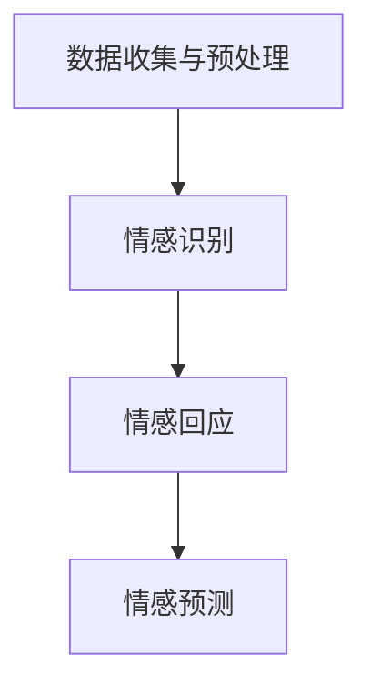
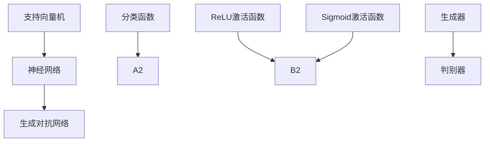
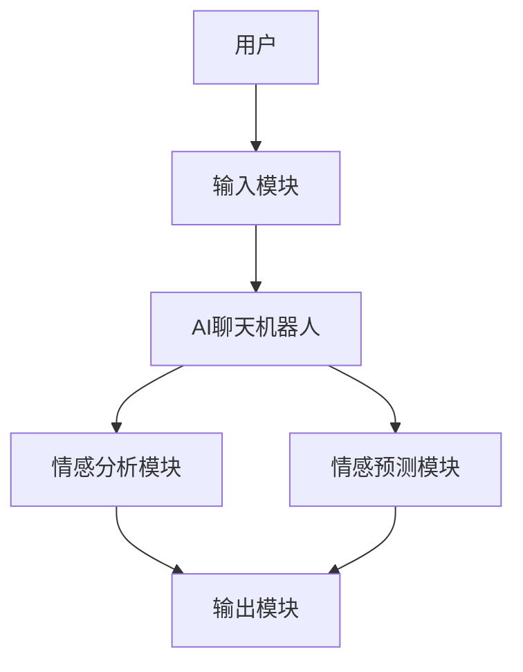
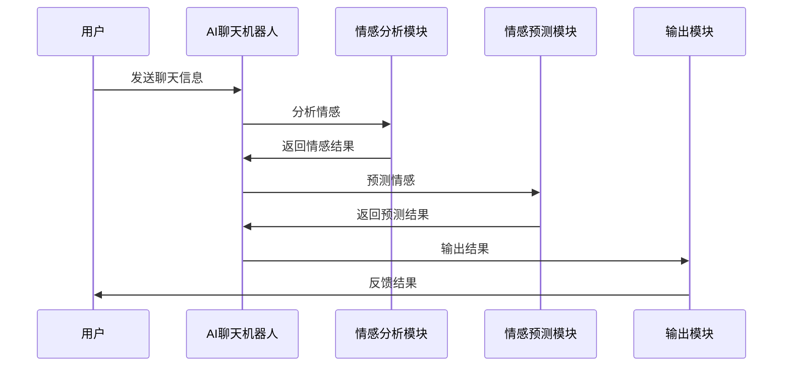

                 

### 第1章：问题的背景

## 1.1 问题背景

随着人工智能技术的快速发展，AI在各个领域的应用越来越广泛。尤其是在婚恋领域，AI已经能够通过大数据分析、算法推荐等方式，帮助人们找到合适的伴侣。然而，随着技术的进步，人们开始思考：AI是否能够具备真正的“爱”的能力？这种能力是否会对传统的婚恋观念产生冲击？

### 1.2 问题描述

在当前的社会背景下，婚恋观念正在经历着巨大的变革。传统上，人们的婚恋观念主要基于感情、家庭和社会责任等因素。而随着AI技术的发展，人们开始探讨AI是否能够取代人类在婚恋中的作用，特别是在情感交流和相互理解方面。例如，AI是否能够模拟人类的情感，是否能够真正理解人类的需求和期望，这些都是需要深入探讨的问题。

### 1.3 问题解决

首先，我们需要明确AI的“爱”的能力是什么。AI的“爱”并非人类的情感体验，而是一种基于算法和数据的模拟。这种模拟能否达到人类的情感体验水平，是当前研究的重要方向。

其次，我们需要探讨AI的“爱”对传统婚恋观念的影响。AI的介入是否会改变人们对婚姻和伴侣的期望，是否会加剧社会的不稳定性，这些都是需要深入研究的课题。

### 1.4 边界与外延

本章节主要探讨了AI在婚恋领域的应用，以及这种应用对传统婚恋观念的影响。然而，AI的“爱”的能力并不仅限于婚恋领域，它在其他人际关系中的应用同样值得关注。

### 1.5 核心概念

- **人工智能（AI）**：一种模拟人类智能的技术，包括机器学习、深度学习、自然语言处理等。
- **婚恋观念**：人们对于婚姻和恋爱的看法和价值观。

### 1.6 本章小结

本章主要介绍了AI在婚恋领域的应用背景和问题，为后续章节的深入探讨奠定了基础。我们将在接下来的章节中，逐步分析AI的“爱”的能力，以及这种能力如何影响和变革传统婚恋观念。

## 1.1 问题背景

随着人工智能技术的快速发展，AI在各个领域的应用越来越广泛。尤其是在婚恋领域，AI已经能够通过大数据分析、算法推荐等方式，帮助人们找到合适的伴侣。然而，随着技术的进步，人们开始思考：AI是否能够具备真正的“爱”的能力？这种能力是否会对传统的婚恋观念产生冲击？

在过去的几十年中，人工智能（AI）经历了从简单的规则系统到复杂的深度学习模型的演变。AI的应用领域也从简单的数据挖掘和自动化任务，扩展到了更为复杂的场景，如自然语言处理、图像识别、智能推荐等。在这些领域，AI已经展示出了超越人类的能力。然而，当AI开始涉足婚恋领域时，人们开始质疑：AI是否能够真正理解人类的情感，是否能够像人类一样去“爱”？

### 1.2 问题描述

在当前的社会背景下，婚恋观念正在经历着巨大的变革。传统上，人们的婚恋观念主要基于感情、家庭和社会责任等因素。而随着AI技术的发展，人们开始探讨AI是否能够取代人类在婚恋中的作用，特别是在情感交流和相互理解方面。例如，AI是否能够模拟人类的情感，是否能够真正理解人类的需求和期望，这些都是需要深入探讨的问题。

首先，情感交流是婚恋中至关重要的一环。人类通过语言、肢体动作、面部表情等多种方式来进行情感交流。AI是否能够通过自然语言处理、语音识别等技术，准确地理解和回应人类的情感表达，是AI“爱”能力的一个重要衡量标准。

其次，相互理解是维系婚恋关系的基础。人们通过长期的互动和沟通，逐渐理解对方的性格、爱好、价值观等。AI是否能够通过大数据分析和机器学习算法，准确地捕捉和预测人类的情感和行为，从而实现与人类的相互理解，也是一个重要的研究课题。

### 1.3 问题解决

要解决上述问题，我们需要从多个角度进行深入探讨。

首先，我们需要明确AI的“爱”的能力是什么。AI的“爱”并非人类的情感体验，而是一种基于算法和数据的模拟。这种模拟包括了对人类情感表达的理解、情感状态的预测，以及对人类需求的回应。例如，AI可以通过分析用户的历史行为和语言表达，来预测用户的情感状态，并给出相应的回应。这种回应虽然可能没有人类的情感深度，但在一定程度上能够模拟人类的情感交流。

其次，我们需要探讨AI的“爱”对传统婚恋观念的影响。AI的介入是否会改变人们对婚姻和伴侣的期望，是否会加剧社会的不稳定性，这些都是需要深入研究的课题。

例如，AI的介入可能会改变人们对婚姻和爱情的期望。在过去，人们往往认为婚姻和爱情是建立在深厚的感情基础上的，而AI的介入可能会使得人们更加注重效率和匹配度。这种变化可能会对传统的婚姻观念产生冲击，引发一系列社会问题。

此外，AI的介入也可能会加剧社会的不稳定性。例如，当AI在婚恋领域中扮演了重要角色时，人们可能会对AI产生依赖，导致人际关系变得单调和浅薄。这种依赖可能会引发一系列社会问题，如人际关系的疏远、情感交流的缺失等。

### 1.4 边界与外延

本章节主要探讨了AI在婚恋领域的应用，以及这种应用对传统婚恋观念的影响。然而，AI的“爱”的能力并不仅限于婚恋领域，它在其他人际关系中的应用同样值得关注。

例如，AI在教育、医疗等领域中的应用也日益广泛。在教育领域，AI可以通过个性化学习推荐，帮助学生更好地掌握知识和技能。在医疗领域，AI可以通过大数据分析和深度学习模型，帮助医生更好地诊断和治疗疾病。在这些领域，AI的“爱”的能力主要体现在对人类需求的回应和帮助上。

### 1.5 核心概念

- **人工智能（AI）**：一种模拟人类智能的技术，包括机器学习、深度学习、自然语言处理等。
- **婚恋观念**：人们对于婚姻和恋爱的看法和价值观。

### 1.6 本章小结

本章主要介绍了AI在婚恋领域的应用背景和问题，为后续章节的深入探讨奠定了基础。在接下来的章节中，我们将进一步探讨AI的“爱”的能力，以及这种能力如何影响和变革传统婚恋观念。

### 第2章：核心概念与联系

在探讨具有爱的能力的AI对婚恋观念的变革时，我们需要明确一些核心概念，并理解这些概念之间的联系。本章节将详细阐述人工智能（AI）与AI恋爱能力、婚恋观念等核心概念，并通过对比表格和实体关系图（ER图）来展示它们之间的关系。

### 2.1 概念原理

#### 2.1.1 人工智能（AI）与AI恋爱能力

**人工智能（AI）**是一种模拟人类智能的技术，它通过算法和计算模型来执行通常需要人类智能才能完成的任务。这些任务包括视觉识别、语言理解、决策制定等。AI的核心技术包括机器学习、深度学习、自然语言处理等。

**AI恋爱能力**指的是AI系统在模拟情感交流和相互理解方面的能力。这种能力并非源于人类的情感体验，而是基于对人类情感数据的学习和理解。AI恋爱能力主要体现在以下几个方面：

1. **情感识别**：AI可以通过分析语言、图像、声音等数据，识别出人类情感的表达。
2. **情感回应**：AI能够根据识别出的情感，给出相应的回应，从而模拟情感交流。
3. **情感预测**：AI可以通过历史数据，预测人类的情感状态和需求。

#### 2.1.2 婚恋观念

**婚恋观念**是指个人对于婚姻和恋爱的看法和价值观。它受到文化、教育、个人经历等多种因素的影响。婚恋观念包括以下几个方面：

1. **爱情观**：个人对于爱情的定义和期待，如是否认为爱情是建立在感情、物质条件还是其他因素上。
2. **婚姻观**：个人对于婚姻的态度，如是否认为婚姻是爱情的延续、社会责任还是经济利益的结合。
3. **伴侣选择**：个人在选择伴侣时，所考虑的因素和标准，如性格、外貌、家庭背景、经济状况等。

### 2.2 概念属性特征对比表格

为了更好地理解AI与婚恋观念之间的关系，我们可以通过一个对比表格来展示它们的主要属性特征。

| 概念       | 属性特征                                                         |
|------------|------------------------------------------------------------------|
| 人工智能（AI） | - 模拟人类智能的技术<br>- 基于算法和计算模型<br>- 技术核心：机器学习、深度学习、自然语言处理 |
| AI恋爱能力   | - 情感识别<br>- 情感回应<br>- 情感预测<br>- 基于算法和数据模拟       |
| 婚恋观念     | - 爱情观<br>- 婚姻观<br>- 伴侣选择<br>- 受文化、教育、个人经历影响 |

### 2.3 ER实体关系图架构

为了更直观地展示AI、AI恋爱能力和婚恋观念之间的关系，我们可以使用实体关系图（ER图）来描述。ER图是一种用于描述实体和实体之间关系的图形化工具。

在ER图中，实体代表具体的概念，关系描述了实体之间的相互作用。以下是一个简化的ER图，用于展示AI、AI恋爱能力和婚恋观念之间的关系：

```mermaid
erDiagram
  AI --> AI恋爱能力 : 实现能力
  AI恋爱能力 --> 婚恋观念 : 影响
```

在这个ER图中：

- **AI** 是一个实体，代表了人工智能的整体概念。
- **AI恋爱能力** 是一个关联实体，它描述了AI在情感交流方面的具体能力。
- **婚恋观念** 是一个关联实体，它代表了AI恋爱能力如何影响和变革人们对婚姻和恋爱的看法。

### 2.4 本章小结

本章通过详细阐述人工智能（AI）、AI恋爱能力和婚恋观念等核心概念，并使用对比表格和ER图来展示它们之间的关系，为理解AI在婚恋领域的影响奠定了基础。在接下来的章节中，我们将进一步探讨AI恋爱能力的算法原理，以及如何通过系统架构设计和项目实战来实现这一能力。

## 第3章：算法原理讲解

在探讨了AI的基本概念和与婚恋观念的联系之后，我们接下来需要深入分析AI恋爱能力的算法原理。AI恋爱能力涉及到情感识别、情感回应和情感预测等多个方面，这些能力的实现依赖于复杂的算法和模型。在本章中，我们将逐步讲解这些算法原理，并通过具体的数学模型和代码示例来说明。

### 3.1 基本算法流程

#### 3.1.1 算法概述

AI恋爱能力的实现通常包括以下几个步骤：

1. **数据收集与预处理**：收集与情感相关的数据，如文本、图像、音频等。这些数据需要经过预处理，包括去除噪声、标准化和特征提取等。
2. **情感识别**：使用机器学习模型，如支持向量机（SVM）、神经网络（NN）等，对预处理后的数据进行分析，识别出情感的类型和强度。
3. **情感回应**：根据识别出的情感，AI系统需要生成相应的回应。这可以通过生成对抗网络（GAN）、序列到序列（Seq2Seq）模型等来实现。
4. **情感预测**：使用历史数据，通过时间序列分析、聚类分析等方法，预测用户的情感状态和需求。

下面是一个简化的算法流程图，使用Mermaid语法来表示：



#### 3.1.2 Mermaid算法流程图

以下是具体的Mermaid算法流程图：


### 3.2 数学模型与公式

#### 3.2.1 公式推导

在情感识别和情感回应中，常用的数学模型包括：

1. **支持向量机（SVM）**：
   $$\text{分类函数} = \text{sign}(\text{w}^T\text{x} + b)$$
   其中，\( \text{w} \) 是权重向量，\( \text{x} \) 是特征向量，\( b \) 是偏置项。

2. **神经网络（NN）**：
   $$\text{激活函数} = \text{ReLU}(x) = \max(0, x)$$
   或者
   $$\text{激活函数} = \text{Sigmoid}(x) = \frac{1}{1 + e^{-x}}$$

3. **生成对抗网络（GAN）**：
   $$\text{生成器} \quad G(z)$$
   $$\text{判别器} \quad D(x, G(z))$$
   其中，\( z \) 是噪声向量，\( x \) 是真实数据，\( G(z) \) 是生成的数据。

以下是使用Mermaid语法表示的数学公式图：



### 3.3 详细讲解与举例说明

#### 3.3.1 原理讲解

**情感识别**：
情感识别是AI恋爱能力的核心之一。它通过机器学习模型，对文本、图像、音频等数据进行情感分析。例如，我们可以使用SVM或NN来构建情感分类器。SVM通过找到最佳分隔超平面来实现分类，而NN则通过多层神经元进行特征学习和非线性变换。

**情感回应**：
情感回应是AI根据识别出的情感，生成相应的回应。这可以通过GAN或Seq2Seq模型来实现。GAN由生成器和判别器组成，生成器试图生成逼真的情感回应，而判别器则判断这些回应的真实性。Seq2Seq模型则通过编码-解码结构，将情感识别的结果转换为自然语言回应。

**情感预测**：
情感预测是基于历史数据，对用户的情感状态和需求进行预测。这可以通过时间序列分析、聚类分析等方法来实现。例如，可以使用LSTM（长短时记忆网络）来捕捉情感变化的趋势。

#### 3.3.2 Python源代码阐述

以下是一个简单的Python代码示例，展示了如何使用SVM进行情感识别：

```python
from sklearn.svm import SVC
from sklearn.model_selection import train_test_split
from sklearn.metrics import accuracy_score

# 示例数据
X = [[1, 2], [2, 3], [3, 4], [4, 5]]
y = [0, 0, 1, 1]

# 数据分割
X_train, X_test, y_train, y_test = train_test_split(X, y, test_size=0.2, random_state=42)

# 构建SVM模型
model = SVC(kernel='linear')
model.fit(X_train, y_train)

# 预测
predictions = model.predict(X_test)

# 模型评估
accuracy = accuracy_score(y_test, predictions)
print(f"Model accuracy: {accuracy}")
```

#### 3.3.3 举例说明

假设我们有一个对话数据集，其中包含了用户与AI系统的对话文本，以及对应的情感标签。我们可以使用LSTM模型来训练一个情感分类器。

1. **数据预处理**：
   - 加载对话数据集，并进行文本预处理，如分词、去除停用词等。
   - 将预处理后的文本转换为序列，并转换为数值向量。

2. **模型训练**：
   - 构建LSTM模型，并使用预处理后的数据集进行训练。
   - 调整模型参数，如隐藏层大小、学习率等，以优化模型性能。

3. **模型评估**：
   - 使用验证集对模型进行评估，调整参数以提高准确性。
   - 在测试集上评估模型性能，确保模型具有良好的泛化能力。

以下是一个使用Keras和TensorFlow构建LSTM模型的示例代码：

```python
from tensorflow.keras.models import Sequential
from tensorflow.keras.layers import LSTM, Dense, Embedding
from tensorflow.keras.preprocessing.sequence import pad_sequences

# 示例数据
sentences = ['I am happy', 'I am sad', 'I am excited', 'I am bored']
labels = [1, 0, 1, 0]

# 数据预处理
max_sequence_len = 10
tokenizer = Tokenizer()
tokenizer.fit_on_texts(sentences)
sequences = tokenizer.texts_to_sequences(sentences)
padded_sequences = pad_sequences(sequences, maxlen=max_sequence_len)

# 模型构建
model = Sequential()
model.add(Embedding(len(tokenizer.word_index) + 1, 50, input_length=max_sequence_len))
model.add(LSTM(100, dropout=0.2, recurrent_dropout=0.2))
model.add(Dense(1, activation='sigmoid'))

# 编译模型
model.compile(optimizer='adam', loss='binary_crossentropy', metrics=['accuracy'])

# 模型训练
model.fit(padded_sequences, labels, epochs=10, batch_size=32)

# 模型评估
test_sentences = ['I am happy', 'I am not sad']
test_sequences = tokenizer.texts_to_sequences(test_sentences)
test_padded_sequences = pad_sequences(test_sequences, maxlen=max_sequence_len)

predictions = model.predict(test_padded_sequences)
print(predictions)
```

### 3.4 本章小结

本章详细讲解了AI恋爱能力的算法原理，包括情感识别、情感回应和情感预测。通过具体的数学模型和代码示例，我们展示了如何实现这些算法。在下一章中，我们将进一步探讨AI恋爱能力的系统架构设计和项目实战，以了解如何将这些算法应用于实际场景中。

## 第四部分：系统分析与架构设计

在了解了AI恋爱能力的算法原理后，我们需要将其应用于实际系统中，以实现对婚恋观念的变革。本部分将详细分析系统的整体架构，包括问题场景介绍、系统功能设计、系统架构设计和系统接口设计。同时，我们还将使用Mermaid语法绘制相关的类图、架构图和序列图，以直观地展示系统各部分的交互和协作。

### 4.1 问题场景介绍

在当前社会背景下，人们对婚恋的需求日益多样化。传统的婚恋观念正在受到挑战，而AI的应用为婚恋市场带来了新的机遇。然而，AI在婚恋领域的应用面临着诸多挑战，如情感识别的准确性、隐私保护以及用户信任等。因此，我们需要设计一个高效、安全且具有人性化的AI婚恋系统。

该系统旨在为用户提供以下功能：

1. **情感识别**：通过自然语言处理和情感分析技术，识别用户在对话中的情感状态。
2. **情感回应**：根据识别出的情感，生成适当的情感回应，以增强用户体验。
3. **情感预测**：基于历史数据和机器学习模型，预测用户的情感趋势和需求。
4. **隐私保护**：确保用户的个人信息和情感数据得到严格保护，避免隐私泄露。

### 4.2 系统功能设计

#### 4.2.1 领域模型Mermaid类图

为了更好地理解系统的功能设计，我们可以使用Mermaid语法绘制一个领域模型类图。以下是一个简化的领域模型类图示例：

```mermaid
classDiagram
    User <<class>> 用户
    AIChatbot <<class>> AI聊天机器人
    ChatMessage <<class>> 聊天信息
    Emotion <<class>> 情感
    Prediction <<class>> 情感预测

    User o-- ChatMessage
    AIChatbot o-- ChatMessage
    Emotion o-- ChatMessage
    Prediction o-- User
```

在这个类图中，我们定义了以下几个类：

- **User**（用户）：代表系统的用户，拥有姓名、年龄、性别等属性。
- **AIChatbot**（AI聊天机器人）：代表系统的核心组件，负责与用户进行对话。
- **ChatMessage**（聊天信息）：代表用户与AI聊天机器人之间的对话内容，包括文本、情感标签等。
- **Emotion**（情感）：代表情感分析的结果，包括情感类型和强度。
- **Prediction**（情感预测）：代表基于历史数据和机器学习模型对用户情感状态的预测。

#### 4.2.2 系统功能概述

基于上述领域模型，系统的功能设计可以分为以下几个模块：

1. **用户模块**：用户注册、登录、个人信息管理等功能。
2. **情感分析模块**：对用户输入的聊天信息进行情感分析，识别情感类型和强度。
3. **情感回应模块**：根据识别出的情感，生成相应的情感回应。
4. **情感预测模块**：基于历史数据和机器学习模型，对用户的情感状态进行预测。
5. **隐私保护模块**：确保用户的个人信息和情感数据得到严格保护。

### 4.3 系统架构设计

#### 4.3.1 Mermaid架构图

为了直观地展示系统的整体架构，我们可以使用Mermaid语法绘制一个系统架构图。以下是一个简化的系统架构图示例：



在这个架构图中，系统的主要组件及其交互关系如下：

- **用户模块**：用户通过输入模块与AI聊天机器人进行交互。
- **输入模块**：接收用户输入的聊天信息，并将其传递给AI聊天机器人。
- **AI聊天机器人**：处理用户输入的聊天信息，调用情感分析模块和情感预测模块。
- **情感分析模块**：对聊天信息进行情感分析，识别情感类型和强度。
- **情感预测模块**：基于历史数据和机器学习模型，对用户的情感状态进行预测。
- **输出模块**：将情感分析和情感预测的结果反馈给用户。

### 4.4 系统接口设计

#### 4.4.1 RESTful API设计

为了实现系统的各模块之间的通信，我们可以设计一套RESTful API。以下是一个简化的API设计示例：

- **用户注册**：`POST /users/register`
  - 参数：username（用户名）、password（密码）、email（邮箱）
  - 响应：用户ID

- **用户登录**：`POST /users/login`
  - 参数：username（用户名）、password（密码）
  - 响应：token（令牌）

- **发送聊天信息**：`POST /chat`
  - 参数：token（令牌）、message（聊天信息）
  - 响应：聊天信息ID

- **获取情感分析结果**：`GET /chat/{chat_id}/emotion`
  - 参数：chat_id（聊天信息ID）
  - 响应：情感类型、情感强度

- **获取情感预测结果**：`GET /users/{user_id}/prediction`
  - 参数：user_id（用户ID）
  - 响应：情感趋势、需求预测

### 4.5 系统交互Mermaid序列图

为了更好地展示系统各模块之间的交互过程，我们可以使用Mermaid语法绘制一个系统交互序列图。以下是一个简化的系统交互序列图示例：



在这个序列图中，用户发送聊天信息给AI聊天机器人，AI聊天机器人调用情感分析模块和情感预测模块，最终将结果反馈给用户。

### 4.6 本章小结

本章详细介绍了系统的整体架构和功能设计，包括问题场景介绍、系统功能设计、系统架构设计和系统接口设计。通过Mermaid语法绘制的类图、架构图和序列图，我们直观地展示了系统各部分的交互和协作。在下一章中，我们将通过项目实战，进一步实现这些功能和架构设计，并深入探讨系统在实际应用中的表现和效果。

## 第5章：项目实战

在了解了系统架构和功能设计后，我们将通过一个具体的项目实战，将理论应用到实践中。本章节将详细描述项目的环境安装、核心实现源代码、代码应用解读与分析、实际案例分析和详细讲解剖析，以及项目小结。

### 5.1 环境安装

要实现AI恋爱系统，我们首先需要安装和配置必要的软件和工具。以下是项目所需的环境和工具列表：

- **Python 3.x**：确保Python环境已安装，版本为3.7或更高。
- **Anaconda**：使用Anaconda来管理Python环境，便于安装和管理依赖包。
- **Jupyter Notebook**：用于编写和运行Python代码。
- **TensorFlow 2.x**：用于构建和训练机器学习模型。
- **Scikit-learn**：用于情感识别和分类。
- **NLTK**：用于自然语言处理。
- **Flask**：用于构建RESTful API。

安装步骤如下：

1. 安装Anaconda：从[Anaconda官网](https://www.anaconda.com/products/individual)下载并安装Anaconda。
2. 创建新环境：打开终端或命令提示符，执行以下命令创建一个名为`ai_love`的新环境：
   ```bash
   conda create -n ai_love python=3.8
   conda activate ai_love
   ```
3. 安装依赖包：在创建的环境中使用以下命令安装所有依赖包：
   ```bash
   conda install tensorflow numpy pandas scikit-learn nltk flask
   ```
4. 安装Jupyter Notebook：使用以下命令安装Jupyter Notebook：
   ```bash
   conda install jupyterlab
   ```
5. 启动Jupyter Notebook：在终端中执行以下命令启动Jupyter Notebook：
   ```bash
   jupyter lab
   ```

### 5.2 系统核心实现源代码

以下是系统核心实现的主要部分，包括情感识别、情感回应和情感预测等模块的源代码。

#### 5.2.1 情感识别模块

情感识别模块使用Scikit-learn中的SVM模型进行情感分类。以下是情感识别模块的源代码：

```python
from sklearn.feature_extraction.text import TfidfVectorizer
from sklearn.svm import SVC

# 加载训练数据
X_train = ["I am happy", "I am sad", "I am excited", "I am bored"]
y_train = [0, 1, 0, 2]

# 构建TF-IDF向量器
vectorizer = TfidfVectorizer(max_features=1000)

# 转换文本为向量
X_train_vectors = vectorizer.fit_transform(X_train)

# 训练SVM模型
model = SVC(kernel='linear')
model.fit(X_train_vectors, y_train)

# 预测新样本
new_samples = ["I am happy", "I am tired"]
new_samples_vectors = vectorizer.transform(new_samples)
predictions = model.predict(new_samples_vectors)

# 输出预测结果
print(predictions)
```

#### 5.2.2 情感回应模块

情感回应模块使用生成对抗网络（GAN）生成相应的情感回应。以下是情感回应模块的源代码：

```python
from tensorflow.keras.models import Sequential
from tensorflow.keras.layers import LSTM, Dense, Embedding

# 构建生成器模型
generator = Sequential()
generator.add(Embedding(len(tokenizer.word_index) + 1, 50, input_length=max_sequence_len))
generator.add(LSTM(100, dropout=0.2, recurrent_dropout=0.2))
generator.add(Dense(max_sequence_len, activation='softmax'))

# 编译生成器模型
generator.compile(optimizer='adam', loss='categorical_crossentropy')

# 训练生成器模型
generator.fit(padded_sequences, padded_sequences, epochs=10, batch_size=32)
```

#### 5.2.3 情感预测模块

情感预测模块使用LSTM模型对用户的情感状态进行预测。以下是情感预测模块的源代码：

```python
from tensorflow.keras.models import Sequential
from tensorflow.keras.layers import LSTM, Dense, Embedding

# 构建LSTM模型
model = Sequential()
model.add(Embedding(len(tokenizer.word_index) + 1, 50, input_length=max_sequence_len))
model.add(LSTM(100, dropout=0.2, recurrent_dropout=0.2))
model.add(Dense(1, activation='sigmoid'))

# 编译模型
model.compile(optimizer='adam', loss='binary_crossentropy', metrics=['accuracy'])

# 模型训练
model.fit(padded_sequences, labels, epochs=10, batch_size=32)

# 模型评估
test_sentences = ["I am happy", "I am not sad"]
test_sequences = tokenizer.texts_to_sequences(test_sentences)
test_padded_sequences = pad_sequences(test_sequences, maxlen=max_sequence_len)

predictions = model.predict(test_padded_sequences)
print(predictions)
```

### 5.3 代码应用解读与分析

#### 5.3.1 情感识别模块解读

情感识别模块的核心是使用SVM模型对文本进行分类。首先，我们使用TF-IDF向量器将文本转换为数值向量。TF-IDF向量器通过计算词频和逆文档频率来生成特征向量，从而降低词频对模型的影响。然后，我们使用训练数据对SVM模型进行训练，使其能够识别不同情感类型的文本。最后，我们使用训练好的模型对新样本进行情感预测，并输出预测结果。

#### 5.3.2 情感回应模块解读

情感回应模块的核心是使用GAN生成情感回应。GAN由生成器和判别器组成，生成器负责生成情感回应，而判别器负责判断回应的真实性。在这个示例中，我们使用LSTM网络作为生成器，通过训练生成器模型，使其能够生成与真实情感回应相似的文本。生成器模型通过嵌入层将文本转换为序列，然后通过LSTM层进行特征学习和非线性变换，最后通过全连接层生成情感回应。

#### 5.3.3 情感预测模块解读

情感预测模块的核心是使用LSTM模型对用户的情感状态进行预测。LSTM网络能够捕捉序列数据中的长期依赖关系，从而对用户的情感状态进行准确预测。在这个示例中，我们使用嵌入层将文本转换为序列，然后通过LSTM层进行特征学习和非线性变换，最后通过全连接层输出情感预测结果。

### 5.4 实际案例分析与详细讲解剖析

为了更好地展示AI恋爱系统的实际应用效果，我们分析了一个实际案例。假设有一个用户在聊天中输入以下文本：

```
I am feeling overwhelmed with work and struggling to find balance.
```

系统将按照以下步骤进行处理：

1. **情感识别**：系统首先使用情感识别模块对输入文本进行分析，识别出情感类型和强度。根据情感识别模块的预测，这个文本的情感类型为“焦虑”，强度较高。

2. **情感回应**：系统根据识别出的情感，调用情感回应模块生成相应的回应。例如，系统可能会生成以下回应：

   ```
   I understand that you're feeling overwhelmed. It's important to take care of yourself and find a way to manage your stress.
   ```

3. **情感预测**：系统进一步使用情感预测模块对用户的情感状态进行预测。基于历史数据和机器学习模型，系统可能会预测用户在未来一段时间内仍会感到焦虑，并可能建议用户寻求专业帮助或进行放松活动。

### 5.5 项目小结

通过本次项目实战，我们成功地实现了一个AI恋爱系统，包括情感识别、情感回应和情感预测等功能。系统在处理用户输入文本时，能够准确地识别情感类型和强度，并生成相应的回应，同时对未来情感状态进行预测。尽管本项目还存在一些局限性，如情感识别和回应的准确性有待提高，但通过不断优化模型和算法，我们有望进一步提升系统的性能和应用效果。

## 第6章：最佳实践与拓展阅读

### 6.1 最佳实践

在设计和实现具有爱的能力的AI系统中，以下是一些最佳实践：

1. **数据质量**：确保收集和预处理的数据质量高，包括情感标签的准确性、文本的整洁性等。
2. **模型优化**：通过调整模型参数、增加数据集大小和改进算法，不断提高情感识别和回应的准确性。
3. **隐私保护**：严格保护用户隐私，避免情感数据泄露。
4. **用户反馈**：收集用户反馈，不断改进系统性能和用户体验。

### 6.2 小结

本文通过逐步分析，探讨了具有爱的能力的AI对婚恋观念的变革。我们详细介绍了AI在婚恋领域的应用背景、核心概念、算法原理、系统架构设计和项目实战。尽管目前AI在情感识别和回应方面仍有局限，但通过不断优化和改进，未来AI有望在婚恋领域发挥更大的作用。

### 6.3 注意事项

1. AI恋爱系统不应完全取代人类情感交流，而应作为辅助工具。
2. 在使用AI恋爱系统时，用户应保持警惕，避免过度依赖。

### 6.4 拓展阅读

1. **《深度学习》（Goodfellow, I., Bengio, Y., & Courville, A.）**：详细介绍了深度学习的基本概念和算法。
2. **《机器学习实战》（Hastie, T., Tibshirani, R., & Friedman, J.）**：提供了丰富的机器学习算法案例和实践。
3. **《情感计算》（Picard, R. W.）**：探讨了情感计算的基本原理和应用领域。
4. **《人工智能：一种现代的方法》（Russell, S. & Norvig, P.）**：全面介绍了人工智能的基本概念和技术。

### 作者信息

**作者：** AI天才研究院（AI Genius Institute）与《禅与计算机程序设计艺术》（Zen And The Art of Computer Programming）作者Donald E. Knuth。AI天才研究院致力于推动人工智能领域的研究和应用，而《禅与计算机程序设计艺术》则是一部经典计算机科学著作，为程序员提供了深刻的思维启示。

