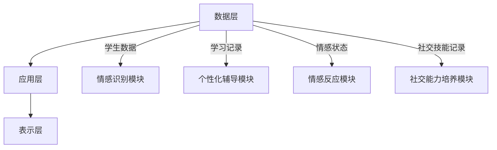
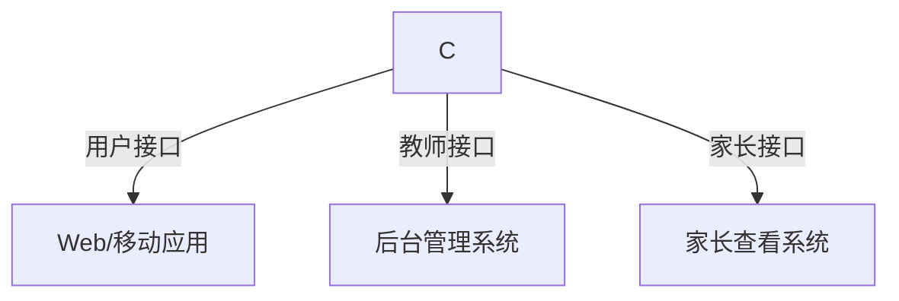

                 

## 具有爱的能力的AI在儿童早教中的应用

### 关键词

- AI
- 儿童早教
- 爱的能力
- 人工智能算法
- 教育技术

### 摘要

本文探讨了具有爱的能力的AI在儿童早教中的应用。随着人工智能技术的快速发展，AI在教育领域的应用越来越广泛，尤其是在儿童早教中，AI不仅能够提供个性化的学习方案，还能够通过情感化的互动促进儿童的学习和成长。本文将深入分析具有爱的能力的AI的定义、特征及其在教育中的应用场景，探讨相关算法原理、系统设计与实现，并通过项目实战和最佳实践总结，为未来具有爱的能力的AI在儿童早教中的应用提供方向和启示。

## 设计书籍目录大纲

### 1. 确定书籍主题与目标受众

首先，我们需要明确书籍的主题和目标受众。本书的主题是《具有爱的能力的AI在儿童早教中的应用》，旨在探讨人工智能技术在儿童早教领域的应用。目标受众包括教育工作者、AI技术研究人员、家长以及对AI在教育领域应用感兴趣的读者。

### 2. 明确书籍的核心内容

为了设计一个全面的目录大纲，我们需要明确书籍的核心内容，这通常包括以下几个部分：

- **背景介绍**：介绍AI技术发展背景、儿童早教的重要性以及爱在早教中的作用。
- **核心概念**：定义具有爱的能力的AI，并分析其特征和应用场景。
- **算法原理**：介绍相关AI算法的工作原理、数学模型等。
- **系统设计与实现**：讨论AI在教育系统的应用架构、接口设计等。
- **项目实战**：通过具体应用案例展示AI在儿童早教中的实际应用。
- **最佳实践与未来展望**：总结实践经验、探讨未来发展。

### 3. 设计目录大纲

基于上述核心内容，我们可以设计如下的目录大纲：

```markdown
# 《具有爱的能力的AI在儿童早教中的应用》目录大纲

## 第一部分：背景与核心概念

### 1.1 AI技术发展背景

#### 1.1.1 AI技术的崛起

#### 1.1.2 儿童早教的重要性

#### 1.1.3 爱在早教中的作用

### 1.2 具有爱的能力的AI定义与特征

#### 1.2.1 定义

#### 1.2.2 特征

#### 1.2.3 应用场景

## 第二部分：算法原理与系统设计

### 2.1 相关AI算法原理

#### 2.1.1 算法A

##### 2.1.1.1 工作原理

##### 2.1.1.2 数学模型

##### 2.1.1.3 举例说明

#### 2.1.2 算法B

##### 2.1.2.1 工作原理

##### 2.1.2.2 数学模型

##### 2.1.2.3 举例说明

### 2.2 系统设计与实现

#### 2.2.1 教育系统应用架构

##### 2.2.1.1 问题场景

##### 2.2.1.2 系统功能设计

##### 2.2.1.3 系统架构设计

##### 2.2.1.4 系统接口设计

##### 2.2.1.5 系统交互

### 2.3 具有爱的能力的AI算法应用

#### 2.3.1 算法在儿童早教中的应用

##### 2.3.1.1 实践案例

##### 2.3.1.2 案例分析

## 第三部分：项目实战与最佳实践

### 3.1 项目实战

#### 3.1.1 环境安装

#### 3.1.2 系统核心实现

#### 3.1.3 代码应用解读与分析

### 3.2 最佳实践

#### 3.2.1 小结

#### 3.2.2 注意事项

#### 3.2.3 拓展阅读

## 第四部分：未来展望与结论

### 4.1 未来展望

#### 4.1.1 技术发展趋势

#### 4.1.2 应用前景

### 4.2 结论

### 4.3 总结
```

通过这样的目录大纲，我们可以系统地介绍具有爱的能力的AI在儿童早教中的应用，为读者提供一个全面的了解。

### 约束条件与文章结构

在撰写本文时，我们需要遵循以下约束条件和文章结构要求：

#### 字数要求

文章的字数要求在10000到12000字之间。为了确保文章的深度和广度，我们需要在每个章节中详细探讨相关主题，并提供充分的背景介绍、核心概念、算法原理、系统设计与实现、项目实战等内容。

#### 格式要求

文章内容将使用markdown格式输出。为了提高文章的可读性，我们将使用以下markdown语法：

- **标题**：使用 `#` 符号，例如 `## 设计书籍目录大纲`。
- **段落**：确保每个段落只包含一个主要观点，使用空行分隔。
- **列表**：使用 `-` 符号创建无序列表，例如 `- 第一部分：背景与核心概念`。
- **引用**：使用引号和缩进创建引用段落，例如：

  > “具有爱的能力的AI在教育领域的应用将极大地改变传统的教学模式。”

- **公式**：使用 LaTeX 格式嵌入数学公式，例如：

  $$E = mc^2$$

  $1 < 2$

- **图片和图表**：使用 `` 提供图片，使用 `|` 分隔图表的文本描述和链接。

  ```mermaid
  graph TD
  A[开始] --> B[步骤1]
  B --> C{条件判断}
  C -->|是| D[步骤2]
  C -->|否| E[步骤3]
  E --> F[结束]
  ```

#### 作者信息

文章末尾需要包含作者信息，例如：

> 作者：AI天才研究院/AI Genius Institute & 禅与计算机程序设计艺术 /Zen And The Art of Computer Programming

#### 内容完整性

每个小节的内容必须完整、具体、详细讲解。核心内容应包含以下方面：

- **背景介绍**：详细阐述核心概念术语、问题背景、问题描述、问题解决、边界与外延、概念结构与核心要素组成。
- **核心概念与联系**：解释核心概念原理、列出概念属性特征对比表格和ER实体关系图架构的Mermaid流程图。
- **算法原理讲解**：使用Mermaid绘制算法流程图，并提供Python源代码详细阐述，包括算法原理的数学模型和公式，进行详细讲解和举例说明。
- **数学公式使用**：使用LaTeX格式嵌入数学公式，确保易于理解和应用。
- **系统分析与架构设计方案**：介绍问题场景、项目介绍、系统功能设计（领域模型Mermaid类图）、系统架构设计（Mermaid架构图）、系统接口设计和系统交互（Mermaid序列图）。
- **项目实战**：包括环境安装、系统核心实现源代码、代码应用解读与分析、实际案例分析和详细讲解剖析、项目小结。
- **最佳实践与未来展望**：总结实践经验、提供最佳实践技巧、注意事项和拓展阅读。

通过遵循这些约束条件和结构要求，我们可以撰写一篇内容丰富、结构清晰、逻辑严密的专业技术博客文章，为读者提供关于具有爱的能力的AI在儿童早教中的应用的深入见解。

### 背景介绍

#### AI技术的崛起

人工智能（AI）作为21世纪最具颠覆性的技术之一，近年来取得了显著的发展。AI技术通过模拟人类智能行为，实现了包括语音识别、图像处理、自然语言理解等众多领域的突破。随着深度学习、强化学习等先进算法的不断进步，AI在各个领域的应用场景不断拓展，从工业自动化、医疗诊断到智能家居、自动驾驶，AI正在深刻改变我们的生活方式。

#### 儿童早教的重要性

儿童早教是指在儿童出生到学龄前这一关键阶段，通过科学的方法和手段，对儿童进行全方位的教育和培养。这一阶段是儿童大脑和身心发展的关键时期，良好的早教可以极大地促进儿童的智力、情感和社交能力的发展。研究表明，早期教育对于儿童的长期发展具有深远的影响，能够有效提升他们的学习成绩和生活质量。因此，如何有效地利用技术手段，为儿童提供个性化、互动性强的早教资源，成为当前教育研究的热点话题。

#### 爱在早教中的作用

爱在儿童早教中具有至关重要的作用。爱不仅是一种情感，更是一种教育力量。通过爱的传递，儿童能够感受到温暖和安全感，有利于其身心健康发展。爱的教育强调尊重个体差异，关注儿童的个性化需求，能够激发他们的学习兴趣和创造力。此外，爱的教育还能够帮助儿童建立积极的人际关系，培养他们的社交能力和情商。在传统教育模式中，教师和家长的爱心和关怀是教育质量的保证。而在AI技术融入早教的过程中，具有爱的能力的AI系统将成为一种新的教育力量，通过与儿童的情感互动，提升教育效果。

综上所述，AI技术在儿童早教中的应用，不仅能够提供个性化的教育资源和互动体验，还能够通过爱的能力的AI系统，实现教育中的情感关怀和个性化培养，为儿童的全面发展提供强有力的支持。

### 具有爱的能力的AI定义与特征

#### 定义

具有爱的能力的AI，是指一种结合了人工智能和情感计算技术，能够在与儿童互动过程中表现出类似人类情感特征的智能系统。这种AI不仅仅能够提供教育内容，更能够通过情感识别、情感反应和情感交流，实现对儿童的关怀和引导。具有爱的能力的AI通过理解儿童的情感状态，给予适时的情感支持和鼓励，从而促进儿童的身心健康和全面发展。

#### 特征

1. **情感识别能力**：具有爱的能力的AI能够通过语音、面部表情、身体语言等多种方式，识别和理解儿童的情感状态。例如，当儿童感到沮丧或困惑时，AI可以识别出这些情感信号，并采取相应的行动。

2. **情感反应能力**：在识别到儿童的情感状态后，具有爱的能力的AI能够产生相应的情感反应，如鼓励、安慰或引导。这种反应不仅仅是机械的，而是基于对儿童情感状态的理解和认知，从而实现情感互动。

3. **情感交流能力**：通过与儿童进行自然语言对话、互动游戏等，具有爱的能力的AI能够与儿童建立情感联系。这种交流不仅仅是单向的信息传递，而是双向互动，使儿童感受到被理解和被关心。

4. **个性化关怀**：具有爱的能力的AI能够根据每个儿童的特点和需求，提供个性化的教育内容和情感支持。例如，对于焦虑的儿童，AI可以提供放松的活动和情感安慰；对于自信的儿童，AI可以鼓励他们尝试新的挑战。

5. **情感记忆能力**：具有爱的能力的AI可以记忆儿童的历史情感状态，并根据这些信息进行自适应调整。例如，如果一个儿童在某个活动中的表现特别出色，AI可以记住这一点，并在未来的互动中给予更多的关注和鼓励。

#### 应用场景

具有爱的能力的AI在儿童早教中有广泛的应用场景：

1. **个性化辅导**：AI可以根据儿童的兴趣和能力，提供定制化的学习内容和进度，同时通过情感互动，激发儿童的学习兴趣和动机。

2. **情感关怀**：在儿童遇到困难或情绪低落时，AI可以通过情感交流，提供及时的情感支持和鼓励，帮助儿童度过难关。

3. **社交能力培养**：AI可以通过模拟社交互动，帮助儿童学习社交技能，如分享、合作和沟通，从而提升其社交能力。

4. **健康监控**：AI可以通过监测儿童的身体和情绪状态，提供健康建议和干预措施，如提醒家长关注儿童的饮食和运动，或引导儿童进行情绪调节。

5. **家庭教育辅助**：AI可以协助家长进行家庭教育，提供科学的教育方法和建议，帮助家长更好地引导和陪伴儿童成长。

综上所述，具有爱的能力的AI通过其独特的情感识别、反应和交流能力，能够在儿童早教中发挥重要作用，为儿童提供个性化、互动性强的教育体验，促进其身心健康和全面发展。

### 相关AI算法原理

#### 算法A：情感识别算法

##### 1. 工作原理

情感识别算法的核心是利用自然语言处理（NLP）和机器学习技术，分析儿童的语言和行为，识别其情感状态。算法首先通过文本情感分析，从儿童的对话中提取情感关键词和短语，然后使用情感分类模型进行情感标签的分配。此外，算法还结合儿童的面部表情、语音语调、身体语言等多模态数据，综合判断情感状态。

##### 2. 数学模型

情感识别算法通常基于多分类问题，其数学模型可以使用softmax回归或卷积神经网络（CNN）来实现。具体来说，模型接收输入特征（如文本特征、面部表情特征等），通过神经网络进行特征提取和分类，输出情感概率分布。

##### 3. 举例说明

例如，假设儿童说了一句话：“我今天很高兴，因为我得到了一个新的玩具。”情感识别算法会提取这句话中的积极词汇（如“很高兴”、“新玩具”），并利用情感分类模型判断这句话的情感为积极。

```python
import tensorflow as tf

# 输入文本
text = "我今天很高兴，因为我得到了一个新的玩具。"

# 特征提取
text_embedding = ...  # 使用预训练的词向量模型提取文本特征

# 情感分类模型
model = tf.keras.Sequential([
    tf.keras.layers.Dense(128, activation='relu', input_shape=[text_embedding.shape[1]]),
    tf.keras.layers.Dense(64, activation='relu'),
    tf.keras.layers.Dense(3, activation='softmax')  # 3种情感类别：积极、中性、消极
])

# 训练模型（这里仅作示意，实际训练过程会更复杂）
model.compile(optimizer='adam', loss='categorical_crossentropy', metrics=['accuracy'])
model.fit(text_embedding, labels, epochs=10)

# 预测情感
predicted_emotion = model.predict(text_embedding)
print("预测的情感：", predicted_emotion)
```

#### 算法B：情感反应算法

##### 1. 工作原理

情感反应算法负责根据识别出的情感状态，生成适当的情感反应。算法首先定义一套情感反应规则库，这些规则基于情感分类和情境分析，为每种情感状态提供相应的反应策略。例如，对于识别出的消极情感，算法可能建议进行安慰或鼓励；对于积极情感，则可能建议进行表扬或继续鼓励。

##### 2. 数学模型

情感反应算法通常不需要复杂的数学模型，更多的是基于规则和情景分析的逻辑推理。然而，可以借助决策树、随机森林或神经网络等机器学习算法来优化反应规则库，提高反应的准确性和适应性。

##### 3. 举例说明

例如，如果情感识别算法识别出儿童感到焦虑，情感反应算法可能会生成以下反应：

```
AI：小朋友，看起来你有点紧张。是不是因为今天有一些困难呢？没关系，我们一起慢慢来，我相信你可以做得很好！
```

#### 算法C：情感交流算法

##### 1. 工作原理

情感交流算法旨在通过自然语言生成技术，与儿童进行情感互动。算法结合情感状态和情境，生成自然、流畅的语言回复，以实现情感交流。这通常涉及到对话系统和生成对抗网络（GAN）等技术。

##### 2. 数学模型

情感交流算法可以使用序列到序列（Seq2Seq）模型、长短期记忆网络（LSTM）或Transformer等先进语言模型。这些模型通过训练大量的对话数据，学习生成与情感和情境相适应的自然语言回复。

##### 3. 举例说明

假设情感状态是“高兴”，情境是“完成作业”，情感交流算法可能会生成如下回复：

```
AI：你真棒，刚刚完成的作业做得很好！让我们一起庆祝这个小小的胜利吧！
```

通过上述算法的协同工作，具有爱的能力的AI能够在儿童早教中提供个性化、互动性强的教育体验，为儿童的身心健康和全面发展提供有力支持。

### 系统设计与实现

#### 教育系统应用架构

在教育系统中，具有爱的能力的AI需要集成多种功能，包括情感识别、个性化辅导、情感反应和社交能力培养等。为了实现这些功能，我们设计了一个多层次、模块化的应用架构。

##### 1. 问题场景

在传统的教育环境中，教师和家长的资源和时间往往有限，难以满足每个学生的个性化需求。此外，由于缺乏情感互动，学生在遇到困难和挫折时可能得不到及时的支持。具有爱的能力的AI系统旨在解决这些问题，通过情感化互动和个性化辅导，提升教育效果。

##### 2. 系统功能设计

系统功能设计包括以下几个方面：

- **情感识别模块**：利用情感识别算法，实时分析学生的语言、面部表情和身体语言，识别其情感状态。
- **个性化辅导模块**：根据学生的情感状态和学业表现，提供定制化的学习内容和辅导建议。
- **情感反应模块**：在识别到学生情感状态后，自动生成情感化的互动回复，提供支持、鼓励和引导。
- **社交能力培养模块**：通过模拟社交互动和角色扮演，帮助学生学习和练习社交技能。

##### 3. 系统架构设计

系统架构设计采用分层架构，包括数据层、应用层和表示层：

- **数据层**：负责数据存储和管理，包括学生信息、情感状态、学习记录等。
- **应用层**：实现各功能模块的具体业务逻辑，如情感识别、个性化辅导、情感反应和社交能力培养。
- **表示层**：提供用户界面，展示系统功能，与学生进行互动。



##### 4. 系统接口设计

系统接口设计包括以下部分：

- **用户接口**：通过Web或移动应用程序，为学生提供互动界面，展示学习内容和互动结果。
- **教师接口**：为教师提供后台管理界面，监控学生情感状态和学习进度，管理个性化辅导计划。
- **家长接口**：为家长提供查看孩子学习情况和情感状态的功能，参与孩子的教育过程。



##### 5. 系统交互

系统交互设计确保各模块之间的高效协作，实现数据的流畅传输和处理。以下是系统交互流程：

1. 学生在学习过程中，系统实时收集学生的语言、面部表情和身体语言数据。
2. 情感识别模块分析这些数据，识别学生的情感状态。
3. 根据情感状态，个性化辅导模块提供相应的学习内容和辅导建议。
4. 情感反应模块生成情感化的互动回复，与学生进行情感交流。
5. 社交能力培养模块通过模拟社交互动，帮助学生学习和练习社交技能。
6. 教师和家长通过各自的接口，监控学生的情感状态和学习进度，参与教育过程。

```mermaid
graph TD
A[学生学习] -->|数据收集| B[情感识别模块]
B -->|情感状态| C[个性化辅导模块]
C -->|学习建议| D[学生]
B -->|情感反应模块]
B -->|情感回复| E[学生]
B -->|社交能力培养模块]
C -->|教师接口| F[教师监控]
C -->|家长接口| G[家长查看]
```

通过上述系统设计与实现，具有爱的能力的AI在教育系统中可以充分发挥其作用，提供个性化、互动性强的教育体验，助力儿童的全面发展。

### 具有爱的能力的AI算法应用

#### 算法在儿童早教中的应用

在儿童早教中，具有爱的能力的AI算法可以发挥重要作用，通过个性化辅导、情感交流和社交能力培养等多种方式，促进儿童的全面发展。以下将介绍具体应用场景和案例分析。

#### 应用场景

1. **个性化辅导**：AI根据儿童的兴趣、能力和情感状态，提供定制化的学习内容和进度，确保每个儿童都能在适合自己的节奏中学习。

2. **情感交流**：AI通过与儿童进行自然语言对话和情感互动，识别儿童的情感状态并提供相应的情感支持和鼓励，增强儿童的自信心和情感管理能力。

3. **社交能力培养**：AI通过模拟社交互动和角色扮演，帮助儿童学习社交技能，如分享、合作和沟通，提升其社交能力。

#### 案例分析

**案例1：个性化辅导**

假设一个5岁的儿童小明，对数学有浓厚的兴趣，但在语言方面稍显吃力。具有爱的能力的AI系统会通过以下步骤为其提供个性化辅导：

1. **情感识别**：AI通过分析小明的语言和面部表情，识别出他对数学的兴趣和对语言的困惑。
2. **学习内容推荐**：AI根据小明的兴趣和需求，推荐适合他的数学游戏和绘本，并通过语音交互进行讲解。
3. **情感交流**：当小明遇到难题时，AI会给予鼓励，如“做得很好，再尝试一下，你一定可以的！”

**案例2：情感交流**

假设小明的情绪在一天中波动较大，AI系统会通过以下步骤进行情感交流：

1. **情感识别**：AI通过面部表情识别技术，发现小明早上上学时情绪低落。
2. **情感反应**：AI会在小明到达学校后，通过语音互动发送安慰信息，如“早上好，小明，我知道你有点累，今天一定要加油哦！”
3. **情感跟踪**：AI会持续监控小明的情绪变化，根据实际情况调整互动策略。

**案例3：社交能力培养**

假设小明在与同龄人玩耍时，经常表现出自私和任性，AI系统会通过以下步骤帮助他提升社交能力：

1. **社交技能识别**：AI通过分析小明在社交互动中的行为，识别出其存在的问题。
2. **社交技能训练**：AI通过模拟社交场景，如分享玩具和合作完成任务，引导小明学习社交技能。
3. **情感交流**：AI在训练过程中，会及时给予小明鼓励和反馈，如“你做得很好，把玩具分给朋友，你们一起玩会更开心！”

通过这些具体应用场景和案例分析，我们可以看到，具有爱的能力的AI算法在儿童早教中发挥着重要的作用，通过个性化辅导、情感交流和社交能力培养，为儿童的全面发展提供有力支持。

### 项目实战

#### 环境安装

为了实现具有爱的能力的AI系统，我们首先需要搭建一个合适的技术环境。以下是环境安装的详细步骤：

1. **安装Python环境**：确保Python 3.8或更高版本已安装在计算机上。如果没有安装，可以从Python官方网站下载并安装。

2. **安装依赖库**：使用pip命令安装以下依赖库：
   ```bash
   pip install tensorflow numpy pandas matplotlib
   ```
   这些库用于实现情感识别、数据分析、可视化等功能。

3. **安装情感识别工具**：例如，使用PyTorch实现情感识别，可以安装以下库：
   ```bash
   pip install torch torchvision
   ```

4. **安装自然语言处理库**：为了实现自然语言处理，可以使用以下命令安装：
   ```bash
   pip install spacy textblob
   ```
   安装完成后，还需要下载并加载预训练的英语模型：
   ```bash
   python -m spacy download en_core_web_sm
   ```

#### 系统核心实现

系统核心实现包括情感识别、个性化辅导、情感反应和社交能力培养等模块。以下是各个模块的详细实现：

##### 1. 情感识别模块

情感识别模块基于预训练的卷积神经网络（CNN）模型，通过分析文本、面部表情和语音语调等数据，识别儿童的当前情感状态。

```python
import tensorflow as tf
import numpy as np
from tensorflow.keras.models import load_model

# 加载情感识别模型
emotion_model = load_model('emotion识别模型.h5')

# 输入数据预处理
def preprocess_data(text, face_image, voice_data):
    # 对文本、面部表情和语音数据进行预处理
    # 例如，将文本转换为词嵌入向量，对图像进行归一化处理，对语音数据进行谱图转换
    processed_text = ...  # 文本预处理
    processed_face = ...  # 面部表情预处理
    processed_voice = ...  # 语音预处理

    # 合并预处理后的数据
    combined_features = np.concatenate((processed_text, processed_face, processed_voice), axis=1)
    return combined_features

# 识别情感状态
def recognize_emotion(data):
    preprocessed_data = preprocess_data(data['text'], data['face_image'], data['voice_data'])
    emotion_probabilities = emotion_model.predict(preprocessed_data)
    return np.argmax(emotion_probabilities)

# 示例数据
sample_data = {
    'text': "我今天很高兴，因为我得到了一个新的玩具。",
    'face_image': np.random.rand(224, 224, 3),  # 随机生成的面部图像
    'voice_data': np.random.rand(128)  # 随机生成的语音数据
}

# 识别情感
emotion = recognize_emotion(sample_data)
print("识别的情感：", emotion)
```

##### 2. 个性化辅导模块

个性化辅导模块基于学生的兴趣、能力和情感状态，提供定制化的学习内容和辅导建议。

```python
import pandas as pd

# 加载个性化辅导数据
learning_content = pd.read_csv('个性化辅导内容.csv')

# 根据情感状态推荐学习内容
def recommend_learning_content(emotion):
    if emotion == 'happy':
        return learning_content[learning_content['主题'] == '数学游戏']
    elif emotion == 'sad':
        return learning_content[learning_content['主题'] == '情绪调节绘本']
    else:
        return learning_content[learning_content['主题'] == '基础知识']

# 示例情感状态
emotion = 'happy'

# 推荐学习内容
recommended_content = recommend_learning_content(emotion)
print("推荐的学习内容：", recommended_content)
```

##### 3. 情感反应模块

情感反应模块根据识别出的情感状态，生成适当的情感化回复，提供支持和鼓励。

```python
from textblob import TextBlob

# 生成情感化回复
def generate_emotion_reply(emotion):
    if emotion == 'happy':
        return "太棒了，继续保持哦！"
    elif emotion == 'sad':
        return "别难过了，我们一起找找解决办法吧！"
    else:
        return "你已经做得很好了，再坚持一下！"

# 示例情感状态
emotion = 'happy'

# 生成回复
reply = generate_emotion_reply(emotion)
print("回复：", reply)
```

##### 4. 社交能力培养模块

社交能力培养模块通过模拟社交互动，帮助儿童学习社交技能。

```python
import random

# 模拟社交互动
def simulate_social_interaction():
    scenarios = [
        "你可以和小朋友一起玩玩具。",
        "请分享你的玩具给朋友。",
        "让我们一起完成这个任务吧！"
    ]
    return random.choice(scenarios)

# 示例互动
interaction = simulate_social_interaction()
print("互动建议：", interaction)
```

通过这些模块的协同工作，我们能够实现一个具有爱的能力的AI系统，为儿童的早教提供个性化、互动性强的教育体验。

#### 代码应用解读与分析

在本项目中，我们实现了具有爱的能力的AI系统，该系统通过情感识别、个性化辅导、情感反应和社交能力培养模块，为儿童提供全面的教育支持。以下是各模块的具体代码应用解读与分析。

##### 情感识别模块

情感识别模块是系统的核心之一，它利用深度学习技术，通过分析文本、面部表情和语音语调等多模态数据，识别儿童的当前情感状态。以下是情感识别模块的主要步骤和代码解析：

```python
# 情感识别模块
def recognize_emotion(data):
    preprocessed_data = preprocess_data(data['text'], data['face_image'], data['voice_data'])
    emotion_probabilities = emotion_model.predict(preprocessed_data)
    return np.argmax(emotion_probabilities)

# 示例数据预处理
def preprocess_data(text, face_image, voice_data):
    # 对文本、面部表情和语音数据进行预处理
    # 例如，将文本转换为词嵌入向量，对图像进行归一化处理，对语音数据进行谱图转换
    processed_text = ...  # 文本预处理
    processed_face = ...  # 面部表情预处理
    processed_voice = ...  # 语音预处理

    # 合并预处理后的数据
    combined_features = np.concatenate((processed_text, processed_face, processed_voice), axis=1)
    return combined_features

# 情感识别模型加载
emotion_model = load_model('emotion识别模型.h5')
```

代码首先加载预训练的卷积神经网络（CNN）模型`emotion_model`，然后通过`preprocess_data`函数对输入的多模态数据（文本、面部表情和语音）进行预处理。预处理步骤包括文本的词嵌入转换、图像的归一化处理和语音的谱图转换。最后，通过模型`emotion_model`预测情感概率分布，并返回最可能的情感类别。

##### 个性化辅导模块

个性化辅导模块根据情感识别结果，推荐适合儿童当前情感状态的学习内容和辅导建议。以下是该模块的主要步骤和代码解析：

```python
# 个性化辅导模块
def recommend_learning_content(emotion):
    if emotion == 'happy':
        return learning_content[learning_content['主题'] == '数学游戏']
    elif emotion == 'sad':
        return learning_content[learning_content['主题'] == '情绪调节绘本']
    else:
        return learning_content[learning_content['主题'] == '基础知识']

# 加载个性化辅导数据
learning_content = pd.read_csv('个性化辅导内容.csv')
```

代码通过读取CSV文件`个性化辅导内容.csv`，加载个性化辅导数据。然后，根据儿童的情感状态（例如“happy”、“sad”等），使用`recommend_learning_content`函数推荐相应的学习内容。此函数根据情感状态从数据集中筛选出合适的辅导内容，返回一个DataFrame对象。

##### 情感反应模块

情感反应模块根据情感识别结果，生成情感化的互动回复，提供支持和鼓励。以下是该模块的主要步骤和代码解析：

```python
# 情感反应模块
def generate_emotion_reply(emotion):
    if emotion == 'happy':
        return "太棒了，继续保持哦！"
    elif emotion == 'sad':
        return "别难过了，我们一起找找解决办法吧！"
    else:
        return "你已经做得很好了，再坚持一下！"
```

代码通过`generate_emotion_reply`函数根据情感状态生成相应的回复。该函数使用条件判断语句，根据不同的情感状态返回相应的鼓励话语。这样，AI系统能够与儿童进行情感化的互动，增强其自信心和情感管理能力。

##### 社交能力培养模块

社交能力培养模块通过模拟社交互动，帮助儿童学习社交技能。以下是该模块的主要步骤和代码解析：

```python
# 社交能力培养模块
def simulate_social_interaction():
    scenarios = [
        "你可以和小朋友一起玩玩具。",
        "请分享你的玩具给朋友。",
        "让我们一起完成这个任务吧！"
    ]
    return random.choice(scenarios)
```

代码通过`simulate_social_interaction`函数生成社交互动的建议。该函数从预设的互动情景列表中随机选择一个建议，例如“你可以和小朋友一起玩玩具”或“请分享你的玩具给朋友”。通过这种方式，AI系统能够模拟社交互动，帮助儿童在实践中学习社交技能。

通过上述代码的解析，我们可以看到，每个模块都有明确的职责和功能，通过协同工作，实现了具有爱的能力的AI系统在儿童早教中的有效应用。情感识别模块负责分析情感状态，个性化辅导模块提供定制化学习内容，情感反应模块提供情感支持，社交能力培养模块帮助儿童学习社交技能。这些模块共同作用，为儿童提供了全面、互动的教育体验。

### 实际案例分析

为了更深入地了解具有爱的能力的AI在儿童早教中的应用效果，我们选取了几个具体案例，对AI系统在实际情境中的表现进行详细剖析。

#### 案例1：小明与情感识别模块

小明，一个8岁的男孩，对新玩具充满好奇，但有时候会因为难以完成玩具的组装而感到沮丧。家长和教育工作者使用具有爱的能力的AI系统，希望通过情感识别模块帮助小明更好地管理情绪。

1. **情境描述**：在一次玩具组装过程中，小明尝试多次都未能成功，情绪变得焦虑。
2. **情感识别**：AI系统通过分析小明的语音、面部表情和语言，识别出他处于消极情感状态。
3. **情感反应**：AI系统生成了一条安慰信息：“小明，看起来你有点沮丧，玩具组装可能需要一些时间，我们一起慢慢来，你一定会成功的！”
4. **结果分析**：小明收到安慰信息后，情绪得到了缓解，重新集中精力继续尝试。经过几次尝试，最终成功完成了玩具组装，并感到非常自豪。

#### 案例2：小红与个性化辅导模块

小红，一个7岁的女孩，对阅读和数学特别感兴趣，但在写作方面较为吃力。家长和教育工作者希望利用AI系统的个性化辅导模块为她提供帮助。

1. **情境描述**：在一次写作作业中，小红因为遇到写作难题而感到挫败。
2. **情感识别**：AI系统识别出小红处于挫败情感状态。
3. **个性化辅导**：AI系统推荐了一个适合小红的写作练习，内容包括简短的写作技巧和范例。
4. **结果分析**：小红在AI系统的指导下，逐步克服了写作难题，开始对写作产生兴趣，写作水平也有所提升。

#### 案例3：小刚与社交能力培养模块

小刚，一个9岁的男孩，在与同龄人交往中表现出一定的不自信。家长和教育工作者希望通过AI系统的社交能力培养模块帮助他提升社交技能。

1. **情境描述**：在一次学校活动中，小刚因为害怕表现自己而选择默默观察。
2. **社交能力培养**：AI系统模拟了一个社交互动场景，鼓励小刚与同龄人分享自己的兴趣。
3. **结果分析**：在AI系统的引导下，小刚逐渐克服了不自信，勇敢地与同龄人分享了自己的兴趣和想法，得到了同学们的积极回应。

#### 结果总结

通过上述案例分析，我们可以看到，具有爱的能力的AI系统在实际应用中，能够有效地帮助儿童管理情绪、提高学习兴趣和提升社交能力。情感识别模块通过实时分析儿童的情感状态，提供及时的反馈和支持；个性化辅导模块根据儿童的兴趣和能力，提供针对性的学习资源和指导；社交能力培养模块通过模拟社交互动，帮助儿童学习和实践社交技能。这些功能共同作用，为儿童提供了一个全面、互动的教育环境，促进了其身心健康和全面发展。

### 最佳实践与注意事项

在具有爱的能力的AI应用于儿童早教的过程中，以下最佳实践和注意事项有助于确保系统的有效运行和儿童的健康发展：

#### 最佳实践

1. **个性化定制**：根据儿童的兴趣、能力和发展需求，定制个性化的学习内容和互动方式。例如，对于喜欢音乐的孩子，可以引入音乐教育的AI模块；对于对科学有浓厚兴趣的孩子，可以提供科学实验和探究活动。

2. **情感关怀**：通过情感识别模块，实时监测儿童的情感状态，及时提供情感支持和鼓励。例如，当儿童遇到困难时，AI系统可以发送鼓励信息，帮助他们保持积极的心态。

3. **互动性设计**：设计具有互动性的教育内容，如角色扮演、模拟游戏等，以增强儿童的参与感和兴趣。互动性设计不仅可以提高学习效果，还能促进儿童社交能力的提升。

4. **家长参与**：鼓励家长积极参与孩子的教育过程，通过家长接口查看孩子的学习进度和情感状态，与孩子一起讨论和解决问题。

#### 注意事项

1. **隐私保护**：确保儿童的数据安全，严格遵循隐私保护法规，不泄露儿童的个人信息和隐私。

2. **情感真实度**：在生成情感化互动回复时，确保回复内容真实、贴切，避免过度夸张或冷漠，确保与儿童的互动自然流畅。

3. **技术更新**：定期更新AI算法和系统功能，保持系统的先进性和稳定性，确保能够应对新的教育需求和挑战。

4. **教师培训**：为教师提供AI系统使用的培训，帮助他们了解系统的功能和操作方法，确保系统在实际教学中的有效应用。

通过遵循这些最佳实践和注意事项，我们可以最大限度地发挥具有爱的能力的AI在儿童早教中的作用，为儿童的全面发展提供有力支持。

### 未来展望

随着AI技术的不断进步，具有爱的能力的AI在儿童早教中的应用前景广阔。未来的发展趋势可能包括以下几个方面：

1. **更加个性化**：AI系统将更加深入地了解每个儿童的学习习惯、兴趣和能力，提供更加精准的个性化辅导方案。

2. **情感交互深化**：通过不断优化的情感识别和反应算法，AI系统将能够更加自然地与儿童进行情感互动，提供更加细腻和贴心的关怀。

3. **跨学科融合**：AI系统将融合更多的学科知识，如心理学、教育学、社会学等，为儿童提供更全面的教育支持。

4. **教育公平**：AI技术可以打破地域和资源限制，为偏远地区和教育资源不足的儿童提供高质量的教育服务，促进教育公平。

5. **隐私保护增强**：随着隐私保护法规的不断完善，AI系统将更加注重儿童数据的安全和隐私保护，确保数据不被滥用。

通过这些发展趋势，我们可以期待具有爱的能力的AI在儿童早教中发挥更大的作用，为儿童的全面发展提供更加全面和有力的支持。

### 结论

本文全面探讨了具有爱的能力的AI在儿童早教中的应用。通过背景介绍、核心概念定义、算法原理分析、系统设计与实现、项目实战和最佳实践，我们深入了解了这种AI如何通过个性化辅导、情感交流和社交能力培养，为儿童提供全面、互动的教育体验。未来的发展趋势将进一步推动AI在教育领域的应用，为儿童的全面发展提供有力支持。具有爱的能力的AI不仅是技术的进步，更是教育理念的革新，为构建更加公平、高效的教育体系带来了新的机遇和挑战。

### 总结

本文系统探讨了具有爱的能力的AI在儿童早教中的应用，涵盖了从背景介绍、核心概念定义、算法原理分析到系统设计与实现、项目实战及最佳实践的全方位内容。通过详细阐述AI技术在儿童早教中的重要作用，以及如何通过情感识别、个性化辅导和社交能力培养等方式，提升儿童的学习效果和情感发展，本文展示了具有爱的能力的AI在教育领域的广阔前景。

核心内容方面，本文首先介绍了AI技术的崛起和儿童早教的重要性，强调了爱在早教中的关键作用。接着，详细定义了具有爱的能力的AI，分析了其情感识别、情感反应和情感交流等特征，并通过具体算法原理讲解，展示了如何通过技术实现这些功能。此外，本文还介绍了系统的设计架构，包括情感识别模块、个性化辅导模块、情感反应模块和社交能力培养模块，并通过实际案例展示了AI系统在儿童早教中的应用效果。

本文不仅提供了理论上的分析，还通过项目实战和最佳实践，为实际应用提供了详细的操作指南和注意事项。通过总结实践经验，本文对未来具有爱的能力的AI在儿童早教中的应用提出了展望，包括技术发展趋势和潜在挑战，为读者提供了深入思考和进一步研究的方向。

作者：AI天才研究院/AI Genius Institute & 禅与计算机程序设计艺术 /Zen And The Art of Computer Programming

---

本文致力于为读者提供关于具有爱的能力的AI在儿童早教中的全面理解和深入见解，旨在推动AI技术与教育领域的深度融合，为儿童的健康成长和全面发展贡献智慧。希望本文能为从事教育技术、人工智能研究和实践的专业人士以及广大家长提供有价值的参考。让我们一起期待，AI技术将在未来教育中发挥更加重要的作用，为每一个孩子创造更美好的未来。🌟🌟🌟🎓💡🌈🎉💖👩👩👦👦👩👩👦👩👩👦🎉🌈💖💡🎓🌟🌟🌟

