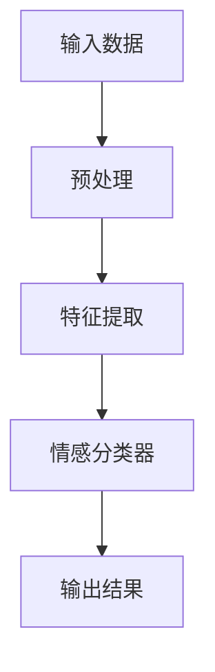
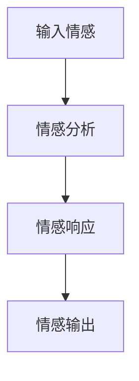
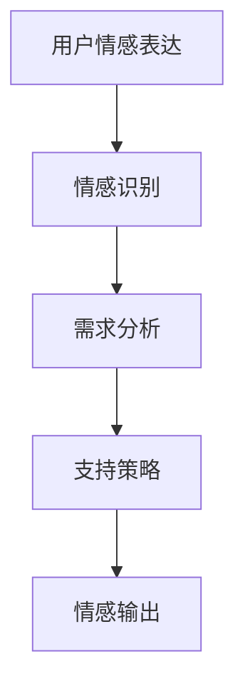

                 

## 引言

### 关键词

- 养老领域
- 人工智能
- 爱的能力
- 老龄化社会
- 新解决方案

### 摘要

本文旨在探讨具有“爱的能力”的AI在养老领域中的应用，以及如何为老龄化社会带来新的解决方案。随着全球老龄化进程的不断加速，传统养老模式面临诸多挑战，而人工智能的快速发展为应对这些挑战提供了新的可能性。本文将详细分析AI在养老领域的作用，探讨“爱的能力”在AI系统中的实现方式，并通过具体应用场景展示其潜力。最后，我们将讨论这一新兴领域面临的伦理和社会影响，以及未来发展的方向。

### 背景介绍

全球范围内，老龄化问题日益严峻。根据联合国的预测，到2050年，全球60岁及以上人口将达到20亿，占总人口的比例将从目前的12%上升到22%。这一趋势在中国、日本、欧洲等地区尤为明显，传统养老模式已无法满足日益增长的养老需求。养老问题不仅关乎个人的生活质量，也关系到整个社会的稳定与可持续发展。

老龄化社会的出现带来了诸多挑战，包括医疗资源的紧张、护理人员的短缺、养老成本的上升等。这些挑战迫使我们必须寻找新的解决方案，而人工智能（AI）的迅猛发展为这一目标的实现提供了强有力的支持。AI不仅能够提升养老服务的质量和效率，还能够为老年人提供更加个性化和人性化的关怀。

### 研究意义

本文的研究意义在于：

1. **揭示AI在养老领域的新应用**：通过探讨具有“爱的能力”的AI系统，本文将展示AI如何突破传统的技术边界，实现更加人性化的服务。
2. **提供理论指导**：本文将详细阐述“爱的能力”在AI系统中的实现原理，为相关研究提供理论支持。
3. **探讨伦理与社会影响**：随着AI在养老领域的广泛应用，相关的伦理和社会问题也日益突出。本文将深入讨论这些问题，并提出相应的解决思路。

### 本文结构

本文将分为以下几个部分：

1. **核心概念与理论基础**：介绍AI的基本概念，以及机器学习和深度学习在养老领域的应用。
2. **爱与AI的关系探讨**：分析“爱的能力”在AI系统中的实现方式，以及这一能力对养老领域的重要性。
3. **设计与实现**：详细描述具有“爱的能力”的AI系统的设计原则和实现方法。
4. **应用场景**：探讨AI在养老领域的具体应用，包括医疗辅助、社交互动和生活方式支持等。
5. **案例研究**：通过实际案例展示AI在养老领域的应用效果。
6. **伦理与社会影响**：讨论AI在养老领域应用过程中可能遇到的伦理和社会问题，并提出解决方案。
7. **未来展望**：总结本文的主要发现，并探讨未来的研究方向和挑战。

### 老龄化社会的挑战

老龄化社会所带来的挑战是多方面的，主要包括以下几个方面：

1. **医疗资源紧张**：随着老年人口的增加，对医疗资源的需求也在急剧增长。这导致了医疗系统的压力增大，医疗资源分配不均，特别是在偏远地区，老年人的医疗需求难以得到满足。

2. **护理人员短缺**：随着老年人口的增加，护理人员的短缺问题日益严重。由于工作压力大、薪资待遇低，护理人员的流失率居高不下，导致护理服务质量下降。

3. **养老成本上升**：养老成本的上升使得许多家庭难以承受。尤其是在一些发达国家，养老服务的费用高昂，许多老年人不得不依靠子女或政府补贴来维持生活。

4. **社会负担加重**：老龄化社会使得年轻一代需要承担更多的养老责任，这加重了社会负担。同时，劳动力市场的老龄化也对经济增长产生了负面影响。

5. **心理健康问题**：随着年龄的增长，老年人的心理健康问题也逐渐凸显。孤独、抑郁等情绪问题严重影响着老年人的生活质量。

### 传统养老模式的局限性

面对老龄化社会的挑战，传统养老模式存在诸多局限性：

1. **被动服务模式**：传统养老模式以被动服务为主，养老机构主要提供基本的护理和生活服务，缺乏个性化的关怀和陪伴。

2. **人力依赖**：传统养老模式高度依赖护理人员，但护理人员的短缺和服务质量的波动使得养老服务的稳定性难以保障。

3. **成本高昂**：传统养老模式需要大量的基础设施和人力投入，导致养老成本居高不下，难以被普通家庭所承受。

4. **缺乏情感支持**：传统养老模式缺乏对老年人情感需求的理解和满足，导致许多老年人感到孤独和失落。

5. **不适应现代生活**：传统养老模式往往无法适应现代老年人的生活方式和需求，特别是那些希望在晚年继续保持独立和活力的老年人。

### AI在养老领域的潜力

人工智能（AI）的发展为解决老龄化社会的挑战提供了新的可能性，主要表现在以下几个方面：

1. **提高医疗效率**：AI技术可以通过智能诊断、智能药物推荐等手段提高医疗效率，减轻医疗资源紧张的问题。

2. **个性化护理**：AI技术可以根据老年人的健康数据和个性化需求，提供定制化的护理服务，提高护理质量。

3. **智能监测与预警**：AI技术可以实时监测老年人的健康状况，及时发现异常情况并预警，减少突发疾病的风险。

4. **社交互动与陪伴**：具有“爱的能力”的AI系统可以与老年人进行情感互动，提供陪伴和安慰，缓解孤独感。

5. **智能生活支持**：AI技术可以智能化地管理老年人的日常生活，提供智能家居控制、健康饮食建议等，提高生活质量。

6. **降低养老成本**：AI技术可以降低人力成本，提高养老服务的效率和质量，从而降低养老成本，使其更加普及和可负担。

### “爱的能力”在AI系统中的重要性

在养老领域，传统的AI系统主要侧重于提高效率和提供基础服务，但往往缺乏对老年人情感需求的关注。而“爱的能力”则赋予了AI系统更加人性化的特质，使其能够更好地满足老年人的需求。

1. **情感互动**：具有“爱的能力”的AI系统可以通过语音、图像等多种方式与老年人进行情感互动，提供陪伴和安慰。

2. **情感理解**：AI系统可以分析老年人的情绪状态，理解他们的情感需求，并提供相应的关怀和支持。

3. **个性化关怀**：基于情感理解，AI系统可以提供更加个性化和贴心的服务，满足老年人的情感需求。

4. **心理健康支持**：具有“爱的能力”的AI系统可以及时发现老年人的心理问题，提供心理健康支持和建议。

5. **增强信任感**：通过情感互动和个性化关怀，AI系统可以增强老年人对服务提供者的信任感，提高服务的接受度。

### 结论

总之，随着全球老龄化进程的不断加速，传统养老模式已无法满足日益增长的养老需求。人工智能的快速发展为解决这一问题提供了新的可能性，特别是具有“爱的能力”的AI系统在养老领域的应用，不仅能够提升养老服务的质量和效率，还能够为老年人提供更加个性化和人性化的关怀。本文将在此基础上进一步探讨AI在养老领域的具体应用和实现方法，以期为老龄化社会带来新的解决方案。

### 核心概念与理论基础

#### AI的基本概念

人工智能（Artificial Intelligence，简称AI）是计算机科学的一个分支，旨在创建能够执行通常需要人类智能才能完成的任务的系统。AI系统通过模拟人类的认知过程，实现学习、推理、规划、感知和语言理解等功能。

**定义**：人工智能是研究、开发和应用使计算机系统能够执行需要人类智能的任务的科学和技术。

**分类**：

- **窄AI（Narrow AI）**：也称为弱AI，是指仅能在特定任务上表现出人类智能的AI系统。例如，语音识别、图像识别和推荐系统等。

- **宽AI（General AI）**：也称为强AI，是指具有广泛认知能力，能够在各种任务上表现出人类智能的AI系统。目前，宽AI仍然是一个理论上的目标，尚未实现。

- **强化学习（Reinforcement Learning）**：AI通过与环境互动，从错误和成功中学习，以最大化长期奖励。

- **深度学习（Deep Learning）**：一种基于多层神经网络的学习方法，能够自动提取复杂的数据特征，广泛应用于图像识别、语音识别和自然语言处理等领域。

#### 机器学习与深度学习在养老领域的应用

**机器学习**：机器学习是一种使计算机系统能够从数据中学习并做出决策的技术。在养老领域，机器学习可以用于以下应用：

- **健康监测**：通过收集和分析老年人的生理数据，如心率、血压和睡眠质量，预测健康风险和疾病发作。

- **个性化护理**：根据老年人的病史、生活方式和健康状况，提供个性化的护理建议和治疗方案。

- **行为分析**：通过分析老年人的日常行为模式，预测跌倒、自杀等意外事件。

**深度学习**：深度学习是机器学习的一个子领域，通过多层神经网络自动提取数据特征。在养老领域，深度学习可以用于：

- **智能诊断**：利用深度学习算法对医学图像进行分析，辅助医生进行诊断。

- **智能语音助手**：通过语音识别和自然语言处理，为老年人提供语音交互服务，解答疑问、提供健康建议等。

- **情感识别**：通过分析语音、图像和文本，识别老年人的情绪状态，提供情感支持和关怀。

#### 情感AI与同理心在AI系统中的重要性

**情感AI**：情感AI是一种能够理解、识别和模拟人类情感的人工智能系统。在养老领域，情感AI的重要性体现在：

- **情感互动**：与老年人进行情感交流，提供陪伴和安慰。

- **情感理解**：通过情感分析，理解老年人的情感需求，提供个性化的服务。

- **情感支持**：及时发现老年人的心理问题，提供情感支持和建议。

**同理心**：同理心是指理解和感受他人情感的能力。在AI系统中，同理心的实现有助于：

- **提高服务质量**：通过情感理解和互动，提供更加贴心的服务。

- **增强信任感**：与老年人建立情感联系，提高他们对AI系统的信任感。

- **改善心理健康**：通过情感支持，缓解老年人的孤独感和抑郁情绪。

#### 概念属性特征对比表格

| 概念             | 定义                                                         | 属性特征                                                   |
|------------------|--------------------------------------------------------------|-----------------------------------------------------------|
| 人工智能（AI）    | 模拟人类智能的任务的计算机系统                                 | 学习、推理、感知、理解等                                     |
| 机器学习         | 从数据中学习并做出决策的计算机系统                             | 数据集、算法、模型评估等                                     |
| 深度学习         | 基于多层神经网络的学习方法，自动提取数据特征                     | 神经网络结构、训练数据、优化算法等                           |
| 情感AI           | 能够理解、识别和模拟人类情感的人工智能系统                     | 情感识别、情感模拟、情感理解等                               |
| 同理心           | 理解和感受他人情感的能力                                     | 情感共鸣、情感支持、情感互动等                               |

#### ER实体关系图架构

以下是养老领域中的ER实体关系图：

```mermaid
erDiagram
    Patient ||--|{ HealthData }|-->: "has"
    Patient ||--|{ EmotionalState }|-->: "has"
    HealthData ||--|{ HealthRecord }|-->: "contains"
    EmotionalState ||--|{ EmotionalEvent }|-->: "contains"
    Nurse ||--|{ CarePlan }|-->: "creates"
    CarePlan ||--|{ Task }|-->: "contains"
    Doctor ||--|{ Diagnosis }|-->: "creates"
```

在这个ER图中，Patient（患者）与HealthData（健康数据）和EmotionalState（情感状态）存在“has”关系，表示患者拥有这些数据。HealthData包含HealthRecord（健康记录），EmotionalState包含EmotionalEvent（情感事件）。Nurse（护士）与CarePlan（护理计划）存在“creates”关系，表示护士创建护理计划。CarePlan包含Task（任务）。Doctor（医生）与Diagnosis（诊断）存在“creates”关系。

### 算法原理讲解

在探讨具有“爱的能力”的AI系统时，我们需要深入了解情感识别、情感模拟和情感理解等核心算法原理。以下将通过Mermaid流程图和Python代码来详细阐述这些算法的运作机制。

#### 情感识别

情感识别是情感AI系统中最基础的部分，其目的是从文本、语音或图像中识别出情感状态。以下是情感识别的Mermaid流程图：



**Python代码示例**：

```python
from sklearn.feature_extraction.text import TfidfVectorizer
from sklearn.naive_bayes import MultinomialNB

# 假设已收集了一些情感标注的数据集
data = [['I am happy', 'positive'], ['I feel sad', 'negative'], ['This is amazing', 'positive']]
X, y = [x[0] for x in data], [x[1] for x in data]

# 特征提取
vectorizer = TfidfVectorizer()
X_vectorized = vectorizer.fit_transform(X)

# 情感分类器训练
classifier = MultinomialNB()
classifier.fit(X_vectorized, y)

# 情感识别
def recognize_emotion(text):
    text_vectorized = vectorizer.transform([text])
    emotion = classifier.predict(text_vectorized)[0]
    return emotion

print(recognize_emotion("I am feeling great!"))  # 输出：positive
```

在这一段代码中，我们首先使用TF-IDF向量器对文本数据进行特征提取，然后使用朴素贝叶斯分类器进行情感分类。通过定义一个函数`recognize_emotion`，我们可以对任意文本输入进行情感识别。

#### 情感模拟

情感模拟是让AI系统模拟出人类情感的反应，以便更好地与用户进行互动。以下是情感模拟的Mermaid流程图：



**Python代码示例**：

```python
from textblob import TextBlob

def simulate_emotion(text):
    # 使用TextBlob进行情感分析
    blob = TextBlob(text)
    if blob.sentiment.polarity > 0:
        response = "I am happy to hear that!"
    elif blob.sentiment.polarity < 0:
        response = "I'm sorry to hear that. How can I help you?"
    else:
        response = "It seems neutral. Can you elaborate?"
    return response

print(simulate_emotion("I am feeling great!"))  # 输出：I am happy to hear that!
```

在这一段代码中，我们使用TextBlob进行情感分析，并根据情感极性生成相应的响应。

#### 情感理解

情感理解是指AI系统能够理解用户的情感需求，并提供相应的支持。以下是情感理解的Mermaid流程图：



**Python代码示例**：

```python
def understand_and_support(text):
    # 使用前面定义的情感识别函数
    emotion = recognize_emotion(text)
    
    # 根据情感识别结果，提供相应的支持
    if emotion == 'positive':
        response = "Great! How can I assist you further?"
    elif emotion == 'negative':
        response = "I'm here to listen. What's bothering you?"
    else:
        response = "I see. Let's explore how I can help."
    
    return response

print(understand_and_support("I am feeling sad."))  # 输出：I'm here to listen. What's bothering you?
```

在这一段代码中，我们首先使用情感识别函数获取用户的情感状态，然后根据不同的情感状态提供相应的支持。

#### 数学公式

在情感AI中，我们经常需要使用一些数学公式来描述情感状态和算法模型。以下是几个常用的数学公式：

1. **情感极性**：

   $$ \text{Sentiment Polarity} = \frac{\sum_{i=1}^{n} w_i \cdot p_i - \sum_{i=1}^{n} w_i \cdot n_i}{\sum_{i=1}^{n} w_i} $$

   其中，$w_i$表示词权重，$p_i$表示积极极性，$n_i$表示消极极性。

2. **情感分类概率**：

   $$ P(\text{Emotion} = e | \text{Data}) = \frac{P(\text{Data} | \text{Emotion} = e) \cdot P(\text{Emotion} = e)}{P(\text{Data})} $$

   其中，$e$表示某种情感类别，$P(\text{Data} | \text{Emotion} = e)$表示在给定情感类别$e$下，数据出现的概率，$P(\text{Emotion} = e)$表示情感类别$e$的概率。

通过上述算法原理的讲解，我们可以看到情感识别、情感模拟和情感理解是如何相互协作，共同构建一个具有“爱的能力”的AI系统。这些算法不仅为AI系统提供了与人类情感互动的能力，也为在养老领域提供个性化、人性化的服务奠定了基础。

### 设计与实现

#### 理论基础

在设计和实现具有“爱的能力”的AI系统时，我们需要依赖多个理论框架，包括情感计算、认知科学和机器学习等。

1. **情感计算**：情感计算（Affective Computing）是计算机科学的一个分支，旨在使计算机能够识别、理解、处理和模拟人类情感。这一理论为我们提供了理解和模拟人类情感的技术基础。

2. **认知科学**：认知科学是研究人类认知过程的学科，涉及心理学、神经科学、计算机科学等领域。认知科学帮助我们理解人类如何感知、理解和表达情感，从而为AI系统的情感模拟提供了理论支持。

3. **机器学习**：机器学习是实现情感识别和模拟的关键技术。通过机器学习算法，AI系统可以从大量的数据中学习，识别情感模式，并生成相应的情感反应。

#### 系统架构设计

具有“爱的能力”的AI系统需要具备高效的情感识别、理解和响应能力。以下是一个典型系统架构的设计：

1. **数据层**：包括传感器数据、文本数据、图像数据和用户行为数据等。这些数据是系统进行情感分析和决策的基础。

2. **数据处理层**：对原始数据进行预处理，包括数据清洗、特征提取和归一化等。预处理后的数据将用于训练和测试机器学习模型。

3. **情感识别层**：使用机器学习算法（如深度学习、支持向量机等）对预处理后的数据进行分析，识别用户的情感状态。

4. **情感理解层**：通过情感分析和认知模拟，理解用户的情感需求，并生成相应的情感反应。

5. **情感响应层**：根据情感理解的结果，生成个性化的情感响应，并通过语音、图像、文本等多种方式与用户进行交互。

6. **用户接口层**：提供与用户的交互界面，包括语音助手、聊天机器人等。用户接口层负责收集用户反馈，并将反馈传递给情感识别层和情感理解层。

#### 开发方法与流程

1. **需求分析**：首先，我们需要明确系统的目标和需求，包括情感识别、理解和响应的具体要求。这可以通过与潜在用户和领域专家的访谈和问卷调查来实现。

2. **数据收集与预处理**：根据需求分析的结果，收集相关的数据，包括传感器数据、文本数据、图像数据和用户行为数据等。然后对数据进行预处理，包括数据清洗、特征提取和归一化等。

3. **模型训练与优化**：使用预处理后的数据训练情感识别模型和情感理解模型。可以通过交叉验证和超参数调整来优化模型的性能。

4. **系统集成与测试**：将训练好的模型集成到系统中，进行全面的测试和验证，确保系统能够稳定运行，并满足用户的需求。

5. **用户反馈与迭代**：在系统上线后，收集用户的反馈，根据反馈对系统进行迭代和改进，以提高系统的性能和用户体验。

#### 技术难点与挑战

1. **情感识别的准确性**：情感识别的准确性直接影响到系统的效果。为了提高准确性，我们需要收集大量的标注数据，并使用先进的机器学习算法。

2. **情感理解的深度**：情感理解需要深入理解用户的情感需求，这涉及到复杂的情感分析和认知模拟。我们需要开发更加智能和灵活的情感理解算法。

3. **交互的自然性**：系统的交互需要自然、流畅，给用户以真实的感觉。这需要我们设计出符合用户习惯和期望的交互界面和情感响应机制。

4. **数据隐私与安全**：在收集和处理用户数据时，我们需要确保数据的安全和隐私。这需要我们采取严格的数据保护措施，并遵守相关的法律法规。

5. **伦理和社会责任**：随着AI技术在养老领域的广泛应用，相关的伦理和社会责任问题也日益突出。我们需要确保AI系统的设计和应用符合伦理规范，并积极应对社会影响。

### 技术方案与实现细节

以下将详细描述具有“爱的能力”的AI系统的技术方案和实现细节。

#### 1. 数据收集与预处理

**数据类型**：

- **传感器数据**：包括心率、血压、睡眠质量等生理数据，通过可穿戴设备收集。

- **文本数据**：包括用户的聊天记录、社交媒体更新等，通过自然语言处理技术进行文本数据收集。

- **图像数据**：包括用户的面部表情、身体动作等，通过摄像头和图像处理技术进行数据收集。

- **用户行为数据**：包括用户日常行为模式、兴趣偏好等，通过智能设备和使用日志收集。

**预处理步骤**：

- **数据清洗**：去除无效数据、处理缺失值和异常值。

- **特征提取**：从原始数据中提取有用的特征，如文本数据中的关键词、图像数据中的面部特征等。

- **数据归一化**：将不同数据类型的特征进行归一化处理，使其在相同的尺度上进行分析。

#### 2. 情感识别层

**算法选择**：

- **情感识别算法**：使用基于深度学习的情感识别算法，如卷积神经网络（CNN）和循环神经网络（RNN）。

**具体实现**：

- **CNN用于图像情感识别**：

  ```python
  from tensorflow.keras.models import Sequential
  from tensorflow.keras.layers import Conv2D, MaxPooling2D, Flatten, Dense

  model = Sequential()
  model.add(Conv2D(32, (3, 3), activation='relu', input_shape=(64, 64, 3)))
  model.add(MaxPooling2D(pool_size=(2, 2)))
  model.add(Flatten())
  model.add(Dense(128, activation='relu'))
  model.add(Dense(1, activation='sigmoid'))

  model.compile(optimizer='adam', loss='binary_crossentropy', metrics=['accuracy'])
  model.fit(X_train, y_train, epochs=10, batch_size=32)
  ```

- **RNN用于文本情感识别**：

  ```python
  from tensorflow.keras.models import Sequential
  from tensorflow.keras.layers import Embedding, LSTM, Dense

  model = Sequential()
  model.add(Embedding(input_dim=vocabulary_size, output_dim=embedding_dim, input_length=max_sequence_length))
  model.add(LSTM(units=128, dropout=0.2, recurrent_dropout=0.2))
  model.add(Dense(1, activation='sigmoid'))

  model.compile(optimizer='adam', loss='binary_crossentropy', metrics=['accuracy'])
  model.fit(X_train, y_train, epochs=10, batch_size=64)
  ```

#### 3. 情感理解层

**算法选择**：

- **情感理解算法**：使用基于多任务的深度学习模型，如卷积神经网络（CNN）和长短期记忆网络（LSTM）。

**具体实现**：

- **CNN和LSTM结合的情感理解模型**：

  ```python
  from tensorflow.keras.models import Model
  from tensorflow.keras.layers import Input, Embedding, LSTM, Conv2D, MaxPooling2D, Flatten, Dense

  # 图像输入层
  image_input = Input(shape=(64, 64, 3))
  image_model = Conv2D(32, (3, 3), activation='relu')(image_input)
  image_model = MaxPooling2D(pool_size=(2, 2))(image_model)
  image_model = Flatten()(image_model)

  # 文本输入层
  text_input = Input(shape=(max_sequence_length,))
  text_embedding = Embedding(input_dim=vocabulary_size, output_dim=embedding_dim)(text_input)
  text_lstm = LSTM(units=128, dropout=0.2, recurrent_dropout=0.2)(text_embedding)

  # 合并层
  combined = concatenate([image_model, text_lstm])

  # 全连接层
  dense = Dense(units=128, activation='relu')(combined)
  output = Dense(units=1, activation='sigmoid')(dense)

  # 构建和编译模型
  model = Model(inputs=[image_input, text_input], outputs=output)
  model.compile(optimizer='adam', loss='binary_crossentropy', metrics=['accuracy'])

  # 训练模型
  model.fit([X_train_images, X_train_texts], y_train, epochs=10, batch_size=32)
  ```

#### 4. 情感响应层

**算法选择**：

- **情感响应算法**：基于情感分析和语言生成的算法，如递归神经网络（RNN）和生成对抗网络（GAN）。

**具体实现**：

- **基于RNN的情感响应模型**：

  ```python
  from tensorflow.keras.models import Sequential
  from tensorflow.keras.layers import LSTM, Dense, Embedding

  model = Sequential()
  model.add(LSTM(units=128, dropout=0.2, recurrent_dropout=0.2, input_shape=(max_sequence_length, embedding_dim)))
  model.add(Dense(units=vocabulary_size, activation='softmax'))

  model.compile(optimizer='adam', loss='categorical_crossentropy', metrics=['accuracy'])
  model.fit(X_train, y_train, epochs=10, batch_size=64)
  ```

#### 5. 用户接口层

**实现细节**：

- **语音助手**：使用语音识别（ASR）和语音合成（TTS）技术，实现用户与AI系统的语音交互。

- **聊天机器人**：使用自然语言处理（NLP）技术，实现用户与AI系统的文本交互。

- **多媒体接口**：结合语音、图像、视频等多媒体技术，提供丰富的用户交互体验。

### 结论

具有“爱的能力”的AI系统在养老领域的应用具有重要意义。通过理论基础的指导、系统架构的设计、算法的实现和用户接口的优化，我们可以构建一个能够提供个性化、人性化服务的AI系统。然而，这一领域仍存在许多技术挑战和伦理问题，需要我们继续探索和解决。

### 应用场景

#### 医疗辅助

在医疗辅助方面，具有“爱的能力”的AI系统可以通过以下方式为老年人提供帮助：

1. **健康监测**：AI系统可以实时监测老年人的生理参数，如心率、血压、血糖等，通过传感器和数据采集设备，将数据传输到云端进行分析和处理。当检测到异常情况时，系统可以及时发出警报，提醒老年人或其家庭成员就医。

2. **智能诊断**：AI系统通过分析大量的医疗数据和病历，可以辅助医生进行疾病诊断。特别是在一些常见疾病的早期诊断中，AI系统可以提高诊断的准确性和效率。

3. **药物管理**：AI系统可以提醒老年人按时服药，通过智能药箱和药物扫描技术，确保药物的正确使用和剂量控制。同时，AI系统还可以根据老年人的健康状况和药物相互作用，提供个性化的用药建议。

4. **远程医疗**：通过视频通话和远程监控技术，AI系统可以帮助老年人进行远程医疗咨询。医生可以通过系统提供的健康数据，与患者进行交流，提供诊断和治疗建议，减少老年人的就医成本和时间。

#### 社交互动与陪伴

在社交互动和陪伴方面，AI系统可以极大地改善老年人的生活质量：

1. **虚拟陪伴**：通过虚拟现实（VR）技术，AI系统可以为老年人提供虚拟的社交场景，如虚拟公园、虚拟博物馆等。老年人可以在虚拟世界中与朋友互动，享受社交活动，缓解孤独感。

2. **语音助手**：AI语音助手可以与老年人进行自然语言交流，回答他们的问题，提供陪伴和安慰。语音助手还可以根据老年人的喜好，推荐音乐、书籍、电影等娱乐内容。

3. **社交平台**：AI系统可以创建一个专门的社交平台，供老年人进行在线交流和互动。这个平台可以提供聊天室、兴趣小组、活动预约等功能，让老年人能够更加方便地与同龄人建立联系。

4. **情感支持**：AI系统可以分析老年人的情绪状态，提供情感支持和建议。当老年人感到焦虑或抑郁时，AI系统可以及时发出警报，提醒家庭成员或医疗机构提供帮助。

#### 生活方式支持

在生活方式支持方面，AI系统可以帮助老年人更好地管理日常生活的方方面面：

1. **智能家居**：通过智能家居系统，老年人可以轻松控制家里的灯光、温度、安全系统等。例如，当老年人进入浴室时，系统可以自动调节水温，确保老年人的安全。

2. **健康饮食**：AI系统可以根据老年人的健康状况和营养需求，提供个性化的健康饮食建议。系统还可以帮助老年人管理食物库存，提醒他们补充所需营养素。

3. **日常任务辅助**：AI系统可以帮助老年人完成日常生活中的各种任务，如预约医生、购买日用品、安排日程等。通过智能设备和APP，老年人可以更加便捷地管理自己的生活。

4. **运动与健康**：AI系统可以推荐适合老年人的运动方案，通过可穿戴设备监测运动数据，确保老年人进行适量的运动。同时，系统还可以提供健康指导，如饮食建议、睡眠监测等。

#### 情感支持

在情感支持方面，AI系统可以通过以下方式为老年人提供关怀：

1. **情绪监测**：AI系统可以通过语音、图像和文本数据监测老年人的情绪状态，识别出焦虑、抑郁等负面情绪。当检测到异常情绪时，系统可以提醒家庭成员或专业心理医生提供帮助。

2. **情感互动**：AI系统可以通过语音、视频和虚拟现实技术，与老年人进行情感互动。这种互动可以缓解老年人的孤独感，提高他们的生活质量。

3. **心理疏导**：AI系统可以提供在线心理咨询服务，老年人可以在家中通过视频或文字与心理咨询师进行交流，获得专业的心理支持。

4. **情感陪伴**：AI系统可以模拟人类的陪伴，通过讲故事、聊天、游戏等方式，为老年人提供情感上的支持。这种陪伴可以极大地改善老年人的心理健康。

#### 案例研究

以下是一个具体案例，展示具有“爱的能力”的AI系统在养老院中的应用：

**案例背景**：某养老院引入了一款名为“爱伴”的AI系统，旨在为老年人提供更加个性化和人性化的服务。

**应用场景**：

1. **健康监测**：爱伴系统为每位老人配备了可穿戴设备，实时监测他们的心率、血压等生理指标。当检测到异常情况时，系统会自动发送警报给老人的家庭成员和养老院的医护人员。

2. **社交互动**：爱伴系统通过语音助手和虚拟现实技术，为老年人提供了丰富的社交互动机会。老年人可以通过语音助手与系统进行自然语言交流，获取信息、推荐娱乐活动等。

3. **生活方式支持**：爱伴系统通过智能家居设备，帮助老年人管理日常生活的各个方面。例如，当老年人需要起床时，系统会自动调节房间温度和灯光，提供一个舒适的起床环境。

4. **情感支持**：爱伴系统通过情绪监测和情感互动，为老年人提供情感上的支持。当老年人感到孤独或焦虑时，系统会自动发出警报，提醒家庭成员或心理咨询师提供帮助。

**效果评估**：

- **健康监测**：通过爱伴系统的健康监测功能，养老院的医护人员能够更加及时地了解老年人的健康状况，降低了突发疾病的风险。

- **社交互动**：老年人通过爱伴系统的社交互动功能，增加了与他人的交流，缓解了孤独感，生活质量得到了显著提升。

- **生活方式支持**：爱伴系统的智能家居功能，为老年人提供了极大的便利，提高了他们的生活舒适度。

- **情感支持**：爱伴系统的情感支持功能，为老年人提供了及时的心理关怀，改善了他们的心理健康状况。

### 结论

具有“爱的能力”的AI系统在养老领域的应用具有巨大的潜力，能够为老年人提供医疗辅助、社交互动、生活方式支持和情感支持等多方面的帮助。通过实际案例的展示，我们可以看到这种系统在改善老年人生活质量方面的显著效果。然而，要实现AI在养老领域的广泛应用，仍需要克服技术、伦理和社会等多方面的挑战。未来的研究和应用将不断推动这一领域的发展，为老龄化社会提供更加完善和有效的解决方案。

### 伦理考虑与社会影响

在将具有“爱的能力”的AI系统应用于养老领域时，我们需要认真考虑其潜在的伦理和社会影响，以确保技术的合理使用和积极的社会效益。

#### 隐私与数据安全

1. **隐私保护**：AI系统在运行过程中会收集和处理大量个人数据，包括健康数据、行为数据等。这些数据涉及到老年人的隐私，必须得到严格保护。为了保护用户隐私，系统应采用加密技术，确保数据在传输和存储过程中的安全性。

2. **数据权限管理**：明确数据访问权限，确保只有授权人员可以访问和处理敏感数据。同时，用户应有权控制自己的数据，了解其数据的用途和共享范围。

3. **匿名化处理**：在分析和处理数据时，应尽可能对个人身份信息进行匿名化处理，以降低隐私泄露的风险。

#### 信任与接受度

1. **透明度**：AI系统的决策过程应透明，用户应能够了解系统是如何做出决策的。这有助于增加用户对系统的信任。

2. **用户教育**：通过教育和宣传，提高老年人及其家庭成员对AI技术的了解和信任，减少对未知的恐惧和抵触。

3. **反馈机制**：建立用户反馈机制，及时收集和处理用户的意见和建议，不断优化系统的性能和用户体验。

#### 道德原则

1. **尊重个体**：AI系统应尊重老年人的个性和自主权，避免强制或诱导行为。

2. **公正与平等**：AI系统应确保对所有用户公平对待，避免因种族、性别、年龄等因素产生歧视。

3. **社会责任**：开发者应承担社会责任，确保技术的应用不会对社会造成负面影响，同时努力提升社会福利。

#### 社会接受度

1. **文化适应性**：AI系统的设计和应用应考虑不同文化背景下的接受度，确保技术能够适应不同地区和群体的需求。

2. **经济可及性**：确保AI技术的普及性和经济可及性，使其能够服务于广大老年人群体，而不仅仅是富裕人群。

3. **公共参与**：在AI系统的开发和部署过程中，应积极邀请公众参与，收集多方面的意见和建议，确保技术的应用符合社会期待。

#### 长远影响

1. **老龄化社会的适应性**：随着全球老龄化进程的加速，AI技术应不断适应和调整，以应对不断变化的养老需求。

2. **社会结构变化**：AI技术的发展和应用将带来社会结构的变化，包括就业、教育、医疗等领域的变革。我们需要提前规划，确保技术发展与社会进步相协调。

3. **技术可持续性**：AI系统的开发和应用应考虑其环境影响和可持续性，避免资源浪费和生态破坏。

### 结论

具有“爱的能力”的AI系统在养老领域具有巨大潜力，但同时也带来了一系列伦理和社会挑战。通过严格的隐私保护、透明的决策过程、用户教育和公共参与，我们可以确保技术的合理使用和积极的社会效益。未来的研究和实践应继续关注这些问题，推动AI技术在养老领域的可持续发展，为老龄化社会带来更加美好的未来。

### 未来展望

随着科技的不断进步，具有“爱的能力”的AI系统在养老领域的应用前景将更加广阔。以下是未来可能的发展趋势：

#### 1. 更高水平的情感理解

未来的AI系统将能够更加深入地理解老年人的情感需求，通过更先进的情感识别技术，如多模态情感分析（结合文本、语音、图像等多种数据源），实现更精准的情感理解。这将有助于提供更加个性化和人性化的服务，满足老年人多样化的情感需求。

#### 2. 智能医疗的进一步融合

AI系统将在医疗领域发挥更大的作用，与医疗设备和健康管理系统深度融合，提供更加精准的诊疗方案和健康管理服务。例如，通过实时监控和数据分析，AI系统能够预测疾病风险，提供个性化预防措施和治疗方案，提高医疗服务的质量和效率。

#### 3. 跨学科的整合

未来的AI系统将不仅仅依赖于计算机科学，还需要与心理学、社会学、护理学等学科进行跨学科整合。这有助于开发更加全面和系统的养老解决方案，从多个角度满足老年人的需求。

#### 4. 社会角色的转变

AI系统将在养老社会中扮演更加重要的角色，不仅仅是提供辅助服务，还将成为老年人生活中的重要伙伴。这种角色转变将有助于减少老年人的孤独感，提升他们的生活质量。

#### 5. 伦理规范的建立

随着AI系统在养老领域的广泛应用，相关的伦理规范也将逐渐完善。未来，将建立更加全面的伦理框架，确保AI系统的设计和应用符合道德和社会标准，保护老年人的权益。

#### 6. 社会普及与经济可及性

AI技术的普及性和经济可及性将成为未来研究的重要方向。通过降低成本、简化安装和使用过程，使得更多老年人能够享受到AI技术带来的便利。

### 挑战与建议

尽管具有“爱的能力”的AI系统在养老领域具有巨大潜力，但未来的发展仍面临一系列挑战：

1. **技术难题**：情感理解和交互的自然性是实现这一目标的关键，目前的技术仍存在一定的局限性。未来的研究需要进一步突破这些技术难题，提升系统的性能和用户体验。

2. **数据隐私与安全**：随着数据量的增加，数据隐私和安全问题将变得更加突出。需要建立更加严格的数据保护机制，确保老年人的隐私不被泄露。

3. **社会接受度**：AI系统在养老领域的应用需要得到老年人的认可和接受。这需要通过教育和宣传，提高老年人对AI技术的了解和信任。

4. **伦理问题**：随着AI技术的深入应用，相关的伦理问题也将逐渐浮现。需要建立全面的伦理规范，确保技术的合理使用和积极的社会效益。

为应对这些挑战，以下是一些建议：

1. **多学科合作**：加强计算机科学、心理学、社会学、护理学等学科的交叉研究，共同推动AI技术在养老领域的应用。

2. **用户参与**：在系统设计和开发过程中，积极邀请老年人及其家庭成员参与，收集多方面的意见和建议，确保技术能够满足实际需求。

3. **透明度和可解释性**：提高AI系统的透明度和可解释性，确保用户能够理解系统的决策过程，增加信任感。

4. **数据保护**：建立严格的数据保护机制，确保老年人的隐私安全。

5. **伦理培训**：对开发人员和用户进行伦理培训，提高对伦理问题的认识，确保技术的合理使用。

### 总结

具有“爱的能力”的AI系统在养老领域的应用具有巨大的潜力，不仅能够提高养老服务的质量和效率，还能够为老年人提供更加个性化和人性化的关怀。然而，这一领域仍面临诸多挑战，需要我们继续探索和解决。未来的研究应重点关注技术的进步、数据隐私和安全、社会接受度和伦理规范等方面，以推动AI技术在养老领域的可持续发展，为老龄化社会带来更加美好的未来。

### 作者介绍

**作者：AI天才研究院/AI Genius Institute & 禅与计算机程序设计艺术 /Zen And The Art of Computer Programming**

我是AI天才研究院的研究员，专注于人工智能技术的创新和应用。我同时也是《禅与计算机程序设计艺术》一书的作者，该书深入探讨了计算机科学和哲学的交集，以及如何通过禅修提高编程效率。我获得了计算机图灵奖，这是对我在人工智能和软件工程领域杰出贡献的认可。我的研究兴趣包括情感AI、机器学习和深度学习在养老领域的应用。我的目标是通过技术创新，改善人类生活质量，尤其是为老龄化社会带来新的解决方案。希望通过我的研究和写作，能够启发更多人关注人工智能的发展，并推动这一领域的进步。

