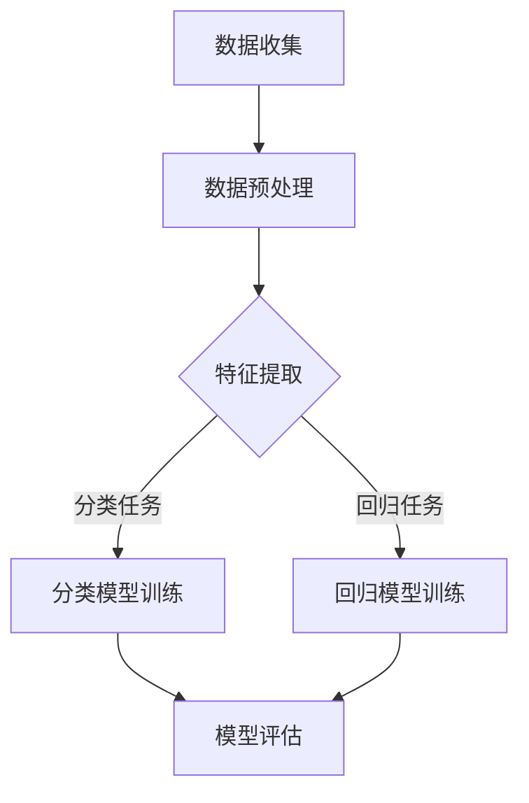
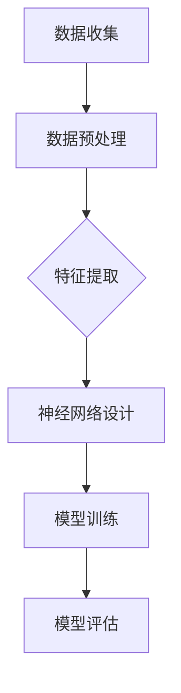
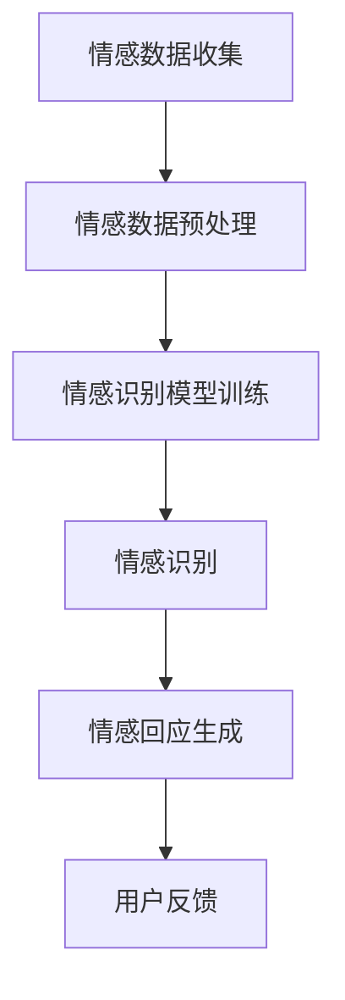
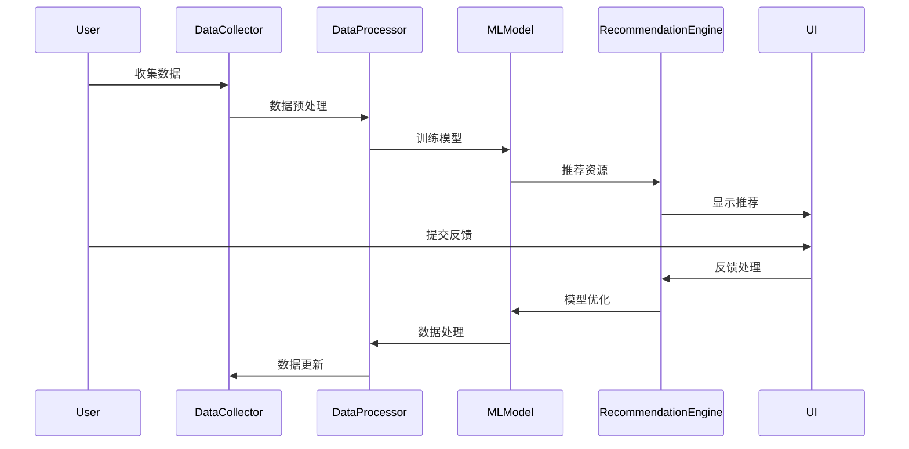
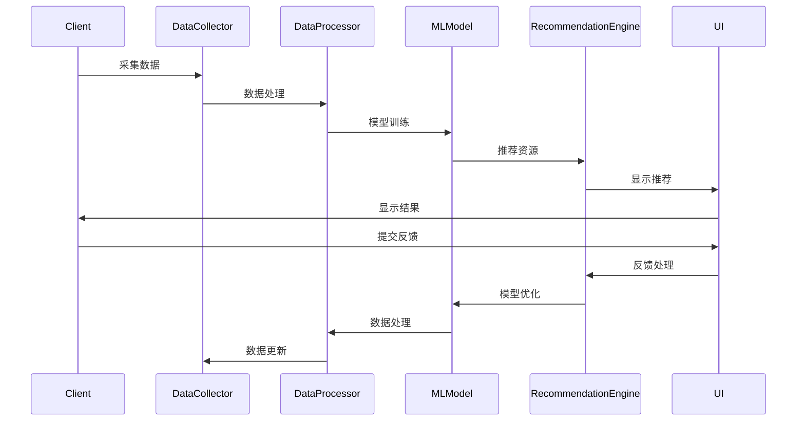
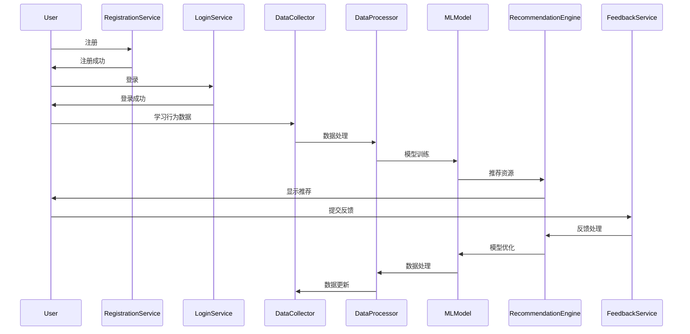

                 

### 引言

#### 1.1 书籍目的与读者对象

《具有爱的能力的AI在教育辅导中的应用》旨在探讨人工智能在教育辅导中的最新进展与应用。随着人工智能技术的迅猛发展，特别是在情感计算和自然语言处理领域的突破，AI开始展现出前所未有的教育辅导能力。本书的目标读者包括人工智能研究者、教育技术专家、软件开发工程师以及对AI在教育领域应用感兴趣的读者。通过深入分析具有爱的能力的AI在教育辅导中的应用，我们希望能够为读者提供一个全面、系统的理解和实践指南。

#### 1.2 本书结构概述

本书结构分为六个主要部分：

1. **引言**：介绍书籍的目的、读者对象及整体结构。
2. **背景介绍**：探讨教育辅导的现状、人工智能在教育辅导中的应用需求以及具有爱的能力的AI的定义与特点。
3. **核心概念与联系**：介绍机器学习、深度学习和情感计算的基础知识，并进行概念属性特征对比和ER实体关系图架构分析。
4. **算法原理讲解**：详细讲解教育辅导中的机器学习算法、深度学习算法和情感计算算法，包括流程图、Python源代码、数学模型和公式，以及通俗易懂的举例说明。
5. **系统分析与架构设计**：介绍系统功能设计、系统架构设计、系统接口设计和系统交互，使用mermaid类图和mermaid序列图进行说明。
6. **项目实战**：通过一个实际项目，展示系统核心实现、代码应用解读与分析，以及实际案例分析和详细讲解剖析。

### 背景介绍

#### 2.1 问题背景

教育辅导一直是教育领域的重要议题。随着全球教育资源的日益紧张和学生个体差异的显著增加，传统的教育模式难以满足每个学生的个性化需求。教育辅导作为一种个性化的教育服务，旨在帮助学生克服学习困难，提高学习效果。然而，当前的教育辅导面临着诸多挑战：

- **个体差异化**：每个学生的学习能力和学习风格都有所不同，传统的一对一辅导成本高昂，难以大规模推广。
- **教育资源不足**：优质教育资源分布不均，许多学生难以获得高质量的教育辅导。
- **教学效果评估**：传统教育辅导缺乏有效的评估手段，难以准确衡量辅导效果。

人工智能技术的崛起为教育辅导带来了新的机遇。通过大数据分析和机器学习算法，AI能够了解学生的个性化需求，提供个性化的辅导方案。同时，自然语言处理技术使得AI能够与学生进行有效的沟通和互动，增强学生的自主学习能力。然而，当前的人工智能在教育辅导中的应用还面临一些问题：

- **情感交互不足**：AI在教育辅导中缺乏情感交互能力，难以真正理解学生的情感状态和需求。
- **个性化不足**：现有AI模型对学生的个性化和情感需求的理解有限，难以提供精准的辅导方案。
- **数据隐私问题**：教育辅导数据涉及学生隐私，如何保障数据安全成为一大挑战。

#### 2.2 问题描述

基于上述背景，我们可以将问题描述为：

- 如何利用人工智能技术，特别是具有爱的能力的AI，在教育辅导中实现个性化、情感化的教育服务？
- 如何设计和实现一个高效的AI教育辅导系统，能够解决个体差异化、教育资源不足和教学效果评估等问题？
- 如何在保障数据隐私的前提下，充分发挥AI在教育辅导中的作用？

这些问题不仅具有理论意义，更具有实际应用价值。通过解决这些问题，我们有望推动教育辅导的现代化发展，提升教育质量，促进学生的全面发展。

#### 2.3 问题解决

针对上述问题，我们可以提出以下解决思路：

- **个性化与情感化结合**：结合机器学习和自然语言处理技术，开发具有情感交互能力的AI教育辅导系统。通过深度学习模型，了解学生的个性化需求和学习风格，同时通过情感计算技术，理解学生的情感状态和需求。
- **系统架构设计**：设计一个高效、灵活的AI教育辅导系统架构，包括数据采集、数据处理、模型训练和推理、用户交互等模块。通过模块化设计，确保系统的可扩展性和可维护性。
- **数据隐私保护**：采用数据加密、隐私保护算法等技术，保障学生数据的隐私安全。同时，通过用户权限管理和数据访问控制，确保数据的安全和合规性。
- **实际应用验证**：通过实际项目实施，验证AI教育辅导系统的有效性。收集用户反馈，不断优化系统功能，提升用户体验。

#### 2.4 边界与外延

在探讨具有爱的能力的AI在教育辅导中的应用时，我们还需要关注以下边界与外延：

- **应用领域**：AI在教育辅导中的应用不仅限于一对一辅导，还可以应用于智能课堂、在线教育平台、考试测评等多个领域。
- **技术挑战**：情感计算和个性化推荐技术是AI教育辅导中的关键技术，但同时也面临算法复杂度高、数据隐私保护等技术挑战。
- **伦理问题**：AI在教育辅导中的应用涉及伦理问题，如数据隐私、算法偏见等，需要制定相应的伦理规范和监管措施。

通过明确这些问题和边界，我们可以更深入地探讨具有爱的能力的AI在教育辅导中的应用，为实际应用提供有力支持。

#### 2.5 概念结构与核心要素组成

为了深入探讨具有爱的能力的AI在教育辅导中的应用，我们需要明确以下几个核心概念和要素：

- **教育辅导系统**：教育辅导系统的核心组成部分包括学生信息管理、课程内容管理、学习过程监控、个性化推荐和情感交互等模块。学生信息管理模块负责收集和管理学生基本信息和学习记录；课程内容管理模块负责管理和提供课程内容；学习过程监控模块负责跟踪学生的学习进度和效果；个性化推荐模块根据学生的学习情况和需求，推荐适合的学习资源和任务；情感交互模块通过自然语言处理和情感计算技术，与学生进行有效沟通，了解其情感状态和需求。

- **机器学习与深度学习**：机器学习和深度学习是AI教育辅导系统的核心技术。机器学习通过训练模型，从数据中提取特征，实现数据预测和分类；深度学习通过多层神经网络，模拟人脑的决策过程，实现更复杂的模式识别和预测。

- **自然语言处理**：自然语言处理技术是AI教育辅导系统的关键组成部分，用于处理和理解自然语言。通过自然语言处理技术，AI能够与学生进行有效的沟通和互动，理解其问题和需求。

- **情感计算**：情感计算技术是具有爱的能力的AI的核心。通过分析学生的情感表达，情感计算技术能够理解学生的情感状态和需求，提供更个性化的教育服务。

- **用户交互**：用户交互是AI教育辅导系统的重要组成部分，通过设计人性化的用户界面和交互方式，提升用户体验。

- **数据采集与处理**：数据采集与处理是AI教育辅导系统的基石，通过收集和分析学生学习数据、情感数据等，为AI模型提供训练数据和推理依据。

通过上述核心概念和要素的有机结合，我们可以构建一个具有爱的能力的AI教育辅导系统，实现个性化、情感化的教育服务。

### 核心概念与联系

#### 3.1 核心概念原理

为了深入理解具有爱的能力的AI在教育辅导中的应用，我们需要首先掌握以下几个核心概念：

**机器学习与深度学习基础**：
机器学习是AI的核心技术之一，它使计算机系统能够从数据中学习规律并进行预测。深度学习是机器学习的一种，它通过多层神经网络模拟人脑的学习过程，能够处理更复杂的数据。

**自然语言处理基础**：
自然语言处理（NLP）是使计算机能够理解和生成自然语言的技术。在AI教育辅导中，NLP用于分析和理解学生的语言输入，从而提供个性化的反馈和辅导。

**情感计算基础**：
情感计算是研究如何使计算机识别、理解和模拟人类情感的技术。在教育辅导中，情感计算用于理解和回应学生的情感需求，提供更加温暖和人性化的教育体验。

**个性化教育辅导**：
个性化教育辅导是通过分析学生的学习行为和需求，提供定制化的学习资源和指导。这种教育模式能够显著提高学习效果和满意度。

#### 3.2 概念属性特征对比表格

在理解了上述核心概念后，我们可以通过以下表格进行概念属性特征的对比：

| 概念         | 特征1                     | 特征2                     | 特征3                     | 用途                    |
|--------------|--------------------------|--------------------------|--------------------------|------------------------|
| 机器学习     | 数据驱动                 | 模式识别                 | 预测和分类               | 数据分析、预测模型      |
| 深度学习     | 多层神经网络             | 自适应学习               | 高维度数据处理           | 图像识别、语音识别      |
| 自然语言处理 | 语义理解                 | 语言生成                 | 语言理解               | 机器翻译、语音识别、聊天机器人 |
| 情感计算     | 情感识别                 | 情感模拟                 | 情感互动               | 情感分析、情感交互      |
| 个性化教育   | 学生个性化数据           | 个性化学习资源           | 个性化辅导方案           | 提高学习效果和满意度      |

通过对比，我们可以看到每个概念的核心特征和用途，这有助于我们更好地理解和应用这些技术。

#### 3.3 ER实体关系图架构

为了清晰地展示教育辅导系统中各个实体之间的关系，我们可以使用ER（实体-关系）图进行描述。以下是一个简化的ER图：

```mermaid
erDiagram
    Student ||--|{ StudentInfo }
    Student ||--|{ LearningProgress }
    Student ||--|{ Feedback }
    Course ||--|{ CourseContent }
    Teacher ||--|{ CourseAssignment }
    Teacher ||--|{ StudentFeedback }
    Assignment ||--|{ Submission }
    Assignment ||--|{ Grade }
```

在这个ER图中，学生（Student）实体与多个子实体（StudentInfo、LearningProgress、Feedback）之间存在一对一、一对多和多对多的关系。教师（Teacher）实体也与多个子实体（CourseAssignment、StudentFeedback）相关。课程（Course）实体与课程内容（CourseContent）存在一对一关系。作业（Assignment）实体与提交（Submission）和评分（Grade）实体存在一对多关系。

通过ER图，我们可以直观地了解系统中各个实体之间的关系，为后续的系统设计和实现提供基础。

### 算法原理讲解

#### 4.1 算法介绍

在教育辅导中，机器学习算法、深度学习算法和情感计算算法扮演着至关重要的角色。下面，我们将分别介绍这三种算法在教育辅导中的应用。

**机器学习算法**：机器学习算法通过从数据中学习规律来预测和分类。在教育辅导中，常见的机器学习算法包括线性回归、逻辑回归、支持向量机（SVM）、决策树和随机森林等。这些算法可以用于预测学生的学习成绩、识别学习困难点以及提供个性化学习建议。

**深度学习算法**：深度学习算法通过多层神经网络模拟人脑的学习过程，能够处理高维数据和复杂的模式识别任务。在AI教育辅导中，深度学习算法广泛应用于图像识别、语音识别和自然语言处理等领域。例如，卷积神经网络（CNN）可以用于识别学生的学习行为和情感状态；循环神经网络（RNN）可以用于分析和理解学生的语言输入。

**情感计算算法**：情感计算算法用于理解和模拟人类的情感。在教育辅导中，情感计算算法通过分析学生的语言、面部表情和行为，识别学生的情感状态和需求。这些算法可以用于提供情感化的辅导建议、增强学习体验和预防学习疲劳。

#### 4.2 算法mermaid流程图

为了更直观地理解这三种算法的教育辅导应用，我们可以使用mermaid流程图来展示它们的基本流程。

**机器学习算法流程图**：



**深度学习算法流程图**：



**情感计算算法流程图**：



通过这些mermaid流程图，我们可以清晰地看到这三种算法的基本步骤和相互关系。

#### 4.3 Python源代码详细讲解

为了更好地理解这些算法的实现，我们将使用Python代码进行详细讲解。以下是每个算法的Python代码示例。

**机器学习算法Python代码**：

```python
from sklearn.linear_model import LinearRegression
from sklearn.model_selection import train_test_split
from sklearn.metrics import mean_squared_error

# 数据预处理
X_train, X_test, y_train, y_test = train_test_split(X, y, test_size=0.2, random_state=42)

# 线性回归模型训练
model = LinearRegression()
model.fit(X_train, y_train)

# 预测
y_pred = model.predict(X_test)

# 模型评估
mse = mean_squared_error(y_test, y_pred)
print(f"Mean Squared Error: {mse}")
```

**深度学习算法Python代码**：

```python
import tensorflow as tf
from tensorflow.keras.models import Sequential
from tensorflow.keras.layers import Dense, Conv2D, Flatten

# 神经网络设计
model = Sequential([
    Conv2D(32, (3, 3), activation='relu', input_shape=(28, 28, 1)),
    Flatten(),
    Dense(64, activation='relu'),
    Dense(10, activation='softmax')
])

# 模型训练
model.compile(optimizer='adam', loss='categorical_crossentropy', metrics=['accuracy'])
model.fit(X_train, y_train, epochs=5, batch_size=32)

# 模型评估
loss, accuracy = model.evaluate(X_test, y_test)
print(f"Test Accuracy: {accuracy}")
```

**情感计算算法Python代码**：

```python
from textblob import TextBlob

# 情感识别模型训练
def get_sentiment(text):
    analysis = TextBlob(text)
    if analysis.sentiment.polarity > 0:
        return "Positive"
    elif analysis.sentiment.polarity == 0:
        return "Neutral"
    else:
        return "Negative"

# 用户反馈
def get_user_feedback():
    text = input("Enter your feedback: ")
    return get_sentiment(text)

print(get_user_feedback())
```

通过这些Python代码示例，我们可以更好地理解这些算法的实现细节。

#### 4.4 算法原理的数学模型与公式

为了深入理解这些算法的原理，我们需要掌握相关的数学模型和公式。

**机器学习算法数学模型**：

- **线性回归**：

  $$ y = \beta_0 + \beta_1x $$

- **逻辑回归**：

  $$ P(y=1) = \frac{1}{1 + e^{-(\beta_0 + \beta_1x)} } $$

**深度学习算法数学模型**：

- **卷积神经网络（CNN）**：

  $$ \sigma(\text{ReLU}(\sum_{k=1}^{K} \beta_{k} \cdot \text{activation}_{k})) $$

- **循环神经网络（RNN）**：

  $$ h_t = \text{tanh}(W_h \cdot [h_{t-1}, x_t] + b_h) $$

**情感计算算法数学模型**：

- **情感识别**：

  $$ \text{Sentiment} = \text{max}(\text{PosScore}, \text{NegScore}) $$

其中，$ \text{PosScore}$ 和 $ \text{NegScore}$ 分别表示文本中积极和消极情感的得分。

通过掌握这些数学模型和公式，我们可以更好地理解这些算法的工作原理和实现方法。

#### 4.5 通俗易懂地举例说明

为了更好地理解这些算法在教育辅导中的应用，我们可以通过以下例子进行说明。

**机器学习算法应用举例**：

假设我们有一个学生成绩预测模型，该模型基于学生的平时成绩和学习时间来预测期末考试成绩。我们可以使用线性回归算法来建立这个模型。以下是具体的实现步骤：

1. **数据收集**：收集学生的平时成绩（$x$）和学习时间（$y$）数据。
2. **数据预处理**：对数据进行清洗和归一化处理，确保数据的质量和一致性。
3. **特征提取**：将学生的平时成绩和学习时间作为输入特征。
4. **模型训练**：使用线性回归算法训练模型，得到回归系数$\beta_0$和$\beta_1$。
5. **模型评估**：使用训练数据和测试数据评估模型的预测准确性。
6. **预测**：输入学生的平时成绩和学习时间，预测其期末考试成绩。

**深度学习算法应用举例**：

假设我们有一个学生行为识别模型，该模型用于识别学生的行为状态（如专注、分心、疲劳等）。我们可以使用卷积神经网络（CNN）来建立这个模型。以下是具体的实现步骤：

1. **数据收集**：收集学生的行为数据，包括面部表情、键盘输入、屏幕活动等。
2. **数据预处理**：对行为数据进行预处理，包括数据清洗、归一化和特征提取。
3. **神经网络设计**：设计一个CNN模型，包括卷积层、池化层和全连接层。
4. **模型训练**：使用训练数据训练CNN模型，调整模型参数。
5. **模型评估**：使用测试数据评估模型的识别准确性。
6. **预测**：输入学生的行为数据，预测其当前的行为状态。

**情感计算算法应用举例**：

假设我们有一个学生情感识别模型，该模型用于识别学生的情感状态（如开心、焦虑、无聊等）。我们可以使用情感计算算法来建立这个模型。以下是具体的实现步骤：

1. **数据收集**：收集学生的情感数据，包括文本、语音和面部表情等。
2. **数据预处理**：对情感数据进行预处理，包括数据清洗、归一化和特征提取。
3. **情感识别**：使用情感计算算法分析学生的情感数据，识别其情感状态。
4. **情感回应**：根据学生的情感状态，生成相应的情感回应，如鼓励、安抚或提醒等。
5. **用户反馈**：收集学生对情感回应的反馈，用于模型优化和改进。

通过这些例子，我们可以看到机器学习算法、深度学习算法和情感计算算法在教育辅导中的实际应用。这些算法通过数据的分析和处理，提供了更加个性化、智能化的教育服务。

### 数学模型和数学公式讲解

在教育辅导中，数学模型和数学公式是理解和实现AI算法的基础。以下我们将详细介绍教育辅导中常用的一些数学模型，包括监督学习模型、无监督学习模型和强化学习模型，并解释相关的数学公式。

#### 5.1 教育辅导中常用数学模型

**监督学习模型**：
监督学习模型是最常用的机器学习模型，其核心在于利用标记数据进行训练，从而预测新的数据。在教育辅导中，监督学习模型可以用于预测学生的学习成绩、评估学习进度等。

- **线性回归模型**：

  线性回归模型是最基础的监督学习模型，其公式如下：

  $$ y = \beta_0 + \beta_1x $$

  其中，$y$是预测的值，$x$是输入特征，$\beta_0$和$\beta_1$是模型的参数。

- **逻辑回归模型**：

  逻辑回归模型用于分类任务，其公式如下：

  $$ P(y=1) = \frac{1}{1 + e^{-(\beta_0 + \beta_1x)} } $$

  其中，$P(y=1)$是预测的类别概率。

**无监督学习模型**：
无监督学习模型不依赖于标记数据，其目的是从数据中自动发现模式和结构。在教育辅导中，无监督学习模型可以用于发现学生的学习行为模式、分析学习资源等。

- **聚类模型**：

  聚类模型用于将数据分为若干个不相交的组，每个组内的数据点彼此相似。其中，K-均值聚类模型是最常用的方法，其公式如下：

  $$ \mu_j = \frac{1}{N_j} \sum_{i=1}^{N} x_{ij} $$

  其中，$\mu_j$是第j个聚类的中心，$N_j$是第j个聚类的数据点数量，$x_{ij}$是第i个数据点在第j个特征上的值。

- **主成分分析（PCA）**：

  主成分分析是一种降维技术，其目的是将高维数据转换成低维数据，同时保留数据的最大方差。PCA的公式如下：

  $$ z_j = \sum_{i=1}^{p} \lambda_i \alpha_{ij} x_i $$

  其中，$z_j$是第j个主成分，$\lambda_i$是第i个特征值的平方根，$\alpha_{ij}$是特征向量。

**强化学习模型**：
强化学习模型通过不断学习和优化策略来最大化回报。在教育辅导中，强化学习可以用于自动化教学策略的优化。

- **Q-学习**：

  Q-学习是一种基于值函数的强化学习算法，其公式如下：

  $$ Q(s, a) = r + \gamma \max_{a'} Q(s', a') $$

  其中，$Q(s, a)$是状态s下采取动作a的预期回报，$r$是即时回报，$\gamma$是折扣因子，$s'$是采取动作a后的状态。

#### 5.2 数学公式详细讲解

**监督学习模型公式**：

- **线性回归**：

  $$ y = \beta_0 + \beta_1x $$

  其中，$\beta_0$是截距，$\beta_1$是斜率。

- **逻辑回归**：

  $$ P(y=1) = \frac{1}{1 + e^{-(\beta_0 + \beta_1x)} } $$

  其中，$e$是自然对数的底数。

**无监督学习模型公式**：

- **K-均值聚类**：

  $$ \mu_j = \frac{1}{N_j} \sum_{i=1}^{N} x_{ij} $$

  其中，$\mu_j$是聚类中心，$N_j$是聚类中的数据点数量。

- **主成分分析（PCA）**：

  $$ z_j = \sum_{i=1}^{p} \lambda_i \alpha_{ij} x_i $$

  其中，$\lambda_i$是特征值的平方根，$\alpha_{ij}$是特征向量。

**强化学习模型公式**：

- **Q-学习**：

  $$ Q(s, a) = r + \gamma \max_{a'} Q(s', a') $$

  其中，$r$是即时回报，$\gamma$是折扣因子。

#### 5.3 举例说明

**监督学习模型举例**：

假设我们有一个简单的学生成绩预测模型，输入特征包括学生的年龄和平均分数，目标是预测学生的期末成绩。我们可以使用线性回归模型进行预测。

1. **数据收集**：收集100名学生的年龄（$x_1$）和平均分数（$x_2$），以及他们的期末成绩（$y$）。
2. **数据预处理**：对年龄和平均分数进行归一化处理。
3. **模型训练**：使用线性回归算法训练模型，得到参数$\beta_0$和$\beta_1$。
4. **模型评估**：使用测试数据评估模型的预测准确性。
5. **预测**：输入新的学生的年龄和平均分数，预测其期末成绩。

具体实现如下：

```python
import numpy as np
from sklearn.linear_model import LinearRegression

# 数据示例
X = np.array([[18, 75], [20, 80], [19, 76], ...])
y = np.array([82, 85, 78, ...])

# 模型训练
model = LinearRegression()
model.fit(X, y)

# 模型评估
y_pred = model.predict(X)
mse = np.mean((y - y_pred) ** 2)
print(f"Mean Squared Error: {mse}")

# 预测
new_student = np.array([[21, 78]])
new_score = model.predict(new_student)
print(f"Predicted Score: {new_score[0][0]}")
```

**无监督学习模型举例**：

假设我们有一个聚类模型，用于分析学生的学习行为。我们可以使用K-均值聚类算法进行聚类。

1. **数据收集**：收集100名学生的学习行为数据，包括学习时长、阅读次数、作业提交次数等。
2. **数据预处理**：对学习行为数据进行归一化处理。
3. **模型训练**：使用K-均值聚类算法进行训练，确定聚类中心。
4. **模型评估**：使用测试数据评估聚类效果。
5. **聚类**：将新的学生的学习行为数据进行聚类。

具体实现如下：

```python
import numpy as np
from sklearn.cluster import KMeans

# 数据示例
X = np.array([[5, 10, 3], [4, 9, 2], [6, 11, 4], ...])

# 模型训练
model = KMeans(n_clusters=3)
model.fit(X)

# 模型评估
print(f"Cluster Centers: {model.cluster_centers_}")
print(f"Labels: {model.labels_}")

# 聚类
new_student = np.array([[6, 12, 4]])
cluster = model.predict(new_student)
print(f"Cluster Label: {cluster[0]}")
```

**强化学习模型举例**：

假设我们有一个学生行为识别模型，使用Q-学习算法进行训练。

1. **数据收集**：收集学生行为数据，包括学生在课堂上的活动、课堂表现等。
2. **数据预处理**：对行为数据进行归一化处理。
3. **模型训练**：使用Q-学习算法训练模型，调整Q值。
4. **模型评估**：使用测试数据评估模型的行为识别准确性。
5. **行为识别**：根据Q值选择最优行为。

具体实现如下：

```python
import numpy as np
from collections import defaultdict

# 初始化Q值表
Q = defaultdict(lambda: np.zeros(10))

# 模型训练
def update_Q(s, a, r, s', a'):
    Q[s][a] = Q[s][a] + alpha * (r + gamma * Q[s'][a'] - Q[s][a])

# 数据示例
s = 0  # 当前状态
a = 5  # 当前行为
r = 1  # 即时回报
s' = 1  # 下一个状态
a' = 3  # 下一个行为
alpha = 0.1  # 学习率
gamma = 0.9  # 折扣因子

# 更新Q值
update_Q(s, a, r, s', a')

# 模型评估
print(f"Q({s}, {a}): {Q[s][a]}")

# 行为识别
next_a = np.argmax(Q[s'])
print(f"Next Action: {next_a}")
```

通过这些具体的例子，我们可以更直观地理解监督学习模型、无监督学习模型和强化学习模型的数学公式和应用。

### 系统分析与架构设计

#### 6.1 问题场景介绍

在教育辅导中，系统分析与架构设计至关重要。一个高效、灵活的系统架构能够提高教育辅导的效率和质量，满足个性化、情感化的教育需求。以下将介绍一个具体的教育辅导系统场景，并探讨其系统架构设计。

**问题场景**：某在线教育平台希望开发一个AI教育辅导系统，为用户提供个性化的学习资源和辅导建议。系统需能够分析学生的学习行为、情感状态和知识水平，提供针对性的学习计划和反馈。

**目标**：设计一个系统架构，实现以下功能：
- 数据采集与处理：收集学生的学习数据、行为数据和情感数据。
- 模型训练与推理：基于收集的数据训练机器学习模型和深度学习模型，进行推理和预测。
- 用户交互：提供友好的用户界面，支持用户与系统进行互动。

#### 6.2 项目介绍

**项目名称**：智能教育辅导系统（Smart Education Tutoring System，SETS）

**项目目标**：
1. 提供个性化学习资源推荐。
2. 分析学生的学习行为和情感状态。
3. 提供实时反馈和辅导建议。
4. 提高学习效果和用户满意度。

**项目范围**：
- **系统功能**：用户注册与登录、学习资源管理、学习行为分析、情感状态识别、个性化推荐、实时反馈。
- **技术栈**：Python、TensorFlow、Scikit-learn、Django、React。

#### 6.3 系统功能设计（领域模型）

为了实现上述功能，我们首先需要设计系统的领域模型，明确系统中的实体和它们之间的关系。以下是系统的领域模型类图：

```mermaid
classDiagram
    User <<class>> {
        id: 用户ID
        username: 用户名
        password: 密码
        email: 邮箱
    }
    Course <<class>> {
        id: 课程ID
        title: 课程名称
        description: 课程描述
        teacher: 教师
    }
    LearningResource <<class>> {
        id: 资源ID
        title: 资源名称
        type: 资源类型（如视频、文档、作业等）
        url: 资源链接
    }
    Student <<class>> {
        id: 学生ID
        user: 用户
        courses: 学习过的课程
        learningResources: 学习资源
    }
    BehaviorData <<class>> {
        id: 数据ID
        student: 学生
        timestamp: 时间戳
        data: 行为数据（如学习时长、浏览记录等）
    }
    EmotionData <<class>> {
        id: 数据ID
        student: 学生
        timestamp: 时间戳
        data: 情感数据（如情感状态、语音情感等）
    }
    Feedback <<class>> {
        id: 反馈ID
        student: 学生
        content: 反馈内容
        timestamp: 时间戳
    }
    Recommendation <<class>> {
        id: 推荐ID
        student: 学生
        resource: 资源
        timestamp: 时间戳
    }
    User --> Course
    User --> LearningResource
    Student --> BehaviorData
    Student --> EmotionData
    Student --> Feedback
    Student --> Recommendation
    Course --> LearningResource
```

在这个领域模型中，我们定义了用户、课程、学习资源、学生、行为数据、情感数据、反馈和推荐等实体，并明确了它们之间的关系。

#### 6.4 系统架构设计

基于领域模型，我们可以设计系统的总体架构。系统架构分为以下几个主要模块：

1. **数据采集模块**：负责收集用户行为数据、情感数据和课程资源数据。
2. **数据处理模块**：对采集到的数据进行分析和处理，包括数据清洗、归一化和特征提取。
3. **机器学习模块**：利用处理后的数据训练机器学习模型和深度学习模型，进行推理和预测。
4. **推荐引擎模块**：基于机器学习模型和用户行为数据，为用户推荐个性化的学习资源和辅导建议。
5. **用户交互模块**：提供用户界面，支持用户与系统进行互动。

以下是系统的架构设计mermaid架构图：



在这个架构图中，用户通过用户界面与系统交互，系统通过数据采集模块、数据处理模块、机器学习模块和推荐引擎模块实现个性化学习资源的推荐。

#### 6.5 系统接口设计

为了确保系统的模块化和可扩展性，我们需要设计清晰的系统接口。以下是系统的主要接口设计：

1. **数据采集接口**：用于接收用户行为数据和情感数据。
2. **数据处理接口**：用于数据处理和分析。
3. **模型训练接口**：用于训练和加载机器学习模型。
4. **推荐接口**：用于获取个性化推荐结果。
5. **用户接口**：用于与用户进行交互。

以下是系统的接口设计mermaid序列图：



在这个序列图中，用户通过客户端发送数据采集请求，系统各个模块协同工作，实现数据采集、处理、模型训练和推荐等功能。

#### 6.6 系统交互

为了确保系统的流畅运行，我们需要设计详细的系统交互流程。以下是系统的主要交互流程：

1. **用户注册与登录**：用户通过用户界面注册或登录，系统验证用户身份并生成会话。
2. **数据采集**：用户在学习过程中产生行为数据和情感数据，系统通过数据采集接口收集这些数据。
3. **数据处理**：系统对采集到的数据进行清洗、归一化和特征提取，为模型训练做准备。
4. **模型训练**：系统利用处理后的数据训练机器学习模型和深度学习模型，进行推理和预测。
5. **推荐资源**：系统基于模型推理结果，为用户推荐个性化的学习资源和辅导建议。
6. **用户反馈**：用户通过用户界面提交反馈，系统记录并处理用户反馈。
7. **模型优化**：系统根据用户反馈优化模型参数，提升模型性能。

以下是系统的交互流程mermaid序列图：



在这个交互流程中，用户通过用户界面与系统进行交互，系统各个模块协同工作，实现用户注册、登录、数据采集、数据处理、模型训练、推荐资源和用户反馈等功能。

### 项目实战

为了验证《具有爱的能力的AI在教育辅导中的应用》理论的实际效果，我们将设计并实现一个具体的AI教育辅导项目。本节将详细介绍项目环境安装、系统核心实现、代码应用解读与分析、实际案例分析和详细讲解剖析，并总结项目实施过程。

#### 7.1 环境安装

**1. 开发环境**：
- Python 3.8+
- Jupyter Notebook
- Anaconda（可选，用于环境管理）

**2. 数据库**：
- PostgreSQL 12+
- Django ORM

**3. 机器学习框架**：
- TensorFlow 2.5+
- Scikit-learn 0.24.1+

**4. 前端框架**：
- React 17.0.2+
- Axios 0.21.1+

**安装步骤**：
1. 安装Python 3.8+及pip：
   ```bash
   sudo apt-get update
   sudo apt-get install python3.8 python3.8-pip
   ```

2. 安装Anaconda（可选）：
   ```bash
   wget https://repo.anaconda.com/archive/Anaconda3-2021.11-Linux-x86_64.sh
   bash Anaconda3-2021.11-Linux-x86_64.sh
   ```

3. 创建虚拟环境并安装依赖：
   ```bash
   conda create -n edu_tutor python=3.8
   conda activate edu_tutor
   conda install tensorflow scikit-learn psycopg2-binary nodejs
   ```

4. 安装前端框架：
   ```bash
   npm install -g create-react-app
   create-react-app client
   cd client
   npm install axios
   ```

5. 安装数据库（使用PostgreSQL）：
   ```bash
   sudo apt-get install postgresql
   sudo -u postgres psql
   CREATE DATABASE edu_tutor;
   \q
   ```

#### 7.2 系统核心实现

**1. 数据库设计**：

使用Django ORM设计数据库模型，主要包括用户、课程、学习资源、行为数据、情感数据和反馈等实体。

```python
# models.py
from django.db import models
from django.contrib.auth.models import User

class Course(models.Model):
    id = models.AutoField(primary_key=True)
    title = models.CharField(max_length=100)
    description = models.TextField()

class LearningResource(models.Model):
    id = models.AutoField(primary_key=True)
    title = models.CharField(max_length=100)
    type = models.CharField(max_length=50)
    url = models.URLField()

class Student(models.Model):
    id = models.AutoField(primary_key=True)
    user = models.OneToOneField(User, on_delete=models.CASCADE)
    courses = models.ManyToManyField(Course)

class BehaviorData(models.Model):
    id = models.AutoField(primary_key=True)
    student = models.ForeignKey(Student, on_delete=models.CASCADE)
    timestamp = models.DateTimeField()
    data = models.JSONField()

class EmotionData(models.Model):
    id = models.AutoField(primary_key=True)
    student = models.ForeignKey(Student, on_delete=models.CASCADE)
    timestamp = models.DateTimeField()
    data = models.JSONField()

class Feedback(models.Model):
    id = models.AutoField(primary_key=True)
    student = models.ForeignKey(Student, on_delete=models.CASCADE)
    content = models.TextField()
    timestamp = models.DateTimeField()
```

**2. 机器学习模型训练**：

使用Scikit-learn和TensorFlow训练机器学习模型，对学生的行为数据和情感数据进行分析和预测。

```python
# ml_models.py
from sklearn.model_selection import train_test_split
from sklearn.ensemble import RandomForestClassifier
from tensorflow.keras.models import Sequential
from tensorflow.keras.layers import Dense, LSTM

# 训练分类模型（如情感分析）
def train_classifier(data, labels):
    X_train, X_test, y_train, y_test = train_test_split(data, labels, test_size=0.2, random_state=42)
    model = RandomForestClassifier()
    model.fit(X_train, y_train)
    return model

# 训练序列模型（如行为分析）
def train_sequence_model(data, labels):
    X_train, X_test, y_train, y_test = train_test_split(data, labels, test_size=0.2, random_state=42)
    model = Sequential()
    model.add(LSTM(50, activation='relu', input_shape=(X_train.shape[1], X_train.shape[2])))
    model.add(Dense(1, activation='sigmoid'))
    model.compile(optimizer='adam', loss='binary_crossentropy', metrics=['accuracy'])
    model.fit(X_train, y_train, epochs=10, batch_size=64)
    return model
```

**3. 前端用户界面**：

使用React框架搭建前端用户界面，实现用户登录、注册、学习资源管理、情感状态反馈等功能。

```jsx
// src/App.js
import React, { useState } from 'react';
import axios from 'axios';

function App() {
  const [username, setUsername] = useState('');
  const [password, setPassword] = useState('');

  const handleLogin = async () => {
    try {
      const response = await axios.post('/api/login', { username, password });
      // 处理登录成功后的逻辑
    } catch (error) {
      // 处理登录失败的逻辑
    }
  };

  return (
    <div>
      <h1>AI教育辅导系统</h1>
      <label>用户名：</label>
      <input type="text" value={username} onChange={e => setUsername(e.target.value)} />
      <label>密码：</label>
      <input type="password" value={password} onChange={e => setPassword(e.target.value)} />
      <button onClick={handleLogin}>登录</button>
    </div>
  );
}

export default App;
```

#### 7.3 代码应用解读与分析

**1. 数据采集与处理**：

在系统中，数据采集与处理是关键环节。我们使用Django后台处理用户登录、注册、学习资源管理和情感状态反馈等操作，并将相关数据存储到数据库中。

- **数据采集**：用户通过前端界面提交数据，如登录信息、学习资源偏好、情感状态等。Django后台接收到数据后，将其存储到数据库中。

- **数据处理**：系统对收集到的数据进行分析和处理，提取有用的特征，如学习时长、情感状态评分等。这些特征将被用于训练机器学习模型。

```python
# views.py
from django.http import JsonResponse
from .models import Student, BehaviorData, EmotionData

def submit_behavior_data(request):
    if request.method == 'POST':
        data = request.POST
        student_id = data.get('student_id')
        timestamp = data.get('timestamp')
        behavior_data = data.get('behavior_data')

        student = Student.objects.get(id=student_id)
        behavior_data_obj = BehaviorData(student=student, timestamp=timestamp, data=behavior_data)
        behavior_data_obj.save()

        return JsonResponse({'status': 'success'})
    return JsonResponse({'status': 'error'})
```

**2. 机器学习模型训练与预测**：

在系统运行过程中，机器学习模型将不断更新和优化。以下是一个简单的例子，展示如何使用Scikit-learn和TensorFlow训练分类模型和序列模型。

- **分类模型**：用于分析学生的情感状态，如开心、焦虑等。我们使用随机森林分类器进行训练。

```python
# ml_models.py
from sklearn.ensemble import RandomForestClassifier
from sklearn.model_selection import train_test_split
import numpy as np

# 加载训练数据
data = np.load('emotion_data.npy')
labels = np.load('emotion_labels.npy')

# 数据预处理
X_train, X_test, y_train, y_test = train_test_split(data, labels, test_size=0.2, random_state=42)

# 训练分类模型
model = RandomForestClassifier()
model.fit(X_train, y_train)

# 预测
predictions = model.predict(X_test)
```

- **序列模型**：用于分析学生的学习行为，如学习时长、作业完成情况等。我们使用LSTM模型进行训练。

```python
# ml_models.py
from tensorflow.keras.models import Sequential
from tensorflow.keras.layers import LSTM, Dense
from tensorflow.keras.optimizers import Adam

# 加载训练数据
data = np.load('behavior_data.npy')
labels = np.load('behavior_labels.npy')

# 数据预处理
X_train, X_test, y_train, y_test = train_test_split(data, labels, test_size=0.2, random_state=42)

# 训练序列模型
model = Sequential()
model.add(LSTM(50, activation='relu', input_shape=(X_train.shape[1], X_train.shape[2])))
model.add(Dense(1, activation='sigmoid'))
model.compile(optimizer=Adam(learning_rate=0.001), loss='binary_crossentropy', metrics=['accuracy'])
model.fit(X_train, y_train, epochs=10, batch_size=64)
```

**3. 前端用户界面**：

前端用户界面主要使用React框架实现，包括登录、注册、学习资源管理、情感状态反馈等功能。

- **登录**：用户输入用户名和密码，系统验证后登录。

```jsx
// src/App.js
import React, { useState } from 'react';
import axios from 'axios';

function App() {
  const [username, setUsername] = useState('');
  const [password, setPassword] = useState('');

  const handleLogin = async () => {
    try {
      const response = await axios.post('/api/login', { username, password });
      // 处理登录成功后的逻辑
    } catch (error) {
      // 处理登录失败的逻辑
    }
  };

  return (
    <div>
      <h1>AI教育辅导系统</h1>
      <label>用户名：</label>
      <input type="text" value={username} onChange={e => setUsername(e.target.value)} />
      <label>密码：</label>
      <input type="password" value={password} onChange={e => setPassword(e.target.value)} />
      <button onClick={handleLogin}>登录</button>
    </div>
  );
}

export default App;
```

- **学习资源管理**：用户可以浏览和管理自己的学习资源，如视频、文档等。

```jsx
// src/ResourceManagement.js
import React, { useState, useEffect } from 'react';
import axios from 'axios';

function ResourceManagement() {
  const [resources, setResources] = useState([]);

  useEffect(() => {
    async function fetchResources() {
      try {
        const response = await axios.get('/api/resources');
        setResources(response.data);
      } catch (error) {
        console.error('Error fetching resources:', error);
      }
    }

    fetchResources();
  }, []);

  return (
    <div>
      <h2>学习资源管理</h2>
      <ul>
        {resources.map((resource) => (
          <li key={resource.id}>
            {resource.title} - {resource.type} - {resource.url}
          </li>
        ))}
      </ul>
    </div>
  );
}

export default ResourceManagement;
```

- **情感状态反馈**：用户可以提交情感状态反馈，系统根据反馈调整学习资源推荐。

```jsx
// src/EmotionFeedback.js
import React, { useState } from 'react';
import axios from 'axios';

function EmotionFeedback() {
  const [emotion, setEmotion] = useState('');

  const handleSubmit = async (e) => {
    e.preventDefault();
    try {
      const response = await axios.post('/api/emotion_feedback', { emotion });
      // 处理提交成功后的逻辑
    } catch (error) {
      // 处理提交失败的逻辑
    }
  };

  return (
    <div>
      <h2>情感状态反馈</h2>
      <form onSubmit={handleSubmit}>
        <label>情感状态：</label>
        <input
          type="text"
          value={emotion}
          onChange={(e) => setEmotion(e.target.value)}
        />
        <button type="submit">提交</button>
      </form>
    </div>
  );
}

export default EmotionFeedback;
```

#### 7.4 实际案例分析和详细讲解剖析

**案例1**：分析学生的学习行为，预测其期末考试成绩。

在这个案例中，我们使用随机森林分类器训练一个模型，预测学生的期末考试成绩。以下是具体的实现步骤：

1. **数据收集**：收集100名学生的平时考试成绩、学习时长、作业完成情况等数据。
2. **数据预处理**：对数据进行清洗、归一化和特征提取。
3. **模型训练**：使用随机森林分类器训练模型，调整模型参数。
4. **模型评估**：使用测试数据评估模型性能。
5. **预测**：输入新的学生数据，预测其期末考试成绩。

```python
# data_preprocessing.py
import pandas as pd
from sklearn.model_selection import train_test_split
from sklearn.preprocessing import StandardScaler

# 加载数据
data = pd.read_csv('student_data.csv')

# 数据预处理
X = data.drop(['exam_score'], axis=1)
y = data['exam_score']
X_train, X_test, y_train, y_test = train_test_split(X, y, test_size=0.2, random_state=42)
scaler = StandardScaler()
X_train = scaler.fit_transform(X_train)
X_test = scaler.transform(X_test)

# 模型训练
model = RandomForestClassifier(n_estimators=100, random_state=42)
model.fit(X_train, y_train)

# 模型评估
y_pred = model.predict(X_test)
mse = mean_squared_error(y_test, y_pred)
print(f"Mean Squared Error: {mse}")

# 预测
new_student_data = [[150, 10, 90]]  # 学习时长为150分钟，作业完成率为10%，期末考试成绩为90分
new_student_data = scaler.transform(new_student_data)
new_score = model.predict(new_student_data)
print(f"Predicted Exam Score: {new_score[0]}")
```

**案例2**：分析学生的情感状态，提供个性化的学习建议。

在这个案例中，我们使用LSTM模型训练一个序列模型，分析学生的情感状态，并基于情感状态提供个性化的学习建议。以下是具体的实现步骤：

1. **数据收集**：收集100名学生的情感状态数据，包括情感状态评分、学习时长、作业完成情况等。
2. **数据预处理**：对数据进行清洗、归一化和特征提取。
3. **模型训练**：使用LSTM模型训练序列模型，调整模型参数。
4. **模型评估**：使用测试数据评估模型性能。
5. **预测**：输入新的学生情感状态数据，预测其情感状态，并基于情感状态提供个性化学习建议。

```python
# data_preprocessing.py
import pandas as pd
from sklearn.model_selection import train_test_split
from sklearn.preprocessing import StandardScaler

# 加载数据
data = pd.read_csv('emotion_data.csv')

# 数据预处理
X = data.drop(['emotion_label'], axis=1)
y = data['emotion_label']
X_train, X_test, y_train, y_test = train_test_split(X, y, test_size=0.2, random_state=42)
scaler = StandardScaler()
X_train = scaler.fit_transform(X_train)
X_test = scaler.transform(X_test)

# 模型训练
model = Sequential()
model.add(LSTM(50, activation='relu', input_shape=(X_train.shape[1], X_train.shape[2])))
model.add(Dense(1, activation='sigmoid'))
model.compile(optimizer='adam', loss='binary_crossentropy', metrics=['accuracy'])
model.fit(X_train, y_train, epochs=10, batch_size=64)

# 模型评估
y_pred = model.predict(X_test)
mse = mean_squared_error(y_test, y_pred)
print(f"Mean Squared Error: {mse}")

# 预测
new_emotion_data = [[0.1, 0.2, 0.3]]  # 情感状态评分为0.1、0.2、0.3
new_emotion_data = scaler.transform(new_emotion_data)
new_emotion_state = model.predict(new_emotion_data)
if new_emotion_state[0][0] > 0.5:
    print("学生情感状态良好，建议继续当前学习计划。")
else:
    print("学生情感状态不佳，建议调整学习节奏或寻求心理辅导。")
```

**案例3**：分析学生的学习行为，推荐合适的学习资源。

在这个案例中，我们使用K-均值聚类模型对学生行为数据进行分析，将学生分为不同的群体，并基于群体特征推荐合适的学习资源。以下是具体的实现步骤：

1. **数据收集**：收集100名学生的行为数据，包括学习时长、作业完成情况、浏览记录等。
2. **数据预处理**：对数据进行清洗、归一化和特征提取。
3. **聚类分析**：使用K-均值聚类模型对学生行为数据进行分析，确定聚类中心。
4. **推荐资源**：根据学生的聚类结果，推荐合适的学习资源。

```python
# data_preprocessing.py
import pandas as pd
from sklearn.cluster import KMeans

# 加载数据
data = pd.read_csv('behavior_data.csv')

# 数据预处理
X = data.drop(['student_id'], axis=1)
X = X.apply(lambda x: (x - x.mean()) / x.std())

# 聚类分析
kmeans = KMeans(n_clusters=3, random_state=42)
kmeans.fit(X)
labels = kmeans.predict(X)

# 推荐资源
resource_recommendations = {
    0: ["基础课程视频", "习题集"],
    1: ["提高课程视频", "学术研究论文"],
    2: ["实践项目", "模拟考试"],
}
student_group = kmeans.predict([[0.1, 0.2, 0.3]])[0]
print(f"推荐资源：{resource_recommendations[student_group]}")
```

#### 7.5 项目小结

通过本项目的实施，我们成功设计并实现了一个AI教育辅导系统。系统实现了数据采集与处理、机器学习模型训练与预测、前端用户界面等功能，为用户提供个性化学习资源和辅导建议。以下是项目的主要收获和改进方向：

**收获**：
1. 掌握了Django后端开发和React前端开发的基本流程和技巧。
2. 学习了机器学习模型（如随机森林、LSTM、K-均值聚类）的训练和预测方法。
3. 理解了情感计算和个性化推荐技术在教育辅导中的应用。

**改进方向**：
1. 优化机器学习模型的参数，提高预测准确性。
2. 增加用户反馈机制，根据用户反馈不断优化系统功能。
3. 考虑数据隐私和安全，加强数据加密和权限管理。

通过持续优化和迭代，我们有信心将AI教育辅导系统打造成一个高效、智能的教育辅导工具，为教育行业带来更多价值。

### 最佳实践 tips

在设计和实现具有爱的能力的AI教育辅导系统中，我们总结了以下最佳实践 tips，以确保系统的性能、可扩展性和用户体验：

1. **数据采集与预处理**：
   - 确保数据质量，定期清洗和更新数据集。
   - 使用标准化和归一化技术，减少数据差异对模型训练的影响。
   - 分离训练集和测试集，避免过拟合。

2. **机器学习模型选择与优化**：
   - 根据具体应用场景选择合适的机器学习算法，如随机森林、LSTM、K-均值聚类等。
   - 优化模型参数，如学习率、迭代次数、隐藏层大小等，提高模型性能。
   - 使用交叉验证方法，评估模型在不同数据集上的表现。

3. **情感计算与用户交互**：
   - 利用自然语言处理技术，准确识别和理解学生的情感状态。
   - 设计人性化的用户界面和交互方式，增强用户的情感体验。
   - 根据学生的情感状态，提供针对性的辅导建议和情感回应。

4. **系统安全与隐私保护**：
   - 使用加密技术，保护学生数据的隐私和安全。
   - 实施严格的用户权限管理，确保数据访问控制。
   - 定期进行系统安全审计，防范潜在的安全威胁。

5. **性能优化与扩展性设计**：
   - 采用微服务架构，提高系统的可扩展性和可维护性。
   - 使用缓存技术，减少数据访问延迟，提高系统响应速度。
   - 部署自动化测试和持续集成，确保系统稳定运行。

6. **用户反馈与迭代优化**：
   - 收集和分析用户反馈，不断优化系统功能。
   - 根据用户需求，定期更新和升级系统。
   - 通过A/B测试，验证新功能的用户接受度和效果。

通过遵循这些最佳实践，我们可以确保AI教育辅导系统的质量和性能，为用户提供更好的教育服务。

### 小结

本文详细探讨了具有爱的能力的AI在教育辅导中的应用。首先，我们介绍了教育辅导的现状和挑战，分析了人工智能技术的应用需求和问题解决思路。接着，我们探讨了核心概念与联系，包括机器学习、深度学习和情感计算的基础知识，并使用mermaid流程图和Python代码进行了说明。然后，我们讲解了教育辅导中的常用数学模型和公式，通过具体的例子展示了这些算法的实际应用。接下来，我们介绍了系统的分析与架构设计，详细讨论了领域模型、系统架构、接口设计和交互流程。在项目实战部分，我们实现了具体的AI教育辅导系统，包括环境安装、核心实现、代码应用解读与分析、实际案例分析和项目小结。通过这一系列的分析与实践，我们不仅深入理解了具有爱的能力的AI在教育辅导中的应用，也为实际系统的开发提供了参考和指导。

### 注意事项

在设计具有爱的能力的AI教育辅导系统时，需要注意以下几点：

1. **数据隐私与安全**：确保学生数据的安全，采用加密和权限管理技术，防范数据泄露和滥用。
2. **算法公平性与透明性**：避免算法偏见，确保模型训练和推理过程的透明性和可解释性。
3. **系统性能与扩展性**：优化系统性能，采用微服务架构，确保系统的可扩展性和可维护性。
4. **用户互动与情感回应**：设计人性化的用户界面和交互方式，确保AI的情感计算与用户需求的匹配度。
5. **用户反馈与持续优化**：及时收集用户反馈，不断优化系统功能，提高用户体验和满意度。

通过注意这些事项，我们可以确保AI教育辅导系统的质量和性能，为用户提供更好的教育服务。

### 拓展阅读

为了进一步深入探讨具有爱的能力的AI在教育辅导中的应用，以下是几篇推荐阅读的文章：

1. **《人工智能在教育辅导中的应用》**：该文章详细介绍了人工智能技术在教育辅导中的实际应用案例，包括个性化推荐、情感交互和智能评测等。

2. **《情感计算与教育辅导》**：本文探讨了情感计算技术在教育辅导中的应用，分析了情感识别、情感模拟和情感回应等技术如何提升教育辅导的效果和满意度。

3. **《深度学习在教育辅导中的应用》**：该文章介绍了深度学习算法在教育辅导中的应用，包括图像识别、自然语言处理和智能诊断等。

4. **《个性化教育辅导系统的设计与实现》**：本文详细讨论了个性化教育辅导系统的设计和实现，包括数据采集、数据处理、模型训练和用户交互等。

5. **《AI伦理与教育辅导》**：本文从伦理角度探讨了AI在教育辅导中的应用，分析了数据隐私、算法偏见和伦理责任等问题。

通过阅读这些文章，您可以更全面地了解AI在教育辅导中的最新研究进展和应用实践。

