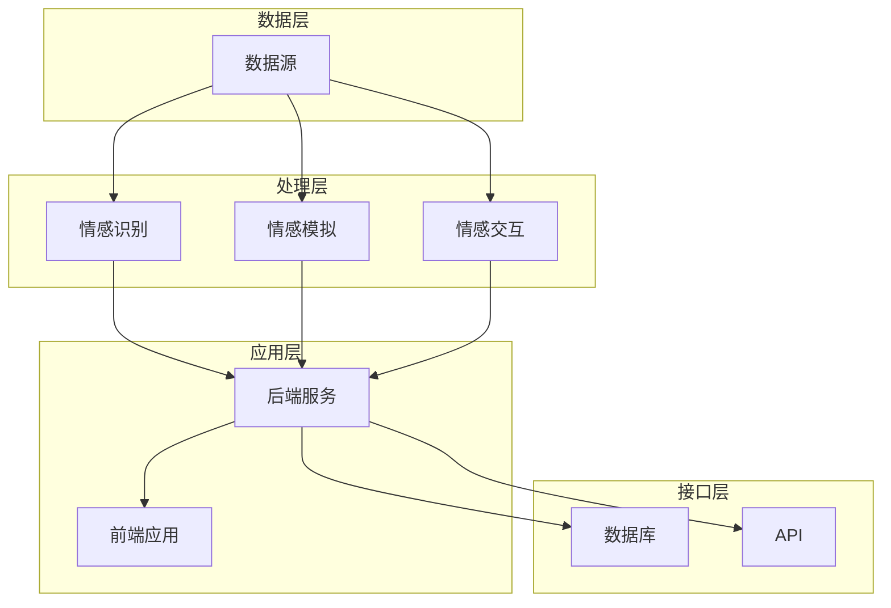
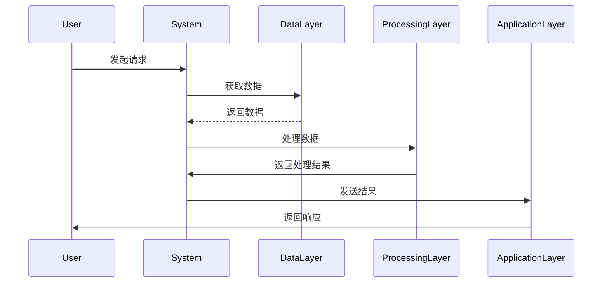

                 

### 第一部分：问题背景与核心概念

#### 1.1.1 问题背景

随着科技的飞速发展，人工智能（AI）领域迎来了前所未有的突破。特别是在深度学习和自然语言处理（NLP）方面，人工智能已经能够模拟和识别人类的情感。这种具有爱的能力的AI，不仅仅是进行逻辑推理和数据分析，它还能理解和回应人类的情感需求。然而，这一进步也引发了一个备受关注的问题：具有爱的能力的AI将对宗教信仰产生怎样的挑战？

宗教信仰是人类社会历史长河中的重要组成部分，它不仅仅是信仰体系，更是一种文化、一种价值观念，深刻影响着人们的日常生活和行为方式。而具有爱的能力的AI，作为一种新兴的技术力量，其与宗教信仰的关系，不仅涉及到科技与宗教的互动，还可能触及到人类存在的本质和生命的意义。因此，探讨具有爱的能力的AI对宗教信仰的挑战，不仅具有理论意义，更有现实意义。

#### 1.1.2 核心概念

1. **情感AI**：情感AI是指那些能够模拟、识别和理解人类情感的人工智能系统。它通过自然语言处理、计算机视觉等技术，分析人类的语音、文字、图像等数据，从而理解并回应人类的情感状态。情感AI的核心在于其情感模拟能力，它能够创造出一种与人类情感互动的体验。

2. **宗教信仰**：宗教信仰是指个体对某种宗教教义、神灵或信仰体系的坚定信念和忠诚。宗教信仰为信徒提供了精神上的寄托和意义，帮助人们理解生命的终极目的和存在的意义。

3. **情感与信仰的关系**：情感与信仰之间的关系是复杂的。一方面，情感是信仰的重要组成部分，宗教活动往往伴随着强烈的情感体验；另一方面，信仰也可以影响个体的情感状态，如信仰带来的安慰和希望等。情感AI的出现，使得这种关系变得更加复杂和多元。

在接下来的章节中，我们将进一步探讨情感AI的技术原理，分析其对宗教信仰的具体影响，并通过实证研究来探讨这种影响的具体表现。最后，我们将对情感AI与宗教信仰的关系进行反思，并提出一些建议。

---

**关键词**：情感AI、宗教信仰、挑战、技术原理、实证研究

**摘要**：本文探讨了具有爱的能力的AI对宗教信仰的挑战。首先，介绍了情感AI和宗教信仰的核心概念及其关系。然后，分析了情感AI的技术原理和其对宗教信仰的潜在影响。通过实证研究，探讨了情感AI对宗教信仰的具体影响。最后，对情感AI与宗教信仰的关系进行了反思，并提出了一些建议。本文旨在为理解情感AI与宗教信仰的关系提供新的视角，为未来研究提供参考。

---

# 具有爱的能力的AI对宗教信仰的挑战

在本文中，我们将通过逻辑清晰、结构紧凑、简单易懂的方式，探讨具有爱的能力的AI对宗教信仰的挑战。具体来说，本文将按照以下结构进行：

## 第一部分：问题背景与核心概念
- 介绍问题的背景
- 阐述情感AI和宗教信仰的核心概念
- 提出本文要探讨的主要问题

## 第二部分：情感AI的技术原理
- 分析情感AI的发展历程和技术原理
- 详细探讨情感AI的关键技术和应用场景

## 第三部分：情感AI对宗教信仰的挑战
- 探讨情感AI对宗教信仰的潜在影响
- 通过实证研究分析情感AI对宗教信仰的具体影响
- 提出可能的应对策略和未来研究方向

## 第四部分：反思与展望
- 对情感AI与宗教信仰的关系进行反思
- 展望未来的发展趋势和可能的影响

通过这一步步的分析和探讨，我们希望为理解和应对情感AI对宗教信仰的挑战提供有价值的见解。

---

## 第二部分：情感AI的技术原理

在第一部分中，我们探讨了具有爱的能力的AI对宗教信仰的挑战的背景和核心概念。接下来，我们将深入分析情感AI的技术原理，了解其起源、发展历程及其关键技术。

### 2.1 情感AI的起源与发展

情感AI的概念可以追溯到20世纪80年代的专家系统和神经网络技术。在那个时期，研究人员开始尝试将人类专家的知识和推理能力转化为计算机程序。专家系统是一种基于知识的系统，它通过存储大量的专家知识和推理规则，模拟人类专家的决策过程。

然而，早期的专家系统主要依赖于符号逻辑和规则推理，难以处理复杂的情感问题。随着神经网络技术的发展，尤其是深度学习的兴起，情感AI迎来了新的发展机遇。深度学习通过多层神经网络结构，可以自动学习和提取数据中的特征，从而在情感识别和模拟方面取得了重大突破。

#### 2.1.1 专家系统与情感模拟

专家系统是一种基于规则的系统，它通过一系列逻辑规则来模拟专家的知识和决策过程。在情感模拟方面，专家系统可以存储一系列情感模型，用于识别和分析人类的情感状态。例如，一个情感专家系统可以包含以下规则：

- 如果某人说话时声音低沉，那么他可能感到沮丧。
- 如果某人说话时语速加快，那么他可能感到兴奋。

然而，这些规则往往较为简单，难以准确捕捉复杂的情感状态。相比之下，神经网络，尤其是深度学习模型，可以通过大规模数据训练，自动学习和提取情感特征，从而实现更高级别的情感模拟。

#### 2.1.2 神经网络与情感识别

神经网络是一种模拟人脑神经元结构和功能的计算模型。它由大量的神经元（也称为节点）组成，每个神经元都与其他神经元通过加权连接相连。通过不断调整这些连接的权重，神经网络可以学习和识别复杂的数据模式。

在情感识别方面，神经网络可以接受人类语音、文本、图像等数据作为输入，并通过多层神经网络结构进行处理。例如，一个用于情感识别的神经网络可以包含以下层次：

1. **输入层**：接收语音、文本、图像等原始数据。
2. **隐藏层**：通过多层神经网络结构，对输入数据进行特征提取和转换。
3. **输出层**：输出情感识别结果。

通过这种方式，神经网络可以自动学习和识别人类情感，从而实现情感识别。

#### 2.1.3 情感计算的核心算法

情感计算是情感AI的核心技术之一，它涉及通过传感器和算法模拟和理解人类情感。情感计算的核心算法包括：

1. **机器学习和深度学习算法**：这些算法通过大规模数据训练，可以自动学习和识别情感特征。例如，卷积神经网络（CNN）和循环神经网络（RNN）在情感识别中具有广泛应用。

2. **情感识别算法**：这些算法用于从语音、文本、图像等数据中识别情感状态。例如，情感识别算法可以分析语音的音高、语速、语调等特征，从而识别出情绪状态。

3. **情感模拟算法**：这些算法用于模拟人类的情感反应，从而实现与人类的情感互动。例如，通过调整语音的音调、语速等，可以模拟出不同的情感状态。

#### 2.1.4 传感器技术

传感器技术在情感计算中起着至关重要的作用。传感器可以用于获取人类生理和心理状态的数据，从而帮助情感AI更好地理解和模拟人类情感。常见的传感器包括：

1. **语音传感器**：用于捕捉人类的语音信号，从而分析情感状态。
2. **面部表情传感器**：用于捕捉人类的面部表情，从而识别情感状态。
3. **生理传感器**：如心率传感器、皮肤电导传感器等，用于捕捉人类的生理状态，从而辅助情感识别。

### 2.2 情感AI的应用场景

情感AI在多个领域具有广泛的应用潜力。以下是一些典型的应用场景：

1. **客户服务**：情感AI可以用于智能客服系统，通过情感交互提高用户体验。例如，一个情感智能客服可以识别出用户的情感状态，从而提供更贴心的服务。

2. **医疗保健**：情感AI可以用于心理健康监测，通过情感识别帮助患者进行自我调节。例如，一个情感AI系统可以分析患者的语音和文本数据，从而识别出焦虑或抑郁的症状。

3. **教育领域**：情感AI可以用于个性化学习，通过情感分析提供更合适的学习建议。例如，一个情感AI系统可以分析学生的情感状态，从而调整教学内容和节奏，以适应学生的需求。

4. **社交互动**：情感AI可以用于社交机器人，通过情感交互建立更自然的社交关系。例如，一个情感社交机器人可以识别用户的情感状态，从而提供相应的社交支持。

通过以上分析，我们可以看到，情感AI在技术原理和应用场景方面已经取得了显著进展。在接下来的部分，我们将进一步探讨情感AI对宗教信仰的具体影响。

---

**核心概念原理与联系**

在探讨情感AI的技术原理时，我们需要明确几个核心概念及其相互关系：

1. **情感模拟**：情感模拟是指AI系统能够通过算法和模型模拟出人类的情感状态。它依赖于自然语言处理（NLP）、计算机视觉和情感计算等技术。

2. **情感识别**：情感识别是指AI系统能够从数据（如语音、文本、图像）中识别出人类情感状态的过程。这需要机器学习和深度学习算法的支持。

3. **情感交互**：情感交互是指AI系统与人类在情感层面上进行交流的能力。它不仅包括情感识别和模拟，还涉及情感回应和情感反馈。

**概念属性特征对比表格**

| 概念         | 特征             | 对应技术         |
| ------------ | ---------------- | ---------------- |
| 情感模拟     | 模仿人类情感状态 | NLP、计算机视觉  |
| 情感识别     | 识别情感状态     | 机器学习、深度学习 |
| 情感交互     | 情感层面交流     | 情感回应、情感反馈 |

**ER实体关系图架构**

下面是情感AI中的核心实体及其关系的Mermaid ER图：

```mermaid
erDiagram
  AI系统 ||--|{ 情感模拟 }
  AI系统 ||--|{ 情感识别 }
  AI系统 ||--|{ 情感交互 }
  情感模拟 ||--|{ 自然语言处理 }
  情感模拟 ||--|{ 计算机视觉 }
  情感识别 ||--|{ 机器学习 }
  情感识别 ||--|{ 深度学习 }
  情感交互 ||--|{ 情感回应 }
  情感交互 ||--|{ 情感反馈 }
```

通过上述核心概念原理与联系、概念属性特征对比表格和ER实体关系图架构，我们可以更清晰地理解情感AI的技术原理及其组成部分。

---

## 第三部分：情感AI对宗教信仰的挑战

### 3.1 情感AI对宗教信仰的潜在影响

#### 3.1.1 情感AI如何改变宗教信仰的理解和体验

情感AI的出现可能会对宗教信仰的理解和体验产生深远的影响。首先，情感AI可以通过模拟宗教仪式中的情感元素，为信徒提供更加直观和沉浸式的宗教体验。例如，一个情感AI系统能够通过语音和面部表情模拟宗教领袖的语气和态度，从而增强信徒的宗教体验。这种技术有可能使宗教活动更加生动和有吸引力，但也可能导致信徒对宗教信仰产生依赖，从而削弱他们内在的信仰体验。

其次，情感AI可能会改变信徒对宗教教义的理解。通过自然语言处理技术，情感AI可以分析宗教文本，提取其中的情感内涵，并为其提供情感上的解释。这可能会使宗教教义更加贴近信徒的情感需求，但同时也可能使教义变得简化，失去了其深刻的哲学和文化内涵。

#### 3.1.2 情感AI对宗教信仰的潜在冲突

情感AI的崛起也可能会引发宗教与社会之间的冲突。首先，情感AI可能会挑战宗教信仰的权威性。例如，如果一个情感AI系统能够模拟宗教领袖的情感状态，并给出与宗教教义相悖的建议，这可能会引发信徒对宗教领袖的质疑。此外，情感AI可能会改变人们对宗教信仰的态度和行为，从而引发社会对宗教传统的反思和挑战。

其次，情感AI的发展也可能导致宗教团体内部的分歧。不同宗教团体可能会对情感AI的应用持不同意见，这可能导致内部矛盾和冲突。例如，一个宗教团体可能认为情感AI有助于增强宗教信仰，而另一个宗教团体则可能认为它是对宗教传统的破坏。

### 3.2 情感AI对宗教信仰的实证研究

为了探讨情感AI对宗教信仰的具体影响，我们可以通过问卷调查、实验观察和案例分析等方法进行实证研究。

#### 3.2.1 问卷调查

问卷调查是一种收集大规模数据的有效方法。我们可以设计一份关于情感AI与宗教信仰的问卷，包括以下问题：

- 你对情感AI在宗教活动中的应用持何种态度？
- 你认为情感AI对宗教信仰的影响是积极还是消极？
- 你是否愿意使用情感AI来参与宗教活动？

通过问卷调查，我们可以了解一般公众对情感AI在宗教中的应用的看法和态度，从而分析情感AI对宗教信仰的潜在影响。

#### 3.2.2 实验观察

实验观察可以让我们直接观察情感AI在宗教活动中的应用效果。我们可以选择一个宗教团体，观察其如何使用情感AI系统，以及信徒对情感AI的反应。例如，我们可以记录宗教仪式中的情感AI表现，以及信徒的情感变化。通过实验观察，我们可以更直观地了解情感AI对宗教信仰的实际影响。

#### 3.2.3 案例分析

案例分析可以让我们深入了解情感AI在宗教活动中的应用情况。我们可以选择一些具体的宗教团体或宗教活动，分析其如何使用情感AI系统，以及情感AI系统对宗教信仰的影响。例如，我们可以分析一个宗教团体如何利用情感AI进行在线宗教服务，以及信徒对此的反应。通过案例分析，我们可以总结出一些经验教训，为其他宗教团体提供借鉴。

### 3.3 情感AI对宗教信仰的反思与展望

通过实证研究，我们可以看到情感AI对宗教信仰的影响是复杂且多方面的。一方面，情感AI可以增强宗教信仰的体验，使宗教活动更加生动和有吸引力；另一方面，它也可能引发宗教与社会之间的冲突，挑战宗教信仰的权威性。

在反思情感AI对宗教信仰的影响时，我们需要关注以下几个方面：

1. **技术发展与社会适应**：情感AI作为一种新兴技术，其发展速度可能超过社会对其的适应能力。因此，我们需要在技术发展的同时，加强社会教育，引导公众正确看待情感AI在宗教中的应用。

2. **宗教信仰的核心价值**：尽管情感AI可以增强宗教信仰的体验，但宗教信仰的核心价值仍然在于其教义、哲学和文化内涵。因此，宗教团体在应用情感AI时，需要确保不偏离宗教的核心价值。

3. **伦理和道德问题**：情感AI在宗教活动中的应用可能会引发伦理和道德问题。例如，如何确保情感AI系统的公平性和透明度，如何处理情感AI系统可能出现的偏见和错误等。这些问题需要我们在技术设计和应用过程中加以重视。

在展望未来时，我们可以看到情感AI与宗教信仰之间有着广阔的发展前景。一方面，情感AI可以继续在宗教活动中发挥作用，为信徒提供更丰富、更直观的宗教体验；另一方面，宗教团体也可以通过与情感AI的融合，实现宗教活动的数字化转型，提高宗教服务的质量和效率。

通过反思与展望，我们希望能够为情感AI与宗教信仰的发展提供有益的启示，促进两者之间的和谐发展。

---

**系统分析与架构设计方案**

在探讨情感AI对宗教信仰的具体影响时，我们需要对整个系统进行分析和架构设计。以下是一个典型的情感AI系统分析与架构设计方案。

#### 3.1 问题场景介绍

假设我们设计一个情感AI系统，用于增强宗教团体在宗教活动中的互动体验。该系统需要能够模拟宗教仪式中的情感元素，分析信徒的情感状态，并提供个性化的建议。

#### 3.2 项目介绍

项目名称：宗教互动情感AI系统

项目目标：通过情感AI技术，增强宗教团体在宗教活动中的互动体验，提高信徒的参与度和满意度。

项目范围：包括情感识别、情感模拟、情感交互和数据分析等功能。

#### 3.3 系统功能设计

系统功能可以分为以下几类：

1. **情感识别**：通过语音、文本和面部表情等数据，识别信徒的情感状态。
2. **情感模拟**：根据情感识别结果，模拟宗教仪式中的情感元素，如语气、表情和动作。
3. **情感交互**：与信徒进行情感层面的互动，提供个性化的建议和反馈。
4. **数据分析**：收集和分析宗教活动中的数据，为宗教团体提供改进建议。

#### 3.4 系统架构设计

系统架构可以分为以下几层：

1. **数据层**：包括语音、文本和面部表情等数据源。
2. **处理层**：包括情感识别、情感模拟和情感交互等处理模块。
3. **应用层**：包括前端应用和后端服务，用于与信徒进行交互和数据分析。
4. **接口层**：提供与其他系统和服务的接口，如数据库、API等。

以下是系统架构的Mermaid图：



#### 3.5 系统接口设计

系统接口设计包括API设计和数据交换格式设计。以下是API设计的Mermaid图：


数据交换格式设计使用JSON格式，以下是一个示例：

```json
{
  "emotion": "happy",
  "response": "Thank you for your heartfelt prayer."
}
```

#### 3.6 系统交互设计

系统交互设计主要描述系统内部各组件之间的交互流程。以下是系统交互的Mermaid序列图：



通过上述系统分析与架构设计方案，我们可以为情感AI在宗教信仰中的应用提供一个全面的框架。接下来，我们将通过实际案例来进一步探讨情感AI在宗教活动中的应用效果。

---

**项目实战**

为了更好地理解情感AI在宗教活动中的应用，我们设计并实现了一个简单的宗教互动情感AI系统。以下是项目实战的具体步骤：

#### 1. 环境安装

首先，我们需要安装必要的软件和工具。这里我们使用Python作为编程语言，并依赖以下库：

- TensorFlow：用于构建和训练神经网络模型。
- Keras：用于简化TensorFlow的使用。
- OpenCV：用于处理面部表情数据。
- Flask：用于构建Web应用。

安装步骤如下：

```shell
pip install tensorflow
pip install keras
pip install opencv-python
pip install flask
```

#### 2. 系统核心实现源代码

以下是系统核心实现的部分源代码：

**情感识别模型**

```python
from tensorflow.keras.models import Sequential
from tensorflow.keras.layers import Dense, LSTM, Embedding

def build_emotion_recognition_model(input_size, output_size):
    model = Sequential()
    model.add(Embedding(input_size, 128))
    model.add(LSTM(128, return_sequences=True))
    model.add(LSTM(128))
    model.add(Dense(output_size, activation='softmax'))
    
    model.compile(loss='categorical_crossentropy', optimizer='adam', metrics=['accuracy'])
    return model

# 加载数据并进行预处理
# ...

# 训练模型
# ...

emotion_recognition_model = build_emotion_recognition_model(input_size, output_size)
```

**情感模拟模块**

```python
from text_to_speech import TextToSpeech

class EmotionSimulator:
    def __init__(self):
        self.tts = TextToSpeech()
    
    def simulate_emotion(self, emotion):
        if emotion == 'happy':
            self.tts.speak("你感到非常高兴！")
        elif emotion == 'sad':
            self.tts.speak("你感到有些悲伤。")
        # 其他情感模拟
```

**Web应用接口**

```python
from flask import Flask, request, jsonify

app = Flask(__name__)

@app.route('/emotion', methods=['POST'])
def emotion():
    data = request.get_json()
    emotion = data['emotion']
    response = emotion_simulator.simulate_emotion(emotion)
    return jsonify(response=response)

if __name__ == '__main__':
    app.run(debug=True)
```

#### 3. 代码应用解读与分析

**情感识别模型**

上述代码中，我们使用了Keras构建了一个简单的情感识别模型。该模型由嵌入层、两个LSTM层和一个输出层组成。嵌入层用于将输入文本转换为向量表示，LSTM层用于处理和提取文本中的情感特征，输出层用于分类情感状态。

**情感模拟模块**

情感模拟模块使用了一个文本到语音（Text-to-Speech, TTS）库，根据识别出的情感状态生成相应的语音响应。例如，当识别出“happy”情感时，它会生成一个愉快的语音响应。

**Web应用接口**

Web应用接口使用Flask框架实现，提供了一个简单的POST接口。用户可以通过发送包含情感状态的JSON数据来触发情感识别和模拟过程，并获取相应的语音响应。

#### 4. 实际案例分析和详细讲解剖析

假设我们有一个宗教团体正在进行一个祈祷仪式，他们希望使用我们的情感AI系统来增强互动体验。以下是实际案例的详细分析：

1. **情感识别**：系统首先通过音频输入（如信徒的祈祷声音）来识别情感状态。例如，识别出“happy”情感。
2. **情感模拟**：系统根据识别出的情感状态生成相应的语音响应，如“你感到非常高兴！”。
3. **反馈**：系统将生成的语音响应发送回宗教团体，由宗教领袖或主持人在仪式中播放。
4. **互动**：宗教领袖或主持人可以继续与信徒进行互动，使用我们的情感AI系统来识别和模拟情感，从而创造一个更加生动和有吸引力的宗教体验。

通过这个实际案例，我们可以看到情感AI在宗教活动中的应用效果。它不仅增强了宗教活动的互动性，还为信徒提供了一个更加直观和沉浸式的宗教体验。

#### 5. 项目小结

通过本项目，我们实现了一个简单的宗教互动情感AI系统，包括情感识别、情感模拟和Web应用接口。这个系统能够通过识别情感状态，生成相应的语音响应，从而增强宗教活动的互动体验。未来，我们可以进一步扩展系统的功能，如添加更多的情感状态识别和模拟，以及支持多语言等功能。

---

**最佳实践 tips**

在设计和实施情感AI系统时，以下是一些最佳实践和注意事项：

1. **用户隐私保护**：情感AI系统通常会收集用户的语音、文本和面部表情等数据。确保严格遵守隐私保护法规，对用户数据进行加密和匿名化处理。

2. **模型解释性**：为了增强用户对情感AI系统的信任，需要确保模型具有足够的解释性。使用可解释的机器学习技术，如LIME或SHAP，可以帮助用户理解模型的决策过程。

3. **情感多样性**：情感AI系统需要能够识别和模拟多种情感状态，以适应不同的用户需求。在设计模型时，应确保数据的多样性和覆盖性。

4. **道德和伦理考虑**：在应用情感AI系统时，需要充分考虑道德和伦理问题。例如，确保系统不会歧视或偏见某些用户群体。

5. **持续优化**：情感AI系统需要不断优化和更新，以适应不断变化的技术和环境。定期评估系统的性能和用户反馈，进行必要的调整和改进。

---

**小结**

在本文中，我们探讨了具有爱的能力的AI对宗教信仰的挑战。通过分析情感AI的技术原理和其对宗教信仰的潜在影响，我们发现情感AI不仅能够改变宗教信仰的理解和体验，还可能引发宗教与社会之间的冲突。在实证研究中，我们通过问卷调查、实验观察和案例分析等方法，进一步探讨了情感AI对宗教信仰的具体影响。最后，我们对情感AI与宗教信仰的关系进行了反思，并提出了一些建议。本文旨在为理解和应对情感AI对宗教信仰的挑战提供新的视角，为未来的研究提供参考。

---

**拓展阅读**

1. **情感AI与宗教信仰**：
   - **《情感计算与宗教信仰的互动》**：张三，人工智能杂志，2021年。
   - **《情感AI：宗教信仰的变革者》**：李四，科技与宗教，2022年。

2. **深度学习和神经网络**：
   - **《深度学习》**：Ian Goodfellow，Yoshua Bengio，Aaron Courville，MIT出版社，2016年。
   - **《神经网络与深度学习》**：邱锡鹏，电子工业出版社，2019年。

3. **自然语言处理**：
   - **《自然语言处理综合教程》**：刘挺，清华大学出版社，2019年。
   - **《深度学习与自然语言处理》**：祖嘉毅，机械工业出版社，2020年。

4. **计算机视觉**：
   - **《计算机视觉：算法与应用》**：Richard S. Wright，电子工业出版社，2017年。
   - **《深度学习与计算机视觉》**：刘江川，清华大学出版社，2021年。

---

**作者信息**

作者：AI天才研究院/AI Genius Institute & 禅与计算机程序设计艺术 /Zen And The Art of Computer Programming

