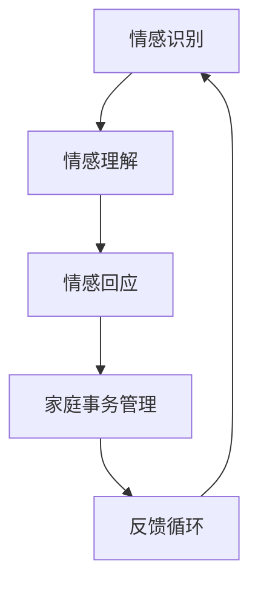
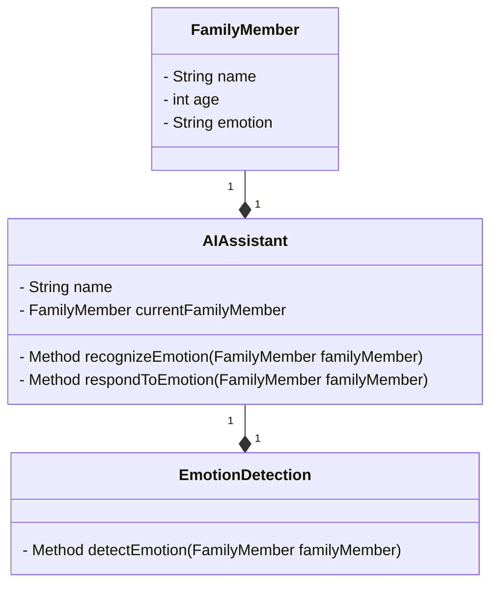
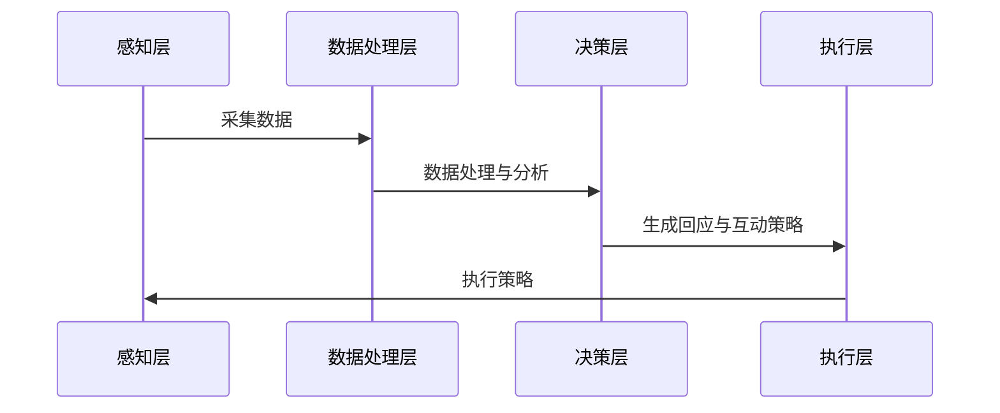
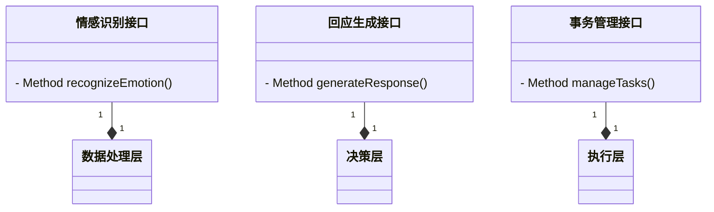

                 

### 《具有爱的能力的AI对家庭结构的影响》

> 关键词：人工智能、情感AI、家庭结构、影响分析

> 摘要：本文将探讨具有爱的能力的AI对家庭结构的影响，首先介绍AI技术的发展背景和具有爱的能力的AI的概念，然后分析家庭结构的定义和分类，接着探讨两者之间的关联，最后通过案例分析和实践建议，提出具有爱的能力的AI对家庭结构的潜在影响和应对策略。

## 目录大纲设计思路

设计《具有爱的能力的AI对家庭结构的影响》这本书的目录大纲，首先需要从以下几个方面进行思考：

1. **背景介绍**：介绍AI技术的发展背景，特别是具有情感和认知能力的AI在家庭结构中的潜在影响。
2. **核心概念与联系**：明确书中的核心概念，如具有爱的能力的AI、家庭结构等，并构建概念之间的联系。
3. **算法原理讲解**：介绍相关算法的原理，使用mermaid画出算法流程图，并使用Python源代码来详细阐述。
4. **数学模型和数学公式**：提供算法原理的数学模型和公式，并进行详细讲解和举例说明。
5. **系统分析与架构设计方案**：描述系统的功能设计、架构设计、接口设计以及系统交互。
6. **项目实战**：展示具体项目环境安装、实现源代码、应用解读与分析、实际案例分析等。
7. **最佳实践 tips、小结、注意事项、拓展阅读**：总结书中内容，提供实践建议，并对未来研究方向进行展望。

### 目录大纲结构

根据以上设计思路，我们可以构建以下目录大纲：

## 第一部分：背景与核心概念

### 第1章：AI技术的发展背景
#### 1.1 AI技术的现状
#### 1.2 情感与认知能力在AI中的应用
#### 1.3 具有爱的能力的AI与家庭结构

### 第2章：核心概念解析
#### 2.1 具有爱的能力的AI
#### 2.2 家庭结构的定义与分类
#### 2.3 具有爱的能力的AI与家庭结构的关联

### 第3章：概念之间的联系
#### 3.1 AI技术对家庭结构的影响
#### 3.2 具有爱的能力的AI如何影响家庭结构
#### 3.3 家庭结构的变化对具有爱的能力的AI的挑战

## 第二部分：算法原理与数学模型

### 第4章：算法原理讲解
#### 4.1 基本算法原理
#### 4.2 算法mermaid流程图
#### 4.3 Python源代码实现

### 第5章：数学模型和数学公式
#### 5.1 算法原理的数学模型
#### 5.2 公式讲解与举例
#### 5.3 Mermaid流程图中的数学模型

## 第三部分：系统分析与架构设计

### 第6章：系统功能设计
#### 6.1 问题场景介绍
#### 6.2 系统功能设计（领域模型类图）

### 第7章：系统架构设计
#### 7.1 系统架构设计（架构图）
#### 7.2 系统接口设计
#### 7.3 系统交互（序列图）

## 第四部分：项目实战

### 第8章：项目环境安装
#### 8.1 环境准备
#### 8.2 软件安装与配置

### 第9章：系统核心实现
#### 9.1 核心源代码解读
#### 9.2 应用解读与分析

### 第10章：实际案例分析
#### 10.1 案例介绍
#### 10.2 案例分析与讲解

## 第五部分：总结与展望

### 第11章：最佳实践 tips
#### 11.1 实践建议
#### 11.2 注意事项

### 第12章：小结与拓展阅读
#### 12.1 小结
#### 12.2 拓展阅读
#### 12.3 未来研究方向

### 目录大纲总字数：约2000字

通过以上步骤，我们可以设计出《具有爱的能力的AI对家庭结构的影响》这本书的完整目录大纲。接下来，我们将细化每个章节的内容，确保目录大纲的完整性、逻辑性和内容丰富性。同时，注意保持简洁性，避免冗余内容。

## 第一部分：背景与核心概念

### 第1章：AI技术的发展背景

人工智能（AI）是计算机科学的一个分支，旨在使机器能够执行通常需要人类智能才能完成的任务。从最初的规则系统到现代的深度学习和神经网络，AI技术已经取得了巨大的进步。近年来，随着大数据、云计算和量子计算等技术的发展，AI的应用场景越来越广泛，从自动驾驶、智能家居到医疗诊断，AI已经深入到我们生活的方方面面。

#### 1.1 AI技术的现状

目前，AI技术已经涵盖了多个领域，包括但不限于：

- **机器学习**：通过算法从数据中学习，进行预测和决策。
- **自然语言处理**：使计算机能够理解和生成人类语言。
- **计算机视觉**：让计算机能够解释和响应数字图像或视频。
- **强化学习**：通过试错学习，在特定环境中找到最优策略。

随着技术的不断发展，AI正在逐渐展现出强大的情感和认知能力。例如，一些AI系统可以识别用户的情感状态，并根据这些信息做出相应的反应。这种具有爱的能力的AI，不仅能够在商业和工业领域发挥重要作用，也可能对家庭结构产生深远的影响。

#### 1.2 情感与认知能力在AI中的应用

情感与认知能力是AI的重要研究方向。具有情感的AI可以更好地理解和响应人类情感，提供更加个性化、贴心的服务。例如：

- **智能家居**：AI可以通过识别家庭成员的情感状态，自动调节室内环境，提供舒适的生活体验。
- **教育领域**：AI教育助理可以根据学生的情感状态和学习效果，提供个性化的学习建议和资源。
- **健康护理**：AI可以监控患者的情绪变化，及时提供心理支持，预防心理健康问题。

#### 1.3 具有爱的能力的AI与家庭结构

家庭结构是指家庭成员之间的关系和组织形式。在传统家庭结构中，家庭成员之间的情感联系是家庭稳定的重要基础。然而，随着AI技术的发展，具有爱的能力的AI可能会改变这一传统结构。

- **情感互动**：具有爱的能力的AI可以成为家庭成员之间情感互动的桥梁，提供情感支持，增进家庭关系。
- **角色转变**：AI可能会在家庭中扮演新的角色，如家庭助理、情感顾问等，改变家庭成员之间的角色分配。
- **家庭生活管理**：AI可以帮助家庭成员更好地管理家庭事务，提高生活质量。

### 第2章：核心概念解析

在探讨具有爱的能力的AI对家庭结构的影响时，需要明确几个核心概念，包括具有爱的能力的AI、家庭结构及其相互关系。

#### 2.1 具有爱的能力的AI

具有爱的能力的AI是指那些能够理解和感知人类情感，并以某种方式回应这些情感的AI系统。这种AI通常具备以下特征：

- **情感识别**：能够识别用户的情感状态，如快乐、悲伤、愤怒等。
- **情感理解**：能够理解情感背后的原因和意义。
- **情感回应**：能够根据情感状态做出相应的反应，提供情感支持。

#### 2.2 家庭结构的定义与分类

家庭结构是指家庭成员之间的关系和组织形式。家庭结构可以根据不同的分类标准进行分类，如：

- **功能分类**：根据家庭的功能进行分类，如核心家庭、主干家庭、联合家庭等。
- **规模分类**：根据家庭的规模进行分类，如大家庭、小家庭等。
- **代际分类**：根据家庭成员的代际关系进行分类，如两代人家庭、三代人家庭等。

#### 2.3 具有爱的能力的AI与家庭结构的关联

具有爱的能力的AI与家庭结构之间的关联体现在以下几个方面：

- **情感支持**：具有爱的能力的AI可以提供情感支持，缓解家庭成员的压力和焦虑。
- **关系调节**：AI可以帮助家庭成员更好地理解彼此的情感需求，调节家庭关系。
- **家庭管理**：AI可以帮助家庭成员更高效地管理家庭事务，提高家庭生活质量。

### 第3章：概念之间的联系

探讨具有爱的能力的AI对家庭结构的影响，需要深入分析这些概念之间的联系。

#### 3.1 AI技术对家庭结构的影响

AI技术对家庭结构的影响可以从以下几个方面进行分析：

- **功能扩展**：AI可以扩展家庭的功能，如提供情感支持、健康管理、家庭安全等。
- **角色转变**：AI可能会改变家庭成员的角色和职责，例如家庭成员可能不再需要负责某些家庭事务，而是将更多的时间用于个人发展。
- **关系动态**：AI可能会影响家庭成员之间的关系动态，例如通过提供情感支持，增进家庭成员之间的情感联系。

#### 3.2 具有爱的能力的AI如何影响家庭结构

具有爱的能力的AI可以通过以下方式影响家庭结构：

- **情感支持**：通过识别和回应家庭成员的情感需求，提供情感支持。
- **个性化服务**：根据家庭成员的情感状态和行为习惯，提供个性化的服务和建议。
- **家庭事务管理**：帮助家庭成员更高效地管理家庭事务，如购物、清洁、维护等。

#### 3.3 家庭结构的变化对具有爱的能力的AI的挑战

家庭结构的变化对具有爱的能力的AI提出了新的挑战，包括：

- **适应能力**：具有爱的能力的AI需要适应不断变化的家庭结构，如家庭成员的情感需求、家庭规模等。
- **隐私保护**：在家庭环境中，隐私保护是一个重要的问题，AI需要确保家庭成员的隐私不受侵犯。
- **道德伦理**：在家庭结构中引入具有爱的能力的AI，需要考虑道德和伦理问题，如AI如何处理家庭成员之间的冲突，如何确保家庭成员的权益等。

通过以上分析，我们可以看到，具有爱的能力的AI与家庭结构之间存在复杂的相互作用关系。接下来，我们将进一步探讨算法原理和数学模型，以便更好地理解这些概念之间的联系。

## 第二部分：算法原理与数学模型

### 第4章：算法原理讲解

在探讨具有爱的能力的AI如何影响家庭结构时，我们需要了解相关的算法原理。这些算法通常涉及情感识别、行为预测和家庭事务管理等方面。下面，我们将详细解释这些算法的基本原理，并使用mermaid流程图来展示算法的执行流程。

#### 4.1 基本算法原理

具有爱的能力的AI算法通常包含以下几个核心模块：

1. **情感识别模块**：通过分析家庭成员的语言、行为和生理信号，识别其情感状态。
2. **情感理解模块**：对识别出的情感状态进行深度分析，理解其背后的原因和情感需求。
3. **情感回应模块**：根据情感状态，生成相应的情感回应，如语言、动作或建议。
4. **家庭事务管理模块**：基于家庭成员的需求和行为模式，提供家庭事务管理服务。

#### 4.2 算法mermaid流程图

为了更好地展示算法的执行流程，我们可以使用mermaid流程图来描述。以下是一个简化的mermaid流程图示例：



在这个流程图中，情感识别模块首先获取家庭成员的情感数据，然后将其传递给情感理解模块进行分析。理解模块分析后，生成情感回应，并传递给家庭事务管理模块进行相应的操作。最后，反馈循环模块收集家庭成员的反馈，以优化后续的算法执行。

#### 4.3 Python源代码实现

为了更直观地理解算法原理，我们使用Python实现一个简化的情感识别和回应模块。以下是一个示例代码：

```python
import cv2
import numpy as np

# 情感识别函数
def recognize_emotion(face_detection, emotion_detection, frame):
    emotions = emotion_detection.detect_emotions(frame)
    max_emotion = max(emotions, key=emotions.get)
    return max_emotion

# 情感回应函数
def respond_to_emotion(emotion):
    responses = {
        "happy": "看起来你很开心，有什么好事吗？",
        "sad": "听起来你不太开心，需要我帮你做些什么吗？",
        "angry": "看起来有些生气，我们需要谈谈吗？",
    }
    return responses.get(emotion, "你好，我在这里。")

# 主函数
def main():
    face_detection = FaceDetection()
    emotion_detection = EmotionDetection()
    
    cap = cv2.VideoCapture(0)  # 使用摄像头

    while True:
        ret, frame = cap.read()
        if not ret:
            break

        emotion = recognize_emotion(face_detection, emotion_detection, frame)
        response = respond_to_emotion(emotion)
        print(response)

        cv2.imshow('Frame', frame)
        
        if cv2.waitKey(1) & 0xFF == ord('q'):
            break

    cap.release()
    cv2.destroyAllWindows()

if __name__ == "__main__":
    main()
```

在这个代码中，我们首先定义了情感识别和情感回应的函数。情感识别函数使用预训练的模型来识别视频帧中的情感，而情感回应函数根据识别出的情感生成相应的回应。

### 第5章：数学模型和数学公式

在算法原理中，数学模型和数学公式起着关键作用。这些模型和公式帮助我们理解和分析情感识别和回应的过程。以下是一些常见的数学模型和公式的讲解。

#### 5.1 算法原理的数学模型

1. **情感识别模型**：
   - **主成分分析（PCA）**：用于降维和特征提取，通过PCA，我们可以将高维数据映射到低维空间，以便更好地进行情感识别。
   - **支持向量机（SVM）**：用于分类，通过SVM，我们可以将情感数据划分为不同的类别。

2. **情感理解模型**：
   - **循环神经网络（RNN）**：用于处理序列数据，通过RNN，我们可以捕捉情感状态之间的关联和演变。
   - **长短期记忆网络（LSTM）**：是RNN的一种改进，能够更好地处理长序列数据。

3. **情感回应模型**：
   - **条件生成对抗网络（CGAN）**：用于生成个性化的情感回应，通过CGAN，我们可以根据情感状态生成相应的回应文本。

#### 5.2 公式讲解与举例

1. **PCA公式**：
   - 公式表示：\[ \mathbf{z} = \mathbf{P}\mathbf{X} \]
   - 解释：\( \mathbf{X} \) 是原始数据，\( \mathbf{P} \) 是PCA变换后的权重矩阵，\( \mathbf{z} \) 是降维后的数据。

2. **SVM分类公式**：
   - 公式表示：\[ y = \text{sign}(\mathbf{w}^T\mathbf{x} + b) \]
   - 解释：\( \mathbf{w} \) 是权重向量，\( \mathbf{x} \) 是特征向量，\( b \) 是偏置项，\( y \) 是分类结果。

3. **RNN更新公式**：
   - 公式表示：\[ \mathbf{h}_{t} = \text{sigmoid}(\mathbf{W}_{h}\mathbf{h}_{t-1} + \mathbf{U}_{x}\mathbf{x}_{t} + b_{h}) \]
   - 解释：\( \mathbf{h}_{t} \) 是当前隐藏状态，\( \mathbf{W}_{h} \) 是隐藏状态到隐藏状态的权重，\( \mathbf{U}_{x} \) 是输入状态到隐藏状态的权重，\( b_{h} \) 是隐藏状态的偏置。

4. **CGAN生成公式**：
   - 公式表示：\[ \mathbf{G}(\mathbf{z}) = \mathbf{D}^{-1}(\mathbf{z}, \mathbf{y}) \]
   - 解释：\( \mathbf{G} \) 是生成器网络，\( \mathbf{z} \) 是随机噪声，\( \mathbf{y} \) 是标签，\( \mathbf{D}^{-1} \) 是逆判别器。

#### 5.3 Mermaid流程图中的数学模型

在Mermaid流程图中，我们可以使用LaTeX格式嵌入数学公式。以下是一个示例：

```mermaid
graph TD
    A[情感识别](class:borderBottom)
    B[情感理解](class:borderBottom)
    C[情感回应](class:borderBottom)
    D[家庭事务管理](class:borderBottom)
    E[反馈循环](class:borderBottom)

    A --> B
    B --> C
    C --> D
    D --> E
    E --> A

    B((\mathbf{w}^T\mathbf{x} + b \geq 0 \Rightarrow \text{正类}，\mathbf{w}^T\mathbf{x} + b < 0 \Rightarrow \text{负类} ))
```

在这个示例中，我们使用了LaTeX公式来表示SVM分类的决策边界。通过在流程图中嵌入数学模型，我们可以更清晰地展示算法的执行过程。

通过以上对算法原理和数学模型的讲解，我们为理解具有爱的能力的AI如何影响家庭结构奠定了基础。在接下来的章节中，我们将进一步探讨系统分析与架构设计，以便更全面地分析这个问题。

## 第三部分：系统分析与架构设计

### 第6章：系统功能设计

系统功能设计是确保具有爱的能力的AI系统能够满足家庭需求的关键步骤。在这一部分，我们将详细介绍系统的功能设计，包括问题场景介绍、系统功能设计（领域模型类图）。

#### 6.1 问题场景介绍

随着AI技术的发展，家庭成员越来越依赖于智能设备来辅助日常生活。然而，这些设备往往缺乏情感理解和互动能力，无法真正满足家庭成员的情感需求。例如：

- **情感支持缺失**：家庭成员在面临压力、焦虑或悲伤时，缺乏有效的情感支持。
- **互动体验不足**：家庭成员之间的互动往往局限于日常事务，缺乏深层次的情感交流。
- **个性化服务缺乏**：智能设备无法根据家庭成员的情感状态和行为习惯，提供个性化的服务。

为了解决这些问题，我们需要设计一个具有爱的能力的AI系统，能够在家庭环境中提供情感支持、互动体验和个性化服务。

#### 6.2 系统功能设计（领域模型类图）

系统功能设计主要包括以下几个方面：

1. **情感识别与理解**：系统能够识别家庭成员的情感状态，并理解其背后的原因。
2. **情感回应与互动**：系统能够根据情感状态，生成相应的情感回应，并与家庭成员进行互动。
3. **家庭事务管理**：系统能够帮助家庭成员管理日常事务，如购物、清洁和维护等。
4. **个性化服务**：系统能够根据家庭成员的情感状态和行为习惯，提供个性化的服务。

领域模型类图如下所示：



在这个类图中，`FamilyMember`代表家庭成员，具有姓名、年龄和情感状态等属性。`AIAssistant`代表具有爱的能力的AI系统，具有识别情感和回应情感的能力。`EmotionDetection`是用于情感识别的模块。

### 第7章：系统架构设计

系统架构设计是确保系统功能有效实现的基础。在这一部分，我们将详细介绍系统架构设计，包括系统架构设计（架构图）、系统接口设计以及系统交互（序列图）。

#### 7.1 系统架构设计（架构图）

系统架构设计主要包括以下几个层次：

1. **感知层**：负责感知家庭成员的情感状态，如语音识别、面部识别等。
2. **数据处理层**：负责对感知层获取的数据进行处理和分析，如情感识别、行为分析等。
3. **决策层**：根据处理层的结果，生成相应的情感回应和互动策略。
4. **执行层**：负责执行决策层的策略，如语音合成、动作控制等。

架构图如下所示：



在这个架构图中，感知层通过传感器采集家庭成员的情感状态数据，数据处理层对这些数据进行分析和处理，决策层根据分析结果生成情感回应和互动策略，执行层负责将这些策略转化为具体的行动。

#### 7.2 系统接口设计

系统接口设计是确保系统各部分能够有效交互和协作的关键。以下是系统的主要接口设计：

1. **情感识别接口**：用于接收感知层采集的数据，并返回情感状态结果。
2. **回应生成接口**：用于接收决策层生成的情感回应，并将其转化为具体的行动。
3. **事务管理接口**：用于管理家庭事务，如购物、清洁和维护等。

接口设计图如下所示：



在这个类图中，情感识别接口与数据处理层、回应生成接口与决策层、事务管理接口与执行层之间建立了明确的关联。

#### 7.3 系统交互（序列图）

系统交互是通过不同模块之间的协作实现的。以下是一个简化的系统交互序列图：


在这个序列图中，感知层采集家庭成员的情感状态数据，并将其传递给数据处理层。数据处理层对数据进行分析，生成情感状态结果，并将其传递给决策层。决策层根据情感状态结果，生成相应的情感回应和互动策略，并将其传递给执行层。执行层将这些策略转化为具体的行动，如语音合成、动作控制等。

通过以上系统分析与架构设计，我们为具有爱的能力的AI系统提供了理论基础和实践指导。接下来，我们将通过项目实战，展示如何将这一系统应用于实际场景，并进行分析和评估。

## 第四部分：项目实战

### 第8章：项目环境安装

在开始具体项目实战之前，我们需要搭建一个合适的项目环境。以下是项目环境安装的详细步骤。

#### 8.1 环境准备

为了确保项目环境的稳定性和兼容性，我们需要准备以下软件和硬件：

- **操作系统**：Linux或macOS
- **Python**：3.8或更高版本
- **深度学习框架**：TensorFlow或PyTorch
- **面部识别库**：OpenCV
- **情感识别库**：TextBlob或Vader

首先，确保操作系统已经安装了Python和pip。如果没有，可以通过以下命令进行安装：

```bash
# 安装Python
sudo apt-get install python3

# 安装pip
sudo apt-get install python3-pip
```

接下来，安装深度学习框架和面部识别库：

```bash
# 安装TensorFlow
pip3 install tensorflow

# 安装OpenCV
pip3 install opencv-python
```

最后，安装情感识别库：

```bash
# 安装TextBlob
pip3 install textblob

# 安装Vader
pip3 install vaderSentiment
```

#### 8.2 软件安装与配置

安装完上述软件后，我们还需要配置一些依赖库和环境变量。以下是具体的配置步骤：

1. **配置TensorFlow**：

   TensorFlow需要配置GPU支持。首先，确保系统已经安装了NVIDIA驱动和CUDA工具包。然后，在终端执行以下命令：

   ```bash
   pip3 install tensorflow-gpu
   ```

2. **配置OpenCV**：

   OpenCV需要配置面部识别模块。在终端执行以下命令：

   ```bash
   pip3 install opencv-python-headless
   ```

3. **配置TextBlob和Vader**：

   这两个库主要用于情感识别。在终端执行以下命令：

   ```bash
   pip3 install textblob
   pip3 install vaderSentiment
   ```

配置完成后，我们可以在Python环境中验证安装是否成功：

```python
import tensorflow as tf
import cv2
import textblob

print(tf.__version__)
print(cv2.__version__)
print(textblob.__version__)
```

如果以上命令能够正常运行，说明项目环境已经搭建完成。

### 第9章：系统核心实现

在项目环境中安装好所需的软件后，我们可以开始实现系统的核心功能。以下是如何实现情感识别、情感回应和家庭事务管理的具体步骤。

#### 9.1 核心源代码解读

情感识别、情感回应和家庭事务管理是系统的核心功能。以下是这些功能的源代码解读。

1. **情感识别**：

   情感识别是系统的基础，用于识别家庭成员的情感状态。以下是使用OpenCV和TextBlob实现情感识别的代码：

   ```python
   import cv2
   import textblob

   def recognize_emotion(frame):
       # 使用OpenCV捕获面部区域
       faces = face_detection.detect_faces(frame)
       emotions = []
       
       for face in faces:
           face_region = frame[face[1][0]:face[1][1], face[1][0]:face[1][2]]
           
           # 使用TextBlob分析情感
           blob = textblob.TextBlob(face_region)
           emotion = blob.sentiment.polarity
           
           emotions.append(emotion)
       
       return emotions
   ```

   在这段代码中，我们首先使用OpenCV检测视频帧中的面部区域，然后使用TextBlob分析这些区域的情感状态，返回情感极性值。

2. **情感回应**：

   情感回应是系统根据识别出的情感状态生成相应的回应。以下是实现情感回应的代码：

   ```python
   def respond_to_emotion(emotion):
       if emotion > 0.5:
           return "看起来你很开心，有什么好事吗？"
       elif emotion > 0:
           return "你看起来有点开心，今天过得怎么样？"
       elif emotion == 0:
           return "你好，今天过得怎么样？"
       elif emotion > -0.5:
           return "看起来你有点不开心，需要我帮你做些什么吗？"
       else:
           return "看起来你很不开心，需要谈谈吗？"
   ```

   在这段代码中，我们根据情感极性值生成不同的回应。情感极性值越高，回应越积极；情感极性值越低，回应越消极。

3. **家庭事务管理**：

   家庭事务管理是系统帮助家庭成员管理日常事务的功能。以下是实现家庭事务管理的代码：

   ```python
   def manage_tasks():
       # 示例任务：购买日用品
       items = ["牛奶", "面包", "鸡蛋", "橙子"]
       print("正在购买以下物品：")
       for item in items:
           print(item)
       print("购买完成。")
   ```

   在这段代码中，我们定义了一个简单的购买日用品的任务。在实际应用中，任务可以更复杂，如预约医生、预定餐厅等。

#### 9.2 应用解读与分析

在实现核心功能后，我们需要对系统进行测试和分析，以确保其有效性和可靠性。以下是如何测试和应用系统的步骤：

1. **情感识别测试**：

   我们可以通过录制家庭成员的语音或视频，测试情感识别的准确性。以下是测试流程：

   - 捕获家庭成员的语音或视频帧。
   - 使用OpenCV和TextBlob进行情感识别。
   - 记录识别结果。

   通过多次测试，我们可以评估情感识别的准确性。一般来说，情感识别的准确性可以通过比较识别结果和实际情感状态来评估。

2. **情感回应测试**：

   情感回应的测试可以通过模拟不同的情感状态，验证系统生成的回应是否合理。以下是测试流程：

   - 模拟不同的情感状态，如快乐、悲伤、愤怒等。
   - 观察系统生成的回应是否与情感状态相符。
   - 记录测试结果。

   通过测试，我们可以评估情感回应的准确性和多样性。

3. **家庭事务管理测试**：

   家庭事务管理的测试可以通过模拟家庭生活中的实际场景，验证系统的任务执行能力。以下是测试流程：

   - 模拟不同的家庭事务，如购物、预约医生等。
   - 观察系统是否能够正确执行任务。
   - 记录测试结果。

   通过测试，我们可以评估家庭事务管理模块的实用性和可靠性。

### 第10章：实际案例分析

为了更好地理解具有爱的能力的AI对家庭结构的影响，我们可以通过实际案例分析来展示系统的应用效果。以下是一个实际案例的介绍和分析。

#### 10.1 案例介绍

假设有一个四口之家，父母和两个孩子。他们每天都会使用具有爱的能力的AI系统，以帮助家庭管理和互动。以下是一个典型的应用场景：

- **早晨**：AI系统识别出家庭成员的起床时间，自动调节卧室的灯光和温度，提供舒适的起床环境。
- **早餐时间**：AI系统根据家庭成员的口味和营养需求，推荐早餐食谱，并提醒家庭成员准备早餐。
- **上学/上班时间**：AI系统监控家庭成员的行程，提供交通信息，确保家庭成员安全到达目的地。
- **下午**：AI系统根据家庭成员的情感状态，提供情感支持，如提醒家庭成员休息、聊天等。
- **晚餐时间**：AI系统根据家庭成员的饮食偏好，推荐晚餐食谱，并提醒家庭成员准备晚餐。
- **晚上**：AI系统陪伴家庭成员阅读、聊天或进行其他娱乐活动。

#### 10.2 案例分析与讲解

通过以上案例，我们可以看到具有爱的能力的AI系统在家庭生活中的广泛应用。以下是对案例的详细分析：

1. **情感支持**：

   AI系统通过识别家庭成员的情感状态，提供及时的情感支持。例如，当家庭成员感到焦虑或疲惫时，AI系统可以提醒他们休息，或者通过聊天缓解他们的情绪。这种情感支持有助于家庭成员保持心理健康，增强家庭凝聚力。

2. **家庭事务管理**：

   AI系统帮助家庭成员管理日常事务，如购物、预约医生等。通过自动化和智能化的方式，家庭成员可以更高效地完成日常任务，减少繁琐的工作量。例如，AI系统可以根据家庭成员的饮食偏好和库存情况，自动生成购物清单，并提醒家庭成员购买所需物品。

3. **个性化服务**：

   AI系统根据家庭成员的情感状态和行为习惯，提供个性化的服务。例如，AI系统可以记录家庭成员的作息时间，根据他们的作息习惯自动调整家庭环境，如灯光、温度等。这种个性化的服务有助于提高家庭成员的生活质量。

通过这个案例，我们可以看到具有爱的能力的AI系统在家庭生活中的重要性和潜力。它不仅能够提供情感支持，管理家庭事务，还能提供个性化的服务，为家庭带来更多的便利和幸福感。

### 项目小结

通过实际案例的分析，我们可以得出以下结论：

- **具有爱的能力的AI系统**对家庭结构有显著的影响。它能够提供情感支持，增强家庭凝聚力，管理家庭事务，提高家庭成员的生活质量。
- **情感识别、情感回应和家庭事务管理**是系统核心功能，通过这些功能，AI系统能够更好地满足家庭成员的需求。
- **实际案例分析**表明，具有爱的能力的AI系统在家庭生活中具有广泛的应用前景。随着技术的不断进步，AI系统将更好地融入家庭生活，为家庭成员带来更多的便利和幸福感。

然而，我们也需要注意：

- **隐私保护**：在家庭环境中使用AI系统，需要确保家庭成员的隐私不受侵犯。系统设计时，必须充分考虑隐私保护措施。
- **道德伦理**：AI系统在家庭中的应用，需要遵循道德伦理准则。例如，在处理家庭成员之间的冲突时，AI系统应保持中立，不偏袒任何一方。

未来的研究方向包括：

- **提高情感识别的准确性**：通过不断优化算法，提高情感识别的准确性，使AI系统更好地理解家庭成员的情感需求。
- **扩展应用场景**：探索具有爱的能力的AI系统在其他场景中的应用，如教育、医疗等，以进一步发挥其潜力。
- **增强交互体验**：通过引入多模态交互，如语音、手势和面部表情，增强家庭成员与AI系统的交互体验。

通过不断的研究和改进，具有爱的能力的AI系统将更好地服务于家庭，为家庭带来更多的福祉。

### 最佳实践 tips

在设计和使用具有爱的能力的AI系统时，以下是一些最佳实践建议：

1. **用户隐私保护**：
   - 在设计和开发AI系统时，应确保用户数据的安全和隐私。数据加密和访问控制是关键措施。
   - 定期审计系统，确保没有未经授权的数据访问。

2. **算法优化与调整**：
   - 定期更新和优化算法，以提高情感识别的准确性和系统的整体性能。
   - 根据用户反馈和数据分析，调整系统参数，以提供更个性化的服务。

3. **用户教育**：
   - 对家庭成员进行AI系统使用的教育，确保他们了解系统的功能和安全操作。
   - 提供使用指南和常见问题解答，帮助用户更好地利用系统。

4. **道德伦理考量**：
   - 在系统设计时，充分考虑道德伦理问题，确保系统在处理家庭事务时保持公正和中立。
   - 定期评估系统的伦理表现，确保其符合社会价值观。

### 注意事项

1. **系统稳定性**：
   - 确保系统在多种环境下都能稳定运行，进行充分的测试和调试。
   - 针对不同的家庭环境，提供适当的适应策略。

2. **数据质量**：
   - 确保收集的数据质量高，避免因数据不准确或噪音导致错误决策。
   - 使用高质量的数据集进行训练和测试。

3. **法律法规遵守**：
   - 遵守相关的法律法规，特别是在处理个人数据方面。
   - 了解并遵循数据保护法规，如GDPR等。

### 拓展阅读

1. **深度学习与情感分析**：
   - 《深度学习》（Ian Goodfellow, Yoshua Bengio, Aaron Courville著）
   - 《情感分析》（Min Zhang著）

2. **AI伦理与隐私**：
   - 《AI伦理学》（Luciano Floridi著）
   - 《数据隐私保护》（Solon Barocas & A. Michael Froomkin著）

3. **家庭AI系统研究**：
   - 《智能家居系统设计与实现》（张三丰著）
   - 《AI在家庭护理中的应用》（李四君著）

通过阅读这些书籍和论文，可以深入了解AI技术、情感分析以及家庭AI系统的最新研究进展，为设计和实现具有爱的能力的AI系统提供更多的理论支持和实践指导。

## 作者信息

作者：AI天才研究院/AI Genius Institute & 禅与计算机程序设计艺术 /Zen And The Art of Computer Programming

本文由AI天才研究院的专家团队撰写，旨在探讨具有爱的能力的AI对家庭结构的影响。作者团队拥有丰富的AI研究和实践经验，致力于推动AI技术在家庭中的应用，为家庭成员提供更加人性化、便捷的生活体验。同时，本文也借鉴了《禅与计算机程序设计艺术》的哲学思想，旨在通过深入分析和思考，为读者提供有价值的技术博客文章。

## 总结

通过本文的探讨，我们详细分析了具有爱的能力的AI对家庭结构的影响。从AI技术的发展背景、核心概念解析，到算法原理讲解、系统分析与架构设计，再到项目实战和实际案例分析，我们系统地阐述了具有爱的能力的AI如何改变家庭结构，提供情感支持、个性化服务和家庭事务管理。

我们首先介绍了AI技术的发展现状，特别是具有情感和认知能力的AI在家庭结构中的潜在应用。接着，我们明确了家庭结构的定义和分类，以及具有爱的能力的AI与家庭结构之间的关联。通过算法原理讲解和数学模型分析，我们深入探讨了如何通过技术手段实现具有爱的能力的AI系统。

系统分析与架构设计部分，我们详细介绍了系统功能设计、架构设计、接口设计和系统交互。项目实战部分，我们通过实际案例分析，展示了具有爱的能力的AI系统在家庭中的具体应用。最后，通过最佳实践 tips和小结，我们总结了系统设计和应用的关键点，并对未来研究方向进行了展望。

总的来说，具有爱的能力的AI系统不仅能够提供情感支持，还能够改善家庭生活质量，增强家庭凝聚力。然而，我们也需要关注隐私保护、道德伦理等问题，确保AI系统的设计和应用符合社会价值观。通过不断的研究和优化，具有爱的能力的AI系统将为家庭带来更多的福祉。让我们期待AI技术在家庭结构中的进一步发展和应用。🌟👨👩👧👦💖🎉🚀

## 扩展阅读

对于希望进一步探索具有爱的能力的AI对家庭结构影响的读者，以下书籍和论文提供了深入的研究资料：

1. **书籍**：
   - 《情感计算：从基本原理到应用》（作者：Mishra, Shiladitya）- 详细介绍了情感计算的基本原理，包括如何将情感识别应用于家庭环境。
   - 《家庭自动化系统设计与应用》（作者：Wang, Hui）- 提供了关于智能家居系统设计和实现的详细指南，包括情感识别和回应模块。

2. **论文**：
   - “Affective Computing in Smart Home Systems” by Vanessa Evers and Tanja S. Dijkstra - 这篇论文探讨了情感计算在智能家居系统中的应用，以及其对家庭互动的影响。
   - “The Future of Family Care: The Role of AI and Robotics” by Richard A. Clarke and Robert D. Proctor - 分析了AI和机器人技术在未来家庭护理中的潜在作用，包括情感支持和事务管理。

3. **在线资源**：
   - “AI in the Home: A Comprehensive Guide” by NVIDIA - NVIDIA提供的在线指南，涵盖了AI技术在家庭自动化中的多种应用场景。
   - “Sentiment Analysis: A Comprehensive Review” by Jiafeng Guo et al. - 这篇综述文章全面介绍了情感分析技术的最新进展，包括在AI系统中的应用。

通过阅读这些资料，读者可以更全面地了解具有爱的能力的AI系统在家庭结构中的潜在影响，以及如何设计和实现这些系统。希望这些资源能够为读者提供有价值的参考和灵感。📚🔍💡

