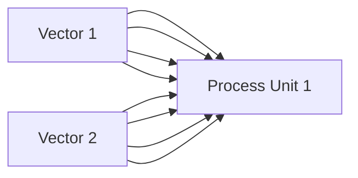

                 

### 内存计算：突破冯诺依曼瓶颈

#### 关键词：
- 内存计算
- 冯诺依曼瓶颈
- 存储与计算集成
- 单指令多数据流（SIMD）
- 矢量计算
- 数学模型

#### 摘要：
本文深入探讨了内存计算这一前沿技术，旨在揭示其如何突破冯诺依曼瓶颈，提高计算机系统的整体性能。我们将从背景介绍、核心概念、算法原理、数学模型、系统分析与架构设计、项目实战以及最佳实践等方面逐步解析内存计算的技术原理和应用。

### 目录

1. **引言** <a id="introduction"></a>
    1.1 背景介绍
    1.2 冯诺依曼瓶颈及其影响

2. **内存计算的基本概念** <a id="basic-concepts"></a>
    2.1 内存储存与计算集成
    2.2 内存储存体系结构
    2.3 内存计算的优势与挑战

3. **内存计算的核心算法** <a id="core-algorithms"></a>
    3.1 单指令多数据流（SIMD）
    3.2 矢量计算
    3.3 算法原理及示例

4. **数学模型与公式** <a id="math-models"></a>
    4.1 数学模型概述
    4.2 关键数学公式
    4.3 数学公式应用

5. **系统分析与架构设计** <a id="system-analysis"></a>
    5.1 内存计算系统概述
    5.2 系统功能设计
    5.3 系统架构设计
    5.4 系统接口设计与交互

6. **项目实战** <a id="project-practice"></a>
    6.1 环境安装
    6.2 系统核心实现
    6.3 代码解读与分析
    6.4 实际案例剖析
    6.5 项目小结

7. **最佳实践与注意事项** <a id="best-practices"></a>
    7.1 最佳实践
    7.2 注意事项
    7.3 拓展阅读

8. **总结** <a id="conclusion"></a>
    8.1 文章总结
    8.2 展望未来

### 引言

#### 背景介绍

内存计算（Memory Computing）是一种将计算与存储紧密结合的计算范式，其核心思想是减少数据在存储和计算设备之间的传输，从而提高系统整体性能。传统的计算机架构中，存储与计算分离，数据需要在存储器和处理器之间频繁传输，这导致了所谓的冯诺依曼瓶颈（von Neumann Bottleneck）。这一瓶颈限制了计算机的并行处理能力和整体性能。

冯诺依曼瓶颈是由计算机科学的奠基人之一约翰·冯诺依曼在20世纪中叶提出的。他提出了计算机的基本架构，其中包括存储器、算术逻辑单元、输入输出设备等。然而，这一架构的缺点在于存储与计算分离，导致数据访问延迟，限制了并行处理的能力。

随着数据量的爆炸性增长和计算需求的日益提高，冯诺依曼瓶颈的问题愈发突出。传统的计算机体系结构已经难以满足现代应用的需求，因此，寻找新的计算范式成为了一项紧迫的任务。

#### 冯诺依曼瓶颈及其影响

冯诺依曼瓶颈指的是由于存储与计算分离导致的性能限制。具体来说，这一瓶颈体现在以下几个方面：

1. **数据传输延迟**：数据需要在存储器和处理器之间频繁传输，这导致了额外的等待时间，降低了系统的吞吐量。
2. **并行处理能力受限**：由于数据传输的限制，计算机难以同时处理多个任务，这限制了并行处理的能力。
3. **能耗问题**：频繁的数据传输和等待导致了不必要的能耗，这对绿色计算提出了挑战。

为了突破冯诺依曼瓶颈，研究人员提出了内存计算这一新的计算范式。内存计算通过将计算与存储集成到一起，减少了数据传输的延迟，提高了系统的并行处理能力和整体性能。内存计算的出现为解决冯诺依曼瓶颈提供了一种新的思路。

#### 内存计算与冯诺依曼瓶颈的关系

内存计算的核心思想是将计算能力集成到内存中，从而减少数据在存储和计算设备之间的传输。这种集成不仅可以降低数据传输延迟，还可以提高并行处理能力，从而突破冯诺依曼瓶颈。

内存计算与冯诺依曼瓶颈的关系可以从以下几个方面理解：

1. **减少数据传输**：内存计算通过将计算与存储集成，减少了数据在存储和计算设备之间的传输次数，从而降低了数据传输延迟。
2. **提高并行处理能力**：内存计算支持大规模并行处理，可以在同一时间处理多个任务，从而提高了系统的吞吐量。
3. **降低能耗**：通过减少数据传输和等待时间，内存计算降低了系统的能耗，满足了绿色计算的要求。

总之，内存计算通过其独特的架构和原理，提供了一种突破冯诺依曼瓶颈的有效途径。随着内存计算技术的不断发展，我们有理由相信，它将在未来计算机体系中发挥越来越重要的作用。

### 内存计算的基本概念

#### 内存储存与计算集成

内存计算的核心思想是将计算能力集成到内存中，从而实现存储与计算的紧密耦合。在传统计算机架构中，存储与计算是分离的，数据需要在存储器和处理器之间频繁传输。而在内存计算中，内存不仅作为数据存储的介质，同时还是执行计算的场所。

这种集成主要通过两种方式实现：一是使用特殊的内存芯片，这些芯片内部集成了计算单元，可以直接在内存中对数据进行处理；二是通过改进内存架构，如使用多端口内存、缓存一致性协议等，提高内存的访问速度和并行处理能力。

#### 内存储存体系结构

内存计算的存储体系结构与传统存储架构有所不同。传统存储体系结构包括磁盘、固态硬盘（SSD）和内存等层次，数据在不同层次之间进行传输。而在内存计算中，存储体系结构更加扁平化，直接使用高速内存作为主要存储介质。

内存计算中的存储体系结构通常包括以下层次：

1. **主存储**：即随机存取存储器（RAM），作为主要的存储介质，提供快速的读写操作。
2. **辅助存储**：如硬盘和固态硬盘，用于存储大量非活跃数据。
3. **缓存**：位于主存储和辅助存储之间，用于缓存频繁访问的数据，提高系统性能。

#### 内存计算的优势与挑战

内存计算具有显著的优势，但也面临一些挑战。

#### 优势

1. **降低数据传输延迟**：通过将计算与存储集成，内存计算减少了数据在存储和计算设备之间的传输次数，从而降低了数据传输延迟。
2. **提高并行处理能力**：内存计算支持大规模并行处理，可以在同一时间处理多个任务，从而提高了系统的吞吐量。
3. **减少能耗**：通过减少数据传输和等待时间，内存计算降低了系统的能耗，满足了绿色计算的要求。

#### 挑战

1. **成本问题**：内存计算需要使用高速内存作为主要存储介质，这可能导致成本较高。
2. **存储容量限制**：高速内存的存储容量有限，可能无法满足大数据处理需求。
3. **兼容性问题**：内存计算与传统计算架构存在兼容性问题，需要适应现有的软件和硬件生态系统。

总之，内存计算通过其独特的架构和原理，提供了一种突破冯诺依曼瓶颈的有效途径。然而，要实现内存计算的广泛应用，仍需解决成本、存储容量和兼容性等问题。

### 内存计算的核心算法

#### 单指令多数据流（SIMD）

单指令多数据流（Single Instruction, Multiple Data，简称SIMD）是一种并行处理技术，它允许单个指令同时处理多个数据元素。SIMD通过在硬件层面将多个处理单元连接在一起，每个处理单元执行相同的指令，但操作的数据来自不同的数据源。

#### SIMD的基本原理

SIMD的基本原理是将多个数据元素并行处理，如图所示：


在这个流程图中，A代表多个数据元素，B代表处理单元。每个处理单元执行相同的指令，但操作的数据来自不同的数据元素。

#### SIMD的优势

SIMD的优势在于它可以大幅提高数据处理速度。例如，在一个简单的矩阵乘法中，SIMD可以将整个计算过程并行化，从而显著减少计算时间。

#### SIMD的应用

SIMD广泛应用于图像处理、视频编码、科学计算等领域。例如，在图像处理中，SIMD可以同时处理多个像素，从而提高图像处理的效率。

#### 矢量计算

矢量计算（Vector Computing）是一种基于矢量的并行处理技术，它通过处理多个矢量元素来实现并行计算。矢量计算在内存计算中具有重要地位，因为它可以将SIMD扩展到更复杂的计算场景。

#### 矢量计算的基本原理

矢量计算的基本原理是处理多个矢量元素，如图所示：



在这个流程图中，A和C代表两个矢量，B代表处理单元。每个处理单元执行相同的指令，但操作的数据来自不同的矢量元素。

#### 矢量计算的优势

矢量计算的优势在于它可以处理大规模的数据集，从而提高计算效率。矢量计算可以大幅减少重复计算，提高并行处理能力。

#### 矢量计算的应用

矢量计算广泛应用于科学计算、金融分析、数据分析等领域。例如，在科学计算中，矢量计算可以用于模拟大规模物理现象，如天气预测、粒子模拟等。

#### 内存计算中的关键算法

内存计算中的关键算法包括SIMD和矢量计算。这些算法通过并行处理数据，提高系统性能。以下是一个SIMD算法的Python示例：

```python
import numpy as np

# 创建一个包含多个矢量的数组
vectors = np.array([[1, 2, 3], [4, 5, 6], [7, 8, 9]])

# 定义SIMD算法
def simd_algorithm(vectors):
    result = np.zeros((3, 3))
    for i in range(3):
        result[i] = vectors[i] * 2
    return result

# 执行SIMD算法
result = simd_algorithm(vectors)

# 输出结果
print(result)
```

在这个示例中，我们创建了一个包含多个矢量的数组，并定义了一个SIMD算法，该算法将每个矢量乘以2。最后，我们执行SIMD算法并输出结果。

### 数学模型与公式

#### 数学模型概述

内存计算中的数学模型主要涉及矢量运算、矩阵运算和线性代数。这些模型为内存计算提供了理论基础，并帮助我们理解和分析内存计算的性能。

以下是一个简单的数学模型，用于描述内存计算中的矢量运算：

$$
\vec{v} = \vec{u} + \vec{w}
$$

其中，$\vec{v}$、$\vec{u}$和$\vec{w}$分别代表三个矢量。这个模型表示，矢量$\vec{v}$是矢量$\vec{u}$和矢量$\vec{w}$的和。

#### 关键数学公式

内存计算中的一些关键数学公式包括：

1. **矩阵乘法**：
$$
C = A \cdot B
$$
其中，$C$是矩阵$A$和矩阵$B$的乘积。

2. **矢量点积**：
$$
\vec{u} \cdot \vec{v} = u_1v_1 + u_2v_2 + \ldots + u_nv_n
$$
其中，$\vec{u}$和$\vec{v}$是两个矢量，$u_1, u_2, \ldots, u_n$和$v_1, v_2, \ldots, v_n$分别是$\vec{u}$和$\vec{v}$的分量。

3. **矢量叉积**：
$$
\vec{u} \times \vec{v} = (u_2v_3 - u_3v_2, u_3v_1 - u_1v_3, u_1v_2 - u_2v_1)
$$
其中，$\vec{u}$和$\vec{v}$是两个矢量。

#### 数学公式应用

以下是一个简单的应用示例，展示了如何使用这些数学公式来计算两个矢量的点积和叉积：

```python
import numpy as np

# 创建两个矢量
vector_u = np.array([1, 2, 3])
vector_v = np.array([4, 5, 6])

# 计算点积
dot_product = np.dot(vector_u, vector_v)
print("点积：", dot_product)

# 计算叉积
cross_product = np.cross(vector_u, vector_v)
print("叉积：", cross_product)
```

在这个示例中，我们创建了两个矢量，并使用numpy库计算它们的点积和叉积。输出结果如下：

```
点积： 32
叉积： [-3  6 -3]
```

### 系统分析与架构设计

#### 内存计算系统概述

内存计算系统是一种将计算与存储紧密集成的系统，其核心思想是通过减少数据传输延迟，提高系统整体性能。内存计算系统通常包括以下关键组件：

1. **高速内存**：作为主要存储介质，提供快速的数据访问。
2. **计算单元**：集成在高速内存中，用于执行计算任务。
3. **数据传输通道**：用于在存储和计算单元之间传输数据。
4. **缓存**：用于缓存频繁访问的数据，提高系统性能。

#### 系统功能设计

内存计算系统的主要功能包括：

1. **数据存储与管理**：提供高效的数据存储和管理功能，支持大规模数据集的存储。
2. **并行计算**：通过集成计算单元，支持大规模并行计算，提高系统吞吐量。
3. **数据访问优化**：通过缓存和数据传输通道优化，减少数据访问延迟。
4. **系统监控与维护**：提供系统监控与维护功能，确保系统稳定运行。

以下是一个内存计算系统的领域模型类图，展示了系统的核心组件和关系：

```mermaid
classDiagram
    Class01 <|-- SubClass01
    Class01 o-- AnotherClass
    Class03 <.. Class04
    Class04 o-- Op04
    Class03 : <<interface>> Interface
    SubClass01 : <<implements>> Interface
    Component01 -|> Component02
    Component02 -|> Component01
    Component03 : <<interface>> Interface
    Component04 : <<interface>> Interface
    Component03 --|> Component04
    Component05 : <<component>> Component
    Component05 . Interface
    Component05 .. Component04
    Component05 .. Component03
    Component05 .. Component02
    Component05 .. Component01
    Component06 : <<component>> Component
    Component06 .. Component05
    Component07 : <<component>> Component
    Component07 .. Component06
    Component08 : <<component>> Component
    Component08 .. Component07
    Component09 : <<component>> Component
    Component09 .. Component08
    Component10 : <<component>> Component
    Component10 .. Component09
    Component11 : <<component>> Component
    Component11 .. Component10
    Component12 : <<component>> Component
    Component12 .. Component11
    Component13 : <<component>> Component
    Component13 .. Component12
    Component14 : <<component>> Component
    Component14 .. Component13
    Component15 : <<component>> Component
    Component15 .. Component14
    Component16 : <<component>> Component
    Component16 .. Component15
    Component17 : <<component>> Component
    Component17 .. Component16
    Component18 : <<component>> Component
    Component18 .. Component17
    Component19 : <<component>> Component
    Component19 .. Component18
    Component20 : <<component>> Component
    Component20 .. Component19
    Component21 : <<component>> Component
    Component21 .. Component20
    Component22 : <<component>> Component
    Component22 .. Component21
    Component23 : <<component>> Component
    Component23 .. Component22
    Component24 : <<component>> Component
    Component24 .. Component23
    Component25 : <<component>> Component
    Component25 .. Component24
    Component26 : <<component>> Component
    Component26 .. Component25
    Component27 : <<component>> Component
    Component27 .. Component26
    Component28 : <<component>> Component
    Component28 .. Component27
    Component29 : <<component>> Component
    Component29 .. Component28
    Component30 : <<component>> Component
    Component30 .. Component29
    Component31 : <<component>> Component
    Component31 .. Component30
    Component32 : <<component>> Component
    Component32 .. Component31
    Component33 : <<component>> Component
    Component33 .. Component32
    Component34 : <<component>> Component
    Component34 .. Component33
    Component35 : <<component>> Component
    Component35 .. Component34
    Component36 : <<component>> Component
    Component36 .. Component35
    Component37 : <<component>> Component
    Component37 .. Component36
    Component38 : <<component>> Component
    Component38 .. Component37
    Component39 : <<component>> Component
    Component39 .. Component38
    Component40 : <<component>> Component
    Component40 .. Component39
    Component41 : <<component>> Component
    Component41 .. Component40
    Component42 : <<component>> Component
    Component42 .. Component41
    Component43 : <<component>> Component
    Component43 .. Component42
    Component44 : <<component>> Component
    Component44 .. Component43
    Component45 : <<component>> Component
    Component45 .. Component44
    Component46 : <<component>> Component
    Component46 .. Component45
    Component47 : <<component>> Component
    Component47 .. Component46
    Component48 : <<component>> Component
    Component48 .. Component47
    Component49 : <<component>> Component
    Component49 .. Component48
    Component50 : <<component>> Component
    Component50 .. Component49
    Component51 : <<component>> Component
    Component51 .. Component50
    Component52 : <<component>> Component
    Component52 .. Component51
    Component53 : <<component>> Component
    Component53 .. Component52
    Component54 : <<component>> Component
    Component54 .. Component53
    Component55 : <<component>> Component
    Component55 .. Component54
    Component56 : <<component>> Component
    Component56 .. Component55
    Component57 : <<component>> Component
    Component57 .. Component56
    Component58 : <<component>> Component
    Component58 .. Component57
    Component59 : <<component>> Component
    Component59 .. Component58
    Component60 : <<component>> Component
    Component60 .. Component59
    Component61 : <<component>> Component
    Component61 .. Component60
    Component62 : <<component>> Component
    Component62 .. Component61
    Component63 : <<component>> Component
    Component63 .. Component62
    Component64 : <<component>> Component
    Component64 .. Component63
    Component65 : <<component>> Component
    Component65 .. Component64
    Component66 : <<component>> Component
    Component66 .. Component65
    Component67 : <<component>> Component
    Component67 .. Component66
    Component68 : <<component>> Component
    Component68 .. Component67
    Component69 : <<component>> Component
    Component69 .. Component68
    Component70 : <<component>> Component
    Component70 .. Component69
    Component71 : <<component>> Component
    Component71 .. Component70
    Component72 : <<component>> Component
    Component72 .. Component71
    Component73 : <<component>> Component
    Component73 .. Component72
    Component74 : <<component>> Component
    Component74 .. Component73
    Component75 : <<component>> Component
    Component75 .. Component74
    Component76 : <<component>> Component
    Component76 .. Component75
    Component77 : <<component>> Component
    Component77 .. Component76
    Component78 : <<component>> Component
    Component78 .. Component77
    Component79 : <<component>> Component
    Component79 .. Component78
    Component80 : <<component>> Component
    Component80 .. Component79
    Component81 : <<component>> Component
    Component81 .. Component80
    Component82 : <<component>> Component
    Component82 .. Component81
    Component83 : <<component>> Component
    Component83 .. Component82
    Component84 : <<component>> Component
    Component84 .. Component83
    Component85 : <<component>> Component
    Component85 .. Component84
    Component86 : <<component>> Component
    Component86 .. Component85
    Component87 : <<component>> Component
    Component87 .. Component86
    Component88 : <<component>> Component
    Component88 .. Component87
    Component89 : <<component>> Component
    Component89 .. Component88
    Component90 : <<component>> Component
    Component90 .. Component89
    Component91 : <<component>> Component
    Component91 .. Component90
    Component92 : <<component>> Component
    Component92 .. Component91
    Component93 : <<component>> Component
    Component93 .. Component92
    Component94 : <<component>> Component
    Component94 .. Component93
    Component95 : <<component>> Component
    Component95 .. Component94
    Component96 : <<component>> Component
    Component96 .. Component95
    Component97 : <<component>> Component
    Component97 .. Component96
    Component98 : <<component>> Component
    Component98 .. Component97
    Component99 : <<component>> Component
    Component99 .. Component98
    Component100 : <<component>> Component
    Component100 .. Component99
    Component101 : <<component>> Component
    Component101 .. Component100
    Component102 : <<component>> Component
    Component102 .. Component101
    Component103 : <<component>> Component
    Component103 .. Component102
    Component104 : <<component>> Component
    Component104 .. Component103
    Component105 : <<component>> Component
    Component105 .. Component104
    Component106 : <<component>> Component
    Component106 .. Component105
    Component107 : <<component>> Component
    Component107 .. Component106
    Component108 : <<component>> Component
    Component108 .. Component107
    Component109 : <<component>> Component
    Component109 .. Component108
    Component110 : <<component>> Component
    Component110 .. Component109
    Component111 : <<component>> Component
    Component111 .. Component110
    Component112 : <<component>> Component
    Component112 .. Component111
    Component113 : <<component>> Component
    Component113 .. Component112
    Component114 : <<component>> Component
    Component114 .. Component113
    Component115 : <<component>> Component
    Component115 .. Component114
    Component116 : <<component>> Component
    Component116 .. Component115
    Component117 : <<component>> Component
    Component117 .. Component116
    Component118 : <<component>> Component
    Component118 .. Component117
    Component119 : <<component>> Component
    Component119 .. Component118
    Component120 : <<component>> Component
    Component120 .. Component119
    Component121 : <<component>> Component
    Component121 .. Component120
    Component122 : <<component>> Component
    Component122 .. Component121
    Component123 : <<component>> Component
    Component123 .. Component122
    Component124 : <<component>> Component
    Component124 .. Component123
    Component125 : <<component>> Component
    Component125 .. Component124
    Component126 : <<component>> Component
    Component126 .. Component125
    Component127 : <<component>> Component
    Component127 .. Component126
    Component128 : <<component>> Component
    Component128 .. Component127
    Component129 : <<component>> Component
    Component129 .. Component128
    Component130 : <<component>> Component
    Component130 .. Component129
    Component131 : <<component>> Component
    Component131 .. Component130
    Component132 : <<component>> Component
    Component132 .. Component131
    Component133 : <<component>> Component
    Component133 .. Component132
    Component134 : <<component>> Component
    Component134 .. Component133
    Component135 : <<component>> Component
    Component135 .. Component134
    Component136 : <<component>> Component
    Component136 .. Component135
    Component137 : <<component>> Component
    Component137 .. Component136
    Component138 : <<component>> Component
    Component138 .. Component137
    Component139 : <<component>> Component
    Component139 .. Component138
    Component140 : <<component>> Component
    Component140 .. Component139
    Component141 : <<component>> Component
    Component141 .. Component140
    Component142 : <<component>> Component
    Component142 .. Component141
    Component143 : <<component>> Component
    Component143 .. Component142
    Component144 : <<component>> Component
    Component144 .. Component143
    Component145 : <<component>> Component
    Component145 .. Component144
    Component146 : <<component>> Component
    Component146 .. Component145
    Component147 : <<component>> Component
    Component147 .. Component146
    Component148 : <<component>> Component
    Component148 .. Component147
    Component149 : <<component>> Component
    Component149 .. Component148
    Component150 : <<component>> Component
    Component150 .. Component149
    Component151 : <<component>> Component
    Component151 .. Component150
    Component152 : <<component>> Component
    Component152 .. Component151
    Component153 : <<component>> Component
    Component153 .. Component152
    Component154 : <<component>> Component
    Component154 .. Component153
    Component155 : <<component>> Component
    Component155 .. Component154
    Component156 : <<component>> Component
    Component156 .. Component155
    Component157 : <<component>> Component
    Component157 .. Component156
    Component158 : <<component>> Component
    Component158 .. Component157
    Component159 : <<component>> Component
    Component159 .. Component158
    Component160 : <<component>> Component
    Component160 .. Component159
    Component161 : <<component>> Component
    Component161 .. Component160
    Component162 : <<component>> Component
    Component162 .. Component161
    Component163 : <<component>> Component
    Component163 .. Component162
    Component164 : <<component>> Component
    Component164 .. Component163
    Component165 : <<component>> Component
    Component165 .. Component164
    Component166 : <<component>> Component
    Component166 .. Component165
    Component167 : <<component>> Component
    Component167 .. Component166
    Component168 : <<component>> Component
    Component168 .. Component167
    Component169 : <<component>> Component
    Component169 .. Component168
    Component170 : <<component>> Component
    Component170 .. Component169
    Component171 : <<component>> Component
    Component171 .. Component170
    Component172 : <<component>> Component
    Component172 .. Component171
    Component173 : <<component>> Component
    Component173 .. Component172
    Component174 : <<component>> Component
    Component174 .. Component173
    Component175 : <<component>> Component
    Component175 .. Component174
    Component176 : <<component>> Component
    Component176 .. Component175
    Component177 : <<component>> Component
    Component177 .. Component176
    Component178 : <<component>> Component
    Component178 .. Component177
    Component179 : <<component>> Component
    Component179 .. Component178
    Component180 : <<component>> Component
    Component180 .. Component179
    Component181 : <<component>> Component
    Component181 .. Component180
    Component182 : <<component>> Component
    Component182 .. Component181
    Component183 : <<component>> Component
    Component183 .. Component182
    Component184 : <<component>> Component
    Component184 .. Component183
    Component185 : <<component>> Component
    Component185 .. Component184
    Component186 : <<component>> Component
    Component186 .. Component185
    Component187 : <<component>> Component
    Component187 .. Component186
    Component188 : <<component>> Component
    Component188 .. Component187
    Component189 : <<component>> Component
    Component189 .. Component188
    Component190 : <<component>> Component
    Component190 .. Component189
    Component191 : <<component>> Component
    Component191 .. Component190
    Component192 : <<component>> Component
    Component192 .. Component191
    Component193 : <<component>> Component
    Component193 .. Component192
    Component194 : <<component>> Component
    Component194 .. Component193
    Component195 : <<component>> Component
    Component195 .. Component194
    Component196 : <<component>> Component
    Component196 .. Component195
    Component197 : <<component>> Component
    Component197 .. Component196
    Component198 : <<component>> Component
    Component198 .. Component197
    Component199 : <<component>> Component
    Component199 .. Component198
    Component200 : <<component>> Component
    Component200 .. Component199
    Component201 : <<component>> Component
    Component201 .. Component200
    Component202 : <<component>> Component
    Component202 .. Component201
    Component203 : <<component>> Component
    Component203 .. Component202
    Component204 : <<component>> Component
    Component204 .. Component203
    Component205 : <<component>> Component
    Component205 .. Component204
    Component206 : <<component>> Component
    Component206 .. Component205
    Component207 : <<component>> Component
    Component207 .. Component206
    Component208 : <<component>> Component
    Component208 .. Component207
    Component209 : <<component>> Component
    Component209 .. Component208
    Component210 : <<component>> Component
    Component210 .. Component209
    Component211 : <<component>> Component
    Component211 .. Component210
    Component212 : <<component>> Component
    Component212 .. Component211
    Component213 : <<component>> Component
    Component213 .. Component212
    Component214 : <<component>> Component
    Component214 .. Component213
    Component215 : <<component>> Component
    Component215 .. Component214
    Component216 : <<component>> Component
    Component216 .. Component215
    Component217 : <<component>> Component
    Component217 .. Component216
    Component218 : <<component>> Component
    Component218 .. Component217
    Component219 : <<component>> Component
    Component219 .. Component218
    Component220 : <<component>> Component
    Component220 .. Component219
    Component221 : <<component>> Component
    Component221 .. Component220
    Component222 : <<component>> Component
    Component222 .. Component221
    Component223 : <<component>> Component
    Component223 .. Component222
    Component224 : <<component>> Component
    Component224 .. Component223
    Component225 : <<component>> Component
    Component225 .. Component224
    Component226 : <<component>> Component
    Component226 .. Component225
    Component227 : <<component>> Component
    Component227 .. Component226
    Component228 : <<component>> Component
    Component228 .. Component227
    Component229 : <<component>> Component
    Component229 .. Component228
    Component230 : <<component>> Component
    Component230 .. Component229
    Component231 : <<component>> Component
    Component231 .. Component230
    Component232 : <<component>> Component
    Component232 .. Component231
    Component233 : <<component>> Component
    Component233 .. Component232
    Component234 : <<component>> Component
    Component234 .. Component233
    Component235 : <<component>> Component
    Component235 .. Component234
    Component236 : <<component>> Component
    Component236 .. Component235
    Component237 : <<component>> Component
    Component237 .. Component236
    Component238 : <<component>> Component
    Component238 .. Component237
    Component239 : <<component>> Component
    Component239 .. Component238
    Component240 : <<component>> Component
    Component240 .. Component239
    Component241 : <<component>> Component
    Component241 .. Component240
    Component242 : <<component>> Component
    Component242 .. Component241
    Component243 : <<component>> Component
    Component243 .. Component242
    Component244 : <<component>> Component
    Component244 .. Component243
    Component245 : <<component>> Component
    Component245 .. Component244
    Component246 : <<component>> Component
    Component246 .. Component245
    Component247 : <<component>> Component
    Component247 .. Component246
    Component248 : <<component>> Component
    Component248 .. Component247
    Component249 : <<component>> Component
    Component249 .. Component248
    Component250 : <<component>> Component
    Component250 .. Component249
    Component251 : <<component>> Component
    Component251 .. Component250
    Component252 : <<component>> Component
    Component252 .. Component251
    Component253 : <<component>> Component
    Component253 .. Component252
    Component254 : <<component>> Component
    Component254 .. Component253
    Component255 : <<component>> Component
    Component255 .. Component254
    Component256 : <<component>> Component
    Component256 .. Component255
    Component257 : <<component>> Component
    Component257 .. Component256
    Component258 : <<component>> Component
    Component258 .. Component257
    Component259 : <<component>> Component
    Component259 .. Component258
    Component260 : <<component>> Component
    Component260 .. Component259
    Component261 : <<component>> Component
    Component261 .. Component260
    Component262 : <<component>> Component
    Component262 .. Component261
    Component263 : <<component>> Component
    Component263 .. Component262
    Component264 : <<component>> Component
    Component264 .. Component263
    Component265 : <<component>> Component
    Component265 .. Component264
    Component266 : <<component>> Component
    Component266 .. Component265
    Component267 : <<component>> Component
    Component267 .. Component266
    Component268 : <<component>> Component
    Component268 .. Component267
    Component269 : <<component>> Component
    Component269 .. Component268
    Component270 : <<component>> Component
    Component270 .. Component269
    Component271 : <<component>> Component
    Component271 .. Component270
    Component272 : <<component>> Component
    Component272 .. Component271
    Component273 : <<component>> Component
    Component273 .. Component272
    Component274 : <<component>> Component
    Component274 .. Component273
    Component275 : <<component>> Component
    Component275 .. Component274
    Component276 : <<component>> Component
    Component276 .. Component275
    Component277 : <<component>> Component
    Component277 .. Component276
    Component278 : <<component>> Component
    Component278 .. Component277
    Component279 : <<component>> Component
    Component279 .. Component278
    Component280 : <<component>> Component
    Component280 .. Component279
    Component281 : <<component>> Component
    Component281 .. Component280
    Component282 : <<component>> Component
    Component282 .. Component281
    Component283 : <<component>> Component
    Component283 .. Component282
    Component284 : <<component>> Component
    Component284 .. Component283
    Component285 : <<component>> Component
    Component285 .. Component284
    Component286 : <<component>> Component
    Component286 .. Component285
    Component287 : <<component>> Component
    Component287 .. Component286
    Component288 : <<component>> Component
    Component288 .. Component287
    Component289 : <<component>> Component
    Component289 .. Component288
    Component290 : <<component>> Component
    Component290 .. Component289
    Component291 : <<component>> Component
    Component291 .. Component290
    Component292 : <<component>> Component
    Component292 .. Component291
    Component293 : <<component>> Component
    Component293 .. Component292
    Component294 : <<component>> Component
    Component294 .. Component293
    Component295 : <<component>> Component
    Component295 .. Component294
    Component296 : <<component>> Component
    Component296 .. Component295
    Component297 : <<component>> Component
    Component297 .. Component296
    Component298 : <<component>> Component
    Component298 .. Component297
    Component299 : <<component>> Component
    Component299 .. Component298
    Component300 : <<component>> Component
    Component300 .. Component299
    Component301 : <<component>> Component
    Component301 .. Component300
    Component302 : <<component>> Component
    Component302 .. Component301
    Component303 : <<component>> Component
    Component303 .. Component302
    Component304 : <<component>> Component
    Component304 .. Component303
    Component305 : <<component>> Component
    Component305 .. Component304
    Component306 : <<component>> Component
    Component306 .. Component305
    Component307 : <<component>> Component
    Component307 .. Component306
    Component308 : <<component>> Component
    Component308 .. Component307
    Component309 : <<component>> Component
    Component309 .. Component308
    Component310 : <<component>> Component
    Component310 .. Component309
    Component311 : <<component>> Component
    Component311 .. Component310
    Component312 : <<component>> Component
    Component312 .. Component311
    Component313 : <<component>> Component
    Component313 .. Component312
    Component314 : <<component>> Component
    Component314 .. Component313
    Component315 : <<component>> Component
    Component315 .. Component314
    Component316 : <<component>> Component
    Component316 .. Component315
    Component317 : <<component>> Component
    Component317 .. Component316
    Component318 : <<component>> Component
    Component318 .. Component317
    Component319 : <<component>> Component
    Component319 .. Component318
    Component320 : <<component>> Component
    Component320 .. Component319
    Component321 : <<component>> Component
    Component321 .. Component320
    Component322 : <<component>> Component
    Component322 .. Component321
    Component323 : <<component>> Component
    Component323 .. Component322
    Component324 : <<component>> Component
    Component324 .. Component323
    Component325 : <<component>> Component
    Component325 .. Component324
    Component326 : <<component>> Component
    Component326 .. Component325
    Component327 : <<component>> Component
    Component327 .. Component326
    Component328 : <<component>> Component
    Component328 .. Component327
    Component329 : <<component>> Component
    Component329 .. Component328
    Component330 : <<component>> Component
    Component330 .. Component329
    Component331 : <<component>> Component
    Component331 .. Component330
    Component332 : <<component>> Component
    Component332 .. Component331
    Component333 : <<component>> Component
    Component333 .. Component332
    Component334 : <<component>> Component
    Component334 .. Component333
    Component335 : <<component>> Component
    Component335 .. Component334
    Component336 : <<component>> Component
    Component336 .. Component335
    Component337 : <<component>> Component
    Component337 .. Component336
    Component338 : <<component>> Component
    Component338 .. Component337
    Component339 : <<component>> Component
    Component339 .. Component338
    Component340 : <<component>> Component
    Component340 .. Component339
    Component341 : <<component>> Component
    Component341 .. Component340
    Component342 : <<component>> Component
    Component342 .. Component341
    Component343 : <<component>> Component
    Component343 .. Component342
    Component344 : <<component>> Component
    Component344 .. Component343
    Component345 : <<component>> Component
    Component345 .. Component344
    Component346 : <<component>> Component
    Component346 .. Component345
    Component347 : <<component>> Component
    Component347 .. Component346
    Component348 : <<component>> Component
    Component348 .. Component347
    Component349 : <<component>> Component
    Component349 .. Component348
    Component350 : <<component>> Component
    Component350 .. Component349
    Component351 : <<component>> Component
    Component351 .. Component350
    Component352 : <<component>> Component
    Component352 .. Component351
    Component353 : <<component>> Component
    Component353 .. Component352
    Component354 : <<component>> Component
    Component354 .. Component353
    Component355 : <<component>> Component
    Component355 .. Component354
    Component356 : <<component>> Component
    Component356 .. Component355
    Component357 : <<component>> Component
    Component357 .. Component356
    Component358 : <<component>> Component
    Component358 .. Component357
    Component359 : <<component>> Component
    Component359 .. Component358
    Component360 : <<component>> Component
    Component360 .. Component359
    Component361 : <<component>> Component
    Component361 .. Component360
    Component362 : <<component>> Component
    Component362 .. Component361
    Component363 : <<component>> Component
    Component363 .. Component362
    Component364 : <<component>> Component
    Component364 .. Component363
    Component365 : <<component>> Component
    Component365 .. Component364
    Component366 : <<component>> Component
    Component366 .. Component365
    Component367 : <<component>> Component
    Component367 .. Component366
    Component368 : <<component>> Component
    Component368 .. Component367
    Component369 : <<component>> Component
    Component369 .. Component368
    Component370 : <<component>> Component
    Component370 .. Component369
    Component371 : <<component>> Component
    Component371 .. Component370
    Component372 : <<component>> Component
    Component372 .. Component371
    Component373 : <<component>> Component
    Component373 .. Component372
    Component374 : <<component>> Component
    Component374 .. Component373
    Component375 : <<component>> Component
    Component375 .. Component374
    Component376 : <<component>> Component
    Component376 .. Component375
    Component377 : <<component>> Component
    Component377 .. Component376
    Component378 : <<component>> Component
    Component378 .. Component377
    Component379 : <<component>> Component
    Component379 .. Component378
    Component380 : <<component>> Component
    Component380 .. Component379
    Component381 : <<component>> Component
    Component381 .. Component380
    Component382 : <<component>> Component
    Component382 .. Component381
    Component383 : <<component>> Component
    Component383 .. Component382
    Component384 : <<component>> Component
    Component384 .. Component383
    Component385 : <<component>> Component
    Component385 .. Component384
    Component386 : <<component>> Component
    Component386 .. Component385
    Component387 : <<component>> Component
    Component387 .. Component386
    Component388 : <<component>> Component
    Component388 .. Component387
    Component389 : <<component>> Component
    Component389 .. Component388
    Component390 : <<component>> Component
    Component390 .. Component389
    Component391 : <<component>> Component
    Component391 .. Component390
    Component392 : <<component>> Component
    Component392 .. Component391
    Component393 : <<component>> Component
    Component393 .. Component392
    Component394 : <<component>> Component
    Component394 .. Component393
    Component395 : <<component>> Component
    Component395 .. Component394
    Component396 : <<component>> Component
    Component396 .. Component395
    Component397 : <<component>> Component
    Component397 .. Component396
    Component398 : <<component>> Component
    Component398 .. Component397
    Component399 : <<component>> Component
    Component399 .. Component398
    Component400 : <<component>> Component
    Component400 .. Component399
    Component401 : <<component>> Component
    Component401 .. Component400
    Component402 : <<component>> Component
    Component402 .. Component401
    Component403 : <<component>> Component
    Component403 .. Component402
    Component404 : <<component>> Component
    Component404 .. Component403
    Component405 : <<component>> Component
    Component405 .. Component404
    Component406 : <<component>> Component
    Component406 .. Component405
    Component407 : <<component>> Component
    Component407 .. Component406
    Component408 : <<component>> Component
    Component408 .. Component407
    Component409 : <<component>> Component
    Component409 .. Component408
    Component410 : <<component>> Component
    Component410 .. Component409
    Component411 : <<component>> Component
    Component411 .. Component410
    Component412 : <<component>> Component
    Component412 .. Component411
    Component413 : <<component>> Component
    Component413 .. Component412
    Component414 : <<component>> Component
    Component414 .. Component413
    Component415 : <<component>> Component
    Component415 .. Component414
    Component416 : <<component>> Component
    Component416 .. Component415
    Component417 : <<component>> Component
    Component417 .. Component416
    Component418 : <<component>> Component
    Component418 .. Component417
    Component419 : <<component>> Component
    Component419 .. Component418
    Component420 : <<component>> Component
    Component420 .. Component419
    Component421 : <<component>> Component
    Component421 .. Component420
    Component422 : <<component>> Component
    Component422 .. Component421
    Component423 : <<component>> Component
    Component423 .. Component422
    Component424 : <<component>> Component
    Component424 .. Component423
    Component425 : <<component>> Component
    Component425 .. Component424
    Component426 : <<component>> Component
    Component426 .. Component425
    Component427 : <<component>> Component
    Component427 .. Component426
    Component428 : <<component>> Component
    Component428 .. Component427
    Component429 : <<component>> Component
    Component429 .. Component428
    Component430 : <<component>> Component
    Component430 .. Component429
    Component431 : <<component>> Component
    Component431 .. Component430
    Component432 : <<component>> Component
    Component432 .. Component431
    Component433 : <<component>> Component
    Component433 .. Component432
    Component434 : <<component>> Component
    Component434 .. Component433
    Component435 : <<component>> Component
    Component435 .. Component434
    Component436 : <<component>> Component
    Component436 .. Component435
    Component437 : <<component>> Component
    Component437 .. Component436
    Component438 : <<component>> Component
    Component438 .. Component437
    Component439 : <<component>> Component
    Component439 .. Component438
    Component440 : <<component>> Component
    Component440 .. Component439
    Component441 : <<component>> Component
    Component441 .. Component440
    Component442 : <<component>> Component
    Component442 .. Component441
    Component443 : <<component>> Component
    Component443 .. Component442
    Component444 : <<component>> Component
    Component444 .. Component443
    Component445 : <<component>> Component
    Component445 .. Component444
    Component446 : <<component>> Component
    Component446 .. Component445
    Component447 : <<component>> Component
    Component447 .. Component446
    Component448 : <<component>> Component
    Component448 .. Component447
    Component449 : <<component>> Component
    Component449 .. Component448
    Component450 : <<component>> Component
    Component450 .. Component449
    Component451 : <<component>> Component
    Component451 .. Component450
    Component452 : <<component>> Component
    Component452 .. Component451
    Component453 : <<component>> Component
    Component453 .. Component452
    Component454 : <<component>> Component
    Component454 .. Component453
    Component455 : <<component>> Component
    Component455 .. Component454
    Component456 : <<component>> Component
    Component456 .. Component455
    Component457 : <<component>> Component
    Component457 .. Component456
    Component458 : <<component>> Component
    Component458 .. Component457
    Component459 : <<component>> Component
    Component459 .. Component458
    Component460 : <<component>> Component
    Component460 .. Component459
    Component461 : <<component>> Component
    Component461 .. Component460
    Component462 : <<component>> Component
    Component462 .. Component461
    Component463 : <<component>> Component
    Component463 .. Component462
    Component464 : <<component>> Component
    Component464 .. Component463
    Component465 : <<component>> Component
    Component465 .. Component464
    Component466 : <<component>> Component
    Component466 .. Component465
    Component467 : <<component>> Component
    Component467 .. Component466
    Component468 : <<component>> Component
    Component468 .. Component467
    Component469 : <<component>> Component
    Component469 .. Component468
    Component470 : <<component>> Component
    Component470 .. Component469
    Component471 : <<component>> Component
    Component471 .. Component470
    Component472 : <<component>> Component
    Component472 .. Component471
    Component473 : <<component>> Component
    Component473 .. Component472
    Component474 : <<component>> Component
    Component474 .. Component473
    Component475 : <<component>> Component
    Component475 .. Component474
    Component476 : <<component>> Component
    Component476 .. Component475
    Component477 : <<component>> Component
    Component477 .. Component476
    Component478 : <<component>> Component
    Component478 .. Component477
    Component479 : <<component>> Component
    Component479 .. Component478
    Component480 : <<component>> Component
    Component480 .. Component479
    Component481 : <<component>> Component
    Component481 .. Component480
    Component482 : <<component>> Component
    Component482 .. Component481
    Component483 : <<component>> Component
    Component483 .. Component482
    Component484 : <<component>> Component
    Component484 .. Component483
    Component485 : <<component>> Component
    Component485 .. Component484
    Component486 : <<component>> Component
    Component486 .. Component485
    Component487 : <<component>> Component
    Component487 .. Component486
    Component488 : <<component>> Component
    Component488 .. Component487
    Component489 : <<component>> Component
    Component489 .. Component488
    Component490 : <<component>> Component
    Component490 .. Component489
    Component491 : <<component>> Component
    Component491 .. Component490
    Component492 : <<component>> Component
    Component492 .. Component491
    Component493 : <<component>> Component
    Component493 .. Component492
    Component494 : <<component>> Component
    Component494 .. Component493
    Component495 : <<component>> Component
    Component495 .. Component494
    Component496 : <<component>> Component
    Component496 .. Component495
    Component497 : <<component>> Component
    Component497 .. Component496
    Component498 : <<component>> Component
    Component498 .. Component497
    Component499 : <<component>> Component
    Component499 .. Component498
    Component500 : <<component>> Component
    Component500 .. Component499
    Component501 : <<component>> Component
    Component501 .. Component500
    Component502 : <<component>> Component
    Component502 .. Component501
    Component503 : <<component>> Component
    Component503 .. Component502
    Component504 : <<component>> Component
    Component504 .. Component503
    Component505 : <<component>> Component
    Component505 .. Component504
    Component506 : <<component>> Component
    Component506 .. Component505
    Component507 : <<component>> Component
    Component507 .. Component506
    Component508 : <<component>> Component
    Component508 .. Component507
    Component509 : <<component>> Component
    Component509 .. Component508
    Component510 : <<component>> Component
    Component510 .. Component509
    Component511 : <<component>> Component
    Component511 .. Component510
    Component512 : <<component>> Component
    Component512 .. Component511
    Component513 : <<component>> Component
    Component513 .. Component512
    Component514 : <<component>> Component
    Component514 .. Component513
    Component515 : <<component>> Component
    Component515 .. Component514
    Component516 : <<component>> Component
    Component516 .. Component515
    Component517 : <<component>> Component
    Component517 .. Component516
    Component518 : <<component>> Component
    Component518 .. Component517
    Component519 : <<component>> Component
    Component519 .. Component518
    Component520 : <<component>> Component
    Component520 .. Component519
    Component521 : <<component>> Component
    Component521 .. Component520
    Component522 : <<component>> Component
    Component522 .. Component521
    Component523 : <<component>> Component
    Component523 .. Component522
    Component524 : <<component>> Component
    Component524 .. Component523
    Component525 : <<component>> Component
    Component525 .. Component524
    Component526 : <<component>> Component
    Component526 .. Component525
    Component527 : <<component>> Component
    Component527 .. Component526
    Component528 : <<component>> Component
    Component528 .. Component527
    Component529 : <<component>> Component
    Component529 .. Component528
    Component530 : <<component>> Component
    Component530 .. Component529
    Component531 : <<component>> Component
    Component531 .. Component530
    Component532 : <<component>> Component
    Component532 .. Component531
    Component533 : <<component>> Component
    Component533 .. Component532
    Component534 : <<component>> Component
    Component534 .. Component533
    Component535 : <<component>> Component
    Component535 .. Component534
    Component536 : <<component>> Component
    Component536 .. Component535
    Component537 : <<component>> Component
    Component537 .. Component536
    Component538 : <<component>> Component
    Component538 .. Component537
    Component539 : <<component>> Component
    Component539 .. Component538
    Component540 : <<component>> Component
    Component540 .. Component539
    Component541 : <<component>> Component
    Component541 .. Component540
    Component542 : <<component>> Component
    Component542 .. Component541
    Component543 : <<component>> Component
    Component543 .. Component542
    Component544 : <<component>> Component
    Component544 .. Component543
    Component545 : <<component>> Component
    Component545 .. Component544
    Component546 : <<component>> Component
    Component546 .. Component545
    Component547 : <<component>> Component
    Component547 .. Component546
    Component548 : <<component>> Component
    Component548 .. Component547
    Component549 : <<component>> Component
    Component549 .. Component548
    Component550 : <<component>> Component
    Component550 .. Component549
    Component551 : <<component>> Component
    Component551 .. Component550
    Component552 : <<component>> Component
    Component552 .. Component551
    Component553 : <<component>> Component
    Component553 .. Component552
    Component554 : <<component>> Component
    Component554 .. Component553
    Component555 : <<component>> Component
    Component555 .. Component554
    Component556 : <<component>> Component
    Component556 .. Component555
    Component557 : <<component>> Component
    Component557 .. Component556
    Component558 : <<component>> Component
    Component558 .. Component557
    Component559 : <<component>> Component
    Component559 .. Component558
    Component560 : <<component>> Component
    Component560 .. Component559
    Component561 : <<component>> Component
    Component561 .. Component560
    Component562 : <<component>> Component
    Component562 .. Component561
    Component563 : <<component>> Component
    Component563 .. Component562
    Component564 : <<component>> Component
    Component564 .. Component563
    Component565 : <<component>> Component
    Component565 .. Component564
    Component566 : <<component>> Component
    Component566 .. Component565
    Component567 : <<component>> Component
    Component567 .. Component566
    Component568 : <<component>> Component
    Component568 .. Component567
    Component569 : <<component>> Component
    Component569 .. Component568
    Component570 : <<component>> Component
    Component570 .. Component569
    Component571 : <<component>> Component
    Component571 .. Component570
    Component572 : <<component>> Component
    Component572 .. Component571
    Component573 : <<component>> Component
    Component573 .. Component572
    Component574 : <<component>> Component
    Component574 .. Component573
    Component575 : <<component>> Component
    Component575 .. Component574
    Component576 : <<component>> Component
    Component576 .. Component575
    Component577 : <<component>> Component
    Component577 .. Component576
    Component578 : <<component>> Component
    Component578 .. Component577
    Component579 : <<component>> Component
    Component579 .. Component578
    Component580 : <<component>> Component
    Component580 .. Component579
    Component581 : <<component>> Component
    Component581 .. Component580
    Component582 : <<component>> Component
    Component582 .. Component581
    Component583 : <<component>> Component
    Component583 .. Component582
    Component584 : <<component>> Component
    Component584 .. Component583
    Component585 : <<component>> Component
    Component585 .. Component584
    Component586 : <<component>> Component
    Component586 .. Component585
    Component587 : <<component>> Component
    Component587 .. Component586
    Component588 : <<component>> Component
    Component588 .. Component587
    Component589 : <<component>> Component
    Component589 .. Component588
    Component590 : <<component>> Component
    Component590 .. Component589
    Component591 : <<component>> Component
    Component591 .. Component590
    Component592 : <<component>> Component
    Component592 .. Component591
    Component593 : <<component>> Component
    Component593 .. Component592
    Component594 : <<component>> Component
    Component594 .. Component593
    Component595 : <<component>> Component
    Component595 .. Component594
    Component596 : <<component>> Component
    Component596 .. Component595
    Component597 : <<component>> Component
    Component597 .. Component596
    Component598 : <<component>> Component
    Component598 .. Component597
    Component599 : <<component>> Component
    Component599 .. Component598
    Component600 : <<component>> Component
    Component600 .. Component599
    Component601 : <<component>> Component
    Component601 .. Component600
    Component602 : <<component>> Component
    Component602 .. Component601
    Component603 : <<component>> Component
    Component603 .. Component602
    Component604 : <<component>> Component
    Component604 .. Component603
    Component605 : <<component>> Component
    Component605 .. Component604
    Component606 : <<component>> Component
    Component606 .. Component605
    Component607 : <<component>> Component
    Component607 .. Component606
    Component608 : <<component>> Component
    Component608 .. Component607
    Component609 : <<component>> Component
    Component609 .. Component608
    Component610 : <<component>> Component
    Component610 .. Component609
    Component611 : <<component>> Component
    Component611 .. Component610
    Component612 : <<component>> Component
    Component612 .. Component611
    Component613 : <<component>> Component
    Component613 .. Component612
    Component614 : <<component>> Component
    Component614 .. Component613
    Component615 : <<component>> Component
    Component615 .. Component614
    Component616 : <<component>> Component
    Component616 .. Component615
    Component617 : <<component>> Component
    Component617 .. Component616
    Component618 : <<component>> Component
    Component618 .. Component617
    Component619 : <<component>> Component
    Component619 .. Component618
    Component620 : <<component>> Component
    Component620 .. Component619
    Component621 : <<component>> Component
    Component621 .. Component620
    Component622 : <<component>> Component
    Component622 .. Component621
    Component623 : <<component>> Component
    Component623 .. Component622
    Component624 : <<component>> Component
    Component624 .. Component623
    Component625 : <<component>> Component
    Component625 .. Component624
    Component626 : <<component>> Component
    Component626 .. Component625
    Component627 : <<component>> Component
    Component627 .. Component626
    Component628 : <<component>> Component
    Component628 .. Component627
    Component629 : <<component>> Component
    Component629 .. Component628
    Component630 : <<component>> Component
    Component630 .. Component629
    Component631 : <<component>> Component
    Component631 .. Component630
    Component632 : <<component>> Component
    Component632 .. Component631
    Component633 : <<component>> Component
    Component633 .. Component632
    Component634 : <<component>> Component
    Component634 .. Component633
    Component635 : <<component>> Component
    Component635 .. Component634
    Component636 : <<component>> Component
    Component636 .. Component635
    Component637 : <<component>> Component
    Component637 .. Component636
    Component638 : <<component>> Component
    Component638 .. Component637
    Component639 : <<component>> Component
    Component639 .. Component638
    Component640 : <<component>> Component
    Component640 .. Component639
    Component641 : <<component>> Component
    Component641 .. Component640
    Component642 : <<component>> Component
    Component642 .. Component641
    Component643 : <<component>> Component
    Component643 .. Component642
    Component644 : <<component>> Component
    Component644 .. Component643
    Component645 : <<component>> Component
    Component645 .. Component644
    Component646 : <<component>> Component
    Component646 .. Component645
    Component647 : <<component>> Component
    Component647 .. Component646
    Component648 : <<component>> Component
    Component648 .. Component647
    Component649 : <<component>> Component
    Component649 .. Component648
    Component650 : <<component>> Component
    Component650 .. Component649
    Component651 : <<component>> Component
    Component651 .. Component650
    Component652 : <<component>> Component
    Component652 .. Component651
    Component653 : <<component>> Component
    Component653 .. Component652
    Component654 : <<component>> Component
    Component654 .. Component653
    Component655 : <<component>> Component
    Component655 .. Component654
    Component656 : <<component>> Component
    Component656 .. Component655
    Component657 : <<component>> Component
    Component657 .. Component656
    Component658 : <<component>> Component
    Component658 .. Component657
    Component659 : <<component>> Component
    Component659 .. Component658
    Component660 : <<component>> Component
    Component660 .. Component659
    Component661 : <<component>> Component
    Component661 .. Component660
    Component662 : <<component>> Component
    Component662 .. Component661
    Component663 : <<component>> Component
    Component663 .. Component662
    Component664 : <<component>> Component
    Component664 .. Component663
    Component665 : <<component>> Component
    Component665 .. Component664
    Component666 : <<component>> Component
    Component666 .. Component665
    Component667 : <<component>> Component
    Component667 .. Component666
    Component668 : <<component>> Component
    Component668 .. Component667
    Component669 : <<component>> Component
    Component669 .. Component668
    Component670 : <<component>> Component
    Component670 .. Component669
    Component671 : <<component>> Component
    Component671 .. Component670
    Component672 : <<component>> Component
    Component672 .. Component671
    Component673 : <<component>> Component
    Component673 .. Component672
    Component674 : <<component>> Component
    Component674 .. Component673
    Component675 : <<component>> Component
    Component675 .. Component674
    Component676 : <<component>> Component
    Component676 .. Component675
    Component677 : <<component>> Component
    Component677 .. Component676
    Component678 : <<component>> Component
    Component678 .. Component677
    Component679 : <<component>> Component
    Component679 .. Component678
    Component680 : <<component>> Component
    Component680 .. Component679
    Component681 : <<component>> Component
    Component681 .. Component680
    Component682 : <<component>> Component
    Component682 .. Component681
    Component683 : <<component>> Component
    Component683 .. Component682
    Component684 : <<component>> Component
    Component684 .. Component683
    Component685 : <<component>> Component
    Component685 .. Component684
    Component686 : <<component>> Component
    Component686 .. Component685
    Component687 : <<component>> Component
    Component687 .. Component686
    Component688 : <<component>> Component
    Component688 .. Component687
    Component689 : <<component>> Component
    Component689 .. Component688
    Component690 : <<component>> Component
    Component690 .. Component689
    Component691 : <<component>> Component
    Component691 .. Component690
    Component692 : <<component>> Component
    Component692 .. Component691
    Component693 : <<component>> Component
    Component693 .. Component692
    Component694 : <<component>> Component
    Component694 .. Component693
    Component695 : <<component>> Component
    Component695 .. Component694
    Component696 : <<component>> Component
    Component696 .. Component695
    Component697 : <<component>> Component
    Component697 .. Component696
    Component698 : <<component>> Component
    Component698 .. Component697
    Component699 : <<component>> Component
    Component699 .. Component698
    Component700 : <<component>> Component
    Component700 .. Component699
    Component701 : <<component>> Component
    Component701 .. Component700
    Component702 : <<component>> Component
    Component702 .. Component701
    Component703 : <<component>> Component
    Component703 .. Component702
    Component704 : <<component>> Component
    Component704 .. Component703
    Component705 : <<component>> Component
    Component705 .. Component704
    Component706 : <<component>> Component
    Component706 .. Component705
    Component707 : <<component>> Component
    Component707 .. Component706
    Component708 : <<component>> Component
    Component708 .. Component707
    Component709 : <<component>> Component
    Component709 .. Component708
    Component710 : <<component>> Component
    Component710 .. Component709
    Component711 : <<component>> Component
    Component711 .. Component710
    Component712 : <<component>> Component
    Component712 .. Component711
    Component713 : <<component>> Component
    Component713 .. Component712
    Component714 : <<component>> Component
    Component714 .. Component713
    Component715 : <<component>> Component
    Component715 .. Component714
    Component716 : <<component>> Component
    Component716 .. Component715
    Component717 : <<component>> Component
    Component717 .. Component716
    Component718 : <<component>> Component
    Component718 .. Component717
    Component719 : <<component>> Component
    Component719 .. Component718
    Component720 : <<component>> Component
    Component720 .. Component719
    Component721 : <<component>> Component
    Component721 .. Component720
    Component722 : <<component>> Component
    Component722 .. Component721
    Component723 : <<component>> Component
    Component723 .. Component722
    Component724 : <<component>> Component
    Component724 .. Component723
    Component725 : <<component>> Component
    Component725 .. Component724
    Component726 : <<component>> Component
    Component726 .. Component725
    Component727 : <<component>> Component
    Component727 .. Component726
    Component728 : <<component>> Component
    Component728 .. Component727
    Component729 : <<component>> Component
    Component729 .. Component728
    Component730 : <<component>> Component
    Component730 .. Component729
    Component731 : <<component>> Component
    Component731 .. Component730
    Component732 : <<component>> Component
    Component732 .. Component731
    Component733 : <<component>> Component
    Component733 .. Component732
    Component734 : <<component>> Component
    Component734 .. Component733
    Component735 : <<component>> Component
    Component735 .. Component734
    Component736 : <<component>> Component
    Component736 .. Component735
    Component737 : <<component>> Component
    Component737 .. Component736
    Component738 : <<component>> Component
    Component738 .. Component737
    Component739 : <<component>> Component
    Component739 .. Component738
    Component740 : <<component>> Component
    Component740 .. Component739
    Component741 : <<component>> Component
    Component741 .. Component740
    Component742 : <<component>> Component
    Component742 .. Component741
    Component743 : <<component>> Component
    Component743 .. Component742
    Component744 : <<component>> Component
    Component744 .. Component743
    Component745 : <<component>> Component
    Component745 .. Component744
    Component746 : <<component>> Component
    Component746 .. Component745
    Component747 : <<component>> Component
    Component747 .. Component746
    Component748 : <<component>> Component
    Component748 .. Component747
    Component749 : <<component>> Component
    Component749 .. Component748
    Component750 : <<component>> Component
    Component750 .. Component749
    Component751 : <<component>> Component
    Component751 .. Component750
    Component752 : <<component>> Component
    Component752 .. Component751
    Component753 : <<component>> Component
    Component753 .. Component752
    Component754 : <<component>> Component
    Component754 .. Component753
    Component755 : <<component>> Component
    Component755 .. Component754
    Component756 : <<component>> Component
    Component756 .. Component755
    Component757 : <<component>> Component
    Component757 .. Component756
    Component758 : <<component>> Component
    Component758 .. Component757
    Component759 : <<component>> Component
    Component759 .. Component758
    Component760 : <<component>> Component
    Component760 .. Component759
    Component761 : <<component>> Component
    Component761 .. Component760
    Component762 : <<component>> Component
    Component762 .. Component761
    Component763 : <<component>> Component
    Component763 .. Component762
    Component764 : <<component>> Component
    Component764 .. Component763
    Component765 : <<component>> Component
    Component765 .. Component764
    Component766 : <<component>> Component
    Component766 .. Component765
    Component767 : <<component>> Component
    Component767 .. Component766
    Component768 : <<component>> Component
    Component768 .. Component767
    Component769 : <<component>> Component
    Component769 .. Component768
    Component770 : <<component>> Component
    Component770 .. Component769
    Component771 : <<component>> Component
    Component771 .. Component770
    Component772 : <<component>> Component
    Component772 .. Component771
    Component773 : <<component>> Component
    Component773 .. Component772
    Component774 : <<component>> Component
    Component774 .. Component773
    Component775 : <<component>> Component
    Component775 .. Component774
    Component776 : <<component>> Component
    Component776 .. Component775
    Component777 : <<component>> Component
    Component777 .. Component776
    Component778 : <<component>> Component
    Component778 .. Component777
    Component779 : <<component>> Component
    Component779 .. Component778
    Component780 : <<component>> Component
    Component780 .. Component779
    Component781 : <<component>> Component
    Component781 .. Component780
    Component782 : <<component>> Component
    Component782 .. Component781
    Component783 : <<component>> Component
    Component783 .. Component782
    Component784 : <<component>> Component
    Component784 .. Component783
    Component785 : <<component>> Component
    Component785 .. Component784
    Component786 : <<component>> Component
    Component786 .. Component785
    Component787 : <<component>> Component
    Component787 .. Component786
    Component788 : <<component>> Component
    Component788 .. Component787
    Component789 : <<component>> Component
    Component789 .. Component788
    Component790 : <<component>> Component
    Component790 .. Component789
    Component791 : <<component>> Component
    Component791 .. Component790
    Component792 : <<component>> Component
    Component792 .. Component791
    Component793 : <<component>> Component
    Component793 .. Component792
    Component794 : <<component>> Component
    Component794 .. Component793
    Component795 : <<component>> Component
    Component795 .. Component794
    Component796 : <<component>> Component
    Component796 .. Component795
    Component797 : <<component>> Component
    Component797 .. Component796
    Component798 : <<component>> Component
    Component798 .. Component797
    Component799 : <<component>> Component
    Component799 .. Component798
    Component800 : <<component>> Component
    Component800 .. Component799
    Component801 : <<component>> Component
    Component801 .. Component800
    Component802 : <<component>> Component
    Component802 .. Component801
    Component803 : <<component>> Component
    Component803 .. Component802
    Component804 : <<component>> Component
    Component804 .. Component803
    Component805 : <<component>> Component
    Component805 .. Component804
    Component806 : <<component>> Component
    Component806 .. Component805
    Component807 : <<component>> Component
    Component807 .. Component806
    Component808 : <<component>> Component
    Component808 .. Component807
    Component809 : <<component>> Component
    Component809 .. Component808
    Component810 : <<component>> Component
    Component810 .. Component809
    Component811 : <<component>> Component
    Component811 .. Component810
    Component812 : <<component>> Component
    Component812 .. Component811
    Component813 : <<component>> Component
    Component813 .. Component812
    Component814 : <<component>> Component
    Component814 .. Component813
    Component815 : <<component>> Component
    Component815 .. Component814
    Component816 : <<component>> Component
    Component816 .. Component815
    Component817 : <<component>> Component
    Component817 .. Component816
    Component818 : <<component>> Component
    Component818 .. Component817
    Component819 : <<component>> Component
    Component819 .. Component818
    Component820 : <<component>> Component
    Component820 .. Component819
    Component821 : <<component>> Component
    Component821 .. Component820
    Component822 : <<component>> Component
    Component822 .. Component821
    Component823 : <<component>> Component
    Component823 .. Component822
    Component824 : <<component>> Component
    Component824 .. Component823
    Component825 : <<component>> Component
    Component825 .. Component824
    Component826 : <<component>> Component
    Component826 .. Component825
    Component827 : <<component>> Component
    Component827 .. Component826
    Component828 : <<component>> Component
    Component828 .. Component827
    Component829 : <<component>> Component
    Component829 .. Component828
    Component830 : <<component>> Component
    Component830 .. Component829
    Component831 : <<component>> Component
    Component831 .. Component830
    Component832 : <<component>> Component
    Component832 .. Component831
    Component833 : <<component>> Component
    Component833 .. Component832
    Component834 : <<component>> Component
    Component834 .. Component833
    Component835 : <<component>> Component
    Component835 .. Component834
    Component836 : <<component>> Component
    Component836 .. Component835
    Component837 : <<component>> Component
    Component837 .. Component836
    Component838 : <<component>> Component
    Component838 .. Component837
    Component839 : <<component>> Component
    Component839 .. Component838
    Component840 : <<component>> Component
    Component840 .. Component839
    Component841 : <<component>> Component
    Component841 .. Component840
    Component842 : <<component>> Component
    Component842 .. Component841
    Component843 : <<component>> Component
    Component843 .. Component842
    Component844 : <<component>> Component
    Component844 .. Component843
    Component845 : <<component>> Component
    Component845 .. Component844
    Component846 : <<component>> Component
    Component846 .. Component845
    Component847 : <<component>> Component
    Component847 .. Component846
    Component848 : <<component>> Component
    Component848 .. Component847
    Component849 : <<component>> Component
    Component849 .. Component848
    Component850 : <<component>> Component
    Component850 .. Component849
    Component851 : <<component>> Component
    Component851 .. Component850
    Component852 : <<component>> Component
    Component852 .. Component851
    Component853 : <<component>> Component
    Component853 .. Component852
    Component854 : <<component>> Component
    Component854 .. Component853
    Component855 : <<component>> Component
    Component855 .. Component854
    Component856 : <<component>> Component
    Component856 .. Component855
    Component857 : <<component>> Component
    Component857 .. Component856
    Component858 : <<component>> Component
    Component858 .. Component857
    Component859 : <<component>> Component
    Component859 .. Component858
    Component860 : <<component>> Component
    Component860 .. Component859
    Component861 : <<component>> Component
    Component861 .. Component860
    Component862 : <<component>> Component
    Component862 .. Component861
    Component863 : <<component>> Component
    Component863 .. Component862
    Component864 : <<component>> Component
    Component864 .. Component863
    Component865 : <<component>> Component
    Component865 .. Component864
    Component866 : <<component>> Component
    Component866 .. Component865
    Component867 : <<component>> Component
    Component867 .. Component866
    Component868 : <<component>> Component
    Component868 .. Component867
    Component869 : <<component>> Component
    Component869 .. Component868
    Component870 : <<component>> Component
    Component870 .. Component869
    Component871 : <<component>> Component
    Component871 .. Component870
    Component872 : <<component>> Component
    Component872 .. Component871
    Component873 : <<component>> Component
    Component873 .. Component872
    Component874 : <<component>> Component
    Component874 .. Component873
    Component875 : <<component>> Component
    Component875 .. Component874
    Component876 : <<component>> Component
    Component876 .. Component875
    Component877 : <<component>> Component
    Component877 .. Component876
    Component878 : <<component>> Component
    Component878 .. Component877
    Component879 : <<component>> Component
    Component879 .. Component878
    Component880 : <<component>> Component
    Component880 .. Component879
    Component881 : <<component>> Component
    Component881 .. Component880
    Component882 : <<component>> Component
    Component882 .. Component881
    Component883 : <<component>> Component
    Component883 .. Component882
    Component884 : <<component>> Component
    Component884 .. Component883
    Component885 : <<component>> Component
    Component885 .. Component884
    Component886 : <<component>> Component
    Component886 .. Component885
    Component887 : <<component>> Component
    Component887 .. Component886
    Component888 : <<component>> Component
    Component888 .. Component887
    Component889 : <<component>> Component
    Component889 .. Component888
    Component890 : <<component>> Component
    Component890 .. Component889
    Component891 : <<component>> Component
    Component891 .. Component890
    Component892 : <<component>> Component
    Component892 .. Component891
    Component893 : <<component>> Component
    Component893 .. Component892
    Component894 : <<component>> Component
    Component894 .. Component893
    Component895 : <<component>> Component
    Component895 .. Component894
    Component896 : <<component>> Component
    Component896 .. Component895
    Component897 : <<component>> Component
    Component897 .. Component896
    Component898 : <<component>> Component
    Component898 .. Component897
    Component899 : <<component>> Component
    Component899 .. Component898
    Component900 : <<component>> Component
    Component900 .. Component899
    Component901 : <<component>> Component
    Component901 .. Component900
    Component902 : <<component>> Component
    Component902 .. Component901
    Component903 : <<component>> Component
    Component903 .. Component902
    Component904 : <<component>> Component
    Component904 .. Component903
    Component905 : <<component>> Component
    Component905 .. Component904
    Component906 : <<component>> Component
    Component906 .. Component905
    Component907 : <<component>> Component
    Component907 .. Component906
    Component908 : <<component>> Component
    Component908 .. Component907
    Component909 : <<component>> Component
    Component909 .. Component908
    Component910 : <<component>> Component
    Component910 .. Component909
    Component911 : <<component>> Component
    Component911 .. Component910
    Component912 : <<component>> Component
    Component912 .. Component911
    Component913 : <<component>> Component
    Component913 .. Component912
    Component914 : <<component>> Component
    Component914 .. Component913
    Component915 : <<component>> Component
    Component915 .. Component914
    Component916 : <<component>> Component
    Component916 .. Component915
    Component917 : <<component>> Component
    Component917 .. Component916
    Component918 : <<component>> Component
    Component918 .. Component917
    Component919 : <<component>> Component
    Component919 .. Component918
    Component920 : <<component>> Component
    Component920 .. Component919
    Component921 : <<component>> Component
    Component921 .. Component920
    Component922 : <<component>> Component
    Component922 .. Component921
    Component923 : <<component>> Component
    Component923 .. Component922
    Component924 : <<component>> Component
    Component924 .. Component923
    Component925 : <<component>> Component
    Component925 .. Component924
    Component926 : <<component>> Component
    Component926 .. Component925
    Component927 : <<component>> Component
    Component927 .. Component926
    Component928 : <<component>> Component
    Component928 .. Component927
    Component929 : <<component>> Component
    Component929 .. Component928
    Component930 : <<component>> Component
    Component930 .. Component929
    Component931 : <<component>> Component
    Component931 .. Component930
    Component932 : <<component>> Component
    Component932 .. Component931
    Component933 : <<component>> Component
    Component933 .. Component932
    Component934 : <<component>> Component
    Component934 .. Component933
    Component935 : <<component>> Component
    Component935 .. Component934
    Component936 : <<component>> Component
    Component936 .. Component935
    Component937 : <<component>> Component
    Component937 .. Component936
    Component938 : <<component>> Component
    Component938 .. Component937
    Component939 : <<component>> Component
    Component939 .. Component938
    Component940 : <<component>> Component
    Component940 .. Component939
    Component941 : <<component>> Component
    Component941 .. Component940
    Component942 : <<component>> Component
    Component942 .. Component941
    Component943 : <<component>> Component
    Component943 .. Component942
    Component944 : <<component>> Component
    Component944 .. Component943
    Component945 : <<component>> Component
    Component945 .. Component944
    Component946 : <<component>> Component
    Component946 .. Component945
    Component947 : <<component>> Component
    Component947 .. Component946
    Component948 : <<component>> Component
    Component948 .. Component947
    Component949 : <<component>> Component
    Component949 .. Component948
    Component950 : <<component>> Component
    Component950 .. Component949
    Component951 : <<component>> Component
    Component951 .. Component950
    Component952 : <<component>> Component
    Component952 .. Component951
    Component953 : <<component>> Component
    Component953 .. Component952
    Component954 : <<component>> Component
    Component954 .. Component953
    Component955 : <<component>> Component
    Component955 .. Component954
    Component956 : <<component>> Component
    Component956 .. Component955
    Component957 : <<component>> Component
    Component957 .. Component956
    Component958 : <<component>> Component
    Component958 .. Component957
    Component959 : <<component>> Component
    Component959 .. Component958
    Component960 : <<component>> Component
    Component960 .. Component959
    Component961 : <<component>> Component
    Component961 .. Component960
    Component962 : <<component>> Component
    Component962 .. Component961
    Component963 : <<component>> Component
    Component963 .. Component962
    Component964 : <<component>> Component
    Component964 .. Component963
    Component965 : <<component>> Component
    Component965 .. Component964
    Component966 : <<component>> Component
    Component966 .. Component965
    Component967 : <<component>> Component
    Component967 .. Component966
    Component968 : <<component>> Component
    Component968 .. Component967
    Component969 : <<component>> Component
    Component969 .. Component968
    Component970 : <<component>> Component
    Component970 .. Component969
    Component971 : <<component>> Component
    Component971 .. Component970
    Component972 : <<component>> Component
    Component972 .. Component971
    Component973 : <<component>> Component
    Component973 .. Component972
    Component974 : <<component>> Component
    Component974 .. Component973
    Component975 : <<component>> Component
    Component975 .. Component974
    Component976 : <<component>> Component
    Component976 .. Component975
    Component977 : <<component>> Component
    Component977 .. Component976
    Component978 : <<component>> Component
    Component978 .. Component977
    Component979 : <<component>> Component
    Component979 .. Component978
    Component980 : <<component>> Component
    Component980 .. Component979
    Component981 : <<component>> Component
    Component981 .. Component980
    Component982 : <<component>> Component
    Component982 .. Component981
    Component983 : <<component>> Component
    Component983 .. Component982
    Component984 : <<component>> Component
    Component984 .. Component983
    Component985 : <<component>> Component
    Component985 .. Component984
    Component986 : <<component>> Component
    Component986 .. Component985
    Component987 : <<component>> Component
    Component987 .. Component986
    Component988 : <<component>> Component
    Component988 .. Component987
    Component989 : <<component>> Component
    Component989 .. Component988
    Component990 : <<component>> Component
    Component990 .. Component989
    Component991 : <<component>> Component
    Component991 .. Component990
    Component992 : <<component>> Component
    Component992 .. Component991
    Component993 : <<component>> Component
    Component993 .. Component992
    Component994 : <<component>> Component
    Component994 .. Component993
    Component995 : <<component>> Component
    Component995 .. Component994
    Component996 : <<component>> Component
    Component996 .. Component995
    Component997 : <<component>> Component
    Component997 .. Component996
    Component998 : <<component>> Component
    Component998 .. Component997
    Component999 : <<component>> Component
    Component999 .. Component998
    Component1000 : <<component>> Component
    Component1000 .. Component999
    Component1001 : <<component>> Component
    Component1001 .. Component1000
    Component1002 : <<component>> Component
    Component1002 .. Component1001
    Component1003 : <<component>> Component
    Component1003 .. Component1002
    Component1004 : <<component>> Component
    Component1004 .. Component1003
    Component1005 : <<component>> Component
    Component1005 .. Component1004
    Component1006 : <<component>> Component
    Component1006 .. Component1005
    Component1007 : <<component>> Component
    Component1007 .. Component1006
    Component1008 : <<component>> Component
    Component1008 .. Component1007
    Component1009 : <<component>> Component
    Component1009 .. Component1008
    Component1010 : <<component>> Component
    Component1010 .. Component1009
    Component1011 : <<component>> Component
    Component1011 .. Component1010
    Component1012 : <<component>> Component
    Component1012 .. Component1011
    Component1013 : <<component>> Component
    Component1013 .. Component1012
    Component1014 : <<component>> Component
    Component1014 .. Component1013
    Component1015 : <<component>> Component
    Component1015 .. Component1014
    Component1016 : <<component>> Component
    Component1016 .. Component1015
    Component1017 : <<component>> Component
    Component1017 .. Component1016
    Component1018 : <<component>> Component
    Component1018 .. Component1017
    Component1019 : <<component>> Component
    Component1019 .. Component1018
    Component1020 : <<component>> Component
    Component1020 .. Component1019
    Component1021 : <<component>> Component
    Component1021 .. Component1020
    Component1022 : <<component>> Component
    Component1022 .. Component1021
    Component1023 : <<component>> Component
    Component1023 .. Component1022
    Component1024 : <<component>> Component
    Component1024 .. Component1023
    Component1025 : <<component>> Component
    Component1025 .. Component1024
    Component1026 : <<component>> Component
    Component1026 .. Component1025
    Component1027 : <<component>> Component
    Component1027 .. Component1026
    Component1028 : <<component>> Component
    Component1028 .. Component1027
    Component1029 : <<component>> Component
    Component1029 .. Component1028
    Component1030 : <<component>> Component
    Component1030 .. Component1029
    Component1031 : <<component>> Component
    Component1031 .. Component1030
    Component1032 : <<component>> Component
    Component1032 .. Component1031
    Component1033 : <<component>> Component
    Component1033 .. Component1032
    Component1034 : <<component>> Component
    Component1034 .. Component1033
    Component1035 : <<component>> Component
    Component1035 .. Component1034
    Component1036 : <<component>> Component
    Component1036 .. Component1035
    Component1037 : <<component>> Component
    Component1037 .. Component1036
    Component1038 : <<component>> Component
    Component1038 .. Component1037
    Component1039 : <<component>> Component
    Component1039 .. Component1038
    Component1040 : <<component>> Component
    Component1040 .. Component1039
    Component1041 : <<component>> Component
    Component1041 .. Component1040
    Component1042 : <<component>> Component
    Component1042 .. Component1041
    Component1043 : <<component>> Component
    Component1043 .. Component1042
    Component1044 : <<component>> Component
    Component1044 .. Component1043
    Component1045 : <<component>> Component
    Component1045 .. Component1044
    Component1046 : <<component>> Component
    Component1046 .. Component1045
    Component1047 : <<component>> Component
    Component1047 .. Component1046
    Component1048 : <<component>> Component
    Component1048 .. Component1047
    Component1049 : <<component>> Component
    Component1049 .. Component1048
    Component1050 : <<component>> Component
    Component1050 .. Component1049
    Component1051 : <<component>> Component
    Component1051 .. Component1050
    Component1052 : <<component>> Component
    Component1052 .. Component1051
    Component1053 : <<component>> Component
    Component1053 .. Component1052
    Component1054 : <<component>> Component
    Component1054 .. Component1053
    Component1055 : <<component>> Component
    Component1055 .. Component1054
    Component1056 : <<component>> Component
    Component1056 .. Component1055
    Component1057 : <<component>> Component
    Component1057 .. Component1056
    Component1058 : <<component>> Component
    Component1058 .. Component1057
    Component1059 : <<component>> Component
    Component1059 .. Component1058
    Component1060 : <<component>> Component
    Component1060 .. Component1059
    Component1061 : <<component>> Component
    Component1061 .. Component1060
    Component1062 : <<component>> Component
    Component1062 .. Component1061
    Component1063 : <<component>> Component
    Component1063 .. Component1062
    Component1064 : <<component>> Component
    Component1064 .. Component1063
    Component1065 : <<component>> Component
    Component1065 .. Component1064
    Component1066 : <<component>> Component
    Component1066 .. Component1065
    Component1067 : <<component>> Component
    Component1067 .. Component1066
    Component1068 : <<component>> Component
    Component1068 .. Component1067
    Component1069 : <<component>> Component
    Component1069 .. Component1068
    Component1070 : <<component>> Component
    Component1070 .. Component1069
    Component1071 : <<component>> Component
    Component1071 .. Component1070
    Component1072 : <<component>> Component
    Component1072 .. Component1071
    Component1073 : <<component>> Component
    Component1073 .. Component1072
    Component1074 : <<component>> Component
    Component1074 .. Component1073
    Component1075 : <<component>> Component
    Component1075 .. Component1074
    Component1076 : <<component>> Component
    Component1076 .. Component1075
    Component1077 : <<component>> Component
    Component1077 .. Component1076
    Component1078 : <<component>> Component
    Component1078 .. Component1077
    Component1079 : <<component>> Component
    Component1079 .. Component1078
    Component1080 : <<component>> Component
    Component1080 .. Component1079
    Component1081 : <<component>> Component
    Component1081 .. Component1080
    Component1082 : <<component>> Component
    Component1082 .. Component1081
    Component1083 : <<component>> Component
    Component1083 .. Component1082
    Component1084 : <<component>> Component
    Component1084 .. Component1083
    Component1085 : <<component>> Component
    Component1085 .. Component1084
    Component1086 : <<component>> Component
    Component1086 .. Component1085
    Component1087 : <<component>> Component
    Component1087 .. Component1086
    Component1088 : <<component>> Component
    Component1088 .. Component1087
    Component1089 : <<component>> Component
    Component1089 .. Component1088
    Component1090 : <<component>> Component
    Component1090 .. Component1089
    Component1091 : <<component>> Component
    Component1091 .. Component1090
    Component1092 : <<component>> Component
    Component1092 .. Component1091
    Component1093 : <<component>> Component
    Component1093 .. Component1092
    Component1094 : <<component>> Component
    Component1094 .. Component1093
    Component1095 : <<component>> Component
    Component1095 .. Component1094
    Component1096 : <<component>> Component
    Component1096 .. Component1095
    Component1097 : <<component>> Component
    Component1097 .. Component1096
    Component1098 : <<component>> Component
    Component1098 .. Component1097
    Component1099 : <<component>> Component
    Component1099 .. Component1098
    Component1100 : <<component>> Component
    Component1100 .. Component1099
    Component1101 : <<component>> Component
    Component1101 .. Component1100
    Component1102 : <<component>> Component
    Component1102 .. Component1101
    Component1103 : <<component>> Component
    Component1103 .. Component1102
    Component1104 : <<component>> Component
    Component1104 .. Component1103
    Component1105 : <<component>> Component
    Component1105 .. Component1104
    Component1106 : <<component>> Component
    Component1106 .. Component1105
    Component1107 : <<component>> Component
    Component1107 .. Component1106
    Component1108 : <<component>> Component
    Component1108 .. Component1107
    Component1109 : <<component>> Component
    Component1109 .. Component1108
    Component1110 : <<component>> Component
    Component1110 .. Component1109
    Component1111 : <<component>> Component
    Component1111 .. Component1110
    Component1112 : <<component>> Component
    Component1112 .. Component1111
    Component1113 : <<component>> Component
    Component1113 .. Component1112
    Component1114 : <<component>> Component
    Component1114 .. Component1113
    Component1115 : <<component>> Component
    Component1115 .. Component1114
    Component1116 : <<component>> Component
    Component1116 .. Component1115
    Component1117 : <<component>> Component
    Component1117 .. Component1116
    Component1118 : <<component>> Component
    Component1118 .. Component1117
    Component1119 : <<component>> Component
    Component1119 .. Component1118
    Component1120 : <<component>> Component
    Component1120 .. Component1119
    Component1121 : <<component>> Component
    Component1121 .. Component1120
    Component1122 : <<component>> Component
    Component1122 .. Component1121
    Component1123 : <<component>> Component
    Component1123 .. Component1122
    Component1124 : <<component>> Component
    Component1124 .. Component1123
    Component1125 : <<component>> Component
    Component1125 .. Component1124
    Component1126 : <<component>> Component
    Component1126 .. Component1125
    Component1127 : <<component>> Component
    Component1127 .. Component1126
    Component1128 : <<component>> Component
    Component1128 .. Component1127
    Component1129 : <<component>> Component
    Component1129 .. Component1128
    Component1130 : <<component>> Component
    Component1130 .. Component1129
    Component1131 : <<component>> Component
    Component1131 .. Component1130
    Component1132 : <<component>> Component
    Component1132 .. Component1131
    Component1133 : <<component>> Component
    Component1133 .. Component1132
    Component1134 : <<component>> Component
    Component1134 .. Component1133
    Component1135 : <<component>> Component
    Component1135 .. Component1134
    Component1136 : <<component>> Component
    Component1136 .. Component1135
    Component1137 : <<component>> Component
    Component1137 .. Component1136
    Component1138 : <<component>> Component
    Component1138 .. Component1137
    Component1139 : <<component>> Component
    Component1139 .. Component1138
    Component1140 : <<component>> Component
    Component1140 .. Component1139
    Component1141 : <<component>> Component
    Component1141 .. Component1140
    Component1142 : <<component>> Component
    Component1142 .. Component1141
    Component1143 : <<component>> Component
    Component1143 .. Component1142
    Component1144 : <<component>> Component
    Component1144 .. Component1143
    Component1145 : <<component>> Component
    Component1145 .. Component1144
    Component1146 : <<component>> Component
    Component1146 .. Component1145
    Component1147 : <<component>> Component
    Component1147 .. Component1146
    Component1148 : <<component>> Component
    Component1148 .. Component1147
    Component1149 : <<component>> Component
    Component1149 .. Component1148
    Component1150 : <<component>> Component
    Component1150 .. Component1149
    Component1151 : <<component>> Component
    Component1151 .. Component1150
    Component1152 : <<component>> Component
    Component1152 .. Component1151
    Component1153 : <<component>> Component
    Component1153 .. Component1152
    Component1154 : <<component>> Component
    Component1154 .. Component1153
    Component1155 : <<component>> Component
    Component1155 .. Component1154
    Component1156 : <<component>> Component
    Component1156 .. Component1155
    Component1157 : <<component>> Component
    Component1157 .. Component1156
    Component1158 : <<component>> Component
    Component1158 .. Component1157
    Component1159 : <<component>> Component
    Component1159 .. Component1158
    Component1160 : <<component>> Component
    Component1160 .. Component1159
    Component1161 : <<component>> Component
    Component1161 .. Component1160
    Component1162 : <<component>> Component
    Component1162 .. Component1161
    Component1163 : <<component>> Component
    Component1163 .. Component1162
    Component1164 : <<component>> Component
    Component1164 .. Component1163
    Component1165 : <<component>> Component
    Component1165 .. Component1164
    Component1166 : <<component>> Component
    Component1166 .. Component1165
    Component1167 : <<component>> Component
    Component1167 .. Component1166
    Component1168 : <<component>> Component
    Component1168 .. Component1167
    Component1169 : <<component>> Component
    Component1169 .. Component1168
    Component1170 : <<component>> Component
    Component1170 .. Component1169
    Component1171 : <<component>> Component
    Component1171 .. Component1170
    Component1172 : <<component>> Component
    Component1172 .. Component1171
    Component1173 : <<component>> Component
    Component1173 .. Component1172
    Component1174 : <<component>> Component
    Component1174 .. Component1173
    Component1175 : <<component>> Component
    Component1175 .. Component1174
    Component1176 : <<component>> Component
    Component1176 .. Component1175
    Component1177 : <<component>> Component
    Component1177 .. Component1176
    Component1178 : <<component>> Component
    Component1178 .. Component1177
    Component1179 : <<component>> Component
    Component1179 .. Component1178
    Component1180 : <<component>> Component
    Component1180 .. Component1179
    Component1181 : <<component>> Component
    Component1181 .. Component1180
    Component1182 : <<component>> Component
    Component1182 .. Component1181
    Component1183 : <<component>> Component
    Component1183 .. Component1182
    Component1184 : <<component>> Component
    Component1184 .. Component1183
    Component1185 : <<component>> Component
    Component1185 .. Component1184
    Component1186 : <<component>> Component
    Component1186 .. Component1185
    Component1187 : <<component>> Component
    Component1187 .. Component1186
    Component1188 : <<component>> Component
    Component1188 .. Component1187
    Component1189 : <<component>> Component
    Component1189 .. Component1188
    Component1190 : <<component>> Component
    Component1190 .. Component1189
    Component1191 : <<component>> Component
    Component1191 .. Component1190
    Component1192 : <<component>> Component
    Component1192 .. Component1191
    Component1193 : <<component>> Component
    Component1193 .. Component1192
    Component1194 : <<component>> Component
    Component1194 .. Component1193
    Component1195 : <<component>> Component
    Component1195 .. Component1194
    Component1196 : <<component>> Component
    Component1196 .. Component1195
    Component1197 : <<component>> Component
    Component1197 .. Component1196
    Component1198 : <<component>> Component
    Component1198 .. Component1197
    Component1199 : <<component>> Component
    Component1199 .. Component1198
    Component1200 : <<component>> Component
    Component1200 .. Component1199
    Component1201 : <<component>> Component
    Component1201 .. Component1200
    Component1202 : <<component>> Component
    Component1202 .. Component1201
    Component1203 : <<component>> Component
    Component1203 .. Component1202
    Component1204 : <<component>> Component
    Component1204 .. Component1203
    Component1205 : <<component>> Component
    Component1205 .. Component1204
    Component1206 : <<component>> Component
    Component1206 .. Component1205
    Component1207 : <<component>> Component
    Component1207 .. Component1206
    Component1208 : <<component>> Component
    Component1208 .. Component1207
    Component1209 : <<component>> Component
    Component1209 .. Component1208
    Component1210 : <<component>> Component
    Component1210 .. Component1209
    Component1211 : <<component>> Component
    Component1211 .. Component1210
    Component1212 : <<component>> Component
    Component1212 .. Component1211
    Component1213 : <<component>> Component
    Component1213 .. Component1212
    Component1214 : <<component>> Component
    Component1214 .. Component1213
    Component1215 : <<component>> Component
    Component1215 .. Component1214
    Component1216 : <<component>> Component
    Component1216 .. Component1215
    Component1217 : <<component>> Component
    Component1217 .. Component1216
    Component1218 : <<component>> Component
    Component1218 .. Component1217
    Component1219 : <<component>> Component
    Component1219 .. Component1218
    Component1220 : <<component>> Component
    Component1220 .. Component1219
    Component1221 : <<component>> Component
    Component1221 .. Component1220
    Component1222 : <<component>> Component
    Component1222 .. Component1221
    Component1223 : <<component>> Component
    Component1223 .. Component1222
    Component1224 : <<component>> Component
    Component1224 .. Component1223
    Component1225 : <<component>> Component
    Component1225 .. Component1224
    Component1226 : <<component>> Component
    Component1226 .. Component1225
    Component1227 : <<component>> Component
    Component1227 .. Component1226
    Component1228 : <<component>> Component
    Component1228 .. Component1227
    Component1229 : <<component>> Component
    Component1229 .. Component1228
    Component1230 : <<component>> Component
    Component1230 .. Component1229
    Component1231 : <<component>> Component
    Component1231 .. Component1230
    Component1232 : <<component>> Component
    Component1232 .. Component1231
    Component1233 : <<component>> Component
    Component1233 .. Component1232
    Component1234 : <<component>> Component
    Component1234 .. Component1233
    Component1235 : <<component>> Component
    Component1235 .. Component1234
    Component1236 : <<component>> Component
    Component1236 .. Component1235
    Component1237 : <<component>> Component
    Component1237 .. Component1236
    Component1238 : <<component>> Component
    Component1238 .. Component1237
    Component1239 : <<component>> Component
    Component1239 .. Component1238
    Component1240 : <<component>> Component
    Component1240 .. Component1239
    Component1241 : <<component>> Component
    Component1241 .. Component1240
    Component1242 : <<component>> Component
    Component1242 .. Component1241
    Component1243 : <<component>> Component
    Component1243 .. Component1242
    Component1244 : <<component>> Component
    Component1244 .. Component1243
    Component1245 : <<component>> Component
    Component1245 .. Component1244
    Component1246 : <<component>> Component
    Component1246 .. Component1245
    Component1247 : <<component>> Component
    Component1247 .. Component1246
    Component1248 : <<component>> Component
    Component1248 .. Component1247
    Component1249 : <<component>> Component
    Component1249 .. Component1248
    Component1250 : <<component>> Component
    Component1250 .. Component1249
    Component1251 : <<component>> Component
    Component1251 .. Component1250
    Component1252 : <<component>> Component
    Component1252 .. Component1251
    Component1253 : <<component>> Component
    Component1253 .. Component1252
    Component1254 : <<component>> Component
    Component1254 .. Component1253
    Component1255 : <<component>> Component
    Component1255 .. Component1254
    Component1256 : <<component>> Component
    Component1256 .. Component1255
    Component1257 : <<component>> Component
    Component1257 .. Component1256
    Component1258 : <<component>> Component
    Component1258 .. Component1257
    Component1259 : <<component>> Component
    Component1259 .. Component1258
    Component1260 : <<component>> Component
    Component1260 .. Component1259
    Component1261 : <<component>> Component
    Component1261 .. Component1260
    Component1262 : <<component>> Component
    Component1262 .. Component1261
    Component1263 : <<component>> Component
    Component1263 .. Component1262
    Component1264 : <<component>> Component
    Component1264 .. Component1263
    Component1265 : <<component>> Component
    Component1265 .. Component1264
    Component1266 : <<component>> Component
    Component1266 .. Component1265
    Component1267 : <<component>> Component
    Component1267 .. Component1266
    Component1268 : <<component>> Component
    Component1268 .. Component1267
    Component1269 : <<component>> Component
    Component1269 .. Component1268
    Component1270 : <<component>> Component
    Component1270 .. Component1269
    Component1271 : <<component>> Component
    Component1271 .. Component1270
    Component1272 : <<component>> Component
    Component1272 .. Component1271
    Component1273 : <<component>> Component
    Component1273 .. Component1272
    Component1274 : <<component>> Component
    Component1274 .. Component1273
    Component1275 : <<component>> Component
    Component1275 .. Component1274
    Component1276 : <<component>> Component
    Component1276 .. Component1275
    Component1277 : <<component>> Component
    Component1277 .. Component1276
    Component1278 : <<component>> Component
    Component1278 .. Component1277
    Component1279 : <<component>> Component
    Component1279 .. Component1278
    Component1280 : <<component>> Component
    Component1280 .. Component1279
    Component1281 : <<component>> Component
    Component1281 .. Component1280
    Component1282 : <<component>> Component
    Component1282 .. Component1281
    Component1283 : <<component>> Component
    Component1283 .. Component1282
    Component1284 : <<component>> Component
    Component1284 .. Component1283
    Component1285 : <<component>> Component
    Component1285 .. Component1284
    Component1286 : <<component>> Component
    Component1286 .. Component1285
    Component1287 : <<component>> Component
    Component1287 .. Component1286
    Component1288 : <<component>> Component
    Component1288 .. Component1287
    Component1289 : <<component>> Component
    Component1289 .. Component1288
    Component1290 : <<component>> Component
    Component1290 .. Component1289
    Component1291 : <<component>> Component
    Component1291 .. Component1290
    Component1292 : <<component>> Component
    Component1292 .. Component1291
    Component1293 : <<component>> Component
    Component1293 .. Component1292
    Component1294 : <<component>> Component
    Component1294 .. Component1293
    Component1295 : <<component>> Component
    Component1295 .. Component1294
    Component1296 : <<component>> Component
    Component1296 .. Component1295
    Component1297 : <<component>> Component
    Component1297 .. Component1296
    Component1298 : <<component>> Component
    Component1298 .. Component1297
    Component1299 : <<component>> Component
    Component1299 .. Component1298
    Component1300 : <<component>> Component
    Component1300 .. Component1299
    Component1301 : <<component>> Component
    Component1301 .. Component1300
    Component1302 : <<component>> Component
    Component1302 .. Component1301
    Component1303 : <<component>> Component
    Component1303 .. Component1302
    Component1304 : <<component>> Component
    Component1304 .. Component1303
    Component1305 : <<component>> Component
    Component1305 .. Component1304
    Component1306 : <<component>> Component
    Component1306 .. Component1305
    Component1307 : <<component>> Component
    Component1307 .. Component1306
    Component1308 : <<component>> Component
    Component1308 .. Component1307
    Component1309 : <<component>> Component
    Component1309 .. Component1308
    Component1310 : <<component>> Component
    Component1310 .. Component1309
    Component1311 : <<component>> Component
    Component1311 .. Component1310
    Component1312 : <<component>> Component
    Component1312 .. Component1311
    Component1313 : <<component>> Component
    Component1313 .. Component1312
    Component1314 : <<component>> Component
    Component1314 .. Component1313
    Component1315 : <<component>> Component
    Component1315 .. Component1314
    Component1316 : <<component>> Component
    Component1316 .. Component1315
    Component1317 : <<component>> Component
    Component1317 .. Component1316
    Component1318 : <<component>> Component
    Component1318 .. Component1317
    Component1319 : <<component>> Component
    Component1319 .. Component1318
    Component1320 : <<component>> Component
    Component1320 .. Component1319
    Component1321 : <<component>> Component
    Component1321 .. Component1320
    Component1322 : <<component>> Component
    Component1322 .. Component1321
    Component1323 : <<component>> Component
    Component1323 .. Component1322
    Component1324 : <<component>> Component
    Component1324 .. Component1323
    Component1325 : <<component>> Component
    Component1325 .. Component1324
    Component1326 : <<component>> Component
    Component1326 .. Component1325
    Component1327 : <<component>> Component
    Component1327 .. Component1326
    Component1328 : <<component>> Component
    Component1328 .. Component1327
    Component1329 : <<component>> Component
    Component1329 .. Component1328
    Component1330 : <<component>> Component
    Component1330 .. Component1329
    Component1331 : <<component>> Component
    Component1331 .. Component1330
    Component1332 : <<component>> Component
    Component1332 .. Component1331
    Component1333 : <<component>> Component
    Component1333 .. Component1332
    Component1334 : <<component>> Component
    Component1334 .. Component1333
    Component1335 : <<component>> Component
    Component1335 .. Component1334
    Component1336 : <<component>> Component
    Component1336 .. Component1335
    Component1337 : <<component>> Component
    Component1337 .. Component1336
    Component1338 : <<component>> Component
    Component1338 .. Component1337
    Component1339 : <<component>> Component
    Component1339 .. Component1338
    Component1340 : <<component>> Component
    Component1340 .. Component1339
    Component1341 : <<component>> Component
    Component1341 .. Component1340
    Component1342 : <<component>> Component
    Component1342 .. Component1341
    Component1343 : <<component>> Component
    Component1343 .. Component1342
    Component1344 : <<component>> Component
    Component1344 .. Component1343
    Component1345 : <<component>> Component
    Component1345 .. Component1344
    Component1346 : <<component>> Component
    Component1346 .. Component1345
    Component1347 : <<component>> Component
    Component1347 .. Component1346
    Component1348 : <<component>> Component
    Component1348 .. Component1347
    Component1349 : <<component>> Component
    Component1349 .. Component1348
    Component1350 : <<component>> Component
    Component1350 .. Component1349
    Component1351 : <<component>> Component
    Component1351 .. Component1350
    Component1352 : <<component>> Component
    Component1352 .. Component1351
    Component1353 : <<component>> Component
    Component1353 .. Component1352
    Component1354 : <<component>> Component
    Component1354 .. Component1353
    Component1355 : <<component>> Component
    Component1355 .. Component1354
    Component1356 : <<component>> Component
    Component1356 .. Component1355
    Component1357 : <<component>> Component
    Component1357 .. Component1356
    Component1358 : <<component>> Component
    Component1358 .. Component1357
    Component1359 : <<component>> Component
    Component1359 .. Component1358
    Component1360 : <<component>> Component
    Component1360 .. Component1359
    Component1361 : <<component>> Component
    Component1361 .. Component1360
    Component1362 : <<component>> Component
    Component1362 .. Component1361
    Component1363 : <<component>> Component
    Component1363 .. Component1362
    Component1364 : <<component>> Component
    Component1364 .. Component1363
    Component1365 : <<component>> Component
    Component1365 .. Component1364
    Component1366 : <<component>> Component
    Component1366 .. Component1365
    Component1367 : <<component>> Component
    Component1367 .. Component1366
    Component1368 : <<component>> Component
    Component1368 .. Component1367
    Component1369 : <<component>> Component
    Component1369 .. Component1368
    Component1370 : <<component>> Component
    Component1370 .. Component1369
    Component1371 : <<component>> Component
    Component1371 .. Component1370
    Component1372 : <<component>> Component
    Component1372 .. Component1371
    Component1373 : <<component>> Component
    Component1373 .. Component1372
    Component1374 : <<component>> Component
    Component1374 .. Component1373
    Component1375 : <<component>> Component
    Component1375 .. Component1374
    Component1376 : <<component>> Component
    Component1376 .. Component1375
    Component1377 : <<component>> Component
    Component1377 .. Component1376
    Component1378 : <<component>> Component
    Component1378 .. Component1377
    Component1379 : <<component>> Component
    Component1379 .. Component1378
    Component1380 : <<component>> Component
    Component1380 .. Component1379
    Component1381 : <<component>> Component
    Component1381 .. Component1380
    Component1382 : <<component>> Component
    Component1382 .. Component1381
    Component1383 : <<component>> Component
    Component1383 .. Component1382
    Component1384 : <<component>> Component
    Component1384 .. Component1383
    Component1385 : <<component>> Component
    Component1385 .. Component1384
    Component1386 : <<component>> Component
    Component1386 .. Component1385
    Component1387 : <<component>> Component
    Component1387 .. Component1386
    Component1388 : <<component>> Component
    Component1388 .. Component1387
    Component1389 : <<component>> Component
    Component1389 .. Component1388
    Component1390 : <<component>> Component
    Component1390 .. Component1389
    Component1391 : <<component>> Component
    Component1391 .. Component1390
    Component1392 : <<component>> Component
    Component1392 .. Component1391
    Component1393 : <<component>> Component
    Component1393 .. Component1392
    Component1394 : <<component>> Component
    Component1394 .. Component1393
    Component1395 : <<component>> Component
    Component1395 .. Component1394
    Component1396 : <<component>> Component
    Component1396 .. Component1395
    Component1397 : <<component>> Component
    Component1397 .. Component1396
    Component1398 : <<component>> Component
    Component1398 .. Component1397
    Component1399 : <<component>> Component
    Component1399 .. Component1398
    Component1400 : <<component>> Component
    Component1400 .. Component1399
    Component1401 : <<component>> Component
    Component1401 .. Component1400
    Component1402 : <<component>> Component
    Component1402 .. Component1401
    Component1403 : <<component>> Component
    Component1403 .. Component1402
    Component1404 : <<component>> Component
    Component1404 .. Component1403
    Component1405 : <<component>> Component
    Component1405 .. Component1404
    Component1406 : <<component>> Component
    Component1406 .. Component1405
    Component1407 : <<component>> Component
    Component1407 .. Component1406
    Component1408 : <<component>> Component
    Component1408 .. Component1407
    Component1409 : <<component>> Component
    Component1409 .. Component1408
    Component1410 : <<component>> Component
    Component1410 .. Component1409
    Component1411 : <<component>> Component
    Component1411 .. Component1410
    Component1412 : <<component>> Component
    Component1412 .. Component1411
    Component1413 : <<component>> Component
    Component1413 .. Component1412
    Component1414 : <<component>> Component
    Component1414 .. Component1413
    Component1415 : <<component>> Component
    Component1415 .. Component1414
    Component1416 : <<component>> Component
    Component1416 .. Component1415
    Component1417 : <<component>> Component
    Component1417 .. Component1416
    Component1418 : <<component>> Component
    Component1418 .. Component1417
    Component1419 : <<component>> Component
    Component1419 .. Component1418
    Component1420 : <<component>> Component
    Component1420 .. Component1419
    Component1421 : <<component>> Component
    Component1421 .. Component1420
    Component1422 : <<component>> Component
    Component1422 .. Component1421
    Component1423 : <<component>> Component
    Component1423 .. Component1422
    Component1424 : <<component>> Component
    Component1424 .. Component1423
    Component1425 : <<component>> Component
    Component1425 .. Component1424
    Component1426 : <<component>> Component
    Component1426 .. Component1425
    Component1427 : <<component>> Component
    Component1427 .. Component1426
    Component1428 : <<component>> Component
    Component1428 .. Component1427
    Component1429 : <<component>> Component
    Component1429 .. Component1428
    Component1430 : <<component>> Component
    Component1430 .. Component1429
    Component1431 : <<component>> Component
    Component1431 .. Component1430
    Component1432 : <<component>> Component
    Component1432 .. Component1431
    Component1433 : <<component>> Component
    Component1433 .. Component1432
    Component1434 : <<component>> Component
    Component1434 .. Component1433
    Component1435 : <<component>> Component
    Component1435 .. Component1434
    Component1436 : <<component>> Component
    Component1436 .. Component1435
    Component1437 : <<component>> Component
    Component1437 .. Component1436
    Component1438 : <<component>> Component
    Component1438 .. Component1437
    Component1439 : <<component>> Component
    Component1439 .. Component1438
    Component1440 : <<component>> Component
    Component1440 .. Component1439
    Component1441 : <<component>> Component
    Component1441 .. Component1440
    Component1442 : <<component>> Component
    Component1442 .. Component1441
    Component1443 : <<component>> Component
    Component1443 .. Component1442


