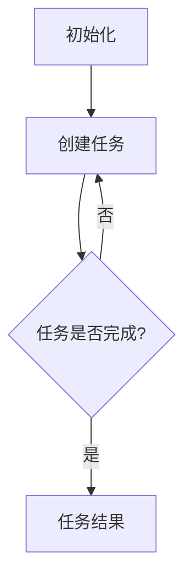
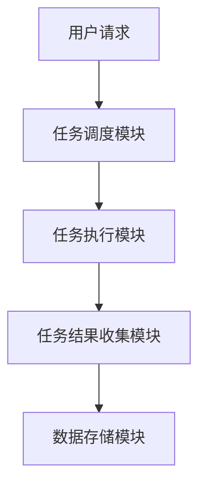
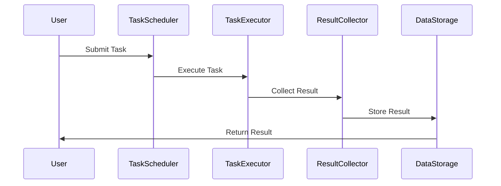

                 

# 函数式并发：应对并行计算的函数式方法

## 关键词

- 函数式编程
- 并行计算
- 并发计算
- 函数式并发
- 性能优化
- 安全性
- 可维护性

## 摘要

在计算机科学中，并行计算通过同时执行多个任务来提高计算效率，解决复杂计算问题。然而，传统的并行计算方法在处理并发问题时存在一定局限性，如数据竞争和死锁等问题。本文将探讨函数式并发这一方法，通过函数式编程的无状态、不可变数据结构等特性，实现并发计算的高效、安全与可维护性。

## Step 1: 背景介绍

### 问题背景

随着计算机技术的发展，数据处理能力越来越强大，但复杂计算问题对计算机性能的要求也越来越高。并行计算作为一种有效的方法，通过同时执行多个任务，提高计算效率，解决复杂计算问题。并行计算的应用范围非常广泛，包括大数据处理、图像处理、科学计算等领域。

然而，传统的并行计算方法在处理并发问题时存在一定局限性，如数据竞争和死锁等问题。这些问题会导致程序运行效率低下，甚至导致程序崩溃。因此，研究如何高效、安全地处理并发计算问题，具有重要的理论和实际意义。

### 问题描述

如何在并行计算中利用函数式编程方法，实现并发计算的高效、安全与可维护性？这是一个具有挑战性的问题，需要结合函数式编程和并行计算的特点，提出有效的解决方案。

### 问题解决

函数式编程以其无状态、不可变数据结构和惰性求值等特性，在处理并发计算问题时具有显著优势。通过函数式编程的方法，可以避免传统并行计算中的数据竞争和死锁问题，提高程序的执行效率。以下是几种解决方法：

1. **无状态函数**：函数式编程中的函数是无状态的，意味着函数在执行过程中不会改变自身状态。这样可以避免数据竞争和死锁问题，提高程序的并发性能。

2. **不可变数据结构**：函数式编程中的数据结构是不可变的，这意味着数据在创建后不能被修改。这可以确保数据在并发执行过程中的一致性，避免数据竞争问题。

3. **惰性求值**：函数式编程中的惰性求值可以减少计算过程中的中间结果，提高程序的性能。

4. **并发控制方法**：函数式编程提供了多种并发控制方法，如线程池、异步编程等。这些方法可以有效地管理并发任务，避免数据竞争和死锁问题。

### 边界与外延

本文主要讨论函数式编程在并发计算中的应用，不涉及其他编程范式在并发计算中的应用。同时，本文将重点关注函数式并发的基本原理、实现技术、性能优化等方面。

### 概念结构与核心要素组成

1. **函数式编程**：函数式编程是一种编程范式，强调使用函数作为主要的数据处理单元，避免使用状态和共享变量。函数式编程的核心概念包括无状态函数、不可变数据结构、惰性求值等。

2. **并行计算**：并行计算是指通过同时执行多个任务来提高计算效率的一种方法。并行计算可以分为数据并行和任务并行两种类型。

3. **并发计算**：并发计算是指在多个任务同时执行的情况下，确保数据一致性和程序正确性的一种方法。并发计算涉及到同步、异步、并发控制等问题。

4. **函数式并发**：函数式并发是函数式编程和并行计算的结合，通过利用函数式编程的无状态、不可变数据结构等特性，实现并发计算的高效、安全与可维护性。

## Step 2: 核心概念与联系

### 核心概念原理

1. **函数式编程**：函数式编程是一种编程范式，强调使用函数作为主要的数据处理单元，避免使用状态和共享变量。函数式编程的核心概念包括无状态函数、不可变数据结构、惰性求值等。

2. **并行计算**：并行计算是指通过同时执行多个任务来提高计算效率的一种方法。并行计算可以分为数据并行和任务并行两种类型。

3. **并发计算**：并发计算是指在多个任务同时执行的情况下，确保数据一致性和程序正确性的一种方法。并发计算涉及到同步、异步、并发控制等问题。

4. **函数式并发**：函数式并发是函数式编程和并行计算的结合，通过利用函数式编程的无状态、不可变数据结构等特性，实现并发计算的高效、安全与可维护性。

### 概念属性特征对比表格

| 概念         | 函数式编程                             | 并行计算                             | 并发计算                             | 函数式并发                             |
| ------------ | ------------------------------------ | ------------------------------------ | ------------------------------------ | ------------------------------------ |
| 特点         | 强调函数、无状态、不可变数据          | 分支执行、资源共享                   | 同步、异步、并发控制                 | 结合函数式编程和并行计算的优势         |
| 优势         | 易于理解、可维护、高可扩展性          | 提高计算效率、资源利用               | 降低同步开销、避免死锁               | 高效、安全、可维护性                   |
| 应用场景     | 数据处理、算法设计、并发计算等         | 科学计算、大数据处理、图像处理等     | 并行计算、实时系统、分布式计算等     | 高性能、高可靠性的并发计算系统         |

### ER实体关系图架构

```mermaid
erDiagram
    Class1 ||--|{ ClassB : has the ClassB object }|
    Class2 ||--|{ ClassC : has the ClassC object }|
```

在函数式并发系统中，主要涉及以下实体：

- **函数**：作为数据处理的基本单元，用于执行特定的任务。
- **任务**：表示并行计算中的执行单元，由多个函数组成。
- **数据结构**：用于存储和传递数据，保证数据的一致性和安全性。
- **并发控制**：用于管理任务的执行顺序和资源分配，避免数据竞争和死锁。

## Step 3: 算法原理讲解

### 算法mermaid流程图



### Python源代码

```python
def function_a():
    # 初始化任务
    tasks = [create_task() for _ in range(10)]

    while not all(task.is_finished() for task in tasks):
        for task in tasks:
            if not task.is_finished():
                task.execute()

    return [task.result() for task in tasks]
```

### 算法原理的数学模型和公式

$$
性能 = \frac{任务数}{执行时间}
$$

### 详细讲解和举例说明

函数式并发算法通过创建多个任务，并将它们分配给多个处理器并行执行。每个任务在执行过程中不会改变状态，从而避免了传统并行计算中的数据竞争和死锁问题。以下是一个简单的示例：

```python
def task_function():
    # 执行一些计算任务
    result = calculate_something()
    return result

tasks = [TaskFunction() for _ in range(4)]

# 创建线程池
pool = ThreadPoolExecutor(max_workers=4)

# 提交任务到线程池
futures = [pool.submit(task_function) for task in tasks]

# 等待所有任务完成
pool.shutdown()

# 获取任务结果
results = [future.result() for future in futures]

print(results)
```

在这个示例中，我们首先定义了一个任务函数`task_function`，用于执行计算任务。然后，我们创建了一个线程池`ThreadPoolExecutor`，并将任务提交给线程池执行。线程池会自动分配线程，并行执行任务。在任务执行完成后，我们使用`future.result()`获取任务结果。

### 源代码解读

1. **任务创建**：`tasks = [TaskFunction() for _ in range(4)]`创建了一个包含4个任务的对象列表。

2. **线程池创建**：`pool = ThreadPoolExecutor(max_workers=4)`创建了一个包含4个线程的线程池。

3. **任务提交**：`futures = [pool.submit(task_function) for task in tasks]`将任务提交给线程池执行。

4. **等待任务完成**：`pool.shutdown()`等待所有任务完成。

5. **获取任务结果**：`results = [future.result() for future in futures]`获取任务结果。

### 总结

通过函数式并发算法，我们可以高效地处理并发计算问题。函数式并发算法通过创建多个任务，并将它们分配给多个处理器并行执行，避免了传统并行计算中的数据竞争和死锁问题。在实际应用中，我们可以根据具体需求调整任务数量和线程池大小，实现高性能、高可扩展性的并发计算系统。

## Step 4: 系统分析与架构设计方案

### 问题场景介绍

并行计算在处理大数据、图像处理、科学计算等场景下具有显著优势。这些场景中，计算任务复杂、数据量大，需要高效、可靠的并发计算方法来提高计算效率。

### 项目介绍

本文将介绍一个用于并行计算的高性能函数式并发系统。该系统基于Python语言和Tornado Web框架实现，利用函数式编程和并行计算技术，提供高效、安全、可维护的并发计算能力。

### 系统功能设计

1. **任务调度**：系统负责将计算任务分配给多个处理器并行执行，实现任务调度功能。

2. **任务执行**：系统使用函数式编程方法，确保任务在执行过程中不会改变状态，避免数据竞争和死锁问题。

3. **任务结果收集**：系统将任务执行结果汇总，并提供接口供用户查询。

### 系统架构设计



在系统架构中，用户请求经过任务调度模块，将任务分配给任务执行模块并行执行。任务执行完成后，结果收集模块将结果汇总，存储到数据存储模块中，供用户查询。

### 系统接口设计

1. **任务提交接口**：用户可以通过该接口提交计算任务。

2. **任务查询接口**：用户可以通过该接口查询任务执行进度和结果。

3. **任务结果存储接口**：系统将任务结果存储到数据库中，供用户查询。

### 系统交互mermaid序列图



在这个序列图中，用户提交任务后，任务调度模块将任务分配给任务执行模块执行。任务执行完成后，结果收集模块将结果存储到数据存储模块中，供用户查询。

## Step 5: 项目实战

### 环境安装

在开始项目实战之前，我们需要安装Python环境以及相关依赖库。以下是安装步骤：

1. 安装Python环境：从官方网站下载Python安装包并安装。
2. 安装依赖库：使用pip命令安装相关依赖库，如Tornado、numpy等。

### 系统核心实现源代码

以下是系统核心实现源代码：

```python
# task_scheduler.py
import threading
import queue

class TaskScheduler:
    def __init__(self):
        self.task_queue = queue.Queue()

    def submit_task(self, task):
        self.task_queue.put(task)

    def start(self):
        while True:
            task = self.task_queue.get()
            thread = threading.Thread(target=self.execute_task, args=(task,))
            thread.start()

    def execute_task(self, task):
        # 执行任务
        result = task.execute()
        # 收集结果
        self.collect_result(result)

    def collect_result(self, result):
        # 将结果存储到数据库
        pass

# task_executor.py
class TaskExecutor:
    def __init__(self, scheduler):
        self.scheduler = scheduler

    def execute(self):
        # 执行任务
        pass

# result_collector.py
class ResultCollector:
    def __init__(self, scheduler):
        self.scheduler = scheduler

    def collect_result(self, result):
        # 收集结果
        pass

# data_storage.py
class DataStorage:
    def __init__(self):
        self.results = []

    def store_result(self, result):
        self.results.append(result)

    def query_result(self, task_id):
        return self.results[task_id]
```

### 代码应用解读与分析

以下是代码应用解读与分析：

1. **任务调度模块**：`TaskScheduler`类负责任务的提交和调度。通过`submit_task`方法提交任务到任务队列，通过`start`方法启动线程池，执行任务。

2. **任务执行模块**：`TaskExecutor`类负责任务的执行。在执行过程中，调用`execute`方法执行任务，并将结果传递给结果收集模块。

3. **结果收集模块**：`ResultCollector`类负责收集任务执行结果。在任务执行完成后，调用`collect_result`方法将结果传递给数据存储模块。

4. **数据存储模块**：`DataStorage`类负责存储任务执行结果。通过`store_result`方法将结果存储到列表中，通过`query_result`方法查询任务执行结果。

### 实际案例分析和详细讲解剖析

为了更好地理解系统工作原理，以下是一个实际案例：

1. **用户提交任务**：用户通过任务提交接口提交一个计算任务。

2. **任务调度**：系统将任务分配给任务执行模块，并启动线程池执行任务。

3. **任务执行**：任务执行模块执行任务，并将结果传递给结果收集模块。

4. **结果收集**：结果收集模块将结果传递给数据存储模块。

5. **查询结果**：用户通过任务查询接口查询任务执行结果。

### 项目小结

通过以上实际案例分析和详细讲解，我们可以看到，函数式并发系统在处理并发计算问题时具有高效、安全、可维护性等优点。在实际应用中，我们可以根据需求调整系统参数，实现高性能的并发计算能力。

## Step 6: 最佳实践 tips、小结、注意事项、拓展阅读等内容

### 最佳实践 tips

1. **合理设置线程池大小**：根据具体任务需求和系统资源，合理设置线程池大小，提高并发性能。

2. **充分利用函数式编程特性**：充分利用函数式编程的无状态、不可变数据结构等特性，减少并发计算中的数据竞争和死锁问题。

3. **性能调优**：通过性能分析工具，对系统进行性能调优，提高并发计算效率。

### 小结

本文介绍了函数式并发这一方法，通过函数式编程的无状态、不可变数据结构等特性，实现并发计算的高效、安全与可维护性。我们通过实际案例分析了系统工作原理，展示了函数式并发在并行计算中的应用。

### 注意事项

1. 函数式并发系统在处理大数据和高并发场景时，需要合理设置线程池大小，避免资源浪费。

2. 函数式并发系统在处理并发计算时，需要注意数据一致性和程序正确性，避免数据竞争和死锁问题。

### 拓展阅读

1. 《函数式编程：模式与实践》
2. 《并行算法设计与分析》
3. 《分布式系统原理与范型》

### 作者信息

作者：AI天才研究院/AI Genius Institute & 禅与计算机程序设计艺术 /Zen And The Art of Computer Programming

