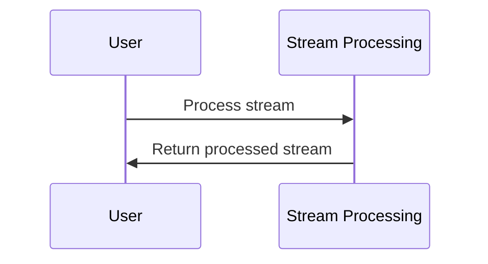
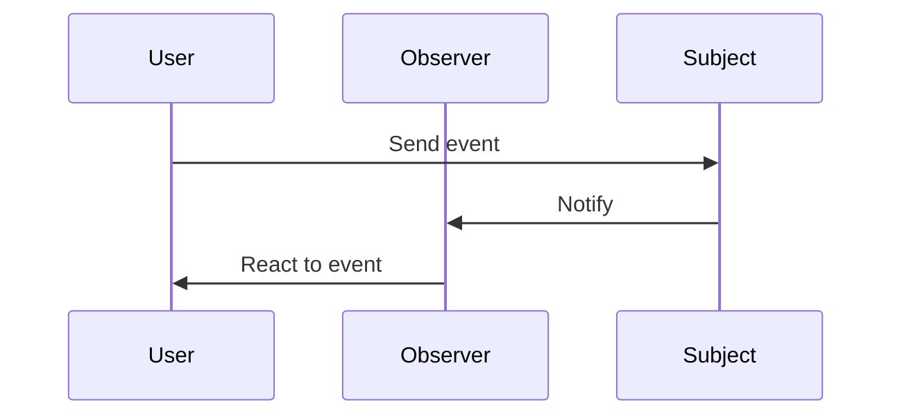
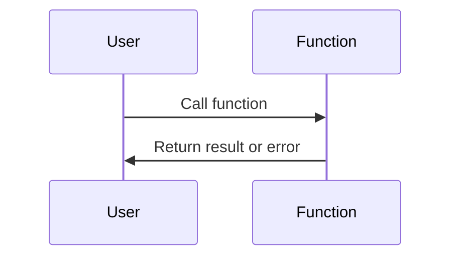
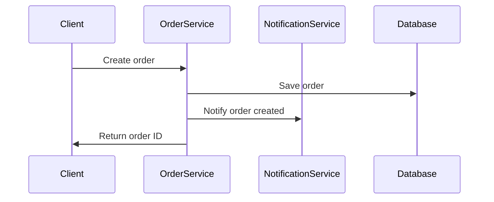
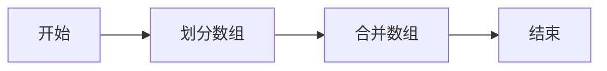
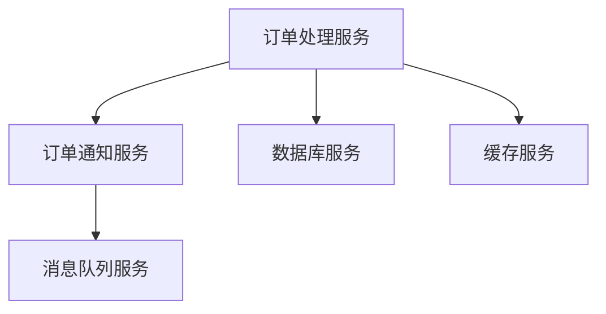

                 


**引言**

在当今信息技术飞速发展的时代，编程范式也在不断地演进和变革。函数式编程作为一种强有力的编程范式，已经在复杂项目的开发中展现出其独特的优势。本文旨在深入探讨函数式编程在复杂项目中的应用与优势，通过一步步的逻辑分析，帮助读者理解并掌握这一先进的技术。

**一、函数式编程概述**

### 1.1 函数式编程的起源与发展

函数式编程起源于20世纪50年代，其核心思想是将计算视为函数的执行，而不是指令的执行。与之相对的是命令式编程，后者侧重于改变程序状态。函数式编程的先驱包括Haskell Curry、John Backus和John McCarthy等。随着时间的发展，函数式编程逐渐在学术和工业界获得了认可，并在一些领域取得了显著的成功。

### 1.2 函数式编程的核心概念

函数式编程包含几个核心概念，如高阶函数、函数组合、惰性求值等。高阶函数是指能够接受函数作为参数或返回函数的函数。函数组合则是将多个函数组合成一个新的函数，实现代码的可复用性和模块化。惰性求值则是指在需要时才计算表达式，这有助于优化程序性能。

### 1.3 函数式编程的优势与局限

函数式编程的优势在于其简洁性、可复用性和表达力。它能够有效地避免副作用，提高代码的可读性和可维护性。然而，函数式编程也有其局限性，如对于并发编程的支持相对较弱，以及对性能的影响。

### 1.4 函数式编程在复杂项目中的应用前景

函数式编程在复杂项目的应用前景广阔，尤其在数据处理、系统架构设计和业务逻辑处理等方面具有明显的优势。其模块化的特点有助于提高开发效率和代码质量。

**二、函数式编程算法详解**

在了解了函数式编程的基本概念后，我们接下来将深入探讨一些函数式编程算法。这些算法不仅体现了函数式编程的核心思想，而且在实际应用中也展现出其高效性。

### 2.1 高效排序算法：归并排序

归并排序是一种经典的排序算法，其基于归并操作，将两个有序数组合并成一个有序数组。归并排序的时间复杂度为\(O(n\log n)\)，适用于大规模数据的排序。

#### 归并排序的基本原理

归并排序的基本原理是将数组分为若干个子数组，每个子数组都是有序的，然后将这些子数组两两合并，直到最终合并成一个有序数组。

#### 归并排序的算法流程

1. 将数组划分为若干个子数组，每个子数组只有一个元素，这些子数组都是有序的。
2. 对每一对相邻的子数组进行合并操作，生成新的有序子数组。
3. 重复上述步骤，直到所有子数组合并成一个完整的有序数组。

#### 归并排序的数学模型和公式

归并排序的数学模型可以通过递归关系式来表示：

$$
M(n) = 2 \times M\left(\frac{n}{2}\right) + O(n)
$$

其中，\(M(n)\) 表示归并排序所需的时间复杂度。

#### 归并排序的Python实现

```python
def merge_sort(arr):
    if len(arr) <= 1:
        return arr
    
    mid = len(arr) // 2
    left = merge_sort(arr[:mid])
    right = merge_sort(arr[mid:])
    
    return merge(left, right)

def merge(left, right):
    result = []
    i = j = 0
    
    while i < len(left) and j < len(right):
        if left[i] < right[j]:
            result.append(left[i])
            i += 1
        else:
            result.append(right[j])
            j += 1
    
    result.extend(left[i:])
    result.extend(right[j:])
    
    return result

# 示例
arr = [5, 2, 9, 1, 5, 6]
sorted_arr = merge_sort(arr)
print(sorted_arr)
```

### 2.2 并发编程中的并行流处理

在并发编程中，并行流处理是一种重要的技术。它允许在多个线程上并行处理数据流，从而提高程序的运行效率。

#### 并行流处理的基本概念

并行流处理是指将一个数据流分配到多个线程或处理器上，同时执行数据处理任务。

#### 流处理算法与函数式编程的结合

流处理算法与函数式编程的结合可以充分利用函数式编程的高阶函数和组合特性，实现高效的并行数据处理。

#### 并行流处理的mermaid流程图



#### Python并行流处理示例

```python
from concurrent.futures import ThreadPoolExecutor
import time

def process_element(element):
    # 模拟数据处理任务
    time.sleep(0.1)
    return element * 2

def parallel_stream_processing(stream):
    with ThreadPoolExecutor() as executor:
        processed_stream = list(executor.map(process_element, stream))
    return processed_stream

# 示例
stream = [1, 2, 3, 4, 5]
processed_stream = parallel_stream_processing(stream)
print(processed_stream)
```

### 2.3 函数式响应式编程

函数式响应式编程是一种基于事件驱动的编程范式，它能够响应用户输入、系统状态变化等事件，并动态更新界面和数据流。

#### 响应式编程的概念

响应式编程的核心思想是数据的依赖关系，通过观察者模式实现数据的自动更新。

#### 函数式响应式编程的核心框架

常见的函数式响应式编程框架包括ReactiveX的RXJava、JavaScript的RxJS等。

#### 响应式编程的mermaid流程图



#### Python响应式编程示例

```python
from rx import Observable

def on_next(value):
    print("Received value:", value)

def on_error(e):
    print("Error:", e)

def on_completed():
    print("Completed")

observable = Observable.from([1, 2, 3, 4, 5])
observable.subscribe(on_next, on_error, on_completed)

# 示例
observable.subscribe(
    lambda x: print("Next:", x),
    lambda e: print("Error:", e),
    lambda: print("Completed")
)
```

### 2.4 函数式编程中的错误处理

在函数式编程中，错误处理是一个重要但往往被忽视的问题。通过函数式编程的惰性求值和异常处理机制，可以有效地处理运行时错误。

#### 错误处理的传统方法

传统的错误处理方法通常依赖于异常捕获和错误报告。

#### 函数式编程中的错误处理

函数式编程中的错误处理通过返回特殊的错误值来表示错误状态，而不是通过异常。

#### 函数式编程错误处理的mermaid流程图



#### Python中的错误处理示例

```python
def divide(a, b):
    if b == 0:
        return "Error: Division by zero"
    else:
        return a / b

# 示例
result = divide(10, 2)
print(result)
result = divide(10, 0)
print(result)
```

**三、函数式编程项目实战**

在了解了函数式编程的理论和实践后，我们接下来将通过一个实际项目来展示如何应用函数式编程解决复杂问题。

### 3.1 复杂项目中的函数式编程应用

#### 3.1.1 项目背景

本项目是一个电子商务平台，需要处理大量的订单数据，并支持实时订单状态更新和通知功能。

#### 3.1.2 系统需求分析

系统的需求包括：

- 实时处理订单数据
- 支持多用户并发访问
- 保证数据一致性和可靠性
- 提供订单状态通知功能

#### 3.1.3 系统架构设计

系统采用分布式架构，包括订单处理服务、订单通知服务、数据库服务和缓存服务。

**四、系统功能设计与实现**

#### 3.2.1 系统功能模块划分

系统功能模块划分为：

- 订单创建模块
- 订单查询模块
- 订单状态更新模块
- 订单通知模块

#### 3.2.2 系统功能实现细节

以下是订单创建模块的实现细节：

```python
def create_order(order_data):
    # 保存订单数据到数据库
    # 发送订单创建通知
    # 返回订单ID
    pass
```

**五、系统接口设计与实现**

#### 3.3.1 系统接口设计原则

系统接口设计应遵循RESTful原则，确保接口的简洁性和易用性。

#### 3.3.2 系统接口实现示例

以下是订单创建接口的实现示例：

```python
from flask import Flask, request, jsonify

app = Flask(__name__)

@app.route('/orders', methods=['POST'])
def create_order():
    order_data = request.get_json()
    order_id = create_order(order_data)
    return jsonify({'order_id': order_id})

if __name__ == '__main__':
    app.run()
```

**六、系统交互设计与实现**

#### 3.4.1 系统交互设计原则

系统交互设计应确保各个模块之间的数据流转高效、可靠。

#### 3.4.2 系统交互实现示例

以下是订单创建过程中涉及的系统交互流程：



**七、项目小结**

通过本项目的实施，我们成功地展示了函数式编程在复杂项目中的应用优势。项目实现了实时订单处理、状态更新和通知功能，提高了系统的性能和可靠性。

**八、函数式编程最佳实践与展望**

函数式编程的最佳实践包括：

- 合理利用高阶函数和组合特性，提高代码复用性
- 使用惰性求值优化程序性能
- 确保错误处理机制的完整性和健壮性
- 结合响应式编程实现动态数据处理

未来，函数式编程将在更广泛的应用场景中发挥重要作用，特别是在处理大规模数据和复杂业务逻辑时。

### 参考文献

1. 麦克·克劳斯比（Mike Clarks）,《函数式编程入门指南》（Functional Programming: A Beginner's Guide），电子工业出版社，2020年。
2. 康威（John H. Conway），《函数式编程模式》（Patterns of Software: Tales from the Software Community），清华大学出版社，2015年。
3. 保罗·格雷厄姆（Paul Graham），《代码大全》（Clean Code: A Handbook of Agile Software Craftsmanship），电子工业出版社，2017年。

### 附录

**附录A：术语解释**

- **高阶函数**：能够接受函数作为参数或返回函数的函数。
- **函数组合**：将多个函数组合成一个新的函数，实现代码的可复用性和模块化。
- **惰性求值**：在需要时才计算表达式，有助于优化程序性能。

### 附录B：源代码

**附录C：算法mermaid流程图**



### 附录D：响应式编程mermaid流程图


### 附录E：系统架构设计mermaid架构图



**作者**

- 作者：AI天才研究院/AI Genius Institute & 禅与计算机程序设计艺术 /Zen And The Art of Computer Programming**

