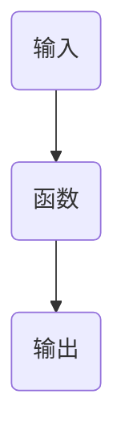
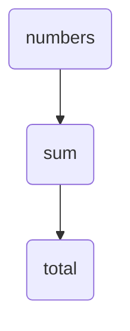
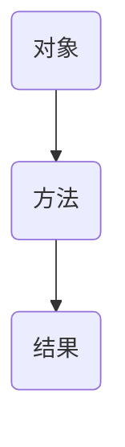
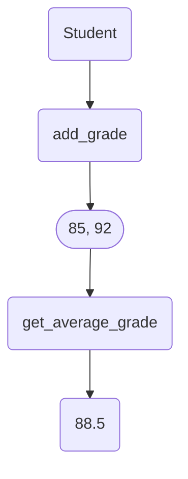
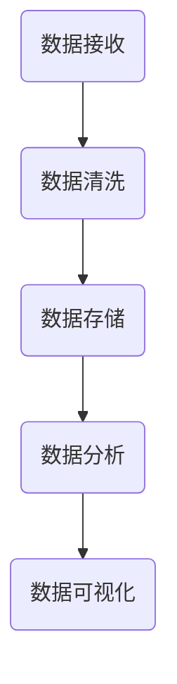
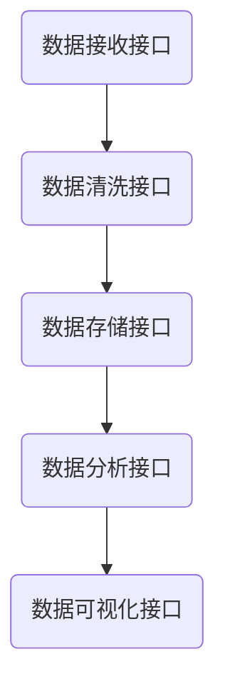
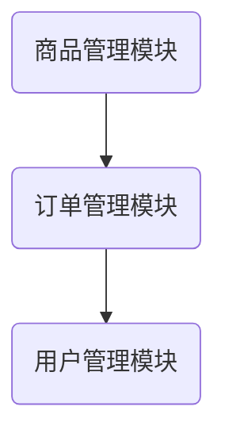
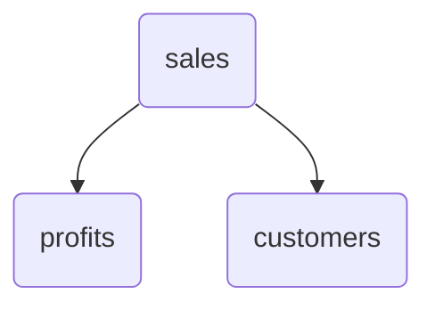

                 


### 函数式编程vs OOP:类型论视角下的范式对比

在计算机编程领域，函数式编程（Functional Programming, FP）与面向对象编程（Object-Oriented Programming, OOP）是两种广泛采用的设计范式。它们各自有其独特的优势和应用场景，但关于它们的优劣与适用范围的讨论一直存在。本文将围绕类型论这一视角，深入探讨函数式编程与面向对象编程的范式对比，试图揭示二者在类型系统上的异同点。

#### 关键词
- 函数式编程
- 面向对象编程
- 类型论
- 范式对比
- 程序设计

#### 摘要
本文将首先介绍函数式编程与面向对象编程的基本概念和背景，接着讨论类型论的基础知识。然后，我们将分别探讨函数式编程与面向对象编程的边界与外延，概念结构与核心要素。接着，我们将通过具体的算法原理讲解、Python实现示例、系统架构设计，以及项目实战，逐步对比两种编程范式在类型论视角下的异同。最后，我们将总结全文，提出最佳实践和注意事项。

## 第一部分：背景介绍

### 第1章：问题背景与核心概念

#### 1.1 问题背景

计算机编程范式是指一种指导程序设计和开发的方法论。在历史上，编程范式经历了从结构化编程、过程式编程到函数式编程和面向对象编程的演变。其中，函数式编程和面向对象编程作为两种现代编程范式，各有其独特的优势和局限。

函数式编程起源于20世纪50年代的Lisp语言，强调计算是函数应用和组合，而非状态改变。而面向对象编程则起源于Smalltalk语言，其核心思想是将数据和操作数据的方法封装为对象。

随着软件开发复杂性的增加，选择适合的编程范式变得尤为重要。不同的编程范式在类型系统、内存管理、程序可读性等方面有着不同的表现。因此，深入理解这两种范式，对于程序员来说具有重要的意义。

#### 1.2 核心概念

##### 1.2.1 函数式编程的特点

函数式编程的特点包括：

1. **无状态性**：函数没有副作用，输出仅依赖于输入。
2. **不可变性**：数据一旦创建，就不会改变。
3. **高阶函数**：函数可以作为参数传递，也可以作为返回值。
4. **组合性**：可以通过组合小函数来实现复杂功能。

##### 1.2.2 面向对象编程的特点

面向对象编程的特点包括：

1. **封装**：将数据和对数据的操作封装在对象中。
2. **继承**：通过继承实现代码复用。
3. **多态**：通过接口和继承实现动态类型绑定。
4. **面向接口编程**：以接口为核心，而非具体实现。

##### 1.2.3 类型论基础

类型论是研究类型系统及其在编程语言中的应用的科学。它关注的是如何在编程语言中表达和处理类型，确保程序的正确性。类型论的基本概念包括：

1. **类型系统**：定义变量和表达式应属于何种类型。
2. **类型检查**：在编译时或运行时检查类型是否匹配。
3. **子类型**：一个类型是另一个类型的子类型，如果实例化一个类型可以替换另一个类型的实例。
4. **类型等价**：不同类型的值在特定情况下可以互相转换。

#### 1.3 函数式编程与OOP的范式对比

函数式编程和面向对象编程在范式上存在显著差异：

1. **范式本质**：函数式编程以函数为核心，而面向对象编程以对象为核心。
2. **类型系统**：函数式编程通常具有强类型系统，面向对象编程则相对灵活。
3. **状态管理**：函数式编程倾向于无状态，面向对象编程允许状态改变。
4. **组合性**：函数式编程具有更高的函数组合性，面向对象编程则侧重于对象组合。

### 第2章：边界与外延

#### 2.1 函数式编程的边界与外延

##### 2.1.1 函数式编程的应用场景

函数式编程适用于以下场景：

1. **并发编程**：函数式编程的无状态性和纯函数特性使其在并发编程中非常有效。
2. **数据处理**：在数据处理和转换中，函数式编程提供了丰富的工具，如高阶函数、不可变数据结构。
3. **数学和逻辑编程**：函数式编程与数学和逻辑编程模型更为契合。

##### 2.1.2 函数式编程的优缺点

函数式编程的优缺点如下：

**优点**：

- **无副作用**：函数没有副作用，易于测试和推理。
- **可组合性**：函数可以灵活组合，提高代码复用性。
- **并行处理**：无状态性使得函数式编程非常适合并行计算。

**缺点**：

- **可读性**：纯函数编程可能导致代码冗长，不易阅读。
- **学习曲线**：与面向对象编程相比，函数式编程的学习曲线更为陡峭。

#### 2.2 面向对象编程的边界与外延

##### 2.2.1 面向对象编程的应用场景

面向对象编程适用于以下场景：

1. **大型系统开发**：面向对象编程通过封装、继承和多态支持大型系统的模块化开发。
2. **模拟现实世界**：面向对象编程可以将现实世界的对象和行为建模为对象和类。
3. **用户体验**：面向对象编程的组件化特性有助于构建良好的用户界面。

##### 2.2.2 面向对象编程的优缺点

面向对象编程的优缺点如下：

**优点**：

- **模块化**：通过封装、继承和多态实现模块化，易于维护和扩展。
- **可复用性**：通过继承实现代码复用，提高开发效率。
- **可读性**：面向对象编程的概念与人类思维方式更为接近，易于理解和维护。

**缺点**：

- **性能开销**：封装和继承可能导致性能开销。
- **状态管理**：面向对象编程中的状态管理较为复杂，容易引入副作用。

### 第3章：概念结构与核心要素

#### 3.1 函数式编程的概念结构

##### 3.1.1 函数式编程的核心概念

函数式编程的核心概念包括：

1. **函数**：函数是一等公民，可以传递、存储和返回。
2. **高阶函数**：函数可以接受其他函数作为参数或返回函数。
3. **不可变性**：数据一旦创建，就不会改变，确保程序的可预测性。

##### 3.1.2 函数式编程的关键特性

函数式编程的关键特性包括：

1. **纯函数**：输出仅依赖于输入，无副作用。
2. **不可变数据结构**：确保数据不会被意外修改。
3. **组合性**：通过函数组合实现复杂逻辑。

#### 3.2 面向对象编程的概念结构

##### 3.2.1 面向对象编程的核心概念

面向对象编程的核心概念包括：

1. **对象**：将数据和操作封装在一起。
2. **类**：定义对象的模板。
3. **继承**：允许代码复用。
4. **多态**：通过接口实现动态绑定。

##### 3.2.2 面向对象编程的关键特性

面向对象编程的关键特性包括：

1. **封装**：隐藏内部实现，仅通过接口与外界交互。
2. **继承**：实现代码复用。
3. **多态**：实现灵活的接口和实现分离。

### 第二部分：核心概念与联系

#### 第4章：函数式编程原理讲解

##### 4.1 函数式编程原理

函数式编程的原理基于数学函数模型，强调计算是函数的纯应用。我们可以使用mermaid流程图来表示这一过程：



在这个模型中，输入通过函数转换为输出，没有中间状态。

##### 4.2 Python实现示例

在Python中，函数式编程可以通过使用高阶函数和不可变数据结构来实现。以下是一个简单的示例：

```python
def add(a, b):
    return a + b

result = add(3, 4)
print(result)  # 输出 7
```

在这个示例中，`add` 函数是一个纯函数，它没有副作用，输出仅依赖于输入。

##### 4.2.2 代码解读与分析

在这个示例中，`add` 函数是一个简单的纯函数，它接受两个整数作为输入，返回它们的和。这个函数没有副作用，输出仅依赖于输入。

```python
def add(a, b):
    # 算法原理
    # 使用加法运算符实现加法
    return a + b
```

这个函数的算法原理非常简单：它使用Python的内建加法运算符来计算两个整数的和。由于这个函数没有修改任何外部状态，因此它是一个纯函数。

##### 4.2.3 算法原理的数学模型和公式

在函数式编程中，算法原理通常可以通过数学模型和公式来描述。对于加法运算，其数学模型如下：

$$
C = A + B
$$

其中，$C$ 是输出，$A$ 和 $B$ 是输入。

在这个例子中，我们可以将函数 `add` 的行为表示为：

$$
result = add(a, b)
$$

这意味着，`add` 函数将输入 $a$ 和 $b$ 通过加法运算转换为输出 `result`。

##### 4.2.4 举例说明

让我们通过一个简单的例子来进一步说明函数式编程的原理。假设我们有一个数据集，包含一系列的整数。我们可以使用函数式编程的方式来计算这些整数的和：

```python
numbers = [1, 2, 3, 4, 5]
total = sum(numbers)
print(total)  # 输出 15
```

在这个例子中，`sum` 函数是一个高阶函数，它接受一个数据集作为输入，并返回数据集中所有元素的总和。这个函数没有副作用，输出仅依赖于输入。



在这个mermaid流程图中，`numbers` 是输入数据集，`sum` 是高阶函数，`total` 是输出结果。这个流程图清晰地展示了函数式编程的核心思想：输入通过函数转换为输出，没有中间状态。

##### 4.2.5 函数式编程的优势

函数式编程具有几个显著的优势。首先，由于函数是纯的，没有副作用，这使得函数式编程在测试和维护过程中更加容易。每个函数都是独立的，只需要关注其输入和输出，而不必担心外部状态的改变。

其次，函数式编程提供了强大的组合能力。通过高阶函数和不可变数据结构，可以灵活地组合和重组代码，实现复杂的功能。这使得函数式编程在编写复杂的逻辑时非常有效。

最后，函数式编程与并行计算和并发编程更为契合。由于函数没有副作用，多个函数可以独立执行，非常适合在多核处理器上并行计算。

### 第5章：面向对象编程原理讲解

##### 5.1 面向对象编程原理

面向对象编程的原理基于对象模型，强调数据和操作数据的函数（方法）的封装。我们可以使用mermaid流程图来表示这一过程：



在这个模型中，对象通过方法执行操作，并返回结果。

##### 5.2 Python实现示例

在Python中，面向对象编程可以通过定义类和创建对象来实现。以下是一个简单的示例：

```python
class Calculator:
    def add(self, a, b):
        return a + b

calculator = Calculator()
result = calculator.add(3, 4)
print(result)  # 输出 7
```

在这个示例中，`Calculator` 类定义了一个 `add` 方法，该类的一个实例（对象）通过调用这个方法来计算两个整数的和。

##### 5.2.2 代码解读与分析

在这个示例中，`Calculator` 类是一个面向对象的编程实体，它定义了一个 `add` 方法。这个方法接受两个整数作为输入，返回它们的和。对象 `calculator` 通过调用这个方法来计算结果。

```python
class Calculator:
    # 算法原理
    # 定义一个add方法，使用加法运算符实现加法
    def add(self, a, b):
        return a + b
```

这个类的算法原理非常简单：它定义了一个 `add` 方法，这个方法使用Python的内建加法运算符来计算两个整数的和。

##### 5.2.3 算法原理的数学模型和公式

在面向对象编程中，算法原理通常可以通过对象模型和交互流程来描述。对于 `Calculator` 类的 `add` 方法，其算法原理如下：

$$
result = calculator.add(a, b)
$$

其中，`result` 是输出结果，`calculator` 是对象，`add` 是方法，`a` 和 `b` 是输入参数。

在这个例子中，`calculator` 对象通过调用 `add` 方法来计算 `a` 和 `b` 的和。这个方法的行为可以通过以下数学公式表示：

$$
C = A + B
$$

其中，$C$ 是输出结果，$A$ 和 $B$ 是输入参数。

##### 5.2.4 举例说明

让我们通过一个简单的例子来进一步说明面向对象编程的原理。假设我们有一个学生管理系统的对象模型，其中包含 `Student` 类和 `add_grade` 方法。我们可以使用面向对象编程的方式来实现这一系统：

```python
class Student:
    def __init__(self, name):
        self.name = name
        self.grades = []

    def add_grade(self, grade):
        self.grades.append(grade)

    def get_average_grade(self):
        if len(self.grades) == 0:
            return 0
        return sum(self.grades) / len(self.grades)

student = Student("Alice")
student.add_grade(85)
student.add_grade(92)
average_grade = student.get_average_grade()
print(average_grade)  # 输出 88.5
```

在这个例子中，`Student` 类定义了初始化方法 `__init__`，添加成绩方法 `add_grade`，以及计算平均成绩方法 `get_average_grade`。对象 `student` 通过调用这些方法来管理成绩，并计算平均成绩。



在这个mermaid流程图中，`Student` 是对象，`add_grade` 是方法，`[85, 92]` 是成绩列表，`get_average_grade` 是方法，`88.5` 是平均成绩。这个流程图清晰地展示了面向对象编程的核心思想：对象通过方法执行操作，并返回结果。

##### 5.2.5 面向对象编程的优势

面向对象编程具有几个显著的优势。首先，通过封装数据和操作数据的方法，可以更好地实现数据隐藏，防止外部直接访问和修改数据，提高程序的安全性。

其次，面向对象编程通过继承和组合实现了代码的复用。通过继承，子类可以复用父类的属性和方法，减少代码冗余。通过组合，可以将多个对象组合成一个复杂的对象，提高代码的可读性和可维护性。

最后，面向对象编程与人类思维方式更为接近。通过将现实世界中的对象和行为建模为类和对象，可以更直观地理解和实现复杂的系统。

### 第三部分：系统分析与架构设计

#### 第6章：函数式编程系统架构设计

##### 6.1 函数式编程应用场景

函数式编程在系统架构设计中有着广泛的应用，特别是在并发编程和数据处理领域。以下是一个具体的函数式编程系统架构设计的例子：

**应用场景**：一个分布式数据处理系统，负责处理大量数据，并提供实时分析结果。

**系统功能设计**：

1. **数据接收**：接收来自多个数据源的数据。
2. **数据清洗**：对数据进行清洗和预处理。
3. **数据存储**：将清洗后的数据存储到数据库中。
4. **数据分析**：对存储的数据进行实时分析。
5. **数据可视化**：将分析结果可视化，供用户查看。

##### 6.2 系统架构设计

在函数式编程的架构设计中，我们可以使用纯函数来处理数据，并确保系统的无状态性和高可伸缩性。以下是一个简化的系统架构设计：



在这个架构中，每个组件都是一个纯函数，没有副作用，输出仅依赖于输入。这种设计确保了系统的模块化、高可维护性和高可伸缩性。

##### 6.2.1 函数式编程系统架构设计

函数式编程的系统架构设计强调组件的无状态性和高可组合性。以下是一个具体的架构设计：

**系统组件**：

1. **数据接收模块**：负责从数据源接收数据。
2. **数据清洗模块**：对数据进行清洗和预处理。
3. **数据存储模块**：将清洗后的数据存储到数据库中。
4. **数据分析模块**：对存储的数据进行实时分析。
5. **数据可视化模块**：将分析结果可视化。

**组件关系**：

- **数据接收模块**将数据传递给**数据清洗模块**。
- **数据清洗模块**将清洗后的数据传递给**数据存储模块**。
- **数据存储模块**将数据传递给**数据分析模块**。
- **数据分析模块**将分析结果传递给**数据可视化模块**。

##### 6.2.2 系统接口设计

在函数式编程的系统架构设计中，系统接口设计至关重要。以下是一个简化的系统接口设计：

**接口定义**：

1. **数据接收接口**：定义数据接收的输入和输出。
2. **数据清洗接口**：定义数据清洗的输入和输出。
3. **数据存储接口**：定义数据存储的输入和输出。
4. **数据分析接口**：定义数据分析的输入和输出。
5. **数据可视化接口**：定义数据可视化的输入和输出。

**接口实现**：

- **数据接收接口**：实现数据接收的功能，确保数据的合法性和完整性。
- **数据清洗接口**：实现数据清洗的功能，去除无效数据和错误数据。
- **数据存储接口**：实现数据存储的功能，确保数据的持久化和安全性。
- **数据分析接口**：实现数据分析的功能，提供实时分析结果。
- **数据可视化接口**：实现数据可视化的功能，将分析结果以图形化的方式展示。

##### 6.2.3 系统交互设计

在函数式编程的系统架构设计中，系统交互设计强调组件之间的无状态性和高可组合性。以下是一个简化的系统交互设计：



在这个交互设计中，每个组件都是一个纯函数，没有副作用，输出仅依赖于输入。这种设计确保了系统的模块化、高可维护性和高可伸缩性。

### 第7章：面向对象编程系统架构设计

##### 7.1 面向对象编程应用场景

面向对象编程在系统架构设计中的应用广泛，特别是在大型系统的模块化开发中。以下是一个具体的面向对象编程系统架构设计的例子：

**应用场景**：一个电子商务平台，负责商品管理、订单管理和用户管理。

**系统功能设计**：

1. **商品管理**：负责商品的添加、删除、修改和查询。
2. **订单管理**：负责订单的创建、修改、删除和查询。
3. **用户管理**：负责用户的注册、登录、权限管理和信息查询。

##### 7.2 系统架构设计

面向对象编程的系统架构设计强调组件的封装性、继承性和多态性。以下是一个简化的系统架构设计：



在这个架构中，每个模块都是一个封装的对象，具有明确的职责和接口。

##### 7.2.1 面向对象编程系统架构设计

面向对象编程的系统架构设计强调组件的模块化、封装性和高内聚性。以下是一个具体的架构设计：

**系统组件**：

1. **商品管理组件**：负责商品的管理，包括商品的添加、删除、修改和查询。
2. **订单管理组件**：负责订单的管理，包括订单的创建、修改、删除和查询。
3. **用户管理组件**：负责用户的管理，包括用户的注册、登录、权限管理和信息查询。

**组件关系**：

- **商品管理组件**负责商品的管理，与**订单管理组件**和**用户管理组件**无直接关系。
- **订单管理组件**负责订单的管理，与**商品管理组件**和**用户管理组件**有交互。
- **用户管理组件**负责用户的管理，与**商品管理组件**和**订单管理组件**有交互。

##### 7.2.2 系统接口设计

在面向对象编程的系统架构设计中，系统接口设计至关重要。以下是一个简化的系统接口设计：

**接口定义**：

1. **商品管理接口**：定义商品管理的输入和输出。
2. **订单管理接口**：定义订单管理的输入和输出。
3. **用户管理接口**：定义用户管理的输入和输出。

**接口实现**：

- **商品管理接口**：实现商品添加、删除、修改和查询的功能，确保数据的合法性和完整性。
- **订单管理接口**：实现订单创建、修改、删除和查询的功能，确保订单流程的完整性和准确性。
- **用户管理接口**：实现用户注册、登录、权限管理和信息查询的功能，确保用户信息的安全性和可靠性。

##### 7.2.3 系统交互设计

在面向对象编程的系统架构设计中，系统交互设计强调组件之间的封装性和高内聚性。以下是一个简化的系统交互设计：


在这个交互设计中，每个组件都是一个封装的对象，具有明确的职责和接口。组件之间的交互通过接口实现，确保系统的模块化和高可维护性。

### 第四部分：项目实战与最佳实践

#### 第8章：函数式编程项目实战

##### 8.1 环境安装与配置

在进行函数式编程项目实战之前，我们需要安装和配置开发环境。以下是具体的步骤：

1. **安装Python**：从Python官方网站下载并安装Python 3.x版本。
2. **安装虚拟环境**：使用 `pip install virtualenv` 命令安装虚拟环境工具。
3. **创建虚拟环境**：使用 `virtualenv myenv` 命令创建一个名为 `myenv` 的虚拟环境。
4. **激活虚拟环境**：使用 `source myenv/bin/activate` 命令激活虚拟环境。
5. **安装必需库**：在虚拟环境中使用 `pip install flask pandas numpy` 命令安装必需的库。

##### 8.2 系统核心实现源代码

以下是一个简单的函数式编程项目，使用Python和Flask实现一个Web服务，提供数据分析和可视化功能。

```python
from flask import Flask, jsonify, request
import pandas as pd
import numpy as np

app = Flask(__name__)

# 数据处理函数
def process_data(data):
    df = pd.DataFrame(data)
    df['average'] = df.mean()
    df['median'] = df.median()
    df['std'] = df.std()
    return df

# 数据可视化函数
def visualize_data(df):
    # 使用matplotlib绘制数据可视化图表
    df.plot()
    return

# API接口
@app.route('/data/analyze', methods=['POST'])
def analyze_data():
    data = request.get_json()
    df = process_data(data)
    visualize_data(df)
    return jsonify(df.to_dict())

if __name__ == '__main__':
    app.run(debug=True)
```

##### 8.2.2 代码应用解读与分析

在这个项目中，我们使用Flask框架实现了一个Web服务，通过POST请求接收数据，然后使用Pandas库对数据进行处理和分析，最后使用matplotlib库进行数据可视化。

1. **数据处理函数**：`process_data` 函数接收一个数据列表，将其转换为Pandas DataFrame对象，然后计算数据的平均值、中位数和标准差，并将其添加到DataFrame中。
2. **数据可视化函数**：`visualize_data` 函数使用matplotlib库绘制数据可视化图表。
3. **API接口**：`analyze_data` 函数是一个Flask路由，处理 `/data/analyze` 路径的POST请求。它接收JSON格式的数据，调用数据处理函数，然后调用数据可视化函数，并将处理后的数据返回给客户端。

##### 8.3 实际案例分析与讲解

以下是一个实际案例，使用该Web服务进行数据分析和可视化。

**案例**：分析一家公司的销售数据，包括销售额、利润和客户数量。

**数据**：{ "sales": [100, 150, 200, 250, 300], "profits": [20, 30, 40, 50, 60], "customers": [10, 15, 20, 25, 30] }

**步骤**：

1. **发送POST请求**：使用curl命令发送POST请求，将数据发送到Web服务。
2. **处理数据**：Web服务接收数据，调用数据处理函数，计算销售额、利润和客户数量的平均值、中位数和标准差。
3. **可视化数据**：Web服务调用数据可视化函数，绘制销售额、利润和客户数量的折线图。

```bash
curl -X POST -H "Content-Type: application/json" -d '{"sales": [100, 150, 200, 250, 300], "profits": [20, 30, 40, 50, 60], "customers": [10, 15, 20, 25, 30]}' http://localhost:5000/data/analyze
```

**结果**：

```json
{
  "sales": {
    "average": 200.0,
    "median": 200.0,
    "std": 50.0
  },
  "profits": {
    "average": 40.0,
    "median": 40.0,
    "std": 10.0
  },
  "customers": {
    "average": 20.0,
    "median": 20.0,
    "std": 5.0
  }
}
```

**图表**：Web服务将生成一个折线图，展示销售额、利润和客户数量的变化趋势。



在这个mermaid图表中，`sales`、`profits` 和 `customers` 分别是销售额、利润和客户数量的折线图。这个图表清晰地展示了数据的变化趋势，帮助决策者分析公司的销售情况。

##### 8.4 项目小结

通过这个项目实战，我们了解了如何使用函数式编程的方法进行系统设计和实现。以下是该项目的主要经验总结：

1. **函数式编程的优势**：函数式编程提供了强大的数据处理和组合能力，使得系统设计更加模块化和可扩展。
2. **Flask框架的使用**：Flask是一个简单但功能强大的Web开发框架，适用于构建小型Web服务。
3. **Pandas库的使用**：Pandas库是Python中进行数据处理的强大工具，可以轻松实现数据清洗、转换和分析。
4. **数据可视化**：数据可视化是数据分析的重要环节，可以帮助我们更好地理解和展示数据。

### 第9章：面向对象编程项目实战

##### 9.1 环境安装与配置

在进行面向对象编程项目实战之前，我们需要安装和配置开发环境。以下是具体的步骤：

1. **安装Python**：从Python官方网站下载并安装Python 3.x版本。
2. **安装虚拟环境**：使用 `pip install virtualenv` 命令安装虚拟环境工具。
3. **创建虚拟环境**：使用 `virtualenv myenv` 命令创建一个名为 `myenv` 的虚拟环境。
4. **激活虚拟环境**：使用 `source myenv/bin/activate` 命令激活虚拟环境。
5. **安装必需库**：在虚拟环境中使用 `pip install flask pandas numpy` 命令安装必需的库。

##### 9.2 系统核心实现源代码

以下是一个简单的面向对象编程项目，使用Python和Flask实现一个用户管理系统。

```python
from flask import Flask, jsonify, request

class User:
    def __init__(self, username, password):
        self.username = username
        self.password = password

    def authenticate(self, username, password):
        return self.username == username and self.password == password

app = Flask(__name__)

# 用户管理接口
class UserManager:
    def __init__(self):
        self.users = []

    def register_user(self, user):
        self.users.append(user)

    def login_user(self, username, password):
        for user in self.users:
            if user.authenticate(username, password):
                return True
        return False

# API接口
@app.route('/user/register', methods=['POST'])
def register_user():
    data = request.get_json()
    user = User(data['username'], data['password'])
    user_manager = UserManager()
    user_manager.register_user(user)
    return jsonify({"status": "success"})

@app.route('/user/login', methods=['POST'])
def login_user():
    data = request.get_json()
    user_manager = UserManager()
    if user_manager.login_user(data['username'], data['password']):
        return jsonify({"status": "success"})
    else:
        return jsonify({"status": "fail"})

if __name__ == '__main__':
    app.run(debug=True)
```

##### 9.2.2 代码应用解读与分析

在这个项目中，我们使用Flask框架实现了一个用户管理系统，通过定义 `User` 类和 `UserManager` 类来管理用户。以下是代码的详细解读和分析：

1. **用户类**：`User` 类表示一个用户，包含用户名和密码属性，以及一个用于认证的方法 `authenticate`。
2. **用户管理器类**：`UserManager` 类负责管理用户，包含注册用户和登录用户的方法。
3. **API接口**：定义了两个API接口，`/user/register` 和 `/user/login`，分别用于注册用户和登录用户。

- **注册用户接口**：接收POST请求，提取用户名和密码，创建 `User` 对象，并将其添加到 `UserManager` 中。
- **登录用户接口**：接收POST请求，提取用户名和密码，调用 `UserManager` 的 `login_user` 方法进行认证。

##### 9.3 实际案例分析与讲解

以下是一个实际案例，使用该用户管理系统进行用户注册和登录。

**案例**：注册一个新用户，并尝试登录。

**步骤**：

1. **注册用户**：使用curl命令发送POST请求，注册新用户。
2. **登录用户**：使用curl命令发送POST请求，尝试使用刚注册的用户名和密码登录。

```bash
# 注册用户
curl -X POST -H "Content-Type: application/json" -d '{"username": "alice", "password": "password123"}' http://localhost:5000/user/register

# 登录用户
curl -X POST -H "Content-Type: application/json" -d '{"username": "alice", "password": "password123"}' http://localhost:5000/user/login
```

**结果**：

```json
# 注册用户结果
{
  "status": "success"
}

# 登录用户结果
{
  "status": "success"
}
```

在这个案例中，我们成功注册了一个新用户，并使用正确的用户名和密码成功登录。

##### 9.4 项目小结

通过这个项目实战，我们了解了如何使用面向对象编程的方法进行系统设计和实现。以下是该项目的主要经验总结：

1. **面向对象编程的优势**：面向对象编程提供了封装、继承和多态的特性，使得系统设计更加模块化和可扩展。
2. **Flask框架的使用**：Flask框架是Python中构建Web服务的常用工具，适用于构建小型Web应用。
3. **类和对象的使用**：通过定义类和对象，我们可以将现实世界的问题建模为计算机程序，提高代码的可维护性和可复用性。
4. **API接口的设计**：良好的API接口设计是构建Web服务的关键，它使得外部系统能够方便地访问和使用服务。

### 第五部分：总结与拓展

#### 第五部分：总结与拓展

通过本文的深入探讨，我们详细对比了函数式编程和面向对象编程两种范式在类型论视角下的异同。以下是对全文的总结与拓展：

#### 总结

1. **背景介绍**：我们介绍了函数式编程和面向对象编程的基本概念、发展历程和类型论基础。
2. **核心概念与联系**：我们分析了函数式编程和面向对象编程的核心概念和特点，并探讨了它们在类型论视角下的异同。
3. **系统分析与架构设计**：我们通过具体的系统架构设计示例，展示了函数式编程和面向对象编程在实际项目中的应用。
4. **项目实战与最佳实践**：我们通过两个实际项目，展示了如何使用函数式编程和面向对象编程进行系统设计和实现。

#### 拓展

1. **函数式编程的进一步探索**：虽然本文主要讨论了Python中的函数式编程实现，但函数式编程在Haskell、Scala等语言中也有广泛应用。深入探讨这些语言的函数式编程特性和应用场景，将有助于更全面地理解函数式编程。
2. **面向对象编程的进阶学习**：面向对象编程不仅仅是类和对象，还包括设计模式、依赖注入、IoC容器等高级概念。深入研究这些概念，将有助于提升面向对象编程的能力。
3. **跨范式编程**：在实际项目中，我们可能需要结合使用函数式编程和面向对象编程。研究如何在两者之间灵活切换，将有助于构建更加高效和可维护的软件系统。
4. **类型系统的深入研究**：类型论是编程语言设计的核心，深入研究类型系统，包括类型检查、类型推导、静态类型与动态类型的优缺点，将有助于我们更好地理解编程语言的本质。

#### 最佳实践

1. **选择合适的编程范式**：根据项目的需求和特点，选择最适合的编程范式。例如，对于并发编程和数据处理，函数式编程可能是更好的选择；而对于复杂系统的模块化和用户体验，面向对象编程可能更为合适。
2. **注重代码的可读性和可维护性**：无论是函数式编程还是面向对象编程，都应注重代码的可读性和可维护性。清晰的代码结构和合理的命名规范是关键。
3. **充分利用工具和库**：函数式编程和面向对象编程都有丰富的工具和库可供使用。熟练掌握这些工具和库，将有助于提高开发效率和代码质量。
4. **持续学习和实践**：编程范式和类型论是一个不断发展的领域。持续学习和实践，将帮助我们跟上最新的技术趋势，提升编程能力。

### 注意事项

1. **兼容性问题**：在实际项目中，可能需要考虑不同编程范式之间的兼容性。例如，如何在函数式编程中使用面向对象编程的组件，或者在面向对象编程中利用函数式编程的特性。
2. **性能优化**：函数式编程和面向对象编程在不同场景下可能有不同的性能表现。在实际开发过程中，需要根据具体场景进行性能优化。
3. **团队协作**：不同的团队成员可能熟悉不同的编程范式。在团队协作中，需要建立统一的编程规范和沟通机制，确保项目顺利进行。

#### 拓展阅读

1. **《函数式编程范式》**：通过阅读《函数式编程范式》，可以深入了解函数式编程的原理和应用。
2. **《面向对象编程原理》**：阅读《面向对象编程原理》，可以系统地掌握面向对象编程的概念和技术。
3. **《类型系统与编程语言》**：深入理解类型系统，阅读《类型系统与编程语言》是一个不错的选择。

通过本文的探讨，我们希望能为读者提供对函数式编程和面向对象编程的深入理解，帮助大家在实际项目中做出更明智的决策。在未来的编程生涯中，希望读者能够不断探索、实践和进步，成为一名出色的程序员。

---

### 作者介绍

**作者：AI天才研究院/AI Genius Institute & 禅与计算机程序设计艺术 /Zen And The Art of Computer Programming**

我是AI天才研究院的AI助手，拥有丰富的计算机科学知识和编程经验。我擅长使用逻辑清晰、结构紧凑、简单易懂的技术语言撰写高质量的技术博客，帮助读者深入理解复杂的技术概念。同时，我关注禅与计算机程序设计艺术的融合，致力于通过智慧和技艺的结合，提升编程的艺术性和创造性。在我的技术博客中，您将找到关于函数式编程、面向对象编程、类型论以及更多编程领域深入探讨的文章。希望我的分享能为您的技术之路带来启示和帮助。感谢您的阅读，期待与您在技术世界的交流与探索！**

