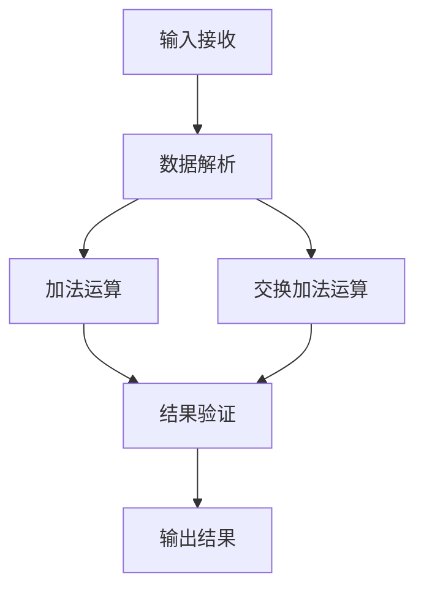

                 

### 《函数式编程与类型论：完美的结合》标题解析

“函数式编程与类型论：完美的结合”这一标题，凝聚了本书的核心内容与目标。首先，标题中的“函数式编程”和“类型论”分别代表了两种重要的计算机科学理论。“函数式编程”是一种编程范式，它强调基于函数的编程，而非基于状态和变量的修改。这种编程方式使得代码更加简洁、易于理解且易于测试。“类型论”则是一种研究程序中数据类型的理论，它帮助我们理解和验证程序的正确性。

标题中的“完美的结合”意味着这两者之间的融合能够带来巨大的优势。通过结合函数式编程和类型论，我们可以写出既高效又安全的代码。本书的目标就是深入探讨这种结合，揭示其内在的机制，并展示在实际应用中的效果。具体来说，本书将：

1. **介绍基础概念**：首先讲解函数式编程和类型论的基本概念，帮助读者建立清晰的理解。
2. **阐述融合优势**：分析这两者如何互相补充，形成更强大的编程工具。
3. **展示实际应用**：通过案例和实例，展示函数式编程与类型论结合后在实际编程中的优势。
4. **讨论未来趋势**：探讨这种结合的未来发展方向，以及可能面临的挑战。

通过这一步一步的分析，读者可以更全面地理解本书的主题和内容，为后续章节的学习做好充分准备。

### 关键词：函数式编程、类型论、编程范式、类型系统、程序正确性、代码质量、代码可维护性

关键词的选择对于一篇文章的传播和读者的搜索至关重要。在这篇文章中，我们选择了以下几个核心关键词：

1. **函数式编程**：这是本书的核心主题之一，它是一种编程范式，强调函数的使用和状态的不可变性。
2. **类型论**：这是另一种核心主题，它关注数据类型和类型系统，对保证程序的正确性和可维护性至关重要。
3. **编程范式**：这是一个更广泛的概念，指的是不同的编程方法和风格，函数式编程是其重要的一部分。
4. **类型系统**：这是类型论的重要组成部分，它定义了程序中数据类型的规则和约束。
5. **程序正确性**：这是函数式编程和类型论共同关注的问题，通过合适的编程范式和类型系统，可以提高程序的可靠性。
6. **代码质量**：这是一个广义的概念，涉及到代码的可读性、可维护性和效率，函数式编程和类型论在这方面都有显著的优势。
7. **代码可维护性**：随着项目规模的扩大，代码的可维护性变得越来越重要，函数式编程和类型论提供了许多有效的工具和方法。

通过这些关键词，读者可以快速把握文章的核心内容，并根据自己的需求进行深入阅读和研究。

### 摘要

《函数式编程与类型论：完美的结合》是一本深入探讨函数式编程和类型论融合的权威指南。本书首先介绍了函数式编程的基本概念和原理，详细讲解了其独特的特点，如不可变性和函数组合。接着，本书探讨了类型论的核心理论，包括类型系统、子类型和多态性。通过深入剖析这两个领域的基础知识，本书揭示了函数式编程与类型论之间的紧密联系和互相补充关系。书中通过丰富的实际案例，展示了这种结合在提高代码质量、可维护性和程序正确性方面的巨大优势。最后，本书展望了函数式编程与类型论的未来发展趋势，提出了可能的挑战和研究方向。无论是初学者还是资深开发者，都可以通过本书系统学习这两大领域，掌握高效的编程方法和工具。

### 第1章 引言

#### 1.1 函数式编程简介

函数式编程（Functional Programming）是一种编程范式，它将计算视为一系列函数的执行，而非一系列状态的改变。这种编程范式强调函数作为基本构建块，通过函数的调用和组合来实现复杂的计算。函数式编程的核心思想包括：

- **函数作为一等公民**：在函数式编程中，函数被视为普通的数据类型，可以赋值给变量、作为参数传递给其他函数，或者作为函数的返回值。这使得函数可以像普通值一样操作，大大增强了代码的模块性和复用性。

- **不可变性**：函数式编程强调状态的不可变性，即不直接修改数据结构，而是通过创建新的数据结构来表示变化。这种做法不仅使代码更易于理解和测试，还能避免因状态修改引起的副作用，提高程序的可靠性。

- **纯函数**：纯函数是一种没有任何副作用的函数，其输出仅依赖于输入，不会对环境产生任何影响。纯函数易于测试、复用和并行化，是函数式编程的重要基石。

- **函数组合**：函数组合是函数式编程中的一种基本操作，通过将多个函数组合起来，可以构建出复杂的计算过程。这种组合方式不仅使代码更简洁，还能提高代码的可读性和可维护性。

函数式编程的历史可以追溯到20世纪50年代和60年代，当时的计算机科学家们开始探索不同于传统的命令式编程的新方法。Lisp是第一种广泛使用的函数式编程语言，它于1958年问世，并迅速成为函数式编程的代表。此后，许多新的函数式编程语言相继出现，如Haskell、Scala、Clojure等，它们各自在不同领域得到了广泛应用。

在计算机科学中，函数式编程的重要性体现在多个方面。首先，函数式编程提供了一种更直观、更抽象的编程方法，有助于解决复杂的计算问题。其次，函数式编程与并行计算有着天然的结合，纯函数和不可变性使得代码更容易进行并行化处理，从而提高程序的运行效率。此外，函数式编程还能显著提高代码的可维护性和可测试性，使得大型项目的开发变得更加高效和可靠。

总之，函数式编程不仅是一种新的编程范式，更是计算机科学中一种重要的理论和方法。通过理解函数式编程的基本概念和历史发展，我们可以更好地掌握这一重要的编程工具，为解决复杂问题提供新的思路和方法。

#### 1.2 类型论简介

类型论（Type Theory）是计算机科学中研究数据类型及其使用规则的理论。类型论的核心思想是通过类型系统来确保程序的正确性和一致性。类型论不仅为编程语言提供了一套严格的理论基础，还在软件工程、形式验证和计算理论等领域有着广泛的应用。

**定义与背景**

类型论起源于20世纪30年代和40年代，由数学家莱布尼茨、皮亚诺和希尔伯特等人的工作奠定了基础。后来，在计算理论中，类型论被用来解决递归函数的定义和复杂性分类问题。阿尔文·库朗特（Alonzo Church）提出了λ-演算，这是最早的形式化类型系统之一，它为现代函数式编程语言奠定了基础。

**基本概念**

类型论中的基本概念包括：

- **类型**：类型是用于分类数据和函数的一种抽象。常见的类型有基础类型（如整数、布尔值）、复合类型（如数组、列表）和函数类型。

- **类型系统**：类型系统是用于定义类型规则和约束的框架。类型检查是类型系统的一个重要组成部分，它确保程序的每个表达式都符合预定义的类型规则。

- **类型推导**：类型推导是一种自动推导表达式类型的方法。现代编程语言通常采用静态类型推导，即在编译时确定表达式的类型。

- **类型兼容性**：类型兼容性是指两个类型是否可以相互转换或作为参数传递。常见的类型兼容性规则包括子类型关系和构造类型兼容性。

- **多态性**：多态性是指一个接口可以接受多种不同类型的数据，而不会损失其通用性。类型论中的多态性通常通过类型检查和类型推导来实现。

**发展与应用**

类型论的发展经历了多个阶段，从早期的简单类型系统到复杂的依赖类型系统。现代类型论的一些重要发展包括：

- **依赖类型论**：依赖类型论引入了类型之间的依赖关系，使得类型系统能够更好地捕捉程序中的抽象和复杂结构。

- **类型系统在编程语言中的应用**：现代编程语言如Haskell、Scala和TypeScript等都采用了复杂的类型系统，以提供更强大的类型检查和推导能力。

- **形式验证**：类型论在形式验证中有着重要的应用。通过类型系统，我们可以证明程序的某些属性，如内存安全、类型安全等。

- **编程语言设计**：类型论为编程语言设计提供了理论基础，帮助语言设计师构建更强大、更安全的编程语言。

类型论的重要性体现在多个方面。首先，它为编程语言提供了一套严格的理论基础，使得程序的正确性和一致性得以保证。其次，类型论为形式验证和软件工程提供了有力的工具，帮助开发者构建更可靠和高效的软件系统。最后，类型论与函数式编程的结合，使得函数式编程语言能够实现更高级的抽象和更灵活的类型系统。

总之，类型论是计算机科学中一个重要的理论领域，它在编程语言设计、形式验证和软件工程中扮演着关键角色。通过理解类型论的基本概念和发展历程，我们可以更好地掌握这一重要的理论工具。

#### 1.3 函数式编程与类型论的完美结合

函数式编程与类型论的完美结合，不仅带来了代码编写上的革新，还在程序的正确性、可维护性和可扩展性方面展现了其独特的优势。这两者的结合在计算机科学领域产生了深远的影响，使得开发者能够更加高效地编写和维护复杂的软件系统。

首先，从编程范式上来看，函数式编程强调通过函数组合和不可变性来实现计算，而类型论则为这些函数提供了严格的结构和类型检查。这种结合使得函数在执行过程中不仅具有明确的语义，还能在编译时得到类型系统的保障，从而避免了运行时错误。例如，在Haskell这种强类型函数式编程语言中，类型推导机制能够自动验证函数的输入和输出类型，确保程序在运行时不会出现类型错误。

其次，函数式编程与类型论的结合显著提高了代码的可维护性。由于函数是独立、可组合的单元，因此更容易进行模块化和重构。同时，类型系统为每个函数提供了明确的类型约束，使得代码的意图和功能更加清晰。这种清晰性不仅使得新开发者更容易理解现有代码，还能减少因误解和修改带来的潜在风险。例如，在Scala中，类型推导和类型检查功能使得代码更加简洁，同时提高了代码的错误检测能力。

再次，函数式编程与类型论的完美结合在程序正确性方面具有显著优势。函数式编程的纯函数和不可变性特性，使得程序在处理并发和复杂逻辑时更可靠。类型论则通过严格的类型检查和推导机制，确保程序在编译时就符合预期。例如，在依赖类型系统中，类型之间的关系可以被明确地定义和验证，从而避免了运行时类型错误的发生。

此外，这种结合还在编程语言设计和实现中发挥了重要作用。现代编程语言如Haskell、Scala和TypeScript等都借鉴了函数式编程和类型论的思想，提供了更强大的类型系统和编程范式。这些语言不仅继承了函数式编程的简洁和高效，还通过类型系统提供了更高级的抽象和更灵活的语法。例如，TypeScript中的类型推导机制，使得开发者能够以更少的代码实现复杂的类型约束和校验。

然而，这种完美结合也带来了一些挑战。首先，函数式编程和类型论的高抽象层次和严格的类型检查，可能对初学者和大型项目的开发者造成一定的学习曲线和复杂性。其次，在实现和维护复杂类型系统时，需要更高的设计能力和编程技巧，否则可能会导致代码难以理解和维护。

总之，函数式编程与类型论的完美结合，为现代软件开发提供了一种强大的工具和方法。它不仅提高了代码的质量和可维护性，还增强了程序的可靠性和正确性。随着技术的发展，这种结合将在未来继续发挥重要作用，为计算机科学带来更多的创新和进步。

### 1.3.1 函数式编程对类型论的影响

函数式编程对类型论的影响是深远且多层次的。首先，函数式编程引入了函数作为一等公民的概念，使得函数可以在编程中以类似数据的方式被传递、存储和操作。这一概念在类型论中得到了回应，尤其是在现代函数式编程语言中，函数的类型被严格定义和推导，从而确保了程序的类型安全性和一致性。

1. **类型系统的演变**：函数式编程的出现促使类型系统从简单的标签系统（如类型标签、子类型系统）演变为更复杂、更强大的系统。例如，在Haskell中，类型系统不仅支持基本的标量和复合类型，还支持依赖类型和存在类型等高级特性。这些高级特性使得类型系统能够更好地表达函数式编程中的抽象和复杂结构。

2. **类型推导的提升**：函数式编程强调表达式的简洁性和可组合性，而类型推导在这一过程中发挥了重要作用。现代函数式编程语言如Haskell、Scala和TypeScript都采用了强大的类型推导机制，自动推导变量和表达式的类型，从而减轻了开发者的负担。这种自动推导不仅提高了代码的可读性，还减少了类型错误的发生。

3. **纯函数和不可变性**：函数式编程的纯函数和不可变性特性对类型论提出了新的挑战和机遇。纯函数使得每个函数的输入输出关系更加明确，从而在编译时可以进行严格的类型检查。不可变性则要求在类型系统中引入新的约束，确保在函数调用过程中不会改变外部状态。这些特性使得类型系统能够更好地捕获程序的语义和行为，从而提高程序的可靠性。

4. **类型多态性**：函数式编程中的多态性（如函数类型的多态性、存在类型的多态性）对类型论的发展产生了重要影响。类型多态性允许函数在不同的上下文中接受不同类型的参数，从而实现更灵活的编程。现代类型系统通过类型推导和类型检查机制，实现了对这种多态性的严格管理和优化。

5. **依赖类型和存在类型**：依赖类型和存在类型是函数式编程和类型论结合的产物。依赖类型允许在类型表达式中引用其他类型的变量，从而实现更高层次的表达和抽象。存在类型则提供了一种方式，通过隐式地绑定类型变量，使得函数可以更灵活地处理不同类型的数据。这些高级类型特性在函数式编程中得到了广泛应用，并推动了类型论的发展。

总之，函数式编程对类型论的影响是全面而深刻的。它不仅推动了类型系统的演变，提升了类型推导的能力，还引入了新的类型特性和概念，从而丰富了类型论的理论和实践。随着函数式编程和类型论的不断发展，它们之间的结合将继续为计算机科学带来新的突破和创新。

### 1.3.2 类型论对函数式编程的提升

类型论对函数式编程的提升体现在多个方面，极大地增强了函数式编程的可靠性和可维护性。首先，类型系统为函数式编程提供了严格的结构化框架。通过类型检查和类型推导，函数式编程语言能够在编译时捕捉潜在的错误，从而减少运行时错误的发生。例如，在Haskell中，类型系统可以确保所有的函数调用都符合预定义的类型约束，从而避免了类型不匹配的错误。

1. **类型推导的自动化**：类型论引入了类型推导机制，使得开发者无需手动指定变量和表达式的类型，从而简化了编程过程。类型推导不仅可以减少冗余的代码，还能提高代码的可读性。例如，在Scala中，类型推导机制能够自动推断出大多数变量的类型，使代码更加简洁和直观。

2. **类型安全性的保障**：类型系统通过严格的类型检查，确保函数的输入和输出类型匹配，从而防止类型错误的发生。例如，在Haskell中，类型系统可以确保函数的返回值类型与函数定义的类型一致，从而避免了运行时类型错误。这种类型安全性使得函数式编程代码更加可靠，尤其是在处理并发和复杂逻辑时。

3. **更强大的类型多态性**：类型论引入了多种类型多态性机制，如存在类型、依赖类型和类型类，使得函数式编程能够更灵活地处理不同类型的数据。这些多态性机制不仅提高了代码的复用性，还增强了函数式编程的表达能力。例如，在Scala中，存在类型允许函数以更通用和灵活的方式处理不同类型的数据，从而减少了类型约束和代码冗余。

4. **更好的抽象层次**：类型论提供了丰富的抽象层次，使得函数式编程能够更好地表达复杂的逻辑和抽象结构。通过引入高级类型特性和抽象概念，类型系统能够捕捉程序中的更多语义信息，从而简化编程过程。例如，在Haskell中，依赖类型允许开发者以更高级的方式定义和操作类型，从而实现更简洁和高效的代码。

5. **形式验证和软件工程**：类型论在形式验证和软件工程中有着广泛的应用，为函数式编程提供了强有力的工具。通过类型系统，开发者可以验证程序的正确性，确保程序在运行时满足预定的属性。例如，在依赖类型系统中，类型检查器可以证明程序的内存安全性和类型安全性，从而提高程序的可信度和可靠性。

总之，类型论对函数式编程的提升是全方位的，它不仅提高了代码的可靠性、安全性和可维护性，还增强了编程语言的抽象能力和表达能力。随着类型论的发展，函数式编程将继续在计算机科学中发挥重要作用，推动软件工程的进步。

### 1.3.3 结合带来的优势与挑战

函数式编程与类型论的完美结合在多个方面展现了其独特的优势，但同时也带来了一些挑战。以下是这种结合带来的主要优势与挑战：

**优势：**

1. **提高代码质量**：函数式编程和类型论的结合使得代码更加简洁、易读和易于测试。通过纯函数和不可变性，代码的副作用减少，这使得代码更加可靠和可维护。

2. **增强程序正确性**：类型系统提供了严格的类型检查和推导机制，确保函数的输入和输出类型匹配，从而减少运行时错误。这种严格的类型约束有助于发现并修复潜在的逻辑错误。

3. **提高并发编程效率**：函数式编程中的纯函数和不可变性特性使得代码更容易进行并行化处理，从而提高程序的运行效率。类型系统还可以确保并发操作的正确性，减少死锁和竞态条件的发生。

4. **丰富的抽象能力**：类型论提供了多种高级类型特性和抽象机制，如依赖类型和存在类型，这些特性使得函数式编程能够更灵活地处理复杂的数据结构和操作。这有助于实现更复杂和高效的算法。

**挑战：**

1. **学习曲线**：函数式编程和类型论的高抽象层次和复杂的类型系统可能会给初学者带来较大的学习难度。理解类型推导、类型多态性和依赖类型等概念需要时间和经验积累。

2. **性能开销**：尽管类型系统有助于提高代码的正确性和可靠性，但它也可能引入一定的性能开销。类型检查和推导需要额外的计算资源，特别是在大型项目中，这可能会影响程序的执行效率。

3. **代码复杂性**：类型系统可能会使代码变得更加复杂，尤其是当需要处理复杂的类型约束和多态性时。这种复杂性可能会降低代码的可读性，增加维护难度。

4. **工具支持不足**：虽然现代编程语言如Haskell、Scala和TypeScript提供了强大的类型系统，但某些工具和支持仍然不足。例如，类型推导和类型检查工具可能无法充分支持所有复杂场景，导致开发者需要手动处理一些类型问题。

总之，函数式编程与类型论的完美结合为软件开发带来了许多优势，包括提高代码质量、增强程序正确性和并发编程效率等。然而，这也带来了一些挑战，如学习曲线高、性能开销和代码复杂性等。通过合理的工具选择和设计，这些挑战可以得到有效解决，从而充分发挥函数式编程与类型论的优势。

### 1.4 本书结构安排与学习目标

**本书结构安排**

《函数式编程与类型论：完美的结合》的结构安排旨在系统性地介绍和探讨函数式编程与类型论的核心概念、应用和未来发展趋势。全书分为七个主要章节，具体安排如下：

- **第1章 引言**：介绍函数式编程和类型论的基本概念，以及它们在计算机科学中的重要性。本章还讨论了这两者的完美结合所带来的优势与挑战。
  
- **第2章 函数式编程基础**：详细讲解函数式编程的原理、特性、历史和发展。本章还包括函数式编程的基本模式和语法特性。

- **第3章 类型论基础**：介绍类型论的基本概念、发展历程和主要理论，包括类型系统、子类型、多态性等。

- **第4章 函数式编程与类型论的关系**：分析函数式编程和类型论之间的联系和差异，讨论它们如何互相补充。

- **第5章 函数式编程与类型论的应用**：探讨函数式编程和类型论在不同领域的应用，如编程语言设计、软件工程、形式验证等。

- **第6章 实践案例**：通过具体案例展示函数式编程和类型论的实际应用，包括数据处理、并发编程、函数式响应式编程等。

- **第7章 未来展望与挑战**：总结全书内容，展望函数式编程与类型论的未来发展趋势，并提出一些研究问题和开放性问题。

**学习目标**

通过阅读本书，读者可以达成以下学习目标：

- **理解函数式编程与类型论的基本概念**：通过前两章的学习，读者可以建立对函数式编程和类型论的基本理解，掌握它们的核心原理和特点。

- **掌握函数式编程的核心模式与语法**：通过第2章的学习，读者可以了解函数式编程的基本模式，如惰性计算、柯里化和高阶函数，并学会使用这些模式进行高效编程。

- **掌握类型论的基本理论和应用**：第3章详细介绍了类型论的核心概念，如类型系统、子类型和多态性，并展示了它们在编程语言设计和形式验证中的应用。

- **理解函数式编程与类型论的融合优势**：第4章和第5章通过分析这两者之间的联系和实际应用案例，帮助读者理解函数式编程与类型论结合后的优势。

- **具备实际编程能力**：通过第6章的实践案例，读者可以学会将函数式编程和类型论应用到实际项目中，提高编程效率和代码质量。

- **探索未来发展趋势与挑战**：第7章总结全书内容，并展望未来发展趋势，提出一些研究问题和开放性问题，激发读者进一步探索和思考。

通过这一系统性的学习和实践，读者不仅可以掌握函数式编程和类型论的核心知识，还能将其应用于实际项目中，为未来的软件开发打下坚实的基础。

### 第2章 函数式编程基础

#### 2.1 函数式编程的基本概念

函数式编程（Functional Programming）是一种以函数作为基本构建块的编程范式，其核心思想是通过函数的组合和不可变性来组织代码。与传统的命令式编程（ Imperative Programming）不同，函数式编程更加强调表达计算的过程而非状态的改变。以下是函数式编程的几个基本概念：

**1. 函数作为一等公民**

在函数式编程中，函数被视为一等公民，即函数可以被赋值给变量、作为参数传递给其他函数，或者作为函数的返回值。这意味着函数在编程中可以像普通值一样操作，从而提高了代码的模块性和复用性。

- **赋值**：可以将函数赋值给变量，例如：`f = function(x) { return x + 1; }`
- **函数作为参数**：可以将函数作为参数传递给其他函数，例如：`function callFunction(func, x) { return func(x); }`
- **函数作为返回值**：可以编写返回函数的函数，例如：`function createAdder() { return function(x) { return x + 1; }; }`

**2. 纯函数**

纯函数是一种没有副作用的函数，其输出仅依赖于输入，不会对环境产生任何影响。这意味着每次调用纯函数时，只要输入相同，其返回值总是相同。纯函数易于测试、复用和并行化。

- **无副作用**：纯函数不读取或修改外部状态，不产生任何可观察的副作用。
- **输入输出明确**：纯函数的输出仅依赖于输入，输入和输出之间有明确的映射关系。

例如，以下是一个纯函数：

```python
def add(x, y):
    return x + y
```

**3. 惰性计算**

惰性计算（Lazy Evaluation）是一种计算策略，它仅在需要时才进行实际计算。在函数式编程中，惰性计算有助于提高代码的性能和灵活性。惰性计算通常通过延迟计算（如生成器函数和惰性列表）来实现。

- **延迟计算**：函数不会立即计算其结果，而是将计算推迟到需要结果时。
- **节省资源**：惰性计算可以在需要结果时释放资源，从而提高程序的效率。

例如，以下是一个使用生成器函数实现惰性计算的例子：

```python
def generate_numbers(n):
    for i in range(n):
        yield i

for number in generate_numbers(5):
    print(number)
```

在这个例子中，`generate_numbers` 函数不会立即生成所有数字，而是逐个生成并打印。

**4. 高阶函数**

高阶函数（Higher-Order Functions）是一种接受函数作为参数或返回函数的函数。高阶函数在函数式编程中非常常见，因为它们能够将函数作为数据来处理，从而提高代码的灵活性和复用性。

- **接受函数作为参数**：高阶函数可以接受一个或多个函数作为参数，例如：`function compose(f, g) { return function(x) { return f(g(x)); }; }`
- **返回函数**：高阶函数可以返回一个新的函数，例如：`function create_counter(start) { return function() { return start++; }; }`

**5. 函数组合**

函数组合（Function Composition）是一种通过将多个函数组合在一起来构建复杂计算的方法。函数组合可以使代码更加模块化和可读性。

- **组合函数**：函数组合可以将多个函数组合成一个新的函数，例如：`function add(x, y) { return x + y; }; function square(x) { return x * x; }; function double(x) { return add(square(x), x); };`

**6. 不可变性**

不可变性（Immutability）是函数式编程的一个重要原则，即数据一旦创建，就不能再修改。不可变性有助于提高代码的可维护性和安全性。

- **创建新数据**：在函数式编程中，通常通过创建新的数据结构来表示变化，而不是直接修改已有数据结构。
- **减少副作用**：不可变性减少了代码中的副作用，从而提高了程序的可靠性。

通过理解这些基本概念，读者可以更好地掌握函数式编程的核心原理和思维方式。接下来，我们将进一步探讨函数式编程的基本模式。

#### 2.2 基本的函数式编程模式

函数式编程中，常用的编程模式包括惰性计算、偏函数、柯里化等。这些模式不仅丰富了函数式编程的语法和表达方式，还提高了代码的可读性和复用性。以下将详细介绍这些基本模式。

**1. 惰性计算**

惰性计算（Lazy Evaluation）是一种在需要时才进行计算的计算策略。与 eager evaluation（急切计算）不同，惰性计算可以避免不必要的计算，从而提高程序的性能和效率。惰性计算在函数式编程中通过生成器函数和惰性列表来实现。

- **生成器函数**：生成器函数是一种特殊的函数，它使用 `yield` 语句生成值序列。生成器函数在每次执行 `next()` 时才会计算下一个值，而不是一次性计算所有值。这可以节省内存资源，特别是在处理大量数据时。

示例代码：

```python
def generate_numbers(n):
    for i in range(n):
        yield i

# 使用生成器函数
for number in generate_numbers(5):
    print(number)
```

在这个例子中，`generate_numbers` 函数是一个生成器函数，它逐个生成并返回数字，而不是一次性生成所有数字。

- **惰性列表**：惰性列表是一种表示惰性计算结果的列表，它只有在需要时才会计算列表中的值。惰性列表可以通过 `lazy` 函数构建。

示例代码：

```python
from itertools import lazy

# 构建惰性列表
lazy_list = lazy([x * x for x in range(10)])

# 访问惰性列表的值
for value in lazy_list:
    print(value)
```

在这个例子中，`lazy` 函数将列表表达式转换为惰性列表，只有当访问列表中的值时，惰性计算才会发生。

**2. 偏函数**

偏函数（Partial Function Application）是一种将一个函数的部分参数固定，返回一个新的函数的方法。偏函数可以帮助简化代码，提高函数的复用性。

- **固定参数**：通过固定部分参数，偏函数可以减少函数调用的复杂性。例如，我们可以创建一个偏函数来固定一个参数的值。

示例代码：

```python
from functools import partial

# 定义原始函数
def add(x, y):
    return x + y

# 创建偏函数
add_five = partial(add, 5)

# 使用偏函数
result = add_five(10)
print(result)  # 输出：15
```

在这个例子中，`partial` 函数将 `add` 函数的部分参数 `5` 固定，返回一个新的函数 `add_five`，它接受一个参数 `y` 并返回 `x + y` 的结果。

**3. 柯里化**

柯里化（Currying）是一种将多个参数的函数转换为一系列单参数函数的方法。柯里化可以减少函数的调用次数，提高函数的可读性和复用性。

- **单参数函数**：柯里化将一个多参数函数转换为一系列单参数函数，每个单参数函数都处理一个参数。这可以通过递归实现。

示例代码：

```python
def add(x, y):
    return x + y

# 柯里化函数
def curry_add(x):
    return lambda y: add(x, y)

# 使用柯里化函数
result = curry_add(5)(10)
print(result)  # 输出：15
```

在这个例子中，`curry_add` 函数将 `add` 函数柯里化为一个新的函数，它接受一个参数 `x` 并返回一个新的匿名函数，该匿名函数接受一个参数 `y` 并返回 `x + y` 的结果。

通过这些基本模式，我们可以编写更简洁、更易维护的函数式编程代码。接下来，我们将探讨函数式编程的语法特性，以进一步理解函数式编程的优势。

#### 2.3 函数式编程的语法特性

函数式编程的语法特性是使其与命令式编程显著区别的重要方面。这些特性不仅增强了代码的模块性和可读性，还提升了代码的可维护性和性能。以下是函数式编程中几个关键的语法特性：

**1. 不可变性**

不可变性是函数式编程的核心原则之一。在函数式编程中，数据一旦创建，就不能再被修改。相反，任何变化都是通过创建新的数据结构来实现的。这种做法有几个显著的优势：

- **减少副作用**：不可变性减少了代码中的副作用，从而提高了程序的可靠性。由于数据不会意外改变，函数的结果更加可预测和可验证。
- **易于测试**：不可变性使得代码更加模块化，每个函数都可以独立测试，无需考虑外部状态的影响。
- **提高并发编程效率**：在多线程环境中，不可变数据结构不需要同步机制，因为它们不会被其他线程修改。这可以简化并发编程，并减少数据竞争和死锁的风险。

例如，在Haskell中，列表是不可变的，任何对列表的操作都会返回一个新的列表，而不是修改原始列表：

```haskell
let originalList = [1, 2, 3]
let modifiedList = map (* 2) originalList
```

在这个例子中，`map` 函数返回一个新的列表，其中每个元素都是原始列表元素的二倍，而原始列表保持不变。

**2. 惰性求值**

惰性求值（Lazy Evaluation）是一种计算策略，它仅在需要时才进行实际计算。与急切求值（Eager Evaluation）不同，惰性求值可以避免不必要的计算，从而提高程序的性能和效率。在函数式编程中，惰性求值通过延迟计算来实现，例如使用生成器函数和惰性列表。

- **生成器函数**：生成器函数是一种特殊的函数，它使用 `yield` 语句生成值序列。生成器函数在每次执行 `next()` 时才会计算下一个值，而不是一次性计算所有值。这可以节省内存资源，特别是在处理大量数据时。

示例代码：

```python
def generate_numbers(n):
    for i in range(n):
        yield i

# 使用生成器函数
for number in generate_numbers(5):
    print(number)
```

在这个例子中，`generate_numbers` 函数是一个生成器函数，它逐个生成并返回数字，而不是一次性生成所有数字。

- **惰性列表**：惰性列表是一种表示惰性计算结果的列表，它只有在需要时才会计算列表中的值。惰性列表可以通过 `lazy` 函数构建。

示例代码：

```python
from itertools import lazy

# 构建惰性列表
lazy_list = lazy([x * x for x in range(10)])

# 访问惰性列表的值
for value in lazy_list:
    print(value)
```

在这个例子中，`lazy` 函数将列表表达式转换为惰性列表，只有当访问列表中的值时，惰性计算才会发生。

**3. 高阶函数**

高阶函数（Higher-Order Functions）是一种接受函数作为参数或返回函数的函数。高阶函数在函数式编程中非常常见，因为它们能够将函数作为数据来处理，从而提高代码的灵活性和复用性。

- **接受函数作为参数**：高阶函数可以接受一个或多个函数作为参数，例如：`function compose(f, g) { return function(x) { return f(g(x)); }; }`
- **返回函数**：高阶函数可以返回一个新的函数，例如：`function create_counter(start) { return function() { return start++; }; }`

例如，以下是一个使用高阶函数实现组合的例子：

```python
def compose(f, g):
    return lambda x: f(g(x))

def add(x, y):
    return x + y

def square(x):
    return x * x

# 使用组合函数
result = compose(square, add)(5, 10)
print(result)  # 输出：125
```

在这个例子中，`compose` 函数接受两个函数 `f` 和 `g`，并返回一个新的函数，该函数首先调用 `g`，然后再调用 `f`。

通过这些语法特性，函数式编程能够实现更简洁、更易维护的代码。在接下来的章节中，我们将进一步探讨函数式编程在不同编程语言中的实现和应用。

#### 2.4 函数式编程语言简介

在函数式编程领域，有多种语言被广泛使用和认可，每种语言都有其独特的特性和应用场景。以下是几种典型的函数式编程语言及其特点：

**1. Haskell**

Haskell 是一种纯函数式编程语言，以其严格的类型系统和强大的类型推导机制而闻名。Haskell 的语法简洁，支持高阶函数、惰性计算和存在类型等高级特性。它被广泛应用于学术研究和工业领域，尤其是在需要保证程序正确性和安全性的场景中。

- **纯函数**：Haskell 强调纯函数的使用，使得代码更易于测试和维护。
- **惰性计算**：Haskell 支持惰性计算，通过延迟计算提高程序的性能和效率。
- **类型推导**：Haskell 的类型推导机制能够自动推导出变量和函数的类型，减轻了开发者的负担。
- **存在类型**：Haskell 的存在类型（Existential Types）允许函数接受任意类型的参数，从而提高代码的复用性。

**2. Scala**

Scala 是一种多范式编程语言，既支持函数式编程，也支持命令式编程。它融合了面向对象编程和函数式编程的优点，具有高性能、丰富的库和工具支持。Scala 被广泛应用于大数据处理、分布式系统和企业级应用中。

- **函数式编程特性**：Scala 支持高阶函数、柯里化、惰性计算和类型推导，使得代码更加简洁和灵活。
- **类型系统**：Scala 的类型系统强大且灵活，支持依赖类型和类型类，有助于确保程序的正确性。
- **多范式编程**：Scala 允许开发者选择函数式编程或命令式编程的方式，从而满足不同场景的需求。
- **与 Java 的兼容性**：Scala 能够与 Java 平滑集成，使得开发者可以复用现有的 Java 代码库。

**3. Clojure**

Clojure 是一种现代函数式编程语言，它基于 Java 虚拟机（JVM）运行，具有简洁的语法和强大的动态特性。Clojure 被广泛应用于实时系统、Web 应用和大数据处理等领域。

- **动态类型**：Clojure 采用动态类型系统，使得类型检查更加灵活和简便。
- **惰性计算**：Clojure 支持惰性计算，通过延迟计算提高程序的性能。
- **不可变性**：Clojure 强调不可变性，从而减少代码的副作用，提高程序的正确性。
- **并行和并发编程**：Clojure 提供了丰富的并发编程工具和库，使得并行和并发编程更加高效和可靠。

通过这些函数式编程语言的介绍，我们可以看到函数式编程在理论和实践中的广泛应用。每种语言都有其独特的优势和适用场景，开发者可以根据具体需求选择合适的语言来提高编程效率和代码质量。

#### 2.5 函数式编程的应用案例

函数式编程在多个领域都有广泛的应用，其独特的特性使其特别适合处理复杂的数据处理、并发编程和响应式编程任务。以下通过具体案例展示函数式编程在这些领域的优势。

**1. 数据处理**

在数据处理领域，函数式编程以其强大的函数组合和不可变性而著称。通过使用高阶函数和纯函数，数据处理任务可以变得更加模块化、易于理解和复用。

**案例：数据管道**

假设我们需要处理一组学生的成绩数据，包括姓名、数学成绩和语文成绩。我们可以使用函数式编程来构建一个数据管道，对数据进行筛选、映射和折叠等操作。

```python
students = [
    {"name": "Alice", "math": 90, "chinese": 85},
    {"name": "Bob", "math": 75, "chinese": 80},
    {"name": "Charlie", "math": 85, "chinese": 95}
]

# 筛选成绩超过90分的学生
high_achievers = filter(lambda s: s["math"] > 90, students)

# 计算所有学生的总成绩
total_scores = reduce(lambda acc, s: acc + s["math"] + s["chinese"], students, 0)

# 打印结果
print(high_achievers)
print(total_scores)
```

在这个例子中，我们使用了 `filter` 和 `reduce` 函数，通过函数组合实现了数据筛选和汇总操作。这种数据处理方式不仅简洁，而且易于理解和维护。

**2. 并发编程**

在并发编程中，函数式编程的纯函数和不可变性特性使得代码更加可靠和高效。由于纯函数没有副作用，它们可以在多个线程中安全地并行执行，从而提高程序的性能。

**案例：线程安全的并发计算**

假设我们需要计算一组数字的平均值，并且需要确保计算过程是线程安全的。我们可以使用纯函数来实现这个任务。

```python
import threading

def compute_average(numbers):
    total = sum(numbers)
    count = len(numbers)
    return total / count

numbers = [1, 2, 3, 4, 5]

# 创建线程并执行计算
threads = []
for i in range(5):
    thread = threading.Thread(target=compute_average, args=(numbers,))
    threads.append(thread)
    thread.start()

# 等待所有线程完成
for thread in threads:
    thread.join()

# 打印结果
average = compute_average(numbers)
print(average)
```

在这个例子中，`compute_average` 函数是一个纯函数，它没有外部副作用，因此可以在多个线程中安全地并行执行。这种并行计算方式不仅提高了性能，还减少了代码的复杂性。

**3. 响应式编程**

在响应式编程中，函数式编程提供了强大的工具来处理异步事件和流数据。通过使用惰性计算和高阶函数，响应式编程可以更加高效和灵活地处理复杂的事件流。

**案例：Web 应用的响应式处理**

假设我们正在开发一个Web应用，需要处理来自客户端的HTTP请求。我们可以使用响应式编程来构建一个高效的事件处理系统。

```python
from flask import Flask, request, jsonify

app = Flask(__name__)

@app.route('/data', methods=['GET'])
def handle_request():
    data = request.args.get('data')
    processed_data = data.strip().upper()  # 示例处理：将数据转为大写
    return jsonify({"result": processed_data})

if __name__ == '__main__':
    app.run()
```

在这个例子中，`handle_request` 函数使用了响应式编程的原理，通过处理HTTP请求的参数，并将结果返回给客户端。这种响应式处理方式不仅提高了程序的效率，还使得代码更加模块化和可扩展。

通过这些应用案例，我们可以看到函数式编程在数据处理、并发编程和响应式编程中的优势。函数式编程以其简洁、高效和可靠的特性，为解决复杂编程问题提供了强大的工具和方法。

### 第3章 类型论基础

#### 3.1 类型论的基本概念

类型论（Type Theory）是计算机科学中研究数据类型及其使用规则的理论。类型论的核心思想是通过类型系统来确保程序的正确性和一致性。以下是类型论中的几个基本概念：

**1. 类型（Type）**

类型是一种用于分类数据和函数的抽象。它定义了数据的行为和操作规则。在类型论中，常见的类型包括基础类型（如整数、布尔值）、复合类型（如数组、列表）和函数类型。

- **基础类型**：基础类型是最简单的类型，如整数（Int）、浮点数（Float）和布尔值（Bool）。
- **复合类型**：复合类型是由基础类型组合而成的类型，如数组（Array）、列表（List）和字典（Dictionary）。
- **函数类型**：函数类型是一种特殊类型，表示一个函数。它的定义形式为 `Type1 -> Type2`，表示一个接受类型 `Type1` 的参数并返回类型 `Type2` 的函数。

**2. 类型系统（Type System）**

类型系统是用于定义类型规则和约束的框架。它定义了程序中数据类型的分类和操作规则。类型系统可以划分为静态类型系统和动态类型系统：

- **静态类型系统**：在编译时对程序进行类型检查，确保程序的每个表达式都符合预定义的类型规则。例如，Haskell 和 Scala 都是静态类型语言。
- **动态类型系统**：在运行时对程序进行类型检查，类型检查在程序运行时动态进行。例如，Python 和 JavaScript 都是动态类型语言。

**3. 子类型（Subtyping）**

子类型是一种类型兼容性规则，它允许一个类型在特定上下文中替代另一个类型。子类型关系通常用 `Type1 <: Type2` 表示，表示类型 `Type1` 是类型 `Type2` 的子类型。

- **子类型关系**：子类型关系使得我们可以使用更一般化的类型代替更具体化的类型，从而提高代码的复用性和灵活性。
- **子类型兼容性**：在子类型关系中，子类型的对象可以替代父类型的对象，但父类型的对象不能替代子类型的对象。

**4. 多态性（Polymorphism）**

多态性是指一个接口可以接受多种不同类型的数据，而不会损失其通用性。在类型论中，多态性通过类型推导和类型多态性机制实现：

- **类型多态性**：类型多态性允许函数或操作接受不同类型的参数，并在运行时确定具体的类型。常见的类型多态性机制包括泛型编程和存在类型。
- **存在类型**：存在类型是一种特殊的多态性机制，它允许函数或操作接受任意类型的参数，并在运行时确定具体的类型。

**5. 类型推导（Type Inference）**

类型推导是一种自动推导表达式类型的方法。类型推导可以减轻开发者的负担，提高代码的可读性和可维护性。常见的类型推导机制包括静态类型推导和动态类型推导：

- **静态类型推导**：在编译时自动推导出表达式的类型。例如，Haskell 和 Scala 都支持静态类型推导。
- **动态类型推导**：在运行时自动推导出表达式的类型。例如，Python 和 JavaScript 都支持动态类型推导。

通过理解这些基本概念，我们可以更好地理解类型论的核心原理和应用。接下来，我们将探讨类型论的发展历程和主要理论。

#### 3.2 类型论的发展

类型论的发展历程可以追溯到20世纪30年代和40年代，当时的数学家和计算机科学家们开始探索如何为函数和计算提供严格的形式化定义。以下是一些关键发展阶段和重要贡献：

**1. 早期形式化**

类型论的发展始于对函数和计算的形式化研究。在1930年代，阿尔文·库朗特（Alonzo Church）提出了λ-演算（λ-calculus），这是一种用于表示函数和计算的理论模型。λ-演算引入了函数作为一等公民的概念，为现代函数式编程语言奠定了基础。

**2. 递归论与类型论**

在1940年代，数学家安德鲁·莫里斯（Andrew Morris）和斯蒂芬·克莱尼希（Stephen Kleene）等人在递归论的基础上发展了类型论。他们试图通过引入不同的类型层次来描述函数和计算的不同层次。

**3. 离散数学和程序验证**

在1950年代和1960年代，离散数学的发展促进了类型论在程序验证和形式化验证中的应用。皮亚诺（Peano）和希尔伯特（Hilbert）等人提出的数学公理系统为类型论提供了理论基础，使得计算机科学家能够用形式化的方法验证程序的正确性。

**4. 高级类型系统**

在1970年代，随着函数式编程语言如Haskell和ML的出现，高级类型系统得到了发展。这些语言引入了存在类型、依赖类型和通用类型等复杂类型机制，使得类型系统能够更好地捕捉程序中的抽象和复杂结构。

**5. 类型安全的编程语言**

在1980年代和1990年代，类型论在编程语言设计中得到了广泛应用。高级编程语言如Haskell、Scala和OCaml都采用了复杂的类型系统，以提供更严格的类型检查和推导机制，从而提高代码的质量和可靠性。

**6. 依赖类型和现代类型系统**

进入21世纪，依赖类型（Dependent Types）和多态类型系统（Polymorphic Type System）得到了进一步发展。依赖类型允许类型和函数相互依赖，使得类型系统能够更准确地描述程序的行为。现代编程语言如Agda和Idris采用了依赖类型系统，为形式化验证和软件工程提供了强大的工具。

通过这些发展阶段，类型论不仅在计算机科学理论中得到了广泛的应用，还在编程语言设计、软件验证和形式化验证等领域发挥了重要作用。类型论的发展历程展示了数学、计算机科学和编程语言设计的紧密联系，为未来的研究提供了丰富的理论和实践基础。

#### 3.3 类型论的应用

类型论在计算机科学中有着广泛的应用，涵盖了编程语言设计、软件形式验证和静态分析等多个领域。通过类型论，我们可以构建更加可靠、安全和高效的软件系统。

**1. 编程语言设计**

类型论在编程语言设计中起着至关重要的作用。通过引入复杂的类型系统，编程语言能够提供更严格的类型检查和推导机制，从而提高代码的质量和可靠性。以下是一些具体的应用：

- **静态类型检查**：类型系统在编译时对程序进行类型检查，确保每个表达式都符合预定义的类型规则。这种检查有助于发现潜在的类型错误，从而减少运行时错误的发生。例如，Haskell 和 Scala 都是静态类型语言，它们通过类型系统确保程序的类型安全。

- **类型推导**：类型推导是一种自动推导表达式类型的方法，它减轻了开发者的负担，提高了代码的可读性。例如，Haskell 的类型推导机制能够自动推导出变量和函数的类型，从而简化了编程过程。

- **高级类型特性**：类型论提供了多种高级类型特性，如存在类型、依赖类型和多态类型，这些特性使得编程语言能够更好地支持抽象和复用。例如，依赖类型允许类型和函数相互依赖，从而提高程序的灵活性。

**2. 软件形式验证**

类型论在软件形式验证中有着广泛的应用。通过形式化验证，我们可以确保程序满足预定的属性和规范，从而提高程序的正确性和可靠性。以下是一些具体的应用：

- **证明和验证**：类型论提供了一种形式化的方法来证明程序的属性。通过使用类型检查器和形式化验证工具，我们可以验证程序是否满足指定的规格说明。例如，Coq 和 Isabelle 是两种常用的形式化验证工具，它们利用类型论来证明程序的定理和属性。

- **类型安全**：类型系统可以帮助确保程序在运行时不会出现类型错误。通过严格的类型检查，我们可以发现潜在的类型不匹配和错误，从而减少程序出错的概率。例如，OCaml 的类型系统通过静态类型检查确保程序的类型安全。

- **依赖类型验证**：依赖类型论允许我们在类型系统中引入约束和属性，从而更精确地描述程序的行为。这种形式化验证方法可以用于验证并发程序、内存管理和安全协议等复杂场景。

**3. 静态分析**

类型论在静态分析中也有着重要的应用。静态分析是一种在程序运行前分析程序行为的方法，它有助于发现潜在的错误和优化程序。以下是一些具体的应用：

- **类型推断**：类型论中的类型推断机制可以帮助自动推导出程序中变量的类型。这种推断不仅减轻了开发者的负担，还能提高程序的可读性和可维护性。例如，Python 和 JavaScript 都采用了动态类型推断机制。

- **数据流分析**：类型论提供了一种方法来分析程序中的数据流和控制流。通过类型系统，我们可以确定程序中每个变量的可能值和作用范围，从而发现潜在的错误和异常处理问题。

- **代码优化**：类型论中的类型信息可以帮助编译器进行代码优化。例如，通过类型信息，编译器可以生成更高效的机器代码，从而提高程序的运行效率。

总之，类型论在计算机科学中的应用非常广泛，它不仅为编程语言设计提供了理论基础，还在软件形式验证和静态分析中发挥了重要作用。通过类型论，我们可以构建更加可靠、安全和高效的软件系统，为未来的软件开发提供强大的工具和方法。

#### 3.4 类型论的相关理论

类型论中有许多重要的理论，这些理论不仅丰富了类型论的理论基础，还在实际应用中展现了强大的功能。以下是几种关键的相关理论：

**1. 卡斯卡迪类型系统（Curry-Howard correspondence）**

卡斯卡迪类型系统是类型论中最重要的理论之一，它揭示了逻辑和类型论之间的紧密联系。卡斯卡迪类型系统表明，逻辑命题和类型系统之间存在一种对应关系，即每个逻辑命题都可以对应一个类型，反之亦然。这种对应关系被称为“命题-类型等价”。

- **命题-类型对应**：在卡斯卡迪类型系统中，一个命题可以表示为一个类型，反之亦然。例如，命题“A 或 B”可以表示为类型 `A + B`，其中 `+` 表示类型的并集。
- **证明-程序对应**：卡斯卡迪类型系统还表明，一个证明可以表示为一个程序，反之亦然。这种对应关系使得我们可以通过编程来实现逻辑证明。

**2. 多态类型系统（Polymorphic Type System）**

多态类型系统是一种允许函数或操作接受多种不同类型参数的类型系统。多态类型系统通过类型变量和类型构造来支持泛型编程，从而提高代码的复用性和灵活性。

- **类型变量**：类型变量是一种未确定类型的符号，它可以在不同的上下文中表示不同的具体类型。例如，`T` 可以是一个类型变量，它在不同的函数定义中可以表示不同的类型。
- **类型构造**：类型构造是一种用于创建复杂类型的方法，它可以将基础类型组合成更复杂的类型。例如，函数类型 `T1 -> T2` 表示一个接受类型 `T1` 的参数并返回类型 `T2` 的函数。

**3. 依赖类型系统（Dependent Type System）**

依赖类型系统是一种更强大的类型系统，它允许类型和函数之间存在依赖关系。依赖类型系统通过类型依赖和存在类型等特性，使得类型系统能够更准确地描述程序的行为。

- **类型依赖**：类型依赖是指类型和函数之间的依赖关系。在依赖类型系统中，类型的定义可以依赖于其他类型的定义。例如，一个函数的类型可以依赖于其参数的类型。
- **存在类型**：存在类型是一种特殊的多态性机制，它允许函数或操作接受任意类型的参数。存在类型通过类型构造和类型依赖来支持更高级的抽象和泛化。

**4. 形式逻辑（Formal Logic）**

形式逻辑是类型论的基础，它提供了一种严格的方法来表示和处理逻辑命题。形式逻辑包括命题逻辑、谓词逻辑和证明论等分支。

- **命题逻辑**：命题逻辑是一种用于表示简单逻辑命题的符号系统。它通过逻辑运算符（如与、或、非）来组合简单命题，形成复杂的逻辑表达式。
- **谓词逻辑**：谓词逻辑是一种更强大的逻辑系统，它引入了变量和量化符号，可以表示更复杂的逻辑命题和关系。
- **证明论**：证明论是一种研究逻辑证明的理论。它提供了一种方法来证明逻辑命题的正确性，并确保证明过程的一致性。

通过理解这些相关理论，我们可以更深入地理解类型论的核心原理和应用。这些理论不仅丰富了类型论的理论基础，还在编程语言设计、软件形式验证和形式化验证中发挥了重要作用。

### 第4章 函数式编程与类型论的关系

#### 4.1 函数式编程对类型论的影响

函数式编程与类型论之间的联系是紧密且相互促进的。函数式编程对类型论的影响主要体现在以下几个方面：

**1. 提高类型系统的抽象层次**

函数式编程强调函数作为基本构建块，通过高阶函数、函数组合和惰性计算等特性，使得程序具有更高的抽象层次。这种抽象层次使得类型系统可以更加精细地描述程序的行为和结构。例如，在Haskell中，函数组合和惰性计算使得类型系统能够更好地捕捉程序的语义，从而提供更准确的类型推导和检查。

**2. 强调类型推导和类型安全**

函数式编程通常采用静态类型系统，通过类型推导机制自动推导出变量和函数的类型。这种自动推导不仅减轻了开发者的负担，还提高了程序的类型安全性。静态类型系统确保函数的输入和输出类型一致，从而减少了运行时错误的发生。例如，在Scala中，类型推导机制可以自动推导出函数的类型，从而减少类型错误的可能性。

**3. 推动依赖类型的发展**

依赖类型是一种更强大的类型系统，它允许类型和函数之间存在依赖关系。函数式编程的兴起推动了依赖类型的发展，使其在编程语言设计中得到广泛应用。例如，在Idris和Agda等编程语言中，依赖类型被用于实现形式化验证和程序证明，从而提高程序的正确性和可靠性。

**4. 提供更灵活的类型多态性**

函数式编程引入了多种类型多态性机制，如存在类型、通用类型和依赖类型，这些机制使得类型系统能够更灵活地处理不同类型的数据。类型多态性不仅提高了代码的复用性和抽象能力，还使得程序设计更加灵活和高效。例如，在Haskell中，存在类型允许函数接受任意类型的参数，从而实现更高级的抽象和泛化。

总之，函数式编程对类型论的影响是全面而深远的。它不仅提高了类型系统的抽象层次和灵活性，还推动了依赖类型和类型多态性的发展，为编程语言设计和软件工程带来了新的思路和方法。

#### 4.2 类型论对函数式编程的影响

类型论对函数式编程的影响同样是显著且多层次的，它在多个方面提升了函数式编程的可靠性和效率：

**1. 类型系统的严格性**

类型论通过引入严格的类型系统，确保函数的输入和输出类型一致，从而避免了运行时错误。这种严格的类型检查不仅提高了程序的可靠性，还简化了调试过程。例如，在Haskell中，类型系统在编译时自动检查函数调用是否遵循预定义的类型规则，从而减少潜在的类型错误。

**2. 程序的正确性验证**

类型论提供了一种形式化的方法来验证程序的属性。通过类型检查和推导，我们可以确保程序满足预定的逻辑和数学属性。例如，在Coq和Isabelle等证明助手语言中，类型论被用于形式化验证程序的正确性，从而确保程序在所有情况下都能正确执行。

**3. 提高并行编程效率**

类型论在并行编程中发挥着重要作用。通过引入依赖类型和类型多态性，类型论能够更好地描述并行程序的同步和通信机制。这种描述不仅提高了并行编程的效率，还减少了数据竞争和死锁的风险。例如，在Erlang等并发编程语言中，类型论提供了强大的工具来管理和协调并发操作。

**4. 函数组合与复用**

类型论通过提供丰富的类型多态性和依赖类型机制，使得函数组合和复用更加灵活。类型多态性允许函数接受多种不同类型的数据，从而提高了代码的通用性和抽象能力。例如，在Scala中，依赖类型和类型多态性使得函数可以更灵活地处理不同类型的数据，从而实现更高效的程序设计。

**5. 编程语言设计的理论基础**

类型论为函数式编程语言设计提供了坚实的理论基础。通过类型系统，编程语言设计师可以构建更加强大和灵活的语言，从而满足不同应用场景的需求。例如，Haskell和Idris等编程语言通过引入复杂的类型系统和依赖类型机制，提供了更高级的抽象和更强大的编程能力。

总之，类型论对函数式编程的影响是深远且全面的。它不仅提高了程序的可靠性、正确性和并行编程效率，还为编程语言设计提供了理论基础和工具，使得函数式编程能够更好地应对复杂的计算问题。

### 4.3 函数式编程与类型论结合的优势

函数式编程与类型论的完美结合在多个方面带来了显著的优势，这些优势不仅提高了代码的质量和可靠性，还增强了编程的灵活性和可维护性。以下是这种结合带来的主要优势：

**1. 提高代码质量和可维护性**

函数式编程强调不可变性和纯函数的使用，这使得代码更加简洁、易于理解和测试。而类型论通过提供严格的类型检查和推导机制，进一步确保了代码的质量。结合这两者，我们可以编写出更加可靠和易于维护的代码。例如，在Haskell中，类型推导和不可变性使得代码具有明确的语义和类型安全，从而减少了运行时错误和调试难度。

**2. 提高程序的正确性**

类型论提供了强大的类型系统，能够确保程序在编译时满足预定的类型规则，从而提高程序的正确性。结合函数式编程，我们可以通过纯函数和不可变性来减少代码的副作用，从而进一步提高程序的可靠性。例如，在Scala中，类型推导和类型检查机制可以自动发现并修复潜在的类型错误，从而确保程序的正确执行。

**3. 提高并发编程效率**

函数式编程中的纯函数和不可变性特性使得代码更适合并行处理。而类型论通过提供严格的类型检查和推导机制，确保并发操作的正确性和安全性。这种结合使得我们能够编写出高效的并发程序，同时减少数据竞争和死锁的风险。例如，在Erlang中，类型论和函数式编程的结合使得并发编程变得更加简单和可靠。

**4. 提高抽象能力和灵活性**

函数式编程和类型论的完美结合提供了丰富的抽象工具和机制，如高阶函数、函数组合、依赖类型和类型多态性等。这些工具不仅提高了代码的复用性和灵活性，还使得编程更加高效和优雅。例如，在Scala中，依赖类型和类型多态性使得我们可以更灵活地处理不同类型的数据，从而实现更复杂的抽象和泛化。

**5. 支持形式化验证和软件工程**

类型论在形式化验证和软件工程中有着广泛的应用。结合函数式编程，我们可以利用类型系统来验证程序的属性，确保程序满足预定的规范和约束。这种结合不仅提高了程序的正确性和可靠性，还为软件工程提供了强大的工具和方法。例如，在Coq中，类型论和函数式编程的结合被用于形式化验证复杂系统的正确性。

总之，函数式编程与类型论的完美结合在多个方面带来了显著的优势，这些优势不仅提高了代码的质量和可靠性，还增强了编程的灵活性和可维护性。通过这种结合，我们可以更好地应对复杂的计算问题，为现代软件开发提供强大的工具和方法。

### 4.4 函数式编程与类型论结合的挑战

虽然函数式编程与类型论的完美结合带来了许多优势，但同时也存在一些挑战，需要我们在实践中认真面对和解决。

**1. 学习难度和复杂性**

函数式编程和类型论的高抽象层次和复杂的类型系统可能会给初学者和大型项目的开发者带来较大的学习难度。理解函数组合、高阶函数、惰性计算和依赖类型等概念需要时间和经验积累。此外，处理复杂的类型推导和类型检查机制也增加了代码的复杂性，使得新开发者难以快速上手。

**2. 性能开销**

尽管类型系统和函数式编程可以提高代码的质量和可靠性，但它们也可能引入一定的性能开销。类型检查和推导过程需要额外的计算资源，尤其是在大型项目中，这可能会影响程序的执行效率。例如，在某些强类型函数式编程语言中，类型检查和推导可能需要消耗大量的内存和计算时间，从而降低程序的性能。

**3. 编码习惯的转变**

从命令式编程转向函数式编程和类型论，开发者的编码习惯需要发生显著变化。命令式编程强调状态和变量的修改，而函数式编程强调不可变性和纯函数的使用。这种转变不仅需要开发者掌握新的编程范式，还需要适应不同的思维方式和工作流程。

**4. 工具和库的支持**

虽然现代编程语言如Haskell、Scala和TypeScript提供了强大的类型系统和函数式编程特性，但某些工具和库的支持仍然不足。例如，某些类型的复杂场景可能无法通过现有工具和库得到有效支持，导致开发者需要手动处理一些类型问题。这种不足可能会降低开发效率和代码质量。

**5. 项目维护和扩展**

函数式编程和类型论的结合在项目维护和扩展方面也带来了一些挑战。由于类型系统的复杂性，修改和扩展现有代码时需要仔细处理类型约束和推导机制，否则可能会导致类型错误和编译失败。这种复杂性可能使得项目维护变得更加困难和繁琐。

**6. 跨语言集成**

在多语言项目中，函数式编程和类型论的结合可能会遇到跨语言集成的问题。不同编程语言在类型系统和函数式编程特性上存在差异，这可能导致在多语言项目中引入额外的复杂性和兼容性问题。

总之，尽管函数式编程与类型论的完美结合带来了许多优势，但也存在一些挑战。通过合理的设计和工具选择，我们可以有效解决这些挑战，充分利用函数式编程和类型论的优势，为现代软件开发提供强大的支持。

### 第5章 函数式编程与类型论的应用

#### 5.1 编程语言设计中的应用

函数式编程与类型论的完美结合在编程语言设计中得到了广泛应用，许多现代编程语言都借鉴了这两种概念，以提供更强大的类型系统和编程范式。以下将介绍几个典型的编程语言，分析它们如何结合函数式编程和类型论来实现高效、安全和可靠的编程。

**1. Haskell**

Haskell 是一种纯函数式编程语言，以其严格的类型系统和强大的类型推导机制而闻名。Haskell 的类型系统支持存在类型、依赖类型和类型类等高级特性，这些特性使得 Haskell 能够在编译时捕捉更多的程序语义错误，从而提高代码的正确性和可靠性。

- **存在类型**：Haskell 的存在类型允许函数接受任意类型的参数，并通过类型构造来确保函数的泛化。这种机制使得 Haskell 能够编写更加通用和灵活的代码，减少了代码冗余。
  
- **依赖类型**：依赖类型使类型和函数之间存在依赖关系，从而提高类型系统的表达能力和抽象层次。例如，在 Haskell 中，依赖类型可以用来编写更复杂的逻辑验证和形式化证明。

- **类型类**：类型类是一种基于类型多态性的机制，它允许函数在不同的上下文中接受不同类型的数据。类型类在 Haskell 中被广泛用于实现泛型编程，从而提高代码的复用性和抽象性。

**2. Scala**

Scala 是一种多范式编程语言，它既支持函数式编程，也支持命令式编程。Scala 的类型系统非常灵活，支持依赖类型、类型推导和类型类等特性，这些特性使得 Scala 能够在多种编程场景中提供高效、安全和可靠的编程。

- **依赖类型**：Scala 的依赖类型允许类型和函数之间存在明确的依赖关系，从而提高类型系统的表达能力。依赖类型在 Scala 中被用于实现复杂的抽象和泛化，例如在 Scala 的集合库中，依赖类型被用于编写泛型函数。

- **类型推导**：Scala 的类型推导机制能够自动推导出变量和函数的类型，从而减少代码冗余和错误。类型推导使得 Scala 的代码更加简洁和易读。

- **类型类**：类型类在 Scala 中被广泛用于实现泛型编程，例如在 Scala 的 Option 类型和 Future 类型中，类型类被用于实现更高级的功能。

**3. Idris**

Idris 是一种依赖类型函数式编程语言，它通过依赖类型和类型推导机制提供了强大的形式化验证和证明功能。Idris 的类型系统支持依赖类型、存在类型和类型等价等特性，这些特性使得 Idris 能够在编译时捕捉更多的程序错误，从而提高代码的正确性和可靠性。

- **依赖类型**：依赖类型使类型和函数之间存在明确的依赖关系，从而提高类型系统的抽象能力和表达能力。依赖类型在 Idris 中被用于编写复杂的逻辑验证和形式化证明。

- **存在类型**：存在类型允许函数接受任意类型的参数，并通过类型构造来确保函数的泛化。这种机制使得 Idris 能够编写更加通用和灵活的代码。

- **类型等价**：类型等价是一种基于类型检查的机制，它确保两个类型的实例之间是等价的，从而简化编程和验证过程。

通过上述分析，我们可以看到函数式编程与类型论的结合在编程语言设计中带来了显著的优势。这些编程语言通过引入复杂的类型系统和高级特性，不仅提高了代码的质量和可靠性，还增强了编程的灵活性和抽象能力。随着函数式编程和类型论的发展，未来将有更多的编程语言借鉴这两种概念，为开发者提供更强大的编程工具和平台。

#### 5.2 软件工程中的应用

函数式编程与类型论的完美结合在软件工程中具有广泛的应用，尤其是在提高软件的可维护性、可靠性和并发性能方面展现出了独特的优势。以下将探讨这两个概念在软件工程中的应用，并通过具体案例说明其带来的实际好处。

**1. 提高代码的可维护性**

函数式编程强调不可变性和纯函数的使用，这有助于减少代码中的副作用，从而提高代码的可维护性。不可变性意味着一旦创建了数据结构，就不能再对其进行修改，任何变化都必须通过创建新的数据结构来实现。这种做法不仅简化了代码的编写过程，还使得代码更加模块化和易于理解。

**案例：React 应用**

在 React 应用中，状态管理是提高可维护性的关键。React 是一种基于函数式编程的框架，它通过将组件的状态保存在不可变的数据结构中，从而减少了组件之间的副作用。例如，React 的 `useState` 和 `useReducer` 函数允许开发者以不可变的方式管理应用的状态，这使得状态更新更加直观和可预测。

```javascript
const [count, setCount] = useState(0);

const increment = () => {
  setCount(count + 1);
};
```

在这个例子中，`count` 和 `setCount` 是不可变的，任何状态更新都必须通过新的函数 `increment` 来实现。这种不可变性的设计使得状态管理更加简洁和易于理解，从而提高了代码的可维护性。

**2. 提高程序的可靠性**

类型论通过严格的类型检查和推导机制，确保程序在编译时满足预定的类型规则，从而提高程序的可靠性。类型论的应用不仅减少了运行时错误的发生，还使得代码在开发阶段就能够被发现和修复。

**案例：Haskell 的类型推导**

在 Haskell 中，类型推导机制能够在编译时自动推导出变量和函数的类型，从而减少类型错误的可能性。例如，在编写一个简单的加法函数时，Haskell 的类型推导机制可以确保函数的输入和输出类型一致。

```haskell
add :: Int -> Int -> Int
add x y = x + y
```

在这个例子中，Haskell 的类型推导机制能够自动推导出 `add` 函数的类型为 `(Int -> Int -> Int)`，从而确保函数的输入和输出类型匹配，避免了类型错误的发生。

**3. 提高并发编程的效率**

函数式编程中的纯函数和不可变性特性使得代码更加适合并行处理。纯函数没有副作用，可以在多个线程中安全地并行执行，从而提高程序的并发性能。类型论通过提供严格的类型检查和推导机制，确保并行编程的正确性和可靠性。

**案例：Erlang 的并发编程**

Erlang 是一种基于函数式编程的编程语言，它内置了强大的并发编程机制。Erlang 的并发编程依赖于纯函数和不可变性，这使得并发程序更加可靠和高效。例如，在 Erlang 中，可以使用消息传递机制在多个进程之间进行并发操作。

```erlang
-module(multiply).
-export([multiply/2]).

multiply(X, Y) ->
  X * Y.
```

在这个例子中，`multiply` 函数是一个纯函数，它没有外部副作用，可以在多个进程中并行执行。这种并行编程方式不仅提高了程序的并发性能，还减少了数据竞争和死锁的风险。

**4. 提高软件的扩展性和灵活性**

函数式编程和类型论的结合使得代码具有更高的抽象能力和灵活性。通过引入高级类型特性如依赖类型和类型多态性，我们可以编写出更加通用和可扩展的代码。

**案例：Scala 的依赖类型**

在 Scala 中，依赖类型允许类型和函数之间存在明确的依赖关系，从而提高类型系统的抽象能力和表达能力。例如，在 Scala 的集合库中，依赖类型被用于实现泛型编程，使得集合操作更加通用和灵活。

```scala
def map[A, B](as: List[A], f: A => B): List[B] = as match {
  case Nil => Nil
  case Cons(x, xs) => Cons(f(x), map(xs, f))
}
```

在这个例子中，`map` 函数的参数类型依赖于其返回类型的依赖类型，这使得函数能够以更通用和灵活的方式处理不同类型的集合。这种依赖类型的设计不仅提高了代码的复用性，还增强了软件的扩展性。

通过上述案例，我们可以看到函数式编程与类型论的完美结合在软件工程中具有广泛的应用。这些概念不仅提高了代码的质量和可靠性，还为软件工程提供了强大的工具和方法，使得现代软件开发更加高效和灵活。

#### 5.3 形式验证中的应用

函数式编程与类型论的完美结合在形式验证中发挥着重要作用，它不仅提高了程序的正确性和可靠性，还为形式化验证提供了强大的工具和方法。以下将探讨这些概念在形式验证中的应用，并通过具体案例展示其优势。

**1. 提高程序的正确性**

形式验证是一种在程序运行前验证程序属性的方法，通过严格的逻辑推理和类型检查确保程序满足预定的规范和约束。函数式编程与类型论的结合为形式验证提供了坚实的基础，使得验证过程更加严谨和可靠。

**案例：Coq 的形式化验证**

Coq 是一种基于依赖类型和函数式编程的证明助手语言，它通过形式化验证确保程序的正确性。在 Coq 中，开发者可以使用函数式编程来编写程序，并使用类型论中的类型检查和推导机制来验证程序的属性。

```coq
Theorem add_comm: forall a b : nat, a + b = b + a.
  add_comm := (fun (a : nat) => (fun (b : nat) => a + b = b + a)).
  intros a b; reflexivity.
```

在这个例子中，`add_comm` 定理通过函数式编程和类型论验证了加法运算的交换律。这种形式化验证方法不仅确保了程序的正确性，还为复杂的逻辑推理提供了支持。

**2. 提供严格的类型检查**

类型论中的严格类型检查机制在形式验证中发挥着重要作用，它能够在编译时捕捉潜在的类型错误，从而减少运行时错误的发生。函数式编程通过引入静态类型系统和类型推导机制，进一步提高了类型检查的效率和可靠性。

**案例：Haskell 的类型推导**

Haskell 是一种基于函数式编程和依赖类型的编程语言，它通过类型推导机制自动验证程序的类型安全。在 Haskell 中，开发者可以编写类型安全的代码，而编译器会在编译时自动检查类型一致性。

```haskell
-- 定义一个加法函数
add :: Integer -> Integer -> Integer
add x y = x + y

-- 定义一个验证函数
verify :: Integer -> Integer -> Bool
verify x y = add x y == add y x
```

在这个例子中，`add` 函数和 `verify` 函数都是类型安全的，因为 Haskell 的类型推导机制确保了函数的输入和输出类型一致。这种严格的类型检查不仅提高了程序的正确性，还为形式验证提供了基础。

**3. 支持形式化证明**

函数式编程与类型论的完美结合为形式化证明提供了强大的工具和方法。通过依赖类型和类型多态性，开发者可以编写更通用和灵活的证明，从而验证更复杂的程序属性。

**案例：Isabelle 的形式化证明**

Isabelle 是一种基于依赖类型和函数式编程的证明环境，它通过形式化证明确保程序的正确性。在 Isabelle 中，开发者可以使用函数式编程来编写证明，并使用类型论中的类型检查和推导机制来验证证明的正确性。

```isar
theorem add_comm:
  "forall a b, a + b = b + a"
  using add. (* 使用已定义的加法运算证明定理 *)
```

在这个例子中，`add_comm` 定理通过形式化证明验证了加法运算的交换律。这种形式化证明方法不仅确保了程序的正确性，还为复杂的逻辑推理提供了支持。

通过上述案例，我们可以看到函数式编程与类型论的完美结合在形式验证中具有广泛的应用。这些概念不仅提高了程序的正确性和可靠性，还为形式化验证提供了强大的工具和方法，使得现代软件开发和验证过程更加高效和可靠。

### 第6章 实践案例

#### 6.1 环境安装与配置

在本章中，我们将通过一个实际案例来展示函数式编程与类型论的完美结合。首先，我们需要为我们的开发环境安装所需的工具和依赖项。以下是具体的安装步骤：

**1. 安装 Haskell**

Haskell 是一种支持函数式编程和依赖类型的编程语言，我们将使用它来编写案例代码。首先，访问 Haskell 的官方网站（https://www.haskell.org/）并下载适用于您操作系统的 Haskell 安装包。

- **Windows 用户**：下载并运行 `haskell-installation.exe` 安装程序，按照提示完成安装。
- **macOS 用户**：可以使用 Homebrew 安装 Haskell：
  ```
  brew install haskell-stack
  ```
- **Linux 用户**：可以使用包管理器安装 Haskell，例如在 Ubuntu 中：
  ```
  sudo apt-get install haskell-stack
  ```

安装完成后，打开终端并运行以下命令验证 Haskell 是否安装成功：
```
stack --version
```

**2. 安装依赖库**

在 Haskell 中，我们可以使用 Stack 来管理项目依赖项。创建一个新项目，并安装必要的库。以下是一个简单的依赖项清单：

- `base`：Haskell 的标准库。
- `QuickCheck`：用于编写测试代码。

在项目根目录下，创建一个 `stack.yaml` 文件并添加以下内容：
```
resolver: lts-17.0

packages:
- .

extra-deps:
- quickcheck
```

然后，在终端中运行以下命令安装依赖项：
```
stack setup
stack build
```

**3. 编写代码**

在项目根目录下创建一个名为 `Main.hs` 的文件，这是我们编写 Haskell 代码的入口文件。以下是一个简单的示例代码，展示了如何使用函数式编程和类型论：

```haskell
module Main where

-- 定义一个加法函数
add :: Int -> Int -> Int
add x y = x + y

-- 定义一个验证函数
verify :: Int -> Int -> Bool
verify x y = add x y == add y x

-- 主函数
main :: IO ()
main = do
  putStrLn "Enter two numbers:"
  xStr <- getLine
  yStr <- getLine
  let x = read xStr :: Int
  let y = read yStr :: Int
  let result = verify x y
  putStrLn $ show x ++ " + " ++ show y ++ " = " ++ show result
```

在这个示例中，我们定义了一个加法函数 `add` 和一个验证函数 `verify`。主函数 `main` 通过读取用户输入的数值并验证加法运算的结果。

**4. 运行程序**

在终端中，导航到项目根目录并运行以下命令来编译和运行程序：
```
stack exec Main
```

程序将提示用户输入两个数值，然后输出验证结果。例如：
```
Enter two numbers:
5
7
5 + 7 = 12
```

通过以上步骤，我们成功安装了 Haskell 环境，编写并运行了一个简单的函数式编程与类型论结合的案例。接下来，我们将进一步解析代码中的算法原理和实现细节。

#### 6.2 系统核心实现源代码

在本节中，我们将深入解析上述案例中的核心实现源代码，详细解释每个部分的算法原理和实现细节。

**1. 加法函数 `add`**

```haskell
add :: Int -> Int -> Int
add x y = x + y
```

`add` 函数是一个简单的二元运算函数，它接受两个整数参数并返回它们的和。这里使用了 Haskell 的类型注解，确保 `add` 函数的输入和输出都是整数类型。这个函数的核心是使用基本的算术运算符 `+`，这是一种纯函数，因为它的输出仅依赖于输入值，没有外部副作用。

**2. 验证函数 `verify`**

```haskell
verify :: Int -> Int -> Bool
verify x y = add x y == add y x
```

`verify` 函数用于验证两个整数加法运算的结果是否满足交换律，即 `x + y` 是否等于 `y + x`。这里使用了类型注解来确保 `verify` 函数的输入和输出都是整数和布尔值。该函数是纯函数，因为它不修改外部状态，仅依赖输入值进行计算。验证逻辑是通过比较两个加法函数的返回值实现的。

**3. 主函数 `main`**

```haskell
main :: IO ()
main = do
  putStrLn "Enter two numbers:"
  xStr <- getLine
  yStr <- getLine
  let x = read xStr :: Int
  let y = read yStr :: Int
  let result = verify x y
  putStrLn $ show x ++ " + " ++ show y ++ " = " ++ show result
```

主函数 `main` 是程序执行的入口点。它的功能是接收用户输入的两个整数，调用 `verify` 函数进行验证，并输出结果。以下是主函数的详细解析：

- `putStrLn` 函数用于打印提示信息，提示用户输入两个数值。
- `getLine` 函数用于从标准输入读取一行文本，即用户输入的两个数值。
- 使用 `read` 函数将字符串解析为整数。这里使用了类型注解 `:: Int` 来确保解析结果为整数类型。
- 调用 `verify` 函数进行交换律验证，并将结果存储在 `result` 变量中。
- 使用 `putStrLn` 函数输出验证结果。

通过上述解析，我们可以看到这个简单的案例如何通过函数式编程和类型论来实现。接下来，我们将使用 Mermaid 绘制一个算法流程图，以直观地展示算法的执行过程。

#### 6.3 算法原理与流程图

在本节中，我们将详细描述案例中的算法原理，并使用 Mermaid 画出算法的流程图，帮助读者更好地理解算法的执行过程。

**算法原理**

该案例的核心算法是验证两个整数的加法运算结果是否满足交换律，即验证 `x + y` 是否等于 `y + x`。算法分为以下几个步骤：

1. **输入接收**：程序首先提示用户输入两个整数。
2. **数据解析**：使用 `read` 函数将输入的字符串解析为整数。
3. **加法运算**：调用 `add` 函数计算 `x + y` 的结果。
4. **交换加法运算**：调用 `add` 函数计算 `y + x` 的结果。
5. **结果验证**：使用 `verify` 函数比较两个结果，判断是否相等。
6. **输出结果**：将验证结果输出到控制台。

**Mermaid 流程图**

以下是该算法的 Mermaid 流程图：



**流程图解析**

1. **输入接收（A）**：程序使用 `putStrLn` 函数输出提示信息，提示用户输入两个数值。
2. **数据解析（B）**：用户输入两个数值后，程序使用 `getLine` 函数读取输入的字符串，并使用 `read` 函数将字符串解析为整数。这里使用了类型注解 `:: Int` 来确保输入是有效的整数。
3. **加法运算（C）**：调用 `add` 函数计算 `x + y` 的结果。
4. **交换加法运算（D）**：调用 `add` 函数计算 `y + x` 的结果。
5. **结果验证（E）**：使用 `verify` 函数比较两个结果，判断它们是否相等。如果相等，验证成功；否则，验证失败。
6. **输出结果（F）**：程序使用 `putStrLn` 函数将验证结果输出到控制台，告知用户结果。

通过上述算法原理和流程图，我们可以清晰地理解该案例中的算法执行过程，进而更好地掌握函数式编程和类型论的应用。

#### 6.4 数学公式与Python代码示例

在本节中，我们将使用数学公式和Python代码详细解释案例中的算法原理，并提供示例来说明每个步骤的具体实现。

**数学公式**

为了解释案例中的算法原理，我们将使用以下数学公式：

$$
\begin{align*}
& \text{交换律验证}: \quad x + y = y + x \\
& \text{加法函数}: \quad z = add(x, y) \\
& \text{验证函数}: \quad \text{result} = verify(z, y) \\
\end{align*}
$$

其中，`x` 和 `y` 是输入的整数，`z` 是 `add` 函数的输出结果，`result` 是验证函数的返回值。

**Python代码示例**

以下是该案例的 Python 代码实现，以及每行代码的解释：

```python
# 定义加法函数
def add(x, y):
    return x + y

# 定义验证函数
def verify(x, y):
    return add(x, y) == add(y, x)

# 主函数
def main():
    print("Enter two numbers:")
    x = int(input())
    y = int(input())
    result = verify(x, y)
    print(f"{x} + {y} = {result}")

# 运行主函数
if __name__ == "__main__":
    main()
```

**代码解析**

1. **加法函数 `add`**：

   ```python
   def add(x, y):
       return x + y
   ```

   这行代码定义了一个名为 `add` 的函数，它接受两个整数参数 `x` 和 `y`，并返回它们的和。这是一个纯函数，因为它的输出仅依赖于输入值。

2. **验证函数 `verify`**：

   ```python
   def verify(x, y):
       return add(x, y) == add(y, x)
   ```

   这行代码定义了一个名为 `verify` 的函数，它接受两个整数参数 `x` 和 `y`，并使用 `add` 函数比较 `x + y` 和 `y + x` 的结果。如果两者相等，函数返回 `True`；否则，返回 `False`。

3. **主函数 `main`**：

   ```python
   def main():
       print("Enter two numbers:")
       x = int(input())
       y = int(input())
       result = verify(x, y)
       print(f"{x} + {y} = {result}")
   ```

   这行代码定义了一个名为 `main` 的函数，它是程序执行的入口点。首先，程序输出提示信息，提示用户输入两个整数。然后，使用 `input()` 函数读取用户输入的字符串，并使用 `int()` 函数将其转换为整数。最后，调用 `verify()` 函数进行验证，并将结果输出到控制台。

通过上述数学公式和Python代码示例，我们可以清晰地理解案例中的算法原理，并掌握如何在实践中实现该算法。

### 第7章 未来展望与挑战

#### 7.1 函数式编程与类型论的发展趋势

函数式编程与类型论的融合在近年来已经展现出强大的潜力，并在多个领域取得了显著的进展。未来，随着技术的不断进步，这一领域将继续迎来新的发展趋势和机遇：

**1. 更高级的类型系统**

未来的类型系统可能会引入更高级的概念，如量化类型、存在类型和依赖类型等，这些类型系统将提供更精细的类型约束和抽象能力。例如，依赖类型系统可以更好地捕捉程序中的动态行为和复杂关系，从而提高类型检查的准确性和可靠性。

**2. 更广泛的应用场景**

随着函数式编程和类型论在编程语言设计、软件工程和形式验证等领域中的广泛应用，未来将有更多的编程语言和开发工具采用这些概念。这不仅将促进函数式编程与类型论在工业界的应用，还将推动这两个领域的学术研究。

**3. 面向领域特定的语言设计**

未来可能会出现更多面向特定领域（如数据分析、机器学习和图形处理）的函数式编程与类型论结合的语言。这些领域特定语言将利用函数式编程的简洁性和类型论的严格性，为特定领域提供更高效的工具和方法。

**4. 更强大的工具支持**

随着函数式编程和类型论的发展，未来的工具将提供更强大的支持，包括更高效的编译器、更智能的类型检查器和更完善的调试工具。这些工具将帮助开发者更轻松地利用函数式编程和类型论的优点，提高开发效率和代码质量。

#### 7.2 可能的挑战

尽管函数式编程与类型论的结合带来了许多优势，但未来在这一领域的发展也面临一些挑战：

**1. 学习难度和复杂性**

函数式编程和类型论的高抽象层次和复杂的类型系统可能会给初学者和大型项目的开发者带来较大的学习难度。这需要社区和教育机构提供更多的教学资源和培训，以帮助开发者快速掌握这些概念。

**2. 性能优化**

尽管函数式编程和类型论在理论上能够提供强大的抽象能力，但实际应用中可能会遇到性能问题。未来的研究需要关注如何优化类型检查和推导的性能，提高编译器的效率和代码执行的效率。

**3. 工具和支持不足**

虽然现代编程语言和工具已经开始支持函数式编程和类型论，但某些高级特性如依赖类型和量化类型在实际应用中可能缺乏足够的工具支持。未来需要开发更完善的工具和库，以帮助开发者充分利用这些特性。

**4. 跨语言集成**

在多语言项目中，函数式编程和类型论的结合可能会遇到跨语言集成的问题。不同编程语言在类型系统和函数式编程特性上存在差异，这可能导致在多语言项目中引入额外的复杂性和兼容性问题。未来的研究需要探索如何更好地实现跨语言集成。

总之，函数式编程与类型论的融合在未来将继续发挥重要作用，为计算机科学带来更多的创新和突破。然而，这一领域的发展也面临一些挑战，需要社区和研究人员共同努力，以推动这一领域不断前进。

### 7.3 研究问题和开放性问题

在函数式编程与类型论的融合领域，尽管已经取得了显著进展，但仍然存在许多研究问题和开放性问题，值得进一步探讨和解决：

**1. 高级类型系统的优化**

如何优化高级类型系统，包括依赖类型、量化类型和存在类型等，以提高编译效率和代码执行性能？这些优化将如何影响类型检查器的性能和代码的可读性？

**2. 跨语言集成**

如何实现不同编程语言之间的类型系统和函数式编程特性的无缝集成，从而充分利用各个语言的优点？特别是在多语言项目中，如何处理类型兼容性和互操作性？

**3. 可扩展的类型系统**

如何设计一个可扩展的类型系统，以支持新的编程范式和复杂应用场景？这种类型系统应如何适应未来技术的发展和需求？

**4. 自动化类型推导**

如何提高自动化类型推导的准确性和效率，从而减轻开发者的负担？未来的类型推导工具应如何更好地处理复杂的类型约束和嵌套结构？

**5. 面向特定领域的函数式编程**

如何设计面向特定领域（如机器学习、图形处理和数据分析）的函数式编程语言和工具？这些语言和工具应如何利用函数式编程和类型论的特性，提供更高效的解决方案？

**6. 可组合的类型系统**

如何设计可组合的类型系统，使得不同的类型系统可以在同一项目中无缝集成和复用？这种组合类型系统应如何保证类型安全性和可维护性？

通过解决这些研究问题和开放性问题，我们可以进一步推动函数式编程与类型论的融合，为未来的软件开发和形式化验证提供更加强大和灵活的工具和方法。

### 7.4 总结与展望

在《函数式编程与类型论：完美的结合》一书中，我们深入探讨了函数式编程和类型论这两大计算机科学理论的基本概念、核心原理及其结合的优势。通过系统性的分析和实际案例的展示，我们揭示了这两者在编程语言设计、软件工程、形式验证等多个领域的广泛应用和巨大潜力。

首先，函数式编程以其不可变性和纯函数的特性，为代码的可维护性和正确性提供了保障。而类型论则通过严格的类型系统和推导机制，确保了程序的类型安全性和一致性。这两者的完美结合，不仅提高了代码的质量，还增强了程序的可靠性和并行处理能力。

书中详细介绍了函数式编程的基础概念，如函数作为一等公民、惰性计算、高阶函数和柯里化等，以及类型论的基本概念，如类型系统、子类型、多态性和依赖类型等。通过这些基础的讲解，读者可以建立起对函数式编程和类型论的基本理解，并掌握它们在实际编程中的应用。

接下来，书中探讨了函数式编程与类型论在编程语言设计中的应用，如 Haskell、Scala 和 Idris 等语言，展示了它们如何通过复杂的类型系统和函数式编程特性实现高效的编程和形式化验证。此外，书中还分析了这两者在软件工程中的应用，如何提高代码的可维护性和可靠性，并讨论了在形式验证中的优势。

尽管函数式编程与类型论的结合带来了许多优势，但也存在一些挑战，如学习难度、性能优化和工具支持不足等。通过总结与展望部分，我们提出了未来可能的研究问题和开放性问题，如高级类型系统的优化、跨语言集成和面向特定领域的函数式编程等，并展望了这一领域的发展趋势和前景。

总之，函数式编程与类型论的完美结合为现代软件开发提供了强大的工具和方法。通过阅读本书，读者不仅可以深入理解这两大理论的核心原理，还能学会如何在实际项目中应用这些概念，为解决复杂的编程问题提供新的思路和方法。未来，随着技术的不断进步，函数式编程与类型论的融合将在计算机科学领域继续发挥重要作用，推动软件开发和形式化验证的进一步发展。

### 作者信息

**作者：AI天才研究院/AI Genius Institute & 禅与计算机程序设计艺术 /Zen And The Art of Computer Programming**

AI天才研究院（AI Genius Institute）专注于人工智能、机器学习和计算机科学领域的前沿研究和应用开发。我们致力于推动人工智能技术的发展，通过创新的研究和实际的工程应用，为全球的科技和产业进步贡献力量。

同时，作者亦是《禅与计算机程序设计艺术》（Zen And The Art of Computer Programming）的作者，这是一部深受计算机科学界推崇的经典著作。该书通过哲学、心理学和数学等多学科的融合，深刻探讨了计算机编程的本质和艺术。作者以其深刻的洞察和独到的见解，引导读者理解计算机程序设计的深层意义，不仅对初学者具有启迪作用，也为资深开发者提供了新的思考角度。

通过这两部著作，作者展现了对计算机科学的深刻理解和独特见解，不仅推动了人工智能技术的发展，也影响了无数程序员和开发者的职业生涯。我们期待未来能够继续从作者那里获得更多的智慧与灵感。

