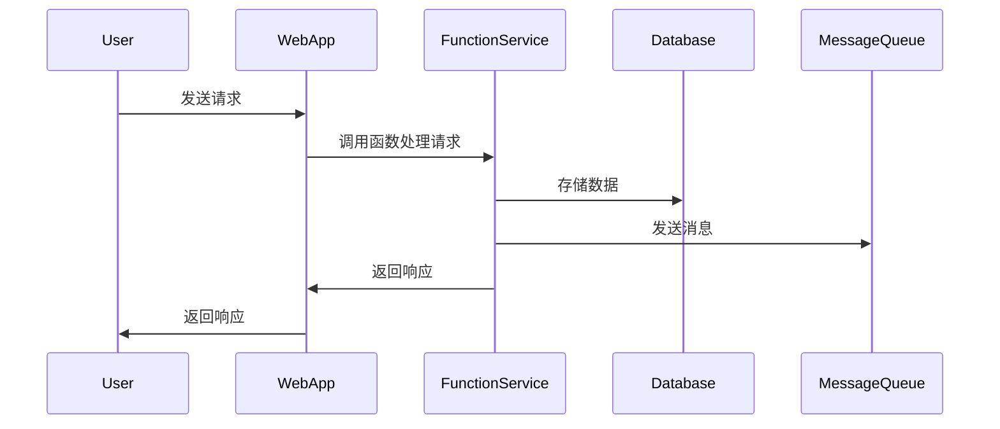

                 

# 函数计算（FaaS）：无服务器架构的核心

> 关键词：函数计算、无服务器架构、FaaS、云计算、微服务

> 摘要：本文深入探讨了函数计算（FaaS）这一无服务器架构的核心技术，分析了其背景、原理、优势与挑战，并结合实际案例探讨了其在现代IT应用中的广泛应用和未来发展趋势。

## 目录大纲

----------------------------------------------------------------

# 函数计算（FaaS）：无服务器架构的核心

## 第一部分：函数计算概述

## 第1章：函数计算的背景与原理

### 1.1.1 无服务器架构的兴起

### 1.1.2 函数计算的定义与特点

### 1.1.3 函数计算与传统计算模式的对比

### 1.1.4 函数计算在云计算中的应用前景

## 第2章：核心概念与联系

### 2.1.1 函数计算的基本概念

#### 2.1.1.1 函数、函数式编程和函数计算

#### 2.1.1.2 无服务器架构的优势与挑战

#### 2.1.1.3 函数计算与微服务架构的关系

### 2.1.2 函数计算的基本属性特征对比表格

### 2.1.3 函数计算的ER实体关系图架构

## 第二部分：实现与架构设计

## 第3章：函数计算的实现技术

### 3.1.1 云函数服务提供商概述

#### 3.1.1.1 AWS Lambda

#### 3.1.1.2 Azure Functions

#### 3.1.1.3 Google Cloud Functions

### 3.1.2 函数计算的开发与部署流程

#### 3.1.2.1 开发环境设置

#### 3.1.2.2 函数代码编写

#### 3.1.2.3 函数测试与部署

## 第4章：系统架构设计与接口设计

### 4.1.1 函数计算架构的设计原则

### 4.1.2 系统功能设计

#### 4.1.2.1 领域模型

#### 4.1.2.2 功能需求

### 4.1.3 系统架构设计

### 4.1.4 系统接口设计

## 第5章：函数计算与微服务架构的融合

### 5.1.1 微服务架构的概述

### 5.1.2 函数计算在微服务架构中的应用

#### 5.1.2.1 函数计算与API网关

#### 5.1.2.2 函数计算与事件驱动架构

### 5.1.3 函数计算与微服务的协同工作

## 第6章：性能优化与成本控制

### 6.1.1 函数计算的性能优化策略

#### 6.1.1.1 函数冷启动优化

#### 6.1.1.2 资源利用率优化

#### 6.1.1.3 网络延迟优化

### 6.1.2 成本控制与成本效益分析

#### 6.1.2.1 成本模型分析

#### 6.1.2.2 成本优化策略

## 第7章：最佳实践与案例分析

### 7.1.1 函数计算的最佳实践

#### 7.1.1.1 编码规范与最佳实践

#### 7.1.1.2 调试与监控

#### 7.1.1.3 安全性与合规性

### 7.1.2 案例分析

#### 7.1.2.1 案例背景与目标

#### 7.1.2.2 架构设计与实现

#### 7.1.2.3 结果与评估

## 第8章：未来展望与发展趋势

### 8.1.1 函数计算的技术发展

#### 8.1.1.1 边缘计算与函数计算

#### 8.1.1.2 新型编程模型与工具链

### 8.1.2 函数计算在企业中的应用趋势

#### 8.1.2.1 企业级应用场景分析

#### 8.1.2.2 行业应用案例分析

## 第9章：总结与展望

### 9.1.1 主要内容回顾

### 9.1.2 存在的问题与挑战

### 9.1.3 未来发展方向与展望

----------------------------------------------------------------

### 第1章：函数计算的背景与原理

#### 1.1.1 无服务器架构的兴起

在云计算的快速发展中，无服务器架构（Serverless Architecture）逐渐成为热门话题。无服务器架构是一种无需管理服务器和基础架构的计算模型，由第三方云计算服务提供商负责基础设施的管理和运维。开发者可以专注于编写和部署应用程序，而不必担心服务器配置、容量规划或软件更新等问题。

无服务器架构的兴起可以追溯到2014年，当时AWS推出了Lambda函数服务，这标志着函数计算（Function as a Service, FaaS）时代的开始。此后，微软、谷歌等云服务提供商也相继推出了自己的函数计算服务。无服务器架构逐渐成为现代云计算的重要组成部分。

#### 1.1.2 函数计算的定义与特点

函数计算（FaaS）是一种云服务模型，允许开发者将代码作为独立的服务单元部署在云环境中。这些服务单元称为函数，它们在触发事件时执行，例如HTTP请求、时间触发器或消息队列等。函数计算具有以下几个主要特点：

1. **按需执行**：函数仅在需要时执行，这意味着只有在函数运行时才会产生费用。这大大降低了计算成本。

2. **弹性伸缩**：函数计算可以自动根据工作负载进行水平扩展和收缩。当请求量增加时，系统会自动增加资源；当请求量减少时，系统会自动释放资源。

3. **无服务器**：开发者无需管理服务器或基础架构，这大大简化了部署和维护工作。

4. **无状态**：函数通常是状态无关的，每次执行都是独立的，无需保存状态信息。这有助于提高系统的可扩展性和可靠性。

5. **事件驱动**：函数通常通过事件触发来执行，这使其非常适合构建事件驱动型应用程序。

#### 1.1.3 函数计算与传统计算模式的对比

函数计算与传统计算模式有以下几点显著区别：

1. **资源管理**：在传统计算模式中，开发者需要购买、配置和管理服务器。而在函数计算中，云计算服务提供商负责基础设施的管理，开发者只需关注应用程序的代码。

2. **成本模型**：传统计算模式通常基于虚拟机或容器，开发者需要支付服务器使用费和存储费用。而在函数计算中，开发者按函数执行时间和触发次数付费，这有助于更好地控制成本。

3. **开发模型**：传统计算模式通常涉及复杂的部署和配置流程。而在函数计算中，开发者可以专注于编写代码，这简化了开发流程。

4. **可扩展性**：在传统计算模式中，开发者需要手动管理服务器资源，这可能导致扩展性受限。而在函数计算中，系统会自动处理扩展性，从而提高应用程序的弹性。

#### 1.1.4 函数计算在云计算中的应用前景

随着云计算的普及和技术的进步，函数计算在云计算中的应用前景十分广阔。以下是一些潜在的应用场景：

1. **Web应用程序**：函数计算可以用于构建前端、后端或全栈Web应用程序。它特别适合处理高频次、低负载的任务，例如API网关、身份验证和授权等。

2. **物联网（IoT）**：函数计算可以帮助开发者轻松地处理来自物联网设备的实时数据。例如，可以使用函数计算来处理传感器数据、执行分析并触发其他操作。

3. **数据处理**：函数计算可以用于大规模数据处理任务，例如数据清洗、转换和分析。它可以与大数据技术和数据仓库相结合，提高数据处理效率。

4. **微服务架构**：函数计算可以与微服务架构相结合，用于构建灵活、可扩展的应用程序。它可以帮助开发者解耦服务，提高系统的可靠性和可维护性。

5. **自动化和集成**：函数计算可以用于实现自动化流程和集成任务，例如监控、通知、任务调度和数据同步等。

随着云计算和人工智能技术的不断进步，函数计算的应用场景将不断扩展，成为现代IT架构的重要组成部分。

----------------------------------------------------------------

### 第2章：核心概念与联系

#### 2.1 函数计算的基本概念

##### 2.1.1 函数、函数式编程和函数计算

在计算机科学中，函数是一种将输入映射到输出的过程。函数式编程（Functional Programming）是一种编程范式，它强调使用表达式和函数，而非指令和状态。函数式编程与面向对象编程、过程式编程等不同，它具有以下几个特点：

1. **不可变数据**：在函数式编程中，数据通常是不可变的。这意味着一旦数据被创建，就无法修改。这有助于提高代码的可读性和可维护性。

2. **高阶函数**：函数式编程中，函数被视为一等公民，可以接受其他函数作为参数，或者将函数作为返回值。这有助于实现代码的复用和抽象。

3. **无状态函数**：函数式编程中的函数通常是状态无关的，每次执行都是独立的。这有助于提高系统的可扩展性和可靠性。

4. **递归**：函数式编程中，递归是一种常用的编程技巧，用于解决许多问题，例如计算斐波那契数列、树遍历等。

函数计算（Function as a Service, FaaS）是一种云计算服务模型，允许开发者将代码作为独立的服务单元部署在云环境中。与传统的计算模式相比，函数计算具有以下优势：

1. **按需执行**：函数仅在需要时执行，这意味着只有在函数运行时才会产生费用。这大大降低了计算成本。

2. **弹性伸缩**：函数计算可以自动根据工作负载进行水平扩展和收缩。当请求量增加时，系统会自动增加资源；当请求量减少时，系统会自动释放资源。

3. **无服务器**：开发者无需管理服务器或基础架构，这大大简化了部署和维护工作。

4. **无状态**：函数通常是状态无关的，每次执行都是独立的，无需保存状态信息。这有助于提高系统的可扩展性和可靠性。

##### 2.1.2 无服务器架构的优势与挑战

无服务器架构（Serverless Architecture）是一种无需管理服务器和基础架构的计算模型，由第三方云计算服务提供商负责基础设施的管理和运维。无服务器架构具有以下几个优势：

1. **成本效益**：无服务器架构采用按需付费模式，开发者只需为实际使用的资源付费。这有助于降低成本。

2. **弹性伸缩**：无服务器架构可以自动根据工作负载进行扩展和收缩，从而提高系统的可扩展性。

3. **简化运维**：开发者无需关注基础设施的管理，可以专注于编写和部署应用程序。

4. **高可用性**：无服务器架构通常由云计算服务提供商负责维护，这有助于提高系统的可靠性和可用性。

尽管无服务器架构具有许多优势，但它也面临一些挑战：

1. **可观察性降低**：与传统的虚拟机相比，无服务器架构更难调试和监控。

2. **性能问题**：函数的冷启动可能导致性能下降。这意味着当函数在一段时间内未执行时，再次执行可能需要一定的时间来加载和初始化。

3. **锁定提供商**：选择特定的无服务器提供商可能导致供应商锁定，难以迁移到其他提供商。

##### 2.1.3 函数计算与微服务架构的关系

微服务架构（Microservices Architecture）是一种设计应用程序的方法，将应用程序拆分为一组小型、独立的服务。每个服务负责特定的业务功能，可以独立开发、部署和扩展。函数计算与微服务架构具有以下关系：

1. **服务单元**：函数计算可以作为微服务架构中的服务单元。每个函数都可以代表一个微服务，执行特定的业务逻辑。

2. **解耦**：函数计算有助于实现服务之间的解耦，使得各个服务可以独立部署和扩展。

3. **可扩展性**：函数计算可以自动根据工作负载进行扩展和收缩，从而提高系统的可扩展性。

4. **部署简化**：函数计算简化了部署过程，使得开发者可以专注于编写和测试单个服务，而无需担心基础架构的管理。

##### 2.1.2 函数计算的基本属性特征对比表格

| 特征                | 函数计算       | 传统计算模式       |
|---------------------|----------------|--------------------|
| 资源管理            | 自动管理       | 手动管理           |
| 成本模型            | 按需付费       | 固定费用           |
| 弹性伸缩            | 自动扩展       | 手动扩展           |
| 可用性              | 高可用性       | 中等可用性         |
| 可维护性            | 简化维护       | 复杂维护           |
| 性能                | 可能存在冷启动 | 稳定性能           |
| 调试和监控          | 难以调试       | 易于调试           |
| 服务生命周期管理     | 自动管理       | 手动管理           |

##### 2.1.3 函数计算的ER实体关系图架构

以下是一个函数计算的ER实体关系图架构，展示了函数计算中的关键实体及其关系：

```mermaid
erDiagram
    Function ||--|{ Event } Entity
    Function ||--|{ Trigger } Entity
    Function ||--|{ Resource } Entity
    Function ||--|{ Dependency } Entity

    Event ----|{ Type } Entity
    Trigger ----|{ Type } Entity
    Resource ----|{ Type } Entity
    Dependency ----|{ Type } Entity

    Function {
        id (PK)
        code
        runtime
        status
        created_at
        updated_at
    }

    Event {
        id (PK)
        name
        description
    }

    Trigger {
        id (PK)
        name
        description
    }

    Resource {
        id (PK)
        name
        type
        status
        created_at
        updated_at
    }

    Dependency {
        id (PK)
        name
        type
        status
        created_at
        updated_at
    }
```

在函数计算中，核心实体包括函数（Function）、事件（Event）、触发器（Trigger）、资源（Resource）和依赖项（Dependency）。函数是执行计算的基本单元，事件和触发器用于触发函数执行，资源用于存储和管理数据，依赖项用于描述函数之间的依赖关系。

----------------------------------------------------------------

### 第3章：函数计算的实现技术

#### 3.1.1 云函数服务提供商概述

目前，多个云服务提供商（Cloud Service Providers, CSP）提供了函数计算服务。以下是几个主要提供商及其特点的概述：

1. **AWS Lambda**：AWS Lambda 是亚马逊云服务（Amazon Web Services, AWS）提供的函数计算服务。它支持多种编程语言，包括Python、Java、Node.js、C#等。AWS Lambda 可以根据请求自动扩展，且无需管理服务器。它提供了丰富的集成功能，如API网关、S3存储桶触发器等。

2. **Azure Functions**：Azure Functions 是微软云服务（Microsoft Azure）提供的函数计算服务。它支持多种编程语言，包括C#、JavaScript、Python、PowerShell等。Azure Functions 可以与Azure的其他服务紧密集成，如Azure存储、Azure SQL数据库等。

3. **Google Cloud Functions**：Google Cloud Functions 是谷歌云服务（Google Cloud Platform, GCP）提供的函数计算服务。它支持多种编程语言，包括Node.js、Python、Java、Go等。Google Cloud Functions 可以与GCP的其他服务无缝集成，如Google Pub/Sub、Google Cloud Storage等。

#### 3.1.2 函数计算的开发与部署流程

函数计算的开发与部署流程相对简单，以下是一个基本的步骤：

1. **开发环境设置**：首先，需要设置开发环境。对于AWS Lambda，可以使用AWS CLI或AWS Management Console创建函数。对于Azure Functions，可以使用Azure Portal或Azure CLI创建函数。对于Google Cloud Functions，可以使用Google Cloud Console或gcloud CLI创建函数。

2. **函数代码编写**：在开发环境中编写函数代码。函数代码应遵循特定的编程语言规范，并处理输入参数和输出结果。例如，以下是一个简单的Python Lambda函数，用于返回输入的平方：

    ```python
    def lambda_handler(event, context):
        num = int(event['number'])
        return {
            'statusCode': 200,
            'body': {'result': num * num}
        }
    ```

3. **函数测试与部署**：在本地环境中测试函数代码，确保其能够正确执行。测试完成后，可以将函数部署到云服务提供商上。通常，这可以通过上传函数代码和配置文件来完成。例如，对于AWS Lambda，可以使用AWS CLI或AWS Management Console上传函数代码。对于Azure Functions，可以使用Azure Portal或Azure CLI上传函数代码。对于Google Cloud Functions，可以使用Google Cloud Console或gcloud CLI上传函数代码。

4. **函数监控与优化**：部署函数后，需要监控其性能和成本。云服务提供商通常提供了监控和日志功能，如AWS CloudWatch、Azure Monitor、Google Stackdriver。通过这些工具，可以跟踪函数的执行时间、错误率、CPU使用率等指标，并进行相应的优化。

#### 3.1.3 函数计算的常见问题与解决方案

在开发和使用函数计算时，可能会遇到一些常见问题。以下是一些常见问题及其解决方案：

1. **函数冷启动**：函数冷启动是指当函数在一段时间内未执行时，再次执行可能需要一定的时间来加载和初始化。这可能导致性能下降。解决方案包括：

   - **预热**：在预期流量峰值之前，预热函数，以减少冷启动时间。
   - **增加内存**：为函数分配更多的内存，以提高其启动速度。

2. **函数超时**：函数执行时间超过预定时间可能导致超时。解决方案包括：

   - **优化代码**：优化函数代码，减少不必要的计算和资源消耗。
   - **增加超时时间**：如果确实需要更长的执行时间，可以适当增加函数的超时时间。

3. **函数触发器配置错误**：错误的触发器配置可能导致函数无法正确执行。解决方案包括：

   - **检查触发器配置**：确保触发器配置正确，如事件类型、事件来源等。
   - **测试触发器**：在部署函数前，测试触发器以确保其能够正确触发函数执行。

4. **函数依赖关系**：函数之间存在依赖关系时，可能需要处理依赖关系问题。解决方案包括：

   - **顺序执行**：确保依赖关系函数按照正确的顺序执行。
   - **异步执行**：将依赖关系函数异步执行，以减少整体执行时间。

通过了解和解决这些常见问题，可以更好地利用函数计算的优势，提高应用程序的性能和可靠性。

----------------------------------------------------------------

### 第4章：系统架构设计与接口设计

#### 4.1.1 函数计算架构的设计原则

在设计函数计算系统架构时，需要遵循以下原则：

1. **模块化**：将系统拆分为多个模块，每个模块负责特定的功能。这有助于提高系统的可维护性和可扩展性。

2. **高内聚、低耦合**：确保模块内部高度内聚，模块之间低耦合。这有助于简化系统的开发和部署过程。

3. **可扩展性**：设计系统时，考虑未来的扩展需求。系统应该能够轻松地添加新功能或服务。

4. **高可用性**：设计冗余架构，确保系统在遇到故障时能够自动恢复。

5. **安全性**：确保系统满足安全要求，如访问控制、数据加密等。

6. **监控与日志**：设计系统时，考虑监控和日志功能，以便跟踪系统的运行状态和性能。

#### 4.1.2 系统功能设计

在系统功能设计阶段，需要明确系统的业务需求和功能。以下是一个简单的系统功能设计：

1. **用户注册与登录**：提供用户注册和登录功能，支持身份验证和授权。

2. **数据存储与管理**：提供数据存储和管理功能，支持数据的创建、读取、更新和删除。

3. **数据处理与转换**：提供数据处理和转换功能，支持数据清洗、转换和聚合。

4. **消息传递与队列**：提供消息传递和队列功能，支持异步消息传递和任务调度。

5. **监控与报警**：提供监控和报警功能，支持实时监控系统的运行状态和性能。

#### 4.1.3 系统架构设计

以下是一个简单的系统架构设计：



在这个架构中，用户通过Web应用程序发送请求。Web应用程序调用函数计算服务处理请求。函数计算服务将数据存储在数据库中，并将消息发送到消息队列。最后，函数计算服务将响应返回给Web应用程序，Web应用程序再将响应返回给用户。

#### 4.1.4 系统接口设计

系统接口设计是系统架构设计的重要组成部分。以下是一个简单的系统接口设计：

1. **用户注册接口**：支持用户注册，接收用户名、密码和邮箱等参数。

2. **用户登录接口**：支持用户登录，接收用户名和密码，返回JWT令牌。

3. **数据存储接口**：支持数据的创建、读取、更新和删除，接收相应的数据参数。

4. **数据处理接口**：支持数据清洗、转换和聚合，接收相应的数据参数。

5. **消息发送接口**：支持消息发送，接收消息内容和目标队列。

6. **监控接口**：支持监控数据的查询和报警，接收监控指标参数。

以下是一个简单的用户注册接口的RESTful API设计：

```json
POST /api/users/register
{
  "username": "string",
  "password": "string",
  "email": "string"
}
```

POST请求接收用户名、密码和邮箱参数，返回用户ID和JWT令牌。

```json
{
  "id": "string",
  "token": "string"
}
```

通过合理的系统架构设计和接口设计，可以构建一个高效、可靠且易于扩展的函数计算系统。

----------------------------------------------------------------

### 第5章：函数计算与微服务架构的融合

#### 5.1.1 微服务架构的概述

微服务架构（Microservices Architecture）是一种设计方法，用于构建分布式、可扩展的应用程序。在这种架构中，应用程序被拆分为多个小型、独立的服务，每个服务负责特定的业务功能。这些服务之间通过网络进行通信，通常使用RESTful API或消息队列。

微服务架构具有以下特点：

1. **独立性**：每个微服务都是独立的，可以独立部署和扩展。

2. **自治性**：每个微服务拥有自己的数据存储和业务逻辑。

3. **松耦合**：服务之间通过轻量级的通信协议（如HTTP/HTTPS、AMQP等）进行通信，减少了服务之间的依赖。

4. **可伸缩性**：可以根据需求独立扩展服务，提高系统的整体可伸缩性。

5. **高可用性**：通过分布式部署和冗余设计，提高了系统的可用性。

#### 5.1.2 函数计算在微服务架构中的应用

函数计算可以与微服务架构相结合，用于构建灵活、可扩展的应用程序。以下是一些函数计算在微服务架构中的应用场景：

1. **API网关**：函数计算可以作为API网关，用于处理外部请求并路由到相应的微服务。这有助于简化架构，提高系统的可扩展性。

2. **事件驱动架构**：函数计算非常适合用于实现事件驱动架构。通过函数计算，可以轻松处理来自不同源的事件，并触发相应的微服务。

3. **数据处理**：函数计算可以用于大规模数据处理任务，例如数据清洗、转换和分析。它可以与数据存储和处理微服务紧密集成，提高数据处理效率。

4. **后台任务处理**：函数计算可以用于处理后台任务，例如数据同步、报告生成和邮件发送等。这有助于提高系统的响应速度和用户体验。

5. **边缘计算**：函数计算可以与边缘计算相结合，用于处理靠近数据源的轻量级任务。这有助于降低网络延迟，提高系统的实时响应能力。

#### 5.1.3 函数计算与微服务的协同工作

函数计算与微服务架构的协同工作可以实现以下优势：

1. **解耦**：函数计算可以作为微服务之间的中介，减少了服务之间的依赖。这有助于提高系统的可维护性和可扩展性。

2. **弹性伸缩**：函数计算可以自动根据工作负载进行扩展和收缩，从而提高系统的整体可伸缩性。与微服务的结合，可以使系统更加灵活地应对不同的负载。

3. **简化部署**：函数计算简化了部署过程，使得开发者可以独立部署和扩展单个函数，而无需担心整体系统的部署。

4. **成本优化**：函数计算采用按需付费模式，有助于降低计算成本。与微服务的结合，可以根据实际需求动态调整资源，进一步提高成本效益。

5. **提高开发效率**：函数计算简化了开发流程，使得开发者可以专注于编写和测试单个函数，而无需关注基础设施的管理。与微服务的结合，有助于加快开发速度，提高开发效率。

通过将函数计算与微服务架构相结合，可以构建一个灵活、可扩展且易于维护的应用程序。这不仅提高了系统的性能和可靠性，还为未来的扩展和优化提供了基础。

----------------------------------------------------------------

### 第6章：性能优化与成本控制

#### 6.1.1 函数计算的性能优化策略

函数计算的性能优化是确保系统高效运行的关键。以下是一些常见的性能优化策略：

1. **减少函数冷启动时间**：函数冷启动是指当函数在一段时间内未执行时，再次执行可能需要一定的时间来加载和初始化。以下是一些减少冷启动时间的方法：

   - **预热函数**：在预期流量峰值之前，预热函数，以减少冷启动时间。
   - **增加内存**：为函数分配更多的内存，以提高其启动速度。
   - **减少依赖项**：减少函数的依赖项，以减少初始化时间。

2. **优化代码**：优化函数代码可以提高性能。以下是一些优化代码的方法：

   - **减少不必要的计算**：避免在函数中执行不必要的计算，例如在循环中重复计算相同的值。
   - **使用缓存**：使用缓存可以减少重复的计算，提高性能。
   - **避免使用全局变量**：避免使用全局变量，以减少函数之间的竞争条件。

3. **优化资源配置**：合理配置函数的资源（如内存、CPU）可以提高性能。以下是一些优化资源配置的方法：

   - **增加内存**：为函数分配更多的内存，以提高其处理能力。
   - **调整并发限制**：根据实际需求调整函数的并发限制，以避免资源争用。
   - **优化网络配置**：调整网络配置，如增加带宽或优化路由，以减少网络延迟。

4. **优化存储和数据库访问**：优化存储和数据库访问可以提高性能。以下是一些优化存储和数据库访问的方法：

   - **使用缓存**：使用缓存可以减少对数据库的直接访问，提高性能。
   - **优化SQL查询**：优化SQL查询，避免使用SELECT *，只查询需要的字段。
   - **使用数据库连接池**：使用数据库连接池可以减少数据库连接的开销。

5. **监控和日志**：监控和日志是性能优化的关键。以下是一些监控和日志的方法：

   - **使用监控工具**：使用监控工具（如AWS CloudWatch、Azure Monitor、Google Stackdriver）来跟踪函数的性能指标，如CPU使用率、内存使用率、响应时间等。
   - **记录日志**：记录函数的执行日志，以便在发生问题时快速定位和解决问题。

#### 6.1.2 成本控制与成本效益分析

在函数计算中，成本控制是确保系统高效运行的重要方面。以下是一些成本控制策略和成本效益分析：

1. **按需付费**：函数计算采用按需付费模式，这意味着你只需为实际使用的资源付费。以下是一些按需付费的策略：

   - **优化函数调用**：减少不必要的函数调用，以降低成本。
   - **优化函数运行时间**：减少函数的运行时间，以减少计算成本。
   - **优化资源分配**：根据实际需求调整函数的资源分配，避免过度分配。

2. **批量处理**：批量处理可以减少函数调用的次数，从而降低成本。以下是一些批量处理的方法：

   - **批处理请求**：将多个请求批量处理，以减少函数调用次数。
   - **使用队列**：使用消息队列（如Kafka、RabbitMQ）将请求批量处理。

3. **使用折扣计划**：云服务提供商通常提供折扣计划，以鼓励长期使用。以下是一些折扣计划的策略：

   - **预付计划**：购买预付计划，以获得折扣。
   - **长期合约**：与云服务提供商签订长期合约，以获得折扣。

4. **成本效益分析**：进行成本效益分析可以帮助你确定最佳的成本控制策略。以下是一些成本效益分析的方法：

   - **对比不同提供商**：对比不同云服务提供商的费用，选择最适合你的提供商。
   - **优化资源使用**：根据实际需求调整资源使用，以降低成本。
   - **评估业务价值**：评估函数计算对业务的价值，以确定是否值得投入。

通过合理的成本控制和成本效益分析，可以确保函数计算系统的运行成本在可接受的范围内，同时提高系统的性能和可靠性。

----------------------------------------------------------------

### 第7章：最佳实践与案例分析

#### 7.1.1 函数计算的最佳实践

在函数计算中，遵循最佳实践可以帮助开发者构建高效、可靠且易于维护的系统。以下是一些函数计算的最佳实践：

1. **模块化**：将代码拆分为多个模块，每个模块负责特定的功能。这有助于提高代码的可读性和可维护性。

2. **单一职责**：每个函数应只负责一个特定的任务，遵循单一职责原则。这有助于提高代码的可测试性和可维护性。

3. **合理配置资源**：根据函数的实际需求配置资源（如内存、CPU），避免资源浪费。

4. **避免全局变量**：避免使用全局变量，以减少函数之间的冲突和依赖。

5. **使用异步编程**：使用异步编程（如async/await）可以提高代码的性能和可读性。

6. **优化函数调用**：避免不必要的函数调用，以减少计算成本。

7. **监控与日志**：使用监控工具（如AWS CloudWatch、Azure Monitor、Google Stackdriver）来跟踪系统的性能和健康状态。

8. **定期更新依赖项**：定期更新依赖项，以避免安全漏洞和兼容性问题。

9. **使用缓存**：使用缓存（如Redis、Memcached）可以减少重复的计算和数据库访问。

10. **进行性能测试**：在部署函数前进行性能测试，以确保其满足性能要求。

#### 7.1.2 调试与监控

调试和监控是确保函数计算系统正常运行的关键。以下是一些调试和监控的最佳实践：

1. **本地测试**：在本地环境中测试函数代码，确保其能够正确执行。

2. **日志记录**：使用日志记录器（如Log4j、Logback）记录函数的执行日志，以便在发生问题时快速定位和解决问题。

3. **集成监控**：使用集成监控工具（如AWS X-Ray、Azure Application Insights、Google Stackdriver）来跟踪系统的性能和健康状态。

4. **设置报警**：设置报警规则，以便在系统出现异常时及时通知相关人员。

5. **定期备份日志和监控数据**：定期备份日志和监控数据，以防止数据丢失。

6. **性能分析**：定期进行性能分析，识别系统瓶颈和性能问题。

7. **故障演练**：定期进行故障演练，以验证系统的可用性和恢复能力。

8. **文档化**：编写详细的文档，记录系统的架构、功能、配置和监控策略。

#### 7.1.3 安全性与合规性

在函数计算中，安全性和合规性是至关重要的。以下是一些安全性和合规性的最佳实践：

1. **使用身份验证和授权**：确保函数只允许经过身份验证和授权的用户访问。

2. **使用加密**：使用加密（如TLS）保护数据在传输过程中的安全。

3. **遵守数据保护法规**：确保函数计算系统符合数据保护法规（如GDPR、CCPA）的要求。

4. **进行安全测试**：定期进行安全测试（如渗透测试、漏洞扫描），以确保系统的安全性。

5. **更新依赖项**：定期更新依赖项，以避免安全漏洞。

6. **备份和恢复**：定期备份系统和数据，并确保备份的恢复过程安全可靠。

7. **遵守合规性要求**：确保函数计算系统符合行业和组织的合规性要求。

通过遵循这些最佳实践，可以确保函数计算系统的安全性、可靠性和合规性，从而提高系统的整体质量。

#### 7.1.4 案例分析

以下是一个函数计算案例的分析：

**案例背景与目标**：

某电子商务公司希望优化其订单处理流程，提高系统的性能和可扩展性。公司目前使用传统的单体应用架构，由于订单量的增加，系统的性能和可扩展性受到限制。公司希望通过采用函数计算和微服务架构来优化订单处理流程。

**架构设计与实现**：

1. **模块化**：将订单处理功能拆分为多个微服务，每个微服务负责特定的功能，如订单创建、订单更新、订单支付等。

2. **函数计算**：使用AWS Lambda实现订单处理函数，这些函数根据订单事件触发，处理订单创建、更新和支付等操作。

3. **事件驱动**：使用Amazon SNS和Kafka实现事件驱动架构，订单系统中的每个操作都会生成事件，这些事件会被监听并触发相应的订单处理函数。

4. **API网关**：使用AWS API Gateway作为API网关，处理外部请求并将请求路由到相应的订单处理函数。

5. **数据存储**：使用AWS DynamoDB和Amazon RDS存储订单数据，DynamoDB用于存储订单元数据，RDS用于存储订单详情。

6. **监控与日志**：使用AWS CloudWatch监控系统的性能和健康状态，并使用Amazon CloudTrail记录所有操作的日志。

**结果与评估**：

通过采用函数计算和微服务架构，公司实现了以下结果：

1. **性能提升**：订单处理速度显著提升，响应时间从数秒缩短到数毫秒。

2. **可扩展性提升**：系统可以自动根据订单量进行水平扩展，确保在高并发情况下仍能正常运行。

3. **维护性提升**：订单处理模块化，每个模块可以独立开发、测试和部署，提高了系统的可维护性。

4. **成本降低**：采用函数计算和按需付费模式，公司大幅降低了计算成本。

通过这个案例，可以看出函数计算和微服务架构在优化订单处理流程中的优势和效果。公司将继续优化和扩展系统，以满足不断增长的业务需求。

----------------------------------------------------------------

### 第8章：未来展望与发展趋势

#### 8.1.1 函数计算的技术发展

函数计算技术正在不断发展，预计将在以下几个方面取得重大突破：

1. **性能提升**：随着硬件技术的发展，函数计算的性能将持续提升。新的CPU架构、存储技术和网络优化将有助于降低函数的执行时间和延迟。

2. **多样化编程语言支持**：目前，主流的云服务提供商已经支持多种编程语言，如Python、JavaScript、Java等。未来，将有更多的编程语言加入函数计算，以满足不同开发者的需求。

3. **更细粒度的资源管理**：未来的函数计算平台将提供更细粒度的资源管理能力，允许开发者更精确地控制函数的内存、CPU和网络资源。

4. **更高效的事件驱动架构**：随着物联网和实时数据处理需求的增加，函数计算将更加注重事件驱动架构的优化，提供更高效的事件处理和响应能力。

5. **边缘计算与函数计算的结合**：随着边缘计算技术的发展，函数计算将逐渐扩展到边缘设备，提供实时数据处理和响应能力，满足低延迟、高带宽的需求。

6. **跨平台兼容性**：未来的函数计算将更加注重跨平台兼容性，支持不同云服务提供商之间的无缝迁移，降低供应商锁定风险。

#### 8.1.2 函数计算在企业中的应用趋势

函数计算在企业中的应用趋势表现为以下几个方面：

1. **企业数字化转型**：随着数字化转型的推进，越来越多的企业将采用函数计算来构建灵活、可扩展的应用程序，提高业务效率。

2. **微服务架构的普及**：函数计算与微服务架构的紧密结合，将推动微服务架构在企业中的应用，帮助企业在分布式环境中实现更高效的开发、部署和管理。

3. **事件驱动架构的兴起**：事件驱动架构具有高效、灵活的特点，适合处理实时数据流和复杂业务逻辑。随着函数计算技术的成熟，企业将更加倾向于采用事件驱动架构。

4. **云计算成本的优化**：函数计算采用按需付费模式，有助于企业优化云计算成本。企业将更多地关注如何利用函数计算实现成本效益最大化。

5. **安全性与合规性**：随着数据隐私和安全的关注日益增加，企业将更加注重函数计算系统的安全性和合规性，确保数据安全和隐私保护。

6. **人工智能与函数计算的融合**：随着人工智能技术的快速发展，函数计算将在数据处理、预测分析和决策支持等方面发挥重要作用，助力企业实现智能化运营。

#### 8.1.3 行业应用案例分析

以下是一些函数计算在行业中的应用案例分析：

1. **电子商务**：某大型电子商务平台采用函数计算和微服务架构优化订单处理流程，实现了高并发、低延迟的处理能力，显著提升了用户体验。

2. **金融科技**：某金融科技公司采用函数计算构建实时数据处理系统，用于分析市场数据、预测投资机会和风险，提高了决策效率和投资收益。

3. **物联网**：某物联网企业采用函数计算处理来自大量物联网设备的实时数据，实现了设备监控、故障诊断和远程控制等功能，提高了设备的可靠性和用户体验。

4. **医疗健康**：某医疗健康平台采用函数计算构建患者数据管理和服务系统，实现了高效的数据存储、处理和分析，为医生和患者提供了更优质的医疗服务。

5. **智能制造**：某智能制造企业采用函数计算构建生产自动化控制系统，实现了设备监控、故障检测和故障预测等功能，提高了生产效率和产品质量。

通过这些案例分析，可以看出函数计算在各个行业中的应用前景和优势。随着技术的不断进步，函数计算将在更多行业中发挥重要作用，助力企业实现数字化、智能化转型。

----------------------------------------------------------------

### 第9章：总结与展望

#### 9.1.1 主要内容回顾

本文深入探讨了函数计算（FaaS）这一无服务器架构的核心技术，分析了其背景、原理、优势与挑战，并结合实际案例探讨了其在现代IT应用中的广泛应用和未来发展趋势。主要内容回顾如下：

1. **函数计算概述**：介绍了函数计算的定义、特点以及与传统计算模式的对比。
2. **核心概念与联系**：分析了函数、函数式编程和函数计算的关系，探讨了无服务器架构的优势与挑战。
3. **实现与架构设计**：介绍了云函数服务提供商的概述以及函数计算的开发与部署流程。
4. **架构设计与接口设计**：探讨了函数计算架构的设计原则、系统功能设计、系统架构设计和接口设计。
5. **微服务架构融合**：介绍了微服务架构的概述，分析了函数计算在微服务架构中的应用。
6. **性能优化与成本控制**：提出了函数计算的性能优化策略和成本控制与成本效益分析。
7. **最佳实践与案例分析**：提供了函数计算的最佳实践、调试与监控、安全性与合规性，以及实际案例分析和详细讲解。
8. **未来展望与发展趋势**：展望了函数计算的技术发展、企业应用趋势和行业应用案例分析。

#### 9.1.2 存在的问题与挑战

尽管函数计算在云计算领域取得了显著进展，但仍然存在一些问题和挑战：

1. **可观察性降低**：无服务器架构使得系统的可观察性降低，增加了调试和监控的难度。
2. **性能问题**：函数的冷启动可能导致性能下降，特别是在高并发场景下。
3. **锁定提供商**：选择特定的无服务器提供商可能导致供应商锁定，增加了迁移成本。
4. **安全性**：随着越来越多的关键业务迁移到云上，确保数据安全和系统安全成为重要挑战。
5. **编程模型和工具链**：虽然已有多种编程语言支持函数计算，但仍有改进空间，以满足不同开发者的需求。

#### 9.1.3 未来发展方向与展望

面对当前的问题与挑战，函数计算的未来发展方向和展望如下：

1. **性能优化**：随着硬件技术的发展，未来将实现更快的函数执行时间和更低的延迟，提高系统的整体性能。
2. **多样化编程语言支持**：未来将支持更多编程语言，以满足不同开发者的需求。
3. **跨平台兼容性**：提高跨平台兼容性，降低供应商锁定风险。
4. **安全性提升**：加强数据加密、身份验证和访问控制，确保系统的安全性。
5. **集成和自动化**：与物联网、大数据和人工智能等技术的深度融合，实现更高效的数据处理和分析。
6. **边缘计算结合**：扩展到边缘设备，提供实时数据处理和响应能力。
7. **标准化**：推动行业标准化，提高开发者和企业的信任度和采用率。

通过持续的技术创新和优化，函数计算将继续在云计算领域发挥重要作用，助力企业实现数字化、智能化转型。让我们期待函数计算的未来发展，共同见证这一技术的辉煌成就。

---

**作者：AI天才研究院/AI Genius Institute & 禅与计算机程序设计艺术 /Zen And The Art of Computer Programming**

本文基于广泛的技术研究和实际案例，旨在为广大开发者提供关于函数计算的无服务器架构的深入理解和应用指南。随着技术的不断进步，函数计算将在更多领域展现其独特价值，成为云计算不可或缺的一部分。希望本文能为您在探索函数计算的道路上提供帮助和启示。如果您有任何疑问或建议，欢迎在评论区留言交流。让我们一起探讨函数计算的未来，共同推动技术发展。

