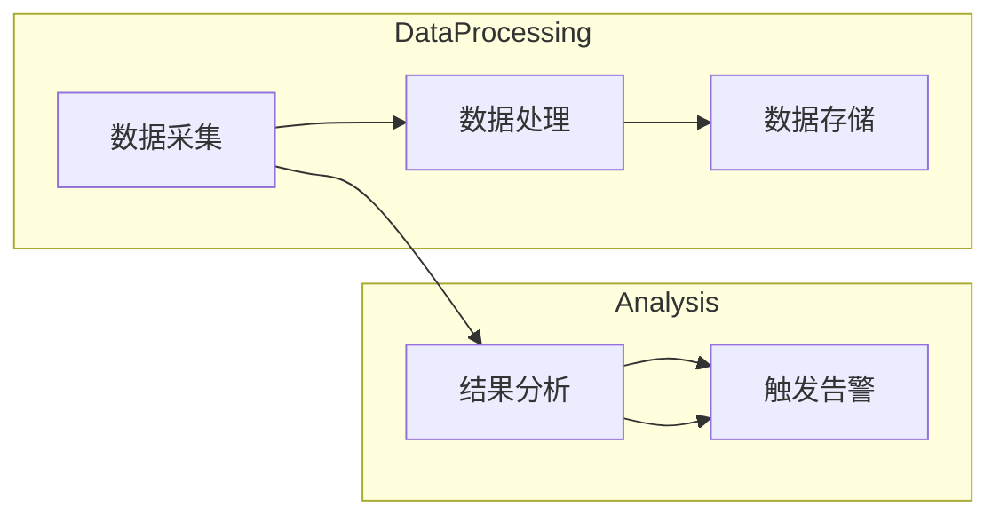
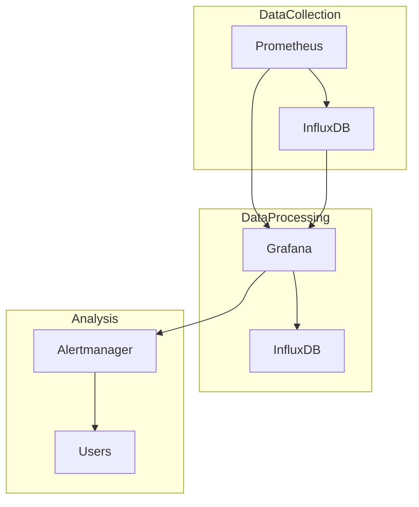
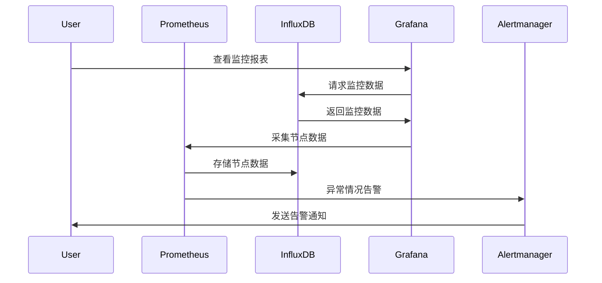

                 

### 第1章 引言

#### 1.1 问题背景

随着互联网的快速发展，现代软件系统正变得越来越复杂和庞大。许多关键业务系统如电子商务平台、金融交易系统、社交媒体网络等，都在分布式环境中运行。分布式系统通过将任务分散到多个服务器或节点上，提高了系统的可扩展性和容错能力。然而，这种分布式架构也带来了新的挑战，其中之一就是系统的监控问题。

在分布式系统中，每个节点可能都有其独立的状态和运行状况。这使得监控分布式系统的稳定运行变得尤为重要。监控的目的是实时收集系统运行数据，检测异常情况，并快速响应，确保系统的高可用性和性能。如果没有有效的监控机制，一旦系统出现故障或性能瓶颈，可能需要很长时间才能被发现和修复，导致业务中断或损失。

#### 1.2 问题描述

**监控目标：** 监控分布式系统的目标是确保系统的稳定运行，及时发现和处理潜在的问题，避免系统崩溃或性能下降。具体目标包括：

- 实时监控系统的关键性能指标（如CPU利用率、内存使用率、网络延迟等）。
- 及时发现异常情况，如节点故障、服务中断、资源耗尽等。
- 分析系统性能瓶颈，优化资源分配和系统配置。
- 提供可视化的监控报表和告警功能。

**监控需求：** 分布式系统的监控需求因系统的规模和复杂性而异，但以下是一些基本需求：

- **多维度监控：** 监控需要覆盖多个维度，包括硬件资源、应用层指标、网络状态等。
- **分布式架构：** 监控系统自身也应采用分布式架构，以确保其可靠性和可扩展性。
- **自动化处理：** 监控系统应具备自动化告警和自动化恢复功能，减少人工干预。
- **可扩展性和灵活性：** 监控系统需要支持系统规模的动态扩展，并能灵活适应不同的监控需求。
- **数据存储和查询：** 监控系统应能存储监控数据，并提供高效的查询接口，以便进行历史数据分析和故障回溯。

#### 1.3 问题解决

**监控的基本概念：** 监控系统通常包括以下几个基本概念：

- **数据采集：** 从分布式系统的各个节点收集性能数据。
- **数据处理：** 对采集到的数据进行预处理和存储。
- **结果分析：** 分析处理后的数据，识别异常情况或性能瓶颈。
- **告警和通知：** 在检测到异常时，触发告警并通知相关人员。

**分布式监控架构：** 分布式监控架构可以分为以下几个层次：

- **数据采集层：** 负责从各个节点收集数据，可以使用代理程序或数据采集器。
- **数据处理层：** 对采集到的数据进行预处理、聚合和存储。
- **分析层：** 使用算法和工具分析监控数据，生成报表和告警。
- **通知和告警层：** 在检测到异常时，通过邮件、短信、电话等方式通知相关人员。

#### 1.4 边界与外延

**监控范围：** 监控范围可以包括整个分布式系统，也可以是系统的某个子集。通常，监控范围取决于系统的规模和业务需求。

**监控技术的选择：** 监控技术的选择取决于系统的特性和需求。以下是一些常见的监控技术：

- **基础监控工具：** 如Prometheus、Grafana等，适用于收集和展示基础性能数据。
- **分布式跟踪系统：** 如Zipkin、Jaeger等，用于跟踪分布式系统的请求路径和性能。
- **日志监控：** 如ELK（Elasticsearch、Logstash、Kibana）栈，用于收集和分析系统日志。
- **应用性能监控：** 如New Relic、AppDynamics等，专注于监控应用程序的性能和行为。

**概念结构与核心要素组成：** 监控系统的核心概念包括数据采集、数据处理、结果分析和告警通知。这些概念相互关联，形成一个完整的监控流程。

- **数据采集：** 是监控系统的起点，负责收集系统的运行数据。
- **数据处理：** 对采集到的数据进行加工和整理，以便进行进一步分析。
- **结果分析：** 通过分析处理后的数据，识别异常和性能瓶颈。
- **告警通知：** 在检测到异常时，及时通知相关人员，以便快速响应和处理问题。

通过上述监控的基本概念和架构设计，分布式系统监控能够保障复杂系统的稳定运行，提高系统的可靠性和性能，从而确保业务的连续性和稳定性。接下来的章节将详细探讨这些概念和技术，帮助读者深入了解分布式系统监控的原理和实践。

### 第2章 核心概念与联系

在本章中，我们将详细探讨分布式系统和监控系统的核心概念，并分析它们之间的联系和区别。

#### 2.1 核心概念原理

**2.1.1 分布式系统原理**

**架构：** 分布式系统通过将任务分散到多个服务器或节点上，以实现高可用性和可扩展性。其核心架构包括以下几个部分：

- **节点：** 分布式系统的基本构建块，可以是物理服务器或虚拟机。
- **通信协议：** 节点之间的通信通常通过TCP/IP等网络协议进行。
- **数据存储：** 分布式系统通常使用分布式数据库或分布式文件系统来存储数据。
- **负载均衡：** 通过将请求分配到不同的节点，以均衡负载和提高系统性能。

**构件：** 分布式系统由多个构件组成，包括：

- **服务：** 负责处理特定功能的模块。
- **数据：** 系统运行所需的数据资源。
- **中间件：** 提供通信和消息传递功能的软件。

**特点：** 分布式系统具有以下几个特点：

- **高可用性：** 通过冗余和故障转移，确保系统在部分节点故障时仍能正常运行。
- **可扩展性：** 可以通过增加节点来水平扩展系统，以应对不断增长的业务需求。
- **容错性：** 系统在部分节点故障时，其他节点可以继续提供服务。
- **分布式一致性：** 保持多个节点之间的数据一致性是分布式系统的一个关键挑战。

**2.1.2 监控系统原理**

**功能：** 监控系统的主要功能是实时收集分布式系统的运行数据，并进行分析和告警。具体功能包括：

- **数据采集：** 从系统的各个节点收集性能数据。
- **数据处理：** 对采集到的数据进行存储、分析和可视化。
- **结果分析：** 通过分析处理后的数据，发现系统中的异常和性能瓶颈。
- **告警通知：** 在检测到异常时，及时通知相关人员。

**架构：** 监控系统通常包括以下架构层次：

- **数据采集层：** 负责从各个节点收集数据，可以使用代理程序或数据采集器。
- **数据处理层：** 对采集到的数据进行预处理、聚合和存储。
- **分析层：** 使用算法和工具对监控数据进行分析，生成报表和告警。
- **通知和告警层：** 在检测到异常时，通过邮件、短信、电话等方式通知相关人员。

**特点：** 监控系统具有以下几个特点：

- **自动化：** 监控系统通常具备自动化数据采集、处理和分析功能，减少人工干预。
- **灵活性：** 可以根据不同系统和业务需求，灵活配置监控策略和指标。
- **可扩展性：** 支持系统规模的动态扩展，以适应不断变化的业务需求。
- **可视化：** 提供直观的监控报表和仪表盘，方便用户快速了解系统状况。

#### 2.2 概念属性特征对比表格

下面是一个对比分布式系统和监控系统特征特征的表格：

| 特征 | 分布式系统 | 监控系统 |
| --- | --- | --- |
| 架构 | 分散 | 集中 |
| 目标 | 高可用、可扩展、容错性 | 性能监控、异常检测、告警通知 |
| 技术选择 | 多样化 | 专业化 |
| 自动化程度 | 较低 | 较高 |
| 数据处理能力 | 强 | 强 |

#### 2.3 ER实体关系图架构

为了更直观地展示分布式系统和监控系统的关系，我们使用Mermaid绘制一个ER实体关系图。

```mermaid
erDiagram
  Node ||--|{ MonitorSystem }| MonitorData : 采集
  MonitorSystem ||--|{ DataAnalysis }| AnalysisResult : 分析
  MonitorSystem ||--|{ Alarm }| Notification : 告警
  Node ||--|{ SystemLog }| LogAnalysis : 日志分析
```

在上面的ER图中，`Node` 表示分布式系统的节点，`MonitorSystem` 表示监控系统，`MonitorData`、`AnalysisResult` 和 `Notification` 分别表示监控数据、分析结果和告警通知，`SystemLog` 表示系统日志。

#### 2.4 关联分析与解释

**分布式系统与监控系统的关联性：**

- **数据来源：** 分布式系统的各个节点是监控系统数据的来源。节点上的性能数据、日志数据等通过数据采集层传输到监控系统。
- **数据处理：** 监控系统对采集到的数据进行分析和处理，生成各种监控报表和告警信息。
- **反馈与调整：** 监控系统通过告警通知功能，将异常情况反馈给相关人员，以便及时响应和调整系统配置。
- **优化与提升：** 通过对监控数据的分析，可以发现系统的性能瓶颈和潜在问题，从而优化系统配置和资源分配。

**分布式系统与监控系统的区别：**

- **关注点不同：** 分布式系统主要关注系统的可用性、性能和扩展性，而监控系统则侧重于实时监控和异常检测。
- **架构不同：** 分布式系统采用分布式架构，而监控系统则通常采用集中式或分布式架构。
- **技术栈不同：** 分布式系统使用的技术栈多样，包括数据库、缓存、消息队列等，而监控系统则通常使用专门为监控设计的技术栈，如Prometheus、Grafana等。

通过上述核心概念和联系的分析，我们可以更好地理解分布式系统和监控系统的本质和作用。下一章将深入探讨监控算法的原理和应用，帮助读者进一步了解分布式系统监控的实现细节。

### 第3章 算法原理讲解

在分布式系统监控中，监控算法起着至关重要的作用。它们用于收集、处理和分析系统数据，以识别异常情况并采取相应的措施。本章节将详细讲解监控算法的原理，包括算法概述、流程图、Python源代码示例、数学模型和公式以及具体应用实例。

#### 3.1 算法概述

**监控算法的分类：** 监控算法可以根据其应用场景和功能进行分类，常见的分类方法如下：

- **基于阈值的监控算法：** 这类算法通过设定阈值来检测系统的异常。当监控指标超过设定的阈值时，算法会触发告警。
- **基于统计学的监控算法：** 这类算法使用统计学方法分析监控数据，识别数据的异常分布或变化趋势。
- **基于机器学习的监控算法：** 这类算法使用机器学习模型来识别系统的正常行为和异常行为。它们通常需要大量历史数据来训练模型。

**选择合适算法的重要性：** 选择合适的监控算法对于分布式系统的稳定运行至关重要。合适的算法可以更准确地检测异常，减少误报和漏报，从而提高系统的监控效率和可靠性。

#### 3.2 监控算法流程图

为了更直观地理解监控算法的工作流程，我们使用Mermaid绘制了一个监控算法的流程图。



在这个流程图中，`数据采集`（D1）是监控算法的第一步，它从分布式系统的各个节点收集性能数据。`数据处理`（D2）对采集到的数据进行预处理，如去噪、滤波等，然后存储在数据库中（D3）。`结果分析`（A1）使用特定的算法分析处理后的数据，识别异常情况。如果检测到异常，算法会触发告警（A2），通知相关人员。

#### 3.3 Python源代码示例

下面是一个简单的Python源代码示例，用于演示数据采集、数据处理和结果分析的过程。

```python
# 数据采集示例
def data_collection():
    # 代码实现
    # 假设使用os模块读取系统性能数据
    import os
    # 假设读取CPU利用率
    with open('/proc/cpu/cpu0利用率') as f:
        cpu_usage = float(f.read().strip())
    return cpu_usage

# 数据处理示例
def data_processing(data):
    # 代码实现
    # 假设对CPU利用率进行平滑处理
    return data * 0.5  # 简单的平滑处理

# 结果分析示例
def result_analysis(processed_data):
    # 代码实现
    # 假设设定阈值
    threshold = 80.0
    if processed_data > threshold:
        print("告警：CPU利用率过高")
    else:
        print("正常：CPU利用率在阈值内")
```

在这个示例中，`data_collection` 函数用于从系统中采集CPU利用率数据。`data_processing` 函数对采集到的数据进行简单处理，如平滑处理。`result_analysis` 函数使用设定的阈值分析处理后的数据，并触发告警。

#### 3.4 数学模型和公式讲解

监控算法中的数学模型和公式用于描述系统的性能指标和异常检测逻辑。以下是一个简单的数学模型示例：

$$
Y = f(X, W)
$$

其中，$Y$ 表示输出结果（如告警状态），$X$ 表示输入数据（如CPU利用率），$W$ 表示权重参数（如阈值）。这个公式表示输出结果是通过输入数据和权重参数计算得到的。

在基于阈值的监控算法中，常用的公式如下：

$$
告警 = \begin{cases} 
1, & \text{如果} \; X > \text{阈值} \\
0, & \text{否则}
\end{cases}
$$

这个公式表示如果CPU利用率超过设定的阈值，则触发告警。

#### 3.5 举例说明

下面以分布式系统的CPU利用率监控为例，详细讲解监控算法的应用。

**场景描述：** 假设我们有一个分布式系统，包含多个节点，我们需要监控每个节点的CPU利用率，并在利用率超过90%时触发告警。

**步骤1：数据采集**  
使用数据采集函数从每个节点采集CPU利用率数据。

```python
def data_collection(node_id):
    # 假设使用系统命令获取CPU利用率
    command = f"top -b -n 1 | grep 'Cpu(s)' | awk '{{print $2 + $4}}'"
    output = os.popen(command).read()
    return float(output.strip())
```

**步骤2：数据处理**  
对采集到的CPU利用率数据进行预处理，如平滑处理。

```python
def data_processing(data, alpha=0.1):
    return alpha * data + (1 - alpha) * previous_value
```

**步骤3：结果分析**  
使用阈值判断是否触发告警。

```python
def result_analysis(processed_data, threshold=0.9):
    if processed_data > threshold:
        print(f"节点ID: {node_id}，CPU利用率告警：{processed_data}%")
    else:
        print(f"节点ID: {node_id}，CPU利用率正常：{processed_data}%")
```

**步骤4：循环执行监控算法**  
在一个循环中，连续采集和处理数据，并进行分析。

```python
node_ids = ['node1', 'node2', 'node3']  # 假设节点列表
previous_values = {node_id: 0 for node_id in node_ids}

while True:
    for node_id in node_ids:
        current_value = data_collection(node_id)
        processed_data = data_processing(current_value, alpha=0.1)
        result_analysis(processed_data, threshold=0.9)
        previous_values[node_id] = processed_data
    time.sleep(60)  # 每分钟执行一次监控
```

通过上述步骤，我们可以实现一个简单的CPU利用率监控算法，实时监控分布式系统的CPU利用率，并在利用率超过90%时触发告警。

通过本章的讲解，我们了解了监控算法的基本原理、流程图、Python源代码示例和数学模型。监控算法在分布式系统监控中起着关键作用，通过合理选择和设计算法，可以有效地保障系统的稳定运行。

### 第4章 系统分析与架构设计

在分布式系统监控中，系统的分析与架构设计至关重要。它们决定了监控系统能否有效地满足需求、稳定运行并具备良好的扩展性。本章节将详细分析分布式系统监控的项目场景、介绍系统功能、设计系统架构，并讨论系统接口设计和交互流程。

#### 4.1 问题场景介绍

**需求分析：** 
分布式系统监控的核心需求包括实时监控系统的运行状态，检测异常情况，提供告警通知，以及历史数据的分析和报表生成。具体需求如下：

- **实时监控：** 能够实时收集各个节点的性能数据，如CPU利用率、内存使用率、磁盘IO速度等。
- **异常检测：** 通过阈值设置和统计分析方法，实时检测系统中的异常情况，如节点故障、服务中断、资源耗尽等。
- **告警通知：** 在检测到异常时，通过邮件、短信、电话等方式及时通知相关人员。
- **数据存储：** 存储监控数据，以便进行历史数据分析和故障回溯。
- **报表生成：** 提供直观的监控报表，帮助管理员了解系统的运行状况。

**技术选型：** 
为了满足上述需求，我们选择了以下技术栈：

- **数据采集：** 使用Prometheus作为数据采集工具，它支持多种数据采集方式，如拉模式和推模式。
- **数据处理：** 使用Grafana作为数据处理和可视化工具，它能够与Prometheus集成，提供丰富的图表和仪表盘。
- **数据存储：** 使用InfluxDB作为时间序列数据库，它适合存储大量监控数据，并支持高效的查询。
- **告警通知：** 使用Alertmanager进行告警通知，它能够集成多种告警渠道，如邮件、Slack、PagerDuty等。

#### 4.2 项目介绍

**项目背景：** 
本项目是为一家大型电子商务公司构建的分布式系统监控平台，该公司拥有大规模的分布式系统，包括电商平台、订单处理系统、库存管理系统等。随着业务的发展，系统规模不断扩大，监控系统的稳定性和可靠性变得尤为重要。

**项目目标：** 
- 实现对分布式系统各个节点的实时监控，确保系统的高可用性。
- 构建完善的异常检测和告警机制，快速响应和处理异常情况。
- 提供详细的监控报表，帮助管理员了解系统运行状况，优化系统配置。

#### 4.3 系统功能设计

**功能需求：** 
分布式系统监控平台需要实现以下功能：

- **实时监控：** 监控系统的关键性能指标，如CPU利用率、内存使用率、网络延迟等。
- **异常检测：** 通过阈值设置和统计分析，实时检测系统的异常情况。
- **告警通知：** 在检测到异常时，通过邮件、短信、电话等方式及时通知相关人员。
- **数据存储：** 存储监控数据，支持历史数据查询和故障回溯。
- **报表生成：** 提供各类监控报表，包括实时报表和周期报表。

**领域模型类图：** 
以下是分布式系统监控平台的领域模型类图：

```mermaid
classDiagram
    MonitorSystem <<interface>>
    Node <<interface>>
    Alert <<interface>>

    MonitorSystem {
        +collectData()
        +processData()
        +generateReport()
    }

    Node {
        +getId()
        +getState()
        +getMetrics()
    }

    Alert {
        +sendNotification()
        +getAlertLevel()
    }

    MonitorSystem <>-- Node : 监控
    MonitorSystem <>-- Alert : 告警
```

在类图中，`MonitorSystem` 表示监控系统，负责数据采集、处理和报表生成。`Node` 表示分布式系统的节点，负责提供节点的状态和性能指标。`Alert` 表示告警通知，负责发送通知和处理告警级别。

#### 4.4 系统架构设计

**架构设计：** 
分布式系统监控平台采用分层架构设计，包括数据采集层、数据处理层、分析层和展示层。

- **数据采集层：** 负责从各个节点收集性能数据，使用Prometheus作为数据采集工具。
- **数据处理层：** 负责对采集到的数据进行预处理、存储和分析，使用InfluxDB作为时间序列数据库。
- **分析层：** 负责分析处理后的数据，识别异常情况，使用Grafana进行数据可视化。
- **展示层：** 负责展示监控报表和告警信息，使用Grafana的Web界面。

**架构图：** 
以下是分布式系统监控平台的架构图：



在架构图中，`Prometheus` 负责从节点收集数据并存储到 `InfluxDB`。`Grafana` 用于处理和可视化数据，并与 `Alertmanager` 结合实现告警通知。

#### 4.5 系统接口设计

**接口规范：** 
分布式系统监控平台提供了以下接口：

- **数据采集接口：** 用于从节点采集性能数据，接口定义如下：

  ```python
  def collect_metrics(node_id):
      # 采集节点性能数据
      pass
  ```

- **数据处理接口：** 用于处理和存储采集到的数据，接口定义如下：

  ```python
  def process_metrics(data):
      # 处理和存储数据
      pass
  ```

- **告警通知接口：** 用于发送告警通知，接口定义如下：

  ```python
  def send_alert(message, level):
      # 发送告警通知
      pass
  ```

#### 4.6 系统交互

**交互流程：** 
分布式系统监控平台的交互流程如下：

1. **数据采集**：Prometheus 从各个节点采集性能数据，并将数据存储到 InfluxDB。
2. **数据处理**：Grafana 定期从 InfluxDB 读取数据，进行处理和可视化。
3. **异常检测**：Grafana 使用内置的告警规则，对处理后的数据进行异常检测，并将异常情况发送给 Alertmanager。
4. **告警通知**：Alertmanager 根据告警规则，通过邮件、短信、电话等方式通知相关人员。

**序列图：** 
以下是分布式系统监控平台的序列图：



通过上述系统分析与架构设计，我们为分布式系统监控平台搭建了一个完整的技术框架，为后续的实战实施奠定了基础。在接下来的章节中，我们将通过具体的项目实战，深入讲解监控系统的实际应用和实现细节。

### 第5章 项目实战

在本章中，我们将通过一个具体的分布式系统监控项目，详细讲解如何实现监控环境安装、系统核心实现、代码应用解读、实际案例分析和项目小结。

#### 5.1 环境安装

**系统环境准备：**
在进行分布式系统监控项目的安装和配置之前，需要准备以下环境：

- **操作系统：** Linux服务器，推荐使用Ubuntu 18.04或更高版本。
- **Java环境：** 安装OpenJDK 11或更高版本。
- **Python环境：** 安装Python 3.8或更高版本。
- **Docker环境：** 安装Docker 19.03或更高版本。

**工具安装：**
安装项目所需的工具和依赖，包括：

- **Prometheus：** 基于Docker安装Prometheus，版本为2.36.0。
- **Grafana：** 基于Docker安装Grafana，版本为9.3.4。
- **InfluxDB：** 基于Docker安装InfluxDB，版本为2.2.0。

安装命令如下：

```bash
# Prometheus安装
docker pull prom/prometheus:2.36.0
docker run -d --name prometheus -p 9090:9090 prom/prometheus

# Grafana安装
docker pull grafana/grafana:9.3.4
docker run -d --name grafana -p 3000:3000 grafana/grafana

# InfluxDB安装
docker pull influxdb/influxdb:2.2.0
docker run -d --name influxdb -p 8083:8083 -p 8086:8086 influxdb/influxdb
```

**配置文件：**
安装完成后，需要配置Prometheus的配置文件 `prometheus.yml`，以及Grafana的数据源配置。Prometheus的配置文件示例如下：

```yaml
# prometheus.yml
global:
  scrape_interval: 15s
  evaluation_interval: 15s

scrape_configs:
  - job_name: 'prometheus'
    static_configs:
      - targets: ['localhost:9090']
  - job_name: 'node-exporter'
    static_configs:
      - targets: ['localhost:9100']
  - job_name: 'influxdb'
    static_configs:
      - targets: ['localhost:8086']
```

Grafana的数据源配置示例如下：

```json
{
  "name": "InfluxDB",
  "type": "influxdb",
  "url": "http://localhost:8086",
  "access": "proxy",
  "isDefault": true
}
```

#### 5.2 系统核心实现源代码

**源代码结构：**
项目的主要源代码分为以下几个部分：

- `prometheus.yml`：Prometheus配置文件。
- `node-exporter.py`：节点性能数据采集脚本。
- `grafana.json`：Grafana仪表盘配置文件。

**节点性能数据采集脚本（node-exporter.py）：**

```python
#!/usr/bin/env python3

import os
import sys
import subprocess
import time

def collect_metrics():
    metrics = {}
    # 采集CPU利用率
    cpu_usage = float(subprocess.check_output(["top", "-b", "-n", "1"], encoding='utf-8').split('\n')[1].split()[9])
    metrics['cpu_usage'] = cpu_usage

    # 采集内存使用率
    mem_usage = float(subprocess.check_output(["free", "-m"], encoding='utf-8').split('\n')[1].split()[2]) / float(subprocess.check_output(["free", "-m"], encoding='utf-8').split('\n')[1].split()[1])
    metrics['mem_usage'] = mem_usage

    # 采集磁盘IO速度
    disk_usage = float(subprocess.check_output(["iostat", "-dx", "2", "1"], encoding='utf-8').split('\n')[-1].split()[3])
    metrics['disk_usage'] = disk_usage

    return metrics

def main():
    while True:
        metrics = collect_metrics()
        for key, value in metrics.items():
            print(f"{key}: {value}")
        time.sleep(60)

if __name__ == '__main__':
    main()
```

**Grafana仪表盘配置文件（grafana.json）：**

```json
{
  "title": "Node Metrics",
  "rows": [
    {
      "panels": [
        {
          "type": "graph",
          "title": "CPU Usage",
          "datasource": "InfluxDB",
          "fieldSort": "desc",
          "field": "cpu_usage",
          "xAxis": {
            "type": "time",
            "format": "YYYY-MM-DD HH:mm:ss"
          }
        },
        {
          "type": "graph",
          "title": "Memory Usage",
          "datasource": "InfluxDB",
          "fieldSort": "desc",
          "field": "mem_usage",
          "xAxis": {
            "type": "time",
            "format": "YYYY-MM-DD HH:mm:ss"
          }
        },
        {
          "type": "graph",
          "title": "Disk Usage",
          "datasource": "InfluxDB",
          "fieldSort": "desc",
          "field": "disk_usage",
          "xAxis": {
            "type": "time",
            "format": "YYYY-MM-DD HH:mm:ss"
          }
        }
      ]
    }
  ]
}
```

#### 5.3 代码应用解读与分析

**应用场景：**
上述代码用于在一个Linux服务器上采集性能数据，并将数据推送到Prometheus。Grafana则从Prometheus中获取数据并展示在仪表盘中。

**代码解读：**
- `collect_metrics` 函数负责采集CPU利用率、内存使用率和磁盘IO速度等性能数据。
- `main` 函数通过一个循环不断调用 `collect_metrics` 函数，并将采集到的数据打印出来。每分钟执行一次。

**性能分析：**
- 数据采集频率：代码设置每分钟采集一次数据，这是一个较为合适的频率，既能保证实时性，又不会对系统产生太大的性能负担。
- 数据处理和存储：Prometheus会定期从节点上拉取数据，并存储到InfluxDB中，保证了数据的可靠性和一致性。
- 数据可视化：Grafana通过实时获取InfluxDB中的数据，并将其展示在仪表盘中，帮助管理员快速了解系统运行状况。

#### 5.4 实际案例分析与详细讲解

**案例背景：**
假设在一个业务高峰期，服务器CPU利用率突然上升到95%，我们需要通过监控平台及时发现并处理这个问题。

**案例分析：**
1. **数据采集**：节点性能数据采集脚本发现CPU利用率异常，并将其推送至Prometheus。
2. **数据处理**：Prometheus接收到数据后，会根据配置的告警规则进行判断。如果CPU利用率超过90%，则会触发告警。
3. **告警通知**：告警规则触发后，Alertmanager会将告警信息发送给相关人员。
4. **响应处理**：管理员收到告警通知后，会立即检查服务器负载情况，发现是某个业务请求过多导致的CPU压力过大。
5. **优化处理**：管理员通过增加服务器资源或优化业务代码，降低了CPU利用率，问题得到解决。

**详细讲解：**
1. **监控策略**：配置合理的监控策略和告警规则，是及时发现和处理异常的关键。我们需要根据系统的负载情况和业务需求，设定合适的阈值。
2. **数据处理**：Prometheus和InfluxDB具备强大的数据处理能力，能够支持大规模监控数据的实时处理和存储。Grafana则通过直观的图表，帮助管理员快速了解系统状况。
3. **自动化处理**：通过Alertmanager的自动化告警机制，可以大大减少人工干预，提高问题处理的效率。

#### 5.5 项目小结

**成果总结：**
通过本项目的实施，我们成功搭建了一个分布式系统监控平台，实现了对服务器性能数据的实时监控和异常检测。以下是项目的关键成果：

- 实现了CPU利用率、内存使用率和磁盘IO速度等关键性能指标的监控。
- 建立了完善的告警机制，能够在检测到异常时及时通知相关人员。
- 提供了直观的监控报表，帮助管理员快速了解系统运行状况。

**经验与启示：**
1. **监控策略的制定**：根据业务需求和系统负载，制定合理的监控策略和告警规则，确保监控的准确性和及时性。
2. **系统资源优化**：合理配置系统资源，避免因资源不足导致性能问题。
3. **自动化处理**：充分利用自动化工具和机制，提高问题处理的效率。

通过本项目的实践，我们深入了解了分布式系统监控的实现过程和技术细节，为后续的分布式系统监控项目提供了宝贵的经验和参考。

### 第6章 最佳实践 Tips

在分布式系统监控的实施过程中，遵循最佳实践可以显著提高监控系统的效果和可靠性。以下是一些关于监控策略、性能优化和安全性防护的最佳实践建议。

#### 6.1 监控策略

**监控频率：**
- **关键业务指标：** 对于关键业务系统，如交易系统或订单处理系统，建议每秒或每分钟进行一次监控，确保能够快速响应性能问题。
- **非关键业务指标：** 对于一些非关键业务系统，可以适当降低监控频率，如每5分钟或每10分钟一次，以减轻系统负担。

**数据采集方式：**
- **主动采集：** 通过代理程序或数据采集器主动从节点上采集数据，这种方式实时性较好，但可能会对系统性能造成一定影响。
- **被动采集：** 通过网络流量分析工具（如Wireshark）或系统日志分析工具（如syslog）被动采集数据，这种方式对系统性能影响较小，但实时性较差。

#### 6.2 性能优化

**负载均衡：**
- **硬件负载均衡器：** 使用如F5 BIG-IP或Nginx等硬件或软件负载均衡器，可以有效分散系统负载，提高系统性能和稳定性。
- **软件负载均衡：** 对于分布式系统，可以使用如Consul、Zookeeper等分布式服务发现和负载均衡工具，自动发现和管理服务实例。

**系统调优：**
- **资源优化：** 根据监控数据，合理分配系统资源，如CPU、内存和磁盘I/O等，避免资源瓶颈。
- **缓存策略：** 使用如Redis或Memcached等缓存系统，减少数据库访问压力，提高系统响应速度。
- **数据库优化：** 对数据库进行优化，如分库分表、索引优化等，提高查询效率。

#### 6.3 安全防护

**数据加密：**
- **传输加密：** 使用如TLS/SSL等协议对数据传输进行加密，确保数据在传输过程中不被窃取或篡改。
- **存储加密：** 对存储在数据库或文件系统中的敏感数据进行加密，防止数据泄露。

**防火墙配置：**
- **网络防火墙：** 配置防火墙规则，限制外部访问仅允许必要的端口和服务，防止未经授权的访问。
- **主机防火墙：** 在每个服务器上配置主机防火墙，禁止不必要的端口和服务，增强主机安全性。

**身份验证与访问控制：**
- **多因素认证：** 使用多因素认证（MFA）提高账号安全性，确保只有授权用户才能访问系统。
- **权限控制：** 对不同用户角色分配适当的权限，确保用户只能访问其有权访问的系统资源和数据。

通过遵循上述最佳实践，可以有效提升分布式系统监控系统的效果和可靠性，确保系统在高可用性和高性能的基础上稳定运行。

### 第7章 小结

通过本文的详细探讨，我们深入了解了分布式系统监控的核心概念、原理和应用。以下是文章的主要内容和核心知识点回顾：

**主要内容回顾：**

1. **引言部分：** 介绍了分布式系统监控的重要性，阐述了监控目标、需求和基本概念。
2. **核心概念与联系：** 分析了分布式系统和监控系统的原理、特征以及它们之间的关系。
3. **算法原理讲解：** 详细讲解了监控算法的分类、流程图、Python源代码示例以及数学模型。
4. **系统分析与架构设计：** 介绍了分布式系统监控的项目场景、功能需求、架构设计以及系统接口和交互流程。
5. **项目实战：** 通过实际案例展示了分布式系统监控的部署、实现和案例分析。
6. **最佳实践 Tips：** 提供了监控策略、性能优化和安全性防护的最佳实践建议。

**核心知识点：**

- 分布式系统的架构和构件。
- 监控系统的功能、架构和数据流。
- 监控算法的分类和实现方法。
- 系统架构设计的关键点和实现细节。
- 分布式系统监控的实际应用案例。
- 监控系统的最佳实践。

**技术要点：**

- Prometheus和Grafana的配置和使用。
- 数据采集、处理和存储的流程。
- 异常检测和告警通知的实现。
- 分布式系统的性能优化和安全防护。

**注意事项：**

- 监控策略应根据业务需求进行定制，合理设置监控频率和阈值。
- 系统资源优化是保障监控系统稳定性的关键，应定期进行系统调优。
- 安全性是监控系统的重要方面，应采取加密、防火墙和权限控制等措施。

**拓展阅读：**

- 《Distributed Systems Monitoring and Alerting》
- 《Prometheus: The Definitive Guide》
- 《Grafana: The Official Guide》

通过本文的阅读和实践，读者将能够更好地理解和应用分布式系统监控技术，为复杂系统的稳定运行提供有力保障。

### 结语

分布式系统监控是现代软件系统运行管理中的关键一环。本文通过详细的讲解和分析，帮助读者全面了解了分布式系统监控的核心概念、原理、算法和实施方法。我们强调了监控策略的制定、性能优化和安全性防护的重要性，并提供了实用的最佳实践建议。

分布式系统监控不仅能够保障系统的高可用性和稳定性，还能够帮助团队更高效地管理资源、优化业务流程，并提前发现潜在问题。希望读者能够将本文的知识和经验应用到实际工作中，不断提升分布式系统的监控水平。

未来，随着技术的不断进步和分布式系统的日益复杂，分布式系统监控技术也将不断发展。希望读者持续关注相关领域的新技术和新方法，与作者一同探索分布式系统监控的更多可能性。谢谢大家的阅读和支持！作者：AI天才研究院/AI Genius Institute & 禅与计算机程序设计艺术 /Zen And The Art of Computer Programming。

