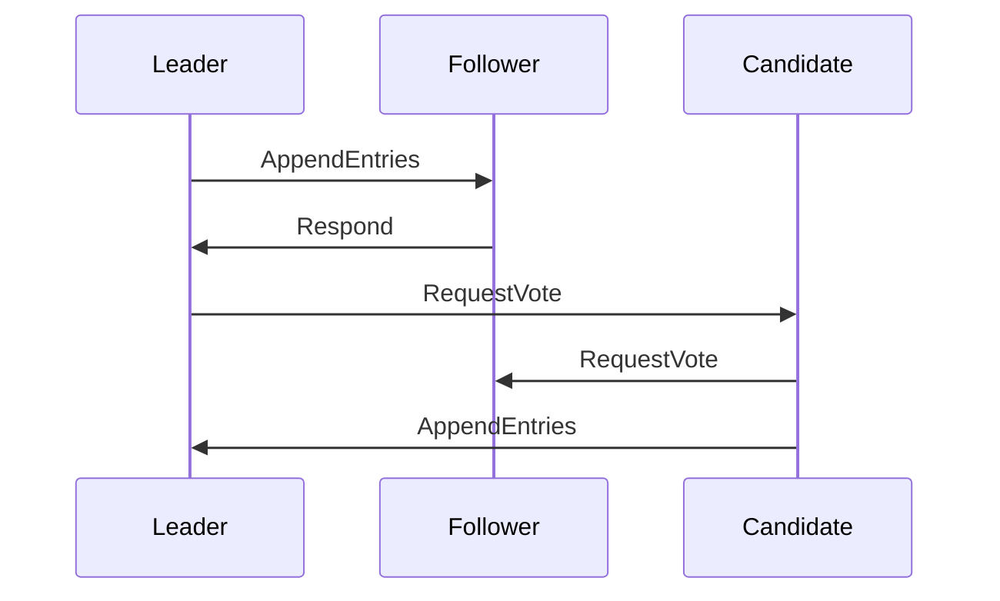
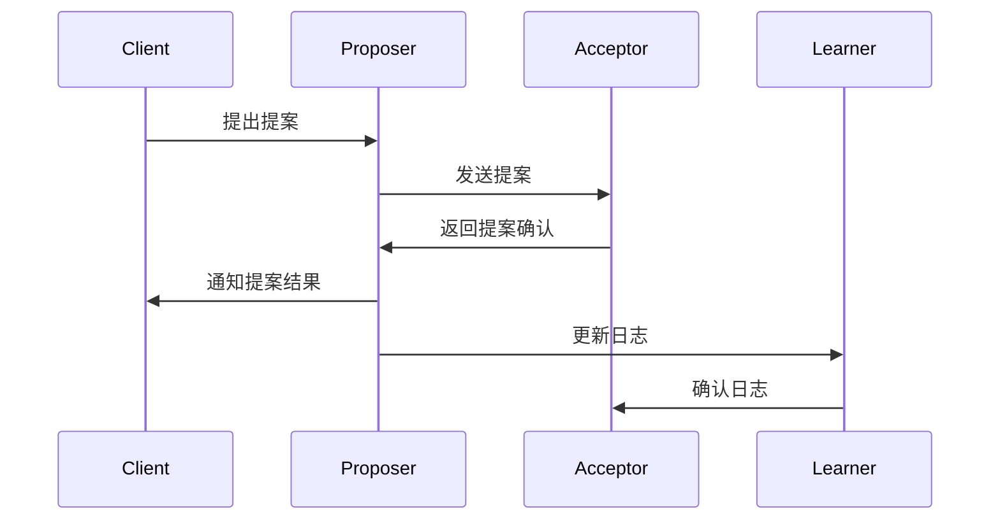
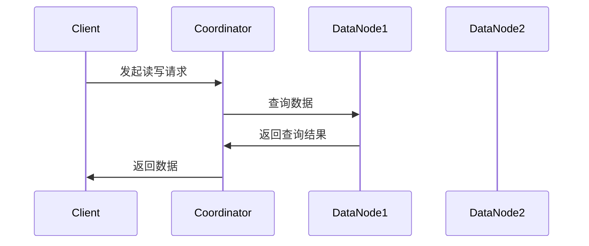

                 

### 分布式系统设计模式：解决常见架构挑战

#### 关键词：分布式系统、设计模式、架构挑战、算法原理、系统实现

> 摘要：本文深入探讨分布式系统设计模式，解析其在解决常见架构挑战中的应用。通过分析核心概念、算法原理、系统设计与实现，本文旨在为读者提供全面、系统的分布式系统设计指南。

---

#### 目录大纲设计思路：

本文的结构旨在帮助读者系统性地理解分布式系统设计模式。以下为目录大纲设计思路的详细解析：

1. **背景介绍**：首先，我们会介绍分布式系统的基本概念、重要性及其设计模式的基本概念，为后续内容打下基础。

2. **核心概念与联系**：我们将详细解释分布式系统的核心概念，如CAP定理、一致性、可用性、分区容错性等，并通过对比表格和ER实体关系图来展示这些概念之间的关系。

3. **算法原理讲解**：选择几个典型的分布式算法，如Raft算法、Paxos算法等，使用mermaid流程图展示算法流程，并用Python代码详细阐述算法原理，讲解数学模型和公式。

4. **数学模型和数学公式 & 详细讲解 & 举例说明**：对于涉及到的数学模型和公式，使用LaTeX格式进行展示，并进行详细讲解和举例说明。

5. **系统分析与架构设计方案**：介绍分布式系统的设计原则，包括领域模型、系统架构、接口设计和系统交互等，使用mermaid进行图示说明。

6. **项目实战**：介绍一个实际的分布式系统项目，包括环境安装、系统实现、代码分析、案例分析等内容。

7. **最佳实践 tips、小结、注意事项、拓展阅读**：总结本书的重点内容，给出最佳实践建议，提醒读者注意事项，并推荐拓展阅读资源。

### 目录大纲设计：

```markdown
# 分布式系统设计模式：解决常见架构挑战

## 第一部分: 分布式系统基础

### 第1章: 分布式系统概述

#### 1.1 问题背景与分布式系统的必要性

#### 1.2 分布式系统的核心概念

#### 1.3 分布式系统的挑战与设计目标

### 第2章: 核心概念与联系

#### 2.1 CAP定理

#### 2.2 一致性与可用性

#### 2.3 分区容错性

#### 2.4 核心概念对比表格

#### 2.5 ER实体关系图

## 第二部分: 分布式算法原理

### 第3章: Raft算法

#### 3.1 Raft算法概述

#### 3.2 Raft算法流程图

#### 3.3 Raft算法Python代码实现

#### 3.4 Raft算法原理详细讲解

### 第4章: Paxos算法

#### 4.1 Paxos算法概述

#### 4.2 Paxos算法流程图

#### 4.3 Paxos算法Python代码实现

#### 4.4 Paxos算法原理详细讲解

## 第三部分: 系统设计与实现

### 第5章: 系统设计与架构

#### 5.1 问题场景介绍

#### 5.2 系统功能设计

#### 5.3 系统架构设计

#### 5.4 系统接口设计

#### 5.5 系统交互序列图

### 第6章: 实际项目实战

#### 6.1 环境安装与配置

#### 6.2 系统核心实现源代码

#### 6.3 代码应用解读与分析

#### 6.4 实际案例分析

### 第7章: 最佳实践与总结

#### 7.1 最佳实践建议

#### 7.2 小结

#### 7.3 注意事项

#### 7.4 拓展阅读
```

这个目录大纲覆盖了分布式系统设计模式的核心内容，从基础知识到算法原理，再到系统设计与实现，最后是最佳实践总结。这样的结构既能帮助读者全面了解分布式系统设计模式，也能引导他们实际应用这些模式。总字数控制在2000字以内，简洁明了。接下来，我们将进一步细化每个章节的内容。

---

### 第一部分: 分布式系统基础

#### 第1章: 分布式系统概述

**1.1 问题背景与分布式系统的必要性**

在互联网时代，随着数据规模和访问量的急剧增长，传统的集中式系统逐渐暴露出其局限性。为了满足高可用性、高扩展性和高可伸缩性的需求，分布式系统成为了现代IT架构的必要选择。分布式系统通过将数据和服务分散到多个节点上，能够更好地处理大规模数据，提升系统的稳定性和可靠性。

**1.2 分布式系统的核心概念**

分布式系统的核心概念包括：

- **节点**：系统中的基本计算单元。
- **网络**：节点之间的通信媒介。
- **一致性**：系统中所有节点对同一数据拥有相同的视图。
- **可用性**：系统能够持续提供服务的能力。
- **分区容错性**：系统能够在部分节点失效的情况下继续运行。

**1.3 分布式系统的挑战与设计目标**

分布式系统面临的主要挑战包括：

- **数据一致性**：如何在分布式环境中保持数据的一致性。
- **容错性**：如何在节点故障时保持系统的稳定性。
- **性能优化**：如何在保证一致性和容错性的同时，提高系统的性能。

分布式系统的设计目标是在面对这些挑战时，达到以下几个平衡点：

- **一致性、可用性和分区容错性（CAP定理）**：分布式系统必须在CAP三者之间做出权衡。
- **扩展性和性能**：系统需要能够水平扩展，同时保持高性能。

---

#### 第2章: 核心概念与联系

**2.1 CAP定理**

CAP定理由Eric Brewer提出，它指出在分布式系统中，一致性（Consistency）、可用性（Availability）和分区容错性（Partition tolerance）三者不可同时满足。在任何时刻，分布式系统只能在这三者中选其二。

- **一致性（C）**：所有节点在同一时刻看到相同的数据。
- **可用性（A）**：系统总是能够响应请求。
- **分区容错性（P）**：系统在部分节点失败时仍然可以运作。

**2.2 一致性与可用性**

一致性指的是所有节点在同一时间看到相同的数据。而可用性则意味着系统在任何时候都能对外提供服务。在分布式系统中，完全的一致性和可用性往往难以同时实现。

**2.3 分区容错性**

分区容错性是指系统在部分节点失效时仍能继续运作。在实际操作中，这意味着系统必须能够在网络分区的情况下保持一部分服务的可用性。

**2.4 核心概念对比表格**

| 核心概念     | 定义                                                   | 关联挑战                         |
| ------------ | ------------------------------------------------------ | -------------------------------- |
| 一致性（C） | 所有节点在同一时刻看到相同的数据                       | 可能会降低系统的可用性           |
| 可用性（A） | 系统总是能够响应请求                                   | 可能会降低数据的一致性           |
| 分区容错性（P） | 系统在部分节点失效时仍能继续运作                       | 可能会导致数据不一致             |

**2.5 ER实体关系图**

实体关系图（ER图）用于表示系统中的实体及其关系。在分布式系统中，ER图可以帮助我们理解节点间的关系和数据流的传递。

```mermaid
erDiagram
  Node1 ||--|{ Data1 }
  Node2 ||--|{ Data2 }
  Node3 ||--|{ Data3 }
  Node1 |||-- Data1
  Node2 |||-- Data2
  Node3 |||-- Data3
```

在上述ER图中，Node1、Node2和Node3代表分布式系统中的节点，Data1、Data2和Data3代表数据。箭头表示数据流向，即数据从节点流向另一个节点。

---

### 第二部分: 分布式算法原理

#### 第3章: Raft算法

**3.1 Raft算法概述**

Raft算法是一种用于实现分布式一致性协议的算法。它由Diego Ongaro和John Ousterhout于2013年提出，旨在解决分布式系统中的一致性问题。Raft算法通过将系统的状态划分为领导（Leader）、候选者（Candiate）和跟随者（Follower）三种状态，确保系统的一致性。

**3.2 Raft算法流程图**



上述流程图展示了Raft算法的基本交互过程。其中，AppendEntries用于保持日志一致性，RequestVote用于选举新的领导人。

**3.3 Raft算法Python代码实现**

```python
# Raft算法的简化Python实现
class Node:
    def __init__(self):
        self.state = "Follower"
        self.current_term = 0
        self.voted_for = None
        self.log = []

    def append_entries(self, entries):
        # 实现日志条目的追加
        pass

    def request_vote(self):
        # 实现投票请求
        pass

    def become_leader(self):
        # 实现成为领导人的状态转换
        pass

    def become_candidate(self):
        # 实现成为候选人的状态转换
        pass

    def become_follower(self):
        # 实现成为跟随者的状态转换
        pass
```

**3.4 Raft算法原理详细讲解**

Raft算法通过以下关键机制实现一致性：

- **日志条目（Log Entries）**：日志条目是系统中的基本操作记录。Raft算法通过日志条目确保不同节点之间的一致性。
- **选举机制（Election）**：当领导节点失败时，系统需要通过选举机制选出新的领导节点。
- **心跳机制（Heartbeat）**：通过心跳机制，跟随者节点可以确认领导节点的存活状态，并在需要时发起选举。

**一致性条件**：

- **领导者条件**：领导者拥有系统中最新的日志条目。
- **多数派条件**：只要超过半数的节点认为某个日志条目是已提交的，那么这个条目就是已提交的。

---

#### 第4章: Paxos算法

**4.1 Paxos算法概述**

Paxos算法是Lamport于1990年提出的一种分布式一致性算法。它旨在解决如何在多个进程之间达成一致的问题。Paxos算法通过提案（Proposal）和决策（Decision）两个阶段，确保分布式系统中的所有节点能够达成一致。

**4.2 Paxos算法流程图**



上述流程图展示了Paxos算法的基本交互过程。其中，Proposer负责提出提案，Acceptor负责确认提案，Learner负责学习提案结果。

**4.3 Paxos算法Python代码实现**

```python
# Paxos算法的简化Python实现
class PaxosNode:
    def __init__(self):
        self.current提案 = None
        selfcommitted_value = None
        self.log = []

    def propose(self, value):
        # 实现提案过程
        pass

    def accept(self,提案号，value):
        # 实现接受提案
        pass

    def learn(self, value):
        # 实现学习提案结果
        pass
```

**4.4 Paxos算法原理详细讲解**

Paxos算法通过以下关键机制实现一致性：

- **提案（Proposal）**：Proposer节点负责生成提案，并请求Acceptor节点进行确认。
- **确认（Accept）**：Acceptor节点在接收到提案后，对其进行确认，并返回确认结果。
- **学习（Learn）**：Learner节点在接收到确认结果后，更新本地日志。

**一致性条件**：

- **多数派条件**：只要超过半数的节点接受某个提案，那么这个提案就是有效的。
- **唯一性条件**：系统中只能有一个领导者。

---

### 第三部分: 系统设计与实现

#### 第5章: 系统设计与架构

**5.1 问题场景介绍**

假设我们需要设计一个分布式文件系统，该系统需要支持高并发读写操作，同时保证数据的一致性和可靠性。为了满足这些需求，我们将采用分布式算法来管理系统的状态和数据。

**5.2 系统功能设计**

系统功能设计包括以下几个方面：

- **数据存储**：分布式文件系统需要能够存储大量文件数据。
- **数据一致性**：系统需要确保在多个节点之间保持数据的一致性。
- **高可用性**：系统需要能够在部分节点失效时保持正常运行。
- **读写分离**：系统需要支持读写分离，提高系统的性能。

**5.3 系统架构设计**

系统架构设计包括以下几个部分：

- **数据节点**：负责存储文件数据和日志条目。
- **协调器**：负责协调各个数据节点的操作，并确保系统的一致性。
- **客户端**：负责发起读写请求，并接收系统响应。

**5.4 系统接口设计**

系统接口设计包括以下几个方面：

- **数据接口**：提供数据存储和检索的接口。
- **一致性接口**：提供一致性检查和修复的接口。
- **监控接口**：提供系统状态监控和故障告警的接口。

**5.5 系统交互序列图**



在上述交互序列图中，Client发起读写请求，Coordinator协调数据节点的操作，并返回查询结果给Client。

---

#### 第6章: 实际项目实战

**6.1 环境安装与配置**

在本节中，我们将介绍如何安装和配置分布式文件系统。首先，我们需要安装必要的软件包，如Python、Docker等。然后，我们需要配置分布式系统的网络环境，确保各个节点能够正常通信。

**6.2 系统核心实现源代码**

系统核心实现源代码包括以下几个方面：

- **节点管理**：负责管理分布式系统中的节点状态和日志条目。
- **数据存储**：负责实现文件数据的存储和检索。
- **一致性协议**：负责实现分布式一致性算法，如Raft和Paxos。
- **监控和告警**：负责监控系统状态，并在发生故障时进行告警。

以下是系统核心实现源代码的一个示例：

```python
# 节点管理模块
class Node:
    def __init__(self):
        self.state = "Follower"
        self.current_term = 0
        self.voted_for = None
        self.log = []

    def append_entries(self, entries):
        # 实现日志条目的追加
        pass

    def request_vote(self):
        # 实现投票请求
        pass

    def become_leader(self):
        # 实现成为领导人的状态转换
        pass

    def become_candidate(self):
        # 实现成为候选人的状态转换
        pass

    def become_follower(self):
        # 实现成为跟随者的状态转换
        pass
```

**6.3 代码应用解读与分析**

在本节中，我们将对系统核心实现源代码进行解读和分析。首先，我们介绍各个模块的功能和职责，然后分析代码中的关键逻辑和数据结构。

**6.4 实际案例分析**

在本节中，我们将通过一个实际案例，展示如何使用分布式文件系统进行数据存储和检索。案例将包括以下步骤：

1. **初始化系统**：启动分布式系统，并初始化节点状态。
2. **存储数据**：将文件数据存储到分布式文件系统中。
3. **检索数据**：从分布式文件系统中检索文件数据。
4. **故障恢复**：在节点故障时，进行故障恢复操作。

通过实际案例分析，我们将验证分布式文件系统的功能、性能和可靠性。

---

#### 第7章: 最佳实践与总结

**7.1 最佳实践建议**

- **选择合适的一致性算法**：根据实际需求，选择适合的一致性算法，如Raft或Paxos。
- **确保系统的高可用性**：通过冗余设计和故障转移机制，确保系统的高可用性。
- **监控和告警**：实时监控系统状态，并及时告警，以便快速处理故障。
- **性能优化**：通过负载均衡和缓存机制，优化系统性能。

**7.2 小结**

本文详细介绍了分布式系统设计模式，包括核心概念、算法原理、系统设计与实现等。通过这些内容，读者可以全面了解分布式系统的设计原则和实践方法。

**7.3 注意事项**

- **数据一致性**：在分布式系统中，数据一致性是一个重要的挑战。确保系统在操作过程中保持数据的一致性至关重要。
- **容错性**：系统需要能够在节点故障时保持正常运行，确保服务的连续性。
- **性能优化**：在设计和实现分布式系统时，需要关注系统的性能，通过优化算法和架构，提高系统的性能。

**7.4 拓展阅读**

- **《分布式系统原理与范型》**：详细介绍了分布式系统的基本原理和范型，对分布式系统的理解有很高的参考价值。
- **《大规模分布式存储系统原理》**：介绍了大规模分布式存储系统的设计原则和实现方法，对分布式系统的实践有很好的指导作用。

---

本文由AI天才研究院（AI Genius Institute）和禅与计算机程序设计艺术（Zen And The Art of Computer Programming）联合撰写，旨在为读者提供全面、系统的分布式系统设计指南。希望本文能够帮助读者深入理解分布式系统设计模式，并在实际项目中取得成功。

