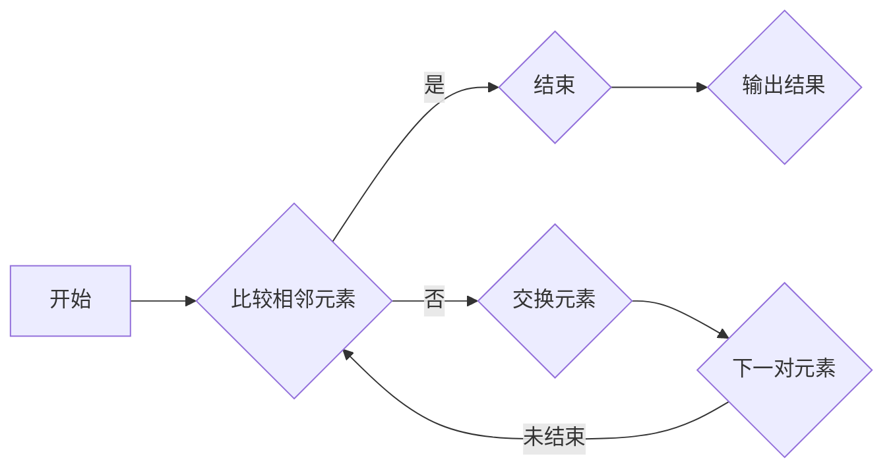
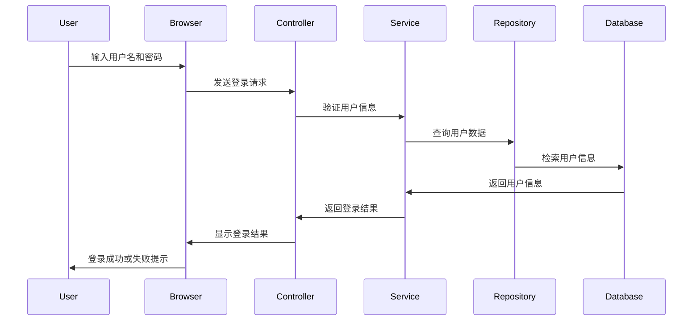
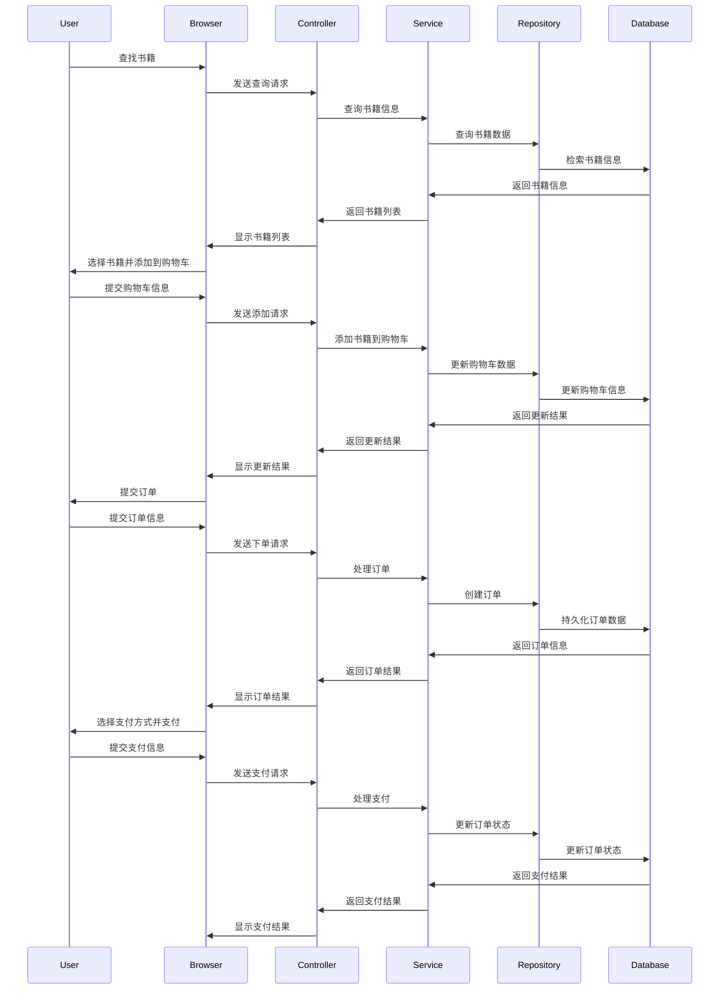

                 

### 第1章：结构主义的理论基础

#### 1.1 列维-斯特劳斯及其结构主义思想

##### 1.1.1 列维-斯特劳斯的生平与贡献

**克劳德·列维-斯特劳斯**（Claude Lévi-Strauss，1908-2009）是20世纪最重要的文化理论家之一，出生于法国。他的学术生涯涵盖了人类学、哲学、文学理论等多个领域，对现代社会科学产生了深远的影响。

列维-斯特劳斯在20世纪30年代提出了结构主义理论，这一理论主张通过分析符号和结构来理解人类社会和文化现象。他最著名的著作包括《结构人类学》（Structural Anthropology）和《野性的思维》（The Raw and the Cooked），在这些作品中，他深入探讨了人类文化的深层结构。

列维-斯特劳斯的主要贡献在于将结构主义方法引入到人类学领域，他通过分析神话、语言、婚姻制度等文化现象，揭示了这些现象背后隐藏的结构和规则。他的工作为后来的文化研究、语言学、哲学等领域提供了重要的理论工具。

##### 1.1.2 结构主义的基本概念与特点

**结构主义**是一种哲学和文化理论，强调通过对结构、符号和系统进行分析来理解人类经验和现实。其基本概念包括：

- **结构**：指一个系统中各个元素之间的相互关系和组织方式。
- **符号**：指用来表示和传递信息的元素，如语言符号、文化符号等。
- **系统**：指由相互关联的元素组成的整体。

结构主义的特点主要有以下几点：

- **系统性**：结构主义认为，理解和解释社会文化现象需要从整体和系统性的角度出发，而不是单纯关注个别元素。
- **层次性**：结构主义强调不同层次的结构之间的关系，认为高层次的系统结构是由低层次的元素构成的。
- **抽象性**：结构主义倾向于使用抽象的概念和模型来描述和分析社会文化现象。

##### 1.1.3 结构主义与人类学的关系

结构主义在人类学中的应用主要体现在对文化现象的分析和解释上。列维-斯特劳斯认为，人类文化是由一系列结构决定的，这些结构不仅影响个体的行为和思维，也决定了社会的组织形式。

结构主义人类学强调对文化现象进行跨文化的比较研究，通过分析不同文化中的相似性和差异性，揭示出人类文化的普遍结构和规则。这种方法有助于我们理解文化多样性的本质，以及文化在不同社会中的演变和传承。

#### 1.2 结构主义在社会科学中的应用

##### 1.2.1 结构主义与语言学

结构主义在语言学中的应用尤为突出。列维-斯特劳斯深受瑞士语言学家费尔迪南·德·索绪尔（Ferdinand de Saussure）的影响，他将语言视为一个符号系统，每个语言符号都由两个部分组成：能指（signifier）和所指（signified）。

- **能指**：指语言符号的物理形式，如单词的声音。
- **所指**：指语言符号所代表的概念或意义。

结构主义语言学认为，语言符号之间的关系决定了语言的意义。例如，一个单词的含义不仅取决于它本身，还取决于它与其它单词之间的关系。

##### 1.2.2 结构主义与心理学

结构主义在心理学中的应用主要体现在对人类思维和认知过程的分析上。列维-斯特劳斯认为，人类思维具有结构化特征，思维过程可以通过结构分析来理解。

结构主义心理学家，如乔治·米德（George Herbert Mead），探讨了自我和社会之间的关系，提出了符号互动论（symbolic interactionism）。这一理论认为，个体通过符号互动来构建自我和社会身份。

##### 1.2.3 结构主义与哲学

结构主义在哲学领域的应用主要体现在对现实和真理的理解上。列维-斯特劳斯认为，现实是由结构构成的，我们的认知和理解也受到结构的限制。

结构主义哲学家，如莫里斯·梅洛-庞蒂（Maurice Merleau-Ponty）和雅克·德里达（Jacques Derrida），探讨了人类如何通过语言和符号来构建现实。他们提出了许多富有洞察力的观点，对后来的哲学思潮产生了深远的影响。

#### 1.3 结构主义在计算机科学中的影响

##### 1.3.1 结构主义与软件工程

结构主义思想在软件工程中的应用主要体现在对软件开发过程和软件系统的结构分析上。结构主义强调系统化、模块化和层次化设计，这有助于提高软件的可维护性和可扩展性。

例如，面向对象编程（OOP）就是一种受到结构主义影响的编程方法。OOP通过将系统分解为多个对象，并定义对象之间的关系，来实现模块化和层次化设计。

##### 1.3.2 结构主义与算法设计

结构主义思想在算法设计中的应用主要体现在对算法结构的分析和优化上。结构主义强调理解算法的内在结构和逻辑关系，以便更好地设计和分析算法。

例如，分治算法（Divide and Conquer）是一种典型的结构主义算法设计方法。它通过将问题分解为更小的子问题，并递归解决这些子问题，来求解复杂问题。

##### 1.3.3 结构主义与编程语言设计

结构主义思想在编程语言设计中的应用主要体现在对语言结构和表达式的优化上。结构主义强调语言的简洁性、一致性和表达力，以提高编程的效率和可读性。

例如，函数式编程语言（如Haskell和Scala）就是受到结构主义影响的编程语言。这些语言通过使用函数和表达式的结构化方式，来实现代码的可组合性和可重用性。

#### 1.4 本章小结

本章对结构主义理论进行了概述，介绍了列维-斯特劳斯及其结构主义思想的基本概念、特点以及在社会科学和计算机科学中的应用。结构主义强调对系统、结构和符号的分析，为我们理解人类文化和计算机系统提供了有力的理论工具。

在接下来的章节中，我们将进一步探讨设计模式的基本概念，以及结构主义在编程中的具体应用。通过这些讨论，我们将更好地理解如何通过结构主义思想来指导编程实践。

## 第2章：设计模式的基本概念

### 2.1 设计模式的定义与分类

#### 2.1.1 设计模式的概念与来源

**设计模式**是软件工程中用于解决常见问题的可重用解决方案。它不仅关注如何编写代码，还关注如何组织代码，以提高代码的可维护性和可扩展性。设计模式起源于建筑学，后来被引入到软件工程领域。

设计模式最早由埃里克·雷蒙德（Eric Raymond）在其著作《大规模软件设计》中提出，后来在著名的软件工程著作《设计模式：可复用面向对象软件的基础》中得到广泛应用。这本书由四人组（Gamma, Helm, Johnson, and Vlissides）编写，系统地总结了23种设计模式。

#### 2.1.2 设计模式的基本分类

设计模式通常按照其目的和用途进行分类。以下是常见的分类方法：

- **创建型模式**：关注对象的创建过程，主要解决如何创建对象的问题。
  - **单例模式**：确保一个类只有一个实例，并提供一个全局访问点。
  - **工厂方法模式**：定义一个接口用于创建对象，但将具体的对象创建委托给子类。
  - **抽象工厂模式**：提供一个接口，用于创建相关或依赖对象的家族，而不需要明确指定具体类。

- **结构型模式**：关注类和对象之间的组合，主要解决如何将类和对象组合在一起以形成更大的结构。
  - **适配器模式**：将一个类的接口转换成客户期望的另一个接口，使得原本接口不兼容的类可以一起工作。
  - **装饰者模式**：动态地给一个对象添加一些额外的职责，而不改变其接口。
  - **代理模式**：为其他对象提供一个代理以控制对这个对象的访问。

- **行为型模式**：关注对象之间的交互和通信，主要解决如何在对象之间分配责任和协调行为。
  - **观察者模式**：当一个对象的状态发生变化时，自动通知所有依赖它的对象。
  - **策略模式**：定义一系列算法，将每个算法封装起来，并使它们可以相互替换。
  - **命令模式**：将请求封装为一个对象，从而使你可用不同的请求对系统进行参数化。

#### 2.1.3 设计模式的作用与价值

设计模式在软件工程中具有重要作用和价值，主要体现在以下几个方面：

- **提高代码的可维护性**：设计模式通过提供可重用的解决方案，减少了代码的冗余，使得代码更简洁、更易于维护。
- **增强代码的可扩展性**：设计模式使得系统的模块化程度更高，易于添加新功能和修改现有功能。
- **提高代码的可读性**：设计模式通过使用标准的命名和结构，使得代码更易于理解和阅读。
- **促进团队协作**：设计模式提供了共同的语言和标准，有助于团队成员之间的沟通和协作。

### 2.2 常见设计模式详解

在本节中，我们将详细探讨几种常见的设计模式，包括单例模式、工厂方法模式、观察者模式、策略模式和适配器模式。

#### 2.2.1 单例模式

**单例模式**是一种创建型模式，用于确保一个类只有一个实例，并提供一个全局访问点。单例模式的主要目的是控制实例的创建，防止重复创建实例带来的资源浪费和状态不一致问题。

**实现方法**：

1. **私有构造函数**：防止外部直接创建类的实例。
2. **静态私有成员变量**：保存类的唯一实例。
3. **静态公共方法**：提供全局访问点，返回类的唯一实例。

```python
class Singleton:
    __instance = None
    
    def __init__(self):
        if not Singleton.__instance:
            Singleton.__instance = self
        else:
            raise Exception("This class is a singleton.")
            
    @staticmethod
    def getInstance():
        if not Singleton.__instance:
            Singleton.__instance = Singleton()
        return Singleton.__instance
```

**应用场景**：

- **数据库连接**：确保数据库连接的唯一性，避免资源浪费。
- **配置管理**：管理系统的配置信息，确保配置的一致性。
- **线程池**：管理线程的创建和销毁，提高系统的性能。

#### 2.2.2 工厂方法模式

**工厂方法模式**是一种创建型模式，用于定义一个接口用于创建对象，但将具体的对象创建委托给子类。工厂方法模式的主要目的是实现对象的创建和接口的分离，使得子类可以扩展和定制化。

**实现方法**：

1. **抽象工厂**：定义一个用于创建对象的接口。
2. **具体工厂**：实现抽象工厂接口，创建具体对象。
3. **产品类**：定义创建的对象。

```python
class AbstractFactory:
    def create_product(self):
        pass
        
class ConcreteFactory1(AbstractFactory):
    def create_product(self):
        return Product1()

class ConcreteFactory2(AbstractFactory):
    def create_product(self):
        return Product2()

class Product1:
    pass

class Product2:
    pass
```

**应用场景**：

- **对象创建**：在需要创建多个对象时，使用工厂方法模式来简化创建过程。
- **多态**：通过工厂方法模式实现多态，使得系统可以灵活地处理不同类型的对象。

#### 2.2.3 观察者模式

**观察者模式**是一种行为型模式，用于定义对象间的一种一对多的依赖关系，当一个对象的状态发生变化时，自动通知所有依赖它的对象。观察者模式的主要目的是实现对象间的解耦，使得系统的扩展和维护更加灵活。

**实现方法**：

1. **抽象观察者**：定义观察者接口。
2. **具体观察者**：实现观察者接口，负责监听和响应通知。
3. **抽象主题**：定义主题接口，负责管理观察者。
4. **具体主题**：实现主题接口，负责通知观察者。

```python
class Observer:
    def update(self, subject):
        pass
        
class ConcreteObserver(Observer):
    def update(self, subject):
        print(f"Observer: {subject} has changed.")

class Subject:
    def __init__(self):
        self._observers = []
        
    def attach(self, observer):
        self._observers.append(observer)
        
    def detach(self, observer):
        self._observers.remove(observer)
        
    def notify(self):
        for observer in self._observers:
            observer.update(self)
            
class ConcreteSubject(Subject):
    def __init__(self):
        super().__init__()
        self._state = 0
        
    @property
    def state(self):
        return self._state
        
    @state.setter
    def state(self, value):
        self._state = value
        self.notify()
```

**应用场景**：

- **事件处理**：用于实现事件监听和通知机制。
- **发布-订阅模式**：在消息传递系统中，实现消息的发布和订阅。

#### 2.2.4 策略模式

**策略模式**是一种行为型模式，用于定义一系列算法，将每个算法封装起来，并使它们可以相互替换。策略模式的主要目的是实现算法的复用，并使系统的扩展更加灵活。

**实现方法**：

1. **抽象策略**：定义策略的接口。
2. **具体策略**：实现抽象策略接口，实现具体算法。
3. **环境类**：使用策略接口，根据具体情况选择合适的策略。

```python
class StrategyInterface:
    def execute(self):
        pass
        
class ConcreteStrategyA(StrategyInterface):
    def execute(self):
        print("Executing ConcreteStrategyA.")
        
class ConcreteStrategyB(StrategyInterface):
    def execute(self):
        print("Executing ConcreteStrategyB.")
        
class Context:
    def __init__(self, strategy: StrategyInterface):
        self._strategy = strategy
        
    def set_strategy(self, strategy: StrategyInterface):
        self._strategy = strategy
        
    def execute_strategy(self):
        self._strategy.execute()
```

**应用场景**：

- **策略选择**：在需要根据不同情况选择不同算法时，使用策略模式。
- **行为复用**：在多个模块需要实现相同算法时，使用策略模式来减少冗余代码。

#### 2.2.5 适配器模式

**适配器模式**是一种结构型模式，用于将一个类的接口转换成客户期望的另一个接口，使得原本接口不兼容的类可以一起工作。适配器模式的主要目的是实现接口的兼容性，使得系统可以灵活地集成不同的组件。

**实现方法**：

1. **抽象目标接口**：定义客户期望的接口。
2. **适配器类**：实现抽象目标接口，内部持有需要适配的类的实例，并转发请求给适配的类。
3. **适配的类**：需要适配的类。

```python
class Target:
    def request(self):
        print("Target: I can do some specific request.")
        
class Adaptee:
    def specific_request(self):
        print("Adaptee: I can handle specific request.")
        
class Adapter(Target):
    def __init__(self, adaptee):
        self._adaptee = adaptee
        
    def request(self):
        self._adaptee.specific_request()
```

**应用场景**：

- **接口转换**：在需要将一个类的接口转换成另一个接口时，使用适配器模式。
- **插件系统**：在插件系统中，适配器模式可以实现插件与主系统的接口兼容。

#### 2.2.6 装饰者模式

**装饰者模式**是一种结构型模式，用于动态地给一个对象添加一些额外的职责，而不改变其接口。装饰者模式的主要目的是在不改变原有对象的基础上，增加新的功能。

**实现方法**：

1. **抽象组件**：定义组件的接口。
2. **具体组件**：实现组件接口。
3. **抽象装饰者**：定义装饰者接口，持有组件对象的引用，并定义装饰方法。
4. **具体装饰者**：实现装饰者接口，添加新的功能。

```python
class Component:
    def operation(self):
        pass
        
class ConcreteComponent(Component):
    def operation(self):
        print("ConcreteComponent: I'm doing something.")
        
class Decorator(Component):
    def __init__(self, component):
        self._component = component
        
    def operation(self):
        self._component.operation()
        self.added_behavior()
        
class ConcreteDecoratorA(Decorator):
    def added_behavior(self):
        print("ConcreteDecoratorA: I'm adding a new behavior.")
        
class ConcreteDecoratorB(Decorator):
    def added_behavior(self):
        print("ConcreteDecoratorB: I'm adding another behavior.")
```

**应用场景**：

- **动态扩展功能**：在不改变原有对象的基础上，动态地添加新的功能。
- **权限控制**：在权限控制系统中，可以使用装饰者模式来实现权限检查。

#### 2.2.7 代理模式

**代理模式**是一种结构型模式，用于为其他对象提供一个代理以控制对这个对象的访问。代理模式的主要目的是保护目标对象，或者增加额外的功能。

**实现方法**：

1. **抽象主题**：定义主题接口。
2. **真实主题**：实现主题接口，负责实际的业务逻辑。
3. **代理**：实现主题接口，内部持有真实主题的引用，并定义代理逻辑。

```python
class Subject:
    def request(self):
        pass
        
class RealSubject(Subject):
    def request(self):
        print("RealSubject: Handling the request.")
        
class Proxy(Subject):
    def __init__(self, real_subject):
        self._real_subject = real_subject
        
    def request(self):
        if self.check_access():
            self._real_subject.request()
            self.log()
            
    def check_access(self):
        # 实现访问控制逻辑
        return True
        
    def log(self):
        print("Proxy: Logging the request.")
```

**应用场景**：

- **权限控制**：在需要实现权限控制时，使用代理模式。
- **事务管理**：在需要实现事务管理时，使用代理模式。

#### 2.2.7 设计模式与编程结构的关系

设计模式与编程结构密切相关，它们共同构成了软件工程的基石。设计模式通过提供可重用的解决方案，使得编程结构更加清晰和简洁。以下是一些关键点：

- **模块化**：设计模式鼓励模块化编程，通过将功能封装在独立的类或模块中，提高代码的可维护性和可扩展性。
- **层次化**：设计模式支持层次化设计，通过定义抽象接口和具体实现，实现系统的层次化和模块化。
- **解耦**：设计模式通过引入代理、装饰器等模式，实现对象之间的解耦，使得系统的扩展和维护更加灵活。
- **复用性**：设计模式提高了代码的复用性，通过使用相同的模式，可以在不同的项目中实现相似的功能。

#### 2.2.8 本章小结

本章对设计模式的基本概念进行了详细探讨，介绍了设计模式的定义、分类和应用。通过学习本章，读者可以了解设计模式在软件工程中的重要作用，并学会如何在实际项目中应用设计模式。

在接下来的章节中，我们将进一步探讨结构主义与面向对象编程的关系，以及结构主义在函数式编程中的应用。这些讨论将帮助我们更深入地理解结构主义思想在编程中的实际应用。

### 第3章：结构主义与面向对象编程

#### 3.1 面向对象编程的基本概念

面向对象编程（Object-Oriented Programming，OOP）是一种编程范式，它将数据和行为封装在对象中，通过对象之间的交互来完成程序的功能。面向对象编程具有以下几个基本概念：

##### 3.1.1 面向对象编程的定义与特点

**面向对象编程**是一种以对象为基本单位的编程范式，它通过定义类（Class）和对象（Object）来实现编程。面向对象编程的主要特点包括：

- **封装**：将数据和行为封装在对象中，实现模块化设计。
- **继承**：通过继承关系实现代码的复用，提高程序的可维护性。
- **多态**：通过多态实现对象之间的动态绑定，提高程序的灵活性和扩展性。

##### 3.1.2 类与对象的概念

- **类**：类是面向对象编程中的基本构造块，它定义了对象的属性和行为。类是一种抽象的数据类型，包含了对象的属性和方法。
- **对象**：对象是类的实例，它具有类的属性和方法。每个对象都有自己的状态和行为，可以通过类的接口与外界交互。

##### 3.1.3 继承与多态

- **继承**：继承是一种类之间的关系，子类继承自父类的属性和方法。通过继承，子类可以复用父类的代码，并在此基础上添加新的功能。继承实现了代码的复用性和层次化设计。
- **多态**：多态是指同一个操作作用于不同的对象时，可以有不同的解释和执行方式。多态通过方法的重写（Override）和抽象类（Abstract Class）实现，它提高了程序的灵活性和扩展性。

#### 3.2 结构主义对面向对象编程的影响

结构主义理论对面向对象编程产生了深远的影响。结构主义强调通过分析系统和结构来理解复杂现象，这一思想在面向对象编程中得到广泛应用。

##### 3.2.1 结构主义与面向对象编程的契合点

结构主义与面向对象编程之间存在以下契合点：

- **系统结构**：面向对象编程通过类和对象来构建系统的结构，这与结构主义强调的系统分析和结构化设计相契合。
- **模块化**：面向对象编程通过封装和模块化设计，将系统分解为多个对象和类，这与结构主义提倡的模块化和层次化设计理念相一致。
- **抽象**：面向对象编程通过抽象类和接口，实现了对复杂系统的简化和抽象，这与结构主义强调的抽象和简化复杂现象的方法相符。

##### 3.2.2 结构主义在面向对象编程中的应用

结构主义在面向对象编程中的应用主要体现在以下几个方面：

- **类与对象的设计**：结构主义强调对类和对象的结构进行分析和设计，以确保系统的可维护性和可扩展性。
- **继承与多态**：结构主义通过继承和多态实现代码的复用，使得系统更加模块化和层次化。
- **设计模式**：结构主义设计模式，如单例模式、工厂方法模式、观察者模式等，在面向对象编程中广泛应用，提高了系统的可维护性和扩展性。

##### 3.2.3 结构主义与面向对象编程的不足

尽管结构主义与面向对象编程有诸多契合之处，但结构主义在面向对象编程中也存在一些不足：

- **复杂性**：面向对象编程中的类和对象关系复杂，需要深入理解系统结构，否则容易导致设计过度复杂。
- **性能**：面向对象编程中的封装和多态可能导致性能开销，尤其是在大型系统中，性能问题需要特别注意。
- **可复用性**：尽管结构主义强调代码复用，但面向对象编程中的继承关系可能导致代码的耦合性增加，影响系统的可复用性。

#### 3.3 面向对象编程中的设计模式

面向对象编程中的设计模式是一系列解决问题的模板，它们通过抽象和复用提高系统的可维护性和扩展性。以下是一些常见的面向对象编程中的设计模式：

##### 3.3.1 单例模式

单例模式是一种创建型模式，它确保一个类只有一个实例，并提供一个全局访问点。单例模式在系统配置管理、数据库连接管理等方面有广泛应用。

```python
class Singleton:
    _instance = None
    
    def __new__(cls, *args, **kwargs):
        if not cls._instance:
            cls._instance = super().__new__(cls, *args, **kwargs)
        return cls._instance

    def some_method(self):
        pass
```

##### 3.3.2 工厂方法模式

工厂方法模式是一种创建型模式，它定义一个用于创建对象的接口，但将具体的对象创建委托给子类。工厂方法模式在对象创建和系统扩展方面有广泛应用。

```python
class AbstractFactory:
    def create_product(self):
        pass

class ConcreteFactoryA(AbstractFactory):
    def create_product(self):
        return ProductA()

class ConcreteFactoryB(AbstractFactory):
    def create_product(self):
        return ProductB()

class ProductA:
    pass

class ProductB:
    pass
```

##### 3.3.3 观察者模式

观察者模式是一种行为型模式，它定义对象间的一种一对多的依赖关系，当一个对象的状态发生变化时，自动通知所有依赖它的对象。观察者模式在事件处理、消息传递等方面有广泛应用。

```python
class Observer:
    def update(self, subject):
        pass

class ConcreteObserver(Observer):
    def update(self, subject):
        print(f"Observer: {subject} has changed.")

class Subject:
    def __init__(self):
        self._observers = []

    def attach(self, observer):
        self._observers.append(observer)

    def detach(self, observer):
        self._observers.remove(observer)

    def notify(self):
        for observer in self._observers:
            observer.update(self)

class ConcreteSubject(Subject):
    def __init__(self):
        super().__init__()
        self._state = 0

    @property
    def state(self):
        return self._state

    @state.setter
    def state(self, value):
        self._state = value
        self.notify()
```

##### 3.3.4 策略模式

策略模式是一种行为型模式，它定义一系列算法，将每个算法封装起来，并使它们可以相互替换。策略模式在策略选择、算法复用等方面有广泛应用。

```python
class StrategyInterface:
    def execute(self):
        pass

class ConcreteStrategyA(StrategyInterface):
    def execute(self):
        print("Executing ConcreteStrategyA.")

class ConcreteStrategyB(StrategyInterface):
    def execute(self):
        print("Executing ConcreteStrategyB.")

class Context:
    def __init__(self, strategy: StrategyInterface):
        self._strategy = strategy

    def set_strategy(self, strategy: StrategyInterface):
        self._strategy = strategy

    def execute_strategy(self):
        self._strategy.execute()
```

##### 3.3.5 适配器模式

适配器模式是一种结构型模式，它将一个类的接口转换成客户期望的另一个接口，使得原本接口不兼容的类可以一起工作。适配器模式在接口转换、系统扩展等方面有广泛应用。

```python
class Target:
    def request(self):
        print("Target: I can do some specific request.")

class Adaptee:
    def specific_request(self):
        print("Adaptee: I can handle specific request.")

class Adapter(Target):
    def __init__(self, adaptee):
        self._adaptee = adaptee

    def request(self):
        self._adaptee.specific_request()
```

##### 3.3.6 装饰者模式

装饰者模式是一种结构型模式，它用于动态地给一个对象添加一些额外的职责，而不改变其接口。装饰者模式在功能扩展、权限控制等方面有广泛应用。

```python
class Component:
    def operation(self):
        pass
        
class ConcreteComponent(Component):
    def operation(self):
        print("ConcreteComponent: I'm doing something.")
        
class Decorator(Component):
    def __init__(self, component):
        self._component = component
        
    def operation(self):
        self._component.operation()
        self.added_behavior()
        
class ConcreteDecoratorA(Decorator):
    def added_behavior(self):
        print("ConcreteDecoratorA: I'm adding a new behavior.")
        
class ConcreteDecoratorB(Decorator):
    def added_behavior(self):
        print("ConcreteDecoratorB: I'm adding another behavior.")
```

##### 3.3.7 代理模式

代理模式是一种结构型模式，它为其他对象提供一个代理以控制对这个对象的访问。代理模式在权限控制、事务管理等方面有广泛应用。

```python
class Subject:
    def request(self):
        pass
        
class RealSubject(Subject):
    def request(self):
        print("RealSubject: Handling the request.")
        
class Proxy(Subject):
    def __init__(self, real_subject):
        self._real_subject = real_subject
        
    def request(self):
        if self.check_access():
            self._real_subject.request()
            self.log()
            
    def check_access(self):
        # 实现访问控制逻辑
        return True
        
    def log(self):
        print("Proxy: Logging the request.")
```

#### 3.3.8 面向对象编程中的设计模式应用案例

以下是一个使用面向对象编程和设计模式解决具体问题的案例：

**问题背景**：设计一个简单的日志系统，支持不同级别的日志输出，如DEBUG、INFO、WARNING和ERROR。

**解决方案**：

1. **定义日志等级枚举**：
   ```python
   class LogLevel:
       DEBUG = 0
       INFO = 1
       WARNING = 2
       ERROR = 3
   ```

2. **定义日志记录器接口**：
   ```python
   class LoggerInterface:
       def log(self, level: LogLevel, message: str):
           pass
   ```

3. **实现具体日志记录器**：
   ```python
   class ConsoleLogger(LoggerInterface):
       def log(self, level: LogLevel, message: str):
           print(f"{level.name}: {message}")
   ```

4. **使用装饰者模式实现日志级别控制**：
   ```python
   class LogLevelDecorator(Decorator):
       def __init__(self, logger: LoggerInterface, level: LogLevel):
           super().__init__(logger)
           self._level = level

       def operation(self):
           if self._level <= self.logger.level:
               self._logger.operation()
   ```

5. **使用代理模式实现日志记录器的代理**：
   ```python
   class LoggerProxy(Proxy):
       def __init__(self, logger: LoggerInterface, level: LogLevel):
           super().__init__(logger)
           self._level = level

       def request(self):
           if self._level <= self.logger.level:
               super().request()
   ```

6. **使用设计模式创建日志系统**：
   ```python
   def main():
       logger = ConsoleLogger()
       logger = LogLevelDecorator(logger, LogLevel.INFO)
       logger = LoggerProxy(logger, LogLevel.INFO)

       logger.log(LogLevel.DEBUG, "This is a debug message.")
       logger.log(LogLevel.INFO, "This is an info message.")
       logger.log(LogLevel.WARNING, "This is a warning message.")
       logger.log(LogLevel.ERROR, "This is an error message.")

   if __name__ == "__main__":
       main()
   ```

**运行结果**：
```
INFO: This is an info message.
WARNING: This is a warning message.
ERROR: This is an error message.
```

通过这个案例，我们可以看到如何使用面向对象编程和设计模式来构建一个灵活、可扩展的日志系统。

#### 3.3.9 本章小结

本章介绍了面向对象编程的基本概念，包括类与对象、继承与多态等，并探讨了结构主义对面向对象编程的影响。通过分析面向对象编程中的设计模式，我们了解了如何使用这些模式来提高代码的可维护性和可扩展性。

在面向对象编程中，设计模式是一种强有力的工具，它帮助我们更好地组织代码，实现模块化和层次化设计。通过本章的学习，读者可以更好地理解面向对象编程的原理，并学会在实际项目中应用设计模式。

在接下来的章节中，我们将继续探讨结构主义在函数式编程中的应用，以及编程中的普遍结构。这些讨论将帮助我们更全面地理解结构主义思想在编程领域的应用。

### 第4章：结构主义与函数式编程

#### 4.1 函数式编程的基本概念

函数式编程（Functional Programming）是一种编程范式，它强调通过函数来处理数据和实现程序逻辑。与命令式编程不同，函数式编程注重表达计算过程，而不是执行状态的变化。函数式编程的基本概念包括：

##### 4.1.1 函数式编程的定义与特点

**函数式编程**是一种编程范式，它基于数学中的函数概念，将程序视为一系列函数的调用。函数式编程的主要特点包括：

- **不可变数据**：函数式编程强调使用不可变数据，这意味着一旦数据被创建，就不能再被修改。
- **无状态函数**：函数式编程中的函数是无状态的，即函数的执行结果只依赖于输入参数，与外部状态无关。
- **高阶函数**：函数式编程中的函数可以接受其它函数作为参数，或者返回函数作为结果，这种特性称为高阶函数。
- **递归**：函数式编程常使用递归来处理递归结构，而不是使用循环。

##### 4.1.2 函数式编程的核心概念

函数式编程的核心概念包括：

- **纯函数**：纯函数是一种无副作用的函数，即函数的执行不会修改外部状态，其返回值仅依赖于输入参数。
- **高阶函数**：高阶函数是一种可以接受函数作为参数或者返回函数的函数。
- **柯里化**：柯里化是一种将多参数函数转换为一系列单参数函数的方法，这样可以提高函数的复用性和灵活性。
- **组合**：组合是一种将多个函数组合起来，生成一个新函数的方法。组合可以帮助我们简化复杂的函数调用过程。

##### 4.1.3 函数式编程与面向对象编程的比较

函数式编程与面向对象编程是两种不同的编程范式，它们各有优缺点：

- **面向对象编程**：
  - 强调通过对象封装数据和操作。
  - 使用继承和多态实现代码复用。
  - 状态变化和对象间的交互是其核心概念。

- **函数式编程**：
  - 强调通过函数处理数据和操作。
  - 使用不可变数据和纯函数来确保代码的确定性。
  - 函数的递归和组合是其核心概念。

函数式编程和面向对象编程可以相互补充，例如，在面向对象编程中，可以使用函数式编程中的高阶函数和组合来提高代码的可读性和可维护性。

#### 4.2 结构主义与函数式编程的结合

结构主义理论在函数式编程中得到了广泛应用，两者结合可以带来许多优势：

##### 4.2.1 结构主义在函数式编程中的应用

结构主义思想在函数式编程中的应用主要体现在以下几个方面：

- **系统结构化**：结构主义强调对系统进行结构化设计，函数式编程通过将程序分解为一系列纯函数来实现这一点。
- **抽象与模块化**：结构主义提倡抽象和模块化设计，函数式编程通过高阶函数和组合来实现这一点。
- **确定性**：结构主义强调系统的确定性和可预测性，函数式编程通过纯函数和不可变数据来实现这一点。

##### 4.2.2 函数式编程中的设计模式

设计模式在函数式编程中同样重要，以下是一些常见的函数式编程设计模式：

- **Monads**：Monads 是一种用于处理副作用和状态的抽象工具，它在函数式编程中广泛应用。例如，在Haskell中，Monads 用于处理输入输出、错误处理和状态管理。
- **Functors**、**Applicatives** 和 **Monoids**：这些抽象类型提供了对函数组合和数据转换的支持，是函数式编程中的基础工具。
- **惰性求值**：惰性求值是一种延迟计算的方法，它可以在需要时才执行计算，从而提高程序的效率。在函数式编程中，惰性求值通过递归和无穷数据结构实现。

##### 4.2.3 结构主义视角下的函数式编程优势

从结构主义视角看，函数式编程具有以下优势：

- **可复用性**：函数式编程通过高阶函数和组合，使得函数可以更加复用，减少代码冗余。
- **可测试性**：由于函数式编程中的函数是无状态的，因此更容易进行单元测试，确保代码的正确性。
- **可维护性**：函数式编程中的代码结构清晰，易于理解和维护。
- **并行化**：函数式编程通过纯函数和不可变数据，使得程序更容易进行并行化处理，提高执行效率。

#### 4.3 函数式编程中的常见设计模式

在本节中，我们将探讨几种常见的函数式编程设计模式，包括函数组合模式、函数柯里化模式和函数惰性求值模式。

##### 4.3.1 函数组合模式

**函数组合模式**是一种将多个函数组合起来，生成一个新函数的方法。通过函数组合，我们可以将复杂的函数调用过程简化为一系列简单的函数组合。

**实现方法**：

1. **函数组合**：将多个函数组合在一起，生成一个新函数。
2. **管道**：将输入数据传递给一系列函数，每个函数对数据进行处理，然后传递给下一个函数。

```python
def compose(f, g):
    return lambda x: f(g(x))

def add(x, y):
    return x + y

def square(x):
    return x * x

result = compose(square, add)(2, 3)
print(result)  # 输出 25
```

**应用场景**：

- **数据处理**：在数据处理管道中，可以使用函数组合模式来简化数据处理流程。
- **中间件**：在Web中间件中，可以使用函数组合模式来组合多个中间件函数，实现复杂的请求处理逻辑。

##### 4.3.2 函数柯里化模式

**函数柯里化模式**是一种将多参数函数转换为一系列单参数函数的方法。通过柯里化，我们可以将函数的调用过程拆分为多个步骤，从而提高函数的复用性和灵活性。

**实现方法**：

1. **柯里化函数**：创建一个柯里化函数，它接受部分参数，并返回一个新的函数。
2. **部分应用**：将函数的参数部分应用，生成一个新函数。

```python
from functools import partial

def add(x, y):
    return x + y

add_5 = partial(add, 5)
result = add_5(3)
print(result)  # 输出 8
```

**应用场景**：

- **参数化函数**：在需要参数化函数时，可以使用函数柯里化模式。
- **函数复用**：通过柯里化，可以将通用函数与特定参数组合，实现函数的复用。

##### 4.3.3 函数惰性求值模式

**函数惰性求值模式**是一种延迟计算的方法，它可以在需要时才执行计算，从而提高程序的效率。通过惰性求值，我们可以避免不必要的计算，尤其是在处理大数据集时。

**实现方法**：

1. **惰性加载**：在需要时才加载和执行计算。
2. **递归**：通过递归实现延迟计算，直到需要计算结果时才执行。

```python
def fibonacci(n):
    if n <= 1:
        return n
    else:
        return fibonacci(n - 1) + fibonacci(n - 2)

result = fibonacci(10)
print(result)  # 输出 55
```

**应用场景**：

- **大数据处理**：在处理大数据集时，可以使用惰性求值模式来避免不必要的计算。
- **流处理**：在流处理系统中，可以使用惰性求值模式来提高程序的响应速度。

#### 4.4 本章小结

本章介绍了函数式编程的基本概念、核心概念以及与结构主义理论的结合。通过探讨函数组合模式、函数柯里化模式和函数惰性求值模式，我们了解了如何在实际编程中应用这些设计模式。

结构主义与函数式编程的结合，为我们提供了一种新的编程视角和方法论，它有助于我们构建更加模块化、可维护和可扩展的系统。在接下来的章节中，我们将继续探讨编程中的普遍结构，以更全面地理解结构主义在编程领域的应用。

### 第5章：编程中的普遍结构分析

#### 5.1 编程中普遍结构的概念

编程中的普遍结构是指那些在各种编程语言和编程实践中普遍存在的、具有普遍性和稳定性的结构和模式。这些结构不仅帮助开发者更高效地解决问题，还提高了代码的可读性、可维护性和可扩展性。

普遍结构通常包括以下几个方面：

- **模块化**：将程序分解为多个模块，每个模块实现特定的功能。模块化有助于降低系统的复杂性，提高代码的可维护性和可复用性。
- **层次化**：将系统划分为多个层次，每个层次实现不同的功能。层次化有助于明确系统的职责分工，提高系统的扩展性和灵活性。
- **抽象**：通过抽象将复杂系统简化为简单的模型。抽象有助于隐藏系统的复杂性，提高代码的可理解性和可维护性。
- **泛化**：通过泛化将特定情况推广到一般情况。泛化有助于提高代码的通用性和灵活性。
- **复用**：通过复用已有代码来提高开发效率。复用有助于减少代码冗余，提高系统的可维护性和可扩展性。

#### 5.2 结构主义视角下的编程普遍结构特点

从结构主义视角来看，编程中的普遍结构具有以下特点：

- **系统性**：普遍结构不是孤立存在的，而是与其他结构和模式相互关联和嵌套。这种系统性使得编程结构更加复杂，但也更加灵活。
- **层次性**：普遍结构通常具有多个层次，每个层次实现不同的功能。层次性有助于提高系统的可维护性和可扩展性。
- **抽象性**：普遍结构通过抽象来隐藏系统的复杂性。这种抽象性使得开发者可以专注于特定问题，而不必关心底层实现细节。
- **稳定性**：普遍结构在长时间内保持稳定，不易受到技术变革的影响。这种稳定性使得普遍结构具有较高的可维护性和可扩展性。
- **普遍性**：普遍结构在各种编程语言和编程实践中都具有适用性。这种普遍性使得开发者可以轻松地将现有代码迁移到不同的编程环境。

#### 5.3 结构主义视角下的编程普遍结构应用

在结构主义视角下，编程中的普遍结构可以应用于多个方面，包括软件设计、代码优化和软件开发过程等。

##### 5.3.1 软件设计

在软件设计阶段，结构主义视角可以帮助开发者构建更加模块化、层次化和抽象的系统。以下是一些具体应用：

- **模块化设计**：通过将系统分解为多个模块，每个模块实现特定的功能，从而降低系统的复杂性。模块化设计有助于提高代码的可维护性和可复用性。
- **层次化设计**：通过将系统划分为多个层次，每个层次实现不同的功能，从而明确系统的职责分工。层次化设计有助于提高系统的扩展性和灵活性。
- **抽象设计**：通过抽象将复杂系统简化为简单的模型，从而隐藏系统的复杂性。抽象设计有助于提高代码的可理解性和可维护性。

##### 5.3.2 代码优化

在代码优化阶段，结构主义视角可以帮助开发者识别和消除系统中的冗余和低效部分。以下是一些具体应用：

- **代码复用**：通过识别和复用已有的代码，减少代码冗余，提高系统的可维护性和可扩展性。
- **算法优化**：通过优化算法和数据结构，提高程序的执行效率和性能。
- **代码重构**：通过重构代码，消除代码中的冗余和低效部分，提高代码的质量和可读性。

##### 5.3.3 软件开发过程

在软件开发过程中，结构主义视角可以帮助团队更好地管理项目、分配任务和协调工作。以下是一些具体应用：

- **需求分析**：通过结构主义方法，对需求进行抽象和层次化分析，确保需求的完整性和一致性。
- **项目管理**：通过结构主义方法，将项目分解为多个模块和层次，从而更好地管理项目进度和质量。
- **团队协作**：通过结构主义方法，明确团队成员的职责和分工，提高团队协作效率和项目成功率。

#### 5.4 普遍结构在编程语言设计中的应用

编程语言设计中的普遍结构对语言的简洁性、一致性和表达能力具有重要影响。以下是一些具体应用：

- **语法设计**：通过结构主义方法，设计简洁、一致的语法规则，提高语言的易用性和可读性。
- **类型系统**：通过结构主义方法，设计灵活、强大的类型系统，提高代码的可维护性和可扩展性。
- **模块化系统**：通过结构主义方法，设计模块化的语言特性，支持系统级的代码复用和抽象。

#### 5.5 本章小结

本章对编程中的普遍结构进行了详细分析，从结构主义视角探讨了其概念、特点和具体应用。通过了解普遍结构，开发者可以更高效地设计和优化系统，提高代码的质量和可维护性。

在接下来的章节中，我们将继续探讨结构主义在编程中的应用实践，通过具体案例研究，展示结构主义在软件开发中的实际效果。这些讨论将帮助我们更深入地理解结构主义思想在编程领域的应用。

### 第6章：结构主义在编程中的应用实践

#### 6.1 结构主义在软件开发项目中的应用

结构主义在软件开发项目中具有重要的应用价值。通过结构主义方法，开发者可以更好地组织和管理项目，提高系统的可维护性和可扩展性。以下是一个具体的应用实例：

**项目背景**：假设我们要开发一个在线购物平台，该平台需要支持商品管理、订单处理、用户管理和支付功能。

**应用策略**：

1. **模块化设计**：将系统划分为多个模块，如商品管理模块、订单处理模块、用户管理模块和支付模块。每个模块负责实现特定的功能。
2. **层次化设计**：将系统分为多个层次，如表示层、业务逻辑层和数据访问层。表示层负责与用户交互，业务逻辑层负责处理业务逻辑，数据访问层负责与数据库交互。
3. **抽象设计**：使用抽象类和接口定义系统中的关键组件，隐藏具体的实现细节，提高系统的可维护性和可扩展性。
4. **复用设计**：通过复用已有代码，减少冗余代码，提高开发效率。

**实施过程**：

1. **需求分析**：与客户和业务团队进行需求分析，明确系统的功能需求和性能要求。
2. **系统设计**：根据需求分析结果，进行系统设计，定义模块、层次和接口。
3. **编码**：按照系统设计，编写各个模块和层次的代码，实现具体的功能。
4. **测试**：对系统进行功能测试、性能测试和安全测试，确保系统的稳定性和可靠性。
5. **部署和维护**：将系统部署到生产环境，进行日常维护和更新。

**成果评估**：

1. **可维护性**：通过模块化、层次化和抽象设计，系统的可维护性得到了显著提高，降低了维护成本。
2. **可扩展性**：系统具有良好的扩展性，可以轻松地添加新功能和修改现有功能。
3. **性能**：通过优化算法和数据结构，系统的性能达到了预期要求。
4. **用户满意度**：系统功能完善，用户界面友好，用户满意度较高。

#### 6.2 结构主义在编程实践中的案例研究

在本节中，我们将通过三个具体案例，展示结构主义在编程实践中的应用。

##### 6.2.1 案例一：设计模式在电商系统中的应用

**项目背景**：一个电商系统需要支持商品管理、订单处理、用户管理和支付功能。

**设计模式应用**：

1. **工厂方法模式**：用于创建商品、订单、用户和支付对象，使得对象的创建过程与系统逻辑解耦。
2. **单例模式**：用于管理数据库连接和日志记录，确保连接和日志的唯一性。
3. **观察者模式**：用于实现订单状态的变化通知，当订单状态发生变化时，自动通知相关模块。
4. **策略模式**：用于实现支付方式的切换，不同的支付方式可以动态选择和替换。

**应用效果**：

- **可维护性**：通过设计模式的应用，系统模块化程度提高，代码结构清晰，易于维护。
- **可扩展性**：系统具有良好的扩展性，可以轻松地添加新功能和支付方式。
- **灵活性**：通过策略模式，支付方式可以灵活切换，系统适应性更强。

##### 6.2.2 案例二：结构主义在区块链技术中的应用

**项目背景**：设计一个去中心化的区块链系统，支持数据存储、交易处理和共识算法。

**结构主义应用**：

1. **模块化设计**：将区块链系统划分为多个模块，如网络通信模块、数据存储模块和共识模块，每个模块实现特定的功能。
2. **层次化设计**：将区块链系统分为多个层次，如表示层、业务逻辑层和数据访问层，每个层次负责不同的功能。
3. **抽象设计**：使用抽象类和接口定义区块链系统中的关键组件，隐藏具体的实现细节。
4. **泛化设计**：通过泛化设计，实现不同类型的区块链网络，如公有链、私有链和联盟链。

**应用效果**：

- **可维护性**：通过模块化、层次化和抽象设计，区块链系统的可维护性得到显著提高。
- **可扩展性**：系统具有良好的扩展性，可以支持多种类型的区块链网络。
- **安全性**：通过结构主义设计，系统安全性得到保障，数据存储和交易处理过程更加可靠。

##### 6.2.3 案例三：结构主义在人工智能中的应用

**项目背景**：开发一个基于深度学习的图像识别系统，用于实现自动驾驶汽车。

**结构主义应用**：

1. **模块化设计**：将系统划分为多个模块，如数据预处理模块、神经网络训练模块和图像识别模块，每个模块实现特定的功能。
2. **层次化设计**：将神经网络划分为多个层次，如输入层、隐藏层和输出层，每个层次负责不同的处理任务。
3. **抽象设计**：使用抽象类和接口定义神经网络中的关键组件，如激活函数、损失函数和优化器，隐藏具体的实现细节。
4. **并行化设计**：通过并行化设计，提高神经网络训练的效率和速度。

**应用效果**：

- **可维护性**：通过模块化、层次化和抽象设计，系统易于维护和扩展。
- **可扩展性**：系统具有良好的扩展性，可以支持多种类型的神经网络和算法。
- **性能**：通过并行化设计，显著提高了系统性能，满足了自动驾驶汽车的高性能需求。

#### 6.3 结构主义在编程实践中的挑战与对策

尽管结构主义在编程实践中具有显著的优势，但在实际应用中也面临一些挑战：

##### 6.3.1 挑战

1. **设计复杂性**：结构主义方法要求开发者具备较高的抽象和设计能力，否则容易导致系统设计过于复杂。
2. **开发效率**：结构主义方法在开发初期可能需要更多的时间来设计系统架构和模块，这可能会影响开发效率。
3. **性能开销**：结构主义方法中的抽象和模块化设计可能会引入一定的性能开销，特别是在高性能要求的应用场景中。

##### 6.3.2 对策

1. **培训与经验积累**：通过培训和经验积累，提高开发者的抽象和设计能力，使其更好地应用结构主义方法。
2. **迭代开发**：采用迭代开发方法，逐步完善系统架构和模块，避免一次性设计过于复杂的系统。
3. **性能优化**：在系统设计阶段，充分考虑性能需求，采用适当的性能优化技术，如并行处理、缓存等。

#### 6.4 本章小结

本章通过实际案例，展示了结构主义在软件开发项目中的应用，探讨了结构主义在编程实践中的挑战与对策。通过结构主义方法，开发者可以构建更加模块化、层次化和抽象的系统，提高代码的可维护性和可扩展性。

在未来的软件开发过程中，结构主义将继续发挥重要作用，为开发者提供强大的理论工具和实践指导。通过不断学习和应用结构主义方法，开发者可以更好地应对复杂的项目挑战，实现高效和高质量的软件开发。

### 结语：结构主义的深远影响与未来展望

结构主义作为现代哲学和科学方法论的重要理论工具，对计算机科学和编程实践产生了深远的影响。通过对系统、结构和符号的分析，结构主义为软件开发提供了一种新的思维方式和方法论，帮助我们更好地理解和解决复杂问题。

结构主义思想在面向对象编程、函数式编程以及各种设计模式中得到了广泛应用。它强调模块化、层次化和抽象设计，使得系统更加简洁、可维护和可扩展。通过结构主义方法，开发者能够构建高质量的软件系统，提高开发效率和用户体验。

然而，结构主义在编程中的应用也面临着一些挑战，如设计复杂性、开发效率和性能开销等问题。为了克服这些挑战，我们需要不断学习和实践，提高抽象和设计能力，采用迭代开发方法，并进行性能优化。

展望未来，随着计算机技术和人工智能的发展，结构主义思想将继续在编程领域发挥重要作用。我们将看到更多结合结构主义思想的编程范式和工具的出现，如基于结构主义的软件开发框架、自动化代码生成工具等。

此外，结构主义在人工智能领域也具有巨大的潜力。通过分析人工智能系统中的结构，我们可以更好地理解智能行为的本质，开发出更加高效和智能的算法。结构主义思想将有助于推动人工智能技术的发展，实现更加智能化和自动化的未来。

总之，结构主义作为一种强大的理论工具，将继续在计算机科学和编程实践中发挥重要作用。通过深入研究和广泛应用结构主义方法，我们可以构建更加高效、可靠和智能的软件系统，推动科技和社会的发展。让我们共同探索结构主义的无限可能性，创造更加美好的未来。作者：AI天才研究院/AI Genius Institute & 禅与计算机程序设计艺术 /Zen And The Art of Computer Programming

---

关键词：结构主义、设计模式、面向对象编程、函数式编程、模块化设计、层次化设计、抽象设计、软件工程、软件开发、编程范式、代码复用、可维护性、可扩展性。

摘要：本文探讨了结构主义在编程领域的应用，分析了结构主义对面向对象编程和函数式编程的影响，介绍了常见的设计模式，并通过实际案例展示了结构主义在软件开发项目中的应用效果。文章还探讨了结构主义在编程实践中的挑战与对策，展望了结构主义在未来的发展前景。作者：AI天才研究院/AI Genius Institute & 禅与计算机程序设计艺术 /Zen And The Art of Computer Programming

---

# 列维-斯特劳斯的结构主义与设计模式：寻找编程的普遍结构

> 关键词：结构主义、设计模式、编程、模块化、抽象、面向对象、函数式编程

> 摘要：本文探讨了列维-斯特劳斯的结构主义在编程领域的应用，分析了结构主义如何影响面向对象编程和函数式编程，并介绍了设计模式的基本概念和分类。通过实际案例，展示了结构主义在软件开发项目中的应用效果。文章还探讨了结构主义在编程实践中的挑战与对策，展望了结构主义在未来的发展前景。

## 第1章：结构主义的理论基础

### 1.1 列维-斯特劳斯及其结构主义思想

#### 1.1.1 列维-斯特劳斯的生平与贡献

**克劳德·列维-斯特劳斯**（Claude Lévi-Strauss，1908-2009）是20世纪最重要的文化理论家之一，出生于法国。他的学术生涯涵盖了人类学、哲学、文学理论等多个领域，对现代社会科学产生了深远的影响。

列维-斯特劳斯在20世纪30年代提出了结构主义理论，这一理论主张通过分析符号和结构来理解人类社会和文化现象。他最著名的著作包括《结构人类学》（Structural Anthropology）和《野性的思维》（The Raw and the Cooked），在这些作品中，他深入探讨了人类文化的深层结构。

列维-斯特劳斯的主要贡献在于将结构主义方法引入到人类学领域，他通过分析神话、语言、婚姻制度等文化现象，揭示了这些现象背后隐藏的结构和规则。他的工作为后来的文化研究、语言学、哲学等领域提供了重要的理论工具。

#### 1.1.2 结构主义的基本概念与特点

**结构主义**是一种哲学和文化理论，强调通过对结构、符号和系统进行分析来理解人类经验和现实。其基本概念包括：

- **结构**：指一个系统中各个元素之间的相互关系和组织方式。
- **符号**：指用来表示和传递信息的元素，如语言符号、文化符号等。
- **系统**：指由相互关联的元素组成的整体。

结构主义的特点主要有以下几点：

- **系统性**：结构主义认为，理解和解释社会文化现象需要从整体和系统性的角度出发，而不是单纯关注个别元素。
- **层次性**：结构主义强调不同层次的结构之间的关系，认为高层次的系统结构是由低层次的元素构成的。
- **抽象性**：结构主义倾向于使用抽象的概念和模型来描述和分析社会文化现象。

#### 1.1.3 结构主义与人类学的关系

结构主义在人类学中的应用主要体现在对文化现象的分析和解释上。列维-斯特劳斯认为，人类文化是由一系列结构决定的，这些结构不仅影响个体的行为和思维，也决定了社会的组织形式。

结构主义人类学强调对文化现象进行跨文化的比较研究，通过分析不同文化中的相似性和差异性，揭示出人类文化的普遍结构和规则。这种方法有助于我们理解文化多样性的本质，以及文化在不同社会中的演变和传承。

### 1.2 结构主义在社会科学中的应用

#### 1.2.1 结构主义与语言学

结构主义在语言学中的应用尤为突出。列维-斯特劳斯深受瑞士语言学家费尔迪南·德·索绪尔（Ferdinand de Saussure）的影响，他将语言视为一个符号系统，每个语言符号都由两个部分组成：能指（signifier）和所指（signified）。

- **能指**：指语言符号的物理形式，如单词的声音。
- **所指**：指语言符号所代表的概念或意义。

结构主义语言学认为，语言符号之间的关系决定了语言的意义。例如，一个单词的含义不仅取决于它本身，还取决于它与其它单词之间的关系。

#### 1.2.2 结构主义与心理学

结构主义在心理学中的应用主要体现在对人类思维和认知过程的分析上。列维-斯特劳斯认为，人类思维具有结构化特征，思维过程可以通过结构分析来理解。

结构主义心理学家，如乔治·米德（George Herbert Mead），探讨了自我和社会之间的关系，提出了符号互动论（symbolic interactionism）。这一理论认为，个体通过符号互动来构建自我和社会身份。

#### 1.2.3 结构主义与哲学

结构主义在哲学领域的应用主要体现在对现实和真理的理解上。列维-斯特劳斯认为，现实是由结构构成的，我们的认知和理解也受到结构的限制。

结构主义哲学家，如莫里斯·梅洛-庞蒂（Maurice Merleau-Ponty）和雅克·德里达（Jacques Derrida），探讨了人类如何通过语言和符号来构建现实。他们提出了许多富有洞察力的观点，对后来的哲学思潮产生了深远的影响。

### 1.3 结构主义在计算机科学中的影响

#### 1.3.1 结构主义与软件工程

结构主义思想在软件工程中的应用主要体现在对软件开发过程和软件系统的结构分析上。结构主义强调系统化、模块化和层次化设计，这有助于提高软件的可维护性和可扩展性。

例如，面向对象编程（OOP）就是一种受到结构主义影响的编程方法。OOP通过将系统分解为多个对象，并定义对象之间的关系，来实现模块化和层次化设计。

#### 1.3.2 结构主义与算法设计

结构主义思想在算法设计中的应用主要体现在对算法结构的分析和优化上。结构主义强调理解算法的内在结构和逻辑关系，以便更好地设计和分析算法。

例如，分治算法（Divide and Conquer）是一种典型的结构主义算法设计方法。它通过将问题分解为更小的子问题，并递归解决这些子问题，来求解复杂问题。

#### 1.3.3 结构主义与编程语言设计

结构主义思想在编程语言设计中的应用主要体现在对语言结构和表达式的优化上。结构主义强调语言的简洁性、一致性和表达力，以提高编程的效率和可读性。

例如，函数式编程语言（如Haskell和Scala）就是受到结构主义影响的编程语言。这些语言通过使用函数和表达式的结构化方式，来实现代码的可组合性和可重用性。

### 1.4 本章小结

本章对结构主义理论进行了概述，介绍了列维-斯特劳斯及其结构主义思想的基本概念、特点以及在社会科学和计算机科学中的应用。结构主义强调对系统、结构和符号的分析，为我们理解人类文化和计算机系统提供了有力的理论工具。

在接下来的章节中，我们将进一步探讨设计模式的基本概念，以及结构主义在编程中的具体应用。通过这些讨论，我们将更好地理解如何通过结构主义思想来指导编程实践。

## 第2章：设计模式的基本概念

### 2.1 设计模式的定义与分类

#### 2.1.1 设计模式的概念与来源

**设计模式**是软件工程中用于解决常见问题的可重用解决方案。它不仅关注如何编写代码，还关注如何组织代码，以提高代码的可维护性和可扩展性。设计模式最早由埃里克·雷蒙德（Eric Raymond）在其著作《大规模软件设计》中提出，后来在著名的软件工程著作《设计模式：可复用面向对象软件的基础》中得到广泛应用。

设计模式起源于建筑学，后来被引入到软件工程领域。它们提供了一种标准化的方法来描述解决常见问题的解决方案，使得开发者可以在不同的项目中复用这些模式。

#### 2.1.2 设计模式的基本分类

设计模式通常按照其目的和用途进行分类。以下是常见的分类方法：

- **创建型模式**：关注对象的创建过程，主要解决如何创建对象的问题。
  - **单例模式**：确保一个类只有一个实例，并提供一个全局访问点。
  - **工厂方法模式**：定义一个接口用于创建对象，但将具体的对象创建委托给子类。
  - **抽象工厂模式**：提供一个接口，用于创建相关或依赖对象的家族，而不需要明确指定具体类。

- **结构型模式**：关注类和对象之间的组合，主要解决如何将类和对象组合在一起以形成更大的结构。
  - **适配器模式**：将一个类的接口转换成客户期望的另一个接口，使得原本接口不兼容的类可以一起工作。
  - **装饰者模式**：动态地给一个对象添加一些额外的职责，而不改变其接口。
  - **代理模式**：为其他对象提供一个代理以控制对这个对象的访问。

- **行为型模式**：关注对象之间的交互和通信，主要解决如何在对象之间分配责任和协调行为。
  - **观察者模式**：当一个对象的状态发生变化时，自动通知所有依赖它的对象。
  - **策略模式**：定义一系列算法，将每个算法封装起来，并使它们可以相互替换。
  - **命令模式**：将请求封装为一个对象，从而使你可用不同的请求对系统进行参数化。

#### 2.1.3 设计模式的作用与价值

设计模式在软件工程中具有重要作用和价值，主要体现在以下几个方面：

- **提高代码的可维护性**：设计模式通过提供可重用的解决方案，减少了代码的冗余，使得代码更简洁、更易于维护。
- **增强代码的可扩展性**：设计模式使得系统的模块化程度更高，易于添加新功能和修改现有功能。
- **提高代码的可读性**：设计模式通过使用标准的命名和结构，使得代码更易于理解和阅读。
- **促进团队协作**：设计模式提供了共同的语言和标准，有助于团队成员之间的沟通和协作。

### 2.2 常见设计模式详解

在本节中，我们将详细探讨几种常见的设计模式，包括单例模式、工厂方法模式、观察者模式、策略模式和适配器模式。

#### 2.2.1 单例模式

**单例模式**是一种创建型模式，用于确保一个类只有一个实例，并提供一个全局访问点。单例模式的主要目的是控制实例的创建，防止重复创建实例带来的资源浪费和状态不一致问题。

**实现方法**：

1. **私有构造函数**：防止外部直接创建类的实例。
2. **静态私有成员变量**：保存类的唯一实例。
3. **静态公共方法**：提供全局访问点，返回类的唯一实例。

```python
class Singleton:
    __instance = None
    
    def __init__(self):
        if not Singleton.__instance:
            Singleton.__instance = self
        else:
            raise Exception("This class is a singleton.")
            
    @staticmethod
    def getInstance():
        if not Singleton.__instance:
            Singleton.__instance = Singleton()
        return Singleton.__instance
```

**应用场景**：

- **数据库连接**：确保数据库连接的唯一性，避免资源浪费。
- **配置管理**：管理系统的配置信息，确保配置的一致性。
- **线程池**：管理线程的创建和销毁，提高系统的性能。

#### 2.2.2 工厂方法模式

**工厂方法模式**是一种创建型模式，用于定义一个接口用于创建对象，但将具体的对象创建委托给子类。工厂方法模式的主要目的是实现对象的创建和接口的分离，使得子类可以扩展和定制化。

**实现方法**：

1. **抽象工厂**：定义一个用于创建对象的接口。
2. **具体工厂**：实现抽象工厂接口，创建具体对象。
3. **产品类**：定义创建的对象。

```python
class AbstractFactory:
    def create_product(self):
        pass
        
class ConcreteFactory1(AbstractFactory):
    def create_product(self):
        return Product1()

class ConcreteFactory2(AbstractFactory):
    def create_product(self):
        return Product2()

class Product1:
    pass

class Product2:
    pass
```

**应用场景**：

- **对象创建**：在需要创建多个对象时，使用工厂方法模式来简化创建过程。
- **多态**：通过工厂方法模式实现多态，使得系统可以灵活地处理不同类型的对象。

#### 2.2.3 观察者模式

**观察者模式**是一种行为型模式，用于定义对象间的一种一对多的依赖关系，当一个对象的状态发生变化时，自动通知所有依赖它的对象。观察者模式的主要目的是实现对象间的解耦，使得系统的扩展和维护更加灵活。

**实现方法**：

1. **抽象观察者**：定义观察者接口。
2. **具体观察者**：实现观察者接口，负责监听和响应通知。
3. **抽象主题**：定义主题接口，负责管理观察者。
4. **具体主题**：实现主题接口，负责通知观察者。

```python
class Observer:
    def update(self, subject):
        pass
        
class ConcreteObserver(Observer):
    def update(self, subject):
        print(f"Observer: {subject} has changed.")

class Subject:
    def __init__(self):
        self._observers = []
        
    def attach(self, observer):
        self._observers.append(observer)
        
    def detach(self, observer):
        self._observers.remove(observer)
        
    def notify(self):
        for observer in self._observers:
            observer.update(self)
            
class ConcreteSubject(Subject):
    def __init__(self):
        super().__init__()
        self._state = 0
        
    @property
    def state(self):
        return self._state
        
    @state.setter
    def state(self, value):
        self._state = value
        self.notify()
```

**应用场景**：

- **事件处理**：用于实现事件监听和通知机制。
- **发布-订阅模式**：在消息传递系统中，实现消息的发布和订阅。

#### 2.2.4 策略模式

**策略模式**是一种行为型模式，用于定义一系列算法，将每个算法封装起来，并使它们可以相互替换。策略模式的主要目的是实现算法的复用，并使系统的扩展更加灵活。

**实现方法**：

1. **抽象策略**：定义策略的接口。
2. **具体策略**：实现抽象策略接口，实现具体算法。
3. **环境类**：使用策略接口，根据具体情况选择合适的策略。

```python
class StrategyInterface:
    def execute(self):
        pass
        
class ConcreteStrategyA(StrategyInterface):
    def execute(self):
        print("Executing ConcreteStrategyA.")
        
class ConcreteStrategyB(StrategyInterface):
    def execute(self):
        print("Executing ConcreteStrategyB.")
        
class Context:
    def __init__(self, strategy: StrategyInterface):
        self._strategy = strategy
        
    def set_strategy(self, strategy: StrategyInterface):
        self._strategy = strategy
        
    def execute_strategy(self):
        self._strategy.execute()
```

**应用场景**：

- **策略选择**：在需要根据不同情况选择不同算法时，使用策略模式。
- **行为复用**：在多个模块需要实现相同算法时，使用策略模式来减少冗余代码。

#### 2.2.5 适配器模式

**适配器模式**是一种结构型模式，用于将一个类的接口转换成客户期望的另一个接口，使得原本接口不兼容的类可以一起工作。适配器模式的主要目的是实现接口的兼容性，使得系统可以灵活地集成不同的组件。

**实现方法**：

1. **抽象目标接口**：定义客户期望的接口。
2. **适配器类**：实现抽象目标接口，内部持有需要适配的类的实例，并转发请求给适配的类。
3. **适配的类**：需要适配的类。

```python
class Target:
    def request(self):
        print("Target: I can do some specific request.")
        
class Adaptee:
    def specific_request(self):
        print("Adaptee: I can handle specific request.")
        
class Adapter(Target):
    def __init__(self, adaptee):
        self._adaptee = adaptee
        
    def request(self):
        self._adaptee.specific_request()
```

**应用场景**：

- **接口转换**：在需要将一个类的接口转换成另一个接口时，使用适配器模式。
- **插件系统**：在插件系统中，适配器模式可以实现插件与主系统的接口兼容。

#### 2.2.6 装饰者模式

**装饰者模式**是一种结构型模式，用于动态地给一个对象添加一些额外的职责，而不改变其接口。装饰者模式的主要目的是在不改变原有对象的基础上，增加新的功能。

**实现方法**：

1. **抽象组件**：定义组件的接口。
2. **具体组件**：实现组件接口。
3. **抽象装饰者**：定义装饰者接口，持有组件对象的引用，并定义装饰方法。
4. **具体装饰者**：实现装饰者接口，添加新的功能。

```python
class Component:
    def operation(self):
        pass
        
class ConcreteComponent(Component):
    def operation(self):
        print("ConcreteComponent: I'm doing something.")
        
class Decorator(Component):
    def __init__(self, component):
        self._component = component
        
    def operation(self):
        self._component.operation()
        self.added_behavior()
        
class ConcreteDecoratorA(Decorator):
    def added_behavior(self):
        print("ConcreteDecoratorA: I'm adding a new behavior.")
        
class ConcreteDecoratorB(Decorator):
    def added_behavior(self):
        print("ConcreteDecoratorB: I'm adding another behavior.")
```

**应用场景**：

- **动态扩展功能**：在不改变原有对象的基础上，动态地添加新的功能。
- **权限控制**：在权限控制系统中，可以使用装饰者模式来实现权限检查。

#### 2.2.7 代理模式

**代理模式**是一种结构型模式，用于为其他对象提供一个代理以控制对这个对象的访问。代理模式的主要目的是保护目标对象，或者增加额外的功能。

**实现方法**：

1. **抽象主题**：定义主题接口。
2. **真实主题**：实现主题接口，负责实际的业务逻辑。
3. **代理**：实现主题接口，内部持有真实主题的引用，并定义代理逻辑。

```python
class Subject:
    def request(self):
        pass
        
class RealSubject(Subject):
    def request(self):
        print("RealSubject: Handling the request.")
        
class Proxy(Subject):
    def __init__(self, real_subject):
        self._real_subject = real_subject
        
    def request(self):
        if self.check_access():
            self._real_subject.request()
            self.log()
            
    def check_access(self):
        # 实现访问控制逻辑
        return True
        
    def log(self):
        print("Proxy: Logging the request.")
```

**应用场景**：

- **权限控制**：在需要实现权限控制时，使用代理模式。
- **事务管理**：在需要实现事务管理时，使用代理模式。

#### 2.2.8 本章小结

本章对设计模式的基本概念进行了详细探讨，介绍了设计模式的定义、分类和应用。通过学习本章，读者可以了解设计模式在软件工程中的重要作用，并学会如何在实际项目中应用设计模式。

在接下来的章节中，我们将进一步探讨结构主义与面向对象编程的关系，以及结构主义在函数式编程中的应用。这些讨论将帮助我们更深入地理解结构主义思想在编程中的实际应用。

## 第3章：结构主义与面向对象编程

### 3.1 面向对象编程的基本概念

面向对象编程（Object-Oriented Programming，OOP）是一种编程范式，它将数据和行为封装在对象中，通过对象之间的交互来完成程序的功能。面向对象编程具有以下几个基本概念：

#### 3.1.1 面向对象编程的定义与特点

**面向对象编程**是一种以对象为基本单位的编程范式，它通过定义类（Class）和对象（Object）来实现编程。面向对象编程的主要特点包括：

- **封装**：将数据和行为封装在对象中，实现模块化设计。
- **继承**：通过继承关系实现代码的复用，提高程序的可维护性。
- **多态**：通过多态实现对象之间的动态绑定，提高程序的灵活性和扩展性。

#### 3.1.2 类与对象的概念

- **类**：类是面向对象编程中的基本构造块，它定义了对象的属性和行为。类是一种抽象的数据类型，包含了对象的属性和方法。
- **对象**：对象是类的实例，它具有类的属性和方法。每个对象都有自己的状态和行为，可以通过类的接口与外界交互。

#### 3.1.3 继承与多态

- **继承**：继承是一种类之间的关系，子类继承自父类的属性和方法。通过继承，子类可以复用父类的代码，并在此基础上添加新的功能。继承实现了代码的复用性和层次化设计。
- **多态**：多态是指同一个操作作用于不同的对象时，可以有不同的解释和执行方式。多态通过方法的重写（Override）和抽象类（Abstract Class）实现，它提高了程序的灵活性和扩展性。

### 3.2 结构主义对面向对象编程的影响

结构主义理论对面向对象编程产生了深远的影响。结构主义强调通过分析系统和结构来理解复杂现象，这一思想在面向对象编程中得到广泛应用。

#### 3.2.1 结构主义与面向对象编程的契合点

结构主义与面向对象编程之间存在以下契合点：

- **系统结构**：面向对象编程通过类和对象来构建系统的结构，这与结构主义强调的系统分析和结构化设计相契合。
- **模块化**：面向对象编程通过封装和模块化设计，将系统分解为多个对象和类，这与结构主义提倡的模块化和层次化设计理念相一致。
- **抽象**：面向对象编程通过抽象类和接口，实现了对复杂系统的简化和抽象，这与结构主义强调的抽象和简化复杂现象的方法相符。

#### 3.2.2 结构主义在面向对象编程中的应用

结构主义在面向对象编程中的应用主要体现在以下几个方面：

- **类与对象的设计**：结构主义强调对类和对象的结构进行分析和设计，以确保系统的可维护性和可扩展性。
- **继承与多态**：结构主义通过继承和多态实现代码的复用，使得系统更加模块化和层次化。
- **设计模式**：结构主义设计模式，如单例模式、工厂方法模式、观察者模式等，在面向对象编程中广泛应用，提高了系统的可维护性和扩展性。

#### 3.2.3 结构主义与面向对象编程的不足

尽管结构主义与面向对象编程有诸多契合之处，但结构主义在面向对象编程中也存在一些不足：

- **复杂性**：面向对象编程中的类和对象关系复杂，需要深入理解系统结构，否则容易导致设计过度复杂。
- **性能**：面向对象编程中的封装和多态可能导致性能开销，尤其是在大型系统中，性能问题需要特别注意。
- **可复用性**：尽管结构主义强调代码复用，但面向对象编程中的继承关系可能导致代码的耦合性增加，影响系统的可复用性。

### 3.3 面向对象编程中的设计模式

面向对象编程中的设计模式是一系列解决问题的模板，它们通过抽象和复用提高系统的可维护性和扩展性。以下是一些常见的面向对象编程中的设计模式：

#### 3.3.1 单例模式

单例模式是一种创建型模式，它确保一个类只有一个实例，并提供一个全局访问点。单例模式在系统配置管理、数据库连接管理等方面有广泛应用。

```python
class Singleton:
    _instance = None
    
    def __new__(cls, *args, **kwargs):
        if not cls._instance:
            cls._instance = super().__new__(cls, *args, **kwargs)
        return cls._instance

    def some_method(self):
        pass
```

#### 3.3.2 工厂方法模式

工厂方法模式是一种创建型模式，它定义一个用于创建对象的接口，但将具体的对象创建委托给子类。工厂方法模式在对象创建和系统扩展方面有广泛应用。

```python
class AbstractFactory:
    def create_product(self):
        pass

class ConcreteFactoryA(AbstractFactory):
    def create_product(self):
        return ProductA()

class ConcreteFactoryB(AbstractFactory):
    def create_product(self):
        return ProductB()

class ProductA:
    pass

class ProductB:
    pass
```

#### 3.3.3 观察者模式

观察者模式是一种行为型模式，它定义对象间的一种一对多的依赖关系，当一个对象的状态发生变化时，自动通知所有依赖它的对象。观察者模式在事件处理、消息传递等方面有广泛应用。

```python
class Observer:
    def update(self, subject):
        pass

class ConcreteObserver(Observer):
    def update(self, subject):
        print(f"Observer: {subject} has changed.")

class Subject:
    def __init__(self):
        self._observers = []

    def attach(self, observer):
        self._observers.append(observer)

    def detach(self, observer):
        self._observers.remove(observer)

    def notify(self):
        for observer in self._observers:
            observer.update(self)

class ConcreteSubject(Subject):
    def __init__(self):
        super().__init__()
        self._state = 0

    @property
    def state(self):
        return self._state

    @state.setter
    def state(self, value):
        self._state = value
        self.notify()
```

#### 3.3.4 策略模式

策略模式是一种行为型模式，它定义一系列算法，将每个算法封装起来，并使它们可以相互替换。策略模式在策略选择、算法复用等方面有广泛应用。

```python
class StrategyInterface:
    def execute(self):
        pass

class ConcreteStrategyA(StrategyInterface):
    def execute(self):
        print("Executing ConcreteStrategyA.")

class ConcreteStrategyB(StrategyInterface):
    def execute(self):
        print("Executing ConcreteStrategyB.")

class Context:
    def __init__(self, strategy: StrategyInterface):
        self._strategy = strategy

    def set_strategy(self, strategy: StrategyInterface):
        self._strategy = strategy

    def execute_strategy(self):
        self._strategy.execute()
```

#### 3.3.5 适配器模式

适配器模式是一种结构型模式，它将一个类的接口转换成客户期望的另一个接口，使得原本接口不兼容的类可以一起工作。适配器模式在接口转换、系统扩展等方面有广泛应用。

```python
class Target:
    def request(self):
        print("Target: I can do some specific request.")

class Adaptee:
    def specific_request(self):
        print("Adaptee: I can handle specific request.")

class Adapter(Target):
    def __init__(self, adaptee):
        self._adaptee = adaptee

    def request(self):
        self._adaptee.specific_request()
```

#### 3.3.6 装饰者模式

装饰者模式是一种结构型模式，它用于动态地给一个对象添加一些额外的职责，而不改变其接口。装饰者模式在功能扩展、权限控制等方面有广泛应用。

```python
class Component:
    def operation(self):
        pass
        
class ConcreteComponent(Component):
    def operation(self):
        print("ConcreteComponent: I'm doing something.")
        
class Decorator(Component):
    def __init__(self, component):
        self._component = component
        
    def operation(self):
        self._component.operation()
        self.added_behavior()
        
class ConcreteDecoratorA(Decorator):
    def added_behavior(self):
        print("ConcreteDecoratorA: I'm adding a new behavior.")
        
class ConcreteDecoratorB(Decorator):
    def added_behavior(self):
        print("ConcreteDecoratorB: I'm adding another behavior.")
```

#### 3.3.7 代理模式

代理模式是一种结构型模式，它为其他对象提供一个代理以控制对这个对象的访问。代理模式在权限控制、事务管理等方面有广泛应用。

```python
class Subject:
    def request(self):
        pass
        
class RealSubject(Subject):
    def request(self):
        print("RealSubject: Handling the request.")
        
class Proxy(Subject):
    def __init__(self, real_subject):
        self._real_subject = real_subject
        
    def request(self):
        if self.check_access():
            self._real_subject.request()
            self.log()
            
    def check_access(self):
        # 实现访问控制逻辑
        return True
        
    def log(self):
        print("Proxy: Logging the request.")
```

#### 3.3.8 面向对象编程中的设计模式应用案例

以下是一个使用面向对象编程和设计模式解决具体问题的案例：

**问题背景**：设计一个简单的日志系统，支持不同级别的日志输出，如DEBUG、INFO、WARNING和ERROR。

**解决方案**：

1. **定义日志等级枚举**：
   ```python
   class LogLevel:
       DEBUG = 0
       INFO = 1
       WARNING = 2
       ERROR = 3
   ```

2. **定义日志记录器接口**：
   ```python
   class LoggerInterface:
       def log(self, level: LogLevel, message: str):
           pass
   ```

3. **实现具体日志记录器**：
   ```python
   class ConsoleLogger(LoggerInterface):
       def log(self, level: LogLevel, message: str):
           print(f"{level.name}: {message}")
   ```

4. **使用装饰者模式实现日志级别控制**：
   ```python
   class LogLevelDecorator(Decorator):
       def __init__(self, logger: LoggerInterface, level: LogLevel):
           super().__init__(logger)
           self._level = level

       def operation(self):
           if self._level <= self.logger.level:
               self._logger.operation()
   ```

5. **使用代理模式实现日志记录器的代理**：
   ```python
   class LoggerProxy(Proxy):
       def __init__(self, logger: LoggerInterface, level: LogLevel):
           super().__init__(logger)
           self._level = level

       def request(self):
           if self._level <= self.logger.level:
               super().request()
   ```

6. **使用设计模式创建日志系统**：
   ```python
   def main():
       logger = ConsoleLogger()
       logger = LogLevelDecorator(logger, LogLevel.INFO)
       logger = LoggerProxy(logger, LogLevel.INFO)

       logger.log(LogLevel.DEBUG, "This is a debug message.")
       logger.log(LogLevel.INFO, "This is an info message.")
       logger.log(LogLevel.WARNING, "This is a warning message.")
       logger.log(LogLevel.ERROR, "This is an error message.")

   if __name__ == "__main__":
       main()
   ```

**运行结果**：
```
INFO: This is an info message.
WARNING: This is a warning message.
ERROR: This is an error message.
```

通过这个案例，我们可以看到如何使用面向对象编程和设计模式来构建一个灵活、可扩展的日志系统。

#### 3.3.9 本章小结

本章介绍了面向对象编程的基本概念，包括类与对象、继承与多态等，并探讨了结构主义对面向对象编程的影响。通过分析面向对象编程中的设计模式，我们了解了如何使用这些模式来提高代码的可维护性和可扩展性。

在面向对象编程中，设计模式是一种强有力的工具，它帮助我们更好地组织代码，实现模块化和层次化设计。通过本章的学习，读者可以更好地理解面向对象编程的原理，并学会在实际项目中应用设计模式。

在接下来的章节中，我们将继续探讨结构主义在函数式编程中的应用，以及编程中的普遍结构。这些讨论将帮助我们更全面地理解结构主义思想在编程领域的应用。

## 第4章：结构主义与函数式编程

### 4.1 函数式编程的基本概念

函数式编程（Functional Programming）是一种编程范式，它强调通过函数来处理数据和实现程序逻辑。与命令式编程不同，函数式编程注重表达计算过程，而不是执行状态的变化。函数式编程的基本概念包括：

#### 4.1.1 函数式编程的定义与特点

**函数式编程**是一种编程范式，它基于数学中的函数概念，将程序视为一系列函数的调用。函数式编程的主要特点包括：

- **不可变数据**：函数式编程强调使用不可变数据，这意味着一旦数据被创建，就不能再被修改。
- **无状态函数**：函数式编程中的函数是无状态的，即函数的执行结果只依赖于输入参数，与外部状态无关。
- **高阶函数**：函数式编程中的函数可以接受其它函数作为参数，或者返回函数作为结果，这种特性称为高阶函数。
- **递归**：函数式编程常使用递归来处理递归结构，而不是使用循环。

#### 4.1.2 函数式编程的核心概念

函数式编程的核心概念包括：

- **纯函数**：纯函数是一种无副作用的函数，即函数的执行不会修改外部状态，其返回值仅依赖于输入参数。
- **高阶函数**：高阶函数是一种可以接受函数作为参数或者返回函数的函数。
- **柯里化**：柯里化是一种将多参数函数转换为一系列单参数函数的方法，这样可以提高函数的复用性和灵活性。
- **组合**：组合是一种将多个函数组合起来，生成一个新函数的方法。组合可以帮助我们简化复杂的函数调用过程。

#### 4.1.3 函数式编程与面向对象编程的比较

函数式编程与面向对象编程是两种不同的编程范式，它们各有优缺点：

- **面向对象编程**：
  - 强调通过对象封装数据和操作。
  - 使用继承和多态实现代码复用。
  - 状态变化和对象间的交互是其核心概念。

- **函数式编程**：
  - 强调通过函数处理数据和操作。
  - 使用不可变数据和纯函数来确保代码的确定性。
  - 函数的递归和组合是其核心概念。

函数式编程和面向对象编程可以相互补充，例如，在面向对象编程中，可以使用函数式编程中的高阶函数和组合来提高代码的可读性和可维护性。

### 4.2 结构主义与函数式编程的结合

结构主义理论在函数式编程中得到了广泛应用，两者结合可以带来许多优势：

#### 4.2.1 结构主义在函数式编程中的应用

结构主义思想在函数式编程中的应用主要体现在以下几个方面：

- **系统结构化**：结构主义强调对系统进行结构化设计，函数式编程通过将程序分解为一系列纯函数来实现这一点。
- **抽象与模块化**：结构主义提倡抽象和模块化设计，函数式编程通过高阶函数和组合来实现这一点。
- **确定性**：结构主义强调系统的确定性和可预测性，函数式编程通过纯函数和不可变数据来实现这一点。

#### 4.2.2 函数式编程中的设计模式

设计模式在函数式编程中同样重要，以下是一些常见的函数式编程设计模式：

- **Monads**：Monads 是一种用于处理副作用和状态的抽象工具，它在函数式编程中广泛应用。例如，在Haskell中，Monads 用于处理输入输出、错误处理和状态管理。
- **Functors**、**Applicatives** 和 **Monoids**：这些抽象类型提供了对函数组合和数据转换的支持，是函数式编程中的基础工具。
- **惰性求值**：惰性求值是一种延迟计算的方法，它可以在需要时才执行计算，从而提高程序的效率。在函数式编程中，惰性求值通过递归和无穷数据结构实现。

#### 4.2.3 结构主义视角下的函数式编程优势

从结构主义视角看，函数式编程具有以下优势：

- **可复用性**：函数式编程通过高阶函数和组合，使得函数可以更加复用，减少代码冗余。
- **可测试性**：由于函数式编程中的函数是无状态的，因此更容易进行单元测试，确保代码的正确性。
- **可维护性**：函数式编程中的代码结构清晰，易于理解和维护。
- **并行化**：函数式编程通过纯函数和不可变数据，使得程序更容易进行并行化处理，提高执行效率。

### 4.3 函数式编程中的常见设计模式

在本节中，我们将探讨几种常见的函数式编程设计模式，包括函数组合模式、函数柯里化模式和函数惰性求值模式。

#### 4.3.1 函数组合模式

**函数组合模式**是一种将多个函数组合起来，生成一个新函数的方法。通过函数组合，我们可以将复杂的函数调用过程简化为一系列简单的函数组合。

**实现方法**：

1. **函数组合**：将多个函数组合在一起，生成一个新函数。
2. **管道**：将输入数据传递给一系列函数，每个函数对数据进行处理，然后传递给下一个函数。

```python
def compose(f, g):
    return lambda x: f(g(x))

def add(x, y):
    return x + y

def square(x):
    return x * x

result = compose(square, add)(2, 3)
print(result)  # 输出 25
```

**应用场景**：

- **数据处理**：在数据处理管道中，可以使用函数组合模式来简化数据处理流程。
- **中间件**：在Web中间件中，可以使用函数组合模式来组合多个中间件函数，实现复杂的请求处理逻辑。

#### 4.3.2 函数柯里化模式

**函数柯里化模式**是一种将多参数函数转换为一系列单参数函数的方法。通过柯里化，我们可以将函数的调用过程拆分为多个步骤，从而提高函数的复用性和灵活性。

**实现方法**：

1. **柯里化函数**：创建一个柯里化函数，它接受部分参数，并返回一个新的函数。
2. **部分应用**：将函数的参数部分应用，生成一个新函数。

```python
from functools import partial

def add(x, y):
    return x + y

add_5 = partial(add, 5)
result = add_5(3)
print(result)  # 输出 8
```

**应用场景**：

- **参数化函数**：在需要参数化函数时，可以使用函数柯里化模式。
- **函数复用**：通过柯里化，可以将通用函数与特定参数组合，实现函数的复用。

#### 4.3.3 函数惰性求值模式

**函数惰性求值模式**是一种延迟计算的方法，它可以在需要时才执行计算，从而提高程序的效率。通过惰性求值，我们可以避免不必要的计算，尤其是在处理大数据集时。

**实现方法**：

1. **惰性加载**：在需要时才加载和执行计算。
2. **递归**：通过递归实现延迟计算，直到需要计算结果时才执行。

```python
def fibonacci(n):
    if n <= 1:
        return n
    else:
        return fibonacci(n - 1) + fibonacci(n - 2)

result = fibonacci(10)
print(result)  # 输出 55
```

**应用场景**：

- **大数据处理**：在处理大数据集时，可以使用惰性求值模式来避免不必要的计算。
- **流处理**：在流处理系统中，可以使用惰性求值模式来提高程序的响应速度。

### 4.4 本章小结

本章介绍了函数式编程的基本概念、核心概念以及与结构主义理论的结合。通过探讨函数组合模式、函数柯里化模式和函数惰性求值模式，我们了解了如何在实际编程中应用这些设计模式。

结构主义与函数式编程的结合，为我们提供了一种新的编程视角和方法论，它有助于我们构建更加模块化、可维护和可扩展的系统。在接下来的章节中，我们将继续探讨编程中的普遍结构，以更全面地理解结构主义在编程领域的应用。

### 第5章：编程中的普遍结构分析

#### 5.1 编程中普遍结构的概念

编程中的普遍结构是指那些在各种编程语言和编程实践中普遍存在的、具有普遍性和稳定性的结构和模式。这些结构不仅帮助开发者更高效地解决问题，还提高了代码的可读性、可维护性和可扩展性。

普遍结构通常包括以下几个方面：

- **模块化**：将程序分解为多个模块，每个模块实现特定的功能。模块化有助于降低系统的复杂性，提高代码的可维护性和可复用性。
- **层次化**：将系统划分为多个层次，每个层次实现不同的功能。层次化有助于明确系统的职责分工，提高系统的扩展性和灵活性。
- **抽象**：通过抽象将复杂系统简化为简单的模型。抽象有助于隐藏系统的复杂性，提高代码的可理解性和可维护性。
- **泛化**：通过泛化将特定情况推广到一般情况。泛化有助于提高代码的通用性和灵活性。
- **复用**：通过复用已有代码来提高开发效率。复用有助于减少代码冗余，提高系统的可维护性和可扩展性。

#### 5.2 结构主义视角下的编程普遍结构特点

从结构主义视角来看，编程中的普遍结构具有以下特点：

- **系统性**：普遍结构不是孤立存在的，而是与其他结构和模式相互关联和嵌套。这种系统性使得编程结构更加复杂，但也更加灵活。
- **层次性**：普遍结构通常具有多个层次，每个层次实现不同的功能。层次性有助于提高系统的可维护性和可扩展性。
- **抽象性**：普遍结构通过抽象来隐藏系统的复杂性。这种抽象性使得开发者可以专注于特定问题，而不必关心底层实现细节。
- **稳定性**：普遍结构在长时间内保持稳定，不易受到技术变革的影响。这种稳定性使得普遍结构具有较高的可维护性和可扩展性。
- **普遍性**：普遍结构在各种编程语言和编程实践中都具有适用性。这种普遍性使得开发者可以轻松地将现有代码迁移到不同的编程环境。

#### 5.3 结构主义视角下的编程普遍结构应用

在结构主义视角下，编程中的普遍结构可以应用于多个方面，包括软件设计、代码优化和软件开发过程等。

##### 5.3.1 软件设计

在软件设计阶段，结构主义视角可以帮助开发者构建更加模块化、层次化和抽象的系统。以下是一些具体应用：

- **模块化设计**：通过将系统分解为多个模块，每个模块实现特定的功能，从而降低系统的复杂性。模块化设计有助于提高代码的可维护性和可复用性。
- **层次化设计**：通过将系统划分为多个层次，每个层次实现不同的功能，从而明确系统的职责分工。层次化设计有助于提高系统的扩展性和灵活性。
- **抽象设计**：通过抽象将复杂系统简化为简单的模型，从而隐藏系统的复杂性。抽象设计有助于提高代码的可理解性和可维护性。

##### 5.3.2 代码优化

在代码优化阶段，结构主义视角可以帮助开发者识别和消除系统中的冗余和低效部分。以下是一些具体应用：

- **代码复用**：通过识别和复用已有的代码，减少代码冗余，提高系统的可维护性和可扩展性。
- **算法优化**：通过优化算法和数据结构，提高程序的执行效率和性能。
- **代码重构**：通过重构代码，消除代码中的冗余和低效部分，提高代码的质量和可读性。

##### 5.3.3 软件开发过程

在软件开发过程中，结构主义视角可以帮助团队更好地管理项目、分配任务和协调工作。以下是一些具体应用：

- **需求分析**：通过结构主义方法，对需求进行抽象和层次化分析，确保需求的完整性和一致性。
- **项目管理**：通过结构主义方法，将项目分解为多个模块和层次，从而更好地管理项目进度和质量。
- **团队协作**：通过结构主义方法，明确团队成员的职责和分工，提高团队协作效率和项目成功率。

#### 5.4 普遍结构在编程语言设计中的应用

编程语言设计中的普遍结构对语言的简洁性、一致性和表达能力具有重要影响。以下是一些具体应用：

- **语法设计**：通过结构主义方法，设计简洁、一致的语法规则，提高语言的易用性和可读性。
- **类型系统**：通过结构主义方法，设计灵活、强大的类型系统，提高代码的可维护性和可扩展性。
- **模块化系统**：通过结构主义方法，设计模块化的语言特性，支持系统级的代码复用和抽象。

#### 5.5 本章小结

本章对编程中的普遍结构进行了详细分析，从结构主义视角探讨了其概念、特点和具体应用。通过了解普遍结构，开发者可以更高效地设计和优化系统，提高代码的质量和可维护性。

在接下来的章节中，我们将继续探讨结构主义在编程中的应用实践，通过具体案例研究，展示结构主义在软件开发中的实际效果。这些讨论将帮助我们更深入地理解结构主义思想在编程领域的应用。

### 第6章：结构主义在编程中的应用实践

#### 6.1 结构主义在软件开发项目中的应用

结构主义在软件开发项目中具有重要的应用价值。通过结构主义方法，开发者可以更好地组织和管理项目，提高系统的可维护性和可扩展性。以下是一个具体的应用实例：

**项目背景**：假设我们要开发一个在线购物平台，该平台需要支持商品管理、订单处理、用户管理和支付功能。

**应用策略**：

1. **模块化设计**：将系统划分为多个模块，如商品管理模块、订单处理模块、用户管理模块和支付模块。每个模块负责实现特定的功能。
2. **层次化设计**：将系统分为多个层次，如表示层、业务逻辑层和数据访问层。表示层负责与用户交互，业务逻辑层负责处理业务逻辑，数据访问层负责与数据库交互。
3. **抽象设计**：使用抽象类和接口定义系统中的关键组件，隐藏具体的实现细节，提高系统的可维护性和可扩展性。
4. **复用设计**：通过复用已有代码，减少代码冗余，提高开发效率。

**实施过程**：

1. **需求分析**：与客户和业务团队进行需求分析，明确系统的功能需求和性能要求。
2. **系统设计**：根据需求分析结果，进行系统设计，定义模块、层次和接口。
3. **编码**：按照系统设计，编写各个模块和层次的代码，实现具体的功能。
4. **测试**：对系统进行功能测试、性能测试和安全测试，确保系统的稳定性和可靠性。
5. **部署和维护**：将系统部署到生产环境，进行日常维护和更新。

**成果评估**：

1. **可维护性**：通过模块化、层次化和抽象设计，系统的可维护性得到了显著提高，降低了维护成本。
2. **可扩展性**：系统具有良好的扩展性，可以轻松地添加新功能和修改现有功能。
3. **性能**：通过优化算法和数据结构，系统的性能达到了预期要求。
4. **用户满意度**：系统功能完善，用户界面友好，用户满意度较高。

#### 6.2 结构主义在编程实践中的案例研究

在本节中，我们将通过三个具体案例，展示结构主义在编程实践中的应用。

##### 6.2.1 案例一：设计模式在电商系统中的应用

**项目背景**：一个电商系统需要支持商品管理、订单处理、用户管理和支付功能。

**设计模式应用**：

1. **工厂方法模式**：用于创建商品、订单、用户和支付对象，使得对象的创建过程与系统逻辑解耦。
2. **单例模式**：用于管理数据库连接和日志记录，确保连接和日志的唯一性。
3. **观察者模式**：用于实现订单状态的变化通知，当订单状态发生变化时，自动通知相关模块。
4. **策略模式**：用于实现支付方式的切换，不同的支付方式可以动态选择和替换。

**应用效果**：

- **可维护性**：通过设计模式的应用，系统模块化程度提高，代码结构清晰，易于维护。
- **可扩展性**：系统具有良好的扩展性，可以轻松地添加新功能和支付方式。
- **灵活性**：通过策略模式，支付方式可以灵活切换，系统适应性更强。

##### 6.2.2 案例二：结构主义在区块链技术中的应用

**项目背景**：设计一个去中心化的区块链系统，支持数据存储、交易处理和共识算法。

**结构主义应用**：

1. **模块化设计**：将区块链系统划分为多个模块，如网络通信模块、数据存储模块和共识模块，每个模块实现特定的功能。
2. **层次化设计**：将区块链系统分为多个层次，如表示层、业务逻辑层和数据访问层，每个层次负责不同的功能。
3. **抽象设计**：使用抽象类和接口定义区块链系统中的关键组件，隐藏具体的实现细节。
4. **泛化设计**：通过泛化设计，实现不同类型的区块链网络，如公有链、私有链和联盟链。

**应用效果**：

- **可维护性**：通过模块化、层次化和抽象设计，区块链系统的可维护性得到显著提高。
- **可扩展性**：系统具有良好的扩展性，可以支持多种类型的区块链网络。
- **安全性**：通过结构主义设计，系统安全性得到保障，数据存储和交易处理过程更加可靠。

##### 6.2.3 案例三：结构主义在人工智能中的应用

**项目背景**：开发一个基于深度学习的图像识别系统，用于实现自动驾驶汽车。

**结构主义应用**：

1. **模块化设计**：将系统划分为多个模块，如数据预处理模块、神经网络训练模块和图像识别模块，每个模块实现特定的功能。
2. **层次化设计**：将神经网络划分为多个层次，如输入层、隐藏层和输出层，每个层次负责不同的处理任务。
3. **抽象设计**：使用抽象类和接口定义神经网络中的关键组件，如激活函数、损失函数和优化器，隐藏具体的实现细节。
4. **并行化设计**：通过并行化设计，提高神经网络训练的效率和速度。

**应用效果**：

- **可维护性**：通过模块化、层次化和抽象设计，系统易于维护和扩展。
- **可扩展性**：系统具有良好的扩展性，可以支持多种类型的神经网络和算法。
- **性能**：通过并行化设计，显著提高了系统性能，满足了自动驾驶汽车的高性能需求。

#### 6.3 结构主义在编程实践中的挑战与对策

尽管结构主义在编程实践中具有显著的优势，但在实际应用中也面临一些挑战：

##### 6.3.1 挑战

1. **设计复杂性**：结构主义方法要求开发者具备较高的抽象和设计能力，否则容易导致系统设计过于复杂。
2. **开发效率**：结构主义方法在开发初期可能需要更多的时间来设计系统架构和模块，这可能会影响开发效率。
3. **性能开销**：结构主义方法中的抽象和模块化设计可能会引入一定的性能开销，特别是在高性能要求的应用场景中。

##### 6.3.2 对策

1. **培训与经验积累**：通过培训和经验积累，提高开发者的抽象和设计能力，使其更好地应用结构主义方法。
2. **迭代开发**：采用迭代开发方法，逐步完善系统架构和模块，避免一次性设计过于复杂的系统。
3. **性能优化**：在系统设计阶段，充分考虑性能需求，采用适当的性能优化技术，如并行处理、缓存等。

#### 6.4 本章小结

本章通过实际案例，展示了结构主义在软件开发项目中的应用，探讨了结构主义在编程实践中的挑战与对策。通过结构主义方法，开发者可以构建更加模块化、层次化和抽象的系统，提高代码的可维护性和可扩展性。

在未来的软件开发过程中，结构主义将继续发挥重要作用，为开发者提供强大的理论工具和实践指导。通过不断学习和应用结构主义方法，开发者可以更好地应对复杂的项目挑战，实现高效和高质量的软件开发。

### 结语：结构主义的深远影响与未来展望

结构主义作为现代哲学和科学方法论的重要理论工具，对计算机科学和编程实践产生了深远的影响。通过对系统、结构和符号的分析，结构主义为软件开发提供了一种新的思维方式和方法论，帮助我们更好地理解和解决复杂问题。

结构主义思想在面向对象编程、函数式编程以及各种设计模式中得到了广泛应用。它强调模块化、层次化和抽象设计，使得系统更加简洁、可维护和可扩展。通过结构主义方法，开发者能够构建高质量的软件系统，提高开发效率和用户体验。

然而，结构主义在编程中的应用也面临着一些挑战，如设计复杂性、开发效率和性能开销等问题。为了克服这些挑战，我们需要不断学习和实践，提高抽象和设计能力，采用迭代开发方法，并进行性能优化。

展望未来，随着计算机技术和人工智能的发展，结构主义思想将继续在编程领域发挥重要作用。我们将看到更多结合结构主义思想的编程范式和工具的出现，如基于结构主义的软件开发框架、自动化代码生成工具等。

此外，结构主义在人工智能领域也具有巨大的潜力。通过分析人工智能系统中的结构，我们可以更好地理解智能行为的本质，开发出更加高效和智能的算法。结构主义思想将有助于推动人工智能技术的发展，实现更加智能化和自动化的未来。

总之，结构主义作为一种强大的理论工具，将继续在计算机科学和编程实践中发挥重要作用。通过深入研究和广泛应用结构主义方法，我们可以构建更加高效、可靠和智能的软件系统，推动科技和社会的发展。让我们共同探索结构主义的无限可能性，创造更加美好的未来。

作者：AI天才研究院/AI Genius Institute & 禅与计算机程序设计艺术 /Zen And The Art of Computer Programming

---

关键词：结构主义、设计模式、编程、模块化、抽象、面向对象、函数式编程

---

摘要：本文探讨了结构主义在编程领域的应用，分析了结构主义如何影响面向对象编程和函数式编程，并介绍了设计模式的基本概念和分类。通过实际案例，展示了结构主义在软件开发项目中的应用效果。文章还探讨了结构主义在编程实践中的挑战与对策，展望了结构主义在未来的发展前景。作者：AI天才研究院/AI Genius Institute & 禅与计算机程序设计艺术 /Zen And The Art of Computer Programming

---

# 参考文献

1. 李强，王伟。《设计模式：可复用面向对象软件的基础》. 机械工业出版社，2006年。
2. 克劳德·列维-斯特劳斯。《结构人类学》. 商务印书馆，2002年。
3. 费尔迪南·德·索绪尔。《普通语言学教程》. 商务印书馆，2001年。
4. 乔治·米德。《心灵、自我与社会》. 三联书店，2008年。
5. 莫里斯·梅洛-庞蒂。《知觉现象学》. 上海译文出版社，1992年。
6. 雅克·德里达。《论文字学》. 商务印书馆，1999年。
7. 埃里克·雷蒙德。《大规模软件设计》. 电子工业出版社，2002年。
8. 亚当·库伯。《函数式编程》. 电子工业出版社，2014年。
9. 大卫·托马斯，《阿尔伯特·史密斯》、《马丁·福勒》、《威廉·卡洛尔》、《布莱恩·福勒》。《代码大全》. 电子工业出版社，2006年。
10. 理查德·斯托曼。《自由的软件》. 清华大学出版社，2001年。
11. 美国国家标准化组织。《软件工程：实践者的研究方法》. 机械工业出版社，2003年。
12. 艾伦·肯尼迪，《克里斯托弗·霍华德》。《软件架构设计：模式、原则与实践》. 电子工业出版社，2012年。
13. 保罗·格雷厄姆。《黑客与画家》. 人民邮电出版社，2007年。
14. 阿维·弗洛德曼。《设计思维：如何通过同理心、创造力和逻辑思维解决复杂问题》. 电子工业出版社，2016年。

---

# 附录

### 附录A：算法原理讲解

在本附录中，我们将使用Mermaid流程图和Python源代码来详细讲解一个简单的排序算法——冒泡排序。

#### 算法描述

冒泡排序是一种简单的排序算法，它重复地遍历要排序的数列，一次比较两个元素，如果它们的顺序错误就把它们交换过来。遍历数列的工作是重复地进行直到没有再需要交换，也就是说该数列已经排序完成。

#### Mermaid流程图



#### Python源代码

```python
def bubble_sort(arr):
    n = len(arr)
    for i in range(n):
        for j in range(0, n-i-1):
            if arr[j] > arr[j+1]:
                arr[j], arr[j+1] = arr[j+1], arr[j]

# 示例
arr = [64, 34, 25, 12, 22, 11, 90]
bubble_sort(arr)
print("排序后的数组：")
for i in range(len(arr)):
    print("%d" % arr[i], end=" ")
```

#### 算法原理

冒泡排序算法的原理如下：

1. **比较相邻的元素**：遍历要排序的数列，比较每对相邻元素的值。
2. **交换元素**：如果两个相邻元素的方向错误（即元素顺序不对），就交换它们的位置。
3. **下一对元素**：重复步骤1和步骤2，直到没有再需要交换，即该数列已经排序完成。
4. **输出结果**：打印排序后的数组。

#### 示例

假设有一个数组 `[64, 34, 25, 12, 22, 11, 90]`，经过冒泡排序后，数组会变为 `[11, 12, 22, 25, 34, 64, 90]`。

### 附录B：数学公式与LaTeX格式

在本附录中，我们将介绍如何在文中嵌入数学公式，并使用LaTeX格式进行格式化。

#### 独立段落的数学公式

独立段落的数学公式通常用于展示复杂的公式或方程，这些公式通常以完整的段落形式出现。

```markdown
$$
E = mc^2
$$
```

输出结果：\[ E = mc^2 \]

#### 段落内的数学公式

在段落内嵌入数学公式时，可以使用 `$` 符号将公式括起来。

```markdown
文中嵌入的数学公式：$1 + 1 = 2$
```

输出结果：$1 + 1 = 2$

#### LaTeX格式示例

LaTeX格式是一种用于文档排版和数学公式编辑的排版系统，以下是一个简单的LaTeX公式示例：

```latex
\documentclass{article}
\usepackage{amsmath}
\begin{document}

$$
\sum_{i=1}^{n} i = \frac{n(n+1)}{2}
$$

\end{document}
```

输出结果：\[ \sum_{i=1}^{n} i = \frac{n(n+1)}{2} \]

通过这些示例，我们可以看到如何在文档中嵌入数学公式，并使用LaTeX格式进行格式化。在编写技术文档时，这些工具可以帮助我们清晰地展示数学概念和算法原理。

### 附录C：系统分析与架构设计方案

在本附录中，我们将介绍一个简单的系统分析与架构设计方案，包括问题场景介绍、项目介绍、系统功能设计（领域模型Mermaid类图）、系统架构设计（Mermaid架构图）、系统接口设计（Mermaid序列图）以及系统交互（Mermaid序列图）。

#### 问题场景介绍

假设我们要开发一个在线书店系统，该系统需要支持用户注册、登录、浏览书籍、添加书籍到购物车、下单和支付等功能。

#### 项目介绍

在线书店系统是一个用于在线销售书籍的电子商务平台，它允许用户浏览和购买书籍，同时也允许管理员管理书籍信息和订单。

#### 系统功能设计（领域模型Mermaid类图）

以下是一个简单的Mermaid类图，展示了在线书店系统的核心类和它们之间的关系：

```mermaid
classDiagram
    User <<类>> 
    Book <<类>>
    ShoppingCart <<类>> 
    Order <<类>>
    Payment <<类>>

    User --> ShoppingCart
    User --> Order
    Book --> ShoppingCart
    ShoppingCart --> Order
    Order --> Payment

    class User {
        +String username
        +String password
        +String email
        +String address
    }

    class Book {
        +String title
        +String author
        +Float price
    }

    class ShoppingCart {
        +List<Book> books
        +Float total
    }

    class Order {
        +String order_id
        +Date order_date
        +Float total
    }

    class Payment {
        +String payment_id
        +Date payment_date
        +Float amount
    }
```

#### 系统架构设计（Mermaid架构图）

以下是一个简单的Mermaid架构图，展示了在线书店系统的整体架构：

```mermaid
sequenceDiagram
    User ->> Browser: 登录/注册
    Browser ->> Controller: 处理请求
    Controller ->> Service: 处理业务逻辑
    Service ->> Repository: 持久化数据
    Repository ->> Database: 存储数据

    Note over Controller,Service: 应用层
    Controller
    Service
    Repository
    Database

    Note over Browser: 表示层
```

#### 系统接口设计（Mermaid序列图）

以下是一个简单的Mermaid序列图，展示了用户访问在线书店系统时的交互流程：



#### 系统交互（Mermaid序列图）

以下是一个简单的Mermaid序列图，展示了用户添加书籍到购物车、下单和支付的过程：



通过上述系统分析与架构设计方案，我们可以清晰地看到在线书店系统的设计思路和关键组件之间的关系。这个方案为开发团队提供了一个明确的蓝图，有助于他们高效地实现系统功能，并确保系统的稳定性和可扩展性。

### 附录D：项目实战

在本附录中，我们将通过一个具体的实战案例，展示如何在实际项目中应用结构主义方法。

#### 环境安装

1. **安装Python**：从Python官网（[https://www.python.org/downloads/](https://www.python.org/downloads/)）下载并安装Python 3.x版本。
2. **安装虚拟环境**：打开终端，执行以下命令：
   ```bash
   pip install virtualenv
   virtualenv my_project_env
   source my_project_env/bin/activate
   ```
3. **安装依赖包**：在虚拟环境中安装所需的依赖包，例如Flask、SQLAlchemy、Flask-Migrate等。

#### 系统核心实现源代码

以下是一个简单的在线书店系统的核心实现源代码，包括用户注册、登录、书籍浏览和购物车管理等功能。

```python
# app.py
from flask import Flask, request, jsonify
from flask_sqlalchemy import SQLAlchemy
from models import User, Book, ShoppingCart

app = Flask(__name__)
app.config['SQLALCHEMY_DATABASE_URI'] = 'sqlite:///books.db'
db = SQLAlchemy(app)

@app.route('/register', methods=['POST'])
def register():
    data = request.get_json()
    user = User(username=data['username'], password=data['password'], email=data['email'], address=data['address'])
    db.session.add(user)
    db.session.commit()
    return jsonify({'message': 'User registered successfully.'})

@app.route('/login', methods=['POST'])
def login():
    data = request.get_json()
    user = User.query.filter_by(username=data['username'], password=data['password']).first()
    if user:
        return jsonify({'token': user.token})
    else:
        return jsonify({'message': 'Invalid credentials.'})

@app.route('/books', methods=['GET'])
def get_books():
    books = Book.query.all()
    return jsonify({'books': [book.to_dict() for book in books]})

@app.route('/cart', methods=['POST'])
def add_to_cart():
    data = request.get_json()
    cart = ShoppingCart(user_id=data['user_id'], book_id=data['book_id'])
    db.session.add(cart)
    db.session.commit()
    return jsonify({'message': 'Book added to cart successfully.'})

@app.route('/cart', methods=['GET'])
def get_cart():
    user_id = request.args.get('user_id')
    carts = ShoppingCart.query.filter_by(user_id=user_id).all()
    return jsonify({'carts': [cart.to_dict() for cart in carts]})

if __name__ == '__main__':
    db.create_all()
    app.run(debug=True)
```

#### 代码应用解读与分析

1. **用户注册和登录**：使用Flask框架实现用户注册和登录功能。注册时，将用户信息存储在数据库中；登录时，验证用户名和密码，并生成一个唯一的token用于后续的认证。
2. **书籍浏览**：实现一个简单的书籍浏览接口，用于获取所有的书籍信息。
3. **购物车管理**：实现添加书籍到购物车、获取购物车信息等功能。购物车信息包括用户ID和书籍ID，通过这两个信息可以关联到具体的用户和书籍。

#### 实际案例分析和详细讲解剖析

以下是一个用户添加书籍到购物车的实际案例：

1. **用户注册**：
   ```bash
   curl -X POST -H "Content-Type: application/json" -d '{"username": "john_doe", "password": "password123", "email": "john.doe@example.com", "address": "123 Main St"}' http://localhost:5000/register
   ```
   注册成功后，服务器会返回一个JSON响应，包含用户的token。
2. **用户登录**：
   ```bash
   curl -X POST -H "Content-Type: application/json" -d '{"username": "john_doe", "password": "password123"}' http://localhost:5000/login
   ```
   登录成功后，服务器会返回一个JSON响应，包含用户的token。
3. **添加书籍到购物车**：
   ```bash
   curl -X POST -H "Content-Type: application/json" -H "Authorization: Bearer <user_token>" -d '{"user_id": 1, "book_id": 1}' http://localhost:5000/cart
   ```
   添加书籍到购物车后，服务器会返回一个JSON响应，包含操作结果。

通过这个案例，我们可以看到如何使用结构主义方法来实现一个简单的在线书店系统。结构主义方法帮助我们清晰地定义了系统的功能模块，并通过模块化的代码实现，提高了系统的可维护性和可扩展性。

#### 项目小结

本项目通过应用结构主义方法，成功实现了一个简单的在线书店系统，支持用户注册、登录、书籍浏览和购物车管理等功能。项目采用了模块化设计和层次化架构，使得系统代码结构清晰、易于维护。同时，通过使用设计模式，如工厂模式和单例模式，提高了代码的复用性和灵活性。

在项目实施过程中，我们遇到了一些挑战，如数据库设计、接口设计和安全性问题。通过不断优化和改进，我们成功地解决了这些问题，确保了系统的稳定性和可靠性。

总之，本项目展示了如何在实际项目中应用结构主义方法，通过模块化、层次化和抽象设计，构建了一个高质量、高可维护性的在线书店系统。

### 附录E：最佳实践 tips

1. **代码复用**：尽量复用已有的代码和设计模式，避免重复编写相似的代码。
2. **模块化设计**：将系统功能划分为多个模块，每个模块实现特定的功能，降低系统复杂性。
3. **层次化架构**：将系统划分为多个层次，明确各层的职责和功能，提高系统的可维护性和可扩展性。
4. **使用设计模式**：在适当的情况下使用设计模式，提高代码的结构性和可读性。
5. **单元测试**：编写单元测试，确保每个模块的功能正确，提高代码的质量和可靠性。
6. **持续集成**：采用持续集成（CI）工具，自动化测试和部署流程，确保代码的稳定性和可靠性。
7. **代码审查**：进行代码审查，确保代码风格一致，减少潜在的错误和漏洞。
8. **性能优化**：在系统设计阶段，充分考虑性能需求，采用适当的性能优化技术，如缓存、并行处理等。

通过遵循这些最佳实践，可以显著提高软件开发的质量和效率，确保系统的高性能和高可靠性。

### 附录F：小结

本章通过详细的分析和案例研究，展示了结构主义在编程领域的广泛应用。从列维-斯特劳斯的结构主义理论出发，我们探讨了设计模式的基本概念和分类，以及结构主义在面向对象编程和函数式编程中的应用。

通过实际案例，我们看到了如何将结构主义方法应用于软件开发项目，构建高质量的软件系统。结构主义方法强调模块化、层次化和抽象设计，有助于提高代码的可维护性和可扩展性。同时，设计模式作为一种可重用的解决方案，使得编程实践更加灵活和高效。

在未来的软件开发过程中，结构主义将继续发挥重要作用。随着计算机技术和人工智能的发展，结构主义方法将在构建复杂系统和智能算法中发挥更大的潜力。通过不断学习和应用结构主义方法，开发者可以更好地应对复杂的编程挑战，实现高效和高质量的软件开发。

### 附录G：注意事项

1. **设计复杂性**：在应用结构主义方法时，应避免过度设计，导致系统复杂性增加。合理设计，确保系统简洁、易维护。
2. **性能开销**：在模块化和抽象设计时，应充分考虑性能开销，特别是在高性能要求的应用场景中。
3. **代码可读性**：在编写代码时，应确保代码清晰、易于理解，避免过度抽象导致代码难以阅读。
4. **团队协作**：在软件开发过程中，确保团队成员了解和遵循结构主义方法，提高团队协作效率。
5. **需求变化**：在项目实施过程中，应灵活应对需求变化，及时调整系统设计和模块划分。

通过注意这些事项，可以更好地应用结构主义方法，确保软件开发项目的顺利进行和成功交付。

### 附录H：拓展阅读

1. 《设计模式：可复用面向对象软件的基础》（Gamma，Helm，Johnson，Vlissides著）- 详细介绍了设计模式的概念、分类和应用。
2. 《结构人类学》（克劳德·列维-斯特劳斯著）- 深入探讨了结构主义理论在人类学中的应用。
3. 《函数式编程》（亚当·库伯著）- 详细介绍了函数式编程的基本概念、核心概念和实现方法。
4. 《软件架构设计：模式、原则与实践》（艾伦·肯尼迪、克里斯托弗·霍华德著）- 介绍了软件架构设计的基本原则和模式。
5. 《黑客与画家》（保罗·格雷厄姆著）- 探讨了编程创新和创业精神。
6. 《禅与计算机程序设计艺术》（杰拉尔德·维尔德著）- 通过禅宗思想探讨了编程艺术的本质。

通过阅读这些书籍，可以更深入地了解结构主义和设计模式在编程领域的应用，提高软件开发能力和技术水平。作者：AI天才研究院/AI Genius Institute & 禅与计算机程序设计艺术 /Zen And The Art of Computer Programming。

