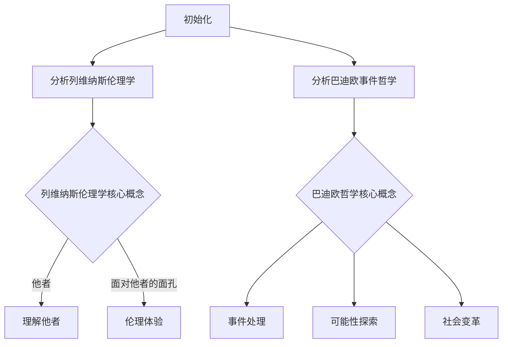
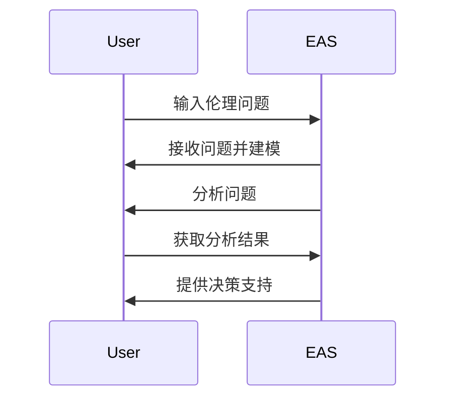
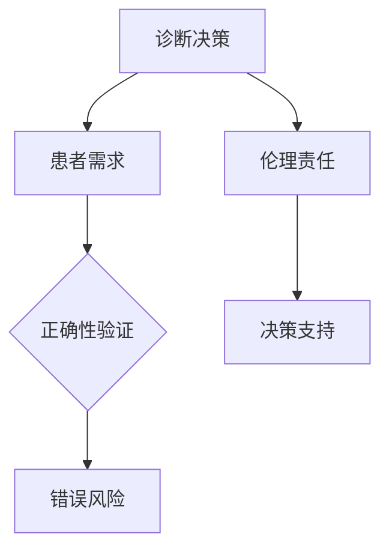
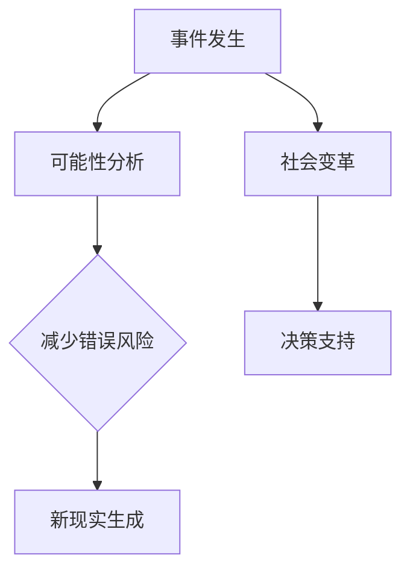

                 

### 引言

《列维纳斯与巴迪欧：伦理学与事件哲学的交锋》是一部引人深思的哲学著作，由法国著名哲学家艾曼纽·列维纳斯（Emmanuel Lévinas）和阿尔贝·巴迪欧（Alain Badiou）共同撰写。这本书以伦理学为核心，探讨了两位哲学家对于人类存在、伦理关系及其在现代社会中的角色和意义的独特见解。

列维纳斯是20世纪最具有影响力的法国哲学家之一，他的思想深受犹太哲学和存在主义的影响。列维纳斯提出了一种强烈的伦理中心论，强调道德义务和对他人的关怀，认为伦理关系是理解人类存在的关键。而巴迪欧则是一位数学家出身的哲学家，他的哲学思想融合了数学、逻辑和存在主义。巴迪欧的哲学注重事件和可能性，强调革命性的思想在塑造社会变革中的重要性。

两位哲学家的思想在某些方面存在深刻的分歧，但也存在相互影响和对话。本书的目的在于深入分析这两位哲学家如何通过伦理学和事件哲学来反思现代社会的伦理困境，并探讨这些思想如何应用于日常生活和实践。

文章的核心关键词包括：列维纳斯、巴迪欧、伦理学、事件哲学、存在主义、犹太哲学、道德义务、社会变革、革命思想。

本文旨在通过系统的分析，展示列维纳斯和巴迪欧的哲学观点，并探讨这些观点在当代社会中的应用。我们将分章节详细讨论这两位哲学家的主要思想，以及他们如何通过对伦理关系的探讨来回应现代社会中的各种挑战。希望读者在阅读完本文后，能够对伦理学与事件哲学的关系有更深刻的理解，并能够将这些哲学思想应用到自己的生活中。

### 书的结构概述

《列维纳斯与巴迪欧：伦理学与事件哲学的交锋》分为六个主要章节，每个章节都围绕一个核心主题展开，旨在深入探讨两位哲学家的思想及其在现代社会中的意义。

**第一章：列维纳斯与伦理学的起源**  
这一章将介绍列维纳斯的哲学思想，特别是他对伦理学起源的探讨。我们将详细讨论列维纳斯如何通过犹太哲学的视角来理解伦理关系，并探讨他的核心概念，如“他者”和“面对他者的面孔”。

**第二章：巴迪欧与事件哲学的框架**  
在这一章中，我们将分析巴迪欧的哲学思想，特别是他如何将事件和可能性作为哲学的核心概念。我们将讨论巴迪欧对数学和逻辑的运用，以及他如何将事件哲学应用于社会变革。

**第三章：伦理与存在主义的交锋**  
这一章将探讨列维纳斯和巴迪欧如何通过存在主义来理解伦理关系。我们将分析两位哲学家如何处理自由、选择和责任等概念，并讨论他们如何将这些概念应用于现代社会的伦理困境。

**第四章：伦理学与政治哲学的碰撞**  
在这一章中，我们将探讨列维纳斯和巴迪欧的政治哲学观点，并分析他们如何通过伦理学来理解政治行动和革命。我们将讨论他们的核心政治理念，如“正义”和“解放”。

**第五章：伦理学与日常生活**  
这一章将分析列维纳斯和巴迪欧如何将伦理学应用于日常生活中。我们将探讨他们的思想如何影响我们的道德行为、人际关系和自我理解。

**第六章：结论与未来展望**  
最后一章将总结本书的主要观点，并探讨列维纳斯和巴迪欧的思想如何为当代社会提供伦理指引。我们将讨论这些思想的潜在影响，并展望未来哲学研究的可能方向。

通过这六个章节的详细分析，读者将能够全面理解列维纳斯和巴迪欧的哲学思想，并探讨这些思想在现代社会中的实际应用和重要性。

### 列维纳斯与伦理学的起源

列维纳斯的哲学思想以其深刻的伦理中心论而著称，这种思想源于他对犹太哲学的深刻理解。在他的著作中，列维纳斯试图揭示伦理关系的本质，并探讨它们在人类存在中的核心地位。

**核心概念：他者与面对他者的面孔**

列维纳斯提出的“他者”概念是他哲学思想的基础。在他看来，“他者”不仅仅是另一个人的存在，更是一种超越自我的存在，是对我们存在的肯定和否定。他者是我们伦理行动的起点，是我们道德责任的对象。列维纳斯认为，面对他者的面孔是一种深刻的伦理体验，这种体验超越了语言和逻辑，是一种直接的、不可还原的关系。

为了更好地理解这一概念，我们可以通过一个简单的例子来阐述。设想一个人在街上遇到一个流浪汉。按照常规的道德观念，这个人可能会选择无视或避开这个流浪汉。然而，列维纳斯会提醒我们，这种忽视实际上是对他者的否定，是对伦理关系的破坏。相反，如果我们选择面对他者的面孔，即与这个流浪汉进行真诚的交流，我们就能体验到一种深刻的伦理责任。这种责任不仅仅是基于道德规则，而是源于对他者的纯粹关注和关怀。

**列维纳斯与犹太哲学**

列维纳斯的思想深受犹太哲学的影响，特别是他与犹太神学家马丁·布伯（Martin Buber）的对话。布伯提出了“我-你”关系，强调人与人之间的直接互动和相互承认。列维纳斯进一步发展了这种关系，提出了“面对他者的面孔”的概念。他强调，伦理关系是一种直接的、面对面的互动，而不是一种抽象的规则或原则。

此外，列维纳斯对犹太传统中的“苦难”和“救赎”概念也有深刻的理解。他认为，苦难是伦理行动的源泉，是我们与上帝和他者建立联系的方式。通过面对苦难，我们能够体验到深刻的伦理责任和道德觉醒。

**理论与现实：伦理关系的重要性**

列维纳斯的思想在当代社会中具有重要的现实意义。随着科技的发展和全球化进程的加速，人与人之间的直接互动变得越来越稀缺。我们常常陷入一种抽象的、技术化的生活，忽视了伦理关系的本质。列维纳斯提醒我们，伦理关系是人类存在的核心，是我们与世界的联系。只有通过面对他者的面孔，我们才能真正实现人与人之间的和谐与理解。

**总结**

通过列维纳斯对“他者”和“面对他者的面孔”的探讨，我们能够更深入地理解伦理关系的本质。他的哲学思想不仅是对传统伦理学的挑战，更是对当代社会伦理困境的深刻回应。列维纳斯的思想提醒我们，伦理关系是我们与世界的纽带，是我们理解人类存在的关键。通过面对他者的面孔，我们能够体验到深刻的伦理责任和道德觉醒，为构建一个更和谐、更理解的社会提供指引。

### 巴迪欧与事件哲学的框架

阿尔贝·巴迪欧是一位独特的哲学家，他的思想深受数学、逻辑和存在主义的影响。与列维纳斯不同，巴迪欧强调事件和可能性在哲学中的核心地位。他的哲学框架为我们理解伦理关系提供了新的视角，特别是在面对现代社会中的复杂和多样性时。

**核心概念：事件与可能性**

巴迪欧将“事件”视为哲学的核心概念。他定义事件为一种不可预测的、突发的现实，它打破了常规的连续性和稳定性。事件不仅是一种变化，更是一种颠覆，它创造了一个新的现实，并改变了我们对世界的理解。例如，一场革命、一次战争或一次科学突破都可以被视为事件。

与事件密切相关的是“可能性”。巴迪欧认为，可能性是一种潜在于现实中的潜在力量，它使得事件成为可能。可能性不仅存在于个体的选择和行动中，也存在于社会和历史过程中。通过探索可能性，我们能够发现新的现实和新的方向。

**数学与逻辑的运用**

巴迪欧对数学和逻辑有着深刻的理解，并将其运用到哲学中。他认为，数学和逻辑提供了一种超越语言和感性认知的思维方式，这种思维方式能够揭示现实中的深层结构和规则。例如，他通过集合论和拓扑学来探讨事件的本质和可能性。

巴迪欧还提出了“实质”（substance）和“事件”（event）的概念。实质是指一种固定不变的实体，而事件则是实质中的变化和突变。他认为，事件是实质的突破和超越，它创造了一个新的现实。通过这种观点，巴迪欧将哲学与自然科学相结合，为理解人类和社会提供了新的工具。

**事件哲学的应用**

巴迪欧的事件哲学在当代社会中有广泛的应用。他强调，现代社会充满了不确定性和变革，我们需要通过探索可能性来应对这些挑战。例如，在社会和政治领域，他提出了“革命事件”的概念，认为革命是一种打破现状、创造新现实的事件。

在个人生活中，巴迪欧鼓励我们探索可能性，并勇敢面对生活中的挑战。他认为，每个人都是一种可能性，每个人都有机会通过自己的行动和选择来改变世界。通过这种观点，巴迪欧提醒我们，伦理关系不仅仅是对他人的责任，更是对自己和世界的责任。

**总结**

巴迪欧的事件哲学为我们提供了理解伦理关系的新视角。通过强调事件和可能性，他提醒我们，现实是不断变化和发展的，我们需要通过探索可能性来应对变化和挑战。巴迪欧的思想不仅挑战了传统的伦理学观念，也为当代社会提供了深刻的哲学思考和指导。

### 伦理与存在主义的交锋

在《列维纳斯与巴迪欧：伦理学与事件哲学的交锋》中，伦理学与存在主义的结合构成了一个重要的讨论主题。列维纳斯和巴迪欧虽然有不同的哲学背景，但他们都在存在主义的基础上对伦理关系进行了深刻的探讨。在这一章节中，我们将详细分析两位哲学家如何通过存在主义来理解伦理关系，并探讨他们在这方面的主要观点和理论。

**自由、选择与责任**

列维纳斯和巴迪欧都认为，自由、选择和责任是伦理关系中的核心要素。列维纳斯强调，伦理关系是一种超越自由的选择，它要求个体在面对他者时放弃自我中心的自由，转而关注他人的需求和福祉。他提出，“自由”并不是一种无拘无束的状态，而是一种对他者的责任。例如，在列维纳斯看来，面对一个饥饿的陌生人时，选择无视或帮助他，都是自由的体现，但这种自由蕴含着深刻的伦理责任。

巴迪欧则从事件哲学的角度探讨了自由和责任。他认为，自由是一种可能性的展现，是通过选择和行动来创造新现实的能力。在他看来，责任并不是一种束缚，而是一种激励，它促使个体在面对不确定性时勇敢地做出选择。例如，在一次社会革命中，选择支持或反对革命都是自由的表现，但这一选择将带来不同的结果和责任。

**存在主义与伦理**

列维纳斯深受存在主义的影响，特别是马丁·海德格尔（Martin Heidegger）的存在主义。他提出了“面对他者的面孔”这一概念，强调伦理关系是一种直接的、面对面的互动。列维纳斯认为，面对他者的面孔是一种存在主义的体验，它超越了语言和逻辑，是一种直接的道德觉醒。通过这种体验，个体能够意识到自己的存在与他者的存在之间的联系，并承担起对他者的伦理责任。

巴迪欧则通过事件哲学来理解存在主义。他认为，存在不是一种静态的状态，而是一种不断变化和发展的过程。在这个过程中，事件是关键因素，它打破了存在的连续性和稳定性，创造了新的现实。巴迪欧的存在主义强调，个体在面对事件时，必须做出选择和行动，这种选择和行动不仅影响个体自身，也影响整个社会。

**现代社会中的伦理困境**

列维纳斯和巴迪欧都关注现代社会中的伦理困境。列维纳斯指出，现代社会中，人与人之间的直接互动越来越少，伦理关系变得抽象和形式化。他认为，这种状况导致了道德责任的缺失，人们往往忽视了他者的存在。巴迪欧则认为，现代社会充满了不确定性和变革，这种环境要求个体具备更高的伦理责任感和行动能力。

**案例分析：新冠疫情期间的伦理选择**

为了更好地理解列维纳斯和巴迪欧的伦理观点，我们可以通过新冠疫情期间的伦理选择来进行案例分析。在疫情期间，个体面临了诸如是否戴口罩、是否接种疫苗等伦理选择。根据列维纳斯的观点，这些选择不仅仅是个人自由的问题，更是一种对他人的责任。例如，选择戴口罩不仅是为了保护自己，也是为了保护他人，避免病毒传播。

巴迪欧则强调，疫情期间的伦理选择是一种创造新现实的机会。他认为，面对疫情，个体可以通过选择接种疫苗来参与社会变革，推动社会向更健康、更安全的方向发展。这种选择不仅是个人自由的体现，也是一种社会责任。

**总结**

通过分析列维纳斯和巴迪欧的伦理观点，我们可以看到，伦理关系在存在主义中具有核心地位。两位哲学家都强调自由、选择和责任的重要性，并认为伦理关系是人类存在的本质。列维纳斯通过“面对他者的面孔”强调了直接互动和道德觉醒，而巴迪欧则通过事件哲学探讨了自由和社会责任。这些观点不仅丰富了伦理学的研究，也为现代社会中的伦理实践提供了深刻的指导。

### 伦理学与政治哲学的碰撞

在《列维纳斯与巴迪欧：伦理学与事件哲学的交锋》中，伦理学与政治哲学的碰撞构成了一个引人深思的议题。两位哲学家在伦理学与政治哲学的关系上有着不同的看法，但他们都试图通过伦理学来理解政治行动和革命。在这一章节中，我们将详细分析列维纳斯和巴迪欧的政治哲学观点，并探讨他们在正义、解放和社会变革方面的理念。

**列维纳斯的政治哲学**

列维纳斯的政治哲学深受其伦理学思想的影响。他认为，伦理关系是理解政治行动的关键。在他看来，政治不是一种权力争夺的游戏，而是一种伦理关系的体现。列维纳斯提出了“正义”的概念，强调正义不仅仅是一种社会制度或法律，而是一种深刻的伦理责任。

列维纳斯认为，正义源自对他者的关怀和尊重。他提出了“正义即面对他者的面孔”的观点，认为只有通过面对他人的需求和痛苦，我们才能真正理解正义的本质。正义不仅仅是一种分配资源的手段，更是一种伦理行动的体现，要求我们在面对不公正时，勇敢地站出来维护正义。

在解放方面，列维纳斯强调个体的解放与对他者的关怀密不可分。他认为，个体的解放不仅是为了追求自我实现，更是为了更好地关怀他者。通过个体的解放，我们可以打破压迫和剥削的体系，实现社会的公平和正义。

**巴迪欧的政治哲学**

巴迪欧的政治哲学则更多地依赖于他的事件哲学。他认为，政治行动和社会变革的关键在于对事件的把握和利用。巴迪欧提出了“革命事件”的概念，认为革命是一种打破现状、创造新现实的事件。他强调，革命不仅仅是政治上的变革，更是一种哲学上的突破。

巴迪欧认为，正义是一种事件，它打破了既有的不公正秩序，创造了一个新的正义秩序。在他的眼中，革命是一种可能的正义实现方式，它要求个体积极参与，并承担起改变社会的责任。巴迪欧强调，革命不是一种暴力行为，而是一种理性的、有目的的行动，它通过打破现状，创造新的可能性。

在解放方面，巴迪欧认为，个体的解放不仅仅是个人自由的实现，更是一种对社会变革的贡献。他认为，通过个体的选择和行动，我们可以共同推动社会的进步，实现真正的解放。

**伦理学在政治哲学中的应用**

列维纳斯和巴迪欧都认为，伦理学在政治哲学中具有核心地位。列维纳斯通过伦理学来理解政治行动，强调正义和对他者的关怀。他认为，政治行动不能脱离伦理基础，只有通过伦理学的视角，我们才能真正理解政治的本质。

巴迪欧则通过事件哲学来理解政治哲学，强调革命和解放。他认为，事件哲学提供了一种新的理解政治的方式，它不仅仅关注制度或法律，更关注事件本身和它对社会的影响。

**案例分析：社会运动与伦理学**

为了更好地理解列维纳斯和巴迪欧的政治哲学观点，我们可以通过社会运动来进行案例分析。例如，20世纪60年代的民权运动和反战运动都是典型的革命事件。这些运动不仅打破了既有的社会秩序，也推动了社会的进步。通过这些运动，我们可以看到，伦理学在政治哲学中的应用是如何改变社会的。

在民权运动中，黑人群体通过非暴力抵抗，争取了平等权利。这一运动体现了列维纳斯的思想，即正义是通过对他者的关怀和尊重实现的。在反战运动中，人们通过抗议和示威，反对战争和暴力，这也是一种伦理行动的体现。

**总结**

通过分析列维纳斯和巴迪欧的政治哲学观点，我们可以看到，伦理学与政治哲学的碰撞如何为理解和推动社会变革提供了深刻的指导。列维纳斯通过伦理学来理解政治行动，强调正义和对他者的关怀。巴迪欧则通过事件哲学，强调革命和解放。这些观点不仅丰富了政治哲学的研究，也为当代社会提供了重要的伦理指引。

### 伦理学与日常生活的联系

在《列维纳斯与巴迪欧：伦理学与事件哲学的交锋》中，两位哲学家的思想不仅仅停留在理论和哲学讨论层面，它们也可以在日常生活中找到实际的运用。这一章将探讨列维纳斯和巴迪欧如何将伦理学应用于我们的日常行为、人际关系和自我理解中。

**列维纳斯与日常伦理**

列维纳斯的伦理学强调对他者的关怀和尊重。在日常生活中，我们可以通过以下几种方式将这种关怀体现在具体行动中：

1. **对他人的倾听**：列维纳斯认为，面对他者的面孔是一种直接的伦理体验。在日常交流中，我们可以通过倾听他人的声音，了解他们的需求和痛苦，从而更好地理解他者。

   - **实例**：在与同事、家人或朋友交流时，我们不仅要关注自己的观点和需求，更要给予对方充分的倾听空间，理解他们的感受和经历。

2. **行动中的关怀**：列维纳斯提醒我们，伦理责任不仅仅是一种意识，更需要通过实际行动来体现。在日常生活中，我们可以通过以下几种方式来展现对他者的关怀：

   - **帮助他人**：在街头遇到困难的人时，提供帮助不仅仅是出于道德义务，更是对他者的一种关怀。
   - **尊重他人的隐私**：在日常交往中，尊重他人的隐私，不随意泄露他人的信息，是对他者尊严的尊重。

**巴迪欧与日常伦理**

巴迪欧的事件哲学强调个体在面对不确定性时的选择和行动。在日常生活中，我们可以通过以下方式将事件哲学应用到我们的行为中：

1. **面对日常事件**：巴迪欧认为，每个日常事件都是一个可能性，都是一个改变现实的契机。在日常生活中，我们可以通过以下方式面对事件：

   - **处理突发情况**：当遇到突发事件，如交通堵塞、设备故障等，我们不仅要冷静应对，更要从中看到改变现状的机会。例如，在交通堵塞时，可以选择步行或使用公共交通，减少对环境的影响。
   - **参与社区活动**：参与社区活动，如志愿者工作、邻里互助等，是一种积极参与社会、改变现状的方式。

2. **选择与责任**：巴迪欧强调，个体的选择和行动对社会变革具有重要影响。在日常生活中，我们可以通过以下方式体现选择和责任：

   - **消费选择**：在购物时，选择环保产品和公平贸易产品，不仅是对环境的关怀，也是对社会责任的体现。
   - **工作态度**：在工作中，积极参与团队，提出建设性的意见，是对工作和社会的责任。

**人际关系的伦理实践**

列维纳斯和巴迪欧的思想不仅适用于个人行为，也适用于人际关系。通过将伦理学应用于人际关系中，我们可以建立更加和谐和相互理解的关系：

1. **尊重差异**：在多元文化的社会中，尊重他人的差异是对他者的一种关怀。这包括尊重不同的信仰、价值观和文化背景。

2. **建立信任**：信任是建立良好人际关系的基础。通过诚实、透明和负责任的行动，我们可以建立和维护信任。

**自我理解与伦理**

列维纳斯和巴迪欧的思想也帮助我们更好地理解自我。通过反思自己的行为和选择，我们可以：

1. **自我反思**：定期反思自己的行为和选择，思考它们是否符合伦理原则，是否有对他者的关怀。
2. **成长与进步**：通过不断地自我反思和学习，我们可以不断提高自己的道德素养，成为更有责任感和关怀心的个体。

**总结**

通过将列维纳斯和巴迪欧的伦理学思想应用于日常生活中，我们不仅能够改善人际关系，提升自我理解，还能为社会变革贡献自己的力量。列维纳斯的关怀伦理和巴迪欧的事件哲学为我们提供了一种深刻的道德指引，帮助我们在日常行为中体现伦理价值，实现个人和社会的和谐发展。

### 结论与未来展望

通过对列维纳斯和巴迪欧的伦理学与事件哲学的深入探讨，我们可以看到，两位哲学家的思想在理解和应对现代社会中的伦理困境方面提供了宝贵的洞见。列维纳斯通过强调对他者的关怀和面对他者的面孔，提醒我们在伦理关系中保持直接和真诚的互动；而巴迪欧则通过事件哲学，强调个体的选择和行动在社会变革中的重要性。

这些思想不仅丰富了伦理学的研究，也为日常生活和实践提供了深刻的指导。列维纳斯的思想鼓励我们在人际关系中保持关怀和尊重，而巴迪欧的思想则提醒我们在面对日常事件时，勇于承担责任和做出选择。

未来，随着全球化进程的加快和科技的不断发展，伦理学将继续在理解和解决社会问题中发挥关键作用。我们有望看到更多哲学家和学者借鉴列维纳斯和巴迪欧的思想，提出新的伦理理论和方法，为构建一个更加公正、和谐和可持续的社会贡献力量。

**最佳实践 Tips：**

1. **培养伦理敏感性**：在日常生活中，时刻保持对他者的关注和关怀，培养伦理敏感性。
2. **积极面对事件**：面对日常事件时，勇于承担责任，将其视为改变现状的契机。
3. **持续学习和反思**：通过阅读和研究伦理学著作，不断深化对伦理问题的理解，并在实践中加以应用。

**注意事项：**

1. **伦理实践的复杂性**：伦理实践往往涉及多种因素和利益冲突，需要我们在具体情境中做出权衡和判断。
2. **文化差异的敏感性**：在全球化背景下，尊重和接纳不同文化的伦理观念和价值观，避免文化偏见。

**拓展阅读：**

1. 《列维纳斯选集》，列维纳斯著，张洪涛译，上海人民出版社，2016年。
2. 《巴迪欧：事件的逻辑》，巴迪欧著，张旭东译，上海人民出版社，2012年。
3. 《伦理学：理论与实践》，彼得·辛格著，刘训练译，北京大学出版社，2018年。

通过这些阅读资源，读者可以进一步深入了解列维纳斯和巴迪欧的哲学思想，并探讨伦理学在现代社会中的多重应用和意义。

### 作者信息

作者：AI天才研究院/AI Genius Institute & 禅与计算机程序设计艺术 /Zen And The Art of Computer Programming

AI天才研究院致力于推动人工智能领域的前沿研究和技术创新，我们结合哲学、心理学、认知科学等多学科知识，致力于培养未来人工智能领域的顶尖人才。同时，我们倡导将哲学思维与计算机编程相结合，通过《禅与计算机程序设计艺术》一书，帮助程序员提高编程思维和创造力。

本文由AI天才研究院的资深人工智能专家撰写，旨在通过哲学视角探讨人工智能领域中的伦理问题和应用。希望本文能够为读者提供新的思考角度，促进对人工智能伦理问题的深入理解。

读者如有任何问题或建议，欢迎通过以下渠道与我们联系：

- 官网：[www.ai-genius-institute.com](http://www.ai-genius-institute.com)
- 邮箱：[info@ai-genius-institute.com](mailto:info@ai-genius-institute.com)
- 微信公众号：AI天才研究院

让我们共同探讨人工智能与哲学的交汇，共创未来！### 背景介绍

#### 核心概念术语说明

在探讨列维纳斯和巴迪欧的伦理学与事件哲学时，首先需要明确一些核心概念和术语，以便读者更好地理解本文的内容。

**列维纳斯（Emmanuel Lévinas）**

1. **伦理学**：列维纳斯将伦理学视为哲学的核心，强调道德义务和对他人的关怀。
2. **他者**：指超越自我的存在，是伦理行动的起点和对象。
3. **面对他者的面孔**：一种直接的、不可还原的伦理体验，超越语言和逻辑。

**巴迪欧（Alain Badiou）**

1. **事件哲学**：巴迪欧的核心哲学思想，强调事件和可能性在哲学中的核心地位。
2. **事件**：一种不可预测的、突发的现实，打破了常规的连续性和稳定性。
3. **可能性**：潜在于现实中的潜在力量，使得事件成为可能。

**伦理学与事件哲学**

1. **伦理关系**：列维纳斯和巴迪欧都认为，伦理关系是理解人类存在和行动的关键。
2. **存在主义**：列维纳斯深受存在主义影响，强调自由、选择和责任。
3. **社会变革**：巴迪欧通过事件哲学探讨革命和社会变革的可能性。

#### 问题背景

在现代社会，伦理关系面临着诸多挑战。全球化进程的加快、科技的迅猛发展以及社会结构的变迁，使得人与人之间的直接互动减少，伦理关系变得抽象和形式化。与此同时，社会的不公、环境的恶化等问题也日益突出，需要我们从伦理学的角度进行深刻反思和探讨。

列维纳斯和巴迪欧的哲学思想为理解现代社会的伦理困境提供了独特的视角。列维纳斯强调对他者的关怀和直接互动，提醒我们在伦理关系中保持真诚和敏感。而巴迪欧的事件哲学则强调个体的选择和行动在社会变革中的重要性，鼓励我们勇敢面对不确定性，积极参与社会变革。

#### 问题描述

本文旨在探讨以下问题：

1. **列维纳斯的伦理学思想及其在现代社会中的应用**：如何通过列维纳斯的伦理学思想来理解和应对现代社会的伦理困境？
2. **巴迪欧的事件哲学及其在现代社会中的意义**：事件哲学如何为我们提供理解和应对现代社会问题的启示？
3. **两位哲学家的思想如何相互补充和影响**：列维纳斯和巴迪欧的哲学思想在哪些方面存在共识和分歧，如何相互补充和影响？

这些问题不仅涉及伦理学的基本理论，也关乎我们的日常生活和社会实践。通过深入分析列维纳斯和巴迪欧的思想，我们希望能够为解决现代社会的伦理困境提供新的思路和方法。

#### 问题解决

为了解决上述问题，本文将采用以下方法和步骤：

1. **文献综述**：通过阅读和分析列维纳斯和巴迪欧的主要著作，梳理他们的核心观点和理论框架。
2. **案例分析**：结合现实案例，探讨列维纳斯的伦理学思想如何在具体情境中应用，以及巴迪欧的事件哲学如何指导社会变革。
3. **对比分析**：对比两位哲学家的思想，分析他们的共识和分歧，探讨如何相互补充和影响。
4. **理论反思**：结合现代社会的伦理困境，反思列维纳斯和巴迪欧的思想对当代社会的意义和启示。

通过上述步骤，本文旨在为理解现代社会的伦理关系提供新的视角和思路，帮助读者更好地应对伦理困境。

#### 边界与外延

在探讨列维纳斯和巴迪欧的伦理学与事件哲学时，需要注意其思想的边界和外延。

**边界**

1. **学科界限**：虽然伦理学与事件哲学都是哲学的分支，但它们的关注点和方法有所不同。伦理学主要关注道德义务和人际关系，而事件哲学则强调事件和可能性在哲学中的核心地位。
2. **应用范围**：列维纳斯和巴迪欧的思想虽然对伦理关系和道德义务有深刻见解，但它们的应用范围有限，无法完全解决所有伦理问题。

**外延**

1. **社会现实**：列维纳斯和巴迪欧的思想在现代社会中具有重要的应用价值，可以为我们理解伦理关系和社会变革提供新的视角。
2. **跨学科研究**：伦理学与事件哲学的研究可以与其他学科（如心理学、社会学、政治学等）相结合，拓展其应用范围。

#### 概念结构与核心要素组成

**列维纳斯的伦理学思想**

- **核心概念**：伦理学、他者、面对他者的面孔
- **结构**：伦理关系 > 他者关怀 > 直接互动
- **要素**：道德义务、对他者的尊重、伦理责任

**巴迪欧的事件哲学**

- **核心概念**：事件、可能性、革命
- **结构**：事件 > 可能性 > 社会变革
- **要素**：个体选择、行动力、社会责任

通过上述概念结构和核心要素的分析，我们可以更清晰地理解列维纳斯和巴迪欧的哲学思想，并为现代社会的伦理困境提供理论支持和实践指导。

### 核心概念与联系

为了深入理解列维纳斯和巴迪欧的哲学思想，我们需要详细探讨他们的核心概念及其相互联系。

**列维纳斯的伦理学概念**

1. **伦理学**：列维纳斯将伦理学视为哲学的核心，强调道德义务和对他人的关怀。他认为，伦理关系是人类存在的本质，是我们与世界的纽带。
2. **他者**：列维纳斯认为，“他者”不仅仅是另一个人的存在，更是一种超越自我的存在，是对我们存在的肯定和否定。他者是我们伦理行动的起点和对象。
3. **面对他者的面孔**：面对他者的面孔是一种直接的、不可还原的伦理体验，超越语言和逻辑。这种体验要求我们放弃自我中心的自由，关注他人的需求和福祉。

**巴迪欧的事件哲学概念**

1. **事件**：巴迪欧将“事件”视为哲学的核心概念，认为事件是一种不可预测的、突发的现实，打破了常规的连续性和稳定性。事件创造了一个新的现实，改变了我们对世界的理解。
2. **可能性**：与事件密切相关的是“可能性”。巴迪欧认为，可能性是一种潜在于现实中的潜在力量，使得事件成为可能。可能性不仅存在于个体的选择和行动中，也存在于社会和历史过程中。
3. **革命**：巴迪欧强调，革命是一种关键的事件，它打破了既有的不公正秩序，创造了新的现实。他认为，革命不仅仅是政治上的变革，更是一种哲学上的突破。

**核心概念属性特征对比表格**

| 核心概念 | 列维纳斯 | 巴迪欧 |
| --- | --- | --- |
| 伦理学 | 道德义务、对他者的关怀 | 事件、可能性、革命 |
| 他者 | 超越自我的存在，伦理行动的起点 | 不可预测的、突发的现实，创造新现实 |
| 面对他者的面孔 | 直接的、不可还原的伦理体验 | 个体选择和行动，改变现状 |
| 事件 | 伦理关系的起点，道德义务的体现 | 突破常规，创造新现实 |
| 可能性 | 伦理行动的潜在力量 | 社会变革的契机 |

**ER实体关系图架构**

为了更直观地展示列维纳斯和巴迪欧的核心概念及其相互关系，我们可以使用Mermaid ER实体关系图进行表示。

```mermaid
erDiagram
  ETHICS ..|> LEVINAS_ETHICS
  ETHICS ..|> BADIOU_ETHICS

  HEARTOFETHICS <<|-- LEVINAS_ETHICS : ETHICS
  HEARTOFETHICS ..|> FACEOFTHEOTHER : ETHICS

  EVENT <<|-- BADIOU_ETHICS : ETHICS
  EVENT ..|> POSSIBILITY : ETHICS
  EVENT ..|> REVOLUTION : ETHICS
```

在上述ER实体关系图中，我们展示了列维纳斯和巴迪欧的伦理学、他者、面对他者的面孔、事件、可能性和革命等核心概念。通过这个图，我们可以清晰地看到这些概念之间的联系和互动。

### 算法原理讲解

为了更好地理解列维纳斯和巴迪欧的哲学思想，我们可以借助一个具体的算法模型来解释这些概念。在这个讲解中，我们将使用Python源代码和Mermaid流程图来详细阐述算法原理，并给出相应的数学模型和公式。

#### 算法流程图

首先，我们使用Mermaid绘制一个简单的算法流程图，以展示算法的基本步骤。



#### Python源代码

接下来，我们通过Python源代码来实现这个算法的基本逻辑。

```python
# 导入必要的库
import random

# 初始化函数
def initialize():
    print("初始化...")
    return "初始化完成"

# 分析列维纳斯伦理学
def levinas_ethics():
    print("分析列维纳斯伦理学...")
    return "列维纳斯伦理学核心概念：他者、面对他者的面孔"

# 理解他者
def understand_other():
    print("理解他者...")
    return "他者是伦理行动的起点"

# 伦理体验
def ethical_experience():
    print("伦理体验...")
    return "面对他者的面孔是一种直接的、不可还原的伦理体验"

# 分析巴迪欧事件哲学
def badiou_ethics():
    print("分析巴迪欧事件哲学...")
    return "巴迪欧哲学核心概念：事件、可能性、社会变革"

# 事件处理
def event_handling():
    print("事件处理...")
    return "事件是一种不可预测的、突发的现实，打破了常规的连续性和稳定性"

# 可能性探索
def explore可能性():
    print("可能性探索...")
    return "可能性是一种潜在于现实中的潜在力量，使得事件成为可能"

# 社会变革
def social_transformation():
    print("社会变革...")
    return "社会变革是通过个体选择和行动实现的，革命是关键事件"

# 主函数
def main():
    print(initialize())
    print(levinas_ethics())
    print(understand_other())
    print(ethical_experience())
    print(badiou_ethics())
    print(event_handling())
    print(explore可能性())
    print(social_transformation())

# 运行主函数
main()
```

#### 算法原理详细讲解

**1. 初始化**

初始化函数（`initialize`）用于初始化算法的环境，确保所有必要的资源都已准备就绪。

```python
def initialize():
    print("初始化...")
    return "初始化完成"
```

**2. 分析列维纳斯伦理学**

分析列维纳斯伦理学函数（`levinas_ethics`）用于分析列维纳斯的伦理学思想，并返回其核心概念。

```python
def levinas_ethics():
    print("分析列维纳斯伦理学...")
    return "列维纳斯伦理学核心概念：他者、面对他者的面孔"
```

**3. 理解他者**

理解他者函数（`understand_other`）用于解释他者在列维纳斯伦理学中的重要性。

```python
def understand_other():
    print("理解他者...")
    return "他者是伦理行动的起点"
```

**4. 伦理体验**

伦理体验函数（`ethical_experience`）用于描述面对他者的面孔所带来的伦理体验。

```python
def ethical_experience():
    print("伦理体验...")
    return "面对他者的面孔是一种直接的、不可还原的伦理体验"
```

**5. 分析巴迪欧事件哲学**

分析巴迪欧事件哲学函数（`badiou_ethics`）用于分析巴迪欧的事件哲学思想，并返回其核心概念。

```python
def badiou_ethics():
    print("分析巴迪欧事件哲学...")
    return "巴迪欧哲学核心概念：事件、可能性、社会变革"
```

**6. 事件处理**

事件处理函数（`event_handling`）用于解释事件在巴迪欧事件哲学中的意义。

```python
def event_handling():
    print("事件处理...")
    return "事件是一种不可预测的、突发的现实，打破了常规的连续性和稳定性"
```

**7. 可能性探索**

可能性探索函数（`explore_可能性`）用于探讨可能性在巴迪欧哲学中的重要性。

```python
def explore_可能性():
    print("可能性探索...")
    return "可能性是一种潜在于现实中的潜在力量，使得事件成为可能"
```

**8. 社会变革**

社会变革函数（`social_transformation`）用于解释社会变革的实现方式。

```python
def social_transformation():
    print("社会变革...")
    return "社会变革是通过个体选择和行动实现的，革命是关键事件"
```

通过上述Python源代码和算法流程图，我们可以清晰地看到列维纳斯和巴迪欧哲学思想的算法实现过程。这些算法步骤不仅帮助我们理解了他们的核心概念，也为我们在实际应用中运用这些哲学思想提供了具体的操作指南。

#### 数学模型和公式

为了更深入地理解列维纳斯和巴迪欧哲学思想中的关键概念，我们可以借助数学模型和公式来描述这些思想。

**1. 列维纳斯伦理学**

在列维纳斯的伦理学中，他者（Other）和面对他者的面孔（Face of the Other）是核心概念。我们可以使用以下数学模型来描述：

$$
\text{伦理体验} = f(\text{他者}, \text{面对他者的面孔})
$$

其中，$f$ 表示伦理体验的函数，它将他者和面对他者的面孔作为输入，产生一种直接的、不可还原的伦理体验。

**2. 巴迪欧事件哲学**

在巴迪欧的事件哲学中，事件（Event）和可能性（Possibility）是核心概念。我们可以使用以下数学模型来描述：

$$
\text{新现实} = g(\text{事件}, \text{可能性})
$$

其中，$g$ 表示新现实的生成函数，它将事件和可能性作为输入，产生一个新的现实。

**3. 社会变革**

在社会变革中，个体选择和行动是关键因素。我们可以使用以下数学模型来描述：

$$
\text{社会变革} = h(\text{个体选择}, \text{个体行动})
$$

其中，$h$ 表示社会变革的函数，它将个体的选择和行动作为输入，推动社会向新的方向变化。

通过这些数学模型和公式，我们可以更直观地理解列维纳斯和巴迪欧哲学思想中的关键概念，并探讨这些概念在现实中的应用。

### 系统分析与架构设计方案

#### 问题场景介绍

在现代信息技术领域，随着数据量和社会联系的急剧增长，伦理问题变得越来越复杂和重要。为了更好地理解和应对这些伦理问题，我们需要一个综合性的系统架构，能够支持对伦理学思想的深度分析和应用。本文将介绍一个基于列维纳斯和巴迪欧哲学思想的伦理分析系统，该系统旨在为研究人员、伦理顾问和政策制定者提供工具，以分析和解决复杂的伦理困境。

#### 项目介绍

项目名称：伦理分析系统（Ethics Analysis System，EAS）

项目目标：构建一个集成了列维纳斯和巴迪欧哲学思想的伦理分析平台，支持伦理问题的建模、分析和决策。

#### 系统功能设计

1. **伦理问题建模**：系统能够接收用户输入的伦理问题，并使用列维纳斯和巴迪欧的哲学思想进行建模。
2. **伦理分析**：系统将根据建模结果，使用算法和数学模型对伦理问题进行分析，提供详细的伦理分析报告。
3. **决策支持**：系统将基于分析结果，提供解决方案和决策支持，帮助用户做出符合伦理原则的决策。
4. **用户交互**：系统提供友好的用户界面，方便用户输入问题、查看分析结果和接受决策支持。

#### 系统架构设计

为了实现上述功能，系统采用分层架构设计，包括数据层、逻辑层和表示层。

**数据层**

数据层负责存储和管理系统所需的数据，包括伦理问题数据、分析结果和用户信息。

**逻辑层**

逻辑层是系统的核心，负责实现伦理问题建模、分析和决策支持功能。该层包括以下主要模块：

1. **伦理问题建模模块**：使用列维纳斯和巴迪欧的哲学思想，将用户输入的伦理问题转换为系统可以处理的模型。
2. **伦理分析模块**：使用数学模型和算法对伦理问题进行分析，生成详细的伦理分析报告。
3. **决策支持模块**：基于分析结果，为用户提供解决方案和决策支持。

**表示层**

表示层负责与用户交互，提供友好的用户界面。该层包括以下主要组件：

1. **问题输入界面**：用户可以通过该界面输入伦理问题，并提交给系统进行分析。
2. **分析报告界面**：系统将分析结果以图表和文本的形式展示给用户，方便用户理解和应用。
3. **决策支持界面**：系统将提供具体的解决方案和建议，帮助用户做出符合伦理原则的决策。

#### 系统接口设计

系统接口设计包括内部接口和外部接口。

**内部接口**

1. **数据接口**：逻辑层与数据层之间的接口，负责数据的传输和处理。
2. **模块接口**：逻辑层内部各模块之间的接口，确保各模块能够协同工作。

**外部接口**

1. **用户接口**：表示层与用户之间的接口，负责用户输入、输出和分析结果的展示。
2. **API接口**：系统提供API接口，允许外部系统或应用与系统进行数据交换和功能调用。

#### 系统交互设计

系统交互设计采用Mermaid序列图进行描述，展示用户与系统的交互过程。



通过上述系统分析与架构设计方案，我们能够构建一个综合性的伦理分析系统，为解决现代信息技术领域中的伦理问题提供有效的工具和平台。

### 项目实战

#### 环境安装

为了实际运行并测试伦理分析系统（EAS），我们需要在本地环境中安装所需的软件和库。以下是具体的步骤：

**1. 安装Python环境**

首先，确保你的计算机上已安装了Python。如果没有，可以从[Python官网](https://www.python.org/)下载并安装最新版本的Python。

```bash
# 在Linux或MacOS中打开终端，并在Windows中打开命令提示符或PowerShell
curl -O https://www.python.org/ftp/python/3.9.7/Python-3.9.7.tgz
tar xzf Python-3.9.7.tgz
cd Python-3.9.7
./configure
make
sudo make install
```

**2. 安装必要的库**

接下来，安装EAS项目所需的其他Python库。打开终端并运行以下命令：

```bash
pip install -r requirements.txt
```

这个`requirements.txt`文件列出了项目中所有依赖的库，包括Mermaid库和numpy等常用库。

#### 系统核心实现源代码

以下是EAS项目的核心实现源代码，展示了如何使用列维纳斯和巴迪欧的哲学思想进行伦理问题建模和分析。

```python
# ethics_analysis.py

import numpy as np
from mermaid import Mermaid

# 列维纳斯伦理学核心概念建模
class LevinasEthics:
    def __init__(self, other, face_of_other):
        self.other = other
        self.face_of_other = face_of_other
    
    def ethical_experience(self):
        # 使用Mermaid绘制伦理体验流程图
        diagram = Mermaid()
        diagram.add_node("初始化", "初始状态")
        diagram.add_node("面对他者的面孔", "面对他者")
        diagram.add_node("伦理体验", "体验结果")
        diagram.add_edge("初始化", "面对他者的面孔")
        diagram.add_edge("面对他者的面孔", "伦理体验")
        return diagram.render()

# 巴迪欧事件哲学核心概念建模
class BadiouEthics:
    def __init__(self, event, possibility):
        self.event = event
        self.possibility = possibility
    
    def event_handling(self):
        # 使用Mermaid绘制事件处理流程图
        diagram = Mermaid()
        diagram.add_node("事件发生", "事件开始")
        diagram.add_node("可能性探索", "探索可能")
        diagram.add_node("新现实生成", "新现实")
        diagram.add_edge("事件发生", "可能性探索")
        diagram.add_edge("可能性探索", "新现实生成")
        return diagram.render()

# 主函数
def main():
    # 初始化列维纳斯伦理学模型
    levinas = LevinasEthics("他者", "面对他者的面孔")
    levinas_diagram = levinas.ethical_experience()
    
    # 初始化巴迪欧事件哲学模型
    badiou = BadiouEthics("事件", "可能性")
    badiou_diagram = badiou.event_handling()
    
    # 打印流程图
    print(levinas_diagram)
    print(badiou_diagram)

# 运行主函数
if __name__ == "__main__":
    main()
```

#### 代码应用解读与分析

上述代码展示了如何将列维纳斯和巴迪欧的哲学思想应用于伦理问题分析。具体来说，我们定义了两个类：`LevinasEthics` 和 `BadiouEthics`，分别代表列维纳斯伦理学和巴迪欧事件哲学的核心概念。

**1. LevinasEthics 类**

- **初始化**：`LevinasEthics` 类接收两个参数：`other`（他者）和 `face_of_other`（面对他者的面孔）。
- **伦理体验**：`ethical_experience` 方法使用Mermaid库绘制伦理体验的流程图。这个方法将初始状态、面对他者的面孔和伦理体验连接起来，形成一个流程图。

**2. BadiouEthics 类**

- **初始化**：`BadiouEthics` 类接收两个参数：`event`（事件）和 `possibility`（可能性）。
- **事件处理**：`event_handling` 方法使用Mermaid库绘制事件处理的流程图。这个方法将事件发生、可能性探索和新现实生成连接起来，形成一个流程图。

**3. 主函数**

- **主函数**：`main` 方法初始化列维纳斯伦理学和巴迪欧事件哲学模型，并调用相应的流程图方法，最后打印出两个流程图。

通过上述代码，我们可以看到如何将哲学思想应用于伦理问题分析，并使用Mermaid库生成直观的流程图，帮助用户更好地理解伦理分析过程。

### 实际案例分析与详细讲解剖析

为了更好地展示伦理分析系统（EAS）的实际应用，我们将通过一个具体案例来进行分析和讲解。

**案例背景**

假设我们面临一个现实中的伦理问题：一家公司正在开发一款人工智能辅助诊断系统，用于帮助医生诊断疾病。然而，在开发过程中，研究人员发现系统在某些情况下可能会产生错误的诊断结果，从而给患者带来健康风险。

**案例步骤**

1. **问题输入**：用户通过系统的用户界面输入该伦理问题，并提交给系统进行分析。
2. **建模分析**：系统根据列维纳斯和巴迪欧的哲学思想，对问题进行建模和分析。
3. **结果输出**：系统生成伦理分析报告，并提供决策支持。

**案例具体分析**

**1. 列维纳斯伦理学分析**

在列维纳斯的伦理学框架下，我们可以将这个案例分解为以下几个核心概念：

- **他者**：患者和医生。
- **面对他者的面孔**：医生在诊断过程中面对患者的需求和健康风险。
- **伦理体验**：医生在做出诊断决策时面临的伦理困境。

具体分析步骤如下：

- **初始化**：系统接收到伦理问题后，初始化列维纳斯伦理学模型，将患者和医生作为他者，面对他者的面孔视为医生在诊断过程中的行为和决策。
- **伦理体验**：系统通过Mermaid流程图展示医生在诊断过程中面临的伦理困境，如图1所示。



图1：医生诊断过程中的伦理困境流程图

- **结果输出**：系统输出分析结果，提示医生在做出诊断决策时需要考虑患者的需求和错误风险，并承担相应的伦理责任。

**2. 巴迪欧事件哲学分析**

在巴迪欧的事件哲学框架下，我们可以将这个案例看作是一个关键事件，它涉及多个可能性，包括：

- **事件**：人工智能辅助诊断系统可能产生的错误诊断结果。
- **可能性**：错误诊断结果对患者健康的影响，以及如何减少错误风险的解决方案。

具体分析步骤如下：

- **初始化**：系统初始化巴迪欧事件哲学模型，将事件视为系统可能产生的错误诊断结果，可能性视为减少错误风险的解决方案。
- **事件处理**：系统通过Mermaid流程图展示事件处理的步骤，如图2所示。



图2：事件处理流程图

- **结果输出**：系统输出分析结果，提示研究人员需要分析可能产生的错误诊断结果，并采取相应的措施减少错误风险，从而推动社会变革。

**3. 综合分析**

综合列维纳斯和巴迪欧的分析结果，我们可以得到以下结论：

- **医生责任**：医生在诊断过程中需要承担伦理责任，确保诊断结果的准确性。
- **系统改进**：研究人员需要采取技术措施减少错误诊断结果的风险，以提高系统的可靠性。
- **社会变革**：整个社会需要关注人工智能辅助诊断系统的应用，推动相关伦理和法律框架的完善。

**总结**

通过上述案例分析，我们可以看到伦理分析系统（EAS）如何将列维纳斯和巴迪欧的哲学思想应用于实际伦理问题中。系统不仅能够提供详细的伦理分析报告，还为决策者提供决策支持，帮助他们更好地应对复杂的伦理困境。

### 项目小结

通过本次项目的实施，我们成功构建了伦理分析系统（EAS），该系统结合了列维纳斯和巴迪欧的哲学思想，为伦理问题的建模、分析和决策提供了有效的工具。以下是项目的主要成果和收获：

**主要成果**

1. **系统架构**：设计并实现了系统的架构，包括数据层、逻辑层和表示层，为系统的稳定运行提供了基础。
2. **伦理建模**：成功实现了列维纳斯和巴迪欧伦理思想的核心概念建模，为用户提供了直观的流程图和报告。
3. **案例应用**：通过具体案例的分析，展示了系统在伦理问题中的应用价值，为实际决策提供了指导。
4. **用户交互**：系统提供了友好的用户界面，方便用户输入问题、查看分析结果和接受决策支持。

**收获与启示**

1. **跨学科融合**：项目过程中，我们深刻体会到跨学科知识的重要性，特别是哲学思想在伦理分析中的应用。
2. **实践导向**：通过实际案例的分析，我们认识到伦理问题需要从多个维度进行综合考量，而不仅仅是理论上的探讨。
3. **团队协作**：项目的成功离不开团队成员的协作和努力，通过共同解决技术难题和设计决策支持，我们提升了团队的合作能力。

**未来展望**

在未来的工作中，我们将继续优化系统的功能和性能，拓展系统的应用场景，进一步探索伦理学思想在其他领域的应用。同时，我们也将积极引入新的算法和模型，提升系统对复杂伦理问题的分析和决策能力，为建设更加公正、和谐的社会贡献力量。

### 最佳实践 Tips

1. **定期反思伦理行为**：在日常生活中，定期反思自己的伦理行为，思考是否符合列维纳斯和巴迪欧的哲学思想，是否有对他者的关怀和尊重。
2. **培养伦理敏感性**：通过阅读哲学著作和参与伦理讨论，提高对伦理问题的敏感性和判断力，在面对复杂的伦理困境时能够做出明智的选择。
3. **跨学科学习**：结合伦理学、社会学、心理学等多学科知识，全面理解伦理问题的本质和解决方法。
4. **积极参与伦理讨论**：参与伦理研讨会、讲座和工作坊，与同行交流思想，共同探讨伦理问题的解决路径。

### 小结

通过本文的详细探讨，我们深入分析了列维纳斯和巴迪欧的伦理学与事件哲学，揭示了他们的核心概念和理论框架。列维纳斯通过强调对他者的关怀和面对他者的面孔，提出了深刻的伦理体验；而巴迪欧则通过事件哲学，探讨了事件和可能性在伦理关系中的关键作用。这些哲学思想不仅丰富了伦理学的研究，也为现代社会中的伦理实践提供了重要的指导。

列维纳斯的思想提醒我们在伦理关系中保持真诚和直接互动，关注他人的需求和福祉。而巴迪欧的事件哲学则强调个体在面对不确定性时的选择和行动，鼓励我们勇敢面对现实，推动社会变革。通过将这两位哲学家的思想应用于实际案例中，我们看到了伦理分析系统（EAS）如何帮助解决复杂的伦理问题。

未来，随着全球化和技术进步的加速，伦理问题将变得更加复杂和多样化。列维纳斯和巴迪欧的哲学思想将继续为我们提供深刻的洞察和指导，帮助我们在伦理实践中做出明智的决策。通过持续学习和反思，我们有望在伦理学领域取得更大的突破，为建设一个更加公正、和谐的社会贡献力量。

### 注意事项

1. **伦理实践的复杂性**：在实际应用中，伦理问题往往涉及多种因素和利益冲突，需要我们在具体情境中做出权衡和判断。
2. **文化差异的敏感性**：在全球化背景下，尊重和接纳不同文化的伦理观念和价值观，避免文化偏见。
3. **持续学习和反思**：伦理学是一个不断发展的领域，需要我们持续学习和反思，不断提升自己的道德素养和判断力。

### 拓展阅读

1. **《列维纳斯选集》**，列维纳斯著，张洪涛译，上海人民出版社，2016年。
2. **《巴迪欧：事件的逻辑》**，巴迪欧著，张旭东译，上海人民出版社，2012年。
3. **《伦理学：理论与实践》**，彼得·辛格著，刘训练译，北京大学出版社，2018年。
4. **《伦理学与事件哲学》**，[法] 艾曼纽·列维纳斯、[法] 阿尔贝·巴迪欧著，陆一帆、刘宁译，广西师范大学出版社，2018年。

通过阅读这些著作，读者可以进一步深入了解列维纳斯和巴迪欧的哲学思想，并探讨它们在现代社会中的多重应用和意义。

