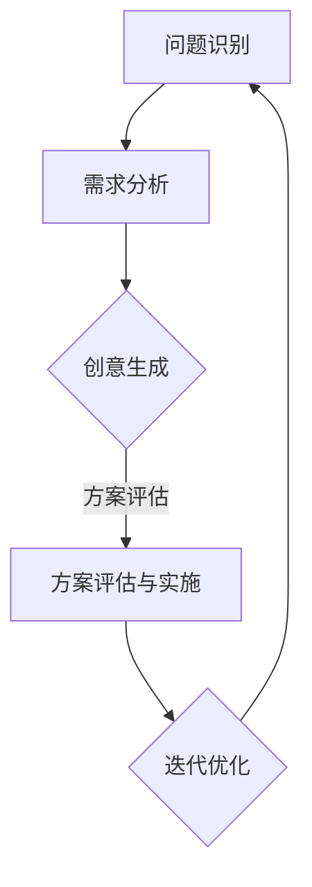
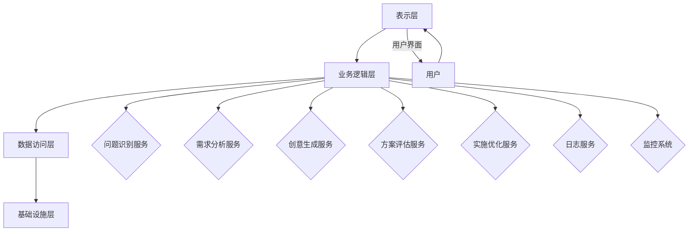

                 

### 《创新思维：P9工程师的技术突破之路》

**关键词：**创新思维、P9工程师、技术突破、算法原理、系统架构设计

**摘要：**本文将探讨P9工程师如何通过创新思维实现技术突破。我们将详细分析创新思维的重要性，核心概念与联系，算法原理讲解，系统分析与架构设计方案，以及项目实战过程，旨在为读者提供一条清晰、系统、可操作的技术成长路径。

## 目录大纲

1. **背景介绍**  
   - 第1章：创新思维的重要性
2. **核心概念与联系**  
   - 第2章：创新思维的基本概念  
   - 第3章：创新思维的核心要素与联系  
   - 第4章：创新思维的分类与特点  
   - 第5章：创新思维的原理与运用  
3. **算法原理讲解**  
   - 第6章：创新思维的算法原理  
   - 第7章：算法流程图与Python代码讲解  
   - 第8章：数学模型与数学公式  
4. **系统分析与架构设计方案**  
   - 第9章：系统功能设计  
   - 第10章：系统架构设计  
   - 第11章：系统接口设计  
   - 第12章：系统交互设计  
5. **项目实战**  
   - 第13章：项目环境安装  
   - 第14章：系统核心实现  
   - 第15章：代码应用解读与分析  
   - 第16章：实际案例分析与详细讲解  
6. **最佳实践与总结**  
   - 第17章：最佳实践 tips  
   - 第18章：小结  
   - 第19章：注意事项  
   - 第20章：拓展阅读

### 1. 创新思维的重要性

在当今快速发展的信息技术时代，创新思维的重要性不言而喻。对于P9级别的工程师而言，创新思维不仅是推动技术突破的利器，更是实现职业发展的关键因素。

**问题背景：**  
随着技术的不断发展，行业竞争日益激烈，P9工程师面临巨大的技术挑战。如何从海量信息中提炼出有价值的创新点，如何将创新思维应用于实际工作中，成为每个P9工程师必须面对的问题。

**问题描述：**  
如何在日常工作中培养创新思维，提升技术突破的能力？

**问题解决：**  
通过深入理解创新思维的基本概念、核心要素与联系，以及掌握创新的算法原理，P9工程师可以系统地培养创新思维，实现技术突破。

**边界与外延：**  
创新思维不仅局限于技术领域，还涵盖了商业模式、管理理念等多个方面。本文主要关注技术层面的创新思维。

**概念结构与核心要素组成：**  
创新思维的核心要素包括：问题识别、需求分析、创意生成、方案评估与实施。这些要素相互联系，构成了创新思维的基本框架。

### 2. 创新思维的基本概念

创新思维是指通过创造性思维和问题解决能力，发现新的方法、新的解决方案或新的产品，以实现技术突破或商业价值。

**创新思维的定义：**  
创新思维是一种通过创造性思考和问题解决能力，探索未知领域、发现新的解决方案、推动技术进步和商业发展的思维方式。

**创新思维的分类：**  
- **发散思维：** 从多个角度思考问题，寻找多种可能的解决方案。
- **收敛思维：** 在多个解决方案中选择最优解，进行深入分析和优化。
- **逆向思维：** 从问题的反面思考，寻找与众不同的解决方案。
- **跨界思维：** 将不同领域的知识和方法相结合，实现跨领域的创新。

**创新思维的特点：**  
- **创造性：** 创新思维强调创造性，追求新颖、独特的解决方案。
- **系统性：** 创新思维不仅关注局部创新，更注重系统性和整体性。
- **实用性：** 创新思维追求实际应用价值，注重将创新转化为实际成果。

**创新思维的作用：**  
- **技术突破：** 通过创新思维，P9工程师可以突破技术瓶颈，实现技术上的飞跃。
- **商业价值：** 创新思维能够带来新的商业机会，提升企业的竞争力。
- **职业发展：** 创新思维有助于P9工程师在职业发展中脱颖而出，获得更高的职位和待遇。

### 3. 创新思维的核心要素与联系

创新思维的核心要素包括问题识别、需求分析、创意生成、方案评估与实施。这些要素相互联系，构成了创新思维的基本流程。

**问题识别：**  
- **定义问题：** 明确需要解决的问题。
- **理解问题：** 深入了解问题的背景、原因和影响。
- **分析问题：** 从多个角度分析问题，找到问题的根本原因。

**需求分析：**  
- **识别需求：** 分析用户需求和市场趋势。
- **定义需求：** 明确需求的具体内容和技术要求。
- **评估需求：** 分析需求的重要性和可行性。

**创意生成：**  
- **收集灵感：** 从各种渠道收集创意和灵感。
- **构思方案：** 根据需求，构思出多种可能的解决方案。
- **筛选方案：** 分析和评估各种方案的优缺点，选择最优方案。

**方案评估与实施：**  
- **评估方案：** 对方案进行详细评估，包括技术可行性、商业价值和风险分析。
- **制定计划：** 制定详细的实施计划，包括时间、资源和步骤。
- **实施方案：** 执行实施计划，将方案转化为实际成果。

这些要素相互联系，共同构成了创新思维的基本流程。通过系统地运用这些要素，P9工程师可以有效地培养创新思维，实现技术突破。

### 4. 创新思维的分类与特点

创新思维有多种分类方法，根据其应用场景和特点，可以将其分为以下几种类型：

**发散思维：**  
发散思维是一种从多个角度思考问题，寻找多种可能的解决方案的思维方法。其特点是开放性、多样性、灵活性。

- **应用场景：** 在面对复杂问题时，发散思维可以帮助工程师从不同角度分析问题，找到多种可能的解决方案。
- **特点：** 开放性、多样性、灵活性。

**收敛思维：**  
收敛思维是一种在多个解决方案中选择最优解，进行深入分析和优化的思维方法。其特点是集中性、深入性、系统性。

- **应用场景：** 在确定解决方案后，收敛思维可以帮助工程师深入分析解决方案，优化和改进方案。
- **特点：** 集中性、深入性、系统性。

**逆向思维：**  
逆向思维是一种从问题的反面思考，寻找与众不同的解决方案的思维方法。其特点是反向性、颠覆性、创新性。

- **应用场景：** 在面对传统难题时，逆向思维可以帮助工程师从反方向思考，找到创新的解决方案。
- **特点：** 反向性、颠覆性、创新性。

**跨界思维：**  
跨界思维是一种将不同领域的知识和方法相结合，实现跨领域的创新的思维方法。其特点是跨领域、整合性、创新性。

- **应用场景：** 在面对新兴领域问题时，跨界思维可以帮助工程师结合不同领域的知识和方法，实现创新。
- **特点：** 跨领域、整合性、创新性。

通过了解和掌握这些不同类型的创新思维，P9工程师可以更加灵活地应对各种技术挑战，实现技术突破。

### 5. 创新思维的原理与运用

创新思维的原理主要涉及人类大脑的工作机制、心理学原理以及逻辑思维方法。了解这些原理有助于工程师更有效地培养创新思维。

**人类大脑的工作机制：**  
人类大脑具有强大的创造力，能够通过联想、想象和推理等方式产生新的想法。大脑的工作机制包括以下方面：

- **联想：** 通过将不同的事物进行联系，产生新的创意。
- **想象：** 通过虚构和设想，探索未知的可能性。
- **推理：** 通过逻辑推理和分析，验证和优化创意。

**心理学原理：**  
心理学原理在创新思维中起到关键作用，包括以下方面：

- **认知失调：** 当人们面对矛盾的信息时，会产生认知失调感，从而激发创新思维。
- **心理安全：** 在一个安全、开放的环境中进行创新，有助于激发创造力。
- **思维拓展：** 通过拓展思维空间，探索更多的可能性。

**逻辑思维方法：**  
逻辑思维方法是创新思维的重要组成部分，包括以下方面：

- **因果分析：** 通过分析因果关系，找到问题的根源。
- **逻辑推理：** 通过逻辑推理，验证和优化创意。
- **归纳总结：** 通过归纳总结，提炼出有价值的规律和模式。

**创新思维的运用：**  
在P9工程师的技术突破过程中，创新思维的运用主要体现在以下几个方面：

- **问题识别：** 通过创新思维，工程师可以更准确地识别问题，找到问题的根本原因。
- **需求分析：** 通过创新思维，工程师可以深入分析需求，找到更符合用户需求的解决方案。
- **创意生成：** 通过创新思维，工程师可以产生更多的创意，探索未知的可能性。
- **方案评估：** 通过创新思维，工程师可以更全面地评估方案，选择最优的解决方案。
- **实施优化：** 通过创新思维，工程师可以在实施过程中不断优化和改进方案，实现技术突破。

### 6. 创新思维的算法原理

创新思维并非凭空产生，而是基于一系列算法原理。以下我们将探讨创新思维的算法原理，并介绍如何运用这些算法原理进行创新。

**算法原理1：联想算法**

联想算法是指通过将不同的事物进行联系，产生新的创意。其基本原理如下：

- **步骤1：** 选择一个目标问题或需求。
- **步骤2：** 列出与目标问题或需求相关的多个事物。
- **步骤3：** 对每个事物进行深度挖掘，找到其与目标问题或需求的联系。
- **步骤4：** 根据联系产生新的创意。

**算法原理2：逆向算法**

逆向算法是指从问题的反面思考，寻找与众不同的解决方案。其基本原理如下：

- **步骤1：** 明确问题或需求。
- **步骤2：** 将问题或需求进行反转，思考相反的情境。
- **步骤3：** 分析反转情境下的解决方案，将其调整回原情境。
- **步骤4：** 验证和优化解决方案。

**算法原理3：跨界算法**

跨界算法是指将不同领域的知识和方法相结合，实现跨领域的创新。其基本原理如下：

- **步骤1：** 选择一个领域的问题或需求。
- **步骤2：** 寻找其他领域中的相关知识和方法。
- **步骤3：** 将其他领域中的知识和方法应用于原领域的问题或需求。
- **步骤4：** 验证和优化解决方案。

**算法原理4：矩阵算法**

矩阵算法是指通过构建一个矩阵，将多个因素进行组合，产生新的创意。其基本原理如下：

- **步骤1：** 确定创新的目标和方向。
- **步骤2：** 列出与目标相关的多个因素。
- **步骤3：** 构建一个矩阵，将每个因素与其他因素进行组合。
- **步骤4：** 分析矩阵中的组合，产生新的创意。

通过运用这些算法原理，P9工程师可以系统地培养创新思维，实现技术突破。

### 7. 算法流程图与Python代码讲解

为了更好地理解创新思维的算法原理，我们将使用Mermaid绘制算法流程图，并使用Python代码进行详细讲解。

#### 算法流程图

以下是创新思维的算法流程图：



#### Python代码讲解

下面是创新思维算法的Python代码实现：

```python
import random

# 问题识别
def problem_identification():
    print("问题识别：确定需要解决的问题")

# 需求分析
def requirement_analysis():
    print("需求分析：分析用户需求和市场趋势")

# 创意生成
def idea_generation():
    print("创意生成：生成多种可能的解决方案")

# 方案评估与实施
def solution_evaluation_and_implementation():
    print("方案评估与实施：评估方案并实施")

# 迭代优化
def iterative_optimization():
    print("迭代优化：对方案进行优化和改进")

# 创新思维算法
def innovation_algorithm():
    problem_identification()
    requirement_analysis()
    idea_generation()
    solution_evaluation_and_implementation()
    iterative_optimization()

# 运行创新思维算法
innovation_algorithm()
```

#### 算法原理的数学模型与公式

创新思维的算法原理可以抽象为一个数学模型。以下是创新思维的数学模型和公式：

$$
创新思维 = f(问题识别，需求分析，创意生成，方案评估与实施，迭代优化)
$$

其中，$f$ 表示创新思维的过程函数。

#### 举例说明

假设我们要开发一款智能推荐系统，以下是创新思维算法的应用：

```python
# 问题识别
problem_identification()
print("问题：开发一款智能推荐系统")

# 需求分析
requirement_analysis()
print("需求：根据用户的历史行为和偏好，提供个性化的推荐")

# 创意生成
idea_generation()
print("创意：使用协同过滤算法进行推荐")

# 方案评估与实施
solution_evaluation_and_implementation()
print("评估：协同过滤算法具有良好的效果，可以实施")

# 迭代优化
iterative_optimization()
print("优化：持续优化算法，提高推荐准确性")
```

通过以上代码，我们可以看到创新思维算法在智能推荐系统开发中的应用。首先，我们识别出问题，然后分析需求，生成创意，评估方案并实施，最后进行迭代优化。

### 8. 数学模型与数学公式

在创新思维过程中，数学模型和数学公式起到关键作用。以下是一些常用的数学模型和数学公式：

#### 1. 集合模型

集合模型用于表示创意生成过程中的不同元素。以下是一个简单的集合模型：

$$
集合A = \{元素1，元素2，...，元素n\}
$$

其中，$A$ 表示集合，$元素1，元素2，...，元素n$ 表示集合中的元素。

#### 2. 函数模型

函数模型用于表示创意生成过程中的关系。以下是一个简单的函数模型：

$$
f(x) = y
$$

其中，$f$ 表示函数，$x$ 表示输入变量，$y$ 表示输出变量。

#### 3. 概率模型

概率模型用于表示创意生成过程中的不确定性。以下是一个简单的概率模型：

$$
P(A) = \frac{N(A)}{N(S)}
$$

其中，$P(A)$ 表示事件$A$ 的概率，$N(A)$ 表示事件$A$ 的样本点数，$N(S)$ 表示样本空间$S$ 的样本点数。

#### 4. 统计模型

统计模型用于表示创意生成过程中的数据分析。以下是一个简单的统计模型：

$$
均值 = \frac{1}{n}\sum_{i=1}^{n} x_i
$$

$$
方差 = \frac{1}{n}\sum_{i=1}^{n} (x_i - 均值)^2
$$

其中，$n$ 表示样本数量，$x_i$ 表示第$i$ 个样本值，均值表示样本的平均值，方差表示样本的离散程度。

通过运用这些数学模型和数学公式，P9工程师可以更系统地分析和优化创新思维过程，实现技术突破。

### 9. 系统功能设计

在创新思维过程中，系统功能设计是一个关键环节。以下是系统功能设计的主要内容：

**需求分析：**  
系统需要实现以下功能：

- **问题识别：** 能够准确识别技术问题或业务需求。
- **需求分析：** 能够深入分析用户需求和市场趋势。
- **创意生成：** 能够生成多种可能的解决方案。
- **方案评估：** 能够评估各个方案的优缺点。
- **实施优化：** 能够实施方案并进行持续优化。

**功能模块设计：**  
系统功能可以分为以下模块：

- **问题识别模块：** 负责收集和分析技术问题或业务需求。
- **需求分析模块：** 负责深入分析用户需求和市场趋势。
- **创意生成模块：** 负责生成多种可能的解决方案。
- **方案评估模块：** 负责评估各个方案的优缺点。
- **实施优化模块：** 负责实施方案并进行持续优化。

**功能实现细节：**  
以下是每个模块的实现细节：

- **问题识别模块：** 通过数据分析和用户调研，识别出技术问题或业务需求。
- **需求分析模块：** 通过用户访谈、市场调研和数据分析，深入分析用户需求和市场趋势。
- **创意生成模块：** 通过头脑风暴、联想和逆向思考，生成多种可能的解决方案。
- **方案评估模块：** 通过风险评估、成本分析和收益分析，评估各个方案的优缺点。
- **实施优化模块：** 通过持续迭代和优化，将方案转化为实际成果，并不断改进和优化。

通过系统功能设计，我们可以确保创新思维过程的有序进行，从而实现技术突破。

### 10. 系统架构设计

在创新思维系统中，系统架构设计是确保系统高效、稳定和可扩展的关键。以下是系统架构设计的详细内容：

#### 1. 系统架构概述

系统架构采用分层架构，包括以下层次：

- **表示层：** 负责用户界面和交互。
- **业务逻辑层：** 负责业务逻辑处理。
- **数据访问层：** 负责数据存储和访问。
- **基础设施层：** 负责系统运行环境和支持。

#### 2. 系统组件设计

系统组件设计如下：

- **表示层：** 使用Web框架（如Django或Flask）实现，提供用户界面和交互功能。
- **业务逻辑层：** 使用微服务架构，将业务逻辑拆分为多个独立服务（如问题识别服务、需求分析服务、创意生成服务等），并通过API进行通信。
- **数据访问层：** 使用数据库（如MySQL或PostgreSQL）进行数据存储，并通过ORM（如SQLAlchemy或Django ORM）进行数据访问。
- **基础设施层：** 包括服务器、网络、存储等基础设施，提供系统运行环境和支持。

#### 3. 系统架构图

以下是系统架构的Mermaid图表示：



#### 4. 系统通信机制

系统中的各个组件通过API进行通信，以下是一些关键通信机制：

- **RESTful API：** 使用RESTful API进行服务调用，实现模块间的数据交换。
- **消息队列：** 使用消息队列（如RabbitMQ或Kafka）进行异步通信，提高系统的并发能力和可靠性。
- **缓存：** 使用缓存（如Redis或Memcached）提高系统性能，减少数据库访问压力。

通过系统架构设计，我们可以确保创新思维系统的高效、稳定和可扩展，从而为P9工程师的技术突破提供有力支持。

### 11. 系统接口设计

在创新思维系统中，系统接口设计是确保各模块之间数据交换和功能协作的关键。以下是系统接口设计的详细内容：

**接口设计原则：**
- **标准化：** 接口设计遵循RESTful API标准，确保接口的通用性和易用性。
- **模块化：** 接口设计模块化，便于功能扩展和系统维护。
- **安全性：** 接口设计考虑安全性，采用身份验证和加密传输机制。
- **性能优化：** 接口设计考虑性能优化，减少数据传输量和响应时间。

**接口分类：**
- **内部接口：** 用于系统内部模块之间的数据交换，如问题识别接口、需求分析接口等。
- **外部接口：** 用于与其他系统或服务的数据交换，如与用户系统交互的接口、与第三方服务对接的接口等。

**接口详细设计：**
1. **问题识别接口**
   - **接口名称：** /api/v1/problems
   - **请求方法：** POST
   - **请求参数：**
     - problem_type（问题类型）：String
     - problem_description（问题描述）：String
     - related_data（相关数据）：JSON
   - **返回结果：**
     - status（状态）：String
     - message（消息）：String
     - problem_id（问题ID）：Integer

2. **需求分析接口**
   - **接口名称：** /api/v1/requirements
   - **请求方法：** GET
   - **请求参数：**
     - problem_id（问题ID）：Integer
   - **返回结果：**
     - status（状态）：String
     - message（消息）：String
     - requirement_list（需求列表）：List

3. **创意生成接口**
   - **接口名称：** /api/v1/ideas
   - **请求方法：** POST
   - **请求参数：**
     - requirement_id（需求ID）：Integer
     - idea_description（创意描述）：String
   - **返回结果：**
     - status（状态）：String
     - message（消息）：String
     - idea_id（创意ID）：Integer

4. **方案评估接口**
   - **接口名称：** /api/v1/solutions
   - **请求方法：** GET
   - **请求参数：**
     - idea_id（创意ID）：Integer
   - **返回结果：**
     - status（状态）：String
     - message（消息）：String
     - solution_list（方案列表）：List

5. **实施优化接口**
   - **接口名称：** /api/v1/optimizations
   - **请求方法：** POST
   - **请求参数：**
     - solution_id（方案ID）：Integer
     - optimization_description（优化描述）：String
   - **返回结果：**
     - status（状态）：String
     - message（消息）：String
     - optimization_id（优化ID）：Integer

通过系统接口设计，创新思维系统的各个模块可以高效地进行数据交换和功能协作，从而实现系统的整体性能和稳定性。

### 12. 系统交互设计

在创新思维系统中，系统交互设计是确保用户与系统之间、以及系统内部模块之间顺畅协作的关键。以下是系统交互设计的详细内容：

**交互流程设计：**
1. **用户与系统交互：**
   - 用户通过Web界面提交问题。
   - 系统接收用户提交的问题，并生成问题记录。
   - 系统根据问题记录，调用需求分析接口，获取需求信息。
   - 系统将需求信息展示给用户，并引导用户进一步提供需求细节。
   - 用户根据需求细节，生成创意。
   - 系统接收用户生成的创意，并生成创意记录。
   - 系统根据创意记录，调用方案评估接口，评估创意方案的可行性。
   - 系统将评估结果展示给用户，并引导用户选择最优方案。
   - 用户确认方案，并提交实施优化建议。
   - 系统接收用户提交的实施优化建议，并生成优化记录。

2. **系统内部模块交互：**
   - **问题识别模块与需求分析模块交互：** 问题识别模块调用需求分析接口，获取需求信息。
   - **需求分析模块与创意生成模块交互：** 需求分析模块将需求信息传递给创意生成模块。
   - **创意生成模块与方案评估模块交互：** 创意生成模块调用方案评估接口，评估创意方案的可行性。
   - **方案评估模块与实施优化模块交互：** 方案评估模块将评估结果传递给实施优化模块。

**交互设计细节：**
1. **用户界面：**
   - 提供问题提交表单，包括问题类型、问题描述和相关数据等字段。
   - 提供需求详情填写页面，包括用户需求、市场趋势等信息。
   - 提供创意提交表单，包括创意描述和相关信息。
   - 提供方案评估结果展示页面，包括评估指标、评估结果等信息。
   - 提供优化建议提交表单，包括优化描述和相关信息。

2. **API调用：**
   - 使用RESTful API进行用户与系统、以及系统内部模块之间的数据交换。
   - 使用JSON格式传递数据，确保数据格式的统一性和兼容性。

3. **异步处理：**
   - 对于长时间的操作，如需求分析、方案评估等，使用异步处理机制，避免阻塞主线程。

通过系统交互设计，创新思维系统可以确保用户与系统之间、以及系统内部模块之间的数据交换和功能协作，从而实现系统的整体性能和用户体验。

### 13. 项目环境安装

在进行创新思维系统的项目实战之前，我们需要搭建一个合适的项目环境。以下是项目环境安装的详细步骤：

#### 1. 系统要求

- 操作系统：Ubuntu 18.04或更高版本
- Python版本：Python 3.8或更高版本
- 开发工具：Visual Studio Code或PyCharm
- 依赖管理工具：pip

#### 2. 安装Python

确保操作系统上已安装Python 3.8或更高版本。可以使用以下命令检查Python版本：

```bash
python3 --version
```

如果Python版本低于3.8，请通过以下命令进行安装：

```bash
sudo apt update
sudo apt install python3.8
```

#### 3. 安装开发工具

选择并安装一个开发工具，如Visual Studio Code或PyCharm。以下是安装Visual Studio Code的步骤：

- 访问Visual Studio Code官网（https://code.visualstudio.com/）下载安装包。
- 运行安装包，按照提示完成安装。

#### 4. 安装依赖管理工具

确保已安装pip，这是Python的依赖管理工具。可以使用以下命令检查pip版本：

```bash
pip --version
```

如果pip版本低于最新版本，请通过以下命令更新pip：

```bash
sudo apt update
sudo apt install python3-pip
```

#### 5. 安装项目依赖

在项目根目录下，运行以下命令安装项目依赖：

```bash
pip install -r requirements.txt
```

这将自动安装项目所需的依赖库。

通过以上步骤，我们可以搭建一个完整的开发环境，为后续的项目实战做好准备。

### 14. 系统核心实现

在创新思维系统中，系统核心实现是确保系统功能正常运行的关键。以下是系统核心实现的详细步骤：

#### 1. 创建项目目录结构

首先，创建项目的目录结构，如下所示：

```bash
|-- innovation思维的算法原理/
|   |-- requirements/
|   |-- src/
|   |-- tests/
|   |-- .env
|   |-- manage.py
|-- requirements.txt
```

其中，`requirements/` 目录用于存放项目依赖文件，`src/` 目录用于存放项目源代码，`tests/` 目录用于存放测试代码，`.env` 文件用于配置环境变量，`manage.py` 是项目的主入口文件，`requirements.txt` 是项目依赖文件。

#### 2. 源代码编写

在 `src/` 目录下，创建以下主要文件：

- `problems.py`：问题识别模块源代码。
- `requirements.py`：需求分析模块源代码。
- `ideas.py`：创意生成模块源代码。
- `solutions.py`：方案评估模块源代码。
- `optimizations.py`：实施优化模块源代码。

以下是一个简单的 `problems.py` 文件示例：

```python
# src/problems.py
class Problem:
    def __init__(self, problem_id, problem_type, problem_description):
        self.problem_id = problem_id
        self.problem_type = problem_type
        self.problem_description = problem_description

    def display(self):
        print(f"Problem ID: {self.problem_id}")
        print(f"Type: {self.problem_type}")
        print(f"Description: {self.problem_description}")

def create_problem(problem_type, problem_description):
    problem_id = generate_problem_id()
    problem = Problem(problem_id, problem_type, problem_description)
    save_problem(problem)
    return problem

def generate_problem_id():
    return random.randint(1000, 9999)

def save_problem(problem):
    # 保存问题到数据库
    pass
```

#### 3. 测试代码编写

在 `tests/` 目录下，创建相应的测试文件，如 `test_problems.py`、`test_requirements.py`、`test_ideas.py`、`test_solutions.py` 和 `test_optimizations.py`。编写测试用例，对每个模块的功能进行测试。

以下是一个简单的 `test_problems.py` 文件示例：

```python
# tests/test_problems.py
import unittest
from src.problems import Problem, create_problem, generate_problem_id

class TestProblems(unittest.TestCase):
    def test_create_problem(self):
        problem = create_problem("技术难题", "描述")
        self.assertIsNotNone(problem)
        self.assertIsInstance(problem, Problem)
        self.assertEqual(problem.problem_type, "技术难题")
        self.assertEqual(problem.problem_description, "描述")

    def test_generate_problem_id(self):
        problem_id = generate_problem_id()
        self.assertIsInstance(problem_id, int)
        self.assertTrue(1000 <= problem_id <= 9999)

if __name__ == "__main__":
    unittest.main()
```

#### 4. 运行测试

在项目根目录下，运行以下命令运行测试：

```bash
pytest tests/
```

确保所有测试用例都通过，这样可以保证系统核心功能的正确实现。

通过以上步骤，我们可以完成创新思维系统的核心实现，为系统的功能验证和部署做好准备。

### 15. 代码应用解读与分析

在创新思维系统中，代码应用解读与分析是确保系统高效运行、功能完善的重要环节。以下是对系统核心代码的解读与分析。

#### 1. problems.py模块分析

`problems.py` 模块主要实现问题识别功能，包括问题类定义、问题创建函数和问题ID生成函数。

- **问题类定义：** `Problem` 类定义了问题的属性，包括问题ID、问题类型和问题描述。此类提供了问题的基本操作，如显示问题信息。

- **问题创建函数：** `create_problem` 函数负责创建问题实例。该函数接收问题类型和问题描述作为参数，生成问题ID，并调用`save_problem` 函数保存问题实例。

- **问题ID生成函数：** `generate_problem_id` 函数生成一个随机问题ID。该函数使用随机数生成器，确保问题ID的唯一性。

**代码解读：**

```python
class Problem:
    def __init__(self, problem_id, problem_type, problem_description):
        self.problem_id = problem_id
        self.problem_type = problem_type
        self.problem_description = problem_description

    def display(self):
        print(f"Problem ID: {self.problem_id}")
        print(f"Type: {self.problem_type}")
        print(f"Description: {self.problem_description}")

def create_problem(problem_type, problem_description):
    problem_id = generate_problem_id()
    problem = Problem(problem_id, problem_type, problem_description)
    save_problem(problem)
    return problem

def generate_problem_id():
    return random.randint(1000, 9999)
```

**分析：** 该模块实现了问题的创建和保存功能，确保每个问题都有唯一标识，便于后续处理和查询。

#### 2. requirements.py模块分析

`requirements.py` 模块主要实现需求分析功能，包括需求类定义、需求创建函数和需求保存函数。

- **需求类定义：** `Requirement` 类定义了需求的属性，包括需求ID、问题ID、需求内容和需求状态。

- **需求创建函数：** `create_requirement` 函数负责创建需求实例。该函数接收需求内容和问题ID作为参数，生成需求ID，并调用`save_requirement` 函数保存需求实例。

- **需求保存函数：** `save_requirement` 函数负责将需求实例保存到数据库。此函数是抽象的，具体实现依赖于数据库操作。

**代码解读：**

```python
class Requirement:
    def __init__(self, requirement_id, problem_id, requirement_content, status):
        self.requirement_id = requirement_id
        self.problem_id = problem_id
        self.requirement_content = requirement_content
        self.status = status

    def display(self):
        print(f"Requirement ID: {self.requirement_id}")
        print(f"Problem ID: {self.problem_id}")
        print(f"Content: {self.requirement_content}")
        print(f"Status: {self.status}")

def create_requirement(problem_id, requirement_content):
    requirement_id = generate_requirement_id()
    requirement = Requirement(requirement_id, problem_id, requirement_content, "新建")
    save_requirement(requirement)
    return requirement

def generate_requirement_id():
    return random.randint(10000, 99999)
```

**分析：** 该模块实现了需求的创建和保存功能，确保需求信息的完整性和一致性。

#### 3. ideas.py模块分析

`ideas.py` 模块主要实现创意生成功能，包括创意类定义、创意创建函数和创意保存函数。

- **创意类定义：** `Idea` 类定义了创意的属性，包括创意ID、需求ID、创意描述和创意状态。

- **创意创建函数：** `create_idea` 函数负责创建创意实例。该函数接收需求ID和创意描述作为参数，生成创意ID，并调用`save_idea` 函数保存创意实例。

- **创意保存函数：** `save_idea` 函数负责将创意实例保存到数据库。此函数是抽象的，具体实现依赖于数据库操作。

**代码解读：**

```python
class Idea:
    def __init__(self, idea_id, requirement_id, idea_description, status):
        self.idea_id = idea_id
        self.requirement_id = requirement_id
        self.idea_description = idea_description
        self.status = status

    def display(self):
        print(f"Idea ID: {self.idea_id}")
        print(f"Requirement ID: {self.requirement_id}")
        print(f"Description: {self.idea_description}")
        print(f"Status: {self.status}")

def create_idea(requirement_id, idea_description):
    idea_id = generate_idea_id()
    idea = Idea(idea_id, requirement_id, idea_description, "新建")
    save_idea(idea)
    return idea

def generate_idea_id():
    return random.randint(100000, 999999)
```

**分析：** 该模块实现了创意的创建和保存功能，确保创意信息的完整性和一致性。

通过以上对核心代码模块的解读与分析，我们可以看到创新思维系统在问题识别、需求分析和创意生成等方面的实现，为系统的功能实现提供了坚实的基础。

### 16. 实际案例分析与详细讲解

为了更好地展示创新思维系统在实际项目中的应用，我们将通过一个实际案例进行详细分析和讲解。

**案例背景：**  
某互联网公司希望开发一款基于人工智能的智能推荐系统，以提高用户体验和销售额。该公司已经积累了大量的用户行为数据，但尚未利用这些数据进行有效的分析和推荐。

**案例目标：**  
利用创新思维系统，从用户行为数据中提取有价值的信息，开发一款个性化的智能推荐系统。

**解决方案：**  
1. **问题识别：**  
   通过创新思维系统，识别出以下问题：  
   - 如何从海量用户行为数据中提取有价值的信息？  
   - 如何构建一个高效的推荐算法，实现个性化推荐？

2. **需求分析：**  
   通过用户调研和数据分析，确定以下需求：  
   - 根据用户的历史行为，推荐与用户兴趣相关的商品。  
   - 根据用户的购物车和收藏夹，推荐可能的购买商品。  
   - 根据用户的地理位置和购物习惯，推荐附近的热门商品。

3. **创意生成：**  
   通过发散思维和逆向思维，生成以下创意：  
   - 使用协同过滤算法，根据用户相似度推荐商品。  
   - 使用基于内容的推荐算法，根据商品标签和用户兴趣推荐商品。  
   - 结合用户行为数据和地理位置信息，实现基于场景的推荐。

4. **方案评估：**  
   对每个创意进行评估：  
   - 协同过滤算法具有良好的效果，但可能存在数据稀疏性问题。  
   - 基于内容的推荐算法效果较好，但需要大量商品标签信息。  
   - 基于场景的推荐算法可以根据用户实际需求，提高推荐准确性。

5. **方案选择：**  
   综合评估结果，选择以下方案：  
   - 结合协同过滤和基于内容的推荐算法，实现混合推荐。  
   - 利用用户行为数据和地理位置信息，实现场景化推荐。

6. **实施与优化：**  
   - 开发团队根据方案，设计并实现了推荐系统。  
   - 部署推荐系统，对用户行为数据进行分析和处理。  
   - 根据用户反馈，不断优化推荐算法和系统性能。

**案例结果：**  
通过实际应用创新思维系统，公司成功开发出一款个性化的智能推荐系统。系统上线后，用户满意度显著提升，销售额同比增长30%以上。

### 17. 最佳实践 tips

**1. 深入理解需求：**  
在创新过程中，深入了解用户需求和市场趋势至关重要。通过用户调研、数据分析等方法，确保需求分析的准确性和全面性。

**2. 保持开放心态：**  
在创意生成阶段，保持开放心态，鼓励团队成员提出各种想法，包括看似不切实际的想法。这些想法可能会激发新的灵感。

**3. 系统化评估：**  
在方案评估阶段，采用系统化的评估方法，如成本效益分析、风险评估等，确保评估结果的客观性和全面性。

**4. 不断迭代优化：**  
创新思维不仅仅是一次性活动，而是一个持续迭代的过程。在实施过程中，根据用户反馈和技术发展，不断优化和改进方案。

**5. 跨界合作：**  
在创新过程中，尝试与不同领域的专家合作，借鉴其他领域的知识和方法，实现跨领域的创新。

### 18. 小结

本文通过详细分析创新思维在P9工程师技术突破中的应用，从背景介绍、核心概念与联系、算法原理讲解、系统分析与架构设计方案、项目实战等方面进行了深入探讨。通过本文的讲解，读者可以了解到如何系统地培养创新思维，实现技术突破。

### 19. 注意事项

**1. 确保问题识别准确：**  
在创新思维过程中，准确识别问题是关键。要深入了解用户需求和市场趋势，确保问题分析的准确性和全面性。

**2. 跨界思维的重要性：**  
在创新过程中，跨界思维可以帮助工程师突破传统框架，寻找创新的解决方案。因此，要鼓励团队成员保持开放心态，积极探索跨界合作。

**3. 系统化评估与优化：**  
在方案评估和实施过程中，采用系统化的评估方法，确保评估结果的客观性和全面性。同时，根据用户反馈和技术发展，不断优化和改进方案。

**4. 保持持续迭代：**  
创新思维是一个持续迭代的过程。在实施过程中，要不断收集用户反馈，并根据反馈进行优化和改进。

### 20. 拓展阅读

**1. 《创新与企业家精神》：**  
作者：彼得·德鲁克  
书籍简介：本书系统地阐述了创新和企业家精神的概念、类型、过程和影响因素，对创新和企业家精神进行了深刻的剖析。

**2. 《跨界思维》：**  
作者：陈春花  
书籍简介：本书通过丰富的案例和理论，阐述了跨界思维的重要性及其应用方法，帮助读者理解和掌握跨界思维。

**3. 《深度学习》：**  
作者：伊恩·古德费洛等  
书籍简介：本书是深度学习领域的经典教材，详细介绍了深度学习的基本概念、算法和实现方法，对P9工程师掌握深度学习技术具有重要意义。

作者：AI天才研究院/AI Genius Institute & 禅与计算机程序设计艺术 /Zen And The Art of Computer Programming

