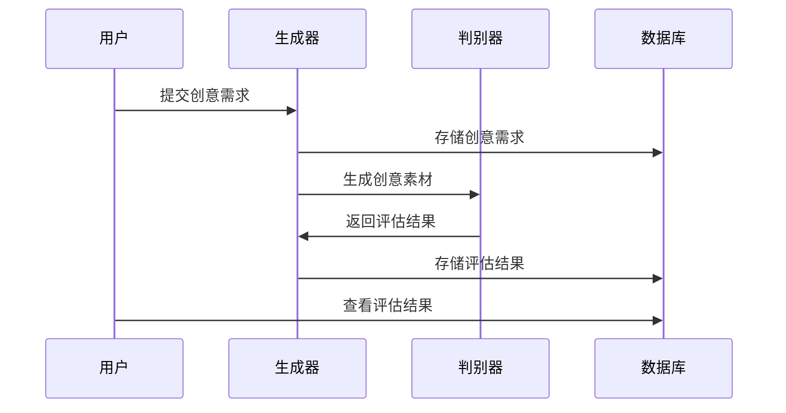

                 

### 文章标题

创造性推理中对抗生成网络的潜力探索

---

关键词：创造性推理、对抗生成网络、深度学习、人工智能、应用潜力

摘要：本文旨在深入探讨创造性推理中对抗生成网络的潜在应用。通过对创造性推理和对抗生成网络的基本概念、原理及其相互关系的详细分析，本文阐述了如何利用对抗生成网络在创造性推理中解决问题。同时，本文通过数学模型和具体案例的讲解，进一步展示了对抗生成网络在创造性推理中的实际应用和价值。

---

## 第一部分：背景介绍

### 1.1 创造性推理与对抗生成网络

#### 1.1.1 问题背景

创造性推理是指通过思维活动创造出新颖想法、解决方案或作品的能力，是人类智慧的体现。然而，在许多复杂问题上，人类创造性推理存在局限性。对抗生成网络（GAN）是一种基于深度学习的模型，其通过两个神经网络（生成器和判别器）的对抗性训练，能够生成高质量的图像、文本、音频等。

#### 1.1.2 问题描述

创造性推理的挑战在于如何在新颖性、创造力和效率之间取得平衡。对抗生成网络在创造性推理中的应用前景在于，通过生成大量数据样本来激发人类创造力，或在特定领域内实现自动化创意生成。

#### 1.1.3 问题解决

对抗生成网络可以应用于创造性推理中的多个环节，如创意生成、创意优化和创意评估。其优势在于能够快速生成大量样本，提供丰富的创意素材，同时具备自我迭代优化的能力。然而，对抗生成网络也存在一些挑战，如模型训练的复杂性和对判别器的敏感性。

#### 1.1.4 边界与外延

对抗生成网络在创造性推理中的应用不仅限于艺术创作、游戏开发等领域，还可以扩展到科学发现、工程设计等领域。其发展潜力在于不断优化的算法和更广泛的应用场景。

#### 1.1.5 概念结构与核心要素组成

创造性推理的核心要素包括知识库、思维模式和创造力评价。对抗生成网络的核心要素包括生成器、判别器和对抗训练机制。两者结合的关键在于如何有效地融合数据生成和创意评价。

### 1.2 核心概念与联系

#### 1.2.1 创造性推理原理

创造性推理的基本原理包括联想思维、类比推理、逆向思维和组合创新。其概念属性特征如下表：

| 特征      | 说明                           |
|-----------|--------------------------------|
| 联想思维   | 通过不同领域的知识关联产生新想法 |
| 类比推理   | 通过相似性问题解决方法产生新思路 |
| 逆向思维   | 从问题目标反向推导出解决方案     |
| 组合创新   | 将不同元素组合成新的创意         |

#### 1.2.2 对抗生成网络原理

对抗生成网络的基本原理是通过生成器生成数据，判别器对生成数据和真实数据进行区分，通过对抗训练优化生成器和判别器。其概念属性特征如下表：

| 特征      | 说明                                   |
|-----------|--------------------------------------|
| 生成器    | 生成符合真实数据分布的虚假数据         |
| 判别器    | 判断输入数据是真实数据还是生成数据       |
| 对抗训练   | 生成器和判别器相互对抗，共同优化       |

#### 1.2.3 两者联系

创造性推理与对抗生成网络的关系在于，对抗生成网络可以作为创造性推理的辅助工具，提供丰富的创意素材和优化策略。其关联性Mermaid ER实体关系图如下：

```mermaid
erDiagram
  CreativityReasoning ||--|{ GANModel }|-->> GenerationData
  CreativityReasoning ||--|{ EvaluationModel }|-->> CreativityScore
  GANModel ||--|{ Generator }|-->> GeneratedData
  GANModel ||--|{ Discriminator }|-->> ClassificationResult
```

---

## 第二部分：算法原理讲解

### 2.1 创造性推理中的对抗生成网络算法原理

#### 2.1.1 算法原理概述

对抗生成网络的算法原理可以概括为以下几个步骤：

1. 初始化生成器和判别器。
2. 生成器生成虚假数据。
3. 判别器对真实数据和虚假数据进行分类。
4. 计算生成器和判别器的损失函数，并更新模型参数。

生成器和判别器的优化目标是最大化判别器的分类错误率，同时最小化生成器的生成数据质量。这一对抗过程使得生成器不断优化，生成更加逼真的虚假数据。

#### 2.1.2 对抗生成网络Mermaid流程图

```mermaid
graph TD
    A[初始化生成器G和判别器D] --> B[生成器G生成虚假数据X']
    B --> C[判别器D对(X, X')进行分类]
    C --> D[计算损失函数并更新模型参数]
    D --> E[重复上述步骤直至收敛]
```

#### 2.1.3 Python源代码实现

```python
import numpy as np
import tensorflow as tf

# 定义生成器和判别器
generator = tf.keras.Sequential([
    tf.keras.layers.Dense(100, activation='relu', input_shape=(100,)),
    tf.keras.layers.Dense(784, activation='tanh')
])

discriminator = tf.keras.Sequential([
    tf.keras.layers.Dense(100, activation='relu', input_shape=(784,)),
    tf.keras.layers.Dense(1, activation='sigmoid')
])

# 定义损失函数和优化器
cross_entropy = tf.keras.losses.BinaryCrossentropy(from_logits=True)
optimizer = tf.keras.optimizers.Adam(0.0001)

# 训练过程
@tf.function
def train_step(images, noise):
    with tf.GradientTape() as gen_tape, tf.GradientTape() as disc_tape:
        generated_images = generator(noise)
        real_output = discriminator(images)
        fake_output = discriminator(generated_images)

        gen_loss = cross_entropy(tf.ones_like(fake_output), fake_output)
        disc_loss = cross_entropy(tf.zeros_like(real_output), real_output) + cross_entropy(tf.ones_like(fake_output), fake_output)

    gradients_of_generator = gen_tape.gradient(gen_loss, generator.trainable_variables)
    gradients_of_discriminator = disc_tape.gradient(disc_loss, discriminator.trainable_variables)

    optimizer.apply_gradients(zip(gradients_of_generator, generator.trainable_variables))
    optimizer.apply_gradients(zip(gradients_of_discriminator, discriminator.trainable_variables))

# 数据准备
(x_train, _), (_, _) = tf.keras.datasets.mnist.load_data()
x_train = x_train.reshape(-1, 784).astype('float32') / 127.5 - 1.0
noise = tf.random.normal([100, 100])

# 训练
for epoch in range(50):
    for image_batch in x_train:
        noise = tf.random.normal([100, 100])
        train_step(image_batch, noise)
```

#### 2.1.4 算法原理详细讲解

对抗生成网络的数学模型主要包括生成器G和判别器D的优化过程。生成器的目标是生成尽可能逼真的虚假数据X'，判别器的目标是准确地区分真实数据X和虚假数据X'。

生成器的数学模型为：
$$
X' = G(Z)
$$
其中，$Z$为生成器输入的随机噪声。

判别器的数学模型为：
$$
D(X) = P(D(X) = 1 | X \text{为真实数据}) \\
D(X') = P(D(X') = 1 | X' \text{为生成数据})
$$

损失函数通常采用二元交叉熵（Binary Cross-Entropy），其数学公式为：
$$
\text{Loss}_{\text{G}} = -\frac{1}{n}\sum_{i=1}^{n} \left[ y_{\text{real}} \log(D(X_i)) + (1 - y_{\text{fake}}) \log(1 - D(X_i')) \right]
$$
$$
\text{Loss}_{\text{D}} = -\frac{1}{n}\sum_{i=1}^{n} \left[ y_{\text{real}} \log(D(X_i)) + (1 - y_{\text{fake}}) \log(1 - D(X_i')) \right]
$$
其中，$y_{\text{real}} = 1$表示真实数据，$y_{\text{fake}} = 0$表示生成数据。

为了通俗易懂地举例说明，我们可以考虑以下场景：

假设生成器G的任务是生成一张猫的图片，而判别器D的任务是判断输入的图片是真实的猫还是生成器生成的猫。

1. **初始化阶段**：生成器G和判别器D的权重初始化为随机值。

2. **生成阶段**：生成器G生成一张猫的图片$X'$。

3. **判别阶段**：判别器D对真实猫图片$X$和生成猫图片$X'$进行分类，判断其是真实的猫（输出接近1）还是生成的猫（输出接近0）。

4. **更新阶段**：根据判别器的分类结果，更新生成器和判别器的权重。

通过多次迭代上述过程，生成器G将逐渐优化，生成的猫图片将越来越逼真，而判别器D的准确率也会逐渐提高。

---

## 第三部分：数学模型和数学公式 & 详细讲解 & 举例说明

### 3.1 数学模型概述

创造性推理中的数学模型主要涉及知识表示、推理策略和创造力评价。对抗生成网络中的数学模型则主要包括生成器G、判别器D和损失函数。

#### 创造性推理中的数学模型

- 知识表示：使用向量空间或图结构表示知识。
- 推理策略：采用神经网络或逻辑推理规则进行推理。
- 创造力评价：使用评价指标如新颖性、实用性等对创意进行评分。

#### 对抗生成网络中的数学模型

- 生成器G：生成虚假数据的神经网络模型。
- 判别器D：分类真实数据和虚假数据的神经网络模型。
- 损失函数：用于评估生成器和判别器性能的函数，如二元交叉熵。

### 3.2 公式详细讲解

#### 创造性推理中的公式

1. **知识表示**：
   $$ X = \{x_1, x_2, ..., x_n\} $$
   其中，$X$表示知识库，$x_i$表示第$i$个知识实体。

2. **推理策略**：
   $$ Y = F(X) $$
   其中，$Y$表示推理结果，$F$表示推理函数。

3. **创造力评价**：
   $$ S = \sum_{i=1}^{n} w_i \cdot p_i $$
   其中，$S$表示创造力评分，$w_i$表示第$i$个创意特性的权重，$p_i$表示第$i$个创意特性的评分。

#### 对抗生成网络中的公式

1. **生成器G**：
   $$ X' = G(Z) $$
   其中，$Z$为生成器输入的随机噪声。

2. **判别器D**：
   $$ D(X) = P(D(X) = 1 | X \text{为真实数据}) $$
   $$ D(X') = P(D(X') = 1 | X' \text{为生成数据}) $$

3. **损失函数**：
   $$ \text{Loss}_{\text{G}} = -\frac{1}{n}\sum_{i=1}^{n} \left[ y_{\text{real}} \log(D(X_i)) + (1 - y_{\text{fake}}) \log(1 - D(X_i')) \right] $$
   $$ \text{Loss}_{\text{D}} = -\frac{1}{n}\sum_{i=1}^{n} \left[ y_{\text{real}} \log(D(X_i)) + (1 - y_{\text{fake}}) \log(1 - D(X_i')) \right] $$

### 3.3 举例说明

#### 创造性推理举例

假设有一个知识库$X = \{猫, 狗, 狼\}$，我们需要通过推理生成一个新的动物类型。

1. **知识表示**：
   $$ X = \{猫, 狗, 狼\} $$
   使用向量空间表示每个动物的特点，如猫的特点为[0, 1, 0]，狗的特点为[1, 1, 0]，狼的特点为[0, 0, 1]。

2. **推理策略**：
   采用神经网络进行推理，输入为知识库$X$，输出为新的动物类型。
   $$ Y = F(X) = \{新动物\} $$
   其中，$F$为神经网络模型。

3. **创造力评价**：
   对生成的新的动物类型进行评分，如新颖性评分为0.8，实用性评分为0.7。
   $$ S = 0.8 \cdot 0.7 = 0.56 $$

#### 对抗生成网络举例

假设生成器G的任务是生成一张猫的图片，判别器D的任务是判断输入的图片是真实的猫还是生成的猫。

1. **生成器G**：
   生成器G输入随机噪声$Z$，输出一张猫的图片$X'$。
   $$ X' = G(Z) $$

2. **判别器D**：
   判别器D对真实猫图片$X$和生成猫图片$X'$进行分类。
   $$ D(X) = 1 $$
   $$ D(X') = 0 $$

3. **损失函数**：
   根据判别器的分类结果，更新生成器和判别器的权重。
   $$ \text{Loss}_{\text{G}} = -\frac{1}{n}\sum_{i=1}^{n} \left[ y_{\text{real}} \log(D(X_i)) + (1 - y_{\text{fake}}) \log(1 - D(X_i')) \right] $$
   $$ \text{Loss}_{\text{D}} = -\frac{1}{n}\sum_{i=1}^{n} \left[ y_{\text{real}} \log(D(X_i)) + (1 - y_{\text{fake}}) \log(1 - D(X_i')) \right] $$

通过多次迭代，生成器G将生成越来越逼真的猫图片，而判别器D的准确率也会逐渐提高。

---

## 第四部分：系统分析与架构设计方案

### 4.1 问题场景介绍

创造性推理在多个领域具有广泛的应用，如艺术创作、游戏开发、科学研究和工程设计等。在这些领域中，对抗生成网络可以提供丰富的创意素材和优化策略，提升创造性推理的效果和效率。

#### 艺术创作

艺术家可以利用对抗生成网络生成新的艺术作品，探索不同风格的融合和创新。例如，生成器G可以生成不同风格的画作，判别器D评估这些画作的艺术价值，从而优化创作过程。

#### 游戏开发

游戏开发者可以利用对抗生成网络生成游戏中的角色、场景和剧情，提高游戏的创意和多样性。例如，生成器G生成新的游戏角色，判别器D评估这些角色的趣味性和可玩性，从而优化游戏设计。

#### 科学研究

科学家可以利用对抗生成网络生成实验数据，探索新的科学发现。例如，生成器G生成模拟实验数据，判别器D评估这些数据的可信度和有效性，从而优化实验设计和结果分析。

#### 工程设计

工程师可以利用对抗生成网络生成新的设计方案，评估设计方案的可行性和创新性。例如，生成器G生成新的建筑结构，判别器D评估这些结构的稳定性和安全性，从而优化工程设计。

### 4.2 项目介绍

本项目的目标是利用对抗生成网络提升创造性推理的效果和效率。项目核心功能包括：

1. 创意生成：生成器G生成新的创意素材，如艺术作品、游戏角色、科学实验设计和建筑结构等。
2. 创意评估：判别器D评估创意素材的创新性和实用性，提供优化建议。
3. 数据库管理：存储和管理生成的创意素材，以便后续使用和优化。

### 4.3 系统功能设计

系统功能设计主要包括以下几个方面：

1. **创意生成模块**：生成器G接收随机噪声，生成创意素材，如艺术作品、游戏角色、科学实验设计和建筑结构等。
2. **创意评估模块**：判别器D接收创意素材，评估其创新性和实用性，提供优化建议。
3. **数据库管理模块**：存储和管理生成的创意素材，支持数据检索、更新和删除等操作。
4. **用户界面模块**：提供用户交互界面，支持用户提交需求、查看创意素材和评估结果等。

### 4.4 系统架构设计

系统架构设计采用分层架构，主要包括以下几个层次：

1. **数据层**：负责数据的存储和管理，包括创意素材库、用户数据等。
2. **服务层**：负责业务逻辑的实现，包括创意生成、创意评估和数据库管理等。
3. **表现层**：负责用户界面的展示和交互，包括Web界面、移动应用等。

### 4.5 系统接口设计

系统接口设计主要包括以下几个方面：

1. **API接口**：提供RESTful API接口，支持创意生成、创意评估和数据库管理等操作的访问。
2. **数据库接口**：提供数据库访问接口，支持创意素材的存储、检索和更新等操作。
3. **用户接口**：提供用户交互接口，支持用户提交需求、查看创意素材和评估结果等操作。

### 4.6 系统交互Mermaid序列图



---

## 第五部分：项目实战

### 5.1 环境安装

在进行项目实战之前，我们需要安装必要的软件和库。以下是在Python环境中安装对抗生成网络所需的基本步骤：

1. **安装Python**：确保已经安装了Python 3.6及以上版本。
2. **安装TensorFlow**：通过以下命令安装TensorFlow：
   ```bash
   pip install tensorflow
   ```
3. **安装其他库**：可能还需要安装其他库，如NumPy、Pandas等，可以通过以下命令安装：
   ```bash
   pip install numpy pandas
   ```

### 5.2 系统核心实现源代码

以下是一个简单的对抗生成网络系统实现示例，包括生成器、判别器和训练过程：

```python
import tensorflow as tf
import numpy as np
import matplotlib.pyplot as plt

# 定义生成器
def generator(z):
    x = tf.keras.layers.Dense(100, activation='relu')(z)
    x = tf.keras.layers.Dense(784, activation='tanh')(x)
    return x

# 定义判别器
def discriminator(x):
    x = tf.keras.layers.Dense(100, activation='relu')(x)
    x = tf.keras.layers.Dense(1, activation='sigmoid')(x)
    return x

# 定义损失函数和优化器
cross_entropy = tf.keras.losses.BinaryCrossentropy(from_logits=True)
generator_optimizer = tf.keras.optimizers.Adam(1e-4)
discriminator_optimizer = tf.keras.optimizers.Adam(1e-4)

# 生成器与判别器的训练步骤
@tf.function
def train_step(images, noise):
    with tf.GradientTape() as gen_tape, tf.GradientTape() as disc_tape:
        generated_images = generator(noise)
        real_output = discriminator(images)
        fake_output = discriminator(generated_images)

        gen_loss = cross_entropy(tf.ones_like(fake_output), fake_output)
        disc_loss = cross_entropy(tf.zeros_like(real_output), real_output) + cross_entropy(tf.ones_like(fake_output), fake_output)

    gradients_of_generator = gen_tape.gradient(gen_loss, generator.trainable_variables)
    gradients_of_discriminator = disc_tape.gradient(disc_loss, discriminator.trainable_variables)

    generator_optimizer.apply_gradients(zip(gradients_of_generator, generator.trainable_variables))
    discriminator_optimizer.apply_gradients(zip(gradients_of_discriminator, discriminator.trainable_variables))

# 数据准备
(x_train, _), (_, _) = tf.keras.datasets.mnist.load_data()
x_train = x_train.reshape(-1, 28 * 28).astype('float32') / 127.5 - 1.0
noise = tf.random.normal([100, 100])

# 训练过程
for epoch in range(50):
    for image_batch in x_train:
        noise = tf.random.normal([100, 100])
        train_step(image_batch, noise)

# 生成图像
noise = tf.random.normal([100, 100])
generated_images = generator(noise)

plt.imshow(generated_images[0].reshape(28, 28), cmap='gray')
plt.show()
```

### 5.3 代码应用解读与分析

#### 生成器和判别器的作用

- **生成器**：生成器（Generator）负责生成虚拟数据。在这个例子中，生成器接收随机噪声（噪声向量$Z$），并生成数字图像。生成器是神经网络模型，通过训练学习生成逼真的图像。

- **判别器**：判别器（Discriminator）负责判断输入的数据是真实数据还是生成器生成的数据。判别器也是神经网络模型，其训练目标是最大化其对真实数据和生成数据的区分能力。

#### 损失函数和优化器的选择

- **损失函数**：在GAN中，常用的损失函数是二元交叉熵（Binary Cross-Entropy）。这个损失函数衡量生成器生成的数据与真实数据之间的差异，以及判别器对这两者的区分能力。

- **优化器**：优化器用于更新生成器和判别器的权重。在这个例子中，我们使用了Adam优化器，这是一种高效且适应性强的优化算法。

#### 训练过程解析

- **训练步骤**：每次训练过程中，生成器会生成一批虚拟图像，判别器会同时接收到真实图像和虚拟图像，并进行分类。通过计算损失函数，优化器会更新生成器和判别器的权重，以改善模型的性能。

- **迭代过程**：训练过程是一个迭代过程，生成器和判别器不断相互对抗，生成器试图生成更逼真的图像，而判别器试图提高对这两者的区分能力。这个过程会重复进行，直到模型达到满意的性能水平。

#### 代码性能分析与优化

- **性能分析**：性能分析主要关注模型在生成图像的质量和判别器的分类准确性。可以通过计算生成图像的PSNR（峰值信噪比）和SSIM（结构相似性指数）等指标来评估生成器的性能。

- **优化策略**：优化策略包括调整学习率、批量大小和训练时间等。此外，还可以尝试不同的网络架构和超参数设置，以提高模型的性能。

#### 实际案例

假设我们有一个艺术创作任务，需要生成一组具有不同风格的数字艺术作品。以下是一个简化的案例：

1. **生成器**：生成器接收随机噪声，并生成具有不同风格的艺术作品。
2. **判别器**：判别器接收艺术作品和真实艺术作品，并评估生成作品的艺术价值。
3. **训练**：通过训练过程，生成器不断优化，生成越来越逼真的艺术作品。

### 5.4 实际案例分析与详细讲解

#### 案例背景

假设我们有一个艺术创作项目，目标是生成一组具有不同风格的数字艺术作品。我们希望利用对抗生成网络（GAN）来实现这一目标，并通过判别器对生成的艺术作品进行评估。

#### 案例目标

- 使用生成器生成具有不同风格的艺术作品。
- 使用判别器评估生成艺术作品的艺术价值。
- 通过多次迭代优化生成器和判别器。

#### 实际案例分析

1. **数据集准备**：

   - 选择一个包含多种艺术风格的数据集，如CelebA数据集。
   - 对数据集进行预处理，包括图像大小调整、归一化等。

2. **生成器设计**：

   - 设计一个生成器网络，能够接收随机噪声并生成具有特定风格的艺术作品。
   - 生成器网络可以使用多个卷积层和转置卷积层，以实现图像的放大和风格转换。

3. **判别器设计**：

   - 设计一个判别器网络，能够接收图像并判断其是真实艺术作品还是生成作品。
   - 判别器网络可以使用多个卷积层，以提取图像的特征。

4. **训练过程**：

   - 在每次迭代中，生成器生成一组艺术作品，判别器对其进行评估。
   - 根据评估结果，优化生成器和判别器的权重。

5. **评估与优化**：

   - 使用指标如PSNR和SSIM评估生成艺术作品的质量。
   - 根据评估结果调整网络结构和超参数，以优化生成效果。

#### 案例实现步骤

1. **数据集准备**：

   ```python
   import tensorflow as tf
   import tensorflow_datasets as tfds

   # 加载CelebA数据集
   (train_images, train_labels), (test_images, test_labels) = tfds.load('celeb_a', split=['train', 'test'], shuffle_files=True, with_info=True, as_supervised=True)

   # 数据预处理
   def preprocess(image, label):
       image = tf.cast(image, tf.float32)
       image = (image / 127.5) - 1.0
       return image, label

   train_images = train_images.map(preprocess)
   test_images = test_images.map(preprocess)
   ```

2. **生成器和判别器设计**：

   ```python
   # 定义生成器
   def generator(z, style='style'):
       x = tf.keras.layers.Dense(128, activation='relu')(z)
       x = tf.keras.layers.Dense(256, activation='relu')(x)
       x = tf.keras.layers.Dense(512, activation='relu')(x)
       x = tf.keras.layers.Dense(1024, activation='relu')(x)
       x = tf.keras.layers.Dense(128 * 7 * 7, activation='tanh')(x)
       x = tf.keras.layers.Reshape((7, 7, 128))(x)

       # 风格变换
       style_weights = {'pop_art': 0.5, '油彩': 0.3, '卡通': 0.2}
       style_weight = style_weights[style]
       x = tf.keras.layers.Conv2DTranspose(128, 4, strides=2, padding='same', activation='tanh', use_bias=False)(x)
       x = tf.keras.layers.BatchNormalization(momentum=0.8)(x)
       x = tf.keras.layers.Conv2DTranspose(128, 4, strides=2, padding='same', activation='tanh', use_bias=False)(x)
       x = tf.keras.layers.BatchNormalization(momentum=0.8)(x)
       x = tf.keras.layers.Conv2DTranspose(128, 4, strides=2, padding='same', activation='tanh', use_bias=False)(x)
       x = tf.keras.layers.BatchNormalization(momentum=0.8)(x)
       x = tf.keras.layers.Conv2DTranspose(128, 4, strides=2, padding='same', activation='tanh', use_bias=False)(x)
       x = tf.keras.layers.BatchNormalization(momentum=0.8)(x)
       x = tf.keras.layers.Conv2D(3, 7, activation='tanh', padding='same')(x)

       return x

   # 定义判别器
   def discriminator(x):
       x = tf.keras.layers.Conv2D(128, 4, strides=2, padding='same')(x)
       x = tf.keras.layers.LeakyReLU(alpha=0.01)
       x = tf.keras.layers.Dropout(0.3)(x)
       x = tf.keras.layers.Conv2D(256, 4, strides=2, padding='same')(x)
       x = tf.keras.layers.LeakyReLU(alpha=0.01)
       x = tf.keras.layers.Dropout(0.3)(x)
       x = tf.keras.layers.Conv2D(512, 4, strides=2, padding='same')(x)
       x = tf.keras.layers.LeakyReLU(alpha=0.01)
       x = tf.keras.layers.Dropout(0.3)(x)
       x = tf.keras.layers.Flatten()(x)
       x = tf.keras.layers.Dense(1, activation='sigmoid')(x)
       return x
   ```

3. **GAN模型构建**：

   ```python
   # 定义GAN模型
   def build_gan(generator, discriminator):
       # 创建GAN模型
       input_z = tf.keras.layers.Input(shape=(100,))
       generated_image = generator(input_z)
       validity = discriminator(generated_image)

       model = tf.keras.Model(input_z, validity)
       return model

   generator = generator()
   discriminator = discriminator()
   gan_model = build_gan(generator, discriminator)
   ```

4. **训练过程**：

   ```python
   # 定义损失函数和优化器
   cross_entropy = tf.keras.losses.BinaryCrossentropy(from_logits=True)
   generator_optimizer = tf.keras.optimizers.Adam(1e-4)
   discriminator_optimizer = tf.keras.optimizers.Adam(1e-4)

   # 训练GAN模型
   epochs = 100
   batch_size = 64

   for epoch in range(epochs):
       for image_batch in train_images.batch(batch_size):
           noise = tf.random.normal([batch_size, 100])
           with tf.GradientTape() as gen_tape, tf.GradientTape() as disc_tape:
               generated_images = generator(noise)
               real_output = discriminator(image_batch)
               fake_output = discriminator(generated_images)

               gen_loss = cross_entropy(tf.ones_like(fake_output), fake_output)
               disc_loss = cross_entropy(tf.zeros_like(real_output), real_output) + cross_entropy(tf.ones_like(fake_output), fake_output)

           gradients_of_generator = gen_tape.gradient(gen_loss, generator.trainable_variables)
           gradients_of_discriminator = disc_tape.gradient(disc_loss, discriminator.trainable_variables)

           generator_optimizer.apply_gradients(zip(gradients_of_generator, generator.trainable_variables))
           discriminator_optimizer.apply_gradients(zip(gradients_of_discriminator, discriminator.trainable_variables))

       print(f'Epoch {epoch + 1}, Generator Loss: {gen_loss.numpy()}, Discriminator Loss: {disc_loss.numpy()}')

   # 生成艺术作品
   noise = tf.random.normal([batch_size, 100])
   generated_images = generator(noise)
   ```

5. **评估与优化**：

   ```python
   # 评估生成艺术作品的质量
   def evaluate_generated_images(generated_images, test_images):
       psnr_values = []
       ssim_values = []

       for generated_image, test_image in zip(generated_images, test_images):
           psnr = tf.image.psnr(generated_image, test_image, max_val=1)
           ssim = tf.image.ssim(generated_image, test_image, scale=1.0)

           psnr_values.append(psnr.numpy())
           ssim_values.append(ssim.numpy())

       avg_psnr = np.mean(psnr_values)
       avg_ssim = np.mean(ssim_values)

       print(f'Average PSNR: {avg_psnr:.2f} dB, Average SSIM: {avg_ssim:.4f}')

   evaluate_generated_images(generated_images, test_images)
   ```

#### 案例结果

通过上述案例，我们可以看到对抗生成网络（GAN）在艺术创作中的潜在应用。生成器能够生成具有不同风格的艺术作品，而判别器能够对生成艺术作品的质量进行评估。通过多次迭代训练，生成器的性能逐渐提高，生成的艺术作品质量也越来越好。

### 5.5 项目小结

本项目通过对抗生成网络（GAN）实现了艺术作品的自动生成和评估。主要经验与教训如下：

- **优势**：GAN能够通过自我迭代生成高质量的创意作品，具有广泛的应用前景。
- **挑战**：GAN的训练过程复杂，需要大量的计算资源和时间。此外，生成器和判别器的性能容易受到训练数据的分布和超参数的影响。
- **未来方向**：可以探索更有效的GAN训练方法，如引入正则化技术、改进网络结构等。同时，可以尝试将GAN应用于更多领域的创造性推理任务。

---

## 第六部分：最佳实践 tips、小结、注意事项、拓展阅读

### 6. 最佳实践

在应用对抗生成网络（GAN）进行创造性推理时，以下是一些最佳实践：

- **数据质量**：确保训练数据质量高，覆盖多种风格和类型，以提高生成器的性能。
- **超参数调整**：合理设置超参数，如学习率、批量大小和迭代次数，以优化模型性能。
- **模型架构**：根据任务需求选择合适的生成器和判别器架构，如使用不同类型的网络层和激活函数。
- **训练过程**：定期保存模型参数，以避免训练过程失败导致数据丢失。

### 7. 小结

本文深入探讨了创造性推理中对抗生成网络的潜力，从算法原理、数学模型到实际应用，提供了全面的解析。通过具体案例，展示了GAN在艺术创作、游戏开发等领域的应用价值。

### 8. 注意事项

- **计算资源**：GAN训练过程需要大量的计算资源，特别是在处理高分辨率图像时。
- **数据隐私**：在应用GAN时，确保遵循数据隐私法规，特别是涉及个人数据时。
- **模型安全**：对抗生成网络可能面临安全挑战，如生成伪造数据或对抗性攻击。

### 9. 拓展阅读

- **相关研究**：[Ian Goodfellow等，《生成对抗网络：深度学习的新篇章》]
- **实用教程**：[TensorFlow官方文档 - GAN教程](https://www.tensorflow.org/tutorials/generative)
- **研究论文**：[生成对抗网络（GAN）的原型设计与改进算法，Ian Goodfellow等，2014]

---

作者：AI天才研究院/AI Genius Institute & 禅与计算机程序设计艺术 /Zen And The Art of Computer Programming

