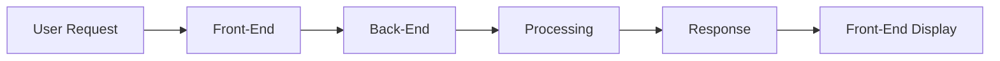
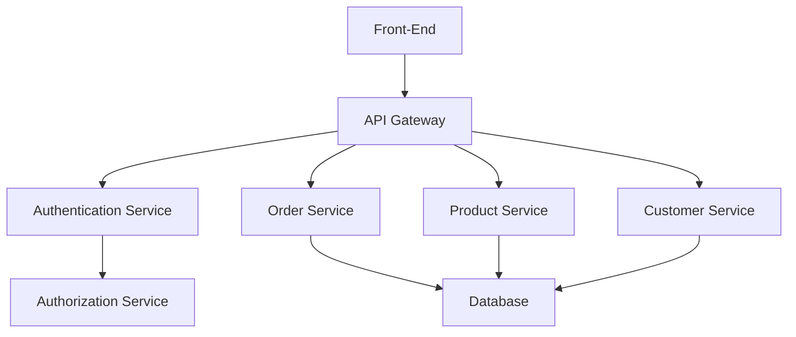
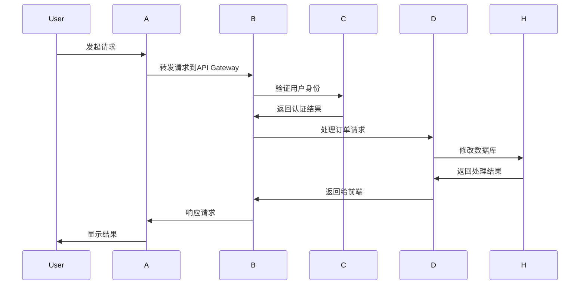

                 

# 前后端分离：增强系统灵活性的架构策略

> 关键词：前后端分离、架构设计、系统灵活性、微服务、系统优化

> 摘要：
本文将深入探讨前后端分离在提高系统灵活性方面的作用，通过一步步的逻辑分析和实例讲解，揭示这一架构策略背后的原理和实践方法。我们将从背景介绍、核心概念与联系、算法原理讲解、系统分析与架构设计方案、项目实战、最佳实践 tips以及总结与拓展阅读等方面，全面解析前后端分离在现代软件系统架构中的应用和优势。

## 引言

### 什么是前后端分离

前后端分离是指将Web应用中的前端和后端开发分离成独立的模块，前端负责用户界面和交互，后端负责数据存储和处理。这种分离模式在近年来得到了广泛应用，其核心理念是提高系统的可维护性、可扩展性和灵活性。

### 为什么需要前后端分离

1. **提高开发效率**：前后端分离使开发人员可以并行工作，降低了开发周期。
2. **增强系统可维护性**：分离后的前端和后端模块独立更新，降低了系统故障的风险。
3. **提高系统灵活性**：前后端分离使系统能够更灵活地适应业务需求变化。
4. **更好的扩展性**：分离后的系统能够更容易地扩展和升级。

### 前后端分离的挑战

1. **数据同步问题**：前后端需要保证数据的同步和一致性。
2. **性能优化**：分离后的系统需要更多的性能优化工作。
3. **安全性问题**：前后端的分离可能带来安全漏洞。

## 核心概念与联系

### 前端（Front-End）

前端通常包括HTML、CSS和JavaScript，负责用户界面的展示和交互。

### 后端（Back-End）

后端负责数据处理、存储和业务逻辑的实现，通常使用Java、Python、Node.js等编程语言。

### 微服务（Microservices）

微服务是一种架构风格，它将应用程序作为一套小的服务组合起来，每个服务运行在其独立的进程中，通过轻量级的通信机制（通常是HTTP RESTful API）进行沟通。微服务架构与前后端分离有着紧密的联系，它们共同构成了现代软件系统架构的核心。

### 概念属性特征对比表格

| 特征           | 前端（Front-End）                           | 后端（Back-End）                            | 微服务（Microservices）                     |
| -------------- | ---------------------------------------- | ---------------------------------------- | ---------------------------------------- |
| 负责内容       | 用户界面、交互和展示                         | 数据处理、存储和业务逻辑                     | 独立的服务模块，每个服务负责一个特定的功能 |
| 编程语言       | HTML、CSS、JavaScript                      | Java、Python、Node.js等                     | Java、Go、Python等                         |
| 沟通机制       | JavaScript Object Notation (JSON)          | HTTP RESTful API                          | HTTP RESTful API                          |
| 可维护性       | 较高，易于更新和修改                        | 中等，需要维护多个模块                      | 高，独立模块易于维护                       |
| 扩展性         | 中等，受限与浏览器兼容性                    | 较高，可以通过增加服务器来扩展                | 高，可以独立扩展每个服务模块                |

### ER实体关系图架构

```mermaid
erDiagram
    Front-End ||--|{ User }|--| Back-End
    Back-End ||--|{ Service }|--| Database
```

## 算法原理讲解

### 请求处理流程

前后端分离的请求处理流程通常如下：

1. 用户在前端发起请求。
2. 前端将请求发送到后端。
3. 后端处理请求并返回结果。
4. 前端展示结果。

### Mermaid流程图



### Python代码示例

```python
import requests

def get_data():
    response = requests.get('http://back-end-url/data')
    return response.json()

if __name__ == '__main__':
    data = get_data()
    print(data)
```

### 算法原理

1. **请求处理**：前端发送请求，后端接收并处理。
2. **数据同步**：前后端通过JSON格式进行数据传输。
3. **异步处理**：前后端可以独立处理，提高系统响应速度。

### 数学模型和公式

$$
\text{系统响应时间} = \text{前端处理时间} + \text{后端处理时间} + \text{网络传输时间}
$$

## 系统分析与架构设计方案

### 问题场景介绍

假设我们正在开发一个电商系统，用户需要在网站上进行商品浏览、购物车管理、下单支付等操作。

### 项目介绍

项目名称：在线购物平台
项目背景：为了提高用户购物体验和系统性能，决定采用前后端分离架构。
技术栈：前端使用Vue.js，后端使用Spring Boot。

### 系统功能设计（领域模型类图）

```mermaid
classDiagram
    Customer <<class Customer>>
    Product <<class Product>>
    ShoppingCart <<class ShoppingCart>>
    Order <<class Order>>

    Customer o--1 ShoppingCart
    Customer o--1 Order
    Product o--1 ShoppingCart
    ShoppingCart o--1 Order
```

### 系统架构设计（架构图）



### 系统接口设计和系统交互（序列图）



## 项目实战

### 环境安装

1. 安装Node.js（用于前端开发）。
2. 安装Java和Maven（用于后端开发）。
3. 安装数据库（如MySQL或PostgreSQL）。

### 系统核心实现源代码

**前端（Vue.js）**

```vue
<template>
  <div>
    <h1>商品列表</h1>
    <ul>
      <li v-for="product in products" :key="product.id">
        {{ product.name }} - ¥{{ product.price }}
      </li>
    </ul>
  </div>
</template>

<script>
export default {
  data() {
    return {
      products: []
    };
  },
  created() {
    this.fetchProducts();
  },
  methods: {
    fetchProducts() {
      fetch('http://back-end-url/products')
        .then(response => response.json())
        .then(data => {
          this.products = data;
        });
    }
  }
};
</script>
```

**后端（Spring Boot）**

```java
@RestController
@RequestMapping("/products")
public class ProductController {
  
  @Autowired
  private ProductService productService;
  
  @GetMapping
  public List<Product> getAllProducts() {
    return productService.getAllProducts();
  }
}
```

### 代码应用解读与分析

前端代码解析：Vue组件负责展示商品列表，通过fetch方法向后端API获取数据。

后端代码解析：Spring Boot控制器接收HTTP请求，调用服务层方法处理业务逻辑，并将结果返回给前端。

### 实际案例分析和详细讲解剖析

案例分析：用户在电商网站浏览商品。

1. 用户发起请求，前端Vue组件发送GET请求到后端API。
2. 后端Spring Boot控制器接收到请求，调用服务层方法查询数据库获取商品列表。
3. 商品数据通过HTTP响应返回给前端。
4. 前端Vue组件接收到商品数据，更新UI展示给用户。

### 项目小结

通过本次项目实战，我们展示了如何使用前后端分离架构实现一个简单的电商系统。项目采用了Vue.js和Spring Boot作为技术栈，前端负责用户界面和交互，后端负责数据处理和存储。项目实践证明了前后端分离在提高开发效率、系统灵活性和可维护性方面的优势。

## 最佳实践 tips

1. **保持接口的稳定性和可扩展性**：设计接口时考虑未来的扩展性，确保接口的稳定性。
2. **性能优化**：对前后端分离的系统进行性能优化，如缓存策略、负载均衡等。
3. **安全性考虑**：加强对数据传输和存储的安全性保护，防止数据泄露和攻击。

## 结论

前后端分离作为一种现代软件系统架构策略，已经在提高系统灵活性、可维护性和扩展性方面展现了其强大的优势。通过本文的详细讲解和实例分析，我们深入了解了前后端分离的核心概念、算法原理、系统设计与架构方案以及实际应用。希望本文能够为读者在软件开发过程中提供有价值的参考和指导。

## 注意事项

1. **数据同步问题**：确保前后端数据的一致性，避免数据冲突。
2. **性能优化**：前后端分离的系统需要更多的性能优化，确保系统的响应速度。
3. **安全性问题**：加强对数据传输和存储的安全保护。

## 拓展阅读

1. 《微服务设计》 - Martin Fowler
2. 《重构：改善既有代码的设计》 - Martin Fowler
3. 《Clean Code：一个程序员的角度》 - Robert C. Martin

### 作者

作者：AI天才研究院/AI Genius Institute & 禅与计算机程序设计艺术 /Zen And The Art of Computer Programming

