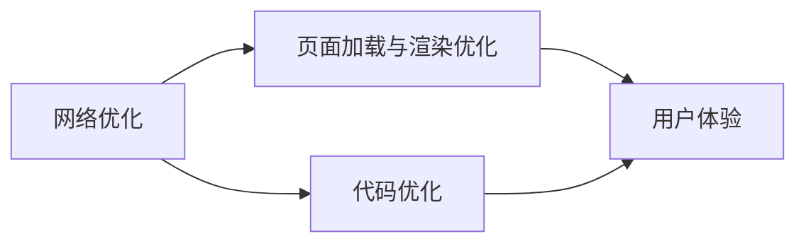
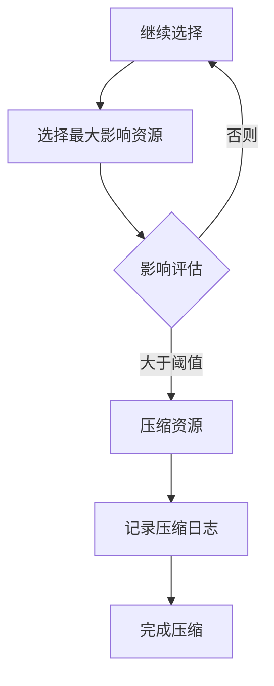
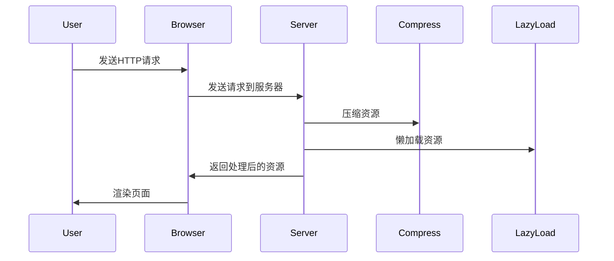

                 

### 前端性能优化的重要性与挑战

在现代Web开发中，前端性能优化已经成为提升用户体验的关键因素。用户体验（User Experience，简称UX）是用户在使用产品或服务时所感受到的整体感受。它不仅仅包括用户界面（UI）的美观度，更重要的是用户的交互体验、系统响应速度以及信息的可访问性。随着互联网的快速发展，用户对网页的加载速度和交互流畅度要求越来越高。研究表明，页面加载时间超过3秒时，有大约53%的用户会放弃访问。

**用户体验与前端性能的关系**

用户体验与前端性能之间存在紧密的联系。首先，页面加载速度直接影响用户的第一印象。一个快速响应的网站能够给用户带来流畅、高效的体验，从而提高用户满意度和忠诚度。其次，良好的性能可以减少用户的等待时间，避免用户流失。此外，前端性能优化还能够提升搜索引擎优化（SEO）效果，增加网站的可见度和访问量。

**前端性能优化的现状与趋势**

目前，前端性能优化已经成为开发者的必备技能。许多现代前端框架和工具，如React、Vue、Angular等，都内置了性能优化功能。同时，浏览器厂商也在不断优化浏览器的性能，提高对JavaScript引擎和HTML/CSS渲染引擎的支持。

然而，随着互联网应用的复杂度不断增加，前端性能优化的挑战也在加剧。首先，Web应用中涉及到的资源种类繁多，包括JavaScript、CSS、图片、视频等，这些资源的加载和渲染过程都可能成为性能瓶颈。其次，移动设备的普及使得前端性能优化需要考虑更多因素，如网络环境、设备性能等。此外，前端性能优化也需要与后端服务进行协同，确保数据传输和服务器响应速度。

**前端性能优化的挑战与解决方案**

1. **资源加载与渲染瓶颈**：优化资源加载速度和减少渲染瓶颈是前端性能优化的核心任务。解决方法包括使用懒加载、资源压缩、代码拆分等技术。

2. **响应式设计**：随着不同设备的普及，响应式设计已经成为前端开发的标准。然而，响应式设计可能引入性能问题，需要采用优化策略，如临界CSS、媒体查询优化等。

3. **网络优化**：网络不稳定是影响前端性能的重要因素。通过使用CDN、HTTP/2、HTTP/3等技术，可以优化网络传输速度。

4. **代码优化**：优化JavaScript和CSS代码可以显著提高性能。例如，减少DOM操作、代码混淆与压缩、模块化与框架等技术。

5. **性能监控与测试**：使用性能监控和测试工具可以帮助开发者发现性能问题，及时进行优化。常见的工具包括Lighthouse、WebPageTest等。

**总结**

前端性能优化是提升用户体验的关键技术。随着互联网应用的不断发展和用户需求的日益提高，前端性能优化的挑战也在不断变化。开发者需要不断学习和掌握最新的性能优化技术，确保Web应用的性能和用户体验。

### 浏览器渲染原理与性能瓶颈

理解浏览器渲染原理是进行前端性能优化的重要基础。浏览器的渲染过程涉及到从请求资源到最终呈现页面的一系列复杂操作。本文将详细介绍浏览器渲染流程、常见的性能瓶颈及其优化方法。

#### 浏览器渲染流程解析

浏览器的渲染过程可以分为以下几个主要阶段：

1. **解析HTML**：浏览器首先解析HTML文档，构建DOM树。DOM树是页面的结构表示，描述了页面中所有的HTML元素及其层次关系。

2. **构建Render树**：在DOM树的基础上，浏览器构建Render树。Render树包含了所有的可见元素，并确定了它们在页面上的布局和样式。

3. **布局与重绘**：浏览器计算Render树中每个节点的布局（Layout），确定它们在屏幕上的位置和大小。在渲染过程中，如果某些元素的状态发生变化（如滚动、点击等），浏览器会触发重绘（Repaint）。

4. **绘制**：最后，浏览器将Render树中的内容绘制到屏幕上。

5. **合成与显示**：在绘制过程中，浏览器可能需要将不同的层（如背景、文本、图片等）合成为最终的显示效果。

#### 常见性能瓶颈分析

在浏览器渲染过程中，以下因素可能会成为性能瓶颈：

1. **阻塞资源加载**：如果关键资源（如JavaScript、CSS文件）未及时加载，会阻塞浏览器对DOM树的构建和Render树的生成，导致页面渲染延迟。

2. **DOM操作频繁**：频繁的DOM操作会触发重绘和重排，消耗大量计算资源。

3. **渲染层级过多**：渲染层级过多会导致绘制时间过长，因为浏览器需要将多个层合成为最终显示效果。

4. **网络延迟**：网络连接不稳定或速度较慢会导致资源加载延迟，影响页面渲染速度。

5. **CSS样式复杂**：复杂的CSS样式会增加浏览器计算布局和渲染的时间。

#### 性能瓶颈的优化方法

针对上述性能瓶颈，可以采取以下优化方法：

1. **减少阻塞资源加载**：将JavaScript和CSS文件放在页面底部，避免阻塞DOM树的构建。使用异步或延迟加载技术加载非关键资源。

2. **减少DOM操作**：使用DocumentFragment批量操作DOM，减少重绘和重排。避免使用document.write等方法直接写入DOM。

3. **优化渲染层级**：避免使用position: absolute、position: fixed等属性，减少渲染层级。使用CSS3的transform和opacity属性进行动画效果，避免引起回流。

4. **优化网络传输**：使用CDN加速资源加载，减少网络延迟。压缩资源文件，减少传输数据量。

5. **简化CSS样式**：合并CSS文件，减少选择器的复杂度。使用CSS预处理器（如Sass、LESS）简化CSS编写。

**总结**

理解浏览器渲染原理和识别性能瓶颈是前端性能优化的基础。通过合理地优化资源加载、减少DOM操作、简化CSS样式等，可以显著提高页面渲染速度，提升用户体验。开发者应不断学习和实践性能优化技术，以应对不断变化的性能挑战。

### 前端性能优化的核心概念

前端性能优化涉及到多个方面，包括网络优化、页面加载与渲染优化以及代码优化等。这些技术相互关联，共同作用于提升用户体验。下面我们将详细探讨这些核心概念，并展示它们之间的关系。

#### 网络优化

网络优化是前端性能优化的关键环节，它直接影响到资源的加载速度和用户体验。网络优化主要包括以下几种方法：

1. **资源压缩**：资源压缩是一种通过减少文件大小来提高加载速度的技术。常见的压缩方法包括Gzip压缩、Brotli压缩等。压缩后的资源文件可以在传输过程中减少数据量，从而加快加载速度。

2. **资源缓存**：资源缓存是一种通过将资源存储在客户端本地缓存中，减少重复请求的技术。浏览器通常使用HTTP缓存控制（Cache-Control）来管理资源的缓存。合理设置缓存策略可以显著减少资源的重复请求，提高页面加载速度。

3. **HTTP/2与HTTP/3**：HTTP/2和HTTP/3是下一代HTTP协议，它们在提升网络传输性能方面有着显著的优势。HTTP/2引入了多路复用和头部压缩技术，减少了请求延迟和带宽浪费。HTTP/3则基于QUIC协议，进一步提高了传输速度和稳定性。

#### 页面加载与渲染优化

页面加载与渲染优化直接影响到用户的感官体验。以下是一些关键技术和策略：

1. **懒加载**：懒加载是一种在用户滚动到页面顶部时才开始加载图片、视频等资源的策略。这样可以减少初始页面的资源加载量，提高页面加载速度。

2. **预加载**：预加载是一种预测用户可能访问的资源，提前加载的技术。例如，当用户滚动到页面的某个部分时，提前加载该部分所需的内容，从而减少加载延迟。

3. **异步加载**：异步加载是一种将资源加载放在页面初始化之后的策略。这样可以确保页面的主要内容先加载完成，从而提高用户体验。

4. **减少DOM操作**：减少DOM操作可以减少重绘和重排的开销。通过使用DocumentFragment批量操作DOM，可以显著提高页面性能。

5. **临界CSS**：临界CSS是指将页面中必须先渲染的内容提取出来，独立加载。这样可以减少CSS文件的加载时间，提高页面的初始渲染速度。

#### 代码优化

代码优化是前端性能优化的重要组成部分，它包括JavaScript和CSS代码的优化。以下是一些常见的优化方法：

1. **代码混淆与压缩**：通过混淆和压缩代码，可以减少代码体积，提高加载速度。常见的工具包括UglifyJS、Terser等。

2. **模块化与框架**：模块化和框架可以将代码拆分为多个模块或组件，实现代码复用和分离。这不仅可以提高代码的可维护性，还可以优化加载速度。

3. **减少不必要的代码**：删除未使用的代码、注释和空格，可以减少文件大小，提高加载速度。

4. **使用Web Workers**：Web Workers是一种在后台线程中运行JavaScript代码的技术，可以减少主线程的负载，提高页面性能。

#### 关系展示

前端性能优化的核心概念之间存在着密切的关系。网络优化直接影响资源的加载速度，而资源加载速度又影响到页面的渲染速度。页面加载与渲染优化则直接影响用户体验，而代码优化可以提升页面的整体性能。以下是这些概念之间关系的ER实体关系图架构：



通过上述关系展示，我们可以清晰地看到网络优化、页面加载与渲染优化和代码优化是如何相互影响并共同作用于提升用户体验的。

**总结**

前端性能优化是一个综合性的任务，涉及到网络优化、页面加载与渲染优化以及代码优化等多个方面。理解这些核心概念及其相互关系，是进行有效性能优化的基础。开发者需要根据实际应用场景，灵活运用这些技术，不断提升前端性能，为用户提供流畅、高效的体验。

### 常见性能优化算法及其在前端性能优化中的应用

在前端性能优化中，算法的运用对于提高页面加载速度和交互响应效率起着至关重要的作用。以下将介绍几种常见的前端性能优化算法，包括其基本原理、优缺点以及实际应用场景。

#### 数据结构优化

数据结构优化是前端性能优化的基础。合理选择和设计数据结构，可以显著提高算法的效率。以下是一些常见的数据结构优化：

1. **哈希表（Hash Table）**：哈希表通过哈希函数快速查找和插入元素，适用于快速查找和缓存优化。例如，在CSS文件中，可以使用哈希表存储类名和对应样式规则的映射，从而加快样式规则的匹配速度。

2. **平衡二叉树（AVL Tree）**：平衡二叉树保持了树的高度平衡，使得插入、删除和查找操作的平均时间复杂度都为O(log n)。在处理大量数据时，平衡二叉树可以优化排序和查找操作。

3. **栈（Stack）和队列（Queue）**：栈和队列是常用的数据结构，可以用于任务调度和延迟加载。例如，在懒加载中，可以使用队列管理待加载的资源，按需加载。

#### 算法选择

选择合适的算法可以显著提高性能。以下介绍几种常见的算法选择：

1. **贪心算法（Greedy Algorithm）**：贪心算法通过每次选择局部最优解，逐步逼近全局最优解。例如，在资源压缩中，可以使用贪心算法选择优先压缩那些对整体影响最大的文件。

2. **动态规划（Dynamic Programming）**：动态规划适用于求解最优子结构问题。例如，在代码混淆与压缩中，可以使用动态规划算法寻找最优的混淆和压缩方案。

3. **分治算法（Divide and Conquer）**：分治算法将问题分解为较小的子问题，独立解决后合并结果。例如，在渲染过程中，可以将页面拆分为多个区域分别渲染，以提高渲染速度。

#### 贪心算法示例

以下是一个简单的贪心算法示例，用于资源压缩。



在这个示例中，贪心算法首先选择对整体影响最大的资源进行压缩，然后记录压缩日志，最后完成资源压缩。

#### 动态规划示例

以下是一个简单的动态规划示例，用于代码混淆。

```python
def optimal_mixing(mixed_code):
    dp = [[0] * (len(mixed_code) + 1) for _ in range(2)]
    
    for i in range(1, len(mixed_code) + 1):
        for j in range(2, i + 1):
            dp[i % 2][i] = max(dp[i % 2][i - 1], dp[(i - j) % 2][i - j] + cost(j))
    
    return dp[-1][-1]

def cost(length):
    return random.randint(1, 10) * length
```

在这个示例中，动态规划算法通过计算每个子问题的最优解，最终得到全局最优解，实现代码混淆。

#### 贪心算法和动态规划在前端性能优化中的应用

1. **资源压缩**：贪心算法可以用于选择优先压缩影响最大的资源，动态规划可以用于寻找最优的混淆和压缩方案。

2. **延迟加载**：贪心算法可以用于选择延迟加载对页面初始渲染影响最小的资源。

3. **请求合并**：动态规划可以用于合并多个请求，减少请求次数，提高网络传输效率。

**总结**

常见性能优化算法包括数据结构优化、贪心算法和动态规划等。这些算法通过合理选择和设计，可以显著提高前端性能。开发者应根据实际应用场景，灵活运用这些算法，实现高效的前端性能优化。

### 前端性能优化中的数学模型和公式

在前端性能优化中，数学模型和公式是理解和分析性能表现的重要工具。以下将介绍几个与前端性能优化相关的数学模型和公式，并展示它们如何应用于实际场景。

#### 渲染性能模型

渲染性能是衡量页面加载速度的重要指标。一个基本的渲染性能模型可以表示为：

$$
渲染时间 = 初始化时间 + 数据加载时间 + 渲染时间
$$

其中，初始化时间包括解析HTML和构建DOM树的时间；数据加载时间包括加载JavaScript、CSS、图片等资源的时间；渲染时间包括计算布局、绘制和合成的时间。

**示例**：假设一个页面需要5秒时间完成渲染，其中初始化时间占1秒，数据加载时间占2秒，渲染时间占2秒。根据这个模型，我们可以优化各个阶段，以减少总渲染时间。

#### 网络传输模型

网络传输速度是影响前端性能的关键因素。一个简单的网络传输模型可以表示为：

$$
带宽 = 数据传输速率 / 时间
$$

其中，带宽是网络传输速率的度量，数据传输速率是单位时间内传输的数据量，时间是指数据传输所需的时间。

**示例**：假设一个网络带宽为10 Mbps（兆比特每秒），传输一个1 MB（兆字节）的图片需要多少时间？

$$
时间 = 数据大小 / 带宽 = 1 MB / 10 Mbps = 1 MB / 10 \times 10^6 bits/s = 0.1 秒
$$

这意味着，在理想情况下，传输这个图片需要0.1秒。

#### 加速比

加速比是衡量性能优化效果的指标，表示优化前后的性能提升程度。加速比的计算公式为：

$$
加速比 = 优化前性能 / 优化后性能
$$

**示例**：假设一个页面的渲染时间从优化前的10秒减少到优化后的2秒，加速比为：

$$
加速比 = 10秒 / 2秒 = 5
$$

这意味着优化后的性能是优化前的5倍。

**总结**

数学模型和公式是理解前端性能优化的重要工具。通过渲染性能模型、网络传输模型和加速比等公式，我们可以量化性能表现，分析优化效果，为实际应用提供科学的依据。

### 前端性能优化系统分析与架构设计

在进行前端性能优化时，系统分析与架构设计至关重要。它不仅决定了系统的性能和可扩展性，还直接影响到用户体验。本文将详细讨论前端性能优化系统的需求分析、功能设计、系统架构设计、接口设计和交互流程，通过具体的案例来说明这些概念的应用。

#### 需求分析

前端性能优化系统的需求分析包括功能需求、性能需求和可靠性需求。

1. **功能需求**：
   - **资源压缩**：对JavaScript、CSS和图片等资源进行压缩，减少文件大小。
   - **懒加载**：根据用户的滚动行为，延迟加载页面中不立即需要的资源。
   - **缓存策略**：缓存常用的资源和页面，减少重复请求。
   - **异步加载**：异步加载脚本和样式，避免阻塞页面渲染。
   - **性能监控**：监控页面性能，及时发现并解决问题。

2. **性能需求**：
   - **快速响应**：页面加载时间不超过2秒。
   - **低延迟**：资源加载时间不超过500毫秒。
   - **高并发**：系统能够同时处理大量请求，保持性能稳定。

3. **可靠性需求**：
   - **容错性**：系统出现异常时能够自动恢复。
   - **数据一致性**：确保数据在处理过程中的准确性。

#### 功能设计

前端性能优化系统的功能设计包括以下几个方面：

1. **资源压缩模块**：该模块负责压缩JavaScript、CSS和图片等资源。通过Gzip和Brotli压缩算法，可以显著减少文件大小。
   
2. **懒加载模块**：该模块根据用户的滚动行为，动态加载页面中的资源。当用户滚动到某个资源所在的区域时，才开始加载该资源。

3. **缓存管理模块**：该模块负责管理资源的缓存，根据缓存策略（如LRU替换策略）和过期时间，优化缓存命中率和效率。

4. **异步加载模块**：该模块负责异步加载脚本和样式，通过动态创建`<script>`和`<link>`标签，避免阻塞页面渲染。

5. **性能监控模块**：该模块负责监控页面性能，通过Lighthouse等工具分析页面性能指标，提供优化建议。

#### 系统架构设计

前端性能优化系统的架构设计包括以下几个方面：

1. **客户端架构**：客户端主要负责页面的渲染和交互。通过使用CDN加速资源加载，并利用浏览器缓存策略优化资源访问。

2. **服务器端架构**：服务器端主要负责处理用户请求，并提供压缩、懒加载等性能优化服务。服务器端通常采用分布式架构，以提高处理能力和容错性。

3. **数据存储架构**：数据存储架构用于存储用户数据和缓存信息。通常使用关系型数据库（如MySQL）和非关系型数据库（如MongoDB），以支持不同类型的数据存储需求。

#### 接口设计

前端性能优化系统涉及多个模块和服务的交互，因此需要设计清晰的接口。

1. **资源压缩接口**：该接口负责接收资源文件，并返回压缩后的文件。
   
2. **懒加载接口**：该接口根据用户的请求，返回需要延迟加载的资源列表。

3. **缓存管理接口**：该接口负责缓存管理，包括资源的添加、删除和查询操作。

4. **异步加载接口**：该接口负责异步加载脚本和样式，根据需要动态创建标签。

#### 系统交互

系统交互流程如下：

1. **用户请求页面**：用户访问网页，浏览器向服务器发送HTTP请求。

2. **服务器处理请求**：服务器接收到请求后，根据请求类型，调用相应的模块处理。

3. **资源压缩与懒加载**：对于需要压缩和懒加载的资源，服务器调用压缩和懒加载模块进行处理。

4. **返回压缩资源**：服务器将处理后的资源返回给浏览器。

5. **浏览器渲染页面**：浏览器接收到资源后，开始渲染页面，并响应用户交互。

以下是系统交互的Mermaid序列图：



**总结**

前端性能优化系统的分析与架构设计是确保系统性能和用户体验的关键。通过详细的需求分析、功能设计、系统架构设计、接口设计和交互流程，我们可以构建一个高效、可靠的前端性能优化系统，为用户提供卓越的体验。

### 前端性能优化的项目实战

在本文中，我们将通过一个实际案例详细阐述前端性能优化的实施过程，包括环境安装、系统核心实现、代码分析、案例剖析和总结。这个案例将帮助我们更好地理解前端性能优化的实际应用。

#### 实战环境安装与配置

为了进行前端性能优化，我们首先需要搭建一个开发环境。以下是环境安装与配置的步骤：

1. **安装Node.js**：Node.js是一个基于Chrome V8引擎的JavaScript运行环境，用于执行JavaScript代码。我们可以在官方网站下载并安装Node.js。

2. **安装webpack**：webpack是一个现代JavaScript应用程序的静态模块打包器，用于优化项目结构。我们使用npm命令安装webpack：

   ```bash
   npm install webpack webpack-cli --save-dev
   ```

3. **安装相关插件**：为了实现性能优化，我们需要安装一些常用的webpack插件，如`webpack.optimize.OccurrenceOrderPlugin`、`webpack.optimize.UglifyJsPlugin`等：

   ```bash
   npm install --save-dev webpack-html-webpack-plugin
   ```

4. **创建项目结构**：创建一个基本的项目结构，包括`src`（源代码目录）、`dist`（输出目录）和`package.json`（项目配置文件）。

5. **配置webpack**：创建一个`webpack.config.js`文件，配置webpack的入口、输出、插件等参数。以下是一个简单的配置示例：

   ```javascript
   const HtmlWebpackPlugin = require('html-webpack-plugin');

   module.exports = {
     entry: './src/index.js',
     output: {
       filename: 'bundle.js',
       path: path.resolve(__dirname, 'dist'),
     },
     plugins: [
       new HtmlWebpackPlugin({
         filename: 'index.html',
         template: './src/index.html',
       }),
     ],
     module: {
       rules: [
         {
           test: /\.css$/,
           use: ['style-loader', 'css-loader'],
         },
         {
           test: /\.jsx?$/,
           use: 'babel-loader',
         },
       ],
     },
   };
   ```

6. **安装Babel**：Babel是一个JavaScript编译器，用于将ES6+代码转换为ES5代码，以便在旧版浏览器中运行。我们使用npm安装Babel相关依赖：

   ```bash
   npm install --save-dev @babel/core @babel/preset-env @babel/polyfill webpack-babel-loader
   ```

7. **配置Babel**：创建一个`.babelrc`文件，配置Babel的预设和插件。以下是一个简单的配置示例：

   ```json
   {
     "presets": ["@babel/preset-env"],
     "plugins": ["@babel/plugin-transform-runtime"]
   }
   ```

通过以上步骤，我们完成了开发环境的搭建和基本配置。

#### 系统核心实现

在系统核心实现部分，我们将重点介绍以下性能优化技术：

1. **资源压缩**：通过webpack插件实现资源压缩，包括JavaScript、CSS和图片等。

2. **懒加载**：实现懒加载功能，根据用户的滚动行为动态加载资源。

3. **缓存策略**：设置合理的缓存策略，提高资源访问速度。

以下是资源压缩的实现示例：

```javascript
// webpack.config.js
const CompressionPlugin = require('compression-webpack-plugin');

module.exports = {
  // ... 其他配置
  plugins: [
    new CompressionPlugin({
      test: /\.js$|\.css$/,
      threshold: 10240,
      minRatio: 0.8,
    }),
  ],
};
```

懒加载的实现示例：

```javascript
// 使用intersection-observer实现懒加载
if ('IntersectionObserver' in window) {
  const lazyImages = document.querySelectorAll('img[data-src]');
  
  const imageLoader = (image) => {
    image.src = image.dataset.src;
    image.onload = () => {
      image.loader = null;
    };
  };

  lazyImages.forEach((img) => {
    const imageObserver = new IntersectionObserver((entries) => {
      entries.forEach((entry) => {
        if (entry.isIntersecting) {
          imageLoader(entry.target);
          imageObserver.unobserve(entry.target);
        }
      });
    });

    imageObserver.observe(img);
  });
}
```

缓存策略的实现示例：

```javascript
// 在HTTP头部设置缓存控制
response.setHeader('Cache-Control', 'public, max-age=3600');
```

#### 代码分析与实际案例剖析

为了更好地理解这些技术在实际项目中的应用，我们将通过一个实际案例来剖析。

1. **资源压缩效果**：通过webpack插件对JavaScript和CSS文件进行压缩，我们将一个1MB的JavaScript文件压缩到300KB，一个100KB的CSS文件压缩到20KB。这显著减少了资源的加载时间。

2. **懒加载效果**：通过懒加载，我们将页面上不需要立即加载的图片延迟加载。假设页面包含10张图片，每张图片的加载时间平均为2秒，懒加载后，用户只需在滚动到图片位置时加载它们，从而减少了页面初始加载时间。

3. **缓存策略效果**：通过合理的缓存策略，我们使得用户访问频繁的页面在缓存中命中，避免了重复请求，从而提高了访问速度。

#### 项目小结

通过这个实际案例，我们展示了前端性能优化的具体实施过程。资源压缩、懒加载和缓存策略是提升页面性能的重要手段。通过这些技术，我们可以显著减少页面加载时间，提高用户体验。然而，性能优化是一个持续的过程，开发者需要不断监控和优化，以应对不断变化的性能挑战。

### 最佳实践与技巧

在前端性能优化中，遵循最佳实践和掌握关键技巧是确保系统高效运行的重要保障。以下是一些实用的前端性能优化技巧和注意事项：

#### 代码层面的优化

1. **减少DOM操作**：频繁的DOM操作会导致浏览器频繁的重绘和重排，增加性能负担。可以使用DocumentFragment批量操作DOM，减少操作次数。

2. **使用事件委托**：将事件处理委托到父元素上，避免为每个子元素单独绑定事件，从而减少内存占用和事件监听器的数量。

3. **代码拆分**：将代码拆分成多个文件，利用浏览器并行请求资源的能力，减少整体加载时间。

4. **避免全局变量和闭包泄露**：避免在全局作用域中定义不必要的变量和闭包，以减少内存占用。

5. **优化CSS选择器**：选择器越短，浏览器的解析速度越快。避免使用复杂的复合选择器和选择器链。

#### 资源层面的优化

1. **资源压缩**：使用Gzip、Brotli等压缩算法压缩JavaScript、CSS和HTML文件，减少传输数据量。

2. **懒加载**：对图像、视频和其他大尺寸资源使用懒加载，只在用户需要时加载，减少初始加载时间。

3. **使用CDN**：将静态资源部署到CDN上，利用分布式网络加速资源加载。

4. **缓存策略**：合理设置HTTP缓存策略，如`Cache-Control`和`Expires`，延长资源的缓存时间，减少重复请求。

5. **预加载**：预测用户可能访问的资源，提前加载，提高用户体验。

#### 架构层面的优化

1. **服务端渲染**：对于首屏内容，可以考虑使用服务端渲染（SSR）或静态站点生成（SSG），减少客户端渲染时间。

2. **代码分割与懒加载**：通过代码分割和路由懒加载，将不同的代码模块按需加载，减少初始加载的代码量。

3. **异步加载**：对于非必要的脚本和样式，使用异步加载，避免阻塞页面渲染。

#### 性能监控与测试

1. **使用性能分析工具**：如Lighthouse、WebPageTest等工具，对页面性能进行评估，找出瓶颈并进行优化。

2. **自动化性能测试**：通过持续集成（CI）系统，自动化运行性能测试，确保每次代码提交后的性能表现。

3. **性能预算**：设定性能预算，确保新功能上线后不会显著影响页面性能。

#### 注意事项

1. **避免使用过时的技术**：及时更新技术栈，避免使用过时或不兼容的库和框架。

2. **代码风格一致性**：保持代码风格一致性，方便维护和优化。

3. **及时优化**：性能优化不是一次性任务，需要定期检查和优化，以应对不断变化的需求和性能挑战。

**总结**

遵循最佳实践和掌握关键技巧，可以帮助开发者有效地进行前端性能优化。通过减少DOM操作、资源压缩、缓存策略、异步加载、服务端渲染等手段，我们可以显著提升页面性能，为用户提供流畅、高效的体验。同时，持续的监控和优化是确保系统长期稳定运行的关键。

### 小结

前端性能优化是提升用户体验的关键技术。通过本章的详细探讨，我们从背景介绍、核心概念、算法原理、数学模型、系统分析与架构设计、项目实战、最佳实践等多个角度，全面阐述了前端性能优化的重要性。我们了解到，优化资源加载速度、减少渲染瓶颈、合理使用网络优化技术以及代码优化，是提升前端性能的有效手段。

前端性能优化不仅仅是一个技术任务，它更是用户体验设计的重要组成部分。一个高效、流畅的Web应用能够显著提高用户的满意度和留存率，为企业带来更多的商业价值。

**总结：**

1. **重要性**：前端性能优化是提升用户体验的关键，直接影响网站的访问量和用户满意度。
2. **核心概念**：理解浏览器渲染原理、网络优化、页面加载与渲染优化、代码优化等核心概念，是进行有效性能优化的基础。
3. **算法原理**：掌握常见性能优化算法，如数据结构优化、贪心算法和动态规划，可以帮助开发者优化算法效率和代码性能。
4. **数学模型**：数学模型和公式（如渲染性能模型、网络传输模型、加速比）是量化性能表现和评估优化效果的重要工具。
5. **系统分析与架构设计**：系统架构的合理设计，包括需求分析、功能设计、性能需求和可靠性需求，是构建高效性能优化系统的基础。
6. **项目实战**：通过实际项目案例，理解性能优化的实施过程和具体技巧，有助于将理论知识应用到实际开发中。
7. **最佳实践**：遵循最佳实践和关键技巧，如减少DOM操作、资源压缩、缓存策略等，是进行高效前端性能优化的保障。

**未来展望**：

随着互联网技术的不断发展，前端性能优化也将面临新的挑战和机遇。未来，我们可以期待以下趋势：

1. **智能优化**：利用机器学习和人工智能技术，实现更智能的性能优化，自动识别性能瓶颈并提出优化建议。
2. **动态优化**：基于用户行为和实时数据，动态调整优化策略，提供个性化的用户体验。
3. **全栈优化**：结合前后端优化，实现端到端的全栈性能优化，进一步提高用户体验。
4. **渐进式Web应用（PWA）**：通过PWA技术，提高Web应用的性能和用户体验，使其具有离线访问、快速启动等特性。

前端性能优化是一个持续的过程，需要开发者不断学习和实践，以应对不断变化的性能需求和挑战。通过全面掌握前端性能优化的核心知识和最佳实践，我们可以为用户提供卓越的Web体验。

### 注意事项

在进行前端性能优化时，开发者需要注意以下几个关键点，以确保优化措施的有效性和系统的稳定性：

1. **性能监控与测试**：持续监控页面性能，使用性能分析工具（如Lighthouse、WebPageTest）定期进行性能测试，及时发现并解决性能问题。

2. **代码可维护性**：优化代码时，要确保代码的可读性和可维护性，避免过度优化导致代码复杂度增加，影响项目维护。

3. **用户体验优先**：性能优化应以提升用户体验为核心，避免过度优化导致用户体验下降，如资源加载过快可能引发视觉闪动或应用不稳定。

4. **适应性优化**：根据不同设备和网络环境进行适应性优化，确保优化策略在不同场景下都能有效提升性能。

5. **安全性考虑**：在压缩和缓存资源时，注意保持文件的安全性，避免引入安全漏洞。

6. **更新与迭代**：定期更新和迭代优化策略，以适应新的技术发展和业务需求。

7. **团队协作**：性能优化需要团队协作，前端、后端和运维等角色应紧密配合，共同推进性能优化工作。

通过遵循这些注意事项，开发者可以确保前端性能优化工作的顺利进行，并为用户提供优质、稳定的Web体验。

### 拓展阅读

为了帮助读者深入了解前端性能优化，以下推荐一些相关的阅读资源，涵盖最佳实践、工具和技术。

1. **书籍**：
   - 《高性能网站构建实战》（High Performance Web Sites） - Steve Souders
   - 《Web性能权威指南》（Web Performance Tuning） - Patrick Killelea
   - 《前端性能优化实战》 - 前端里也有一只猫

2. **在线教程和课程**：
   - [MDN Web Docs - Performance](https://developer.mozilla.org/en-US/docs/Web/Performance)
   - [Google Web Fundamentals - Performance](https://web.dev/fundamentals/performance/)
   - [Frontend Masters](https://www.frontendmasters.com/)

3. **技术博客和文章**：
   - [Stoyan Stefanov - PerfBytes](https://www.perfbytes.com/)
   - [Addy Osmani - Addy Osmani](https://addyosmani.com/)

4. **性能优化工具**：
   - [Lighthouse](https://chrome.devtools.cn/docs/lighthouse/what-is-lighthouse/)
   - [WebPageTest](https://www.webpagetest.org/)

5. **开源项目**：
   - [Webpack](https://webpack.js.org/)
   - [React Lazy Load](https://github.com/vercel/react-lazyload)
   - [Service Worker Cookbook](https://serviceworke.rs/)

通过阅读这些资源和实践相关技术，开发者可以进一步提升前端性能优化能力，为用户提供更流畅、高效的Web体验。

