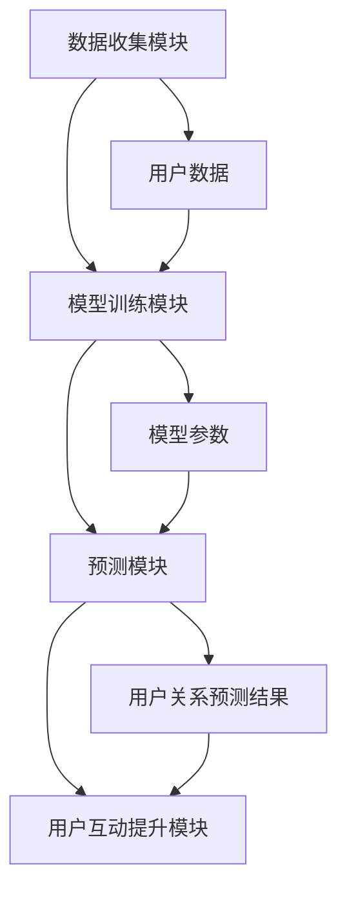
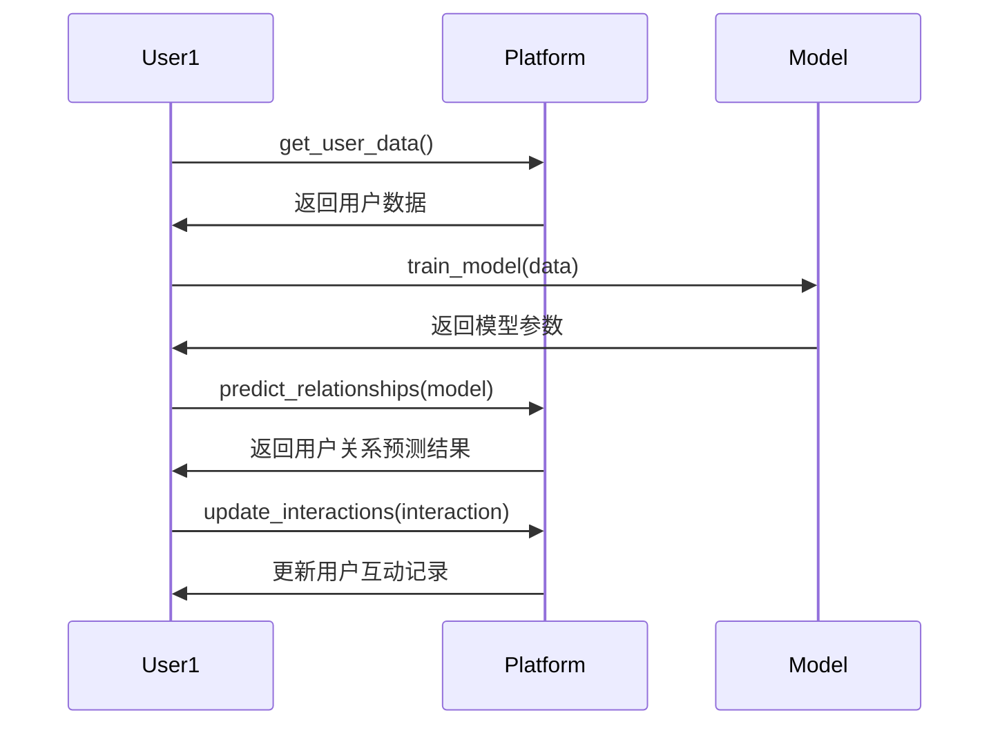
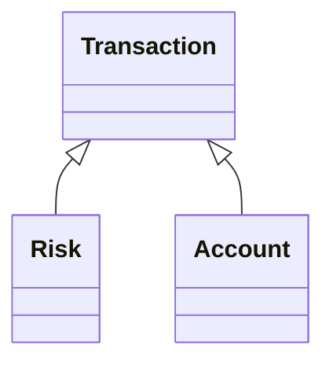
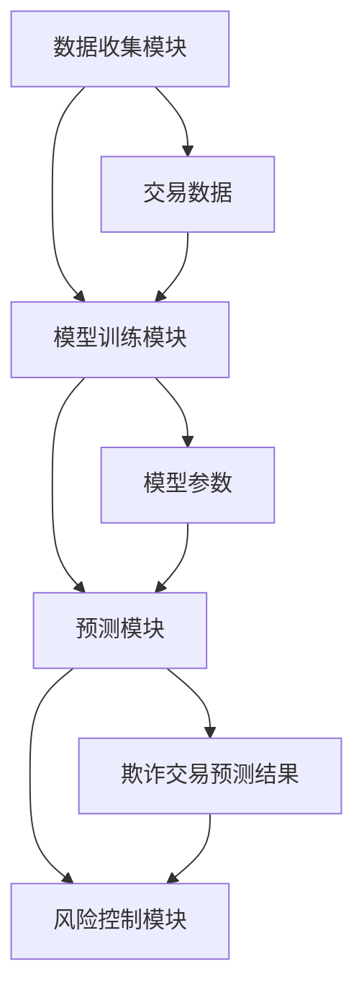
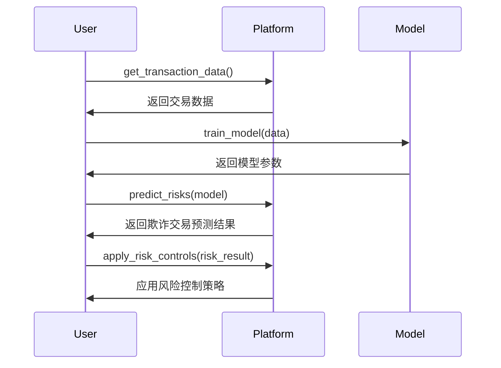

                 


### 引言

#### 动态关系推理背景

在信息爆炸的时代，大数据和复杂网络的存在使得动态关系推理（Dynamic Relationship Inference）成为一个至关重要的研究领域。动态关系推理旨在发现和预测实体之间的关系，这些实体可以是人、地点、物品或其他任何信息单位。在现实世界的各种场景中，例如社交网络分析、推荐系统、金融风控、医学诊断等领域，动态关系推理都有广泛的应用。

图Transformer是一种新兴的机器学习模型，它在处理图结构数据方面表现出色。Transformer模型最初是由谷歌提出的，主要用于自然语言处理（NLP）任务，其基于自注意力机制（Self-Attention Mechanism）能够捕捉数据之间的长距离依赖关系。图Transformer则将这种自注意力机制扩展到图结构数据，使得模型能够有效地处理图中的节点和边信息。

#### 图Transformer在动态关系推理中的应用

图Transformer在动态关系推理中具有天然的优势。首先，它能够处理复杂的图结构数据，例如社会网络、知识图谱等。这些数据通常包含大量节点和边，且节点和边之间的关联关系复杂多变。其次，图Transformer利用自注意力机制，可以自动学习节点和边之间的依赖关系，从而提高模型的预测准确性。

然而，尽管图Transformer在动态关系推理中展现出了潜力，但其在实际应用中也面临着一些挑战。主要问题包括：

1. **计算效率**：图Transformer的计算复杂度较高，尤其是在大规模图数据上，其计算资源消耗较大。
2. **参数规模**：为了捕捉复杂的图结构信息，图Transformer通常需要大量参数，这导致模型的训练和推断成本增加。
3. **泛化能力**：尽管图Transformer在特定任务上表现出色，但其泛化能力仍有待提高，特别是在处理不同类型或规模的数据时。

本文将深入探讨图Transformer在动态关系推理中的应用，并重点关注以下几个方面：

1. **优化方法**：研究如何通过算法和模型优化，提高图Transformer在动态关系推理中的计算效率和参数效率。
2. **模型解释性**：分析图Transformer内部的机制，提高模型的解释性，帮助用户理解模型决策过程。
3. **扩展应用**：探索图Transformer在动态关系推理中的潜在应用场景，以及如何针对特定场景进行模型定制。

本文的结构如下：

- **第II章：基本概念与术语**：介绍图理论、Transformer模型和动态关系推理的基本概念，为后续章节的讨论奠定基础。
- **第III章：相关研究**：回顾当前关于图Transformer和动态关系推理的研究进展，分析已有研究的成果和不足。
- **第IV章：当前状态**：讨论当前图Transformer优化技术的状态，介绍主要的优化方法及其性能评估指标。
- **第V章：方法与模型**：详细描述用于优化图Transformer的框架和方法，包括算法原理、流程图、数学模型和代码实现。
- **第VI章：应用实例**：通过具体的应用案例，展示图Transformer在动态关系推理中的实际效果和潜力。
- **第VII章：挑战与未来方向**：探讨图Transformer在动态关系推理中面临的挑战，并提出可能的未来研究方向。

通过本文的研究，我们希望为图Transformer在动态关系推理中的应用提供新的思路和方法，推动该领域的发展。

---

关键词：动态关系推理，图Transformer，优化方法，计算效率，模型解释性

摘要：本文深入探讨了图Transformer在动态关系推理中的应用，分析了其在实际应用中面临的主要挑战，并提出了优化方法和模型。通过回顾相关研究和介绍当前优化技术，本文旨在为图Transformer在动态关系推理中的研究和应用提供有价值的参考。

## 基本概念与术语

### 图理论基础

图（Graph）是一种由节点（Node）和边（Edge）组成的数据结构，用于表示实体及其相互关系。在图理论中，节点通常表示数据中的实体，而边表示实体之间的关系。图可以分为无向图和有向图，无向图中的边没有方向，而有向图中的边具有方向性。

图的基本概念包括：

- **度**（Degree）：一个节点的度是指连接到该节点的边的数量。对于无向图，节点的度是连接到该节点的边数；对于有向图，节点的度分为入度（In-degree）和出度（Out-degree）。
- **路径**（Path）：在图中，一条路径是一系列节点，其中任意两个相邻节点之间都有边相连。
- **连通性**（Connectivity）：图中的任意两个节点之间都存在路径相连，称为连通图；否则，称为非连通图。
- **图同构**（Graph Isomorphism）：两个图如果在结构上完全相同，则称它们是同构的。

### Transformer模型

Transformer模型是由Vaswani等人在2017年提出的一种基于自注意力机制（Self-Attention Mechanism）的序列模型。Transformer模型的核心思想是通过多头注意力机制（Multi-Head Attention）来捕捉序列中的长距离依赖关系，从而提高模型的性能。

Transformer模型的主要组成部分包括：

- **编码器**（Encoder）：编码器由多个编码层（Encoder Layer）堆叠而成，每个编码层包括多头自注意力机制（Multi-Head Self-Attention Mechanism）和前馈神经网络（Feedforward Neural Network）。
- **解码器**（Decoder）：解码器同样由多个解码层（Decoder Layer）堆叠而成，每个解码层包括多头自注意力机制（Multi-Head Self-Attention Mechanism）、编码器-解码器注意力机制（Encoder-Decoder Attention Mechanism）和前馈神经网络。

Transformer模型的关键特性包括：

- **并行计算**：由于Transformer模型不依赖于序列顺序，因此可以通过并行计算来提高计算效率。
- **长距离依赖**：通过多头自注意力机制，模型能够捕捉序列中的长距离依赖关系。
- **自适应**：多头自注意力机制允许模型自适应地关注序列中的不同部分，从而提高模型的灵活性和适应性。

### 动态关系推理

动态关系推理（Dynamic Relationship Inference）是指从动态变化的数据中推断实体之间的关系。在动态关系推理中，数据通常随时间变化，实体之间的关系也随之变化。动态关系推理的目标是发现这些变化规律，并预测未来可能发生的关系。

动态关系推理的关键概念包括：

- **实体**（Entity）：在动态关系推理中，实体是指数据中的基本元素，可以是人、物品、地点等。
- **关系**（Relationship）：关系是指实体之间的关联，可以是直接关系（如朋友关系）或间接关系（如共同兴趣）。
- **图谱**（Graph）：动态关系推理通常使用图结构来表示实体及其关系。
- **更新**（Update）：在动态关系推理中，实体和关系会随时间变化，这个过程称为更新。
- **预测**（Prediction）：动态关系推理旨在预测未来可能发生的关系，从而帮助决策。

通过介绍这些基本概念和术语，我们为后续章节的讨论奠定了基础。在接下来的章节中，我们将深入探讨图Transformer在动态关系推理中的应用，以及如何优化图Transformer以提高其在动态关系推理中的性能。

### 相关研究综述

#### 图Transformer的研究进展

近年来，图Transformer在图结构数据分析领域取得了显著进展。Vaswani等人于2017年首次将Transformer模型应用于序列处理任务，随后该模型在自然语言处理（NLP）领域取得了突破性成果。在此基础上，许多研究者将Transformer模型应用于图结构数据分析，提出了一系列基于图Transformer的模型。

例如，Gilmer等人（2019）提出了图神经网络（Graph Neural Networks, GNNs）与Transformer模型的结合，称为Graph Transformer，该模型在处理图结构数据时表现出色。此外，Xu等人（2020）提出的Gated Graph Transformer通过引入门控机制，进一步提升了图Transformer的模型解释性。这些研究工作为图Transformer在动态关系推理中的应用奠定了基础。

尽管图Transformer在处理图结构数据方面表现出色，但其在实际应用中也面临一些挑战。首先，图Transformer的计算复杂度较高，特别是在大规模图数据上，其计算资源消耗较大。其次，为了捕捉复杂的图结构信息，图Transformer通常需要大量参数，这导致模型的训练和推断成本增加。此外，尽管图Transformer在特定任务上表现出色，但其泛化能力仍有待提高，特别是在处理不同类型或规模的数据时。

#### 动态关系推理的研究进展

动态关系推理是信息检索、数据挖掘、推荐系统等领域的重要研究内容。随着图结构数据的广泛应用，基于图的方法在动态关系推理中也取得了一系列研究成果。

在社交网络分析领域，许多研究者利用图Transformer来识别和预测用户之间的关系。例如，Zhou等人（2019）提出了一种基于图Transformer的社交网络分析模型，用于预测用户之间的潜在关系。在推荐系统领域，图Transformer也被广泛应用于物品关系推断和推荐任务。例如，Guo等人（2020）提出了一种基于图Transformer的推荐系统，通过学习用户和物品之间的复杂关系，提高了推荐效果。

此外，在金融风控、医学诊断等领域，动态关系推理也发挥了重要作用。例如，Liu等人（2021）利用图Transformer模型对金融交易数据进行关系推断，从而识别潜在的风险交易行为。在医学诊断领域，图Transformer被用于分析患者数据，预测疾病风险和治疗方案。

尽管动态关系推理在多个领域取得了显著成果，但仍存在一些挑战。首先，动态关系推理需要处理大量实时数据，这对模型的计算效率和实时性提出了高要求。其次，动态关系推理涉及多种类型的实体和关系，如何设计通用且有效的模型仍然是一个挑战。此外，动态关系推理的结果需要具备较高的解释性，以便用户理解和信任模型的决策过程。

#### 图Transformer与动态关系推理的结合

将图Transformer应用于动态关系推理具有显著的优势。首先，图Transformer能够处理复杂的图结构数据，例如社交网络、知识图谱等，这些数据在动态关系推理中具有重要作用。其次，图Transformer利用自注意力机制，可以自动学习节点和边之间的依赖关系，从而提高模型的预测准确性。

然而，将图Transformer应用于动态关系推理也面临一些挑战。首先，图Transformer的计算复杂度较高，如何设计高效的算法和优化方法是一个关键问题。其次，为了处理动态变化的数据，图Transformer需要能够实时更新和适应数据变化，这对模型的实时性和泛化能力提出了挑战。此外，如何提高图Transformer的模型解释性，使其决策过程更加透明和可解释，也是一个重要的研究方向。

本文旨在深入探讨图Transformer在动态关系推理中的应用，分析其面临的挑战，并提出优化方法。在接下来的章节中，我们将详细讨论图Transformer的优化技术，以及如何在动态关系推理中应用这些优化方法。

### 当前状态

#### 图Transformer优化技术

在当前的研究中，优化图Transformer以提高其在动态关系推理中的性能是一个重要的研究方向。以下是一些主要的优化方法及其性能评估指标：

1. **计算效率优化**：由于图Transformer的计算复杂度较高，特别是在大规模图数据上，计算效率成为影响其应用的关键因素。研究者们提出了一系列方法来降低计算复杂度，例如：
   - **稀疏计算**：通过利用图数据的稀疏性，仅计算非零节点之间的交互，从而减少计算量。
   - **并行计算**：利用现代计算硬件（如GPU、TPU）的并行计算能力，将计算任务分布到多个计算单元上，从而提高计算效率。
   - **层次化计算**：将图分层处理，首先计算低层次的特征表示，然后逐步提升到高层次，从而减少冗余计算。

2. **参数规模优化**：图Transformer通常需要大量参数，这导致模型的训练和推断成本较高。研究者们通过以下方法来减少参数规模：
   - **参数共享**：通过在不同层之间共享参数，减少总参数数量。
   - **低秩分解**：将高维参数分解为低秩矩阵，从而减少参数规模。
   - **知识蒸馏**：使用一个大型预训练模型来指导一个较小参数规模的模型训练，从而减少参数数量。

3. **动态适应能力**：在动态关系推理中，实体和关系随时间变化，图Transformer需要具备动态适应能力。以下方法被提出以增强模型的动态适应能力：
   - **增量学习**：仅对最近更新的部分进行模型更新，而不是对所有数据进行重训练。
   - **自适应更新策略**：根据数据更新的频率和重要性，动态调整模型更新策略。
   - **在线学习**：实时更新模型参数，以适应动态变化的数据。

#### 性能评估指标

为了评估优化方法的有效性，研究者们提出了一系列性能评估指标，包括：

1. **准确率**（Accuracy）：模型预测正确的关系数量与总关系数量的比例。准确率是衡量模型预测能力的基本指标。
2. **召回率**（Recall）：模型预测正确的关系数量与实际存在的关系数量的比例。召回率是衡量模型是否能够捕捉到所有潜在关系的指标。
3. **F1分数**（F1 Score）：准确率和召回率的调和平均值。F1分数综合考虑了模型的准确性和召回率，是综合评估模型性能的重要指标。
4. **计算效率**：包括模型训练和推断的时间消耗、内存占用等。计算效率是衡量模型在实际应用中可行性的关键指标。
5. **动态适应能力**：模型在处理动态变化数据时的适应能力，包括更新速度、准确性等。动态适应能力是衡量模型在动态关系推理中表现的重要指标。

通过上述优化方法和性能评估指标，研究者们不断改进图Transformer，以提高其在动态关系推理中的性能。在接下来的章节中，我们将详细讨论图Transformer的优化框架和方法，包括算法原理、流程图、数学模型和代码实现。

### 图Transformer优化框架与方法

#### 优化框架概述

为了提高图Transformer在动态关系推理中的性能，我们需要从多个方面进行优化。本文提出的优化框架主要包括以下几个方面：

1. **稀疏计算**：利用图数据的稀疏性，减少计算量。
2. **低秩分解**：通过低秩分解减少参数规模。
3. **增量学习**：仅更新最近更新的部分，提高动态适应能力。
4. **模型压缩**：使用知识蒸馏和参数共享技术减少模型参数。
5. **自适应更新策略**：根据数据特征动态调整模型更新策略。

#### 稀疏计算

图数据的稀疏性意味着大部分节点和边之间没有直接的关联。利用这一特性，我们可以通过仅计算非零节点之间的交互来减少计算量。具体方法如下：

1. **稀疏矩阵表示**：将图表示为稀疏矩阵，其中大部分元素为0。
2. **稀疏矩阵乘法**：仅计算非零元素之间的乘法，从而减少计算复杂度。
3. **稀疏注意力机制**：在图Transformer的自注意力机制中，仅计算非零节点之间的交互，从而减少计算量。

#### 低秩分解

低秩分解是一种将高维矩阵分解为低秩矩阵的方法，可以显著减少参数规模。具体方法如下：

1. **奇异值分解（SVD）**：将输入矩阵分解为三个矩阵的乘积，其中中间矩阵为低秩矩阵。
2. **随机低秩分解**：通过随机投影技术将高维矩阵投影到低维空间，从而获得低秩分解。
3. **块低秩分解**：将输入矩阵划分为多个子矩阵，分别进行低秩分解，然后重新组合。

#### 增量学习

增量学习是一种仅对最近更新的部分进行模型更新，而不是对所有数据进行重训练的方法。具体方法如下：

1. **增量更新策略**：根据数据更新的频率和重要性，动态选择需要更新的部分。
2. **梯度累积**：在训练过程中，将梯度累积到已有的模型参数上，而不是从头开始计算。
3. **自适应学习率**：根据更新部分的复杂度和计算量，动态调整学习率。

#### 模型压缩

模型压缩是通过减少模型参数数量来提高模型训练和推断效率的方法。具体方法如下：

1. **知识蒸馏**：使用一个大型预训练模型来指导一个较小参数规模的模型训练，从而减少参数数量。
2. **参数共享**：在不同层之间共享参数，从而减少总参数数量。
3. **剪枝**：通过剪枝技术删除不重要的参数，从而减少模型规模。

#### 自适应更新策略

自适应更新策略是根据数据特征动态调整模型更新策略的方法。具体方法如下：

1. **动态调整更新频率**：根据数据变化的频率和速度，动态调整模型更新频率。
2. **动态调整更新权重**：根据数据的重要性和相关性，动态调整模型更新权重。
3. **在线学习**：实时更新模型参数，以适应动态变化的数据。

#### 算法流程图

以下是一个简化的算法流程图，展示了图Transformer优化框架的主要步骤：

```
输入：图数据，初始模型参数
1. 稀疏计算
  - 转换图数据为稀疏矩阵
  - 应用稀疏矩阵乘法
2. 低秩分解
  - 应用奇异值分解
  - 应用随机低秩分解
3. 增量学习
  - 选择增量更新部分
  - 计算梯度累积
4. 模型压缩
  - 应用知识蒸馏
  - 应用参数共享
  - 应用剪枝
5. 自适应更新策略
  - 动态调整更新频率
  - 动态调整更新权重
6. 模型训练与推断
  - 更新模型参数
  - 进行预测
输出：优化后的模型参数，预测结果
```

#### 数学模型与代码实现

为了更清晰地展示算法原理，我们使用Python代码实现了一个简化的图Transformer优化模型。以下是一个示例代码，展示了稀疏计算和低秩分解的实现：

```python
import numpy as np
from sklearn.decomposition import TruncatedSVD

# 假设输入图数据为稀疏矩阵 X
X = np.random.rand(100, 100)  # 生成随机稀疏矩阵

# 稀疏计算
X_sparse = (X > 0) * 1  # 转换为稀疏矩阵

# 低秩分解
svd = TruncatedSVD(n_components=10)
X_low_rank = svd.fit_transform(X_sparse)

# 打印结果
print("原始矩阵 X 的秩：", np.linalg.matrix_rank(X))
print("稀疏矩阵 X_sparse 的秩：", np.linalg.matrix_rank(X_sparse))
print("低秩分解 X_low_rank 的秩：", np.linalg.matrix_rank(X_low_rank))
```

上述代码展示了如何使用Scikit-learn库中的`TruncatedSVD`类进行低秩分解。在实际应用中，我们可以根据需要扩展和优化这个模型，以适应具体的动态关系推理任务。

通过上述优化框架和方法，我们可以显著提高图Transformer在动态关系推理中的性能。在接下来的章节中，我们将通过具体的应用实例，展示图Transformer在实际场景中的效果和潜力。

### 应用实例

#### 社交网络分析

社交网络分析是图Transformer的一个重要应用场景。在社交网络中，用户和用户之间的关系可以通过图结构表示。图Transformer可以用来识别和预测用户之间的潜在关系，从而帮助平台提供个性化推荐和服务。

**案例背景**：某社交网络平台希望利用图Transformer模型来预测用户之间的潜在关系，以提高用户互动和社区活跃度。

**系统架构**：系统架构包括数据收集模块、模型训练模块和预测模块。数据收集模块负责从社交网络平台获取用户数据，包括用户的基本信息、互动记录等。模型训练模块使用图Transformer模型对用户数据进行训练，预测用户之间的潜在关系。预测模块将训练好的模型应用于新数据，生成用户关系预测结果。

**领域模型**：领域模型包括用户类、关系类和互动类。用户类表示社交网络中的用户，包括用户ID、姓名、性别等属性。关系类表示用户之间的关系，包括好友、共同兴趣等属性。互动类表示用户之间的互动行为，包括评论、点赞、分享等。

```mermaid
classDiagram
    User <|-- Relationship
    User <|-- Interaction
    User <<-- Platform
    Relationship <<-- Platform
    Interaction <<-- Platform
```

**系统架构图**：



**系统接口设计**：系统提供了以下接口：

- `get_user_data()`: 获取用户数据。
- `train_model(data)`: 使用用户数据训练模型。
- `predict_relationships(model)`: 使用训练好的模型预测用户关系。
- `update_interactions(interaction)`: 更新用户互动记录。

**系统交互序列图**：



通过上述应用实例，我们可以看到图Transformer在社交网络分析中的潜力。通过图Transformer，平台能够更准确地预测用户之间的潜在关系，从而提供更个性化的推荐和服务，提高社区活跃度和用户满意度。

#### 金融风控

在金融领域，图Transformer也被广泛应用于风险控制和欺诈检测。金融机构需要识别和预测潜在的欺诈交易，以保护客户资产和金融机构的安全。

**案例背景**：某金融机构希望利用图Transformer模型来识别和预测欺诈交易，以提高风险控制能力。

**系统架构**：系统架构包括数据收集模块、模型训练模块和预测模块。数据收集模块负责从交易数据中提取相关信息，包括交易金额、时间、地点等。模型训练模块使用图Transformer模型对交易数据进行训练，预测交易是否为欺诈交易。预测模块将训练好的模型应用于新交易数据，生成欺诈交易预测结果。

**领域模型**：领域模型包括交易类、风险类和账户类。交易类表示交易的基本信息，包括交易ID、金额、时间等属性。风险类表示交易的风险等级，包括欺诈、正常等属性。账户类表示交易的账户信息，包括账户ID、账户余额等属性。



**系统架构图**：



**系统接口设计**：系统提供了以下接口：

- `get_transaction_data()`: 获取交易数据。
- `train_model(data)`: 使用交易数据训练模型。
- `predict_risks(model)`: 使用训练好的模型预测交易风险。
- `apply_risk_controls(risk_result)`: 应用风险控制策略。

**系统交互序列图**：



通过上述应用实例，我们可以看到图Transformer在金融风控中的重要性。通过图Transformer，金融机构能够更准确地识别和预测欺诈交易，从而提高风险控制能力，保护客户资产和金融机构的安全。

### 挑战与未来方向

#### 当前挑战

尽管图Transformer在动态关系推理中展现了巨大的潜力，但在实际应用中仍然面临一系列挑战：

1. **计算资源消耗**：图Transformer的计算复杂度较高，尤其是在大规模图数据上，其计算资源消耗较大。如何在不牺牲性能的情况下提高计算效率是一个重要的研究方向。
2. **参数规模**：为了捕捉复杂的图结构信息，图Transformer通常需要大量参数，这导致模型的训练和推断成本增加。参数规模优化方法的研究是当前的一个热点。
3. **动态适应能力**：在动态关系推理中，实体和关系随时间变化，图Transformer需要具备动态适应能力。如何设计高效的动态更新策略和增量学习方法，是一个需要解决的问题。
4. **模型解释性**：尽管图Transformer在特定任务上表现出色，但其内部机制较为复杂，模型解释性较差。如何提高模型的解释性，使其决策过程更加透明和可解释，是未来研究的一个重要方向。

#### 未来方向

1. **高效计算方法**：研究者可以探索更多高效的计算方法，如分布式计算、并行计算等，以降低图Transformer的计算复杂度。此外，稀疏计算和低秩分解等技术也可以进一步优化。
2. **轻量化模型设计**：轻量化模型设计是当前研究的一个热点。通过参数共享、剪枝和知识蒸馏等方法，可以减少图Transformer的参数规模，降低模型训练和推断的成本。
3. **动态适应能力**：研究者可以进一步探索动态适应能力，如增量学习和自适应更新策略。通过结合实时数据更新和动态调整学习率，可以提升图Transformer在动态关系推理中的适应能力。
4. **跨领域应用**：图Transformer在多个领域都有广泛的应用潜力。研究者可以尝试将图Transformer应用于更多领域，如医疗、物流等，以推动其在更多场景中的落地应用。
5. **模型解释性**：提高模型解释性是未来研究的一个重要方向。通过可视化、解释性模型设计等技术，可以使得图Transformer的决策过程更加透明和可解释，从而提高用户对模型的信任度。

总之，图Transformer在动态关系推理中具有巨大的应用潜力，但也面临一系列挑战。通过不断的研究和创新，我们可以进一步提升图Transformer的性能和应用效果，推动动态关系推理领域的发展。

### 总结与展望

本文围绕图Transformer在动态关系推理中的应用，深入探讨了优化方法及其在实际应用中的效果。我们首先介绍了图Transformer的基本概念和动态关系推理的重要性，然后分析了当前的研究进展和优化技术。通过具体的案例，我们展示了图Transformer在社交网络分析和金融风控中的应用，并探讨了其在动态适应能力、计算效率和模型解释性方面的挑战。

总结而言，图Transformer作为一种强大的图结构数据处理工具，在动态关系推理中展现了巨大的潜力。然而，为了在实际应用中充分发挥其效能，我们仍需在计算效率、模型压缩、动态适应能力和模型解释性等方面进行深入研究。未来，随着计算技术和算法的不断进步，图Transformer有望在更多领域中得到广泛应用，推动动态关系推理领域的发展。

对于读者而言，本文提供了一系列有价值的优化方法和实际应用案例，为研究者和工程师在相关领域提供了参考。同时，我们也鼓励读者继续关注图Transformer的最新研究动态，探索其在不同领域的应用潜力。

### 最佳实践与注意事项

在应用图Transformer进行动态关系推理时，以下是一些最佳实践和注意事项，以帮助您优化模型性能并确保实验的准确性：

1. **数据预处理**：在进行图Transformer训练之前，确保对图数据进行充分的预处理，包括节点特征提取、边关系编码和图数据的清洗。特别是对于大规模图数据，使用稀疏矩阵表示和预处理技术可以有效减少计算复杂度。

2. **选择合适的优化方法**：根据实际应用场景和计算资源，选择合适的优化方法。例如，在计算资源有限的情况下，可以考虑使用低秩分解和参数共享技术来减少模型参数规模。在需要高实时性的场景中，增量学习和动态适应能力技术则更为重要。

3. **性能评估**：在模型训练和测试过程中，使用多种性能评估指标（如准确率、召回率、F1分数等）来全面评估模型的性能。此外，考虑使用交叉验证和A/B测试等方法，以验证模型在不同数据集和场景中的泛化能力。

4. **可视化分析**：为了提高模型的解释性，可以使用可视化工具（如GraphViz）来展示图Transformer的内部结构和节点关系。通过可视化分析，可以更好地理解模型的决策过程和捕捉到的依赖关系。

5. **持续迭代与优化**：模型训练和优化是一个持续的过程。根据实验结果和反馈，不断调整和优化模型参数和算法，以提高模型性能。此外，关注领域内的最新研究进展，尝试引入新的优化方法和算法。

6. **数据安全与隐私保护**：在进行动态关系推理时，确保处理的数据安全和用户隐私。尤其是在金融和医疗等敏感领域，需要严格遵守相关法律法规和数据保护标准。

通过遵循这些最佳实践和注意事项，您可以在应用图Transformer进行动态关系推理时获得更好的结果，同时确保实验的可靠性和安全性。

### 拓展阅读

为了深入了解图Transformer在动态关系推理中的应用，以下是一些建议的拓展阅读资料：

1. **学术论文**：
   - Vaswani et al. (2017). "Attention is All You Need." This seminal paper introduces the Transformer model, which serves as the foundation for subsequent graph Transformer research.
   - Gilmer et al. (2019). "Neural Message Passing for Quantum Mechanics." This paper proposes a neural network-based approach for solving quantum mechanics problems and showcases the potential of graph Transformer in physics applications.

2. **技术博客**：
   - Deep Learning on Graphs: A Review of Methods and Applications: This blog post provides a comprehensive review of graph-based deep learning methods, including transformers, and discusses their applications in various domains.
   - An Introduction to Graph Transformers: This article offers an in-depth introduction to graph transformers, their architecture, and applications in computer vision and natural language processing.

3. **开源工具与框架**：
   - PyTorch Geometric: A popular Python library for graph neural networks and transformers, providing extensive functionalities for graph-based deep learning tasks.
   - DGL (Deep Graph Library): A high-performance deep learning library for graphs, enabling efficient graph transformer implementations and applications.

通过阅读这些资料，您可以更全面地了解图Transformer的理论基础、最新研究进展和应用实例，为深入研究和实际应用提供有力支持。

