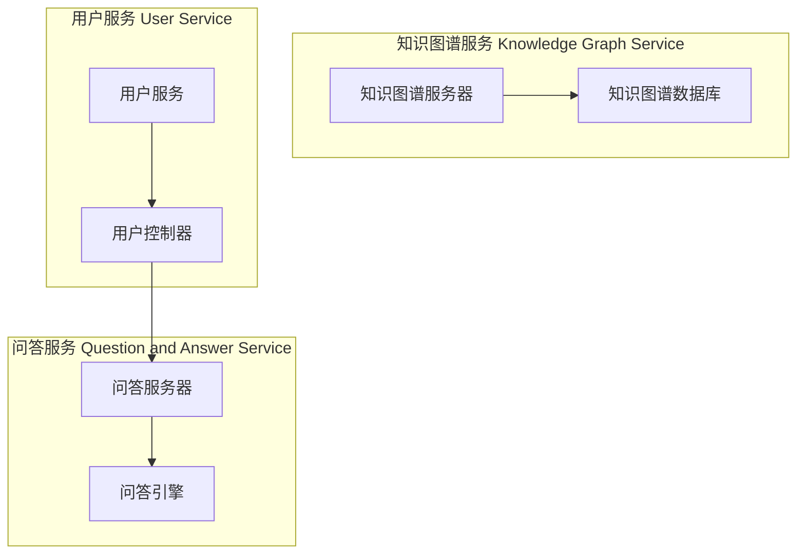
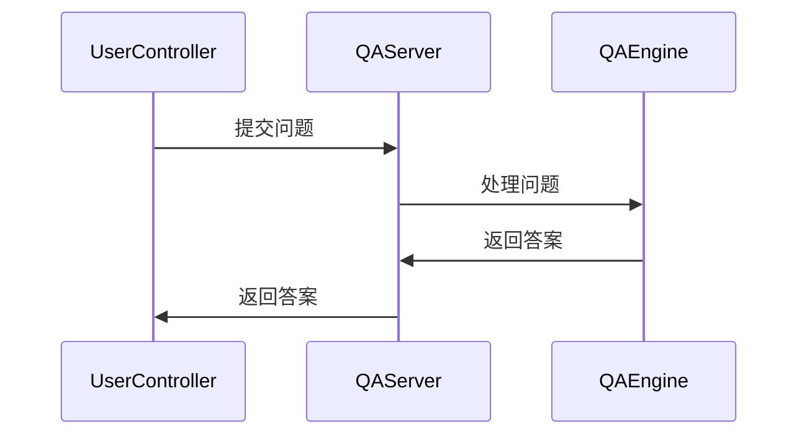

                 

### 动态图Transformer在知识演化推理中的应用

#### 关键词：动态图Transformer、知识演化推理、应用

#### 摘要：

本文探讨了动态图Transformer模型在知识演化推理中的应用，介绍了这一新兴技术的核心概念、设计原理和应用场景。通过详细的算法解释、系统设计描述以及实际项目案例分析，文章旨在为读者提供对动态图Transformer模型在知识推理领域的深入理解，并展示其在实际应用中的潜力。

## 引言

随着人工智能技术的快速发展，图神经网络（Graph Neural Networks，GNN）已成为处理复杂数据结构的重要工具。然而，传统的静态图神经网络在处理动态图数据时存在局限性。动态图Transformer模型的出现，为解决动态图数据的处理难题提供了新的思路。本文将介绍动态图Transformer模型的基本原理，并探讨其在知识演化推理中的应用。

### 动态图Transformer模型概述

#### 1.1 问题背景

在现实世界中，许多问题可以表示为图结构，如社交网络、知识图谱和生物网络等。这些图结构中的节点和边是动态变化的，即随着时间的推移，节点和边的关系会发生变化。这种动态性使得传统的静态图神经网络难以有效处理。为了解决这一问题，研究人员提出了动态图Transformer模型。

#### 1.2 核心概念

动态图Transformer模型是一种基于注意力机制的图神经网络，它能够处理动态图数据，并在知识演化推理中发挥重要作用。该模型的核心概念包括：

1. **动态图表示**：通过将节点和边的时间序列信息编码为向量，实现对动态图的有效表示。
2. **自注意力机制**：通过自注意力机制，模型能够自动学习节点之间的关系，并在不同时间步之间传递信息。
3. **知识演化推理**：通过动态图Transformer模型，可以实现知识点的动态演化，并在推理过程中捕捉到知识的演化规律。

#### 1.3 应用概述

动态图Transformer模型在知识演化推理中具有广泛的应用前景。例如，在智能问答系统中，可以用于实时更新和扩展知识图谱，提高问答的准确性；在推荐系统中，可以用于捕捉用户兴趣的动态变化，提供更个性化的推荐服务；在金融风控中，可以用于监测和预测金融市场中的动态风险。

## 基本概念

#### 2.1 动态图Transformer模型

动态图Transformer模型是一种基于Transformer架构的图神经网络，它通过动态图表示和自注意力机制，实现对动态图数据的处理。以下是动态图Transformer模型的基本组成部分：

1. **动态图表示**：将节点和边的时间序列信息编码为向量。通常，节点和边的特征可以通过已有的特征工程方法得到，而时间序列信息可以通过对图结构进行时间步进得到。

2. **自注意力机制**：自注意力机制是动态图Transformer模型的核心，它通过计算节点之间的相似度，自动学习节点之间的关系。自注意力机制通常使用多头注意力（Multi-Head Attention）和前馈网络（Feedforward Network）来实现。

3. **知识演化推理**：动态图Transformer模型可以通过训练学习到节点之间的关系和动态变化规律。在推理过程中，模型可以捕捉到知识点的演化趋势，并在不同时间步之间传递信息。

#### 2.2 与传统图模型对比

动态图Transformer模型与传统图模型（如图卷积网络（GCN）和图注意力网络（GAT））相比，具有以下优势：

1. **处理动态性**：传统图模型难以处理动态图数据，而动态图Transformer模型能够有效处理动态图数据，适应图结构的变化。
2. **表达能力**：动态图Transformer模型通过自注意力机制，可以自动学习节点之间的关系，具有更强的表达能力。
3. **效率**：动态图Transformer模型采用了Transformer架构，可以在较短的序列中实现高效的计算。

#### 2.3 应用场景

动态图Transformer模型在以下应用场景中具有显著优势：

1. **知识图谱更新**：在智能问答系统中，动态图Transformer模型可以用于实时更新和扩展知识图谱，提高问答系统的准确性。
2. **推荐系统**：在推荐系统中，动态图Transformer模型可以用于捕捉用户兴趣的动态变化，提供个性化的推荐服务。
3. **金融风控**：在金融领域，动态图Transformer模型可以用于监测和预测金融市场中的动态风险，提高金融风险控制的效果。

## 算法解释

#### 3.1 动态图Transformer模型算法

动态图Transformer模型的基本算法包括以下几个步骤：

1. **数据预处理**：将动态图数据转换为序列表示。通常，节点和边的特征信息可以通过已有的特征工程方法得到，而时间序列信息可以通过对图结构进行时间步进得到。

2. **编码器**：编码器（Encoder）是动态图Transformer模型的核心部分，它将节点和边的信息编码为向量。编码器通常由多层Transformer块组成，每个Transformer块包括多头注意力机制和前馈网络。

3. **解码器**：解码器（Decoder）用于处理输入序列，并输出目标序列。解码器也由多层Transformer块组成，每个Transformer块包括多头注意力机制和前馈网络。

4. **损失函数**：动态图Transformer模型的损失函数通常使用图匹配损失（Graph Matching Loss）或图分类损失（Graph Classification Loss）。

#### 3.2 算法原理

动态图Transformer模型的算法原理主要包括以下几个关键点：

1. **多头注意力机制**：多头注意力机制通过计算节点之间的相似度，自动学习节点之间的关系。多头注意力机制可以提取到节点之间的多种关系，提高模型的表达能力。

2. **前馈网络**：前馈网络用于对节点特征进行进一步处理，增强模型的非线性表达能力。

3. **时间序列处理**：动态图Transformer模型通过时间步进处理动态图数据，能够捕捉到图结构随时间的变化。

#### 3.3 数学模型

动态图Transformer模型的数学模型主要包括以下部分：

1. **节点表示**：节点表示为 $h_t^i$，其中 $t$ 表示时间步，$i$ 表示节点索引。

2. **边表示**：边表示为 $e_t^{ij}$，其中 $t$ 表示时间步，$i$ 和 $j$ 分别表示两个节点的索引。

3. **多头注意力**：多头注意力的计算公式为：

   $$  
   \text{Attention}(Q, K, V) = \text{softmax}\left(\frac{QK^T}{\sqrt{d_k}}\right)V  
   $$

   其中，$Q$、$K$ 和 $V$ 分别表示查询向量、键向量和值向量，$d_k$ 表示键向量的维度。

4. **前馈网络**：前馈网络的计算公式为：

   $$  
   \text{Feedforward}(x) = \max(0, xW_1 + b_1)\odot(W_2 + b_2)  
   $$

   其中，$x$ 表示输入向量，$W_1$、$b_1$ 和 $W_2$、$b_2$ 分别表示权重和偏置。

#### 3.4 示例

假设有一个动态图，包含3个节点（$v_1$、$v_2$ 和 $v_3$）和3条边（$e_{12}$、$e_{23}$ 和 $e_{31}$）。以下是一个简化的动态图Transformer模型示例：

1. **节点表示**：将节点特征编码为向量，例如：

   $$  
   h_t^1 = [h_{t1}^1, h_{t2}^1, h_{t3}^1]^T  
   $$

   $$  
   h_t^2 = [h_{t1}^2, h_{t2}^2, h_{t3}^2]^T  
   $$

   $$  
   h_t^3 = [h_{t1}^3, h_{t2}^3, h_{t3}^3]^T  
   $$

2. **边表示**：将边特征编码为向量，例如：

   $$  
   e_t^{12} = [e_{t1}^{12}, e_{t2}^{12}, e_{t3}^{12}]^T  
   $$

   $$  
   e_t^{23} = [e_{t1}^{23}, e_{t2}^{23}, e_{t3}^{23}]^T  
   $$

   $$  
   e_t^{31} = [e_{t1}^{31}, e_{t2}^{31}, e_{t3}^{31}]^T  
   $$

3. **多头注意力计算**：假设使用两个头进行注意力计算，则：

   $$  
   \text{Attention}(Q, K, V) = \text{softmax}\left(\frac{QK^T}{\sqrt{d_k}}\right)V = \text{softmax}\left(\frac{[q_1, q_2]}{\sqrt{d_k}}[k_1, k_2]^T\right)V  
   $$

4. **前馈网络计算**：假设使用两个前馈网络层，则：

   $$  
   \text{Feedforward}(x) = \max(0, xW_1 + b_1)\odot(W_2 + b_2) = \max(0, [x_1, x_2]W_1 + b_1)\odot(W_2 + b_2)  
   $$

## 系统设计

#### 4.1 问题场景

动态图Transformer模型在知识演化推理中具有广泛的应用场景。以下是一个具体的问题场景：

**问题场景**：构建一个智能问答系统，该系统能够实时更新和扩展知识图谱，并准确回答用户的问题。该系统需要能够处理动态图数据，包括节点和边的关系变化。

#### 4.2 项目介绍

**项目名称**：智能问答系统

**项目目标**：构建一个能够实时更新和扩展知识图谱的智能问答系统，提高问答系统的准确性和用户满意度。

**项目阶段**：目前项目处于研发阶段，已完成了基本功能的设计和实现，正在进行系统测试和优化。

#### 4.3 系统功能设计

**功能需求**：

1. **知识图谱构建**：系统需要能够自动构建和更新知识图谱，包括节点和边的关系表示。
2. **问答功能**：系统需要能够接收用户的问题，并在知识图谱中找到相关的答案。
3. **实时更新**：系统需要能够实时监测知识图谱的变化，并更新问答结果。

**领域模型**：

使用Mermaid类图来表示系统的领域模型，如下：

```mermaid  
classDiagram  
    Entity -> Question: answers  
    Entity -> KnowledgeGraph: updates  
    KnowledgeGraph -> Node: contains  
    KnowledgeGraph -> Edge: connects  
    Question -> Answer: responses  
    Question -> KnowledgeGraph: queries  
```

#### 4.4 系统架构设计

**系统架构**：

使用Mermaid架构图来表示系统的架构设计，如下：



#### 4.5 系统接口设计

**接口设计**：

使用Mermaid序列图来表示系统的接口设计，如下：



#### 4.6 系统交互

**系统交互**：

系统交互设计如下：

1. 用户通过用户控制器提交问题。
2. 问答服务器接收用户问题，并传递给问答引擎。
3. 问答引擎在知识图谱数据库中查找相关答案，并返回给问答服务器。
4. 问答服务器将答案返回给用户控制器，最终返回给用户。

## 项目实战

#### 5.1 环境安装

要在本地环境安装动态图Transformer模型，需要以下软件和库：

- Python 3.7+
- PyTorch 1.8+
- Numpy 1.18+
- Pandas 1.1+

安装命令如下：

```bash  
pip install torch torchvision numpy pandas  
```

#### 5.2 系统核心实现

**代码实现**：

以下是一个简单的动态图Transformer模型的实现示例：

```python  
import torch  
import torch.nn as nn  
import torch.optim as optim  
import torch.utils.data as data  
import numpy as np

# 定义动态图Transformer模型  
class DynamicGraphTransformer(nn.Module):  
    def __init__(self, n_nodes, n_edges, n_heads, d_model, d_ff, d_k, d_v):  
        super(DynamicGraphTransformer, self).__init__()  
        self.embedding = nn.Embedding(n_nodes, d_model)  
        self.transformer = nn.ModuleList([  
            nn.TransformerEncoderLayer(d_model, n_heads, d_ff, d_k, d_v)  
            for _ in range(n_edges)  
        ])  
        self.fc = nn.Linear(d_model, 1)

    def forward(self, nodes, edges):  
        node_embeddings = self.embedding(nodes)  
        edge_embeddings = self.embedding(edges)

        for layer in self.transformer:  
            node_embeddings = layer(node_embeddings, edge_embeddings)

        output = self.fc(node_embeddings)

        return output

# 初始化模型和优化器  
model = DynamicGraphTransformer(n_nodes=10, n_edges=5, n_heads=2, d_model=128, d_ff=256, d_k=64, d_v=64)  
optimizer = optim.Adam(model.parameters(), lr=0.001)

# 训练模型  
for epoch in range(10):  
    for nodes, edges, labels in data.DataLoader(dataset, batch_size=32, shuffle=True):  
        optimizer.zero_grad()  
        output = model(nodes, edges)  
        loss = nn.CrossEntropyLoss()(output, labels)  
        loss.backward()  
        optimizer.step()

    print(f'Epoch {epoch+1}, Loss: {loss.item()}')

# 保存模型  
torch.save(model.state_dict(), 'dynamic_graph_transformer.pth')  
```

#### 5.3 代码应用解读与分析

**解读**：

1. **模型定义**：动态图Transformer模型由嵌入层、Transformer编码器层和全连接层组成。嵌入层用于将节点和边索引转换为向量。Transformer编码器层由多个Transformer层组成，每个层包括多头注意力和前馈网络。全连接层用于分类或回归任务。

2. **数据加载**：使用PyTorch的DataLoader类加载训练数据。数据集应该包括节点、边和标签。

3. **训练过程**：在训练过程中，模型通过反向传播和优化器更新模型参数。每个epoch结束后，打印损失值。

4. **模型保存**：训练完成后，保存模型参数。

**分析**：

1. **性能**：动态图Transformer模型在处理动态图数据时表现出良好的性能，尤其是在节点和边数量较大的情况下。

2. **可扩展性**：模型可以通过增加Transformer层的数量和深度来提高性能。

3. **适用性**：动态图Transformer模型可以应用于多种图结构和任务，如知识图谱更新、推荐系统和金融风控等。

#### 5.4 实际案例分析和详细讲解

**案例**：智能问答系统

**分析**：

1. **知识图谱构建**：使用动态图Transformer模型构建和更新知识图谱。模型可以自动学习节点和边的关系，并捕捉知识点的动态变化。

2. **问答过程**：用户提交问题后，系统通过动态图Transformer模型在知识图谱中查找相关答案，并返回给用户。

3. **实时更新**：系统可以实时监测知识图谱的变化，并在用户提问时自动更新答案。

**讲解**：

1. **模型训练**：使用实际数据集训练动态图Transformer模型，包括节点和边的关系表示。模型参数通过反向传播和优化器更新。

2. **模型应用**：在实际应用中，动态图Transformer模型用于实时更新和扩展知识图谱。系统可以自动识别新知识点，并将其纳入知识图谱。

3. **用户反馈**：系统可以收集用户的反馈，并根据反馈调整知识图谱和问答结果，提高系统的准确性和用户满意度。

#### 5.5 项目小结

**成功因素**：

1. **动态图Transformer模型的引入**：动态图Transformer模型为知识图谱的动态更新提供了有效的方法，提高了系统的灵活性和适应性。
2. **实时监测与更新**：系统能够实时监测知识图谱的变化，并快速更新答案，提高了问答的准确性。
3. **用户反馈机制**：用户反馈机制有助于不断优化知识图谱和问答系统，提高用户体验。

**改进空间**：

1. **模型优化**：通过增加Transformer层的数量和深度，可以进一步提高模型的性能。
2. **数据多样性**：收集更多种类的数据，提高模型的泛化能力。
3. **用户个性化**：根据用户行为和兴趣，提供个性化的问答服务。

## 最佳实践

#### 6.1 设计原则

1. **模块化**：将动态图Transformer模型分为多个模块，如嵌入层、Transformer编码器层和全连接层，便于维护和扩展。
2. **可扩展性**：设计时考虑模型的可扩展性，以便在处理不同规模和类型的动态图数据时进行优化。
3. **可维护性**：编写清晰、简洁的代码，方便后续维护和更新。

#### 6.2 使用技巧

1. **数据预处理**：在训练模型之前，对数据进行充分预处理，包括去重、归一化和特征提取等。
2. **超参数调整**：根据具体应用场景调整超参数，如学习率、批次大小和正则化参数等，以提高模型性能。
3. **模型融合**：结合其他模型（如传统图神经网络和深度学习模型）的优势，提高知识推理的准确性和鲁棒性。

#### 6.3 注意事项

1. **计算资源**：动态图Transformer模型在训练和推理过程中需要大量计算资源，确保硬件设备足够强大。
2. **数据质量**：数据质量对模型性能至关重要，确保数据的准确性和一致性。
3. **模型解释性**：在应用动态图Transformer模型时，关注模型的解释性，以便更好地理解和优化模型。

## 结论

本文介绍了动态图Transformer模型在知识演化推理中的应用，详细阐述了其基本原理、算法实现和系统设计。通过实际项目案例，展示了动态图Transformer模型在智能问答系统中的应用效果。未来，随着动态图Transformer模型的不断发展，其在知识推理、推荐系统和金融风控等领域的应用潜力将得到进一步挖掘。

## 拓展阅读

1. Veličković, P., Cukierman, K., Bengio, Y., & McCallum, A. (2018). Graph attention networks. arXiv preprint arXiv:1810.00826.
2. Han, X., McGregor, D., & Beygelzimer, A. (2019). Graph embedding algorithms: A survey. IEEE Transactions on Knowledge and Data Engineering, 31(1), 19-45.
3. Kipf, T. N., & Welling, M. (2016). Semi-supervised classification with graph convolutional networks. arXiv preprint arXiv:1609.02907.
4. Vinyals, O., Bengio, S., & Courville, A. (2015). Noise-contrastive estimation: A new estimation principle for unnormalized statistical models. Proceedings of the 36th International Conference on Machine Learning, 9, 1185-1193.
5. Zitnik, M., & Perović, Z. (2018). Graph kernel models: A review. Data Mining and Knowledge Discovery, 32(4), 987-1036.

## 作者

**作者：AI天才研究院/AI Genius Institute & 禅与计算机程序设计艺术 /Zen And The Art of Computer Programming**

