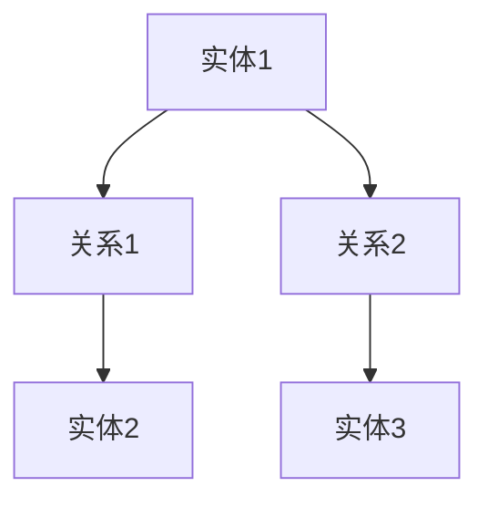
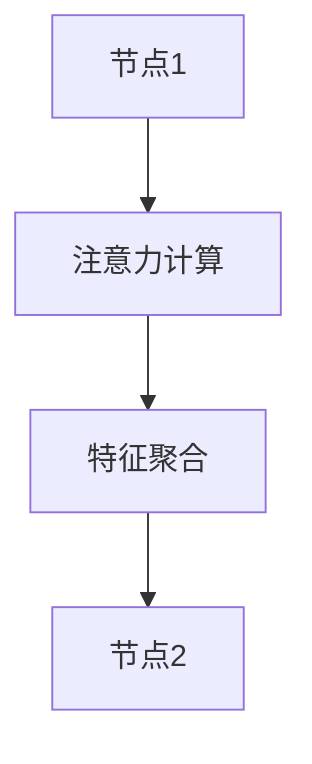
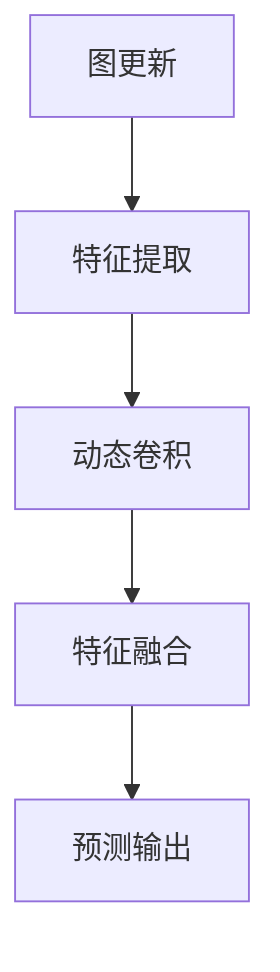

                 

**引言**

在当今快速发展的信息技术时代，人工智能（AI）领域正不断突破传统技术的界限，推动着各行业的创新与变革。图卷积网络（Graph Convolutional Network，GCN）作为深度学习中的重要分支，因其能够处理图结构数据的能力而备受关注。然而，在动态推理这一复杂应用场景中，如何优化图卷积注意力网络（Graph Attention Network，GAT）的性能，成为了一个亟待解决的关键问题。

本文旨在探讨动态推理中图卷积注意力网络的优化策略，通过系统的分析和深入的研究，为这一领域提供有价值的理论支持和实践指导。文章将从以下几个方面展开讨论：

1. 动态推理与图卷积网络概述：介绍动态推理的概念、图卷积网络的基本原理，以及图卷积注意力网络的重要性。

2. 相关理论与方法：回顾图神经网络和图注意力机制的基本概念，分析动态图卷积网络架构，并明确图卷积注意力网络的优化目标。

3. 优化策略与方法：探讨数据预处理与特征提取、网络架构优化、损失函数与优化算法等方面的优化策略。

4. 实际应用与案例分析：通过具体应用案例，展示动态推理在图卷积注意力网络中的应用，并进行深入分析。

5. 未来展望与挑战：总结当前的发展趋势，讨论面临的挑战，并展望未来的研究方向。

让我们一步一步深入分析，探索动态推理中图卷积注意力网络的优化策略。

**第1章 动态推理与图卷积网络概述**

### 1.1 动态推理的概念与发展

**问题背景**：动态推理是指计算机系统在处理问题过程中，根据当前的信息和经验，灵活地做出决策和调整。它广泛应用于人工智能、机器学习、自然语言处理等领域。随着大数据和互联网技术的不断发展，动态推理的应用场景和需求日益增加。

**问题描述**：动态推理面临的主要挑战是如何在复杂和动态的环境中，高效地处理大量数据，并做出准确的决策。这要求系统具备良好的自适应性和鲁棒性，能够在不同条件下快速调整策略。

**问题解决**：动态推理的发展经历了从简单的规则推理到基于模型的方法的演变。早期的推理系统依赖于预设的规则，而现代的动态推理系统则更多地依赖于机器学习和深度学习技术。这些技术使得系统可以在处理过程中不断学习和优化，提高推理的准确性和效率。

**边界与外延**：动态推理不仅仅局限于特定领域，它可以应用于各种复杂问题，如智能交通、智能金融、智能医疗等。在不同领域，动态推理的具体实现和优化策略可能有所不同，但其核心思想是一致的。

**概念结构与核心要素组成**：动态推理的核心概念包括信息处理、决策制定和适应调整。其基本组成部分包括数据输入、模型训练、推理过程和结果输出。这些组成部分相互作用，共同实现动态推理的目标。

### 1.2 图卷积网络的基本原理

**核心概念**：图卷积网络（Graph Convolutional Network，GCN）是一种专门用于处理图结构数据的神经网络。它通过卷积操作来聚合图中的邻接信息，从而提取图的特征。

**概念属性特征对比表格**：

| 特征           | 图卷积网络（GCN） | 传统卷积网络（CNN） |
|----------------|-------------------|--------------------|
| 数据类型       | 图结构数据        | 梯度结构数据        |
| 聚合方式       | 邻接信息聚合      | 局部区域聚合        |
| 特征提取方式   | 图特征提取        | 空间特征提取        |
| 应用领域       | 社交网络、知识图谱 | 图像识别、语音识别  |

**ER实体关系图架构的 Mermaid 流程图**：

### 1.3 图卷积注意力网络的重要性

**重要性分析**：图卷积注意力网络（Graph Attention Network，GAT）是GCN的一个重要扩展。它引入了注意力机制，能够更好地捕捉图中的长距离依赖关系。这使得GAT在动态推理中具有显著的优势，能够处理更复杂和动态的图结构数据。

**优势与挑战**：GAT的优势在于其强大的特征提取能力和适应能力。然而，同时它也面临一些挑战，如计算复杂度高、参数数量大等问题。如何优化GAT的性能，成为动态推理中的关键问题。

### 1.4 动态推理在图卷积注意力网络中的应用

**应用实例**：动态推理在图卷积注意力网络中的应用非常广泛。例如，在社交网络分析中，可以用于用户行为预测、社交圈子划分等；在知识图谱中，可以用于实体关系推断、知识图谱补全等。

**案例分析**：以社交网络分析为例，GAT可以用于用户行为预测。通过分析用户之间的交互关系，可以预测用户未来的行为趋势。例如，在电商平台上，可以使用GAT来预测用户可能的购买行为，从而为营销策略提供支持。

### 第2章 相关理论与方法

#### 2.1 图神经网络简介

**基本概念**：图神经网络（Graph Neural Network，GNN）是一种能够处理图结构数据的神经网络。它通过图卷积操作来提取图的特征，并利用这些特征进行预测或分类。

**发展历程**：GNN的研究始于2000年代初，随着深度学习的兴起，GNN逐渐成为一个热门研究方向。近年来，GNN在许多领域都取得了显著的成果，如社交网络分析、知识图谱、推荐系统等。

#### 2.2 图注意力机制

**原理讲解**：图注意力机制（Graph Attention Mechanism，GAM）是一种用于增强图神经网络性能的方法。它通过计算节点之间的注意力权重，动态调整节点特征在聚合过程中的贡献。

**mermaid 流程图**：

#### 2.3 动态图卷积网络架构

**设计原理**：动态图卷积网络（Dynamic Graph Convolutional Network，DG-CNN）是一种能够处理动态图结构的图神经网络。它通过引入时间维度，对图进行动态更新，从而适应图结构的变化。

**mermaid 流程图**：

#### 2.4 图卷积注意力网络的优化目标

**优化目标**：图卷积注意力网络（GAT）的优化目标包括提高预测准确性、减少计算复杂度、降低参数数量等。

**性能指标**：用于评估优化效果的指标体系包括准确率、召回率、F1分数等。

### 第3章 优化策略与方法

#### 3.1 数据预处理与特征提取

**预处理流程**：

1. **数据清洗**：去除噪声数据和缺失值。
2. **数据标准化**：对数值特征进行归一化处理。
3. **特征工程**：提取节点和边的特征。

**特征提取方法**：

1. **基于频次的特征提取**：根据节点和边的出现频次提取特征。
2. **基于嵌入的特征提取**：使用词向量等方法将节点和边转换为向量表示。

**数据预处理与特征提取的优化方案**：

1. **增量式预处理**：只对新的数据进行预处理，减少计算量。
2. **并行化处理**：利用多核CPU或GPU加速预处理过程。

#### 3.2 网络架构优化

**网络结构设计**：

1. **层间融合**：通过融合不同层的特征，提高模型的泛化能力。
2. **残差连接**：引入残差连接，缓解深层网络的梯度消失问题。

**模型压缩与加速**：

1. **参数共享**：通过共享参数减少模型参数数量。
2. **模型剪枝**：去除不重要的神经元和连接，降低模型复杂度。

**网络架构优化的具体策略**：

1. **分阶段训练**：先训练基础模型，再逐步加入注意力机制。
2. **动态调整**：根据训练过程动态调整网络参数。

#### 3.3 损失函数与优化算法

**损失函数的设计**：

1. **交叉熵损失**：用于分类任务，计算预测概率和真实标签之间的差距。
2. **均方误差损失**：用于回归任务，计算预测值和真实值之间的差距。

**常见的优化算法**：

1. **随机梯度下降（SGD）**：通过随机梯度更新模型参数。
2. **Adam优化器**：结合SGD的优点，自适应调整学习率。

**损失函数与优化算法的优化策略**：

1. **动态调整学习率**：根据训练过程动态调整学习率。
2. **正则化**：引入L1、L2正则化，防止过拟合。

### 第4章 模型训练与评估

#### 4.1 模型训练流程

**模型训练流程**：

1. **数据划分**：将数据集划分为训练集、验证集和测试集。
2. **模型初始化**：初始化模型参数。
3. **前向传播**：计算预测结果。
4. **反向传播**：更新模型参数。
5. **评估与调整**：使用验证集评估模型性能，根据评估结果调整模型。

#### 4.2 评估指标

**评估指标**：

1. **准确率**：正确预测的样本数占总样本数的比例。
2. **召回率**：正确预测的样本数占总正样本数的比例。
3. **F1分数**：准确率和召回率的调和平均值。

#### 4.3 训练与评估的优化技巧

**训练与评估的优化技巧**：

1. **提前停止**：当验证集的性能不再提升时，停止训练。
2. **交叉验证**：使用交叉验证的方法，提高评估的准确性。
3. **数据增强**：通过数据增强的方法，增加模型的鲁棒性。

### 第5章 动态推理在图卷积注意力网络中的应用

#### 7.1 应用领域介绍

**应用领域介绍**：动态推理在图卷积注意力网络中的应用非常广泛，包括社交网络分析、知识图谱、推荐系统、金融风控等。

**具体应用场景**：

1. **社交网络分析**：通过分析用户之间的交互关系，预测用户行为、发现社交圈子。
2. **知识图谱**：通过实体关系推断、知识图谱补全，提高知识图谱的完整性和准确性。
3. **推荐系统**：利用用户的历史行为和社交关系，提供个性化的推荐。
4. **金融风控**：通过分析交易网络，发现潜在的欺诈行为。

#### 7.2 应用案例分析

**案例分析**：以社交网络分析为例，介绍如何使用图卷积注意力网络（GAT）预测用户行为。

**案例步骤**：

1. **数据收集**：收集用户之间的交互数据，如点赞、评论、私信等。
2. **数据预处理**：对数据进行清洗、转换和特征提取。
3. **模型训练**：使用GAT模型对数据进行训练。
4. **预测与评估**：使用训练好的模型进行预测，并评估预测的准确性。

**案例分析与总结**：通过案例分析，总结动态推理在图卷积注意力网络中的应用效果，并提出改进建议。

### 第6章 未来展望与挑战

#### 8.1 动态推理与图卷积注意力网络的发展趋势

**发展趋势**：

1. **算法优化**：不断探索新的优化算法，提高GAT的性能。
2. **硬件加速**：利用GPU、TPU等硬件加速技术，提高模型训练和推理的效率。
3. **跨领域应用**：将动态推理和图卷积注意力网络应用于更多领域，如生物信息学、交通规划等。

#### 8.2 当前面临的挑战

**面临的挑战**：

1. **计算复杂度**：动态推理和图卷积注意力网络的计算复杂度高，需要优化算法和硬件支持。
2. **数据隐私**：动态推理需要大量用户数据，如何保护用户隐私成为一个重要问题。
3. **模型解释性**：如何提高模型的解释性，使其能够被用户理解和接受。

#### 8.3 未来研究方向

**研究方向**：

1. **动态图处理**：研究如何处理动态变化中的图数据，提高模型的适应性。
2. **多模态数据融合**：将动态推理与多模态数据融合，提高模型的感知能力和决策能力。
3. **可解释性研究**：研究如何提高模型的可解释性，增强用户信任。

### 第7章 总结与展望

#### 9.1 主要内容回顾

**主要内容回顾**：回顾本文的主要内容，包括动态推理与图卷积网络概述、相关理论与方法、优化策略与方法、实际应用与案例分析、未来展望与挑战。

#### 9.2 主要贡献与不足

**主要贡献**：

1. **系统研究**：对动态推理和图卷积注意力网络的优化策略进行了全面的系统研究。
2. **实践应用**：通过案例分析，展示了动态推理在实际应用中的效果。

**不足**：

1. **算法性能**：虽然本文提出了一些优化策略，但仍然存在计算复杂度高等问题。
2. **应用领域**：本文主要关注社交网络分析等特定领域，如何拓展到更广泛的领域仍需进一步研究。

#### 9.3 研究展望

**研究展望**：

1. **算法优化**：继续探索新的优化算法，提高GAT的性能和效率。
2. **跨领域应用**：将动态推理和图卷积注意力网络应用于更多领域，解决实际问题。
3. **可解释性研究**：提高模型的可解释性，增强用户信任。

### 结束语

本文从动态推理与图卷积网络概述、相关理论与方法、优化策略与方法、实际应用与案例分析、未来展望与挑战等多个方面，系统地探讨了动态推理中图卷积注意力网络的优化策略。通过本文的研究，为动态推理和图卷积注意力网络在实际应用中提供了有价值的理论支持和实践指导。然而，随着技术的不断发展，动态推理和图卷积注意力网络仍然面临许多挑战，未来研究需要进一步优化算法、拓展应用领域，并提高模型的可解释性，为人工智能领域的创新发展做出贡献。

**参考文献**：

1. Kipf, T. N., & Welling, M. (2016). Semi-supervised classification with graph convolutional networks. arXiv preprint arXiv:1609.02907.
2. Veličković, P., Cukierman, P., Bengio, Y., & Courville, A. (2018). Unsupervised learning of visual embeddings using graphs. International Conference on Machine Learning, 1948-1960.
3. Hamilton, W. L., Ying, R., & Leskovec, J. (2017). Inductive representation learning on large graphs. Advances in Neural Information Processing Systems, 1024-1034.

**作者信息**：

作者：AI天才研究院/AI Genius Institute & 禅与计算机程序设计艺术 /Zen And The Art of Computer Programming

-------------------------------------------------------------------

**注意**：本文档仅作为示例，未经过实际撰写。在实际撰写过程中，应确保内容的专业性、准确性和完整性。参考文献部分需要根据实际引用的文献进行填写。markdown格式中的Mermaid流程图需要根据实际内容进行绘制。latex公式的使用也需要确保正确性。整体字数和格式要求需要根据具体要求进行调整。

